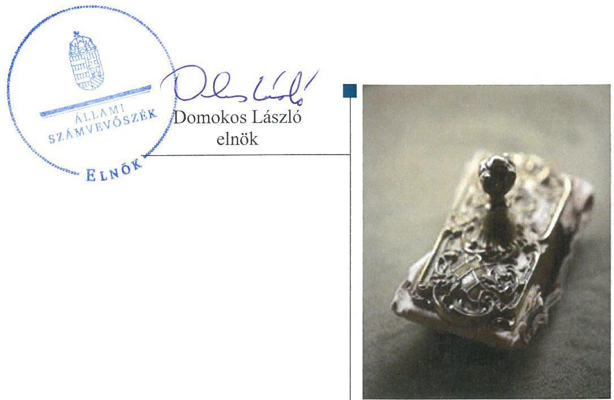

ÁLLAMI
SZÁMVEVŐSZÉK

# Jelentés

## Központi költségvetési szervek ellenőrzése

Szent István Mezőgazdasági és Élelmiszeripari Szakgimnázium és Szakközépiskola

2020.

20001
www.asz.hu

---

# Jelentés 

## Központi költségvetési szervek ellenőrzése

Szent István Mezőgazdasági és Élelmiszeripari Szakgimnázium és Szakközépiskola
2020. 04. hó 28. nap

---

# AZ ELLENŐRZÉST FELÜGYELTE:

## MAROZSÁN LÁSZLÓNÉ felügyeleti vezető

## AZ ELLENŐRZÉST VEZETTE ÉS A VÉGREHAJTÁSÁÉRT FELELŐS:

### ASZTALOSNÉ ZUPCSÁN ERIKA MÁRIA ellenőrzésvezető

### GÖRGÉNYI GÁBOR ellenőrzésvezető

### A PROGRAM ÖSSZEÁLLÍTÁSÁÉRT FELELŐS:

### TÓTPÁL SZABOLCS osztályvezető

IKTATÓSZÁM: EL-2335-001/2019.

|  Jelentéseink az Országgyűlés számítógépes hálózatán és az Interneten a www.asz.hu címen is olvashatóak. | TÉMASZÁM: 2450  |
| --- | --- |
|   | ELLENŐRZÉS-AZONOSÍTÓ SZÁM: V079173  |

---

# TARTALOMJEGYZÉK 

■ ÖSSZEGZÉS ..... 5
■ AZ ELLENŐRZÉS CÉLJA ..... 6
■ AZ ELLENŐRZÉS TERÜLETE ..... 7
■ AZ ELLENŐRZÉS HÁTTERE, INDOKOLTSÁGA ..... 8
■ A JELENTÉS LÉNYEGES KÉRDÉSKÖREI ..... 10
■ AZ ELLENŐRZÉS HATÓKÖRE ÉS MÓDSZEREI ..... 11
■ MEGÁLLAPÍTÁSOK ..... 14
■ JAVASLATOK ..... 18
■ MELLÉKLETEK ..... 21
I. sz. melléklet: Értelmező szótár ..... 21
■ FÜGGELÉKEK ..... 25
I. sz. függelék a jelentéshez ..... 25
II. sz. függelék: Észrevételek ..... 26
■ RÖVIDÍTÉSEK JEGYZÉKE ..... 29

---

.

---

# ÖSSZEGZÉS 

A Szent István Mezőgazdasági és Élelmiszeripari Szakgimnázium és Szakközépiskola működésének szabályozottsága, pénzügyi és vagyongazdálkodása nem felelt meg a jogszabályi előírásoknak. Nem volt biztosított a felelős gazdálkodás, a szabályszerű közpénzfelhasználás és a nemzeti vagyonnal történő átlátható, elszámoltatható gazdálkodás. A korrupcióval szembeni védettség nem volt arányos a kockázatokkal.

## Az ellenőrzés társadalmi indokoltsága

Magyarország versenyképességének és a magyar gazdaság fejlődésének alapvető feltétele a magyar munkavállalók megfelelő szakmai képzettsége és felkészültsége, amelyben a szakképzési rendszernek döntő szerepe van. A mezőgazdaság vonatkozásában is kiemelten fontos ez, hiszen a magyar mezőgazdaság piaci versenyképességét és eredményességét nagymértékben befolyásolja az agrárszférában dolgozók képzettsége, felkészültsége. A szakképzés legjelentősebb színterei a szakképző iskolák. Az eredményes és célszerű szakképzés alapja és alapvető feltétele a szakképző intézmények közpénzekkel és a közvagyonnal való törvényes, átlátható és a korrupcióval szembeni védelmet biztosító működése és gazdálkodása. Ezért ezen szervezetekkel szemben is alapvető társadalmi igény, hogy a rájuk bízott közpénzekkel, közvagyonnal szabályosan gazdálkodjanak. Emellett a szakképzésben részt vevő pedagógusok, tanulók és a szülők jogos elvárása, hogy a szakképző iskolák működése átlátható és elszámoltatható legyen. Mindezen igényekkel összhangban, a közpénzügyek átláthatóságának előmozdítása, a közvagyon védelme érdekében került sor az agrárszakképző iskolák belső kontrollrendszerének és gazdálkodásának ellenőrzésére.

## Főbb megállapítások, következtetések, javaslatok

A Szent István Mezőgazdasági és Élelmiszeripari Szakgimnázium és Szakközépiskola belső kontrollrendszerének kialakítása és működtetése nem volt szabályszerű. Az igazgató nem készített a vagyonnyilatkozat-tételi kötelezettséghez kapcsolódó szabályozást, ezáltal nem tette meg a legalapvetőbb intézkedést sem a korrupció megelőzése érdekében. Az integrált kockázatkezelési rendszert nem működtette, a kontrolltevékenységek gyakorlása nem volt szabályszerű. Az igazgató nem gondoskodott a belső ellenőrzés szabályszerű működtetéséről sem. A feltárt hiányosságok miatt a belső kontrollrendszer nem biztosította a szabályszerű működés és gazdálkodás kereteit. A teljesítmény mérésére alkalmas követelményeket nem alakítottak ki.

A pénzügyi gazdálkodás nem volt szabályszerű, mert a Szent István Mezőgazdasági és Élelmiszeripari Szakgimnázium és Szakközépiskola nem vezetett a kötelezettségvállalásokról és más fizetési kötelezettségekről a jogszabály által előírt tartalmú nyilvántartást.

A vagyongazdálkodás nem volt szabályszerű, a Szent István Mezőgazdasági és Élelmiszeripari Szakgimnázium és Szakközépiskola a mérleg tételeit leltár nem támasztotta alá, a bizonylati fegyelem követelményét nem tartották be.

A korrupció elleni védelmet biztosító kontrollokat nem a kockázatokkal arányosan építették ki.
Az Állami Számvevőszék a Szent István Mezőgazdasági és Élelmiszeripari Szakgimnázium és Szakközépiskola igazgatójának 13 javaslatot fogalmazott meg.

---

# AZ ELLENŐRZÉS CÉLJA 

AZ ELLENŐRZÉS CÉLJA annak megítélése volt, hogy az ellenőrzött intézményre vonatkozó irányító szervi feladatellátás a jogszabályi előírások betartásával történt-e; az intézménynél a belső kontrollrendszer kialakítása és működtetése szabályszerű volt-e, biztosította-e az átlátható, szabályszerű, gazdaságos, hatékony és eredményes gazdálkodás feltételeit; az intézmény pénzügyi és vagyongazdálkodása megfelelt-e a jogszabályi előírásoknak és belső szabályzatainak. Az ellenőrzés keretében az ÁSZ ${ }^{1}$ értékelte az intézmény korrupciós kockázatainak kezelését szolgáló integritás kontrollok kiépítettségét és az integritás szemlélet érvényesülését. Az ÁSZ értékelte, hogy az intézménynél megteremtették-e a teljesítményellenőrzés feltételeit. Értékelte továbbá, hogy érvényesült-e a nemzeti vagyon kezelésének és védelmének célja, azaz a szervezet vagyona a közérdeket szolgálta, a közös szükségletek kielégítése és a természeti erőforrások megóvása, valamint a jövő nemzedékek szükségleteinek figyelembevétele mellett.

---

# AZ ELLENŐRZÉS TERÜLETE

## Szent István Mezőgazdasági és Élelmiszeripari Szakgimnázium és Szakközépiskola

A székesfehérvári székhelyű Szent István Mezőgazdasági és Élelmiszeripari Szakgimnázium és Szakközépiskola alaptevékenysége szerint gimnáziumi, szakgimnáziumi és szakközépiskolai nevelés-oktatást végzett. A szakközépiskolai nevelés-oktatást esetében mezőgazdasági, élelmiszeripari, környezetvédelmi és gépészeti szakmacsoport szerinti képzések keretében biztosított szakképzési lehetőséget.

Az irányító szervi feladatokat 2016. január 1. és 2017. december 31. között az intézmény2, mint köznevelési intézmény fenntartója3, a Földművelésügyi Minisztérium látta el. A minisztérium 2013. augusztus 1. óta gyakorolja az intézmény felett a fenntartói feladatokat.

Az intézmény önálló jogi személyiségű, gazdasági szervezettel rendelkező költségvetési szerv, amely több más, gazdasági szervezettel nem rendelkező köznevelési intézmény gazdálkodási feladatait is ellátja.

Az intézménynél az ellenőrzött időszakban az Áht.4 és az Nktv.5 szerinti átalakításra, átszervezésre nem került sor.

Az intézmény feladatellátását önkormányzati és állami tulajdonú ingatlanok biztosították, amely az iskola és a tanüzemek épületéből, továbbá mezőgazdasági földterületekből és gazdasági épületből állt.

Az intézmény által készített beszámolók szerint az intézmény teljesített összes bevétele a 2016. december 31-ei 633,6 M Ft-ról 2017. év végére 3,5%-kal, 655,9 M Ft-ra nőtt, ebből a finanszírozási bevételek nagysága 494,7 M Ft és 486,5 M Ft volt. A teljesített összes kiadás a 2016. december 31-ei 616,5 M Ft-ról 2017-re 0,5%-kal, 619,8 M Ft-ra nőtt.

Az intézmény munkavállalóinak átlagos statisztikai állományi létszáma 2016-ban és 2017-ben is 100 fő volt. A munkáltatói jogokat az igazgató6 gyakorolta. Az igazgató és a gazdasági vezető személye az ellenőrzött időszakban nem változott.

---

# AZ ELLENŐRZÉS HÁTTERE, INDOKOLTSÁGA 

Az államháztartás központi alrendszerének közpénz felhasználása, az intézmények által ellátott közfeladatok sokrétűsége, valamint a feladatellátásához rendelt vagyon nagyságrendje indokolja, hogy az ÁSZ ellenőrzéseket folytasson a pénzügyi és vagyongazdálkodás területén.

Az államháztartás központi alrendszerébe tartozó szervezet vagyona a nemzeti vagyon része és az Alaptörvény ${ }^{7}$ is rögzíti, hogy a vagyonnal való gazdálkodás célja a közérdek szolgálata. Az ÁSZ ellenőrzi az éves költségvetési törvény végrehajtását, az ellenőrzés során feltárt kockázatok és a terület folyamatos kockázatelemzésével beazonosított kockázatok kezelése érdekében ráépülő ellenőrzésekkel ellenőrzi a költségvetési szervek gazdálkodását, működését, hogy az ellenőrzések megállapításaival támogassa az ellenőrzött szervezetek szabályszerű gazdálkodását, javaslataival elősegítse az Alaptörvényben megfogalmazott alapvetések érvényesülését a mindennapi életben a szervezetek szintjén. A központi költségvetés rendszerében zajló folyamatok holisztikus elemzései, a kockázatok folyamatos figyelemmel kísérésének módszerével, az így kiválasztott szervezetek célzott, hatékony ellenőrzéseivel az ÁSZ betölti a legfőbb gazdasági ellenőrző szerv küldetését.

A belső kontrollrendszer kialakítása és működtetése nélkül nem valósítható meg a közpénzek, a közvagyon átlátható, szabályos, gazdaságos, hatékony és eredményes felhasználása. A belső kontrollrendszer azt a célt szolgálja, hogy a költségvetési szervek működésük és gazdálkodásuk során a tevékenységeket szabályszerűen hajtsák végre, teljesítsék elszámolási kötelezettségeiket és megvédjék az erőforrásokat a veszteségektől, a károktól és a nem rendeltetésszerű használattól. A belső kontrollrendszer magában foglalja mindazon elveket, eljárásokat és belső szabályzatokat, melyek biztosítják, hogy a költségvetési szerv valamennyi tevékenysége és célja összhangban legyen a szabályszerűséggel, szabályozottsággal, valamint a gazdaságosság, hatékonyság és eredményesség követelményeivel, az eszközökkel és forrásokkal való gazdálkodásban ne kerüljön sor pazarlásra, visszaélésre, rendeltetésellenes felhasználásra. Megfelelő, pontos és naprakész információk álljanak rendelkezésre a költségvetési szerv működésével kapcsolatosan, és a belső kontrollrendszer harmonizációjára, összehangolására vonatkozó jogszabályok végrehajtásra kerüljenek. Az integritás kontrollok kiépítése, erősítése a szervezet korrupciós kockázatainak kezelését szolgálja. A teljesítménykövetelmények meghatározása és működtetése megalapozhatja az intézménynél a teljesítményellenőrzés lefolytatását.

Az egyes ellenőrzések megállapításaival és egy időszak ellenőrzési eredményeinek elemzésével az ÁSZ ráirányíthatja a jogalkotók figyelmét a központi alrendszerben vagy annak egy ágazatában esetlegesen felmerülő pénzügyi, szabályozási feszültségekre. Az elvégzett ellenőrzések során az ÁSZ „jó gyakorlatokat" is azonosíthat, melyeket tanácsadó funkciója keretében szélesebb körben is megismertethet az érintettekkel, ezáltal is hozzájárulva a költségvetési rendszer szabályozott, átlátható, kiegyensúlyozott és fenntartható működéséhez.

---

Az ellenőrzés a szervezet kockázatértékelése alapján, az egyedi és lényeges jellemzők figyelembevételével történt.

---

# A JELENTÉS LÉNYEGES KÉRDÉSKÖREI 

1.     - A fenntartó irányító szervi feladatellátása szabályszerű volt-e?
2.     - Az intézmény belső kontrollrendszerének kialakítása és működtetése biztosította-e a közpénzekkel és a nemzeti vagyonnal történő szabályszerű gazdálkodást?
3.     - Az intézmény pénzügyi gazdálkodása szabályszerű volt-e?
4.     - Az intézmény vagyongazdálkodása szabályszerű volt-e?

---

# AZ ELLENŐRZÉS HATÓKÖRE ÉS MÓDSZEREI 

## Az ellenőrzés típusa

Megfelelőségi ellenőrzés.

## Az ellenőrzött időszak

Az irányító szervi feladatellátás és az intézmény pénzügyi gazdálkodása esetében a 2016. év, az intézmény belső kontrollrendszere, valamint a vagyongazdálkodás tekintetében a 2016-2017. évek és az éves költségvetési beszámoló jóváhagyásáig tartó időszak (2018. június 30.), továbbá az integritás kontrollok vonatkozásában a 2017. év.

## Az ellenőrzés tárgya

Az intézményre vonatkozó irányító szervi feladatok ellátása. Az intézmény belső kontrollrendszerének kialakítása és működtetése. Az intézmény pénzügyi és vagyongazdálkodása. Az intézménynél az integritás kontrollok kiépítettsége, az integritás szemlélet érvényesülése, valamint a teljesítményellenőrzés feltételeinek rendelkezésre állása.

## Az ellenőrzött szervezet

A Szent István Mezőgazdasági és Élelmiszeripari Szakgimnázium és Szakközépiskola, valamint az irányító szervi feladatokat ellátó Agrárminisztérium (az ellenőrzött időszakban: Földművelésügyi Minisztérium)

## Az ellenőrzés jogalapja

Az ellenőrzés jogszabályi alapját az ÁSZ tv. ${ }^{8}$ 1. § (3) bekezdés, 5. § (2)-(3) bekezdései, a (4) bekezdés a) pontja és a (6) bekezdés, valamint az Áht. 61. § (2) bekezdésének előírásai képezték.

## Az ellenőrzés módszerei

Az ellenőrzésre a szakmai program szempontjai, az ellenőrzött időszakban hatályos jogszabályok, az ellenőrzés szakmai szabályai, a jelen ellenőrzésre irányadó ÁSZ módszertanok figyelembevételével került sor.

---

Az ellenőrzés ideje alatt az ellenőrzött szervezetekkel a kapcsolattartást az ÁSZ SZMSZ ${ }^{8}$-ének vonatkozó előírásai alapján biztosította az ÁSZ.

Az ellenőrzési kérdések megválaszolásához szükséges bizonyítékok megszerzése az ellenőrzött szervezetek által rendelkezésre bocsátott dokumentumokra, adatokra alapozva megfigyelés, szemle (szemrevételezés), kérdésfeltevés (információkérés), mintavételezés, valamint elemző eljárás útján történt. Az ellenőrzési bizonyítékként felhasználható adatforrások közé tartoztak egyrészt a szakmai program részletes szempontjainál felsorolt adatforrások, másrészt minden egyéb - az ellenőrzés folyamán feltárt, az ellenőrzés szempontjából információt tartalmazó - dokumentum.

Az ellenőrzés lefolytatásához az ellenőrzött szervezetek a tanúsítványok kitöltésével, valamint az ÁSZ által kért dokumentumok megküldésével szolgáltattak adatokat, amelyek valódiságát és teljes körűségét az ellenőrzött szervezet vezetője által tett teljességi és hitelességi nyilatkozat igazolta. Az így rendelkezésre bocsátott adatok, információk kontrollja az ellenőrzés keretében történt.

Az intézmény belső kontrollrendszere egyes pilléreinek kialakítására és működtetésére vonatkozó értékelés:
$\longrightarrow$ „szabályszerű", amennyiben az értékelt területen az elért „igen" válaszok százalékban kifejezett, egész számra

 kerekített aránya legalább 85%,
$\longrightarrow$ „nem szabályszerű", ha nem érte el a 85%-ot,
Az intézmény belső kontrollrendszerének összesített értékelése az egyes részterületek esetében kapott megfelelőségi arányok számtani átlaga alapján történt és megegyezett a pillérenként (kontrollterületenként) alkalmazott százalékos értékelésekkel, a következő eltérésekkel: a kontrollrendszer egésze esetében a „szabályszerű" értékelésnek a százalékos értéken felül további feltétele volt, hogy egyik kontrollterület sem kaphatott „nem szabályszerű" értékelést.

Az ÁSZ statisztikai módszereken alapuló mintavételt alkalmazott.
A kiadások ellenőrzésére a 2017. év vonatkozásában került sor. A kiadások (külső személyi juttatások, felhalmozási kiadások, dologi kiadások) esetében az ellenőrzés azokra a legnagyobb értékű tételekre - a lényeges sokaságra - terjedt ki, melyek összértéke eléri a teljes sokaság összértékének 50%-át.

A 2017. évi kiadások elszámolásának szabályszerűségét a lényeges sokaságból véletlen mintavételi eljárással kiválasztott tételek alapján ellenőrizte az ÁSZ.

A 2017. évi beruházások, felújítások végrehajtásának, valamint a feladatellátást szolgáló állami vagyontárgyak használatának és év végi értékelésének szabályszerűségét a teljes sokaságból véletlen mintavétellel kiválasztott tételek alapján ellenőrizte az ÁSZ.

A mintavétellel ellenőrzött területek esetében minden egyes tétel vonatkozásában a felhasználás, elszámolás és értékelés szabályszerűségére vonatkozó kérdéseket tett fel az ÁSZ. Szabályszerűnek értékelt egy ellenőrzött területet az ÁSZ, amennyiben 95%-os bizonyossággal az ellenőrzött sokaságban az átlagos hibaarány legfeljebb 10%, nem szabályszerűnek, amennyiben 10%-nál magasabb arányt képviselt.

---

Abban az esetben, ha az ellenőrzött sokaság tekintetében a 10%-os hibaarányhoz való viszony megítélésének megbízhatósága nem érte el a 95%-ot, annak elérése érdekében az ÁSZ az értékelését további szempontokkal egészítette ki, és figyelembe vette a feltárt hibák értékét.

---

# MEGÁLLAPÍTÁSOK 

## 1. A fenntartó irányító szervi feladatellátása szabályszerű volt-e?

Összegző megállapítás A fenntartó irányító szervi feladatellátása szabályszerű volt.
Az egyéb irányítási jogkörök gyakorlása szabályszerű volt. A fenntartó az Áht.-ban, illetve az Ávr. ${ }^{10}$-ben előírtak szerint kiadta a tervezés során alkalmazandó általános és kötelezően érvényesítendő tervezési követelményeket, jóváhagyta az intézmény elemi költségvetését, meghatározta az előirányzat-maradványát, továbbá az Áhsz. ${ }^{11}$ előírásai szerint jóváhagyta az intézmény költségvetési beszámolóját. A fenntartó az igazgatót az éves feladatellátásról beszámoltatta.

## 2. Az intézmény belső kontrollrendszerének kialakítása és működtetése biztosította-e a közpénzekkel és a nemzeti vagyonnal történő szabályszerű gazdálkodást?

Összegző megállapítás Az intézmény belső kontrollrendszerének kialakítása és működtetése nem volt szabályszerű, nem biztosította a közpénzekkel és a nemzeti vagyonnal történő szabályszerű gazdálkodást.

A BELSŐ KONTROLLRENDSZER kialakítása és működtetése 2016-ban nem volt szabályszerű, mert az intézmény a Vnytv. ${ }^{12}$ 11. § (6), illetve 14. § (3) bekezdésében foglaltak ellenére nem rendelkezett a vagyonnyilatkozat-tételi kötelezettséghez kapcsolódó szabályozással.

A KONTROLLKÖRNYEZET kialakítása 2017-ben nem volt szabályszerű. Az intézménynél a Vnytv. 11. § (6), illetve 14. § (3) bekezdésében foglaltak ellenére nem állapították meg szabályzatban a vagyonnyilatkozat átadására, nyilvántartására, a vagyonnyilatkozatban foglalt személyes adatok védelmére, továbbá a meghallgatásra vonatkozó szabályokat.

Az intézmény rendelkezett SZMSZ ${ }^{13}$-szel, számviteli politikával ${ }^{14}$ és annak keretében elkészített számviteli szabályzatokkal, továbbá számlarenddel ${ }^{15}$, de a számlarend az Áhsz. 51. § (2) bekezdésében foglaltak ellenére nem tartalmazta minden alkalmazásra kijelölt számla számjelét és megnevezését, valamint az alátámasztó bizonylati rendet.

Az igazgató az Ávr. 13. § (2) bekezdés e) pontjában foglaltak ellenére nem rendezte belső szabályzatban a reprezentációs kiadások felosztását, azok teljesítésének és elszámolásának szabályait.

INTEGRÁLT KOCKÁZATKEZELÉSI RENDSZERT a Bkr. 7. § (1) bekezdésében foglaltak ellenére az igazgató nem működtetett

---

2017-ben, mert a Bkr. 7. § (2) bekezdésében foglaltak ellenére - a korrupciós kockázatok kivételével - nem mérték fel az intézmény tevékenységében rejlő és szervezeti célokkal összefüggő kockázatokat, továbbá nem határozták meg az egyes kockázatokkal kapcsolatban szükséges intézkedéseket, valamint azok teljesítésének folyamatos nyomon követésének módját.

A KONTROLLTEVÉKENYSÉGEK gyakorlása 2017-ben nem volt szabályszerű. Az Áht. 38. § (1) bekezdés előírásait megsértve nem történt meg a teljesítés igazolása.

# AZ INFORMÁCIÓS ÉS KOMMUNIKÁCIÓS RENDSZER működtetése 2017-ben nem volt szabályszerű, mert a Bkr. 9. § (1) bekezdésében foglaltak ellenére nem biztosította, hogy a megfelelő információk a megfelelő időben eljussanak az illetékes szervezethez, szervezeti egységhez, illetve személyhez: 

- Az intézmény a 2017. évi költségvetési beszámoló adatait, valamint az időközi költségvetési jelentéseket nem töltötte fel az Áhsz. 32. § (1) bekezdés, illetve az Ávr. 169. § (2) bekezdés szerinti határidőre a Kincstár által működtetett elektronikus adatszolgáltató rendszerbe. Az intézmény hiteles 2017. évi költségvetési beszámolóval nem rendelkezett, mert az Áhsz. 31. § (1) bekezdésében foglaltak ellenére nem készült az igazgató és a gazdasági vezető által aláírt 2017. évi költségvetési beszámoló.
- Az intézmény az Info tv. 37. § (1) bekezdésében, illetve annak 1. melléklet II.1. és III.1. pontjaiban foglaltak ellenére nem tette közzé az adatvédelmi és adatbiztonsági szabályzatát, a 2017. évi költségvetését és költségvetési beszámolóját.

A NYOMON KÖVETÉSI RENDSZER kialakítása 2017-ben szabályszerű volt, mely az operatív tevékenységek keretében megvalósuló folyamatos és eseti nyomon követésből állt. A monitoring tevékenység végrehajtását az ellenőrzési nyomvonalak ${ }^{16}$ és a munkaköri leírások támogatták.

A BELSŐ ELLENŐRZÉS működtetése 2017-ben nem volt szabályszerű. Az igazgató az Áht. 70. § (1) bekezdésében foglaltak ellenére nem gondoskodott a belső ellenőrzés kialakításáról és működtetéséről, mert az intézmény a Bkr. 15. § (5) bekezdésében foglaltak ellenére 2017. január 1. és 2017. július 30. között nem alkalmazott belső ellenőrt.

Az igazgató a Bkr. 14. § (1) bekezdésében foglaltak ellenére nem vezetett nyilvántartást a külső ellenőrzések javaslatai alapján készült intézkedési tervek végrehajtásáról a Bkr. 47. § (2) bekezdése szerinti tartalommal.

A belső ellenőrzést 2017. augusztus 1-től ellátó személy által - az elvégzett belső ellenőrzésekről - vezetett nyilvántartás a Bkr. 50. § (2) bekezdés a), b), d) és f) pontjaiban foglaltak ellenére nem tartalmazta az ellenőrzés azonosítóját; az ellenőrzött szervezeti egységek megnevezését; az ellenőrzés kezdetének és lezárásának időpontját; valamint a vizsgált időszakot.

A BELSŐ KONTROLLRENDSZER MINŐSÉGÉT a Bkr. szerinti nyilatkozatban értékelte az igazgató, azonban a 2017. évi nyilatkozat a Bkr. 11. § (1) bekezdésében, illetve a Bkr. 1. mellékletében foglaltak

---

ellenére nem tartalmazta a szervezeti kultúra kialakítását és azt, hogy az integrált kockázatkezelési rendszerre vonatkozó jogszabályi előírásoknak az igazgató miként tett eleget. Az igazgató a 2017. évi nyilatkozatot a Bkr. 11. § (2) bekezdésében foglaltak ellenére az irányító szervnek nem küldte meg. Az igazgató nyilatkozataiban foglaltakat nem igazolták vissza az ÁSZ által az intézmény belső kontrollrendszerének 2017. évi működéséről tett megállapítások.

AZ INTEGRITÁS KONTROLLRENDSZER kiépítettségének szintje, a kockázatelemzési, kockázatkezelési tevékenység hiánya miatt a 2017. évben nem volt megfelelő. A jogszabályok által nem kötelezően előírt, egyéb integritást erősítő kontrollokat az intézmény csak alacsony szinten működtette.

A TELJESÍTMÉNY MÉRÉSÉRE alkalmas követelményeket az intézménynél nem alakítottak ki 2017-ben, mert az igazgató a Bkr. 6. § (2) bekezdésében foglaltak ellenére nem adott ki olyan szabályzatokat, amelyek biztosítják a rendelkezésre álló források gazdaságos, hatékony és eredményes felhasználását.

# 3. Az intézmény pénzügyi gazdálkodása szabályszerű volt-e? 

## Összegző megállapítás

Az intézmény 2016. évi pénzügyi gazdálkodása nem volt szabályszerű.

Az intézmény az Áhsz. 39. § (3) bekezdésben előírtak ellenére a kötelezettségvállalásokról, más fizetési kötelezettségekről nem vezetett részletező nyilvántartást az Áhsz. 14. mellékletének II. 4. pontja szerinti tartalommal, ezáltal nem biztosította a pénzügyi gazdálkodás szabályszerűségét.

## 4. Az intézmény vagyongazdálkodása szabályszerű volt-e?

## Összegző megállapítás Az intézmény vagyongazdálkodása nem volt szabályszerű.

A MÉRLEG TÉTELEINEK alátámasztásához az Áhsz. 5. § (1) és 22. § (1) bekezdéseiben, valamint a Számv. tv. ${ }^{17}$ 69. § (1) bekezdésében foglaltak ellenére az intézmény nem állított össze leltárt.

A NEMZETI VAGYON VÉDELMÉT nem biztosították az intézménynél, mert a Számv. tv. 165. § (1) bekezdésében foglaltak ellenére a vagyonkezelésbe vett vagyonelemek nyilvántartásba vételéhez és bekerülési értékének elszámolásához, alátámasztásához nem állítottak ki bizonylatot, továbbá a Számv. tv. 165. § (2) bekezdésében foglaltak ellenére bizonylat nélkül rögzítették a könyvviteli nyilvántartásba az adatot.

A NEMZETI VAGYON VÁLTOZÁSÁT eredményező döntések végrehajtása nem volt szabályszerű, mert az Ávr. 50. § (1a) bekezdés előírása ellenére a beruházásokhoz, felújításokhoz kapcsolódóan a jogi sze-

---

méllyel kötött visszterhes szerződések nem tartalmazták, illetve a megrendelésekhez kapcsolódóan nem állt rendelkezésre a szervezet képviselőjének nyilatkozata arra vonatkozóan, hogy átlátható szervezetnek minősül.

---

# JAVASLATOK 

Az ÁSZ tv. 33. § (1) bekezdésében foglaltak értelmében az ellenőrzött szervezet vezetője köteles a jelentésben foglalt megállapításokhoz kapcsolódó intézkedési tervet összeállítani és azt a jelentés kézhezvételétől számított 30 napon belül az ÁSZ részére megküldeni. Amennyiben az ellenőrzött szervezet vezetője nem küldi meg határidőben az intézkedési tervet, vagy továbbra sem elfogadható intézkedési tervet küld, az Állami Számvevőszék elnöke az ÁSZ tv. 33. § (3) bekezdése a) és b) pontjaiban foglaltakat érvényesítheti.

## Szent István Mezőgazdasági és Élelmiszeripari Szakgimnázium és Szakközépiskola igazgatója részére

1. Intézkedjen a Vnytv. előírásainak megfelelően a vagyonnyilatkozat átadására, nyilvántartására, a vagyonnyilatkozatban foglalt személyes adatok védelmére, meghallgatásra vonatkozó szabályok megállapításáról.
(2. sz. megállapítás 2. bekezdés 2. mondata alapján)
2. Intézkedjen a Számv. tv. előírásainak megfelelő tartalmú számlarend elkészítéséről.
(2. sz. megállapítás 3. bekezdés 2. tagmondata alapján)
3. Intézkedjen az Ávr. előírása szerint a reprezentációs kiadások felosztása, azok teljesítésének és elszámolásának szabályairól rendelkező belső szabályzat elkészítéséről.
(2. sz. megállapítás 4. bekezdése alapján)
4. Intézkedjen Bkr. előírásának megfelelően az integrált kockázatkezelési rendszer működtetéséről.
(2. sz. megállapítás 5. bekezdése alapján)
5. Intézkedjen a jogszabályi előírások szerinti teljesítésigazolásról.
(2. sz. megállapítás 6. bekezdés 3. mondata alapján)
6. Intézkedjen az adatszolgáltatási kötelezettség Áhsz és Ávr. szerinti teljesítéséről.
(2. sz. megállapítás 7. bekezdés 1. francia bekezdés 1. mondata alapján)

---

7. Intézkedjen az éves költségvetési beszámoló Áhsz. szerinti elkészítéséről.
(2. sz. megállapítás 7. bekezdés 1. francia bekezdés 2. mondata alapján)
8. Gondoskodjon a Bkr. által előírt nyilvántartás vezetéséről
a) az elvégzett belső ellenőrzésekről és
b) a külső ellenőrzések javaslatai alapján készült intézkedési tervek végrehajtásáról.
(2. sz. megállapítás 10-11. bekezdései alapján)
9. Intézkedjen a Bkr. előírásainak megfelelően, a belső kontrollrendszer minőségének értékeléséről szóló Bkr. szerinti vezetői nyilatkozat irányítószerv részére történő megküldéséről.
(2. sz. megállapítás 12. bekezdés 2. mondata alapján)
10. Intézkedjen a kötelezettségvállalások, más fizetési kötelezettségek Áhsz. előírásainak megfelelő nyilvántartásáról.
(3. sz. megállapítás 1. bekezdése alapján)
11. Intézkedjen az éves költségvetési beszámoló mérlegtételeinek alátámasztásához a jogszabályi előírások szerinti leltár összeállításáról.
(4. sz. megállapítás 1. bekezdése alapján)
12. Gondoskodjon arról, hogy az Intézmény könyvviteli nyilvántartásába a Számv. tv. előírása szerint, a gazdasági eseményekről kiállított bizonylatok alapján jegyezzék be az adatokat.
(4. sz. megállapítás 2. bekezdése alapján)
13. Gondoskodjon arról, hogy
a) jogi személlyel kötött visszterhes szerződések esetén a szerződés az Ávr. előírásának megfelelően tartalmazza a szervezet képviselőjének nyilatkozatát arra vonatkozóan, hogy átlátható szervezetnek minősül
b) a megrendelésekhez kapcsolódóan rendelkezzenek a szervezet képviselőjének nyilatkozatával arra vonatkozóan, hogy átlátható szervezetnek minősül.
(4. sz. megállapítás 3. bekezdése alapján)

---

.

---

# MELLÉKLETEK 

- I. SZ. MELLÉKLET: ÉRTELMEZŐ SZÓTÁR
állami vagyon
állami vagyonnak minősül:
a) az állam tulajdonában
 lévő dolog, valamint a dolog módjára hasznosítható természeti erő,
b) az a) pont hatálya alá nem tartozó mindazon vagyon, amely vonatkozásában törvény az állam kizárólagos tulajdonjogát nevesíti,
c) az állam tulajdonában lévő tagsági jogviszonyt megtestesítő értékpapír, illetve az államot megillető egyéb társasági részesedés,
d) az államot megillető olyan immateriális, vagyoni értékkel rendelkező jogosultság, amelyet jogszabály vagyoni értékű jogként nevesít. (Forrás: Vtv. ${ }^{18} 1 . \S$ (2) bekezdése)
állami vagyon használója Az a természetes vagy jogi személy, jogi személyiséggel nem rendelkező szervezet, aki, vagy amely törvény vagy szerződés alapján, bármely jogcímen (bérlet, haszonbérlet, használat stb.) állami vagyont birtokol, használ, szedi annak hasznait, hasznosít, ide nem értve a haszonélvezőt, a vagyonkezelőt és a tulajdonosi jogok gyakorlóját. (Forrás: Vtvr. 1. § (7) bekezdés a) pontja)
állami vagyon hasznosítása Az állami vagyont az MNV Zrt. ${ }^{19}$ maga kezeli, vagy szerződés - így különösen bérlet, haszonbérlet, megbízás - alapján központi költségvetési szervnek, természetes vagy jogi személynek, vagy jogi személyiséggel nem rendelkező gazdálkodó szervezetnek hasznosításra átengedi.
(Forrás: Vtv. 23. § (1) bekezdése, hatályos 2012. január 1-jétől)
Az állami vagyonnal a tulajdonosi joggyakorló maga gazdálkodik, vagy szerződés - így különösen bérlet, haszonbérlet, megbízás - alapján hasznosításra átengedi, illetőleg vagyonkezelésbe, haszonélvezetbe adja. (Forrás: Vtv. 23. § (1) bekezdése, hatályos 2013. június 28-ától)
Az állami vagyont az MNV Zrt. maga kezeli, vagy szerződés - így különösen bérlet, haszonbérlet, megbízás - alapján központi költségvetési szervnek, természetes vagy jogi személynek, vagy jogi személyiséggel nem rendelkező gazdálkodó szervezetnek hasznosításra átengedi. Az állami vagyonra vonatkozóan az MNV Zrt. kizárólag az Nvtv. ${ }^{20}$-ben meghatározott személyekkel köthet vagyonkezelési szerződést. (Forrás: Vtv. 27. § (1) bekezdése, hatályos 2012. január 1-jétől)
belső ellenőrzés
belső kontrollrendszer
belső kontrollrendszer területei

Független, tárgyilagos bizonyosságot adó és tanácsadó tevékenység, amelynek célja, hogy az ellenőrzött szervezet működését fejlessze és eredményességét növelje, az ellenőrzött szervezet céljai elérése érdekében rendszerszemléletű megközelítéssel és módszeresen értékeli, illetve fejleszti az ellenőrzött szervezet irányítási és belső kontrollrendszerének hatékonyságát. (Forrás: Bkr. 2. § b) pontja)
A belső kontrollrendszer a kockázatok kezelése és tárgyilagos bizonyosság megszerzése érdekében kialakított folyamatrendszer, amely azt a célt szolgálja, hogy a működés és gazdálkodás során a tevékenységeket szabályszerűen, gazdaságosan, hatékonyan, eredményesen hajtsák végre, az elszámolási kötelezettségeket teljesítsék, megvédjék az erőforrásokat a veszteségektől, károktól és nem rendeltetésszerű használattól. (Forrás: Áht. 69. § (1) bekezdése)
A kontrollkörnyezet, a kockázatkezelési rendszer, a kontrolltevékenységek, az információs és kommunikációs rendszer, valamint a nyomon követési (monitoring) rendszer. (Forrás: Bkr. 3. §-a)

---

információs és kommunikációs rendszer
integritás
integrált kockázatkezelési rendszer
irányító szerv/felügyeleti szerv
kockázat
kockázatkezelési rendszer
kontrollkörnyezet
kontrolltevékenységek
közfeladat
maradvány
nyomon követési rendszer (monitoring)

A költségvetési szerv vezetője által kialakított és működtetett olyan rendszer, mely biztosítja, hogy a megfelelő információk a megfelelő időben eljutnak az illetékes szervezethez, szervezeti egységhez, illetve személyhez. (Forrás: Bkr. 9. § (1) bekezdés)
Az integritás - egyik gyakran használt jelentése szerint - az elvek, értékek, cselekvések, módszerek, intézkedések konzisztenciáját jelenti, vagyis olyan magatartásmódot, amely meghatározott értékeknek megfelel. Integritás-irányítási rendszer bevezetése a szervezetben a szervezethez rendelt közfeladatok integritás szempontú ellátását, az érték alapú működéssel (integritással) összefüggő szervezeti követelmények következetes érvényesítését jelenti. (Forrás: Nemzetgazdasági Minisztérium: Államháztartási Belső Kontroll Standardok és Gyakorlati Útmutató 1.6. Etikai értékek és integritás 46. oldal, 2017. szeptember)
Olyan folyamatalapú kockázatkezelési rendszer, amely a szervezet minden tevékenységére kiterjed, egységes módszertan és eljárások alkalmazásával, a szervezet célkitűzéseinek és értékeinek figyelembevételével biztosítja a szervezet kockázatainak teljes körű azonosítását, azok meghatározott kritériumok szerinti értékelését, valamint a kockázatok kezelésére vonatkozó intézkedési terv elkészítését és az abban foglaltak nyomon követését. (Forrás: Bkr. 2. § m) pontja, 2016. október 1-jétől)
A költségvetési szerv tekintetében az Áht.-ban meghatározott irányítási hatáskört gyakorló szerv. (Forrás: Áht. 1. § 9. pontja)
A kockázat annak a valószínűségét jelenti, hogy egy vagy több esemény vagy intézkedés nem kívánt módon befolyásolja a rendszer működését, céljainak megvalósulását. (Forrás: Javaslatok a korrupciós kockázatok kezelésére - Kockázatkezelési és ellenőrzési módszertan 35. oldal, ÁSZ)
Olyan irányítási eszközök és módszerek összessége, melynek elemei a szervezeti célok elérését veszélyeztető tényezők (kockázatok) azonosítása, elemzése, csoportosítása, nyomon követése, valamint szükség esetén a kockázati kitettség mérséklése. (Forrás: Bkr. 2. § m) pontja)
A költségvetési szerv vezetője által kialakított olyan elvek, eljárások, belső szabályzatok összessége, amelyben világos a szervezeti struktúra, a folyamatok átláthatók, egyértelműek a felelősségi, hatásköri viszonyok és feladatok, meghatározottak, ismertek és elfogadottak az etikai elvárások a szervezet minden szintjén, átlátható a humán-erőforrás-kezelés. (Forrás: Bkr. 6. § (1) bekezdés)
A költségvetési szerv vezetője által a szervezeten belül kialakított (kontroll) tevékenységek, melyek biztosítják a kockázatok kezelését, hozzájárulnak a szervezet céljainak eléréséhez és erősítik a szervezet integritását. (Forrás: Bkr. 8. § (1) bekezdés)
Jogszabályban meghatározott állami vagy önkormányzati feladat, amit az arra kötelezett közérdekből, a jogszabályban meghatározott követelményeknek és feltételeknek megfelelve végez, ideértve a lakosság közszolgáltatásokkal való ellátását, továbbá az állam nemzetközi szerződésekben vállalt kötelezettségeiből adódó közérdekű feladatokat, valamint e feladatok ellátásakor szükséges infrastruktúra biztosítását is. (Forrás: Nvtv. 3. § (1) bekezdés 7. pontja)
A költségvetési év során a bevételek és kiadások különbözete, amely az alaptevékenység bevételei és kiadásai tekintetében a költségvetési maradvány, a vállalkozási tevékenység bevételei és kiadásai tekintetében a vállalkozási maradvány. (Forrás: Áht. 1. § 17. pont)
A költségvetési szerv vezetője köteles kialakítani a szervezet tevékenységének a célok megvalósításának nyomon követését biztosító rendszert, amely az operatív tevékenységek keretében megvalósuló folyamatos és eseti nyomon követésből, valamint az operatív tevékenységektől függetlenül működő belső ellenőrzésből állhat. (Forrás: Bkr. 10. §)

---

vagyongazdálkodás

A nemzeti vagyongazdálkodás feladata a nemzeti vagyon rendeltetésének megfelelő, az állam, az önkormányzat mindenkori teherbíró képességéhez igazodó, elsődlegesen a közfeladatok ellátásához és a mindenkori társadalmi szükségletek kielégítéséhez szükséges, egységes elveken alapuló, átlátható, hatékony és költségtakarékos működtetése, értékének megőrzése, állagának védelme, értéknövelő használata, hasznosítása, gyarapítása, továbbá az állam vagy a helyi önkormányzat feladatának ellátása szempontjából feleslegessé váló vagyontárgyak elidegenítése. (Forrás: Nvtv. 7. § (2) bekezdése)

---

.

---

# FÜGGELÉKEK 

■ I. SZ. FÜGGELÉK A JELENTÉSHEZ

Az Állami Számvevőszék az ellenőrzések során feltárt tényekhez kapcsolódó további körülmények tisztázására eszközrendszerrel nem rendelkezik. Amennyiben az ellenőrzésen túlmutatóan indokoltnak látszik az ellenőrzés során feltárt körülmények további vizsgálata, az Állami Számvevőszék törvényi felhatalmazás alapján az ellenőrzés által feltárt körülményeket továbbítja a hatáskörrel rendelkező szervnek a szükséges intézkedések megtétele, eljárások lefolytatása érdekében.
$I / 1$.

A mérleg tételeinek alátámasztásához az Áhsz. 5. § (1) és 22. § (1) bekezdésében, valamint a Számv. tv. 69. § (1) bekezdésében foglaltak ellenére az intézmény nem állított össze leltárt:

- Az intézmény a 2016. évi költségvetési beszámoló mérlegében kimutatott eszközöket és forrásokat tételes leltárral nem támasztotta alá.
- Az intézmény a Kincstár adatszolgáltató rendszerébe feltöltött 2017. évi mérleg adatokat nem támasztotta alá tételes leltárral.

Leltárak hiányában nem igazolt, hogy a 2016. évi költségvetési beszámolóban és a 2017. évi mérlegben szereplő tételek a valóságban is megtalálhatóak, nem zárható ki, hogy az intézménynél vagyoni hátrány keletkezett.
$I / 2$.
A 2017. évi kiadási előirányzatok felhasználása során összesen 20,7 M Ft kifizetés esetén az Áht. 38. § (1) és az Ávr. 57. § (1), (3)-(4) bekezdés előírásait megsértve elmaradt a teljesítés igazolása, mert azt nem végezték el, vagy a teljesítést nem az arra jogosult, kijelöléssel rendelkező személy írta alá.

A gazdálkodási jogkör gyakorlására vonatkozó jogszabályi előírások megsértése miatt nem igazolt, hogy a kifizetések valós teljesítésekhez kapcsolódtak, továbbá az intézmény feladatellátását szolgálták, ezért nem zárható ki, hogy az intézménynél vagyoni hátrány keletkezett.
$I / 3$.
A Számv. tv. 165. § (1)-(2) bekezdésében foglaltak ellenére a vagyonkezelésbe vett vagyonelemek nyilvántartásba vételéhez és bekerülési értékének elszámolásához nem állítottak ki bizonylatot, és bizonylat nélkül rögzítették a könyvviteli nyilvántartásba az adatot. Az intézmény a feladatellátásához szükséges, vagyonkezelésbe vett ingatlanok és ingóságok használatához kapcsolódóan a nyilvántartásba vételt 208,5 M Ft értékben bizonylattal nem támasztotta alá.

Bizonylat hiányában nem igazolt, hogy a vagyonelemekben történő változás valós, megtörtént gazdasági eseményhez kapcsolódótt, ezért nem zárható ki, hogy az intézménynél vagyoni hátrány keletkezett.

A I/1-3. pont szerinti eset összes körülményeinek felderítésére az Ügyészség rendelkezik hatáskörrel.

---

A jelentéstervezetet a Számvevőszék 15 napos észrevételezésre megküldte az ellenőrzött szervezetek vezetőinek az ÁSZ tv. 29. § (1) bekezdése előírásának megfelelően.

A Szent István Mezőgazdasági és Élelmiszeripari Szakgimnázium és Szakközépiskola igazgatója a jelentéstervezet megállapításaira írásban észrevételt tett. Az Agrárminisztériumot vezető miniszter a jelentéstervezet megállapításaira nem tett észrevételt.
Az ÁSZ tv. 29. § (3) bekezdésével összhangban az Állami Számvevőszék a Függelékben feltünteti az ellenőrzés megállapításaival kapcsolatban tett, figyelembe nem vett észrevételeket, és megindokolja, hogy azokat miért nem fogadta el.

A „Központi költségvetési szervek ellenőrzése - Szent István Mezőgazdasági és Élelmiszeripari Szakgimnázium és Szakközépiskola" címmel készített számvevőszéki jelentéstervezet megállapításaival kapcsolatban a Szent István Mezőgazdasági és Élelmiszeripari Szakgimnázium és Szakközépiskola (továbbiakban: Intézmény) igazgatója által 2019. november 11-én kelt levélben tett észrevételek és azok kezelésének indokolása.

# 1. Az Intézmény 2017. évi beszámolója és az időközi költségvetési jelentések kapcsán tett észrevétel (Jelentéstervezet 2. megállapítás 7. bekezdés 1. franciabekezdés; igazgatónak címzett 6. és 7. javaslat) 

Az Intézmény igazgatója észrevételében kifejtette, hogy nem ért egyet a jelentéstervezet azon megállapításával, miszerint az Intézmény 2017. évi költségvetési beszámolóját, illetve az időközi költségvetési jelentéseit nem töltötte fel a Magyar Kincstár által működtetett rendszerbe. Leírta, hogy a fenti adatszolgáltatást teljesítették, amely a Kincstár által működtetett rendszerben bármikor megtekinthető. Az adatszolgáltatási határidők betartására nagy hangsúlyt fektettek, így nem keletkezett kapcsolódó bírságkötelezettségük sem. Az Intézmény Igazgatója vitatja azon megállapítást is, hogy az Intézménynél nem készült az igazgató és a gazdasági vezető által aláírt beszámoló.
Az Intézmény igazgatóját tájékoztattuk, hogy az Állami Számvevőszék adatbekérése során hiteles, aláírt 2017. évi költségvetési beszámoló átadását kérte, de a 2018. december 21-én kelt teljességi és hitelességi nyilatkozattal alátámasztott módon kizárólag aláírás nélküli, nem hiteles dokumentum került az ellenőrzéshez átadásra. Az Állami Számvevőszék az ellenőrzési megállapításait az ellenőrzési adatszolgáltatás során a részére törvényi határidőben rendelkezésre bocsátott hiteles dokumentumokra alapozva

[^0]
[^0]:    * 29. § (1) Az Állami Számvevőszék az ellenőrzési megállapításait megküldi az ellenőrzött szervezet vezetőjének vagy az általa megbízott személynek, és annak, akinek személyes felelősségét állapította meg.
    (2) Az ellenőrzött szervezet vezetője és a felelősként megjelölt személy az ellenőrzés megállapításaira tizenöt napon belül írásban észrevételt tehet.
    (3) Az Állami Számvevőszék az észrevételre a beérkezésétől számított harminc napon belül írásban válaszol. A figyelembe nem vett észrevételeket köteles a jelentésben feltüntetni, és megindokolni, hogy azokat miért nem fogadta el.

---

fogalmazza meg.
Tájékoztattuk továbbá, hogy az ellenőrzési adatbekérés során a 2017. évi költségvetési beszámoló és 2017. évi időközi költségvetési jelentések Magyar
 Államkincstár által működtetett rendszerbe történő feltöltésének bizonyítékaként általuk átadott képernyőképek a számvevőszéki megállapítást támasztják alá. A 2017. évi költségvetési beszámoló az államháztartás számviteléről szóló 4/2013. (I. 11.) Korm. rendelet (továbbiakban: Áhsz.) 32. § (1) bekezdését megsértve a 2018. február 28-i határidőn túl, 2018. március 5-én került feladásra a Magyar Államkincstár rendszerébe. A 2017. évi időközi költségvetési jelentések közül 6 db az államháztartásról szóló törvény végrehajtásáról szóló 368/2011. (XII. 31.) Korm. rendelet (továbbiakban Ávr.) 169. § (2) bekezdésében rögzített határidőn túl került feladásra a Magyar Államkincstár rendszerébe.
Fentiekre tekintettel az észrevételt nem fogadtuk el, a jelentéstervezet módosítása nem volt indokolt.
2. Az kötelezettségvállalások részletező nyilvántartásával kapcsolatban tett megállapításra érkezett észrevétel (Jelentéstervezet 3. megállapítás 1. bekezdés; igazgatónak címzett 10. javaslat)
Az Intézmény igazgatója észrevételében kifejtette, hogy nem ért egyet az Állami Számvevőszék azon megállapításával, hogy az Intézmény pénzügyi gazdálkodása és egyben kötelezettségvállalásokról vezetett nyilvántartása 2016. évben nem volt szabályszerű, mivel kötelezettségvállalásaikat az Eco-Stat programban vezették, amely az Áhsz. II.4. pontja szerint tartalmazta a kötelezettségvállalás megnevezését, sorszámát, keltét, a kötelezettségvállaló és a pénzügyi ellenjegyző aláírását.
Az Intézmény igazgatóját tájékoztattuk, hogy az adatszolgáltatás során beküldött 2016. évi kötelezettségvállalási nyilvántartás nem felelt meg az Áhsz. 14. melléklet II. 4. pontjában előírt tartalmi követelményeknek, mivel az a)-b) pontban előírtak közül nem tartalmazta a kötelezettségvállalást, más fizetési kötelezettséget tanúsító dokumentum megnevezését, keltét, a pénzügyi ellenjegyzésre vonatkozó adatokat, a c) pont előírásai ellenére nem tartalmazta a pénzügyi teljesítéshez szükséges adatokat, az e) pont előírása ellenére nem tartalmazta a kötelezettségvállalás, más fizetési kötelezettség évek szerinti megoszlását és a költségvetési évben a pénzügyi teljesítési határidőket dátum szerint, valamint a g) pontban előírtak közül nem tartalmazta a pénzügyi teljesítések dátumát. Fentiekre tekintettel az észrevételt nem fogadtuk el, a jelentéstervezet módosítása nem volt indokolt.
3. Az igazgató éves vezetői nyilatkozatát érintően tett észrevétel (Jelentéstervezet 2. megállapítás 12. bekezdés 2. mondata; igazgatónak címzett 9. javaslat)
Az Intézmény igazgatója észrevételében vitatta az Állami Számvevőszék azon megállapítását, miszerint a 2017. évről készített belső kontrollrendszer minőségét értékelő vezetői nyilatkozatát nem küldték meg az irányító szerv részére.
Az Intézmény igazgatóját tájékoztattuk, hogy az EL-1198-005/2018. iktatószámú adatbekérő levélben kértük 2017. év viszonylatában a költségvetési szerv belső kontrollrendszerének értékelését tartalmazó dokumentum irányító szerv részére történő megküldését alátámasztó dokumentumot. Az adatbekérés vonatkozó pontjára válaszolva az Intézmény igazgatója 2018. november 22-én kelt, 333/2018. iktatószámú nyilatkozatában jelezte, hogy feltöltésük az adatbekérő levél hivatkozott pontjára nemleges, azaz dokumentumokkal nem tudták igazolni a 2017. évi belső kontroll rendszer minőségét értékelő vezetői nyilatkozat irányító szervnek történő megküldését.
Az Intézmény igazgatója 2018. december 21-én kelt teljességi és hitelességi nyilatkozatában az átadott dokumentumok, adatok hitelességéért, valódiságáért, hiánytalanságáért és hatályosságáért teljes felelősséget vállalt. Az Állami Számvevőszék az ellenőrzési megállapításait az ellenőrzési adatszolgáltatás során a részére törvényi határidőben rendelkezésre bocsátott hiteles dokumentumokra alapozva fogalmazza meg. Fentiekre tekintettel az észrevételt nem fogadtuk el, a jelentéstervezet módosítása nem volt indokolt.

---

4. A jelentéstervezet teljesítésigazolásokkal kapcsolatban érkezett észrevétel (Jelentéstervezet 2. megállapítás 6. bekezdése és az I. függelékének I/2. pontja; igazgatónak címzett 5. javaslat)
Az Intézmény igazgatója észrevételében jelezte, hogy nem ért egyet azon megállapítással, hogy az Intézmény 20,7 M Ft összegű jogszerűtlen kifizetést teljesített. Jelezte, hogy a fenti összeget alkotó számlák tételes megnevezése esetén meg tudja indokolni azok szükségességét.
Az Intézmény igazgatóját tájékoztattuk, hogy a kiadások szabályszerűségének ellenőrzését az EL-1198028/2019. iktatószámú adatbekérő levelünk 3-4. mellékletében kért, az Intézmény által az Állami Számvevőszék rendelkezésére bocsátott dokumentumok értékelése alapján végeztük. A jelentéstervezetben tett megállapításokat az általuk megküldött és így az Intézménynél rendelkezésre álló bizonylatok támasztják alá. A beküldött dokumentumok ismételt felülvizsgálata alapján megállapítottuk, hogy a jelentéstervezet módosítása nem indokolt.
Fentiekre tekintettel az észrevételt nem fogadtuk el, a jelentéstervezet módosítása nem volt indokolt.
5. A vagyonkezelésbe vett ingatlanokhoz kapcsolódóan tett megállapításra érkezett észrevétel (Jelentéstervezet 4. megállapítás 2. bekezdése és I. függelék I/3. pontja; igazgatónak címzett 12. javaslat)
Az Intézmény igazgatója észrevételében jelezte, hogy a vagyonkezelésbe vett ingatlanokat és ingóságokat a tulajdonos (Székesfehérvár Megyei Jogú Város) által átadott lista alapján vette nyilvántartásba. Elmondta továbbá, hogy a tulajdonos önkormányzat a 208,4 M Ft értékű vagyont leltárral többszöri kérésükre sem támasztotta alá.
Az Intézmény igazgatóját tájékoztattuk, hogy az ellenőrzési adatbekérés során rendelkezésre bocsátott 2013. november 20-án kelt vagyonkezelési szerződés az Intézmény részére vagyonkezelésbe adott ingatlanok és ingóságok tekintetében nem tartalmazott az egyes vagyontárgyak értékét bemutató tételes felsorolást, így a könyvviteli elszámolások alátámasztására alkalmas számviteli bizonylatként nem vehető figyelembe. Fentiekre tekintettel az észrevételt nem fogadtuk el, a jelentéstervezet módosítása nem volt indokolt.

---

# RÖVIDÍTÉSEK JEGYZÉKE 

${ }^{1}$ ÁSZ
${ }^{2}$ intézmény
${ }^{3}$ fenntartó
${ }^{4}$ Áht.
${ }^{5}$ Nktv.
${ }^{6}$ igazgató
${ }^{7}$ Alaptörvény
${ }^{8}$ ÁSZ tv.
${ }^{9}$ ÁSZ SZMSZ
${ }^{10}$ Ávr.
${ }^{11}$ Áhsz.
${ }^{12}$ Vnytv.
${ }^{13}$ SZMSZ
${ }^{14}$ számviteli politika
${ }^{15}$ számlarend
${ }^{16}$ ellenőrzési nyomvonalak
${ }^{17}$ Számv. tv.
${ }^{18} \mathrm{Vtv}$.
${ }^{19}$ MNV Zrt.
${ }^{20}$ Nvtv.

Állami Számvevőszék
Szent István Mezőgazdasági és Élelmiszeripari Szakgimnázium és Szakközépiskola (2017. augusztus 30-ig Szent István Mezőgazdasági és Élelmiszeripari Szakképző Iskola)
Földművelésügyi Minisztérium (2018-tól Agrárminisztérium)
az államháztartásról szóló 2011. évi CXCV. törvény
(hatályos: 2011. december 31-jétől)
2011. évi CXC. törvény a nemzeti köznevelésről
(hatályos: 2012. szeptember 1-től)
Szent István Mezőgazdasági és Élelmiszeripari Szakgimnázium és Szakközépiskola (2017. augusztus 30-ig Szent István Mezőgazdasági és Élelmiszeripari Szakképző Iskola) igazgatója
Magyarország Alaptörvénye (hatályos: 2012. január 1-jétől)
2011. évi LXVI. törvény az Állami Számvevőszékről (hatályos: 2011. július 11-től)

Az Állami Számvevőszék elnökének 22/2018. (XII. 28.) ÁSZ utasítása az Állami Számvevőszék Szervezeti és Működési Szabályzatáról (hatályos: 2019. január 1-jétől)
368/2011. (XII.31.) Korm. rendelet az államháztartásról szóló törvény végrehajtásáról (hatályos: 2012. január 1-jétől)
4/2013. (I.11.) Korm. rendelet az államháztartás számviteléről (hatályos: 2014. január 1-től)
2007. évi CLII. törvény egyes vagyonnyilatkozat-tételi kötelezettségekről (hatályos: 2007. december 7-től)
Szent István Mezőgazdasági és Élelmiszeripari Szakképző Iskola Szervezeti és Működési Szabályzata (hatályos: 2016. január 8-tól);
Szent István Mezőgazdasági és Élelmiszeripari Szakgimnázium és Szakközépiskola Szervezeti és Működési Szabályzat (hatályos: 2017. szeptember 1-től)
Szent István Mezőgazdasági és Élelmiszeripari Szakképző Iskola Számviteli politika (hatályos: 2016. január 1-től)
Szent István Mezőgazdasági és Élelmiszeripari Szakképző Iskola Számlarend (hatályos: 2015. január 1-től)
Intézményi ellenőrzési nyomvonalak (hatályos: 2016-tól)
2000. évi C. törvény a számvitelről (hatályos: 2001. január 1-től)
az állami vagyonról szóló 2007. évi CVI. törvény
(hatályos: 2007. szeptember 25-től)
Magyar Nemzeti Vagyonkezelő Zrt.
a nemzeti vagyonról szóló 2011. évi CXCVI. törvény (hatályos: 2012. január 1-től)

---

# ÁLLAMI SZÁMVEVŐSZÉK 

1052 Budapest, Apáczai Csere János utca 10.
Levélcím: 1364 Budapest 4. Pf. 54
Telefon: +36 14849100 Telefax: +36 14849200
www.asz.hu
