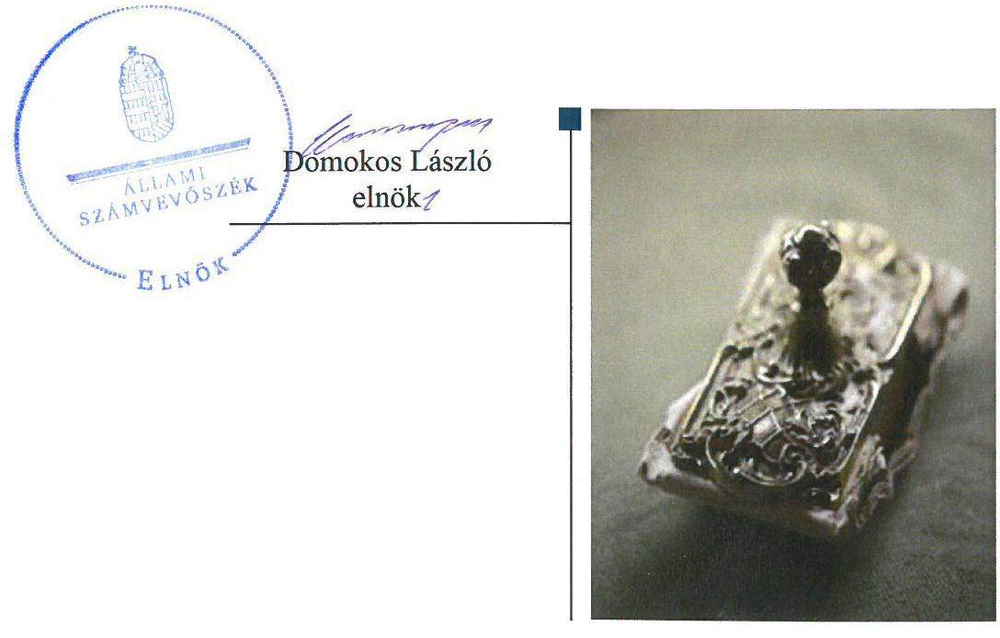
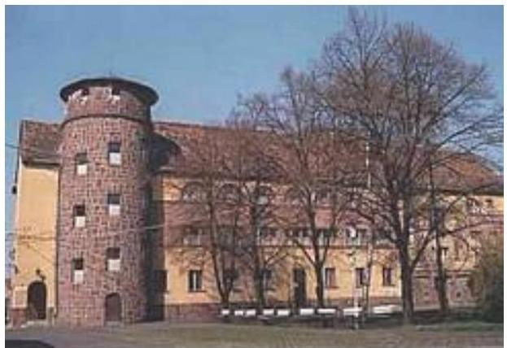
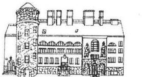
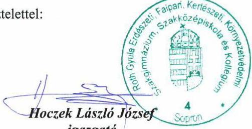
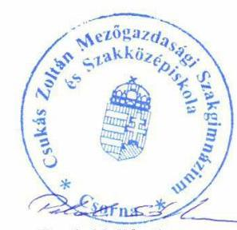
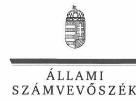
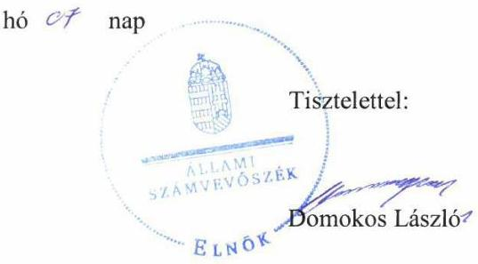
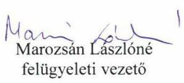
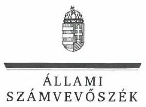
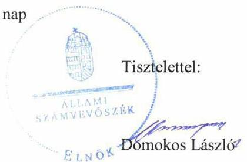

ÁLLAMI
SZÁMVEVŐSZÉK

# Jelentés

## Központi költségvetési szervek ellenőrzése

Csukás Zoltán Mezőgazdasági Szakgimnázium és Szakközépiskola 2020.

20002
www.asz.hu

---

# Jelentés 

## Központi költségvetési szervek ellenőrzése

Csukás Zoltán Mezőgazdasági
Szakgimnázium és Szakközépiskola
2020. 01. hó 28. nap

---

# AZ ELLENŐRZÉST FELÜGYELTE:

## MAROZSÁN LÁSZLÓNÉ felügyeleti vezető

## AZ ELLENŐRZÉST VEZETTE ÉS A VÉGREHAJTÁSÁÉRT FELELŐS:

### BÁLINT KÁLMÁN KADOCSA ellenőrzésvezető

## A PROGRAM ÖSSZEÁLLÍTÁSÁÉRT FELELŐS:

### TÓTPÁL SZABOLCS osztályvezető

IKTATÓSZÁM: EL-2357-001/2019.

TÉMASZÁM: 2450

ELLENŐRZÉS-AZONOSÍTÓ SZÁM: V079148

Jelentéseink az Országgyűlés számítógépes hálózatán és az Interneten a www.asz.hu címen is olvashatóak.

---

# TARTALOMJEGYZÉK 

■ ÖSSZEGZÉS ..... 5
■ AZ ELLENŐRZÉS CÉLJA ..... 6
■ AZ ELLENŐRZÉS TERÜLETE ..... 7
■ AZ ELLENŐRZÉS HÁTTERE, INDOKOLTSÁGA ..... 8
■ A JELENTÉS LÉNYEGES KÉRDÉSKÖREI ..... 10
■ AZ ELLENŐRZÉS HATÓKÖRE ÉS MÓDSZEREI ..... 11
■ MEGÁLLAPÍTÁSOK ..... 13
■ JAVASLATOK ..... 16
■ MELLÉKLETEK ..... 19
I. sz. melléklet: Értelmező szótár ..... 19
■ FÜGGELÉK: ÉSZREVÉTELEK ..... 21
■ RÖVIDÍTÉSEK JEGYZÉKE ..... 33

---

.

---

# ÖSSZEGZÉS 

A Csukás Zoltán Mezőgazdasági Szakgimnázium és Szakközépiskola működésének szabályozottsága, pénzügyi és vagyongazdálkodása nem felelt meg a jogszabályi előírásoknak. Nem volt biztosított a felelős gazdálkodás, a közpénzek átlátható, szabályszerű felhasználása, és a nemzeti vagyonnal történő elszámoltatható gazdálkodás. A korrupcióval szemben nem volt védett.

## Az ellenőrzés társadalmi indokoltsága

Magyarország versenyképességének és a magyar gazdaság fejlődésének alapvető feltétele a magyar munkavállalók megfelelő szakmai képzettsége és felkészültsége, amelyben a szakképzési rendszernek döntő szerepe van. A mezőgazdaság vonatkozásában is kiemelten fontos ez, hiszen a magyar mezőgazdaság piaci versenyképességét és eredményességét nagymértékben befolyásolja az agrárszférában dolgozók képzettsége, felkészültsége. A szakképzés legjelentősebb színterei a szakképző iskolák. Az eredményes és célszerű szakképzés alapja és alapvető feltétele a szakképző intézmények közpénzekkel és a közvagyonnal való törvényes, átlátható és a korrupcióval szembeni védelmet biztosító működése és gazdálkodása. Ezért ezen szervezetekkel szemben is alapvető társadalmi igény, hogy a rájuk bízott közpénzekkel, közvagyonnal szabályosan gazdálkodjanak. Emellett a szakképzésben részt vevő pedagógusok, tanulók és a szülők jogos elvárása, hogy a szakképző iskolák működése átlátható és elszámoltatható legyen. Mindezen igényekkel összhangban, a közpénzügyek átláthatóságának előmozdítása, a közvagyon védelme érdekében került sor az agrárszakképző iskolák belső kontrollrendszerének és gazdálkodásának ellenőrzésére.

## Főbb megállapítások, következtetések, javaslatok

A Csukás Zoltán Mezőgazdasági Szakgimnázium és Szakközépiskola belső kontrollrendszerének kialakítása és működtetése nem volt szabályszerű, nem biztosította a szabályszerű működés és gazdálkodás feltételeit. Nem tették meg a legalapvetőbb intézkedéseket sem a korrupció megelőzése érdekében, mivel 2016. augusztus 31-ig nem szabályozták a vagyonnyilatkozat-tételi kötelezettség folyamatát.

A Csukás Zoltán Mezőgazdasági Szakgimnázium és Szakközépiskola pénzügyi, valamint vagyon-gazdálkodása a 2016. és a 2017. években nem volt szabályszerű, mivel a kötelezettségvállalásokról nem vezettek nyilvántartást, továbbá az éves költségvetési beszámolói nem mutattak megbízható és valós összképet a vagyonáról, pénzügyi helyzetéről, mivel a költségvetési beszámolók mérlegtételei leltárral nem voltak alátámasztottak.

A Csukás Zoltán Mezőgazdasági Szakgimnázium és Szakközépiskola a korrupciós kockázatok kezelését szolgáló integritás-kontrollokat nem építette ki, kockázatelemzést nem végzett. A teljesítmény-mérés feltételei nem voltak biztosítottak.

A megállapítások alapján az Állami Számvevőszék a Csukás Zoltán Mezőgazdasági Szakgimnázium és Szakközépiskola intézményvezetője részére 7 javaslatot fogalmazott meg.

---

# AZ ELLENŐRZÉS CÉLJA 

AZ ELLENŐRZÉS CÉLJA annak megítélése volt, hogy az ellenőrzött intézményre vonatkozó irányító szervi feladatellátás a jogszabályi előírások betartásával történt-e; az intézménynél a belső kontrollrendszer kialakítása és működtetése szabályszerű volt-e, biztosította-e az átlátható, szabályszerű, gazdaságos, hatékony és eredményes gazdálkodás feltételeit; az intézmény pénzügyi és vagyongazdálkodása megfelelt-e a jogszabályi előírásoknak és belső szabályzatainak. Az ellenőrzés keretében az Állami Számvevőszék értékelte az intézmény korrupciós kockázatainak kezelését szolgáló integritás-kontrollok kiépítettségét és az integritás-szemlélet érvényesülését, a teljesítményellenőrzés feltételeinek kialakítását. Értékelte továbbá, hogy az ellenőrzött megfelel-e annak az Alaptörvényben meghatározott alapvetésnek, hogy Magyarország a kiegyensúlyozott, átlátható és fenntartható költségvetési gazdálkodás elvét érvényesíti. Érvényesült-e a nemzeti vagyon kezelésének és védelmének célja, azaz a szervezet vagyona a közérdeket szolgálta-e a közös szükségletek kielégítése és a természeti erőforrások megóvása, valamint a jövő nemzedékek szükségleteinek figyelembevétele mellett.

---

# **AZ ELLENŐRZÉS TERÜLETE**

## **Csukás Zoltán Mezőgazdasági Szakgimnázium és Szakközépiskola**

A csornai székhelyű Intézményt1 1938-ban alapították, a fenntartói és irányítói jogokat és hatásköröket a Minisztérium2 2013. augusztus 1-től gyakorolja.

Az Intézmény tevékenysége szakgimnáziumi, szakközépiskolai nevelés-oktatás és kollégiumi ellátás, valamint felnőttoktatás mezőgazdasági szakmacsoportban.

Az Intézmény maximális tanulói létszáma az ellenőrzött időszakban 410 fő volt.

Az ellenőrzött időszakban az Intézménynél szervezeti, szerkezeti átalakításra nem került sor, az igazgató személye nem változott.

Az Intézmény önálló gazdasági szervezettel nem rendelkezik. Az Intézmény gazdasági feladatait az ellenőrzött időszakban a Roth Gyula Erdészeti, Faipari, Kertészeti, Környezetvédelmi Szakgimnázium, Szakközépiskola és Kollégium látta el.

Az Intézmény költségvetési kiadása 2016-ban 235 millió forint, 2017-ben 234 millió forint, az irányító szervtől működéséhez kapott költségvetési támogatása 2016-ban 141 millió forint, 2017-ben 153 millió forint volt.

---

# AZ ELLENŐRZÉS HÁTTERE, INDOKOLTSÁGA 

Az államháztartás központi alrendszerének közpénz-felhasználása, az intézmények által ellátott közfeladatok sokrétűsége, valamint a feladatellátásához rendelt vagyon nagyságrendje indokolja, hogy az ÁSZ ${ }^{3}$ ellenőrzéseket folytasson a pénzügyi és vagyongazdálkodás területén. Az ÁSZ az ellenőrzései során feltárja a gazdálkodást, a központi alrendszer intézményei átalakulását, átszervezését érintő szabályozások esetleges hiányosságait, a szabályozással nem érintett gazdálkodási területeket, rámutathat a vagyongazdálkodási tevékenység - ezen belül a tulajdonosi joggyakorlás és vagyonkezelés - esetleges szabálytalanságaira, értékeli az állami vagyon nyilvántartására és elszámolására vonatkozó eljárásokat.

Az ellenőrzés várhatóan hozzájárul a központi intézmények pénzügyi helyzetének pontosabb megítéléséhez, és a jó gyakorlat kialakításán és terjesztésén keresztül az ellenőrzések elősegíthetik a gazdálkodás szabályszerűségének javítását.

Az ellenőrzések megállapításai támogathatják az ellenőrzött szervezetek szabályszerű gazdálkodását, javaslataival elősegítheti az Alaptörvényben megfogalmazott alapvetések érvényesülését a mindennapi életben a szervezetek szintjén. A központi költségvetés rendszerében zajló folyamatok holisztikus elemzései, a kockázatok folyamatos figyelemmel kísérésének módszerével, az így kiválasztott szervezetek célzott, hatékony ellenőrzéseivel az ÁSZ betölti a legfőbb gazdasági ellenőrző szerv küldetését.

Az ellenőrzés a szervezet kockázatértékelése alapján, az egyedi és lényeges jellemzők figyelembevételével, az ellenőrzésre kiválasztott modullal történt. Az integritás- és belső kontroll modul a központi költségvetési szerv működésének irányítottságát, korrupció elleni védettségét értékelte.

A belső kontrollrendszer kialakítása és működtetése nélkül nem valósítható meg a közpénzek, a közvagyon átlátható, szabályos, gazdaságos, hatékony és eredményes felhasználása. A belső kontrollrendszer azt a célt szolgálja, hogy a költségvetési szervek működésük és gazdálkodásuk során a tevékenységeket szabályszerűen hajtsák végre, teljesítsék elszámolási kötelezettségeiket és megvédjék az erőforrásokat a veszteségektől, a károktól és a nem rendeltetésszerű használattól. A belső kontrollrendszer magában foglalja mindazon elveket, eljárásokat és belső szabályzatokat, melyek biztosítják, hogy a költségvetési szerv valamennyi tevékenysége és célja összhangban legyen a szabályszerűséggel, szabályozottsággal, valamint a gazdaságosság, hatékonyság és eredményesség követelményeivel, az eszközökkel és forrásokkal való gazdálkodásban ne kerüljön sor pazarlásra, visszaélésre, rendeltetésellenes felhasználásra. Megfelelő, pontos és naprakész információk álljanak rendelkezésre a költségvetési szerv működésével kapcsolatosan, és a belső kontrollrendszer harmonizációjára, összehangolására vonatkozó jogszabályok végrehajtásra kerüljenek. Az integritás-kontrollok kiépítése, erősítése a szervezet korrupciós kockázatainak kezelését szolgálja. A teljesítménykövetelmények meghatározása és működtetése megalapozhatja a központi költségvetési szervnél a teljesítményellenőrzés lefolytatását.

---

Az egyes ellenőrzések megállapításaival és egy időszak ellenőrzési eredményeinek elemzésével az ÁSZ ráirányíthatja a jogalkotók figyelmét a központi alrendszerben vagy annak egy ágazatában esetlegesen felmerülő pénzügyi, szabályozási feszültségekre. Az elvégzett ellenőrzések során az ÁSZ „jó gyakorlatokat" is azonosíthat, melyeket tanácsadó funkciója keretében szélesebb körben is megismertethet az érintettekkel, ezáltal is hozzájárulva a költségvetési rendszer szabályozott, átlátható, kiegyensúlyozott és fenntartható működéséhez.

---

# A JELENTÉS LÉNYEGES KÉRDÉSKÖREI 

1.     - Az irányító szerv ellenőrzött költségvetési szervre vonatkozó feladatellátása szabályszerű volt-e?
2.     - A belső kontrollrendszer kialakítása és működtetése biztosította-e a közpénzekkel és a nemzeti vagyonnal történő átlátható, szabályszerű gazdálkodást?
3.     - A költségvetési szerv pénzügyi gazdálkodása szabályszerű volt-e?
4.     - A költségvetési szerv vagyongazdálkodása szabályszerű volt-e?
5. Az intézménynél alakítottak-e ki a teljesítmény mérésére alkalmas követelményeket?

---

# AZ ELLENŐRZÉS HATÓKÖRE ÉS MÓDSZEREI 

## Az ellenőrzés típusa

Megfelelőségi ellenőrzés.

## Az ellenőrzött időszak

A szervezet vagyongazdálkodása, integritás és belső kontrollrendszerének értékelése tekintetében a 2016-2017. évek.

Az irányító szervi feladatellátás és a szervezet pénzügyi gazdálkodása tekintetében a 2016. év.

## Az ellenőrzés tárgya

Az Intézmény belső kontrollrendszerének kialakítása és működtetése, pénzügyi és vagyongazdálkodása, az integritás-kontrollok kiépítettsége, az integritás-szemlélet érvényesülése, a teljesítményértékelés feltételeinek fennállása, valamint az irányító szervi feladatellátás.

## Az ellenőrzött szervezet

- Csukás Zoltán Mezőgazdasági Szakgimnázium és Szakközépiskola
- Agrárminisztérium, mint irányító szerv
- Roth Gyula Erdészeti, Faipari, Kertészeti, Környezetvédelmi Szakgimnázium, Szakközépiskola és Kollégium, mint gazdálkodási feladatokat ellátó szervezet, 2017-re vonatkozóan

## Az ellenőrzés jogalapja

Az ellenőrzés jogszabályi alapját az ÁSZ tv. ${ }^{4}$ 1. § (3) bekezdés, 5. § (2)-(3) bekezdései, 5. § (4) bekezdés a) pontja, valamint az Áht. ${ }^{5}$ 61. § (2) bekezdésének előírásai képezték.

## Az ellenőrzés módszerei

Az ellenőrzésre a szakmai program szempontjai, az ellenőrzött időszakban hatályos jogszabályok, az ellenőrzés szakmai szabályai, a jelen ellenőrzésre irányadó ÁSZ módszertanok figyelembevételével került sor.

---

Az ÁSZ az ellenőrzés ideje alatt az ellenőrzött szervezetekkel a kapcsolattartást az ÁSZ SZMSZ ${ }^{\circledR}$-ének vonatkozó előírásai alapján biztosította.

Az ellenőrzési kérdések megválaszolásához szükséges bizonyítékok megszerzése az ellenőrzött szervezetek által rendelkezésre bocsátott dokumentumokra, adatokra alapozva megfigyelés, szemle (szemrevételezés), kérdésfeltevés (információkérés), mintavételezés, valamint elemző eljárás útján történt.

Az ellenőrzési bizonyítékként felhasználható adatforrások közé tartoztak egyrészt a szakmai program részletes szempontjainál felsorolt adatforrások, másrészt minden egyéb - az ellenőrzés folyamán feltárt, az ellenőrzés szempontjából információt tartalmazó - dokumentum.

Az ellenőrzés lefolytatásához az ellenőrzött szervezetek a tanúsítványok kitöltésével, valamint az ÁSZ által kért dokumentumok megküldésével szolgáltattak adatokat, amelyek valódiságát és teljes körűségét az ellenőrzött szervezet vezetője által tett teljességi és hitelességi nyilatkozat igazolta. Az így rendelkezésre bocsátott adatok, információk kontrollja az ellenőrzés keretében történt.

Az Intézmény belső kontrollrendszere egyes pilléreinek kialakítására és működtetésére vonatkozó értékelés a következő volt:
$\longrightarrow$ „szabályszerű", amennyiben az értékelt területen az elért „igen" válaszok százalékban kifejezett, egész számra kerekített aránya legalább $85 \%$ volt,
$\longrightarrow$ „nem szabályszerű", ha nem érte el a 85\%-ot.
A központi költségvetési szerv belső kontrollrendszerének összesített értékelése az egyes részterületek esetében kapott megfelelőségi arányok számtani átlaga alapján történt és megegyezett a pillérenként (kontrollterületenként) alkalmazott százalékos értékelésekkel, a következő eltérésekkel: a kontrollrendszer egésze esetében a „szabályszerű" értékelésnek a százalékos értéken felül további feltétele volt, hogy egyik kontrollterület sem kaphat „nem szabályszerű" értékelést.

A 2017. évi beruházások, felújítások végrehajtásának, a feladatellátást szolgáló állami vagyontárgyak használatának és év végi értékelésének szabályszerűségének megítélése tételes ellenőrzés alapján történt.

---

# 1. Az irányító szerv ellenőrzött költségvetési szervre vonatkozó feladatellátása szabályszerű volt-e? 

Összegző megállapítás: A Minisztériumnak az Intézményre vonatkozó feladatellátása szabályszerű volt.

A Minisztérium az Áht-ban foglalt hatáskörét gyakorolva beszámoltatta az Intézmény vezetőjét az éves szakmai feladatellátásról, valamint az éves gazdálkodásról.

Egyéb irányítási hatáskörében eljárva
 a Minisztérium a jogszabályi előírásoknak megfelelően jóváhagyta az Intézmény elemi költségvetését és az éves költségvetési beszámolóját.

## 2. A belső kontrollrendszer kialakítása és működtetése biztosította-e a közpénzekkel és a nemzeti vagyonnal történő átlátható, szabályszerű gazdálkodást?

## Összegző megállapítás

Az Intézmény belső kontrollrendszerének kialakítása és működtetése nem volt szabályszerű a 2016-2017. évben.

A 2016. évben valamint a 2017. évben az Intézmény belső kontrollrendszerének kialakítása és működtetése nem volt szabályszerű, nem biztosította a közpénzfelhasználás szabályozottságát.

A kontrollkörnyezet kialakítása nem volt szabályszerű, mert:
$\longrightarrow$ az Intézmény 2016. 08. 31-ig nem rendelkezett hatályos SZMSZ${ }^{7}$-el az Áht. 10. § (5) bekezdés előírása ellenére,
$\longrightarrow$ az Intézmény 2016. 08. 31-ig a Vnytv. ${ }^{8} 11$ § (6) bekezdésben foglaltak ellenére nem állapította meg szabályzatban vagyonnyilatkozat átadására, nyilvántartására, a vagyonnyilatkozatban foglalt személyes adatok védelmére vonatkozó további szabályokat,
$\longrightarrow$ a 2016. valamint a 2017. évben az Intézmény rendelkezett Számviteli politikával ${ }^{9}$, Leltározási szabályzattal ${ }^{10}$, Értékelési szabályzattal ${ }^{11}$, Pénzkezelési szabályzattal ${ }^{12}$, valamint Önköltségszámítási szabályzattal ${ }^{13}$, azonban a Számv. tv ${ }^{14}$. 14.§ (4) bekezdése ellenére a számviteli politikában nem rögzítették, hogy a törvényben biztosított választási, minősítési lehetőségek közül melyeket alkalmazza, valamint hogy az alkalmazott gyakorlatot milyen okok miatt kell megváltoztatni,
$\longrightarrow$ az Intézmény a 2017. évben az Ávr. 13. § (2) bekezdés c) pontja ellenére nem rendezte belső szabályzatban a belföldi és külföldi kiküldetések elrendelésével és lebonyolításával, elszámolásával kapcsolatos kérdéseket,

---

$\longrightarrow$ az Intézmény a 2017. évben az Ávr. 13. § (2) bekezdés f) pontja ellenére nem rendezte belső szabályzatban a gépjárművek igénybevételének és használatának rendjét.

INTEGRÁLT KOCKÁZATKEZELÉSI RENDSZERT az Intézmény vezetője a Bkr. ${ }^{15}$ 3. § (b) bekezdésben előírtak ellenére 2017. augusztus 31-ig nem alakított ki.

# A KONTROLLTEVÉKENYSÉGEK GYAKORLÁSA a 

2017. évben nem volt szabályszerű. Az Intézmény a külső személyi juttatások (egyéb külső személyi juttatások) ellenőrizhetőségét nem biztosította, mivel a megbízási díjakról készített kimutatásban magasabb összegről adtak számot, mint amilyen összeget a főkönyvi kivonat és az éves költségvetési beszámoló megfelelő tartalmú sora rögzít.

Az Intézménynél a 2017. évben az Áhsz. 39. § (3) bekezdésben előírtak ellenére nem vezették a kötelezettségvállalásokról az Áhsz 14. melléklet II. rész 4. pontja szerinti nyilvántartást.

AZ INFORMÁCIÓS ÉS KOMMUNIKÁCIÓS rendszert az Intézmény vezetője a 2017. évben a Bkr. 9. § (1) bekezdésében foglaltak ellenére nem alakította ki, és nem működtette, a 305/2005. (XII. 25.) Korm. rendelet ${ }^{16} 3$. § (1) bekezdés a) pontjában előírtak ellenére nem határozta meg a közzétett adatszolgáltatások helyesbítésével, frissítésével és eltávolításával kapcsolatos feladatok ellátásának részletes rendjét, figyelemmel az Ávr. 13. § (2) bekezdés a) pontjában foglaltakra.

Az Intézményre vonatkozóan a 2017. évben a jogszabályokban előírt adatszolgáltatási kötelezettségeket a Kincstár ${ }^{17}$ felé teljesítették.

A NYOMONKÖVETÉSI RENDSZERT az Intézmény vezetője a Bkr. 10. §-ban foglaltak ellenére nem alakította ki.

Az Intézmény belső ellenőrzése szabályszerű volt.
AZ INTEGRITÁSI kontrollok kiépítettségi szintje az Intézménynél nem támogatta a korrupciós kockázatok kezelését. Az Intézmény nem végzett kockázatelemzést. Az Intézmény nem működtette az integritást erősítő nem kötelezően előírt kontrollokat.

Az Intézmény vezetője a Bkr. szerint értékelte az Intézmény belső kontrollrendszerének minőségét. Vezetői nyilatkozatában 2016-2017. évekre vonatkozóan szabályszerűnek minősítette az Intézmény belső kontrollrendszerét. Az ÁSZ ellenőrzés megállapításai a 2016-2017. években kiadott vezetői nyilatkozatokat nem támasztották alá.

---

# 3. A költségvetési szerv pénzügyi gazdálkodása szabályszerű volt-e? 

## Összegző megállapítás

Az Intézmény pénzügyi gazdálkodása a 2016. évben nem volt szabályszerű.

Az Intézménynél az Áhsz. 39. § (3) bekezdésben előírtak ellenére nem vezették a kötelezettségvállalásokról az Áhsz 14. melléklet II. rész 4. pontja szerinti nyilvántartást, ezáltal az Intézmény maradvány kimutatása részletező nyilvántartással nem volt alátámasztott.

## 4. A költségvetési szerv vagyongazdálkodása szabályszerű volt-e?

## Összegző megállapítás Az Intézmény vagyongazdálkodása a 2016. és a 2017. évben nem volt szabályszerű.

Az Intézmény vagyongazdálkodása 2016-2017. évben nem volt szabályszerű, mert az Áhsz. 5. § (1) bekezdésében, a 22. §(1)-(2) bekezdéseiben, valamint a Számv. tv. 69. § (1) bekezdésében előírtak ellenére az Intézmény a mérleg tételeit 2016-2017. évekre vonatkozóan leltárral nem támasztotta alá.

Az Intézmény a 2017. évi beruházásokkal, valamint a felújításokkal kapcsolatos elszámolásokat szabályszerűen hajtotta végre.

## 5. Az intézménynél alakítottak-e ki a teljesítmény mérésére alkalmas követelményeket?

## Összegző megállapítás A teljesítmény mérésére alkalmas követelményeket az Intézménynél nem alakították ki.

Az Intézmény vezetője a szervezeti célok elérését szolgáló feladatok, folyamatok, tevékenységek mérését szolgáló indikátorokat, mérőszámokat, feladat- és teljesítménymutatókat nem képezett, az Intézmény a teljesítmény mérésének lehetőségét nem biztosította.

---

# JAVASLATOK 

Az ÁSZ tv. 33. § (1) bekezdésében foglaltak értelmében az ellenőrzött szervezet vezetője köteles a jelentésben foglalt megállapításokhoz kapcsolódó intézkedési tervet összeállítani és azt a jelentés kézhezvételétől számított 30 napon belül az ÁSZ részére megküldeni. Amennyiben az ellenőrzött szervezet vezetője nem küldi meg határidőben az intézkedési tervet, vagy továbbra sem elfogadható intézkedési tervet küld, az Állami Számvevőszék elnöke az ÁSZ tv. 33. § (3) bekezdés a) és b) pontjaiban foglaltakat érvényesítheti.

## Csukás Zoltán Mezőgazdasági Szakgimnázium és Szakközépiskola igazgatója részére

1. Intézkedjen arról, hogy a számviteli politika feleljen meg a Számv. tv. előírásainak.
(2. sz. megállapítás 2. bekezdés 3. francia bekezdés 2-3. tagmondatai alapján)
2. Intézkedjen az Ávr. előírásának megfelelően a belföldi és külföldi kiküldetések elrendelésével és lebonyolításával, elszámolásával kapcsolatos kérdések belső szabályzatban való rendezéséről.
(2. sz. megállapítás 2. bekezdés 4. francia bekezdése alapján)
3. Intézkedjen az Ávr. előírásának megfelelően a gépjárművek igénybevételének és használatának rendje belső szabályzatban való rendezéséről.
(2. sz. megállapítás 2. bekezdés 5. francia bekezdése alapján)
4. Gondoskodjon az Áhsz. előírásainak megfelelő részletező nyilvántartás vezetéséről a kötelezettségvállalásokról.
(2. sz. megállapítás 5. bekezdése alapján)
5. Intézkedjen az információs és kommunikációs rendszer Bkr. előírása szerinti kialakításáról és működtetéséről.
(2. sz. megállapítás 6. bekezdése alapján)
6. Intézkedjen a nyomonkövetési rendszer Bkr. előírása szerinti kialakításáról és működtetéséről.
(2. sz. megállapítás 8. bekezdése alapján)

---

7. Intézkedjen az éves költségvetési beszámoló elkészítéséhez, a mérlegtételeinek alátámasztásához a jogszabályi előírásnak megfelelő leltár összeállításáról.
(4. sz. megállapítás 1. bekezdése alapján)

---

.

---

# MELLÉKLETEK 

- I. SZ. MELLÉKLET: ÉRTELMEZŐ SZÓTÁR
állami vagyon
állami vagyonnak minősül:
a) az állam tulajdonában lévő dolog, valamint a dolog módjára hasznosítható természeti erő,
b) az a) pont hatálya alá nem tartozó mindazon vagyon, amely vonatkozásában törvény az állam kizárólagos tulajdonjogát nevesíti,
c) az állam tulajdonában lévő tagsági jogviszonyt megtestesítő értékpapír, illetve az államot megillető egyéb társasági részesedés,
d) az államot megillető olyan immateriális, vagyoni értékkel rendelkező jogosultság, amelyet jogszabály vagyoni értékű jogként nevesít. (Forrás: Vtv. 1. § (2) bekezdése)
állami vagyon kezelője /vagyonkezelő
átalakítás
belső ellenőrzés
belső kontrollrendszer
belső kontrollrendszer területei
ellenőrzési nyomvonal
információs és kommunikációs rendszer
integritás

Állami vagyonnak minősül:
a) az állam tulajdonában lévő dolog, valamint a dolog módjára hasznosítható természeti erő,
b) az a) pont hatálya alá nem tartozó mindazon vagyon, amely vonatkozásában törvény az állam kizárólagos tulajdonjogát nevesíti,
c) az állam tulajdonában lévő tagsági jogviszonyt megtestesítő értékpapír, illetve az államot megillető egyéb társasági részesedés,
d) az államot megillető olyan immateriális, vagyoni értékkel rendelkező jogosultság, amelyet jogszabály vagyoni értékű jogként nevesít. (Forrás: Vtv. 1. § (2) bekezdése)
Az állami vagyont az MNV Zrt ${ }^{18}$. maga kezeli, vagy szerződés - így különösen bérlet, haszonbérlet, megbízás - alapján központi költségvetési szervnek, természetes vagy jogi személynek, vagy jogi személyiséggel nem rendelkező gazdálkodó szervezetnek hasznosításra átengedi." Az állami vagyonra vonatkozóan az MNV Zrt. kizárólag az Nvtv ${ }^{19}$.-ben meghatározott személyekkel köthet vagyonkezelési szerződést. (Forrás: Vtv. ${ }^{20}$ 27. § (1) bekezdése, hatályos 2012. január 1-jétől)
A költségvetési szerv általános jogutódlással történő megszüntetése átalakítással történhet. Az átalakítás lehet egyesítés vagy különválás. Az egyesítés lehet beolvadás vagy összeolvadás. (2015. január 1-jétől Áht. 11. § (2) bekezdés)
Független, tárgyilagos bizonyosságot adó és tanácsadó tevékenység, amelynek célja, hogy az ellenőrzött szervezet működését fejlessze és eredményességét növelje, az ellenőrzött szervezet céljai elérése érdekében rendszerszemléletű megközelítéssel és módszeresen értékeli, illetve fejleszti az ellenőrzött szervezet irányítási és belső kontrollrendszerének hatékonyságát. (Forrás: Bkr. 2. § b) pontja)
A belső kontrollrendszer a kockázatok kezelése és tárgyilagos bizonyosság megszerzése érdekében kialakított folyamatrendszer, amely azt a célt szolgálja, hogy a működés és gazdálkodás során a tevékenységeket szabályszerűen, gazdaságosan, hatékonyan, eredményesen hajtsák végre, az elszámolási kötelezettségeket teljesítsék, megvédjék az erőforrásokat a veszteségektől, károktól és nem rendeltetésszerű használattól. (Forrás: Áht. 69. § (1) bekezdése)
A kontrollkörnyezet, az integrált kockázatkezelési rendszer, a kontrolltevékenységek, az információs és kommunikációs rendszer, valamint a nyomon követési (monitoring) rendszer. (Forrás: Bkr. 3. §-a)
Az ellenőrzési nyomvonal a költségvetési szerv működési folyamatainak szöveges, táblázatokkal vagy folyamatábrákkal szemléltetett leírása, amely tartalmazza különösen a felelősségi és információs szinteket és kapcsolatokat, irányítási és ellenőrzési folyamatokat, lehetővé téve azok nyomon követését és utólagos ellenőrzését. (Forrás: Bkr. 6. § (3) bekezdés)
A költségvetési szerv vezetője által kialakított és működtetett olyan rendszer, mely biztosítja, hogy a megfelelő információk a megfelelő időben eljutnak az illetékes szervezethez, szervezeti egységhez, illetve személyhez. (Forrás: Bkr. 9. § (1) bekezdés)
Az integritás - egyik gyakran használt jelentése szerint - az elvek, értékek, cselekvések, módszerek, intézkedések konzisztenciáját jelenti, vagyis olyan magatartásmódot, amely meghatározott értékeknek megfelel. Integritás-irányítási rendszer bevezetése a szervezetben a szervezethez rendelt közfeladatok integritás szempontú ellátását, az

---

integrált kockázatkezelési rendszer
irányító szerv/felügyeleti szerv
kockázat
kontrollkörnyezet
kontrolltevékenységek
nyomon követési rendszer (monitoring)
vagyongazdálkodás
érték alapú működéssel (integritással) összefüggő szervezeti követelmények következetes érvényesítését jelenti. (Forrás: Nemzetgazdasági Minisztérium: Államháztartási Belső Kontroll Standardok és Gyakorlati Útmutató 1.6. Etikai értékek és integritás 46. oldal, 2017. szeptember)
Olyan folyamatalapú kockázatkezelési rendszer, amely a szervezet minden tevékenységére kiterjed, egységes módszertan és eljárások alkalmazásával, a szervezet célkitűzéseinek és értékeinek figyelembevételével biztosítja a szervezet kockázatainak teljes körű azonosítását, azok meghatározott kritériumok szerinti értékelését, valamint a kockázatok kezelésére vonatkozó intézkedési terv elkészítését és az abban foglaltak nyomon követését. (Forrás: Bkr. 2. § m) pontja, 2016. október 1-jétől)
A költségvetési szerv tekintetében az Áht.-ban meghatározott irányítási hatáskört gyakorló szerv. (Forrás: Áht. 1. § 9. pontja)
A kockázat annak a valószínűségét jelenti, hogy egy vagy több esemény vagy intézkedés nem kívánt módon befolyásolja a rendszer működését, céljainak megvalósulását. (Forrás: Javaslatok a korrupciós kockázatok kezelésére - Kockázatkezelési és ellenőrzési módszertan 35. oldal, ÁSZ)
A költségvetési szerv vezetője által kialakított olyan elvek, eljárások, belső szabályzatok összessége, amelyben világos a szervezeti struktúra, a folyamatok átláthatók, egyértelműek a felelősségi, hatásköri viszonyok és feladatok, meghatározottak, ismertek és elfogadottak az etikai elvárások a szervezet minden szintjén, átlátható a humánerőforrás-kezelés. (Forrás: Bkr. 6. § (1) bekezdés)
A költségvetési szerv vezetője által a szervezeten belül kialakított (kontroll) tevékenységek, melyek biztosítják a kockázatok kezelését, hozzájárulnak a szervezet céljainak eléréséhez és erősítik a szervezet integritását. (Forrás: Bkr. 8. § (1) bekezdés)
A költségvetési szerv vezetője köteles kialakítani a szervezet tevékenységének a

 célok megvalósításának nyomon követését biztosító rendszert, amely az operatív tevékenységek keretében megvalósuló folyamatos és eseti nyomon követésből, valamint az operatív tevékenységektől függetlenül működő belső ellenőrzésből áll. 2016. október 1-jétől: A költségvetési szerv vezetője köteles kialakítani a szervezet tevékenységének, a célok megvalósításának nyomon követését biztosító rendszert, mely az operatív tevékenységek keretében megvalósuló folyamatos és eseti nyomon követésből, valamint az operatív tevékenységektől függetlenül működő belső ellenőrzésből állhat. (Forrás: Bkr. 10. §)
A nemzeti vagyongazdálkodás feladata a nemzeti vagyon rendeltetésének megfelelő, az állam, az önkormányzat mindenkori teherbíró képességéhez igazodó, elsődlegesen a közfeladatok ellátásához és a mindenkori társadalmi szükségletek kielégítéséhez szükséges, egységes elveken alapuló, átlátható, hatékony és költségtakarékos működtetése, értékének megőrzése, állagának védelme, értéknövelő használata, hasznosítása, gyarapítása, továbbá az állam vagy a helyi önkormányzat feladatának ellátása szempontjából feleslegessé váló vagyontárgyak elidegenítése. (Forrás: Nvtv. 7. § (2) bekezdése)

---

# FÜGGELÉK: ÉSZREVÉTELEK 

A jelentéstervezetet a Számvevőszék 15 napos észrevételezésre megküldte az ellenőrzött szervezetek vezetőinek az ÁSZ tv. 29. § (1) bekezdése előírásának megfelelően.

A jelentéstervezet megállapításaira a Csukás Zoltán Mezőgazdasági Szakgimnázium és Szakközépiskola igazgatója, valamint a Roth Gyula Erdészeti, Faipari, Kertészeti, Környezetvédelmi Szakgimnázium, Szakközépiskola és Kollégium igazgatója észrevételt tett, az agrárminiszter nem tett észrevételt.
Az ÁSZ tv. 29. § (3) bekezdésével összhangban az ÁSZ a Függelékben feltünteti az ellenőrzés megállapításaival kapcsolatban tett, figyelembe nem vett észrevételeket, és megindokolja, hogy azokat miért nem fogadta el.

[^0]
[^0]:    * 29. § (1) Az Állami Számvevőszék az ellenőrzési megállapításait megküldi az ellenőrzött szervezet vezetőjének vagy az általa megbízott személynek, és annak, akinek személyes felelősségét állapította meg.
    (2) Az ellenőrzött szervezet vezetője és a felelősként megjelölt személy az ellenőrzés megállapításaira tizenöt napon belül írásban észrevételt tehet.
    (3) Az Állami Számvevőszék az észrevételre a beérkezésétől számított harminc napon belül írásban válaszol. A figyelembe nem vett észrevételeket köteles a jelentésben feltüntetni, és megindokolni, hogy azokat miért nem fogadta el.

---

# Csukás Zoltán Mezőgazdasági Szakgimnázium és Szakközépiskola 

9300 Csorna, Kórház u. 28.
Tel: 96/261-255
Fax: 96/593-253
E-mail: titkarsag@csukas.eu

Iktatószám: 106/22-2/2019.

Állami Számvevőszék
Domokos László Elnök Úr részére
Budapest
Apáczai Csere János u. 10.
1052

## ÁLLAMI SZÁMVEVŐSZÉK 2E-703212019/1

Erkezett: 2019. NOV 19.
Iktatószám: 624153-062/2019
Melléklet:

## Tisztelt Elnök Úr!

Hivatkozva az EL-1153-062/2019. számú jelentéstervezetre a „Központi költségvetési szervek ellenőrzése - Csukás Zoltán Mezőgazdasági Szakgimnázium és Szakközépiskola" címmel, az abban foglalt megállapításokra az alábbi észrevételt kívánom tenni:
2. számú megállapításhoz:

Az intézmény rendelkezik az Ávr. 13.§ (2) bekezdés c) pontja alapján Belföldi és külföldi kiküldetések rendjének szabályzatával 2014. január 1. napjától. A szabályzat és annak módosítása a 2. forduló V.1.21. pontjához feltöltésre került.
3. számú megállapításhoz:

Iskolánk 2014. szeptember 1. napjától rendelkezik Gépjármű üzemeltetési szabályzattal az Ávr. 13. § (2) f) pontja alapján. A szabályzat és annak módosítása a 2. forduló V.1.24. pontjához feltöltésre került.
4. számú megállapításhoz:

A 4. pontban megfogalmazott hiányosságokkal egyetértünk. Az intézményünk által alkalmazott EPER pénzügyi és számviteli rendszer nem tudja kezelni az összegző megállapítás szerinti hiányosságokat. Kollégánk felveszi a kapcsolatot a szoftverfejlesztőkkel, hogy az Áhsz. 14. melléklet II. rész 4. pontja szerinti törvényi előírásoknak megfelelően a hiányosságokat a szoftver kezelni tudja.
5. számú megállapításhoz:

Az információs és kommunikációs rendszert a Bkr. 9.§-nak megfelelően a 2018. évben kialakításra került.
6. számú megállapításhoz:

A nyomon követési rendszer kialakítása 2017. szeptember 1. napján megtörtént, melyet az ellenőrzés 2. fordulójában az 5.3. ponthoz feltöltésre került.

---

7. számú megállapításhoz:

Az intézmény a 2017. évi mérleg minden tételének alátámasztásához mérlegleltárral rendelkezett, illetve a beszámoló készítéséhez a mérleg fordulónapján meglévő eszközök és források leltározása megtörtént, melyről a jegyzőkönyvek a 3. forduló I.1. pontjához feltöltésre kerültek.
A 2016. évi belső ellenőrzési jelentésben megállapításra került, hogy iskolánknak át kell térni az EPER tárgyi eszköz moduljának használatára. 2018. évtől a nagyértékű eszközöket az Ekata vagyonkataszteri rendszerben tartjuk nyilván tételesen, mennyiségben és értékben.

Az ellenőrzés során tapasztalt segítő együttműködést köszönjük.

Csorna, 2019. november 14.
Tisztelettel:

Roth Gyula Erdészeti, Faipari, Kertészeti, Környezetvédelmi Szakgimnázium, Szakközépiskola és Kollégium

Perlaki Sándor igazgató
Csukás Zoltán Mezőgazdasági
Szakgimnázium és Szakközépiskola

---

ELNÖK

Ikt. szám: EL-1153-068/2019.

# Perlaki Sándor úr 

igazgató
Csukás Zoltán Mezőgazdasági Szakgimnázium és Szakközépiskola

## Csorna

## Tisztelt Igazgató Úr!

A „Központi költségvetési szervek ellenőrzése - Csukás Zoltán Mezőgazdasági Szakgimnázium és Szakközépiskola" címmel készített számvevőszéki jelentéstervezetre tett, 2019. november 14-én kelt 106/22-3/2019. iktatószámú levelében megküldött észrevételeit megkaptam.
Az Állami Számvevőszék észrevételekre vonatkozó álláspontjáról a felügyeleti vezető által készített részletes tájékoztatást csatoltan megküldöm.
Tájékoztatom Igazgató urat, hogy a számvevőszéki jelentésben - az Állami Számvevőszékről szóló 2011. évi LXVI. törvény 29. § (3) bekezdése alapján - a figyelembe nem vett észrevételeket szerepeltetjük az elutasítás indokának feltüntetésével.
Budapest, 2019.

Melléklet: Tájékoztatás az észrevételek kezeléséről

---

# Tájékoztatás az észrevételek kezeléséről 

Az „Központi költségvetési szervek ellenőrzése - Csukás Zoltán Mezőgazdasági Szakgimnázium és Szakközépiskola" címû jelentéstervezetre (továbbiakban: jelentéstervezet) a 2019. november 14-én kelt 106/22-3/2019. iktatószámú levélben megküldött észrevételeit áttekintettem. Az észrevételek kezeléséről az alábbi tájékoztatást adom.

1) A jelentéstervezet 2. számú megállapítás 2. bekezdés 4. francia bekezdésére és a kapcsolódó 2. számú javaslatra vonatkozó észrevétel:
Észrevételében Igazgató úr leírta, hogy az intézmény rendelkezik az Ávr. 13.§ (2) bekezdés c) pontja alapján Belföldi és külföldi kiküldetések rendjének szabályzatával 2014. január 1. napjától. A szabályzat és annak módosítása a 2. forduló V.1.21. pontjához feltöltésre került.
Az Iskola által az adatszolgáltatás során az Állami Számvevőszék részére a Belföldi és külföldi kiküldetés rendjére vonatkozóan egy 2017. január 03-i keltezésű valamint egy 2017. augusztus 31-i keltezésű szabályzat módosítás került beküldésre, amelyet a 2018. november 12-i keltezésű Teljességi és hitelességi nyilatkozat 19. sorszámú hivatkozása tartalmaz. Az ellenőrzés részére a Belföldi és külföldi kiküldetés rendjére vonatkozóan az államháztartásról szóló törvény végrehajtásáról szóló 368/2011. (XII.31.) Korm. rendelet (Ávr.) 13. § (2) bekezdés c) pontjában előírt szabályzatot nem adtak át.
A fentiek alapján észrevételét nem fogadjuk el, a jelentéstervezet módosítása nem indokolt.
2) A jelentéstervezet 2. számú megállapítás 2. bekezdés 5. francia bekezdésére és a kapcsolódó 3. számú javaslatra vonatkozó észrevétel:
Észrevételében Igazgató úr leírta, hogy az intézmény 2014. szeptember 1. napjától rendelkezik Gépjármű üzemeltetési szabályzattal az Ávr. 13. § (2) f) pontja alapján. A szabályzat és annak módosítása a 2. forduló V.1.24. pontjához feltöltésre került.
Az Iskola által az Állami Számvevőszék részére beküldött „I. 1.15 gépjármű üzemeltetési szabályzat 2014.09.01.pdf" fájl Gépjármű üzemeltetési szabályzat dokumentum csak páratlan számozású (1,3,5,7,9) oldalakat tartalmaz, nem minősül érvényes dokumentumnak, mivel időbeli és személyi hatálya nem megállapítható, nem tartalmazza a kiadmányozó aláírását és bélyegző lenyomatát. A „V. 1. 24 gépjármű üzemeltetési szabályzat 2017.08.31..pdf" fájl a Gépjármű üzemeltetési szabályzat módosítása, amely az intézmény névváltozását tartalmazza.
A fentiek alapján észrevételét nem fogadjuk el, a jelentéstervezet módosítása nem indokolt.

---

3) A jelentéstervezet 2. számú megállapítás 5. bekezdésére, továbbá 3. számú megállapítására és a kapcsolódó 4. számú javaslatra vonatkozó észrevétel:
Igazgató úr észrevételében leírta, hogy a 4. pontban megfogalmazott hiányosságokkal egyetértenek. Az intézményük által alkalmazott EPER pénzügyi és számviteli rendszer nem tudja kezelni az összegző megállapítás szerinti hiányosságokat és felveszik a kapcsolatot a szoftverfejlesztőkkel, hogy az Áhsz. 14. melléklet II. rész 4. pontja szerinti törvényi előírásoknak megfelelően a hiányosságokat a szoftver kezelni tudja.
Igazgató úr észrevétele megerősítette a számvevőszéki jelentéstervezet - az államháztartás számviteléről szóló 4/2013. (I.11.) Kormányrendelet (Áhsz.) előírásainak megfelelő - kötelezettségvállalás nyilvántartás hiányára vonatkozó megállapítását.
A fentiekre tekintettel a jelentéstervezet módosítása nem indokolt.
4) A jelentéstervezet 2. számú megállapítás 6. bekezdésére és a kapcsolódó 5. számú javaslatra vonatkozó észrevétel:
Igazgató úr a jelentéstervezet kapcsolódó megállapítását nem vitatja, tájékoztat arról, hogy az információs és kommunikációs rendszer a Bkr. 9.§-nak megfelelően a 2018. évben kialakításra került.
Köszönettel vettem tájékoztatását az ellenőrzött időszakot követő intézkedéséről. Tájékoztatása az ellenőrzés megállapításait nem befolyásolja, a jelentéstervezet módosítása nem indokolt.
5) A jelentéstervezet 2. számú megállapítás 8. bekezdésére és a kapcsolódó 6. számú javaslatra vonatkozó észrevétel:
Igazgató úr észrevételében leírta, hogy a nyomon követési rendszer kialakítása 2017. szeptember 1. napján megtörtént, melyet az ellenőrzés 2. fordulójában az 5.3. ponthoz feltöltöttek.
Az Iskola által az Állami Számvevőszék részére az adatszolgáltatás során beküldött 2017. szeptember 1-jén készült dokumentum az intézmény monitoring rendszerének kialakításáról és szabályozásáról szóló stratégiája. A dokumentum hiányos, tartalma nem igazolja, hogy az intézményi feladatellátást teljes mértékben lefedő operatív nyomonkövetési rendszert kialakították.
A fentiek alapján az észrevételt nem fogadjuk el, a jelentéstervezet módosítása nem indokolt.
6) A jelentéstervezet 4. számú megállapítás 1. bekezdésére és a kapcsolódó 7. sz. javaslatra vonatkozó észrevétel:
Igazgató úr észrevételében leírta, hogy az intézmény a 2017. évi mérleg minden tételének alátámasztásához mérlegleltárral rendelkezett, illetve a beszámoló készítéséhez a mérleg

---

fordulónapján meglévő eszközök és források leltározása megtörtént, melyről a jegyzőkönyvek a 3. forduló 1.1. pontjához feltöltésre kerültek. Tájékoztatott továbbá arról is, hogy a 2016. évi belső ellenőrzési jelentésben megállapításra került, hogy az iskolának át kell térni az EPER tárgyi eszköz moduljának használatára. Leírta, hogy 2018. évtől a nagyértékű eszközöket az E-kata vagyonkataszteri rendszerben tartják nyilván tételesen, mennyiségben és értékben.
Az Iskola az Állami Számvevőszék részére az Igazgató úr észrevételében hivatkozott leltározási jegyzőkönyveket küldött be. Ezek a tárgyi- és forgó eszközökre vonatkozó leltározási dokumentációk érték adatokat nem tartalmaznak, a hivatkozott jegyzőkönyvek a leltározás tényét igazolják. Az iskola nem bocsátott olyan leltár dokumentumot az Állami Számvevőszék rendelkezésére, amely a számvitelről szóló 2000. évi C. tv. 69. § (1) bekezdésének megfelelően a mérlegtételeket tételesen, ellenőrizhető módon mennyiségben és értékben alátámasztja.
A fentiek alapján észrevételét nem fogadjuk el, a jelentéstervezet megállapítása helytálló, a jelentéstervezet módosítása nem indokolt.
Köszönettel vettem Igazgató úr arra vonatkozó tájékoztatását, hogy áttérnek az EPER tárgyi eszköz moduljának használatára, valamint hogy 2018. évtől a nagyértékű eszközöket az E-kata vagyonkataszteri rendszerben tartják nyilván tételesen, mennyiségben és értékben. Tájékoztatása az ellenőrzött időszakon kívüli intézkedéseiről azonban a tárgyi ellenőrzés megállapításait nem befolyásolják.

Budapest, 2019. 12. hó 0 nap

---

ELNÖK

Ikt. szám: EL-1153-069/2019.

# Hoczek László József úr 

igazgató
Roth Gyula Erdészeti, Faipari, Kertészeti, Környezetvédelmi Szakgimnázium, Szakközépiskola és Kollégium

## Sopron

## Tisztelt Igazgató Úr!

A „Központi költségvetési szervek ellenőrzése - Csukás Zoltán Mezőgazdasági Szakgimnázium és Szakközépiskola" címmel készített számvevőszéki jelentéstervezetre tett, 2019. november 14-én kelt 106/22-3/2019. iktatószámú levelében megküldött észrevételeit megkaptam.
Az Állami Számvevőszék észrevételekre vonatkozó álláspontjáról a felügyeleti vezető által készített részletes tájékoztatást csatoltan megküldöm.
Tájékoztatom Igazgató urat, hogy a számvevőszéki jelentésben - az Állami Számvevőszékről szóló 2011. évi LXVI. törvény 29. § (3) bekezdése alapján - a figyelembe nem vett észrevételeket szerepeltetjük az elutasítás indokának feltüntetésével.
Budapest, 2019.

Melléklet: Tájékoztatás az észrevételek kezeléséről

---

# Tájékoztatás az észrevételek kezeléséről 

Az „Központi költségvetési szervek ellenőrzése - Csukás Zoltán Mezőgazdasági Szakgimnázium és Szakközépiskola" címû jelentéstervezetre (továbbiakban: jelentéstervezet) a 2019. november 14-én kelt 106/22-3/2019. iktatószámú levélben megküldött

 észrevételeit áttekintettem. Az észrevételek kezeléséről az alábbi tájékoztatást adom.

1) A jelentéstervezet 2. számú megállapítás 2. bekezdés 4. francia bekezdésére és a kapcsolódó 2. számú javaslatra vonatkozó észrevétel:
Észrevételében Igazgató úr leírta, hogy az intézmény rendelkezik az Ávr. 13.§ (2) bekezdés c) pontja alapján Belföldi és külföldi kiküldetések rendjének szabályzatával 2014. január 1. napjától. A szabályzat és annak módosítása a 2. forduló V.1.21. pontjához feltöltésre került.
A Csukás Zoltán Mezőgazdasági Szakgimnázium és Szakközépiskola (Iskola) által az adatszolgáltatás során az Állami Számvevőszék részére a Belföldi és külföldi kiküldetés rendjére vonatkozóan egy 2017. január 03-i keltezésű valamint egy 2017. augusztus 31-i keltezésű szabályzat módosítás került beküldésre, amelyet a 2018. november 12-i keltezésű Teljességi és hitelességi nyilatkozat 19. sorszámú hivatkozása tartalmaz. Az ellenőrzés részére a Belföldi és külföldi kiküldetés rendjére vonatkozóan az államháztartásról szóló törvény végrehajtásáról szóló 368/2011. (XII.31.) Korm. rendelet (Ávr.) 13. § (2) bekezdés c) pontjában előírt szabályzatot nem adtak át.
A fentiek alapján észrevételét nem fogadjuk el, a jelentéstervezet módosítása nem indokolt.
2) A jelentéstervezet 2. számú megállapítás 2. bekezdés 5. francia bekezdésére és a kapcsolódó 3. számú javaslatra vonatkozó észrevétel:
Észrevételében Igazgató úr leírta, hogy az intézmény 2014. szeptember 1. napjától rendelkezik Gépjármű üzemeltetési szabályzattal az Ávr. 13. § (2) f) pontja alapján. A szabályzat és annak módosítása a 2. forduló V.1.24. pontjához feltöltésre került.
Az Iskola által az Állami Számvevőszék részére beküldött „I. 1.15 gépjármű üzemeltetési szabályzat 2014.09.01.pdf" fájl Gépjármű üzemeltetési szabályzat dokumentum csak páratlan számozású (1,3,5,7,9) oldalakat tartalmaz, nem minősül érvényes dokumentumnak, mivel időbeli és személyi hatálya nem megállapítható, nem tartalmazza a kiadmányozó aláírását és bélyegző lenyomatát. A „V. 1. 24 gépjármű üzemeltetési szabályzat 2017.08.31..pdf" fájl a Gépjármű üzemeltetési szabályzat módosítása, amely az intézmény névváltozását tartalmazza.

---

A fentiek alapján észrevételét nem fogadjuk el, a jelentéstervezet módosítása nem indokolt.
3) A jelentéstervezet 2. számú megállapítás 5. bekezdésére, továbbá 3. számú megállapítására és a kapcsolódó 4. számú javaslatra vonatkozó észrevétel:
Igazgató úr észrevételében leírta, hogy a 4. pontban megfogalmazott hiányosságokkal egyetértenek. Az intézményük által alkalmazott EPER pénzügyi és számviteli rendszer nem tudja kezelni az összegző megállapítás szerinti hiányosságokat és felveszik a kapcsolatot a szoftverfejlesztőkkel, hogy az Áhsz. 14. melléklet II. rész 4. pontja szerinti törvényi előírásoknak megfelelően a hiányosságokat a szoftver kezelni tudja.
Igazgató úr észrevétele megerősítette a számvevőszéki jelentéstervezet - az államháztartás számviteléről szóló 4/2013. (I.11.) Kormányrendelet (Áhsz.) előírásainak megfelelő - kötelezettségvállalás nyilvántartás hiányára vonatkozó megállapítását.
A fentiekre tekintettel a jelentéstervezet módosítása nem indokolt.
4) A jelentéstervezet 2. számú megállapítás 6. bekezdésére és a kapcsolódó 5. számú javaslatra vonatkozó észrevétel:
Igazgató úr a jelentéstervezet kapcsolódó megállapítását nem vitatja, tájékoztat arról, hogy az információs és kommunikációs rendszer a Bkr. 9.§-nak megfelelően a 2018. évben kialakításra került.
Köszönettel vettem tájékoztatását az ellenőrzött időszakot követő intézkedéséről. Tájékoztatása az ellenőrzés megállapításait nem befolyásolja, a jelentéstervezet módosítása nem indokolt.
5) A jelentéstervezet 2. számú megállapítás 8. bekezdésére és a kapcsolódó 6. számú javaslatra vonatkozó észrevétel:
Igazgató úr észrevételében leírta, hogy a nyomon követési rendszer kialakítása 2017. szeptember 1. napján megtörtént, melyet az ellenőrzés 2. fordulójában az 5.3. ponthoz feltöltöttek.
Az Iskola által az Állami Számvevőszék részére az adatszolgáltatás során beküldött 2017. szeptember 1-jén készült dokumentum az intézmény monitoring rendszerének kialakításáról és szabályozásáról szóló stratégiája. A dokumentum hiányos, tartalma nem igazolja, hogy az intézményi feladatellátást teljes mértékben lefedő operatív nyomonkövetési rendszert kialakították.
A fentiek alapján az észrevételt nem fogadjuk el, a jelentéstervezet módosítása nem indokolt.

---

# 6) A jelentéstervezet 4. számú megállapítás 1. bekezdésére és a kapcsolódó 7. sz. javaslatra vonatkozó észrevétel: 

Igazgató úr észrevételében leírta, hogy az intézmény a 2017. évi mérleg minden tételének alátámasztásához mérlegfeltárral rendelkezett, illetve a beszámoló készítéséhez a mérleg fordulónapján meglévő eszközök és források leltározása megtörtént, melyről a jegyzőkönyvek a 3. forduló 1.1. pontjához feltöltésre kerültek. Tájékoztatott továbbá arról is, hogy a 2016. évi belső ellenőrzési jelentésben megállapításra került, hogy az iskolának át kell térni az EPER tárgyi eszköz moduljának használatára. Leírta, hogy 2018. évtől a nagyértékű eszközöket az E-kata vagyonkataszteri rendszerben tartják nyilván tételesen, mennyiségben és értékben.
Az Iskolára vonatkozóan az Állami Számvevőszék részére az Igazgató úr észrevételében hivatkozott leltározási jegyzőkönyveket küldött be. Ezek a tárgyi- és forgóeszközökre vonatkozó leltározási dokumentációk értékadatokat nem tartalmaznak, a hivatkozott jegyzőkönyvek a leltározás tényét igazolják. Az iskola nem bocsátott olyan leltár dokumentumot az Állami Számvevőszék rendelkezésére, amely a számvitelről szóló 2000. évi C. tv. 69. § (1) bekezdésének megfelelően a mérlegtételeket tételesen, ellenőrizhető módon mennyiségben és értékben alátámasztja.
A fentiek alapján észrevételét nem fogadjuk el, a jelentéstervezet megállapítása helytálló, a jelentéstervezet módosítása nem indokolt.
Köszönettel vettem Igazgató úr arra vonatkozó tájékoztatását, hogy áttérnek az EPER tárgyi eszköz moduljának használatára, valamint hogy 2018. évtől a nagyértékű eszközöket az E-kata vagyonkataszteri rendszerben tartják nyilván tételesen, mennyiségben és értékben. Tájékoztatása az ellenőrzött időszakon kívüli intézkedéseiről azonban a tárgyi ellenőrzés megállapításait nem befolyásolják.

Budapest, 2019. 12. hó 10. nap

Marózsán Lászlóné
felügyeleti vezető

---

.

---

# RÖVIDÍTÉSEK JEGYZÉKE 

${ }^{1}$ Intézmény
${ }^{2}$ Minisztérium
${ }^{3}$ ÁSZ
${ }^{4}$ ÁSZ tv.
${ }^{5}$ Áht.
${ }^{6}$ ÁSZ SZMSZ
${ }^{7}$ SZMSZ
${ }^{8}$ Vnytv.
${ }^{9}$ Számviteli politika
${ }^{10}$ Leltározási szabályzat
${ }^{11}$ Értékelési szabályzat
${ }^{12}$ Pénzkezelési szabályzat
${ }^{13}$ Önköltségszámítási szabályzat
${ }^{14}$ Számv. tv.
${ }^{15}$ Bkr.
${ }^{16}$ 305/2005.(XII.25.) Korm. rendelet
${ }^{17}$ Kincstár
${ }^{18}$ MNV Zrt.
${ }^{19}$ Nvtv.
${ }^{20} \mathrm{Vtv}$.

Csukás Zoltán Mezőgazdasági Szakgimnázium és Szakközépiskola Agrárminisztérium, 2018. május 17-ig Földművelésügyi Minisztérium Állami Számvevőszék
2011. évi LXVI. törvény az Állami Számvevőszékről (hatályos: 2011. július 1-től) Az államháztartásról szóló 2011. évi CXCV. törvény (hatályos: 2011. december 31-től)
Állami Számvevőszék Szervezeti és Működési Szabályzata
Csukás Zoltán Mezőgazdasági Szakgimnázium és Szakközépiskola szervezeti és működési szabályzata (hatályos: 2017. augusztus 31-től)
egyes vagyonnyilatkozat-tételi kötelezettségről szóló 2007. évi CLII. törvény (hatályos: 2007. december 06-tól)
Csukás Zoltán Mezőgazdasági Szakgimnázium és Szakközépiskola számviteli politikája, szabályzat (hatályos: 2016. szeptember 01-től)
Csukás Zoltán Mezőgazdasági Szakgimnázium és Szakközépiskola leltározási szabályzata (hatályos: 2015. augusztus 31-től)
Csukás Zoltán Mezőgazdasági Szakgimnázium és Szakközépiskola eszközök és források értékelésének szabályzata (hatályos: 2016. szeptember 01-től)
Csukás Zoltán Mezőgazdasági Szakgimnázium és Szakközépiskola pénzkezelési szabályzata (hatályos: 2016. szeptember 01-től)
Csukás Zoltán Mezőgazdasági Szakgimnázium és Szakközépiskola önköltségszámítási szabályzata (hatályos: 2016. január 01-től)
2000. évi C. törvény a számvitelről (hatályos: 2001. január 01-től)

370/2011. (XII. 31.) Korm. rendelet - a költségvetési szervek belső kontrollrendszeréről és belső ellenőrzéséről
a közérdekű adatok elektronikus közzétételére, az egységes közadatkereső rendszerre, valamint a központi jegyzék adattartalmára, az adatintegrációra vonatkozó részletes szabályokról
Magyar Államkincstár
Magyar Nemzeti Vagyonkezelő Zrt.
2011. évi CXCVI. törvény a nemzeti vagyonról (hatályos: 2012. január 01-től) 2007. évi CVI. törvény az állami vagyonról (hatályos: 2017. szeptember 17-től)

---

# ÁLLAMI SZÁMVEVŐSZÉK 

1052 Budapest, Apáczai Csere János utca 10.
Levélcím: 1364 Budapest 4. Pf. 54
Telefon: +36 14849100 Telefax: +36 14849200
www.asz.hu
