# Jelenetés 

## Önkormányzatok pénzügyi monitoring alapján végzett ellenőrzése

Három vagy négy önkormányzat alkotta közös önkormányzati hivatali székhely községi önkormányzatai, összesen 201 önkormányzat gazdálkodásának fenntarthatósága 2020. 01. hó 29. nap
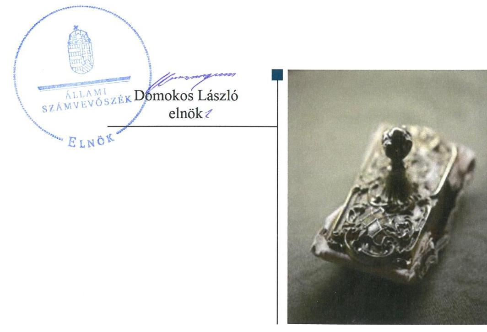

---

# Jelenetés 

## Önkormányzatok pénzügyi monitoring alapján végzett ellenőrzése

Három vagy négy önkormányzat alkotta közös önkormányzati hivatali székhely községi önkormányzatai, összesen 201 önkormányzat gazdálkodásának fenntarthatósága
2020. 01. hó 29. nap

---

Jelentéseink az Országgyűlés számítógépes hálózatán és az Interneten a www.asz.hu címen is olvashatóak.

## AZ ELLENŐRZÉST FELÜGYELTE:

HOLMAN MAGDOLNA JULIANNA felügyeleti vezető

## AZ ELLENŐRZÉST VEZETTE ÉS A VÉGREHAJTÁSÁÉRT FELELŐS:

KISTÓTH KRISZTINA ellenőrzésvezető

## A PROGRAM ÖSSZEÁLLÍTÁSÁÉRT FELELŐS:

SZAPPANOS JÚLIA osztályvezető

## A TÉMÁHOZ KAPCSOLÓDÓ KORÁBBI SZÁMVEVŐSZÉKI JELENTÉSEK:

- címe: Önkormányzatok pénzügyi monitoring alapján végzett ellenőrzése - A nagyközségi önkormányzatok gazdálkodásának fenntarthatósága
Önkormányzatok pénzügyi monitoring alapján végzett ellenőrzése - A városi önkormányzatok gazdálkodásának fenntarthatósága
Önkormányzatok pénzügyi monitoring alapján végzett ellenőrzése - 220 önálló polgármesteri hivatallal rendelkező községi önkormányzat gazdálkodásának fenntarthatósága
Önkormányzatok pénzügyi monitoring alapján végzett ellenőrzése - Öt vagy annál több önkormányzat alkotta közös önkormányzati hivatali székhely községi önkormányzatai, összesen 144 községi önkormányzat gazdálkodásának fenntarthatósága
- sorszáma: 18081; 19017; 19246; 19247

IKTATÓSZÁM: EL-2353-001/2019.
TÉMASZÁM: 2504
ELLENŐRZÉS-AZONOSÍTÓ SZÁM: V084802

---

# TARTALOMJEGYZÉK 

- ÉRTÉKELÉS ..... 5
- KÖVETKEZTETÉS ..... 7
- AZ ELLENŐRZÉS CÉLJA ..... 8
- AZ ELLENŐRZÉS TERÜLETE ..... 9
- AZ ELLENŐRZÉS HÁTTERE, INDOKOLTSÁGA ..... 11
- A JELENTÉS LÉNYEGES KÉRDÉSKÖREI ..... 12
- AZ ELLENŐRZÉS HATÓKÖRE ÉS MÓDSZEREI ..... 13
- MEGÁLLAPÍTÁSOK ..... 15
MELLÉKLETEK ..... 25
I. sz. melléklet: Fogalomtár ..... 25
II. sz. melléklet: Az ellenőrzési kritériumok módszertana és értékelése ..... 28
III. sz. melléklet: Az eszközök és források alakulása kiemelt mérlegsoronként a 2016-2017. években (E Ft) ..... 30
IV. sz. melléklet: Pénzügyi egyensúlyi helyzet CLF módszer szerinti értékelése a 2016-2017. években (E Ft) ..... 31
V. sz. melléklet: Az Önkormányzatok 2016-2017. évi főbb mutatóinak és kockázati területeinek összefoglaló értékelése ..... 33
VI. sz. melléklet: Az Önkormányzatok 2016-2017. évi főbb mutatóinak és kockázati területeinek részletes értékelése ..... 34
VII. sz. melléklet: Monitoring alá vont Önkormányzatok ..... 36
FÜGGELÉKEK ..... 39
I. sz. függelék: A jelentésben beazonosított 2017. évre vonatkozó kockázatokkal érintett önkormányzatok ..... 39
II. sz. függelék: Észrevételek ..... 41
- RÖVIDÍTÉSEK JEGYZÉKE ..... 43

---

.

---

# ÉRTÉKELÉS 

Az Állami Számvevőszék azon 201 közös hivatali székhely önkormányzat gazdálkodásának a kockázatait értékelte, amelyekhez három vagy négy községi önkormányzat tartozik. A 2016. és 2017. évekre vonatkozó önkormányzati éves beszámolók adatai szerint az önkormányzatok gazdálkodása stabil volt, a pénzügyi egyensúly és a vagyon értékének megőrzését biztosították. Az adósságkonszolidációt követően az önkormányzatok gazdálkodásának fenntarthatósága biztosított volt, a pozitív és növekvő pénzügyi pozíció mellett vagyonuk növekedett, azonban az eszközpótlásról nem gondoskodtak.

## Az ellenőrzés társadalmi indokoltsága

A magyar települési önkormányzatok a 2002-2008. között felhalmozott adósságállományának állami konszolidációjára 2011. és 2014. között került sor. Az adósságkonszolidációk eredményeként, illetve az önkormányzatok feladatellátása újra struktúrálódásával, rendszerszinten pénzügyi helyzetük helyreállt. Ugyanakkor az önkormányzatok gazdálkodásából eredő veszélyek miatt az ÁSZ továbbra is kiemelt figyelmet fordít az önkormányzatok pénzügyi egyensúlyi helyzetére ható kockázatok monitorizálására, a pénzügyi sérülékenységet okozó folyamatokra, az önkormányzati alrendszert veszélyeztető rendszeregyensúlyi kockázatokra annak érdekében, hogy a konszolidáció eredményei fenntarthatóak legyenek.

A Magyar Államkincstár központi információs rendszerében rendelkezésre álló önkormányzati éves költségvetési beszámolók adatait felhasználva, az önkormányzatok pénzügyi- és vagyongazdálkodási, valamint eladósodottság területen végzett monitoring riportok kiértékelésével az ÁSZ hozzájárul azon kockázatos területek feltárásához, amelyek rendszerszintű, vagy egyedi önkormányzati szintű beavatkozást igényelnek az önkormányzatok pénzügyi egyensúlyának fenntarthatósága érdekében.

Az önkormányzati törvény az önkormányzatok teherbíró képességére figyelemmel a differenciált hatáskör telepítés elvén alapul. Ez megjelenik az éves költségvetésükben. Erre figyelemmel a pénzügyi monitoringon alapuló ellenőrzés lehetőséget ad az egyes településtípus szerinti települések pénzügyi-gazdasági helyzetének rendszerszintű értékelésére, és a kockázatforrást jelentő területek beazonosítására. A községi településtípusba tartozó önkormányzatokon belül az ÁSZ önálló kockázati csoportot képzett a három és négy önkormányzat alkotta közös hivatali székhely községi önkormányzatokra. Emellett a monitoring típusú ellenőrzés az ÁSZ erőforrásainak hatékony felhasználásával, az adatbekérések minimalizálásával, a kockázatokra fókuszáltan, széles lefedettséget képes biztosítani az önkormányzati alrendszer területén.

---

# Főbb megállapítások 

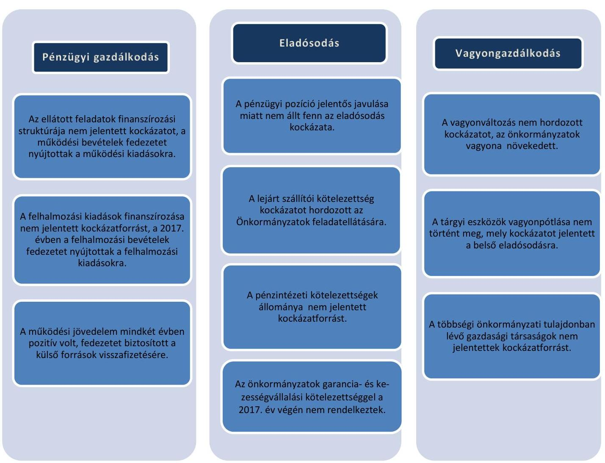

Az ellenőrzött időszakban az három és négy önkormányzat alkotta közös önkormányzati hivatalt fenntartó székhely önkormányzatok gazdálkodása stabil volt. Az önkormányzatok pénzügyi gazdálkodásának fenntarthatósága biztosított volt, pénzügyi pozíciójuk jelentős mértékben javult, könyvviteli mérleg szerinti vagyonuk növekedett, azonban az eszközpótlásról az ellenőrzött időszakban nem gondoskodtak.

---

# KÖVETKEZTETÉS 

201 három vagy négy önkormányzat alkotta közös önkormányzati hivatal székhely községi önkormányzat pénzügyi egyensúlya a feladatok és gazdálkodási feltételek lényeges változása nélkül fenntartható, rendszerszintű beavatkozást nem igényel. Az eladósodás rendszerszintű kockázata nem áll fenn. Az eszközpótlás finanszírozása, a vagyon értékének megőrzése területén intézkedéseket kell tenni annak érdekében, hogy a nemzeti vagyon alapvető rendeltetése, a közfeladat ellátása hosszú távon biztosított legyen.
A pénzügyi gazdálkodás, az eladósodás és a vagyongazdálkodás területén a 201 községi önkormányzat önkormányzati szintű kockázatait is értékeltük. A 2017. évre vonatkozó értékelést megküldtük a kockázatokkal érintett településekre, megjelölve a kockázatos területeket. E településeken közel 116 ezer ember él, az ellenőrzéssel érintett lakosság 40%-a.
Figyelemfelhívó levél keretében jeleztük

- a jelentés I. sz. függelékében szereplő, negatív működési jövedelemmel, 90 napon túli lejárt szállítóállománnyal, valamint lejárt kötelezettségekkel rendelkező, összesen 49 önkormányzat;
- a pénzügyi gazdálkodás, az eladósodás, a vagyongazdálkodás kockázati értékelését követően a kettő, vagy három területen közepes kockázattal rendelkező, összesen 35 önkormányzat
gazdálkodásából eredő 2017. évi kockázatokat. A pénzügyi egyensúly megteremtése, fenntartása érdekében, figyelemmel a 2018-2019-ben bekövetkezett változásokra ezen önkormányzatoknak a kockázatokat a 2019. év tekintetében értékelni kell. A kockázatok súlyának, a működési egyensúlyra és a feladatellátásra gyakorolt hatásának megfelelően kell az önkormányzatoknak a kockázatokat kezelniük, az intézkedéseket megtenniük.

---

# AZ ELLENŐRZÉS CÉLJA

**AZ ELLENŐRZÉS CÉLJA** az önkormányzatok központi információs rendszerében szereplő adatok értékelése alapján beazonosított kockázatok kezelésének előmozdítása.

---

# AZ ELLENŐRZÉS TERÜLETE

## A község településtípushoz tartozó 201 önkormányzat

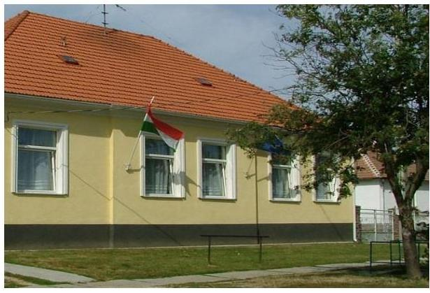

A MÁK1 törzskönyvi nyilvántartása szerint a 2016. és a 2017. években 2678 községi önkormányzat volt. Ezen belül csoportot képeznek azon közös hivatali székhely önkormányzatok, amelyekhez három vagy négy községi önkormányzat tartozik, összesen 201 önkormányzat (továbbiakban Önkormányzat2).

A települések 2017. január 1-jei népességszámát figyelembe véve 1000 fő lakosság szám alatt 46 önkormányzat, 1001-2000 fő között 119, 2001-3000 fő közötti lakosság számú önkormányzat 28, míg 3001 fő lakosság szám felett 4 önkormányzat volt. A 201 község állandó lakosságának száma 2016. január 1-jén 288 117 fő, 2017. január 1-jén 287 572 fő volt, 545 fővel csökkent.

Az Önkormányzatoknál az egy állandó lakosra jutó működési kiadások összege a 2016. évben 181,5 ezer Ft, a 2017. évben 186,9 ezer Ft volt, az egy lakosra jutó helyi adóbevétel pedig a 2016. és 2017-ben is 27,4 ezer Ft összegben teljesült. A 201 község közül a 105/2015. (IV. 23.) Korm. rendelet3 szerint 2017. január 1-jéig a társadalmi-gazdasági és infrastrukturális szempontból kedvezményezett települések száma 52, a jelentős munkanélküliséggel sújtott települések száma 49 volt.

Az önkormányzatok megyék szerinti eloszlását a térkép mutatja.

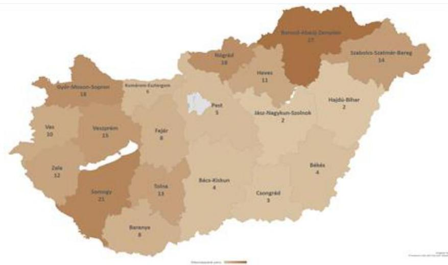

Az Önkormányzatok közül a 2016. évben 73, míg a 2017. évben 81 önkormányzat kapott önkormányzati rendkívüli támogatást.

A 201 önkormányzat közül 2016. évről a 2017. évre 5-nél intézmény megszűnés miatt feladatcsökkenés, míg 16 esetben új intézmények – óvodák, konyhák, szolgáltató központ, szociális központ, idősek otthona – alapításával feladatbővülés valósult meg.

Az Önkormányzatok többségi tulajdonú gazdasági társaságainak a száma 2015. évről a 2016. évre néggyel növekedett, míg a 2017. évben egygyel csökkent. A 2017. év végi többségi tulajdonú társaságok száma 33 volt.

---

Az Önkormányzatok összevont költségvetési beszámolók szerint teljesített éves költségvetési bevételét és költségvetési kiadását, a könyvviteli mérleg szerinti eszközök, a követelések és kötelezettségek állományi értékét az 1. táblázat mutatja be.

|  Év | Bevételek | Kiadások | Eszközök | Követelések | Kötelezettségek  |
| --- | --- | --- | --- | --- | --- |
|  2016. | 62327,6 | 58973,2 | 212278,6 | 4499,0 | 2581,3  |
|  2017. | 81087,4 | 65212,0 | 237238,6 | 7176,7 | 3340,6  |

Forrás: Önkormányzatok beszámolói

---

# AZ ELLENŐRZÉS HÁTTERE, INDOKOLTSÁGA 

AZ ÁSZ STRATÉGIÁJÁBAN célul tűzte ki, hogy az önkormányzatok ellenőrzése során azok pénzügyi-gazdasági helyzetét értékeli, kockázatait feltárja. Az új megközelítésű, elemzéssel alátámasztott mintavétellel, illetve ellenőrzési eljárásokkal csökkentse a helyszíni ellenőrzések számát. A monitoring rendszer az önkormányzatok éves költségvetési beszámolójának, időközi költségvetési jelentéseinek és mérlegjelentéseinek a központi információs rendszerben szereplő adatai értékelése alapján jelzi, hogy melyek azok az önkormányzatok, és melyek azok a területek, ahol olyan kedvezőtlen gazdasági folyamatok, vagy gazdasági események következtek be, amelyek ellenőrzés lefolytatását teszik indokolttá.

Ennek az egyszerűsített ellenőrzési módszernek az eredményeként megtörténik az önkormányzatok pénzügyi, vagyoni helyzetének megítélése, a pénzügyi egyensúly minősítése, továbbá a változások hatásának értékelése.

AZ ÖNKORMÁNYZATI ALRENDSZERBEN megjelenő gazdálkodási nehézségek, likviditási problémák és az eladósodottság növekedése az ÁSZ figyelmét a 2011. évtől az önkormányzatok pénzügyi helyzetére irányította. Az önkormányzati feladatellátást érintő átalakítások meghatározó része a 2013. évben következett be azzal, hogy az igazgatási, az oktatási, az egészségügyi és a szociális ellátásban a feladatok jelentős hányadát átvette az állam.

Az önkormányzati alrendszerben a 2013. évtől bevezetett új feladatfinanszírozási rendszer keretein belül továbbra is megoldandó kérdés a pénzügyi egyensúly megteremtése, hosszú távú fenntartása. Ahhoz, hogy az önkormányzatok meg tudjanak felelni a számukra meghatározott - szigorúbb - gazdálkodási szabályoknak, és az új feltételek mellett is biztosítható legyen a közszolgáltatások megfelelő színvonalú ellátása, szükséges volt a pénzügyi-gazdasági rendszerük alapjainak megszilárdítása, amely célt az adósságkonszolidáció szolgálta.

Az adósságkonszolidáció az önkormányzatok pénzügyi egyensúlyi helyzetére kedvező hatást gyakorolt, azonban a problémák kiváltó okait nem szüntette meg, ennek kezelése nélkül viszont az adósságállomány újratermelődhet. Erre tekintettel kiemelt fontosságú az önkormányzatok pénzügyi egyensúlyi helyzetére ható kockázatok feltárása.

---

# A JELENTÉS LÉNYEGES KÉRDÉSKÖREI 

1. Az önkormányzatok pénzügyi gazdálkodásának fenntarthatósága biztosított volt-e?
2. Fennállt-e az önkormányzatok eladósodásának kockázata?
3. Az önkormányzatok vagyongazdálkodása során biztosított volt-e a vagyon értékének a megőrzése?

---

# AZ ELLENŐRZÉS HATÓKÖRE ÉS MÓDSZEREI 

## Az ellenőrzés típusa

Helyénvalósági ellenőrzés.

## Az ellenőrzött időszak

A 2016-2017. évek.

## Az ellenőrzés tárgya

Az önkormányzati gazdálkodás fenntarthatósága, a törvényben előírt feladatok ellátása, az önkormányzatoknál észlelt negatív tendenciák okainak feltárása.

## Az ellenőrzött szervezet

Belügyminisztérium, mint a Kormány helyi önkormányzatokért felelős tagja által vezetett minisztérium, valamint a VII. számú melléklet szerinti monitoring alá vont önkormányzatok.

## Az ellenőrzés jogalapja

Az ellenőrzés jogszabályi alapját az Állami Számvevőszékről szóló 2011. évi LXVI. törvény 1. § (3) bekezdésének, az 5. § (2)-(6) bekezdéseinek, valamint az államháztartásról szóló 2011. évi CXCV. törvény 61. § (2) bekezdésének előírásai képezték.

## Az ellenőrzés módszerei

Az ellenőrzést az ellenőrzési program ellenőrzési kérdései, az ellenőrzött időszakban hatályos jogszabályok, az ellenőrzés szakmai szabályok és módszertanok figyelembe vételével végeztük.

Az ellenőrzés ideje alatt az

 ellenőrzött szervezettel történő kapcsolattartást az ÁSZ SZMSZ-ének vonatkozó előírásai alapján biztosítottuk.

Az ellenőrzési kérdések megválaszolásához szükséges bizonyítékok megszerzése a Magyar Államkincstár által rendelkezésre bocsátott adatokra alapozva elemző eljárással történt, amelyeket kontrolláltunk a nyilvánosan elérhető adatbázisokban szereplő adatokkal.

---

Az ÁSZ az ellenőrzés előkészítése során meghatározta az ellenőrzési (helyénvalósági) kritériumokat, amelyek az ellenőrzési bizonyíték értékelésének, valamint a számvevőszéki jelentésben szereplő megállapítások és következtetések alapját képezték. A megállapításokban használt fogalmak értelmezését, forrását a fogalomtár, a mutatók helyénvalósági kritériumait, és a kockázatok értékelését az ellenőrzési kritériumok módszertana és értékelése tartalmazza.

A pénzforgalmi adatokat tartalmazó mutatók számításánál a 2016. évben a 2015. évi végi adatokat, a 2017. évben a 2016. év végi adatokat tekintettük bázis adatnak. A mérlegadatokat tartalmazó mutatók esetében a 2016. január 1. és 2017. december 31. közötti adatokkal számoltunk. A gazdasági társaságok esetében a 2017. és 2018. évi VI. havi időközi költségvetési jelentésekben szereplő 2016. december 31-re és 2017. december 31-re vonatkozó társasági adatokat vettük figyelembe.

A kormányzati jóváhagyással megkötött hosszú lejáratú adósságot keletkeztető ügyletek, valamint a többségi önkormányzati tulajdonban lévő gazdasági társaságok kötelezettségei tételes ellenőrzése során felhasználtunk nyilvánosan elérhető adatokat (zárszámadási rendeletek, e-beszámoló, cégnyilvántartás adatai).

Az ellenőrzési kérdésekre adott válaszok alapján értékeltük, hogy az Önkormányzatok képesek voltak-e a törvényben meghatározott feladataikat ellátni, gazdálkodásuk változatlan formában fenntartható-e.

Az értékelést a felülvizsgált adatok alapján végezte az ÁSZ. A felülvizsgálat eredményeképpen a 201 önkormányzat 9,0%-ánál (18 önkormányzat) hajtott végre az ÁSZ adatkorrekciót az önkormányzatok többségi tulajdonában lévő gazdasági társaságokkal kapcsolatos adatokban, mely jelzi az önkormányzati beszámolók ezen területének megbízhatósági kockázatát.

---

# 1. Az önkormányzatok pénzügyi gazdálkodásának fenntarthatósága biztosított volt-e? 

Összegző megállapítás

## 2. táblázat

| MUTATÓK ALAKULÁSA |  |  |
| :--: | :--: | :--: |
| Mutatók | 2016.   év | 2017.   év |
| Működési kiadások fedezettsége | $107,3 \%$ | $106,8 \%$ |
| Rendkívüli önkormányzati támogatás aránya | $0,58 \%$ | $0,69 \%$ |
| Adóbevételek működési bevételeken belüli aránya | $14,1 \%$ | $13,4 \%$ |
| Felhalmozási kiadások fedezettsége | $93,2 \%$ | $206,5 \%$ |

Fonrás: Önkormányzatok beszámolói

Biztosított volt a pénzügyi gazdálkodás fenntarthatósága. A 2016-2017. években az Önkormányzatok feladat, felhalmozás és adósságszolgálat finanszírozása kielégítő volt.

Az Önkormányzatok által ellátott feladatok működési kiadásaira a működési bevételek fedezetet nyújtottak, ezért a feladatellátás finanszírozása nem hordozott kockázatot. A működési kiadások fedezettsége mutató 2016. évben 107,3%-ban, illetve 2017. évben 106,8%-ban teljesült, kis mértékben 0,5 százalékponttal csökkent. A fedezettség mutató változását okozta, hogy a működési kiadások kissé nagyobb mértékben (2,8%-kal) emelkedtek a működési bevételeknél (2,4%). A mutatók alakulását a 2. táblázat tartalmazza.

A működési kiadásokon belül a 2016. évről a 2017. évre a személyi juttatásoknál 2,2%-os, a dologi kiadásoknál 5,6%-os, az egyéb működési célú kiadásoknál 10,7%-os emelkedés történt. Az Önkormányzatok működési bevételein belül az államháztartáson belülről származó működési célú támogatások értéke 3,2%-al nőtt, míg a közhatalmi bevételek 0,2%-kal csökkentek a 2017. évben a 2016. évhez képest.

Önkormányzati rendkívüli támogatást a 2016. évben 73, a 2017. évben 81 önkormányzat kapott összesen 323,5 M Ft, illetve 396,5 M Ft értékben. A rendkívüli támogatás értéke 2016. évről a 2017. évre 22,6%-kal emelkedett. Az önkormányzati rendkívüli támogatás működési bevételekhez viszonyított aránya a 2016. évi 0,58%-ról 2017. évre 0,69%-ra nőtt, valamint a támogatásokhoz viszonyított rendkívüli támogatás aránya is emelkedett 1,1%-ról 1,3%-ra.

A 201 önkormányzat vonatkozásában összesen a támogatásoknak a működési bevételekhez viszonyított aránya mindkét évben alacsony volt. A működési bevételek összesítetten az Önkormányzatok rendkívüli támogatása nélkül is fedezetet nyújtottak a 2016. évben 106,7%-ban és a 2017. évben 106,1%-ban a működési kiadásokra, ezért a működés finanszírozása nem jelentett kockázatot a fenntartható gazdálkodásra.

Az adóbevételek állománya a 2016. évhez képest 2017-ben szinte változatlan összegben teljesült. A helyi iparűzési adó 2016. évben az adóbevételek 73,6%, 2017. évben 72,8%-át tette ki. A helyi iparűzési adóból származó bevétel a 2016. évben 5 807,2 M Ft volt, majd a 2017. évben 1,0%-kal kevesebb, 5 747,0 M Ft összegben realizálódott.

Az adóbevételek - kiemelten a helyi iparűzési adóbevételek - alakulását az 1. ábra mutatja be.

---

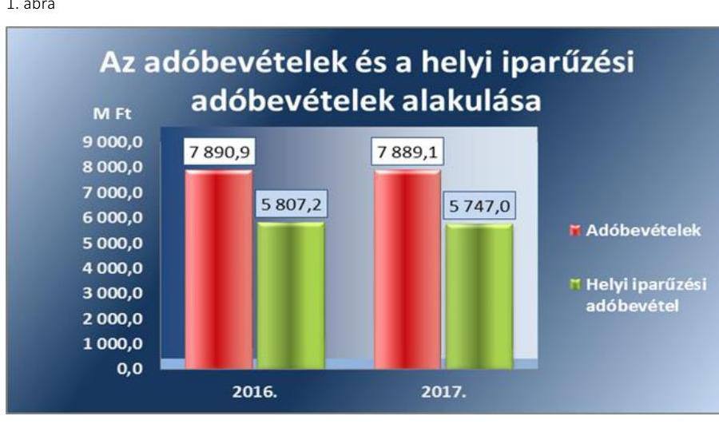

Forrás: Önkormányzatok beszámolói
Az adóbevételek működési bevételen belüli aránya csökkent, a 2016. évben 14,1%-ról, a 2017. évben 13,7%-ra, változása csekély mértékű, 0,33 százalékpont volt. Az adóbevételek 1% alatti csökkenése mellett, 115 önkormányzatnál nőtt az adóbevételek állománya a 2017. évben az előző időszakhoz képest, ezért az adóbevételek változása nem hordozott kockázatot az Önkormányzatok működési egyensúlyi helyzetére.

A felhalmozási kiadásokra az Önkormányzatok a 2016. évben a költségvetési kiadások 11,3%-át, a 2017. évben 17,6%-át fordították. A felhalmozási bevételek a 2016. évben a felhalmozási kiadások 93,2%-ára, a 2017. évben 206,5%-ára nyújtottak fedezetet, a mutató jelentős mértékben 113,3 százalékponttal emelkedett 2017. évben az előző évhez képest. A felhalmozási költségvetés -455,2 M Ft forráshiányára 2016. évben a működési jövedelem fedezetet nyújtott, a folyó és a felhalmozás költségvetés összevont egyenlege 2016. év végén 3354,4 M Ft volt. A mutatók alakulását a 2. táblázat tartalmazza.

Az Önkormányzatoknál 2017-re a 2016. évhez viszonyítva 75,8%-kal nőtt a beruházási és felújítási kiadások összege, amelyre a felhalmozási bevételek növekedése fedezetet biztosított, mely kedvezően hatott az Önkormányzatok pénzügyi gazdálkodására.

A felhalmozási bevételek a 2016. évről a 2017. évre jelentős mértékben, közel négyszeresére növekedtek. A legjelentősebb - több, mint tízszeresét meghaladó - növekedés az államháztartáson belülről kapott támogatások vonatkozásában valósult meg, melynek összege a 2016. év 1850,4 M Ft-ról 2017. évben 19 653,5 M Ft-ra emelkedett.

A 2017. évben az államháztartáson belülről kapott támogatások jelentős részét képezték a Széchenyi 2020 operatív programjai keretében elnyert pályázati források, melyet az önkormányzatok jellemzően energetikai korszerűsítéssel, víz-szennyvíz-, gazdaság- és települési közlekedés-fejlesztéssel kapcsolatos feladatellátásra kaptak.

A 2016-2017. évek felhalmozási bevételeinek forrásösszetételét a 2. ábra mutatja be.

---

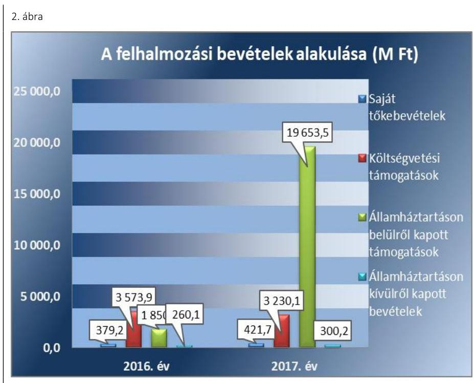

*Forrás: Önkormányzatok beszámolói*

A felhalmozási bevételek kiemelkedő növekedése mellett a felhalmozási kiadások finanszírozása az ellenőrzött időszakban nem hordozott kockázatot az Önkormányzatok pénzügyi gazdálkodására.

# **Az igénybevett külső források visszafizetésére** az Önkormányzatok megfelelő fedezettel rendelkeztek, de pénzügyi kapacitásuk csökkent. Az Önkormányzatoknak a 2016. évben 3 809,6 M Ft, 2017. évben 3 674,3 M Ft működési jövedelme keletkezett, amely fedezetet nyújtott a külső források adósságszolgálatának teljesítésére. Az Önkormányzatoknak a 2016. évben a működési jövedelem 26,4%-át, a 2017. évben 33,9%-át kellett hitel (tőke) törlesztésre fordítaniuk, az arány 7,5 százalékponttal emelkedett. A mutatók alakulását a 3. táblázat tartalmazza.

Az Önkormányzatok nettó működési jövedelme a 2016. évi 2 803,8 M Ft-ról, a 2017. évben 2 430,0 M Ft-ra 13,2%-kal csökkent. A nettó jövedelem csökkenését, egyrészt a működési jövedelem 3,6%-os csökkenésének, másrészt a hiteltörlesztésre fordított kiadások 23,7%-os növekedésének kedvezőtlen hatása okozta.

Az alacsony törlesztési fedezettség arány és a pozitív bár csökkenő nettó működési jövedelem nem hordozott kockázatot, azonban a mutató emelkedése és a romló pénzügyi kapacitás (nettó működési jövedelem) felhívja a figyelmet az Önkormányzatok jövedelemtermelő képességének csökkenésére.

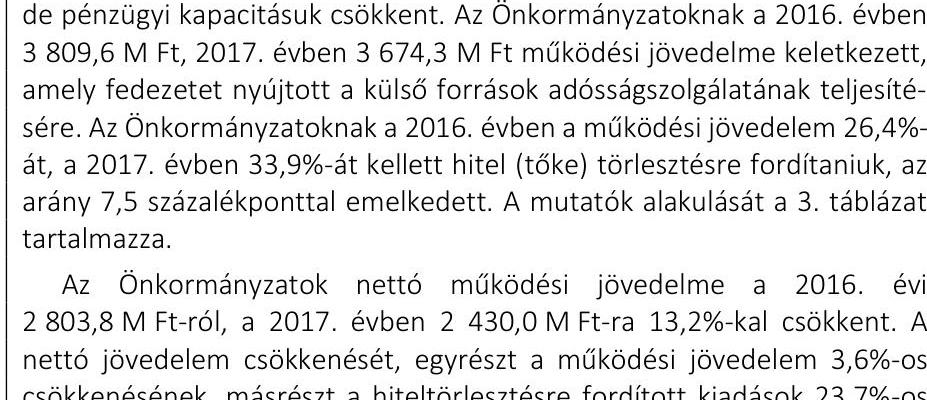

3. táblázat

|  MUTATÓK ALAKULÁSA |  |   |
| --- | --- | --- |
|  Mutatók | 2016. év | 2017. év  |
|  Törlesztés fedezettségének aránya | 26,4% | 33,9%  |
|  Nettó működési jövedelem (M Ft) | 2 803,8 | 2 430,0  |

*Forrás: Önkormányzatok beszámolói*

---

# 2. Fennállt-e az önkormányzatok eladósodásának kockázata? 

## Összegző megállapítás

Az Önkormányzatok gazdálkodásában az újbóli eladósodás kockázata nem állt fenn. Azonban a lejárt kötelezettségek állománya kockázatot hordozott a feladatellátásra.

A pénzügyi egyensúly az Önkormányzatoknál biztosított volt, a 2016. és a 2017. évben a költségvetési bevételek fedezetet nyújtottak a költségvetési kiadásokra. A maradvány igénybevétele - 2016. évben 10 088,6 M Ft, 2017. évben 12 401,2 M Ft értékben - tovább javította az Önkormányzatok pénzügyi helyzetét. A költségvetési bevételek és a költségvetési kiadások különbözete 2016 évben 3 354,4 M Ft volt, 2017 évben 15 875,3 M Ft-ra teljesült, több, mint a négyszeresére emelkedett. A pénzügyi egyensúlyi helyzet alakulását a 3. ábra mutatja be.
3. ábra
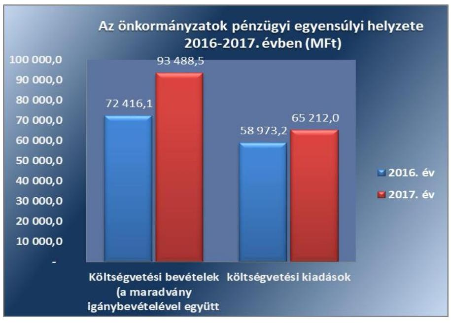

Forrás: Önkormányzatok beszámolói

Az idegen források alacsony aránya nem hordozott kockázatot az Önkormányzatok eladósodására, az eladósodási mutató értéke 2016-ban 1,2%, majd 2017-ben 1,4% volt. A mutató értékének változására hatással volt, hogy a kötelezettségek állománya, - ezen belül a dologi kiadások - nagyobb mértékben (29,4%-kal) emelkedett, mint a mérlegfőösszeg (11,8%-kal nőtt). Az Önkormányzatok eladósodási mutatójának változása 2016. évről 2017. évre +0,19 százalékpont volt, a mutató alacsony szintje és annak kismértékű változása nem hordozott kockázatot az Önkormányzatok újbóli eladósodására. A mutatók alakulását a 4. táblázat tartalmazza.

Az Önkormányzatok tárgyévi pénzügyi pozíciója 2016. és 2017. években pozitív volt, amelyet a folyó és a felhalmozási költségvetés együttes pozitív egyenlege eredményezett. Az Önkormányzatok esetében a pénzügyi pozíció a 2016. évben és a 2017. évben 2 276,4 M Ft, illetve 15 563,0 M Ft értékben realizálódott, közel hatszorosára emelkedett. A pénzügyi pozíció javulására kedvező hatással volt a felhalmozási költségvetési egyenleg jelentős, 12 656,2 M Ft-os emelkedése, a finanszírozási műveletek negatív

---

5. táblázat

| MUTATÓK ALAKULÁSA |  |  |
| :--: | :--: | :--: |
| Mutatók | 2016.   év | 2017.   év |
| Kötelezettségek do-   logi, felújítási beruhá-   zási kiadásokra állomány változása | $-40,6 \%$ | $+25,4 \%$ |
| Lejárt dologi, felújítási   beruházási kiadások-   kal kapcsolatos kötele-   zettségek állomány   aránya (szállítói állományból) | $14,0 \%$ | $9,3 \%$ |
| Lejárt dologi, felújítási, beruházási kiadásokkal kapcsolatos kötelezettségek állomány változása | $-27,0 \% \%$ | $-16,8 \% \%$ |
| Lejárt dologi kiadásokkal kapcsolatos kötelezettségek állomány aránya a dologi kiadások egy havi átlagához viszonyítva | $6,2 \%$ | $4,7 \%$ |
| 90 napon túl lejárt kötelezettségek állományának aránya (összes köt. állományból) | $0,49 \%$ | $0,46 \%$ |

egyenlegének 765,3 M Ft-os csökkenése, amely kompenzálta a működési jövedelem 135,2 M Ft-os csökkenését.

A finanszírozási műveletek nem hordoztak kockázatot, a finanszírozási műveletek egyenlege 2016. évben -1 078,0 M Ft volt, a 2017. évben a negatív egyenleg - 312,3 M Ft-ra csökkent. 2017. év során a hiteltörlesztés értéke 23,7%-kal, kis mértékkel jobban nőtt, mint a hitelfelvétel, mely 22,9%-kal emelkedett. A két év során összesen az értékpapír vásárlás értéke (2930,7 M Ft) 629,1 M Ft-tal meghaladta az értékpapír értékesítés összegét (2301,6 M Ft).

A szállítói kötelezettség (az Önkormányzatok dologi, beruházási és felújítási kiadásokkal kapcsolatos kötelezettség) állomány a teljes ellenőrzött időszakban 236 M Ft-tal (25,5%) csökkent. Ezen belül a 2016. évben 40,6%-kal csökkent, azonban a 2017. évben 25,4%-kal növekedett az előző időszakhoz képest. A mutatók alakulását az 5.
 táblázat tartalmazza.

Az Önkormányzatok szállítókkal szembeni lejárt szállítói kötelezettség állománya a 2016. évben - 27,0%-kal, a 2017. évben további -16,8%-kal, 64,2 M Ft-ra csökkent.

A szállítói kötelezettség állomány alakulását a 4. ábra szemlélteti.
4. ábra
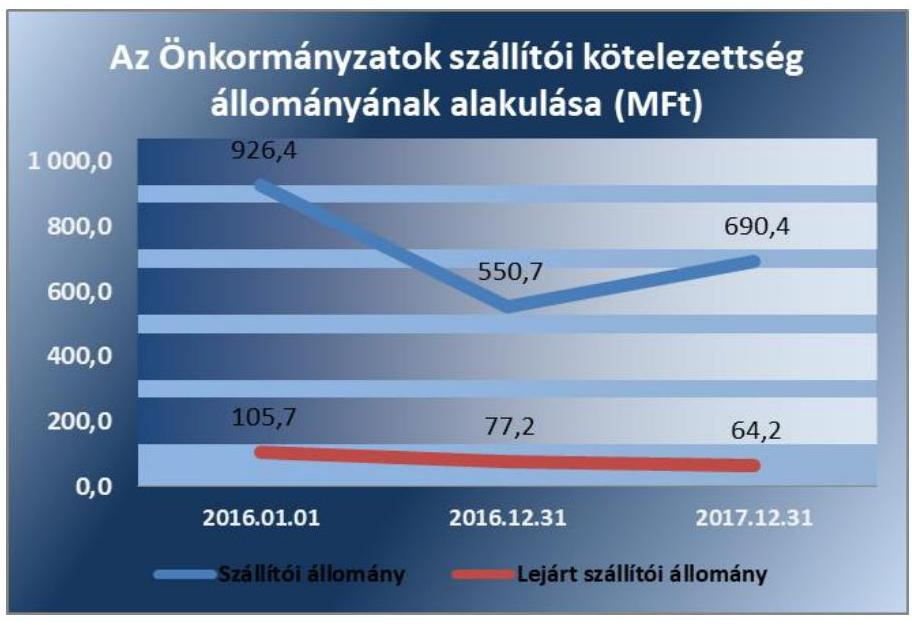

A lejárt szállítói állomány aránya a szállítói kötelezettségeken belül 2017. évben kedvezően változott, 4,7 százalékponttal csökkent a 2016. évhez képest, az arány a 2016. évben 14,0%, a 2017. évben 9,3% volt. A dologi kiadásokhoz kapcsolódó lejárt kötelezettségeknek a dologi kiadások egy havi átlagához viszonyított aránya 2016. évben 6,2%-ra, 2017. évben 4,7%-ra teljesült, mely 1,5 százalékponttal szintén alacsonyabban alakult.

A lejárt szállítói kötelezettség kockázatot hordoz az Önkormányzatok eladósodására. Ugyanakkor a lejárt szállítói állomány, annak a szállítói kötelezettségekhez és az egy havi dologi kiadásokhoz mért arányának a csökkenése, a kockázat fennállása mellett, kedvező változást jelzett az Önkormányzatok fizetőképességére.

---

6. táblázat

| MUTATÓK ALAKULÁSA |  |  |
| :--: | :--: | :--: |
| Mutatók | $\begin{gathered} 2016 . \\ \text { év } \end{gathered}$ | $\begin{gathered} 2017 . \\ \text { év } \end{gathered}$ |
| Banki kötelezettség állomány mérlegfőösszeghez mért nagysága | $0,06 \%$ | $0,03 \%$ |
| Banki kötelezettségek állományának változása | $+8,4 \%$ | $-33,1 \%$ |
| Garancia- és kezességvállalások állománya (M Ft) | 15,5 | 46,0 |

Forrás: Önkormányzatok beszámolói

Az Önkormányzatok 2016. év végén 12,5 M Ft, 2017. év végén 15,4 M Ft 90 napon túl lejárt tartozással rendelkeztek, az emelkedés 22,7% volt. A 90 napon túli kötelezettségek növekedése kockázatot hordozott az adósságrendezés megindítására, a pénzügyi függetlenség elvesztésére, korlátozására. Az ellenőrzött önkormányzatok közül 90 napon túl lejárt kötelezettsége 2016. évben nyolc, 2017. évben hat önkormányzatnak volt. 2017. évben Ináncs és Szakály önkormányzatának negatív volt a működési jövedelme. A negatív működési jövedelem mellett nem képződik elég bevétel a kötelezettségek teljesítésére, így ezen önkormányzatok esetében adósságrendezési eljárás indításának a veszélyét jelentő kockázatot azonosította az ellenőrzés.

## A PÉNZINTÉZETEK FELÉ FENNÁLLÓ KÖTELE-

ZETTSÉG (rövid- és hosszúlejáratú hitelekből származó tartozások) állománya az Önkormányzatoknál kedvezően alakult, mert a 2016. év végi 118,0 M Ft-ról, a 2017. év végére 79,0 M Ft-ra, 33,1%-kal csökkent. A banki kötelezettségállomány alakulására hatással volt, hogy az önkormányzatok által igénybe vett hitelfelvételek összege kisebb mértékben (22,9%-kal) növekedett, mint a hiteltörlesztés összege (23,7%-kal).

A banki kötelezettségállomány mérlegfőösszeghez mért nagysága alacsony volt és a 2016. évi 0,06%-ról 2017. évben 0,03%-ra csökkent. A mutatók alakulását a 6. táblázat tartalmazza.

Az Önkormányzatok a 2016. évben kormányzati jóváhagyáshoz kötött adósságot keletkeztető ügyletet 15,5 M Ft, míg a 2017. évben 46,0 M Ft értékben kötöttek, a hiteleket infrastrukturális beruházásokra, fejlesztésekre vették igénybe. Kormányzati hozzájáruláshoz nem kötött naptári éven túli futamidejú adósságot keletkeztető ügylet megkötésére az ellenőrzött időszakban (2016-2017. években) nem került sor.

A pénzintézeti kötelezettség állomány, továbbá annak a mérlegfőösszeghez mért aránya is kedvezően csökkent a 2017. évben, a banki kötelezettségek alakulása nem jelentett kockázatforrást az Önkormányzatok eladósodására.

GARANCIA- ÉS KEZESSÉGVÁLLALÁSBÓL származó függő kötelezettség az Önkormányzatoknál nem jelentett kockázatot, ezen a jogcímen kötelezettségük 2017. december 31-én nem volt. 2016. december 31-én egy önkormányzat rendelkezett garancia- és kezességvállalásból származó kötelezettséggel, 15,5 M Ft értékben.

Államháztartáson kívülre működési és felhalmozási célú garancia- és kezességvállalásból származó kifizetés a 2016. évben 8,6 M Ft, a 2017. évben 7,9 M Ft összegben történt.

---

# 3. Az önkormányzatok vagyongazdálkodása során biztosított volt-e a vagyon értékének a megőrzése? 

Összegző megállapítás

Az Önkormányzatok mérleg szerinti vagyona nőtt, de az eszközpótlások elmaradása kockázatot jelentett a vagyongazdálkodásra. A többségi tulajdonban lévő gazdasági társaságok csökkenő kötelezettségállománya és javuló eredménye nem hordozott kockázatot.

## 7. táblázat

MUTATÓK ALAKULÁSA

| Mutatók | 2016. év | 2017. év |
| :-- | --: | --: |
| Befektetett eszközök   fedezettsége | $103,3 \%$ | $106,1 \%$ |
| Ingatlanok és kap-   csolódó vagyoni ér-   tékű jogok állomá-   nyának változása   (M Ft) | $+7174,4$ | $+3916,6$ |
| Koncesszióba, va-   gyonkezelésbe adott   eszközök állományá-   nak változása (M Ft) | $+1797,1$ | $+903,5$ |
| Eszközpótlási mutató   (tárgyi eszközök ösz-   szesen) | $62,7 \%$ | $61,8 \%$ |
| Eszközpótlási mutató   (ingatlanok és kap-   csolódó vagyoni ér-   tékű jogokra) | $63,9 \%$ | $60,4 \%$ |

Forrás: Önkormányzatok beszámolói

A VAGYONVÁLTOZÁS 2016-2017. években nem hordozott kockázatot az Önkormányzatok vagyongazdálkodására. Az Önkormányzatok mérleg szerinti vagyona 2016. január 1-jén 199 800,0 M Ft volt, mely értéke 2016. évben 212 278,6 M Ft-ra 6,2%-kal, míg 2017. évben 237 238,6 M Ft-ra, további 18,7%-kal növekedett.

A vagyon összetételében 2016. január 1-jéhez képest 2017. december 31-re a nemzeti vagyonba tartozó befektetett eszközök aránya 8,3 százalékponttal csökkent, míg a pénzeszközök aránya 7,0 százalékponttal és a követelések aránya 1,6 százalékponttal nőtt. A nemzeti vagyonba tartozó forgóeszközök aránya nem változott. A 2016. évről a 2017. évre az önkormányzatok pénzeszközei több mint duplájára, 28 012,9 M Ft-ra nőttek, miközben az értékpapírok állománya 27,3%-kal 1247,3 M Ft-ra csökkent.

Az eszközök és források alakulását kiemelt mérlegsoronként a 2016-2017. években a III. számú melléklet tartalmazza. A mutatók alakulását a 7. táblázat tartalmazza.

Az Önkormányzatok nemzeti vagyonba tartozó befektetett eszközökön felüli eszközeinek összetételét a 2016-2017. években az 5. ábra szemlélteti.
5. ábra

Az Önkormányzatok eszközeinek összetétele a nemzeti vagyonba tartozó befektetett eszközökön felül a 2016-2017. években (M Ft)
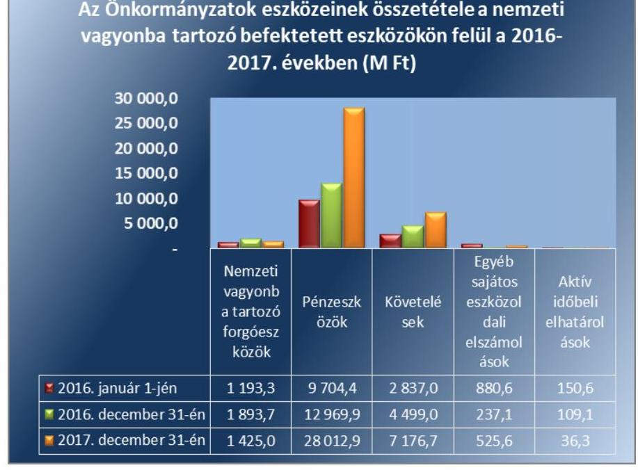

Forrás: Önkormányzatok beszámolói

---

Az Önkormányzatok vagyonában a befektetett eszközök jelentették a legnagyobb értéket, azon belül is az ingatlanok és a vagyoni értékű jogok, amelyek 2016. végén 170 894,2 M Ft-ot, és 2017.végén 174 810,9 M Ft-ot képviseltek. Az Önkormányzatoknál az ingatlanok és kapcsolódó vagyoni értékű jogok állománya a 2016. évben 7 174,1 M Ft-tal, majd a 2017. évben további 3 916,6 M Ft-tal növekedett. A növekedés a 2017. évben 45,4%-kal alacsonyabb volt, mint a 2016. évben.

A nemzeti vagyonba tartozó befektetett eszközökre a 2016. évben 103,3%-ban, a 2017. évben 106,1%-ban nyújtott fedezetet a saját tőke, a mutató 2,8 százalékponttal javult a 2017. évben az előző évhez képest. A befektetett eszközök fedezettsége nem hordozott kockázatot az Önkormányzatok vagyongazdálkodására.

Az Önkormányzatoknak a vagyon értékesítéséből származó bevételei a 2016. évben 376,3 M Ft-ot, a 2017. évben 420,0 M Ft-ot tettek ki, ugyanakkor beruházásra és felújításra a 2016. évben 6239,7 M Ft-ot, a 2017. évben 10 971,9 M Ft-ot fordítottak az Önkormányzatok.

# A KONCESSZIÓBA ÉS/VAGY VAGYONKEZELÉSBE 

ADOTT ESZKÖZÖK állománya a 2016. évben 1 797,1 M Ft-tal (18,3%), míg a 2017. évben 903,5 M Ft-tal (7,8%) növekedett. A változást mindkét évben a vagyonkezelésbe adás és visszavétel okozta. A koncesszióba, vagyonkezelésbe adott eszközök állományváltozása nem jelentett kockázatforrást az Önkormányzatok gazdálkodására.

A BELSŐ ELADÓSODÁS kockázatot hordozott az Önkormányzatok vagyongazdálkodására. Az Önkormányzatok a szükséges vagyonpótlást nem végezték el, a tárgyi eszközök eszközpótlása a 2016. évben 62,7%, a 2017. évben 61,8% volt. A tárgyi eszközökön belül az ingatlanok és kapcsolódó vagyoni értékű jogokra vonatkozó eszközpótlás a 2016. évben 63,9%, a 2017. évben 60,4% volt.

A tárgyévben aktivált beruházások, felújítások összegét, a tárgyi eszközök elszámolt értékcsökkenését, valamint a felhalmozási kiadások összegét a 6. ábra mutatja.
6. ábra
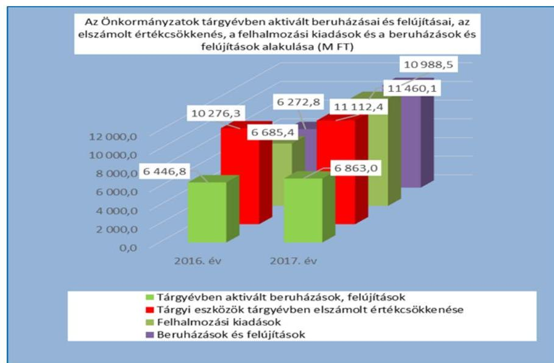

---

8. táblázat

|  |   |   |
| --- | --- | --- |
|  MUTATÓK ALAKULÁSA |  |   |
|  Mutatók | 2016 | 2017  |
|   | -69 | -69  |
|  Többségi önkormányzati |  |   |
|  tulajdonú gazdasági tár- |  |   |
|  saságok kötelezettségei | 199,0\% | $-8,6 \%$  |
|  állományának változása |  |   |
|  Többségi önkormányzati |  |   |
|  tulajdonú gazdasági tár- |  |   |
|  saságok számának válto- |  |   |
|  zása (db) | $+4$ | $-1$  |
|  Tartós részesedések állo- |  |   |
|  mányának változása | $+2,04 \%$ | $-1,05 \%$  |

Forrás: Önkormányzatok beszámolói

A beruházási és felújítási kiadások aránya a befektetett eszközökhöz viszonyítva 2016. évben 3,2% és 2017. évben 5,5% volt, az arány növekedése kedvező volt, azonban a hosszú átfutási idejű infrastrukturális beruházások miatt a kiadások egy része befejezetlen beruházásként jelenik meg, a befejezetlen beruházás állomány 2017. év végi értéke $4780,7 \mathrm{M}$ Ft volt.

Az Önkormányzatok nem gondoskodtak a szükséges eszközpótlásról, mely az eszközök állagának romlását okozza, egyúttal a rejtett, belső eladósodás kockázatát hordozza.

## A TÖBBSÉGI ÖNKORMÁNYZATI TULAJDONBAN LÉVŐ GAZDASÁGI TÁRSASÁGOK kötelezettségei és a társaságok javuló eredménye nem hordozott kockázatot az Önkormányzatok gazdálkodására és vagyongazdálkodására.

Az Önkormányzatok többségi és kisebbségi tulajdont jelentő tartós részesedéseinek állománya összesen 2016. év elejétől, a 2017. év végig 10,4 M Ft-tal növekedett, ezen belül a 2016. évben 2,04%-kal nőtt, majd a 2017. évben 1,05%-kal csökkent előző évhez képest. A változásokat a gazdasági társaságokban történt újabb részesedés szerzés, tőkeemelés és a megszűnő részesedések okozták. Az Önkormányzatok közül a 2016. és 2017. évben 180 önkormányzat rendelkezett tartós részesedéssel, ezen belül többségi tulajdonú részesedése a 2016. évben 34 és a 2017. évben 33 önkormányzatnak volt.

A többségi tulajdonban lévő gazdasági társaságok (továbbiakban gazdasági társaságok) száma 2016. január 1-jén 30 db, 2016. december 31-én 34 db, 2017. év végén 33 db volt. Az újonnan alakult gazdasági társaságok száma 2016. évben négy, a 2017. évben egy volt, míg a 2017. évben végelszámolási eljárással egy és felszámolási eljárással szintén egy gazdasági társaság szűnt meg. A mutatók alakulását a 8. táblázat tartalmazza.

A gazdasági társaságok kötelezettségei és eredményei alakulását a 7. ábra mutatja be.
7. ábra
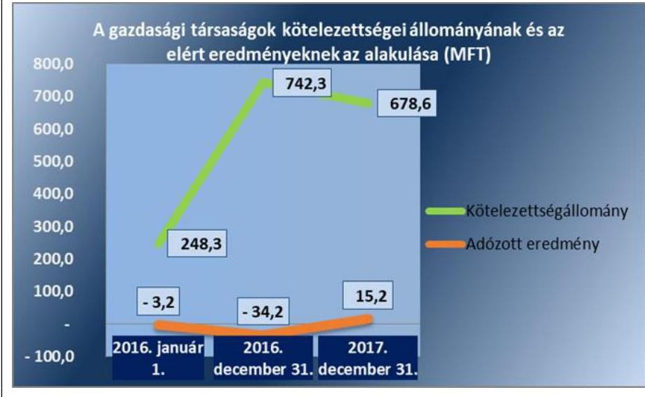

Forrás: Önkormányzatok beszámolói

A gazdasági társaságok kötelezettségeinek állománya az ellenőrzött időszakban 430,2 M Ft-tal növekedett, ezen belül 2016. évben nagymér-

---

tékben, 199%-kal nőtt, majd a 2017. évben 63,7 M Ft-tal, 8,6%-kal csökkent. Az Önkormányzatok gazdasági társaságainak együttes adózott eredménye az ellenőrzött időszakban javult, a 2016. évi -34,2 M Ft veszteséggel szemben 2017. évben az összesített eredmény pozitív volt, +15,2 M Ft.

---

# MELLÉKLETEK 

- I. SZ. MELLÉKLET: FOGALOMTÁR
adósságszolgálat
belső eladósodás kockázatforrás
beruházás

CLF módszer
eladósodás kockázatforrás
eszközpótlási mutató
felhalmozási bevétel
felhalmozási kiadás
felhalmozási kiadások és finanszírozása kockázatforrás
felújítás
finanszírozás kockázatforrás
folyó bevétel
folyó kiadás

Az adósság tőkerészének és az esedékes kamat együttes összegének törlesztése. Kockázatforrást jelent, ha az értékcsökkenések kompenzálásaként a szükséges vagyonpótlás nem történt meg, ha romlott az eszközök állaga, mert az rejtett eladósodást jelent.
A tárgyi eszköz beszerzése, létesítése, saját vállalkozásban történő előállítása, a beszerzett tárgyi eszköz üzembe helyezése. A beruházás a meglévő tárgyi eszköz bővítését, rendeltetésének megváltoztatását, átalakítását,

 élettartamának, teljesítőképességének közvetlen növelését eredményező tevékenység. (Forrás: Számv. tv. ${ }^{4}$ 3. § (4) bekezdés 7. pontja)

Az önkormányzatok költségvetése elemzésének módszere, amely a pénzügyi kapacitás (nettó működési jövedelem) fogalmát helyezi a középpontba. A módszer következetesen elkülöníti a folyó és a felhalmozási költségvetés bevételeit és kiadásait, azok költségvetési egyenlegeit. Bizonyos mértékig a vállalati gazdálkodás logikai elemeit érvényesíti az önkormányzatok pénzügyi, jövedelmi helyzetének vizsgálata során.
Az államháztartás önkormányzati alrendszerében felhalmozott adósság állam részéről történő kiegyenlítését, illetve átvállalását követően az önkormányzatok kiemelt feladata, egyben felelőssége az adósságállomány újratermelődésének megakadályozása. Kockázatforrást jelent, ha az önkormányzat kötelezettségei emelkednek, a mérlegben az idegen források aránya nő, az adósságkonszolidációt - helyi önkormányzatok adósságának állam által történő átvállalása - követően a gazdálkodás újra eladósodási pályára áll. Az eladósodás a pénzügyi gazdálkodás egyenes következménye, ugyanakkor hatással is van rá a folyó adósságszolgálat teljesítésén keresztül
A tárgyi eszközállomány elemzéséhez használt mutató, amely megmutatja, hogy az üzembe helyezett beruházások milyen hányadát képezi az elszámolt értékcsökkenésnek. Számításakor tárgyévben üzembe helyezett beruházások, felújítások értékét a tárgyi eszközök tárgyévben elszámolt értékcsökkenéséhez kell viszonyítani.
Az önkormányzatok tárgyévi felhalmozási célú költségvetési bevételei.
Az önkormányzatok tárgyévi felhalmozási célú költségvetési kiadásai.
Kockázatforrást jelent az erőn felüli beruházási aktivitás, illetve ha a folyamatban lévő felhalmozási feladatok finanszírozásához szükséges pénzügyi forrás nem áll az önkormányzat rendelkezésére.
Az elhasználódott tárgyi eszköz eredeti állaga (kapacitása, pontossága) helyreállítását szolgáló időszakonként visszatérő olyan tevékenység, melynek során az eszköz élettartama megnövekszik, minősége, használata jelentősen javul, így a pótlólagos ráfordításból a jövőben gazdasági előnyök származnak. (Forrás: Számv. tv. 3. § (4) bekezdés 8. pontja)
Kockázatforrást jelent, ha az önkormányzat nem rendelkezik megfelelő fedezettel a külső források adósságszolgálatának teljesítéséhez, ami hosszútávon vagyonfeléléshez vagy adósságspirálhoz vezethet.
Az önkormányzatok tárgyévi működési célú költségvetési bevételei
Az önkormányzatok tárgyévi működési célú költségvetési kiadásai

---

folyó költségvetés egyenlege
garancia- és kezességvállalás kockázatforrás
garanciavállalás
helyénvalósági ellenőrzés
kezességvállalás
kockázatforrás
koncessziós szerződés
kötvény
közfeladat

A folyó költségvetés egyenlege, azaz a működési jövedelem megmutatja, hogy az Önkormányzat éves folyó bevétele fedezetet biztosít-e a kötelező és önként vállalt feladatellátáshoz kapcsolódó éves folyó kiadására. A működési jövedelem negatív értéke pénzügyileg fenntarthatatlan helyzetet jelez. A mutató pozitív értéke megtakarítást mutat, amely forrásul szolgálhat az Önkormányzat fennálló kötelezettségei megfizetéséhez, valamint fejlesztéseihez.
Kockázatforrást jelent, ha a szerződés kötelezettje a szerződésben vállalt kötelezettségeit nem teljesíti a jogosultnak, mert azokért a kezes köteles helytállni. A garancia- és kezességvállalások függő kötelezettségként kockázatot jelentenek az önkormányzat költségvetésére, ezen keresztül a közfeladatok ellátására.
Olyan kötelezettségvállalás, ahol a garanciát vállaló valamely jövőbeni esemény bekövetkezésekor, a szerződésben meghatározott feltételek beálltakor a garancia kedvezményezettje számára meghatározott összegig, meghatározott időpontig, felszólításra azonnal fizet.
A helyénvalósági ellenőrzés a megfelelőségi ellenőrzés azon altípusa, amelyet azokban az esetekben kell alkalmazni, amelyekre jogszabályi előírások nem alkalmazhatóak, illetve amennyiben egyes kérdések megítélésénél nyilvánvaló jogszabályi hiányosságok vannak. Helyénvalósági ellenőrzés során a Számvevőszéknek a közszféra szilárd gazdálkodására és a köztisztviselők magatartására vonatkozó általános alapelvek mentén kell az ellenőrzést lefolytatni.
Szerződésben vállalt olyan kötelezettség, amelyben a kezes arra vállal kötelezettséget, hogy ha a szerződés kötelezettje nem teljesít a kezes maga fog helyette teljesíteni a jogosultnak. (Forrás: Ptk. 6:416.§).
A kockázatok kiváltó okait kockázatforrásnak nevezzük. Első lépésben azonosítjuk a nyomon követendő kockázatokat, majd a kockázatos területeket és a kiváltó okokat (kockázatforrásokat). Kockázatként azonosítjuk, ha az önkormányzat hosszú távon nem képes a törvényben meghatározott feladatait ellátni, költségvetése változatlan formában nem fenntartható. A kockázat értékelésének célja annak megállapítása, hogy a pénzügyi gazdálkodás, eladósodás, vagyongazdálkodás kockázati területek milyen mértékben befolyásolják, veszélyeztetik az önkormányzat működését, a közfeladatok ellátását. A három kockázati terület minősítéséhez összesen 10 kockázatforrást rendelünk.
Az állam, illetőleg az önkormányzat (önkormányzati társulás) kizárólagos tulajdonában lévő vagyontárgyak birtoklásának, használatának és hasznosításának, valamint a koncesszió-köteles tevékenységek gyakorlásának jogát, visszterhes szerződéssel, időlegesen úgy engedi át, hogy a jogosultnak részleges piaci monopóliumot biztosít.
A koncessziós szerződés olyan visszterhes szerződés, amelyben az állam vagy az önkormányzat a törvényben meghatározott tevékenységek gyakorlásának a jogát időlegesen úgy engedi át, hogy a jogosultnak részleges piaci monopóliumot biztosít.
Hosszabb lejáratra szóló, hitelviszonyt megtestesítő kamatozó értékpapír. A kötvényben a kibocsátó arra kötelezi magát, hogy a kötvényben megjelölt pénzösszegnek az előre meghatározott kamatát vagy egyéb jutalékait, továbbá az adott pénzösszeget a kötvény mindenkori tulajdonosának, illetve jogosultjának a megjelölt időben és módon megfizeti.
A közfeladat a jogszabályban meghatározott állami vagy önkormányzati feladat. A közfeladatok ellátása költségvetési szervek alapításával és működtetésével vagy az azok ellátásához szükséges pénzügyi fedezet e törvényben (Áht.) meghatározott eszközökkel, részben vagy egészben történő biztosításával valósul meg. A közfeladatok ellátásában államháztartáson kívüli szervezet jogszabályban meghatározott rendben közreműködhet. (Forrás: Áht. 3/A. § (1)-(2) bekezdés, 2015. január 1-jétől)

---

közfeladatok finanszírozási struktúrája kockázatforrás
nettó működési jövedelem
önkormányzat
önkormányzat rendkívüli támogatása
pénzintézetek felé történő eladósodás kockázatforrás
szállítók felé történő eladósodás kockázatforrás
többségi önkormányzati tulajdonban lévő gazdasági társaságok kockázatforrás vagyongazdálkodás
vagyonváltozás kockázatforrás

Kockázatforrást jelent, ha az önkormányzat pénzügyi helyzete jelentős függőséget mutat a külső körülményektől (adóbevételektől, kiegészítő állami támogatásoktól). A közfeladatok finanszírozási struktúrája nem kielégítő, ha a működési bevételek nem fedezik teljes mértékben az ellátott közfeladatokat.
A nettó működési jövedelem a jövedelemtermelő képességet méri. Megmutatja a működési bevételekből a működési kiadások és a hitelek tőketörlesztésének kifizetése után fennmaradó jövedelmet.
A helyi önkormányzat jogi személy. Az önkormányzati feladatok ellátását a képviselőtestület és szervei biztosítják. A képviselőtestület szervei: a polgármester, a főpolgármester, a megyei közgyűlés elnöke, a képviselő-testület bizottságai, a részönkormányzat testülete, a polgármesteri hivatal, a megyei önkormányzati hivatal, a közös önkormányzati hivatal, a jegyző, továbbá a társulás. A képviselő-testület a feladatkörébe tartozó közszolgáltatások ellátására - jogszabályban meghatározottak szerint - költségvetési szervet, a Polgári perrendtartásról szóló 1952. évi III. törvény szerinti gazdálkodó szervezetet (a továbbiakban: gazdálkodó szervezet), nonprofit szervezetet és egyéb szervezetet (a továbbiakban együtt: intézmény) alapíthat, továbbá szerződést köthet természetes és jogi személlyel vagy jogi személyiséggel nem rendelkező szervezettel. (Forrás: Mötv. ${ }^{7}$ 41. § (1), (2), (6) bekezdései)
A 2015-2016. években a megyei önkormányzatok rendkívüli támogatása, a települési önkormányzatok rendkívüli támogatása és a tartósan fizetésképtelen helyzetbe került helyi önkormányzatok adósságrendezésére irányuló hitelfelvétel visszterhes kamattámogatása, a pénzügyi gondnok díja.
Kockázatforrásnak tekintettük, ha az önkormányzat (újból) adósságot keletkeztet, ami a kivételektől eltekintve a 2012. évtől kormányengedély-köteles. A pénzintézetekkel szemben fennálló kötelezettségek esetén olyan függőségi viszony jöhet létre, ahol az önkormányzat pénzügyi helyzete olyan külső körülmények hatására változhat, amely kizárólag a bank egyoldalú döntésén múlik.
Kockázatforrást jelent, ha az önkormányzat növeli a dologi, felújítási, beruházási kötelezettségeit (szállítókkal szemben fennálló tartozásait), ami burkolt hitelezésnek minősülhet, és az elismert kötelezettségeit átmenetileg vagy véglegesen nem tudja határidőre teljesíteni.
Kockázatforrást jelent, hogy az önkormányzati tulajdonban lévő gazdasági társaságok adósságállományáért a tulajdonos önkormányzatot helytállási kötelezettség terheli.

A nemzeti vagyongazdálkodás feladata a nemzeti vagyon rendeltetésének megfelelő, az állam, az önkormányzat mindenkori teherbíró képességéhez igazodó, elsődlegesen a közfeladatok ellátásához és a mindenkori társadalmi szükségletek kielégítéséhez szükséges, egységes elveken alapuló, átlátható, hatékony és költségtakarékos működtetése, értékének megőrzése, állagának védelme, értéknövelő használata, hasznosítása, gyarapítása, továbbá az állam vagy a helyi önkormányzat feladatának ellátása szempontjából feleslegessé váló vagyontárgyak elidegenítése. (Forrás: Nvtv. 7. § (2) bekezdése)
Kockázatforrásként értékeltük, ha csökken a nemzeti vagyon, ha az önkormányzatok a vagyonértékesítésből származó bevételeket nem beruházásokra, a vagyon pótlására fordítják.

---

# II. SZ. MELLÉKLET: AZ ELLENŐRZÉSI KRITÉRIUMOK MÓDSZERTANA ÉS ÉRTÉKELÉSE 

Az ellenőrzés tárgya: Az önkormányzati gazdálkodás fenntarthatósága, a törvényben előírt feladatok ellátása, az önkormányzatnál észlelt negatív tendenciák okainak feltárása, amely az ellenőrzési kritériumok alapján kerül értékelésre.
Az ellenőrzési kritériumok meghatározása során első lépésben azonosításra kerültek az önkormányzati gazdálkodás fenntarthatóságának, a törvényben előírt feladatok ellátásának kockázatos területei és a kiváltó okai (kockázatforrások), amelyekhez minden esetben mutatószám került hozzárendelésre. A mutatószámok között a viszonyszámok (relatív mutatószámok) és az abszolút adatok (abszolút mutatószámok) egyaránt megtalálhatóak, amelyekhez a Magyar Államkincstár által szolgáltatott adatállományok (költségvetési beszámolók, időközi költségvetési jelentések, mérlegjelentések adatait) kerültek felhasználásra.
Az egyes kockázati területek és kockázatforrások minősítése „pontozásos módszerrel" a mutatószámok értékelése alapján történt.

- Első lépésben a mutatószámok értékelésére és egy háromelemű skálán történő elhelyezésére került sor. Az értékelés (a kategória határok meghatározása) elsődlegesen a mutatószámok közgazdasági értelmezése alapján, az Állami Számvevőszék ellenőrzési tapasztalatait felhasználva történt. Az értékelések alapján egy-egy mutató alacsony besorolás esetén 0 pontot, közepes esetén 1 pontot, magas kockázatjelzés esetén 2 pontot kapott. (PI.: ha a működési kiadások fedezettsége mutató 90\% alatti volt, akkor magas kockázati besorolást, 2 pontot, ha 100\% feletti volt akkor alacsony besorolást, 0 pontot kapott.) A %-ban kifejezett mutatók kockázati besorolására a pontos (több tizedes jegy) értékek alapján került sor, ugyanakkor az önkormányzati riport a mutatókat egy, illetve esetenként két tizedes számjegyig mutatja be.
- Annak érdekében, hogy a kockázatforrások minősítésénél a lényeges mutatók értéke legyen a meghatározó a jellegzetes mutatókéval szemben, a mutatószámok súlyozására került sor*. A súlyok mértékének megválasztásakor az elsődleges mutatókat középértéknek tekintve 1-es súly mellérendelése ${ }^{\dagger}$ történt. A főmutató súlya az elsődleges mutatók súlyának kétszeresében, míg a másodlagos mutatók súlya az elsődleges mutatók súlyának felében került meghatározásra. (PI.: a kockázatforrás minősítéséhez a működési kiadások fedezettségét főmutatóként vették figyelembe, ezért 2-es súlyt rendeltek hozzá. Így ha a mutató kockázati besorolása magas volt, a magas kockázati besoroláshoz rendelt 2 pontot szorozták a főmutatóhoz rendelt 2-es súlyszámmal és az elért pontszám 4, míg alacsony besorolás esetén a besoroláshoz rendelt 0 pontot szorozva a főmutatóhoz rendelt 2-es súlyszámmal elért pontszám 0 volt.)
- Ezt követően került sor az önkormányzati gazdálkodás fenntarthatóságának, a törvényben előírt feladatok ellátásának kockázatához rendelt kockázati területek és kockázatforrások értékelési ponthatárainak meghatározására oly módon, hogy kockázatforrásonként a mutatószámok súlyozott értékelésével elérhető összes pontszám három egyenlő részre (alacsony, közepes, magas) osztása történt meg. (PI.: A közfeladatok finanszírozási struktúrája kockázatforrás 1 db főmutató, 2 db elsődleges mutató és további 2 db másodlagos mutató alakulása alapján került értékelésre. A mutatók magas kockázati besorolása esetén - a súlyozást követően - elérhető legmagasabb pontszám 10 volt. Ezt három egyenlő részre osztva kerültek meghatározásra a közfeladatok finanszírozási struktúrájának értékelési ponthatárai, amely 0-3,32 pontig alacsony, 3,33-6,66 pontig közepes, 6,67-10 pont között magas kockázati minősítést kapott.)
- Az egyes kockázatforrások értékelésekor a kockázatforráshoz rendelt mutatószámok - súlyozással kapott - értékeinek összesítése és a kialakított értékelési ponthatárok szerinti minősítése történt meg. (PI.: egy önkormányzat minősítésekor a közfeladatok finanszírozási struktúrája kockázatforráshoz rendelt 5 db

[^0]
[^0]:    * A súlyozás kifejezi, hogy az alkalmazott mutatószámok egymáshoz képest milyen mértékben járulnak hozzá az adott kockázatforrás értékeléséhez.
    † Egy esetben a banki kötelezettségállomány mérlegfőösszeghez mért nagysága mutatónál a kockázatforrás kiegyensúlyozottabb megítélése érdekében az 1-es súlyozás helyett 1,5-ös

 súlyozás került alkalmazásra.

---

mutató - fentiekben bemutatott - értékelésével elért összes pontszám 7 volt, akkor a kockázatforrás a hármas skálán a 6,67-10 pont közé került, így magas minősítést kapott.)

- Az egyes kockázati területek minősítése hasonlóan történt. Az egyes kockázati területeket meghatározó kockázatforrások pontjainak aggregálását követően, a kockázati területen elérhető összes pont három egyenlő részre osztásával kialakított skálán történő értékelésére került sor. Ha azonban a kockázatforrások közül legalább egy magas kockázati besorolást ért el, akkor a pontozás szerinti értékeléstől eltérően, a kockázati terület besorolása közepes kockázati minősítésűre módosult.

Az ellenőrzés tárgyának, az önkormányzati gazdálkodás fenntarthatóságának, a törvényben előírt feladatok ellátásának értékelése:
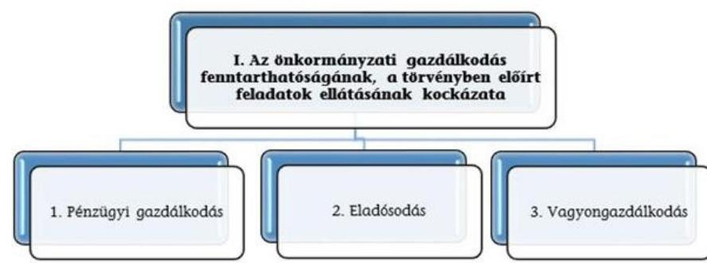

A három kockázati terület együttes értékelése alapján az alábbi mátrix segítségével kerül meghatározásra az önkormányzati gazdálkodás fenntarthatóságának, a törvényben előírt feladatok ellátásának értékelése a következők szerint:
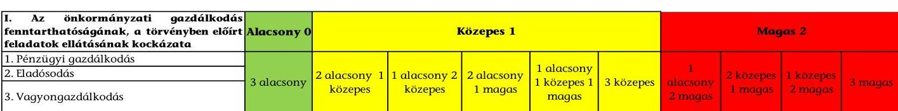

---

III. SZ. MELLÉKLET: AZ ESZKÖZÖK ÉS FORRÁSOK ALAKULÁSA KIEMELT MÉRLEGSORONKÉNT A 2016-2017. ÉVEKBEN (E FT) Az Önkormányzatok 2016-2017. évi mérlegeinek adatai

| Megnevezés | 2016. január 1. | 2016. december 31. | 2017. december 31. |
| :--: | :--: | :--: | :--: |
| Befektetett eszközök   /NEMZETI VAGYONBA TARTOZÓ BEFEK-   TETETT ESZKÖZÖK | 185034171 | 192569923 | 200062305 |
| NEMZETI VAGYONBA TARTOZÓ FORGÓ-   ESZKÖZÖK | 1193281 | 1893703 | 1424977 |
| PÉNZESZKÖZÖK | 9704408 | 12969888 | 28012870 |
| KÖVETELÉSEK | 2836967 | 4498961 | 7176651 |
| EGYÉB SAJÁTOS ESZKÖZOLDALI ELSZÁ-   MOLÁSOK | 880646 | 237089 | 525554 |
| AKTÍV IDŐBELI ELHATÁROLÁSOK | 150566 | 109058 | 36261 |
| ESZKÖZÖK ÖSSZESEN | 199800039 | 212278622 | 237238618 |
| SAJÁT TÖKE | 188319709 | 198858533 | 212294041 |
| KÖTELEZETTSÉGEK | 2934505 | 2581287 | 3340625 |
| PASSZÍV IDŐBELI ELHATÁROLÁSOK | 8545825 | 10838802 | 21603952 |
| FORRÁSOK ÖSSZESEN | 199800039 | 212278622 | 237238618 |

---

|  1. FOLYÓ KÖLTSÉGVETÉS | 2016. év | 2017. év | Változás [\%]
(2017-2016) / 2016 |
| :--: | :--: | :--: | :--: |
| 1.1.1. Saját működési bevételek tulajdonosi bevételek nélkül | 12177966 | 12034077 | $-1,18 \%$ |
| 1.1.2. Költségvetési támogatások a működőképesség megőrzését szolgáló kiegészítő támogatások nélkül | 28022887 | 30004844 | 7,07\% |
| 1.1.3. Átengedett bevételek | 825568 | 843427 | 2,16\% |
| 1.1.4. Államháztartáson belülről kapott támogatások | 14474255 | 13791995 | $-4,71 \%$ |
| 1.1.5. EU-tól és külföldről kapott bevételek | 7362 | 17708 | 140,53\% |
| 1.1.6. Államháztartáson kívülről kapott bevételek | 169822 | 187979 | 10,69\% |
| 1.1.7. Hozam- és kamatbevételek (2014-ben a működési rész csak az önkormányzat nyilvántartása alapján pontosítható) | 33118 | 94808 | 186,28\% |
| 1.1.8. Kölcsönök visszatérülése, igénybevétele | 62857 | 54916 | $-12,63 \%$ |
| 1.1.9. Az önkormányzatok rendkívüli támogatásai | 323470 | 396496 | 22,58\% |
| 1.1. Folyó bevételek   (1.1.1.+1.1.2.+1.1.3.+1.1.4.+1.1.5.+1.1.6.+1.1.7.+1.1.8.+1.1.9.) | 56097305 | 57426251 | 2,37\% |
| 1.2.1. Működési kiadások kamatkiadások nélkül | 43095748 | 43799634 | 1,63\% |
| 1.2.2. Államháztartáson belülre átadott pénzeszközök | 6041156 | 6862669 | 13,60\% |
| 1.2.3.1. vállalkozásoknak | 397771 | 391956 | $-1,46 \%$ |
| 1.2.3.2. EU-nak, illetve külföldre | 16202 | 350 | $-97,84 \%$ |
| 1.2.3.3. magánszemélyeknek | 1893195 | 1853812 | $-2,08 \%$ |
| 1.2.3.4. non-profit szervezeteknek | 701008 | 746035 | 6,42\% |
| 1.2.3. Transzferkiadások | 3008176 | 2992153 | $-0,53 \%$ |
| 1.2.4. Kamatkiadások | 41889 | 32585 | $-22,21 \%$ |
| 1.2.5. Kölcsönök nyújtása, törlesztése | 100752 | 64873 | $-35,61 \%$ |
| 1.2. Folyó kiadások (1.2.1.+1.2.2.+1.2.3.+1.2.4.+1.2.5.) | 52287722 | 53751913 | 2,80\% |
| 1.3. Folyó költségvetés egyenlege, működési jövedelem (1.1. - 1.2.) | 3809582 | 3674337 | $-3,55 \%$ |
| 2. FELHALMOZÁSI KÖLTSÉGVETÉS |  |  |  |
| 2.1.1. Saját tőkebevételek | 379194 | 421723 | $11,22 \%$ |
| 2.1.2. Költségvetési támogatások | 3573879 | 3230089 | $-9,62 \%$ |
| 2.1.3. Államháztartáson belülről kapott támogatások | 1850416 | 19653486 | 962,11\% |
| 2.1.4. EU-tól és külföldről kapott támogatások | 65433 | 17645 | $-73,03 \%$ |
| 2.1.5. Államháztartáson kívülről kapott bevételek | 260135 | 300174 | $15,39 \%$ |
| 2.1.7. Kölcsönök visszatérülése, igénybevétele | 101198 | 38008 | $-62,44 \%$ |
| 2.1. Felhalmozási bevételek   (2.1.1.+2.1.2+2.1.3+2.1.4.+2.1.5.+2.1.6.+2.1.7.) | 6230255 | 23661125 | 279,78\% |
| 2.2.1. Saját beruházási kiadás áfával | 3239169 | 5438629 | 67,90\% |
| 2.2.2. Saját felújítási kiadás áfával | 3000564 | 5533281 | 84,41\% |
| 2.2.3. Államháztartáson belülre átadott pénzeszközök | 149721 | 125174 | $-16,40 \%$ |
| 2.2.4. EU-nak és külföldnek adott pénzeszközök | 500 | 0 | $-100,00 \%$ |
| 2.2.5. Államháztartáson kívülre adott pénzeszközök | 166101 | 257538 | 55,05\% |
| 2.2.6. Befektetéssel kapcsolatos kiadások | 33113 | 16608 | $-49,84 \%$ |
| 2.2.8. Kölcsönök nyújtása, törlesztése | 96281 | 88890 | $-7,68 \%$ |

---

| 2.2. Felhalmozási kiadások   (2.2.1.+2.2.2.+2.2.3.+2.2.4.+2.2.5.+2.2.6.+2.2.7.+2.2.8.+2.2.9.) | 6685449 | 11460121 | $71,42 \%$ |
| :--: | :--: | :--: | :--: |
| 2.3. Felhalmozási költségvetés egyenlege (2.1. - 2.2.) | $-455195$ | 12201004 | 2780,39\% |
| 3. FINANSZÍROZÁSI MŰVELETEK NÉLKÜLI (GFS) POZÍCIÓ (1.3.+2.3.) | 3354387 | 15875341 | 373,27\% |
| 4. FINANSZÍROZÁSI MŰVELETEK |  |  |  |
| 4.1. Hitelfelvétel | 987906 | 1213983 | $22,88 \%$ |
| 4.2. Hiteltörlesztés | 1005733 | 1244376 | $23,73 \%$ |
| 4.3. Forgatási és befektetési célú értékpapírok kibocsátása | 0 | 0 | $0,00 \%$ |
| 4.4. Forgatási és befektetési célú értékpapírok beváltása | 0 | 0 | $0,00 \%$ |
| 4.5. Forgatási és befektetési célú értékpapírok értékesítése | 524700 | 1776914 | $238,65 \%$ |
| 4.6. Forgatási és befektetési célú értékpapírok vásárlása | 1420675 | 1510053 | $6,29 \%$ |
| 4.7. Egyéb finanszírozási bevételek | 5043741 | 2370684 | $-53,00 \%$ |
| 4.8. Egyéb finanszírozási kiadások | 5207910 | 2919495 | $-43,94 \%$ |
| 4.9.Finanszírozási műveletek egyenlege (4.1.-4.2.+4.3.-   4.4.+4.5.-4.6.+4.7.-4.8.) | $-1077972$ | $-312342$ | $71,03 \%$ |
| 5. TÁRGYÉVI PÉNZÜGYI POZÍCIÓ (1.3.+ 2.3.+4.9.) | 2276415 | 15562999 | 583,66\% |
| 6. NETTÓ MŰKÖDÉSI JÖVEDELEM   (működési jövedelem (1.3.) - tőketörlesztés   $(4.2+4.4))$ | 2803849 | 2429962 | $-13,33 \%$ |
| * Az önkormányzat bevételei nem tartalmazzák az előző évi pénzmaradvány igénybevételét. |  |  |  |
| Tájékoztató adat: Maradvány igénybevétele | 10088546 | 12401207 |  |

---

# Összefoglaló értékelés 

| Azonosított kockázatok (értékelése: Magas=M / Közepes=K / Alacsony=A) | A kiválasztott önkormányzatok 2016. évi kockázati besorolása és pontozása | A kiválasztott önkormányzatok 2017. évi kockázati besorolása és pontozása |
| :--: | :--: | :--: |
| I. Az önkormányzati gazdálkodás fenntarthatóságának, a törvényben előírt feladatok ellátásának kockázata |  |  |
| 1. Pénzügyi gazdálkodás | A 3,0 | 5,0 |
| 1.1 Közfeladatok finanszírozási struktúrája | A 1,0 | 3,0 |
| 1.2 Felhalmozási kiadások és finanszírozása | K 2,0 | 0,0 |
| 1.3 Finanszírozás | A 0,0 | 2,0 |
| 2. Eladósodás | A 6,0 | 8,5 |
| 2.1 Adósságkonszolidációt követő időszakban bekövetkező eladósodás | A 0,0 | 2,0 |
| 2.2 Szállítók felé történő eladósodás | K 3,5 | 5,5 |
| 2.3 Pénzintézet felé történő eladósodás | A 0,5 | 1,0 |
| 2.4 Garancia- és kezességvállalás | K 2,0 | 0,0 |
| 3. Vagyongazdálkodás | M 16,0 | 9,0 |
| 3.1 Vagyonváltozás | A 1,0 | 1,0 |
| 3.2 Belső eladósodás | M 8,0 | 8,0 |
| 3.3 Többségi önkormányzati tulajdonban lévő gazdasági társaságok | M 7,0 | 0,0 |

---

| Kockázati területek /Kockázatforrások | Mutatók értéke 2016.12.31 | Kockázati besorolás 2016. év | Mutatók értéke 2017.12.31 | Kockázati besorolás 2017. év |
| :--: | :--: | :--: | :--: | :--: |
| I. Az önkormányzati gazdálkodás fenntarthatóságának, a törvényben előírt feladatok ellátásának kockázata |  | A |  | A |
| 1. Pénzügyi gazdálkodás |  |  |  | A |
| 1.1 Közfeladatok finanszírozási struktúrája |  |  |  | A |
| Működési kiadások fedezettsége | 107,3\% | A | 106,8\% | A |
| Önkormanyzati rendkívüli támogatás aránya | $0,58 \%$ | K | $0,69 \%$ | K |
| Adóbevételek működési bevételeken belüli arányának változása | - | - | $-0,33$ | K |
| Adóbevételek állományának változása | - | - | $-0,02 \%$ | K |
| Helyi iparűzési adóbevételek állományának változása | - | - | $-1,0 \%$ | K |
| 1.2 Felhalmozási kiadások és finanszírozása |  | K |  | A |
| Felhalmozási kiadások fedezettsége | $93,2 \%$ | K | 206,5\% | A |
| 1.3 Finanszírozás |  |  |  | A |
| Törlesztés fedezettségének aránya | 26,4\% | A | 33,9\% | A |
| Nettó működési jövedelem változása | - | - | $-13,2 \%$ | K |
| 2. Eladósodás |  | A |  | A |
| 2.1 Adósságkonszolidációt követő időszakban bekövetkező eladósodás |  | A |  | A |
| Eladósodási mutató | $1,2 \%$ | A | $1,4 \%$ | A |
| Eladósodási mutató változása | $-0,3$ | A | 0,2 | K |
| Tárgyévi pénzügyi pozíció változása |  |  | 583,7\% | A |
| 2.2 Szállítók felé történő eladósodás |  | K |  | K |
| Kötelezettségek dologi, felújítási beruházási kiadásokra állomány változása | $-40,6 \%$ | A | $25,4 \%$ | K |
| 90 napon túli lejárt kötelezettségek állományának aránya (az összes kötelezettség állományból) | $0,5 \%$ | M | $0,5 \%$ | M |
| Lejárt dologi, felújítási beruházási kiadásokkal kapcsolatos kötelezettségek állomány aránya (az összes kötelezettség állományból) | $14,0 \%$ | K | $9,3 \%$ | K |
| Lejárt dologi, felújítási beruházási kiadásokkal kapcsolatos kötelezettségek állomány változása | $-27,0 \%$ | A | $-16,8 \%$ | A |

---

| Lejárt dologi kiadásokkal kapcsolatos kötelezettségek állomány aránya a dologi kiadások egy havi átlagához viszonyítva | $6,2 \%$ | K | $4,7 \%$ | K |
| :--: | :--: | :--: | :--: | :--: |
| 2.3 Pénzintézet felé történő eladósodás |  | A |  | A |
| Banki kötelezettségállomány mérlegfőösszeghez mért nagysága | $0,06 \%$ | A |
 | $0,03 \%$ | A |
| Banki kötelezettségek (rövid és hosszúlejáratú hitelek és kötvénykibocsátásból származó tartozások) állományának változása | $8,4 \%$ | A | $-33,1 \%$ | A |
| Tárgyévben kormányzati jóváhagyással megkötött hosszú lejáratú adósságot keletkeztető ügyletek darabszáma | 1 | K | 2 | M |
| ...ügyletek értéke (E Ft) | 15523 | A | 46000 | A |
| Tárgyévben megkötött, kormányzati hozzájáruláshoz nem kötött, hosszúlejáratú adósságot keletkeztető ügyletek darabszáma | 0 | A | 0 | A |
| ... ügyletek értéke (E Ft) | 0,0 | A | 0,0 | A |
| 2.4 Garancia- és kezességvállalás |  | K |  | A |
| Garancia és kezességvállalások állománya (E Ft) | 15447 | K | 0 | A |
| 3. Vagyongazdálkodás |  | M |  | K |
| 3.1 Vagyonváltozás |  | A |  | A |
| Befektetett eszközök fedezettsége | 103,3\% | A | 106,1\% | A |
| Ingatlanok és kapcsolódó vagyoni értékű jogok állományának változása (E Ft) | 7174157 | A | 3916639 | A |
| Koncesszióba, vagyonkezelésbe adott eszközök állományának változása (E Ft) | 1797058 | M | 903481 | M |
| 3.2 Belső eladósodás |  | M |  | M |
| Eszközpótlási mutató (tárgyi eszközök összesen) | $62,7 \%$ | M | $61,8 \%$ | M |
| Eszközpótlási mutató (ingatlanok és kapcsolódó vagyoni értékű jogokra) | $63,9 \%$ | M | $60,4 \%$ | M |
| 3.3 Többségi önkormányzati tulajdonban lévő gazdasági társaságok |  | M |  | A |
| Többségi önkormányzati tulajdonú gazdasági társaságok kötelezettségei állományának változása | $199,0 \%$ | M | $-8,6 \%$ | A |
| ...gazdasági társaságok számának változása (db) | 4 | M | $-1$ | A |
| Tartós részesedések állományának változása | $2,04 \%$ | K | $-1,05 \%$ | A |

---

| sorszám | A település (községi önkormányzat) neve: | sorszám | A település (községi önkormányzat) neve: |
| :--: | :--: | :--: | :--: |
| 1 | Abda Község Önkormányzata | 45 | Egercsehi Községi Önkormányzat |
| 2 | Adásztevel Község Önkormányzata | 46 | Egervár Község Önkormányzata |
| 3 | Alap Község Önkormányzata | 47 | Egyházasrádóc Község Önkormányzata |
| 4 | Andocs Község Önkormányzata | 48 | Encsencs Község Önkormányzata |
| 5 | Attala Község Önkormányzat | 49 | Endrefalva Község Önkormányzata |
| 6 | Babarc Község Önkormányzata | 50 | Enese Község Önkormányzata |
| 7 | Bagod Község Önkormányzata | 51 | Eperjeske Község Önkormányzata |
| 8 | Bakonybél Község Önkormányzata | 52 | Farád Község Önkormányzata |
| 9 | Bakonycsernye Nagyközség Önkormányzata | 53 | Felsőnyárád Községi Önkormányzat |
| 10 | Bakonyszentlászló Község Önkormányzata | 54 | Felsőszentmárton Községi Önkormányzata |
| 11 | Bakonyszombathely Község Önkormányzata | 55 | Furta Község Önkormányzata |
| 12 | Balaton Községi Önkormányzat | 56 | Galambok Község Önkormányzata |
| 13 | Balatonfőkajár Község Önkormányzata | 57 | Géderlak Községi Önkormányzat |
| 14 | Balatonkeresztúr Község Önkormányzata | 58 | Gérce Község Önkormányzata |
| 15 | Bátaapáti Község Önkormányzata | 59 | Gesztely Község Önkormányzat |
| 16 | Becsehely Község Önkormányzata | 60 | Gölle Községi Önkormányzat |
| 17 | Berekböszörmény Község Önkormányzata | 61 | Görcsöny Községi Önkormányzat |
| 18 | Bodrogkeresztúr Község Önkormányzata | 62 | Gyermely Község Önkormányzata |
| 19 | Bodrogkisfalud Község Önkormányzata | 63 | Győrújfalu Községi Önkormányzat |
| 20 | Bolhó Község Önkormányzata | 64 | Gyulaháza Község Önkormányzata |
| 21 | Borota Községi Önkormányzat | 65 | Halászi Község Önkormányzata |
| 22 | Borsodbóta Község Önkormányzata | 66 | Hangony Községi Önkormányzat |
| 23 | Borsosberény Község Önkormányzata | 67 | Hegykő Község Önkormányzata |
| 24 | Böhönye Község Önkormányzata | 68 | Héhalom Község Önkormányzata |
| 25 | Budajenő Község Önkormányzata | 69 | Hetes Község Önkormányzata |
| 26 | Bükkábrány Község Önkormányzata | 70 | Hidasnémeti Község Önkormányzata |
| 27 | Csaholc Község Önkormányzata | 71 | Homokszentgyörgy Község Önkormányzata |
| 28 | Csanádalberti Község Önkormányzata | 72 | Horvátzsidány Község Önkormányzata |
| 29 | Csanádapáca Község Önkormányzata | 73 | Iharosberény Község Önkormányzata |
| 30 | Császár Község Önkormányzata | 74 | Ináncs Község Önkormányzata |
| 31 | Cserépfalu Község Önkormányzata | 75 | Jánkmajtis Község Önkormányzata |
| 32 | Cserhátsurány Község Önkormányzata | 76 | Kajárpéc Községi Önkormányzat |
| 33 | Csókakő Községi Önkormányzat | 77 | Kápolna Községi Önkormányzat |
| 34 | Csokonyavisonta Község Önkormányzata | 78 | Kápolnásnyék Község Önkormányzata |
| 35 | Csót Község Önkormányzata | 79 | Karmacs Község Önkormányzata |
| 36 | Csököly Község Önkormányzata | 80 | Kaszaper Község Önkormányzata |
| 37 | Csörötnek Község Önkormányzata | 81 | Kázsmárk Község Önkormányzata |
| 38 | Dág Község Önkormányzata | 82 | Kehidakustány Község Önkormányzata |
| 39 | Dalmand Község Önkormányzata | 83 | Kék Község Önkormányzata |
| 40 | Domoszló Községi Önkormányzat | 84 | Kenézy Község Önkormányzata |
| 41 | Döbrököz Község Önkormányzata | 85 | Kesznyéten Község Önkormányzata |
| 42 | Dunaszeg Község Önkormányzata | 86 | Keszü Község Önkormányzata |
| 43 | Dunaszentgyörgy Község Önkormányzata | 87 | Kimle Község Önkormányzata |
| 44 | Egerbakta Községi Önkormányzat | 88 | Királd Község Önkormányzata |

---

| Sorszám | A település (községi önkormányzat) neve: | sorszám | A település (községi önkormányzat) neve: |
| :--: | :--: | :--: | :--: |
| 89 | Kisar Község Önkormányzata | 133 | Pápateszér Község Önkormányzata |
| 90 | Kisbajcs Község Önkormányzata | 134 | Parasznya Község Önkormányzata |
| 91 | Kismaros Község Önkormányzata | 135 | Pázmándfalu Község Önkormányzata |
| 92 | Kővágószőlős Község Önkormányzata | 136 | Petőfiszállás Községi Önkormányzat |
| 93 | Kunágota Község Önkormányzata | 137 | Petőháza Község Önkormányzata |
| 94 | Kurd Község Önkormányzata | 138 | Porróapáti Község Önkormányzata |
| 95 | Kübekháza Községi Önkormányzat | 139 | Poroszló Községi Önkormányzat Képviselőtestülete |
| 96 | Látrány Község Önkormányzata | 140 | Pusztakovácsi Község Önkormányzata |
| 97 | Lesenceistvánd Község Önkormányzata | 141 | Püspökhatvan Község Önkormányzata |
| 98 | Lesencetomaj Község Önkormányzata | 142 | Rábapaty Község Önkormányzata |
| 99 | Lövő Község Önkormányzata | 143 | Rábatamási Község Önkormányzata |
| 100 | Ludányhalászi Községi Önkormányzat | 144 | Ramocsaháza Község Önkormányzata |
| 101 | Magyaratád Községi Önkormányzat | 145 | Réde Község Önkormányzata |
| 102 | Marcaltő Község Önkormányzata | 146 | Regöly Község Önkormányzata |
| 103 | Márkó Község Önkormányzata | 147 | Ruzsa Község Önkormányzata |
| 104 | Mátramindszent Község Önkormányzata | 148 | Ságújfalu Község Önkormányzata |
| 105 | Mátraszele Község Önkormányzata | 149 | Ságvár Község Önkormányzata |
| 106 | Mecseknádasd Önkormányzata | 150 | Sajóhidvég Község Önkormányzata |
| 107 | Mezőszilas Község Önkormányzat | 151 | Sajókeresztúr Község Önkormányzata |
| 108 | Mezőtárkány Község Önkormányzata | 152 | Sajóörös Község Önkormányzata |
| 109 | Mihálygerge Község Önkormányzata | 153 | Sé Község Önkormányzata |
| 110 | Nábrád Községi Önkormányzat | 154 | Segesd Község Önkormányzata |
| 111 | Nagyberki Község Önkormányzata | 155 | Semjénháza Községi Önkormányzat |
| 112 | Nagykamarás Község Önkormányzata | 156 | Serényfalva Község Önkormányzata |
| 113 | Nagykónyi Község Önkormányzata | 157 | Sirok Községi Önkormányzat |
| 114 | Nagykörű Községi Önkormányzat | 158 | Somogyjád Község Önkormányzata |
| 115 | Nagyoroszi Község Önkormányzata | 159 | Somogyszárd Község Önkormányzat |
| 116 | Nagysimonyi Község Önkormányzata | 160 | Somogyszob Községi Önkormányzat |
| 117 | Nagyszakácsi Község Önkormányzata | 161 | Somosköljfalu Község Önkormányzata |
| 118 | Nagyvázsony Község Önkormányzata | 162 | Surd Község Önkormányzata |
| 119 | Nemesbikk Község Önkormányzata | 163 | Szakály Község Önkormányzata |
| 120 | Nemesbőd Község Önkormányzata | 164 | Szakmár Község Önkormányzata |
| 121 | Nézsa Községi Önkormányzat | 165 | Szalánta Községi Önkormányzat |
| 122 | Nőtincs Község Önkormányzata | 166 | Szendrőlád Község Önkormányzata |
| 123 | Nyárád Község Önkormányzata | 167 | Szepetnek Községi Önkormányzat |
| 124 | Nyírcsászári Község Önkormányzata | 168 | Szigetbecse Község Önkormányzat |
| 125 | Nyírtét Község Önkormányzata | 169 | Szilsárkány Község Önkormányzata |
| 126 | Osli Községi Önkormányzat | 170 | Szurdokpüspöki Község Önkormányzata |
| 127 | Öcsény Község Önkormányzata | 171 | Szügy Község Önkormányzata |
| 128 | Örhalom Község Önkormányzata | 172 | Tác Község Önkormányzata |
| 129 | Öskü Község Önkormányzata | 173 | Tápszentmiklós Község Önkormányzata |
| 130 | Palotabozsok Község Önkormányzata | 174 | Tárkány Község Önkormányzata |
| 131 | Palotás Község Önkormányzata | 175 | Tarnalelesz Községi Önkormányzat |
| 132 | Pap Község Önkormányzata | 176 | Tarnaméra Községi Önkormányzat |

---

| Sorszám | A település (községi önkormányzat) neve: | sorszám | A település (községi önkormányzat) neve: |
| :--: | :--: | :--: | :--: |
| 177 | Tevel Község Önkormányzata | 190 | Vajdácska Község Önkormányzata |
| 178 | Tiszakóród Község Önkormányzata | 191 | Vál Község Önkormányzat |
| 179 | Tiszapalkonya Község Önkormányzata | 192 | Vanyarc Községi Önkormányzat |
| 180 | Tiszatarján Község Önkormányzata | 193 | Varbó Község Önkormányzata |
| 181 | Tiszatenyő Községi Önkormányzat | 194 | Városlőd Község Önkormányzata |
| 182 | Tolcsva Község Önkormányzata | 195 | Vasad Község Önkormányzata |
| 183 | Tolnanémedi Község Önkormányzata | 196 | Vaszar Község Önkormányzata |
| 184 | Torony Község Önkormányzata | 197 | Visonta Községi Önkormányzat |
| 185 | Tótvázsony Község Önkormányzata | 198 | Zákány Község Önkormányzata |
| 186 | Túristvándi Község Önkormányzata | 199 | Zalaszántó Község Önkormányzata |
| 187 | Túrje Község Önkormányzata | 200 | Zemplénagárd Községi Önkormányzat |
| 188 | Újudvar Község Önkormányzata | 201 | Zomba Község Önkormányzata |
| 189 | Úrhida Község Önkormányzat |  |  |

---

# FÜGGELÉKEK

I. SZ. FÜGGELÉK: A JELENTÉSBEN BEAZONOSÍTOTT 2017. ÉVRE VONATKOZÓ KOCKÁZATOKKAL ÉRINTETT ÖNKORMÁNYZATOK

|  Negatív

 müködési jövedelem miatti kockázat | Rendkívüli támogatás igénybevétele nélkül negatív müködési jövedelem miatti kockázat | Eladósodásra irányuló kockázat a 90 napon túl fennálló tartozás miatt | Eladósodás kockázata a lejárt szállítói tartozás müködési jövedelemhez viszonyított aránya miatt  |
| --- | --- | --- | --- |
|  Alap Község Önkormányzata | Alap Község Önkormányzata | Bodrogkisfalud Község Önkormányzata | Bodrogkisfalud Község Önkormányzata  |
|  Babarc Község Önkormányzata | Bodrogkisfalud Község Önkormányzata | Csaholc Község Önkormányzata | Csanádapáca Község Önkormányzata  |
|  Bátazpáti Község Önkormányzata | Csanádapáca Község Önkormányzata | Ináncs Község Önkormányzata | Cserépfalu Község Önkormányzata  |
|  Csanádapáca Község Önkormányzata | Cserépfalu Község Önkormányzata | Nőtincs Község Önkormányzata | Hidasnémeti Község Önkormányzata  |
|  Cserépfalu Község Önkormányzata | Csokonyavisonta Község Önkormányzata | Sé Község Önkormányzata | Ináncs Község Önkormányzata  |
|  Egerbakta Községi Önkormányzat | Egerbakta Községi Önkormányzat | Szakály Község Önkormányzata | Kunágota Község Önkormányzata  |
|  Egervár Község Önkormányzata | Egervár Község Önkormányzata | Az érintett önkormányzatok száma összesen: 6 | Somoskőújfalu Község Önkormányzata  |
|  Egyházasrádóc Község Önkormányzata | Egyházasrádóc Község Önkormányzata |  | Szakály Község Önkormányzata  |
|  Eperjeske Község Önkormányzata | Gesztely Község Önkormányzat | Ebből 90 napon túl fennálló tartozás mellett 2017-ben 2 önkormányzat müködési jövedelme negatív | Az érintett önkormányzatok száma összesen: 8  |
|  Géderlak Községi Önkormányzat | Hidasnémeti Község Önkormányzata |  |   |
|  Gérce Község Önkormányzata | Ináncs Község Önkormányzata |  |   |
|  Gesztely Község Önkormányzat | Kápolna Községi Önkormányzat |  |   |
|  Gölle Községi Önkormányzat | Kék Község Önkormányzata |  |   |
|  Hidasnémeti Község Önkormányzata | Látrány Község Önkormányzata |  |   |
|  Homokszentgyörgy Község Önkormányzata | Mátramindszent Község Önkormányzata |  |   |
|  Ináncs Község Önkormányzata | Nagykamarás Község Önkormányzata |  |   |
|  Kápolna Községi Önkormányzat | Nagyszakácsi Község Önkormányzata |  |   |
|  Kápolnásnyék Község Önkormányzata | Nemesbikk Község Önkormányzata |  |   |
|  Kehidakustány Község Önkormányzata | Nyírcsászári Község Önkormányzata |  |   |
|  Kék Község Önkormányzata | Örhalom Község Önkormányzata |  |   |
|  Kisbajcs Község Önkormányzata | Parasznya Község Önkormányzata |  |   |
|  Kunágota Község Önkormányzata | Somoskőújfalu Község Önkormányzata |  |   |
|  Látrány Község Önkormányzata | Szakály Község Önkormányzata |  |   |

---

| Negatív müködési jövedelem   miatti kockázat | Rendkívüli támogatás   igénybevétele nélkül   negatív müködési jövedelem   miatti kockázat | Eladósodásra irányuló kockázat   a 90 napon túl fennálló   tartozás miatt | Eladósodás kockázata   a lejárt szállítói tartozás   müködési jövedelemhez   viszonyított aránya miatt |
| :--: | :--: | :--: | :--: |
| Márkó Község Önkormányzata | Szilsárkány Község Önkormányzata |  |  |
| Mátramindszent Község   Önkormányzata | Tác Község Önkormányzata |  |  |
| Mátraszele Község Önkormányzata | Tevel Község Önkormányzata |  |  |
| Nagyberki Község Önkormányzata | Tiszakóród Község Önkormányzata |  |  |
| Nagykamarás Község Önkormányzata | Tiszapalkonya Község Önkormányzata |  |  |
| Nagyszakácsi Község Önkormányzata | Újudvar Község Önkormányzata |  |  |
| Nemesbikk Község Önkormányzata | Vasad Község Önkormányzata |  |  |
| Nyírcsászári Község Önkormányzata | Az érintett önkormányzatok   száma összesen: 30 |  |  |
| Parasznya Község Önkormányzata |  |  |  |
| Somoskőújfalu Község Önkormányzata |  |  |  |
| Szakály Község Önkormányzata |  |  |  |
| Szilsárkány Község Önkormányzata |  |  |  |
| Tevel Község Önkormányzata |  |  |  |
| Tiszakóród Község Önkormányzata |  |  |  |
| Újudvar Község Önkormányzata |  |  |  |
| Visonta Községi Önkormányzat |  |  |  |
| Zalaszántó Község Önkormányzata |  |  |  |
| Az érintett önkormányzatok   száma összesen: 40 |  |  |  |
| Ebből mindkét évben   negatív müködési   jövedelemmel rendelkező   önkormányzatok száma: 8 |  |  |  |

---

A jelentéstervezetet a Számvevőszék 15 napos észrevételezésre megküldte az ellenőrzött szervezetek vezetőinek az ÁSZ tv. 29. § (1) bekezdése előírásának megfelelően.

A belügyminiszter a jelentéstervezetre észrevételt nem tett.

[^0]
[^0]:    ${ }^{3}$ 29. § (1) Az Állami Számvevőszék az ellenőrzési megállapításait megküldi az ellenőrzött szervezet vezetőjének vagy az általa megbízott személynek, és annak, akinek személyes felelősségét állapította meg.
    (2) Az ellenőrzött szervezet vezetője és a felelősként megjelölt személy az ellenőrzés megállapításaira tizenöt napon belül írásban észrevételt tehet.
    (3) Az Állami Számvevőszék az észrevételre a beérkezésétől számított harminc napon belül írásban válaszol. A figyelembe nem vett észrevételeket köteles a jelentésben feltüntetni, és megindokolni, hogy azokat miért nem fogadta el.

---

.

---

# RÖVIDÍTÉSEK JEGYZÉKE 

${ }^{1}$ MÁK
${ }^{2}$ Önkormányzatok
${ }^{3}$ 105/2015. (IV. 23.) Korm. rendelet
${ }^{4}$ M Ft
${ }^{5}$ ÁSZ SZMSZ
${ }^{6}$ Számv. tv.
${ }^{7}$ Mötv.
${ }^{8} \mathrm{E} \mathrm{Ft}$

Magyar Államkincstár
három vagy négy önkormányzat alkotta közös önkormányzati hivatal székhely községi önkormányzat, összesen 201 önkormányzat
a kedvezményezett települések besorolásáról és a besorolás feltételrendszeréről szóló 105/2015. (IV. 23.) Korm. rendelet utolsó időállapota millió Ft-ban
Az Állami Számvevőszék Szervezeti és Működési Szabályzata 2000. évi C. törvény a számvitelről (hatályos: 2001. január 1-jétől) 2011. évi CLXXXIX. törvény Magyarország helyi önkormányzatairól (hatályos: 2012. január 1-jétől)
ezer Ft-ban

---

# ÁLLAMI SZÁMVEVŐSZÉK 

1052 Budapest, Apáczai Csere János utca 10.
Levélcím: 1364 Budapest 4. Pf. 54
Telefon: +36 14849100 Telefax: +36 14849200
www.asz.hu
