# Jelenetés 

## Önkormányzatok pénzügyi monitoring alapján végzett ellenőrzése

Kettő önkormányzat alkotta közös önkormányzati hivatali székhely községi önkormányzatai, összesen 216 önkormányzat gazdálkodásának fenntarthatósága
2020. 01. hó 23. nap
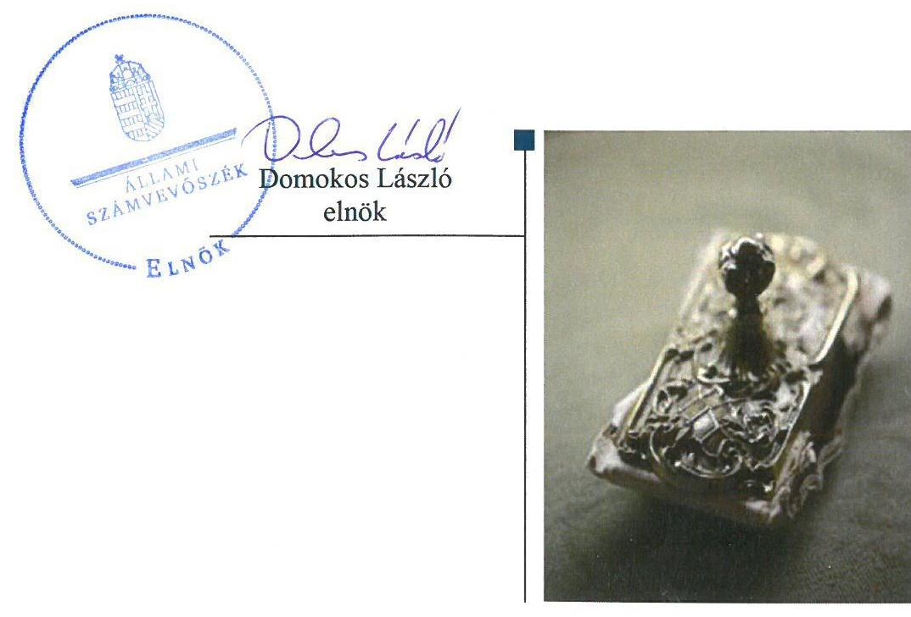

---

# Jelenetés 

## Önkormányzatok pénzügyi monitoring alapján végzett ellenőrzése

Kettő önkormányzat alkotta közös önkormányzati hivatali székhely községi önkormányzatai, összesen 216 önkormányzat gazdálkodásának fenntarthatósága
2020. 01. 23.

---

Jelentéseink az Országgyűlés számítógépes hálózatán és az Interneten a www.asz.hu címen is olvashatóak.

## AZ ELLENŐRZÉST FELÜGYELTE:

HOLMAN MAGDOLNA JULIANNA felügyeleti vezető

## AZ ELLENŐRZÉST VEZETTE ÉS A VÉGREHAJTÁSÁÉRT FELELŐS:

KISTÓTH KRISZTINA ellenőrzésvezető

## A PROGRAM ÖSSZEÁLLÍTÁSÁÉRT FELELŐS:

SZAPPANOS JÚLIA osztályvezető

## A TÉMÁHOZ KAPCSOLÓDÓ KORÁBBI SZÁMVEVŐSZÉKI JELENTÉSEK:

- címe: Önkormányzatok pénzügyi monitoring alapján végzett ellenőrzése - A nagyközségi önkormányzatok gazdálkodásának fenntarthatósága
Önkormányzatok pénzügyi monitoring alapján végzett ellenőrzése - A városi önkormányzatok gazdálkodásának fenntarthatósága
Önkormányzatok pénzügyi monitoring alapján végzett ellenőrzése - 220 önálló polgármesteri hivatallal rendelkező községi önkormányzat gazdálkodásának fenntarthatósága
Önkormányzatok pénzügyi monitoring alapján végzett ellenőrzése - Öt vagy annál több önkormányzat alkotta közös önkormányzati hivatali székhely községi önkormányzatai, összesen 144 községi önkormányzat gazdálkodásának fenntarthatósága
- sorszáma: 18081; 19017; 19246; 19247

IKTATÓSZÁM: EL-2352-001/2019.
TÉMASZÁM: 2504
ELLENŐRZÉS-AZONOSÍTÓ SZÁM: V084803

---

# TARTALOMJEGYZÉK 

- ÉRTÉKELÉS ..... 5
- KÖVETKEZTETÉS ..... 7
- AZ ELLENŐRZÉS CÉLJA ..... 8
- AZ ELLENŐRZÉS TERÜLETE ..... 9
- AZ ELLENŐRZÉS HÁTTERE, INDOKOLTSÁGA ..... 10
- A JELENTÉS LÉNYEGES KÉRDÉSKÖREI ..... 11
- AZ ELLENŐRZÉS HATÓKÖRE ÉS MÓDSZEREI ..... 12
- MEGÁLLAPÍTÁSOK ..... 14
MELLÉKLETEK ..... 25
I. sz. melléklet: Fogalomtár ..... 25
II. sz. melléklet: Az ellenőrzési kritériumok módszertana és értékelése ..... 29
III. sz. melléklet: Az eszközök és források alakulása kiemelt mérlegsoronként a 2016-2017. években (M Ft) ..... 31
IV. sz. melléklet: Pénzügyi egyensúlyi helyzet CLF módszer szerinti értékelése a 2016-2017. években (E Ft) ..... 32
V. sz. melléklet: Az Önkormányzatok 2016-2017. évi főbb mutatóinak és kockázati területeinek összefoglaló értékelése ..... 34
VI. sz. melléklet: Az Önkormányzatok 2016-2017. évi főbb mutatóinak és kockázati területeinek részletes értékelése ..... 35
VII. sz. melléklet: Monitoring alá vont Önkormányzatok ..... 37
- FÜGGELÉKEK ..... 41
I. sz. függelék: A jelentésben beazonosított 2017. évre vonatkozó kockázatokkal érintett önkormányzatok ..... 41
II. sz. függelék: Észrevételek ..... 43
- RÖVIDÍTÉSEK JEGYZÉKE ..... 45

---

.

---

# ÉRTÉKELÉS 

Az Állami Számvevőszék a kettő önkormányzat alkotta közös önkormányzati hivatali székhellyel rendelkező, összesen 216 község településtípusba tartozó önkormányzat gazdálkodásának a kockázatait értékelte. A 2016. és a 2017. évekre vonatkozó önkormányzati beszámolók adatai szerint az önkormányzatok gazdálkodása stabil volt, a pénzügyi egyensúlyt és a vagyon értékének megőrzését biztosították. Az adósságkonszolidációt követően az önkormányzatok gazdálkodásának fenntarthatósága biztosított volt, a pozitív és növekvő pénzügyi pozíció mellett vagyonuk növekedett.

## Az ellenőrzés társadalmi indokoltsága

A magyar települési önkormányzatok a 2002-2008. között felhalmozott adósságállományának állami konszolidációjára 2011. és 2014. között került sor. Az adósságkonszolidációk eredményeként, illetve az önkormányzatok feladatellátása újra strukturálódásával, rendszerszinten pénzügyi helyzetük helyreállt. Ugyanakkor az önkormányzatok gazdálkodásából eredő veszélyek miatt az ÁSZ továbbra is kiemelt figyelmet fordít az önkormányzatok pénzügyi egyensúlyi helyzetére ható kockázatok monitorizálására, a pénzügyi sérülékenységet okozó folyamatokra, az önkormányzati alrendszert veszélyeztető rendszeregyensúlyi kockázatokra annak érdekében, hogy a konszolidáció eredményei fenntarthatóak legyenek.

A Magyar Államkincstár központi információs rendszerében rendelkezésre álló önkormányzati éves költségvetési beszámolók adatait felhasználva, az önkormányzatok pénzügyi- és vagyongazdálkodási, valamint eladósodottság területen végzett monitoring riportok kiértékelésével az ÁSZ hozzájárul azon kockázatos területek feltárásához, amelyek rendszerszintű, vagy egyedi önkormányzati szintű beavatkozást igényelnek az önkormányzatok pénzügyi egyensúlyának fenntarthatósága érdekében.

Az önkormányzati törvény az önkormányzatok teherbíró képességére figyelemmel a differenciált hatáskör telepítés elvén alapul. Ez megjelenik az éves költségvetésükben. Erre figyelemmel a pénzügyi monitoringon alapuló ellenőrzés lehetőséget ad az egyes településtípus szerinti települések pénzügyi-gazdasági helyzetének rendszerszintű értékelésére, és a kockázatforrást jelentő területek beazonosítására. A községi településtípusba tartozó önkormányzatokon belül önálló kockázati csoportot képeztünk a kettő önkormányzat alkotta közös önkormányzati hivatal irányítási feladatait ellátó 216 önkormányzatra. Emellett a monitoring típusú ellenőrzés az ÁSZ erőforrásainak hatékony felhasználásával, az adatbekérések minimalizálásával, a kockázatokra fókuszáltan, széles lefedettséget képes biztosítani az önkormányzati alrendszer területén.

---

# Főbb megállapítások 

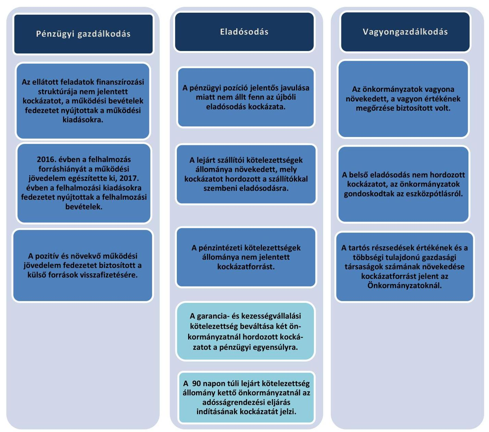

Az ellenőrzött időszakban a kettő önkormányzat alkotta közös önkormányzati hivatali székhellyel rendelkező, összesen 216 községi önkormányzat gazdálkodása stabil volt. Az önkormányzatok pénzügyi gazdálkodásának fenntarthatósága biztosított volt, erősödő pénzügyi pozíciójuk mellett növelték a vagyonukat. Az ellenőrzés azonban a 2017. év végi adatok alapján 2 községi önkormányzat esetében tárt fel az adósságrendezési eljárás megindításának a veszélyét jelentő kockázatot, amely a feladat ellátás tekintetében is magas kockázatot hordozott.

---

# KÖVETKEZTETÉS 

A kettő önkormányzat alkotta közös önkormányzati hivatali székhely községi önkormányzatai, összesen 216 önkormányzat pénzügyi egyensúlya - a feladatok és gazdálkodási feltételek lényeges változása nélkül - fenntartható, rendszerszintű beavatkozást nem igényel. Az eladósodás rendszerszintű kockázata nem áll fenn. Az önkormányzatok vagyongazdálkodása a nemzeti vagyon értékének megőrzése tekintetében nem jelent kockázatot.
A pénzügyi gazdálkodás, az eladósodás és a vagyongazdálkodás területén a 216 községi önkormányzat önkormányzati szintű kockázatait is értékeltük. A 2017. évre vonatkozó értékelést megküldtük a kockázatokkal érintett településekre, megjelölve a kockázatos területeket. E településeken közel 160 ezer ember él, az ellenőrzéssel érintett lakosság 39%-a.
Figyelemfelhívó levél keretében jeleztük

- a jelentés I. sz. függelékében szereplő, negatív működési jövedelemmel, 90 napon túli lejárt szállítóállománnyal, lejárt kötelezettségekkel, valamint magas garancia- és kezességvállalással rendelkező, összesen 47 önkormányzat;
- a pénzügyi gazdálkodás, az eladósodás, a vagyongazdálkodás kockázati értékelését követően a kettő, vagy három területen közepes kockázattal rendelkező, összesen 38 önkormányzat
gazdálkodásából eredő 2017. évi kockázatokat. A pénzügyi egyensúly megteremtése, fenntartása érdekében, figyelemmel a 2018-2019-ben bekövetkezett változásokra ezen önkormányzatoknak a kockázatokat a 2019. év tekintetében értékelni kell. A kockázatok súlyának, a működési egyensúlyra és a feladatellátásra gyakorolt hatásának megfelelően kell az önkormányzatoknak a kockázatokat kezelniük, az intézkedéseket megtenniük.

---

# AZ ELLENŐRZÉS CÉLJA

**AZ ELLENŐRZÉS CÉLJA** az önkormányzatok központi információs rendszerében szereplő adatok értékelése alapján beazonosított kockázatok kezelésének előmozdítása.

---

# **AZ ELLENŐRZÉS TERÜLETE**

## **A község településtípushoz tartozó 216 önkormányzat**

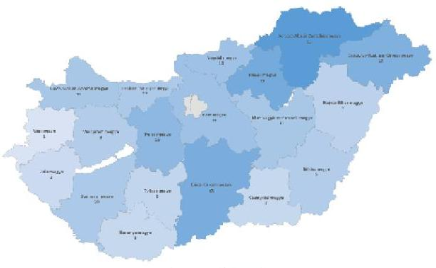

A 2678 községi önkormányzatból önálló kockázati csoportot képez a 216 község településtípusba tartozó önkormányzat¹, amelyek - a MÁK² törzskönyvi nyilvántartása szerint a 2016. évben és a 2017. évben is - a kettő önkormányzat alkotta közös önkormányzati hivatal székhely községi önkormányzatai voltak.

A 216 község állandó lakosságának száma összesen 2016. január 1-jén 408 748 fő, 2017. január 1-jén 408 401 fő volt, kis mértékben 347 fővel csökkent. A lakosságszám 147 településen a 2000 főt – ebből 7-nél az 1000 főt - nem érte el. 58 településen a lakosságszám 2001-3000 fő között volt és 11-nél a lakosságszám meghaladta a 3000 főt.

Az önkormányzatok esetében az egy állandó lakosra jutó működési kiadások összege a 2016. évben 163,0 ezer Ft, a 2017. évben 168,1 ezer Ft, míg az egy lakosra jutó helyi adóbevétel a 2016. évben 30,8 ezer Ft, a 2017. évben 32,8 ezer Ft összegben teljesült.

A 216 község közül a 105/2015. (IV.23.) Korm. rendelet³ szerint 67 társadalmi-gazdasági és infrastrukturális szempontból kedvezményezett, míg 56 jelentős munkanélküliséggel sújtott település volt, mindkettőbe az önkormányzatok 19,9%-a, 43 önkormányzat tartozott. Az önkormányzatok közül a 2016. évben 86 önkormányzat, a 2017. évben 81 önkormányzat kapott önkormányzati rendkívüli támogatást működési nehézségeik enyhítésére.

Az önkormányzatok többségi tulajdonában lévő gazdasági társaságok száma a 2016. évben 1 darabbal, a 2017. évben 2 darabbal növekedett, a 2017. évben 43 többségi tulajdonú gazdasági társaság működött.

2016. évben 14 önkormányzat szüntette meg, illetve adta más fenntartásába egy-egy közfeladat ellátására létrehozott intézményét (megszűnt 5 óvoda, 6 könyvtár és művelődési ház, kettő gondnokság és egy csatornamű). A 2017. évben 23 önkormányzat 24 közfeladatot ellátó intézménnyel bővült, melyek élelmezési (20 konyha), nevelési (2 óvoda), továbbá egy-egy művelődési és szociális feladatot láttak el.

Az önkormányzatok összevont költségvetési beszámolói szerint a teljesített éves költségvetési bevétel és költségvetési kiadás, a könyvviteli mérleg szerinti eszközök, a követelések és kötelezettségek állományi értékét az 1. táblázat mutatja be (M Ft⁴).

|  Év | Bevételek | Kiadások | Eszközök | Követelések | Kötelezettségek  |
| --- | --- | --- | --- | --- | --- |
|  2016. | 80 525,8 | 76 992,0 | 313 665,7 | 4 077,1 | 4 028,0  |
|  2017. | 111 068,3 | 87 355,0 | 346 504,7 | 7 107,6 | 4 112,1  |

*Forrás: Önkormányzatok beszámolói*

---

# AZ ELLENŐRZÉS HÁTTERE, INDOKOLTSÁGA 

Az ÁSZ stratégiájában célul tűzte ki, hogy az önkormányzatok ellenőrzése során azok pénzügyi-gazdasági helyzetét értékeli, kockázatait feltárja. Az új megközelítésű, elemzéssel alátámasztott mintavétellel, illetve ellenőrzési eljárásokkal csökkentse a helyszíni ellenőrzések számát. A monitoring rendszer az önkormányzatok éves költségvetési beszámolójának, időközi költségvetési jelentéseinek és mérlegjelentéseinek a központi információs rendszerben szereplő adatai értékelése alapján jelzi, hogy melyek azok az önkormányzatok, és melyek azok a területek, ahol olyan kedvezőtlen gazdasági folyamatok, vagy gazdasági események következtek be, amelyek ellenőrzés lefolytatását teszik indokolttá.

Ennek az egyszerűsített ellenőrzési módszernek az eredményeként megtörténik az önkormányzatok pénzügyi, vagyoni helyzetének megítélése, a pénzügyi egyensúly minősítése, továbbá a változások hatásának értékelése.

Az önkormányzati alrendszerben megjelenő gazdálkodási nehézségek, likviditási problémák és az eladósodottság növekedése az ÁSZ figyelmét a 2011. évtől az önkormányzatok pénzügyi helyzetére irányította. Az önkormányzati feladatellátást érintő átalakítások meghatározó része a 2013. évben következett be azzal, hogy az igazgatási, az oktatási, az egészségügyi és a szociális ellátásban a feladatok jelentős hányadát átvette az állam.

Az önkormányzati alrendszerben a 2013. évtől bevezetett új feladatfinanszírozási rendszer keretein belül továbbra is megoldandó kérdés a pénzügyi egyensúly megteremtése, hosszú távú fenntartása. Ahhoz, hogy az önkormányzatok meg tudjanak felelni a számukra meghatározott - szigorúbb - gazdálkodási szabályoknak, és az új feltételek mellett is biztosítható legyen a közszolgáltatások megfelelő színvonalú ellátása, szükséges volt a pénzügyi-gazdasági rendszerük alapjainak megszilárdítása, amely célt az adósságkonszolidáció szolgálta.

Az adósságkonszolidáció az önkormányzatok pénzügyi egyensúlyi helyzetére kedvező hatást gyakorolt, azonban a problémák kiváltó okait nem szüntette meg, ennek kezelése nélkül viszont az adósságállomány újratermelődhet. Erre tekintettel kiemelt fontosságú az önkormányzatok pénzügyi egyensúlyi helyzetére ható kockázatok feltárása.

---

# A JELENTÉS LÉNYEGES KÉRDÉSKÖREI 

1. Az önkormányzatok pénzügyi gazdálkodásának fenntarthatósága biztosított volt-e?
2. Fennállt-e az önkormányzatok eladósodásának kockázata?
3. Az önkormányzatok vagyongazdálkodása során biztosított volt-e a vagyon értékének a megőrzése?

---

# AZ ELLENŐRZÉS HATÓKÖRE ÉS MÓDSZEREI 

## Az ellenőrzés típusa

Helyénvalósági ellenőrzés.

## Az ellenőrzött időszak

A 2016-2017. évek.

## Az ellenőrzés tárgya

Az önkormányzati gazdálkodás fenntarthatósága, a törvényben előírt feladatok ellátása, az önkormányzatoknál észlelt negatív tendenciák okainak feltárása.

## Az ellenőrzött szervezet

Belügyminisztérium, mint a Kormány helyi önkormányzatokért felelős tagja által vezetett minisztérium, valamint a VII. számú melléklet szerinti monitoring alá vont önkormányzatok.

## Az ellenőrzés jogalapja

Az ellenőrzés jogszabályi alapját az Állami Számvevőszékről szóló 2011. évi LXVI. törvény 1. § (3) bekezdésének,

 az 5. § (2)–(6) bekezdéseinek, valamint az államháztartásról szóló 2011. évi CXCV. törvény 61. § (2) bekezdésének előírásai képezték.

## Az ellenőrzés módszerei

Az ellenőrzésre az ellenőrzési program ellenőrzési kérdései, az ellenőrzött időszakban hatályos jogszabályok, az ellenőrzés szakmai szabályai és módszertanai figyelembe vételével került sor.

Az ellenőrzés ideje alatt az ellenőrzött szervezettel történő kapcsolattartás az ÁSZ SZMSZ-ének vonatkozó előírásai alapján történt.

Az ellenőrzési kérdések megválaszolásához szükséges bizonyítékok megszerzése a Magyar Államkincstár által rendelkezésre bocsátott adatokra alapozva elemző eljárással történt, amelyek mintavétel alapján kerültek kontrollálásra a nyilvánosan elérhető adatbázisokban szereplő adatokkal.

---

Az ÁSZ az ellenőrzés előkészítése során meghatározta az ellenőrzési (helyénvalósági) kritériumokat, amelyek az ellenőrzési bizonyíték értékelésének, valamint a számvevőszéki jelentésben szereplő megállapítások és következtetések alapját képezték. A megállapításokban használt fogalmak értelmezését, forrását a fogalomtár, a mutatók helyénvalósági kritériumait, és a kockázatok értékelését az ellenőrzési kritériumok módszertana és értékelése tartalmazza.

Az ÁSZ a pénzforgalmi adatokat tartalmazó mutatók számításánál a 2017. évben a 2016. év végi adatokat tekintette bázisadatnak. A mérlegadatokat tartalmazó mutatók esetében a 2016. január 1. és 2017. december 31. közötti adatokkal számolt. A gazdasági társaságok esetében a 2017. és 2018. évi VI. havi időközi költségvetési jelentésekben szereplő 2016. december 31.-re és 2017. december 31.-re vonatkozó társasági adatokat vette figyelembe.

A mintatételek (kormányzati jóváhagyással megkötött hosszú lejáratú adósságot keletkeztető ügyletek, valamint a többségi önkormányzati tulajdonban lévő gazdasági társaságok kötelezettségei) ellenőrzése során felhasználásra kerültek nyilvánosan elérhető adatok (zárszámadási rendeletek, e-beszámoló, cégnyilvántartás adatai).

Az ellenőrzési kérdésekre adott válaszok alapján az ÁSZ értékelte, hogy az Önkormányzatok képesek voltak-e a törvényben meghatározott feladataikat ellátni, gazdálkodásuk változatlan formában fenntartható-e.

Az értékelést a felülvizsgált adatok alapján végezte az ÁSZ. A felülvizsgálat eredményeképpen a 216 önkormányzat 15,74%-ánál (34 önkormányzat) hajtott végre az ÁSZ adatkorrekciót az önkormányzatok többségi tulajdonában lévő gazdasági társaságokkal, illetve a kormányzati jóváhagyással megkötött adósságot jelentő ügyletekkel kapcsolatos adatokban, mely jelzi az önkormányzati adatszolgáltatások ezen területének megbízhatósági kockázatát.

---

# 1. Az önkormányzatok pénzügyi gazdálkodásának fenntarthatósága biztosított volt-e? 

Összegző megállapítás

Az Önkormányzatok által ellátott feladatok tekintetében a működés, a felhalmozás és az adósságszolgálat finanszírozási struktúrája biztosította a pénzügyi gazdálkodás fenntarthatóságát.

## 2. táblázat

MUTATÓK ALAKULÁSA

| Mutatók | 2016.   év | 2017.   év |
| :--: | :--: | :--: |
| Működési kiadások fedezettsége | 108,7% | 109,5% |
| Kiegészítő (rendkívüli) önkormányzati támogatás aránya | 0,69% | 0,53% |
| Adóbevételek működési bevételeken belüli aránya | 17,4% | 17,8% |
| Felhalmozási kiadások fedezettsége | 78,2% | 191,9% |

Forrás: Önkormányzatok beszámolói

Az ÖNKORMÁNYZATOK ÁLTAL ELLÁTOTT FELADATOK működési kiadásaira a működési bevételek 2016. évben 108,7%-ban és 2017. évben 109,5%-ban nyújtottak fedezetet. A működési kiadások fedezettsége kismértékben (0,8 százalékponttal) emelkedett, a működési kiadások (2032,9 M Ft-tal, 3,1%-kal) kisebb mértékben emelkedtek a működési bevételeknél (2759,5 M Ft-tal, 3,8%-kal).

A működési kiadásokon belül a 2016. évről a 2017. évre a személyi juttatásoknál 1,9%-os, a dologi kiadásoknál 8,3%-os, az egyéb működési célú kiadásoknál 13,6%-os emelkedés történt. A működési bevételeken belül az államháztartáson belülről kapott működési célú támogatások 2 151,2 M Ft, 6,4%-os és a közhatalmi bevételek 754,1 M Ft, 5,9%-os, 2016. évről a 2017. évre történő növekedése biztosította a fedezettség javulását.

## RENDKÍVÜLI ÖNKORMÁNYZATI TÁMOGATÁSBAN

a 2016. évben az Önkormányzatok 39,8%-a (86 db), a 2017. évben 37,5%-a (81 db) részesült. Az Önkormányzatok rendkívüli támogatásának összege a 2016. évről 20,2%-kal 497,4 M Ft-ról, a 2017. évben 396,9 M Ft-ra csökkent. Az önkormányzati rendkívüli támogatás működési bevételekhez viszonyított aránya a 2016. évi 0,69%-ról 2017. évre 0,53%-ra és a működési támogatásokhoz viszonyított aránya is a 2016. évi 1,5%-ról a 2017. évre 1,1%-ra csökkent. Az Önkormányzatok rendkívüli támogatásainak működési bevételekhez viszonyított aránya 2016. évben 0,01%-tól 19,5%-ig, értéke 10,9 ezer Ft-tól 74,6 M Ft-ig terjedt, míg a 2017. évben aránya 0,04%-tól 7,9%-ig és értéke a 130 ezer Ft-tól 28,6 M Ft-ig sávban mozgott.

A működési bevételek a 216 önkormányzat vonatkozásában összesítetten az Önkormányzatok rendkívüli támogatása nélkül is fedezetet nyújtottak 2016. és a 2017. években a működési kiadásokra, a fedezettség mutató támogatások nélkül, 2016. évben 107,9%-on, míg a 2017. évben 108,9%-on alakult.

Csökkent a rendkívüli támogatások értéke, az érintett önkormányzatok száma és tovább csökkent a támogatások működési bevételekhez viszonyított alacsony aránya is.

Ugyanakkor a 2016. évben 21 db, és a 2017. évben 22 db önkormányzat működési egyenlege a rendkívüli támogatás mellett is negatív volt. 7 önkormányzat működési egyenlege pedig mindkét évben negatív volt a rend-

---

kívüli támogatás ellenére is. Ezen önkormányzatok tartósan a rendkívüli támogatás mellett sem tudták a működési jövedelmüket egyensúlyba hozni, ez pénzügyi kockázatot hordozott a működés, a feladatellátás tekintetében.

Az ADÓBEVÉTELEK állománya az Önkormányzatoknál 2016. évről a 2017. évre 6,3%-kal nőtt, az adóbevételek aránya a működési bevételeken belül a 2016. évben 17,4%-ra, a 2017. évben 17,8%-ra teljesült, a 2017. évre 0,4 százalékponttal emelkedett. Az adóbevételeken belül az iparűzési adó aránya meghatározó, a 2016. évben 71,8% volt, míg 2017. évben ez az arány - 1,8 százalékponttal - 73,6%-ra emelkedett. Az iparűzési adóbevételek állománya 2016. évi 9 046,9 M Ft-ról, 2017. évben 9 862,8 M Ft-ra, 9,0%-kal emelkedett. Az adóbevételek állományának és arányának emelkedése javította az Önkormányzatok működési egyensúlyi helyzetét.

Az adóbevételek - kiemelten a helyi iparűzési adóbevételek - alakulását az 1. ábra mutatja be.
1. ábra
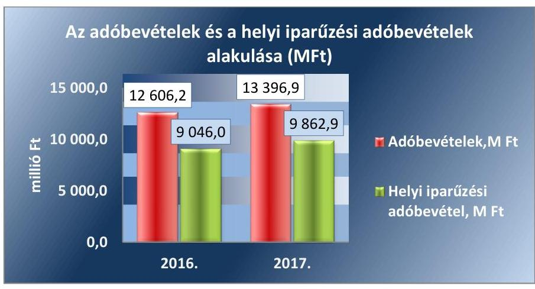

Forrás: Önkormányzatok beszámolói
Az Önkormányzatok által ellátott feladatok finanszírozási struktúrája nem jelentett kockázatforrást a pénzügyi gazdálkodásra, az önkormányzati rendkívüli támogatások csökkenő tendenciája és az adóbevételek növekedése tovább mérsékelte a kockázati kitettséget.

A FELHALMOZÁSI KIADÁSOK finanszírozása nem jelentett kockázatforrást az Önkormányzatok pénzügyi gazdálkodására.

Az Önkormányzatok a 2016. évben a költségvetési kiadások 13,5%-át, a 2017. évben 21,4%-át fordították fejlesztésekre. A felhalmozási bevételek a 2016. évben 78,2%, a 2017. évben 191,9%-ban nyújtottak fedezetet a felhalmozási kiadásokra. A 2016. évben a felhalmozási költségvetés hiányára a működési jövedelem fedezetet nyújtott, a működés és a felhalmozás együttes egyenlegének 2016. évi záró állománya 3 533,8 M Ft volt. A 2017. évben a felhalmozási bevételek már majdnem kétszeres fedezetet (191,9%) nyújtottak a felhalmozási kiadásokra. A felhalmozási kiadások fedezettsége mutató értéke a 2016. évről a 2017. évre jelentős mértékben, 113,7 százalékponttal javult. A mutatók alakulását a 2. táblázat tartalmazza.

---

A 2016. évről 2017. évre a felhalmozási kiadások összege 80,2%-kal nőtt, ugyanakkor a felhalmozási bevételek jóval nagyobb mértékben, 342,1%-kal emelkedtek. Ennek következtében a felhalmozási egyenleg kedvezően a 2016. évi -2 258,5 M Ft-ról, 2017. évre 17 194,4 M Ft-ra emelkedett, a növekedés 861,3% volt.

A 2016-2017. évek felhalmozási bevételeinek összetételét a 2. ábra mutatja be.
2. ábra

| A felhalmozási bevételek összetétele (M Ft) |  |  |
| :--: | :--: | :--: |
| 15000 | 10000 | 30224 |
| 30000 |  |  |
| 25000 | 10000 |  |
| 20000 |  |  |
| 15000 |  |  |
| 10000 | 4746 | 4219 |
| 5000 |  |  |
| 0 |  |  |
|  | 2016. | 2017. |

- Felhalmozási bevétel (saját tőkebevétel), M Ft
- Felhalmozási célú önkormányzati támogatások, M Ft
- Államháztartáson belülről kapott támogatások, M Ft

Forrás: Önkormányzatok beszámolói
2016. évről 2017. évre a beruházásra, felújításra fordított kiadások közel kétszeresére emelkedtek 9768,5 M Ft-ról 18 186,6 M Ft-ra. A növekedéshez a forrást az államháztartáson belülről kapott támogatások kiemelkedő, 28 426,4 M Ft-os emelkedése biztosította, mely kedvezően hatott az Önkormányzatok pénzügyi gazdálkodására. Az államháztartáson belülről kapott támogatások 2017. évre történő emelkedésének jelentős részét képezték a Széchenyi 2020 operatív programjai keretében elnyert pályázati források, melyekből az önkormányzatoknál szennyvíztisztító-telep és csatornahálózat fejlesztésekre, útépítésre, energiahatékonysági beruházásokra, informatikai eszközök fejlesztésére, belső folyamatok működését segítő szoftverek, eszközök beszerzésére, képzésekre került sor.

## AZ IGÉNYBEVETT KÜLSŐ FORRÁSOK VISSZAFIZETÉSE a 2016. és 2017. években nem hordozott kockázatot az Önkormányzatok pénzügyi gazdálkodásának fenntarthatóságára.

Az Önkormányzatoknak a 2016. évben + 5792,3 M Ft a 2017. évben + 6518,9 M Ft működési jövedelme keletkezett, 12,5%-al emelkedett a 2016. évről a 2017. évre. A pozitív és növekvő működési jövedelem mellett az Önkormányzatok hiteltörlesztése csökkent a 2017. évben 39,5%-al az előző évhez képest. Ezáltal az Önkormányzatoknak működési jövedelmük csökkenő arányát a 2016. évben 19,7%-át, a 2017. évben 10,3%-át kellett hiteltörlesztésre fordítaniuk. A 2016. évi alacsony törlesztés fedezettség arány a 2017. évben kedvezően 9,4 százalékponttal tovább csökkent. A mutatók alakulását a 3. táblázat tartalmazza.

---

Az Önkormányzatoknak a 2016. évben 4649,9 M Ft és 2017. évben 5845,6 M Ft nettó működési jövedelme keletkezett. A nettó működési jövedelem ugyancsak kedvezően változott, a 2016. évről a 2017. évre 25,7%-kal, 1195,7 M Ft-tal nőtt. A nettó működési jövedelem alakulására hatással volt a működési jövedelem 12,5%-os növekedése, valamint a hiteltörlesztésre fordított kiadások 39,5%-os csökkenése.

A pozitív és növekvő működési jövedelem fedezetet nyújtott a csökkenő külső források adósság-szolgálatának teljesítésére, így az nem jelentett kockázatot az Önkormányzatok gazdálkodására. A külső források visszafizetésének feltétele, az Önkormányzatok pénzügyi kapacitása kedvezően változott.

# 2. Fennállt-e az önkormányzatok eladósodásának kockázata? 

## Összegző megállapítás

4. táblázat

| MUTATÓK ALAKULÁSA |  |  |
| :--: | :--: | :--: |
| Mutatók | 2016. év | 2017. év |
| Eladósodási mutató | 1,28% | 1,19% |
| Eladósodási mutató változása százalékpontban | -0,03 | -0,09 |
| Pénzügyi pozíció változása | - | 615,2% |

Forrás: Önkormányzatok beszámolói

Az Önkormányzatok gazdálkodásában az eladósodás kockázata nem állt fenn, azonban a lejárt kötelezettségek növekedése kockázatot hordozott a feladatellátásra.

A PÉNZÜGYI EGYENSÚLY az Önkormányzatoknál a 2016. és a 2017. évben is biztosított volt. Az Önkormányzatok költségvetési bevételei a 2016. és a 2017. évben fedezetet nyújtottak a költségvetési kiadásokra és a maradvány igénybevétele - 2016. évben 11 781,0 M Ft, a 2017. évben 15 504,7 M Ft volt - tovább javította az Önkormányzatok pénzügyi helyzetét. Az Önkormányzatok folyó és a felhalmozási költségvetésének összesített egyenlege, azaz a költségvetési egyenleg mindkét évben pozitív volt, 2016-ról 2017-re több mint hatszorosára, 20 179,4 M Ft-tal emelkedett.

Az Önkormányzatok kötelezettségei, az idegen források nem jelentettek kockázatot az újbóli eladósodásra. Az eladósodási mutató az ellenőrzött időszakban kedvezően alakult, a mutató alacsony értéke a 2016. évben 1,28%-ról a 2017. évben 1,19%-ra tovább csökkent. A változását a kötelezettségek állományának a 2016-ról 2017-re 2,1%-os emelkedése mellett a mérlegfőösszegnek (+10,5%-os), a kötelezettségeket 8,4 százalékponttal meghaladó növekedése okozta. A mutatók alakulását a 4. táblázat tartalmazza.

A bevételek és kiadások finanszírozási műveletekkel együtt számított egyenlege, azaz a tárgyévi
 pénzügyi pozíció a 2016. év végi 3189,4 M Ft-ról, a 2017. év végére 22 811,6 M Ft-ra, azaz több, mint hétszeresére nőtt. A tárgyévi pénzügyi pozíció kedvező változását okozta az előző évhez képest a folyó költségvetés egyenlege, azaz a működési jövedelem 12,5%-os (0,7 M Ft) és a felhalmozási költségvetés egyenlege több mint hétszeres (19,5 M Ft) emelkedése. A pénzügyi pozíció értékét csökkentette a finanszírozási műveletek negatív egyenlege, a 2016. évben -344,4 M Ft és a 2017. évben -901,7 M Ft értékben.

A pénzügyi egyensúlyi helyzet alakulását a 3. ábra mutatja be.

---

5. táblázat

|  MUTATÓK ALAKULÁSA |  |   |
| --- | --- | --- |
|  Mutatók | $\begin{gathered} 2016 . \ \text { év } \end{gathered}$ | $\begin{gathered} 2017 . \ \text { év } \end{gathered}$  |
|  Kötelezettségek dologi, felújítási beruházási kiadásokra állomány változása | $+0,4 \%$ | $+26,9 \%$  |
|  Lejárt dologi, felújítási beruházási kiadásokkal kapcsolatos kötelezettségek állomány aránya (szállítói állományból) | $18,7 \%$ | $16,5 \%$  |
|  Lejárt dologi, felújítási, beruházási kiadásokkal kapcsolatos kötelezettségek állomány változása | $+1,9 \%$ | $+12,4 \%$  |
|  Lejárt szállítói állomány aránya a dologi kiadások egy havi állagához viszonyítva | $8,0 \%$ | $7,9 \%$  |
|  90 napon túl lejárt kötelezettségek állományának aránya (összes köt. állományból) | $1,3 \%$ | $0,8 \%$  |

Forrás: Önkormányzatok beszámolói

A finanszírozási műveletek nem hordoztak kockázatot, a negatív finanszírozási egyenleget a 2016. évben az értékpapírok értékesítését 987,9 M Ft-tal meghaladó értékpapír vásárlás okozta. A 2017. évben a hitelfelvétel közel felére (1098,5 M Ft-ról 572,5 M Ft-ra), a hiteltörlesztés értéke pedig 39%-ot meghaladóan 673,3 M Ft-ra csökkent, az értékpapírok értékesítését 676,1 M Ft-tal meghaladó vásárlása mellett. A 2016. évről a 2017. évre az Önkormányzatok pénzeszközei több mint duplájára 22 256,3 M Ft-tal, 40 284,6 M Ft-ra, míg a tartós és forgatási célú értékpapírok állománya 16,7%-kal, 2 633,4 M Ft-ra emelkedett.

A SZÁLLÍTÓI KÖTELEZETTSÉG állománya (az Önkormányzatok dologi, beruházási és felújítási kiadásokkal kapcsolatos kötelezettsége) 2016. január 1-i 832,5 M Ft-ról 2016. év végére 836,2 M Ft-ra, majd 2017. évben tovább 1061,4 M Ft-ra nőtt.

A szállítói kötelezettség állománya a 2016. évben 0,4%-kal, a 2017. évben 26,9%-kal növekedett az előző időszakhoz képest. A szállítói kötelezettségek 2017. évi növekedését a költségvetési évben esedékes beruházások és felújítások kötelezettségeinek 30%-os mértékű (93,8 M Ft) növekedése okozta az előző időszakhoz képest, a növekvő beruházási aktivitás következményeként. A mutatók alakulását az 5. táblázat tartalmazza.

A mérlegfőösszeghez mért szállítói kötelezettség aránya a 2016. évben 0,27%, a 2017. évben 0,31% volt, kismértékben, 0,04 százalékponttal emelkedett, míg a szállítói állomány összes kötelezettségen belüli aránya 20,8%-ról 25,8%-ra, már jelentősebb mértékben, 5 százalékponttal volt magasabb a 2017. évben.

Az Önkormányzatoknál a határidőre nem megfizetett, lejárt szállítói kötelezettségek értéke a 2016. évben 1,9%-kal, majd a 2017. évben további 12,4%-kal emelkedett az előző évhez képest, 2017. év végén 175,4 M Ft volt. A lejárt szállítói kötelezettségeken belül a lejárt dologi kötelezettség aránya 2016 év végén 84,1%, a 2017 év végén 79,7% volt.

---

A szállítói állományon belül a lejárt szállítói kötelezettség aránya a 2016. évben 18,7%-ról, a 2017. évben 16,5%-ra csökkent. A lejárt dologi kiadásokkal kapcsolatos kötelezettségeknek a dologi kiadások egy havi átlagához viszonyított aránya 2016. évben 8,0%-ról, a 2017. évben 7,9%-ra szintén alacsonyabban alakult. A lejárt kötelezettségek növekedése mellett az értékében jobban növekvő szállítói és ezen belül dologi kiadás állomány eredményezte az arányszámok csökkenését.

A szállítói kötelezettségek állománya alakulását a 4. ábra szemlélteti.
4. ábra
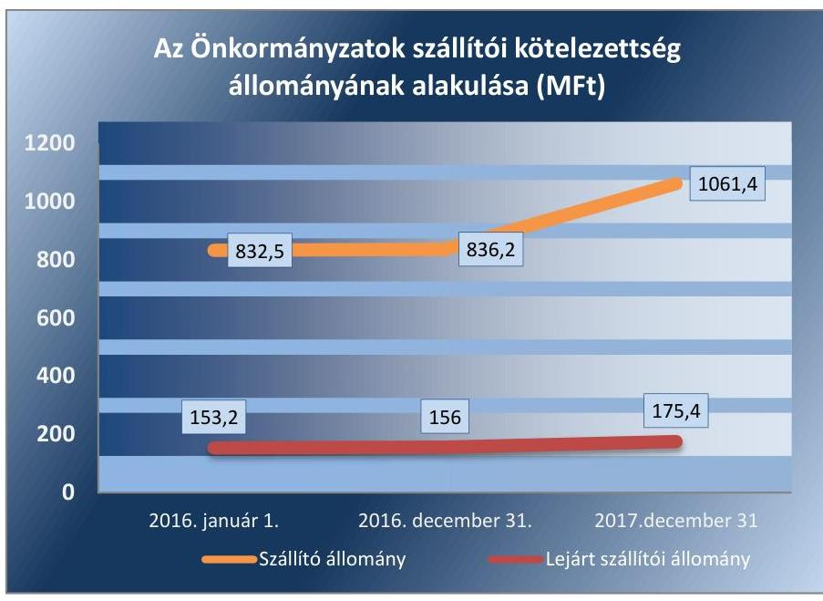

Forrás: Önkormányzatok beszámolói
A 2016. évben 11 önkormányzat, 2017-ben pedig 8 önkormányzat rendelkezett 90 napon túli lejárt kötelezettséggel. Az Önkormányzatok a 2016. év végén 54,4 M Ft, a 2017. év végén 33,0 M Ft 90 napon túli lejárt tartozással rendelkeztek, az állomány csökkenése 39,3% volt.

A 2017. évben 90 napon túli kötelezettség állománnyal rendelkező nyolc önkormányzat közül Fábiánsebestyén és Tiszaigar önkormányzatai negatív működési jövedelemmel rendelkeztek. Az ellenőrzés esetükben az adósságrendezési eljárás elindításának a veszélyét jelentő kockázatot azonosított, mivel a negatív működési jövedelem mellett nem képződik elég bevétel a kötelezettségek teljesítésére.

A lejárt kötelezettség mindkét évben növekvő állománya kockázatot jelent az Önkormányzatok eladósodására, ezen belül a 90 napon túli kötelezettségek pedig az adósságrendezés, a pénzügyi függetlenség elvesztésének, korlátozásának a kockázatát hordozzák.

# A PÉNZINTÉZETEK FELÉ FENNÁLLÓ KÖTELE-

ZETTSÉG állomány nem jelentett kockázatot az Önkormányzatok pénzügyi egyensúlyára. A banki kötelezettségállomány kedvezően alakult, mert a mérlegfőösszeghez viszonyított aránya alacsony volt és a 2016. évi 0,13%-ról a 2017. évre 0,09%-ra csökkent.

Az Önkormányzatok hiteltörlesztése 39,5%-kal míg a hitelfelvétel ennél magasabb 47,9%-kal csökkent a 2017. évben az előző évhez képest. Ennek

---

6. táblázat

|  MUTATÓK ALAKULÁSA |  |   |
| --- | --- | --- |
|  Mutatók | 2016. | 2017.  |
|   | év | év  |
|  Banki kötelezettség állomány mérlegfőösszeghez mért nagysága |  |   |
|  Banki kötelezettségek állományának változása | $0,13 \%$ | $0,09 \%$  |
|  Garancia- és kezességvállalások állománya, M Ft | $+7,7 \%$ | $-22,4 \%$  |
|   | 22,0 | 22,3  |

Forrás: Önkormányzatok beszámolói következtében az év végi banki kötelezettség állomány (rövid és hosszúlejáratú hitelek) 2016-ról 22,4%-kal (88,5 M Ft-tal) a 2017. év végére 307,6 M Ft-ra csökkent. A 2016. évben 17, a 2017. évben 14 önkormányzatnak volt december 31-én pénzintézeti, banki kötelezettségállománya, amely az Önkormányzatok 7,9%-át, illetve 6,5%-át érintette. A mutatók alakulását a 6. táblázat tartalmazza.

Kormányzati jóváhagyással naptári éven túli futamidejű adósságot keletkeztető ügyletet a 2016. évben 24,0 M Ft összegben 2 önkormányzat, míg 2017. évben 33,0 M Ft összegben egy önkormányzat kötött infrastrukturális és fejlesztési beruházásokra. Az Önkormányzatok közül kormányzati hozzájárulást nem igénylő naptári éven túli futamidejű adósságot keletkeztető ügyletet 2016. évben kettő önkormányzat (19,6 M Ft) a 2017. évben egy önkormányzat (10,0 M Ft) kötött.

Az ellenőrzött időszakban az Önkormányzatok pénzintézetekkel szembeni kötelezettség állománya, az állomány mérlegfőösszeghez viszonyított aránya, továbbá a banki kötelezettséggel rendelkező önkormányzatok száma is csökkent, a kedvező változás az Önkormányzatok pénzügyileg fenntartható gazdálkodását vetíti előre.

A GARANCIA- ÉS KEZESSÉGVÁLLALÁSBÓL származó függő kötelezettség állomány az Önkormányzatoknál 2016. év végén 22 M Ft, 2017. év végén 22,3 M Ft volt. Ezen belül kezességvállalásból származó kötelezettsége az ellenőrzött időszak mindkét évében 22,0 M Ft értékben egy önkormányzatnak volt. Továbbá egyéb garanciavállalásból származó kötelezettség állománnyal szintén egy önkormányzat rendelkezett 2017. december 31-én 0,3 M Ft értékben.

Az ellenőrzött időszakban a működési és felhalmozási célú garancia- és kezességvállalásból származó helytállási kötelezettség miatti kifizetésre 2016 évben 18,4 M Ft, míg 2017. évben 46,5 M Ft értékben került sor.

A 2017. év végén fennálló garancia-, és kezességvállalás állomány az érintett két önkormányzatnál kockázatot hordozott, mert annak érvényesítése kedvezőtlenül befolyásolhatja az önkormányzat pénzügyi egyensúlyát.

# 3. Az önkormányzatok vagyongazdálkodása során biztosított volt-e a vagyon értékének a megőrzése? 

## Összegző megállapítás

Az Önkormányzatok vagyongazdálkodása során biztosított volt a vagyon értékének megőrzése.

A VAGYONVÁLTOZÁS az Önkormányzatok vagyoni helyzetére nem jelentett kockázatforrást a 2016-2017. években. Az eszközök és források alakulását kiemelt mérlegsoronként a 2016-2017. években a III. számú melléklet tartalmazza. A mutatók alakulását a 7. táblázat tartalmazza.

Az Önkormányzatok könyvviteli mérleg szerinti vagyona kedvezően változott, a 2016. január 1.- 2017. december 31. közötti időszakban 50 270,3 M Ft-tal (17%-kal) növekedett, a 2017. évi záró eszközérték 346 504,7 M Ft volt.

---

7. táblázat

|  MUTATÓK ALAKULÁSA |  |   |
| --- | --- | --- |
|  Mutatók | 2016. év | 2017. év  |
|  Befektetett eszközök
fedezettsége | $98,4 \%$ | $102,6 \%$  |
|  Ingatlanok és kap-
csolódó vagyoni ér-
tékű jogok állomá-
nyának változása
(M Ft) | $+17751,6$ | $+2030,5$  |
|  Koncesszióba, va-
gyonkezelésbe adott
eszközök állományá-
nak változása (M Ft) | $+3177,3$ | $-251,5$  |
|  Eszközpótlási mutató
(tárgyi eszközök összesen) | $127,7 \%$ | $92,4 \%$  |
|  Eszközpótlási mutató
(ingatlanok és kap-
csolódó vagyoni ér-
tékű jogokra) | $145,2 \%$ | $100,0 \%$  |

Forrás: Önkormányzatok beszámolói

A vagyon növekedését elsősorban a befektetett eszközök (21 302,3 M Ft; 7,8%) és a pénzeszközök (25 643,2 M Ft; 175,1%) állományának kimagasló emelkedése okozta. A pénzeszközök állományának növekedésében jelentős szerepe volt az államháztartáson belülről kapott, a 2017. évben fel nem használt támogatásoknak.

A befektetett eszközökön belül nőtt a tárgyi eszközök 17 378,1 M Ft-tal (6,7%) és a koncesszióba, vagyonkezelésbe adott eszközök állománya 2 925,8 M Ft-tal (21,3%). Továbbá emelkedett a befektetett pénzügyi eszközök 647,1 M Ft-tal (30,1%) és az immateriális javak értéke 351,3 M Ft-tal (102,5%). A befektetett pénzügyi eszközök állományának növekedését a tartós hitelviszonyt megtestesítő értékpapírok értékének növekedése okozta.

Az ellenőrzött időszakban a nemzeti vagyonba tartozó befektetett eszközök alakulását az 5. ábra mutatja be.
5. ábra

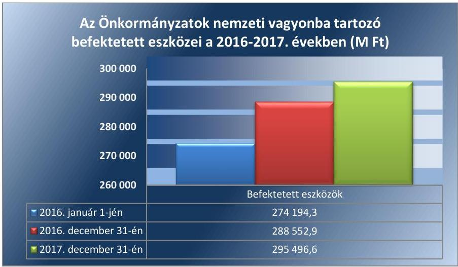

Forrás: Önkormányzatok beszámolói

Az Önkormányzatok eszközeinek 2016. évben 80,8%-át és a 2017. évben 73,8%-át, legjelentősebb részét képező ingatlanok és kapcsolódó vagyoni értékű jogok állománya a 2016. január 1-i 235 836,5 M Ft-ról a 2017. év végére 255 618,7 M Ft-ra növekedett. Az ellenőrzött időszakban bekövetkezett 19 782,1 M Ft-os állománynövekedés jelentős része (17 751,6 M Ft) a 2016. évben aktivált beruházásokból származott.

A nemzeti vagyonba tartozó forgóeszközök állománya az ellenőrzött időszakban 682,6 M Ft-tal (48,3%) növekedett, amelyből jelentős összeget tett ki a forgatási célú hitelviszonyt megtestesítő értékpapírok állományának növekedése (668,6 M Ft). A követelések állománya a 2016-2017. években 2 757,0 M Ft-tal (63,4%) emelkedett, amelynek majdnem fele (1366,3 M Ft) a követelés jellegű sajátos elszámolások növekedéséből származott.

A pénzeszközök állományának növekedése miatt a vagyon szerkezet átalakult az ellenőrzött időszakban, a befektetett eszközök aránya a 2016. év eleji 92,6%-ról a 2017. év végére 85,3%-ra csökkent, míg a pénzeszközök aránya 4,9%-ról 11,6%-ra emelkedett.

A befektetett eszközökön felüli eszközök alakulását a 6. ábra mutatja be.

---

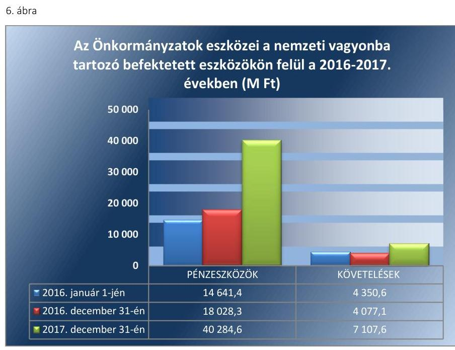

Forrás: Önkormányzatok beszámolói
A nemzeti vagyonba befektetett eszközökre a saját tőke 2016. évben 98,4% és a 2017. évben 102,6%-ban nyújtott fedezetet. A befektetett eszközök fedezettségének javulását a befektetett eszközök állománya 6 943,8 M Ft-os emelkedését meghaladó saját tőke 19 096,4 M Ft-os növekedése okozta a 2017. évben. A befektetett eszközök fedezettsége javult az ellenőrzött időszakban, így nem jelentett kockázatot a vagyongazdálkodásra. A 2016. évben 149, míg 2017. évben 161 önkormányzat a vagyoni eszközök
 megszerzéséhez nem vett igénybe idegen forrást.

Az Önkormányzatoknak a 2016. évben 649,7 M Ft bevétele keletkezett vagyonértékesítésből, amely a 2017. évben 47,1%-kal 955,4 M Ft-ra növekedett. Az Önkormányzatok a vagyonértékesítésből keletkező bevétel össszegét jelentősen meghaladó összegben hajtottak végre beruházásokat, felújításokat az ellenőrzött időszakban. A beruházási és felújítási kiadások összege a 2016. évben 9 807,4 M Ft volt, amely 86,1%-kal 18 237,4 M Ft-ra növekedett a 2017. évben.

Az Önkormányzatok vagyongazdálkodásuk során a vagyon értékének megőrzésén felül annak növeléséről is gondoskodtak, ezzel biztosították a nemzeti vagyon megőrzését, gyarapítását.

# A KONCESSZIÓBA ÉS VAGYONKEZELÉSBE 

ADOTT ESZKÖZÖK állománya a 2016. évben 3 177,4 M Ft-tal növekedett (23,1%), míg a 2017. évben 251,5 M Ft-tal csökkent (1,5%). A változást mindkét évben a vagyonkezelésbe adás és visszavétel okozta. Az Önkormányzatok közül a 2016. év végén 64, a 2017. év végén 60 mutatott ki a mérlegében koncesszióba, vagyonkezelésbe adott eszközt. A koncesszióba, vagyonkezelésbe adott eszközök állományváltozása nem jelentett kockázatforrást az Önkormányzatok gazdálkodására.

A BELSŐ ELADÓSODÁS nem jelentett kockázatforrást az Önkormányzatok vagyongazdálkodására a 2016-2017. években. A tárgyi eszközök eszközpótlási mutatója az Önkormányzatoknál a 2016. évben

---

127,7% volt, amely a 2017. évben 92,4%-ra csökkent. Az Önkormányzatok tárgyi eszközeinek legnagyobb részét (2016. év elején 91,4%-át, 2017. év végén 92,8%-át) kitevő ingatlanok és kapcsolódó vagyoni értékű jogok eszközpótlási mutatója szintén csökkent, a mutató értéke 2016. évben 145,2%, a 2017. évben 100% volt.

A mutatók alakulását a 7. táblázat, a tárgyévben aktivált beruházások, felújítások összegét, a tárgyi eszközök elszámolt értékcsökkenését, valamint a felhalmozási és beruházási, felújítási kiadások összegét a 7. ábra mutatja.
7. ábra
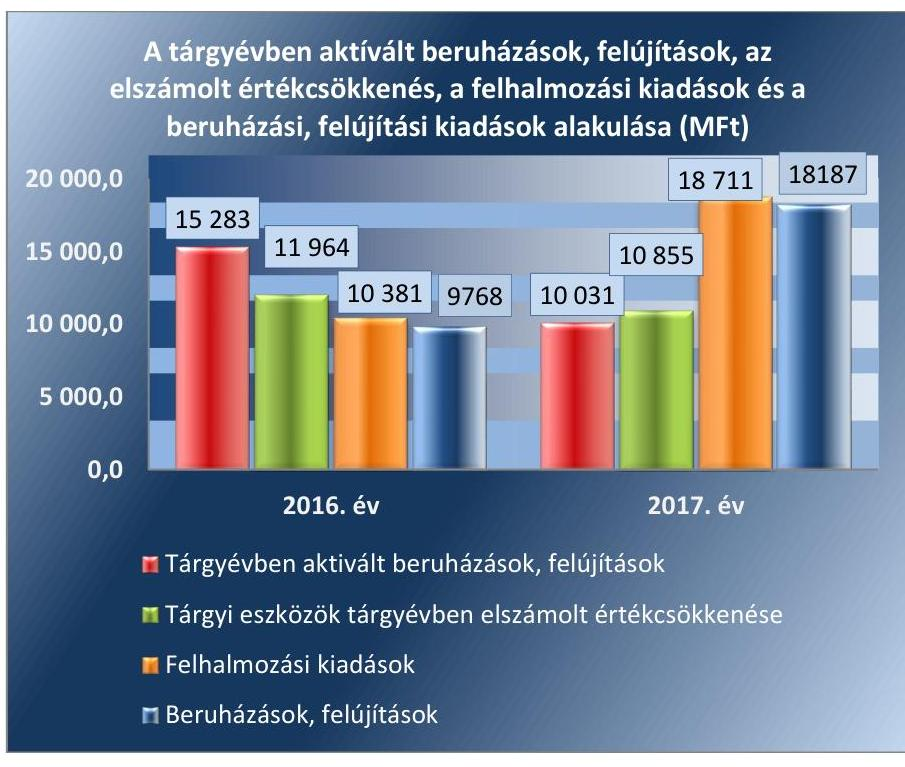

Forrás: Önkormányzatok beszámolói

Az Önkormányzatok megőrizték a vagyon értékét, a két éves ellenőrzött időszakban a vagyonpótlás megtörtént. Az Önkormányzatoknál a két egymást követő évben összesen a tárgyi eszközök esetében az eszköz aktiválások 2 496,1 M Ft-tal, ezen belül az ingatlanok és vagyoni értékű jogok esetében 4 157,5 M Ft-tal haladták meg az elszámolt értékcsökkenés összegét.

A beruházási és felújítási kiadások aránya a befektetett eszközökhöz viszonyítva 2016. évben 3,4% és 2017. évben 6,2% volt, az arány jelentős növekedése a nemzeti vagyon pótlására kedvezően hatott. Az Önkormányzatok a hosszabb átfutási idejű beruházások, felújítások miatt a 2017. év végén 10 167,8 M Ft befejezetlen beruházás állománnyal rendelkeztek.

## AZ ÖNKORMÁNYZATOK GAZDASÁGI TÁRSASÁ-

GOKBAN többségi és kisebbségi tulajdont jelentő tartós részesedéseinek állománya a 2016. év eleji 1 940,2 M Ft-ról az ellenőrzött időszakban 1 868,2 M Ft-ra csökkent a 2017. év végére. A tartós részesedések állománya a 2016. évben 4,7%-kal csökkent, míg a 2017. évben 1,1%-kal növekedett.

Az Önkormányzatok közül a 2016. és a 2017. évben is 203 mutatott ki tartós részesedést. Ezen belül a 2016. évben 36 önkormányzatnak, a 2017.

---

évben 38 önkormányzatnak volt többségi tulajdonú gazdasági társasága (továbbiakban: gazdasági társaságok). A 2016. évben egy, míg a 2017. évben négy új gazdasági társaság alakult és a 2017. évben kettő gazdasági társaság működése végelszámolás miatt megszűnt.

A gazdasági társaságok 2017. év végi kötelezettség állománya 366,8 M Ft volt, 26,4 M Ft-tal alacsonyabb, mint a 2016. év elején. Ezen belül a kötelezettség állomány 2016. évben 11,5%-kal csökkent, míg a 2017. évben 5,4%-kal emelkedett.

A mutatók alakulását a 8. táblázat tartalmazza. A gazdasági társaságok kötelezettségállományának és adózott eredményének alakulását a 8. ábra mutatja be.
8. ábra
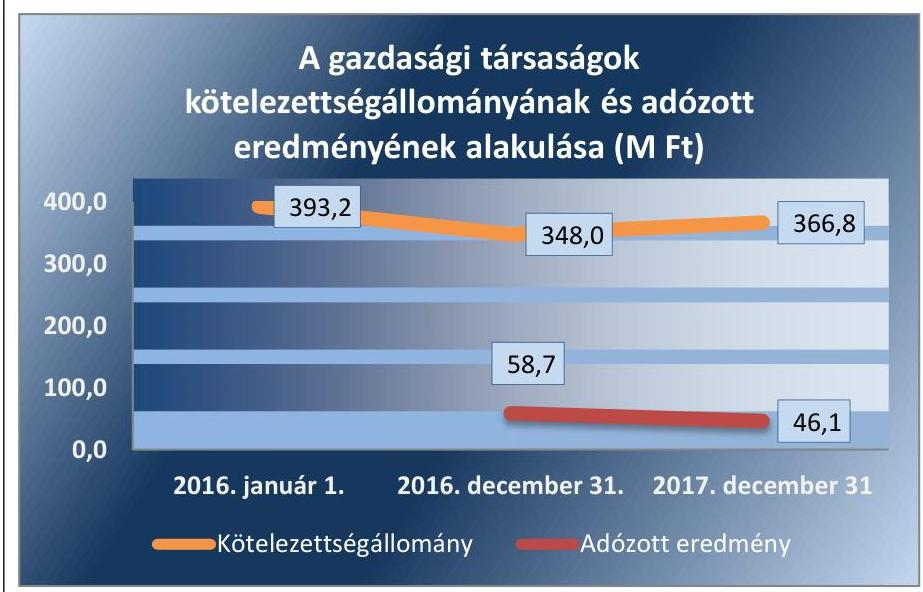

Forrás: Önkormányzatok beszámolói
A gazdasági társaságok a 2016-2017. években pozitív adózott eredményt értek el, melynek értéke a 2016. évi 58,7 M Ft-ról a 2017. évben 46,1 M Ft-ra, 21,5%-kal csökkent. A 2017. évben az előző évhez képest a nyereséges társaságok száma 18-ról 24-re 33,3%-al nőtt. A veszteséges társaságok száma csökkent, a 2016. évi 21-ről a 2017. évben 17-re, de a kimutatott veszteség értéke kis mértékben emelkedett, -35,4 M Ft-ról 2017 évben -40,6 M Ft-ra, 14,7%-al nőtt.

A tartós részesedések értékének 2017. évi emelkedése és a gazdasági társaságok számának növekedése kockázatforrást jelentett az Önkormányzatok vagyongazdálkodására, mert a társaságok eladósodása, veszteséges működése esetén adósságállományukért a tulajdonos önkormányzatot helytállási kötelezettség terheli. A gazdasági társaságokban részesedéssel rendelkező önkormányzatok működési jövedelme a 2017. évben 12%-kal csökkent, az előző évhez viszonyítva. A csökkenő működési jövedelem mellett az érintett önkormányzatoknak kellő figyelmet kell fordítaniuk gazdasági társaságaik eladósodásának megelőzésére.

---

# MELLÉKLETEK 

- I. SZ. MELLÉKLET: FOGALOMTÁR
adósságszolgálat
belső eladósodás kockázat-
forrás
beruházás
bevételi kitettség

CLF módszer
eladósodás kockázatforrás
eszközpótlási mutató
felhalmozási bevétel
felhalmozási kiadás
felhalmozási kiadások és finanszírozása kockázatforrás
felújítás
finanszírozás kockázatforrás
folyó bevétel
folyó kiadás

Az adósság tőkerészének és az esedékes kamat együttes összegének törlesztése. Kockázatforrást jelent, ha az értékcsökkenések kompenzálásaként a szükséges vagyonpótlás nem történt meg, ha romlott az eszközök állaga, mert az rejtett eladósodást jelent.
A tárgyi eszköz beszerzése, létesítése, saját vállalkozásban történő előállítása, a beszerzett tárgyi eszköz üzembe helyezése. A beruházás a meglévő tárgyi eszköz bővítését, rendeltetésének megváltoztatását, átalakítását, élettartamának, teljesítőképességének közvetlen növelését eredményező tevékenység. (Forrás: Számv. tv. ${ }^{6} 3 . \S$ (4) bekezdés 7. pontja)

Olyan függőségi viszony, ahol egy szervezet pénzügyi helyzetét meghatározó bevételek nagysága külső körülmények hatására azonnal és kedvezőtlen irányba változhat.
Az önkormányzatok költségvetése elemzésének módszere, amely a pénzügyi kapacitás (nettó működési jövedelem) fogalmát helyezi a középpontba. A módszer következetesen elkülöníti a folyó és a felhalmozási költségvetés bevételeit és kiadásait, azok költségvetési egyenlegeit. Bizonyos mértékig a vállalati gazdálkodás logikai elemeit érvényesíti az önkormányzatok pénzügyi, jövedelmi helyzetének vizsgálata során.
Az államháztartás önkormányzati alrendszerében felhalmozott adósság állam részéről történő kiegyenlítését, illetve átvállalását követően az önkormányzatok kiemelt feladata, egyben felelőssége az adósságállomány újratermelődésének megakadályozása. Kockázatforrást jelent, ha az önkormányzat kötelezettségei emelkednek, a mérlegben az idegen források aránya nő, az adósságkonszolidációt - helyi önkormányzatok adósságának állam által történő átvállalása - követően a gazdálkodás újra eladósodási pályára áll. Az eladósodás a pénzügyi gazdálkodás egyenes következménye, ugyanakkor hatással is van rá a folyó adósságszolgálat teljesítésén keresztül
A tárgyi eszközállomány elemzéséhez használt mutató, amely megmutatja, hogy az üzembe helyezett beruházások milyen hányadát képezi az elszámolt értékcsökkenésnek. Számításakor tárgyévben üzembe helyezett beruházások, felújítások értékét a tárgyi eszközök tárgyévben elszámolt értékcsökkenéséhez kell viszonyítani.
Az önkormányzatok tárgyévi felhalmozási célú költségvetési bevételei.
Az önkormányzatok tárgyévi felhalmozási célú költségvetési kiadásai.
Kockázatforrást jelent az erőn felüli beruházási aktivitás, illetve ha a folyamatban lévő felhalmozási feladatok finanszírozásához szükséges pénzügyi forrás nem áll az önkormányzat rendelkezésére.
Az elhasználódott tárgyi eszköz eredeti állaga (kapacitása, pontossága) helyreállítását szolgáló időszakonként visszatérő olyan tevékenység, melynek során az eszköz élettartama megnövekszik, minősége, használata jelentősen javul, így a pótlólagos ráfordításból a jövőben gazdasági előnyök származnak. (Forrás: Számv. tv. 3. § (4) bekezdés 8. pontja)
Kockázatforrást jelent, ha az önkormányzat nem rendelkezik megfelelő fedezettel a külső források adósságszolgálatának teljesítéséhez, ami hosszútávon vagyonfeléléshez vagy adósságspirálhoz vezethet.
Az önkormányzatok tárgyévi működési célú költségvetési bevételei
Az önkormányzatok tárgyévi működési célú költségvetési kiadásai

---

folyó költségvetés egyenlege
garancia- és kezességvállalás kockázatforrás
garanciavállalás
hasznosítás
helyénvalósági ellenőrzés
kezességvállalás
kockázatforrás
koncesszió
koncessziós szerződés
kötelező közszolgáltatás (az önkormányzati feladatokat érintően)
kötvény

A folyó költségvetés egyenlege, azaz a működési jövedelem megmutatja, hogy az Önkormányzat éves folyó bevétele fedezetet biztosít-e a kötelező és önként vállalt feladatellátáshoz kapcsolódó éves folyó kiadására. A működési jövedelem negatív értéke pénzügyileg fenntarthatatlan helyzetet jelez. A mutató pozitív értéke megtakarítást mutat, amely forrásul szolgálhat az Önkormányzat fennálló kötelezettségei megfizetéséhez, valamint fejlesztéseihez.
Kockázatforrást jelent, ha a szerződés kötelezettje a szerződésben vállalt kötelezettségeit nem teljesíti a jogosultnak, mert azokért a kezes köteles helytállni. A garancia-és kezességvállalások függő kötelezettségként kockázatot jelentenek az önkormányzat költségvetésére, ezen keresztül a közfeladatok ellátására.
Olyan kötelezettségvállalás, ahol a garanciát vállaló valamely jövőbeni esemény bekövetkezésekor, a szerződésben meghatározott feltételek beálltakor a garancia kedvezményezettje számára meghatározott összegig, meghatározott időpontig, felszólításra azonnal fizet.
A nemzeti vagyon birtoklásának, használatának, hasznok szedése jogának bármely a tulajdonjog átruházását nem eredményező - jogcímen történő átengedése, ide nem értve a vagyonkezelésbe adást, valamint a haszonélvezeti jog alapítását. (Forrás: Nvtv. 3. § (1) bekezdés 4. pontja)
A helyénvalósági ellenőrzés a megfelelőségi ellenőrzés azon altípusa, amelyet azokban az esetekben kell alkalmazni, amelyekre jogszabályi előírások nem alkalmazhatóak, illetve amennyiben egyes kérdések megítélésénél nyilvánvaló jogszabályi hiányosságok vannak. Helyénvalósági ellenőrzés során a Számvevőszéknek a közszféra szilárd gazdálkodására és a köztisztviselők magatartására vonatkozó általános alapelvek mentén kell az ellenőrzést lefolytatni.
Szerződésben vállalt olyan kötelezettség, amelyben a kezes arra vállal kötelezettséget, hogy ha a szerződés kötelezettje nem teljesít a kezes maga fog helyette teljesíteni a jogosultnak. (Forrás: Ptk. 6:416.§).
A kockázatok kiváltó okait kockázatforrásnak nevezzük. Első lépésben azonosítjuk a nyomon követendő kockázatokat, majd a kockázatos területeket és a kiváltó okokat (kockázatforrásokat). Kockázatként azonosítjuk, ha az önkormányzat hosszú távon nem képes a törvényben meghatározott feladatait ellátni, költségvetése változatlan formában nem fenntartható. A kockázat értékelésének célja annak megállapítása, hogy a pénzügyi gazdálkodás, eladósodás, vagyongazdálkodás kockázati területek milyen mértékben befolyásolják, veszélyeztetik az önkormányzat működését, a közfeladatok ellátását. A három kockázati terület minősítéséhez összesen 10 kockázatforrást rendelünk.
Az állam, illetőleg az önkormányzat (önkormányzati társulás) kizárólagos tulajdonában lévő vagyontárgyak birtoklásának, használatának és hasznosításának, valamint a koncesszió-köteles tevékenységek gyakorlásának jogát, visszterhes szerződéssel, időlegesen úgy engedi át, hogy a jogosultnak részleges piaci monopóliumot biztosít.
A koncessziós szerződés olyan visszterhes szerződés, amelyben az állam vagy az önkormányzat a törvényben meghatározott tevékenységek gyakorlásának a jogát időlegesen úgy engedi át, hogy a jogosultnak részleges piaci monopóliumot biztosít.
Az önkormányzat kötelezően vállalt feladatkörébe tartozó egyes - közszolgáltatás útján megvalósuló - közfeladatok ellátása, amelyeket külön jogszabály (törvény, helyi önkormányzati rendelet) határoz meg.
Hosszabb lejáratra szóló, hitelviszonyt megtestesítő kamatozó értékpapír. A kötvényben a kibocsátó arra kötelezi magát, hogy a kötvényben megjelölt pénzösszegnek az előre meghatározott kamatát vagy egyéb jutalékait, továbbá az adott pénzösszeget a kötvény mindenkori tulajdonosának, illetve jogosultjának a megjelölt időben és módon megfizeti.

---

közfeladat

közfeladatok finanszírozási struktúrája kockázatforrás

lényegesség
megfelelőségi ellenőrzés
nettó működési jövedelem
önkormányzat
önkormányzat rendkívüli támogatása
pénzintézetek felé történő eladósodás kockázatforrás
pénzügyi kapacitás
szállítók felé történő eladósodás kockázatforrás
többségi önkormányzati tulajdonban lévő gazdasági társaságok kockázatforrás

A közfeladat a jogszabályban meghatározott állami vagy önkormányzati feladat. A közfeladatok ellátása költségvetési szervek alapításával és működtetésével vagy az azok ellátásához szükséges pénzügyi fedezet e törvényben (Áht.) meghatározott eszközökkel, részben vagy egészben történő biztosításával valósul meg. A közfeladatok ellátásában államháztartáson kívüli szervezet jogszabályban meghatározott rendben közreműködhet. (Forrás: Áht. 3/A. § (1)-(2) bekezdés, 2015. január 1-jétől)
Kockázatforrást jelent, ha az önkormányzat pénzügyi helyzete jelentős függőséget mutat a külső körülményektől (adóbevételektől, kiegészítő állami támogatásoktól). A közfeladatok finanszírozási struktúrája nem kielégítő, ha a működési bevételek nem fedezik teljes mértékben az ellátott közfeladatokat.
Az a szintű információ vagy adat, ami az ellenőrzés eredményei célzott felhasználóinak döntéseit - az arról történő tudomásszerzést követően - valószínűsíthetően befolyásolja.
A számvevőszéki ellenőrzés azon típusa, amely annak megállapítására irányul, hogy az ellenőrzés tárgyát képező tevékenységek, pénzügyi műveletek, információk és adatok minden lényeges szempontból megfelelnek-e
 az ellenőrzött szervezetre vonatkozó szabályozásoknak és követelményeknek.
A nettó működési jövedelem a jövedelemtermelő képességet méri. Megmutatja a működési bevételekből a működési kiadások és a hitelek tőketörlesztésének kifizetése után fennmaradó jövedelmet.
A helyi önkormányzat jogi személy. Az önkormányzati feladatok ellátását a képviselőtestület és szervei biztosítják. A képviselőtestület szervei: a polgármester, a főpolgármester, a megyei közgyűlés elnöke, a képviselő-testület bizottságai, a részönkormányzat testülete, a polgármesteri hivatal, a megyei önkormányzati hivatal, a közös önkormányzati hivatal, a jegyző, továbbá a társulás. A képviselő-testület a feladatkörébe tartozó közszolgáltatások ellátására - jogszabályban meghatározottak szerint - költségvetési szervet, a Polgári perrendtartásról szóló 1952. évi III. törvény szerinti gazdálkodó szervezetet (a továbbiakban: gazdálkodó szervezet), nonprofit szervezetet és egyéb szervezetet (a továbbiakban együtt: intézmény) alapíthat, továbbá szerződést köthet természetes és jogi személlyel vagy jogi személyiséggel nem rendelkező szervezettel. (Forrás: Mötv. ${ }^{7}$ 41. § (1), (2), (6) bekezdései)
A 2016-2017. években a megyei önkormányzatok rendkívüli támogatása, a települési önkormányzatok rendkívüli támogatása és a tartósan fizetésképtelen helyzetbe került helyi önkormányzatok adósságrendezésére irányuló hitelfelvétel visszterhes kamattámogatása, a pénzügyi gondnok díja.
Kockázatforrásnak tekintettük, ha az önkormányzat (újból) adósságot keletkeztet, ami a kivételektől eltekintve a 2012. évtől kormányengedély-köteles. A pénzintézetekkel szemben fennálló kötelezettségek esetén olyan függőségi viszony jöhet létre, ahol az önkormányzat pénzügyi helyzete olyan külső körülmények hatására változhat, amely kizárólag a bank egyoldalú döntésén múlik.
A pénzügyi kapacitás az adósok hitelfelvételi képességének azon mértéke, ahol még növelni tudják az adósságot anélkül, hogy a fizetőképtelenség elkerülése érdekében csökkenteniük kellene akár az aktuális, akár a jövőben esedékes kiadásaikat.
Kockázatforrást jelent, ha az önkormányzat növeli a dologi, felújítási, beruházási kötelezettségeit (szállítókkal szemben fennálló tartozásait), ami burkolt hitelezésnek minősülhet, és az elismert kötelezettségeit átmenetileg vagy véglegesen nem tudja határidőre teljesíteni.
Kockázatforrást jelent, hogy az önkormányzati tulajdonban lévő gazdasági társaságok adósságállományáért a tulajdonos önkormányzatot helytállási kötelezettség terheli.

---

vagyongazdálkodás
vagyonváltozás kockázatforrás

A nemzeti vagyongazdálkodás feladata a nemzeti vagyon rendeltetésének megfelelő, az állam, az önkormányzat mindenkori teherbíró képességéhez igazodó, elsődlegesen a közfeladatok ellátásához és a mindenkori társadalmi szükségletek kielégítéséhez szükséges, egységes elveken alapuló, átlátható, hatékony és költségtakarékos működtetése, értékének megőrzése, állagának védelme, értéknövelő használata, hasznosítása, gyarapítása, továbbá az állam vagy a helyi önkormányzat feladatának ellátása szempontjából feleslegessé váló vagyontárgyak elidegenítése. (Forrás: Nvtv. 7. § (2) bekezdése)

Kockázatforrásként értékeltük, ha csökken a nemzeti vagyon, ha az önkormányzatok a vagyonértékesítésből származó bevételeket nem beruházásokra, a vagyon pótlására fordítják.

---

Az ellenőrzés tárgya: Az önkormányzati gazdálkodás fenntarthatósága, a törvényben előírt feladatok ellátása, az önkormányzatnál észlelt negatív tendenciák okainak feltárása, amely az ellenőrzési kritériumok alapján kerül értékelésre.
Az ellenőrzési kritériumok meghatározása során első lépésben azonosításra kerültek az önkormányzati gazdálkodás fenntarthatóságának, a törvényben előírt feladatok ellátásának kockázatos területei és a kiváltó okai (kockázatforrások), amelyekhez minden esetben mutatószám került hozzárendelésre. A mutatószámok között a viszonyszámok (relatív mutatószámok) és az abszolút adatok (abszolút mutatószámok) egyaránt megtalálhatóak, amelyekhez a Magyar Államkincstár által szolgáltatott adatállományok (költségvetési beszámolók, időközi költségvetési jelentések, mérlegjelentések adatait) kerültek felhasználásra.
Az egyes kockázati területek és kockázatforrások minősítése „pontozásos módszerrel" a mutatószámok értékelése alapján történt.

- Első lépésben a mutatószámok értékelésére és egy háromelemű skálán történő elhelyezésére került sor. Az értékelés (a kategória határok meghatározása) elsődlegesen a mutatószámok közgazdasági értelmezése alapján, az Állami Számvevőszék ellenőrzési tapasztalatait felhasználva történt. Az értékelések alapján egy-egy mutató alacsony besorolás esetén 0 pontot, közepes esetén 1 pontot, magas kockázatjelzés esetén 2 pontot kapott. (PI.: ha a működési kiadások fedezettsége mutató 90\% alatti volt, akkor magas kockázati besorolást, 2 pontot, ha 100\% feletti volt akkor alacsony besorolást, 0 pontot kapott.) A %-ban kifejezett mutatók kockázati besorolására a pontos (több tizedes jegy) értékek alapján került sor, ugyanakkor az önkormányzati riport a mutatókat egy, illetve esetenként két tizedes számjegyig mutatja be.
- Annak érdekében, hogy a kockázatforrások minősítésénél a lényeges mutatók értéke legyen a meghatározó a jellegzetes mutatókéval szemben, a mutatószámok súlyozására került sor*. A súlyok mértékének megválasztásakor az elsődleges mutatókat középértéknek tekintve 1-es súly mellérendelése* történt. A főmutató súlya az elsődleges mutatók súlyának kétszeresében, míg a másodlagos mutatók súlya az elsődleges mutatók súlyának felében került meghatározásra. (PI.: a kockázatforrás minősítéséhez a működési kiadások fedezettségét főmutatóként vették figyelembe, ezért 2-es súlyt rendeltek hozzá. Így ha a mutató kockázati besorolása magas volt, a magas kockázati besoroláshoz rendelt 2 pontot szorozták a főmutatóhoz rendelt 2-es súlyszámmal és az elért pontszám 4, míg alacsony besorolás esetén a besoroláshoz rendelt 0 pontot szorozva a főmutatóhoz rendelt 2-es súlyszámmal elért pontszám 0 volt.)
- Ezt követően került sor az önkormányzati gazdálkodás fenntarthatóságának, a törvényben előírt feladatok ellátásának kockázatához rendelt kockázati területek és kockázatforrások értékelési ponthatárainak meghatározására oly módon, hogy kockázatforrásonként a mutatószámok súlyozott értékelésével elérhető összes pontszám három egyenlő részre (alacsony, közepes, magas) osztása történt meg. (PI.: A közfeladatok finanszírozási struktúrája kockázatforrás 1 db főmutató, 2 db elsődleges mutató és további 2 db másodlagos mutató alakulása alapján került értékelésre. A mutatók magas kockázati besorolása esetén - a súlyozást követően - elérhető legmagasabb pontszám 10 volt. Ezt három egyenlő részre osztva kerültek meghatározásra a közfeladatok finanszírozási struktúrájának értékelési ponthatárai, amely 0-3,32 pontig alacsony, 3,33-6,66 pontig közepes, 6,67-10 pont között magas kockázati minősítést kapott.)
- Az egyes kockázatforrások értékelésekor a kockázatforráshoz rendelt mutatószámok - súlyozással kapott - értékeinek összesítése és a kialakított értékelési ponthatárok szerinti minősítése történt meg. (PI.: egy önkormányzat minősítésekor a közfeladatok finanszírozási struktúrája kockázatforráshoz rendelt 5 db

[^0]
[^0]:    * A súlyozás kifejezi, hogy az alkalmazott mutatószámok egymáshoz képest milyen mértékben járulnak hozzá az adott kockázatforrás értékeléséhez.
    † Egy esetben a banki kötelezettségállomány mérlegfőösszeghez mért nagysága mutatónál a kockázatforrás kiegyensúlyozottabb megítélése érdekében az 1-es súlyozás helyett 1,5-ös súlyozás került alkalmazásra..

---

mutató - fentiekben bemutatott - értékelésével elért összes pontszám 7 volt, akkor a kockázatforrás a hármas skálán a 6,67-10 pont közé került, így magas minősítést kapott.)

- Az egyes kockázati területek minősítése hasonlóan történt. Az egyes kockázati területeket meghatározó kockázatforrások pontjainak aggregálását követően, a kockázati területen elérhető összes pont három egyenlő részre osztásával kialakított skálán történő értékelésére került sor. Ha azonban a kockázatforrások közül legalább egy magas kockázati besorolást ért el, akkor a pontozás szerinti értékeléstől eltérően, a kockázati terület besorolása közepes kockázati minősítésűre módosult.

Az ellenőrzés tárgyának, az önkormányzati gazdálkodás fenntarthatóságának, a törvényben előírt feladatok ellátásának értékelése:
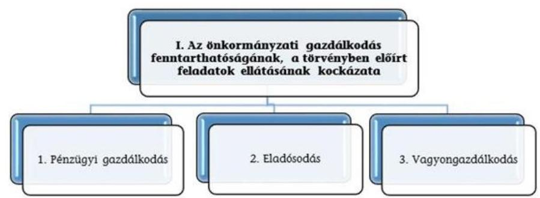

A három kockázati terület együttes értékelése alapján az alábbi mátrix segítségével kerül meghatározásra az önkormányzati gazdálkodás fenntarthatóságának, a törvényben előírt feladatok ellátásának értékelése a következők szerint:
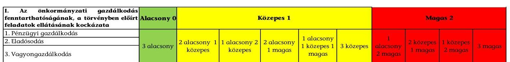

---

II. SZ. MELLÉKLET: AZ ESZKÖZÖK ÉS FORRÁSOK ALAKULÁSA KIEMELT MÉRLEGSORONKÉNT A 2016-2017. ÉVEKBEN (M FT)

Az Önkormányzatok 2016-2017. évi mérlegeinek adatai

| Megnevezés | 2016. január 1. | 2016. december 31. | 2017. december 31. |
| :--: | :--: | :--: | :--: |
| Befektetett eszközök   /NEMZETI VAGYONBA TARTOZÓ BEFEK-   TETETT ESZKÖZÖK | 274194338 | 288552872 | 295496625 |
| NEMZETI VAGYONBA TARTOZÓ FORGÓ-   ESZKÖZÖK | 1413423 | 1999101 | 2096017 |
| PÉNZESZKÖZÖK | 14641411 | 18028306 | 40284601 |
| KÖVETELÉSEK | 4350640 | 4077122 | 7107618 |
| EGYÉB SAJÁTOS ESZKÖZOLDALI ELSZÁ-   MOLÁSOK | 1574399 | 858624 | 1445356 |
| AKTÍV IDŐBELI ELHATÁROLÁSOK | 60222 | 149705 | 74442 |
| ESZKÖZÖK ÖSSZESEN | 296234433 | 313665730 | 346504659 |
| SAJÁT TÖKE | 271868483 | 284019385 | 303115796 |
| KÖTELEZETTSÉGEK | 3900043 | 4028012 | 4112124 |
| EGYÉB SAJÁTOS FORRÁSOLDALI ELSZÁ-   MOLÁSOK | 0 | 0 | 0 |
| PASSZÍV IDŐBELI ELHATÁROLÁSOK | 20465907 | 25618333 | 39276739 |
| FORRÁSOK ÖSSZESEN | 296234433 | 313665730 | 346504659 |

---

| 1. FOLYÓ KÖLTSÉGVETÉS | 2016. év | 2017. év | Változás [\%] (2017-2016)/ 2016 |
| :--: | :--: | :--: | :--: |
| 1.1.1. Saját működési bevételek tulajdonosi bevételek nélkül | 18132054 | 19043565 | $5,03 \%$ |
| 1.1.2. Költségvetési támogatások a működőképesség megőrzését szolgáló kiegészítő támogatások nélkül | 32639260 | 34890881 | $6,90 \%$ |
| 1.1.3. Átengedett bevételek | 1092016 | 1108197 | $1,48 \%$ |
| 1.1.4. Államháztartáson belülről kapott támogatások | 19596318 | 18911548 | $-3,49 \%$ |
| 1.1.5. EU-tól és külföldről kapott bevételek | 13622 | 30309 | $122,50 \%$ |
| 1.1.6. Államháztartáson kívülről kapott bevételek | 199427 | 271364 | $36,07 \%$ |
| 1.1.7. Hozam- és kamatbevételek | 65401 | 391672 | $498,88 \%$ |
| 1.1.8. Kölcsönök visszatérülése, igénybevétele | 167970 | 118445 | $-29,48 \%$ |
| 1.1.9. A működőképesség megőrzését szolgáló kiegészítő támogatások | 497355 | 396949 | $-20,19 \%$ |
| 1.1. Folyó bevételek   (1.1.1.+1.1.2.+1.1.3.+1.1.4.+1.1.5.+1.1.6.+1.1.7.+1.1.8.+1.1.9.) | 72403422 | 75162930 | $3,81 \%$ |
| 1.2.1. Működési kiadások kamatkiadások nélkül | 58673978 | 60395661 | 2,93\% |
| 1.2.2. Államháztartáson belülre átadott pénzeszközök | 3181132 | 3449095 | $8,42 \%$ |
| 1.2.3.1. vállalkozásoknak | 788350 | 836056 | 6,05\% |
| 1.2.3.2. EU-nak, illetve külföldre | 1486 | 950 | $-36,06 \%$ |
| 1.2.3.3. magánszemélyeknek | 2712210 | 2672351 | $-1,47 \%$ |
| 1.2.3.4. non-profit szervezeteknek | 916082 | 1147571 | 25,27\% |
| 1.2.3. Transzferkiadások | 4418127 | 4656928 | $5,41 \%$ |
| 1.2.4. Kamatkiadások | 125576 | 42949 | $-65,80 \%$ |
| 1.2.5. Kölcsönök nyújtása, törlesztése | 212302 | 99378 | $-53,19 \%$ |
| 1.2.6. Előző évi maradvány (csak az önkormányzat nyilvántartása alapján pontosítható) |  |  |  |
| 1.2. Folyó kiadások (1.2.1.+1.2.2.+1.2.3.+1.2.4.+1.2.5.) | 66611115 | 68644011 | 3,05\% |
| 1.3. Folyó költségvetés egyenlege, működési jövedelem (1.1. - 1.2.) | 5792307 | 6518918 | 12,54\% |
| 2. FELHALMOZÁSI KÖLTSÉGVETÉS |  |  |  |
| 2.1.1. Saját tőkebevételek | 678598 | 962824 | $41,88 \%$ |
| 2.1.2. Költségvetési támogatások | 4745902 | 4218670 | $-11,11 \%$ |
| 2.1.3. Államháztartáson belülről kapott támogatások | 1797944 | 30224309 | 1581,05\% |
| 2.1.4. EU-tól és külföldről kapott támogatások | 141939 | 6360 | $-95,52 \%$ |
| 2.1.5. Államháztartáson kívülről kapott bevételek | 611824 | 381300 | $-37,68 \%$ |
| 2.1.6. Hozam- és kamatbevételek (2014-ben (02/196+02/200-ből a felhalmozási rész csak az önkormányzat nyilvántartása alapján pontosítható) |  |  |  |
| 2.1.7. Kölcsönök visszatérülése, igénybevétele | 146149 | 111911 | $-23,43 \%$ |
| 2.1.8. Előző évi maradvány átvétel (csak az önkormányzat nyilvántartása alapján pontosítható) |  |  |  |

---

|  2.1. Felhalmozási bevételek
(2.1.1.+2.1.2+2.1.3+2.1.4.+2.1.5.+2.1.6.+2.1.7.) | 8122357 | 35905373 | $342,06
 \%$  |
| --- | --- | --- | --- |
|  2.2.1. Saját beruházási kiadás áfával | 5355209 | 10770805 | $101,13 \%$  |
|  2.2.2. Saját felújítási kiadás áfával | 4413263 | 7415775 | $68,03 \%$  |
|  2.2.3. Államháztartáson belülre átadott pénzeszközök | 121470 | 99182 | $-18,35 \%$  |
|  2.2.4. EU-nak és külföldnek adott pénzeszközök | 0 | 0 | $0,00 \%$  |
|  2.2.5. Államháztartáson kívülre adott pénzeszközök | 357395 | 287549 | $-19,54 \%$  |
|  2.2.6. Befektetéssel kapcsolatos kiadások | 38934 | 50784 | $30,44 \%$  |
|  2.2.7. Kamatkiadások (2014-ben 01/51+01/54-ből a felhalmozási rész csak az önkormányzat nyilvántartása alapján pontosítható) |  |  |   |
|  2.2.8. Kölcsönök nyújtása, törlesztése | 94593 | 86911 | $-8,12 \%$  |
|  2.2.9. Előző évi maradvány átadás (csak az önkormányzat nyilvántartása alapján pontosítható) |  |  |   |
|  2.2.10. ÁFA befizetések (a felhalmozási rész csak az önkormányzat nyilvántartása alapján pontosítható) |  |  |   |
|  2.2. Felhalmozási kiadások (2.2.1.+2.2.2.+2.2.3.+2.2.4.+2.2.5.+2.2.6.+2.2.7.+2.2.8.+2.2.9.) | 10380863 | 18711006 | 80,25\%  |
|  2.3. Felhalmozási költségvetés egyenlege (2.1. - 2.2.) | $-2258506$ | 17194367 | 861,32\%  |
|  3. FINANSZÍROZÁSI MŰVELETEK NÉLKÜLI (GFS) POZÍCIÓ (1.3.+2.3.) | 3533801 | 23713286 | 571,04\%  |
|  4. FINANSZÍROZÁSI MŰVELETEK |  |  |   |
|  4.1. Hitelfelvétel | 1098478 | 572486 | $-47,88 \%$  |
|  4.2. Hiteltörlesztés | 1112435 | 673323 | $-39,47 \%$  |
|  4.3. Forgatási és befektetési célú értékpapírok kibocsátása | 0 | 0 | $0,00 \%$  |
|  4.4. Forgatási és befektetési célú értékpapírok beváltása | 30000 | 0 | $-100,00 \%$  |
|  4.5. Forgatási és befektetési célú értékpapírok értékesítése | 1052072 | 1782031 | $69,38 \%$  |
|  4.6. Forgatási és befektetési célú értékpapírok vásárlása | 2039988 | 2458170 | 20,50\%  |
|  4.7. Egyéb finanszírozási bevételek | 6621657 | 4718596 | $-28,74 \%$  |
|  4.8. Egyéb finanszírozási kiadások | 5934227 | 4843311 | $-18,38 \%$  |
|  4.9.Finanszírozási műveletek egyenlege (4.1.-4.2.+4.3.-4.4.+4.5.- 4.6.+4.7.-4.8.) | $-344443$ | $-901692$ | $-161,78 \%$  |
|  5. TÁRGYÉVI PÉNZÜGYI POZÍCIÓ (1.3.+ 2.3.+4.9.) | 3189358 | 22811594 | 615,24\%  |
|  6. NETTÓ MŰKÖDÉSI JÖVEDELEM (működési jövedelem (1.3.) - tőketörlesztés (4.2+4.4)) | 4649872 | 5845595 | 25,72\%  |
|  * Az önkormányzat bevételei nem tartalmazzák az előző évi maradvány igénybevételét. |  |  |   |
|  Tájékoztató adat: Maradvány igénybevétele | 11781042 | 15504674 | 31,6\%  |

---

# Összegző értékelés 

| Azonosított kockázatok (értékelése: Magas=M / Közepes=K / Alacsony=A) | Az Önkormányzatok 2016. évi kockázati besorolása és pontozása |  | Az Önkormányzatok 2017. évi kockázati besorolása és pontozása |
| :--: | :--: | :--: | :--: |
| I. Az önkormányzati gazdálkodás fenntarthatóságának, a törvényben előírt feladatok ellátásának kockázata |  |  |  |
| 1. Pénzügyi gazdálkodás | K | 5,0 | 1,0 | A |
| 1.1 Közfeladatok finanszírozási struktúrája | A | 1,0 | 1,0 | A |
| 1.2 Felhalmozási kiadások és finanszírozása | M | 4,0 | 0,0 | A |
| 1.3 Finanszírozás | A | 0,0 | 0,0 | A |
| 2. Eladósodás | A | 12,0 | 11,0 | A |
| 2.1 Adósságkonszolidációt követő időszakban bekövetkező eladósodás | A | 2,0 | 2,0 | A |
| 2.2 Szállítók felé történő eladósodás | K | 6,0 | 6,0 | K |
| 2.3 Pénzintézet felé történő eladósodás | A | 2,0 | 1,0 | A |
| 2.4 Garancia- és kezességvállalás | K | 2,0 | 2,0 | K |
| 3. Vagyongazdálkodás | A | 4,0 | 4,5 | A |
| 3.1 Vagyonváltozás | K | 2,0 | 0,0 | A |
| 3.2 Belső eladósodás | A | 0,0 | 2,0 | A |
| 3.3 Többségi önkormányzati tulajdonban lévő gazdasági társaságok | A | 2,0 | 2,5 | K |

---

| Kockázati területek/Kockázatforrások | Mutató értéke 2016.12.31 | Kockázati besorolás 2016. év | Mutató értéke 2017.12.31 | Kockázati besorolás 2017. év |
| :--: | :--: | :--: | :--: | :--: |
| 1. Az önkormányzati gazdálkodás fenntarthatóságának, a törvényben előírt feladatok ellátásának kockázata |  | K |  | A |
| 1. Pénzügyi gazdálkodás |  | K |  | A |
| 1.1 Közfeladatok finanszírozási struktúrája |  | A |  | A |
| Működési kiadások fedezettsége | $108,70 \%$ | A | $109,50 \%$ | A |
| Önkormányzati rendkívüli támogatás aránya | $0,69 \%$ | K | $0,53 \%$ | K |
| Adóbevételek működési bevételeken belüli arányának változása (százalékpontban) |  |  | 0,41 | A |
| Adóbevételek állományának változása |  |  | $6,27 \%$ | A |
| Helyi iparűzési adóbevételek állományának változása |  |  | $9,03 \%$ | A |
| 1.2 Felhalmozási kiadások és finanszírozása |  | M |  | A |
| Felhalmozási kiadások fedezettsége | $78,24 \%$ | M | $191,89 \%$ | A |
| 1.3 Finanszírozás |  |  |  | A |
| Törlesztés fedezettségének aránya | $19,72 \%$ | A | $10,33 \%$ | A |
| Nettó működési jövedelem változása |  |  | $25,72 \%$ | A |
| 2. Eladósodás |  | A |  | A |
| 2.1 Adósságkonszolidációt követő időszakban bekövetkező eladósodás |  | A |  | A |
| Eladósodási mutató | $1,28 \%$ | A | $1,19 \%$ | A |
| Eladósodási mutató változása (százalékpontban) | $-0,032366$ | K | $-0,097430$ | K |
| Tárgyévi pénzügyi pozíció változása |  |  | $615,24 \%$ | A |
| 2.2 Szállítók felé történő eladósodás |  | K |  | K |
| Kötelezettségek dologi, felújítási beruházási kiadásokra állomány változása | $0,44 \%$ | K | $26,94 \%$ | K |
| 90 napon túli lejárt kötelezettségek állományának aránya (az összes köt. állományból) | $1,35 \%$ | M | $0,80 \%$ | M |
| Lejárt dologi, felújítási beruházási kiadásokkal kapcsolatos kötelezettségek állomány aránya | $18,66 \%$ | K | $16,52 \%$ | K |
| Lejárt dologi, felújítási beruházási kiadásokkal kapcsolatos kötelezettségek állomány változása | $1,86 \%$ | K | $12,42 \%$ | K |
| Lejárt dologi kiadásokkal kapcsolatos kötelezettségek állomány aránya a dologi kiadások egy havi átlagához viszonyítva | $8,03 \%$ | K | $7,91 \%$ | K |
| 2.3 Pénzintézet felé történő eladósodás |  | A |  | A |
| Banki kötelezettségállomány mérlegfőösszeghez mért nagysága | $0,13 \%$ | A | $0,09 \%$ | A |
| Banki kötelezettségek (rövid és hosszúlejáratú hitelek és kötvénykibocsátásból származó tartozások) állományának változása | $7,71 \%$ | A | $-22,36 \%$ | A |
| Tárgyévben kormányzati jóváhagyással megkötött naptári éven túli futamidejű adósságot keletkeztető.   ...ügyletek darabszáma | 2 | M | 1 | K |
| ... ügyletek értéke (E Ft) | 24000,0 | A | 33000,0 | A |

---

| Tárgyévben megkötött, kormányzati hozzájáruláshoz nem kötött, naptári éven túli futamidejű adósságot keletkeztető   ... ügyletek darabszáma | 2 | M | 1 | K |
| :--: | :--: | :--: | :--: | :--: |
| ... ügyletek értéke (E Ft) | 19577,0 | A | 10000,0 | A |
| 2.4 Garancia- és kezességvállalás |  | K |  | K |
| Garancia és kezességvállalások állománya (E Ft) | 22000,0 | K | 22277,0 | K |
| 3. Vagyongazdálkodás |  | A |  | A |
| 3.1 Vagyonváltozás |  | K |  | A |
| Befektetett eszközök fedezettsége | 98,43\% | K | 102,58\% | A |
| Ingatlanok és kapcsolódó vagyoni értékű jogok állományának változása (E Ft) | 17751,6 | A | 2030,5 | A |
| Koncesszióba, vagyonkezelésbe adott eszközök állományának változása (E Ft) | 3177315 | M | $-251,5$ | A |
| 3.2 Belső eladósodás |  | A |  | A |
| Eszközpótlási mutató (tárgyi eszközök összesen) | 127,74\% | A | 92,42\% | K |
| Eszközpótlási mutató (ingatlanok és kapcsolódó vagyoni értékű jogokra) | 145,21\% | A | 100,00\% | A |
| 3.3 Többségi önkormányzati tulajdonban lévő gazdasági társaságok |  | A |  | K |
| ... gazdasági társaságok kötelezettségei állományának változása | $-11,51 \%$ | A | 5,4\% | A |
| ...gazdasági társaságok számának változása (db) | 1 | M | 2 | M |
| Tartós részesedések állományának változása | $-4,72 \%$ | A | 1,06\% | K |

---

|  sorszám | A település (községi önkormányzat) neve: | sorszám | A település (községi önkormányzat) neve:  |
| --- | --- | --- | --- |
|  1 | Acsa község önkormányzata | 45 | Egerszalók községi önkormányzat  |
|  2 | Ádánd község önkormányzata | 46 | Esztár község önkormányzata  |
|  3 | Ágfalva községi önkormányzat | 47 | Etes község önkormányzata  |
|  4 | Álmósd község önkormányzata | 48 | Fábiánháza község önkormányzata  |
|  5 | Alsóörs község önkormányzata | 49 | Fábiánsebestyén községi önkormányzat  |
|  6 | Alsópályok község önkormányzata | 50 | Fajsz község önkormányzata  |
|  7 | Áporkaközség önkormányzata | 51 | Fehérvárcsurgó községi önkormányzat  |
|  8 | Apostag község önkormányzata | 52 | Felsőszentiván községi önkormányzat  |
|  9 | Aranyosapáti község önkormányzata | 53 | Felsőtárkány község önkormányzata  |
|  10 | Aszaló község önkormányzata | 54 | Fertőszéplak községi önkormányzat  |
|  11 | Aszár község önkormányzat | 55 | Forró községi önkormányzat  |
|  12 | Átány községi önkormányzat | 56 | Földeák községi önkormányzat  |
|  13 | Babót község önkormányzata | 57
 | FÜLE KÖZSÉG ÖNKORMÁNYZATA  |
|  14 | BAJNA KÖZSÉG ÖNKORMÁNYZATA | 58 | GALGAMÁCSA KÖZSÉG ÖNKORMÁNYZATA  |
|  15 | BAJÓT KÖZSÉG ÖNKORMÁNYZATA | 59 | GARA KÖZSÉGI ÖNKORMÁNYZAT  |
|  16 | BALATONSZEMES KÖZSÉGI ÖNKORMÁNYZAT | 60 | GESZT KÖZSÉG ÖNKORMÁNYZATA  |
|  17 | BALOTASZÁLLÁS KÖZSÉGI ÖNKORMÁNYZAT | 61 | GESZTERÉD KÖZSÉG ÖNKORMÁNYZATA  |
|  18 | BARACS KÖZSÉG ÖNKORMÁNYZATA | 62 | GYÖMÖRE KÖZSÉG ÖNKORMÁNYZATA  |
|  19 | BÁRÁND KÖZSÉGI ÖNKORMÁNYZAT | 63 | GYÖNGYÖSSOLYMOS KÖZSÉGI ÖNKORMÁNYZAT  |
|  20 | BÁRDUDVARNOK KÖZSÉGI ÖNKORMÁNYZAT | 64 | GYÖNGYÖSTARJÁN KÖZSÉG ÖNKORMÁNYZATA  |
|  21 | BÁTA KÖZSÉG ÖNKORMÁNYZATA | 65 | GYÖRTELEK KÖZSÉG ÖNKORMÁNYZATA  |
|  22 | BEKECS KÖZSÉG ÖNKORMÁNYZATA | 66 | HAJMÁSKÉR KÖZSÉG ÖNKORMÁNYZATA  |
|  23 | BERENTE KÖZSÉG ÖNKORMÁNYZATA | 67 | HALMAJ KÖZSÉGI ÖNKORMÁNYZAT  |
|  24 | BERKENYE KÖZSÉG ÖNKORMÁNYZATA | 68 | HEJŐBÁBA KÖZSÉGI ÖNKORMÁNYZAT  |
|  25 | BIHARTORDA KÖZSÉGI ÖNKORMÁNYZAT | 69 | HENCIDA KÖZSÉG ÖNKORMÁNYZATA  |
|  26 | BÓCSA KÖZSÉG ÖNKORMÁNYZAT | 70 | HERÉD KÖZSÉGI ÖNKORMÁNYZAT  |
|  27 | BOGYISZLÓ KÖZSÉG ÖNKORMÁNYZATA | 71 | ISTENMEZEJE KÖZSÉGI ÖNKORMÁNYZAT  |
|  28 | BOKOD KÖZSÉG ÖNKORMÁNYZATA | 72 | ISZKASZENTGYÖRGY KÖZSÉG ÖNKORMÁNYZATA  |
|  29 | BOLDVA KÖZSÉG ÖNKORMÁNYZATA | 73 | IVÁNCSA KÖZSÉGI ÖNKORMÁNYZAT  |
|  30 | BÖKÖNY KÖZSÉG ÖNKORMÁNYZATA | 74 | JÁK KÖZSÉG ÖNKORMÁNYZATA  |
|  31 | BÖLCSKE KÖZSÉGI ÖNKORMÁNYZAT | 75 | JÁRDÁNHÁZA KÖZSÉG ÖNKORMÁNYZATA  |
|  32 | BUCSA KÖZSÉG ÖNKORMÁNYZATA | 76 | JÁRMI KÖZSÉG ÖNKORMÁNYZATA  |
|  33 | BUZSÁK KÖZSÉG ÖNKORMÁNYZATA | 77 | JÁSZFELSŐSZENTGYÖRGY KÖZSÉGI ÖNKORMÁNYZAT  |
|  34 | BÜKKSZENTKERESZT KÖZSÉG ÖNKORMÁNYZATA | 78 | JÁSZSZENTANDRÁS KÖZSÉGI ÖNKORMÁNYZAT  |
|  35 | CSENGELE KÖZSÉGI ÖNKORMÁNYZAT | 79 | JÁSZSZENTLÁSZLÓ KÖZSÉG ÖNKORMÁNYZATA  |
|  36 | CSETÉNY KÖZSÉG ÖNKORMÁNYZATA | 80 | JÁSZTELEK KÖZSÉGI ÖNKORMÁNYZAT  |
|  37 | CSOLNOK KÖZSÉG ÖNKORMÁNYZATA | 81 | KÁLLÓ KÖZSÉG ÖNKORMÁNYZATA  |
|  38 | CSÖLYOSPÁLOS KÖZSÉG ÖNKORMÁNYZATA | 82 | KÁLMÁNHÁZA KÖZSÉG ÖNKORMÁNYZATA  |
|  39 | CSOPAK KÖZSÉG ÖNKORMÁNYZATA | 83 | KÁLOZ KÖZSÉG ÖNKORMÁNYZATA  |
|  40 | DÉG KÖZSÉG ÖNKORMÁNYZATA | 84 | KAMUT KÖZSÉG ÖNKORMÁNYZATA  |
|  41 | DUDAR KÖZSÉG ÖNKORMÁNYZATA | 85 | KAPOSMÉRŐ KÖZSÉGI ÖNKORMÁNYZAT  |
|  42 | DUNAKILITI KÖZSÉG ÖNKORMÁNYZATA | 86 | KARÁD KÖZSÉG ÖNKORMÁNYZATA  |
|  43 | DUNASZEKCSŐ KÖZSÉGI ÖNKORMÁNYZAT | 87 | KARANCSALJA KÖZSÉG ÖNKORMÁNYZATA  |
|  44 | ECSEG KÖZSÉG ÖNKORMÁNYZATA | 88 | KARANCSLAPUTÓ KÖZSÉG ÖNKORMÁNYZATA  |

---

|  sorszám | A település (községi önkormányzat) neve: | sorszám | A település (községi önkormányzat) neve:  |
| --- | --- | --- | --- |
|  89 | KARCSA KÖZSÉG ÖNKORMÁNYZATA | 133 | NAGYSZENTIÁNOS KÖZSÉG ÖNKORMÁNYZATA  |
|  90 | KATYMÁR KÖZSÉGI ÖNKORMÁNYZAT | 134 | NEMESNÁDUDVAR KÖZSÉG ÖNKORMÁNYZATA  |
|  91 | KAZÁR KÖZSÉG ÖNKORMÁNYZATA | 135 | NEMESVÁMOS KÖZSÉG ÖNKORMÁNYZATA  |
|  92 | KERECSEND KÖZSÉG ÖNKORMÁNYZATA | 136 | NYÁRSAPÁT KÖZSÉG ÖNKORMÁNYZATA  |
|  93 | KÉTHELY KÖZSÉG ÖNKORMÁNYZATA | 137 | NYIRÁD KÖZSÉG ÖNKORMÁNYZATA  |
|  94 | KÉTSOPRONY KÖZSÉG ÖNKORMÁNYZATA | 138 | NYÍRTURA KÖZSÉG ÖNKORMÁNYZATA  |
|  95 | KINCSESBÁNYA KÖZSÉG ÖNKORMÁNYZATA | 139 | OKÁNY KÖZSÉG ÖNKORMÁNYZATA  |
|  96 | KISGYŐR KÖZSÉG ÖNKORMÁNYZATA | 140 | ORMOSBÁNYA KÖZSÉGI ÖNKORMÁNYZAT  |
|  97 | KISLÁNG KÖZSÉG ÖNKORMÁNYZATA | 141 | OSTOROS KÖZSÉGI ÖNKORMÁNYZAT  |
|  98 | KISTOKAI KÖZSÉG ÖNKORMÁNYZATA | 142 | OZORA KÖZSÉG ÖNKORMÁNYZATA  |
|  99 | KOMPOLT KÖZSÉGI ÖNKORMÁNYZAT | 143 | ŐR KÖZSÉG ÖNKORMÁNYZATA  |
|  100 | KÖRÖSHEGY KÖZSÉG ÖNKORMÁNYZATA | 144 | ÖREGLAK KÖZSÉG ÖNKORMÁNYZATA  |
|  101 | KÖTELEK KÖZSÉGI ÖNKORMÁNYZAT | 145 | PÁCIN KÖZSÉG ÖNKORMÁNYZATA  |
|  102 | KUNADACS KÖZSÉG ÖNKORMÁNYZATA | 146 | PÁHI KÖZSÉG ÖNKORMÁNYZATA  |
|  103 | KUNBAJA KÖZSÉG ÖNKORMÁNYZATA | 147 | PELLÉRD KÖZSÉG ÖNKORMÁNYZATA  |
|  104 | KUNSZÁLLÁS KÖZSÉG ÖNKORMÁNYZATA | 148 | PÉLY KÖZSÉG ÖNKORMÁNYZATA  |
|  105 | KURITYÁN KÖZSÉG ÖNKORMÁNYZATA | 149 | PENC KÖZSÉG ÖNKORMÁNYZATA  |
|  106 | LADÁNYBENE KÖZSÉG ÖNKORMÁNYZATA | 150 | PÉR KÖZSÉG ÖNKORMÁNYZATA  |
|  107 | LITÉR KÖZSÉG ÖNKORMÁNYZATA | 151 | PÉTERI KÖZSÉG ÖNKORMÁNYZATA  |
|  108 | MAGYARCSANÁD KÖZSÉGI ÖNKORMÁNYZAT | 152 | PETNEHÁZA KÖZSÉG ÖNKORMÁNYZATA  |
|  109 | MAGYARKESZI KÖZSÉG ÖNKORMÁNYZATA | 153 | PILISCSÉV KÖZSÉG ÖNKORMÁNYZATA  |
|  110 | MAGYARPOLÁNY KÖZSÉG ÖNKORMÁNYZATA | 154 | PILISJÁSZFALU KÖZSÉG ÖNKORMÁNYZATA  |
|  111 | MAKLÁR KÖZSÉGI ÖNKORMÁNYZAT | 155 | PIRICSE KÖZSÉG ÖNKORMÁNYZATA  |
|  112 | MÁNY KÖZSÉG ÖNKORMÁNYZATA | 156 | PRÜGY KÖZSÉG ÖNKORMÁNYZAT  |
|  113 | MARKAZ KÖZSÉGI ÖNKORMÁNYZAT | 157 | PUSZTAHENCSE KÖZSÉGI ÖNKORMÁNYZAT  |
|  114 | MÁTRADERECSKE KÖZSÉGI ÖNKORMÁNYZAT | 158 | RÁD KÖZSÉG ÖNKORMÁNYZATA  |
|  115 | MÁTRATERENYE KÖZSÉG ÖNKORMÁNYZATA | 159 | RAJKA KÖZSÉG ÖNKORMÁNYZATA  |
|  116 | MÁTRAVEREBÉLY KÖZSÉG ÖNKORMÁNYZATA | 160 | RÁTKAI NÉMET NEMZETISÉGI TELEPÜLÉSI ÖNKORMÁNYZAT  |
|  117 | MEGYASZÓ KÖZSÉG ÖNKORMÁNYZATA | 161 | RIMÓC KÖZSÉG ÖNKORMÁNYZATA  |
|  118 | MÉHKERÉK KÖZSÉG ROMÁN NEMZETISÉGI TELEPÜLÉSI ÖNKORMÁNYZAT | 162 | RÓZSASZENTMÁRTON KÖZSÉGI ÖNKORMÁNYZAT  |
|  119 | MÉRA KÖZSÉG ÖNKORMÁNYZATA | 163 | SAJÓVÁMOS KÖZSÉG ÖNKORMÁNYZATA  |
|  120 | MEZŐLADÁNY KÖZSÉG ÖNKORMÁNYZATA | 164 | SÁRÁND KÖZSÉG ÖNKORMÁNYZATA  |
|  121 | MEZŐNYÁRÁD KÖZSÉG ÖNKORMÁNYZATA | 165 | SARKADKERESZTÚR KÖZSÉG ÖNKORMÁNYZATA  |
|  122 | MISKE KÖZSÉG ÖNKORMÁNYZATA | 166 | SÁRKERESZTES KÖZSÉG ÖNKORMÁNYZATA  |
|  123 | MOCSA KÖZSÉG ÖNKORMÁNYZATA | 167 | SÁRMELLÉK KÖZSÉG ÖNKORMÁNYZATA  |
|  124 | MOSONSZOLNOK KÖZSÉG ÖNKORMÁNYZATA | 168 | SIKLÓSNAGYFALU ÖNKORMÁNYZAT  |
|  125 | MURAKERESZTÚR KÖZSÉG ÖNKORMÁNYZATA | 169 | SOMBEREK KÖZSÉG ÖNKORMÁNYZATA  |
|  126 | MURONY KÖZSÉG ÖNKORMÁNYZATA | 170 | SOMOGYVÁR KÖZSÉG ÖNKORMÁNYZATA  |
|  127 | NAGYBARACSKA KÖZSÉG ÖNKORMÁNYZATA | 171 | SÓSKÜT KÖZSÉG ÖNKORMÁNYZAT  |
|  128 | NAGYFÜGED KÖZSÉGI ÖNKORMÁNYZAT | 172 | SUKORÓ KÖZSÉG ÖNKORMÁNYZATA  |
|  129 | NAGYKARÁCSONY KÖZSÉG ÖNKORMÁNYZATA | 173 | SZABOLCSVERESMART KÖZSÉG ÖNKORMÁNYZATA  |
|  130 | NAGYKOZÁR KÖZSÉGI ÖNKORMÁNYZAT | 174 | SZÁKSZEND KÖZSÉG ÖNKORMÁNYZATA  |
|  131 | NAGYLÓC KÖZSÉG ÖNKORMÁNYZATA | 175 | SZAMOSSZEG KÖZSÉG ÖNKORMÁNYZATA  |
|  132 | NAGYLÓK KÖZSÉG ÖNKORMÁNYZAT | 176 | SZÁR KÖZSÉGI ÖNKORMÁNYZAT  |

---

|  Sorszám | A település (községi önkormányzat) neve: |  | A település (községi önkormányzat) neve:  |
| --- | --- | --- | --- |
|  177 | SZENDEHELY KÖZSÉGI ÖNKORMÁNYZAT | 197 | TISZAROFF KÖZSÉGI ÖNKORMÁNYZAT  |
|  178 | SZENTKIRÁLY KÖZSÉG ÖNKORMÁNYZATA | 198 | TISZASAS KÖZSÉGI ÖNKORMÁNYZAT  |
|  179 | SZEREMLE KÖZSÉGI ÖNKORMÁNYZAT | 199 | TISZASZENTIMRE KÖZSÉGI ÖNKORMÁNYZAT  |
|  180 | SZILVÁSVÁRAD KÖZSÉG ÖNKORMÁNYZATA | 200 | TISZASZÖLÖS KÖZSÉGI ÖNKORMÁNYZAT  |
|  181 | TABDI KÖZSÉGI ÖNKORMÁNYZAT | 201 | TISZATELEK KÖZSÉG ÖNKORMÁNYZATA  |
|  182 | TAHITÓTFALU KÖZSÉG ÖNKORMÁNYZATA | 202 | TÖALMÁS KÖZSÉG ÖNKORMÁNYZAT  |
|  183 | TÁLLYA KÖZSÉGI ÖNKORMÁNYZAT | 203 | TORNYOSPÁLCA KÖZSÉG ÖNKORMÁNYZATA  |
|  184 | TARCAL KÖZSÉG ÖNKORMÁNYZATA | 204 | TÖTSZERDAHELY KÖZSÉGI ÖNKORMÁNYZAT  |
|  185 | TARDOS KÖZSÉG ÖNKORMÁNYZATA | 205 | TÖLTÉSTAVA KÖZSÉG ÖNKORMÁNYZAT  |
|  186 | TARNAÖRS KÖZSÉGI ÖNKORMÁNYZAT | 206 | TÖMÖRKÉNY KÖZSÉGI ÖNKORMÁNYZAT  |
|  187 | TARNAZSADÁNY KÖZSÉGI ÖNKORMÁNYZAT | 207 | ÚJLENGYEL KÖZSÉG ÖNKORMÁNYZATA  |
|  188 | TIBOLDDARÓC KÖZSÉG ÖNKORMÁNYZATA | 208 | VÁCDUKA KÖZSÉGI ÖNKORMÁNYZAT  |
|  189 | TISZABERCEL KÖZSÉG ÖNKORMÁNYZATA | 209 | VÁMOSGYÖRK KÖZSÉGI ÖNKORMÁNYZAT  |
|  190 | TISZABEZDÉD KÖZSÉG ÖNKORMÁNYZATA | 210 | VÁNCSOD KÖZSÉGI ÖNKORMÁNYZAT  |
|  191 | TISZAIGAR KÖZSÉGI ÖNKORMÁNYZAT | 211 | VARSÁNY KÖZSÉG ÖNKORMÁNYZATA  |
|  192 | TISZAJENŐ KÖZSÉGI ÖNKORMÁNYZAT | 212 | VÉRTESSOMLÓ KÖZSÉG ÖNKORMÁNYZATA  |
|  193 | TISZAKARÁD KÖZSÉG ÖNKORMÁNYZATA | 213 | VILMÁNY KÖZSÉG ÖNKORMÁNYZATA  |
|  194 | TISZAKÜRT KÖZSÉG ÖNKORMÁNYZAT | 214 | VITNYÉD KÖZSÉGI ÖNKORMÁNYZAT  |
|  195 | TISZANAGYFALU KÖZSÉG ÖNKORMÁNYZATA | 215 | ZÁMOLY KÖZSÉG ÖNKORMÁNYZATA  |
|  196 | TISZANÁNA KÖZSÉG ÖNKORMÁNYZATA | 216 | ZSADÁNY KÖZSÉG ÖNKORMÁNYZATA  |

---

.

---

# FÜGGELÉKEK

I. SZ. FÜGGELÉK: A JELENTÉSBEN BEAZONOSÍTOTT 2017. ÉVRE VONATKOZÓ KOCKÁZATOKKAL ÉRINTETT ÖNKORMÁNYZATOK

|  Negatív működési jövedelem miatti kockázat | Rendkívüli támogatás igénybevétele nélkül negatív működési jövedelem miatti kockázat | Eladósodásra irányuló kockázat a 90 napon túl fennálló tartozás miatt | Eladósodás kockázata a lejárt szállítás tartozás működési jövedelemhez viszonyított aránya miatt | Garancia- és bejegyzésvállalások miatti kockázat  |
| --- | --- | --- | --- | --- |
|  Acsa Község Önkormányzata | Áporka Község Önkormányzata | Ecseg Község Önkormányzata | Aszaló Község Önkormányzata | Ágfalva Községi Önkormányzat  |
|  Aszaló Község Önkormányzata | Aszaló Község Önkormányzata | Fábiánsebestyén Községi Önkormányzat | Bököny Község Önkormányzata | Utér Község Önkormányzata  |
|  Átány Községi Önkormányzat | Átány Községi Önkormányzat | Forró Községi Önkormányzat | Fábiánsebestyén Községi Önkormányzat | Az érintett önkormányzatok száma összesen: 2  |
|  Bogyiszló Község Önkormányzata | Balotaszállás Községi Önkormányzat | Kálmánháza Község Önkormányzata | Ják Község Önkormányzata |   |
|  Bököny Község Önkormányzata | Bogyiszló Község Önkormányzata | Köröshegy Község Önkormányzata | Járdánháza Község Önkormányzata |   |
|  Bükkszentkereszt Község Önkormányzata | Bököny Község Önkormányzata | Kurityán Község Önkormányzata | Karancslapujtó Község Önkormányzata |   |
|  Csetény Község Önkormányzata | Bükkszentkereszt Község Önkormányzata | Sarkadkeresztúr
 Község Önkormányzata | Sarkadkeresztúr Község Önkormányzata |   |
|  Fábiánsebestyén Községi Önkormányzat | Esztár Község Önkormányzata | Tiszaigar Községi Önkormányzat | Sármellék Község Önkormányzata |   |
|  Füle Község Önkormányzata | Fábiánsebestyén Községi Önkormányzat | Az érintett önkormányzatok száma összesen: 8 | Tállya Községi Önkormányzat |   |
|  Geszt Község Önkormányzata | Győrtelek Község Önkormányzata |  | Tiszaigar Községi Önkormányzat |   |
|  Gyöngyössolymos Községi Önkormányzat | Ják Község Önkormányzata | Ebből 90 napon túl fennálló tartozás mellett 2017-ben 2 önkormányzat működési jövedelme negatív | Az érintett önkormányzatok száma összesen: 10 |   |
|  Győrtelek Község Önkormányzata | Járdánháza Község Önkormányzata |  |  |   |
|  Ják Község Önkormányzata | Jármi Község Önkormányzata |  |  |   |
|  Járdánháza Község Önkormányzata | Karancslapujtó Község Önkormányzata |  |  |   |
|  Jármi Község Önkormányzata | Katymár Községi Önkormányzat |  |  |   |
|  Karancslapujtó Község Önkormányzata | Magyarország Községi Önkormányzat |  |  |   |
|  Katymár Községi Önkormányzat | Mátrateresnye Község Önkormányzata |  |  |   |
|  Kétsoprony Község Önkormányzata | Mezőladány Község Önkormányzata |  |  |   |
|  Kincsesbánya Község Önkormányzata | Piricse Község Önkormányzata |  |  |   |
|  Magyarország Községi Önkormányzat | Sármellék Község Önkormányzata |  |  |   |
|  Markaz Községi Önkormányzat | Tállya Községi Önkormányzat |  |  |   |

---

| Negatív működési jövedelem   miatti kockázat | Rendkívüli támogatás   igénybevétele nélkül   negatív működési jövedelem   miatti kockázat | Eladósodásra irányuló kockázat   a 90 napon túl fennálló   tartozás miatt | Eladósodás kockázata   a lejárt szállítói tartozás   működési jövedelemhez   viszonyított aránya miatt | Garancia- és kezeskedések   miatti kockázat |
| :--: | :--: | :--: | :--: | :--: |
| Mátraterenye Község   Önkormányzata | Tibolddaróc Község   Önkormányzata |  |  |  |
| Mezőladány Község   Önkormányzata | Tiszaigar Községi Önkormányzat |  |  |  |
| Ozora Község Önkormányzata | Tiszaszólós Községi   Önkormányzat |  |  |  |
| Öreglak Község Önkormányzata | Tóalmás Község Önkormányzat |  |  |  |
| Piricse Község Önkormányzata | Váncsod Községi Önkormányzat |  |  |  |
| Sármellék Község Önkormányzata | Az érintett önkormányzatok   száma összesen: 26 |  |  |  |
| Tállya Községi Önkormányzat |  |  |  |  |
| Tibolddaróc Község   Önkormányzata |  |  |  |  |
| Tiszaigar Községi Önkormányzat |  |  |  |  |
| Tiszakarád Község Önkormányzata |  |  |  |  |
| Tiszaszentimre Községi   Önkormányzat |  |  |  |  |
| Tiszaszólós Községi   Önkormányzat |  |  |  |  |
| Töltéstava Község Önkormányzat |  |  |  |  |
| Váncsod Községi Önkormányzat |  |  |  |  |
| Az érintett önkormányzatok   száma összesen: 35 |  |  |  |  |
| Ebből mindkét évben   negatív működési   jövedelemmel rendelkező   önkormányzatok száma: 9 |  |  |  |  |

---

A jelentéstervezetet a Számvevőszék 15 napos észrevételezésre megküldte az ellenőrzött szervezetek vezetőinek az ÁSZ tv. 29. §3 (1) bekezdése előírásának megfelelően.

A belügyminiszter a jelentéstervezetre észrevételt nem tett.

[^0]
[^0]:    ${ }^{3}$ 29. § (1) Az Állami Számvevőszék az ellenőrzési megállapításait megküldi az ellenőrzött szervezet vezetőjének vagy az általa megbízott személynek, és annak, akinek személyes felelősségét állapította meg.
    (2) Az ellenőrzött szervezet vezetője és a felelősként megjelölt személy az ellenőrzés megállapításaira tizenöt napon belül írásban észrevételt tehet.
    (3) Az Állami Számvevőszék az észrevételre a beérkezésétől számított harminc napon belül írásban válaszol. A figyelembe nem vett észrevételeket köteles a jelentésben feltüntetni, és megindokolni, hogy azokat miért nem fogadta el.

---

.

---

# RÖVIDÍTÉSEK JEGYZÉKE 

${ }^{1}$ Önkormányzatok
${ }^{2}$ MÁK
${ }^{3}$ 105/2015. (IV. 23.) Korm. rendelet
${ }^{4}$ M Ft
${ }^{5}$ ÁSZ SZMSZ
${ }^{6}$ Számv. tv.
${ }^{7}$ Mótv.

216 községi önkormányzat, amelyek a kettő önkormányzat alkotta közös önkormányzati hivatal székhely községi önkormányzatai voltak. Az érintett 216 községi önkormányzat felsorolását a VII. számú melléklet tartalmazza.
Magyar Államkincstár
a kedvezményezett települések besorolásáról és a besorolás feltételrendszeréről szóló 105/2015. (IV. 23.) Korm. rendelet utolsó időállapota millió Ft-ban
Az Állami Számvevőszék Szervezeti és Működési Szabályzata 2000. évi C. törvény a számvitelről (hatályos: 2001. január 1-jétől) 2011. évi CLXXXIX. törvény Magyarország helyi önkormányzatairól (hatályos: 2012. január 1-jétől)

---

ÁLLAMI SZÁMVEVŐSZÉK
1052 Budapest, Apáczai Csere János utca 10.
Levélcím: 1364 Budapest 4. Pf. 54
Telefon: +36 14849100 Telefax: +36 14849200
www.asz.hu
