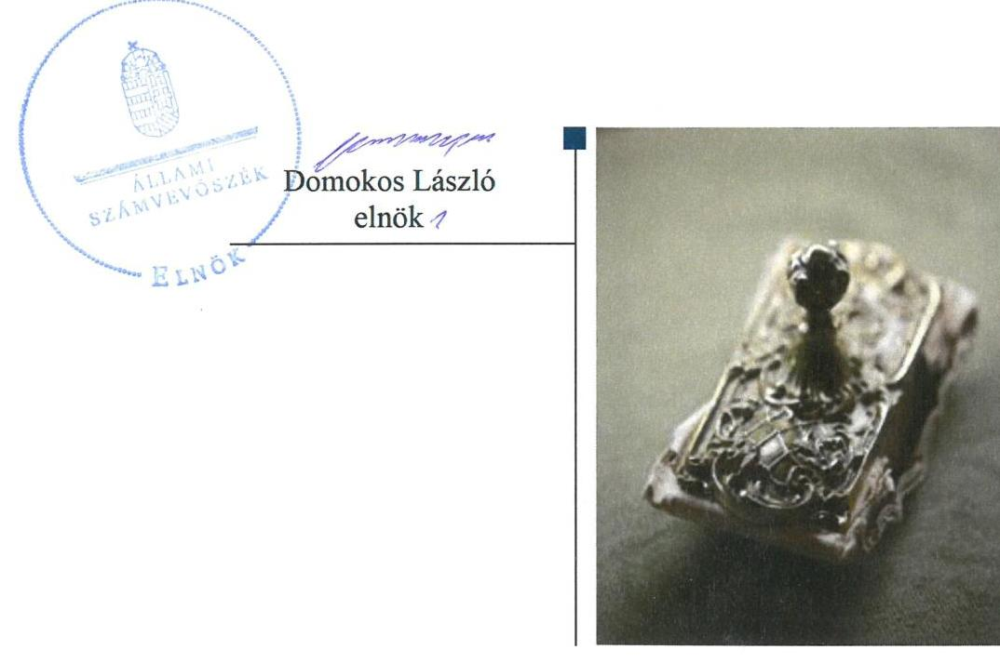

ÁLLAMI
SZÁMVEVŐSZÉK

# Jelentés

## Központi költségvetési szervek ellenőrzése

Baross László Mezőgazdasági Szakgimnázium, Szakközépiskola és Kollégium

2020.

20005
www.asz.hu

---

# Jelentés 

## Központi költségvetési szervek ellenőrzése

Baross László Mezőgazdasági Szakgimnázium, Szakközépiskola és Kollégium
2020. O4. hó 28. nap

---

# AZ ELLENŐRZÉST FELÜGYELTE:

## MAROZSÁN LÁSZLÓNÉ felügyeleti vezető

## AZ ELLENŐRZÉST VEZETTE ÉS A VÉGREHAJTÁSÁÉRT FELELŐS:

### DR. NAGY JUDIT ellenőrzésvezető

### A PROGRAM ÖSSZEÁLLÍTÁSÁÉRT FELELŐS:

### TÓTPÁL SZABOLCS osztályvezető

---

**IKTATÓSZÁM:** EL-2350-001/2019.

**TÉMASZÁM:** 2450

**ELLENŐRZÉS-AZONOSÍTÓ SZÁM:** V079143

---

Jelentéseink az Országgyűlés számítógépes hálózatán és az Interneta a www.asz.hu címen is olvashatóak.

---

# TARTALOMJEGYZÉK 

■ ÖSSZEGZÉS ..... 5
■ AZ ELLENŐRZÉS CÉLJA ..... 6
■ AZ ELLENŐRZÉS TERÜLETE ..... 7
■ AZ ELLENŐRZÉS HÁTTERE, INDOKOLTSÁGA ..... 8
■ A JELENTÉS LÉNYEGES KÉRDÉSKÖREI ..... 9
■ AZ ELLENŐRZÉS HATÓKÖRE ÉS MÓDSZEREI ..... 10
■ MEGÁLLAPÍTÁSOK ..... 12
■ JAVASLATOK ..... 16
■ MELLÉKLETEK ..... 19
I. sz. melléklet: Értelmező szótár ..... 19
■ FÜGGELÉKEK ..... 21
I. sz. függelék a jelentéshez ..... 21
II. sz. függelék: Észrevételek ..... 22
■ RÖVIDÍTÉSEK JEGYZÉKE ..... 25

---

.

---

# ÖSSZEGZÉS 

A Baross László Mezőgazdasági Szakgimnázium, Szakközépiskola és Kollégium müködésének szabályozottsága, pénzügyi és vagyongazdálkodása nem felelt meg a jogszabályi előírásoknak. Nem volt biztositott a felelős gazdálkodás, a közpénzek szabályszerü felhasználása és a nemzeti vagyonnal történő átlátható, elszámoltatható gazdálkodás. Nem volt védett a korrupciós kockázatokkal szemben.

## Az ellenőrzés társadalmi indokoltsága

Magyarország versenyképességének és a magyar gazdaság fejlődésének alapvető feltétele a magyar munkavállalók megfelelő szakmai képzettsége és felkészültsége, amelyben a szakképzési rendszernek döntő szerepe van. A mezőgazdaság vonatkozásában is kiemelten fontos ez, hiszen a magyar mezőgazdaság piaci versenyképességét és eredményességét nagymértékben befolyásolja az agrárszférában dolgozók képzettsége, felkészültsége. A szakképzés legjelentősebb színterei a szakképző iskolák. Az eredményes és célszerű szakképzés alapja és alapvető feltétele a szakképző intézmények közpénzekkel és a közvagyonnal való törvényes, átlátható és a korrupcióval szembeni védelmet biztosító müködése és gazdálkodása. Ezért ezen szervezetekkel szemben is alapvető társadalmi igény, hogy a rájuk bízott közpénzekkel, közvagyonnal szabályosan gazdálkodjanak. Emellett a szakképzésben részt vevő pedagógusok, tanulók és a szülők jogos elvárása, hogy a szakképző iskolák működése átlátható és elszámoltatható legyen. Mindezen igényekkel összhangban, a közpénzügyek átláthatóságának előmozdítása, a közvagyon védelme érdekében került sor az agrárszakképző iskolák belső kontrollrendszerének és gazdálkodásának ellenőrzésére.

## Főbb megállapítások, következtetések, javaslatok

A Baross László Mezőgazdasági Szakgimnázium, Szakközépiskola és Kollégium belső kontrollrendszerének kialakítása és müködtetése nem volt szabályszerű. Az intézményvezető a belső kontrollrendszer részeként nem szabályozta a vagyonnyilatkozat-tételre kötelezettek körét, nem alakította ki a vagyonnyilatkozat-tételi kötelezettséggel kapcsolatos eljárásrendet, ezáltal nem tette meg a legalapvetőbb intézkedést sem a korrupció megelőzése érdekében. Az információs és kommunikációs rendszert nem alakította ki, az integrált kockázatkezelési rendszert és a nyomon-követési rendszert nem működtette. A kontrolltevékenységeket nem gyakorolták szabályszerűen. A feltárt szabálytalanságok miatt a Baross László Mezőgazdasági Szakgimnázium, Szakközépiskola és Kollégium belső kontrollrendszere nem biztosította a szabályszerű működés és gazdálkodás feltételeit.

A Baross László Mezőgazdasági Szakgimnázium, Szakközépiskola és Kollégium pénzügyi gazdálkodása a 2016. évben nem volt szabályszerű, nem vezetették a jogszabályok szerinti nyilvántartást a kötelezettségvállalásokról.

Vagyongazdálkodása nem volt szabályszerű, mivel a költségvetési beszámoló mérleg tételei leltárral nem voltak alátámasztottak.

A Baross László Mezőgazdasági Szakgimnázium, Szakközépiskola és Kollégiumban a korrupcióval szembeni védelemhez szükséges kontrollokat nem építették ki. A teljesítmény mérés feltételeit nem biztosították.

A megállapítások alapján az Állami Számvevőszék a Baross László Mezőgazdasági Szakgimnázium, Szakközépiskola és Kollégium intézmény vezetője részére 11 javaslatot fogalmazott meg.

---

# AZ ELLENŐRZÉS CÉLJA 

AZ ELLENŐRZÉS CÉLJA annak megítélése volt, hogy az ellenőrzött intézményre vonatkozó irányító szervi feladatellátás a jogszabályi előírások betartásával történt-e; az intézménynél a belső kontrollrendszer kialakítása és múködtetése szabályszerű volt-e, biztosította-e az átlátható, szabályszerű, gazdaságos, hatékony és eredményes gazdálkodás feltételeit; az intézmény pénzügyi és vagyongazdálkodása megfelelt-e a jogszabályi előírásoknak és belső szabályzatainak. Az ellenőrzés keretében az Állami Számvevőszék értékelte az intézmény korrupciós kockázatainak kezelését szolgáló integritás kontrollok kiépítettségét és az integritás szemlélet érvényesülését, a teljesítményellenőrzés feltételeinek kialakítását. Értékelte továbbá, hogy az ellenőrzött megfelel-e annak az Alaptörvényben meghatározott alapvetésnek, hogy Magyarország a kiegyensúlyozott, átlátható és fenntartható költségvetési gazdálkodás elvét érvényesíti. Érvényesült-e a nemzeti vagyon kezelésének és védelmének célja, azaz a szervezet vagyona a közérdeket szolgálta-e a közös szükségletek kielégítése és a természeti erőforrások megóvása, valamint a jövő nemzedékek szükségleteinek figyelembevétele mellett.

---

# **AZ ELLENŐRZÉS TERÜLETE**

## **Baross László Mezőgazdasági Szakgimnázium, Szakközépiskola és Kollégium**

A mátészalkai székhelyű Baross László Mezőgazdasági Szakgimnázium, Szakközépiskola és Kollégium Szabolcs-Szatmár-Bereg megyében található. 2013. augusztus 1-jétől az Intézmény1 irányító szerve és fenntartója a Minisztérium2 volt.

Az Intézmény alapfeladata a szakgimnáziumi és szakközépiskolai nevelés-oktatás, továbbá kollégiumi elhelyezés biztosítása. Az Intézmény tanulói létszáma 2017. októberében 310 fő volt, akik számára mezőgazdaság és élelmiszeripar szakmacsoportban nyújtottak oktatást és biztosítottak szakképzési lehetőséget.

Az Intézmény gazdasági szervezettel nem rendelkezik, a gazdálkodással összefüggő feladatokat a Lippai János Mezőgazdasági Szakképző Iskola látta el. A foglalkoztatottak létszáma a 2016. évben 62 fő, a 2017. évben 65 fő volt.

Az ellenőrzött időszakban az Intézménynél szervezeti, szerkezeti átalakításra nem került sor, az Intézmény vezetője3 2015. július 1. óta látja el a feladatát.

Az Intézménynél a 2016. évi összes bevétel 406 millió Ft volt, ebből a finanszírozási bevétel 327 millió Ft összegben teljesült. 2017. év tekintetében az összes bevétel 817 millió Ft volt, melyből a finanszírozási bevétel 332 millió Ft összegben teljesült. A bevétel 2017. évi jelentős változását az energetikai felújítás miatti előirányzat növekedés okozta.

---

# AZ ELLENŐRZÉS HÁTTERE, INDOKOLTSÁGA 

Az államháztartás központi alrendszerének közpénz felhasználása, az intézmények által ellátott közfeladatok sokrétúsége, valamint a feladatellátásához rendelt vagyon nagyságrendje indokolja, hogy az ÁSZ ${ }^{4}$ ellenőrzéseket folytasson a pénzügyi és vagyongazdálkodás területén. Az ÁSZ az ellenőrzései során feltárja a gazdálkodást, a központi alrendszer intézményei átalakulását, átszervezését érintő szabályozások esetleges hiányosságait, a szabályozással nem érintett gazdálkodási területeket, rámutathat a vagyongazdálkodási tevékenység - ezen belül a tulajdonosi joggyakorlás és vagyonkezelés - esetleges szabálytalanságaira, értékeli az állami vagyon nyilvántartására és elszámolására vonatkozó eljárásokat.

Az ellenőrzés a szervezet kockázatértékelése alapján, az egyedi és lényeges jellemzők figyelembevételével, az ellenőrzésre kiválasztott modullal történik. Az integritás- és belső kontroll modul a központi költségvetési szerv működésének irányítottságát, korrupció elleni védettségét értékeli.

A belső kontrollrendszer kialakítása és működtetése nélkül nem valósítható meg a közpénzek, a közvagyon átlátható, szabályos, gazdaságos, hatékony és eredményes felhasználása. A belső kontrollrendszer azt a célt szolgálja, hogy a költségvetési szervek működésük és gazdálkodásuk során a tevékenységeket szabályszerűen hajtsák végre, teljesítsék elszámolási kötelezettségeiket és megvédjék az erőforrásokat a veszteségektől, a károktól és a nem rendeltetésszerű használattól. A belső kontrollrendszer magában foglalja mindazon elveket, eljárásokat és belső szabályzatokat, melyek biztosítják, hogy a költségvetési szerv valamennyi tevékenysége és célja összhangban legyen a szabályszerűséggel, szabályozottsággal, valamint a gazdaságosság, hatékonyság és eredményesség követelményeivel, az eszközökkel és forrásokkal való gazdálkodásban ne kerüljön sor pazarlásra, visszaélésre, rendeltetésellenes felhasználásra. Megfelelő, pontos és naprakész információk álljanak rendelkezésre a költségvetési szerv múködésével kapcsolatosan, és a belső kontrollrendszer harmonizációjára, öszszehangolására vonatkozó jogszabályok végrehajtásra kerüljenek. Az integritás kontrollok kiépítése, erősítése a szervezet korrupciós kockázatainak kezelését szolgálja. A teljesítménykövetelmények meghatározása és múködtetése megalapozhatja a központi költségvetési szervnél a teljesítményellenőrzés lefolytatását.

Az egyes ellenőrzések megállapításaival és egy időszak ellenőrzési eredményeinek elemzésével az ÁSZ ráirányíthatja a jogalkotók figyelmét a központi alrendszerben vagy annak egy ágazatában esetlegesen felmerülő pénzügyi, szabályozási feszültségekre. Az elvégzett ellenőrzések során az ÁSZ „jó gyakorlatokat" is azonosíthat, melyeket tanácsadó funkciója keretében szélesebb körben is megismertethet az érintettekkel, ezáltal is hozzájárulva a költségvetési rendszer szabályozott, átlátható, kiegyensúlyozott és fenntartható múködéséhez.

---

# A JELENTÉS LÉNYEGES KÉRDÉSKÖREI 

1. Az irányító szerv ellenőrzött költségvetési szervre vonatkozó feladatellátása szabályszerű volt-e?
2. A belső kontrollrendszer kialakítása és müködtetése biztosí-totta-e a közpénzekkel és a nemzeti vagyonnal történő átlátható, szabályszerű gazdálkodást?
3. A költségvetési szerv pénzügyi gazdálkodása szabályszerű volt-e?
4. A költségvetési szerv vagyongazdálkodása szabályszerű volt-e?
5. A költségvetési szervnél alakítottak-e ki a teljesítmény mérésére alkalmas követelményeket?

---

# AZ ELLENŐRZÉS HATÓKÖRE ÉS MÓDSZEREI 

## Az ellenőrzés típusa

Megfelelőségi ellenőrzés

## Az ellenőrzött időszak

Az irányító szervi feladatellátás és az ellenőrzött szervezet pénzügyi gazdálkodása tekintetében a 2016. év.

Az intézmény vagyongazdálkodása, integritás és belső kontrollrendszerének értékelése tekintetében a 2016-2017. évek.

## Az ellenőrzés tárgya

Az intézményre vonatkozó irányító szervi feladatok ellátása. Az intézmény belső kontrollrendszerének kialakítása és múködtetése, pénzügyi és vagyongazdálkodása, az integritáskontrollok kiépítettsége, az integritás szemlélet érvényesülése, a teljesítményellenőrzés feltételei.

## Az ellenőrzött szervezet

Baross László Mezőgazdasági Szakgimnázium, Szakközépiskola és Kollégium és irányítószerve a Földművelésügyi Minisztérium (jelenleg Agrárminisztérium); valamint a gazdálkodási feladatokat ellátó Lippai János Mezőgazdasági Szakképző Iskola

## Az ellenőrzés jogalapja

Az ellenőrzés jogszabályi alapját az ÁSZ tv. 1. § (3) bekezdés, 5. § (2)-(3) és (4) bekezdés a) pontja, (6) bekezdései, valamint az Áht. ${ }^{5} 61 . \S$ (2) bekezdésének előírásai képezték.

## Az ellenőrzés módszerei

Az ellenőrzésre a szakmai program szempontjai, az ellenőrzött időszakban hatályos jogszabályok, az ellenőrzés szakmai szabályai, a jelen ellenőrzésre irányadó ÁSZ módszertanok figyelembevételével került sor.

Az ellenőrzési kérdések megválaszolásához szükséges bizonyítékok megszerzése az ellenőrzött szervezetek által rendelkezésre bocsátott do-

---

kumentumokra, adatokra alapozva megfigyelés, szemle (szemrevételezés), kérdésfeltevés (információkérés), mintavételezés, valamint elemző eljárás útján történik. Az ellenőrzési bizonyítékként felhasználható adatforrások közé tartoznak az ellenőrzési program részletes szempontjainál felsorolt adatforrások, valamint minden egyéb - az ellenőrzés folyamán feltárt, az ellenőrzés szempontjából információt tartalmazó - dokumentum.

Az ellenőrzés lefolytatásához az ellenőrzött szervezetek tanúsítványok kitöltésével, valamint az ÁSZ által kért dokumentumok megküldésével szolgáltatattak adatokat, amelyek valódiságát és teljes körűségét az ellenőrzött szervezetek vezetői által tett teljességi és hitelességi nyilatkozat igazolja. A rendelkezésre bocsátott adatok, információk kontrollja az ellenőrzés keretében történt.

Az intézmény belső kontrollrendszere egyes pilléreinek kialakítására és működtetésére vonatkozó értékelés a következő volt:
$\longrightarrow$ „szabályszerú", amennyiben az értékelt területen az elért „igen" válaszok százalékban kifejezett, egész számra kerekített aránya legalább $85 \%$ volt,
$\longrightarrow$ „nem szabályszerű", ha nem érte el a $85 \%$-ot.
Az Intézmény belső kontrollrendszerének összesített értékelése az egyes részterületek esetében kapott megfelelőségi arányok számtani átlaga alapján történt és megegyezett a pillérenként (kontrollterületenként) alkalmazott százalékos értékelésekkel, a következő eltérésekkel: a kontrollrendszer egésze esetében a „szabályszerű" értékelésnek a százalékos értéken felül további feltétele volt, hogy egyik kontrollterület sem kaphat „nem szabályszerű" értékelést.

Az ÁSZ statisztikai módszereken alapuló mintavételt alkalmazott. A kiadások és a bevételek ellenőrzésére a 2016-2017 év vonatkozásában került sor. A kiadások (külső személyi juttatások, felhalmozási kiadások, dologi kiadások) és bevételek (értékesítésből és bérbeadásból származó bevételek) esetében az ellenőrzés azokra a legnagyobb értékű tételekre - a lényeges sokaságra - terjedt ki, melyek összértéke eléri a teljes sokaság összértékének $50 \%$-át.

A 2017. évi kiadások és a 2016. évi bevételek esetében a lényeges sokaságot tételesen ellenőrizte az ÁSZ. A 2017. évben az ellenőrzött nem rendelkezett értékesítésből származó bevétellel. A 2016. évi kiadások elszámolásának szabályszerűséget a lényeges sokaságból véletlen mintavételi eljárással kiválasztott tételek alapján ellenőrizte az ÁSZ. A 2017. évi beruházások, felújítások végrehajtásának, valamint a feladatellátást szolgáló állami vagyontárgyak használatának és év végi értékelésének szabályszerűségét a teljes sokaságból véletlen mintavétellel kiválasztott tételek alapján ellenőrizte az ÁSZ. A mintavétellel ellenőrzött területek esetében minden egyes tétel vonatkozásában a használat, elszámolás és értékelés szabályszerűségére vonatkozó kérdéseket tett fel az ÁSZ. Szabályszerűnek értékelt egy ellenőrzött területet, amennyiben 95\%-os bizonyossággal az ellenőrzött sokaságban az átlagos hibaarány legfeljebb 10\%, nem szabályszerűnek, amennyiben 10\%-nál magasabb arányt képviselt.

Az ellenőrzés ideje alatt az ellenőrzött szervezettel történő kapcsolattartást az ÁSZ az SZMSZ ${ }^{6}$-ének vonatkozó előírásai alapján biztosította.

---

# MEGÁLLAPÍTÁSOK 

## 1. Az irányító szerv ellenőrzött költségvetési szervre vonatkozó feladatellátása szabályszerű volt-e?

Összegző megállapítás A Minisztérium Intézményre vonatkozó feladatellátása szabályszerű volt.

A Minisztérium jóváhagyta az Intézmény elemi költségvetését, költségvetési beszámolóját a jogszabályi előírásoknak megfelelően.

A Minisztérium az Áht.-ben foglalt hatáskörét gyakorolva beszámoltatta az Intézmény vezetőjét az éves szakmai feladatellátásról, valamint az éves gazdálkodásról.

## 2. A belső kontrollrendszer kialakítása és múködtetése biztosí-totta-e a közpénzekkel és a nemzeti vagyonnal történő átlátható, szabályszerű gazdálkodást?

## Összegző megállapítás Az Intézménynél a belső kontrollrendszer kialakítása és múködtetése nem volt szabályszerű.

A BELSŐ KONTROLLRENDSZER KIALAKÍTÁSA ÉS MÚKÖDTETÉSE NEM VOLT SZABÁLYSZERÚ A 2016. ÉVBEN az Intézménynél, mivel az Intézmény a szervezeti és múködési szabályzatában nem tüntette fel a vagyonnyilatkozat tételi kötelezettséggel járó munkaköröket, továbbá a vagyonnyilatkozat-tételi kötelezettséghez kapcsolódóan belső szabályozást nem alakította ki.

## A KONTROLLKÖRNYEZET KIALAKÍTÁSA A

2017. ÉVBEN nem volt szabályszerű az Intézménynél, mivel:
$\longrightarrow$ Az Intézmény vezetője a vagyonnyilatkozat tételi kötelezettséggel járó munkaköröket a Vnytv. ${ }^{7}$ 4. § a) pontja ellenére a szervezeti és múködési szabályzatban nem tüntette fel.
$\longrightarrow$ Az Intézmény vezetője a Vnytv. 11. § (6) bekezdésében foglaltak ellenére a vagyonnyilatkozat átadására, nyilvántartására, a vagyonnyilatkozatban foglalt személyes adatok védelmére vonatkozó további szabályokat szabályzatban nem állapított meg.
$\longrightarrow$ Az Intézmény vezetője nem szabályozta a közérdekú adatok megismerésére irányuló kérelmek intézésének, továbbá a kötelezően közzéteendő adatok nyilvánosságra hozatalának rendjét az Ávr. ${ }^{8}$ 13. § (2) bekezdésének h) pontjában előírt rendelkezések ellenére.

---

Az Intézmény rendelkezett a Számv. tv. ${ }^{9}$ és az Áhsz. ${ }^{10}$ által előírt számviteli politikával és annak keretében elkészített számviteli szabályzatokkal.

INTEGRÁLT KOCKÁZATKEZELÉSI RENDSZERT az Intézmény vezetője a Bkr. ${ }^{11} 7$. § (1) bekezdésben előírtak ellenére nem múködtetett a 2017. évben, mivel a Bkr. 7. § (2) bekezdésében előírtak ellenére nem mérte fel és nem állapította meg az intézmény tevékenységében rejlő és a szervezeti célokkal összefüggő kockázatokat, valamint nem határozta meg az egyes kockázatokkal kapcsolatban szükséges intézkedéseket, valamint azok teljesítésének folyamatos nyomon követésének módját.

A KONTROLLTEVÉKENYSÉGEK GYAKORLÁSA a 2017. évben nem szabályszerűen történt az Intézménynél. A dologi kiadások pénzügyi teljesítésére az Áht. 38. § (1) bekezdése ellenére teljesítésigazolások nélkül került sor.

# AZ INTÉZMÉNY INFORMÁCIÓS ÉS KOMMUNIKÁCIÓS RENDSZERÉT az Intézmény vezetője a Bkr. 3 § d) pontja és a 9. § (1) bekezdésében foglaltak ellenére nem alakította ki. 

## A SZERVEZET NYOMONKÖVETÉSI RENDSZERÉT

az Intézmény vezetője nem működtette, mivel a Bkr. 10. § előírása ellenére nem gondoskodott az operatív tevékenységek keretében megvalósuló folyamatos és eseti nyomon követésről.

A 2017. évben a belső ellenőrzést szabályszerűen alakították ki az Intézménynél.

A belső ellenőrzést azonban nem működtették szabályszerűen, tekintettel arra, hogy a belső ellenőrzésekről vezetett nyilvántartás nem tartalmazta a Bkr. 50. § (2) bekezdés d) és f) pontjában előírt tartalmi elemet, azaz az ellenőrzés kezdetének időpontját és a vizsgált időszakot. Az Intézmény vezetője nem gondoskodott a Bkr. 14. § (1) bekezdésében előírtak szerint a külső ellenőrzések nyilvántartásának vezetéséről és ez alapján a Bkr. 14. § (2) bekezdésében rögzítettek ellenére nem számolt be a fejezetet irányító szerv vezetőjének.

A jogszabályok által előírt integritás kontrollok kiépítettségi szintje az Intézménynél nem támogatta a korrupciós kockázatok kezelését. Az Intézmény nem végzett kockázatelemzéseket.

Az Intézmény vezetője a vezetői nyilatkozatában 2016-2017. évekre vonatkozóan a Bkr.-ben foglaltak szerint szabályszerűnek értékelte az Intézmény belső kontrollrendszere minőségét. Az ÁSZ ellenőrzés megállapításai a 2016-2017. években kiadott vezetői nyilatkozatokat nem támasztották alá.

---

# 3. A költségvetési szerv pénzügyi gazdálkodása szabályszerű volt-e? 

## Összegző megállapítás

Az Intézmény pénzügyi gazdálkodása a 2016. évben nem volt szabályszerű.

Az Intézmény pénzügyi gazdálkodása nem volt szabályszerű, mert:
$\longrightarrow$ Az Intézmény az Áhsz. 39. § (1) bekezdésben előírtak ellenére a kötelezettségvállalásokról és más fizetési kötelezettségekről nem vezette az Áhsz. 14. melléklet II. 4. pontjában előírt tartalommal a nyilvántartást.
$\longrightarrow$ A dologi és felhalmozási kiadások az Intézménynél az Áht. 37. § (1) bekezdése ellenére kötelezettségvállalások nélkül valósultak meg.
$\longrightarrow$ A dologi kiadások pénzügyi teljesítésére az Áht. 38. § (1) bekezdése ellenére teljesítésigazolások nélkül került sor.

## 4. A költségvetési szerv vagyongazdálkodása szabályszerű volt-e?

## Összegző megállapítás

Az Intézmény vagyongazdálkodása a 2016-2017. évben nem volt szabályszerű.

A vagyongazdálkodás nem volt szabályszerű, mert:
$\longrightarrow$ Az Áhsz. 5. § (1) bekezdésében, 22. § (1)-(2) bekezdéseiben, valamint a Számv. tv. 69. § (1) bekezdésében előírtak ellenére az Intézmény a 2016-2017. évi mérleg tételeit leltárral nem támasztotta alá.
$\longrightarrow$ A 2017. évi beruházások során a jogi személlyel, jogi személyiséggel nem rendelkező szervezettel kötött visszterhes szerződések nem tartalmazták a szervezet képviselőjének nyilatkozatát arra vonatkozóan, hogy átlátható szervezetnek minősülnek, az Ávr. 50. § (1a) bekezdésének előírásai ellenére. Továbbá a nemzeti vagyonelemek 2016. évi bérbeadása során nem tartották be az Nvtv. ${ }^{12}$ 11. § (10) bekezdés előírásait, mivel az Intézmény nem rendelkezett a szerződő partnereknek az Nvtv. 3. § (2) bekezdésben előírt nyilatkozatával arról, hogy átlátható szervezeteknek minősülnek.
$\longrightarrow$ Az Intézmény a tárgyi eszközökről az Áhsz. 39. § (3) bekezdésben előírtak ellenére az Áhsz. 14. melléklet VII. pontjában előírt nyilvántartást nem vezette.

---

# 5. A költségvetési szervnél alakítottak-e ki a teljesítmény mérésére alkalmas követelményeket? 

Összegző megállapítás Az Intézménynél nem alakították ki a teljesítmény mérésére alkalmas követelményeket.

A teljesítménymérésre alkalmas követelményeket, ehhez kapcsolódóan mérőszámokat, indikátorokat az Intézmény vezetője nem alakított ki, ezáltal a teljesítmény mérésének feltételei nem álltak fenn.

---

# JAVASLATOK 

Az ÁSZ tv. 33. § (1) bekezdésében foglaltak értelmében az ellenőrzött szervezet vezetője köteles a jelentésben foglalt megállapításokhoz kapcsolódó intézkedési tervet összeállítani és azt a jelentés kézhezvételétől számított 30 napon belül az ÁSZ részére megküldeni. Amennyiben az ellenőrzött szervezet vezetője nem küldi meg határidőben az intézkedési tervet, vagy továbbra sem elfogadható intézkedési tervet küld, az Állami Számvevőszék elnöke az ÁSZ tv. 33. § (3) bekezdése a) és b) pontjaiban foglaltakat érvényesítheti.

## Baross László Mezögazdasági Szakgimnázium, Szakközépiskola és Kollégium igazgatója részére

1. Intézkedjen a Vnytv. elöirásainak megfelelően a vagyonnyilatkozat-tételi kötelezettség SZMSZ-ben való feltüntetéséről.
(2. sz. megállapítás 2. bekezdés 1. francia bekezdése alapján)
2. Intézkedjen a vagyonnyilatkozat átadására, nyilvántartására, a vagyonnyilatkozatban foglalt személyes adatok védelmére vonatkozó szabályok megállapításáról.
(2. sz. megállapítás 2. bekezdés 2. francia bekezdése alapján)
3. Intézkedjen az Ávr. elöirásának megfelelően
a) a kötelezően közzéteendő adatok nyilvánosságra hozatala rendjének;
b) a közérdekü adatok megismerésére irányuló kérelmek intézésének belső szabályzatban való rendezéséről.
(2. sz. megállapítás 2. bekezdés 3. francia bekezdése alapján)
4. Intézkedjen a Bkr. elöirásának megfelelően az integrált kockázatkezelési rendszer müködtetéséről.
(2. sz. megállapítás 4. bekezdése alapján)
5. Intézkedjen, hogy a teljesítésigazolásra az Áht. elöirásának megfelelően kerüljön sor.
(2. sz. megállapítás 5. bekezdés 2. mondata alapján)
6. Intézkedjen az információs és kommunikációs rendszer Bkr. elöirásának megfelelő kialakításáról és müködtetéséről.
(2. sz. megállapítás 6. bekezdése alapján)

---

7. Intézkedjen a Bkr. előírásai szerint az operatív tevékenységek keretében megvalósuló folyamatos és eseti nyomon követésről.
(2. sz. megállapítás 7. bekezdése alapján)
8. Gondoskodjon
a) a belső ellenőrzésekkel és a külső ellenőrzésekkel kapcsolatos Bkr. által elöirt nyilvántartás vezetéséről;
b) az irányítószerv felé történő beszámolási kötelezettség teljesitéséről.
(2. sz. megállapítás 9. bekezdése alapján)
9. Intézkedjen az Áhsz. előírásainak megfelelő részletező nyilvántartás vezetéséről
a) a kötelezettségvállalásokról, más fizetési kötelezettségekről;
b) a tárgyi eszközökről.
(3. sz. megállapítás 1. bekezdés 1. francia bekezdése alapján és a 4. megállapítás 1. bekezdés 3. francia bekezdése alapján)
10. Intézkedjen az éves költségvetési beszámoló elkészitéséhez, a mérlegtételeinek alátámasztásához a jogszabályi előírásnak megfelelő leltár összeállításáról.
(4. sz. megállapítás 1. bekezdés 1. francia bekezdése alapján)
11. Gondoskodjon arról, hogy jogi személlyel, jogi személyiséggel nem rendelkező szervezettel kötött visszterhes szerződések és a nemzeti vagyon hasznosítására kötött szerződések esetén az Ávr. és az Nvtv. előírása szerint rendelkezésre álljon a szervezet képviselöjének nyilatkozata arról, hogy átlátható szervezetnek minősül.
(4. sz. megállapítás 1. bekezdés 2. francia bekezdése alapján)

---

.

---

# MELLÉKLETEK 

- I. SZ. MELLÉKLET: ÉRTELMEZŐ SZÓTÁR
állami vagyon
állami vagyon kezelője /vagyonkezelő
átalakítás
belső ellenőrzés
belső kontrollrendszer
belső kontrollrendszer területei
ellenőrzési nyomvonal
információs és kommunikációs rendszer
integritás

Állami vagyonnak minősül:
a) az állam tulajdonában lévő dolog, valamint a dolog módjára hasznosítható természeti erő,
b) az a) pont hatálya alá nem tartozó mindazon vagyon, amely vonatkozásában törvény az állam kizárólagos tulajdonjogát nevesíti,
c) az állam tulajdonában lévő tagsági jogviszonyt megtestesítő értékpapír, illetve az államot megillető egyéb társasági részesedés,
d) az államot megillető olyan immateriális, vagyoni értékkel rendelkező jogosultság, amelyet jogszabály vagyoni értékű jogként nevesít. (Forrás: Vtv. ${ }^{13} 1 . \S$ (2) bekezdése)
Az állami vagyont az MNV Zrt. ${ }^{14}$ maga kezeli, vagy szerződés - így különösen bérlet, haszonbérlet, megbízás - alapján központi költségvetési szervnek, természetes vagy jogi személynek, vagy jogi személyiséggel nem rendelkező gazdálkodó szervezetnek hasznosításra átengedi." Az állami vagyonra vonatkozóan az MNV Zrt. kizárólag az Nvtv. -ben meghatározott személyekkel köthet vagyonkezelési szerződést. (Forrás: Vtv. 27. § (1) bekezdése, hatályos 2012. január 1-jétől)

A költségvetési szerv általános jogutódlással történő megszüntetése átalakítással történhet. Az átalakítás lehet egyesítés vagy különválás. Az egyesítés lehet beolvadás vagy összeolvadás. (2015. január 1-jétől Áht. 11. § (2) bekezdés)
Független, tárgyilagos bizonyosságot adó és tanácsadó tevékenység, amelynek célja, hogy az ellenőrzött szervezet működését fejlessze és eredményességét növelje, az ellenőrzött szervezet céljai elérése érdekében rendszerszemléletű megközelítéssel és módszeresen értékeli, illetve fejleszti az ellenőrzött szervezet irányítási és belső kontrollrendszerének hatékonyságát. (Forrás: Bkr. 2. § b) pontja)
A belső kontrollrendszer a kockázatok kezelése és tárgyilagos bizonyosság megszerzése érdekében kialakított folyamatrendszer, amely azt a célt szolgálja, hogy a múködés és gazdálkodás során a tevékenységeket szabályszerűen, gazdaságosan, hatékonyan, eredményesen hajtsák végre, az elszámolási kötelezettségeket teljesítsék, megvédjék az erőforrásokat a veszteségektől, károktól és nem rendeltetésszerű használattól. (Forrás: Áht. 69. § (1) bekezdése)
A kontrollkörnyezet, az integrált kockázatkezelési rendszer, a kontrolltevékenységek, az információs és kommunikációs rendszer, valamint a nyomon követési (monitoring) rendszer. (Forrás: Bkr. 3. §-a)
Az ellenőrzési nyomvonal a költségvetési szerv működési folyamatainak szöveges, táblázatokkal vagy folyamatábrákkal szemléltetett leírása, amely tartalmazza különösen a felelősségi és információs szinteket és kapcsolatokat, irányítási és ellenőrzési folyamatokat, lehetővé téve azok nyomon követését és utólagos ellenőrzését. (Forrás: Bkr. 6. § (3) bekezdés)
A költségvetési szerv vezetője által kialakított és müködtetett olyan rendszer, mely biztosítja, hogy a megfelelő információk a megfelelő időben eljutnak az illetékes szervezethez, szervezeti egységhez, illetve személyhez. (Forrás: Bkr. 9. § (1) bekezdés)
Az integritás - egyik gyakran használt jelentése szerint - az elvek, értékek, cselekvések, módszerek, intézkedések konzisztenciáját jelenti, vagyis olyan magatartásmódot, amely meghatározott értékeknek megfelel. Integritás-irányítási rendszer bevezetése a szervezetben a szervezethez rendelt közfeladatok integritás szempontú ellátását, az érték alapú múködéssel (integritással) összefüggő szervezeti követelmények következetes érvényesítését jelenti. (Forrás: Nemzetgazdasági Minisztérium: Államháztartási Belső Kontroll Standardok és Gyakorlati Útmutató 1.6. Etikai értékek és integritás 46. oldal, 2017. szeptember)

---

integrált kockázatkezelési rendszer
irányító szerv/felügyeleti szerv
kockázat
kockázatkezelési rendszer
kontrollkörnyezet
kontrolltevékenységek
nyomon követési rendszer (monitoring)
vagyongazdálkodás

Olyan folyamatalapú kockázatkezelési rendszer, amely a szervezet minden tevékenységére kiterjed, egységes módszertan és eljárások alkalmazásával, a szervezet célkitűzéseinek és értékeinek figyelembevételével biztosítja a szervezet kockázatainak teljes körű azonosítását, azok meghatározott kritériumok szerinti értékelését, valamint a kockázatok kezelésére vonatkozó intézkedési terv elkészítését és az abban foglaltak nyomon követését. (Forrás: Bkr. 2. § m) pontja, 2016. október 1.-jétől)
A költségvetési szerv tekintetében az Áht.-ban meghatározott irányítási hatáskört gyakorló szerv. (Forrás: Áht. 1. § 9. pontja)
A kockázat annak a valószínűségét jelenti, hogy egy vagy több esemény vagy intézkedés nem kívánt módon befolyásolja a rendszer múködését, céljainak megvalósulását. (Forrás: Javaslatok a korrupciós kockázatok kezelésére - Kockázatkezelési és ellenőrzési módszertan 35 oldal, ÁSZ)
Olyan irányítási eszközök és módszerek összessége, melynek elemei a szervezeti célok elérését veszélyeztető tényezők (kockázatok) azonosítása, elemzése, csoportosítása, nyomon követése, valamint szükség esetén a kockázati kitettség mérséklése.(Forrás: Bkr. 2. § m) pontja, 2016. szeptember 30-ig)

A költségvetési szerv vezetője által kialakított olyan elvek, eljárások, belső szabályzatok öszszessége, amelyben világos a szervezeti struktúra, a folyamatok átláthatók, egyértelműek a felelősségi, hatásköri viszonyok és feladatok, meghatározottak, ismertek és elfogadottak az etikai elvárások a szervezet minden szintjén, átlátható a humánerőforrás-kezelés. (Forrás: Bkr. 6. § (1) bekezdés)
A költségvetési szerv vezetője által a szervezeten belül kialakított (kontroll) tevékenységek, melyek biztosítják a kockázatok kezelését, hozzájárulnak a szervezet céljainak eléréséhez és erősítik a szervezet integritását. (Forrás: Bkr. 8. § (1) bekezdés)
A költségvetési szerv vezetője köteles kialakítani a szervezet tevékenységének a célok megvalósításának nyomon követését biztosító rendszert, amely az operatív tevékenységek keretében megvalósuló folyamatos és eseti nyomon követésből, valamint az operatív tevékenységektől függetlenül múködő belső ellenőrzésből áll. 2016. október 1.-jétől: A költségvetési szerv vezetője köteles kialakítani a szervezet tevékenységének, a célok megvalósításának nyomon követését biztosító rendszert, mely az operatív tevékenységek keretében megvalósuló folyamatos és eseti nyomon követésből, valamint az operatív tevékenységektől függetlenül múködő belső ellenőrzésből állhat. (Forrás: Bkr. 10. §)
A nemzeti vagyongazdálkodás feladata a nemzeti vagyon rendeltetésének megfelelő, az állam, az önkormányzat mindenkori teherbíró képességéhez igazodó, elsődlegesen a közfeladatok ellátásához és a mindenkori társadalmi szükségletek kielégítéséhez szükséges, egységes elveken alapuló, átlátható, hatékony és költségtakarékos múködtetése, értékének megőrzése, állagának védelme, értéknövelő használata, hasznosítása, gyarapítása, továbbá az állam vagy a helyi önkormányzat feladatának ellátása szempontjából feleslegessé váló vagyontárgyak elidegenítése. (Forrás: Nvtv. 7. § (2) bekezdése)

---

# FÜGGELÉKEK 

- I. SZ. FÜGGELÉK A JELENTÉSHEZ

Az Állami Számvevőszék az ellenőrzések során feltárt tényekhez kapcsolódó további körülmények tisztázására eszközrendszerrel nem rendelkezik. Amennyiben az ellenőrzésen túlmutatóan indokoltnak látszik az ellenőrzés során feltárt körülmények további vizsgálata, az Állami Számvevőszék törvényi felhatalmazás alapján az ellenőrzés által feltárt körülményeket továbbítja a hatáskörrel rendelkező szervnek a szükséges intézkedések megtétele, eljárások lefolytatása érdekében.

1. Az Intézménynél 2016. évben a dologi kiadások vonatkozásában 2.552.334,-Ft értékben a felhalmozási kiadások vonatkozásában 695.000,-Ft értékben az Áht. 37. § (1) bekezdésében foglaltak ellenére kötelezettségvállalás nélkül történt a kifizetés.
2. Az Áht. 38. § (1) bekezdése ellenére

- 2016. évben 5.631.428,-Ft értékben a dologi kiadásoknál, 2.648.814,-Ft értékben a felhalmozási kiadásoknál, 177.498,-Ft összegben a külső személyi jellegü kiadásoknál,
- 2017.évben 5.212.907,-Ft értékben a kifizetések teljesitését megelőzően a dologi kiadásoknál teljesitésigazolásokra a teljesitésigazolók írásbeli kijelölése hiányában nem került sor.
A fenti szabálytalanságok miatt nem igazolt, hogy a kiadások valóban az Intézmény érdekében merültek fel, annak feladatellátását szolgálták, valamint hogy a kifizetésekhez valós teljesitések kapcsolódtak.

3. Az Intézmény a 2016-2017. évi éves beszámolójában a mérleg tételeinek alátámasztásához nem készült leltár. Ezzel megsértették az Áhsz. 5. § (1) bekezdésében, 22. § (1)-(2) bekezdéseiben, valamint a Számv. tv. 69. § (1) bekezdésében foglaltakat.

Ezért nem igazolt, hogy a beszámolók mérlegtételei a valóságban megtalálhatóak.
A gazdálkodási jogkörökre vonatkozó szabályok megsértése, a több évben megvalósuló leltár hiánya együttesen a vagyoni hátrány okozásának gyanúját vetik fel.
Az esetek konkrét körülményeinek felderítésére az Ügyészség rendelkezik hatáskörrel.

---

A jelentéstervezetet a Számvevőszék 15 napos észrevételezésre megküldte az ellenőrzött szervezetek vezetőinek az ÁSZ tv. 29. §" (1) bekezdése előirásának megfelelően.

A Baross László Mezőgazdasági Szakgimnázium, Szakközépiskola és Kollégium igazgatója a jelentéstervezet megállapításaira írásban észrevételt tett. Az Agrárminisztériumot vezető miniszter és a Lippai János Mezőgazdasági Szakképző Iskola igazgatója a jelentéstervezet megállapításaira nem tettek észrevételt.
Az ÁSZ tv. 29. § (3) bekezdésével összhangban az ÁSZ a Függelékben feltünteti az ellenőrzés megállapításaival kapcsolatban tett, figyelembe nem vett észrevételeket, és megindokolja, hogy azokat miért nem fogadta el.

[^0]
[^0]:    * 29. § (1) Az Állami Számvevőszék az ellenőrzési megállapításait megküldi az ellenőrzött szervezet vezetőjének vagy az általa megbízott személynek, és annak, akinek személyes felelősségét állapította meg.
    (2) Az ellenőrzött szervezet vezetője és a felelősként megjelölt személy az ellenőrzés megállapításaira tizenöt napon belül írásban észrevételt tehet.
    (3) Az Állami Számvevőszék az észrevételre a beérkezésétől számított harminc napon belül írásban válaszol. A figyelembe nem vett észrevételeket köteles a jelentésben feltüntetni, és megindokolni, hogy azokat miért nem fogadta el.

---

A „Központi költségvetési szervek ellenőrzése - Baross László Mezőgazdasági Szakgimnázium, Szakközépiskola és Kollégium" címmel készített számvevőszéki jelentéstervezet megállapításaival kapcsolatban az igazgató által 2019. november 15 -én tett (az Állami Számvevőszékhez 2019. november 20 -án érkezett) el nem fogadott észrevételek és azok kezelésének indokolása.

1. A 2. számú megállapítás 2. bekezdés 1. francia bekezdésére és a kapcsolódó 1. számú javaslatra tett észrevétel:

Az igazgató észrevételében leírta, hogy hogy a Baross László Mezőgazdasági Szakgimnázium, Szakközépiskola és Kollégium (továbbiakban: Intézmény) vezetőjeként a felügyeleti szerv felé, a gazdasági csoportvezető saját munkáltatójának adják át a vagyonnyilatkozatukat.

Az észrevételt nem fogadjuk el. Az igazgató észrevételében a vagyonnyilatkozatok leadásáról adott tájékoztatást, azonban a jelentéstervezetben tett megállapítás a vagyonnyilatkozat tételi kötelezettséggel járó munkakörök szervezeti és működési szabályzatban történő feltüntetésének hiányára vonatkozott. Az észrevétel az ÁSZ által tett megállapítást nem vitatta, a jelentéstervezet módosítása nem indokolt.
2. A 3. számú megállapítás 1. bekezdés 1. francia bekezdésére és a kapcsolódó 9. a) számú javaslatra tett észrevétel:

Az igazgató észrevételében leírta, hogy az Intézmény által alkalmazott EPER pénzügyi- és számviteli rendszer nem tudja kezelni a jelentéstervezetben jelzett hiányosságokat. Az Intézmény felveszi a kapcsolatot a szoftverfejlesztőkkel, hogy a későbbi időszakban a szoftver megfeleljen a törvényi előírásoknak.

Az igazgató észrevétele megerősítette a kötelezettségvállalásokról, más fizetési kötelezettségekről vezetett részletező nyilvántartásra tett megállapítást, az észrevétel alapján a jelentéstervezet módosítása nem indokolt.
3. A 4. számú megállapítás 1. bekezdés 1. francia bekezdésére és a kapcsolódó 10. számú javaslatra tett észrevétel:

Az igazgató észrevételében leírta, hogy az Intézmény minden évben elkészíti a mérleget alátámasztó leltárt, amit a jelenlegi, illetve egy korábbi ellenőrzés során megküldtek az ÁSZ részére. A 2016. és 2017. évi leltárakat az észrevételhez mellékelten újra megküldték.

Az ÁSZ a leltározással és a beszámoló mérlegtételeit alátámasztó leltárakkal kapcsolatosan az EL-1147-001/2018. iktatószámú adatbekérő levél 3. számú melléklet III. 1. pontjában (2017. évre vonatkozóan), illetve az EL-1147003/2018. iktatószámú adatbekérő levél 2. számú melléklet I. 8.1. pontjában (2016. évre vonatkozóan) és a VI. 2. pont 4-15. pontjaiban (2017. évre vonatkozóan) megjelölt dokumentumokat kérte megküldeni. Az Intézmény az adatszolgáltatás során a 2016. évre vonatkozóan leltárral és leltározással kapcsolatos dokumentumot nem bocsátott az ellenőrzés rendelkezésére. A 2017. évi beszámolóhoz kapcsolódóan megküldték a 2017. december 31-ei fordulónapra vonatkozóan a leltározási utasítást, a leltározási ütemtervet, az ingatlanleltár kiértékelését, valamint a tárgyi eszközök nyilvántartás alapján történő leltározása előtti és utáni jegyzőkönyveket, valamint a 2017. december 31-ei dátummal elvégzett, mindösszesen öt főkönyvi számlára vonatkozó egyeztetéseket. A megküldött dokumentumok a beszámoló elkészítéséhez nem tartalmazták tételesen, ellenőrizhető módon az Intézmény 2017. évi mérlegében szereplő eszközöket és forrásokat, nem igazolják a leltározás teljes körű elvégzését, az Intézmény 2017. évi költségvetési beszámolója mérlegtételeit alátámasztó leltár összeállítását. Ezáltal a mérlegtételek leltárral nem lettek alátámasztva az Áhsz. 5. § (1) bekezdésében előírtak ellenére.

Az igazgató észrevételében jelezte, hogy egy korábbi ellenőrzés kapcsán megküldték a mérleget alátámasztó leltárt, azonban a 2018. november 9-én aláírt, a korábban bekért adatok felhasználhatóságáról szóló nyilatkozatai egyike sem tartalmazott leltárral, leltározással kapcsolatos dokumentumot. Az ÁSZ az ellenőrzési megállapításait az ellenőrzési adatszolgáltatás során a törvényi határidőben rendelkezésre bocsátott dokumentumokra alapozva fogalmazza meg. Az igazgató a 2018. október 16 -ai és a 2018. november 10-ei keltezésű teljességi és hitelességi nyilatkozataiban az átadott dokumentumok, adatok hitelességéért, valódiságáért, hiánytalanságáért és hatályosságáért teljes felelősséget vállalt. Az adatszolgáltatásra nyitva álló határidőn kívül utólag, észrevételéhez mellékelten rendelkezésre bocsátott dokumentumokat az ÁSZ ellenőrzési bizonyítékként nem veszi figyelembe. Az előbbiekre tekintettel az észrevételt nem fogadjuk el, a jelentéstervezet módosítása nem indokolt.

---

# 4. A 4. számú megállapítás 1. bekezdés 3. francia bekezdésére és a kapcsolódó 9. b) számú javaslatra tett észrevétel: 

Az igazgató szerint az Intézmény az Áhsz. által előírt nyilvántartást az e-Kata ingatlan kataszteri rendszer keretében vezeti, amely tartalmazza a tárgyi eszköz nyilvántartási programot is. A programból kinyomtatott, a nyilvántartás alapján készült kartonokat, leltárakat megküldték az adatbekérés során.

Az ÁSZ megállapításait az adatszolgáltatás során rendelkezésre bocsátott dokumentumok alapján fogalmazza meg. Az észrevételben hivatkozott és a 2018. november 10-ei keltezésú teljességi és hitelességi nyilatkozattal átadott eszköz kimutatások nem feleltek meg az Áhsz. 39. § (3) bekezdésében előírt, az Áhsz. 14. melléklet VII. pontja szerinti részletező nyilvántartás kötelező minimum tartalmára vonatkozó előírásoknak, mivel nem tartalmazták a főkönyvi számlák számán, nevén, az eszközök darabszámán, bruttó és nettó értékén, valamint az elszámolt értékcsökkenés összegén kívüli egyéb előírt tartalmi elemeket. A fentiek alapján észrevételét nem fogadjuk el, a jelentéstervezet módosítása nem indokolt.

## 5. Az I. sz. Függelék 1. pontjában foglaltakra tett észrevétel:

Az igazgató észrevételében leírta, hogy 2016-ban valamennyi dologi és felhalmozási kiadásra történt kötelezettségvállalás az „utalványrendelet" elnevezésű nyomtatványon, valamint megrendelések és szerződések formájában.

Az Intézmény által az adatszolgáltatás során megküldött gazdálkodási szabályzathoz kapcsolódó, az egyes gazdálkodási jogkörök gyakorlására jogosultakról vezetett nyilvántartás az igazgatót és az igazgatóhelyettest nevesítette, mint kötelezettségvállalásra jogosult személyt. A jelentéstervezetben és a Függelékben a kiadásokkal kapcsolatos megállapításokat a kiadási mintatételekhez kért és az Intézmény által megküldött bizonylatok támasztják alá. A dologi és a felhalmozási mintatételekhez csatolt bizonylatok ismételt felülvizsgálata alapján a Függelék megállapítása helytálló, az 1. pontjában megjelölt összegű kiadások esetében vagy nem álltak rendelkezésre a kötelezettségvállalást igazoló dokumentumok (szerződés, megrendelés), vagy az egyes kiadások melletti kötelezettségvállalásokat arra nem felhatalmazott személy írta alá. Az igazgató az észrevételében hivatkozott „utalványrendelet" elnevezésű nyomtatványon szereplő aláírás nem igazolja az Áht. 37. § (1) bekezdésében előírt előzetes írásbeli kötelezettségvállalás megtörténtét. A nevezett utalványrendeleten szövegszerűen és aláírásával igazoltan az ahhoz mellékelt bizonylaton szereplő összeg kifizetését rendeli el az utalványozó.

## 6. Az I. sz. Függelék 2. pontjában foglaltakra tett észrevétel:

Az igazgató észrevételében leírta, hogy az Áht. 38. § (1) bekezdése szerinti teljesítés igazolók kijelölését az ÁSZ részére megküldött Gazdálkodási szabályzat tartalmazza.

Az Intézmény által az adatszolgáltatás során megküldött gazdálkodási szabályzathoz kapcsolódó, az egyes gazdálkodási jogkörök gyakorlására jogosultakról vezetett nyilvántartás az igazgatón kívül további négy személyt nevesített szakmai teljesítésigazolásra jogosultként. A feladatra történő felhatalmazással azonban csak az egyik igazgatóhelyettes rendelkezett. A kiadásokkal kapcsolatos megállapításokat a kiadási mintatételekhez kért és az Intézmény által megküldött bizonylatok támasztják alá. A kiadási mintatételekhez csatolt dokumentumok ismételt felülvizsgálata alapján a Függelék megállapítása helytálló, mivel a 2. pontjában megjelölt összegű kiadások esetében nem történt meg a teljesítésigazolás, vagy azt kijelöléssel nem rendelkező személy végezte.

## 7. A jelentéstervezet I. sz. Függelék 3. pontjában foglaltakra tett észrevétel:

Az igazgató észrevételében leírta, hogy az Intézmény a 2016-2017. évi éves beszámolójában a mérleg tételeinek alátámasztására a leltár elkészült és megküldésre került az adatbekérés során. A leltárakat az észrevételhez mellékelten újra megküldték.

A leltározással és a beszámoló mérlegtételeit alátámasztó leltárakkal kapcsolatosan tett észrevételt a tájékoztatás 3. pontjában leírtakban foglaltak alapján nem fogadjuk el, a Függelék módosítása nem indokolt. Az ÁSZ az ellenőrzési megállapításait az ellenőrzési adatszolgáltatás során a törvényi határidőben rendelkezésre bocsátott dokumentumokra alapozva fogalmazza meg. Az igazgató a teljességi és hitelességi nyilatkozatban az átadott dokumentumok, adatok hitelességéért, valódiságáért, hiánytalanságáért és hatályosságáért teljes felelősséget vállalt. Az adatszolgáltatásra nyitva álló határidőn kívül utólag, észrevételéhez mellékelten rendelkezésre bocsátott dokumentumokat az ÁSZ ellenőrzési bizonyítékként nem veszi figyelembe.

---

# RÖVIDÍTÉSEK JEGYZÉKE 

${ }^{1}$ Intézmény
${ }^{2}$ Minisztérium
${ }^{3}$ Intézmény vezetője
${ }^{4}$ ÁSZ
${ }^{5}$ Áht.
${ }^{6}$ ÁSZ SZMSZ
${ }^{7}$ Vnytv.
${ }^{8}$ Ávr.
${ }^{9}$ Számv. tv.
${ }^{10}$ Áhsz.
${ }^{11}$ Bkr.
${ }^{12}$ Nvtv.
${ }^{13} \mathrm{Vtv}$.
${ }^{14}$ MNV Zrt.

Baross László Mezőgazdasági Szakgimnázium, Szakközépiskola és Kollégium Agrárminisztérum, 2018. május 17-ig Földművelésügyi Minisztérium
Baross László Mezőgazdasági Szakgimnázium, Szakközépiskola és Kollégium, mint költségvetési intézmény vezetője
Állami Számvevőszék
2011. évi CXCV. törvény az államháztartásról (hatályos: 2011. december 31-jétől)

Állami Számvevőszék Szervezeti és Müködési Szabályzata
2007. évi CLII. törvény egyes vagyonnyilatkozat-tételi kötelezettségekről (hatályos: 2007. december 8-tól)
368/2011. (XII. 31.) Korm. rendelet az államháztartásról szóló törvény végrehajtásáról.
2000. évi C. törvény a számvitelről (hatályos: 2001. január 1-jétől)
4/2013. (I. 11.) Korm. rendelet az államháztartás számviteléről
370/2011. (XII. 31.) Korm. rendelet a költségvetési szervek belső kontrollrendszeréről és belső ellenőrzésről
2011. évi CXCVI. törvény a nemzeti vagyonról (hatályos: 2012. január 1-jétől)
2007. évi CVI. törvény az állami vagyonról (hatályos: 2007. szeptember 25-étől)

Magyar Nemzeti Vagyonkezelő Zrt.

---

# ÁLLAMI SZÁMVEVŐSZÉK 

1052 Budapest, Apáczai Csere János utca 10.
Levélcím: 1364 Budapest 4. Pf. 54
Telefon: +36 14849100 Telefax: +36 14849200
www.asz.hu