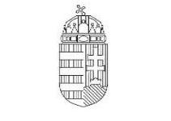
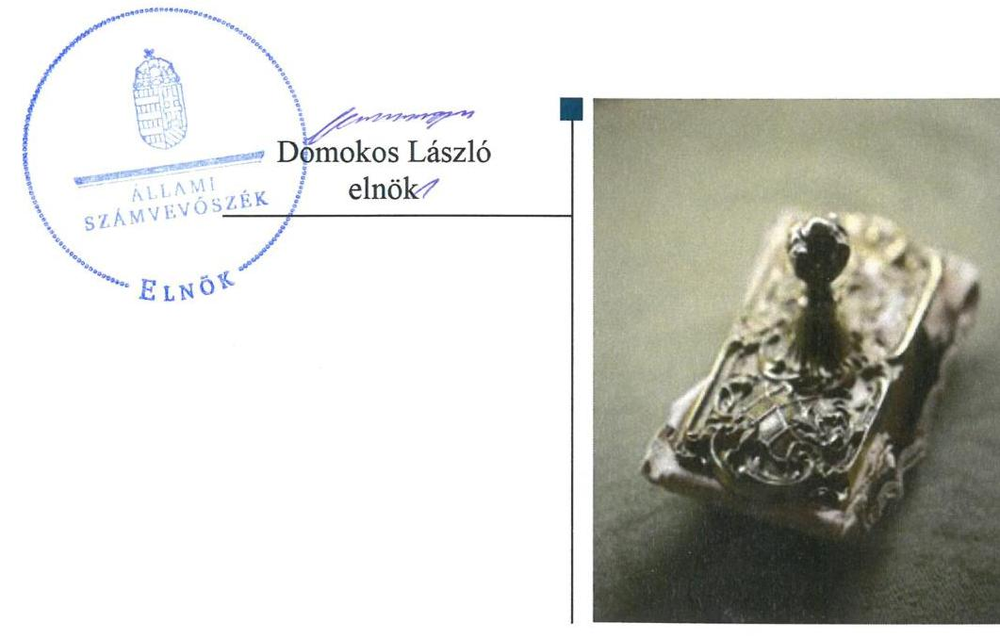
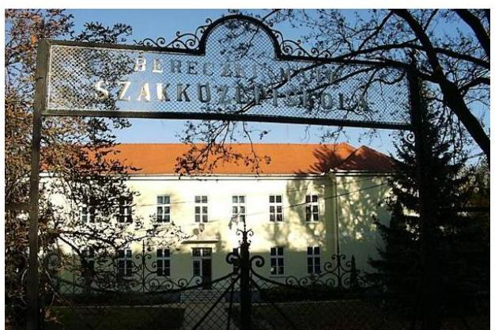

ÁLLAMI
SZÁMVEVŐSZÉK

# Jelentés

## Központi költségvetési szervek ellenőrzése

Bereczki Máté Élelmiszeripari és Mezőgazdasági Szakgimnázium, Szakközépiskola és Sportiskola 2020.

20006
www.asz.hu

---

# Jelentés 

## Központi költségvetési szervek ellenőrzése

Bereczki Máté Élelmiszeripari és Mezőgazdasági Szakgimnázium, Szakközépiskola és Sportiskola
2020. 01. hó 28. nap

---

# AZ ELLENŐRZÉST FELÜGYELTE:

## MAROZSÁN LÁSZLÓNÉ felügyeleti vezető

## AZ ELLENŐRZÉST VEZETTE ÉS A VÉGREHAJTÁSÁÉRT FELELŐS:

### BÁLINT KÁLMÁN KADOCSA ellenőrzésvezető

### A PROGRAM ÖSSZEÁLLÍTÁSÁÉRT FELELŐS:

### TÓTPÁL SZABOLCS osztályvezető

---

**IKTATÓSZÁM:** EL-2327-001/2019.

**TÉMASZÁM:** 2450

**ELLENŐRZÉS-AZONOSÍTÓ SZÁM:** V079147

---

Jelentéseink az Országgyűlés számítógépes hálózatán és az Interneten a www.asz.hu címen is olvashatóak.

---

# TARTALOMJEGYZÉK 

■ ÖSSZEGZÉS ..... 5
■ AZ ELLENŐRZÉS CÉLJA ..... 6
■ AZ ELLENŐRZÉS TERÜLETE ..... 7
■ AZ ELLENŐRZÉS HÁTTERE, INDOKOLTSÁGA ..... 8
■ A JELENTÉS LÉNYEGES KÉRDÉSKÖREI ..... 10
■ AZ ELLENŐRZÉS HATÓKÖRE ÉS MÓDSZEREI ..... 11
■ MEGÁLLAPÍTÁSOK ..... 13
■ JAVASLATOK ..... 16
■ MELLÉKLETEK ..... 19
I. sz. melléklet: Értelmező szótár ..... 19
■ FÜGGELÉKEK ..... 21
I. sz. függelék a jelentéshez ..... 21
II. sz. függelék: Észrevételek ..... 22
■ RÖVIDÍTÉSEK JEGYZÉKE ..... 27

---

.

---

# ÖSSZEGZÉS 

A Bereczki Máté Élelmiszeripari és Mezőgazdasági Szakgimnázium, Szakközépiskola és Sportiskola működésének szabályozottsága, pénzügyi és vagyongazdálkodása nem felelt meg a jogszabályi előírásoknak. Nem volt biztosított a felelős gazdálkodás, a szabályszerű közpénzfelhasználás és a nemzeti vagyonnal való átlátható, elszámoltatható gazdálkodás. Nem volt védett a korrupcióval szemben.

## Az ellenőrzés társadalmi indokoltsága

Magyarország versenyképességének és a magyar gazdaság fejlődésének alapvető feltétele a magyar munkavállalók megfelelő szakmai képzettsége és felkészültsége, amelyben a szakképzési rendszernek döntő szerepe van. A mezőgazdaság vonatkozásában is kiemelten fontos ez, hiszen a magyar mezőgazdaság piaci versenyképességét és eredményességét nagymértékben befolyásolja az agrárszférában dolgozók képzettsége, felkészültsége. A szakképzés legjelentősebb színterei a szakképző iskolák. Az eredményes és célszerű szakképzés alapja és alapvető feltétele a szakképző intézmények közpénzekkel és a közvagyonnal való törvényes, átlátható és a korrupcióval szembeni védelmet biztosító működése és gazdálkodása. Ezért ezen szervezetekkel szemben is alapvető társadalmi igény, hogy a rájuk bízott közpénzekkel, közvagyonnal szabályosan gazdálkodjanak. Emellett a szakképzésben részt vevő pedagógusok, tanulók és a szülők jogos elvárása, hogy a szakképző iskolák működése átlátható és elszámoltatható legyen. Mindezen igényekkel összhangban, a közpénzügyek átláthatóságának előmozdítása, a közvagyon védelme érdekében került sor az agrárszakképző iskolák belső kontrollrendszerének és gazdálkodásának ellenőrzésére.

## Főbb megállapítások, következtetések, javaslatok

A Bereczki Máté Élelmiszeripari és Mezőgazdasági Szakgimnázium, Szakközépiskola és Sportiskola belső kontrollrendszerének kialakítása és működtetése nem volt szabályszerű. A kontrollkörnyezetének kialakítása, a kontrolltevékenységek gyakorlása, valamint a belső ellenőrzés kialakítása, valamint működtetése nem volt szabályszerű. Az Intézmény vezetője nem alakította ki az integrált kockázatkezelési rendszert. A feltárt hiányosságok miatt a belső kontrollrendszer nem biztosította a szabályszerű működés és gazdálkodás kereteit.

A Bereczki Máté Élelmiszeripari és Mezőgazdasági Szakgimnázium, Szakközépiskola és Sportiskola pénzügyi gazdálkodása nem volt szabályszerű. A kötelezettségvállalások nyilvántartásának tartalmi hiányossága miatt nem volt biztosított a kötelezettségvállalásokkal terhelt maradvány alátámasztása.

A Bereczki Máté Élelmiszeripari és Mezőgazdasági Szakgimnázium, Szakközépiskola és Sportiskola vagyongazdálkodása nem volt szabályszerű, az éves beszámoló mérlegét leltár nem támasztotta alá.

A Bereczki Máté Élelmiszeripari és Mezőgazdasági Szakgimnázium, Szakközépiskola és Sportiskola nem építette ki a korrupciós kockázatok kezelését szolgáló kontrollokat.

A megállapítások alapján az Állami Számvevőszék a Bereczki Máté Élelmiszeripari és Mezőgazdasági Szakgimnázium, Szakközépiskola és Sportiskola igazgatója részére 14 javaslatot fogalmazott meg.

---

# AZ ELLENŐRZÉS CÉLJA 

AZ ELLENŐRZÉS CÉLJA annak megítélése volt, hogy az ellenőrzött intézményre vonatkozó irányító szervi feladatellátás a jogszabályi előírások betartásával történt-e; az intézménynél a belső kontrollrendszer kialakítása és működtetése szabályszerű volt-e, biztosította-e az átlátható, szabályszerű, gazdaságos, hatékony és eredményes gazdálkodás feltételeit; az intézmény pénzügyi és vagyongazdálkodása megfelelt-e a jogszabályi előírásoknak és belső szabályzatainak. Az ellenőrzés keretében az Állami Számvevőszék értékelte az intézmény korrupciós kockázatainak kezelését szolgáló integritás kontrollok kiépítettségét és az integritás szemlélet érvényesülését, a teljesítményellenőrzés feltételeinek kialakítását. Értékelte továbbá, hogy az ellenőrzött megfelel-e annak az Alaptörvényben meghatározott alapvetésnek, hogy Magyarország a kiegyensúlyozott, átlátható és fenntartható költségvetési gazdálkodás elvét érvényesíti. Érvényesült-e a nemzeti vagyon kezelésének és védelmének célja, azaz az Intézmény vagyona a közérdeket szolgálta-e a közös szükségletek kielégítése és a természeti erőforrások megóvása, valamint a jövő nemzedékek szükségleteinek figyelembevétele mellett.

---

# **AZ ELLENŐRZÉS TERÜLETE**

## **Bereczki Máté Élelmiszeripari és Mezőgazdasági Szakgimnázium, Szakközépiskola és Sportiskola**

A bajai székhelyű Intézményt¹ 1904-ben alapították, a fenntartói és irányítói jogokat és hatásköröket a Minisztérium² 2013. augusztus 1. óta gyakorolja.

Az Intézmény tevékenysége szakgimnáziumi, szakközépiskolai nevelés-oktatás és kollégiumi ellátás, valamint felnőttoktatás.

Az Intézmény tanulói létszáma a 2016/2017. tanévben 482 fő volt. Az Intézmény mezőgazdaság, rendészet, honvédelem és közszolgálat, valamint élelmiszer szakmacsoportokban biztosított szakképzési lehetőséget.

Az ellenőrzött időszakban az Intézménynél szervezeti, szerkezeti átalakításra nem került sor, az igazgató személye nem változott.

Az Intézmény önálló gazdasági szervezettel nem rendelkezik. Az Intézmény gazdasági feladatait 2015. augusztus 31-től az AM Kelet-magyarországi Agrárszakképző Központ, Mezőgazdasági Szakgimnázium, Szakközépiskola és Kollégium látja el.

Az Intézmény költségvetési beszámolójában kimutatott összes bevétele a 2016. évben 483,4 millió Ft, finanszírozási bevétele 266,7 millió Ft, a 2017. évben 498,8 millió Ft, finanszírozási bevétele 444,3 millió Ft volt.

---

# AZ ELLENŐRZÉS HÁTTERE, INDOKOLTSÁGA 

Az államháztartás központi alrendszerének közpénz felhasználása, az intézmények által ellátott közfeladatok sokrétűsége, valamint a feladatellátásához rendelt vagyon nagyságrendje indokolja, hogy az ÁSZ ${ }^{3}$ ellenőrzéseket folytasson a pénzügyi és vagyongazdálkodás területén. Az ÁSZ az ellenőrzései során feltárja a gazdálkodást, a központi alrendszer intézményei átalakulását, átszervezését érintő szabályozások esetleges hiányosságait, a szabályozással nem érintett gazdálkodási területeket, rámutathat a vagyongazdálkodási tevékenység - ezen belül a tulajdonosi joggyakorlás és vagyonkezelés - esetleges szabálytalanságaira, értékeli az állami vagyon nyilvántartására és elszámolására vonatkozó eljárásokat.

Az ellenőrzés várhatóan hozzájárul a központi intézmények pénzügyi helyzetének pontosabb megítéléséhez, és a jó gyakorlat kialakításán és terjesztésén keresztül az ellenőrzések elősegíthetik a gazdálkodás szabályszerűségének javítását.

Az ellenőrzések megállapításai támogathatják az ellenőrzött Intézmények szabályszerű gazdálkodását, javaslataival elősegítheti az Alaptörvényben megfogalmazott alapvetések érvényesülését a mindennapi életben az Intézmények szintjén. A központi költségvetés rendszerében zajló folyamatok holisztikus elemzései, a kockázatok folyamatos figyelemmel kísérésének módszerével, az így kiválasztott Intézmények célzott, hatékony ellenőrzéseivel az ÁSZ betölti a legfőbb gazdasági ellenőrző szerv küldetését.

Az ellenőrzés az Intézmény kockázatértékelése alapján, az egyedi és lényeges jellemzők figyelembevételével, az ellenőrzésre kiválasztott modullal történt. Az integritás- és belső kontroll modul a központi költségvetési szerv működésének irányítottságát, korrupció elleni védettségét értékelte.

A belső kontrollrendszer kialakítása és működtetése nélkül nem valósítható meg a közpénzek, a közvagyon átlátható, szabályos, gazdaságos, hatékony és eredményes felhasználása. A belső kontrollrendszer azt a célt szolgálja, hogy a költségvetési szervek működésük és gazdálkodásuk során a tevékenységeket szabályszerűen hajtsák végre, teljesítsék elszámolási kötelezettségeiket és megvédjék az erőforrásokat a veszteségektől, a károktól és a nem rendeltetésszerű használattól. A belső kontrollrendszer magában foglalja mindazon elveket, eljárásokat és belső szabályzatokat, melyek biztosítják, hogy a költségvetési szerv valamennyi tevékenysége és célja összhangban legyen a szabályszerűséggel, szabályozottsággal, valamint a gazdaságosság, hatékonyság és eredményesség követelményeivel, az eszközökkel és forrásokkal való gazdálkodásban ne kerüljön sor pazarlásra, visszaélésre, rendeltetésellenes felhasználásra. Megfelelő, pontos és naprakész információk álljanak rendelkezésre a költségvetési szerv működésével kapcsolatosan, és a belső kontrollrendszer harmonizációjára, összehangolására vonatkozó jogszabályok végrehajtásra kerüljenek. Az integritás kontrollok kiépítése, erősítése az Intézmény korrupciós kockázatainak kezelését szolgálja. A teljesítménykövetelmények meghatározása és működtetése megalapozhatja a központi költségvetési szervnél a teljesítményellenőrzés lefolytatását.

---

Az egyes ellenőrzések megállapításaival és egy időszak ellenőrzési eredményeinek elemzésével az ÁSZ ráirányíthatja a jogalkotók figyelmét a központi alrendszerben vagy annak egy ágazatában esetlegesen felmerülő pénzügyi, szabályozási feszültségekre. Az elvégzett ellenőrzések során az ÁSZ „jó gyakorlatokat" is azonosíthat, melyeket tanácsadó funkciója keretében szélesebb körben is megismertethet az érintettekkel, ezáltal is hozzájárulva a költségvetési rendszer szabályozott, átlátható, kiegyensúlyozott és fenntartható működéséhez.

---

# A JELENTÉS LÉNYEGES KÉRDÉSKÖREI 

1.     - Az irányító szerv ellenőrzött költségvetési szervre vonatkozó feladatellátása szabályszerű volt-e?
2.     - A belső kontrollrendszer kialakítása és működtetése biztosította-e a közpénzekkel és a nemzeti vagyonnal történő átlátható, szabályszerű gazdálkodást?
3.     - A költségvetési szerv pénzügyi gazdálkodása szabályszerű volt-e?
4.     - A költségvetési szerv vagyongazdálkodása szabályszerű volt-e?
5. Az Intézménynél alakítottak-e ki a teljesítmény mérésére alkalmas követelményeket?

---

# AZ ELLENŐRZÉS HATÓKÖRE ÉS MÓDSZEREI 

## Az ellenőrzés típusa

Megfelelőségi ellenőrzés

## Az ellenőrzött időszak

Az Intézmény vagyongazdálkodása, integritás és belső kontrollrendszerének értékelése tekintetében a 2016-2017. évek.

Az irányító szervi feladatellátás és az Intézmény pénzügyi gazdálkodása tekintetében a 2016. év.

## Az ellenőrzés tárgya

Az Intézmény belső kontrollrendszerének kialakítása és működtetése, pénzügyi és vagyongazdálkodása, az integritáskontrollok kiépítettsége, az integritás szemlélet érvényesülése, a teljesítményellenőrzés feltételeinek fennállása, valamint az irányító szervi feladatellátás.

## Az ellenőrzött szervezet

- Bereczki Máté Élelmiszeripari és Mezőgazdasági Szakgimnázium, Szakközépiskola és Sportiskola
- Földművelésügyi Minisztérium (jelenleg Agrárminisztérium), mint irányító szerv
- AM Kelet-magyarországi Agrárszakképző Központ, Mezőgazdasági Szakgimnázium, Szakközépiskola és Kollégium, mint gazdálkodási feladatokat ellátó intézmény, 2017-re vonatkozóan

## Az ellenőrzés jogalapja

Az ellenőrzés jogszabályi alapját az ÁSZ tv. ${ }^{4}$ 1. § (3) bekezdés, 5. § (2)-(3) bekezdései, 5. § (4) bekezdés a) pontja, valamint az Áht. ${ }^{5}$ 61. § (2) bekezdésének előírásai képezték

## Az ellenőrzés módszerei

Az ellenőrzésre a szakmai program szempontjai, az ellenőrzött időszakban hatályos jogszabályok, az ellenőrzés szakmai szabályai, a jelen ellenőrzésre irányadó ÁSZ módszertanok figyelembevételével került sor.

---

Az ÁSZ az ellenőrzés ideje alatt az ellenőrzött szervezetekkel a kapcsolattartást az ÁSZ SZMSZ ${ }^{6}$-ének vonatkozó előírásai alapján biztosította.

Az ellenőrzési kérdések megválaszolásához szükséges bizonyítékok megszerzése az ellenőrzött szervezetek által rendelkezésre bocsátott dokumentumokra, adatokra alapozva megfigyelés, szemle (szemrevételezés), kérdésfeltevés (információkérés), mintavételezés, valamint elemző eljárás útján történt.

Az ellenőrzési bizonyítékként felhasználható adatforrások közé tartoztak egyrészt a szakmai program részletes szempontjainál felsorolt adatforrások, másrészt minden egyéb - az ellenőrzés folyamán feltárt, az ellenőrzés szempontjából információt tartalmazó - dokumentum.

Az ellenőrzés lefolytatásához az ellenőrzött szervezetek a tanúsítványok kitöltésével, valamint az ÁSZ által kért dokumentumok megküldésével szolgáltattak adatokat, amelyek valódiságát és teljes körűségét az ellenőrzött szervezet vezetője által tett teljességi és hitelességi nyilatkozat igazolta. Az így rendelkezésre bocsátott adatok, információk kontrollja az ellenőrzés keretében történt.

Az szervezet belső kontrollrendszere egyes pilléreinek kialakítására és működtetésére vonatkozó értékelés a következő volt:
$\longrightarrow$ „szabályszerű", amennyiben az értékelt területen az elért „igen" válaszok százalékban kifejezett, egész számra kerekített aránya legalább $85 \%$ volt,
$\longrightarrow$ „nem szabályszerű", ha nem érte el a 85\%-ot.
A központi költségvetési szerv belső kontrollrendszerének összesített értékelése az egyes részterületek esetében kapott megfelelőségi arányok számtani átlaga alapján történt és megegyezett a pillérenként (kontrollterületenként) alkalmazott százalékos értékelésekkel, a következő eltérésekkel: a kontrollrendszer egésze esetében a „szabályszerű" értékelésnek a százalékos értéken felül további feltétele volt, hogy egyik kontrollterület sem kaphat „nem szabályszerű" értékelést.

Az ÁSZ statisztikai módszereken alapuló mintavételt alkalmazott.
A kiadások ellenőrzésére a 2017. év, a bevételek ellenőrzésére a 2016. év
 vonatkozásában került sor. A kiadások (külső személyi juttatások, felhalmozási kiadások, dologi kiadások) és a bevételek (értékesítésből és bérbeadásból származó bevételek) esetében az ellenőrzés azokra a legnagyobb értékű tételekre - a lényeges sokaságra - terjedt ki, melyek összértéke eléri a teljes sokaság összértékének 50%-át.

Az ÁSZ a 2017. évi kiadások elszámolásának szabályszerűségét a lényeges sokaságból véletlen mintavételi eljárással kiválasztott tételek alapján ellenőrizte, a 2016. évi bevételek esetében a lényeges sokaságot tételesesen ellenőrizte.

A 2017. évi beruházások, felújítások végrehajtása, valamint év végi értékelése szabályszerűségének esetében tételes ellenőrzésre került sor.

A mintavétellel ellenőrzött terület esetében minden egyes tétel vonatkozásában az elszámolás és értékelés szabályszerűségére vonatkozó kérdések kerültek feltételre. Az ÁSZ szabályszerűnek értékelt egy ellenőrzött területet, amennyiben 95%-os bizonyossággal az ellenőrzött sokaságban az átlagos hibaarány legfeljebb 10%, nem szabályszerűnek, amennyiben 10%-nál magasabb arányt képviselt.

---

# 1. Az irányító szerv ellenőrzött költségvetési szervre vonatkozó feladatellátása szabályszerű volt-e? 

Összegző megállapítás A Minisztériumnak az Intézményre vonatkozó feladatellátása szabályszerű volt.

A Minisztérium egyéb irányítási hatáskörében eljárva a jogszabályi előírásoknak megfelelően jóváhagyta az Intézmény elemi költségvetését és az éves költségvetési beszámolóját.

Munkáltatói jogosultságait az Irányító szerv szabályszerűen gyakorolta, az Intézmény igazgatóját megbízta.

A Minisztérium az Áht.-ben foglalt hatáskörét gyakorolva beszámoltatta az Intézmény vezetőjét az éves szakmai feladatellátásról, valamint az éves gazdálkodásról.

## 2. A belső kontrollrendszer kialakítása és működtetése biztosította-e a közpénzekkel és a nemzeti vagyonnal történő átlátható, szabályszerű gazdálkodást?

## Összegző megállapítás Az Intézmény belső kontrollrendszerének kialakítása és működtetése nem volt szabályszerű.

A kontrollkörnyezet kialakítása nem volt szabályszerű, mert:
$\longrightarrow$ az Intézmény szervezeti és működési szabályzatában nem tüntették fel a vagyonnyilatkozat-tételi kötelezettséggel járó munkaköröket a Vnytv. ${ }^{7} 4 . \S$ (1) bekezdés a) pontja ellenére.
$\longrightarrow$ az Intézmény rendelkezett Számviteli politikával ${ }^{8}$, Leltározási szabályzattal ${ }^{9}$, Értékelési szabályzattal ${ }^{10}$, Pénzkezelési szabályzattal ${ }^{11}$, valamint Önköltségszámítási szabályzattal ${ }^{12}$, azonban a Számv.tv. ${ }^{13}$ 14. § (4) bekezdése ellenére a számviteli politikában nem rögzítették, hogy a törvényben biztosított választási, minősítési lehetőségek közül az általa alkalmazott gyakorlatot milyen okok miatt kell megváltoztatni,
$\longrightarrow$ az Intézmény az Áhsz. ${ }^{14}$ 51. § (2) bekezdésében foglaltak ellenére nem rendelkezett számlarenddel,
$\longrightarrow$ az Intézmény vezetője 2016. október 1-től a Bkr. ${ }^{15}$ 6. § (4) bekezdésében előírtak ellenére nem szabályozta a szervezeti integritást sértő események kezelésének eljárásrendjét.
A kockázatkezelési, valamint 2016. október 1-től az integrált kockázatkezelési rendszert az Intézmény vezetője a Bkr. 3. § b bekezdésében foglaltak ellenére nem alakította ki.

---

# A KONTROLLTEVÉKENYSÉGEK GYAKORLÁSA a 

2016. valamint a 2017. évben nem volt szabályszerű az Intézménynél.

Az Intézmény vezetője a 2016. valamint a 2017. években az Ávr. 60. § (3) bekezdése ellenére a kötelezettségvállalásra, teljesítés igazolására, érvényesítésre, utalványozásra jogosult személyekről és aláírás mintájukról nem vezette a naprakész nyilvántartást.

A teljesítés igazoló dokumentummal nem igazolta az Ávr. 57. § (1) bekezdésének előírása ellenére a kiadások teljesítésének jogosságát, összegszerűségét.

Az Intézmény vezetője a 2016. valamint a 2017. években a Bkr. 9.§ (1) bekezdésében foglaltak ellenére nem alakította ki az információs és kommunikációs rendszert, ezáltal nem biztosította, hogy a megfelelő információk eljussanak a szervezeti egységekhez.

Az Intézmény vezetője az Áht. 108. § (1). bekezdés (a) -(b) pontjaiban előírtak ellenére nem gondoskodott a 2017. decemberi időközi költségvetési jelentés, valamint a 2017. év negyedik negyedévi időközi mérlegjelentés kivételével az adatszolgáltatások teljesítéséről a Kincstár elektronikus rendszerébe.

A NYOMONKÖVETÉSI RENDSZERT az Intézmény vezetője az ellenőrzött időszakban a Bkr. 10. §-ban foglaltak ellenére nem alakította ki.

Az Intézmény vezetője az Áht. 70.§ (1) bekezdésében foglaltak ellenére 2017. augusztus 31-ig nem gondoskodott a belső ellenőrzés kialakításáról és működtetéséről, továbbá 2017. szeptember 1-től nem gondoskodott a Bkr. 15. § (4) bekezdés előírásainak megfelelő belső ellenőrzés kialakításáról, működtetéséről, mivel a belső ellenőrzési feladatok ellátására az Intézmény vezetője adott megbízást külső szolgáltatónak, azonban ehhez a Bkr. 15. § (4) bekezdésében foglaltak ellenére nem rendelkeztek az irányító szerv vezetőjének írásos jóváhagyásával.

AZ INTEGRITÁS KONTROLLOK kiépítettségi szintje nem támogatta a korrupciós kockázatok intézményi kezelését. Az Intézmény nem végzett kockázatelemzéseket, nem működtetett az integritást erősítő, nem kötelezően előírt kontrollokat.

Az Intézmény vezetője a vezetői nyilatkozatában 2016.-2017. évekre vonatkozóan a Bkr.-ben foglaltak szerint szabályszerűnek minősítette az Intézmény belső kontrollrendszerét. Az ÁSZ ellenőrzés megállapításai a 2016.-2017. években kiadott vezetői nyilatkozatokat nem támasztották alá.

## 3. A költségvetési szerv pénzügyi gazdálkodása szabályszerű volt-e?

Összegző megállapítás
Az Intézmény pénzügyi gazdálkodása 2016. évben nem volt szabályszerű.

Az Intézménynél az Áhsz. 39. § (3) bekezdésben előírtak ellenére nem vezették a kötelezettségvállalásokról az Áhsz. 14. melléklet II. rész 4. pontja szerinti nyilvántartást.

---

Az Intézmény a bevételeit szabályosan szedte be és számolta el.

# 4. A költségvetési szerv vagyongazdálkodása szabályszerű volt-e? 

## Összegző megállapítás

Az Intézmény vagyongazdálkodása a 2016. és a 2017. évben nem volt szabályszerű.

A 2017. évben az Intézmény a feladat ellátását szolgáló ingatlanok esetében az Áhsz. 39. § (3) bekezdésében foglaltak ellenére valamint az Áhsz. 14. melléklet VII. 1. bekezdés e) pontjában előírtak ellenére a részletező nyilvántartást nem vezette.

Az Intézmény a 2016. évi valamint a 2017. évi beszámolóját leltárral nem támasztotta alá, mert:
$\longrightarrow$ a 2016. évre vonatkozóan a Számv. tv. 69. § (1) bekezdésében előírtak ellenére nem készített leltárt,
$\longrightarrow$ a 2017. évre vonatkozóan a Számv. tv. 69. § (3) foglaltak ellenére, valamint a Leltározási szabályzat 2.3. pontjának első bekezdésében foglaltak ellenére nyilvántartások alapján (egyeztetéssel) készült leltár, a mennyiségi felvétel helyett.
Ennek következtében az Intézmény 2016. évi valamint 2017. évi költségvetési beszámolója nem felelt meg a Számv. tv. 15. § (3) bekezdésben foglaltaknak, megbízhatósága nem volt biztosított.

Az Intézménynél a 2017. évi beruházások felújítások elszámolása nem volt szabályszerű, mert a Számv. tv. 165. § (2) bekezdésében foglaltak ellenére a gazdasági események a számviteli (könyvviteli) nyilvántartásokba, bizonylatok nélkül kerültek rögzítésre.

Az Intézménynél a 2017. évben a vagyontárgyak év végi mérlegértékének megállapítása az Áhsz. 21. § (1) bekezdésében, valamint a Számv. tv. 165. § (2) bekezdésében előírtak ellenére nem volt szabályszerű, mert a bekerülési érték nem volt megalapozott, mivel az értékeket alátámasztó számlákkal, és egyéb bizonylatokkal nem rendelkeztek.

## 5. Az Intézménynél alakítottak-e ki a teljesítmény mérésére alkalmas követelményeket?

Összegző megállapítás A teljesítmény mérésére alkalmas követelményeket az Intézménynél nem alakították ki.

Az Intézmény vezetője az Intézményi célok elérését szolgáló feladatok, folyamatok, tevékenységek mérését szolgáló indikátorokat, mérőszámokat, feladat- és teljesítménymutatókat nem képezett, az Intézmény a teljesítmény mérésének lehetőségét nem biztosította.

---

# JAVASLATOK 

Az ÁSZ tv. 33. § (1) bekezdésében foglaltak értelmében az ellenőrzött szervezet vezetője köteles a jelentésben foglalt megállapításokhoz kapcsolódó intézkedési tervet összeállítani és azt a jelentés kézhezvételétől számított 30 napon belül az ÁSZ részére megküldeni. Amennyiben az ellenőrzött szervezet vezetője nem küldi meg határidőben az intézkedési tervet, vagy továbbra sem elfogadható intézkedési tervet küld, az Állami Számvevőszék elnöke az ÁSZ tv. 33. § (3) bekezdés a) és b) pontjaiban foglaltakat érvényesítheti.

## Bereczki Máté Élelmiszeripari és Mezőgazdasági Szakgimnázium, Szakközépiskola és Sportiskola igazgatója részére

1. Intézkedjen a Vnytv. előírásainak megfelelően a vagyonnyilatkozat-tételi kötelezettség SZMSZ-ben való feltüntetéséről.
(2. sz. megállapítás 1. bekezdés 1. francia bekezdése alapján)
2. Intézkedjen arról, hogy az Intézményre vonatkozó számviteli politika feleljen meg a Számv. tv. előírásainak.
(2. sz. megállapítás 1. bekezdés 2. francia bekezdés 2. tagmondata alapján)
3. Intézkedjen a jogszabályi előírásnak megfelelően a számlarend összeállításáról.
(2. sz. megállapítás 1. bekezdés 3. francia bekezdése alapján)
4. Intézkedjen a Bkr. előírásának megfelelően a szervezeti integritást sértő események kezelésének eljárásrendje szabályozásáról.
(2. sz. megállapítás 1. bekezdés 4. francia bekezdése alapján)
5. Intézkedjen a Bkr. előírásának megfelelően az integrált kockázatkezelési rendszer kialakításáról és működtetéséről.
(2. sz. megállapítás 2. bekezdése alapján)
6. Intézkedjen az Ávr. előírásainak megfelelően naprakész nyilvántartás vezetéséről a kötelezettségvállalásra, pénzügyi ellenjegyzésre, a teljesítés igazolására, érvényesítésre, utalványozásra jogosult személyekről és aláírás-mintájukról.
(2. sz. megállapítás 4. bekezdése alapján)

---

7. Intézkedjen a kiadások teljesítésének jogszabályi előírásnak megfelelő igazolásáról.
(2. sz. megállapítás 5. bekezdései alapján)
8. Intézkedjen az információs és kommunikációs rendszer Bkr. előírása szerinti kialakításáról és működtetéséről.
(2. sz. megállapítás 6. bekezdése alapján)
9. Intézkedjen az Intézményre vonatkozó adatszolgáltatási kötelezettség Ávr. előírásai szerinti teljesítéséről.
(2. sz. megállapítás 7. bekezdése alapján)
10. Intézkedjen a Bkr. előírásainak megfelelően, az operatív tevékenységek keretében megvalósuló folyamatos és eseti nyomon követésről.
(2. sz. megállapítás 8. bekezdése alapján)
11. Intézkedjen az Intézmény belső ellenőrzésének Bkr. előírásainak megfelelő kialakításáról és működtetéséről.
(2. sz. megállapítás 9. bekezdései alapján)
12. Intézkedjen az éves költségvetési beszámoló elkészítéséhez, a mérlegtételeinek alátámasztásához a jogszabályi előírásnak és a belső szabályzatában előírtaknak megfelelő leltározás végrehajtásáról és az alapján szabályszerű leltár összeállításáról.
(4. sz. megállapítás 2. bekezdés 1-2. francia bekezdései alapján)
13. Gondoskodjon arról, hogy az Intézmény könyvviteli nyilvántartásába a Számv. tv. előírása szerint, szabályszerűen kiállított bizonylatok alapján jegyezzék be az adatokat.
(4. sz. megállapítás 4. bekezdése alapján)
14. Gondoskodjon arról, hogy az Intézmény mérlegében a tárgyi eszközök a jogszabályi előírások szerint megállapított bekerülési értéken kerüljenek kimutatásra.
(4. sz. megállapítás 5. bekezdése alapján)

---

.

---

# MELLÉKLETEK 

- I. SZ. MELLÉKLET: ÉRTELMEZŐ SZÓTÁR
állami vagyon
állami vagyonnak minősül:
a) az állam tulajdonában lévő dolog, valamint a dolog módjára hasznosítható természeti erő,
b) az a) pont hatálya alá nem tartozó mindazon vagyon, amely vonatkozásában törvény az állam kizárólagos tulajdonjogát nevesíti,
c) az állam tulajdonában lévő tagsági jogviszonyt megtestesítő értékpapír, illetve az államot megillető egyéb társasági részesedés,
d) az államot megillető olyan immateriális, vagyoni értékkel rendelkező jogosultság, amelyet jogszabály vagyoni értékű jogként nevesít. (Forrás: Vtv. ${ }^{16}$ 1. § (2) bekezdése)
állami vagyon kezelője /vagyonkezelő
átalakítás
belső ellenőrzés
belső kontrollrendszer
belső kontrollrendszer területei
információs és kommunikációs rendszer
integritás

Az állami vagyont az MNV Zrt. ${ }^{17}$ maga kezeli, vagy szerződés - így különösen bérlet, haszonbérlet, megbízás - alapján központi költségvetési szervnek, természetes vagy jogi személynek, vagy jogi személyiséggel nem rendelkező gazdálkodó Intézménynek hasznosításra átengedi." Az állami vagyonra vonatkozóan az MNV Zrt. kizárólag az Nvtv.-ben meghatározott személyekkel köthet vagyonkezelési szerződést. (Forrás: Vtv. 27. § (1) bekezdése, hatályos 2012. január 1-jétől)
A költségvetési szerv általános jogutódlással történő megszüntetése átalakítással történhet. Az átalakítás lehet egyesítés vagy különválás. Az egyesítés lehet beolvadás vagy összeolvadás. (2015. január 1-jétől Áht. 11. § (2) bekezdés)
Független, tárgyilagos bizonyosságot adó és tanácsadó tevékenység, amelynek célja, hogy az ellenőrzött Intézmény működését fejlessze és eredményességét növelje, az ellenőrzött Intézmény céljai elérése érdekében rendszerszemléletű megközelítéssel és módszeresen értékeli, illetve fejleszti az ellenőrzött Intézmény irányítási és belső kontrollrendszerének hatékonyságát. (Forrás: Bkr. 2. § b) pontja)
A belső kontrollrendszer a kockázatok kezelése és tárgyilagos bizonyosság megszerzése érdekében kialakított folyamatrendszer, amely azt a célt szolgálja, hogy a működés és gazdálkodás során a tevékenységeket szabályszerűen, gazdaságosan, hatékonyan, eredményesen hajtsák végre, az elszámolási kötelezettségeket teljesítsék, megvédjék az erőforrásokat a veszteségektől, károktól és nem rendeltetésszerű használattól.

 (Forrás: Áht. 69. § (1) bekezdése)
A kontrollkörnyezet, az integrált kockázatkezelési rendszer, a kontrolltevékenységek, az információs és kommunikációs rendszer, valamint a nyomon követési (monitoring) rendszer. (Forrás: Bkr. 3. §-a)
A költségvetési szerv vezetője által kialakított és működtetett olyan rendszer, mely biztosítja, hogy a megfelelő információk a megfelelő időben eljutnak az illetékes Intézményhez, Intézményi egységhez, illetve személyhez. (Forrás: Bkr. 9. § (1) bekezdés)
Az integritás - egyik gyakran használt jelentése szerint - az elvek, értékek, cselekvések, módszerek, intézkedések konzisztenciáját jelenti, vagyis olyan magatartásmódot, amely meghatározott értékeknek megfelel. Integritás-irányítási rendszer bevezetése az Intézményben az Intézményhez rendelt közfeladatok integritás szempontú ellátását, az érték alapú működéssel (integritással) összefüggő Intézményi követelmények következetes érvényesítését jelenti. (Forrás: Nemzetgazdasági Minisztérium: Államháztartási Belső Kontroll Standardok és Gyakorlati Útmutató 1.6. Etikai értékek és integritás 46. oldal, 2017. szeptember)

---

integrált kockázatkezelési rendszer
irányító szerv/felügyeleti szerv
kockázat
kockázatkezelési rendszer
kontrollkörnyezet
kontrolltevékenységek
nyomon követési rendszer (monitoring)
vagyongazdálkodás

Olyan folyamatalapú kockázatkezelési rendszer, amely az Intézmény minden tevékenységére kiterjed, egységes módszertan és eljárások alkalmazásával, az Intézmény célkitűzéseinek és értékeinek figyelembevételével biztosítja az Intézmény kockázatainak teljes körű azonosítását, azok meghatározott kritériumok szerinti értékelését, valamint a kockázatok kezelésére vonatkozó intézkedési terv elkészítését és az abban foglaltak nyomon követését. (Forrás: Bkr. 2. § m) pontja, 2016. október 1-jétől)
A költségvetési szerv tekintetében az Áht.-ban meghatározott irányítási hatáskört gyakorló szerv. (Forrás: Áht. 1. § 9. pontja)
A kockázat annak a valószínűségét jelenti, hogy egy vagy több esemény vagy intézkedés nem kívánt módon befolyásolja a rendszer működését, céljainak megvalósulását. (Forrás: Javaslatok a korrupciós kockázatok kezelésére - Kockázatkezelési és ellenőrzési módszertan 35. oldal, ÁSZ)
Olyan irányítási eszközök és módszerek összessége, melynek elemei az Intézményi célok elérését veszélyeztető tényezők (kockázatok) azonosítása, elemzése, csoportosítása, nyomon követése, valamint szükség esetén a kockázati kitettség mérséklése. (Forrás: Bkr. 2. § m) pontja, 2016. szeptember 30-ig)
A költségvetési szerv vezetője által kialakított olyan elvek, eljárások, belső szabályzatok összessége, amelyben világos az Intézményi struktúra, a folyamatok átláthatók, egyértelműek a felelősségi, hatásköri viszonyok és feladatok, meghatározottak, ismertek és elfogadottak az etikai elvárások az Intézmény minden szintjén, átlátható a humánerőforrás-kezelés. (Forrás: Bkr. 6. § (1) bekezdés)
A költségvetési szerv vezetője által az Intézményen belül kialakított (kontroll) tevékenységek, melyek biztosítják a kockázatok kezelését, hozzájárulnak az Intézmény céljainak eléréséhez és erősítik az Intézmény integritását. (Forrás: Bkr. 8. § (1) bekezdés) A költségvetési szerv vezetője köteles kialakítani az Intézmény tevékenységének a célok megvalósításának nyomon követését biztosító rendszert, amely az operatív tevékenységek keretében megvalósuló folyamatos és eseti nyomon követésből, valamint az operatív tevékenységektől függetlenül működő belső ellenőrzésből áll. 2016. október 1-jétől: A költségvetési szerv vezetője köteles kialakítani az Intézmény tevékenységének, a célok megvalósításának nyomon követését biztosító rendszert, mely az operatív tevékenységek keretében megvalósuló folyamatos és eseti nyomon követésből, valamint az operatív tevékenységektől függetlenül működő belső ellenőrzésből állhat. (Forrás: Bkr. 10. §)
A nemzeti vagyongazdálkodás feladata a nemzeti vagyon rendeltetésének megfelelő, az állam, az önkormányzat mindenkori teherbíró képességéhez igazodó, elsődlegesen a közfeladatok ellátásához és a mindenkori társadalmi szükségletek kielégítéséhez szükséges, egységes elveken alapuló, átlátható, hatékony és költségtakarékos működtetése, értékének megőrzése, állagának védelme, értéknövelő használata, hasznosítása, gyarapítása, továbbá az állam vagy a helyi önkormányzat feladatának ellátása szempontjából feleslegessé váló vagyontárgyak elidegenítése. (Forrás: Nvtv. 7. § (2) bekezdése)

---

# FÜGGELÉKEK 

- I. SZ. FÜGGELÉK A JELENTÉSHEZ

Az Állami Számvevőszék az ellenőrzések során feltárt tényekhez kapcsolódó további körülmények tisztázására eszközrendszerrel nem rendelkezik. Amennyiben az ellenőrzésen túlmutatóan indokoltnak látszik az ellenőrzés során feltárt körülmények további vizsgálata, az Állami Számvevőszék törvényi felhatalmazás alapján az ellenőrzés által feltárt körülményeket továbbítja a hatáskörrel rendelkező szervnek a szükséges intézkedések megtétele, eljárások lefolytatása érdekében.

1. 

Az Intézménynél 2017. évben az Ávr. 57. § (1) bekezdésének előírása ellenére 1 215 509 Ft szabálytalan teljesítésigazolás mellett a teljesítés jogosságának, összegszerűségének igazolása hiányában került kifizetésre.
2.

Az Intézmény az Áhsz. 5. § (1) bekezdése valamint az Áhsz. 22. § (1)-(2) bekezdései és a Számv. tv. 69. § (1) bekezdése előírásait megsértve a 2016. évi költségvetési beszámoló alátámasztásához leltárt nem készített.
3.

Az Intézménynél az Áhsz. 22. § (2) bekezdése valamint a Számv. tv. 69. § (3) bekezdés előírásai, valamint a leltározási szabályzatban foglaltaktól eltérően a 2017. évi költségvetési beszámoló alátámasztásához mennyiségi felvétellel történő leltározást nem végeztek.
4.

Az Intézménynél a 2017. évi beruházások, felújítások elszámolása során a Számv. tv. 165. § (2) bekezdésében foglaltak ellenére a beszerzések a számviteli (könyvviteli) nyilvántartásokba bizonylatok hiányában kerültek rögzítésre 409 116 Ft értékben.

A gazdálkodási jogkörök gyakorlására vonatkozó szabályok megsértése, a közfeladat érdekében történt kifizetések kétségessége, a szabályszerű leltár hiánya, együttesen felveti a vagyoni hátrány okozásának gyanúját.
A részletezett esetek konkrét körülményeinek felderítésére az ügyészség rendelkezik hatáskörrel.

---

A jelentéstervezetet a Számvevőszék 15 napos észrevételezésre megküldte az ellenőrzött szervezetek vezetőinek az ÁSZ tv. 29. § (1) bekezdése előírásának megfelelően.

A Bereczki Máté Élelmiszeripari és Mezőgazdasági Szakgimnázium, Szakközépiskola és Sportiskola igazgatója a jelentéstervezet megállapításaira írásban észrevételt tett. Az Agrárminisztériumot vezető miniszter és az AM Kelet-magyarországi Agrárszakképző Központ, Mezőgazdasági Szakgimnázium, Szakközépiskola és Kollégium igazgatója a jelentéstervezet megállapításaira nem tettek észrevételt.
Az ÁSZ tv. 29. § (3) bekezdésével összhangban az ÁSZ a Függelékben feltünteti az ellenőrzés megállapításaival kapcsolatban tett, figyelembe nem vett észrevételeket, és megindokolja, hogy azokat miért nem fogadta el.

[^0]
[^0]:    * 29. § (1) Az Állami Számvevőszék az ellenőrzési megállapításait megküldi az ellenőrzött szervezet vezetőjének vagy az általa megbízott személynek, és annak, akinek személyes felelősségét állapította meg.
    (2) Az ellenőrzött szervezet vezetője és a felelősként megjelölt személy az ellenőrzés megállapításaira tizenöt napon belül írásban észrevételt tehet.
    (3) Az Állami Számvevőszék az észrevételre a beérkezésétől számított harminc napon belül írásban válaszol. A figyelembe nem vett észrevételeket köteles a jelentésben feltüntetni, és megindokolni, hogy azokat miért nem fogadta el.

---

A „Központi költségvetési szervek ellenőrzése - Bereczki Máté Élelmiszeripari és Mezőgazdasági Szakgimnázium, Szakközépiskola és Sportiskola" címmel készített számvevőszéki jelentéstervezet megállapításaival kapcsolatban a Bereczki Máté Élelmiszeripari és Mezőgazdasági Szakgimnázium, Szakközépiskola és Sportiskola (továbbiakban: Intézmény) igazgatója által 2019. november 12-én kelt levélben tett el nem fogadott észrevételek és azok kezelésének indokolása.

# 1. A 2017. évi teljesítésigazolások kapcsán tett észrevétel (Jelentéstervezet 2. megállapítás 6. bekezdés és I. függelék 2. pont; 7/b. javaslat; Jelentés 2. megállapítás 5. bekezdés és I. függelék 1. pont; a 7. javaslat) 

Az Intézmény igazgatója észrevételében kifejtette, hogy nem ért egyet a jelentéstervezet I. függelékének 2. pontjában tett azon megállapítással, hogy 2017. évben az Ávr. 57. § (1) bekezdés előírása ellenére 1 215 509 Ft szabálytalan teljesítésigazolás mellett, a teljesítés jogosságának, összegszerűségének igazolása hiányában került kifizetésre. Jelezte továbbá, hogy a kérdéses összeget alkotó 4 tétel esetében a teljesítést a kötelezettségvállaló és a kötelezettségvállaló által kijelölt személy is igazolta. Az Intézmény igazgatójának elmondása szerint a kapcsolódó termeltetési szerződések tartalmazták az előállítandó termékhez kapcsolódó input anyagok (vetőmag, növényvédőszer, műtrágya) beszerzését, így a teljesítés jogos volt, valamint a szerződésben meghatározásra került összegszerűen a keretösszeg is, amit egy esetben sem haladtak meg a számlán szereplő összegek.
Az Intézmény igazgatóját tájékoztattuk, hogy az érintett ügyletek esetében a kötelezettségvállalási dokumentum nem tartalmazta a beszerzendő input anyagok (vetőmag, növényvédőszer, műtrágya) pontos mennyiségét, a kifizetendő összeget vagy a számlázás alapjául szolgáló egységárat, így az Ávr. 57. § (1) bekezdése ellenére a kiadások teljesítésigazolása során nem volt ellenőrizhető és igazolható a kiadások teljesítésének jogossága és összegszerűsége, így a kiállított kapcsolódó teljesítésigazolások nem voltak szabályszerűek. A szabályszerű teljesítésigazolás elvégzéséhez az Intézmény más kötelezettségvállalási dokumentumot nem adott át az ÁSZ részére. Az ellenőrzés megállapítása helytálló.
Fentiekre tekintettel az észrevételt nem fogadtuk el, a jelentéstervezet módosítása nem volt indokolt.

## 2. A 2016. évi leltározást érintően tett észrevétel (Jelentéstervezet 4. megállapítás 2. bekezdés 1. francia bekezdés, I. függelék 3. pont - jelentés I. függelék 2. pont.)

Az Intézmény igazgatója az észrevételében vitatta a jelentéstervezet azon megállapítását, hogy az Intézmény 2016. december 31-i mérlegének alátámasztásához nem készült leltár. Elmondta, hogy a mérleg minden 2016. december 31-i tételének alátámasztásához megvalósult a leltározás, mely leltározás dokumentumai feltöltésre kerültek. Elmondta továbbá, hogy az adatbekérésben az 1-es számlaosztály leltárfelvételi ívei, valamint leltározás tételes rögzítéséről készült dokumentumok nem kerültek nevesítésre, így azok feltöltése nem történt meg. Ezen dokumentumokat az észrevételhez mellékelték.

Az Intézmény igazgatóját tájékoztattuk, hogy az EL-1152-003/2018. iktatószámú adatbekérő levélben (I. 8. 1. pont) 2016. év viszonylatában többek között bekérésre kerültek a mérlegsorokat alátámasztó leltár egyeztetések dokumentumai. A kapcsolódó adatbekérés ellenére a tárgyi eszközök 2016. december 31-i mérlegértékét tételesen és ellenőrizhető módon alátámasztó, a mérleg fordulónapján meglévő tárgyi eszközöket mennyiségben és értékben tartalmazó leltár és annak egyeztetését bemutató dokumentum nem került átadásra. Ezáltal a 2016. évi költségvetési beszámoló alátámasztására a Számv. tv. 69.§ (1) bekezdésében előírtak ellenére az Intézménynél nem készítettek leltárt.
Az Intézmény igazgatója a 2018. december 10-én kelt teljességi és hitelességi nyilatkozatában az átadott dokumentumok, adatok hitelességéért, valódiságáért, hiánytalanságáért és hatályosságáért tel-

---

jes felelősséget vállalt. Az Állami Számvevőszék az ellenőrzési megállapításait az ellenőrzési adatszolgáltatás során a részére törvényi határidőben rendelkezésre bocsátott hiteles dokumentumokra alapozva fogalmazza meg, az utólag megküldött dokumentumokat nem veszi figyelembe. Fentiekre tekintettel az észrevételt nem fogadtuk el, a jelentéstervezet módosítása nem volt indokolt.
3. A 2017. évi leltározást érintően tett észrevétel (Jelentéstervezet 4. megállapítás 2. bekezdés 2. francia bekezdés, I. függelék 4. pont - jelentés I. függelék 3. pont - a 12. javaslat)
Az Intézmény igazgatója az észrevételében vitatta a jelentéstervezet azon megállapítását, hogy az Intézmény 2017. december 31-i mérlegének alátámasztásához mennyiségi felvétellel történő leltározást nem végzett. Elmondta, hogy az EL-1152-003/2018. iktatószámú adatbekérő levél kapcsolódó adatbekérésére leltárkörzetenként leltározási jegyzőkönyveket, leltározási ütemezést, leltározási utasítást, bankszámla és házipénztár leltározási jegyzőkönyvet, 36-os számlacsoportról, 41-es számlaosztályról, valamint az aktív és passzív időbeli elhatárolásokról leltárakat bocsátottak rendelkezésre. Az adatbekérésben az 1-es számlaosztály leltárfelvételi ívei, valamint leltározás tételes rögzítéséről készült dokumentumok nem kerültek nevesítésre, így azok feltöltése nem történt meg. Ezeket a dokumentumokat az észrevételhez mellékelték.

Az Intézmény igazgatóját tájékoztattuk, hogy az EL-1152-003/2018. iktatószámú adatbekérő levélben (VI. 2. 6. és 2.9. pontok) 2017. év viszonylatában többek között bekérésre kerültek a mérlegsorokat alátámasztó leltár egyeztetések, valamint a leltározás lebonyolítását igazoló egyéb dokumentumok. Az Intézmény 2015. szeptember 1-től hatályos leltárkészítési és leltározási szabályzatának 2.3 pontja értelmében - az immateriális javak és követelések kivételével - az eszközök leltározását évente mennyiségi felvétellel kellett volna elvégezni. Az Intézmény 2017. évi beszámolójában a mérlegfőösszeg közel 73,6%-át alkotó tárgyi eszközök viszonylatában - a kapcsolódó adatbekérés ellenére - nem kerültek átadásra a mérlegsorok
 mennyiségi leltározása alapján készített, az adott mérlegtételt alátámasztó leltárak. A leltározási jegyzőkönyvek a leltározási szabályzatban előírt mennyiségi felvétel alapján történt leltározást nem igazolják, azokban a leltározási szabályzattól eltérően a nyilvántartások alapján történő leltározási mód került rögzítésre.
Az Intézmény igazgatója 2018. december 10-én kelt teljességi és hitelességi nyilatkozatában az átadott dokumentumok, adatok hitelességéért, valódiságáért, hiánytalanságáért és hatályosságáért teljes felelősséget vállalt. Az Állami Számvevőszék az ellenőrzési megállapításait az ellenőrzési adatszolgáltatás során a részére törvényi határidőben rendelkezésre bocsátott hiteles dokumentumokra alapozva fogalmazza meg, az utólag megküldött dokumentumokat nem veszi figyelembe. Fentiekre tekintettel az észrevételt nem fogadtuk el, a jelentéstervezet módosítása nem volt indokolt.
4. A beruházási tételek bizonylatokkal való alátámasztottságával kapcsolatban érkezett észrevétel (Jelentéstervezet 4. megállapítás 4. bekezdése és az I. függelékének 5. pontja; a 13. javaslat)
Az Intézmény igazgatója észrevételében jelezte, hogy nem ért egyet a jelentéstervezet I. függelékének 5. pontjában tett azon megállapítással, hogy 2017. évben a számvitelről szóló 2000. évi C. törvény (továbbiakban: Számv. tv.) 165. § (2) bekezdésében foglaltak ellenére a beszerzések a számviteli (könyvviteli) nyilvántartásokban bizonylatok hiányában kerültek rögzítésre 409116 Ft értékben. A kérdéses összeg az adatbekérő levél 39-47. sorszámú mintatételeiből adódott, amelyek viszonylatában az ÁSZ részére megküldték a szabályszerű utalványrendeletet, állományba vételi bizonylatot, üzembehelyezési okmányt, melyeken minden esetben szerepel a beszerzett tárgyi eszköz számlájának száma, a szállító megnevezése, illetve a nettó és bruttó összeg. Az adatbekérés során bekért dokumentumok jegyzékében nem szerepelt a kapcsolódó számla, így azokat az ellenőrzéshez nem adták át. A 2017. évi beruházások számláit az észrevétel mellékleteként csatolták.

---

Az Intézmény igazgatóját tájékoztattuk, hogy az EL-1152-044/2018. iktatószámú adatbekérő levél III. rész 1.13.a)-f) pontjaiban kértük az ellenőrzésre kijelölt 2017. évi beruházások, felújítások miatti vagyon változás mintatételeire vonatkozóan többek között az érintett vagyontárgy beszerzések „a) számviteli nyilvántartásba rögzítés bizonylata", „b) állománybavételi, üzembehelyezési okmánya", „f) egyéb számviteli bizonylatok" megnevezésű dokumentumok megküldését. Az Intézmény részéről a megjelölt mintatételekhez kapcsolódóan beküldött dokumentáció az adatbekérés ellenére nem tartalmazott a kiemelt a) és f) pontokban megjelölt körbe tartozóan bizonylatot. Az észrevételében hivatkozott utalványrendelet, állománybavételi bizonylat és üzembehelyezési okmány nem felelt meg a Számv. tv. 165. § (2) bekezdése által rögzített, szabályszerű bizonylat tartalmára vonatkozó valamennyi előírásnak, mivel azok önmagukban nem igazolják a gazdasági műveletekről rögzítendő adatok valóságnak való megfelelőségét.

Az Intézmény igazgatója 2019. március 22-én kelt teljességi és hitelességi nyilatkozatában az átadott dokumentumok, adatok hitelességéért, valódiságáért, hiánytalanságáért és hatályosságáért teljes felelősséget vállalt.

A fentiekre tekintettel a számviteli nyilvántartásba való bejegyzés a Számv. tv. 165. § (2) bekezdésében előírtaknak nem felelt meg, azt szabályszerűen kiállított bizonylatok hiányában tették meg.
Az Intézmény igazgatóját tájékoztattuk, hogy az Állami Számvevőszék az ellenőrzési megállapításait az ellenőrzési adatszolgáltatás során a részére törvényi határidőben rendelkezésre bocsátott dokumentumokra alapozva fogalmazza meg, az utólag megküldött dokumentumokat nem veszi figyelembe. A leírtak alapján az észrevételt nem fogadtuk el, a jelentéstervezet módosítása nem volt indokolt.

---

.

---

# RÖVIDÍTÉSEK JEGYZÉKE 

${ }^{1}$ Intézmény
${ }^{2}$ Minisztérium
${ }^{3}$ ÁSZ
${ }^{4}$ ÁSZ tv.
${ }^{5}$ Áht.
${ }^{6}$ ÁSZ SZMSZ
${ }^{7}$ Vnytv.
${ }^{8}$ Számviteli Politika
${ }^{9}$ Leltározási szabályzat
${ }^{10}$ Értékelési szabályzat
${ }^{11}$ Pénzkezelési szabályzat
${ }^{12}$ Önköltségszámítási szabályzat
${ }^{13}$ Számv.tv.
${ }^{14}$ Áhsz.
${ }^{15}$ Bkr.
${ }^{16} \mathrm{Vtv}$.
${ }^{17}$ MNV Zrt.

Bereczki Máté Élelmiszeripari és Mezőgazdasági Szakgimnázium, Szakközépiskola és Sportiskola
Agrárminisztérium, 2018. május 17-ig Földművelésügyi Minisztérium
Állami Számvevőszék
2011. évi LXVI. törvény az Állami Számvevőszékről (hatályos: 2011. július 1-jétől)

Az államháztartásról szóló 2011. évi CXCV. törvény
(hatályos: 2011. december 31-étől)
Állami Számvevőszék Szervezeti és Működési Szabályzata
2007. évi CLII. törvény egyes vagyonnyilatkozat-tételi kötelezettségekről
(hatályos: 2007. december 8-tól)
Bereczki Máté Élelmiszeripari és Mezőgazdasági Szakgimnázium, Szakközépiskola és Sportiskola Számviteli Politika (hatályos: 2015. január 1-től)
Bereczki Máté Élelmiszeripari és Mezőgazdasági Szakgimnázium, Szakközépiskola és Sportiskola Leltárkészítési és leltározási szabályzata
(hatályos: 2015. szeptember 9-től)
Bereczki Máté Élelmiszeripari és Mezőgazdasági Szakgimnázium, Szakközépiskola és Sportiskola Leltárkészítési és leltározási szabályzata
(hatályos: 2017. szeptember 1-től)
Bereczki Máté Élelmiszeripari és Mezőgazdasági Szakgimnázium, Szakközépiskola és Sportiskola Eszközök és források értékelésének szabályzata
(hatályos: 2013. augusztus 1-től)
Bereczki Máté Élelmiszeripari és Mezőgazdasági Szakgimnázium, Szakközépiskola és Sportiskola Eszközök és források értékelésének szabályzata
(hatályos: 2017. szeptember 1-től)
Bereczki Máté Élelmiszeripari és Mezőgazdasági Szakgimnázium, Szakközépiskola és Sportiskola pénzkezelési és bankszámlapénz kezelési szabályzata
(hatályos: 2015. szeptember 1-től)
Bereczki Máté Élelmiszeripari és Mezőgazdasági Szakgimnázium, Szakközépiskola és Sportiskola Önköltség számítási szabályzata (hatályos: 2014. január 1-től)
2000. évi C. törvény a számvitelről (hatályos: 2001. január 1-től)

4/2013. (I. 11.) Korm. rendelet az államháztartás számviteléről
370/2011. (XII. 31.) Korm. rendelet a költségvetési szervek belső
kontrollrendszeréről és belső ellenőrzéséről (hatályos: 2012. január 1-től)
2007. évi CVI. törvény az állami vagyonról (hatályos: 2007. szeptember 25-étől)

Magyar Nemzeti Vagyonkezelő Zrt.

---

# ÁLLAMI SZÁMVEVŐSZÉK 

1052 Budapest, Apáczai Csere János utca 10.
Levélcím: 1364 Budapest 4. Pf. 54
Telefon: +36 14849100 Telefax: +36 14849200
www.asz.hu
