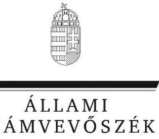
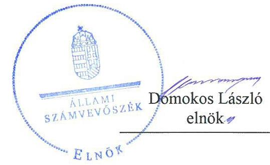
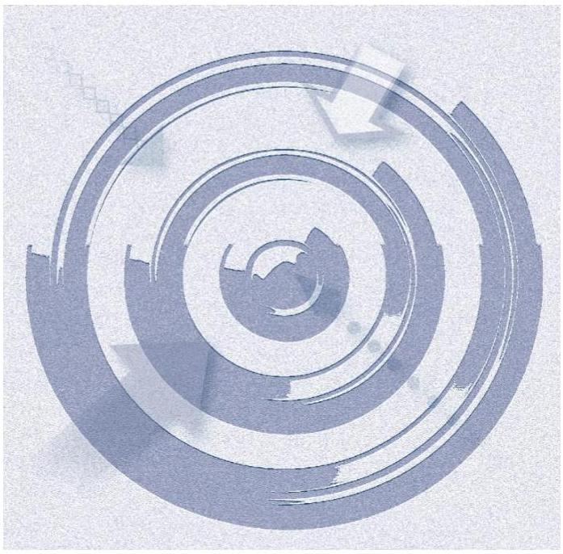
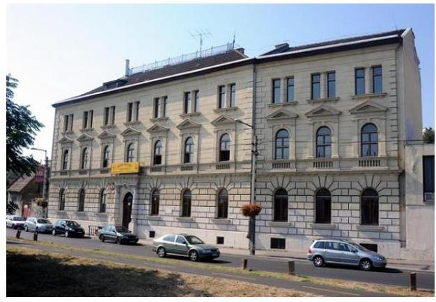

# Jelentés

## Központi költségvetési szervek ellenőrzése

Soós István Borászati és Élelmiszeripari Szakgimnázium és Szakközépiskola 2020.

20007 www.asz.hu

---

# Jelentés 

## Központi költségvetési szervek ellenőrzése

Soós István Borászati és Élelmiszeripari Szakgimnázium és Szakközépiskola 2020. 01. hó 28. nap

---

# AZ ELLENŐRZÉST FELÜGYELTE:

## MAROZSÁN LÁSZLÓNÉ felügyeleti vezető

## AZ ELLENŐRZÉST VEZETTE ÉS A VÉGREHAJTÁSÁÉRT FELELŐS:

### DR. NAGY JUDIT ellenőrzésvezető

### A PROGRAM ÖSSZEÁLLÍTÁSÁÉRT FELELŐS:

### TÓTPÁL SZABOLCS osztályvezető

---

**IKTATÓSZÁM:** EL-2361-001/2019.

**TÉMASZÁM:** 2450

**ELLENŐRZÉS-AZONOSÍTÓ SZÁM:** V079169

---

Jelentéseink az Országgyűlés számítógépes hálózatán és az Interneten a www.asz.hu címen is olvashatóak.

---

# TARTALOMJEGYZÉK 

■ ÖSSZEGZÉS ..... 5
■ AZ ELLENŐRZÉS CÉLJA ..... 6
■ AZ ELLENŐRZÉS TERÜLETE ..... 7
■ AZ ELLENŐRZÉS HÁTTERE, INDOKOLTSÁGA ..... 8
■ A JELENTÉS LÉNYEGES KÉRDÉSKÖREI ..... 9
■ AZ ELLENŐRZÉS HATÓKÖRE ÉS MÓDSZEREI ..... 10
■ MEGÁLLAPÍTÁSOK ..... 13
■ JAVASLATOK ..... 17
■ MELLÉKLETEK ..... 19
I. sz. melléklet: Értelmező szótár ..... 19
■ FÜGGELÉKEK ..... 21
I. sz. függelék a jelentéshez ..... 21
II. sz. függelék: Észrevételek ..... 22
■ RÖVIDÍTÉSEK JEGYZÉKE ..... 23

---

.

---

# ÖSSZEGZÉS 

A Soós István Borászati és Élelmiszeripari Szakgimnázium és Szakközépiskola belső kontrollrendszere, pénzügyi gazdálkodása nem biztosította a felelős gazdálkodást, a közpénzek átlátható és szabályszerű felhasználását. Vagyongazdálkodása nem volt szabályszerű. A korrupció elleni védelem nem volt biztosított.

## Az ellenőrzés társadalmi indokoltsága

Magyarország versenyképességének és a magyar gazdaság fejlődésének alapvető feltétele a magyar munkavállalók megfelelő szakmai képzettsége és felkészültsége, amelyben a szakképzési rendszernek döntő szerepe van. A mezőgazdaság vonatkozásában is kiemelten fontos ez, hiszen a magyar mezőgazdaság piaci versenyképességét és eredményességét nagymértékben befolyásolja az agrárszférában dolgozók képzettsége, felkészültsége. A szakképzés legjelentősebb színterei a szakképző iskolák. Az eredményes és célszerű szakképzés alapja és alapvető feltétele a szakképző intézmények közpénzekkel és a közvagyonnal való törvényes, átlátható és a korrupcióval szembeni védelmet biztosító működése és gazdálkodása. Ezért ezen szervezetekkel szemben is alapvető társadalmi igény, hogy a rájuk bízott közpénzekkel, közvagyonnal szabályosan gazdálkodjanak. Emellett a szakképzésben részt vevő pedagógusok, tanulók és a szülők jogos elvárása, hogy a szakképző iskolák működése átlátható és elszámoltatható legyen. Mindezen igényekkel összhangban, a közpénzügyek átláthatóságának előmozdítása, a közvagyon védelme érdekében került sor az agrárszakképző iskolák belső kontrollrendszerének és gazdálkodásának ellenőrzésére.

## Főbb megállapítások, következtetések, javaslatok

A Soós István Borászati és Élelmiszeripari Szakgimnázium és Szakközépiskola belső kontrollrendszere 2016. évben a szervezeti és működési szabályzat hiányában nem biztosította a szabályszerű működés kereteit.

A 2017. évben a Soós István Borászati és Élelmiszeripari Szakgimnázium és Szakközépiskola a kontrolltevékenységeket, valamint az információs és kommunikációs rendszert nem szabályszerűen működtette, a nyomon követési rendszert nem működtette, ezáltal belső kontrollrendszere nem támogatta a 2017. évi működési és gazdálkodási folyamatokat.

A Soós István Borászati és Élelmiszeripari Szakgimnázium és Szakközépiskola pénzügyi gazdálkodása a 2016. évben nem volt szabályszerű.

A Soós István Borászati és Élelmiszeripari Szakgimnázium és Szakközépiskola vagyongazdálkodása nem volt szabályszerű, mert költségvetési beszámolói jelentős hibát tartalmaztak.

A korrupciós kockázatok kezelését a jogszabályok által előírt integritási kontrollok kiépítettsége és a nem előírt kontrollok működtetése nem támogatta. Soós István Borászati és Élelmiszeripari Szakgimnázium és Szakközépiskola igazgatója a folyamatok teljesítményének mérésére nem alakított ki követelményeket, ezáltal a teljesítménymérés feltételei nem voltak biztosítottak.

A megállapítások alapján az Állami Számvevőszék a Soós István Borászati és Élelmiszeripari Szakgimnázium és Szakközépiskola intézményvezetője részére hét javaslatot fogalmazott meg.

---

# AZ ELLENŐRZÉS CÉLJA 

AZ ELLENŐRZÉS CÉLJA annak megítélése volt, hogy az ellenőrzött intézményre vonatkozó irányító szervi feladatellátás a jogszabályi előírások betartásával történt-e; az intézménynél a belső kontrollrendszer kialakítása és működtetése szabályszerű volt-e, biztosította-e az átlátható, szabályszerű, gazdaságos, hatékony és eredményes gazdálkodás feltételeit; az intézmény pénzügyi és vagyongazdálkodása megfelelt-e a jogszabályi előírásoknak és belső szabályzatainak. Az ellenőrzés keretében az Állami Számvevőszék értékelte az intézmény korrupciós kockázatainak kezelését szolgáló integritás kontrollok kiépítettségét és az integritás szemlélet érvényesülését, a teljesítményellenőrzés feltételeinek kialakítását. Értékelte továbbá, hogy az ellenőrzött megfelel-e annak az Alaptörvényben meghatározott alapvetésnek, hogy Magyarország a kiegyensúlyozott, átlátható és fenntartható költségvetési gazdálkodás elvét érvényesíti. Érvényesült-e a nemzeti vagyon kezelésének és védelmének célja, azaz a szervezet vagyona a közérdeket szolgálta-e a közös szükségletek kielégítése és a természeti erőforrások megóvása, valamint a jövő nemzedékek szükségleteinek figyelembevétele mellett.

---

# **AZ ELLENŐRZÉS TERÜLETE**

## **Soós István Borászati és Élelmiszeripari Szakgimnázium és Szakközépiskola**

A budafoki Soós István Borászati és Élelmiszeripari Szakgimnázium és Szakközépiskola irányító szerve és fenntartója 2013. augusztus 1-jétől a Minisztérium1.

Az Intézmény2 alapfeladata a szakgimnáziumi és szakközépiskolai nevelés-oktatás, a felnőttoktatás. Az Intézmény tanulói létszáma 400 fő volt 2016. októberben, akik számára élelmiszeripar szakmacsoportban nyújtottak oktatást és biztosítottak szakképzési lehetőséget.

Az Intézmény gazdasági szervezettel nem rendelkezik, a gazdálkodással összefüggő feladatokat a Magyar Gyula Kertészeti Szakgimnázium és Szakközépiskola látta el.

Az ellenőrzött időszakban az Intézménynél szervezeti, szerkezeti átalakításra nem került sor, az Intézmény vezetője3 2013. augusztus 31-e óta látta el a feladatát.

Az Intézménynél a 2016. évi összes bevétel 280,6 millió Ft volt, finanszírozási bevétel 136,8 millió Ft összegben teljesült. 2017. év tekintetében az összes bevétel 250,6 millió Ft volt, melyből a finanszírozási bevétel 130,1 millió Ft összegben teljesült.

---

# AZ ELLENŐRZÉS HÁTTERE, INDOKOLTSÁGA 

Az államháztartás központi alrendszerének közpénz felhasználása, az intézmények által ellátott közfeladatok sokrétűsége, valamint a feladatellátásához rendelt vagyon nagyságrendje indokolja, hogy az ÁSZ ${ }^{4}$ ellenőrzéseket folytasson a pénzügyi és vagyongazdálkodás területén. Az ÁSZ az ellenőrzései során feltárja a gazdálkodást, a központi alrendszer intézményei átalakulását, átszervezését érintő szabályozások esetleges hiányosságait, a szabályozással nem érintett gazdálkodási területeket, rámutathat a vagyongazdálkodási tevékenység - ezen belül a tulajdonosi joggyakorlás és vagyonkezelés - esetleges szabálytalanságaira, értékeli az állami vagyon nyilvántartására és elszámolására vonatkozó eljárásokat.

Az ellenőrzés a szervezet kockázatértékelése alapján, az egyedi és lényeges jellemzők figyelembevételével, az ellenőrzésre kiválasztott modullal történik. Az integritás- és belső kontroll modul a központi költségvetési szerv működésének irányítottságát, korrupció elleni védettségét értékeli.

A belső kontrollrendszer kialakítása és működtetése nélkül nem valósítható meg a közpénzek, a közvagyon átlátható, szabályos, gazdaságos, hatékony és eredményes felhasználása. A belső kontrollrendszer azt a célt szolgálja, hogy a költségvetési szervek működésük és gazdálkodásuk során a tevékenységeket szabályszerűen hajtsák végre, teljesítsék elszámolási kötelezettségeiket és megvédjék az erőforrásokat a veszteségektől, a károktól és a nem rendeltetésszerű használattól. A belső kontrollrendszer magában foglalja mindazon elveket, eljárásokat és belső szabályzatokat, melyek biztosítják, hogy a költségvetési szerv valamennyi tevékenysége és célja összhangban legyen a szabályszerűséggel, szabályozottsággal, valamint a gazdaságosság, hatékonyság és eredményesség követelményeivel, az eszközökkel és forrásokkal való gazdálkodásban ne kerüljön sor pazarlásra, visszaélésre, rendeltetésellenes felhasználásra. Megfelelő, pontos és naprakész információk álljanak rendelkezésre a költségvetési szerv működésével kapcsolatosan, és a belső kontrollrendszer harmonizációjára, összehangolására vonatkozó jogszabályok végrehajtásra kerüljenek. Az integritás kontrollok kiépítése, erősítése a szervezet korrupciós kockázatainak kezelését szolgálja. A teljesítménykövetelmények meghatározása és működtetése megalapozhatja a központi költségvetési szervnél a teljesítményellenőrzés lefolytatását.

Az egyes ellenőrzések megállapításaival és egy időszak ellenőrzési eredményeinek elemzésével az ÁSZ ráirányíthatja a jogalkotók figyelmét a központi alrendszerben vagy annak egy ágazatában esetlegesen felmerülő pénzügyi, szabályozási feszültségekre. Az elvégzett ellenőrzések során az ÁSZ „jó gyakorlatokat" is azonosíthat, melyeket tanácsadó funkciója keretében szélesebb körben is megismertethet az érintettekkel, ezáltal is hozzájárulva a költségvetési rendszer szabályozott, átlátható, kiegyensúlyozott és fenntartható működéséhez.

---

# A JELENTÉS LÉNYEGES KÉRDÉSKÖREI 

1. Az irányító szerv ellenőrzött költségvetési szervre vonatkozó feladatellátása szabályszerű volt-e?
2. A belső kontrollrendszer kialakítása és működtetése biztosította-e a közpénzekkel és a nemzeti vagyonnal történő átlátható, szabályszerű gazdálkodást?
3. A költségvetési szerv pénzügyi gazdálkodása szabályszerű volt-e?
4. A költségvetési szerv vagyongazdálkodása szabályszerű volt-e?
5. A költségvetési szervnél alakítottak-e ki a teljesítménymérésére alkalmas követelményeket?

---

# AZ ELLENŐRZÉS HATÓKÖRE ÉS MÓDSZEREI 

## Az ellenőrzés típusa

Megfelelőségi ellenőrzés.

## Az ellenőrzött időszak

Az irányító szervi feladatellátás és az ellenőrzött szervezet pénzügyi gazdálkodása tekintetében a 2016. év.

Az intézmény vagyongazdálkodása, integritás és belső kontrollrendszerének értékelése tekintetében a 2016-2017. évek.

## Az ellenőrzés tárgya

Az intézményre vonatkozó irányító szervi feladatok ellátása. Az intézmény belső kontrollrendszerének kialakítása és működtetése, pénzügyi és vagyongazdálkodása, az integritáskontrollok kiépítettsége, az integritás szemlélet érvényesülése, a teljesítményellenőrzés feltételei.

## Az ellenőrzött szervezet

Soós István Borászati és Élelmiszeripari Szakgimnázium és Szakközépiskola és irányítószerve a Földművelésügyi Minisztérium (jelenleg Agrárminisztérium); valamint a gazdálkodási feladatokat ellátó Magyar Gyula Kertészeti Szakgimnázium és Szakközépiskola

## Az ellenőrzés jogalapja

Az ellenőrzés jogszabályi alapját az ÁSZ tv. ${ }^{5}$ 1. § (3) bekezdése, 5. § (2)(3), (4) bekezdés a) pontja és (6) bekezdései, valamint az Áht. ${ }^{6}$ 61. § (2) bekezdésének előírásai képezték.

## Az ellenőrzés módszerei

Az ellenőrzésre a szakmai program szempontjai, az ellenőrzött időszakban hatályos jogszabályok, az ellenőrzés szakmai szabályai, a jelen ellenőrzésre irányadó ÁSZ módszertanok figyelembevételével került sor.

Az ellenőrzési kérdések megválaszolásához szükséges bizonyítékok megszerzése az ellenőrzött szervezetek által rendelkezésre bocsátott dokumentumokra, adatokra alapozva megfigyelés, szemle (szemrevételezés), kérdésfeltevés (információkérés), mintavételezés, valamint elemző eljárás útján történt. Az ellenőrzési bizonyítékként felhasználható adatforrások közé tartoztak az ellenőrzési program részletes szempontjainál felsorolt adatforrások, valamint minden egyéb - az ellenőrzés folyamán feltárt, az ellenőrzés szempontjából információt tartalmazó - dokumentum.

Az ellenőrzés lefolytatásához az ellenőrzött szervezetek tanúsítványok kitöltésével, valamint az ÁSZ által kért dokumentumok megküldésével szolgáltattak adatokat, amelyek valódiságát és teljes körűségét az ellenőrzött szervezetek vezetői által tett teljességi és hitelességi nyilatkozat igazolta. A rendelkezésre bocsátott adatok, információk kontrollja az ellenőrzés keretében történt.

Az Intézmény belső kontrollrendszere egyes pilléreinek kialakítására és működtetésére vonatkozó értékelés a következő volt:
$\longrightarrow$ „szabályszerű", amennyiben az értékelt területen az elért „igen" válaszok százalékban kifejezett, egész számra kerekített aránya legalább $85 \%$ volt,
$\longrightarrow$ „nem szabályszerű", ha nem érte el a $85 \%$-ot.
Az Intézmény belső kontrollrendszerének összesített értékelése az egyes részterületek esetében kapott megfelelőségi arányok számtani átlaga alapján történt és megegyezett a pillérenként (kontrollterületenként) alkalmazott százalékos értékelésekkel, a következő eltérésekkel: a kontrollrendszer egésze esetében a „szabályszerű" értékelésnek a százalékos értéken felül további feltétele volt, hogy egyik kontrollterület sem kaphat „nem szabályszerű" értékelést.

Az ÁSZ statisztikai módszereken alapuló mintavételt alkalmazott. A kiadások ellenőrzésére a 2016-2017. év, a bevételek ellenőrzésére a 2016. év vonatkozásában került sor. A kiadások (külső személyi juttatások, felhalmozási kiadások, dologi kiadások) és bevételek (értékesítésből és bérbeadásból származó bevételek) esetében az ellenőrzés azokra a legnagyobb értékű tételekre - a lényeges sokaságra - terjedt ki, melyek összértéke eléri a teljes sokaság összértékének 50\%-át.

A 2016-2017. évi kiadások elszámolásának szabályszerűségét a lényeges sokaságból véletlen mintavételi eljárással kiválasztott tételek alapján ellenőrizte az ÁSZ.

A 2016. évi bevételek esetében a lényeges sokaság tételesen került ellenőrzésre. 2017-ben az ellenőrzött szervezet nem rendelkezett vagyonértékesítésből származó bevétellel.

A 2017. évi beruházások, felújítások végrehajtásának, valamint a feladatellátást szolgáló állami vagyontárgyak év végi értékelésének szabályszerűsége esetében tételes ellenőrzésre került sor. A 2017. évi feladatellátást szolgáló állami vagyontárgyak használatának szabályszerűségét a teljes sokaságból véletlen mintavétellel kiválasztott tételek alapján ellenőrizte
 az ÁSZ.

A mintavétellel ellenőrzött területek esetében minden egyes tétel vonatkozásában a használat, elszámolás és értékelés szabályszerűségére vonatkozó kérdéseket tett fel az ÁSZ. Szabályszerűnek értékelt egy ellenőrzött területet, amennyiben 95%-os bizonyossággal az ellenőrzött sokaságban az átlagos hibaarány legfeljebb 10%, nem szabályszerűnek, amennyiben 10%-nál magasabb arányt képviselt.

---

Az ellenőrzés ideje alatt az ellenőrzött szervezettel történő kapcsolattartást az ÁSZ az SZMSZ-ének vonatkozó előírásai alapján biztosította.

---

# MEGÁLLAPÍTÁSOK 

## 1. Az irányító szerv ellenőrzött költségvetési szervre vonatkozó feladatellátása szabályszerű volt-e?

Összegző megállapítás A Minisztérium Intézményre vonatkozó feladatellátása szabályszerű volt.

A Minisztérium jóváhagyta az Intézmény elemi költségvetését, költségvetési beszámolóját a jogszabályi előírásoknak megfelelően.

A Minisztérium az Áht.-ben foglalt hatáskörét gyakorolva beszámoltatta az Intézmény vezetőjét az éves szakmai feladatellátásról, valamint az éves gazdálkodásról.

## 2. A belső kontrollrendszer kialakítása és működtetése biztosította-e a közpénzekkel és a nemzeti vagyonnal történő átlátható, szabályszerű gazdálkodást?

Összegző megállapítás Az Intézménynél a belső kontrollrendszer kialakítása és működtetése nem volt szabályszerű.

A BELSŐ KONTROLLRENDSZER KIALAKÍTÁSA ÉS MŰKÖDTETÉSE NEM VOLT SZABÁLYSZERŰ A 2016. ÉVBEN az Intézménynél, mivel az Intézmény 2016. december 14-ig nem rendelkezett az Áht. 10. § (5) bekezdése ellenére szervezeti és működési szabályzattal.

A szervezeti és működési szabályzat hiánya miatt az Intézmény kontrollkörnyezete nem biztosította az Intézmény kontrolltevékenységéhez, a kockázatkezelési feladatok teljesítéséhez szükséges felelősségi, hatásköri viszonyok kereteit. A szervezeti szintek meghatározása nélkül nem volt kialakítható az Intézménynél a megbízható információs és kommunikációs, valamint nyomon követési rendszer.

A BELSŐ KONTROLLRENDSZER működése a 2017. évben nem volt szabályszerű.

Az Intézmény a 2017. évben szabályszerű kontrollkörnyezetben működött.

INTEGRÁLT KOCKÁZATKEZELÉSI RENDSZERT a Bkr. ${ }^{8}$ 7. § (1) bekezdés előírása szerint működtetett az Intézmény vezetője.

A KONTROLLTEVÉKENYSÉGEK gyakorlása a 2017. évben nem szabályszerűen történt az Intézménynél, mivel:

---

$\longrightarrow$ az Áhsz. ${ }^{9}$ 39. § (3) bekezdésben előírtak ellenére a kötelezettségvállalásokról és más fizetési kötelezettségekről vezetett nyilvántartás nem tartalmazta az Áhsz. 14. melléklet II. 4. a), d), g), h) pontjaiban előírtakat;
$\longrightarrow$ a teljesítésigazoló nem az Ávr. ${ }^{10}$ 57. § (1) bekezdésében foglaltak szerint járt el, mivel úgy igazolta le a kiadások teljesítését, hogy azok összegszerűségét nem ellenőrizte, tekintettel az érintett bizonylatok közötti egyezőség hiányára.

# AZ INTÉZMÉNY INFORMÁCIÓS ÉS KOMMUNIKÁCIÓS RENDSZERÉT a Bkr. 3 § d) pontja és a 9. § (1)-(2) bekezdésében foglaltak ellenére az Intézmény vezetője nem szabályszerűen működtette, mivel:
$\longrightarrow$ a MÁK ${ }^{11}$ által működtetett elektronikus adatszolgáltató rendszerbe az időközi költségvetési jelentéseket az Ávr. 169. § (2) bekezdésében előírtak ellenére január, február, március, október, november hónapokra, nem szabályszerűen, határidőn túl töltötte fel;
$\longrightarrow$ az időközi mérlegjelentési kötelezettségét a MÁK által működtetett elektronikus adatszolgáltató rendszerben az Ávr. 170. § (2) bekezdésében előírtak ellenére 2017. év I. és IV. negyedévére vonatkozóan nem szabályszerűen, határidőn túl teljesítette;
$\longrightarrow$ az Intézmény a tartozás-állományára vonatkozó adatszolgáltatási kötelezettségét a MÁK felé az Ávr. 167/M. § (1) bekezdésében előírtak alapján az 5. melléklet 4. pontjában meghatározottak ellenére január és február hónapokban az előírt határidőn túl teljesítette.

## AZ INTÉZMÉNY NYOMONKÖVETÉSI RENDSZERÉT az Intézmény vezetője nem működtette a 2017. évben, mivel a Bkr. 10. § előírása ellenére nem gondoskodott az operatív tevékenységek keretében megvalósuló folyamatos és eseti nyomon követésről.

Az Intézmény vezetője az Áht. 70. § (1) bekezdésében előírtak ellenére 2017. január 1. és június 30. között nem gondoskodott az Intézményre vonatkozó belső ellenőrzés Bkr. 15 § (4) bekezdésében előírtak szerinti kialakításáról, mivel a belső ellenőrzési feladatokat nem a gazdasági szervezet feladatait ellátó költségvetési szerv vagy az irányító szerv által kijelölt szerv végezte, hanem az Intézmény vezetője által megbízott belső ellenőrzési szervezet, melyhez nem rendelkeztek az irányítószerv vezetőjének írásos jóváhagyásával.

A Bkr. 22. § (1) bekezdés a) pontjában foglaltak ellenére 2017. szeptember 2-ig a belső ellenőrzési vezető nem készített belső ellenőrzési kézkönyvet.

A Bkr. 29. § (1) bekezdésében előírtak ellenére az Intézmény nem rendelkezett 2017. évre vonatkozó, az Intézmény vezetője által jóváhagyott éves ellenőrzési tervvel.

AZ INTEGRITÁS kontrollok kiépítettségi szintje az Intézménynél nem támogatta a korrupciós kockázatok kezelését. Az Intézmény kockázatelemzése nem terjedt ki az integritási és korrupciós kockázatokra. Az Intézmény nem működtetett az integritást erősítő kontrollokat.

---

Az Intézmény vezetője a Bkr. 11. § (1) bekezdésében foglaltak ellenére hiányos, nem a hatályos Bkr. 1. melléklete szerinti vezetői nyilatkozatban értékelte a 2016-2017. évekre vonatkozóan az Intézmény belső kontrollrendszere minőségét. Nem nyilatkozott a szervezeti kultúra kialakításáról. Az ÁSZ ellenőrzés megállapításai a 2016-2017. években kiadott vezetői nyilatkozatokat nem támasztották alá.

# 3. A költségvetési szerv pénzügyi gazdálkodása szabályszerű volt-e? 

## Összegző megállapítás

Az Intézmény pénzügyi gazdálkodása a 2016. évben nem volt szabályszerű.

Az Intézménynél a 2016. évben a pénzügyi gazdálkodás nem volt szabályszerű, mert:
$\longrightarrow$ az Áhsz. 39. § (3) bekezdésben előírtak ellenére a kötelezettségvállalásokról és más fizetési kötelezettségekről vezetett nyilvántartás nem tartalmazta az Áhsz. 14. melléklet II. 4. a), d), g), h) pontjaiban előírtakat;
$\longrightarrow$ a 2016. évi felhalmozási kiadások elszámolása során a jogi személylyel, jogi személyiséggel nem rendelkező szervezettel kötött visszterhes szerződések nem tartalmazták a szervezet képviselőjének nyilatkozatát arra vonatkozóan, hogy átlátható szervezetnek minősülnek, az Ávr. 50. § (1a) bekezdésének előírásai ellenére. Továbbá a nemzeti vagyonelemek 2016. évi hasznosítása során nem tartották be az Nvtv. ${ }^{12}$ 11. § (10) bekezdése előírásait, mivel az Intézmény nem rendelkezett a szerződő félnek az Nvtv. 3. § (2) bekezdésben előírt nyilatkozatával arról, hogy átlátható szervezeteknek minősül;
$\longrightarrow$ az Intézmény a Kbt. ${ }^{13}$ 5. § (1) bekezdésének c) pontja alapján a Kbt. alanyi hatálya alá tartozó szervezetként, a 2016. évi vegyszer beszerzéseihez kapcsolódóan megsértette a Kbt. 4. §-ának (1) bekezdésében, valamint 15. § (1) bekezdés b) pontjában előírt közbeszerzési eljárás lefolytatásának kötelezettségét.

## 4. A költségvetési szerv vagyongazdálkodása szabályszerű volt-e?

## Összegző megállapítás

Az Intézmény vagyongazdálkodása nem volt szabályszerű a 2016-2017. években.

A vagyongazdálkodás nem volt szabályszerű, mert:
$\longrightarrow$ az Intézménynél a 2016. évben a befektetett eszközök bekerülési értékének megállapítása során nem az Áhsz. 16. § (4) bekezdése szerint jártak el, mivel nem vették figyelembe a számlákban szereplő kifizetett előleget és ezt a 2017. évben sem javították. Ennek következtében a 2016-2017. években az éves költségvetési beszámolók az Áhsz. 1. § (1) bekezdés 3. pontjában meghatározott jelentős összegű hibát tartalmaznak.

---

- A 2017. évi felhalmozási kiadások elszámolása során a jogi személylyel, jogi személyiséggel nem rendelkező szervezettel kötött visszterhes szerződések nem tartalmazták a szervezet képviselőjének nyilatkozatát arra vonatkozóan, hogy átlátható szervezetnek minősülnek, az Ávr. 50. § (1a) bekezdésének előírásai ellenére.
Az Intézmény 2016-2017. évekre vonatkozó éves költségvetési beszámolóit az Áhsz. előírásai szerinti leltárral alátámasztotta.

# 5. A költségvetési szervnél alakítottak-e ki a teljesítménymérésére alkalmas követelményeket? 

## Összegző megállapítás

Az Intézménynél nem alakították ki a teljesítménymérésére alkalmas követelményeket.

A teljesítménymérésre alkalmas követelményeket, ehhez kapcsolódóan mérőszámokat, indikátorokat az Intézmény vezetője nem alakított ki, ezáltal a teljesítmény mérésének feltételei nem állnak fenn.

---

# JAVASLATOK 

Az ÁSZ tv. 33. § (1) bekezdésében foglaltak értelmében az ellenőrzött szervezet vezetője köteles a jelentésben foglalt megállapításokhoz kapcsolódó intézkedési tervet összeállítani és azt a jelentés kézhezvételétől számított 30 napon belül az ÁSZ részére megküldeni. Amennyiben az ellenőrzött szervezet vezetője nem küldi meg határidőben az intézkedési tervet, vagy továbbra sem elfogadható intézkedési tervet küld, az Állami Számvevőszék elnöke az ÁSZ tv. 33. § (3) bekezdés a) és b) pontjaiban foglaltakat érvényesítheti.

## Soós István Borászati és Élelmiszeripari Szakgimnázium és Szakközépiskola igazgatója részére

1. Intézkedjen az Áhsz. előírásainak megfelelő részletező nyilvántartás vezetéséről az Intézményt érintő kötelezettségvállalásokról, más fizetési kötelezettségekről.
(2. sz. megállapítás 6. bekezdés 1. francia bekezdése alapján)
2. Intézkedjen a kiadások esetében az Ávr. szerinti teljesítésigazolásról.
(2. sz. megállapítás 6. bekezdés 2. francia bekezdése alapján)
3. Intézkedjen az Intézmény adatszolgáltatási kötelezettségének jogszabályban előírt határidő szerinti teljesítéséről.
(2. sz. megállapítás 7. bekezdés 1-3. franciabekezdései alapján)
4. Intézkedjen a Bkr. előírásainak megfelelően az operatív tevékenységek keretében megvalósuló folyamatos és eseti nyomon követésről.
(2. sz. megállapítás 8. bekezdése alapján)
5. Gondoskodjon arról, hogy vezetői nyilatkozata feleljen meg a Bkr. előírásainak.
(2. sz. megállapítás 13. bekezdése alapján)
6. Gondoskodjon az Intézmény befektetett eszközei esetében a bekerülési érték szabályszerű megállapításáról.
(4. sz. megállapítás 1. bekezdés 1. francia bekezdése alapján)
7. Gondoskodjon arról, hogy jogi személlyel kötött visszterhes szerződések az Ávr. előírása szerint tartalmazzák a szerződő fél képviselőjének nyilatkozatát arról, hogy átlátható szervezetnek minősül.
(4. sz. megállapítás 1. bekezdés 2. francia bekezdése alapján)

---

.

---

# MELLÉKLETEK 

- I. SZ. MELLÉKLET: ÉRTELMEZŐ SZÓTÁR
állami vagyon
állami vagyon kezelője /vagyonkezelő
átalakítás
belső ellenőrzés
belső kontrollrendszer
belső kontrollrendszer területei
ellenőrzési nyomvonal
információs és kommunikációs rendszer
integritás

Állami vagyonnak minősül:
a) az állam tulajdonában lévő dolog, valamint a dolog módjára hasznosítható természeti erő,
b) az a) pont hatálya alá nem tartozó mindazon vagyon, amely vonatkozásában törvény az állam kizárólagos tulajdonjogát nevesíti,
c) az állam tulajdonában lévő tagsági jogviszonyt megtestesítő értékpapír, illetve az államot megillető egyéb társasági részesedés,
d) az államot megillető olyan immateriális, vagyoni értékkel rendelkező jogosultság, amelyet jogszabály vagyoni értékű jogként nevesít. (Forrás: Vtv. ${ }^{14}$ 1. § (2) bekezdése)
Az állami vagyont az MNV Zrt. ${ }^{15}$ maga kezeli, vagy szerződés - így különösen bérlet, haszonbérlet, megbízás - alapján központi költségvetési szervnek, természetes vagy jogi személynek, vagy jogi személyiséggel nem rendelkező gazdálkodó szervezetnek hasznosításra átengedi." Az állami vagyonra vonatkozóan az MNV Zrt. kizárólag az Nvtv.-ben meghatározott személyekkel köthet vagyonkezelési szerződést. (Forrás: Vtv. 27. § (1) bekezdése, hatályos 2012. január 1.-jétől)

A költségvetési szerv általános jogutódlással történő megszüntetése átalakítással történhet. Az átalakítás lehet egyesítés vagy különválás. Az egyesítés lehet beolvadás vagy összeolvadás. (2015. január 1.-jétől Áht. 11. § (2) bekezdés)
Független, tárgyilagos bizonyosságot adó és tanácsadó tevékenység, amelynek célja, hogy az ellenőrzött szervezet működését fejlessze és eredményességét növelje, az ellenőrzött szervezet céljai elérése érdekében rendszerszemléletű megközelítéssel és módszeresen értékeli, illetve fejleszti az ellenőrzött szervezet irányítási és belső kontrollrendszerének hatékonyságát. (Forrás: Bkr. 2. § b) pontja)
A belső kontrollrendszer a kockázatok kezelése és tárgyilagos bizonyosság megszerzése érdekében kialakított folyamatrendszer, amely azt a célt szolgálja, hogy a működés és gazdálkodás során a tevékenységeket szabályszerűen, gazdaságosan, hatékonyan, eredményesen hajtsák végre, az elszámolási kötelezettségeket teljesítsék, megvédjék az erőforrásokat a veszteségektől, károktól és nem rendeltetésszerű használattól. (Forrás: Áht. 69. § (1) bekezdése)
A kontrollkörnyezet, az integrált kockázatkezelési rendszer, a kontrolltevékenységek, az információs és kommunikációs rendszer, valamint a nyomon követési (monitoring) rendszer. (Forrás: Bkr. 3. §-a)
Az ellenőrzési nyomvonal a költségvetési szerv működési folyamatainak szöveges, táblázatokkal vagy folyamatábrákkal szemléltetett leírása, amely tartalmazza különösen a felelősségi és információs szinteket és kapcsolatokat, irányítási és ellenőrzési folyamatokat, lehetővé téve azok nyomon követését és utólagos ellenőrzését. (Forrás: Bkr. 6. § (3) bekezdés)
A költségvetési szerv vezetője által kialakított és működtetett

 olyan rendszer, mely biztosítja, hogy a megfelelő információk a megfelelő időben eljutnak az illetékes szervezethez, szervezeti egységhez, illetve személyhez. (Forrás: Bkr. 9. § (1) bekezdés)
Az integritás - egyik gyakran használt jelentése szerint - az elvek, értékek, cselekvések, módszerek, intézkedések konzisztenciáját jelenti, vagyis olyan magatartásmódot, amely meghatározott értékeknek megfelel. Integritás-irányítási rendszer bevezetése a szervezetben a szervezethez rendelt közfeladatok integritás szempontú ellátását, az érték alapú működéssel (integritással) összefüggő szervezeti követelmények következetes érvényesítését jelenti. (Forrás: Nemzetgazdasági Minisztérium: Államháztartási Belső Kontroll Standardok és Gyakorlati Útmutató 1.6. Etikai értékek és integritás 46. oldal, 2017. szeptember)

---

integrált kockázatkezelési rendszer
irányító szerv/felügyeleti szerv
kockázat
kockázatkezelési rendszer
kontrollkörnyezet
kontrolltevékenységek
nyomon követési rendszer (monitoring)
vagyongazdálkodás

Olyan folyamatalapú kockázatkezelési rendszer, amely a szervezet minden tevékenységére kiterjed, egységes módszertan és eljárások alkalmazásával, a szervezet célkitűzéseinek és értékeinek figyelembevételével biztosítja a szervezet kockázatainak teljes körű azonosítását, azok meghatározott kritériumok szerinti értékelését, valamint a kockázatok kezelésére vonatkozó intézkedési terv elkészítését és az abban foglaltak nyomon követését. (Forrás: Bkr. 2. § m) pontja, 2016. október 1-jétől)
A költségvetési szerv tekintetében az Áht.-ban meghatározott irányítási hatáskört gyakorló szerv. (Forrás: Áht. 1. § 9. pontja)
A kockázat annak a valószínűségét jelenti, hogy egy vagy több esemény vagy intézkedés nem kívánt módon befolyásolja a rendszer működését, céljainak megvalósulását. (Forrás: Javaslatok a korrupciós kockázatok kezelésére - Kockázatkezelési és ellenőrzési módszertan 35. oldal, ÁSZ)
Olyan irányítási eszközök és módszerek összessége, melynek elemei a szervezeti célok elérését veszélyeztető tényezők (kockázatok) azonosítása, elemzése, csoportosítása, nyomon követése, valamint szükség esetén a kockázati kitettség mérséklése. (Forrás: Bkr. 2. § m) pontja, 2016. szeptember 30-ig)

A költségvetési szerv vezetője által kialakított olyan elvek, eljárások, belső szabályzatok összessége, amelyben világos a szervezeti struktúra, a folyamatok átláthatók, egyértelműek a felelősségi, hatásköri viszonyok és feladatok, meghatározottak, ismertek és elfogadottak az etikai elvárások a szervezet minden szintjén, átlátható a humánerőforrás-kezelés. (Forrás: Bkr. 6. § (1) bekezdés)
A költségvetési szerv vezetője által a szervezeten belül kialakított (kontroll) tevékenységek, melyek biztosítják a kockázatok kezelését, hozzájárulnak a szervezet céljainak eléréséhez és erősítik a szervezet integritását. (Forrás: Bkr. 8. § (1) bekezdés)
A költségvetési szerv vezetője köteles kialakítani a szervezet tevékenységének a célok megvalósításának nyomon követését biztosító rendszert, amely az operatív tevékenységek keretében megvalósuló folyamatos és eseti nyomon követésből, valamint az operatív tevékenységektől függetlenül működő belső ellenőrzésből áll. 2016. október 1-jétől: A költségvetési szerv vezetője köteles kialakítani a szervezet tevékenységének, a célok megvalósításának nyomon követését biztosító rendszert, mely az operatív tevékenységek keretében megvalósuló folyamatos és eseti nyomon követésből, valamint az operatív tevékenységektől függetlenül működő belső ellenőrzésből állhat. (Forrás: Bkr. 10. §)
A nemzeti vagyongazdálkodás feladata a nemzeti vagyon rendeltetésének megfelelő, az állam, az önkormányzat mindenkori teherbíró képességéhez igazodó, elsődlegesen a közfeladatok ellátásához és a mindenkori társadalmi szükségletek kielégítéséhez szükséges, egységes elveken alapuló, átlátható, hatékony és költségtakarékos működtetése, értékének megőrzése, állagának védelme, értéknövelő használata, hasznosítása, gyarapítása, továbbá az állam vagy a helyi önkormányzat feladatának ellátása szempontjából feleslegessé váló vagyontárgyak elidegenítése. (Forrás: Nvtv. 7. § (2) bekezdése)

---

# FÜGGELÉKEK 

- I. SZ. FÜGGELÉK A JELENTÉSHEZ

Az Állami Számvevőszék az ellenőrzések során feltárt tényekhez kapcsolódó további körülmények tisztázására eszközrendszerrel nem rendelkezik. Amennyiben az ellenőrzésen túlmutatóan indokoltnak látszik az ellenőrzés során feltárt körülmények további vizsgálata, az Állami Számvevőszék törvényi felhatalmazás alapján az ellenőrzés által feltárt körülményeket továbbítja a hatáskörrel rendelkező szervnek a szükséges intézkedések megtétele, eljárások lefolytatása érdekében.
Az Intézménynél 2017. évben 18.926.367,-Ft összegben a dologi kiadásoknál a teljesítésigazoló nem az Ávr. 57. § (1) bekezdése előírásában foglaltak szerint járt el, mivel úgy igazolta le a kiadások teljesítését, hogy azok összegszerűségét nem ellenőrizte, mert a számlák tartalma eltért a szerződések szerinti áraktól.
A gazdálkodási jogkörben megfogalmazott szabálytalanság miatt nem igazolt, hogy a kiadások valóban az Intézmény érdekében merültek fel, annak feladatellátását szolgálták, valamint hogy a kifizetésekhez valós teljesítések kapcsolódtak, ezáltal vagyoni hátrány keletkezhetett.
A fenti eset konkrét körülményeinek felderítésére az Ügyészség rendelkezik hatáskörrel.

---

A jelentéstervezetet a Számvevőszék 15 napos észrevételezésre megküldte az ellenőrzött szervezetek vezetőinek az ÁSZ tv. 29. § (1) bekezdése előírásának megfelelően.

A Soós István Borászati és Élelmiszeripari Szakgimnázium és Szakközépiskola igazgatója a jelentéstervezet megállapításaira írásban észrevételt tett. Az agrárminiszter és a Magyar Gyula Kertészeti Szakgimnázium és Szakközépiskola igazgatója a jelentéstervezet megállapításaira nem tettek észrevételt.
Az ÁSZ tv. 29. § (3) bekezdésével összhangban az ÁSZ a Függelékben feltünteti az ellenőrzés megállapításaival kapcsolatban tett, figyelembe nem vett észrevételeket, és megindokolja, hogy azokat miért nem fogadta el.

A „Központi költségvetési szervek ellenőrzése - Soós István Borászati és Élelmiszeripari Szakgimnázium és Szakközépiskola" címmel készített számvevőszéki jelentéstervezet megállapításaival kapcsolatban a Soós István Borászati és Élelmiszeripari Szakgimnázium és Szakközépiskola (továbbiakban: Intézmény) igazgatója által 2019. november 29-én kelt levélben tett általános észrevételek és azok kezelésének indokolása.
Az Intézmény igazgatója levelében tájékoztatást adott az adatszolgáltatással kapcsolatosan felmerült, erőforrással kapcsolatos nehézségeikről, valamint arról, hogy a teljességi és hitelességi nyilatkozat aláírása ellenére az adatfeltöltés során előfordulhatott, hogy kimaradtak anyagok. Leírta továbbá, hogy a „számvevői ellenőrzés" megállapításai és javaslatai a kifogásolt tételek általuk is beazonosítható konkrét megjelölését nem tartalmazzák.
Tájékoztattuk az Intézmény igazgatóját, hogy az Állami Számvevőszék a jelentéstervezetében a mintatételekkel kapcsolatos megállapításokat az általuk beazonosított, jelöléssel ellátva megküldött és ennek megfelelően az Intézménynél rendelkezésre álló bizonylatok értékelése alapján, a jelentéstervezet ellenőrzés módszerei című részében bemutatott módszertan szerint tette. Továbbá a jelentéstervezetben megfogalmazott javaslatok mellett minden esetben megjelölésre került a javaslatokat megalapozó megállapítások jelentéstervezetben beazonosítható, pontos helye (megállapításszám, bekezdésszám).
Az Intézmény igazgatója általános észrevételeiben az ellenőrzés megállapításait nem vitatta, azok a jelentéstervezet megállapításait nem befolyásolták.

[^0]
[^0]:    * 29. § (1) Az Állami Számvevőszék az ellenőrzési megállapításait megküldi az ellenőrzött szervezet vezetőjének vagy az általa megbízott személynek, és annak, akinek személyes felelősségét állapította meg.
    (2) Az ellenőrzött szervezet vezetője és a felelősként megjelölt személy az ellenőrzés megállapításaira tizenöt napon belül írásban észrevételt tehet.
    (3) Az Állami Számvevőszék az észrevételre a beérkezésétől számított harminc napon belül írásban válaszol. A figyelembe nem vett észrevételeket köteles a jelentésben feltüntetni, és megindokolni, hogy azokat miért nem fogadta el.

---

# RÖVIDÍTÉSEK JEGYZÉKE 

${ }^{1}$ Minisztérium
${ }^{2}$ Intézmény
${ }^{3}$ Intézmény vezetője
${ }^{4}$ ÁSZ
${ }^{5}$ ÁSZ tv.
${ }^{6}$ Áht.
${ }^{7}$ ÁSZ SZMSZ
${ }^{8}$ Bkr.
${ }^{9}$ Áhsz.
${ }^{10}$ Ávr.
${ }^{11}$ MÁK
${ }^{12}$ Nvtv.
${ }^{13} \mathrm{Kbt}$.
${ }^{14} \mathrm{Vtv}$.
${ }^{15}$ MNV Zrt.

Agrárminisztérium, 2018. május 17-ig Földművelésügyi Minisztérium
Soós István Borászati és Élelmiszeripari Szakgimnázium és Szakközépiskola
Soós István Borászati és Élelmiszeripari Szakgimnázium és Szakközépiskola, mint költségvetési intézmény vezetője
Állami Számvevőszék
2011. évi LXVI. törvény az Állami Számvevőszékről (hatályos: 2011. július 1-jétől) 2011. évi CXCV. törvény az államháztartásról (hatályos: 2011. december 31-jétől) Állami Számvevőszék Szervezeti és Működési Szabályzata 370/2011. (XII. 31.) Korm. rendelet a költségvetési szervek belső kontrollrendszeréről és belső ellenőrzésről
4/2013. (I. 11.) Korm. rendelet az államháztartás számviteléről 368/2011. (XII. 31.) Korm. rendelet az államháztartásról szóló törvény végrehajtásáról
Magyar Államkincstár
2011. évi CXCVI. törvény a nemzeti vagyonról (hatályos: 2012. január 1-jétől)
2015. évi CXLIII. törvény a közbeszerzésekről (hatályos: 2015. november 1-jétől)
2007. évi CVI. törvény az állami vagyonról (hatályos: 2007. szeptember 25-étől)

Magyar Nemzeti Vagyonkezelő Zrt.

---

# ÁLLAMI SZÁMVEVŐSZÉK 

1052 Budapest, Apáczai Csere János utca 10.
Levélcím: 1364 Budapest 4. Pf. 54
Telefon: +36 14849100 Telefax: +36 14849200
www.asz.hu
