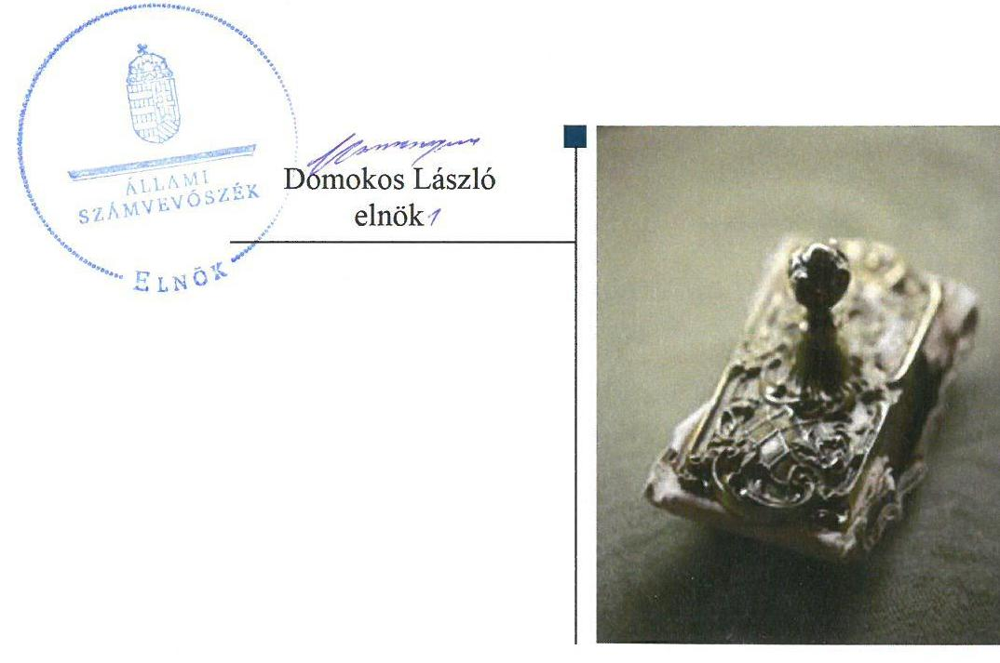
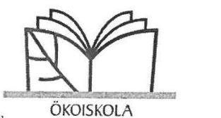
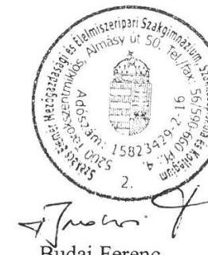
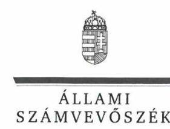
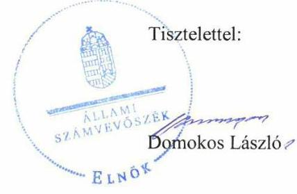

ÁLLAMI
SZÁMVEVŐSZÉK

# Jelentés

## Központi költségvetési szervek ellenőrzése

Székács Elemér Mezőgazdasági és Élelmiszeripari Szakgimnázium, Szakközépiskola és Kollégium 2020.

20008
www.asz.hu

---

# Jelentés 

## Központi költségvetési szervek ellenőrzése

Székács Elemér Mezőgazdasági és Élelmiszeripari Szakgimnázium, Szakközépiskola és Kollégium 2020. 01. hó 28. nap

---

# AZ ELLENŐRZÉST FELÜGYELTE:

## MAROZSÁN LÁSZLÓNÉ felügyeleti vezető

## AZ ELLENŐRZÉST VEZETTE ÉS A VÉGREHAJTÁSÁÉRT FELELŐS:

### DR. NAGY JUDIT ellenőrzésvezető

### A PROGRAM ÖSSZEÁLLÍTÁSÁÉRT FELELŐS:

### TÓTPÁL SZABOLCS osztályvezető

---

**IKTATÓSZÁM:** EL-2342-001/2019.

**TÉMASZÁM:** 2450

**ELLENŐRZÉS-AZONOSÍTÓ SZÁM:** V079172

---

Jelentéseink az Országgyűlés számítógépes hálózatán és az Interneta a www.asz.hu címen is olvashatóak.

---

# TARTALOMJEGYZÉK 

■ ÖSSZEGZÉS ..... 5
■ AZ ELLENŐRZÉS CÉLJA ..... 6
■ AZ ELLENŐRZÉS TERÜLETE ..... 7
■ AZ ELLENŐRZÉS HÁTTERE, INDOKOLTSÁGA ..... 8
■ A JELENTÉS LÉNYEGES KÉRDÉSKÖREI ..... 9
■ AZ ELLENŐRZÉS HATÓKÖRE ÉS MÓDSZEREI ..... 10
■ MEGÁLLAPÍTÁSOK ..... 12
■ JAVASLATOK ..... 15
■ MELLÉKLETEK ..... 17
I. sz. melléklet: Értelmező szótár ..... 17
■ FÜGGELÉKEK ..... 19
I. sz. függelék a jelentéshez ..... 19
II. sz. függelék: Észrevételek ..... 20
■ RÖVIDÍTÉSEK JEGYZÉKE ..... 25

---

.

---

# ÖSSZEGZÉS 

A Székács Elemér Mezőgazdasági és Élelmiszeripari Szakgimnázium, Szakközépiskola és Kollégium müködésének szabályozottsága, pénzügyi és vagyongazdálkodása nem felelt meg a jogszabályi előírásoknak. Nem volt biztositott a felelős gazdálkodás, a közpénzek átlátható, szabályszerü felhasználása, a nemzeti vagyonnal történő elszámoltatható gazdálkodás. A korrupcióval szemben nem volt védett.

## Az ellenőrzés társadalmi indokoltsága

Magyarország versenyképességének és a magyar gazdaság fejlődésének alapvető feltétele a magyar munkavállalók megfelelő szakmai képzettsége és felkészültsége, amelyben a szakképzési rendszernek döntő szerepe van. A mezőgazdaság vonatkozásában is kiemelten fontos ez, hiszen a magyar mezőgazdaság piaci versenyképességét és eredményességét nagymértékben befolyásolja az agrárszférában dolgozók képzettsége, felkészültsége. A szakképzés legjelentősebb színterei a szakképző iskolák. Az eredményes és célszerű szakképzés alapja és alapvető feltétele a szakképző intézmények közpénzekkel és a közvagyonnal való törvényes, átlátható és a korrupcióval szembeni védelmet biztosító müködése és gazdálkodása. Ezért ezen szervezetekkel szemben is alapvető társadalmi igény, hogy a rájuk bízott közpénzekkel, közvagyonnal szabályosan gazdálkodjanak. Emellett a szakképzésben részt vevő pedagógusok, tanulók és a szülők jogos elvárása, hogy a szakképző iskolák működése átlátható és elszámoltatható legyen. Mindezen igényekkel összhangban, a közpénzügyek átláthatóságának előmozdítása, a közvagyon védelme érdekében került sor az agrárszakképző iskolák belső kontrollrendszerének és gazdálkodásának ellenőrzésére.

## Főbb megállapítások, következtetések, javaslatok

A Székács Elemér Mezőgazdasági és Élelmiszeripari Szakgimnázium, Szakközépiskola és Kollégium belső kontrollrendszerének kialakítása és működtetése nem volt szabályszerű. Az intézményvezető az integrált kockázatkezelési rendszert nem alakította ki, nyomonkövetési rendszert nem működtetett, a kontrolltevékenységeket nem szabályszerűen gyakorolta. Nem alakította ki a vagyonnyilatkozat-tételi kötelezettséggel kapcsolatos eljárásrendet, ezáltal nem tette meg a legalapvetőbb intézkedést sem a korrupció megelőzése érdekében. A feltárt szabálytalanságok miatt a Székács Elemér Mezőgazdasági és Élelmiszeripari Szakgimnázium, Szakközépiskola és Kollégium belső kontrollrendszere nem biztosította a szabályszerű működés és gazdálkodás feltételeit.

A Székács Elemér Mezőgazdasági és Élelmiszeripari Szakgimnázium, Szakközépiskola és Kollégium pénzügyi gazdálkodása a 2016. évben nem volt szabályszerű, nem vezette a jogszabályok szerinti nyilvántartást a kötelezettségekről. Vagyongazdálkodása a 2016.-2017. években nem volt szabályszerű, a költségvetési beszámolók mérleg tételei leltárral nem voltak alátámasztottak.

A Székács Elemér Mezőgazdasági és Élelmiszeripari Szakgimnázium, Szakközépiskola és Kollégiumnál a korrupció elleni védelemhez szükséges kontrollokat nem építették ki, kockázatelemzést nem végeztek. A teljesítmény mérés feltételei nem voltak biztosítottak.

A megállapítások alapján az Állami Számvevőszék a Székács Elemér Mezőgazdasági és Élelmiszeripari Szakgimnázium, Szakközépiskola és Kollégium intézményvezetője részére 9 javaslatot fogalmazott meg.

---

# AZ ELLENŐRZÉS CÉLJA 

AZ ELLENŐRZÉS CÉLJA annak megítélése volt, hogy az ellenőrzött intézményre vonatkozó irányító szervi feladatellátás a jogszabályi előírások betartásával történt-e; az intézménynél a belső kontrollrendszer kialakítása és múködtetése szabályszerű volt-e, biztosította-e az átlátható, szabályszerű, gazdaságos, hatékony és eredményes gazdálkodás feltételeit; az intézmény pénzügyi és vagyongazdálkodása megfelelt-e a jogszabályi előírásoknak és belső szabályzatainak. Az ellenőrzés keretében az Állami Számvevőszék értékelte az intézmény korrupciós kockázatainak kezelését szolgáló integritás kontrollok kiépítettségét és az integritás szemlélet érvényesülését, a teljesítményellenőrzés feltételeinek kialakítását. Értékelte továbbá, hogy az ellenőrzött megfelel-e annak az Alaptörvényben meghatározott alapvetésnek, hogy Magyarország a kiegyensúlyozott, átlátható és fenntartható költségvetési gazdálkodás elvét érvényesíti. Érvényesült-e a nemzeti vagyon kezelésének és védelmének célja, azaz a szervezet vagyona a közérdeket szolgálta-e a közös szükségletek kielégítése és a természeti erőforrások megóvása, valamint a jövő nemzedékek szükségleteinek figyelembevétele mellett.

---

# **AZ ELLENŐRZÉS TERÜLETE**

## **Székács Elemér Mezőgazdasági és Élelmiszeripari Szakgimnázium, Szakközépiskola és Kollégium**

Az Intézmény1 irányító szerve és fenntartója a Minisztérium2 2013. augusztus 31-től. Az Intézmény oktató-nevelő tevékenységét Törökszentmiklóson található székhelyén, valamint Törökszentmiklós-Bartapusztai és tiszapüspöki telephelyein végzi.

Az Intézmény alapfeladata a szakgimnáziumi, a szakközépiskolai nevelés-oktatás, továbbá kollégiumi elhelyezés biztosítása. Az Intézmény tanulói létszáma 454 fő volt a 2017/2018-as tanévben, akik számára közgazdasági, kereskedelem-marketing, mezőgazdaság, élelmiszeripar, vendéglátás-turisztika szakmacsoportokban nyújtottak oktatást és biztosítottak szakképzési lehetőséget.

Az Intézmény gazdasági szervezettel nem rendelkezik, a gazdálkodással összefüggő feladatokat a Szentannai Sámuel Középiskola és Kollégium látja el.

Az ellenőrzött időszakban az Intézménynél szervezeti, szerkezeti átalakításra nem került sor, az az Intézmény vezetője3 2013. augusztus 1. óta látta el feladatát, személye az ellenőrzött időszakban nem változott.

Az Intézménynél a 2016. évben a teljesített összes bevétel 436,4 millió Ft volt, ebből a finanszírozási bevételek 279,1 millió Ft-ban teljesültek, 2017. évben a teljesített összes bevétel 443,9 millió Ft volt, melyből a finanszírozási bevétel 316,7 millió Ft volt.

---

# AZ ELLENŐRZÉS HÁTTERE, INDOKOLTSÁGA 

Az államháztartás központi alrendszerének közpénz felhasználása, az intézmények által ellátott közfeladatok sokrétúsége, valamint a feladatellátásához rendelt vagyon nagyságrendje indokolja, hogy az ÁSZ ${ }^{4}$ ellenőrzéseket folytasson a pénzügyi és vagyongazdálkodás területén. Az ÁSZ az ellenőrzései során feltárja a gazdálkodást, a központi alrendszer intézményei átalakulását, átszervezését érintő szabályozások esetleges hiányosságait, a szabályozással nem érintett gazdálkodási területeket, rámutathat a vagyongazdálkodási tevékenység - ezen belül a tulajdonosi joggyakorlás és vagyonkezelés - esetleges szabálytalanságaira, értékeli az állami vagyon nyilvántartására és elszámolására vonatkozó eljárásokat.

Az ellenőrzés a szervezet kockázatértékelése alapján, az egyedi és lényeges jellemzők figyelembevételével, az ellenőrzésre kiválasztott modullal történik. Az integritás- és belső kontroll modul a központi költségvetési szerv működésének irányítottságát, korrupció elleni védettségét értékeli.

A belső kontrollrendszer kialakítása és működtetése nélkül nem valósítható meg a közpénzek, a közvagyon átlátható, szabályos, gazdaságos, hatékony és eredményes felhasználása. A belső kontrollrendszer azt a célt szolgálja, hogy a költségvetési szervek működésük és gazdálkodásuk során a tevékenységeket szabályszerűen hajtsák végre, teljesítsék elszámolási kötelezettségeiket és megvédjék az erőforrásokat a veszteségektől, a károktól és a nem rendeltetésszerű használattól. A belső kontrollrendszer magában foglalja mindazon elveket, eljárásokat és belső szabályzatokat, melyek biztosítják, hogy a költségvetési szerv valamennyi tevékenysége és célja összhangban legyen a szabályszerűséggel, szabályozottsággal, valamint a gazdaságosság, hatékonyság és eredményesség követelményeivel, az eszközökkel és forrásokkal való gazdálkodásban ne kerüljön sor pazarlásra, visszaélésre, rendeltetésellenes felhasználásra. Megfelelő, pontos és naprakész információk álljanak rendelkezésre a költségvetési szerv múködésével kapcsolatosan, és a belső kontrollrendszer harmonizációjára, öszszehangolására vonatkozó jogszabályok végrehajtásra kerüljenek. Az integritás kontrollok kiépítése, erősítése a szervezet korrupciós kockázatainak kezelését szolgálja. A teljesítménykövetelmények meghatározása és múködtetése megalapozhatja a központi költségvetési szervnél a teljesítményellenőrzés lefolytatását.

Az egyes ellenőrzések megállapításaival és egy időszak ellenőrzési eredményeinek elemzésével az ÁSZ ráirányíthatja a jogalkotók figyelmét a központi alrendszerben vagy annak egy ágazatában esetlegesen felmerülő pénzügyi, szabályozási feszültségekre. Az elvégzett ellenőrzések során az ÁSZ „jó gyakorlatokat" is azonosíthat, melyeket tanácsadó funkciója keretében szélesebb körben is megismertethet az érintettekkel, ezáltal is hozzájárulva a költségvetési rendszer szabályozott, átlátható, kiegyensúlyozott és fenntartható múködéséhez.

---

# A JELENTÉS LÉNYEGES KÉRDÉSKÖREI 

1. Az irányító szerv ellenőrzött költségvetési szervre vonatkozó feladatellátása szabályszerű volt-e?
2. A belső kontrollrendszer kialakítása és müködtetése biztosí-totta-e a közpénzekkel és a nemzeti vagyonnal történő átlátható, szabályszerű gazdálkodást?
3. A költségvetési szerv pénzügyi gazdálkodása szabályszerű volt-e?
4. A költségvetési szerv vagyongazdálkodása szabályszerű volt-e?
5. A költségvetési szervnél alakítottak-e ki teljesítménymérésére alkalmas követelményeket?

---

# AZ ELLENŐRZÉS HATÓKÖRE ÉS MÓDSZEREI 

## Az ellenőrzés típusa

Megfelelőségi ellenőrzés.

## Az ellenőrzött időszak

Az irányítószervi feladatellátás és az ellenőrzött szervezet pénzügyi gazdálkodása tekintetében a 2016. év.

Az Intézmény vagyongazdálkodása, integritás és belső kontrollrendszerének értékelése tekintetében a 2016-2017. évek.

## Az ellenőrzés tárgya

Az Intézményre vonatkozó irányító szervi feladatok ellátása. Az Intézmény belső kontrollrendszerének kialakítása és múködtetése, pénzügyi és vagyongazdálkodása, az integritáskontrollok kiépítettsége, az integritás szemlélet érvényesülése, a teljesítményellenőrzés feltételei.

## Az ellenőrzött szervezet

Székács Elemér Mezőgazdasági és Élelmiszeripari Szakgimnázium, Szakközépiskola és Kollégium és irányítószerve a Földművelésügyi Minisztérium (jelenleg Agrárminisztérium); valamint a gazdálkodási feladatokat ellátó Szentannai Sámuel Középiskola és Kollégium

## Az ellenőrzés jogalapja

Az ellenőrzés jogszabályi alapját az ÁSZ tv. 1. § (3) bekezdés, 5. § (2)-(3), (4) bekezdés a) pontja és (6) bekezdései, valamint az Áht. ${ }^{5}$ 61. § (2) bekezdésének előírásai képezték.

## Az ellenőrzés módszerei

Az ellenőrzésre a szakmai program szempontjai, az ellenőrzött időszakban hatályos jogszabályok, az ellenőrzés szakmai szabályai, a jelen ellenőrzésre irányadó ÁSZ módszertanok figyelembevételével került sor.

Az ellenőrzési kérdések megválaszolásához szükséges bizonyítékok megszerzése az ellenőrzött szervezetek által rendelkezésre bocsátott do-

---

kumentumokra, adatokra alapozva megfigyelés, szemle (szemrevételezés), kérdésfeltevés (információkérés), mintavételezés, valamint elemző eljárás útján történt. Az ellenőrzési bizonyítékként felhasználható adatforrások közé tartoztak az ellenőrzési program részletes szempontjainál felsorolt adatforrások, valamint minden egyéb - az ellenőrzés folyamán feltárt, az ellenőrzés szempontjából információt tartalmazó - dokumentum.

Az ellenőrzés lefolytatásához az ellenőrzött szervezetek tanúsítványok kitöltésével, valamint az ÁSZ által kért dokumentumok megküldésével szolgáltattak adatokat, amelyek valódiságát és teljes körűségét az ellenőrzött szervezetek vezetői által tett teljességi és hitelességi nyilatkozat igazolja. A rendelkezésre bocsátott adatok, információk kontrollja az ellenőrzés keretében történt.

Az Intézmény belső kontrollrendszere egyes pilléreinek kialakítására és működtetésére vonatkozó értékelés a következő volt:
$\longrightarrow$ „szabályszerű", amennyiben az értékelt területen az elért „igen" válaszok százalékban kifejezett, egész számra kerekített aránya legalább $85 \%$ volt,
$\longrightarrow$ „nem szabályszerű", ha nem érte el a $85 \%$-ot.
Az Intézmény belső kontrollrendszerének összesített értékelése az egyes részterületek esetében kapott megfelelőségi arányok számtani átlaga alapján történt és megegyezett a pillérenként (kontrollterületenként) alkalmazott százalékos értékelésekkel, a következő eltérésekkel: a kontrollrendszer egésze esetében a „szabályszerű" értékelésnek a százalékos értéken felül további feltétele volt, hogy egyik kontrollterület sem kaphat „nem szabályszerű" értékelést.

Az ÁSZ statisztikai módszereken alapuló mintavételt alkalmazott. A kiadások és a bevételek ellenőrzésére a 2016.-2017. év vonatkozásában került sor. A kiadások (külső személyi juttatások, felhalmozási kiadások, dologi kiadások) és bevételek (értékesítésből és bérbeadásból származó bevételek) esetében az ellenőrzés azokra a legnagyobb értékű tételekre - a lényeges sokaságra - terjedt ki, melyek összértéke eléri a teljes sokaság összértékének 50\%-át. A 2016. évi bevételek esetében a lényeges sokaságot tételesen ellenőrizte az ÁSZ. A 2017. évi kiadások elszámolásának szabályszerűséget a lényeges sokaságból véletlen mintavételi eljárással kiválasztott tételek alapján ellenőrizte az ÁSZ.

A 2017. évi feladatellátást szolgáló állami vagyontárgyak használatának szabályszerűségét a teljes sokaságból véletlen mintavétellel kiválasztott tételek alapján ellenőrizte az ÁSZ. A 2017. évi beruházások, felújítások végrehajtásának, valamint a feladatellátást szolgáló állami vagyontárgyak év végi értékelésének esetében tételes ellenőrzésre került sor. A mintavétellel ellenőrzött területek esetében minden egyes tétel vonatkozásában a használat és az elszámolás szabályszerűségére vonatkozó kérdéseket tett fel az ÁSZ. Szabályszerűnek értékelt egy ellenőrzött területet, amennyiben 95\%-os bizonyossággal az ellenőrzött sokaságban az átlagos hibaarány legfeljebb 10\%, nem szabályszerűnek, amennyiben 10\%-nál magasabb arányt képviselt.

Az ellenőrzés ideje alatt az ellenőrzött szervezettel történő a kapcsolattartást az ÁSZ az SZMSZ ${ }^{6}$-ének vonatkozó előírásai alapján biztosította.

---

# 1. Az irányító szerv ellenőrzött költségvetési szervre vonatkozó feladatellátása szabályszerű volt-e? 

Összegző megállapítás A Minisztérium Intézményre vonatkozó feladatellátása szabályszerű volt.

A Minisztérium jóváhagyta az Intézmény elemi költségvetését, költségvetési beszámolóját a jogszabályi előírásoknak megfelelően.

A Minisztérium az Áht.-ben foglalt hatáskörét gyakorolva beszámoltatta az Intézmény vezetőjét az éves szakmai feladatellátásról, valamint az éves gazdálkodásról.

## 2. A belső kontrollrendszer kialakítása és múködtetése biztosí-totta-e a közpénzekkel és a nemzeti vagyonnal történő átlátható, szabályszerű gazdálkodást?

## Összegző megállapítás

Az Intézménynél a belső kontrollrendszer kialakítása és múködtetése nem volt szabályszerű a 2016.-2017. években.

## A BELSŐ KONTROLLRENDSZER KIALAKÍTÁSSA ÉS MÚKÖDTETÉSE NEM VOLT SZABÁLYSZERŰ A

2016. ÉVBEN az Intézménynél, mivel az Intézmény vezetője nem alakított ki a vagyonnyilatkozat-tételi kötelezettséghez kapcsolódó belső szabályozást a Vnytv. ${ }^{7}$ 11. § (6) bekezdésében foglaltak ellenére.

A KONTROLLKÖRNYEZET A 2017. ÉVBEN az Intézménynél nem volt szabályszerű.
$\longrightarrow$ Az Intézmény vezetője a Vnytv. ${ }^{8}$ 11. § (6) bekezdésében foglaltak ellenére a vagyonnyilatkozat átadására, nyilvántartására, a vagyonnyilatkozatban foglalt személyes adatok védelmére vonatkozó további szabályokat szabályzatban a 2017. évben nem állapított meg.
$\longrightarrow$ Az Ávr. ${ }^{9}$ 13. § (2) bekezdésének e) pontjában előírtak ellenére a hatályos belső szabályzatokban a reprezentációs kiadások felosztását, azok elszámolásának szabályait az Intézmény vezetője nem határozta meg.
$\longrightarrow$ A Bkr. 6. § (4) bekezdésében foglaltak ellenére az Intézmény vezetője nem szabályozta a szervezeti integritást sértő események kezelésének eljárásrendjét.
Az Intézmény rendelkezett az Áhsz. ${ }^{10}$ és a Számv. tv. ${ }^{11}$ által előírt számviteli politikával és annak keretében számviteli szabályzatokkal.

---

INTEGRÁLT KOCKÁZATKEZELÉSI RENDSZERT az Intézmény vezetője a Bkr. 3. § b) pontjában előírtak ellenére nem alakított ki a 2017. évben, mivel a Bkr. 7. § (2) bekezdésében előírtak ellenére nem mérte fel és nem állapította meg az Intézmény tevékenységében rejlő és a szervezeti célokkal összefüggő kockázatokat, valamint nem határozta meg az egyes kockázatokkal kapcsolatban szükséges intézkedéseket, valamint azok teljesítésének folyamatos nyomon követésének módját

# A KONTROLLTEVÉKENYSÉGEK GYAKORLÁSA a 

2017. évben nem szabályszerűen történt az Intézménynél.

Az Intézménynél a dologi kiadások az Áht. 37. § (1) bekezdése ellenére kötelezettségvállalások nélkül történtek.

A dologi kiadások pénzügyi teljesítése az Áht. 38. § (1) bekezdése ellenére teljesítésigazolások nélkül történtek.

A 2017. évben a gazdálkodási jogköröket gyakorlókról vezetett nyilvántartás nem volt szabályszerű, mert az Ávr. 60. § (3) bekezdése ellenére nem a gazdálkodási jogkörök gyakorlására jogosultak aláírás mintáit tartalmazta.

## AZ INTÉZMÉNY INFORMÁCIÓS ÉS KOMMUNIKÁ-

CIÓS RENDSZERÉT az Intézmény vezetője a Bkr.-ben előírtak szerint működtette, az Intézmény adatszolgáltatási kötelezettségeinek eleget tett a 2017. évben.

## A SZERVEZET NYOMONKÖVETÉSI RENDSZERÉT

az Intézmény vezetője nem múködtette a 2017. évben, mivel a Bkr. 10. § előírása ellenére nem gondoskodott az operatív tevékenységek keretében megvalósuló folyamatos és eseti nyomon követésről.

Az Intézmény vezetője az Áht. 70. § (1) bekezdésében előírtak ellenére nem gondoskodott az Intézményre vonatkozó belső ellenőrzés Bkr. 15 § (4) bekezdésében előírtak szerinti kialakításáról a 2017. évben. A belső ellenőrzés ellátására az Intézmény vezetője adott megbízást külső szolgáltatónak, azonban ehhez a Bkr. 15. § (4) bekezdésében foglaltak ellenére 2017. január 1-től nem rendelkeztek az irányító szerv vezetőjének írásos jóváhagyásával.

A jogszabályok által előírt integritás kontrollok kiépítettségi szintje az Intézménynél nem támogatta a korrupciós kockázatok kezelését. Az Intézmény nem végzett kockázatelemzéseket, nem múködtetett az integritást erősítő, nem kötelezően előírt kontrollokat.

Az Intézmény vezetője a vezetői nyilatkozatában 2016.-2017. évekre vonatkozóan a Bkr.-ben foglaltak szerint szabályszerűnek értékelte az Intézmény belső kontrollrendszere minőségét. Az Intézmény vezetője a Bkr. 11. § (2) bekezdésében foglaltak ellenére a vezetői nyilatkozatot az éves költségvetési beszámolóval egyidejűleg nem küldte meg az irányítószervnek. Az ÁSZ ellenőrzés megállapításai a vezetői nyilatkozatokat nem támasztották alá.

---

# 3. A költségvetési szerv pénzügyi gazdálkodása szabályszerű volt-e? 

## Összegző megállapítás

Az Intézmény pénzügyi gazdálkodása a 2016. évben nem volt szabályszerű.

Az Intézménynél a 2016. évben a bevételek és a kiadások elszámolása nem volt szabályszerű, mert:
$\longrightarrow$ Az Intézménynél az Áhsz. 39. § (1) bekezdésben előírtak ellenére a kötelezettségvállalásokról és más fizetési kötelezettségekről nem vezettek az Áhsz. 14. melléklet II. 4. pontjában előírt tartalommal a nyilvántartást.
$\longrightarrow$ A vagyonelemek 2016. évi bérbeadása során nem tartották be az Nvtv. ${ }^{12}$ 11. § (10) bekezdés előírásait, mivel az Intézmény nem rendelkezett a szerződő partnereknek az Nvtv. 3. § (2) bekezdésben előírt nyilatkozatával arról, hogy átlátható szervezeteknek minősülnek.

## 4. A költségvetési szerv vagyongazdálkodása szabályszerű volt-e?

## Összegző megállapítás

Az Intézmény vagyongazdálkodása a 2016.-2017. években nem volt szabályszerű.

A vagyongazdálkodás nem volt szabályszerű, mert:
$\longrightarrow$ Az Áhsz. 5. § (1) bekezdésében, 22. § (1)-(2) bekezdéseiben, valamint a Számv. tv. 69. § (1) bekezdésében előírtak ellenére az Intézmény a mérleg tételeit 2016.-2017. évekre vonatkozóan leltárral nem támasztotta alá.
$\longrightarrow$ Az Intézménynél a beruházások, felújítások elszámolása során az Áht. 37. § (1) bekezdése ellenére nem történtek meg a kötelezettségvállalások a 2017. évben.

## 5. A költségvetési szervnél alakítottak-e ki teljesítménymérésére alkalmas követelményeket?

## Összegző megállapítás

Az Intézménynél nem alakították ki a teljesítménymérésére alkalmas követelményeket

A teljesítménymérésre alkalmas követelményeket, ehhez kapcsolódóan mérőszámokat, indikátorokat az Intézmény vezetője nem alakított ki, ezáltal a teljesítmény mérésének feltételei nem állnak fenn.

---

# JAVASLATOK 

Az ÁSZ tv. 33. § (1) bekezdésében foglaltak értelmében az ellenőrzött szervezet vezetője köteles a jelentésben foglalt megállapításokhoz kapcsolódó intézkedési tervet összeállítani és azt a jelentés kézhezvételétől számított 30 napon belül az ÁSZ részére megküldeni. Amennyiben az ellenőrzött szervezet vezetője nem küldi meg határidőben az intézkedési tervet, vagy továbbra sem elfogadható intézkedési tervet küld, az Állami Számvevőszék elnöke az ÁSZ tv. 33. § (3) bekezdése a) és b) pontjaiban foglaltakat érvényesítheti.

## Székács Elemér Gimnázium, Mezőgazdasági Szakképző Iskola és Kollégium igazgatója részére

1. Intézkedjen a Vnytv. elöírásainak megfelelően a vagyonnyilatkozat átadására, nyilvántartására, a vagyonnyilatkozatban foglalt személyes adatok védelmére vonatkozó további szabályok megállapításáról.
(2. sz. megállapítás 2. bekezdés 1. francia bekezdése alapján)
2. Intézkedjen az Ávr. elöírása szerint a reprezentációs kiadások felosztása, azok teljesitésének és elszámolásának szabályairól rendelkező belső szabályzat elkészitéséről.
(2. sz. megállapítás 2. bekezdés 2. francia bekezdése alapján)
3. Intézkedjen a Bkr. elöírásának megfelelően a szervezeti integritást sértő események kezelésének eljárásrendje szabályozásáról.
(2. sz. megállapítás 2. bekezdés 3. francia bekezdése alapján)
4. Intézkedjen a Bkr. elöírásának megfelelően az integrált kockázatkezelési rendszer kialakításáról és müködtetéséről.
(2. sz. megállapítás 4. bekezdése alapján)
5. Intézkedjen a jogszabályi elöírásnak megfelelő kötelezettségvállalásról és teljesitésigazolásról.
(2. sz. megállapítás 6-7. bekezdései és a 4. megállapítás 1. bekezdés 2. francia bekezdése alapján)

---

6. Intézkedjen a Bkr. előírásainak megfelelően az operatív tevékenységek keretében megvalósuló folyamatos és eseti nyomon követésről.
(2. sz. megállapítás 10. bekezdése alapján)
7. Gondoskodjon az Áht. előírásának megfelelően a belső ellenőrzés Bkr szerinti kialakításáról.
(2. sz. megállapítás 11. bekezdése alapján)
8. Gondoskodjon arról, hogy a nemzeti vagyon hasznosítására kötött szerződések esetén az Nvtv. előírása szerint rendelkezésre álljon a szerződő fél képviselőjének nyilatkozata arról, hogy átlátható szervezetnek minősül.
(3. sz. megállapítás 1. bekezdés 2. francia bekezdése alapján)
9. Intézkedjen a Számv. tv. előírásainak megfelelően az éves beszámoló mérleg tételeinek alátámasztásához leltár összeállításáról.
(4. sz. megállapítás 1. bekezdés 1. francia bekezdése alapján)

---

# MELLÉKLETEK 

- I. SZ. MELLÉKLET: ÉRTELMEZŐ SZÓTÁR
állami vagyon
állami vagyon kezelője /vagyonkezelő
átalakítás
belső ellenőrzés
belső kontrollrendszer
belső kontrollrendszer területei
ellenőrzési nyomvonal
információs és kommunikációs rendszer
integritás

Állami vagyonnak minősül:
a) az állam tulajdonában lévő dolog, valamint a dolog módjára hasznosítható természeti erő,
b) az a) pont hatálya alá nem tartozó mindazon vagyon, amely vonatkozásában törvény az állam kizárólagos tulajdonjogát nevesíti,
c) az állam tulajdonában lévő tagsági jogviszonyt megtestesítő értékpapír, illetve az államot megillető egyéb társasági részesedés,
d) az államot megillető olyan immateriális, vagyoni értékkel rendelkező jogosultság, amelyet jogszabály vagyoni értékű jogként nevesít. (Forrás: Vtv. ${ }^{13} 1 . \S$ (2) bekezdése)
Az állami vagyont az MNV Zrt. ${ }^{14}$ maga kezeli, vagy szerződés - így különösen bérlet, haszonbérlet, megbízás - alapján központi költségvetési szervnek, természetes vagy jogi személynek, vagy jogi személyiséggel nem rendelkező gazdálkodó szervezetnek hasznosításra átengedi." Az állami vagyonra vonatkozóan az MNV Zrt. kizárólag az Nvtv. -ben meghatározott személyekkel köthet vagyonkezelési szerződést. (Forrás: Vtv. 27. § (1) bekezdése, hatályos 2012. január 1-jétől)

A költségvetési szerv általános jogutódlással történő megszüntetése átalakítással történhet. Az átalakítás lehet egyesítés vagy különválás. Az egyesítés lehet beolvadás vagy összeolvadás. (2015. január 1-jétől Áht. 11. § (2) bekezdés)
Független, tárgyilagos bizonyosságot adó és tanácsadó tevékenység, amelynek célja, hogy az ellenőrzött szervezet működését fejlessze és eredményességét növelje, az ellenőrzött szervezet céljai elérése érdekében rendszerszemléletű megközelítéssel és módszeresen értékeli, illetve fejleszti az ellenőrzött szervezet irányítási és belső kontrollrendszerének hatékonyságát. (Forrás: Bkr. 2. § b) pontja)
A belső kontrollrendszer a kockázatok kezelése és tárgyilagos bizonyosság megszerzése érdekében kialakított folyamatrendszer, amely azt a célt szolgálja, hogy a múködés és gazdálkodás során a tevékenységeket szabályszerűen, gazdaságosan, hatékonyan, eredményesen hajtsák végre, az elszámolási kötelezettségeket teljesítsék, megvédjék az erőforrásokat a veszteségektől, károktól és nem rendeltetésszerű használattól. (Forrás: Áht. 69. § (1) bekezdése)
A kontrollkörnyezet, az integrált kockázatkezelési rendszer, a kontrolltevékenységek, az információs és kommunikációs rendszer, valamint a nyomon követési (monitoring) rendszer. (Forrás: Bkr. 3. §-a)
Az ellenőrzési nyomvonal a költségvetési szerv működési folyamatainak szöveges, táblázatokkal vagy folyamatábrákkal szemléltetett leírása, amely tartalmazza különösen a felelősségi és információs szinteket és kapcsolatokat, irányítási és ellenőrzési folyamatokat, lehetővé téve azok nyomon követését és utólagos ellenőrzését. (Forrás: Bkr. 6. § (3) bekezdés)
A költségvetési szerv vezetője által kialakított és müködtetett olyan rendszer, mely biztosítja, hogy a megfelelő információk a megfelelő időben eljutnak az illetékes szervezethez, szervezeti egységhez, illetve személyhez. (Forrás: Bkr. 9. § (1) bekezdés)
Az integritás - egyik gyakran használt jelentése szerint - az elvek, értékek, cselekvések, módszerek, intézkedések konzisztenciáját jelenti, vagyis olyan magatartásmódot, amely meghatározott értékeknek megfelel. Integritás-irányítási rendszer bevezetése a szervezetben a szervezethez rendelt közfeladatok integritás szempontú ellátását, az érték alapú múködéssel (integritással) összefüggő szervezeti követelmények következetes érvényesítését jelenti. (Forrás: Nemzetgazdasági Minisztérium: Államháztartási Belső Kontroll Standardok és Gyakorlati Útmutató 1.6. Etikai értékek és integritás 46. oldal, 2017. szeptember)

---

integrált kockázatkezelési rendszer
kockázat
kockázatkezelési rendszer
kontrollkörnyezet
kontrolltevékenységek
nyomon követési rendszer (monitoring)
vagyongazdálkodás

Olyan folyamatalapú kockázatkezelési rendszer, amely a szervezet minden tevékenységére kiterjed, egységes módszertan és eljárások alkalmazásával, a szervezet célkitűzéseinek és értékeinek figyelembevételével biztosítja a szervezet kockázatainak teljes körű azonosítását, azok meghatározott kritériumok szerinti értékelését, valamint a kockázatok kezelésére vonatkozó intézkedési terv elkészítését és az abban foglaltak nyomon követését. (Forrás: Bkr. 2. § m) pontja, 2016. október 1-jétől)

A költségvetési szerv tekintetében az Áht.-ban meghatározott irányítási hatáskört gyakorló szerv. (Forrás: Áht. 1. § 9. pontja)
A kockázat annak a valószínűségét jelenti, hogy egy vagy több esemény vagy intézkedés nem kívánt módon befolyásolja a rendszer múködését, céljainak megvalósulását. (Forrás: Javaslatok a korrupciós kockázatok kezelésére - Kockázatkezelési és ellenőrzési módszertan 35. oldal, ÁSZ)
Olyan irányítási eszközök és módszerek összessége, melynek elemei a szervezeti célok elérését veszélyeztető tényezők (kockázatok) azonosítása, elemzése, csoportosítása, nyomon követése, valamint szükség esetén a kockázati kitettség mérséklése.(Forrás: Bkr. 2. § m) pontja, 2016. szeptember 30-ig)

A költségvetési szerv vezetője által kialakított olyan elvek, eljárások, belső szabályzatok öszszessége, amelyben világos a szervezeti struktúra, a folyamatok átláthatók, egyértelmúek a felelősségi, hatásköri viszonyok és feladatok, meghatározottak, ismertek és elfogadottak az etikai elvárások a szervezet minden szintjén, átlátható a humánerőforrás-kezelés. (Forrás: Bkr. 6. § (1) bekezdés)
A költségvetési szerv vezetője által a szervezeten belül kialakított (kontroll) tevékenységek, melyek biztosítják a kockázatok kezelését, hozzájárulnak a szervezet céljainak eléréséhez és erősítik a szervezet integritását. (Forrás: Bkr. 8. § (1) bekezdés)
A költségvetési szerv vezetője köteles kialakítani a szervezet tevékenységének a célok megvalósításának nyomon követését biztosító rendszert, amely az operatív tevékenységek keretében megvalósuló folyamatos és eseti nyomon követésből, valamint az operatív tevékenységektől függetlenül múködő belső ellenőrzésből áll. 2016. október 1-jétől: A költségvetési szerv vezetője köteles kialakítani a szervezet tevékenységének, a célok megvalósításának nyomon követését biztosító rendszert, mely az operatív tevékenységek keretében megvalósuló folyamatos és eseti nyomon követésből, valamint az operatív tevékenységektől függetlenül múködő belső ellenőrzésből állhat. (Forrás: Bkr. 10. §)
A nemzeti vagyongazdálkodás feladata a nemzeti vagyon rendeltetésének megfelelő, az állam, az önkormányzat mindenkori teherbíró képességéhez igazodó, elsődlegesen a közfeladatok ellátásához és a mindenkori társadalmi szükségletek kielégítéséhez szükséges, egységes elveken alapuló, átlátható, hatékony és költségtakarékos múködtetése, értékének megőrzése, állagának védelme, értéknövelő használata, hasznosítása, gyarapítása, továbbá az állam vagy a helyi önkormányzat feladatának ellátása szempontjából feleslegessé váló vagyontárgyak elidegenítése. (Forrás: Nvtv. 7. § (2) bekezdése)

---

# FÜGGELÉKEK 

- I. SZ. FÜGGELÉK A JELENTÉSHEZ

Az Állami Számvevőszék az ellenőrzések során feltárt tényekhez kapcsolódó további körülmények tisztázására eszközrendszerrel nem rendelkezik. Amennyiben az ellenőrzésen túlmutatóan indokoltnak látszik az ellenőrzés során feltárt körülmények további vizsgálata, az Állami Számvevőszék törvényi felhatalmazás alapján az ellenőrzés által feltárt körülményeket továbbítja a hatáskörrel rendelkező szervnek a szükséges intézkedések megtétele, eljárások lefolytatása érdekében.

1. Az Intézménynél a 2017. évben az Áht. 37. § (1) bekezdése ellenére a dologi kiadások esetén 903.339,-Ft, beruházások, felújítások esetén 823.694,-Ft kifizetése történt meg kötelezettségvállalás nélkül.
2. A dologi kiadásoknál az Áht. 38. § (1) bekezdése ellenére, 3.492.960,-Ft értékben teljesítésigazolás nélkül történt a kifizetés a 2017. évben.
A 2.-3. pontban rögzített, a gazdálkodási jogkörre vonatkozó jogszabályok megsértése miatt nem igazolt, hogy a kiadások valóban az Intézmény érdekében merültek fel, annak feladatellátását szolgálták, valamint hogy a kifizetésekhez valós teljesitések kapcsolódtak.
Nem zárható ki, hogy a szabálytalan kifizetések az ellenőrzött szervezetnél vagyoni hátrányt okoztak.
3. Az Intézmény a 2016.-2017. évi költségvetési beszámolója mérleg tételeinek alátámasztásához nem készült leltár. Ezzel megsértették az Áhsz. 5. § (1) bekezdésében, 22. § (1)-(2) bekezdéseiben, valamint a Számv. tv. 69. § (1) bekezdésében foglaltakat.
Leltár hiányában nem igazolt, hogy a 2016.-2017. évi költségvetési beszámolókban szereplő tételek a valóságban is megtalálhatóak.
Az esetek konkrét körülményeinek felderítésére az Ügyészség rendelkezik hatáskörrel.

---

A jelentéstervezetet a Számvevőszék 15 napos észrevételezésre megküldte az ellenőrzött szervezetek vezetőinek az ÁSZ tv. 29. §* (1) bekezdése előirásának megfelelően.

Az ÁSZ a jelentéstervezetet észrevételezésre megküldte a Székács Elemér Mezőgazdasági és Élelmiszeripari Szakgimnázium, Szakközépiskola és Kollégium igazgatója, a Szentannai Sámuel Középiskola és Kollégium igazgatója és az Agrárminisztériumot vezető miniszter részére.

A Székács Elemér Mezőgazdasági és Élelmiszeripari Szakgimnázium, Szakközépiskola és Kollégium igazgatója élt az ÁSZ tv. 29. § (2) bekezdésében foglalt észrevételezési jogával, a jelentéstervezet megállapításaira a törvényes határidőn belül észrevételt tett. A Szentannai Sámuel Középiskola és Kollégium igazgatója és az Agrárminiszter észrevételezési jogával nem élt.

A Székács Elemér Mezőgazdasági és Élelmiszeripari Szakgimnázium, Szakközépiskola és Kollégium igazgatója észrevételét és az arra adott választ a függelék tartalmazza.

[^0]
[^0]:    * 29. § (1) Az Állami Számvevőszék az ellenőrzési megállapításait megküldi az ellenőrzött szervezet vezetőjének vagy az általa megbízott személynek, és annak, akinek személyes felelősségét állapította meg.
    (2) Az ellenőrzött szervezet vezetője és a felelősként megjelölt személy az ellenőrzés megállapításaira tizenöt napon belül írásban észrevételt tehet.
    (3) Az Állami Számvevőszék az észrevételre a beérkezésétől számított harminc napon belül írásban válaszol. A figyelembe nem vett észrevételeket köteles a jelentésben feltüntetni, és megindokolni, hogy azokat miért nem fogadta el.

---

# SZÉKÁCS ELEMÉR   MEZÓGAZDASÁGI ÉS ÉLELMISZERIPARI SZAKGIMNÁZIUM, SZAKKÖZÉPISKOLA ÉS KOLLÉGIUM 

5201 TÖRÖKSZENTMIKLÓS, ÁLMÁSY út 50. Pf.: 4. Telefon: 56/390-185 Fax: 56/590-660
E-mail: szekacs@szekacs.sulinet.hu URL: www.szekacs.sulinet.hu OM azonosító: 036032;

ÖKOISKOLA

## Állami Számvevőszék

Budapest
Apáczai Csere János utca 10.
1052
Tárgy: Jelentéstervezetre reagálás.

Ikt.sz: $\qquad$
$\qquad$
$\qquad$
$\qquad$
$\qquad$

## Tisztelt Állami Számvevőszék!

Megkaptuk iskolánk 2016-2017 gazdasági évre vonatkozó számvevőszéki jelentéstervezetét. Ezzel kapcsolatban az alábbi megjegyzést tesszük: A jelentéstervezetben szereplő 9. javaslati pontra közöljük, hogy az éves beszámoló mérleg tételeinek alátámasztásához szükséges leltárkiértékelés dokumentumait a 2016.évről 8.1 pontban, a 2017.évről a 2.4-2.16. pontig kerültek feltöltésre.
Megállapításunk szerint a beszámoló mérleg tételeit alátámasztó leltárt igazoltuk. Amennyiben szükséges, ezt még valamivel igazolnunk, akkor ezt természetesen megtesszük.

Törökszentmiklós, 2019. november 13.

Tisztelettel:

Budai Ferenc igazgató

---

ELNÖK

# Budai Ferenc úr 

igazgató
Székács Elemér Mezőgazdasági és Élelmiszeripari Szakgimnázium, Szakközépiskola és Kollégium

## Törökszentmiklós

## Tisztelt Igazgató Úr!

A „Központi költségvetési szervek ellenőrzése - Székács Elemér Mezőgazdasági és Élelmiszeripari Szakgimnázium, Szakközépiskola és Kollégium " címmel készített számvevőszéki jelentéstervezetre tett észrevételét köszönettel megkaptam.
Az Állami Számvevőszék észrevételre vonatkozó álláspontjáról a felügyeleti vezető által készített részletes tájékoztatást csatoltan megküldőm.
Tájékoztatom Igazgató urat, hogy a számvevőszéki jelentésben - az Állami Számvevőszékről szóló 2011. évi LXVI. törvény 29. § (3) bekezdése alapján - a figyelembe nem vett észrevételeket szerepeltetjük, az elutasítás indokának feltüntetésével.

Budapest, 2019. 11 hó 07 nap

Melléklet: Tájékoztatás az észrevételek kezeléséről

---

# Tájékoztatás az észrevételek kezeléséről 

A „Központi költségvetési szervek ellenőrzése - Székács Elemér Mezőgazdasági és Élelmiszeripari Szakgimnázium, Szakközépiskola és Kollégium"címủ jelentéstervezetre a 405-12/2019. iktatószámú, 2019. november 13-án kelt levelében tett észrevételét áttekintettük, annak kezeléséről az alábbi tájékoztatást adom.

A 2016-2017. éves beszámolók mérlegételeinek leltárral való alátámasztottságára vonatkozó megállapításra (jelentéstervezet 4. sz. megállapítás 1. bekezdés 1. francia bekezdés, 9. sz. javaslat) tett észrevételével kapcsolatban

Igazgató úr észrevételében jelezte, hogy az éves beszámoló mérleg tételeinek alátámasztásához szükséges leltárkiértékelés dokumentumai a 2016.évről 8.1 pontban, a 2017.évről a 2.4-2.16. pontig kerültek feltöltésre, amellyel véleményük szerint a beszámoló mérleg tételeit alátámasztó leltárt igazolták. Amennyiben szükséges, a mérleg tételeinek alátámasztottságát valamivel igazolnunk, akkor azt az Állami Számvevőszék (továbbiakban: ÁSZ) rendelkezésére bocsátják.
Az ÁSZ a 2016.évi leltározásra vonatkozóan az EL-1197-008/2019. iktatószámú adatbekérő levele 2. számú mellékletének I.8.1. pontjában bekérte a leltározás összesített kiértékeléséről készített dokumentumot, leltározási jegyzőkönyvet, a mérlegsorokat alátámasztó leltár egyeztetések dokumentumait. A 2017. évi leltározásra vonatkozóan az EL-1197-001/2018. adatbekérő levél 2. számú mellékleteinek III.1. pontjában bekérte a mérlegadatokat alátámasztó leltárösszesítő kimutatást, a leltári különbözetek elszámolásáról szóló dokumentumot, valamint az EL-1197-008/2018. iktatószámú adatbekérő levél 2. számú melléklete VI.2.4-9. pontjaiban bekérte a leltár elrendelésének dokumentumait, leltározási ütemtervet, mérlegsorokat alátámasztó leltár egyeztetések dokumentumait, a leltározás lebonyolítását igazoló egyéb dokumentumokat.
Az ÁSZ az ellenőrzési megállapításait az ellenőrzési adatszolgáltatás során a részére törvényi határidőben rendelkezésre bocsátott dokumentumokra alapozva fogalmazza meg. Tájékoztatom Igazgató urat, hogy az adatbekérésre nyitva álló határidő alatt az ÁSZ elektronikus adatszolgáltatási rendszerébe a 2016. és a 2017. évi mérlegtételek alátámasztásához szükséges, a Számv tv 69. § (2) bekezdésében előírt egyeztetések elvégzését igazoló dokumentumokat az Intézmény nem töltött fel. Ezáltal a beszámoló mérlegtételeinek alátámasztásához a Számv. tv. 69. § (1) bekezdésében előirtak szerinti leltárt nem készítettek. A jelzett adatbekéréshez kapcsolódóan Igazgató úr 2018. október 24-ei és 2019. január 23-ai keltezésű nyilatkozataiban kijelentette, hogy az ÁSZ rendelkezésére bocsátott dokumentumok, adatok megbízhatóak és a bekért adatokra, dokumentumokra vonatkozóan teljes körű információt tartalmaznak.

---

A fentiekre tekintettel az észrevételét nem fogadjuk el, az ÁSZ megállapítása helytálló, a jelentéstervezet módosítása nem indokolt.

Budapest, 2019. 12 hó $0^{7}$ nap

Marozsán Lászlóné
felügyeleti vezető

---

# RÖVIDÍTÉSEK JEGYZÉKE 

${ }^{1}$ Intézmény
${ }^{2}$ Minisztérium
${ }^{3}$ Intézmény vezetője
${ }^{4}$ ÁSZ
${ }^{5}$ Áht.
${ }^{6}$ ÁSZ SZMSZ
${ }^{7}$ Vnytv
${ }^{8}$ Vnytv
${ }^{9}$ Ávr.
${ }^{10}$ Áhsz.
${ }^{11}$ Számv. tv.
${ }^{12}$ Nvtv.
${ }^{13} \mathrm{Vtv}$.
${ }^{14}$ MNV Zrt.

Székács Elemér Mezőgazdasági és Élelmiszeripari Szakgimnázium, Szakközépiskola és Kollégium
Agrárminisztérum, 2018. május 17-ig Földművelődésügyi Minisztérium
Székács Elemér Mezőgazdasági és Élelmiszeripari Szakgimnázium, Szakközépiskola és Kollégium, mint költségvetési intézmény vezetője
Állami Számvevőszék
2011. évi CXCV. törvény az államháztartásról (hatályos: 2011. december 31-jétől)

Állami Számvevőszék Szervezeti és Müködési Szabályzata
2007. évi CLII. törvény egyes vagyonnyilatkozat-tételi kötelezettségekről (hatályos: 2007. december 8.-tól)
2007. évi CLII. törvény egyes vagyonnyilatkozat-tételi kötelezettségekről (hatályos: 2007. december 8-tól)
368/2011. (XII. 31.) Korm. rendelet az államháztartásról szóló törvény végrehajtásáról
4/2013. (I. 11.) Korm. rendelet az államháztartás számviteléről
2000. évi C. törvény a számvitelről (hatályos: 2001. január 1-jétől)
2011. évi CXCVI. törvény a nemzeti vagyonról (hatályos: 2012. január 1-jétől)
2007. évi CVI. törvény az állami vagyonról (hatályos: 2007. szeptember 25-étől)

Magyar Nemzeti Vagyonkezelő Zrt.

---

# ÁLLAMI SZÁMVEVŐSZÉK 

1052 Budapest, Apáczai Csere János utca 10.
Levélcím: 1364 Budapest 4. Pf. 54
Telefon: +36 14849100 Telefax: +36 14849200
www.asz.hu