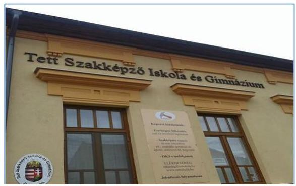

ÁLLAMI
SZÁMVEVŐSZÉK

# Jelentés 

## Nem állami humánszolgáltatók ellenőrzése

A humánszolgáltatást nyújtó államháztartáson kívüli köznevelési és szociális intézmények, szolgáltatók fenntartói központi költségvetésből kapott támogatásai felhasználásának ellenőrzése - Tett Oktatási Nonprofit Közhasznú Korlátolt Felelősségű Társaság
2020.

---

# Jelentés 

## Nem állami humánszolgáltatók ellenőrzése

A humánszolgáltatást nyújtó államháztartáson kívüli köznevelési és szociális intézmények, szolgáltatók fenntartói központi költségvetésből kapott támogatásai felhasználásának ellenőrzése - Tett Oktatási Nonprofit Közhasznú Korlátolt Felelősségú Társaság
2020. 01. hó 14. nap

---

# AZ ELLENŐRZÉST FELÜGYELTE:

## MAROZSÁN LÁSZLÓNÉ felügyeleti vezető

## AZ ELLENŐRZÉST VEZETTE ÉS A VÉGREHAJTÁSÁÉRT FELELŐS:

## MOLNÁR ZSUZSANNA ellenőrzésvezető

## A PROGRAM ÖSSZEÁLLÍTÁSÁÉRT FELELŐS:

## TÓTPÁL SZABOLCS osztályvezető

IKTATÓSZÁM: EL-2367-001/2019.

TÉMASZÁM: 2491

ELLENŐRZÉS-AZONOSÍTÓ SZÁM: V079418

Jelentéseink az Országgyűlés számítógépes hálózatán és az Interneta a www.asz.hu címen is olvashatóak.

---

# TARTALOMJEGYZÉK 

■ ÖSSZEGZÉS ..... 5
■ AZ ELLENŐRZÉS CÉLJA ..... 6
■ AZ ELLENŐRZÉS TERÜLETE ..... 7
■ AZ ELLENŐRZÉS HÁTTERE, INDOKOLTSÁGA ..... 8
■ A JELENTÉS LÉNYEGES KÉRDÉSKÖREI ..... 9
■ AZ ELLENŐRZÉS HATÓKÖRE ÉS MÓDSZEREI ..... 10
■ MEGÁLLAPÍTÁSOK ..... 12
■ JAVASLATOK ..... 14
■ MELLÉKLETEK ..... 15
I. sz. melléklet: Értelmező szótár ..... 15
■ FÜGGELÉKEK ..... 17
I. sz. függelék a jelentéshez ..... 17
II. sz. függelék: Észrevételek ..... 18
■ RÖVIDÍTÉSEK JEGYZÉKE ..... 21

---

.

---

# ÖSSZEGZÉS 

A Tett Oktatási Nonprofit Közhasznú Kft., mint intézményfenntartó nem teremtette meg a szabályszerű közpénzfelhasználás feltételeit. Nem biztosította a támogatások felhasználásának elszámoltathatóságát és átláthatóságát.

## Az ellenőrzés társadalmi indokoltsága

Az Állami Számvevőszék stratégiájában hangsúlyos szerepet szán annak, hogy szilárd szakmai alapon álló, értékteremtő ellenőrzéseivel előmozdítsa a közpénzügyek átláthatóságát, rendezettségét, javaslataival a közpénzek és a közvagyon szabályos, gazdaságos, hatékony és eredményes felhasználását segítse. Stratégiájában az Állami Számvevőszék célul tűzte ki, hogy az államháztartáson kívülre nyújtott költségvetési támogatások ellenőrzésével hozzájárul ahhoz, hogy a közpénzeket az államháztartáson kívüli szervezetek is átlátható módon használják fel a közfeladatok szerződésben vállalt ellátása érdekében. Tekintettel az elmúlt években a köznevelés finanszírozását és a köznevelési intézmények fenntartását érintően végbement változásokra, a társadalom fokozott érdeklődéssel figyeli a köznevelési feladatok ellátására fordított források felhasználását. Fontos ezért az Állami Számvevőszéknek a közvéleményt biztosítani arról, hogy a közpénz államháztartáson kívüli felhasználása ezen a területen sem marad ellenőrizetlenül. Az ellenőrzés hozzájárul ahhoz is, hogy a nyilvánosság és a közszolgáltatást igénybevevők megfelelő tájékoztatást kapjanak az államháztartáson kívüli közfeladatot ellátók működéséről. A Tett Oktatási Nonprofit Közhasznú Kft.-nél végzett ellenőrzést indokolttá tette, hogy köznevelési intézménye fenntartásához több mint 900 millió Ft költségvetési támogatást vett igénybe.

## Főbb megállapítások, következtetések, javaslatok

A Tett Oktatási Nonprofit Közhasznú Kft. a köznevelési feladatellátás jogszabályi előírások szerinti kereteinek hiányában 2014-2017. években nem teremtette meg a költségvetési támogatások szabályszerű felhasználásának feltételeit.

Nem alakította ki intézményében a közszolgáltatás igénybevételének feltételeit, mert nem határozta meg az intézmény által kérhető térítési díj és tandíj megállapításának szabályait, valamint a szociális alapon adható kedvezmények feltételeit.

A Tett Oktatási Nonprofit Közhasznú Kft. a kapott költségvetési támogatások cél szerinti felhasználását - a jogszabály által kötelezően előírt, a támogatás felhasználásról vezetendő nyilvántartás hiányában - az ellenőrzött időszakban nem igazolta.

A Tett Oktatási Nonprofit Közhasznú Kft. 2014-2017. évi éves beszámolói - a beszámolók szabályszerű könyvvezetéssel történő alátámasztásának hiányában - a jogszabályi előírások ellenére nem biztosították megbízható módon a nyilvánosság tájékoztatását a közpénzek felhasználásáról.

Az Állami Számvevőszék az intézkedések megtétele céljából a Tett Oktatási Nonprofit Közhasznú Kft. ügyvezetői részére 6 javaslatot fogalmazott meg.

---

# AZ ELLENŐRZÉS CÉLJA 

AZ ELLENŐRZÉS CÉLJA annak értékelése volt, hogy a Tett Oktatási Nonprofit Közhasznú Kft., mint köznevelési intézményfenntartó központi költségvetésből kapott támogatásainak felhasználása szabályszerű volt-e, a támogatások igénylése, évközi módosítása és év végi elszámolása megfelelt-e a jogszabályi előírásoknak.

---

# AZ ELLENŐRZÉS TERÜLETE 

## Tett Oktatási Nonprofit Közhasznú Kft., mint intézményfenntartó

A Tett Oktatási Nonprofit Közhasznú Kft. a 2004. augusztus 5-én alapított Tett Közhasznú Társaság átalakulásával jött létre 2009. március 23-án.

A Fenntartó ${ }^{1}$ egyszemélyes nonprofit közhasznú társaságként múködött. A társaság képviseletét három, 2015. augusztus 4-től két ügyvezető látta el.

A nyíregyházi székhellyel rendelkező Fenntartó alaptevékenységén kívül vállalkozási tevékenységet az ellenőrzött időszakban nem végzett.

A Fenntartó közhasznú főtevékenysége szakmai középfokú oktatás volt. Intézményét ${ }^{2}$ 2006-ban alapította, amely a 2016/2017-es tanévtől kezdődően az ellenőrzött időszakban öt megye huszonhat településén rendelkezett köznevelési feladat ellátására hatósági engedéllyel. Az engedélyezett maximális tanulólétszám 5200 fő volt.

A Fenntartó köznevelési közfeladatellátásra 2014-ben 405,4 M Ft, 2015-ben 295,3 M Ft, 2016-ban 132,7 M Ft, 2017-ben pedig 98,6 M Ft költségvetési támogatásban részesült.

---

# AZ ELLENŐRZÉS HÁTTERE, INDOKOLTSÁGA 

A köznevelési feladatokat ellátó nem állami intézményfenntartók részére közfeladataik ellátására évente jelentős összegű pénzügyi támogatást biztosítottak a mindenkori költségvetési törvények a bennük megfogalmazott feltételek mellett.

Az Országgyűlés elfogadta a nemzeti köznevelésről szóló 2011. évi CXC. törvényt, amely jelentősen átalakította a korábbi finanszírozási rendszert 2013 szeptemberétől. Új feladatfinanszírozási forma (átlagbéralapú támogatás) jelent meg, amely az államháztartáson kívüli intézményfenntartókra is vonatkozik. Az ellenőrzés a finanszírozási rendszerben bekövetkezett változásokra, azok közfeladat ellátásra gyakorolt hatására fókuszált a költségvetési támogatásokat felhasználó államháztartáson kívüli szervezetek körében. Az ellenőrzés indokoltságát az is alátámasztotta, hogy az ÁSZ ${ }^{3}$ még nem ellenőrizte átfogóan e területet.

Az ÁSZ stratégiájában foglaltak alapján is indokolt az ellenőrzés, amely a társadalom számára jelzi, hogy a közpénz államháztartáson kívüli felhasználása sem maradhat ellenőrizetlenül. Az államháztartáson kívülre nyújtott költségvetési támogatások ellenőrzésével az ÁSZ hozzájárul ahhoz, hogy a közpénzeket a nem állami fenntartók átlátható módon használják fel a közfeladatok ellátására kötött szerződésekben vállalt kötelezettségek teljesítése érdekében. Az ÁSZ az ellenőrzés javaslataival hozzájárulhat az említett rendszerek szabályszerű támogatás-felhasználásához, javíthatja a társa-dalmi-gazdasági döntések megalapozottságát, amely a „jól irányított állam" működésének feltétele.

---

# A JELENTÉS LÉNYEGES KÉRDÉSKÖREI 

1. A köznevelési humánszolgáltatási közfeladatot ellátó Fenntartó szabályszerű múködési - és gazdálkodási környezet kialakításával megteremtette-e a költségvetési támogatások átlátható, elszámoltatható igénybevételének, felhasználásának feltételeit, a támogatásokat szabályszerűen fordította-e humánszolgáltató intézménye müködtetésére?
2. Az államháztartáson kívüli Fenntartó a köznevelési intézménye müködtetéséhez felhasznált közpénzekre vonatkozó gazdálkodásával a nyilvánosság előtt elszámolt-e, ennek megalapozása érdekében ellenőrzési, értékelési és a külső ellenőrzésekkel kapcsolatos intézkedési feladatait szabályszerűen látta-e el?

---

# AZ ELLENŐRZÉS HATÓKÖRE ÉS MÓDSZEREI 

## Az ellenőrzés típusa

Megfelelőségi ellenőrzés.

## Az ellenőrzött időszak

A 2014. január 1-je és 2017. december 31-e közötti időszak. A helyszíni szemle tekintetében 2018. január 1-jétől az utolsó helyszíni szemle időpontjáig (2019. május 28-ig) tartó időszak.

## Az ellenőrzés tárgya

Az ellenőrzés a köznevelési közfeladatokat ellátó államháztartáson kívüli fenntartó közfeladatai ellátásához a költségvetési törvényekben biztosított központi költségvetési támogatások igénylése, évközi módosítása és év végi elszámolása fenntartói feladatainak ellátása, illetve e központi költségvetésből kapott támogatásaik közfeladatokra való fenntartó általi felhasználása szabályszerűségének értékelésére terjedt ki.

Az ellenőrzés nem terjedt ki a költségvetési támogatás igénylése, módosítása, elszámolása valódiságának, megalapozottságának, helyességének értékelésére, valamint a források intézmény általi felhasználásának értékelésére.

## Az ellenőrzött szervezet

Tett Oktatási Nonprofit Közhasznú Kft., mint intézményfenntartó.

## Az ellenőrzés jogalapja

Az ellenőrzés jogszabályi alapját az ÁSZ tv. ${ }^{4}$ 1. § (3) bekezdésében, valamint az 5. § (3) bekezdésében foglalt előírások adták.

## Az ellenőrzés módszerei

Az ellenőrzést az ellenőrzési program kérdései, az adott időszakban hatályos jogszabályok, az ellenőrzés szakmai szabályok és módszertanok, valamint a nemzetközi standardok figyelembevételével végezte az ÁSZ.

A közpénzekkel való felelős gazdálkodás segítésére irányuló javaslatok kidolgozásakor a hatályos jogszabályok voltak az irányadóak.

---

Az ellenőrzés ideje alatt az ÁSZ a Fenntartóval történő kapcsolattartást az ÁSZ SZMSZ ${ }^{5}$-ének vonatkozó előírásai alapján biztosította.

Az ellenőrzési kérdések megválaszolásához szükséges bizonyítékok megszerzése az ellenőrzött által rendelkezésre bocsátott dokumentumokra, adatokra alapozva történt.

Az ellenőrzési bizonyítékként felhasznált adatforrások közé tartoztak egyrészt a szakmai program részletes szempontjainál felsorolt adatforrások, másrészt minden - az ellenőrzés folyamán feltárt, az ellenőrzés szempontjából információt tartalmazó - dokumentum.

Amennyiben a Fenntartó múködését és gazdálkodását alapvetően meghatározó dokumentum hiánya miatt, valamely lényeges kérdéskörre, időszakra vonatkozóan az ÁSZ megállapítást tett, további ellenőrzési tevékenységek az adott kérdéskörrel és az azzal szoros logikai kapcsolatban lévő kérdéskörökkel az érintett időszakra vonatkozóan - ráépülő jelleggel - nem kerültek végrehajtásra.

Az ellenőrzés lefolytatásához a Fenntartó a kitöltött tanúsítványok, valamint az ÁSZ által kért dokumentumok átadásával szolgáltatott adatokat, információkat. Az így rendelkezésre bocsátott adatok, információk és a tanúsítványok adatai valódiságának kontrollja az ellenőrzés keretében történt.

A köznevelési humánszolgáltatások központi költségvetési támogatásai igénylésével, módosításával, elszámolásával kapcsolatos, államháztartáson kívüli fenntartó jogszabályokban előírt feladatai betartását, továbbá a központi költségvetési támogatások szabályszerű kezelését, nyilvántartását ellenőrizte az ÁSZ a Fenntartónál, az ott rendelkezésre álló határozatok, nyilvántartások, beszámolók és egyéb dokumentumok alapján.

---

# MEGÁLLAPÍTÁSOK 

## 1. A köznevelési humánszolgáltatási közfeladatot ellátó Fenntartó szabályszerű múködési - és gazdálkodási környezet kialakításával megteremtette-e a költségvetési támogatások átlátható, elszámoltatható igénybevételének, felhasználásának feltételeit, a támogatásokat szabályszerűen fordította-e humánszolgáltató intézménye múködtetésére?

Összegző megállapítás

A Fenntartó a költségvetési támogatások szabályszerű felhasználásának feltételeit nem teremtette meg. A támogatásokat 2014-2016-ban nem szabályszerűen fordította intézménye múködtetésére, 2017-ben pedig nem biztosította a támogatás felhasználásának ellenőrizhetőségét.

A 2014-2017. években a Fenntartó számviteli politikáján ${ }^{6}$ nem vezette át a Számv. tv. ${ }^{7}$ 14. § (11) bekezdésében foglaltak ellenére a - 2013. január 1jével hatályba lépett - a Számv. tv. 3. § (3) bekezdés 3. pontjában meghatározott jelentős összegű hiba fogalmát érintő változásokat, illetve nem törölte abból a Számv. tv. 3. § (3) bekezdés 5. pontjában meghatározott, a megbízható és valós képet lényegesen befolyásoló hiba fogalmának jogszabályi törlése kapcsán, a módosított beszámoló ismételt letétbe helyezésére és közzétételére vonatkozó belső előírásokat. Számviteli politikája 2015. július 4-től nem felelt meg a Számv. tv. 14. § (4) bekezdésében foglalt előírásnak, mert nem rögzítették benne azokat a jellemző szabályokat, előírásokat, módszereket, amelyekkel a Fenntartó meghatározza, hogy mit tekint a számviteli elszámolás az értékelés szempontjából kivételes nagyságú vagy előfordulású bevételnek, költségnek, ráfordításnak.

A Fenntartó elkészítette a Számv. tv.-ben foglaltak alapján az eszközök és a források leltárkészítési és leltározási szabályzatát ${ }^{8}$, az eszközök és a források értékelési szabályzatát ${ }^{9}$, valamint pénzkezelési szabályzatát ${ }^{10}$.

2014-2016. években a Fenntartó számlarendje ${ }^{11}$ - a Számv. tv. 161. § (2) bekezdés a) pontjában előírtak ellenére - nem tartalmazta minden alkalmazásra kijelölt számla számjelét és megnevezését, mert a „8675 Viszszautalt normatív támogatás" számla nem szerepelt benne.

Intézményét a jogszabályi előírások szerint létrehozta, szabályszerű működési kereteit azonban nem alakította ki a 2014-2016. években mert:
nem határozta meg az Nkt. ${ }^{12}$ 83. § (2) bekezdés c) pont előírása ellenére az intézmény által kérhető térítési díj és tandíj megállapításának szabályait, valamint a szociális alapon adható kedvezmények feltételeit, továbbá

---

- nem állapította meg az intézmény könyvvezetési, beszámoló-készítési kötelezettségét a Számv. tv. 3. § (1) bekezdése 2-4. pontja szerinti szervezetek közé történő besorolásával - a Számv. tv. 6. § (3) bekezdésében előírtak ellenére.
A támogatásokat 2014-2016. években nem szabályszerűen fordította intézménye múködtetésére a Fenntartó, mert:
- a költségvetési támogatások felhasználásáról vezetett nyilvántartását - az Nkt.vhr. 37/G. § (1) bekezdésének előírása ellenére - nem alapfeladatonként elkülönítve vezetette,
- 2014-2016. években nem tett eleget a folyósítást követő 15 napon belüli támogatás átadási kötelezettségének, mert - a 2014. évi Kvtv. ${ }^{13}$ 33. § (25) bekezdésében, a 2015. évi Kvtv. ${ }^{14}$ 8. melléklet V. 2. pontjában, és a 2016. évi Kvtv. ${ }^{15}$ 7. melléklet VI. 2. pontjában foglalt előírások ellenére - 2014-ben a kapott támogatás 54,3 \%-át (247,7 M Ft-ot ${ }^{16}$ ), 2015-ben az 52,7 \%-át (128,0 M Ft-ot ${ }^{17}$ ), 2016ban pedig a $36,8 \%$-át ( $49,3 \mathrm{M} \mathrm{Ft}-\mathrm{ot}^{18}$ ) nem adta át a jogszabályban előírt határidőben intézményének.
2017-ben a Fenntartó nem vezette a közfeladatellátásra kapott költségvetési támogatások felhasználásáról az Nkt.vhr. ${ }^{19}$ 37/G. § (1) bekezdése szerinti nyilvántartást. A nyilvántartás hiányában nem biztosította a költségvetési támogatás felhasználására vonatkozóan a szabályszerű gazdálkodási környezetet, továbbá nem igazolta a támogatások cél szerinti felhasználását.

A helyszíni szemle alapján a Fenntartó nem az intézmény alapító okiratában és múködési engedélyében foglaltak szerint múködtette intézményét, mert a helyszíni szemlével érintett 20 helyszín ${ }^{20}$ közül - az intézmény székhelyén kívüli ${ }^{21}-19$ telephelyen nem múködött az intézmény.

# 2. Az államháztartáson kívüli Fenntartó a köznevelési intézménye múködtetéséhez felhasznált közpénzekre vonatkozó gazdálkodásával a nyilvánosság előtt elszámolt-e, ennek megalapozása érdekében ellenőrzési, értékelési és a külső ellenőrzésekkel kapcsolatos intézkedési feladatait szabályszerűen látta-e el? 

Összegző megállapítás

A Fenntartó a köznevelési intézmény múködtetésére kapott közpénzekkel való gazdálkodásával nem számolt el a nyilvánosság előtt.

Fenntartó a Számv. tv. 4. § (1) bekezdésében meghatározottak ellenére nem támasztotta alá beszámolóit a Számv. tv. 161/A. § (2) bekezdésében meghatározott könyvvezetéssel, mert nyilvántartási (könyvvezetési) rendszerét nem részletezte tovább oly módon, hogy abból az Nkt.vhr. 37/G. § (1) bekezdésében előírtak szerinti - a támogatások alapfeladatonkénti felhasználásával kapcsolatos - adatok rendelkezésre álljanak.

---

# JAVASLATOK 

Az ÁSZ tv. 33. § (1) bekezdésében foglaltak értelmében az ellenőrzött szervezet vezetője köteles a jelentésben foglalt megállapításokhoz kapcsolódó intézkedési tervet összeállítani és azt a jelentés kézhezvételétől számított 30 napon belül az ÁSZ részére megküldeni. Amennyiben az ellenőrzött szervezet vezetője nem küldi meg határidőben az intézkedési tervet, vagy továbbra sem elfogadható intézkedési tervet küld, az Állami Számvevőszék elnöke az ÁSZ tv. 33. § (3) bekezdése a) és b) pontjaiban foglaltakat érvényesítheti.

## Tett Oktatási Nonprofit Közhasznú Kft. ügyvezetőinek

1. Intézkedjen a Számv. tv. előírásainak megfelelő számviteli politika elkészitéséről.
(1. sz. megállapítás 1. bekezdése alapján)
2. Intézkedjen a Számv. tv. előírásának megfelelő számlarend elkészitéséről.
(1. sz. megállapítás 3. bekezdése alapján)
3. Intézkedjen az Nkt. előírása szerint a kérhető térítési díj és tandíj megállapítására vonatkozó szabályoknak és a szociális alapon adható kedvezmények feltételeinek a meghatározásáról.
(1. sz. megállapítás 4. bekezdés 1. francia bekezdése alapján)
4. Intézkedjen a fenntartott intézményére vonatkozó könyvvezetési, beszá-moló-készitési kötelezettség Számv. tv. szerinti megállapításáról.
(1. sz. megállapítás 4. bekezdés 2. francia bekezdése alapján)
5. Gondoskodjon a jogszabályi előírásnak megfelelő nyilvántartás vezetéséről a költségvetési támogatás felhasználásáról.
(1. sz. megállapítás 5. bekezdés 1. francia bekezdése, a 6. bekezdése és a 2. sz. megállapítás 1. bekezdése alapján)
6. Gondoskodjon arról, hogy a költségvetési támogatást a fenntartott intézménye részére a Kvtv. előírása szerint adja át.
(1. sz. megállapítás 5. bekezdés 2. francia bekezdése alapján)

---

# MELLÉKLETEK 

## I. SZ. MELLÉKLET: ÉRTELMEZŐ SZÓTÁR

humánszolgáltatás
költségvetési támogatás
köznevelési közfeladat

Külön törvényben meghatározott szociális, gyermekjóléti, gyermekvédelmi, közoktatási, felsőoktatási, kulturális közfeladatok (2014. évi Kvtv. 34. § (1), (4) bekezdés, 1. számú melléklet XX/20/2. alcím, 19. alcím, 2015. évi Kvtv. 43. § (1), (4) bekezdés, 1. számú melléklet XX/20/2/3. jogcím csoport, 19. alcím, 2016. évi Kvtv. 41. § (1), (4) bekezdés, 1. számú melléklet XX/20/2/3. jogcím csoport, 19. alcím).
a társadalombiztosítás pénzügyi alapjai kivételével az államháztartás központi alrendszeréből ellenérték nélkül, pénzben nyújtott támogatások (Áht. 1. § 14. pont)
A Kvtv.-ékben (2013. évi CCXXX. törvény 33-34. §, 2014. évi C. törvény 42-43. §, 2015. évi C. törvény 40-41. §) megállapított támogatás. Például a 2015. évi C. törvény 40-41. § szerint többek között: Az Országgyűlés a köznevelési feladat ellátására átlagbéralapú támogatást állapít meg. A nevelési-oktatási, valamint pedagógiai szakszolgálati intézményt fenntartó nemzetiségi önkormányzat, az egyházi és magán köznevelési intézményfenntartója részére az általuk fenntartott nevelési-oktatási intézményben, továbbá pedagógiai szakszolgálati intézményben pedagógus és - a b) pont kivételével -nevelő-oktató munkát közvetlenül segítő munkakörben foglalkoztatottak után a 7. melléklet I. pontja, valamint az óvoda, egységes óvoda-bölcsőde esetében a 2. melléklet II. pont 1. alpontja szerint és az 5. alpontjában meghatározott jogosultak után, az őket ott megillető mértékek szerint. Múködési támogatást állapít meg a nemzetiségi önkormányzat vagy az egyházi jogi személy által fenntartott nevelési-oktatási intézményekben ellátott, továbbá a pedagógiai szakszolgálati intézményekben gyógypedagógiai tanácsadásban, korai fejlesztésben, oktatásban és gondozásban, valamint a fejlesztő nevelésben részt vevő gyermekekre, tanulókra tekintettel a nemzetiségi önkormányzat és a bevett egyház részére a 7. melléklet II. pontja szerint.
Az Országgyűlés a szociális, gyermekjóléti, gyermekvédelmi közfeladatot ellátó intézményt, szolgáltatást fenntartó egyházi jogi személy, civil szervezet, közalapítvány, országos nemzetiségi önkormányzat, települési vagy területi nemzetiségi önkormányzat, gazdasági társaság, és a humánszolgáltatást alaptevékenységként végző, az Szja tv. hatálya alá tartozó egyéni vállalkozó (a továbbiakban együtt: nem állami szociális fenntartó) részére támogatást állapít meg a következők szerint: a támogatás a nem állami szociális fenntartót a települési önkormányzatok 2. melléklet III. pont 3. alpont c)-k) pontjában és III. pont 5. alpont a) pontjában meghatározott támogatásaival azonos jogcímeken, összegben és feltételek mellett illeti meg.
A köznevelési intézmény alapító okiratában foglalt feladat: óvodai nevelés, nemzetiséghez tartozók óvodai nevelése, általános iskolai nevelés-oktatás, nemzetiséghez tartozók általános iskolai nevelése-oktatása, kollégiumi ellátás, nemzetiségi kollégiumi ellátás, gimnáziumi nevelés-oktatás, szakközépiskolai nevelés-oktatás, szakiskolai neve-lés-oktatás, nemzetiség gimnáziumi nevelés-oktatása, nemzetiség szakközépiskolai ne-velés-oktatása, nemzetiség szakiskolai nevelés-oktatása, Köznevelési Hidprogramok keretében folyó nevelés-oktatás, felnőttoktatás, alapfokú művészetoktatás, fejlesztő nevelés, fejlesztő nevelés-oktatás, pedagógiai szakszolgálati feladat, a többi gyermekkel, tanulóval együtt nevelhető, oktatható sajátos nevelési igényű gyermekek, tanulók óvodai nevelése és iskolai nevelése-oktatása, azoknak a sajátos nevelési igényű gyermekeknek, tanulóknak az óvodai, iskolai, kollégiumi ellátása, akik a többi gyermekkel, tanulóval nem foglalkoztathatók együtt, a gyermekgyógyüdülőkben, egészségügyi intézményekben, rehabilitációs intézményekben tartós gyógykezelés alatt álló gyermekek tankötelezettségének teljesítéséhez szükséges oktatás, pedagógiai-szakmai szolgáltatás. (Nkt. 4. § (1) bekezdés)

---

# Mellékletek 

köznevelési intézmény
nem állami, nem önkormányzati (államháztartáson kívüli) intézményfenntartó

A nevelési- oktatási intézmény, pedagógiai szakszolgálati intézmény, pedagógiai-szakmai szolgáltatást nyújtó intézmény. (Nkt. 7. § (1) bekezdés)
A köznevelési és szociális, gyermekjóléti és gyermekvédelmi közfeladatokat/humánszolgáltatásokat ellátó intézményt fenntartó egyházi jogi személy, társadalmi szervezet, alapítvány, közalapítvány, civil szervezet, országos nemzetiségi önkormányzat, nonprofit gazdasági társaság, gazdasági társaság és a humánszolgáltatást alaptevékenységként végző, Szja tv. hatálya alá tartozó egyéni vállalkozó. (2013. évi Kvtv. 35. § (1), (3) bekezdés, 2014. évi Kvtv. 33. §, 34. § (1), (4) bekezdés, 2015. évi Kvtv. 42. §, 43. § (1), (4) bekezdés, 2016. évi Kvtv. 40. §, 41. § (1), (4) bekezdés)

---

# FÜGGELÉKEK 

- I. SZ. FÜGGELÉK A JELENTÉSHEZ

Az Állami Számvevőszék az ellenőrzések során feltárt tényekhez kapcsolódó további körülmények tisztázására eszközrendszerrel nem rendelkezik. Amennyiben az ellenőrzésen túlmutatóan indokoltnak látszik az ellenőrzés során feltárt körülmények további vizsgálata, az Állami Számvevőszék törvényi felhatalmazás alapján az ellenőrzés által feltárt körülményeket továbbítja a hatáskörrel rendelkező szervnek a szükséges intézkedések megtétele, eljárások lefolytatása érdekében.

1. A Fenntartó nem vezette a költségvetési támogatás felhasználásáról az Nkt. vhr. szerinti nyilvántartást 2017-ben. Az Nkt.vhr. 37/G. § (1) bekezdésében elöirt, alapfeladatonként elkülönített, naprakész nyilvántartás hiányában a közfeladat ellátására 2017-ben kapott 98,6 M Ft összeg vonatkozásában a Fenntartó nem igazolta a kapott közpénz cél szerinti felhasználását.
Az eset konkrét körülményeinek feltárása a Magyar Államkincstár feladatkörébe tartozik.
2. Az ÁSZ 2019. május 28-án helyszíni szemle keretében ellenőrizte - az Ász tv. 25. § (3) bekezdése alapján - a Fenntartó közfeladat ellátását a feladat ellátási helyeken.
A Fenntartó az intézmény hatályos alapító okirata ${ }^{22}$, müködési engedélye ${ }^{23}$, a Hivatal ${ }^{24}$ honlapján a Köznevelés Információs Rendszerében (KIR) közzétett közhiteles adatok, valamint a saját adatszolgáltatása alapján a helyszíni szemle idején köznevelési feladatellátási helyekkel rendelkezett a helyszíni szemlével érintett 20 helyszínen. (bejegyzett székhely és telephelyek)
A helyszíni szemlén az ÁSZ számvevői megállapították, hogy - a Tett Középiskola Nyíregyháza, Ér utca 7. szám alatti székhelyén kívül - a fenntartott intézmény egyetlen helyszíni szemlével érintett telephelyén sem müködött.
a) A helyszíni szemlén tapasztaltak alapján megállapítható, hogy a Fenntartó intézményét nem az alapító okiratban és a müködési engedélyben meghatározottak szerint müködtette.
b) Az intézmény azon telephelyei vonatkozásában, amelyek feladatellátási helyként nem müködtek, a Fenntartó nem tett eleget az illetékes hatóság felé - az Nkt. 21. § (4) bekezdésében elöirt - 8 napon belüli változás bejelenési kötelezettségének. Ezáltal az általa fenntartott intézmény müködésére vonatkozóan félrevezető információk voltak a Hivatal honlapján közzétéve, megtévesztve ezzel a Fenntartóval és az intézménnyel kapcsolatban álló, vagy a jövőben várhatóan kapcsolatba kerülő személyeket, szervezeteket.
Az eset konkrét körülményének feltárása az ügyészség és a kormányhivatal feladatkörébe tartozik. A kormányhivatal megvizsgálta az Állami Számvevőszék jelzését.

---

A jelentéstervezetet a Számvevőszék 15 napos észrevételezésre megküldte az ellenőrzött szervezet vezetőinek az ÁSZ tv. 29. §* (1) bekezdése előírásának megfelelően.

A Tett Oktatási Nonprofit Közhasznú Korlátolt Felelősségű Társaság ügyvezetője a jelentéstervezet megállapításaira írásban észrevételt tett.
Az ÁSZ tv. 29. § (3) bekezdésével összhangban az ÁSZ a Függelékben feltünteti az ellenőrzés megállapításaival kapcsolatban tett, figyelembe nem vett észrevételeket, és megindokolja, hogy azokat miért nem fogadta el

[^0]
[^0]:    * 29. § (1) Az Állami Számvevőszék az ellenőrzési megállapításait megküldi az ellenőrzött szervezet vezetőjének vagy az általa megbízott személynek, és annak, akinek személyes felelősségét állapította meg.
    (2) Az ellenőrzött szervezet vezetője és a felelősként megjelölt személy az ellenőrzés megállapításaira tizenöt napon belül írásban észrevételt tehet.
    (3) Az Állami Számvevőszék az észrevételre a beérkezésétől számított harminc napon belül írásban válaszol. A figyelembe nem vett észrevételeket köteles a jelentésben feltüntetni, és megindokolni, hogy azokat miért nem fogadta el.

---

A „Nem állami humánszolgáltatók ellenőrzése - A humánszolgáltatást nyújtó államháztartáson kívüli köznevelési és szociális intézmények, szolgáltatók fenntartói központi költségvetésből kapott támogatásai felhasználásának ellenőrzése - Tett Oktatási Nonprofit Közhasznú Korlátolt Felelősségű Társaság" címmel készített számvevőszéki jelentéstervezet megállapításaival kapcsolatban az ügyvezető által 2019. december 4-én tett (az Állami Számvevőszékhez 2019. december 6-án érkezett) észrevételek és azok kezelésének indokolása.

1) A jelentéstervezet 1. számú megállapítás 4. bekezdés 1. francia bekezdésére és a kapcsolódó 3. számú javaslatra vonatkozó észrevétel:

Az ügyvezető észrevétele szerint az ellenőrzött évekre vonatkozóan az iskola beadta a térítési díj és tandíj fizetési szabályzatait, amelyek részletesen tartalmazzák, kikre terjed ki a térítési és tandíj, valamint azok összegét. A szabályozás utolsó pontja foglalkozik az adható kedvezményekkel. Az iskola szociális alapon nem adott kedvezményt, mert arra a költségvetési támogatás nem biztosított fedezetet. Eseti döntés alapján, a költségvetési egyensúly fenntartási felelőssége mellett az igazgató adhatott kedvezményt.

Az ügyvezető az Állami Számvevőszékről szóló 2011. évi LXVI. törvény (ÁSZ tv.) 28. § (2) bekezdésében foglalt adatszolgáltatási határidőn belül az észrevételében hivatkozott térítési és tandíj fizetési szabályzatot nem adott át az ellenőrzés részére. A 2018. augusztus 28-án kelt EL-0733-005/2018. iktatószámú adatbekérő levél 2. sz. melléklet 2.22. és 3.28. pontjában az Állami Számvevőszék (továbbiakban: ÁSZ) kérte: „a köznevelési terület térítési díj fizetés módjáról; a létszám-, csoport szám meghatározásáról, az intézményvezető kinevezéséről, illetve a költségvetések, beszámolók elfogadásáról szóló döntések, döntést igazoló dokumentumokról készített fenntartói szintű nyilvántartások, kimutatások, összesítések, egyéb dokumentumok" megküldését. Az ügyvezető 2018. szeptember 24-én kelt teljességi és hitelességi nyilatkozatában a 62. és 162. sorokban megjelölt, az adatbekérésre megküldött dokumentumok („2.22. térítési díj, létszám meghat., int.vez.kinev..pdf" és „3.28. térítési díj, létszám meghat., int.vez.kinev..pdf") a köznevelési terület térítési díj fizetés módjáról, a szabályzatok elfogadásáról hozott fenntartói határozatok számát tartalmazzák, továbbá két esetben a taggyűlési jegyzőkönyvet, a vonatkozó határozattal. Ugyanakkor az észrevételben hivatkozott szabályzatokat nem küldték meg az ÁSZ részére. Az ellenőrzés rendelkezésére bocsátott, fent hivatkozott dokumentumok nem támasztották alá a nemzeti köznevelésről szóló 2011. évi CXC. törvény (Nkt.) 83. § (2) bekezdés c) pontjában előírt, az intézmény által kérhető térítési díj és tandíj megállapítás szabályainak, valamint a szociális alapon adható kedvezmények feltételeinek a fenntartó részéről történő meghatározását. Az ÁSZ a megállapításait az ÁSZ tv.-ben foglalt határidőben megküldött dokumentumok alapján teszi meg. Az ügyvezető a teljességi és hitelességi nyilatkozat aláírásával az ellenőrzés rendelkezésére bocsátott dokumentumok, adatok hitelességéért, valódiságáért, hiánytalanságáért felelősséget vállalt. Az észrevétel alapján a jelentéstervezet módosítása nem indokolt.
2) A jelentéstervezet 1. számú megállapítás 5. bekezdés 1. francia bekezdésére, a 6. bekezdésére, a 2. számú megállapítás 1. bekezdésére és a kapcsolódó 5. számú javaslatra vonatkozó észrevétel:

Az ügyvezető észrevételében leírta, hogy a társaság által fenntartott középiskola egy - felnőttoktatás - szakfeladaton működött. 2017-ben volt egy nappali rendszerú iskolai oktatási szakfeladat 20 fővel, az ott tanítók ugyanakkor a felnőttoktatás szakfeladaton is láttak el órákat. A költségvetési támogatást szabályosan, cél szerint használták fel. A 20 főre nem történt külön könyvelés, azt utólagosan javítják. A költségvetési támogatás egészének felhasználására annak nincs hatása.

Az ÁSZ 2018. augusztus 3-ai keltű, EL-0733-002/2018. iktatószámú adatbekérő levél 2. számú mellékletének a Fenntartóra vonatkozó 1. pontjában kérte beküldeni „A köznevelési és/vagy szociális közfeladat ellátásra kapott támogatás 2017. évi elkülönített nyilvántartását alátámasztó" dokumentumokat. A 2018. augusztus 28 -ai keltü, EL-0733005/2108. iktatószámú adatbekérő levél 2. számú mellékletének 2.28. pontjában a 2014-2016. évekre vonatkozóan kérte a „költségvetési támogatások elkülönített nyilvántartását igazoló dokumentumok, főkönyvi és analitikus nyilvántartások a fenntartónál, illetve az önálló költségvetéssel rendelkező székhely intézmény/eknél" dokumentumokat.

Az iskola 2013. április 1-jétől érvényes szervezeti és működési szabályzatának (SZMSZ) 2.2. pontja tartalmazta az intézmény alapfeladatait, feladat-ellátásának rendjét, valamint a vonatkozó jogszabálynak megfelelően a szakfeladati besorolást. A társaság által fenntartott intézmény alapító okirata tartalmazza az egyes telephelyek vonatkozásában

---

az ellátott alapfeladatokat. A társaság által az ellenőrzés részére átadott, „A köznevelési közfeladat ellátására kapott támogatás 2017. évi elkülönített nyilvántartás" című (2018. 08. 28.) dokumentum, illetve a 2014-2016 évekre vonatkozóan átadott főkönyvi kartonok (868, 8675, 967 főkönyvi számlákról) nem feleltek meg a nemzeti köznevelésről szóló törvény végrehajtásáról szóló 229/2012. (VIII. 28.) Korm. rendelet (Nkt. vhr.) 37/G § (1) bekezdésében meghatározott részletes, naprakész nyilvántartásnak, mert a nyilvántartásban a támogatás felhasználása alapfeladatonkénti bontásban nem került kimutatásra. Az észrevételt a fentiekre tekintettel az ÁSZ nem fogadta el, a jelentéstervezet megállapításának módosítása nem indokolt.
3) A jelentéstervezet 1. számú megállapítás 5. bekezdés 2. francia bekezdésére és a kapcsolódó 6. számú javaslatra vonatkozó észrevétel:

Az észrevétel szerint a költségvetési támogatást minden évben átutalták a fenntartott intézmény részére. Ütemezési problémák előfordultak, azok kiküszöbölésére az ügyvezető korábban már intézkedett.

Az ügyvezető észrevételében nem vitatja a jelentéstervezet megállapítását, a késedelmes utalásokat elismeri. Az észrevétel alapján a jelentéstervezet módosítása nem indokolt.

# 4) A jelentéstervezet I. sz. Függelék 1. pontjában foglaltakat érintő észrevétel: 

Az ügyvezető észrevétele szerint a társaság a közpénzt cél szerint használta fel, azt a Magyar Államkincstár (Kincstár) az adott évben ellenőrizte. A hiányzó szakfeladat szerinti bontást a könyvelés elvégzi.

Az észrevételben hivatkozott Kincstári ellenőrzés megállapításai az ÁSZ ellenőrzését nem befolyásolják. A társaság a közpénz cél szerinti felhasználását az Nkt. vhr.-ben előírt elkülönített, naprakész nyilvántartás vezetésével nem igazolta. Az ÁSZ tájékoztatását a költségvetési támogatás felhasználásával, nyilvántartásával kapcsolatosan tett észrevételre a 3. pontban leírtak tartalmazzák. A jelentéstervezet Függelékének módosítása az észrevétel alapján nem indokolt.

## 5) A jelentéstervezet I. sz. Függelék 2. pontjában foglaltakat érintő észrevétel:

Az ügyvezető észrevételében leírta, hogy több kisebb telephelyet létesítettek, a szakképző évfolyamok sajátossága miatt több helyen keresztféléves képzéseket indítva működött az iskola. Leírta, hogy az Nkt. 21. § (4) szerinti törlésre akkor kerül sor, amikor már biztos, hogy az adott telephelyet nem működtetik. Az újra engedélyeztetés rendkívül bonyolult, a változó helyzet miatt a szüneteltetés is hasonló okokból nem kivitelezhető. Az iskola 2017-től szakmaszerkezeti döntés miatt nem kapott normatívás létszámot, ezért 2018 nyarától telephelyeket szüntettek meg és szüneteltettek. Jelenleg a székhely és egy telephely működik.

Az Nkt. 21. § (4) bekezdése szerint „A bejegyzett adatokban bekövetkezett változásokat - a (2) bekezdésben meghatározottak szerint - nyolc napon belül be kell jelenteni.". Az észrevételben leírt gyakorlat nem felelt meg a jogszabályi előírásnak, a változásokat, a tevékenység szüneteltetését, vagy megszüntetését is a jogszabályban előírt nyolc napos határidőn belül be kell jelenteni. Az ÁSZ által 2019. május 28-án végzett helyszíni ellenőrzések azt igazolták, hogy több telephelyen nem történt köznevelési feladatellátás annak ellenére, hogy azokat az ügyvezető a 2018. szeptember 19-én aláírt és az ÁSZ ellenőrzéshez megküldött kimutatásban feladat-ellátási helyként jelölte meg. Az észrevétel alapján a jelentéstervezet Függelékének módosítása nem indokolt

---

# RÖVIDÍTÉSEK JEGYZÉKE 

${ }^{1}$ Fenntartó
${ }^{2}$ Intézmény
${ }^{3}$ ÁSZ
${ }^{4}$ ÁSZ tv.
${ }^{5}$ ÁSZ SZMSZ
${ }^{6}$ számviteli politika
${ }^{7}$ Számv. tv.
${ }^{8}$ eszközök és a források leltárkésztési és leltározási szabályzata
${ }^{9}$ eszközök és a források értékelési szabályzata
${ }^{10}$ pénzkezelési szabályzat
${ }^{11}$ számlarend
${ }^{12} \mathrm{Nkt}$.
${ }^{13}$ 2014. évi Kvtv.
${ }^{14}$ 2015. évi Kvtv.
${ }^{15}$ 2016. évi Kvtv.
${ }^{16} 247,7$ M Ft
${ }^{17} 128,0$ M Ft
${ }^{18} 49,3$ M Ft
${ }^{19} \mathrm{Nkt} . \mathrm{vhr}$.
${ }^{20} 20$ helyszíni szemlével érintett feladatellátási hely
${ }^{21}$ intézmény székhelye
${ }^{22}$ intézményi alapító okirat

Tett Oktatási Nonprofit Közhasznú Kft.
Tett Középiskola (2016. augusztus 31-éig) Tett Szakképző Iskola és Gimnázium (2016. szeptember 1-jétől)
Állami Számvevőszék
2011. évi LXVI. törvény az Állami Számvevőszékről (hatályos: 2011. július 1-jétől) az Állami Számvevőszék elnökének 4/2017. (XII.29.) ÁSZ utasítása az Állami Számvevőszék Szervezeti és Müködési Szabályzatáról (hatályos: 2017. január 1-jétől)
Számviteli politika Tett Oktatási Nonprofit Közhasznú Kft. (hatályos: 2012 május 15.-től)
2000. évi C. törvény - a számvitelről (hatályos: 2001. január 1-től)

Eszközök és források értékelési szabályzata Tett Oktatási Nonprofit Közhasznú Kft. (hatályos: 2012 május 15-től)
Leltárkészítési és leltározási szabályzat Tett Oktatási Nonprofit Közhasznú Kft. (hatályos: 2012 május 15-től)
Pénzkezelési szabályzat Tett Oktatási Nonprofit Közhasznú Kft. (hatályos: 2012. május 15-től)
Számlarend Tett Oktatási Nonprofit Közhasznú Kft. (hatályos: 2012 május 15.-től)
2011. évi CXC. törvény a nemzeti köznevelésről (hatályos: 2012. szeptember 1-jétől)
2013. évi CCXXX. tv. Magyarország 2014. évi központi költségvetéséről (hatályos: 2014. január 1-jétől 2017. december 30-ig)
2014. évi C. tv. Magyarország 2015. évi központi költségvetéséről (hatályos: 2015. január 1-jétől 2018. december 30-ig)
2015. évi C. tv. Magyarország 2016. évi központi költségvetéséről (hatályos: 2016. január 1-jétől 2019. december 30-áig)
2014.01.07., 2014.02.06., 2014.03.06., 2014.04.03., 2014.08.07. és 2014.11.07-én kapott támogatások
2015.01.09., 2015.01.20., 2015.02.05., 2015.04.07., 2015.08.06-án utalt támogatások
2016.01.11., 2016.02.05., 2016.06.06., 2016.08.04., 2016.09.06-án utalt támogatások
229/2012. (VIII. 28.) Korm. rendelet a nemzeti köznevelésről szóló törvény végrehajtásáról (hatályos: 2012. szeptember 1-jétől)
4600 Kisvárda, Kossuth út 2. - 4631 Pap, Kossuth út 75-79. - 4523 Pátroha, Szabadság út 7. - 4566 Ilk, Bethlen Gábor út 56. - 4561 Baktalórántháza, Petőfi út 4. - 4601 Kisvárda, Kossuth út 2. - 4632 Pap, Kossuth út 75-79. - 4524 Pátroha, Szabadság út 7. - 4567 Ilk, Bethlen Gábor út 56. - 4562 Baktalórántháza, Petőfi út 4. - 4400 Nyíregyháza, Ér utca 7. - 4400 Nyíregyháza, Kiss Ernő utca 8. - 4400 Nyíregyháza, Színház u. 3. - 4400 Nyíregyháza, Kálvin tér 13. - 4484 Ibrány, Lehel u. 59. - 4233 Balkány, Kossuth út 5. - 4401 Nyíregyháza, Ér utca 7. 4401 Nyíregyháza, Kiss Ernő utca 8. - 4401 Nyíregyháza, Színház u. 3. - 4401 Nyíregyháza, Kálvin tér 13.
Tett Középiskola, Nyíregyháza, Ér utca 7.
Tett Középiskola - Alapító Okirat (hatályos: 2016. szeptember 1-jétől)

---

${ }^{23}$ hatályos működési engedély
${ }^{24}$ Hivatal

Szabolcs-Szatmár-Bereg Megyei Kormányhivatal által SZ-10/102/08432-15/2018. számon kiadott működési engedély
Oktatási Hivatal

---

# ÁLLAMI SZÁMVEVŐSZÉK 

1052 Budapest, Apáczai Csere János utca 10.
Levélcím: 1364 Budapest 4. Pf. 54
Telefon: +36 14849100 Telefax: +36 14849200
www.asz.hu