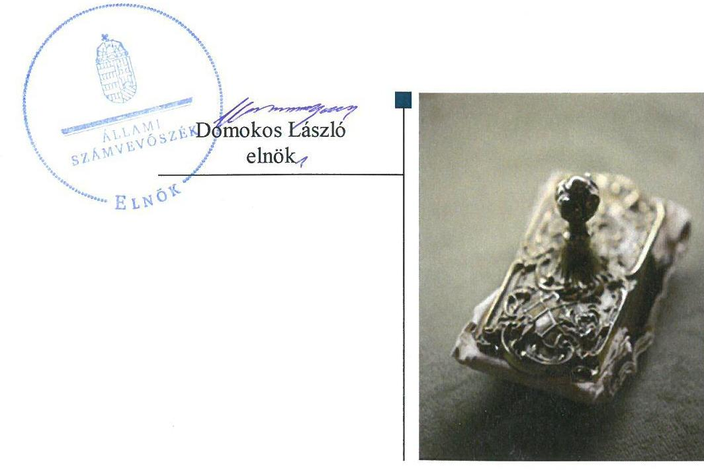
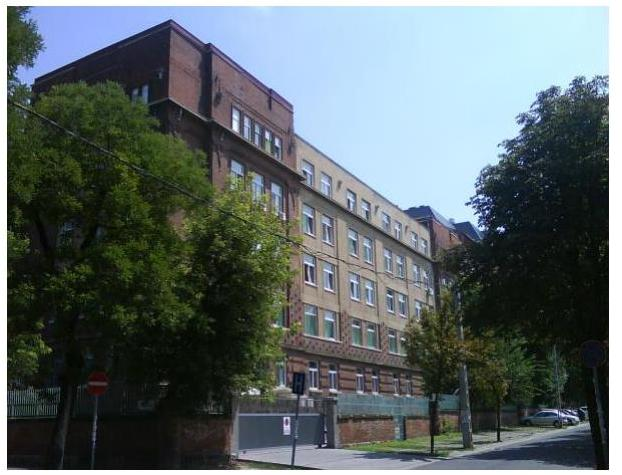
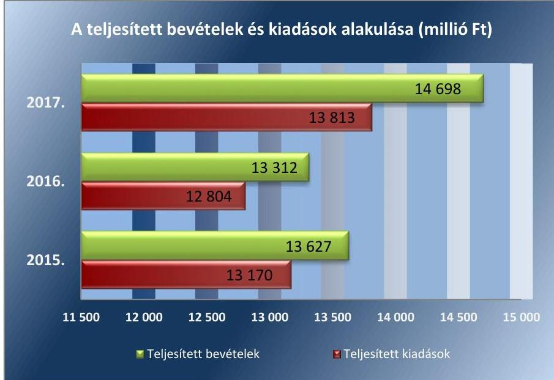
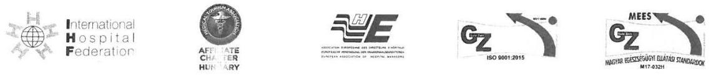
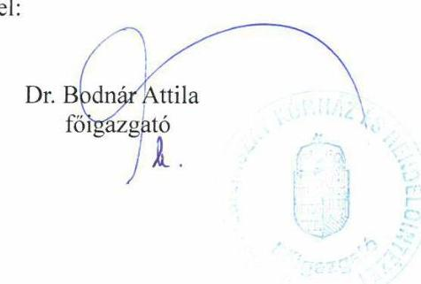
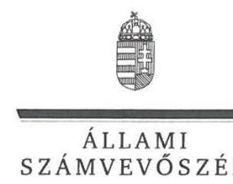
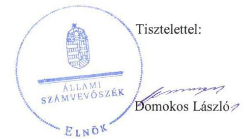
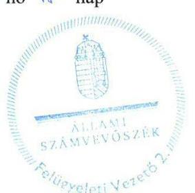

ÁLLAMI
SZÁMVEVŐSZÉK

# Jelentés 

## Központi költségvetési szervek ellenőrzése

Bajcsy-Zsilinszky Kórház és Rendelőintézet
2020.

---

# Jelentés 

## Központi költségvetési szervek ellenőrzése

Bajcsy-Zsilinszky Kórház és Rendelőintézet
2020. 01. hó 09. nap

---

# AZ ELLENŐRZÉST FELÜGYELTE:

- DR. BENEDEK MÁRIA felügyeleti vezető
- SALAMON ILDIKÓ felügyeleti vezető

# AZ ELLENŐRZÉST VEZETTE ÉS A VÉGREHAJTÁSÁÉRT FELELŐS:

- VERTKOVCZI MÁRIA ellenőrzésvezető
- DR. BENEDEK MÁRIA ellenőrzésvezető

# A PROGRAM ÖSSZEÁLLÍTÁSÁÉRT FELELŐS:

- TÓTPÁL SZABOLCS osztályvezető

Jelentéseink az Országgyűlés számítógépes hálózatán és az Interneten a www.asz.hu címen is olvashatóak.

|  IKTATÓSZÁM: EL-2369-001/2019 | |
| --- | --- |
|  TÉMASZÁM: 2450 | |
|  ELLENŐRZÉS-AZONOSÍTÓ SZÁM: V079126 | |

---

# TARTALOMJEGYZÉK 

■ ÖSSZEGZÉS ..... 5
■ AZ ELLENŐRZÉS CÉLJA ..... 6
■ AZ ELLENŐRZÉS TERÜLETE ..... 7
■ AZ ELLENŐRZÉS HÁTTERE, INDOKOLTSÁGA ..... 9
■ A JELENTÉS LÉNYEGES KÉRDÉSKÖREI ..... 10
■ AZ ELLENŐRZÉS HATÓKÖRE ÉS MÓDSZEREI ..... 11
■ MEGÁLLAPÍTÁSOK ..... 14
■ JAVASLATOK ..... 19
■ MELLÉKLETEK ..... 21
I. sz. melléklet: Értelmező szótár ..... 21
■ FÜGGELÉKEK ..... 25
I. sz. függelék a jelentéshez ..... 25
II. sz. függelék: Észrevételek ..... 27
■ RÖVIDÍTÉSEK JEGYZÉKE ..... 43

---

.

---

# ÖSSZEGZÉS 

A Bajcsy-Zsilinszky Kórház és Rendelőintézet belső kontrollrendszerének kialakítása és működtetése, a pénzügyi és vagyongazdálkodása nem volt szabályszerű, ezáltal nem volt biztosított az átlátható és elszámoltatható közpénzfelhasználás. Az integritás kontrollok kiépítése nem volt arányban a korrupciós kockázatokkal.

## Az ellenőrzés társadalmi indokoltsága

A közpénzek felhasználásában és az állami vagyonnal való gazdálkodásban a központi alrendszer egyes intézményei meghatározó súlyt képviselnek. Ez indokolja, hogy az Állami Számvevőszék ellenőrzéseket folytasson a pénzügyi és vagyongazdálkodás területén. Az Állami Számvevőszék az ellenőrzései során értékeli a belső kontrollrendszer jogszabályi előírások szerinti kialakítását és működtetésének szabályszerűségét, feltárja a gazdálkodás esetleges hiányosságait, rámutathat a vagyongazdálkodási tevékenység - ezen belül a tulajdonosi joggyakorlás és vagyonkezelés - esetleges szabálytalanságaira. Az Állami Számvevőszék az ellenőrzésével hozzá kíván járulni a központi intézmények pénzügyi helyzetének pontosabb megítéléséhez, a jó gyakorlat kialakításán és terjesztésén keresztül az ellenőrzések elősegíthetik a gazdálkodás szabályszerűségének javítását.

Az egészségügyi ellátások közfeladat teljesítése a társadalom széles körét érinti és a közérdeklődés középpontjában áll. A központi költségvetésből az egyik legjelentősebb kiadást az egészségügyi ellátásokra fordított kiadások jelentik, amelyekből a kórházak kapják a legtöbb támogatást. A Bajcsy-Zsilinszky Kórház és Rendelőintézet egészségügyi közfeladatot lát el és jelentős mértékű állami vagyont kezel.

## Főbb megállapítások, következtetések, javaslatok

A Bajcsy-Zsilinszky Kórház és Rendelőintézet főigazgatója a belső kontrollrendszer részeként kialakította a kontrollkörnyezetet, a kockázatkezelési rendszert. A monitoring rendszer részeként a belső ellenőrzést szabályszerűen működtette. A kontrolltevékenységek gyakorlása nem volt szabályszerű, az információs és kommunikációs folyamatok nem működtek szabályszerűen, így a Bajcsy-Zsilinszky Kórház belső kontrollrendszere a közpénzekkel és a nemzeti vagyonnal történő szabályszerű gazdálkodást, a beszámolási és adatszolgáltatási kötelezettségek szabályszerű teljesítését nem biztosította.

A Bajcsy-Zsilinszky Kórház és Rendelőintézet pénzügyi gazdálkodása nem volt szabályszerű, az elszámolt bevételek és kiadások esetében nem rendelkezett bizonylattal. A 2016. évi bevételi, valamint a 2017. évi kiadási előirányzatai felhasználásáról a főkönyve alátámasztására a jogszabályi előírásokat megsértve nem vezetett a valóságnak megfelelő, folyamatos, zárt rendszerű, áttekinthető részletező nyilvántartást, ezáltal a közpénzfelhasználás nem volt elszámoltatható és átlátható. A kötelezettségvállalás nyilvántartása, a maradvány megállapítása nem volt szabályszerű.

A vagyongazdálkodás nem volt szabályszerű, mivel a költségvetési beszámoló mérleg tételei leltárral nem voltak alátámasztottak, ezért a mérlegben szereplő eszközök és források értékének valódisága nem volt igazolt. Folyamatos, zárt rendszerű részletező nyilvántartások hiányában nem volt biztosított, hogy a költségvetési beszámoló a vagyoni helyzetet a valóságnak megfelelően, áttekinthetően mutassa be.

A Bajcsy-Zsilinszky Kórház és Rendelőintézet az integritást erősítő nem kötelezően előírt kontrollokat nem építette ki.

Az Állami Számvevőszék az intézkedések megtétele céljából a középirányító szerv vezetőjeként az Állami Egészségügyi Ellátó Központ főigazgatója részére egy, a Bajcsy-Zsilinszky Kórház és Rendelőintézet főigazgatója részére 12 javaslatot fogalmazott meg.

---

# AZ ELLENŐRZÉS CÉLJA 

AZ ELLENŐRZÉS CÉLJA annak megállapítása volt, hogy az ellenőrzött intézményre vonatkozó irányító szervi feladatellátás a jogszabályi előírások betartásával történt-e, a Kórház belső kontrollrendszere biztosította-e az átlátható, szabályszerű, gazdaságos, hatékony és eredményes gazdálkodás feltételeit, szabályszerű volt-e a beszámolási és adatszolgáltatási kötelezettségek teljesítése, valamint az, hogy a Kórház pénzügyi és vagyongazdálkodása megfelelt-e a jogszabályi előírásoknak és belső szabályzatainak, a költségvetési maradvány megállapítása szabályszerűen történt-e. Az ellenőrzés keretében értékelte az ÁSZ¹, hogy a Kórháznál kiépítették és erősítették-e a korrupciós kockázatok kezelését szolgáló integritási kontrollokat, továbbá megteremtették-e a teljesítményellenőrzés feltételeit. Az ellenőrzés célja volt továbbá annak értékelése, hogy az államháztartás központi alrendszerébe tartozó Kórház gazdálkodása elszámoltatható-e és megfelelt-e annak az Alaptörvényben meghatározott alapvetésnek, hogy Magyarország a kiegyensúlyozott, átlátható és fenntartható költségvetési gazdálkodás elvét érvényesíti. Érvényesült-e a nemzeti vagyon kezelésének és védelmének célja, azaz a Kórház vagyona a közérdeket szolgálja, a közös szükségletek kielégítése és a természeti erőforrások megóvása, valamint a jövő nemzedékek szükségleteinek figyelembevétele mellett.

---

# **AZ ELLENŐRZÉS TERÜLETE**

## **Bajcsy-Zsilinszky Kórház és Rendelőintézet**

A Bajcsy-Zsilinszky Kórház és Rendelőintézet, mint költségvetési szerv 1980. február 15-étől végzi tevékenységét. Közfeladata az Eütv.2 alapján, működési engedélyében meghatározott ellátási területére kiterjedően a járó- és fekvőbetegek diagnosztikus és terápiás szakorvosi ellátása, rehabilitációja és követéses gondozása.

Az irányító szervi hatásköröket a Bajcsy-Zsilinszky Kórház és Rendelőintézet fölött az Emberi Erőforrások Minisztériuma útján az emberi erőforrások minisztere gyakorolta. Az egyes fenntartói, valamint az irányítási, középirányítói jogokat az Állami Egészségügyi Ellátó Központ (2015. február 28-ig a Gyógyszerészeti és Egészségügyi Minőség- és Szervezetfejlesztési Intézet) gyakorolta.

A Bajcsy-Zsilinszky Kórház és Rendelőintézet a 2015-2017. években gazdasági szervezettel rendelkező költségvetési szerv volt.

A 2015-2017. években végrehajtott beruházások következtében a Bajcsy-Zsilinszky Kórház és Rendelőintézet könyvviteli mérleg szerinti vagyona a 2015. január 1-jei 10 647,9 millió Ft-ról 2017. december 31-ére 12 474,7 millió Ft-ra, 17,2%-kal nőtt. A teljesített költségvetési és finanszírozási bevétele 2015. évi 13 626,6 millió Ft-ról 2017. évre 14 698,2 millió Ft-ra, a teljesített költségvetési és finanszírozási kiadása a 2015. évi 13 170,2 millió Ft-ról 2017. évre 13 813,0 millió Ft-ra emelkedett.

A teljesített bevételek és kiadások alakulását az 1. ábra szemlélteti.

1. ábra

*Forrás: A Bajcsy-Zsilinszky Kórház és Rendelőintézet éves költségvetési beszámolói*

---

A Bajcsy-Zsilinszky Kórház és Rendelőintézetet a 2015-2017. években főigazgató³ vezette, a gazdálkodással kapcsolatos feladatokat a Gazdasági igazgató közvetlen irányítása alatt működő gazdasági igazgatóság látta el. Az Áht.⁴ szerinti szervezeti átalakításra 2016. március 31-ével került sor, a Bajcsy-Zsilinszky Kórház és Rendelőintézet a beolvadó két költségvetési szerv jogutódja lett.

A főigazgató 2012. november 16-ától, a Gazdasági igazgató 2014. június 24-étől látta el a feladatait, személyükben a 2015-2017. években nem történt változás. Az átlagos statisztikai állományi létszám a 2015. évi 1145 főről 2017. évre 1213 főre emelkedett.

---

# AZ ELLENŐRZÉS HÁTTERE, INDOKOLTSÁGA 

Az államháztartás központi alrendszerébe tartozó szervezet vagyona a nemzeti vagyon része, és az Alaptörvény is rögzíti, hogy a vagyonnal való gazdálkodás célja a közérdek szolgálata. Az ÁSZ ellenőrzi az éves költségvetési törvény végrehajtását, az ellenőrzés során feltárt kockázatok és a terület folyamatos kockázatelemzésével beazonosított kockázatok kezelése érdekében ráépülő ellenőrzésekkel ellenőrzi a költségvetési szervek gazdálkodását, működését, hogy az ellenőrzések megállapításaival támogassa az ellenőrzött szervezetek szabályszerű gazdálkodását, javaslataival elősegítse az Alaptörvényben megfogalmazott alapvetések érvényesülését a mindennapi életben a szervezetek szintjén.

A belső kontrollrendszer kialakítása és működtetése nélkül nem valósítható meg a közpénzek, a közvagyon átlátható, szabályos, gazdaságos, hatékony és eredményes felhasználása. A belső kontrollrendszer azt a célt szolgálja, hogy a költségvetési szervek működésük és gazdálkodásuk során a tevékenységeket szabályszerűen hajtsák végre, teljesítsék elszámolási kötelezettségeiket és megvédjék az erőforrásokat a veszteségektől, a károktól és a nem rendeltetésszerű használattól. A belső kontrollrendszer magában foglalja mindazon elveket, eljárásokat és belső szabályzatokat, melyek biztosítják, hogy a költségvetési szerv valamennyi tevékenysége és célja összhangban legyen a szabályszerűséggel, szabályozottsággal, valamint a gazdaságosság, hatékonyság és eredményesség követelményeivel, az eszközökkel és forrásokkal való gazdálkodásban ne kerüljön sor pazarlásra, visszaélésre, rendeltetésellenes felhasználásra. Megfelelő, pontos és naprakész információk álljanak rendelkezésre a költségvetési szerv működésével kapcsolatosan, és a belső kontrollrendszer harmonizációjára, összehangolására vonatkozó jogszabályok végrehajtásra kerüljenek. Az integritás kontrollok kiépítése, erősítése a szervezet korrupciós kockázatainak kezelését szolgálja. A teljesítménykövetelmények meghatározása és működtetése megalapozhatja a központi költségvetési szervnél a teljesítményellenőrzés lefolytatását.

---

# A JELENTÉS LÉNYEGES KÉRDÉSKÖREI 

1.     - Az irányító szerv ellenőrzött költségvetési szervre vonatkozó feladatellátása szabályszerű volt-e, továbbá szabályszerűen történt-e az ellenőrzött időszakban az intézményt érintő szervezeti, szerkezeti átalakítások lebonyolítása?
2.     - A belső kontrollrendszer kialakítása és működtetése biztosította-e a közpénzekkel és a nemzeti vagyonnal történő szabályszerű gazdálkodást, illetve a beszámolási és adatszolgáltatási kötelezettségek szabályszerű teljesítését?
3.     - A költségvetési szerv pénzügyi gazdálkodása szabályszerű volt-e, a költségvetési maradvány megállapítása szabályszerűen történt-e?
4.     - A költségvetési szerv vagyongazdálkodása szabályszerű volt-e?

---

# AZ ELLENŐRZÉS HATÓKÖRE ÉS MÓDSZEREI 

## Az ellenőrzés típusa

Megfelelőségi ellenőrzés.

## Az ellenőrzött időszak

2015-2017. évek

## Az ellenőrzés tárgya

A Bajcsy-Zsilinszky Kórház és Rendelőintézetre vonatkozó irányító szervi feladatok ellátása a 2015-2016. években. A Bajcsy-Zsilinszky Kórház és Rendelőintézet belső kontrollrendszerének kialakítása és működtetése 2015-2017. években, valamint az integritás kontrollok kiépítettsége és a teljesítményellenőrzés feltételei a 2017. évben.

A Bajcsy-Zsilinszky Kórház és Rendelőintézet pénzügyi és vagyongazdálkodása a 2015-2016. években.

A 2017. évre vonatkozóan a Bajcsy-Zsilinszky Kórház és Rendelőintézet vagyongazdálkodási feltételeinek kialakítása, annak szabályszerűsége, az elszámoltathatóság biztosítása a szabályozás szintjén. A vagyonváltozást eredményező döntések, a vagyonban bekövetkezett változások végrehajtásának, nyilvántartásba vételének, elszámolásának szabályszerűsége. Az állami vagyon kimutatásának szabályszerűsége, ennek keretében az állami vagyonnal történő rendelkezés, a vagyonmozgások, a vagyon nyilvántartásba vétele, értékelése és a mérleg alátámasztás szabályszerűsége. A költségvetési maradvány megállapításának szabályszerűsége 2017. év vonatkozásában.

## Az ellenőrzött szervezet

- Bajcsy-Zsilinszky Kórház és Rendelőintézet,
- Emberi Erőforrások Minisztériuma, mint irányító szerv,
- Állami Egészségügyi Ellátó Központ (2015. február 28-áig Gyógyszerészeti és Egészségügyi Minőség- és Szervezetfejlesztési Intézet), mint középirányító szerv.

---

# Az ellenőrzés jogalapja 

Az ellenőrzés jogszabályi alapját az ÁSZ tv.⁵ 1. § (3) bekezdése, 5. § (2)-(3) bekezdései, (4) bekezdés a) pontja és (6) bekezdése, valamint az Áht. 61. § (2) bekezdésében foglalt előírások adták.

## Az ellenőrzés módszerei

Az ellenőrzésre a szakmai program szempontjai, az ellenőrzött időszakban hatályos jogszabályok, az ellenőrzés szakmai szabályai, a jelen ellenőrzésre irányadó ÁSZ módszertanok figyelembevételével került sor.

Az ÁSZ az ellenőrzés ideje alatt a Bajcsy-Zsilinszky Kórház és Rendelőintézettel, az Emberi Erőforrások Minisztériumával és az Állami Egészségügyi Ellátó Központtal a kapcsolattartást az ÁSZ SZMSZ⁶-ének vonatkozó előírásai alapján biztosította.

Az ellenőrzési kérdések megválaszolásához szükséges bizonyítékok megszerzése a Bajcsy-Zsilinszky Kórház és Rendelőintézet, az Emberi Erőforrások Minisztériuma és az Állami Egészségügyi Ellátó Központ által rendelkezésre bocsátott dokumentumokra, adatokra alapozva megfigyelés, szemle (szemrevételezés), kérdésfeltevés (információkérés), mintavételezés, valamint elemző eljárás útján történt.

Az ellenőrzési bizonyítékként felhasználható adatforrások
 közé tartoztak egyrészt a szakmai program részletes szempontjainál felsorolt adatforrások, másrészt minden egyéb - az ellenőrzés folyamán feltárt, az ellenőrzés szempontjából információt tartalmazó - dokumentum.

Az ellenőrzés lefolytatásához az ellenőrzött szervezet a tanúsítványok kitöltésével, valamint az ÁSZ által kért dokumentumok megküldésével szolgáltatott adatokat, amelyek valódiságát és teljes körűségét az ellenőrzött szervezet vezetője által tett teljességi és hitelességi nyilatkozat igazolta. Az így rendelkezésre bocsátott adatok, információk kontrollja az ellenőrzés keretében történt.

A központi költségvetési szerv belső kontrollrendszere egyes pilléreinek kialakítására és működtetésére vonatkozó értékelés:
$\longrightarrow$ „szabályszerű", amennyiben az értékelt területen az elért „igen" válaszok százalékban kifejezett, egész számra kerekített aránya legalább $85 \%$,
$\longrightarrow$ „nem szabályszerű", ha nem éri el a $85 \%$-ot,
A központi költségvetési szerv belső kontrollrendszerének összesített értékelése az egyes részterületek esetében kapott megfelelőségi arányok számtani átlaga alapján történt és megegyezik a pillérenként (kontrollterületenként) alkalmazott százalékos értékelésekkel, a következő eltérésekkel: a kontrollrendszer egésze esetében a „szabályszerű" értékelésnek a százalékos értéken felül további feltétele, hogy egyik kontrollterület sem kaphat „nem szabályszerű" értékelést.

Az ÁSZ statisztikai módszereken alapuló mintavételt alkalmazott.
A kiadások ellenőrzésére - a 2017. évi felhalmozási kiadások kivételével - a 2015-2017. évek, a bevételek ellenőrzésére a 2015. és a 2017. év vonatkozásában került sor. A kiadások (külső személyi juttatások, felhalmozási kiadások, dologi kiadások) és bevételek (értékesítésből és bérbeadásból származó bevételek) esetében az ellenőrzés azokra a legnagyobb értékű tételekre - a lényeges sokaságra - terjedt ki, melyek összértéke eléri a teljes sokaság összértékének 50\%-át.

A 2015-2016. évi felhalmozási kiadások és 2017. évben a költségvetési szerv által használt állami vagyon esetében a lényeges sokaságot tételesen ellenőrizte az ÁSZ.

A 2015-2017. évi kiadások és a 2015. évi bevételek elszámolásának szabályszerűségét a lényeges sokaságból véletlen mintavételi eljárással kiválasztott tételek alapján ellenőrizte az ÁSZ.

A mintavétellel ellenőrzött területek esetében minden egyes tétel vonatkozásában a használat, az elszámolás és értékelés szabályszerűségére vonatkozó kérdéseket tette fel. Szabályszerűnek értékelt egy ellenőrzött területet, amennyiben 95%-os bizonyossággal az ellenőrzött sokaságban az átlagos hibaarány legfeljebb 10%, nem szabályszerűnek, amennyiben 10%-nál magasabb hibaarányt képviselt.

---

# MEGÁLLAPÍTÁSOK 

## 1. Az irányító szerv ellenőrzött költségvetési szervre vonatkozó feladatellátása szabályszerű volt-e, továbbá szabályszerűen történt-e az ellenőrzött időszakban az intézményt érintő szervezeti, szerkezeti átalakítások lebonyolítása?

Összegző megállapítás

Az Irányító szerv ${ }^{7}$ és a Középirányító szerv ${ }^{8}$ feladatellátása a 2015-2016. években szabályszerű volt. A Kórház ${ }^{9}$ az átalakítással kapcsolatos feladatait a 2016. évben nem szabályszerűen hajtotta végre.

AZ ALAPÍTÓ OKIRAT ${ }^{10}$ az Ávr. ${ }^{11}$ előírásai alapján tartalmazta az alaptevékenységek kormányzati funkciók szerinti besorolását, az átruházott irányítási hatásköröket. A Középirányító szerv az Áht.-ban foglaltak alapján - átruházott hatáskörben - jóváhagyta a Kórház módosított SZMSZ ${ }^{12}$-ét.

AZ ELEMI KÖLTSÉGVETÉS tervezési követelményeit az Irányító szerv az Ávr. előírásai alapján meghatározta. Az Áht. és az Áhsz. ${ }^{13}$ előírásaival összhangban jóváhagyta a Kórház elemi költségvetéseit és éves költségvetési beszámolóit.

## AZ INTÉZMÉNYT ÉRINTŐ SZERVEZETI, SZERKEZETI ÁTALAKÍTÁS nem volt szabályszerű.

A Kórház, mint átvevő jogutód intézmény az Áhsz. 7. § (3) bekezdésében foglaltak ellenére az átalakítás miatt megszűnt két költségvetési szerv (Szakorvosi Rendelőintézet Gyömrő, illetve Szakorvosi Rendelőintézet Monor) 2016. március 31-ei fordulónapi éves költségvetési beszámolóját nem készítette el.

Az Irányító szerv 2016. március 31-i hatállyal az Áht. előírásával összhangban döntött a Kórház átalakításáról, a Szakorvosi Rendelőintézet Gyömrő, illetve a Szakorvosi Rendelőintézet Monor költségvetési szerveknek a Kórházba történő beolvadásáról. A 152/2014. Korm. rendeletben ${ }^{14}$ előírtak alapján a beolvadó szakorvosi rendelőintézetek és a Kórház között a beolvadó szakorvosi rendelőintézetek szakmai feladataival, a jogszerű működést biztosító igazgatási dokumentumokkal, a működést érdemben befolyásoló dokumentumokkal kapcsolatos átadás-átvételi eljárást lefolytatták.

---

# 2. A belső kontrollrendszer kialakítása és működtetése biztosította-e a közpénzekkel és a nemzeti vagyonnal történő szabályszerű gazdálkodást, illetve a beszámolási és adatszolgáltatási kötelezettségek szabályszerű teljesítését? 

Összegző megállapítás

A Kórház belső kontrollrendszerének kialakítása és működtetése nem biztosította a közpénzekkel és a nemzeti vagyonnal történő szabályszerű gazdálkodást, illetve a beszámolási és adatszolgáltatási kötelezettségek szabályszerű teljesítését a 2015-2017. években.

A KONTROLLKÖRNYEZET KIALAKÍTÁSA a 2015. és a 2017. évben szabályszerű volt, a 2016. évben nem volt szabályszerű.

A Kórház gazdálkodással kapcsolatos feladatainak munkafolyamat leírását, a feladat- és hatásköröket, a belső és külső kapcsolattartás módját az Ávr.-ben foglaltak alapján az SZMSZ, az Ügyrend ${ }^{15}$, továbbá az Ellenőrzési nyomvonal ${ }^{16}$ tartalmazta. A Kórház a vagyonnyilatkozat-tételi kötelezettséggel járó munkaköröket a Vnytv. ${ }^{17}$ előírásaival összhangban az SZMSZben meghatározta.

A Kórház rendelkezett a Számv. tv. ${ }^{18}$ előírásai alapján Számviteli Politikával, az Ávr.-ben foglaltakkal összhangban a gazdálkodás részletes rendjét meghatározó Gazdálkodási szabályzattal ${ }^{19}$.

A Főigazgató a Bkr. ${ }^{20}$ 6. § (4) bekezdésében foglaltak ellenére 2016. október 1-jétől 2016. november 14-ig nem szabályozta a szervezeti integritást sértő események kezelésének eljárásrendjét. A Főigazgató a 2016. november 15-én aktualizált Belső kontrollrendszer szabályzat ${ }^{21}$-ban, majd a 2017. május 11-én hatályba léptetett Integritás szabályzat ${ }^{22}$-ban szabályozta a szervezeti integritást sértő események kezelésének eljárásrendjét, azonban a szabályzatok a Bkr. 6. § (4a) bekezdés c), d), e) és g) pontja előírásai ellenére nem tartalmazták az érintettek meghallgatásának eljárási szabályait, a vonatkozó dokumentumok átvizsgálásának szabályait, a szervezeti integritást sértő események elhárításához szükséges intézkedéseket, továbbá a bejelentő szervezeten belüli védelméről, illetve elismeréséről, valamint a vizsgálat eredményéről való tájékoztatásáról szóló szabályokat.

A Főigazgató a 2015-2017. években a Bkr. 6. § (1) bekezdés c) pontjában foglaltak ellenére nem alakított ki olyan kontrollkörnyezetet, amelyben meghatározottak az etikai elvárások a szervezet minden szintjén.

A Főigazgató a 2015-2017. években - a Számv. tv. 161. § (2) bekezdés d) pontjában foglaltakat megsértve - nem készítette el a bizonylati rendet. A Főigazgató a 2015-2016. években, a Számv. tv.-ben előírtak ellenére a Számviteli politika keretében nem készített önköltségszámítás rendjére vonatkozó szabályzatot. 2017. május 31-étől a Kórház rendelkezett a Számv. tv.-ben előírt, Számviteli politika keretében elkészített Önköltség-számítási szabályzattal².

A KOCKÁZATKEZELÉSI RENDSZER kialakítása és működtetése 2016. november 14-éig nem volt szabályszerű.

---

A Főigazgató a Bkr. 3. § b) pontjában előírtak ellenére a belső kontrollrendszer keretében nem alakított ki a szervezet minden szintjén érvényesülő kockázatkezelési rendszert 2016. szeptember 30-áig, illetve integrált kockázatkezelési rendszert 2016. október 1-jétől 2016. november 14-éig.

A Kórház a 2016. november 15-étől hatályba léptetett Belső Kontroll Szabályzat ${ }^{24}$-ban a Bkr. előírásai alapján meghatározta az integrált kockázatkezelési rendszer működtetésének feltételeit. Az integrált kockázatkezelési rendszer kialakítása és működtetése 2016. november 15-étől 2017. december 31-éig szabályszerű volt.

A KONTROLLTEVÉKENYSÉGEK GYAKORLÁSA nem volt szabályszerű a 2015-2017. években a 3. lényeges kérdéskörnél kifejtett hiányosságok miatt.

# AZ INFORMÁCIÓS ÉS KOMMUNIKÁCIÓS FOLYAMATOK működtetése nem volt szabályszerű a 2015-2017. években. 

A Főigazgató a 2015-2017. években az Ltv. ${ }^{25}$ 10. § (1) bekezdés a) pontjában foglalt előírások szerinti egyedi Iratkezelési szabályzatot ${ }^{26}$ nem adott ki.

A Kórház az Info. tv. 37. § (1) bekezdésben hivatkozott 1. melléklet szerinti általános közzétételi listában meghatározott adatok közül nem tette közzé a 2015-2017. években az adatvédelmi és adatbiztonsági szabályzat hatályos és teljes szövegét, a 2015-2016. években az SZMSZ-ét. A Kórház az SZMSZ-t a 2017. évben közzétette.

A Kórház a közérdekű adatok megismerésére irányuló igények teljesítésének rendjét és az adatvédelmi szabályokat az Info tv. ${ }^{27}$-ben és az Ávr.ben előírtak alapján az Adatkezelési szabályzat ${ }^{28}$-ban határozta meg.

## A MONITORING RENDSZER MŰKÖDTETÉSE szabályszerű volt a 2015-2017. években. A Kórház a tevékenységének, a célok megvalósításának folyamatos és eseti nyomon követését biztosító rendszerét kialakította. Az Áht. előírásai alapján a Kórház gondoskodott a belső ellenőrzés kialakításáról, szabályszerű működtetéséről. A belső és külső ellenőrzésekről vezetett nyilvántartás tartalma a Bkr. előírásaival összhangban volt.

A SZERVEZET TELJESÍTMÉNYMÉRÉSÉRE alkalmas követelményeket a Kórháznál nem alakítottak ki. A szervezeti célok elérését szolgáló feladatok, folyamatok tevékenységek mérését szolgáló indikátorokat, mérőszámokat, feladat- és teljesítménymutatókat a Kórház nem képzett, így nem biztosította a teljesítménymérés lehetőségét.

A Főigazgató a 2015-2017. években a Bkr. 1. mellékletében foglaltak alapján nyilatkozott arról, hogy gondoskodott a Kórház belső kontrollrendszere kialakításáról, valamint szabályszerű, eredményes és hatékony működéséről, továbbá a rendelkezésre álló előirányzatok cél szerinti felhasználásáról, a szabályszerűség és elszámoltathatóság biztosításáról. Az ÁSZ ellenőrzés megállapításai nem igazolták a nyilatkozatban foglaltakat. Ez alapján a Kórház belső kontrollrendszere nem biztosította a közpénzekkel és a nemzeti vagyonnal történő szabályszerű gazdálkodást, illetve a beszámolási és adatszolgáltatási kötelezettségek szabályszerű teljesítését, továbbá az előirányzatok szabályszerű felhasználását. A nyilatkozatot a Főigazgató az éves költségvetési beszámolóval együtt az Irányító szerv részére megküldte.

Az integritást erősítő, integritás elvű működést támogató, nem kötelezően előírt kontrollokat a Főigazgató nem működtette.

# 3. A költségvetési szerv pénzügyi gazdálkodása szabályszerű volt-e, a költségvetési maradvány megállapítása szabályszerűen történt-e? 

Összegző megállapítás

A Kórház pénzügyi gazdálkodása, a költségvetési maradvány megállapítása a 2015-2017. években nem volt szabályszerű.

A BEVÉTELEK ÉS KIADÁSOK ELSZÁMOLÁSA a 2015-2016. években nem felelt meg a jogszabályi előírásoknak.

A Kórház a bevételi előirányzatai felhasználásáról a főkönyve alátámasztására a 2016. évben az Áhsz. 39. § (1) bekezdésében foglaltak ellenére nem vezetett a valóságnak megfelelő, folyamatos, zárt rendszerű, áttekinthető részletező nyilvántartást.

A kötelezettségvállalás alapját jelentő jogi személlyel megkötött visszterhes szerződések a 2015-2016. években az Ávr. 50. § (1) bekezdés a), c) pontjai és (1a) bekezdésében foglaltak ellenére nem tartalmazták a szakmai, műszaki teljesítés mennyiségi és minőségi jellemzőinek meghatározását, határidejét, a kifizetés határidejét, valamint a szervezet képviselőjének nyilatkozatát arra vonatkozóan, hogy átlátható szervezetnek minősül.

A Kórház a 2015-2017. években a Számv. tv. 165. § (2) bekezdésében foglaltak ellenére a számviteli (könyvviteli) nyilvántartásokba bizonylat hiányában jegyzett be adatokat.

A Főigazgató az Ávr. 56. § (1) bekezdésében foglaltak ellenére a 2015-2017. években nem gondoskodott a kötelezettségvállalást követően annak az államháztartási számviteli kormányrendelet szerinti nyilvántartásba vételéről.

## A 2015-2016. ÉVI ELŐIRÁNYZAT-MARADVÁNY

megállapítása a kötelezettségek nyilvántartásának hiányossága miatt nem felelt meg a jogszabályi előírásoknak, a nyilvántartás hiányosságai miatt nem volt alátámasztott a Kórház kötelezettségekkel terhelt tárgyévi előirányzat-maradvány kimutatása.

A Kórház kötelezettségvállalással terhelt maradvány kimutatása alátámasztásához vezetett részletező nyilvántartása a 2015-2016. években az Áhsz. 39. § (3) bekezdésében foglaltak ellenére nem felelt meg az Áhsz. 14. melléklet II/4 a), c)-g) pontjaiban meghatározott tartalmi követelményeknek.

A 2017. ÉVI KÖLTSÉGVETÉSI MARADVÁNY megállapítása nem volt szabályszerű.

A Kórház kötelezettségvállalással terhelt maradvány kimutatása alátámasztásához vezetett részletező nyilvántartása a 2017. évben az Áhsz. 39. § (3) bekezdésében foglaltak ellenére nem felelt meg az Áhsz. 14. melléklet II/4 a), c)-g) pontjaiban meghatározott tartalmi követelményeknek.

A Kórház előirányzatokról vezetett nyilvántartása a 2017. évben az Áhsz. 39. § (3) bekezdésben foglaltak ellenére nem felelt meg az Áhsz. 14. melléklet I. 2. a-c) pontban foglalt tartalmi
 előírásoknak.

A 2017. évben a Kórház az Áht. 36. § (1) bekezdésében foglaltakat megsértve a szabad előirányzat mértékét meghaladóan vállalt kötelezettséget, mivel az Áhsz. 53. § (4) bekezdésben hivatkozott Áhsz. 17. melléklet 1. a) pontban előírtak ellenére azon kötelezettségét nem teljesítette, hogy a költségvetési számvitelen belül a gazdálkodási szabályokból adódóan a 05. számlacsoportban vezetett nyilvántartási számlákon belül az előirányzatok nyilvántartására vezetett számlák egyenlegét ne haladja meg a költségvetési évben esedékes kötelezettségek és a teljesítés nyilvántartására szolgáló számlák egyenlege. A 2017. évben a Kórház éves költségvetési beszámolóban rögzített módosított költségvetési kiadási előirányzata 14659 millió Ft, míg a költségvetési évben esedékes és végleges kötelezettségvállalások együttes összegének egyenlege 15251 millió Ft volt, ami a módosított költségvetési kiadási előirányzatot 592 millió Ft-tal meghaladta.

A Kórház a maradványról az éves költségvetési beszámoló részeként Áhsz. és Ávr. előírásaival összhangban, az előírt határidőben teljesítette adatszolgáltatási kötelezettségét.

# 4. A költségvetési szerv vagyongazdálkodása szabályszerű volt-e? 

## Összegző megállapítás

A Kórház vagyongazdálkodása a 2015-2017. években nem volt szabályszerű.

A MÉRLEG TÉTELEINEK ALÁTÁMASZTÁSÁHOZ a Számv. tv. 69. § (1) bekezdésében és az Áhsz. 22. § (1) bekezdésében foglaltak ellenére a Kórház nem állította össze a leltárt, amely tételesen, ellenőrizhető módon tartalmazta volna a mérleg fordulónapján meglévő eszközöket és forrásokat mennyiségben és értékben, így a Számv. tv. 15. § (3) bekezdése szerinti valódiság elve nem érvényesült.

A Kórház által végzett beruházások és felújítások elszámolása, a vagyonelemek értékesítése, hasznosítása és az eszközök nyilvántartása nem volt szabályszerű. A Kórház a kiadási előirányzatai felhasználásáról a főkönyve alátámasztására a 2017. évben az Áhsz. 39. § (1) bekezdésében foglaltak ellenére nem vezetett a valóságnak megfelelő, folyamatos, zárt rendszerű, áttekinthető részletező nyilvántartást.

A Kórház a Leltározási és leltárkészítési szabályzatában ${ }^{29}$ a Számv. tv. 69. § (3) bekezdésében foglaltak ellenére az ingatlanok tekintetében a leltárba kerülő adatok valódiságának alátámasztásához a legalább 3 éves gyakoriságú mennyiségi felvételű leltározási kötelezettség helyett 5 éves gyakoriságot írt elő.

---

# JAVASLATOK 

Az ÁSZ tv. 33. § (1) bekezdésében foglaltak értelmében az ellenőrzött szervezet vezetője köteles a jelentésben foglalt megállapításokhoz kapcsolódó intézkedési tervet összeállítani és azt a jelentés kézhezvételétől számított 30 napon belül az ÁSZ részére megküldeni. Amennyiben az ellenőrzött szervezet vezetője nem küldi meg határidőben az intézkedési tervet, vagy továbbra sem elfogadható intézkedési tervet küld, az Állami Számvevőszék elnöke az ÁSZ tv. 33. § (3) bekezdése a) és b) pontjaiban foglaltakat érvényesítheti.

## az ÁEEK főigazgatójának

1. Tegyen intézkedéseket a feltárt hiányosságok és/vagy szabálytalanságok tekintetében a felelősség tisztázása érdekében, és szükség szerint intézkedjen a felelősség érvényesítéséről.
(2. sz. megállapítás 5-6. bekezdése, 3. sz. megállapítás 3-5., 9-11. bekezdése, 4. sz. megállapítás 1-3. bekezdése alapján)

## a Kórház főigazgatójának

1. Intézkedjen a Bkr. előírásának megfelelően olyan kontrollkörnyezet kialakításáról, amelyben meghatározottak, ismertek és elfogadottak az etikai elvárások a szervezet minden szintjén.
(2. sz. megállapítás 5. bekezdése alapján)
2. Intézkedjen a Számv.tv. előírásának megfelelően a számlarendben foglaltakat alátámasztó bizonylati rend készítéséről.
(2. sz. megállapítás 6. bekezdése alapján)
3. Intézkedjen az Ltv. előírásának megfelelően az egyedi iratkezelési szabályzat kiadásáról.
(2. sz. megállapítás 12. bekezdése alapján)
4. Gondoskodjon az Ávr. előírásának megfelelően arról, hogy a megkötött visszterhes szerződések tartalmazzák
a) a szakmai, műszaki teljesítés mennyiségi és minőségi jellemzőinek meghatározását, határidejét,
b) a kifizetés határidejét,
c) a szervezet képviselőjének nyilatkozatát arra vonatkozóan, hogy átlátható szervezetnek minősül.
(3. sz. megállapítás 3. bekezdése alapján)

---

5. Intézkedjen a Számv. tv. előírásának megfelelően, hogy a számviteli (könyvviteli) nyilvántartásokba szabályszerűen kiállított bizonylat alapján jegyezzenek be adatokat.
(3. sz. megállapítás 4. bekezdése alapján)
6. Gondoskodjon az Ávr. előírásának megfelelően a kötelezettségvállalást követően annak haladéktalan nyilvántartásba vételéről az államháztartási számviteli kormányrendelet szerint.
(3. sz. megállapítás 5. bekezdése alapján)
7. Intézkedjen a kötelezettségvállalással terhelt maradvány kimutatás alátámasztásához az Áhsz. 14. melléklet II/4. pontjában előírt kötelező minimum tartalmú részletező nyilvántartás vezetéséről.
(3. sz. megállapítás 9. bekezdése alapján)
8. Intézkedjen az előirányzatokról vezetett nyilvántartásnak az Áhsz. 14. melléklet I. 2. pontjában előírt kötelező minimum tartalmú vezetéséről.
(3. sz. megállapítás 10. bekezdése alapján)
9. Intézkedjen arról, hogy
a) az Áht. előírásainak megfelelően kötelezettségvállalásra csak szabad előirányzat mértékéig kerüljön sor, továbbá intézkedjen
b) a költségvetési számvitelen belül a gazdálkodási szabályokból adódóan az Áhsz. 17. melléklet 1. a) pontjában előírt kötelezettség betartásáról.
(3. sz. megállapítás 11. bekezdése alapján)
10. Intézkedjen, hogy a Számv. tv. és az Áhsz. előírásának megfelelő leltár összeállítására.
(4. sz. megállapítás 1. bekezdés alapján)
11. Intézkedjen arról, hogy az Áhsz. előírásának megfelelően az éves költségvetési beszámolót részletező nyilvántartásokkal, zárt rendszerű, áttekinthető nyilvántartással támasza alá.
(4. sz. megállapítás 2. bekezdés alapján)
12. Intézkedjen arról, hogy a Számv. tv. előírásának megfelelő gyakorisággal kerüljön előírásra az ingatlanok mennyiségi felvétellel történő leltározása a Leltározási szabályzatban.
(4. sz. megállapítás 3. bekezdése alapján)

---

# MELLÉKLETEK 

- I. SZ. MELLÉKLET: ÉRTELMEZŐ SZÓTÁR
állami vagyon
állami vagyonnak minősül:
a) az állam tulajdonában lévő dolog, valamint a dolog módjára hasznosítható természeti erő,
b) az a) pont hatálya alá nem tartozó mindazon vagyon, amely vonatkozásában törvény az állam kizárólagos tulajdonjogát nevesíti,
c) az állam tulajdonában lévő tagsági jogviszonyt megtestesítő értékpapír, illetve az államot megillető egyéb társasági részesedés,
d) az államot megillető olyan immateriális, vagyoni értékkel rendelkező jogosultság, amelyet jogszabály vagyoni értékű jogként nevesít. (Forrás: Vtv. ${ }^{30}$ 1. § (2) bekezdése)
állami vagyon használója Az a természetes vagy jogi személy, jogi személyiséggel nem rendelkező szervezet, aki, vagy amely törvény vagy szerződés alapján, bármely jogcímen (bérlet, haszonbérlet, használat stb.) állami vagyont birtokol, használ, szedi annak hasznait, hasznosít, ide nem értve a haszonélvezőt, a vagyonkezelőt és a tulajdonosi jogok gyakorlóját. (Forrás: Vtvr. 1. § (7) bekezdés a) pontja)
állami vagyon hasznosítása Az állami vagyont az MNV Zrt. maga kezeli, vagy szerződés - így különösen bérlet, haszonbérlet, megbízás - alapján központi költségvetési szervnek, természetes vagy jogi személynek, vagy jogi személyiséggel nem rendelkező gazdálkodó szervezetnek hasznosításra átengedi.
(Forrás: Vtv. 23. § (1) bekezdése, hatályos 2012. január 1-jétől)
Az állami vagyonnal a tulajdonosi joggyakorló maga gazdálkodik, vagy szerződés - így különösen bérlet, haszonbérlet, megbízás - alapján hasznosításra átengedi, illetőleg vagyonkezelésbe, haszonélvezetbe adja. (Forrás: Vtv. 23. § (1) bekezdése, hatályos 2013. június 28 -ától)
állami vagyon kezelője /vagyonkezelő
átalakítás
belső ellenőrzés
belső kontrollrendszer

Az állami vagyont az MNV Zrt. maga kezeli, vagy szerződés - így különösen bérlet, haszonbérlet, megbízás - alapján központi költségvetési szervnek, természetes vagy jogi személynek, vagy jogi személyiséggel nem rendelkező gazdálkodó szervezetnek hasznosításra átengedi." Az állami vagyonra vonatkozóan az MNV Zrt. kizárólag az Nvtv.-ben meghatározott személyekkel köthet vagyonkezelési szerződést. (Forrás: Vtv. 27. § (1) bekezdése, hatályos 2012. január 1-jétől)
A költségvetési szerv általános jogutódlással történő megszüntetése átalakítással történhet. Az átalakítás lehet egyesítés vagy különválás. Az egyesítés lehet beolvadás vagy összeolvadás. (2015. január 1-jétől Áht. 11. § (2) bekezdés)
Független, tárgyilagos bizonyosságot adó és tanácsadó tevékenység, amelynek célja, hogy az ellenőrzött szervezet működését fejlessze és eredményességét növelje, az ellenőrzött szervezet céljai elérése érdekében rendszerszemléletű megközelítéssel és módszeresen értékeli, illetve fejleszti az ellenőrzött szervezet irányítási és belső kontrollrendszerének hatékonyságát. (Forrás: Bkr. 2. § b) pontja)
A belső kontrollrendszer a kockázatok kezelése és tárgyilagos bizonyosság megszerzése érdekében kialakított folyamatrendszer, amely azt a célt szolgálja, hogy a működés és gazdálkodás során a tevékenységeket szabályszerűen, gazdaságosan, hatékonyan, eredményesen hajtsák végre, az elszámolási kötelezettségeket teljesítsék, megvédjék az erőforrásokat a veszteségektől, károktól és nem rendeltetésszerű használattól. (Forrás: Áht. 69. § (1) bekezdése)

---

belső kontrollrendszer területei
ellenőrzési nyomvonal
hasznosítás
információs és kommunikációs rendszer
integritás
integrált kockázatkezelési rendszer
irányító szerv/felügyeleti szerv
kockázat
kockázatkezelési rendszer
kontrollkörnyezet
kontrolltevékenységek
középirányító szerv

A kontrollkörnyezet, a kockázatkezelési rendszer, a kontrolltevékenységek, az információs és kommunikációs rendszer, valamint a nyomon követési (monitoring) rendszer. (Forrás: Bkr. 3. §-a)
Az ellenőrzési nyomvonal a költségvetési szerv működési folyamatainak szöveges, táblázatokkal vagy folyamatábrákkal szemléltetett leírása, amely tartalmazza különösen a felelősségi és információs szinteket és kapcsolatokat, irányítási és ellenőrzési folyamatokat, lehetővé téve azok nyomon követését és utólagos ellenőrzését. (Forrás: Bkr. 6. § (3) bekezdés)
A nemzeti vagyon birtoklásának, használatának, hasznok szedése jogának bármely a tulajdonjog átruházását nem eredményező - jogcímen történő átengedése, ide nem értve a vagyonkezelésbe adást, valamint a haszonélvezeti jog alapítását. (Forrás: Nvtv. 3. § (1) bekezdés 4. pontja)
A költségvetési szerv vezetője által kialakított és működtetett olyan rendszer, mely biztosítja, hogy a megfelelő információk a megfelelő időben eljutnak az illetékes szervezethez, szervezeti egységhez, illetve személyhez. (Forrás: Bkr. 9. § (1) bekezdés)
Az integritás - egyik gyakran használt jelentése szerint - az elvek, értékek, cselekvések, módszerek, intézkedések konzisztenciáját jelenti, vagyis olyan magatartásmódot, amely meghatározott értékeknek megfelel. Integritás-irányítási rendszer bevezetése a szervezetben a szervezethez rendelt közfeladatok integritás szempontú ellátását, az érték alapú működéssel (integritással) összefüggő szervezeti követelmények következetes érvényesítését jelenti. (Forrás: Nemzetgazdasági Minisztérium: Államháztartási Belső Kontroll Standardok és Gyakorlati Útmutató 1.6. Etikai értékek és integritás 46. oldal, 2017. szeptember)
Olyan folyamatalapú kockázatkezelési rendszer, amely a szervezet minden tevékenységére kiterjed, egységes módszertan és eljárások alkalmazásával, a szervezet célkitűzéseinek és értékeinek figyelembevételével biztosítja a szervezet kockázatainak teljes körű azonosítását, azok meghatározott kritériumok szerinti értékelését, valamint a kockázatok kezelésére vonatkozó intézkedési terv elkészítését és az abban foglaltak nyomon követését. (Forrás: Bkr. 2. § m) pontja, 2016. október 1-jétől)
A költségvetési szerv tekintetében az Áht.-ban meghatározott irányítási hatáskört gyakorló szerv. (Forrás: Áht. 1. § 9. pontja)
A kockázat annak a valószínűségét jelenti, hogy egy vagy több esemény vagy intézkedés nem kívánt módon befolyásolja a rendszer működését, céljainak megvalósulását. (Forrás: Javaslatok a korrupciós kockázatok kezelésére - Kockázatkezelési és ellenőrzési módszertan 35. oldal, ÁSZ)
Olyan irányítási eszközök és módszerek összessége, melynek elemei a szervezeti célok elérését veszélyeztető tényezők (kockázatok) azonosítása, elemzése, csoportosítása, nyomon követése, valamint szükség esetén a kockázati kitettség mérséklése.(Forrás: Bkr. 2. § m) pontja)
A költségvetési szerv vezetője által kialakított olyan elvek, eljárások, belső szabályzatok összessége, amelyben világos a szervezeti struktúra, a folyamatok átláthatók, egyértelműek a felelősségi, hatásköri viszonyok és feladatok, meghatározottak, ismertek és elfogadottak az etikai elvárások a szervezet minden szintjén, átlátható a humánerőforrás-kezelés. (Forrás: Bkr. 6. § (1) bekezdés)
A költségvetési szerv vezetője által a szervezeten belül kialakított (kontroll) tevékenységek, melyek biztosítják a kockázatok kezelését, hozzájárulnak a szervezet céljainak eléréséhez és erősítik a szervezet integritását. (Forrás: Bkr. 8. § (1) bekezdés)
A költségvetési szerv tekintetében törvény vagy kormányrendelet alapján meghatározott, átruházott irányítási hatásköröket gyakorló szerv. (Forrás: Áht. 9. § (4) bekezdés 2014. december 31-ig, Áht. 9/A. § (3) és (4) bekezdés 2015. január 1-jétől)

---

maradvány

A költségvetési év során a bevételek és kiadások különbözete, amely az alaptevékenység bevételei és kiadásai tekintetében a költségvetési maradvány, a vállalkozási tevékenység bevételei és kiadásai tekintetében a vállalkozási maradvány. (Forrás: Áht. 1. § 17. pont)
nyomon követési rendszer (monitoring)
tulajdonosi joggyakorló
vagyongazdálkodás

A költségvetési szerv vezetője köteles kialakítani a
 szervezet tevékenységének a célok megvalósításának nyomon követését biztosító rendszert, amely az operatív tevékenységek keretében megvalósuló folyamatos és eseti nyomon követésből, valamint az operatív tevékenységektől függetlenül működő belső ellenőrzésből áll. (Forrás: Bkr. 10. §)

Aki a nemzeti vagyon felett az államot vagy a helyi önkormányzatot megillető tulajdonosi jogok és kötelezettségek összességének gyakorlására jogosult. (Forrás: Nvtv. 3. § (1) bekezdés 17. pontja)

A nemzeti vagyongazdálkodás feladata a nemzeti vagyon rendeltetésének megfelelő, az állam, az önkormányzat mindenkori teherbíró képességéhez igazodó, elsődlegesen a közfeladatok ellátásához és a mindenkori társadalmi szükségletek kielégítéséhez szükséges, egységes elveken alapuló, átlátható, hatékony és költségtakarékos működtetése, értékének megőrzése, állagának védelme, értéknövelő használata, hasznosítása, gyarapítása, továbbá az állam vagy a helyi önkormányzat feladatának ellátása szempontjából feleslegessé váló vagyontárgyak elidegenítése. (Forrás: Nvtv. 7. § (2) bekezdése)

---

.

---

# FÜGGELÉKEK 

- I. SZ. FÜGGELÉK A JELENTÉSHEZ

Az Állami Számvevőszék az ellenőrzések során feltárt tényekhez kapcsolódó további körülmények tisztázására eszközrendszerrel nem rendelkezik. Amennyiben az ellenőrzésen túlmutatóan indokoltnak látszik az ellenőrzés során feltárt körülmények további vizsgálata, az Állami Számvevőszék törvényi felhatalmazás alapján az ellenőrzés által feltárt körülményeket továbbítja a hatáskörrel rendelkező szervnek a szükséges intézkedések megtétele, eljárások lefolytatása érdekében.
I.

A Kórház a 2015-2017. évek tekintetében, a Számv. tv. 165. § (2) bekezdéseiben foglaltak ellenére bizonylatok hiányában számolt el a könyvelési rendszerében bevételeket, kiadásokat és a mérlegben szereplő eszközök értékét.
A hiányzó dokumentumok könyvelésben szereplő érték adatai főbb elszámolási csoportosításban:

|  | 2015. év | 2016. év | 2017. év |
| :-- | :--: | :--: | :--: |
| Kiadások | 22 millió Ft | 6 millió Ft | 186 millió Ft |
| Bevételek | 117 millió Ft | 100 millió Ft | 3 millió Ft |
| Mérlegben szereplő eszközök egyedi nyilvántartó lapja,   értékelését alátámasztó dokumentumok | - | - | 157 millió Ft |

A kiadáshoz tartozó bizonylatok hiányában nem igazolt, hogy a kifizetés a Kórház feladatellátását szolgálta, illetve hogy a kifizetéshez valós teljesítés kapcsolódott.
A bevételek bizonylat nélküli elszámolása következtében nem igazolt, hogy a bevétel szabályosan, valós értéken került elszámolásra.
A mérlegben szereplő eszközök értékelésének és nyilvántartásának alátámasztása hiányában nem igazolt az eszközök bekerülési, nyilvántartási értéke, az elszámolt értékcsökkenés összege, ezáltal az év végi értékük valódisága.
Ez alapján felvetődik, hogy a szabálytalan kifizetéssel, illetve a bevétel és az eszköz érték elszámolással kapcsolatos szabálytalanságok miatt a Kórházat vagyoni hátrány érhette.
II.
1.

A Kórház a 2015-2017. években az éves beszámoló mérlegtételeinek alátámasztásához nem állította össze a leltárt, amely tételesen, ellenőrizhető módon tartalmazza a mérleg fordulónapján meglévő eszközöket és forrásokat mennyiségben és értékben. Ezzel megsértette az Áhsz. 5. § (1) bekezdésében, az Áhsz. 22. § (1)-(2) bekezdésében, valamint a Számv. tv. 69.

---

§ (1) bekezdésében előírtakat, ezáltal a Kórház vagyoni helyzetéről a mérlegében szereplő értékek nem megbízható és valós összképet tükröztek.
Leltárral alá nem támasztott mérlegfőösszeg a 2015. évben: 11455 millió Ft, 2016. évben: 11998 millió Ft, 2017. évben: 12475 millió Ft.
Leltár hiányában nem igazolt, hogy a beszámolóban szereplő eszközök a valóságban is megtalálhatóak.
A Kórház a 2017. évi költségvetési beszámolóját részletező nyilvántartásokkal, zárt rendszerű, áttekinthető nyilvántartással nem támasztotta alá. Ezzel megsértette az Áhsz. 39. § (1) bekezdésében előírtakat.

A feltárt hiányosságok miatt nem igazolt, hogy a Kórház a 2015-2017. évi beszámolói megbízható és valós összképet mutattak.
2.

A Kórházba 2016. évben beolvadó Szakorvosi Rendelőintézet Gyömrő, illetve a Szakorvosi Rendelőintézet Monor tekintetében a Kórház, mint átvevő jogutód intézmény az Áhsz. 7. § (3) bekezdésében foglaltak ellenére a beolvadó két költségvetési szerv 2016. március 31-ei fordulónapi éves költségvetési beszámolóját nem készítette el.
Ez alapján a Kórház által a beolvadó szakorvosi rendelőintézetektől átvett eszközök értéke nem volt igazolt, így a Kórház 2016-2017. évi mérlegében szereplő eszköz értékének valódisága nem alátámasztott.
A könyvvezetésre, bizonylatolásra vonatkozó jogszabályok megsértése, a több évet érintő leltár hiánya, a beszámolók tartalmi kétségessége együttesen vagyoni hátrány okozásának gyanúját vetik fel.

Az I. - II. pontokban foglaltakkal kapcsolatban az esetek konkrét körülményeinek felderítésére az Ügyészség rendelkezik hatáskörrel.

---

A jelentéstervezetet a Számvevőszék 15 napos észrevételezésre megküldte az ellenőrzött szervezetek vezetőinek az ÁSZ tv. 29. § (1) bekezdése előírásának megfelelően.

A jelentéstervezet megállapításaira a Bajcsy-Zsilinszky Kórház és Rendelőintézet főigazgatója észrevételt tett, az Emberi Erőforrások Minisztériumának minisztere és az Állami Egészségügyi Ellátó Központ főigazgatója nem tett észrevételt.
Az ÁSZ tv. 29. § (3) bekezdésével összhangban az ÁSZ a Függelékben feltünteti az ellenőrzés megállapításaival kapcsolatban tett, figyelembe nem vett észrevételeket, és megindokolja, hogy azokat miért nem fogadta el.

[^0]
[^0]:    * 29. § (1) Az Állami Számvevőszék az ellenőrzési megállapításait megküldi az ellenőrzött szervezet vezetőjének vagy az általa megbízott személynek, és annak, akinek személyes felelősségét állapította meg.
    (2) Az ellenőrzött szervezet vezetője és a felelősként megjelölt személy az ellenőrzés megállapításaira tizenöt napon belül írásban észrevételt tehet.
    (3) Az Állami Számvevőszék az észrevételre a beérkezésétől számított harminc napon belül írásban válaszol. A figyelembe nem vett észrevételeket köteles a jelentésben feltüntetni, és megindokolni, hogy azokat miért nem fogadta el.

---

# BAJCSY-ZSILINSZKY KÖRHÁZ 

ÉS RENDELŐINTÉZET
SEMMELWEIS EGYETEM ÁLTALÁNOS ORVOSTUDOMÁNYI KAR
OTTHONÁLLÓ KÖRHÁZA
1106 Budapest, Maglódi u. 89-91.
www.bajcsy.hu

## Főigazgató: Dr. Bodnár Attila

Tel: (36-1) 432-7515
Fax: (36-1) 432-7523
E-mail: főigazgató@bajcsy.hu

Iktatószám: 5601 / 4 / 2019.
Hiv.szám: EL-0707-145/2019.
Tárgy: észrevételek
számvevőszéki jelentéstervezetre
Melléklet: 1 db adathordozó

## Domokos László

elnök
részére

## ÁLLAMI SZÁMVEVŐSZÉK

1052 Budapest, Apáczai Csere János utca 10.

ÁLLAMI SZÁMVEVŐSZÉK
$\mathrm{BE}-7 \mathrm{~S} G 74 \mathrm{~K} / 1511$
Érkezett: 2019 NOV 28.
Iktatószám:EL-6707-151/2019
Melléklet:

## Tisztelt Elnök Úr!

Tájékoztatom, hogy az intézményünk részére véleményezésre megküldött Állami Számvevőszék fenti hivatkozási számú „Központi költségvetési szervek ellenőrzése - Bajcsy-Zsilinszky Kórház és Rendelőintézet" jelentéstervezetet a vizsgálatban érintett munkatársaimmal áttekintettük.

Köszönettel és elismerésként értékeljük a jelentés azon észrevételeit, amelyek dokumentálják a kórház menedzsmentjének elkötelezettségét, az alapvető feladatunkként meghatározott betegellátás feltételeinek javítását célzó intézkedéseit.

A számvevőszéki ellenőrzés során feltárt hibákkal, hiányosságokkal kapcsolatban a jelentéstervezet 19. oldalán kezdődő „JAVASLATOK" fejezetének pontjaiban foglaltakra - a Kórház főigazgatójának címzett pontokban leírtak sorrendjében - észrevételeket kívánunk tenni. Ezt megelőzőleg az alábbi átfogó észrevételünk kívánjuk tenni:

Az adatbekérési felhívás kézhezvételét követően haladéktalanul megkezdtük a kért dokumentumok körének felmérését, illetve az Önök által megküldött tájékoztatások tartalmának elemzését. Ennek során arra a következtetésre jutottunk, hogy a Jelentés megállapításait a tényeken túlmenően - az alkalmazott ellenőrzési módszertanból kiindulva alapvetően befolyásolja az, hogy Intézményünk a kívánt, az Állami Számvevőszék által meghatározott jelentős mennyiségű dokumentumot fel tudja-e tölteni az Adatszolgáltatási Rendszerbe. Ennek objektív lehetőségét az Állami Számvevőszék által kért adatok tömege, illetve az intézményünk rendelkezésére álló technikai és emberi erőforrás kapacitás határozza meg. Felmérésünk eredményeként arra a szakmai következtetésre jutottunk, hogy kérnünk kell az adatszolgáltatási határidő meghosszabbítását a teljeskörű adatszolgáltatás teljesítése érdekében. Az Állami Számvevőszék a kérésünket az ÁSZ tv. 28. § (2) bekezdésére

---

hivatkozva elutasította. Az adatszolgáltatási kötelezettségnek teljes kapacitásunk felhasználásával eleget kívántunk tenni, azonban az egyes tételes észrevételeinkben bemutatott és bizonyított módon az adatfeltöltés nem volt teljeskörű, ami az alkalmazott ellenőrzési módszertan alapján alapvetően befolyásolta a megállapítások tartalmát.

Részletes észrevételeink az alábbiak:

1. Javaslat:
„Intézkedjen a Bkr. előírásának megfelelően olyan kontrollkörnyezet kialakításáról, amelyben meghatározottak, ismertek és elfogadottak az etikai elvárások a szervezet minden szintjén.”

# Észrevétel: 

A számvevői megállapítás okafogyottá vált, mivel annak rendezése érdekében már intézkedtem, az INTÉZMÉNYI ETIKAI SZABÁLYZAT 2018. december 20-i dátummal jóvá lett hagyva, illetve kiadása megtörtént. Jelen levél 1. sz. melléklet (74. sorszámú belső szabályzat).

Kérjük a pontban leírtak törlését vagy az alábbi szöveggel történő kiegészítését:
„A Főigazgató a számvevői ellenőrzésről készült jelentéstervezet átadásának napját megelőzően, 2018. évben intézkedett a szervezet minden szintjén elfogadott etikai elvárások kialakításáról és hatálybaléptetéséről.”
2. Javaslat:
„Intézkedjen a Számv. tv. előírásainak megfelelően a számlarendben foglaltakat alátámasztó bizonylatrend készítéséről.”

## Észrevétel:

A kifogásolt bizonylatrend belső szabályozását intézményünkben az Önök rendelkezésére bocsátott Számviteli Politika keretében elkészített Számlarend szabályozás II. Fejezet 5. pontja tartalmazza.
A hivatkozott dokumentumot a számvevői ellenőrzés részére a kért határidőre bemutattuk.
Levelünk mellékletének 2. sz. mappájában ismételten megküldjük a szabályzatot.

## Kérjük a 2. sz. javaslat törlését.

3. Javaslat:
„Intézkedjen az Ltv. előírásainak megfelelően az egyedi iratkezelési szabályzat kiadásáról.”

## Észrevétel:

Az ellenőrzés alá vont időszakban is hatályos iratkezelési szabályzattal rendelkezett intézményünk, melyet a Számvevők részére az előírt határidőn belül megküldtünk.
Az ellenőrzés által kifogásolt szabályzat felülvizsgálatára a belső ellenőrzésünk a 2017. évi 7. sz. jelentésében javaslatot fogalmazott meg, melynek rendezésére az Ltv. előírásait figyelembe véve intézkedési terv készült. A dokumentumokat a kitűzött határidőn belül megküldtük a számvevői ellenőrzés részére (adatszolgáltatás 5.9 és 5.10. mappái). 2018. évben - belső ellenőrzési utóvizsgálat alkalmával - ismételten napirendre került az iratkezelés belső szabályozásának rendezése. A feladatot tartalmazó - Főigazgató által jóváhagyott intézkedési terv határideje (2019. 12. 31.) még nem járt le.
A hivatkozott dokumentumokat a jelen levél mellékletének 3. mappája tartalmazza.
Az iratkezelési szabályzat aktualizálására helyben megtett és a Számvevői ellenőrök részére bemutatott intézkedések alapján kérjük a pontban szereplő javaslat törlését a végleges jelentésből.

---

4. Javaslat:
„Gondoskodjon az Ávr. előírásainak megfelelően arról, hogy a megkötött visszterhes szerződések tartalmazzák:
a) a szakmai, műszaki teljesítés mennyiségi és minőségi jellemzőinek meghatározását, határidejét,
b) a kifizetés határidejét,
c) a szervezet képviselőjének nyilatkozatát arra vonatkozólag, hogy átlátható szervezetnek minősül.”

# Észrevétel: 

A hiányosságokat alátámasztó ügyletek konkrét megjelölésének hiányában a konkrét hiányosságok megállapítása nem lehetséges. Ugyanakkor Intézkedem, hogy a Belső Ellenőrzés a gyakorlatot átfogóan vizsgálja meg és a konkrét hiányosságok alapján a belső szabályozást a Javaslatban megfogalmazott feltételek teljesítése érdekében alakítsák ki, illetve módosítsák.
5. Javaslat:
„Intézkedjen a Számv. tv. előírásának megfelelően, hogy a számviteli (könyvviteli) nyilvántartásokba szabályszerűen kiállított bizonylat alapján jegyezzenek be adatokat.”

## Észrevétel:

A hiányosságokat alátámasztó ügyleteket a Jelentés nem határozta meg konkrétan. A Függelékben megfogalmazott észrevételünk az ellenőrzés által bekért gazdasági események esetében teljeskörű bizonyítást ad a bizonylatok meglétéről. Kétségtelen tény, hogy a kért adatok számossága és a hiányos kapacitások miatt nem tudtuk a feltöltést teljeskörűen teljesíteni, ugyanakkor a javaslatban, illetve a megállapításban tett konkrét állítás az általunk jelen észrevételhez csatolt ellenőrzési bizonyítékok alapján nem áll fenn.

## A leírtak, illetve a csatolt dokumentumok alapján kérjük az 5. sz. javaslat törlését.

6. Javaslat:
„Gondoskodjanak az Ávr. előírásának megfelelően a kötelezettségvállalást követően annak haladéktalan nyilvántartásba vételéről az államháztartási számviteli kormányrendelet szerint.”

## Észrevétel:

Az ellenőrzött időszak belső ellenőrzéseinek jelentései és intézkedési tervei, illetve az Állami Számvevőszék Elnökének figyelemfelhívó levelében foglaltak végrehajtására időközben intézkedtünk.
A hivatkozott dokumentumokat a jelen levél mellékletének 6. mappája tartalmazza.
A leírtak, illetve a csatolt dokumentumok alapján kérjük a 6. sz. javaslat törlését.
7. Javaslat:
„Intézkedjen a kötelezettségvállalással terhelt maradvány kimutatás alátámasztásához az Áhsz. 14. melléklet II/4. pontjában előírt kötelező minimum tartalmú részletező nyilvántartás vezetéséről.”
A javaslattal kapcsolatban észrevételt

 nem teszünk.
8. Javaslat:
,,Intézkedjen az előirányzatokról vezetett nyilvántartásnak az Áhsz. 14. melléklet 1. 2. pontjában előírt kötelező minimum tartalmú vezetéséről."
A javaslattal kapcsolatban észrevételt nem teszünk.

---

9. Javaslat:
,,Intézkedjen arról, hogy
a) az Áht. előírásának megfelelően kötelezettségvállalásra csak szabad előirányzat mértékéig kerüljön sor, továbbá intézkedjen
b) a költségvetési számvitelben belül a gazdálkodási szabályokból adódóan az Áhsz. 17. sz. melléklet 1 a) pontjában előírt kötelezettség betartásáról."

# Észrevétel: 

A javaslattal kapcsolatban észrevételt nem teszünk.
10. Javaslat:
,,Intézkedjen, hogy a Számv. tv. és az Áhsz. előírásának megfelelő leltár összeállítására."
Észrevétel:
A Függelékkel kapcsolatosan tett észrevételeink során fejtjük ki a leltározással kapcsolatos véleményünket. Jelen pontban azt kívánjuk rögzíteni, hogy az Állami Számvevőszék rendelkezésére bocsátottuk a Számviteli Politikát és az annak részét képező Leltározási Szabályzatot. A szabályzatban előírtaknak megfelelően Intézményünkben a külön szervezeti egységet képező Leltározási Csoport folyamatos leltározási tevékenységet végez. A leltárakkal kapcsolatos dokumentumok kronológiai sorrendben megtalálhatók, illetve arról a számvevői ellenőrzést adatközlésünkben tájékoztattuk. Megjegyezzük, hogy a dokumentumok évente 1000 oldalt meghaladó terjedelműek.
Az ellenőrzés alá vont időszakban a vagyonkezelés fenntartói ellenőrzése alkalmával, a tényleges leltárfelvétellel kapcsolatos javaslat megfogalmazása nem történt. A belső szabályozást érintő két megállapítást a jóváhagyott intézkedési tervnek megfelelően teljesítettük, arról beszámolót készítettünk, melyet a Fenntartó jóváhagyott.
A hivatkozott dokumentumokat a jelen levél mellékletének 10. mappája tartalmazza.
A leírtak, illetve a csatolt dokumentumok alapján kérjük a 10. sz. javaslat törlését.
11. Javaslat:
,,Intézkedjen arról, hogy az Áhsz. előírásának megfelelően az éves költségvetési beszámolót részletező nyilvántartásokkal, zárt rendszerű, áttekinthető nyilvántartással támasza alá."
A javaslattal kapcsolatban észrevételt nem teszünk.
12. Javaslat:
,, Intézkedjen arról, hogy a Számv. tv. előírásának megfelelő gyakorisággal kerüljön előírásra az ingatlanok mennyiségi felvétellel történő leltározása a Leltározási szabályzatban."
A javaslattal kapcsolatban észrevételt nem teszünk.
Jelezzük, hogy a véleményezésre megküldött anyag (1-től 30-ig számozott jelentéstervezet) 24-es sorszámú lapot, illetve utolsó lapján 31-es oldalszámot nem tartalmaz.

A jelentéstervezet 25. oldalán kezdődő „FÜGGELÉKEK" fejezetével kapcsolatban az alábbi megjegyzéseket tesszük:

## Függelék I.

Jelen észrevételben is fontos általánosságban kiemelnünk, hogy az adatszolgáltatásra biztosított idő rövidsége miatt - az Intézmény minden igyekezete és akarata ellenére, a bekért adatok tömegéhez viszonyított kapacitáshiányból eredően - nem kerültek feltöltésre teljeskörűen a dokumentumok. A jelentés tervezet csaknem minden részén tapasztalható az ezekből a hiányokból fakadó revízori következtetés. Az adatszolgáltatás során vétett hiányosságokat korrigálandó céllal, illetve a tényszerű helyzet bizonyítására jelen levelünkben

---

jelzetteknek megfelelően csatolva küldünk dokumentumokat/bizonylatokat/adatokat, melyek az adatszolgáltatásból a bekérés időszakában sajnálatos módon kimaradtak, de Intézményünkben természetesen rendelkezésre álltak és az adatszolgáltatási idő meghosszabbítása, vagy az ellenőrzési hatékonyság érdekében ismételt adatbekérés esetén azt teljeskörűen rendelkezésre tudtuk volna bocsátani.
A függelékben leírt határozott és egyértelmű megállapítások okán az azokban foglaltakra vonatkozó észrevételeinket bővebb szakmai indoklással kívánjuk ellátni. A megállapításokat alátámasztó konkrét tételek tekintetében az Állami Számvevőszék jelentése nem adott tájékoztatást, így az egyes tételes megállapítások vonatkozásában az általunk feltételezett gazdasági eseményekre tudunk észrevételt tenni.

Elsősorban szeretnénk észrevételezni, hogy az, hogy egy gazdasági esemény alátámasztására az Intézménynél rendelkezésre áll-e a számviteli bizonylat szakmai megítélésünk szerint ténykérdés és nem lehet a módszertan által meghatározott kérdés.
Ugyanez állapítható meg a leltárak meglétének és a leltározás megtörténtének kérdésében. A leltározás és a leltárak megléte ténykérdés és ténymegállapításnak kell e tekintetében történnie. Ezen kérdések megállapítására az Állami Számvevőszék honlapján megtalálható Általános Ellenőrzési Alapelvek ${ }^{1}$ keretében több ellenőrzési eljárás, illetve bizonyítéktípus van megjelölve, amelyet ellenőrzései során alkalmazni tud, illetve alkalmaznia lehet.

Konkrét észrevételeink a következők:

# Kiadások 

A függelék I. pontjában, a hiányzó tételek könyvelési értékeinek csoportosítását tartalmazó táblázatból, a 2015. évben 22 millió Ft összértékű, összesen öt tételből álló, a Kórház alaptevékenységének érdekében felmerült kiadások, a feltöltésre biztosított idő rövidsége miatt nem kerültek feltöltésre, melyeknek az alátámasztó dokumentumait jelen levelünkhöz csatoltan, pótolva küldjük.
A függelék I. pontjában, a hiányzó tételek könyvelési értékeinek csoportosítását tartalmazó táblázatból, a 2016. évben 6 millió Ft összértékű, összesen egy tételből álló, a Kórház alaptevékenységének érdekében felmerült kiadások, a feltöltésre biztosított idő rövidsége miatt nem kerültek feltöltésre, melynek az alátámasztó dokumentumait jelen levelünkhöz csatoltan, pótolva küldjük.
A függelék I. pontjában, a hiányzó tételek könyvelési értékeinek csoportosítását tartalmazó táblázatban, a 2017. évre 186 millió Ft összegű, bizonylatok hiányában nem igazolható kiadás számszerűsítése szerepel. Vizsgálatunk alapján nem teljes körűen kerültek feltöltésre az ÁSZ által kért bizonylatok. Ugyanakkor a bekéréssel érintett tételek értéke 152.970.337.- Ft, a vizsgálati megállapítás 186 millió Ft. A bizonylatok alapján azt tudtuk megállapítani, hogy a bekért 2017. évi kiadási bizonylatok kifogásolt összegének megállapításánál az átutalás nettó összege, míg a hiányosság megállapításánál az utalványlap nettó összegei lettek figyelembe véve. Jelen levelünk mellé csatoltan a fenti észrevételünk alátámasztó dokumentumait pótolva küldjük.

A kiadások hiányzó alapbizonylatait felülvizsgáltuk, és megállapítható, hogy a kifizetések a Kórház feladatellátását szolgálták, és kifizetésekhez valós teljesítés kapcsolódott és teljeskörűen bizonylattal alátámasztottak. Ennek megfelelően a ténykérdés, hogy a kiadási tételek bizonylattal alátámasztottak-e teljeskörűen megvizsgálható, illetve bizonyítékokkal alátámasztott.

[^0]
[^0]:    https://asz.hu/storage/files/files/Ellenorzes_szakmai_szabalyok/Ellenorzes_szakmai_szabalyok_rendszere/07_alt alanos_ellenorzesi_alapelvek.pdf

---

# Bevételek 

A függelék I. pontjában, a hiányzó tételek könyvelési értékeinek csoportosítását tartalmazó táblázatból, a 2015. évben 10.780.482 Ft összegű, összesen egy tételből álló, a Kórház alaptevékenységének érdekében felmerült bevétel, a feltöltésre biztosított idő rövidsége miatt nem került feltöltésre, melynek az alátámasztó dokumentumait jelen levelünkhöz csatoltan, pótolva küldjük.

A függelék I. pontjában, a hiányzó tételek könyvelési értékeinek csoportosítását tartalmazó táblázatból, a 2016. évben 2.643.861 Ft összegű, összesen egy tételből álló, a Kórház alaptevékenységének érdekében felmerült bevétel, a feltöltésre biztosított idő rövidsége miatt nem került feltöltésre, melynek az alátámasztó dokumentumait jelen levelünkhöz csatoltan, pótolva küldjük.

A függelék I. pontjában, a hiányzó tételek könyvelési értékeinek csoportosítását tartalmazó táblázatból, a 2017. évben 3 millió Ft összegű, összesen két tételből álló, a Kórház alaptevékenységének érdekében felmerült bevételek, a feltöltésre biztosított idő rövidsége miatt nem kerültek feltöltésre, melyeknek az alátámasztó dokumentumait jelen levelünkhöz csatoltan, pótolva küldjük.

Az eltérés további összege (2015. év: 106 millió Ft, 2016. év: 100 millió Ft) a kormányzati funkciók könyvelése miatt, az alábbiak szerint adódott:
A bizonylattal teljeskörűen alátámasztott bevételek és kiadások a felmerülésük pillanatában nem minden esetben rendelhetők hozzá közvetlenül a Bajcsy-Zsilinszky Kórház és Rendelőintézet Alapító Okiratában meghatározott kormányzati funkcióihoz. A kormányzati funkcióra közvetlenül nem hozzárendelhető bevételek és kiadások évközi elszámolására a szabályozásnak megfelelően saját döntés alapján külön nyilvántartási számlák nyitására van lehetőségünk, amely keretén belül a 003. Kiadások nyilvántartási ellenszámlát, valamint a 005. Bevételek nyilvántartási ellenszámlát egymástól jól elkülöníthető, funkcióját tekintve homogén adatokat tartalmazó csoportokra tovább bontottuk. Ugyanakkor a bevételek és kiadások felmerülése ezen a számlán történik, amely számla minden tétele esetében a bizonylati elv és fegyelem érvényesül. Év végén ezekről a nyilvántartási számlákról, meghatározott felosztási kulcsok alkalmazásával - az év közben oda könyvelt bevételek és kiadások az Alapító Okiratban megjelölt kormányzati funkciókra kerülnek átkönyvelésre. Azok a bevételek, melyek esetében a befizetésének pillanatában nem eldönthető, hogy melyik COFOG-hoz kapcsolódnak, mert általánosan merülnek fel, egy általános bevételi ellenszámlára kerülnek, amelyekről a programban rögzített felosztási kulcsok alkalmazásával szétosztásra kerülnek. Ezeknek a felosztott bevételeknek az alapbizonylatai felmerüléskor a kapcsolódó számlák és egyéb számviteli és pénzügyi bizonylatok, felosztáskor a felosztási algoritmusban rögzített vetítési alapok, amelyek a felosztás alapjai. A Számlarend 107. oldalán szerepel, hogy a negyedéves könyvviteli zárlat keretében miképpen kell elvégezni a tételek felosztását. A Számlarendben található számlatükör tartalmazza a 005501, a 005502, a 005503, a 005504, valamint a 005505 általános bevételi számlaszámokat. Ugyanakkor a kijelölt tételek meghatározóan a felosztást követő tételek voltak, amelyek esetében az Ellenőrzés nem tisztázta, illetve közölte felénk, hogy a felosztást megelőző gazdasági esemény bizonylatait szükséges csatolni, így ennek nem tudtunk eleget tenni. A felosztás bizonylata, illetve bizonylatolása maga a felosztási algoritmus, illetve a könyvviteli bejegyzés.

---

Összefoglalva, Intézményünk minden bevétel és minden kiadás tekintetében rendelkezik a gazdasági eseményt alátámasztó bizonylattal és ezen tételek a bizonylatban foglalt valós gazdasági eseményeknek megfelelően kerülnek a számvitelben rögzítésre. Intézményünknél a vizsgált tételek alapján tényként megállapítható, hogy szabálytalan, bizonylattal alá nem támasztott kifizetés nem történt.

# Függelék II. 

1. 

Az eszközök és források leltározása az Ellenőrzés részére rendelkezésre bocsátott Számviteli politika részét képező Leltározási szabályzat alapján történik. Ennek megfelelően az eszközök leltározása mennyiségben - a jogszabályokban előírtaktól gyakrabban - évente történik a folyamatos mennyiségi nyilvántartás vezetése mellett. Az év végi zárlati tevékenységek során teljeskörűen elvégzésre és dokumentálásra kerül a források, illetve az így meghatározott eszközök egyeztetéssel, illetve külső megerősítéssel végzett leltározása. A tárgyi eszközökre vonatkozó évközi leltározás folyamatosan történik és kiértékelésre kerül. A készletek mennyiségi leltározása a jogszabályoknak megfelelően a fordulónapot megelőző időszakban történik. A leltározás és a kiértékelés teljes folyamata teljeskörűen dokumentált, ugyanakkor annak nagyon jelentős tömegéből és az adatszolgáltatási idő rövidségéből eredően nem kerültek feltöltésre.
A mérleg tételei analitikus nyilvántartását a zárt rendszerként működő CT-EcoSTAT gazdálkodási és számviteli program készlet, tárgyi eszköz, kötelezettségvállalások, végleges kötelezettségvállalások moduljai biztosítják.
A rendelkezésünkre álló leltárak egyértelműen bizonyítják a leltárfelvétel és értékelés szabályszerűségét. A megállapítás szerint a fel nem töltött leltárak miatt a mérlegben szereplő értékek nem tükröznek megbízható és valós összképet. Ezen megállapítás ok-okozati összefüggéssel nincs alátámasztva a leltárak feltöltésének hiányával - gyakorlati lehetetlenségével. Az Állami Számvevőszék ellenőrzési alapelvei több olyan vizsgálati módszert és bizonyítékot határoznak meg, amely alapján ezen kérdés ellenőrzését le lehet folytatni és ennek keretében a rendelkezésre álló teljeskörű leltárakat ellenőrizni.
Szeretnénk észrevételezni, hogy 2015. év mérlegfőösszege a jelentésben megállapított 17.080 millió Ft helyett a valóságnak megfelelően 11.455 millió Ft.

## 2.

A beolvadó Szakorvosi Rendelőintézet Gyömrő, illetve a Szakorvosi Rendelőintézet Monor 2016. március 31-i fordulónapi éves költségvetési beszámolóját elkészítette, melyet a KGR rendszerbe feltöltött, pénzügyileg jóváhagyásra került. Az elkészített és aláírt, könyvvizsgálattal alátámasztott beszámolókat, a főkönyvi kivonattal, valamint a rendszerbe való jóváhagyást igazoló dokumentummal együtt jelen levelünkhöz csatoltan küldjük. Ezen dokumentumok, mint ellenőrzési bizonyítékok alapján kérjük, hogy „a Kórház, mint átvevő jogutód intézmény az Áhsz. 7. § (3) bekezdésében foglaltak ellenére a beolvadó két költségvetési szerv 2016. március 31-ei fordulónapi éves költségvetési beszámolóját nem készített el" megállapítást, és az ebből levont következtetéseket törölni szíveskedjenek.

---

# Tisztelt Elnök Úr! 

Tájékoztatom, hogy a rendelkezésünkre álló erőforrásokkal mindent megteszünk a véleményezésre megküldött jelentéstervezetben bemutatott hibák és hiányosságok megszüntetésére, a működést segítő észrevételek és megállapítások általunk befolyásolható módon történő rendezésére.

Kérem a levélben leírtak figyelembe vételét az intézményünkre vonatkozó számvevőszéki jelentés véglegesítésénél.

Budapest, 2019. november 28.

Tisztelettel:

---

ELNÖK

Ikt.szám: EL-0707-153/2019.

# Dr. Bodnár Attila úr   főigazgató 

## Bajcsy-Zsilinszky Kórház és Rendelőintézet

## Budapest

## Tisztelt Főigazgató Úr!

A „Központi költségvetési szervek ellenőrzése - Bajcsy-Zsilinszky

 Kórház és Rendelőintézet" címmel készített számvevőszéki jelentéstervezetre tett észrevételeit megkaptam.
Az Állami Számvevőszék észrevételekre vonatkozó álláspontjáról a felügyeleti vezető által készített részletes tájékoztatást csatoltan megküldöm.
Tájékoztatom Főigazgató urat, hogy a számvevőszéki jelentésben - az Állami Számvevőszékről szóló 2011. évi LXVI. törvény 29. § (3) bekezdése alapján - a figyelembe nem vett észrevételeket szerepeltetjük az elutasítás indokának feltüntetésével.

Budapest, 2019. 14. hó 18. nap

Melléklet: Tájékoztatás az észrevételek kezeléséről

---

# Tájékoztatás az észrevételek kezeléséről 

A „Központi költségvetési szervek ellenőrzése - Bajcsy-Zsilinszky Kórház és Rendelőintézet" című számvevőszéki jelentéstervezetre (továbbiakban: jelentéstervezet) az 5601/4/2019. iktatószámú, 2019. november 28-án kelt levelében megküldött észrevételeit áttekintettem. Az észrevételek kezeléséről az alábbi tájékoztatást adom.

## 1. A jelentéstervezettel kapcsolatban megfogalmazott átfogó észrevétel

Főigazgató úr levelében tájékoztatást adott arról, hogy az adatbekérő levél kézhezvételét követően haladéktalanul megkezdték az adatszolgáltatás előkészítését. Felmérték, hogy az adatszolgáltatásra rendelkezésre álló határidőn belül az adatszolgáltatási kötelezettségüknek nem tudnak eleget tenni, ezért határidő-módosítást kértek, amelyet az Állami Számvevőszék (továbbiakban: ÁSZ) az Állami Számvevőszékről szóló 2011. évi LXVI. törvény (továbbiakban: ÁSZ tv.) 28. § (2) bekezdésére való hivatkozással elutasított. Az adatszolgáltatási kötelezettségüknek eleget kívántak tenni, az adatfeltöltés azonban nem volt teljes körű.
Az adatszolgáltatás teljesítésére vonatkozó tájékoztatását köszönjük. Főigazgató úr által is jelzettek szerint, az adatszolgáltatás teljesítési határidejére az ÁSZ tv. 28. § (2) bekezdésében előírtak vonatkoznak, amely szerint a közreműködésre felhívott szervezet soron kívül, de legkésőbb öt munkanapon belül köteles az ÁSZ részére adatokat, dokumentumokat rendelkezésre bocsátani.
Az ellenőrzés megállapításai az ÁSZ tv. 28. § (2) bekezdés alapján az ellenőrzött szervezet által az ellenőrzéséhez kapcsolódóan, az ellenőrzés lefolytatásához a törvényi határidőben rendelkezésre bocsátott, a teljességi és hitelességi nyilatkozatban feltüntetett dokumentumokon alapulnak, ezért az észrevételhez csatolt dokumentumokat nem értékeltük. A teljességi és hitelességi nyilatkozatuk szerint az ÁSZ részére átadott dokumentumok, adatok megbízhatóak, és a bekért adatokra, dokumentumokra vonatkozóan teljes körű információt tartalmaznak.

## 2. A jelentéstervezet Bajcsy-Zsilinszky Kórház és Rendelőintézet (továbbiakban: Kórház) főigazgatójának címzett 1. számú javaslatával kapcsolatos észrevétel

Főigazgató úr észrevételében jelezte, hogy a jelentéstervezet megállapítása okafogyottá vált, mivel 2018. december 20-i dátummal jóváhagyásra, illetve kiadásra került az Intézményi Etikai Szabályzat.
Az ÁSZ az ellenőrzési megállapításait az ellenőrzött időszakra, a 2015-2017. évekre vonatkozóan fogalmazta meg. Az ellenőrzött időszakot a jelentéstervezet 11. oldala rögzíti. Az ellenőrzött

---

időszakot követően megtett intézkedésről adott tájékoztatását köszönjük, az a jelentéstervezet ellenőrzött időszakra megtett megállapítását nem befolyásolja, és a jelentéstervezet módosítását nem indokolja.

# 3. A jelentéstervezet Kórház főigazgatójának címzett 2. számú javaslatával kapcsolatos észrevétel 

Főigazgató úr észrevételében jelezte, hogy a bizonylati rend belső szabályozását a Számviteli Politika keretében elkészített Számlarend szabályozás II. Fejezet 5. pontja tartalmazza, amelyet az adatszolgáltatás során az ÁSZ rendelkezésére bocsátottak.
Az adatszolgáltatás során az ellenőrzés rendelkezésére bocsátott 2015. július 2. napjától hatályos Számlarend II. fejezet 5. pontja azt tartalmazza, hogy a bizonylati renddel kapcsolatos szabályok külön szabályzatban (Bizonylati szabályzat) kerülnek rögzítésre. A teljességi és hitelességi nyilatkozat szerint az adatszolgáltatás során a Kórház külön Bizonylati szabályzatot nem bocsátott az ellenőrzés rendelkezésére. Az előbbiekre tekintettel az észrevételt nem fogadjuk el, a jelentéstervezet módosítása nem indokolt.

## 4. A jelentéstervezet Kórház főigazgatójának címzett 3. számú javaslatával kapcsolatos észrevétel

Főigazgató úr észrevételében jelezte, hogy a Kórház rendelkezett az ellenőrzött időszakban hatályos Iratkezelési szabályzattal, amelyet az adatszolgáltatási határidőn belül megküldtek.
A köziratokról, a közlevéltárakról és a magánlevéltári anyag védelméről szóló 1995. évi LXVI. törvény 10. § (1) bekezdés a) pontja szerint „Egyedi iratkezelési szabályzatot ad ki a közfeladatot ellátó szerv - e törvényben foglalt kivételekkel - az illetékes közlevéltárral egyetértésben." Az adatszolgáltatás során az ellenőrzés rendelkezésére bocsátott 2015. július 2. napjától hatályos Iratkezelési Szabályzat című dokumentum a jogszabályban foglaltak ellenére nem tartalmazza a közlevéltár egyetértését. Az iratkezelés belső szabályozásának rendezésére vonatkozó, a belső ellenőrzésük javaslatára tett intézkedések szintén megerősítik az ÁSZ ellenőrzött időszakra vonatkozó megállapítását. Az előbbiekre tekintettel az észrevételt nem fogadjuk el, a jelentéstervezet módosítása nem indokolt.

## 5. A jelentéstervezet Kórház főigazgatójának címzett 4. számú javaslatával kapcsolatos észrevétel

Főigazgató úr észrevételében jelezte, hogy a hiányosságokat alátámasztó konkrét ügyletek megjelölésének hiányában a konkrét hiányosságok megállapítása nem lehetséges. Ugyanakkor intézkedik, hogy a Belső Ellenőrzés a gyakorlatot átfogóan vizsgálja meg és a konkrét hiányosságok alapján a belső szabályozást alakítsák ki, illetve módosítsák.
Az ÁSZ a 2015-2016. évi kiadások elszámolásának szabályszerűségét a lényeges sokaságból véletlen mintavételi eljárással kiválasztott tételek alapján ellenőrizte. Az ÁSZ a 2015-2016. évre vonatkozóan, mintavételi eljárással összesen 66 tételt választott ki, amelyek esetében ellenőrizte - többek közt - a kötelezettségvállalás alapját jelentő jogi személlyel megkötött visszterhes szerződések tekintetében a jogszabályi előírások betartását. A 2015-2016. évi kiadási tételek ellenőrzése során több tétel esetében megállapításra került, hogy a kötelezettségvállalás alapját jelentő jogi személlyel megkötött visszterhes szerződések az államháztartásról szóló törvény végrehajtásáról szóló 368/2011. (XII. 31.) Korm. rendelet (továbbiakban: Ávr.) 50. § (1) bekezdés a), c) pontjai és (1a) bekezdésében foglaltak ellenére nem tartalmazták a szakmai, műszaki teljesítés mennyiségi és minőségi jellemzőinek meghatározását, határidejét, a kifizetés határidejét, illetve a szervezet képviselőjének nyilatkozatát arra vonatkozóan, hogy átlátható szervezetnek minősül. Tekintettel arra, hogy a kötelezettségvállalás alapját jelentő jogi személlyel megkötött visszterhes szerződések esetében a vonatkozó jogszabályi előírások ellenőrzése során feltártak az ellenőrzés - jelentéstervezetben is rögzített - módszerei szerinti hibahatárt meghaladták, a 2015-2016. évi kiadásokra vonatkozóan az ellenőrzés megállapította, hogy a hivatkozott szerződések a 2015-2016. években az Ávr. 50. § (1) bekezdés a), c) pontjai és (1a) bekezdésében foglaltak ellenére nem tartalmazták a szakmai, műszaki teljesítés mennyiségi és minőségi jellemzőinek meghatározását, határidejét, a kifizetés határidejét, valamint a szervezet képviselőjének nyilatkozatát arra vonatkozóan, hogy átlátható szervezetnek minősül.
Az ellenőrzés által feltárt hiányosságok kijavításával kapcsolatos intézkedésről adott tájékoztatását köszönjük, az a jelentéstervezet megállapítását nem befolyásolja, módosítását nem indokolja.

# 6. A jelentéstervezet Kórház főigazgatójának címzett 5. számú javaslatával kapcsolatos észrevétel 

Főigazgató úr észrevételében jelezte, hogy a hiányosságokat alátámasztó ügyleteket a jelentéstervezet nem határozza meg konkrétan. A Függelékkel kapcsolatban megfogalmazott észrevétele teljes körű bizonyítást ad a bizonylatok meglétéről. Főigazgató úr ugyanakkor tényként rögzíti, hogy kapacitáshiány és a dokumentumok számossága miatt nem tudták az adatok feltöltését teljes körűen teljesíteni.
Az ÁSZ a 2015-2017. évi kiadások elszámolásának szabályszerűségét a lényeges sokaságból véletlen mintavételi eljárással kiválasztott tételek alapján ellenőrizte, amelyekhez a Kórház több esetben számviteli bizonylatot nem bocsátott az ellenőrzés rendelkezésére. Tekintettel arra, hogy a hiányzó bizonylattal érintett tételek ellenőrzés - jelentéstervezetben is rögzített - módszerei szerinti hibahatárt meghaladták, a 2015-2017. évi kiadásokra vonatkozóan az ellenőrzés megállapította, hogy a Kórház a számvitelről szóló 2000. évi C. törvény (továbbiakban: Számv. tv.) 165. § (2) bekezdésében foglaltak ellenére a számviteli (könyvviteli) nyilvántartásokba bizonylat hiányában jegyzett be adatokat.
A jelentéstervezet függelékét érintő észrevételhez kapcsolódó indoklást jelen tájékoztatás 9. pontjában kifejtettek tartalmazzák.

## 7. A jelentéstervezet Kórház főigazgatójának címzett 6. számú javaslatával kapcsolatos észrevétel

Főigazgató úr észrevételében jelezte, hogy a belső ellenőrzési jelentések és intézkedési tervek,

---

illetve az ÁSZ figyelemfelhívó levelében foglaltak végrehajtására időközben intézkedtek.
Az ÁSZ az ellenőrzési megállapításait az ellenőrzött időszakra, a 2015-2017. évekre vonatkozóan fogalmazza meg. Az ellenőrzött időszakot követően megtett intézkedésről adott tájékoztatását köszönjük, az a jelentéstervezet ellenőrzött időszakra megtett megállapítását nem befolyásolja, és a jelentéstervezet módosítását nem indokolja.

# 8. A jelentéstervezet Kórház főigazgatójának címzett 10. számú javaslatával kapcsolatos észrevétel 

Főigazgató úr észrevételében jelezte, hogy a leltározással kapcsolatos véleményüket a Függelékkel kapcsolatban tett észrevételeik során fejtik ki. Jelen ponthoz kapcsolódóan Főigazgató úr azt rögzíti, hogy az ellenőrzés rendelkezésére bocsátották a Számviteli Politikát és annak részét képező Leltározási Szabályzatot. A szabályzatban előírtak szerint végzik a leltározást, a leltárakkal kapcsolatos dokumentumok kronológiai sorrendben megtalálhatók.
Főigazgató úr észrevételében jelezte továbbá, hogy az ellenőrzés alá vont időszakban a vagyonkezelés fenntartói ellenőrzése alkalmával, a tényleges leltárfelvétellel kapcsolatos javaslat megfogalmazására nem került sor. A belső szabályozást érintő két megállapítást a jóváhagyott intézkedési tervnek megfelelően teljesítették, arról beszámolót készítettek, amelyet a Fenntartó jóváhagyott.
Az adatszolgáltatás során az ellenőrzés rendelkezésére bocsátott Számviteli Politikát és annak részét képező Leltározási Szabályzatot köszönettel megkaptuk, az ezekre vonatkozó megállapításokat a 2. számú megállapítás 3. bekezdése és a 4. számú megállapítás 3. bekezdése tartalmazza. A leltározást érintő észrevétellel kapcsolatos indoklást jelen tájékoztatás 10. pontjában kifejtettek tartalmazzák.
A fenntartói ellenőrzésre vonatkozó beszámolójával kapcsolatban tájékoztatom, hogy az ÁSZ a jogszabályban, illetve belső szabályzatban foglaltak betartását ellenőrzi az ellenőrzés rendelkezésére bocsátott dokumentumokra alapozva. Megállapításait erre alapozva fogalmazza meg, azokban más ellenőrzést végző személy/szervezet véleményét nem szerepelteti.

## 9. A jelentéstervezet I. sz. Függelékének I. pontjával kapcsolatos észrevétel

Főigazgató úr levelében tájékoztatást adott arról, hogy az adatszolgáltatásra biztosított idő rövidsége miatt nem kerültek feltöltésre teljes körűen a dokumentumok. A dokumentumokat határidő-hosszabbítás, vagy ismételt adatszolgáltatás esetén az ÁSZ rendelkezésére tudták volna bocsátani. Főigazgató úr kifogásolta, hogy a megállapításokat alátámasztó konkrét tételeket a jelentéstervezet nem tartalmazza.
Főigazgató úr a jelentéstervezet I. sz. Függelékének I. pontjában szereplő kiadások és bevételek tekintetében jelezte, hogy a 2015-2017. évek vonatkozásában a hiányozó tételek a Kórház rendelkezésére állnak, azonban az adatbekérés során az idő rövidsége miatt nem tudták az ellenőrzés rendelkezésére bocsátani. A 2017. évre vonatkozó kiadások tekintetében kifogásolta továbbá a jelentéstervezetben szereplő 186000000 Ft összeget, a 2015-2016. évre vonatkozó bevételek

---

tekintetében pedig a számszaki eltérést a kormányzati funkciók felosztásához kapcsolódó tételekkel magyarázta.
Az ÁSZ a 2015-2017. évi kiadások és bevételek elszámolásának szabályszerűségét statisztikai módszereken alapuló mintavétellel ellenőrizte, amely során összesen 156 kiadási tételt és 62 bevételi tételt választott ki. A mintatételek ellenőrzéséhez az ÁSZ olyan dokumentumok megküldését kérte, amelyeknek a jogszabályi előírások szerint az ellenőrzött szervezetnél rendelkezésre kellett állniuk. Az adatszolgáltatás során a Kórház több esetben az ÁSZ tv. 28. § (2) bekezdésében előírtak ellenére, számviteli bizonylatot nem bocsátott az ellenőrzés rendelkezésére. Az ÁSZ a részére a törvényi határidőben beküldött adatokat és dokumentumokat vette figyelembe az ellenőrzési megállapításai megtétele során, és a szabálytalanság a hiányzó kiadási és bevételi tételek tekintetében összegszerűen is megállapításra került.
A 2017. évi kiadási tételek összege az EL-0707-060/2018. iktatószámú adatbekérő levél 2. számú mellékletében szereplő „KIADÁSOK 2017. ÉVI MINTATÉTELEI (II. 2017. évi dologi kiadások és felhalmozási kiadások mintatételei)" és „Felhalmozási kiadások 2017 (III. Beruházások, felújítások miatti vagyonváltozások mintatételei 2017)" című táblázat egyenleg oszlopában szereplő értékből adódik. Ezek összesen összege meghaladja az észrevételben rögzített 152970337 Ft összeget és a jelentéstervezet függelékében rögzített hibás tételek 186000000 Ft összegét is. Az ÁSZ az előbbiek alapján tehát nem kért be kevesebb összegű mintatételt, mint amelyre megállapítást tett.
Az
 EL-0707-060/2018. iktatószámú adatbekérő levél 3. számú melléklete tételesen tartalmazza a mintatételekhez rendelkezésre bocsátandó alátámasztó dokumentumok felsorolását. A kormányzati funkciók felosztásához kapcsolódó tételek esetében - a Számv. tv. 165. § (1) bekezdésének előírásával összhangban - szintén rendelkezésre kell állnia a felosztást alátámasztó bizonylatnak. A Kórház felosztásához kapcsolódó tételek esetében bizonylatot nem bocsátott az ellenőrzés rendelkezésére.

# 10. A jelentéstervezet I. sz. Függelékének II. 1. pontjával kapcsolatos észrevétel 

Főigazgató úr észrevételében jelezte, hogy az eszközök és források leltározása a Számviteli politika részét képező Leltározási szabályzat alapján történik. A leltározás és a kiértékelés teljes folyamata dokumentált, ugyanakkor a dokumentumok jelentős mennyisége és az adatszolgáltatási határidő rövidsége miatt nem kerültek feltöltésre. A mérleg tételeinek analitikus nyilvántartását a CT-EcosSTAT gazdálkodási és számviteli programmal készített tárgyi eszköz, kötelezettségvállalások, végleges kötelezettségvállalások moduljai biztosítják. A Kórház rendelkezésére álló leltárak egyértelműen bizonyítják a leltárfelvétel és kiértékelés szabályszerűségét.
Főigazgató úr jelezte továbbá, hogy a 2015. évi éves költségvetési beszámoló mérlegfőösszege helyesen 11455 millió Ft.
A Kórház teljességi és hitelességi nyilatkozata szerint az adatszolgáltatás során a 2015-2017. évekre vonatkozóan az éves beszámoló mérlegtételeit alátámasztó, a Számv. tv. 69. § (1) bekezdésben előírtak szerint összeállított leltárt igazoló dokumentumokat nem bocsátottak az ellenőrzés rendelkezésére. Ezt megerősíti az észrevételben foglalt tájékoztatás, amely szerint a leltározási dokumentumokat az adatszolgáltatás során nem töltötték fel. Az előbbiekre tekintettel az észrevételt nem fogadjuk el, a jelentéstervezet módosítása nem indokolt.

A leltár hiányában alá nem támasztott 2015. évre vonatkozó mérlegfőösszeget pontosítjuk.

# 11. A jelentéstervezet I. sz. Függelékének II. 2. pontjával kapcsolatos észrevétel 

Főigazgató úr észrevételében jelezte, hogy a beolvadó Szakorvosi Rendelőintézet Gyömrő, illetve a Szakorvosi Rendelőintézet Monor 2016. március 31-ei fordulónapi költségvetési beszámolóját elkészítette, amelyet a KGR rendszerbe feltöltött, pénzügyileg jóváhagyásra került.
A teljességi és hitelességi nyilatkozata szerint a Kórház az adatszolgáltatás során a beolvadó Szakorvosi Rendelőintézet Gyömrő, illetve a Szakorvosi Rendelőintézet Monor költségvetési szervek esetében 2016. március 31-ei fordulónapi költségvetési beszámolót nem bocsátott az ellenőrzés rendelkezésére. Az előbbiekre tekintettel az észrevételt nem fogadjuk el, a jelentéstervezet módosítása nem indokolt.

Budapest, 2019. 11. hó 10. nap

Salamon Lídia
felügyeleti vezető

---

# RÖVIDÍTÉSEK JEGYZÉKE 

${ }^{1}$ ÁSZ
${ }^{2}$ Eütv.
${ }^{3}$ Főigazgató
${ }^{4}$ Áht.
${ }^{5}$ ÁSZ tv.
${ }^{6}$ ÁSZ SZMSZ
${ }^{7}$ Irányító szerv
${ }^{8}$ Középirányító szerv
${ }^{9}$ Kórház
${ }^{10}$ Alapító okirat
${ }^{11}$ Ávr.
${ }^{12}$ SZMSZ
${ }^{13}$ Áhsz.
${ }^{14}$ 152/2014. Korm. rendelet
${ }^{15}$ Ügyrend
${ }^{16}$ Ellenőrzési nyomvonal
${ }^{17}$ Vnytv.
${ }^{18}$ Számv. tv.
${ }^{19}$ Gazdálkodási szabályzat
${ }^{20}$ Bkr.
${ }^{21}$ Belső kontrollrendszer szabályzat
${ }^{22}$ Integritás szabályzat
${ }^{23}$ Önköltség-számítási szabályzat
${ }^{24}$ Belső Kontroll Szabályzat

Állami Számvevőszék
1997. évi CLIV. törvény az egészségügyről

A Bajcsy-Zsilinszky Kórház és Rendelőintézet főigazgatója
2011. évi CXCV. törvény az államháztartásról (hatályos: 2012. január 1-jétől)
az Állami Számvevőszékről szóló 2011. évi LXVI. törvény
(hatályos: 2011. július 1-jétől)
Állami Számvevőszék Szervezeti és Működési Szabályzata
Emberi Erőforrások Minisztériuma
Állami Egészségügyi Ellátó Központ (2015. február 28-áig Gyógyszerészeti és Egészségügyi Minőség- és Szervezetfejlesztési Intézet)
Bajcsy-Zsilinszky Kórház és Rendelőintézet
A Bajcsy-Zsilinszky Kórház és Rendelőintézet alapító okirata (13474-
22/2014/JOGI.kieg. azonosító számú, hatályos: 2014. január 1-jétől, 8033-
2/2016/JOGIEÚ. azonosító számú: hatályos: 2016. április 1-jétől)
az államháztartásról szóló törvény végrehajtásáról szóló 368/2011. (XII. 31.)
Korm. rendelet (hatályos: 2012. január 1-jétől)
A Bajcsy-Zsilinszky Kórház és Rendelőintézet Szervezeti és Működési Szabályzata
(2161/3/2009 iktatószámú: hatályos 2009. november 21-étől, 3255/2/2017
iktatószámú: hatályos: 2017. augusztus 7-étől)
4/2013. (I.11.) Korm. rendelet az államháztartás számviteléről
(hatályos 2013. január 1-jétől)
152/2014 (VI. 6) Kormány rendelet a Kormány tagjainak feladat- és hatásköréről
(hatályos: 2014. június 6-ától)
Bajcsy-Zsilinszky Kórház és Rendelőintézet 2350/09. iktatószámú gazdasági igazgatóság ügyrendje (hatályos: 2009. augusztus 1-jétől)
Bajcsy-Zsilinszky Kórház és Rendelőintézet ellenőrzési nyomvonala (2349/09. iktatószámú hatályos: 2009. augusztus 1-jétől, 6466/2016. iktatószámú hatályos: 2016. november 15-étől)
2007. évi CLII. törvény egyes vagyonnyilatkozat-tételi kötelezettségekről (hatályos: 2007. december 7-étől)
2000. évi C. törvény a számvitelről (hatályos: 2001. január 1-jétől)

A Bajcsy-Zsilinszky Kórház és Rendelőintézet Gazdálkodási szabályzata
(4766/2012 hatályos: 2012. szeptember 1-jétől, 2016. június 30-áig; 3506/2016
hatályos: 2016. július 1-jétől)
370/2011. (XII. 31.) Korm. rendelet a költségvetési szervek belső
kontrollrendszeréről és belső ellenőrzéséről (hatályos: 2011. december 31-étől)
A Bajcsy-Zsilinszky Kórház és Rendelőintézet Belső kontrollrendszer működési szabályzata (hatályos: 2016. november 15-től)
A Bajcsy-Zsilinszky Kórház és Rendelőintézet Szervezeti integritást sértő események kezelésének eljárásrendje (hatályos: 2017. május 11-től)
A Bajcsy-Zsilinszky Kórház és Rendelőintézet Önköltség számítási Szabályzata (hatályos: 2017. május 31-étől)
A Bajcsy-Zsilinszky Kórház és Rendelőintézet Belső Kontroll Működési Szabályzat (hatályos: 2016. november 15-étől)

---

${ }^{25}$ Ltv.
${ }^{26}$ Iratkezelési Szabályzat
${ }^{27}$ Info tv.
${ }^{28}$ Adatkezelési szabályzat
${ }^{29}$ Leltározási és leltárkészítési szabályzat
${ }^{30}$ Vtv.
1995. évi LXVI. törvény a köziratokról, a közlevéltárakról és a magánlevéltári anyag védelméről (hatályos: 1996. január 1-jétől)
A Bajcsy-Zsilinszky Kórház és Rendelőintézet Iratkezelési szabályzata (hatályos: 2015. május 14-étől)
2011. évi CXII. törvény az információs önrendelkezési jogról és az információszabadságról (hatályos: 2011. július 27-étől)
A Bajcsy-Zsilinszky Kórház és Rendelőintézet Adatvédelmi és Adatbiztonsági szabályzata (hatályos: 2012. november 27-től)
A Bajcsy-Zsilinszky Kórház és Rendelőintézet 31. Leltározási és leltárkészítési szabályzata (hatályos: 2014. szeptember 30-ától)
2007. évi CVI. törvény az állami vagyonról (hatályos: 2007. szeptember 25-től)

---

# ÁLLAMI SZÁMVEVŐSZÉK 

1052 Budapest, Apáczai Csere János utca 10.
Levélcím: 1364 Budapest 4. Pf. 54
Telefon: +36 1 4849100 Telefax: +36 1 4849200
www.asz.hu
