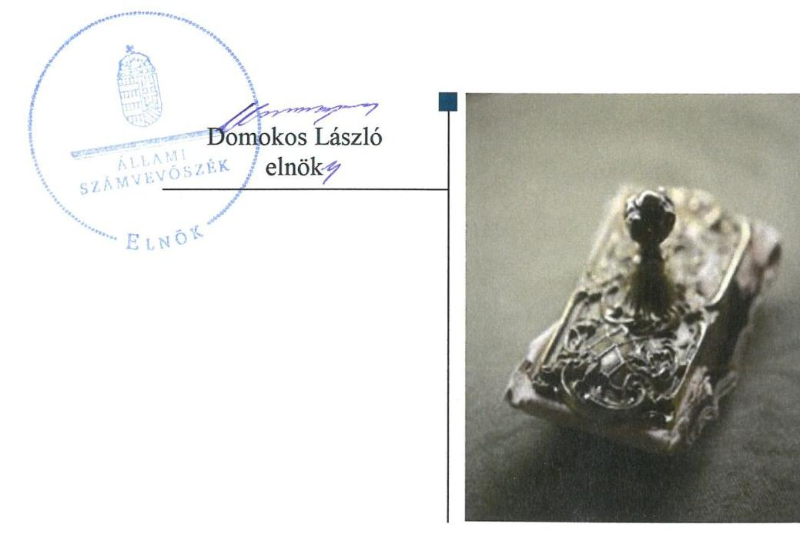
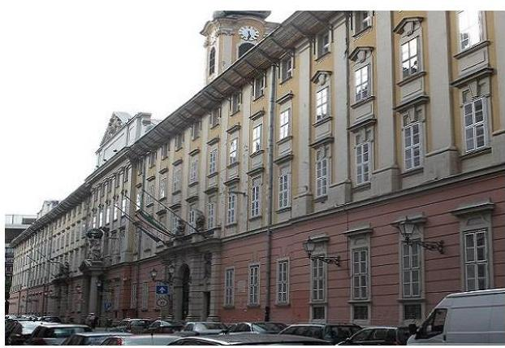

# Jelentés 

## A forrásmegosztás ellenőrzése

A Fővárosi Önkormányzatot és a kerületi önkormányzatokat osztottan megillető bevételek 2019. évi megosztásáról szóló önkormányzati rendelet felülvizsgálata 2020. 04. hó 08. nap

---

|  J | AZ ELLENŐRZÉST FELÜGYELTE:  |
| --- | --- |
|   | KLINGA LÁSZLÓ felügyeleti vezető  |
|   | AZ ELLENŐRZÉST VEZETTE ÉS A VÉGREHAJTÁSÁÉRT FELELŐS:  |
|   | KISTÓTH KRISZTINA ellenőrzésvezető  |
|   | A PROGRAM ÖSSZEÁLLÍTÁSÁÉRT FELELŐS:  |
|   | BERTALAN RUDOLF projektvezető  |
|   | A TÉMÁHOZ KAPCSOLÓDÓ KORÁBBI SZÁMVEVŐSZÉKI JELENTÉS:  |
|   | - címe: A Fővárosi Önkormányzatot és a kerületi önkormányzatokat osztottan megillető bevételek 2018. évi megosztásáról szóló önkormányzati rendelet felülvizsgálata  |
|  J | - sorszáma: 19009  |
|   | IKTATÓSZÁM: EL-2370-001/2020.  |
|   | TÉMASZÁM: 2526  |
|   | ELLENŐRZÉS-AZONOSÍTÓ SZÁM: V0870  |

---

# TARTALOMJEGYZÉK 

■ ÖSSZEGZÉS ..... 5
■ AZ ELLENŐRZÉS CÉLJA ..... 6
■ AZ ELLENŐRZÉS TERÜLETE ..... 7
■ AZ ELLENŐRZÉS HÁTTERE, INDOKOLTSÁGA ..... 8
■ A JELENTÉS LÉNYEGES KÉRDÉSKÖREI ..... 9
■ AZ ELLENŐRZÉS HATÓKÖRE ÉS MÓDSZEREI ..... 10
■ MEGÁLLAPÍTÁSOK ..... 11
■ MELLÉKLETEK ..... 13
I. sz. melléklet: Értelmező szótár ..... 13
■ FÜGGELÉK: ÉSZREVÉTELEK ..... 15
■ RÖVIDÍTÉSEK JEGYZÉKE ..... 17

---

.

---

# ÖSSZEGZÉS 

Budapest Főváros Önkormányzata 2019. évi forrásmegosztása megalapozott, szabályozott és szabályszerű volt. A 2020. évi forrásmegosztás során korrekció érvényesítése nem indokolt.

## Az ellenőrzés társadalmi indokoltsága

Az ellenőrzéssel a törvényalkotás számára tapasztalatok állnak rendelkezésre a forrásmegosztás szabályozásáról, a forrásmegosztási rendelet szabályszerűségéről, következtetés vonható le arra vonatkozóan, hogy indokolt-e jogszabályi módosítás kezdeményezése. Az ellenőrzés az ellenőrzött számára visszajelzést ad a forrásmegosztás végrehajtásának szabályosságáról. A társadalom számára jelzi, hogy a közpénz tervezett megosztása sem maradhat ellenőrizetlenül.

Az ellenőrzés rávilágít arra, hogy a közpénzek felhasználása a jogszabályokban megfogalmazott feltételek mellett, az azokban foglaltaknak megfelelően történt-e, az esetleges eltérések miatt, szükség volt-e korrekció érvényesítésére.

## Főbb megállapítások, következtetések

A Főjegyző Budapest Főváros Főpolgármesteri Hivatalában kialakította a forrásmegosztási rendeletalkotás belső szabályrendszerét. A 2019. évi forrásmegosztási rendelet alkotás során Budapest Főváros Önkormányzata szabályszerűen, a jogszabályban és a belső szabályzatokban rögzített eljárásrend és határidők figyelembevételével járt el. A Budapest Főváros Önkormányzatát és a kerületi önkormányzatokat osztottan megillető (iparűzési és idegenforgalmi adó, késedelmi pótlék és bírság) bevételeket és a fővárosi önkormányzati helyi adóztatással kapcsolatos kiadásokat megalapozottan, a törvényben előírt részesedési arányok érvényesítésével határozták meg. A 2019. év ellenőrzött időszakában a megosztandó bevételek és kiadások pénzügyi elszámolása szabályszerű volt.

A megalapozott és szabályszerű 2019. évi forrásmegosztás következtében a 2020. évi forrásmegosztás során korrekció érvényesítése nem indokolt.

---

# AZ ELLENŐRZÉS CÉLJA 

Az ellenőrzés célja, a Fővárosi Önkormányzatot és a kerületi önkormányzatokat osztottan megillető bevételek 2019. évi forrásmegosztási rendeletben előírt megosztásának, valamint a helyi adóztatással kapcsolatos kiadások megállapítása, elszámolása szabályszerűségének ellenőrzése.

---

# **AZ ELLENŐRZÉS TERÜLETE**

## **A 2019. évi forrásmegosztási rendeletalkotás és annak végrehajtása a Fővárosi Önkormányzatnál**

A Fővárosi Önkormányzatot és a kerületi önkormányzatokat osztottan megillető bevételek körét és a részesedési arányokat a forrásmegosztási tv. határozza meg.

A forrásmegosztási tv. értelmében a 2019. évben a Közgyűlés által kivetett helyi adóból származó bevétel, valamint a kivetett helyi adóhoz kapcsolódóan kiszabott pótlékból és bírságból származó bevételekből a Fővárosi Önkormányzat részesedése 54,0%, míg a kerületi önkormányzatok együttes részesedése 46,0%.

A helyi adókról szóló 1990. évi C. törvény szerint a helyi iparűzési adót a fővárosi önkormányzat, míg a főváros esetében az idegenforgalmi adót a kerületi önkormányzat jogosult bevezetni. A kerületi önkormányzat képviselőtestülete azonban előzetes beleegyezése alapján az idegenforgalmi adó bevezetését átengedheti a fővárosi önkormányzatnak. 2019. évben hét kerületi önkormányzat élt ezzel a lehetőséggel.

A forrásmegosztási tv. szerint a kerületi önkormányzatok a bevételből való részesedés arányában kötelesek hozzájárulni a Fővárosi Önkormányzatnál a beszedéssel – a fővárosi önkormányzati adóhatóság működtetésével – összefüggően felmerült kiadásokhoz.

A 2019. évi forrásmegosztási rendeletben meghatározott bevételi és kiadási tervszámokat az 1. táblázat mutatja be.

1. táblázat

|  A 2019. ÉVI MEGOSZTANDÓ BEVÉTELEK ÉS KIADÁSOK TERVEZETT ÖSSZEGE (E FT) |  |  |   |
| --- | --- | --- | --- |
|  Megosztandó bevétel/kiadás | Megosztandó forrás összege (100%) | Főváros részesedése (54%) | Kerületek részesedése (46%)  |
|  Iparűzési adó | 287 000 000 | 154 980 000 | 132 020 000  |
|  Kerületi önkormányzatok által átengedett idegenforgalmi adó | 13 000 | 7 020 | 5 980  |
|  Kivetett adókhoz kapcsolódó pótlék, bírság | 700 000 | 378 000 | 322 000  |
|  Megosztandó bevételek összesen | 287 713 000 | 155 365 020 | 132 347 980  |
|  Helyi adókhoz kapcsolódó kiadás | 317 716 | 171 567 | 146 149  |

*Forrás: 2019. évi forrásmegosztási rendelet*

---

# AZ ELLENŐRZÉS HÁTTERE, INDOKOLTSÁGA 

A Fővárosi Önkormányzatot és a kerületi önkormányzatokat osztottan megillető bevételek körét, valamint a forrásmegosztás szabályait a fővárosi önkormányzat és a kerületi önkormányzatok közötti forrásmegosztásról szóló 2006. évi CXXXIII. törvény határozza meg. A törvény 6. § (1) bekezdésének előírása alapján a Fővárosi Önkormányzat tárgyévre vonatkozó forrásmegosztási rendeletét az ÁSZ felülvizsgálja. Ha az ÁSZ megállapítja, hogy a Fővárosi Önkormányzat vagy valamely kerületi önkormányzat jogosulatlan forráshoz jutott vagy az őt jogszerűen megillető forrásnál alacsonyabb összegben részesült, ennek mértékével a forrásmegosztási törvény alapján meghatározott, a felülvizsgálat lezárását követő évi forrásmegosztást a fővárosi önkormányzat rendeletében módosítja.

---

# A JELENTÉS LÉNYEGES KÉRDÉSKÖREI 

1. A Fővárosi Önkormányzat 2019. évi forrásmegosztási rendeletalkotási folyamata szabályozott és szabályszerű volt-e?
2. A 2019. évi forrásmegosztás szabályszerű volt-e?

---

# AZ ELLENŐRZÉS HATÓKÖRE ÉS MÓDSZEREI 

## Az ellenőrzés típusa

Szabályszerűségi ellenőrzés

## Az ellenőrzött időszak

2018. szeptember 1-jétől 2019. augusztus 31-ig terjedő időszak (a forrásmegosztási rendelet előkészítésével és végrehajtásával érintett időszak)

## Az ellenőrzés tárgya

A Fővárosi Önkormányzatot és a kerületi önkormányzatokat osztottan megillető bevételek megosztásáról szóló 2019. évi forrásmegosztási rendelet, a helyi adóztatással kapcsolatos kiadások megállapítása, elszámolása

## Az ellenőrzött szervezet

Budapest Főváros Önkormányzata és Budapest Főváros Főpolgármesteri Hivatal

## Az ellenőrzés jogalapja

Az ellenőrzés jogszabályi alapját az ÁSZ tv. 1. § (3) bekezdése és 3. § (1) bekezdése, valamint a forrásmegosztási tv. 6. § (1) bekezdése képezi.

## Az ellenőrzés módszerei

Az ellenőrzés szakmai módszertana az ÁSZ hivatalos honlapján (www.asz.hu) közzétett szakmai szabályokon alapul.

Az ellenőrzési kérdések megválaszolásához szükséges bizonyítékok megszerzése az ellenőrzött által rendelkezésre bocsátott dokumentumok, adatok elemzésével valósul meg, kiegészítve a megfigyelés, szemrevételezés, kérdésfeltevés (információkérés) módszerével.

Az ellenőrzés ideje alatt az ÁSZ az ellenőrzött szervezettel történő kapcsolattartást az ÁSZ Szervezeti és Működési Szabályzatának vonatkozó előírásai alapján biztosítja.

---

# 1. A Fővárosi Önkormányzat 2019. évi forrásmegosztási rendeletalkotási folyamata szabályozott és szabályszerű volt-e? 

Összegző megállapítás

A Fővárosi Önkormányzat a 2019. évi forrásmegosztási rendeletalkotási folyamatát a jogszabályi előírások szerint szabályozta, a forrásmegosztás rendeletalkotási folyamata szabályszerű volt.

Az Áht. és a Bkr. előírásai szerint a Főjegyző gondoskodott a forrásmegosztási rendelet megalkotási folyamatban, a Hivatal érintett szervezeti egységeinek rendeletalkotással kapcsolatos feladat- és hatáskörét meghatározó szabályzatok, ellenőrzési nyomvonalak, munkaköri leírások elkészítéséről.

A Fővárosi Önkormányzat a Htv. szerint rendelkezett azon hét kerületi önkormányzat képviselőtestületének beleegyező nyilatkozatával, amelyek az idegenforgalmi adó bevezetését a 2019. évben a Fővárosi Önkormányzatnak átengedték.

A forrásmegosztás rendeletalkotási folyamata szabályszerű volt, betartották a forrásmegosztási tv.-ben, a Fővárosi Önkormányzat vonatkozó belső szabályzataiban, folyamatleírásaiban és a feladattal érintett dolgozók munkaköri leírásaiban rögzített előírásokat. A forrásmegosztási tv. szerinti tartalommal és határidőben a Fővárosi Önkormányzat megküldte a tárgyévre vonatkozó forrásmegosztási rendeletének tervezetét véleményezésre a kerületi önkormányzatok részére. Biztosította a legalább tizenöt napot a kerületi önkormányzatoknak a véleményezésre és a 2019. évi forrásmegosztási rendeletét határidőben, 2019. január 31-én hatályba léptette és szabályszerűen közzétette.

A rendeletalkotás folyamatában a Bkr.-el összhangban kialakított belső kockázatcsökkentési kontrollokat dokumentáltan alkalmazták.

## 2. A 2019. évi forrásmegosztás szabályszerű volt-e?

## Összegző megállapítás

2.1. számú megállapítás

A 2019. évi forrásmegosztás szabályszerű volt.
A megosztott bevételek tervszámai megalapozottak voltak, a befolyt bevételek pénzügyi elszámolása szabályszerű volt.

A 2019. évi forrásmegosztási rendeletben szereplő kerületi önkormányzatok és a Fővárosi Önkormányzat között megosztandó helyi adó kivetéséből, és a kapcsolódó pótlék és bírság kiszabásából származó bevételi tervszámok megalapozottak voltak. A megosztott bevételek megállapítását számításokkal, elemzésekkel, az adóbevételek 2018. évi időarányos teljesülésének adataival támasztották alá.

---

A Fővárosi Önkormányzatot és a kerületi önkormányzatokat együttesen megillető megosztott bevételekből 54,0%-os arányban a Fővárosi Önkormányzat, 46,0%-ban a huszonhárom kerületi önkormányzat együttesen részesült. Szabályszerűen határozták meg a forrásmegosztási tv. mellékletében szereplő az egyes kerületi önkormányzatokat megillető arányszámok alkalmazásával az iparűzési adóból és valamennyi helyi adóval kapcsolatos pótlék, bírságból a huszonhárom kerületi önkormányzat, továbbá az idegenforgalmi adóból a bevezetését a Fővárosi Önkormányzatnak átengedő hét kerületi önkormányzat részesedését.

A 2019. január 1-től 2019. augusztus 31-ig befolyt megosztandó helyi adóbevételek pénzügyi elszámolása szabályszerű volt. A Fővárosi Önkormányzat a befolyt bevételek kerületi önkormányzatokat megillető összegét a 2019. évi forrásmegosztási rendelet szerinti arányok szerint, határidőn belül átutalta.

# 2.2. számú megállapítás 

## A forrásmegosztásnál figyelembe vett, a Fővárosi Önkormányzati Adóhatóság működtetésével összefüggő, helyi adózással kapcsolatos kiadások megállapítása és elszámolása szabályszerű volt.

A 2019. évi forrásmegosztási rendeletben meghatározott fővárosi és a kerületi önkormányzatokat osztottan terhelő helyi adóztatással kapcsolatos kiadások összege megalapozott volt. A Fővárosi Önkormányzati Adóhatóság működtetésével összefüggésben felmerülő kiadásokat számítások, elemzések, a rendelkezésre álló 2018. évi időarányos teljesülési adatok támasztották alá. A kiadások érvényesítésének felső korlátját a kivetett helyi adóhoz kapcsolódóan kiszabott pótlékból és bírságból származó bevételek legfeljebb 50%-ában érvényesítették, a kiadások megosztása a forrásmegosztási tv-ben szereplő arányszámok szerint történt.

A 2019. évi kiadási előleg, a 2018. évi zárszámadási rendeletben a helyi adók beszedéséhez kapcsolódó kiadások alapján, azok érvényesíthető mértékéig, szabályszerűen került meghatározásra. Ebből a kerületi önkormányzatok felé érvényesíthető összeg 146149 ezer Ft volt. A 2018. évi kiadási előleg (180 292 ezer Ft) és a tényleges adóbeszedési kiadások (146 149 ezer Ft) különbözeteként -34 143 ezer Ft-ot állapítottak meg. A kiadási előleget és a 2018. évi kiadási különbözetet a forrásmegosztási tv. szerinti megosztási arányok és határidő szerint - a 2019. évi forrásmegosztási rendelet előírásainak megfelelően - a 2018. évi zárszámadási rendelet hatályba lépését követő havi utalásban, 2019. június 7-én számolták el a 23 kerületi önkormányzat felé.

Az ÁSZ nem tárt fel a 2019. évi forrásmegosztást érintő eltérést, ezért a 2020. évi
 forrásmegosztás során korrekció érvényesítése nem indokolt.

A 2019. évi forrásmegosztási rendelet felülvizsgálata során az ÁSZ nem tárt fel a forrásmegosztási törvény 6. § (2) bekezdés alapján jogosulatlan, vagy a jogszerűen megillető forrásnál alacsonyabb összegű részesedést, ezért a 2020. évi forrásmegosztási eljárás során korrekció nem indokolt.

---

# MELLÉKLETEK 

- I. SZ. MELLÉKLET: ÉRTELMEZŐ SZÓTÁR

Fővárosi Önkormányzat által kivetett helyi adóhoz kapcsolódóan kiszabott pótlék és bírság
helyi adóztatással kapcsolatos kiadás
idegenforgalmi adó
iparűzési adó
kiadási előleg
részesedés

A fővárost és a kerületeket osztottan illetik meg a fővárosi önkormányzat közgyűlésének rendelete alapján kivetett helyi adóhoz kapcsolódóan kiszabott pótlékból és bírságból származó bevételek. (Forrás: A forrásmegosztási törvény 2. § (2) bekezdése alapján meghatározott fogalom.)
A fővárosi önkormányzati helyi adóztatással kapcsolatos - a tárgyévre vonatkozóan a fővárosi önkormányzatot és a kerületi önkormányzatokat osztottan megillető bevételek (iparűzési adó, hét kerületnél befolyt idegenforgalmi adó, a kivetett helyi adóhoz kapcsolódóan kiszabott pótlék és bírság) beszedésével összefüggően felmerült kiadásokat a forrásmegosztási tv. 2. § (1) bekezdés a) pontja szerinti bevételből részesülők viselik részesedésük arányában. Kiadásként a fővárosi önkormányzatnál a beszedéssel - a fővárosi önkormányzati adóhatóság működtetésével - összefüggően felmerült működtetési kiadásokat kell figyelembe venni. A forrásmegosztási tv. 2. § (1) bekezdés a) pontja és a (4) bekezdés szerint figyelembe vehető kiadásokat a (2) bekezdésben felsorolt bevételek legfeljebb 50\%-áig terjedő mértékben lehet érvényesíteni. (Forrás: A forrásmegosztási törvény 2. § (4), (6) bekezdése alapján meghatározott fogalom.)
A kommunális jellegű adók közül a kerület döntése alapján átengedett helyi idegenforgalmi adóból beszedett bevétel. A helyi idegenforgalmi adót a kerületi önkormányzat helyett a Fővárosi Önkormányzat rendeletével akkor jogosult bevezetni, ha ahhoz minden adóév tekintetében az érintett kerület önkormányzatának képviselőtestülete előzetes beleegyezését adja. A fővárosi önkormányzat által közvetlenül igazgatott terület tekintetében a kerületi önkormányzat által bevezethető adó bevezetésére a fővárosi önkormányzat jogosult. (Forrás: A Htv. 1. §-a és a III. fejezet Kommunális jellegű adók 2. pontja alapján meghatározott fogalom).
A Htv. felhatalmazása alapján a Fővárosi Közgyűlés rendeletével kivetett helyi adónem. A Fővárosi Önkormányzat illetékességi területén vállalkozói tevékenységet (iparűzési tevékenységet) állandó vagy ideiglenes jelleggel végző vállalkozó helyi iparűzési adót köteles fizetni. Adóköteles iparűzési tevékenységnek tekintendő e törvény alapján a vállalkozó e minőségben végzett nyereség-, illetőleg jövedelemszerzésre irányuló tevékenysége.
(Forrás: A Htv. 1. § (2) bekezdése, valamint a 35. § és 36. § alapján meghatározott fogalom.)
A tárgyévet megelőző év költségvetési rendeletének végrehajtásáról szóló Fővárosi Önkormányzati rendeletben elfogadott adóbeszedéssel kapcsolatos kiadásokat kell előlegként figyelembe venni és a levonását a rendelet hatályba lépését követő havi utalásban kell a kerületi önkormányzatok felé érvényesíteni. Az előleg és a tárgyévi tényleges kiadások különbözetét a tárgyévi költségvetési rendelet végrehajtásáról szóló rendelet hatályba lépését követő havi utalásban kell elszámolni.
(Forrás: A forrásmegosztási törvény 2. § (5) bekezdése alapján meghatározott fogalom.)
A forrásmegosztásba bevont bevételekből a Fővárosi Önkormányzatot és a kerületi önkormányzatokat együttesen megillető részesedés arányszáma. A Fővárosi Önkormányzatot és a kerületi önkormányzatokat a forrásmegosztási törvény 3. § alapján osztottan megillető bevételekből a Fővárosi Önkormányzatot 54,0\%, a kerületi önkormányzatokat együttesen 46,0\% részesedés illeti meg.
(Forrás: A forrásmegosztási rendelet 2-3. §-ai alapján meghatározott fogalom.)

---

| részesedési arányok | A kerületi önkormányzatokat megillető források egyes kerületek közötti megosztásának aránya, amelyet a forrásmegosztási törvény 1. melléklete tartalmaz.   (Forrás: A forrásmegosztási törvény 4. § (1) bekezdése alapján meghatározott fogalom.) |
| :--: | :--: |
| tárgyév | Azon gazdasági év, amelyhez tartozó megosztandó bevételeknek a Fővárosi Önkormányzat és a kerületi önkormányzatok közötti megosztását a forrásmegosztási rendelet határozza meg.   (Forrás: A forrásmegosztási törvény 1. §-a alapján meghatározott fogalom.) |

---

# FÜGGELÉK: ÉSZREVÉTELEK 

A jelentéstervezetet a Számvevőszék 15 napos észrevételezésre megküldte az ellenőrzött szervezet vezetőjének az ÁSZ tv. 29. § (1) bekezdése előírásának megfelelően.

Budapest Főváros Önkormányzatának főpolgármestere és Budapest Főváros Önkormányzatának főjegyzője a jelentéstervezet megállapításaira nem tettek észrevételt.

[^0]
[^0]:    * 29. § (1) Az Állami Számvevőszék az ellenőrzési megállapításait megküldi az ellenőrzött szervezet vezetőjének vagy az általa megbízott személynek, és annak, akinek személyes felelősségét állapította meg.
    (2) Az ellenőrzött szervezet vezetője és a felelősként megjelölt személy az ellenőrzés megállapításaira tizenöt napon belül írásban észrevételt tehet.
    (3) Az Állami Számvevőszék az észrevételre a beérkezésétől számított harminc napon belül írásban válaszol. A figyelembe nem vett észrevételeket köteles a jelentésben feltüntetni, és megindokolni, hogy azokat miért nem fogadta el.

---

.

---

# RÖVIDÍTÉSEK JEGYZÉKE 

[^0]Budapest Főváros Önkormányzata
Budapest 23 kerületének önkormányzata
2006. évi CXXXIII. törvény a fővárosi önkormányzat és a kerületi önkormányzatok közötti forrásmegosztásról (hatályos: 2006. december 27-től)
Budapest Főváros Önkormányzata Közgyűlése
3/2019. (I. 29.) Főv. Kgy. rendelet a Fővárosi Önkormányzatot és a kerületi önkormányzatokat osztottan megillető bevételek 2019. évi megosztásáról (hatályos: 2019. január 31-től)
2011. évi CXCV. törvény az államháztartásról (hatályos: 2011. december 31-től) a költségvetési szervek belső kontrollrendszeréről és belső ellenőrzéséről szóló 370/2011. (XII. 31.) Korm. rendelet (hatályos: 2012. január 1-től)
Budapest Főváros Önkormányzata Főjegyzője
Budapest Főváros Főpolgármesteri Hivatal
1990. évi C. törvény a helyi adókról (hatályos: 1991. január 1-től)

Budapest Főváros VII. kerület Erzsébetváros Önkormányzata, Budapest Főváros VIII. kerület Józsefvárosi Önkormányzat, Budapest Főváros IX. kerület Ferencváros Önkormányzata, Budapest Főváros X. kerület Kőbányai Önkormányzat, Budapest Főváros XI. kerület Újbuda Önkormányzata, Budapest XII. kerület Hegyvidék Önkormányzata, Budapest Főváros XIII. kerületi Önkormányzat
20/2019. (V. 30.) Főv. Kgy. rendelet Budapest Főváros Önkormányzata 2018. évi összevont költségvetéséről szóló 7/2018. (III. 5.) Főv. Kgy. rendelet végrehajtásáról (hatályos: 2019. június 1-től)

[^0]:    ${ }^{1}$ Fővárosi Önkormányzat
    ${ }^{2}$ kerületi önkormányzatok
    ${ }^{3}$ forrásmegosztási tv.
    ${ }^{4}$ Közgyűlés
    ${ }^{5}$ 2019. évi forrásmegosztási rendelet
    ${ }^{6}$ Áht.
    ${ }^{7}$ Bkr.
    ${ }^{8}$ Főjegyző
    ${ }^{9}$ Hivatal
    ${ }^{10} \mathrm{Htv}$.
    ${ }^{11}$ hét kerületi önkormányzat
    ${ }^{12}$ 2018. évi zárszámadási rendelet

---

ÁLLAMI SZÁMVEVŐSZÉK
1052 Budapest, Apáczai Csere János utca 10.
Levélcím: 1364 Budapest 4. Pf. 54
Telefon: +36 14849100 Telefax: +36 14849200
www.asz.hu
