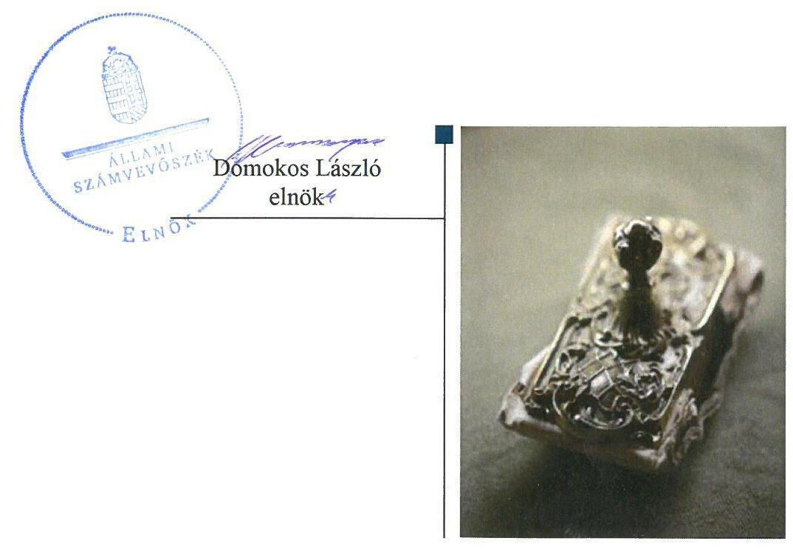
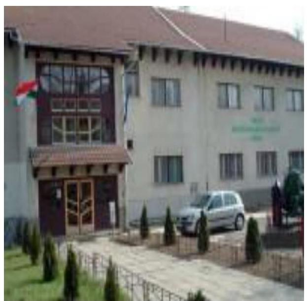

ÁLLAMI
SZÁMVEVŐSZÉK

# Jelentés 

## Központi költségvetési szervek ellenőrzése

Tokaji Mezőgazdasági Szakgimnázium, Szakközépiskola és Kollégium 2020.

---

# Jelentés 

## Központi költségvetési szervek ellenőrzése

Tokaji Mezőgazdasági Szakgimnázium, Szakközépiskola és Kollégium 2020. 01. hó 28. nap

---

# AZ ELLENŐRZÉST FELÜGYELTE:

- KAKAS SÁNDOR felügyeleti vezető
- AZ ELLENŐRZÉST VEZETTE ÉS A VÉGREHAJTÁSÁÉRT FELELŐS:
  - MIHÁLSZKY KÁLMÁN ellenőrzésvezető
  - DR. SIMON JÓZSEF ellenőrzésvezető
- A PROGRAM ÖSSZEÁLLÍTÁSÁÉRT FELELŐS:
  - TÓTPÁL SZABOLCS osztályvezető

**IKTATÓSZÁM:** EL-2371-001/2020

**TÉMASZÁM:** 2450

**ELLENŐRZÉS-AZONOSÍTÓ SZÁM:** V079175

Jelentéseink az Országgyűlés számítógépes hálózatán és az Interneten a www.asz.hu címen is olvashatóak.

---

# TARTALOMJEGYZÉK 

■ ÖSSZEGZÉS ..... 5
■ AZ ELLENŐRZÉS CÉLJA ..... 6
■ AZ ELLENŐRZÉS TERÜLETE ..... 7
■ AZ ELLENŐRZÉS HÁTTERE, INDOKOLTSÁGA ..... 8
■ A JELENTÉS LÉNYEGES KÉRDÉSKÖREI ..... 9
■ AZ ELLENŐRZÉS HATÓKÖRE ÉS MÓDSZEREI ..... 10
■ MEGÁLLAPÍTÁSOK ..... 12
■ JAVASLATOK ..... 15
■ MELLÉKLETEK ..... 17
I. sz. melléklet: Értelmező szótár ..... 17
■ FÜGGELÉK: ÉSZREVÉTELEK ..... 19
■ RÖVIDÍTÉSEK JEGYZÉKE ..... 21

---

.

---

# ÖSSZEGZÉS 

A Tokaji Mezőgazdasági Szakgimnázium, Szakközépiskola és Kollégium belső kontrollrendszere, pénzügyi és vagyongazdálkodása nem biztositotta a közpénzek szabályos felhasználását és a nemzeti vagyonnal való elszámoltatható, átlátható gazdálkodást, nem érvényesült a felelős gazdálkodás. A korrupció elleni védettség nem volt biztositott.

## Az ellenőrzés társadalmi indokoltsága

Magyarország versenyképességének és a magyar gazdaság fejlődésének alapvető feltétele a magyar munkavállalók megfelelő szakmai képzettsége és felkészültsége, amelyben a szakképzési rendszernek döntő szerepe van. A mezőgazdaság vonatkozásában is kiemelten fontos ez, hiszen a magyar mezőgazdaság piaci versenyképességét és eredményességét nagymértékben befolyásolja az agrárszférában dolgozók képzettsége, felkészültsége. A szakképzés legjelentősebb színterei a szakképző iskolák. Az eredményes és célszerű szakképzés alapja és alapvető feltétele a szakképző intézmények közpénzekkel és a közvagyonnal való törvényes, átlátható és a korrupcióval szembeni védelmet biztosító múködése és gazdálkodása. Ezért ezen szervezetekkel szemben is alapvető társadalmi igény, hogy a rájuk bízott közpénzekkel, közvagyonnal szabályosan gazdálkodjanak. Emellett a szakképzésben részt vevő pedagógusok, tanulók és a szülők jogos elvárása, hogy a szakképző iskolák múködése átlátható és elszámoltatható legyen. Mindezen igényekkel összhangban, a közpénzügyek átláthatóságának előmozdítása, a közvagyon védelme érdekében került sor az agrárszakképző iskolák belső kontrollrendszerének és gazdálkodásának ellenőrzésére.

## Főbb megállapítások, következtetések, javaslatok

A Tokaji Mezőgazdasági Szakgimnázium, Szakközépiskola és Kollégium belső kontrollrendszerének kialakítása és múködtetése a 2016. évben nem volt szabályszerű, mert az igazgató nem értékelte a belső kontrollrendszer minőségét.

A Tokaji Mezőgazdasági Szakgimnázium, Szakközépiskola és Kollégium belső kontrollrendszerének kialakítása és múködtetése a 2017. évben nem volt szabályszerű, mert az Intézmény igazgatója a kontrollkörnyezetet nem szabályszerűen alakította ki, az integrált kockázatkezelési rendszert, az információs és kommunikációs rendszert illetve a nyomon-követési rendszert nem múködtette és a kontrolltevékenységeket nem szabályszerűen gyakorolta.

A Tokaji Mezőgazdasági Szakgimnázium, Szakközépiskola és Kollégium pénzügyi gazdálkodása a 2016. évben nem volt szabályszerű, mert az Intézmény nem vezetett nyilvántartást a gazdálkodási jogkörgyakorlókról és azok aláírásmintájáról.

A Tokaji Mezőgazdasági Szakgimnázium, Szakközépiskola és Kollégium vagyongazdálkodása nem volt szabályszerű, mert a költségvetési beszámolójának mérlegtételeit a 2016-2017. években nem támasztotta alá leltárral.

A korrupciós kockázatok kezelését az integritási kontrollok kiépítettsége és múködtetése nem támogatta. A Tokaji Mezőgazdasági Szakgimnázium, Szakközépiskola és Kollégium igazgatója a folyamatok teljesítményének mérésére nem alakított ki követelményeket, ezáltal a teljesítmény mérés feltételei nem voltak biztosítottak.

Az Állami Számvevőszék a jelentésben foglalt megállapítások alapján a Tokaji Mezőgazdasági Szakgimnázium, Szakközépiskola és Kollégium igazgatójának 10 javaslatot fogalmazott meg. A javaslatokat megalapozó megállapításokra az érintettnek 30 napon belül intézkedési tervet kell készítenie.

---

# AZ ELLENŐRZÉS CÉLJA 

AZ ELLENŐRZÉS CÉLJA annak megítélése volt, hogy az ellenőrzött intézményre vonatkozó irányító szervi feladatellátás a jogszabályi előírások betartásával történt-e; az intézménynél a belső kontrollrendszer kialakítása és múködtetése szabályszerű volt-e, biztosította-e az átlátható, szabályszerű, gazdaságos, hatékony és eredményes gazdálkodás feltételeit. Az ellenőrzés keretében az Állami Számvevőszék értékelte az intézmény korrupciós kockázatainak kezelését szolgáló integritás kontrollok kiépítettségét és az integritás szemlélet érvényesülését, a teljesítménymérés feltételeinek kialakítását, illetve, hogy az ellenőrzött megfelel-e annak az Alaptörvényben meghatározott alapvetésnek, hogy Magyarország a kiegyensúlyozott, átlátható és fenntartható költségvetési gazdálkodás elvét érvényesíti. Érvényesült-e a nemzeti vagyon kezelésének és védelmének célja, azaz a szervezet vagyona a közérdeket szolgálta-e a közös szükségletek kielégítése és a természeti erőforrások megóvása, valamint a jövő nemzedékek szükségleteinek figyelembevétele mellett.

---

# **AZ ELLENŐRZÉS TERÜLETE**

## **Tokaji Mezőgazdasági Szakgimnázium, Szakközépiskola és Kollégium**

A Tokaji Mezőgazdasági Szakgimnázium, Szakközépiskola és Kollégium az Nktv.1 alapján létrejött többcélú köznevelési intézmény. Alaptevékenysége a szakgimnáziumi nevelés-oktatás, a felnőtt-oktatás, a Szakképzési Hídprogram keretében folyó nevelés-oktatás, kollégiumi ellátás és a 2016. szeptember 1. napja előtt megkezdett tanulmányok tekintetében a szakközépiskolai nevelés-oktatás. Az Intézmény2 több mint 5 hektáros területen fekszik és a mezőgazdasági képzés mellett vendéglátással kapcsolatos képzést is folytat.

Az Intézményt 2013. augusztus 1-jén alapította a Vidékfejlesztési Minisztérium. A 2014. évtől kezdődően a Földművelésügyi Minisztérium, majd a 2018. évtől az Agrárminisztérium gyakorolta az alapítói, fenntartói és irányítói jogokat.

Az Intézmény vezetőjének3 személye az ellenőrzéssel érintett időszakban nem változott és az Intézménynél szervezeti, szerkezeti átalakításra nem került sor. Az Intézmény gazdálkodási feladatait az irányító szerv4 döntése alapján 2015. szeptember 1-jétől, az irányító szerv irányítása alá tartozó, gazdasági szervezettel rendelkező Vay Ádám Gimnázium, Mezőgazdasági Szakképző Iskola és Kollégium látja el.

---

# AZ ELLENŐRZÉS HÁTTERE, INDOKOLTSÁGA 

Az ÁSZ ${ }^{5}$ a költségvetési szervek gazdálkodását, működését annak érdekében ellenőrzi, hogy megállapításaival támogassa az ellenőrzött szervezetek szabályszerű gazdálkodását, javaslataival elősegítse az Alaptörvényben ${ }^{6}$ megfogalmazott alapvetések érvényesülését a mindennapi életben a szervezetek szintjén. A központi költségvetés rendszerében zajló folyamatok holisztikus elemzései, a kockázatok folyamatos figyelemmel kísérésének módszerével, az így kiválasztott szervezetek célzott, hatékony ellenőrzéseivel az ÁSZ betölti a legfőbb gazdasági ellenőrző szerv küldetését. Az egyes ellenőrzések megállapításaival és egy időszak ellenőrzési eredményeinek elemzésével az ÁSZ ráirányíthatja a jogalkotók figyelmét a központi alrendszerben, vagy annak egy ágazatában esetlegesen felmerülő pénzügyi, szabályozási feszültségekre. Az elvégzett ellenőrzések során az ÁSZ „jó gyakorlatokat" is azonosíthat, melyeket tanácsadó funkciója keretében szélesebb körben is megismertethet az érintettekkel, ezáltal is hozzájárulva a költségvetési rendszer szabályozott, átlátható, kiegyensúlyozott és fenntartható működéséhez.

Az ellenőrzés a szervezet kockázatértékelése alapján, az egyedi és lényeges jellemzők figyelembevételével, az ellenőrzésre kiválasztott modullal történik. Az integritás- és belső kontroll modul a központi költségvetési szerv működésének irányítottságát, korrupció elleni védettségét értékeli.

A belső kontrollrendszer kialakítása és működtetése nélkül nem valósítható meg a közpénzek, a közvagyon átlátható, szabályos, gazdaságos, hatékony és eredményes felhasználása. A belső kontrollrendszer azt a célt szolgálja, hogy a költségvetési szervek működésük és gazdálkodásuk során a tevékenységeket szabályszerűen hajtsák végre, teljesítsék elszámolási kötelezettségeiket és megvédjék az erőforrásokat a veszteségektől, a károktól és a nem rendeltetésszerű használattól. A belső kontrollrendszer magában foglalja mindazon elveket, eljárásokat és belső szabályzatokat, melyek biztosítják, hogy a költségvetési szerv valamennyi tevékenysége és célja összhangban legyen a szabályszerűséggel, szabályozottsággal, valamint a gazdaságosság, hatékonyság és eredményesség követelményeivel, az eszközökkel és forrásokkal való gazdálkodásban ne kerüljön sor pazarlásra, visszaélésre, rendeltetésellenes felhasználásra. Megfelelő, pontos és naprakész információk álljanak rendelkezésre a költségvetési szerv működésével kapcsolatosan, és a belső kontrollrendszer harmonizációjára, öszszehangolására vonatkozó jogszabályok végrehajtásra kerüljenek.

Az integritás kontrollok kiépítése, erősítése a szervezet korrupciós kockázatainak kezelését szolgálja. A teljesítménykövetelmények meghatározása és működtetése megalapozhatja a központi költségvetési szervnél a teljesítményellenőrzés lefolytatását.

---

# A JELENTÉS LÉNYEGES KÉRDÉSKÖREI 

1. Az irányító szerv ellenőrzött költségvetési szervre vonatkozó feladatellátása szabályszerű volt-e?
2. A belső kontrollrendszer kialakítása és müködtetése biztosí-totta-e a közpénzekkel és a nemzeti vagyonnal történő átlátható, szabályszerű gazdálkodást?
3. A költségvetési szerv pénzügyi gazdálkodása szabályszerű volt-e?
4. A költségvetési szerv vagyongazdálkodása szabályszerű volt-e?
5. A központi költségvetési szervnél alakítottak-e ki a teljesítmény mérésére alkalmas követelményeket?

---

# AZ ELLENŐRZÉS HATÓKÖRE ÉS MÓDSZEREI 

## Az ellenőrzés típusa

Megfelelőségi ellenőrzés.

## Az ellenőrzött időszak

Az Intézmény vagyongazdálkodása, integritás és belső kontrollrendszerének értékelése tekintetében a 2016-2017. évek.

Az irányító szervi feladatellátás és az Intézmény pénzügyi gazdálkodása tekintetében a 2016. év.

## Az ellenőrzés tárgya

Az Intézmény belső kontrollrendszerének kialakítása és működtetése, pénzügyi és vagyongazdálkodása, az integritáskontrollok kiépítettsége, az integritás szemlélet érvényesülése, a teljesítményértékelés feltételeinek fennállása, valamint az irányító szervi feladatellátás.

## Az ellenőrzött szervezet

- Tokaji Mezőgazdasági Szakgimnázium, Szakközépiskola és Kollégium
- Agrárminisztérium, mint irányító szerv
- Vay Ádám Gimnázium, Mezőgazdasági Szakképző Iskola és Kollégium, mint gazdálkodási feladatokat ellátó szervezet

## Az ellenőrzés jogalapja

Az ellenőrzés jogszabályi alapját az ÁSZ tv. ${ }^{7}$ 1. § (3) bekezdés, 5. § (2)-(3) bekezdései, 5. § (4) bekezdés a) pontja, valamint az Áht. ${ }^{8}$ 61. § (2) bekezdésének előírásai képezték.

## Az ellenőrzés módszerei

Az ellenőrzésre a szakmai program szempontjai, az ellenőrzött időszakban hatályos jogszabályok, az ellenőrzés szakmai szabályai és a jelen ellenőrzésre irányadó ÁSZ módszertanok figyelembevételével került sor.

Az ÁSZ az ellenőrzés ideje alatt az ellenőrzött szervezetekkel a kapcsolattartást az ÁSZ SZMSZ ${ }^{\circledR}$-ének vonatkozó előírásai alapján biztosította.

---

Az ellenőrzési kérdések megválaszolásához szükséges bizonyítékok megszerzése az ellenőrzött szervezetek által rendelkezésre bocsátott dokumentumokra, adatokra alapozva megfigyelés, szemle (szemrevételezés), kérdésfeltevés (információkérés), mintavételezés, valamint elemző eljárás útján történt.

Az ellenőrzési bizonyítékként felhasználható adatforrások közé tartoztak egyrészt a szakmai program részletes szempontjainál felsorolt adatforrások, másrészt minden egyéb - az ellenőrzés folyamán feltárt, az ellenőrzés szempontjából információt tartalmazó - dokumentum.

Az ellenőrzés lefolytatásához az ellenőrzött szervezetek a tanúsítványok kitöltésével, valamint az ÁSZ által kért dokumentumok megküldésével szolgáltattak adatokat, amelyek valódiságát és teljes körűségét az ellenőrzött szervezet vezetője által tett teljességi és hitelességi nyilatkozat igazolta. Az így rendelkezésre bocsátott adatok, információk kontrollja az ellenőrzés keretében történt.

Az Intézmény belső kontrollrendszere egyes pilléreinek kialakítására és működtetésére vonatkozó értékelés a következő volt:
$\longrightarrow$ „szabályszerű", amennyiben az értékelt területen az elért „igen" válaszok százalékban kifejezett, egész számra kerekített aránya legalább $85 \%$ volt,
$\longrightarrow$ „nem szabályszerű", ha nem érte el a 85\%-ot.
A központi költségvetési szerv belső kontrollrendszerének összesített értékelése az egyes részterületek esetében kapott megfelelőségi arányok számtani átlaga alapján történt és megegyezett a pillérenként (kontrollterületenként) alkalmazott százalékos értékelésekkel, a következő eltérésekkel: a kontrollrendszer egésze esetében a „szabályszerű" értékelésnek a százalékos értéken felül további feltétele volt, hogy egyik kontrollterület sem kaphat „nem szabályszerű" értékelést.

---

# 1. Az irányító szerv ellenőrzött költségvetési szervre vonatkozó feladatellátása szabályszerű volt-e? 

## Összegző megállapítás Az irányító szervi feladatellátás szabályszerű volt.

Az Irányító szerv az Ávr. ${ }^{10}$ előírásai szerint a tervezett bevételek megállapításához meghatározta a tervezési követelményeket, valamint az Áht. és az Áhsz. ${ }^{11}$ előírásaival összhangban jóváhagyta az Intézmény elemi költségvetését.

Az irányító szerv az Áht.-ben foglalt hatáskörét gyakorolva beszámoltatta az Intézmény vezetőjét az éves szakmai feladatellátásról, valamint az éves gazdálkodásról.

## 2. A belső kontrollrendszer kialakítása és múködtetése biztosí-totta-e a közpénzekkel és a nemzeti vagyonnal történő átlátható, szabályszerű gazdálkodást?

## Összegző megállapítás

Az Intézmény belső kontrollrendszerének kialakítása és működtetése a 2016.-2017. évben nem volt szabályszerű.

A 2016. évben a belső kontrollrendszer kialakítása és működtetése nem volt szabályszerű, mivel az Intézmény vezetője 2016. évre vonatkozóan nyilatkozatban nem értékelte a költségvetési szerv belső kontrollrendszerének minőségét, ezáltal nem tett eleget a Bkr. ${ }^{12}$ 11. § (1) bekezdésében foglaltaknak.

A 2017. évben a belső kontrollrendszer kialakítása és működtetése nem volt szabályszerű.

Az Intézmény a 2017. évben nem szabályszerű kontrollkörnyezetben múködött, mivel
— Az Ávr. 13. § (2) bekezdés a) pontjával foglaltak ellenére az Intézmény vezetője belső szabályzatban nem rendezte a gazdálkodással kapcsolatos belső előírásokat, feltételeket, a kötelezettségvállalás és a teljesítésigazolás gyakorlásának módját, az ezeket végző személyek kijelölésének rendjét.
— Az Intézmény nem vezetett nyilvántartást a gazdálkodási jogkörgyakorlókról és azok aláírás-mintájáról az Ávr. 60. § (3) bekezdésében foglaltak ellenére.
— Az Intézmény a 2017. évben a Bkr. 6. § (3) bekezdésében foglaltak ellenére nem rendelkezett hatályos ellenőrzési nyomvonallal.

---

Az Intézmény a Számv. tv. ${ }^{13}$-ben előírtak szerint rendelkezett számviteli politikával, és az annak keretében elkészítendő eszközök és források leltárkészítési és leltározási, illetve értékelési szabályzatával, valamint pénzkezelési szabályzattal.

# AZ INTEGRÁLT KOCKÁZATKEZELÉSI RENDSZER 

működtetéséről az Intézmény vezetője a 2017. évben a Bkr. 7. § (1) bekezdése ellenére nem gondoskodott. A Bkr. 7. § (2) bekezdése ellenére nem gondoskodott az Intézmény tevékenységében rejlő és szervezeti célokkal összefüggő kockázatok felméréséről, valamint nem határozta meg az egyes kockázatokkal kapcsolatban szükséges intézkedéseket, valamint azok teljesítésének folyamatos nyomon követésének módját.

A KONTROLLTEVÉKENYSÉGEK GYAKORLÁSA a 2017. évben nem volt szabályszerű az Intézménynél, mivel nem vezetett nyilvántartást a gazdálkodási jogkörgyakorlókról és azok aláírás-mintájáról az Ávr. 60. § (3) bekezdésében foglaltak ellenére.

## AZ INTÉZMÉNY INFORMÁCIÓS ÉS KOMMUNIKÁ-

CIÓS rendszerét az Intézmény vezetője a 2017. évben a Bkr. 3 § d) pontjában foglaltak ellenére nem alakította ki, mivel nem szabályozta a közérdekű adatok megismerésére irányuló kérelmek intézésének rendjét az Ávr. 13. § (2) bekezdésének h) pontjában előírt rendelkezés ellenére.

Az Intézmény 2017. évben nem tett eleget a jogszabályokban előírt adatszolgáltatási kötelezettségének, mivel az Áht. 108. § (1) bekezdése a) pontjában foglalt rendelkezés ellenére nem teljesítette az elemi költségvetésre vonatkozó adatszolgáltatási kötelezettségét.

## AZ INTÉZMÉNY NYOMONKÖVETÉSI RENDSZERÉT az Intézmény vezetője a 2017. évben nem működtette, mivel a Bkr. 10. § előírása ellenére nem gondoskodott az operatív tevékenységek keretében megvalósuló folyamatos és eseti nyomon követésről.

Az Intézmény vezetője az Áht. 70. § (1) bekezdésében előírtak ellenére nem gondoskodott az Intézményre vonatkozó belső ellenőrzés Bkr. 15. § (4) bekezdésében előírtak szerinti működtetéséről a 2017. évben.

AZ INTEGRITÁS KONTROLLOK kiépítettségi szintje az Intézménynél nem támogatta a korrupciós kockázatok kezelését. Az Intézmény nem végzett kockázatelemzéseket.

Az Intézmény vezetője a 2017. évre a Bkr. 11. § (1) bekezdésében szereplő rendelkezés alapján nyilatkozatban értékelte az Intézmény belső kontrollrendszerének minőségét, azonban a vezetői nyilatkozat tartalmát az ÁSZ jelen ellenőrzésének megállapításai nem igazolták.

---

# 3. A költségvetési szerv pénzügyi gazdálkodása szabályszerű volt-e? 

## Összegző megállapítás

Az Intézmény pénzügyi gazdálkodása a 2016. évben nem volt szabályszerű.

Az Intézménynél a 2016. évben a pénzügyi gazdálkodás nem volt szabályszerű, mert:
— Az Intézmény nem vezetett nyilvántartást a gazdálkodási jogkörgyakorlókról és azok aláírás-mintájáról az Ávr. 60. § (3) bekezdésében foglaltak ellenére.
— Az Áhsz. 39. § (3) bekezdésben előírtak ellenére az Intézmény nem rendelkezett az Áhsz. 14. melléklet II. 4. pontban meghatározott tartalom szerinti kötelezettségvállalásokról és más fizetési kötelezettségekről vezetett nyilvántartással.

## 4. A költségvetési szerv vagyongazdálkodása szabályszerű volt-e?

## Összegző megállapítás

Az Intézmény vagyongazdálkodása a 2016. és a 2017. évben nem volt szabályszerű.

Az Áhsz. 5. § (1) bekezdésében, 22. § (1)-(2) bekezdéseiben, valamint a Számv. tv. 69. § (1) bekezdésében előírtak ellenére az Intézmény a mérlegtételeit a 2016.-2017. évekre vonatkozóan leltárral nem támasztotta alá.

## 5. A központi költségvetési szervnél alakítottak-e ki a teljesítmény mérésére alkalmas követelményeket?

## Összegző megállapítás

Az Intézmény vezetője nem alakította ki a teljesítmény mérésére alkalmas követelményeket.

Az Intézmény vezetője nem alakította ki a teljesítmény mérésére alkalmas követelményeket, amelyek biztosították volna a rendelkezésre álló források gazdaságos, hatékony és eredményes felhasználását.

---

# JAVASLATOK 

Az ÁSZ tv. 33. § (1) bekezdésében foglaltak értelmében az ellenőrzött szervezet vezetője köteles a jelentésben foglalt megállapításokhoz kapcsolódó intézkedési tervet összeállítani és azt a jelentés kézhezvételétől számított 30 napon belül az ÁSZ részére megküldeni. Amennyiben az ellenőrzött szervezet vezetője nem küldi meg határidőben az intézkedési tervet, vagy továbbra sem elfogadható intézkedési tervet küld, az Állami Számvevőszék elnöke az ÁSZ tv. 33. § (3) bekezdése a) és b) pontjaiban foglaltakat érvényesítheti.

## Tokaji Mezögazdasági Szakgimnázium, Szakközépiskola és Kollégium igazgatójának

1. Rendezve belső szabályzatban a gazdálkodással kapcsolatos belső előírásokat, feltételeket, a kötelezettségvállalás és a teljesítésigazolás gyakorlásának módját, az ezeket végző személyek kijelölésének rendjét a jogszabályi előírás szerint.
(2. megállapítás 3. bekezdés 1. francia bekezdése alapján)
2. Gondoskodjon a kötelezettségvállalásra, pénzügyi ellenjegyzésre, teljesités igazolására, érvényesitésre, utalványozásra jogosult személyekről és aláírás-mintájukról naprakész nyilvántartás vezetéséről.
(2. megállapítás 3. bekezdés 2. francia bekezdése alapján)
3. Gondoskodjon az Intézmény ellenőrzési nyomvonalának elkészitéséről a jogszabályi előírás szerint.
(2. megállapítás 3. bekezdés 3. francia bekezdése alapján)
4. Gondoskodjon az integrált kockázatkezelési rendszer müködtetéséről a jogszabályi előírás szerint.
(2. megállapítás 5. bekezdése alapján)
5. Gondoskodjon a közérdekü adatok megismerésére irányuló kérelmek teljesitésének rendje szabályozásáról a jogszabályi előírás szerint.
(2. megállapítás 7. bekezdése alapján)

---

6. Gondoskodjon a jogszabályi előirás szerinti adatszolgáltatási kötelezettségének teljesitéséről.
(2. megállapítás 8. bekezdése alapján)
7. Gondoskodjon az operatív tevékenységek keretében megvalósuló folyamatos és eseti nyomon követésről a jogszabályi előirás szerint.
(2. megállapítás 9. bekezdése alapján)
8. Gondoskodjon a belső ellenőrzés müködtetéséről a jogszabályi előirás szerint.
(2. megállapítás 10. bekezdése alapján)
9. Intézkedjen a kötelezettségvállalások és más fizetési kötelezettségek részletező nyilvántartásának jogszabályi előírásoknak megfelelő vezetéséről.
(3. megállapítás 1. bekezdés 2. francia bekezdése alapján)
10. Intézkedjen a jogszabályi előírásoknak megfelelően a mérleg tételeit alátámasztó leltár elkészitéséről, amely tételesen, ellenőrizhető módon tartalmazza a mérleg fordulónapján meglévő eszközöket és forrásokat mennyiségben és értékben.
(4. megállapítás 1. bekezdése alapján)

---

# MELLÉKLETEK 

- I. SZ. MELLÉKLET: ÉRTELMEZŐ SZÓTÁR
állami vagyon
állami vagyonnak minősül:
a) az állam tulajdonában lévő dolog, valamint a dolog módjára hasznosítható természeti erő,
b) az a) pont hatálya alá nem tartozó mindazon vagyon, amely vonatkozásában törvény az állam kizárólagos tulajdonjogát nevesíti,
c) az állam tulajdonában lévő tagsági jogviszonyt megtestesítő értékpapír, illetve az államot megillető egyéb társasági részesedés,
d) az államot megillető olyan immateriális, vagyoni értékkel rendelkező jogosultság, amelyet jogszabály vagyoni értékű jogként nevesít. (Forrás: Vtv. ${ }^{14}$ 1. § (2) bekezdése)
állami vagyon kezelője /vagyonkezelő
ázalakítás
belső ellenőrzés
belső kontrollrendszer
belső kontrollrendszer területei
ellenőrzési nyomvonal
információs és kommunikációs rendszer
integritás

Az állami vagyont az MNV Zrt. maga kezeli, vagy szerződés - így különösen bérlet, haszonbérlet, megbízás - alapján központi költségvetési szervnek, természetes vagy jogi személynek, vagy jogi személyiséggel nem rendelkező gazdálkodó szervezetnek hasznosításra átengedi." Az állami vagyonra vonatkozóan az MNV Zrt. kizárólag az Nvtv.-ben meghatározott személyekkel köthet vagyonkezelési szerződést. (Forrás: Vtv. 27. § (1) bekezdése, hatályos 2012. január 1-jétől)
A költségvetési szerv általános jogutódlással történő megszüntetése átalakítással történhet. Az átalakítás lehet egyesítés vagy különválás. Az egyesítés lehet beolvadás vagy összeolvadás. (2015. január 1-jétől Áht. 11. § (2) bekezdés)
Független, tárgyilagos bizonyosságot adó és tanácsadó tevékenység, amelynek célja, hogy az ellenőrzött szervezet múködését fejlessze és eredményességét növelje, az ellenőrzött szervezet céljai elérése érdekében rendszerszemléletű megközelítéssel és módszeresen értékeli, illetve fejleszti az ellenőrzött szervezet irányítási és belső kontrollrendszerének hatékonyságát. (Forrás: Bkr. 2. § b) pontja)
A belső kontrollrendszer a kockázatok kezelése és tárgyilagos bizonyosság megszerzése érdekében kialakított folyamatrendszer, amely azt a célt szolgálja, hogy a müködés és gazdálkodás során a tevékenységeket szabályszerűen, gazdaságosan, hatékonyan, eredményesen hajtsák végre, az elszámolási kötelezettségeket teljesítsék, megvédjék az erőforrásokat a veszteségektől, károktól és nem rendeltetésszerű használattól. (Forrás: Áht. 69. § (1) bekezdése)
A kontrollkörnyezet, az integrált kockázatkezelési rendszer, a kontrolltevékenységek, az információs és kommunikációs rendszer, valamint a nyomon követési (monitoring) rendszer. (Forrás: Bkr. 3. §-a)
Az ellenőrzési nyomvonal a költségvetési szerv működési folyamatainak szöveges, táblázatokkal vagy folyamatábrákkal szemléltetett leírása, amely tartalmazza különösen a felelősségi és információs szinteket és kapcsolatokat, irányítási és ellenőrzési folyamatokat, lehetővé téve azok nyomon követését és utólagos ellenőrzését. (Forrás: Bkr. 6. § (3) bekezdés)
A költségvetési szerv vezetője által kialakított és múködtetett olyan rendszer, mely biztosítja, hogy a megfelelő információk a megfelelő időben eljutnak az illetékes szervezethez, szervezeti egységhez, illetve személyhez. (Forrás: Bkr. 9. § (1) bekezdés)
Az integritás - egyik gyakran használt jelentése szerint - az elvek, értékek, cselekvések, módszerek, intézkedések konzisztenciáját jelenti, vagyis olyan magatartásmódot, amely meghatározott értékeknek megfelel. Integritás-irányítási rendszer bevezetése a szervezetben a szervezethez rendelt közfeladatok integritás szempontú ellátását, az

---

integrált kockázatkezelési rendszer
irányító szerv/felügyeleti szerv
kockázat
kockázatkezelési rendszer
kontrollkörnyezet
kontrolltevékenységek
nyomon követési rendszer (monitoring)
vagyongazdálkodás
érték alapú múködéssel (integritással) összefüggő szervezeti követelmények következetes érvényesítését jelenti. (Forrás: Nemzetgazdasági Minisztérium: Államháztartási Belső Kontroll Standardok és Gyakorlati Útmutató 1.6. Etikai értékek és integritás 46. oldal, 2017. szeptember)
Olyan folyamatalapú kockázatkezelési rendszer, amely a szervezet minden tevékenységére kiterjed, egységes módszertan és eljárások alkalmazásával, a szervezet célkitűzéseinek és értékeinek figyelembevételével biztosítja a szervezet kockázatainak teljes körű azonosítását, azok meghatározott kritériumok szerinti értékelését, valamint a kockázatok kezelésére vonatkozó intézkedési terv elkészítését és az abban foglaltak nyomon követését. (Forrás: Bkr. 2. § m) pontja, 2016. október 1-jétől)
A költségvetési szerv tekintetében az Áht.-ban meghatározott irányítási hatáskört gyakorló szerv. (Forrás: Áht. 1. § 9. pontja)
A kockázat annak a valószínűségét jelenti, hogy egy vagy több esemény vagy intézkedés nem kívánt módon befolyásolja a rendszer múködését, céljainak megvalósulását. (Forrás: Javaslatok a korrupciós kockázatok kezelésére - Kockázatkezelési és ellenőrzési módszertan 35. oldal, ÁSZ)
Olyan irányítási eszközök és módszerek összessége, melynek elemei a szervezeti célok elérését veszélyeztető tényezők (kockázatok) azonosítása, elemzése, csoportosítása, nyomon követése, valamint szükség esetén a kockázati kitettség mérséklése.(Forrás: Bkr. 2. § m) pontja, 2016. szeptember 30-ig)
A költségvetési szerv vezetője által kialakított olyan elvek, eljárások, belső szabályzatok összessége, amelyben világos a szervezeti struktúra, a folyamatok átláthatók, egyértelmúek a felelősségi, hatásköri viszonyok és feladatok, meghatározottak, ismertek és elfogadottak az etikai elvárások a szervezet minden szintjén, átlátható a humán-erőforrás-kezelés. (Forrás: Bkr. 6. § (1) bekezdés)
A költségvetési szerv vezetője által a szervezeten belül kialakított (kontroll) tevékenységek, melyek biztosítják a kockázatok kezelését, hozzájárulnak a szervezet céljainak eléréséhez és erősítik a szervezet integritását. (Forrás: Bkr. 8. § (1) bekezdés)
A költségvetési szerv vezetője köteles kialakítani a szervezet tevékenységének a célok megvalósításának nyomon követését biztosító rendszert, amely az operatív tevékenységek keretében megvalósuló folyamatos és eseti nyomon követésből, valamint az operatív tevékenységektől függetlenül múködő belső ellenőrzésből áll. 2016. október 1-jétől: A költségvetési szerv vezetője köteles kialakítani a szervezet tevékenységének, a célok megvalósításának nyomon követését biztosító rendszert, mely az operatív tevékenységek keretében megvalósuló folyamatos és eseti nyomon követésből, valamint az operatív tevékenységektől függetlenül múködő belső ellenőrzésből állhat. (Forrás: Bkr. 10. §)
A nemzeti vagyongazdálkodás feladata a nemzeti vagyon rendeltetésének megfelelő, az állam, az önkormányzat mindenkori teherbíró képességéhez igazodó, elsődlegesen a közfeladatok ellátásához és a mindenkori társadalmi szükségletek kielégítéséhez szükséges, egységes elveken alapuló, átlátható, hatékony és költségtakarékos múködtetése, értékének megőrzése, állagának védelme, értéknövelő használata, hasznosítása, gyarapítása, továbbá az állam vagy a helyi önkormányzat feladatának ellátása szempontjából feleslegessé váló vagyontárgyak elidegenítése. (Forrás: Nvtv. 7. § (2) bekezdése)

---

# FÜGGELÉK: ÉSZREVÉTELEK 

A jelentéstervezetet a Számvevőszék 15 napos észrevételezésre megküldte az ellenőrzött szervezetek vezetőinek az ÁSZ tv. 29. §* (1) bekezdése előírásának megfelelően.

A Tokaji Mezőgazdasági Szakgimnázium, Szakközépiskola és Kollégium igazgatója, a gazdálkodási feladatokat ellátó Vay Ádám Gimnázium, Mezőgazdasági Szakképző Iskola és Kollégium igazgatója, valamint az Agrárminisztériumot vezető miniszter a jelentéstervezet megállapításaira nem tettek észrevételt.

[^0]
[^0]:    * 29. § (1) Az Állami Számvevőszék az ellenőrzési megállapításait megküldi az ellenőrzött szervezet vezetőjének vagy az általa megbízott személynek, és annak, akinek személyes felelősségét állapította meg.
    (2) Az ellenőrzött szervezet vezetője és a felelősként megjelölt személy az ellenőrzés megállapításaira tizenöt napon belül írásban észrevételt tehet.
    (3) Az Állami Számvevőszék az észrevételre a beérkezésétől számított harminc napon belül írásban válaszol. A figyelembe nem vett észrevételeket köteles a jelentésben feltüntetni, és megindokolni, hogy azokat miért nem fogadta el.

---

.

---

# RÖVIDÍTÉSEK JEGYZÉKE 

${ }^{1}$ Nktv.
${ }^{2}$ Intézmény
${ }^{3}$ Intézmény vezetője
${ }^{4}$ Irányító szerv
${ }^{5}$ ÁSZ
${ }^{6}$ Alaptörvény
${ }^{7}$ ÁSZ tv.
${ }^{8}$ Áht.
${ }^{9}$ ÁSZ SZMSZ
${ }^{10}$ Ávr.
${ }^{11}$ Áhsz.
${ }^{12}$ Bkr.
${ }^{13}$ Számv. tv.
${ }^{14} \mathrm{Vtv}$.
2011. évi CXC. törvény - a nemzeti köznevelésről (hatályos 2011. december 29-től) Tokaji Mezőgazdasági Szakgimnázium, Szakközépiskola és Kollégium Tokaji Mezőgazdasági Szakgimnázium, Szakközépiskola és Kollégium Igazgatója Agrárminisztérium
Állami Számvevőszék
Magyarország Alaptörvénye (hatályos 2011. április 25-től)
2011. évi LXVI. törvény az Állami Számvevőszékről (hatályos 2011. július 1-jétől)

Az államháztartásról szóló 2011. évi CXCV. törvény (hatályos 2011. december 31-től)
Állami Számvevőszék Szervezeti és Müködési Szabályzata
368/2011. (XII.31.) Korm. rendelet az államháztartásról szóló törvény végrehajtásáról (hatályos 2012. január 1-től)
az államháztartás számviteléről szóló 4/2013. (I. 11.) Korm. rendelet (hatályos 2014. január 1-jétől)

370/2011. (XII. 31.) Korm. rendelet a költségvetési szervek belső kontrollrendszeréről és belső ellenőrzésről (hatályos 2012. január 1-jétől)
2000. évi C. törvény a számvitelről (hatályos 2001. január 1-jétől)
2007. évi CVI. törvény az állami vagyonról (hatályos 2007. szeptember 25-től)

---

# ÁLLAMI SZÁMVEVŐSZÉK 

1052 Budapest, Apáczai Csere János utca 10.
Levélcím: 1364 Budapest 4. Pf. 54
Telefon: +36 14849100 Telefax: +36 14849200
www.asz.hu