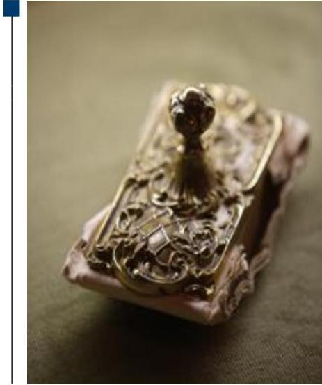
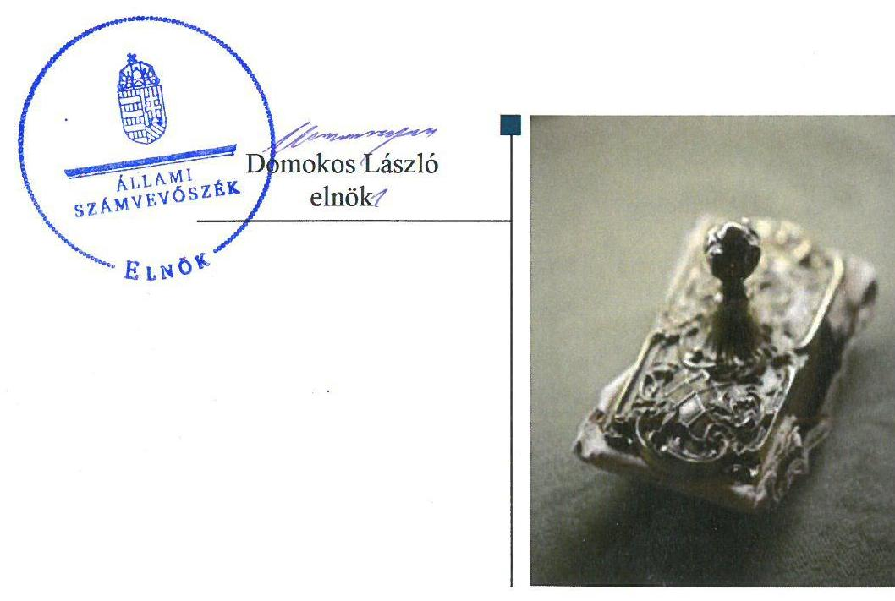
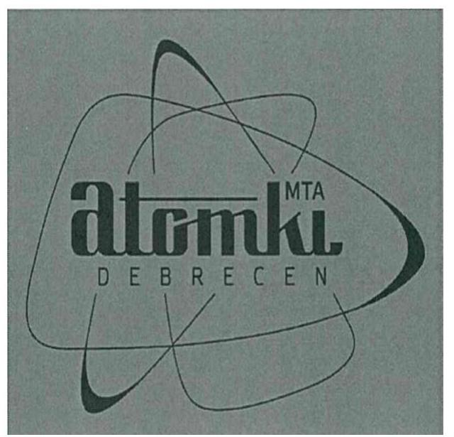

ÁLLAMI
SZÁMVEVŐSZÉK

# Jelentés

## Az államháztartás központi alrendszere fejezeteinek ellenőrzése

A Magyar Tudományos Akadémia kutatóközpontjai és kutatóintézetei vagyongazdálkodásának ellenőrzése – MTA Atommagkutató Intézet 2020.

20013 www.asz.hu

---

# Jelentés

## Jelentés

## Az államháztartás központi alrendszere fejezeteinek ellenőrzése

A Magyar Tudományos Akadémia kutatóközpontjai és kutatóintézetei vagyongazdálkodásának ellenőrzése MTA Atommagkutató Intézet
2020. 01. hó 16. nap

---

# AZ ELLENŐRZÉST FELÜGYELTE:

DR. NAGY IMRE felügyeleti vezető

# AZ ELLENŐRZÉST VEZETTE ÉS A VÉGREHAJTÁSÁÉRT FELELŐS:

RÁCZKEVI KATALIN ellenőrzésvezető

# A PROGRAM ÖSSZEÁLLÍTÁSÁÉRT FELELŐS:

SZALAY NAGY JÁNOS projektvezető

IKTATÓSZÁM: EL-2407-001/2020.

TÉMASZÁM: 2517

# ELLENŐRZÉS-AZONOSÍTÓ SZÁM: V086102

Jelentéseink az Országgyűlés számítógépes hálózatán és az Interneten a www.asz.hu címen is olvashatóak.

---

# TARTALOMJEGYZÉK 

■ ÖSSZEGZÉS ..... 5
■ AZ ELLENŐRZÉS CÉLJA ..... 6
■ AZ ELLENŐRZÉS TERÜLETE ..... 7
■ AZ ELLENŐRZÉS HÁTTERE, INDOKOLTSÁGA ..... 8
■ A JELENTÉS LÉNYEGES KÉRDÉSKÖREI ..... 9
■ AZ ELLENŐRZÉS HATÓKÖRE ÉS MÓDSZEREI ..... 10
■ MEGÁLLAPÍTÁSOK ..... 12
■ MELLÉKLETEK ..... 13
I. sz. melléklet: Értelmező szótár ..... 13
■ FÜGGELÉK: ÉSZREVÉTELEK ..... 15
■ RÖVIDÍTÉSEK JEGYZÉKE ..... 17

---

.

---

# ÖSSZEGZÉS 

A Magyar Tudományos Akadémia Atommagkutató Intézete a vagyongazdálkodás feltételeit szabályozta, 2016-2018. évi vagyongazdálkodásában a vagyon megőrzése szempontjából kockázat nem merült fel.

## Az ellenőrzés társadalmi indokoltsága

Magyarország versenyképességének és a magyar gazdaság fejlődésének meghatározó tényezője a kutatás-fejlesztésre és az innovációra fordított hazai és uniós források eredményes, hatékony felhasználása. A magyar kutatás-fejlesztés területén kiemelt szerepet játszanak a központi költségvetésből biztosított támogatás felhasználásával működtetett, 2019. augusztus 31-ig a Magyar Tudományos Akadémia által irányított kutatóintézetek, kutatóközpontok. Az Atommagkutató Intézet az atomfizika, az atommagfizika és a részecskefizika területén végzett kutatásokat.

A kutatás-fejlesztési közfeladat eredményes ellátásának feltétele, hogy az ehhez szükséges eszközök a kutatási tevékenységet ténylegesen végző intézeteknél, központoknál rendelkezésre álljanak, továbbá ezekkel a közfeladatuk érdekében, átlátható és elszámoltatható módon, a vagyon megőrzését biztosítva gazdálkodjanak.

Az ellenőrzés indokoltságát erősítette, hogy jogszabályi változás nyomán 2019. szeptember 1-től a kutatóintézetek és kutatóközpontok irányítása az Eötvös Loránd Kutatási Hálózat Titkárságához került át, a kutatóintézetek és kutatóközpontok ezt követően központi költségvetési szervként működnek tovább. A magyar kutatás-fejlesztés szempontjából kiemelten fontos, hogy az új szervezeti keretek között induló kutatóhálózat életképessége, a közfeladatot szolgáló vagyon megőrzése biztosított legyen.

Az Állami Számvevőszék az ellenőrzési megállapításokon keresztül hozzájárul a közvagyon védelméhez és rámutat a közfeladatot ellátó kutatóhálózat működőképességére is kiható vagyongazdálkodás kockázataira.

## Főbb megállapítások, következtetések, javaslatok

A Magyar Tudományos Akadémia Atommagkutató Intézet a vagyongazdálkodás alapvető kereteit a szervezeti és működési szabályzattal, számviteli szabályzatokkal, valamint a gazdálkodás rendjét meghatározó szabályzatokkal az előírásoknak megfelelően kialakította.

A Kutatóintézet a 2016-2018. évi beszámolója mérleg tételeit az előírásoknak megfelelően leltárral alátámasztotta. Az eszközök mennyiségi felvétellel történő leltározását valamint a főkönyvi könyvelés és az analitikus nyilvántartások közötti egyeztetéseket a jogszabályi előírásoknak megfelelően elvégezték. A közfeladat ellátását biztosító vagyon megőrzéséről gondoskodtak.

---

# AZ ELLENŐRZÉS CÉLJA 

AZ ELLENŐRZÉS CÉLJA annak megállapítása, hogy az MTA kutatóközpontok és kutatóintézetek vagyongazdálkodása során érvényesült-e az átláthatóság és elszámoltathatóság. Az ellenőrzés a fejezethez tartozó intézmények kockázatértékelése alapján, az egyedi és lényeges jellemzők figyelembevételével történik.

---

# AZ ELLENŐRZÉS TERÜLETE 

## Magyar Tudományos Akadémia Atommagkutató Intézet

A Kutatóintézet ${ }^{1}$ 1954-ben jött létre, debreceni székhellyel.
Az ellenőrzött időszakban a Kutatóintézet irányító szerve az MTA ${ }^{2}$ volt. A Kutatóintézet önálló jogi személyként, saját gazdasági szervezettel rendelkező köztestületi költségvetési szervként működött.

Az ellenőrzött időszakban a Kutatóintézet közfeladatként alap- és alkalmazott kutatásokat folytatott az atom-, az atommag- és a részecskefizikában, valamint e kutatásokhoz szükséges módszereket és eszközöket fejlesztett. Továbbá feladata volt e fizikai ismeretek és módszerek alkalmazása más tudományágakban és a gyakorlatban, illetve közreműködés a felsőoktatás feladatainak ellátásában is.

A Kutatóintézet 2016-2018. években igazgató vezette, az igazgató munkáját igazgató-helyettes, gazdasági igazgató és műszaki igazgató támogatta. Az ellenőrzött időszakban az igazgató személyében nem történt változás.

A Kutatóintézet feladatát saját vagyonával, valamint az MTA-tól használatba átvett vagyonnal látta el. A Kutatóintézet a közfeladat ellátását szolgáló ingó és ingatlan vagyontárgyakra az MTA-val használati szerződéseket ${ }^{3}$ kötött. Az MTA a használatára átadott vagyon feletti rendelkezési jogot megtartotta, az eszközök használatával kapcsolatos feladatokat és a költség viselését továbbadta a Kutatóintézetnek. Az MTA és a Kutatóintézet közötti használati szerződés alapján a Kutatóintézet volt köteles gondoskodni az eszközök állagmegóvásáról, továbbá viselni az eszközök működtetésével összefüggő üzemeltetési, fenntartási és javítási költségeket.

A Kutatóintézet az MTA-tól hat ingatlant és 1,9 Mrd Ft értékű ingó vagyont vett át használatra.

A Kutatóintézet mérleg szerinti vagyona a 2016. január 1-jei 6 986,9 M Ft-ról 2018. év végére 7 293,9 M Ft-ra nőtt.

A Kutatóintézet átlagos statisztikai állományi létszáma 2016-ban 174 fő, 2018-ban 182 fő volt.

---

# AZ ELLENŐRZÉS HÁTTERE, INDOKOLTSÁGA 

Az MTA Magyarország legmagasabb szintű tudományos testülete, a központi költségvetésben önálló fejezetet alkot. Az MTA tv. ${ }^{4}$ 2019. augusztus 31-ig hatályos előírásai alapján az MTA feladatainak ellátása céljából közfinanszírozású kutatóközpontokat és kutatóintézeteket, kiszolgáló és egyéb intézményeket létesít és működtet, amelyek felett irányítási jogot gyakorol. Az MTA kutatóközpontok és a kutatóintézetek 2019. augusztus 31-ig köztestületi költségvetési szervek voltak.

Az ÁSZ ellenőrzi az éves költségvetési törvény végrehajtását. Az ellenőrzés során feltárt kockázatok és a terület folyamatos értékelésével beazonosított kockázatok kezelése érdekében ellenőrzi többek között a költségvetési szervek gazdálkodását, működését. Az ellenőrzések megállapításaival támogatja az ellenőrzött szervezetek szabályszerű gazdálkodását, javaslataival elősegíti az Alaptörvényben megfogalmazott alapvetések érvényesülését a mindennapi életben a szervezetek szintjén. Az ÁSZ megállapításaival elősegíti az ellenőrzöttek közpénzekkel való felelős gazdálkodását, illetve az újszerű megközelítésű ellenőrzéssel hozzájárul az értékteremtő rend kialakításához és megőrzéséhez.

Az ellenőrzés a vagyongazdálkodásra fókuszál. Az ellenőrzés megállapításai, javaslatai alapján javulhat a kutatóhálózat működésének szabályszerűsége, a kutatásokra fordított közpénzek felhasználásának átláthatósága, a tudomány eredményeinek hasznosulása, hozzájárulva ezzel a „jól irányított állam" működéséhez.

---

# A JELENTÉS LÉNYEGES KÉRDÉSKÖREI 

1. A Kutatóintézet vagyongazdálkodására vonatkozó alapvető szabályozása szabályszerű volt-e?
2. A Kutatóintézet vagyongazdálkodása során biztosított volt-e a vagyon megőrzése?

---

# AZ ELLENŐRZÉS HATÓKÖRE ÉS MÓDSZEREI 

## Az ellenőrzés típusa

Megfelelőségi ellenőrzés.

## Az ellenőrzött időszak

2016., 2017., 2018. évek

## Az ellenőrzés tárgya

A Magyar Tudományos Akadémia Atommagkutató Intézet vagyongazdálkodásának ellenőrzése

## Az ellenőrzött szervezet

Magyar Tudományos Akadémia Atommagkutató Intézet

## Az ellenőrzés jogalapja

Az ellenőrzés jogszabályi alapját az ÁSZ tv. ${ }^{5} 1. \S$ (3) bekezdés, 5. § (2)-(4) és (6) bekezdései, valamint az Áht. 61. § (2) bekezdésének előírásai képezik.

## Az ellenőrzés módszerei

Az ÁSZ az ellenőrzést az ellenőrzési program szempontjai, az ellenőrzött időszakban hatályos jogszabályok, az ellenőrzés szakmai szabályai, a jelen ellenőrzésre irányadó ÁSZ módszertanok figyelembevételével hajtotta végre.

Az ellenőrzési kérdések megválaszolásához szükséges bizonyítékok megszerzése az ellenőrzött által rendelkezésre bocsátott dokumentumokon alapult.

Az ellenőrzési bizonyítékként felhasználható adatforrások közé tartoztak egyrészt az ellenőrzési program részletes szempontjainál felsorolt adatforrások, másrészt minden egyéb - az ellenőrzés folyamán feltárt, az ellenőrzés szempontjából információt tartalmazó - dokumentum. Az ellenőrzés lefolytatásához az ellenőrzött szervezet az ÁSZ által kért dokumentumok megküldésével szolgáltatott adatokat, amelyek valódiságát és teljes

---

körűségét az adatszolgáltató szervezet vezetője által tett teljességi és hitelességi nyilatkozat igazolta. Az így rendelkezésre bocsátott adatok, információk kontrollja az ellenőrzés keretében történt.

Az ellenőrzés ideje alatt az ÁSZ az ellenőrzött szervezettel történő kapcsolattartást az ÁSZ SZMSZ ${ }^{\circledR}$-ének vonatkozó előírásai alapján biztosította.

---

# 1. A Kutatóintézet vagyongazdálkodására vonatkozó alapvető szabályozása szabályszerű volt-e? 

Összegző megállapítás

Az MTA Atommagkutató Intézet vagyongazdálkodásának alapvető szabályozása 2016-2018. közötti időszakban szabályszerű volt.

A Kutatóintézet rendelkezett az MTA elnöke által jóváhagyott, az Áht ${ }^{7}$. és az Ávr. ${ }^{8}$ előírásainak megfelelő SZMSZ ${ }^{9}$-szel.

A Kutatóintézet rendelkezett az Áhsz. ${ }^{10}$ és Számv. tv. ${ }^{11}$ előírásainak megfelelően Számviteli politika ${ }_{1-2}{ }^{12}$-val, Értékelési szabályzat ${ }_{1-2}{ }^{13}$-tal, valamint Leltárkészítési és leltározási szabályzat ${ }_{1}{ }^{14}-{ }_{2}{ }^{15}$-tal, melyben a vagyongazdálkodásra vonatkozó szabályokat rögzítették.

A Kutatóintézet kialakította a gazdálkodás rendjét meghatározó szabályzatokat, a gazdálkodás részletes rendjét ügyrendben ${ }_{1}{ }^{16}{ }_{2}{ }^{17}$, és gazdálkodási jogkörök szabályzatában ${ }_{1-3}{ }^{18}$ rögzítette.

Az Ávr. előírásai alapján a kötelezettségvállalásra, teljesítés igazolására jogosult személyekről és aláírás-mintájukról nyilvántartást vezettek.

Az Igazgató a Bkr. ${ }^{19}$ előírásainak megfelelően a költségvetési szerv belső kontrollrendszerének minőségét az ellenőrzött időszak éveire vonatkozóan értékelte. A belső kontrollrendszer értékelése összhangban volt a vagyongazdálkodási tevékenységével.

## 2. A Kutatóintézet vagyongazdálkodása során biztosított volt-e a vagyon megőrzése?

## Összegző megállapítás

Az MTA Atommagkutató Intézet a 2016.-2018. évi vagyongazdálkodása során a vagyon megőrzését biztosította.

A Kutatóintézet a 2016-2018. évi beszámoló mérleg tételeit a Számv. tv. 69. § (1) és (3) bekezdései, az Áhsz. 22. § (1)-(2) bekezdései, valamint a Leltározási szabályzat előírásai szerint leltárakkal alátámasztotta.

Az ellenőrzött időszakban a Számv. tv. előírásainak megfelelően a mérleg tételeihez kapcsolódó főkönyvi könyvelés és analitikus nyilvántartások közötti egyeztetéseket, valamint a mennyiségi felvétellel történő leltározást a mérleg fordulónapjára vonatkozóan elvégezték.

---

# MELLÉKLETEK 

- I. SZ. MELLÉKLET: ÉRTELMEZŐ SZÓTÁR
állami vagyon
állami vagyonnak minősül:
a) az állam tulajdonában lévő dolog, valamint a dolog módjára hasznosítható természeti erő,
b) az a) pont hatálya alá nem tartozó mindazon vagyon, amely vonatkozásában törvény az állam kizárólagos tulajdonjogát nevesíti,
c) az állam tulajdonában lévő tagsági jogviszonyt megtestesítő értékpapír, illetve az államot megillető egyéb társasági részesedés,
d) az államot megillető olyan immateriális, vagyoni értékkel rendelkező jogosultság, amelyet jogszabály vagyoni értékű jogként nevesít. (Forrás: Vtv. 1. § (2) bekezdése)
állami vagyon használója
az a természetes vagy jogi személy, jogi személyiséggel nem rendelkező szervezet, aki, vagy amely törvény vagy szerződés alapján, bármely jogcímen (bérlet, haszonbérlet, használat stb.) állami vagyont birtokol, használ, szedi annak hasznait, hasznosít, ide nem értve a haszonélvezőt, a vagyonkezelőt és a tulajdonosi jogok gyakorlóját (Forrás: Vtvr. 1. § (7) bekezdés a) pont, hatályos 2012. január 1-jétől)
állami vagyon kezelője /vagyonkezelő
Az állami vagyont az MNV Zrt. maga kezeli, vagy szerződés - így különösen bérlet, haszonbérlet, megbízás - alapján központi költségvetési szervnek, természetes vagy jogi személynek, vagy jogi személyiséggel nem rendelkező gazdálkodó szervezetnek hasznosításra átengedi." Az állami vagyonra vonatkozóan az MNV Zrt. kizárólag az Nvtv-ben meghatározott személyekkel köthet vagyonkezelési szerződést. (Forrás: Vtv. 27. § (1) bekezdése, hatályos 2012. január 1-jétől)
hasznosítás
A nemzeti vagyon birtoklásának, használatának, hasznok szedése jogának bármely a tulajdonjog átruházását nem eredményező - jogcímen történő átengedése, ide nem értve a vagyonkezelésbe adást, valamint a haszonélvezeti jog alapítását. (Forrás: Nvtv. 3. § (1) bekezdés 4. pontja)
közfeladat
jogszabályban meghatározott állami vagy önkormányzati feladat, amit az arra kötelezett közérdekből, a jogszabályban meghatározott követelményeknek és feltételeknek megfelelve végez, ideértve a lakosság közszolgáltatásokkal való ellátását, továbbá az állam nemzetközi szerződésekben vállalt kötelezettségeiből adódó közérdekű feladatokat, valamint e feladatok ellátásakor szükséges infrastruktúra biztosítását is. (Forrás: Nvtv. 3. § (1) bekezdés 7. pontja).
köztestület önkormányzattal és nyilvántartott tagsággal rendelkező szervezet, amelynek létrehozását törvény rendeli el. A köztestület a tagságához, illetve a tagsága által végzett tevékenységhez kapcsolódó közfeladatot lát el. A köztestület jogi személy.
 Köztestület, különösen a Magyar Tudományos Akadémia. (Forrás: 2006. évi LXV. törvény 8/A. § (1)-(2) bekezdés.)
MTA kutatóhálózat. Az MTA feladatainak ellátása céljából közfinanszírozású kutatóhálózatot létesít és működtet, amely felett irányítási jogot gyakorol. (forrás: MTAtv. 2. § (1) bekezdés, hatályos 2019. augusztus 31-ig)
Az MTA kutatóhálózata 10 kutatóközpontból és bennük 38 intézetből, 5 önálló jogállású kutatóintézetből, 96 akadémiai támogatású egyetemi, illetve közgyűjteményekben létesített kutatócsoportból, valamint 95 Lendület-kutatócsoportból (együttesen: kutatóhely) áll.

---

MTA Kutatóközpont

MTA Kutatóintézet

MTA vagyon
vagyongazdálkodás

Az akadémiai kutatóközpont költségvetési szerv. A kutatóközpont autonóm módon vesz részt az Akadémia közfeladatainak megoldásában, önállóan is vállal közfeladatokat, továbbá egyéb tevékenységet is végezhet. Tudományos tevékenységéről és gazdálkodásáról évente beszámolót készít, amelyet az Akadémia az e törvényben és az Alapszabályban leírtak szerint értékel. (forrás: MTAtv. 18. § (1) bekezdés, hatályos 2019. augusztus 31-ig)

Az akadémiai kutatóintézet költségvetési szerv. Az akadémiai kutatóközpont keretein belül működő kutatóintézet a kutatóközpont szervezeti egysége. A kutatóintézet autonóm módon vesz részt az Akadémia közfeladatainak megoldásában, önállóan is vállal közfeladatokat, továbbá egyéb tevékenységet is végezhet. (forrás: MTAtv. 18. § (1) bekezdés, hatályos 2019. augusztus 31-ig)
Az MTA vagyonába tartozik az MTA-nak átadott törzsvagyon és az állami vagyonról szóló 2007. évi CVI. törvény 69. § (1) bekezdése alapján az MTA-nak átadott vagyon (a továbbiakban: az MTA vagyona). Az MTA vagyonába tartoznak az ingatlanok, az immateriális javak (ideértve a szellemi tulajdont is), a tárgyi eszközök, a pénz, a befektetések és a részesedések is. Az MTA nem gazdálkodik állami vagyonnal, mert a korábbi rábízott vagyon is a tulajdonába került. (forrás: MTAtv. 23. § (2) bekezdés)
A nemzeti vagyongazdálkodás feladata a nemzeti vagyon rendeltetésének megfelelő, az állam, az önkormányzat mindenkori teherbíró képességéhez igazodó, elsődlegesen a közfeladatok ellátásához és a mindenkori társadalmi szükségletek kielégítéséhez szükséges, egységes elveken alapuló, átlátható, hatékony és költségtakarékos működtetése, értékének megőrzése, állagának védelme, értéknövelő használata, hasznosítása, gyarapítása, továbbá az állam vagy a helyi önkormányzat feladatának ellátása szempontjából feleslegessé váló vagyontárgyak elidegenítése. (Forrás: Nvtv. 7. § (2) bekezdése)

---

# FÜGGELÉK: ÉSZREVÉTELEK 

A jelentéstervezetet a Számvevőszék 15 napos észrevételezésre megküldte az ellenőrzött szervezet vezetőjének az ÁSZ tv. 29. § (1) bekezdése előírásának megfelelően.

A Magyar Tudományos Akadémia Atommagkutató Intézet igazgatója a jelentéstervezet megállapításaira írásban észrevételt tett. Az észrevételben foglaltakat az Állami Számvevőszék elfogadta, és a jelentésen átvezette.

[^0]
[^0]:    * 29. § (1) Az Állami Számvevőszék az ellenőrzési megállapításait megküldi az ellenőrzött szervezet vezetőjének vagy az általa megbízott személynek, és annak, akinek személyes felelősségét állapította meg.
    (2) Az ellenőrzött szervezet vezetője és a felelősként megjelölt személy az ellenőrzés megállapításaira tizenöt napon belül írásban észrevételt tehet.
    (3) Az Állami Számvevőszék az észrevételre a beérkezésétől számított harminc napon belül írásban válaszol. A figyelembe nem vett észrevételeket köteles a jelentésben feltüntetni, és megindokolni, hogy azokat miért nem fogadta el.

---

.

---

# RÖVIDÍTÉSEK JEGYZÉKE 

${ }^{1}$ Kutatóintézet ${ }^{2}$ MTA ${ }^{3}$ vagyonhasználati szerződések

${ }^{4}$ MTA tv.
${ }^{5}$ ÁSZ tv.
${ }^{6}$ ÁSZ SZMSZ
${ }^{7}$ Áht.
${ }^{8}$ Ávr.
${ }^{9}$ SZMSZ
${ }^{10}$ Áhsz.
${ }^{11}$ Számv. tv.
${ }^{12}$ Számviteli Politika ${ }_{1-2}$
${ }^{13}$ Értékelési szabályzat ${ }_{1-2}$
${ }^{14}$ Leltározási szabályzat ${ }_{1}$
${ }^{15}$ Leltározási szabályzat ${ }_{2}$
${ }^{16}$ ügyrend ${ }_{1}$
${ }^{17}$ ügyrend ${ }_{2}$
${ }^{18}$ gazdálkodási jogkörök szabályzata ${ }_{1-3}$
${ }^{19}$ Bkr.

Magyar Tudományos Akadémia Atommagkutató Intézet
Magyar Tudományos Akadémia
2015. szeptember 14-én kelt, a Magyar Tudományos Akadémia és az MTA Atommagkutató Intézet között létrejött Ingatlanhasználati szerződés, illetve Ingóvagyon-használati szerződés (iktatószámot nem tartalmaz)
1994. évi XL. törvény a Magyar Tudományos Akadémiáról (hatályos: 1994. június 30-tól)
az Állami Számvevőszékről szóló 2011. évi LXVI. törvény
az Állami Számvevőszék Szervezeti és Működési Szabályzata
2011. évi CXCV. törvény az államháztartásról

368/2011. (XII. 31.) Korm. rendelet az államháztartásról szóló törvény végrehajtásáról
MTA Atommagkutató Intézet Szervezeti és Működési Szabályzata
4/2013. (I. 11.) Korm. rendelet az államháztartás számviteléről
2000. évi C. törvény a számvitelről, hatályos: 2001. január 1-jétől
MTA Atommagkutató Intézet Számviteli politika 1
(hatályos: 2014. január 1-jétől 2018. május 31-ig)
MTA Atommagkutató Intézet Számviteli politika 2
(hatályos: 2018. június 1-től)
MTA Atommagkutató Intézet Eszközök és források értékelési szabályzata ${ }_{1}$ (hatályos: 2013. október 16-tól 2018. május 31-ig)
Atommagkutató Intézet eszközök és források értékelési szabályzata 2 (hatályos: 2018. június 1-től)
Leltározási és leltárkészítési szabályzat
(hatályos: 2015. január 1-től 2018. június 14-ig)
Leltározási és leltárkészítési szabályzat (hatályos: 2018. június 15-től)
MTA Atommagkutató Intézet Gazdálkodásának ügyrendje ${ }_{1}$ (hatályos: 2013. október 15-től 2018. november 1-ig)
MTA Atommagkutató Intézet Gazdálkodásának ügyrendje ${ }_{2}$ (hatályos: 2018. november 1-től)

1. MTA Atommagkutató Intézet kötelezettségvállalási, utalványozási, ellenjegyzési szabályzat (hatályos: 2015. január 1-jétől 2017. november 29-ig);
2. MTA Atommagkutató Intézet, Gazdálkodási jogkörök Szabályzata (hatályos: 2017. november 30-tól 2018. május 31-ig);
3. MTA Atommagkutató Intézet, Gazdálkodási jogkörök Szabályzata Módosításokkal egységes szerkezetben (hatályos: 2018. június 1-től) 370/2011. (XII. 31.) Korm. rendelet a költségvetési szervek belső kontrollrendszeréről és belső ellenőrzéséről

---

ÁLLAMI SZÁMVEVŐSZÉK
1052 Budapest, Apáczai Csere János utca 10.
Levélcím: 1364 Budapest 4. Pf. 54
Telefon: +36 14849100 Telefax: +36 14849200
www.asz.hu
