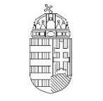
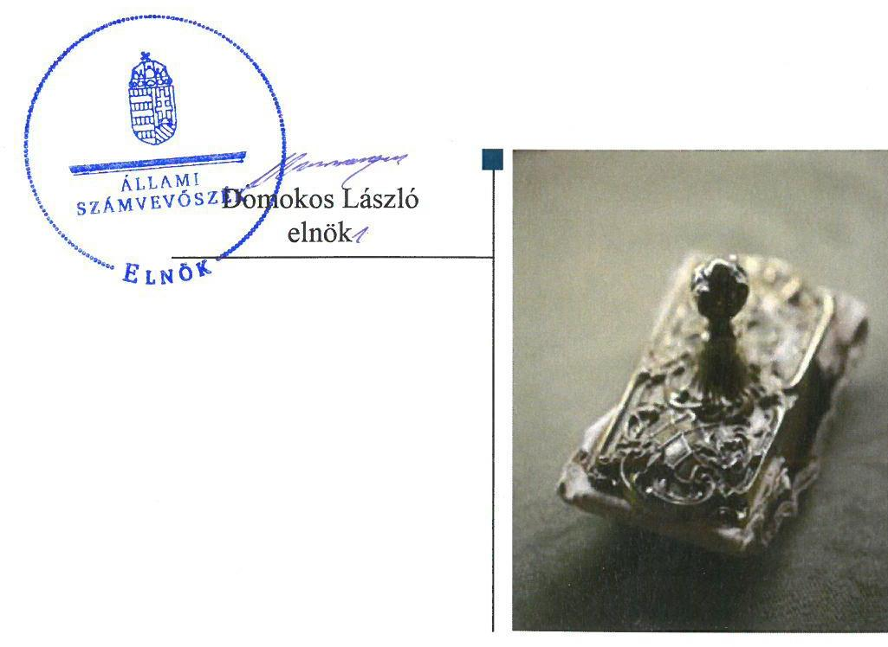

ÁLLAMI
SZÁMVEVŐSZÉK

# Jelentés

## Az államháztartás központi alrendszere fejezeteinek ellenőrzése

A Magyar Tudományos Akadémia kutatóközpontjai és kutatóintézetei vagyongazdálkodásának ellenőrzése – MTA Szegedi Biológiai Kutatóközpont 2020.

20014
www.asz.hu

---

# Jelentés 

## Az államháztartás központi alrendszere fejezeteinek ellenőrzése

A Magyar Tudományos Akadémia kutatóközpontjai és kutatóintézetei vagyongazdálkodásának ellenőrzése MTA Szegedi Biológiai Kutatóközpont
2020. 01. hó 16. nap

---

# AZ ELLENŐRZÉST FELÜGYELTE:

DR. NAGY IMRE felügyeleti vezető

# AZ ELLENŐRZÉST VEZETTE ÉS A VÉGREHAJTÁSÁÉRT FELELŐS:

MOLNÁR ZSUZSANNA ellenőrzésvezető

# A PROGRAM ÖSSZEÁLLÍTÁSÁÉRT FELELŐS:

SZALAY NAGY JÁNOS projektvezető

IKTATÓSZÁM: EL-2408-001/2020.

TÉMASZÁM: 2517

# ELLENŐRZÉS-AZONOSÍTÓ SZÁM: V086112

Jelentéseink az Országgyűlés számítógépes hálózatán és az Interneten a www.asz.hu címen is olvashatóak.

---

# TARTALOMJEGYZÉK 

■ ÖSSZEGZÉS ..... 5
■ AZ ELLENŐRZÉS CÉLJA ..... 6
■ AZ ELLENŐRZÉS TERÜLETE ..... 7
■ AZ ELLENŐRZÉS HÁTTERE, INDOKOLTSÁGA ..... 8
■ A JELENTÉS LÉNYEGES KÉRDÉSKÖREI ..... 9
■ AZ ELLENŐRZÉS HATÓKÖRE ÉS MÓDSZEREI ..... 10
■ MEGÁLLAPÍTÁSOK ..... 12
■ MELLÉKLETEK ..... 13
I. sz. melléklet: Értelmező szótár ..... 13
■ FÜGGELÉK: ÉSZREVÉTELEK ..... 15
■ RÖVIDÍTÉSEK JEGYZÉKE ..... 17

---

.

---

# ÖSSZEGZÉS 

A Magyar Tudományos Akadémia Szegedi Biológiai Kutatóközpont 2016., 2017., és 2018. években biztosította a közvagyon megőrzésének és kutatási közfeladatok ellátására történő célszerinti felhasználásának feltételeit.

## Az ellenőrzés társadalmi indokoltsága

Magyarország versenyképességének és a magyar gazdaság fejlődésének meghatározó tényezője a kutatás-fejlesztésre és az innovációra fordított hazai és uniós források eredményes, hatékony felhasználása. A magyar kutatás-fejlesztés területén kiemelt szerepet játszanak a központi költségvetésből biztosított támogatás felhasználásával működtetett, 2019. augusztus 31-ig a Magyar Tudományos Akadémia által irányított kutatóintézetek, kutatóközpontok. A Szegedi Biológiai Kutatóközpont a biológiai tudományok (biofizika, biokémia, genetika és növénybiológia) területén végzett kutatásokat.

A kutatás-fejlesztési közfeladat eredményes ellátásának feltétele, hogy az ehhez szükséges eszközök a kutatási tevékenységet ténylegesen végző intézeteknél, központoknál rendelkezésre álljanak, továbbá ezekkel a közfeladatellátás érdekében átlátható és elszámoltatható módon, a vagyon megőrzését biztosítva gazdálkodjanak.

Az ellenőrzés indokoltságát erősítette, hogy jogszabályi változás nyomán 2019. szeptember 1-től a kutatóintézetek és kutatóközpontok irányítása az Eötvös Loránd Kutatási Hálózat Titkárságához került át, a kutatóintézetek és kutatóközpontok ezt követően központi költségvetési szervként működnek tovább. A magyar kutatás-fejlesztés szempontjából kiemelten fontos, hogy az új szervezeti keretek között induló kutatóhálózat életképessége, a közfeladatot szolgáló vagyon megőrzése biztosított legyen.

Az Állami Számvevőszék az ellenőrzési megállapításokon keresztül hozzájárul a közvagyon védelméhez és rámutat a közfeladatot ellátó kutatóhálózat működőképességére is kiható vagyongazdálkodás kockázataira.

## Főbb megállapítások, következtetések, javaslatok

A Magyar Tudományos Akadémia Szegedi Biológiai Kutatóközpont költségvetési beszámolói szabályszerű leltárral való alátámasztásával biztosította, hogy a mérlegében szereplő tételek a valóságban is megtalálhatók, bizonyíthatók, kívülállók által is megállapíthatók legyenek. Így eleget tett a közvagyon megőrzésére, védelmére előírt alapvető követelményeknek.

---

# AZ ELLENŐRZÉS CÉLJA

**AZ ELLENŐRZÉS CÉLJA** annak megállapítása, hogy az MTA Szegedi Biológiai Kutatóközpont vagyongazdálkodása során érvényesült-e az átláthatóság és elszámoltathatóság.

---

# **AZ ELLENŐRZÉS TERÜLETE**

## **MTA Szegedi Biológiai Kutatóközpont**

Az MTA Szegedi Biológiai Kutatóközpontot 1971. január 1-jén alapították. Négy intézete: a Biofizikai Intézet, a Biokémiai Intézet, a Genetikai Intézet és a Növénybiológiai Intézet a Kutatóintézet szervezeti egységeként működött.

A Kutatóközpont önálló jogi személyként működő köztestületi költségvetési szerv volt az ellenőrzött időszakban, amely felett az MTA gyakorolt irányítási jogot. 2018-tól új főigazgató vezeti a Kutatóközpontot, a gazdasági igazgató személye az ellenőrzött időszakban nem változott.

A Kutatóközpont 2016-2018. években vállalkozási tevékenységet nem végzett.

A Kutatóközpont tevékenységének célja, hogy az élettudományok területén kutatásokat folytasson természettudományi alapkutatások, alkalmazott kutatások és kísérleti fejlesztések végzésével a biológiai tudományok (biofizika, biokémia, genetika és növénybiológia) területein. Kutatási alaptevékenységei körében többek között természettudományi, biotechnológiai, környezetvédelemmel és egészségüggyel kapcsolatos kutatások, K+F tevékenységekhez kapcsolódó innováció található.

A Kutatóközpont közfeladatainak ellátása az MTA-tól átvett négy ingatlan, mintegy 5,2 Mrd forintnyi tárgyi eszköz és saját vagyon használatával valósult meg. Az MTA a vagyon feletti rendelkezési jogot megtartotta, az eszközök használatával kapcsolatos feladatokat és a költségek viselését továbbadta a Kutatóközpontnak. Az MTA és a Kutatóközpont közötti vagyonhasználati szerződés alapján a Kutatóközpont volt köteles gondoskodni az eszközök állagmegóvásáról, továbbá viselni az eszközök működtetésével összefüggő üzemeltetési, fenntartási és javítási költségeket.

2018-ban a Kutatóközpont rendelkezésére álló vagyon beszámolóban kimutatott értéke meghaladta a 11 Mrd forintot.

---

# AZ ELLENŐRZÉS HÁTTERE, INDOKOLTSÁGA 

Az MTA Magyarország legmagasabb szintű tudományos testülete, a központi költségvetésben önálló fejezetet alkot. Az MTA tv. ${ }^{5}$ 2019. augusztus 31-ig hatályos előírásai alapján az MTA feladatainak ellátása céljából közfinanszírozású kutatóközpontokat és kutatóintézeteket, kiszolgáló és egyéb intézményeket létesít és működtet, amelyek felett irányítási jogot gyakorol. Az MTA kutatóközpontok és a kutatóintézetek 2019. augusztus 31-ig köztestületi költségvetési szervek voltak.

Az ÁSZ ellenőrzi az éves költségvetési törvény végrehajtását. Az ellenőrzés során feltárt kockázatok és a terület folyamatos értékelésével beazonosított kockázatok kezelése érdekében ellenőrzi többek között a költségvetési szervek gazdálkodását, működését. Így az ellenőrzések megállapításaival támogatja az ellenőrzött szervezetek szabályszerű gazdálkodását, javaslataival elősegíti az Alaptörvényben megfogalmazott alapvetések érvényesülését a mindennapi életben a szervezetek szintjén. Az ÁSZ megállapításaival elősegíti az ellenőrzöttek közpénzekkel való felelős gazdálkodását, illetve az újszerű megközelítésű ellenőrzéssel hozzájárul az értékteremtő rend kialakításához és megőrzéséhez.

Az ellenőrzés a vagyongazdálkodásra fókuszál. Az ellenőrzés következtében várhatóan reális kép alakítható ki a vagyongazdálkodás szabályszerűségéről. Az ellenőrzés megállapításai, javaslatai alapján javulhat a kutatóhálózat működésének szabályszerűsége, a kutatásokra fordított közpénzek felhasználásának átláthatósága, a tudomány eredményeinek hasznosulása, hozzájárulva ezzel a „jól irányított állam" működéséhez.

---

# A JELENTÉS LÉNYEGES KÉRDÉSKÖREI 

1. A Kutatóközpont vagyongazdálkodására vonatkozó alapvető szabályozása szabályszerű volt-e?
2. A Kutatóközpont vagyongazdálkodása során biztosított volt-e a vagyon megőrzése?

---

# AZ ELLENŐRZÉS HATÓKÖRE ÉS MÓDSZEREI 

## Az ellenőrzés típusa

Megfelelőségi ellenőrzés.

## Az ellenőrzött időszak

2016., 2017. és 2018. évek.

## Az ellenőrzés tárgya

MTA Szegedi Biológiai Kutatóközpont vagyongazdálkodásának ellenőrzése.

## Az ellenőrzött szervezet

MTA Szegedi Biológiai Kutatóközpont

## Az ellenőrzés jogalapja

Az ellenőrzés jogszabályi alapját az ÁSZ tv. ${ }^{6}$ 1. § (3) bekezdésének, az 5. § (2)-(4) és (6) bekezdésének, valamint az Áht. 61. § (2) bekezdésének előírásai képezték.

## Az ellenőrzés módszerei

Az ellenőrzést az ÁSZ a szakmai program szempontjai, az ellenőrzött időszakban hatályos jogszabályok, az ellenőrzés szakmai szabályai, a jelen ellenőrzésre irányadó ÁSZ módszertanok figyelembevételével végezte.

Az ellenőrzés ideje alatt az ellenőrzött szervezettel történő kapcsolattartást az ÁSZ SZMSZ${ }^{7}$-ének vonatkozó előírásai alapján biztosította.

Az ellenőrzési kérdések megválaszolásához szükséges bizonyítékok megszerzése az ellenőrzött által rendelkezésre bocsátott dokumentumokra, adatokra alapozva megfigyelés, szemle (szemrevételezés), kérdésfeltevés (információkérés), valamint elemző eljárás útján történt. Az ellenőrzési bizonyítékként felhasználható adatforrások közé tartoznak egyrészt az ellenőrzési program részletes szempontjainál felsorolt adatforrások, másrészt minden egyéb - az ellenőrzés folyamán feltárt, az ellenőrzés szempontjából információt tartalmazó - dokumentum. Az ellenőrzés lefolytatásához az ellenőrzött szervezet az ÁSZ által kért dokumentumok

---

megküldésével szolgáltatott adatokat, amelyek valódiságát és teljes körűségét az adatszolgáltató szervezet vezetője által tett teljességi és hitelességi nyilatkozat igazolja. Az így rendelkezésre bocsátott adatok, információk kontrollja az ellenőrzés keretében történt meg.

---

# 1. A Kutatóközpont vagyongazdálkodására vonatkozó alapvető szabályozása szabályszerű volt-e? 

Összegző megállapítás

A Kutatóközpont vagyongazdálkodására vonatkozó alapvető szabályozása szabályszerű volt.

A Kutatóközpont szervezeti felépítése, működési rendje, a szervezeti egységek megnevezése és feladatai - az Áht. ${ }^{8}$ és az Ávr. ${ }^{9}$ előírásai szerint meghatározásra kerültek a Kutatóközpont SZMSZ-ében ${ }^{10}$.

A Kutatóközpont rendelkezett - a Számv. tv. ${ }^{11}$ előírása szerinti - számviteli politikával ${ }^{12}$ és az annak keretében elkészítendő eszközök és a források leltárkészítési és leltározási szabályzatával ${ }^{13}$, valamint az eszközök és a források értékelési szabályzatával ${ }^{14}$. Gazdálkodásának részletes rendjét - az Áht.-ban előírtak szerint - belső szabályzatban ${ }^{15}$ határozták meg. A kötelezettségvállalásra, pénzügyi ellenjegyzésre, teljesítés igazolására, érvényesítésre és utalványozásra jogosult személyekről és aláírásmintájukról - az Ávr. előírása szerinti - nyilvántartást vezették.

A Kutatóközpont főigazgatója a Bkr. ${ }^{16}$ előírása szerinti nyilatkozatában a vagyongazdálkodás szabályozására vonatkozó megállapításokkal összhangban értékelte a költségvetési szerv belső kontrollrendszerének minőségét.

## 2. A Kutatóközpont vagyongazdálkodása során biztosított volt-e a vagyon megőrzése?

## Összegző megállapítás

A Kutatóközpont vagyongazdálkodása során biztosított volt a vagyon megőrzése.

A Kutatóközpont a 2016-2018. évi költségvetési beszámolói mérleg tételeit az Áhsz. előírása szerinti folyamatosan vezetett részletező nyilvántartásokkal, a könyvviteli zárlat során készített főkönyvi kivonatokkal, valamint az Áhsz. és a Számv. tv. által előírt leltárral alátámasztotta.

---

# MELLÉKLETEK 

- I. SZ. MELLÉKLET: ÉRTELMEZŐ SZÓTÁR
köztestület

MTA kutatóhálózat

MTA Kutatóközpont

MTA Kutatóintézet

A köztestület önkormányzattal és nyilvántartott tagsággal rendelkező szervezet, amelynek létrehozását törvény rendeli el. A köztestület a tagságához, illetve a tagsága által végzett tevékenységhez kapcsolódó közfeladatot lát el. A köztestület jogi személy. Köztestület különösen a Magyar Tudományos Akadémia. (Forrás: 2006. évi LXV. törvény 8/A. § (1)-(2) bekezdés.)
AZ MTA feladatainak ellátása céljából közfinanszírozású kutatóhálózatot létesít és működtet, amely felett irányítási jogot gyakorol. (Forrás: MTAtv. 2. § (1) bekezdés, hatályos 2019. augusztus 31-ig)
Az MTA kutatóhálózata 10 kutatóközpontból és bennük 38 intézetből, 5 önálló jogállású kutatóintézetből, 96 akadémiai támogatású egyetemi, illetve közgyűjteményekben létesített kutatócsoportból, valamint 95 Lendület-kutatócsoportból (együttesen: kutatóhely) áll.
Az akadémiai kutatóközpont költségvetési szerv. A kutatóközpont autonóm módon vesz részt az Akadémia közfeladatainak megoldásában, önállóan is vállal közfeladatokat, továbbá egyéb tevékenységet is végezhet. Tudományos tevékenységéről és gazdálkodásáról évente beszámolót készít, amelyet az Akadémia az e törvényben és az Alapszabályban leírtak szerint értékel. (Forrás: MTAtv. 18. § (1) bekezdés, hatályos 2019. augusztus 31-ig)

Az akadémiai kutatóintézet költségvetési szerv. Az akadémiai kutatóközpont keretein belül működő kutatóintézet a kutatóközpont szervezeti egysége. A kutatóintézet autonóm módon vesz részt az Akadémia közfeladatainak megoldásában, önállóan is vállal közfeladatokat, továbbá egyéb tevékenységet is végezhet. (Forrás: MTAtv. 18. § (1) bekezdés, hatályos 2019. augusztus 31-ig)

---

.

---

# FÜGGELÉK: ÉSZREVÉTELEK 

A jelentéstervezetet a Számvevőszék 15 napos észrevételezésre megküldte az ellenőrzött szervezet vezetőjének az ÁSZ tv. 29. § (1) bekezdése előírásának megfelelően.

A Magyar Tudományos Akadémia Szegedi Biológiai Kutatóközpont főigazgatója a jelentéstervezet megállapításaira írásban észrevételt tett. Az észrevételben foglaltakat az Állami Számvevőszék elfogadta, és a jelentésen átvezette.

[^0]
[^0]:    * 29. § (1) Az Állami Számvevőszék az ellenőrzési megállapításait megküldi az ellenőrzött szervezet vezetőjének vagy az általa megbízott személynek, és annak, akinek személyes felelősségét állapította meg.
    (2) Az ellenőrzött szervezet vezetője és a felelősként megjelölt személy az ellenőrzés megállapításaira tizenöt napon belül írásban észrevételt tehet.
    (3) Az Állami Számvevőszék az észrevételre a beérkezésétől számított harminc napon belül írásban válaszol. A figyelembe nem vett észrevételeket köteles a jelentésben feltüntetni, és megindokolni, hogy azokat miért nem fogadta el.

---

.

---

# RÖVIDÍTÉSEK JEGYZÉKE 

${ }^{1}$ MTA
${ }^{2}$ Kutatóközpont
${ }^{3}$ négy átvett ingatlan
${ }^{4}$ átvett tárgyi eszköz
${ }^{5}$ MTA tv.
${ }^{6}$ ÁSZ tv.
${ }^{7}$ ÁSZ SZMSZ
${ }^{8}$ Áht.
${ }^{9}$ Ávr.
${ }^{10}$ SZMSZ
${ }^{11}$ Számv. tv.
${ }^{12}$ számviteli politika
${ }^{13}$ leltározási- és leltárkészítési szabályzat
${ }^{14}$ eszközök és a források értékelési szabályzata
${ }^{15}$ gazdálkodás ügyrendjét tartalmazó belső szabályzat

 ${ }_{1-2}$
${ }^{16} \mathrm{Bkr}$.

Magyar Tudományos Akadémia
MTA Szegedi Biológiai Kutatóközpont
1: Szeged, Temesvári krt. 62. szám alatti ingatlan,
2: Szeged, Közép fasor 66. szám alatti ingatlan,
3: Szeged, Közép fasor 54. szám alatti ingatlanok,
4: Szeged, Székely sor 5. III. em. 10. szám alatti ingatlan
gépek, berendezések, felszerelések, járművek
1994. évi XL. törvény a Magyar Tudományos Akadémiáról
(hatályos: 1994. június 30-tól)
2011. évi LXVI. törvény az Állami Számvevőszékről (hatályos: 2011. július 1-jétől)

Az Állami Számvevőszék elnökének 2/2018. (XII.28.) ÁSZ utasítása az Állami
Számvevőszék Szervezeti és Működési Szabályzatáról
(hatályos: 2019. január 1-jétől)
2011. évi CXCV. törvény az államháztartásról (hatályos: 2012. január 1-jétől)

Az államháztartásról szóló törvény végrehajtásáról szóló 368/2011. (XII. 31.)
Korm. rendelet (hatályos: 2012. január 1-től)
1: Szervezeti és Működési Szabályzat (hatályos: 2010. április 1-jétől)
2: Szervezeti és Működési Szabályzat (hatályos: 2017. március 7-étől)
A számvitelről szóló 2000. évi C. törvény (hatályos: 2001. január 1-jétől)
1: MTA Szegedi Biológiai Kutatóközpont Számviteli Politika
(hatályos: 2016. január 1-jétől 2016. december 31-éig)
2: MTA Szegedi Biológiai Kutatóközpont Számviteli Politika
(hatályos: 2017. január 1-jétől)
3: MTA Szegedi Biológiai Kutatóközpont Számviteli Politika
(hatályos: 2018. január 1-jétől)
1: MTA Szegedi Biológiai Kutatóközpont Eszközök és források leltározási és
leltárkészítési szabályzata (hatályos: 2015. augusztus 6-ától 2016. február 29-éig)
2: MTA Szegedi Biológiai Kutatóközpont Eszközök és források leltározási és
leltárkészítési szabályzata (hatályos: 2016. március 1-jétől 2017. március 6-áig)
3: MTA Szegedi Biológiai Kutatóközpont Eszközök és források leltározási és
leltárkészítési szabályzata (hatályos: 2017. március 7-étől)
1: Magyar Tudományos Akadémia Szegedi Biológiai Központ Eszközök és források
értékelési szabályzata (hatályos: 2016. január 1-jétől)
2: Magyar Tudományos Akadémia Szegedi Biológiai Központ Eszközök és források
értékelési szabályzata (hatályos: 2018. január 1-jétől)
1: Magyar Tudományos Akadémia Szegedi Biológiai Központ Kötelezettségvállalás,
Pénzügyi Ellenjegyzés, Utalványozás és Érvényesítés Szabályzata
(hatályos: 2015. január 1-jétől)
2: Magyar Tudományos Akadémia Szegedi Biológiai Központ Kötelezettségvállalás,
Pénzügyi Ellenjegyzés, Utalványozás és Érvényesítés Szabályzata
(hatályos: 2018. január 1-jétől)
370/2011. (XII. 31.) Korm. rendelet a költségvetési szervek belső
kontrollrendszeréről és belső ellenőrzéséről (hatályos: 2012. január 1-jétől)

---

ÁLLAMI SZÁMVEVŐSZÉK
1052 Budapest, Apáczai Csere János utca 10.
Levélcím: 1364 Budapest 4. Pf. 54
Telefon: +36 14849100 Telefax: +36 14849200
www.asz.hu
