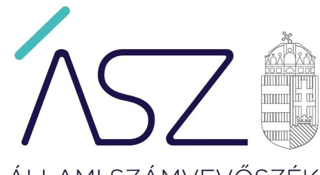
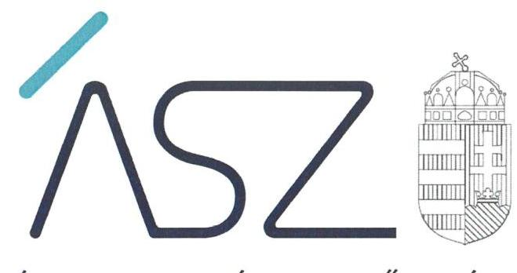

ÁLLAMI SZÁMVEVŐSZÉK

# JELENTÉS

## Önkormányzatok ellenőrzése – Integritás- és belső kontrollrendszer

Csurgó Város Önkormányzata

2020.

20015
www.asz.hu

---

ÁLLAMI SZÁMVEVŐSZÉK

# JELENTÉS

Önkormányzatok ellenőrzése – Integritás- és belső kontrollrendszer

Csurgó Város Önkormányzata

2020. 02. hó 25. nap

20015
www.asz.hu

---

# AZ ELLENŐRZÉST FELÜGYELTE: 

TÓTH MARIANNA felügyeleti vezető

## AZ ELLENŐRZÉST VEZETTE ÉS A VÉGREHAJTÁSÁÉRT FELELŐS:

FORCZEK ANDREA ellenőrzésvezető

A PROGRAM ÖSSZEÁLLÍTÁSÁÉRT FELELŐS:
TÓTPÁL SZABOLCS osztályvezető

IKTATÓSZÁM: EL-2409-001/2020.
TÉMASZÁM: 2485
ELLENŐRZÉS-AZONOSÍTÓ SZÁM: V082956

Jelentéseink az Országgyúlés számítógépes hálózatán és az interneten a www.asz.hu címen is olvashatóak.

---

# TARTALOMJEGYZÉK 

■ ÖSSZEGZÉS ..... 5
■ AZ ELLENŐRZÉS CÉLJA ..... 6
■ AZ ELLENŐRZÉS TERÜLETE ..... 7
■ AZ ELLENŐRZÉS HÁTTERE, INDOKOLTSÁGA ..... 8
■ A JELENTÉS LÉNYEGES KÉRDÉSKÖRE ..... 9
■ AZ ELLENŐRZÉS HATÓKÖRE ÉS MÓDSZEREI ..... 10
■ MEGÁLLAPÍTÁSOK ..... 12
■ KÖVETKEZTETÉSEK ..... 13
■ MELLÉKLETEK ..... 15
I. sz. melléklet: Értelmező szótár ..... 15
■ FÜGGELÉKEK ..... 17
I. sz. függelék a jelentéshez ..... 17
II. sz. függelék: Észrevételek ..... 18
■ RÖVIDÍTÉSEK JEGYZÉKE ..... 19

---

.

---

# ÖSSZEGZÉS 

Csurgó Város Önkormányzatánál nem volt biztositott az átláthatóság, elszámoltathatóság, a közpénzfelhasználás szabályossága és a nemzeti vagyonnal történő felelős gazdálkodás.

## Az ellenőrzés társadalmi indokoltsága

Az Állami Számvevőszék alapvető feladata a közpénzekkel, az állami és önkormányzati vagyonnal való gazdálkodás ellenőrzése. Az Alaptörvény szerint az önkormányzatok kötelezettsége a kiegyensúlyozott, átlátható és fenntartható költségvetési gazdálkodás elvének érvényesítése, a nemzeti vagyonnal való rendeltetésszerű és felelős módon való gazdálkodás biztosítása. Az Állami Számvevőszék stratégiájában megfogalmazott célkitűzése az integritás alapú, átlátható és elszámoltatható közpénzfelhasználás elősegítése. Ennek megvalósítása érdekében az Állami Számvevőszék prioritásként kezeli a közpénzzel gazdálkodó szervezetek esetében a belső kontrollrendszer múködésének ellenőrzését.

## Főbb megállapítások, következtetések, javaslatok

A Közös Önkormányzati Hivatal nem rendelkezett a feladatellátás részletes belső rendjét és módját meghatározó szervezeti és múködési szabályzattal. Ezáltal a közös önkormányzati hivatal feladatellátásának keretei, továbbá az ehhez kapcsolódó felelősségi viszonyok nem tisztázottak, a törvényes múködés esetükben nem biztosított.

Azáltal, hogy a Csurgó Város Önkormányzatának gazdálkodási feladatait ellátó Csurgói Közös Önkormányzati Hivatal jegyzője a jogszabályi előírások ellenére nem készítette el a számviteli politikát, és annak keretében elkészítendő eszközök és források leltározási és értékelési, valamint pénzkezelési szabályzatát, nem teremtette meg a szabályszerű gazdálkodás feltételeit.

A jegyző nem gondoskodott a gazdálkodási jogkörök gyakorlására jogosult személyekről és aláírás-mintájukról szóló nyilvántartás vezetéséről. Így a gazdálkodási jogkörök jogszabály szerinti gyakorlásának feltételei, a szabályszerű közpénzfelhasználás, a nemzeti vagyonnal való rendeltetésszerű és felelős módon történő gazdálkodás feltételei nem voltak biztosítottak.

---

# AZ ELLENŐRZÉS CÉLJA 

Az ellenőrzés célja annak megállapítása volt, hogy Csurgó Város Önkormányzatának belső kontrollrendszere biztosí-totta-e a közpénzekkel és a nemzeti vagyonnal történő elszámoltatható, átlátható, szabályszerű, gazdaságos, hatékony és eredményes gazdálkodás feltételeit. Az ellenőrzés célja kiterjedt annak megállapítására is, hogy az önkormányzatnál kiépítették és erősítették-e a korrupciós kockázatok kezelését szolgáló integritás kontrollokat és azt, hogy megteremtették-e a teljesítményellenőrzés feltételeit.

---

# **AZ ELLENŐRZÉS TERÜLETE**

## **Csurgó Város Önkormányzata**

A Somogy megyei Csurgó város lakossága a Központi Statisztikai Hivatal adatai alapján 2017. január 1-jén 4 806 fő volt.

A 2013. január 01-től érvényes határozatlan idejű Társulási megállapodás1 alapján, a Csurgói Közös Önkormányzati Hivatal végezte az igazgatási és pénzügyi feladatokat Csurgó Város, valamint Csurgónagymarton, Porrog, Porrogszentkirály, Porrogszentpál, Somogybükkösd, Somogycsicsó, Szenta Községek vonatkozásában.

A Csurgói KÖH2 vezetője és képviselője a jegyző, irányító szerve Csurgó Város Önkormányzat Képviselő-testülete és Csurgó Város polgármestere.

A közös önkormányzati hivatal feladatkörébe tartozott az önkormányzati működéshez kapcsolódó általános (mint például a városgazdálkodási, adminisztratív, intézményi működési) feladatok mellett, a hatósági (önkormányzati hatósági, államigazgatási) feladatok, valamint a gazdasági és pénzügyi feladatok, azaz a gazdálkodással kapcsolatos napi ügyek intézése, nyilvántartások vezetése, a költségvetés, zárszámadás és pénzügyi beszámolók készítése.

Az ellenőrzött időszakban a polgármester és jegyző személye nem változott.

Csurgó Város Önkormányzata 2017. évi költségvetéséről szóló 1/2017. (II. 16.) önkormányzati rendeletében (a képviselő testület, az Önkormányzat3 és költségvetési szervei együttes) 2017. évi költségvetés tervszámait 2,0 Mrd Ft költségvetési bevételi és 2,6 Mrd Ft költségvetési kiadási öszszegben állapították meg.

---

# AZ ELLENŐRZÉS HÁTTERE, INDOKOLTSÁGA 

A BELSŐ KONTROLLRENDSZER azt a célt szolgálja, hogy az államháztartás szervei múködésük és gazdálkodásuk során a tevékenységeket szabályszerűen, gazdaságosan, hatékonyan, eredményesen hajtsák végre, teljesítsék elszámolási kötelezettségeiket, és megvédjék az erőforrásokat a veszteségektől, a károktól, a nem rendeltetésszerű használattól. A belső kontrollrendszer magában foglalja mindazon szabályokat, eljárásokat, gyakorlati módszereket és szervezeti struktúrákat, kockázatkezelési technikákat, kontrolltevékenységeket, amelyek segítséget nyújtanak a szervezetnek céljai eléréséhez.

A BELSŐ KONTROLLRENDSZER KIALAKÍTÁSA és múködtetése nélkül nem valósítható meg a közpénzek, a közvagyon szabályos, gazdaságos, hatékony és eredményes felhasználása. Az átláthatóság, valamint az elszámoltatás eredményes működtetéséhez szükség van a megfelelő információs, kontroll-, értékelési és beszámolási rendszerek kialakítására. A belső kontrollok kiépítettsége hozzájárul az integritási szemlélet kialakításához és érvényesüléséhez. A megfelelő belső kontrollrendszer jelentősen csökkenti a hibák és szabálytalanságok kockázatát.

Az Állami Számvevőszék célja, hogy javuljon az ellenőrzött önkormányzatok belső kontrollrendszerének szabályozottsága, múködésének megfelelősége, szabályszerűsége, hozzájárulva ezzel az egyensúlyi helyzet fenntarthatóságának biztosításához, biztosítva az önkormányzatnál a közpénzfelhasználás szabályosságát, a közpénzekkel és a nemzeti vagyonnal történő szabályszerű, gazdaságos, hatékony és eredményes gazdálkodást.

AZ ÁLLAMI SZÁMVEVŐSZÉK ELLENŐRZÉSEI jelzik a társadalom számára, hogy közpénz nem maradhat ellenőrizetlenül, tevékenysége hozzájárul az értékteremtő rend kialakításához és megőrzéséhez.

---

# A JELENTÉS LÉNYEGES KÉRDÉSKÖRE 

Az önkormányzat belső kontrollrendszerének kialakítása és müködtetése szabályszerű volt-e, az biztositotta-e az önkormányzatnál a közpénzfelhasználás szabályosságát, a nemzeti vagyonnal történő felelős gazdálkodást?

---

# AZ ELLENŐRZÉS HATÓKÖRE ÉS MÓDSZEREI 

## Az ellenőrzés típusa

Megfelelőségi ellenőrzés.

## Az ellenőrzött időszak

2017. év, illetve az éves költségvetési beszámoló Áht. ${ }^{4}$ által megállapított jóváhagyásáig (2018. május 31-éig) tartó időszak.

## Az ellenőrzés tárgya

Csurgó Város Önkormányzata és a gazdálkodási feladatokat ellátó Csurgói Közös Önkormányzati Hivatal belső kontrollrendszerének kialakítása és múködtetése, valamint az integritás kontrollok kiépítettsége, a teljesítményellenőrzés feltételei.

## Az ellenőrzött szervezet

Csurgó Város Önkormányzata, valamint a Csurgói Közös Önkormányzati Hivatal.

## Az ellenőrzés jogalapja

Az ellenőrzés jogszabályi alapját az ÁSZ tv5. 1. § (3) bekezdés, 5. § (2) és (6) bekezdései, valamint az Áht. 61. § (2) bekezdésének előírásai képezik.

## Az ellenőrzés módszerei

Az ÁSZ ${ }^{6}$ az ellenőrzést az ellenőrzési program szempontjai, az ellenőrzött időszakban hatályos jogszabályok, az ellenőrzés szakmai szabályai, a jelen ellenőrzésre irányadó ÁSZ módszertanok figyelembevételével hajtotta végre.

Az ÁSZ, az ellenőrzés ideje alatt az ellenőrzött szervezettel történő kapcsolattartást az ÁSZ SZMSZ ${ }^{7}$-ének vonatkozó előírásai alapján biztosította.

Az ellenőrzési kérdések megválaszolásához szükséges bizonyítékok megszerzése az ellenőrzött által rendelkezésre bocsátott dokumentumokra, adatokra alapozva megfigyelés, szemle (szemrevételezés), valamint elemző eljárás útján történt.

---

Az ellenőrzési bizonyítékként felhasználható adatforrások közé tartoznak az ellenőrzési program részletes szempontjainál felsorolt adatforrások, valamint minden egyéb - az ellenőrzés folyamán feltárt, az ellenőrzés szempontjából információt tartalmazó - dokumentum.

Az önkormányzat belső kontrollrendszerének összesített értékelése az egyes részterületek esetében kapott megfelelőségi arányok számtani átlaga alapján történt és megegyezik a pillérenként (kontroll-területenként) alkalmazott százalékos értékelésekkel, a következő eltérésekkel: a kontrollrendszer egésze esetében a „szabályszerú" értékelésnek a százalékos értéken felül további feltétele, hogy egyik kontrollterület sem kaphat „nem szabályszerű" értékelést.

Amennyiben az önkormányzat múködését és gazdálkodását alapvetően meghatározó dokumentum hiánya miatt, valamely lényeges kérdéskörre vonatkozóan az ÁSZ megállapítást tett, további ellenőrzési tevékenységek az adott kérdéskörrel és az azzal szoros logikai kapcsolatban lévő kérdéskörökkel - ráépülő jelleggel - nem kerültek végrehajtásra.

---

# MEGÁLLAPÍTÁSOK 

## Az önkormányzat belső kontrollrendszerének kialakítása és múködtetése szabályszerű volt-e, az biztosította-e az önkormányzatnál a közpénzfelhasználás szabályosságát, a nemzeti vagyonnal történő felelős gazdálkodást?

Összegző megállapítás

Az Önkormányzat belső kontrollrendszerének kialakítása és múködtetése nem volt szabályszerű, az nem biztosította a közpénzfelhasználás szabályosságát, a nemzeti vagyonnal történő felelős gazdálkodást.

AZ ÖNKORMÁNYZAT NEM SZABÁLYSZERŰ KONTROLLKÖRNYEZETBEN múködött, az Önkormányzatnál a belső kontrollrendszer kialakításához szükséges jogszabály szerinti, kötelező, alapvető elemek nem voltak biztosítottak.

A Közös Önkormányzati Hivatal az Áht. 10. § (5) bekezdésében foglaltak ellenére nem rendelkezett a feladatellátás részletes belső rendjét és módját meghatározó szervezeti és múködési szabályzattal. Ezáltal a közös önkormányzati hivatal feladatellátásának keretei, továbbá az ehhez kapcsolódó felelősségi viszonyok nem tisztázottak, a törvényes múködés esetükben nem biztosított.

A jegyző a Számv.tv ${ }^{8}$ 14. § (3) bekezdése, valamint a Számv.tv. 14.§ (5) bekezdés a)-b) és d) pontja, továbbá az Áhsz. ${ }^{9}$ 50. § (1) bekezdése ellenére nem gondoskodott az Önkormányzatra és a Közös Hivatalra vonatkozó számviteli politika kialakításáról, valamint ennek keretében az eszközök és a források leltárkészítési és leltározási szabályzata, az eszközök és források értékelési szabályzata és a pénzkezelési szabályzat elkészítéséről.

A KONTROLLTEVÉKENYSÉGEK KIALAKÍTÁSA nem volt szabályszerű, mert a jegyző az Ávr. ${ }^{10} 60$. § (3) bekezdését megsértve a kötelezettségvállalásra, teljesítés igazolására jogosult személyekről és alá-írás-mintájukról nyilvántartást nem vezetett. Ezáltal a kötelezettségvállalás, teljesítés igazolás jogszabály szerinti gyakorlásának feltételei nem voltak biztosítottak.

A MONITORING RENDSZER MÚKÖDTETÉSE NEM VOLT SZABÁLYSZERŰ. A jegyző nem gondoskodott - a Bkr. ${ }^{11}$ 11. § (1) bekezdés előírása ellenére - a vezetői nyilatkozat elkészítéséről.

---

# KÖVETKEZTETÉSEK 

Az ÁSZ tv. 32. § (1) bekezdésében foglaltak értelmében az ÁSZ jelentés tartalmazza a feltárt tényeket, az ezeken alapuló megállapításokat, következtetéseket, amelyeknek a 24. § (1) bekezdés d) pontja szerint okszerünek és megalapozottnak kell lenniük.

Csurgó város Közös Önkormányzati Hivatala az ellenőrzött időszakban nem rendelkezett Szervezeti és működési szabályzattal, ezáltal nem kerültek kialakításra a feladatellátáshoz kapcsolódó felelősségi és hatáskörök, azaz nem teremtette meg a szabályszerű működéshez szükséges alapvető szervezeti és szabályozási feltételeket.

A jegyző nem gondoskodott az Önkormányzatra és a Közös Hivatalra kiterjedően a számviteli politika, valamint ennek keretében az eszközök és a források leltárkészítési és leltározási szabályzata, az eszközök és források értékelési szabályzata és a pénzkezelési szabályzat elkészítéséről, így a kontrollkörnyezet kialakítása nem történt meg. Ezzel a szabályszerű közpénzfelhasználás, a nemzeti vagyonnal való rendeltetésszerű és felelős módon történő gazdálkodás feltételei nem voltak biztosítottak.

Az Önkormányzat azzal, hogy nem alakította ki a szabályszerű gazdálkodási környezetet, nem voltak biztosítottak a központi költségvetésből kapott támogatások átlátható és elszámoltatható igénybevételének és felhasználásának feltételei. Mindezek következtében felmerül a számviteli elszámolások szabálytalanságának lehetősége, így a beszámoló megbízhatósága is megkérdőjelezhető.

Az Önkormányzat esetében felmerül a jogosulatlan kifizetések lehetősége, tekintettel arra, hogy nem történt meg a gazdálkodási jogkörgyakorlásra jogosult személyekről és aláírás mintájukról szóló nyilvántartás vezetése.

---

.

---

# MELLÉKLETEK 

- I. SZ. MELLÉKLET: ÉRTELMEZŐ SZÓTÁR
belső ellenőrzés
belső kontrollrendszer
belső kontrollrendszer területei
információs és kommunikációs rendszer
integrált kockázatkezelési rendszer
integritás
irányító szerv/felügyeleti szerv
kockázat
kontrollkörnyezet
kontrolltevékenységek

Független, tárgyilagos bizonyosságot adó és tanácsadó tevékenység, amelynek célja, hogy az ellenőrzött szervezet működését fejlessze és eredményességét növelje, az ellenőrzött szervezet céljai elérése érdekében rendszerszemléletű megközelítéssel és módszeresen értékeli, illetve fejleszti az ellenőrzött szervezet irányítási és belső kontrollrendszerének hatékonyságát (Forrás: Bkr. 2. § b) pontja)
A belső kontrollrendszer a kockázatok kezelése és tárgyilagos bizonyosság megszerzése érdekében kialakított folyamatrendszer, amely azt a célt szolgálja, hogy a müködés és gazdálkodás során a tevékenységeket szabályszerűen, gazdaságosan, hatékonyan, eredményesen hajtsák végre, az elszámolási kötelezettségeket teljesítsék, megvédjék az erőforrásokat a veszteségektől, károktól és nem rendeltetésszerű használattól (Forrás: Áht. 69. § (1) bekezdése)
A kontrollkörnyezet, az integrált kockázatkezelési rendszer, a kontrolltevékenységek, az információs és kommunikációs rendszer, valamint a nyomon követési (monitoring) rendszer. (Forrás: Bkr. 3. §-a)
A költségvetési szerv vezetője által kialakított és müködtetett olyan rendszer, mely biztosítja, hogy a megfelelő információk a megfelelő időben eljutnak az illetékes szervezethez, szervezeti egységhez, illetve személyhez. (Forrás: Bkr. 9. § (1) bekezdés)

Olyan folyamatalapú kockázatkezelési rendszer, amely a szervezet minden tevékenységére kiterjed, egységes módszertan és eljárások alkalmazásával, a szervezet célkitűzéseinek és értékeinek figyelembevételével biztosítja a szervezet kockázatainak teljes körű azonosítását, azok meghatározott kritériumok szerinti értékelését, valamint a kockázatok kezelésére vonatkozó intézkedési terv elkészítését és az abban foglaltak nyomon követését. (Forrás: Bkr. 2. § m) pontja, 2016. október 1-jétől)

Az integritás az elvek, értékek, cselekvések, módszerek, intézkedések konzisztenciáját jelenti, vagyis olyan magatartásmódot, amely meghatározott értékeknek megfelel. (Forrás: Nemzetgazdasági Minisztérium: Magyarországi államháztartási belső kontroll standardok Útmutató 1.6.1. pontja, 2012. december)
A költségvetési szerv tekintetében az Áht-ban meghatározott irányítási hatáskört gyakorló szerv. (Forrás: Áht. 1. § 9. pontja)
A kockázat annak a valószínűségét jelenti, hogy egy vagy több esemény vagy intézkedés nem kívánt módon befolyásolja a rendszer müködését, céljainak megvalósulását. (Forrás: Javaslatok a korrupciós kockázatok kezelésére Kockázatkezelési és ellenőrzési módszertan 35. oldal, ÁSZ)
A költségvetési szerv vezetője által kialakított olyan elvek, eljárások, belső szabályzatok összessége, amelyben világos a szervezeti struktúra, egyértelműek a felelősségi, hatásköri viszonyok és feladatok, meghatározottak az etikai elvárások a szervezet minden szintjén, átlátható a humánerőforrás-kezelés (Forrás: Bkr. 6. § (1) bekezdés)
A költségvetési szerv vezetője által a szervezeten belül kialakított (kontroll) tevékenységek, melyek biztosítják a kockázatok kezelését, hozzájárulnak a szervezet céljainak eléréséhez (Forrás: Bkr. 8. § (1) bekezdés)

---

| kommunikáció | Az a tevékenység, melynek során információ továbbítása valósul meg. A kommunikációs folyamat résztvevői között tájékoztatás történik, mely során tényeket, ezek magyarázatát közlik. |
| :--: | :--: |
| közös önkormányzati hivatal | A települési képviselő-testület más települési képviselő-testülettel társult képviselő-testületet alakíthat, amely esetén a képviselő-testületek részben vagy egészben egyesítik a költségvetésüket, közös önkormányzati hivatalt tartanak fenn, és intézményeiket közösen múködtetik. (Forrás: Mötv. 56. § (1)-(2) bekezdései) |
| monitoring | A monitoring általánosságban a különböző szintű szervezeti célok megvalósításának folyamatát kíséri figyelemmel, melynek során a releváns eseményekről és tevékenységekről (együtt: folyamatokról) rendszeres jelleggel, strukturált, döntéstámogató információkhoz jutnak a szervezet vezetői. (Forrás: NGM Útmutató a költségvetési szervek monitoring rendszeréhez 2011. november) |
| monitoring rendszer | A költségvetési szerv vezetője köteles kialakítani a szervezet tevékenységének a célok megvalósításának nyomon követését biztosító rendszert, amely az operatív tevékenységek keretében megvalósuló folyamatos és eseti nyomon követésből, valamint az operatív tevékenységektől függetlenül múködő belső ellenőrzésből állhat. (Forrás: Bkr. 10. §) |
| önkormányzati hivatal | A polgármesteri hivatal, a főpolgármesteri hivatal, a megyei önkormányzati hivatal és a közös önkormányzati hivatal. (Forrás: Áht. 1. § 18. pont) |
| társulás | A helyi önkormányzatok képviselő-testületei megállapodhatnak abban, hogy egy vagy több önkormányzati feladat- és hatáskör, valamint a polgármester és a jegyző államigazgatási feladat- és hatáskörének hatékonyabb, célszerűbb ellátására jogi személyiséggel rendelkező társulást hoznak létre. (Forrás: Mötv. 87. §) |

---

# FÜGGELÉKEK 

- I. SZ. FÜGGELÉK A JELENTÉSHEZ

Az Állami Számvevőszék az ellenőrzések során feltárt tényekhez kapcsolódó további körülmények tisztázására eszközrendszerrel nem rendelkezik. Amennyiben az ellenőrzésen túlmutatóan indokoltnak látszik az ellenőrzés során feltárt körülmények további vizsgálata, az Állami Számvevőszék törvényi felhatalmazás alapján az ellenőrzés által feltárt körülményeket továbbítja a hatáskörrel rendelkező szervnek a szükséges intézkedések megtétele, eljárások lefolytatása érdekében.
I.

A Közös Önkormányzati Hivatal a 2017. évben az Áht. 10. § (5) bekezdésében foglaltak ellenére nem rendelkezett a feladatellátás részletes belső rendjét és módját meghatározó szervezeti és müködési szabályzattal.
Szervezeti és müködési szabályzat hiányában a Közös Önkormányzati Hivatal feladatellátásának keretei, továbbá az ehhez kapcsolódó felelősségi viszonyok nem voltak tisztázottak, a törvényes müködés nem volt biztositott.
Az eset konkrét körülményeinek a feltárása a Kormányhivatal hatáskörébe tartozik.
II.

II/1 Az Önkormányzatnál az Áhsz. 50.§ (1) bekezdésében, a Számv. tv. 14. § (3)-(4) bekezdésében, valamint (5) bekezdés a)-b) és d) pontjaiban foglaltak ellenére nem gondoskodtak az Önkormányzatra és a Közös Hivatalra kiterjedően a számviteli politika kialakításáról, valamint annak keretében az eszközök és a források leltárkészittési és leltározási szabályzata, az eszközök és források értékelési szabályzata és a pénzkezelési szabályzat elkészitéséről.
II/2 Az Önkormányzatnál az Ávr. 60. § (3) bekezdésében foglaltak ellenére nem vezettek nyilvántartást a gazdálkodási jogkörök gyakorlására jogosult személyekről és aláírás-mintájukról.
A számviteli politika és az annak keretében kialakítandó szabályzatok, valamint a gazdálkodási jogkörök gyakorlására jogosult személyekről és aláírás-mintájukról vezetett nyilvántartás hiányában nem igazolt az előirt könyvvezetési kötelezettség teljesülésének szabályszerüsége, valamint, hogy az Önkormányzat 2017. évi költségvetési beszámolója megbízható és valós adatokat tartalmaz.
Az eset konkrét körülményeinek feltárására a Magyar Államkincstár rendelkezik hatáskörrel.

---

A jelentéstervezetet a Számvevőszék 15 napos észrevételezésre megküldte az ellenőrzött szervezetek vezetőinek az ÁSZ tv. 29. §* (1) bekezdése előirásának megfelelően.

Csurgó Város Önkormányzatának polgármestere és a Csurgói Közös Önkormányzati Hivatal jegyzője az ÁSZ tv. 29.§ (2) bekezdésben foglalt észrevételezési jogával nem élt, a jelentéstervezetre észrevételt nem tett.

[^0]
[^0]:    * 29. § (1) Az Állami Számvevőszék az ellenőrzési megállapításait megküldi az ellenőrzött szervezet vezetőjének vagy az általa megbízott személynek, és annak, akinek személyes felelősségét állapította meg.
    (2) Az ellenőrzött szervezet vezetője és a felelősként megjelölt személy az ellenőrzés megállapításaira tizenöt napon belül írásban észrevételt tehet.
    (3) Az Állami Számvevőszék az észrevételre a beérkezésétől számított harminc napon belül írásban válaszol. A figyelembe nem vett észrevételeket köteles a jelentésben feltüntetni, és megindokolni, hogy azokat miért nem fogadta el.

---

# RÖVIDÍTÉSEK JEGYZÉKE 

${ }^{1}$ Társulási megállapodás
${ }^{2}$ Csurgói KÖH
${ }^{3}$ Önkormányzat
${ }^{4}$ Áht.
${ }^{5}$ ÁSZ tv.
${ }^{6}$ ÁSZ
${ }^{7}$ ÁSZ SZMSZ
${ }^{8}$ Számv. tv.
${ }^{9}$ Áhsz.
${ }^{10}$ Ávr.
${ }^{11}$ Bkr.

Megállapodás Közös Önkormányzati Hivatal Alakításáról és Fenntartásáról (2013. január 01-től hatályos)
Csurgói Közös Önkormányzati Hivatal
Csurgó Város Önkormányzata
2011. évi CXCV. törvény az államháztartásról
2011. évi LXV. törvény az Állami Számvevőszékről

Állami Számvevőszék
Az Állami Számvevőszék elnökének 2/2018. (XII.28.) ÁSZ utasítása az Állami Számvevőszék Szervezeti és Müködési Szabályzatáról
2000. évi C. törvény a számvitelről

4/2013. (I. 11.) Korm. rendelet az államháztartás számviteléről
368/2011. (XII. 31.) Korm. rendelet az államháztartásról szóló törvény végrehajtásáról
370/2011. (XII. 31.) Korm. rendelet a költségvetési szervek belső kontrollrendszeréről és belső ellenőrzéséről

---

# ASZ 

ALLAMI SZAMVEVOSZEK
1052 Budapest, Apáczai Cs. J. u. 10. I 1364 Budapest 4. Pf. 54 TEL: +36 14849100
email: szamvevoszek@asz.hu
web: www.asz.hu | www.aszhirportal.hu