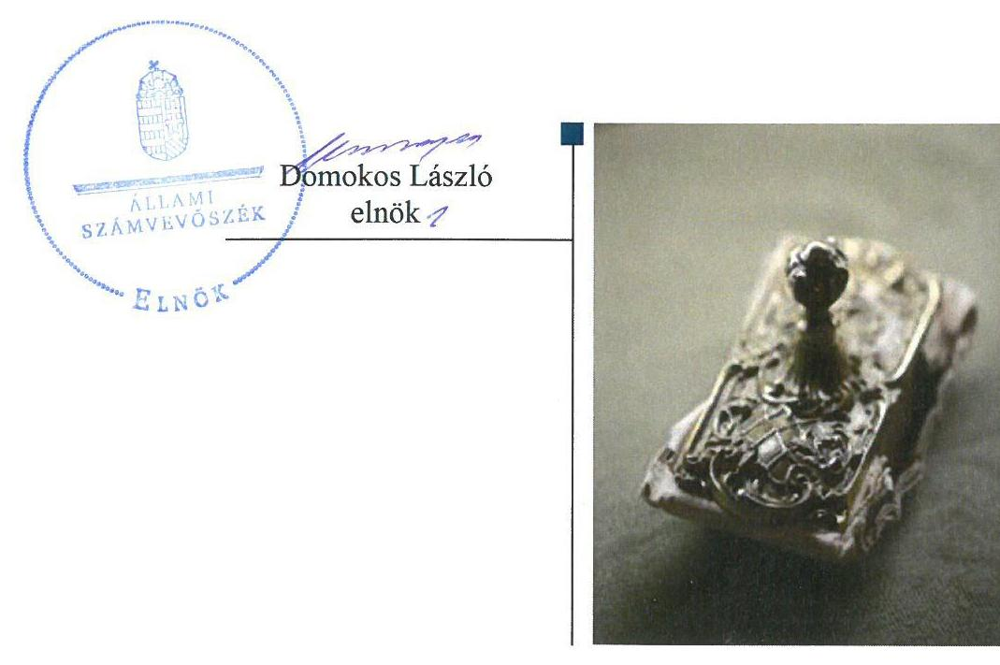
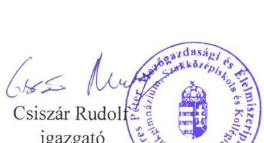
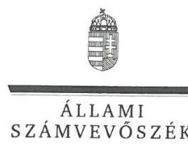
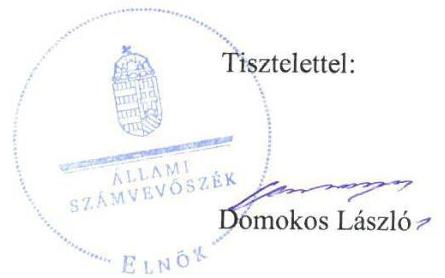
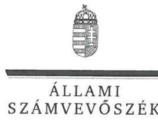
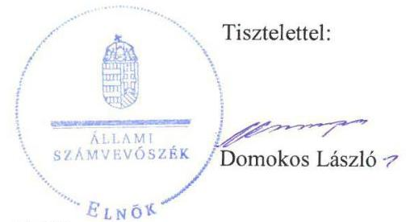

ÁLLAMI
SZÁMVEVŐSZÉK

# Jelentés

## Központi költségvetési szervek ellenőrzése

Veres Péter Mezőgazdasági és Élelmiszeripari Szakgimnázium, Szakközépiskola és Kollégium 2020.

20016
www.asz.hu

---

# Jelenetés 

## Központi költségvetési szervek ellenőrzése

Veres Péter Mezőgazdasági és Élelmiszeripari Szakgimnázium, Szakközépiskola és Kollégium 2020. 01. hó 28. nap

---

# AZ ELLENŐRZÉST FELÜGYELTE:

- KAKAS SÁNDOR felügyeleti vezető

- AZ ELLENŐRZÉST VEZETTE ÉS A VÉGREHAJTÁSÁÉRT FELELŐS:
  - MIHÁLSZKY KÁLMÁN ellenőrzésvezető
  - DR. SIMON JÓZSEF ellenőrzésvezető

- A PROGRAM ÖSSZEÁLLÍTÁSÁÉRT FELELŐS:
  - TÓTPÁL SZABOLCS osztályvezető

- IKTATÓSZÁM: EL-2413-001/2020.
  - TÉMASZÁM: 2450

- ELLENŐRZÉS-AZONOSÍTÓ SZÁM: V079178

Jelentéseink az Országgyűlés számítógépes hálózatán és az Interneta a www.asz.hu címen is olvashatóak.

---

# TARTALOMJEGYZÉK 

■ ÖSSZEGZÉS ..... 5
■ AZ ELLENŐRZÉS CÉLJA ..... 6
■ AZ ELLENŐRZÉS TERÜLETE ..... 7
■ AZ ELLENŐRZÉS HÁTTERE, INDOKOLTSÁGA ..... 8
■ A JELENTÉS LÉNYEGES KÉRDÉSKÖREI ..... 9
■ AZ ELLENŐRZÉS HATÓKÖRE ÉS MÓDSZEREI ..... 10
■ MEGÁLLAPÍTÁSOK ..... 12
■ JAVASLATOK ..... 15
■ MELLÉKLETEK ..... 17
I. sz. melléklet: Értelmező szótár ..... 17
■ FÜGGELÉKEK ..... 19
I. sz. függelék a jelentéshez ..... 19
II. sz. függelék: Észrevételek ..... 21
■ RÖVIDÍTÉSEK JEGYZÉKE ..... 37

---

.

---

# ÖSSZEGZÉS 

A Veres Péter Mezőgazdasági és Élelmiszeripari Szakgimnázium, Szakközépiskola és Kollégium belső kontrollrendszere, pénzügyi és vagyongazdálkodása nem biztositotta a közpénzek szabályos felhasználását és a nemzeti vagyonnal való elszámoltatható, átlátható gazdálkodást, nem érvényesült a felelős gazdálkodás. A korrupció elleni védettség nem volt biztositott.

## Az ellenőrzés társadalmi indokoltsága

Magyarország versenyképességének és a magyar gazdaság fejlődésének alapvető feltétele a magyar munkavállalók megfelelő szakmai képzettsége és felkészültsége, amelyben a szakképzési rendszernek döntő szerepe van. A mezőgazdaság vonatkozásában is kiemelten fontos ez, hiszen a magyar mezőgazdaság piaci versenyképességét és eredményességét nagymértékben befolyásolja az agrárszférában dolgozók képzettsége, felkészültsége. A szakképzés legjelentősebb színterei a szakképző iskolák. Az eredményes és célszerű szakképzés alapja és alapvető feltétele a szakképző intézmények közpénzekkel és a közvagyonnal való törvényes, átlátható és a korrupcióval szembeni védelmet biztosító múködése és gazdálkodása. Ezért ezen szervezetekkel szemben is alapvető társadalmi igény, hogy a rájuk bízott közpénzekkel, közvagyonnal szabályosan gazdálkodjanak. Emellett a szakképzésben részt vevő pedagógusok, tanulók és a szülők jogos elvárása, hogy a szakképző iskolák múködése átlátható és elszámoltatható legyen. Mindezen igényekkel összhangban, a közpénzügyek átláthatóságának előmozdítása, a közvagyon védelme érdekében került sor az agrárszakképző iskolák belső kontrollrendszerének és gazdálkodásának ellenőrzésére.

## Főbb megállapítások, következtetések, javaslatok

A Veres Péter Mezőgazdasági és Élelmiszeripari Szakgimnázium, Szakközépiskola és Kollégium belső kontrollrendszerének kialakítása és múködtetése az ellenőrzött időszakban nem volt szabályszerű, nem biztosította a szabályszerű múködés és gazdálkodás feltételeit.

A Veres Péter Mezőgazdasági és Élelmiszeripari Szakgimnázium, Szakközépiskola és Kollégium igazgatója a 2016. évben a kontrollkörnyezetet nem szabályszerűen alakította ki. Az ellenőrzött időszakon belül az integrált kockázatkezelési rendszert, az információs és kommunikációs rendszert, illetve a nyomon-követési rendszert nem múködtette, a kontrolltevékenységek gyakorlása nem volt szabályszerű.

A Veres Péter Mezőgazdasági és Élelmiszeripari Szakgimnázium, Szakközépiskola és Kollégium pénzügyi gazdálkodása a 2016. évben nem volt szabályszerű, mivel nem rendelkezett a jogszabályi előírások szerinti kötelezettségvállalásokról szóló nyilvántartással.

A Veres Péter Mezőgazdasági és Élelmiszeripari Szakgimnázium, Szakközépiskola és Kollégium vagyongazdálkodása nem volt szabályszerű. A költségvetési beszámolójának mérlegtételeit a 2016. évben nem támasztotta alá leltárral, így a költségvetési beszámolója nem mutatott valós képet vagyoni helyzetéről. A 2017. évben nem volt szabályszerű az Intézmény vagyongazdálkodása, mert nem készítette el a 2017. évi költségvetési beszámolóját.

A korrupciós kockázatok kezelését az integritási kontrollok kiépítettsége és múködtetése nem támogatta. A teljesítmény mérés feltételei nem voltak biztosítottak.

Az Állami Számvevőszék a jelentésben foglalt megállapítások alapján a Veres Péter Mezőgazdasági és Élelmiszeripari Szakgimnázium, Szakközépiskola és Kollégium igazgatójának hét javaslatot fogalmazott meg. A javaslatokat megalapozó megállapításokra az érintettnek 30 napon belül intézkedési tervet kell készítenie.

---

# AZ ELLENŐRZÉS CÉLJA 

AZ ELLENŐRZÉS CÉLJA annak megítélése volt, hogy az ellenőrzött intézményre vonatkozó irányító szervi feladatellátás a jogszabályi előírások betartásával történt-e; az intézménynél a belső kontrollrendszer kialakítása és múködtetése szabályszerű volt-e, biztosította-e az átlátható, szabályszerű, gazdaságos, hatékony és eredményes gazdálkodás feltételeit. Az ellenőrzés keretében az Állami Számvevőszék értékelte az intézmény korrupciós kockázatainak kezelését szolgáló integritás kontrollok kiépítettségét és az integritás szemlélet érvényesülését, a teljesítménymérés feltételeinek kialakítását, illetve, hogy az ellenőrzött megfelel-e annak az Alaptörvényben meghatározott alapvetésnek, hogy Magyarország a kiegyensúlyozott, átlátható és fenntartható költségvetési gazdálkodás elvét érvényesíti. Érvényesült-e a nemzeti vagyon kezelésének és védelmének célja, azaz a szervezet vagyona a közérdeket szolgálta-e a közös szükségletek kielégítése és a természeti erőforrások megóvása, valamint a jövő nemzedékek szükségleteinek figyelembevétele mellett.

---

# AZ ELLENŐRZÉS TERÜLETE

## Veres Péter Mezőgazdasági és Élelmiszeripari Szakgimnázium, Szakközépiskola és Kollégium

A győri székhelyű Intézmény1 közfeladata keretében az Nktv.2 alapján létrejött köznevelési intézmény. Az Intézmény alaptevékenységébe tartozik a szakgimnáziumi és szakközépiskolai nevelés-oktatás, a nappali képzésben résztvevő tanulók kollégiumi nevelése, ellátása, a felnőttoktatás, valamint a 2016. szeptember 1. napja előtt megkezdett tanulmányok tekintetében a szakközépiskolai nevelés-oktatás és a szakiskolai nevelés-oktatás.

A fenntartói és irányítói jogokat a Földművelésügyi Minisztérium, 2018. május 17-étől az Agrárminisztérium gyakorolta.

Az Intézmény az ellenőrzött időszakban önálló gazdasági szervezettel nem rendelkezett. Az Intézmény gazdasági feladatait a Roth Gyula Erdészeti, Faipari Szakképző Iskola és Kollégium látta el. Az Intézménynél a 2016-2017. években átszervezés, átalakulás nem történt.

Az ellenőrzött időszakban az Intézmény vezetőjének személye nem változott.

---

# AZ ELLENŐRZÉS HÁTTERE, INDOKOLTSÁGA 

Az ÁSZ ${ }^{3}$ a költségvetési szervek gazdálkodását, működését annak érdekében ellenőrzi, hogy megállapításaival támogassa az ellenőrzött szervezetek szabályszerű gazdálkodását, javaslataival elősegítse az Alaptörvényben ${ }^{4}$ megfogalmazott alapvetések érvényesülését a mindennapi életben a szervezetek szintjén. A központi költségvetés rendszerében zajló folyamatok holisztikus elemzései, a kockázatok folyamatos figyelemmel kísérésének módszerével, az így kiválasztott szervezetek célzott, hatékony ellenőrzéseivel az ÁSZ betölti a legfőbb gazdasági ellenőrző szerv küldetését. Az egyes ellenőrzések megállapításaival és egy időszak ellenőrzési eredményeinek elemzésével az ÁSZ ráirányíthatja a jogalkotók figyelmét a központi alrendszerben, vagy annak egy ágazatában esetlegesen felmerülő pénzügyi, szabályozási feszültségekre. Az elvégzett ellenőrzések során az ÁSZ „jó gyakorlatokat" is azonosíthat, melyeket tanácsadó funkciója keretében szélesebb körben is megismertethet az érintettekkel, ezáltal is hozzájárulva a költségvetési rendszer szabályozott, átlátható, kiegyensúlyozott és fenntartható működéséhez.

Az ellenőrzés a szervezet kockázatértékelése alapján, az egyedi és lényeges jellemzők figyelembevételével, az ellenőrzésre kiválasztott modullal történik. Az integritás- és belső kontroll modul a központi költségvetési szerv működésének irányítottságát, korrupció elleni védettségét értékeli.

A belső kontrollrendszer kialakítása és működtetése nélkül nem valósítható meg a közpénzek, a közvagyon átlátható, szabályos, gazdaságos, hatékony és eredményes felhasználása. A belső kontrollrendszer azt a célt szolgálja, hogy a költségvetési szervek működésük és gazdálkodásuk során a tevékenységeket szabályszerűen hajtsák végre, teljesítsék elszámolási kötelezettségeiket és megvédjék az erőforrásokat a veszteségektől, a károktól és a nem rendeltetésszerű használattól. A belső kontrollrendszer magában foglalja mindazon elveket, eljárásokat és belső szabályzatokat, melyek biztosítják, hogy a költségvetési szerv valamennyi tevékenysége és célja összhangban legyen a szabályszerűséggel, szabályozottsággal, valamint a gazdaságosság, hatékonyság és eredményesség követelményeivel, az eszközökkel és forrásokkal való gazdálkodásban ne kerüljön sor pazarlásra, visszaélésre, rendeltetésellenes felhasználásra. Megfelelő, pontos és naprakész információk álljanak rendelkezésre a költségvetési szerv működésével kapcsolatosan, és a belső kontrollrendszer harmonizációjára, öszszehangolására vonatkozó jogszabályok végrehajtásra kerüljenek. Az integritás kontrollok kiépítése, erősítése a szervezet korrupciós kockázatainak kezelését szolgálja. A teljesítménykövetelmények meghatározása és működtetése megalapozhatja a központi költségvetési szervnél a teljesítményellenőrzés lefolytatását.

---

# A JELENTÉS LÉNYEGES KÉRDÉSKÖREI 

1. Az irányító szerv ellenőrzött költségvetési szervre vonatkozó feladatellátása szabályszerű volt-e?
2. A belső kontrollrendszer kialakítása és müködtetése biztosítóttta-e a közpénzekkel és a nemzeti vagyonnal történő átlátható, szabályszerű gazdálkodást?
3. A költségvetési szerv pénzügyi gazdálkodása szabályszerű volt-e?
4. A költségvetési szerv vagyongazdálkodása szabályszerű volt-e?
5. A központi költségvetési szervnél alakítottak-e ki a teljesítmény mérésére alkalmas követelményeket?

---

# AZ ELLENŐRZÉS HATÓKÖRE ÉS MÓDSZEREI 

## Az ellenőrzés típusa

Megfelelőségi ellenőrzés.

## Az ellenőrzött időszak

Az Intézmény vagyongazdálkodása, integritás és belső kontrollrendszerének értékelése tekintetében a 2016-2017. évek.

Az irányító szervi feladatellátás és az Intézmény pénzügyi gazdálkodása tekintetében a 2016. év.

## Az ellenőrzés tárgya

Az Intézmény belső kontrollrendszerének kialakítása és múködtetése, a pénzügyi és vagyongazdálkodása, az integritáskontrollok kiépítettsége, az integritás szemlélet érvényesülése, a teljesítményértékelés feltételeinek fennállása, valamint az irányító szervi feladatellátás.

## Az ellenőrzött szervezet

- Veres Péter Mezőgazdasági és Élelmiszeripari Szakgimnázium, Szakközépiskola és Kollégium
- Agrárminisztérium, mint irányító szerv
- Roth Gyula Erdészeti, Faipari, Kertészeti, Környezetvédelmi Szakgimnázium, Szakközépiskola és Kollégium, mint gazdasági feladatokat ellátó szervezet

## Az ellenőrzés jogalapja

Az ellenőrzés jogszabályi alapját az ÁSZ tv. ${ }^{5}$ 1. § (3) bekezdés, az 5. § (2)(3) bekezdései, az 5. § (4) bekezdés a) pontja, valamint az Áht. ${ }^{6}$ 61. § (2) bekezdésének előírásai képezték.

## Az ellenőrzés módszerei

Az ellenőrzésre a szakmai program szempontjai, az ellenőrzött időszakban hatályos jogszabályok, az ellenőrzés szakmai szabályai, a jelen ellenőrzésre irányadó ÁSZ módszertanok figyelembevételével került sor.

---

Az ÁSZ az ellenőrzés ideje alatt az ellenőrzött szervezetekkel a kapcsolattartást az ÁSZ SZMSZ ${ }^{7}$-ének vonatkozó előírásai alapján biztosította.

Az ellenőrzési kérdések megválaszolásához szükséges bizonyítékok megszerzése az ellenőrzött szervezetek által rendelkezésre bocsátott dokumentumokra, adatokra alapozva megfigyelés, szemle (szemrevételezés), kérdésfeltevés (információkérés), mintavételezés, valamint elemző eljárás útján történt.

Az ellenőrzési bizonyítékként felhasználható adatforrások közé tartoztak egyrészt a szakmai program részletes szempontjainál felsorolt adatforrások, másrészt minden egyéb - az ellenőrzés folyamán feltárt, az ellenőrzés szempontjából információt tartalmazó - dokumentum.

Az ellenőrzés lefolytatásához az ellenőrzött szervezetek a tanúsítványok kitöltésével, valamint az ÁSZ által kért dokumentumok megküldésével szolgáltattak adatokat, amelyek valódiságát és teljes körűségét az ellenőrzött szervezet vezetője által tett teljességi és hitelességi nyilatkozat igazolta. Az így rendelkezésre bocsátott adatok, információk kontrollja az ellenőrzés keretében történt.

Az Intézmény belső kontrollrendszere egyes pilléreinek kialakítására és működtetésére vonatkozó értékelés a következő volt:
$\longrightarrow$ „szabályszerü", amennyiben az értékelt területen az elért „igen" válaszok százalékban kifejezett, egész számra kerekített aránya legalább $85 \%$ volt,
$\longrightarrow$ „nem szabályszerű", ha nem érte el a 85\%-ot.
A központi költségvetési szerv belső kontrollrendszerének összesített értékelése az egyes részterületek esetében kapott megfelelőségi arányok számtani átlaga alapján történt és megegyezett a pillérenként (kontrollterületenként) alkalmazott százalékos értékelésekkel, a következő eltérésekkel: a kontrollrendszer egésze esetében a „szabályszerű" értékelésnek a százalékos értéken felül további feltétele volt, hogy egyik kontrollterület sem kaphat „nem szabályszerű" értékelést.

Az ÁSZ statisztikai módszereken alapuló mintavételt alkalmazott. A kiadások és a bevételek ellenőrzésére a 2016. év vonatkozásában került sor. A dologi kiadások, illetve az értékesítésből és bérbeadásból származó bevételek esetében az ellenőrzés azokra a legnagyobb értékű tételekre - a lényeges sokaságra - terjedt ki, melyek összértéke eléri a teljes sokaság összértékének 50\%-át.

A 2016. évi kiadások és bevételek esetén a lényeges sokaságot tételesen ellenőrizte az ÁSZ.

---

# 1. Az irányító szerv ellenőrzött költségvetési szervre vonatkozó feladatellátása szabályszerű volt-e? 

## Összegző megállapítás Az irányító szervi feladatellátás szabályszerű volt.

Az Irányító szerv ${ }^{8}$ az Ávr. ${ }^{9}$ előírásai szerint a tervezett bevételek megállapításához meghatározta a tervezési követelményeket, az Áht. és az Áhsz. ${ }^{10}$ előírásaival összhangban jóváhagyta az Intézmény elemi költségvetését.

Az irányító szerv az Áht.-ben foglalt hatáskörét gyakorolva beszámoltatta az Intézmény vezetőjét az éves szakmai feladatellátásról, valamint az éves gazdálkodásról.

## 2. A belső kontrollrendszer kialakítása és múködtetése biztosí-totta-e a közpénzekkel és a nemzeti vagyonnal történő átlátható, szabályszerű gazdálkodást?

## Összegző megállapítás

Az Intézmény belső kontrollrendszerének kialakítása és múködtetése a 2016.-2017. évben nem volt szabályszerű.

Az Intézmény a 2016. évben nem szabályszerű kontrollkörnyezetben működött. Az Intézmény vezetője az integritást sértő események kezelésének eljárásrendjét a Bkr. ${ }^{11}$ 6. § (4) bekezdés előírása ellenére nem szabályozta.

Az Intézmény az ellenőrzött időszakban a Számv. tv. ${ }^{12}$-ben előírtak szerint rendelkezett számviteli politikával, és annak keretében elkészítendő eszközök és források leltárkészítési és leltározási, illetve értékelési szabályzatával, valamint pénzkezelési szabályzattal.

## A KOCKÁZATKEZELÉSI/INTEGRÁLT KOCKÁZAT-

KEZELÉSI RENDSZER kialakításáról az Intézmény vezetője a 2016-2017. évben a Bkr. 3. § b) pontjában szereplő rendelkezés ellenére nem gondoskodott, mivel az Intézmény nem rendelkezett a kockázatkezelési rendszerre vonatkozó belső szabályozással. A Bkr. 7. § (2) bekezdése ellenére a 2016. évben nem gondoskodott az Intézmény a tevékenységében rejlő és szervezeti célokkal összefüggő kockázatok felméréséről, valamint a 2016-2017. évben nem határozta meg az egyes kockázatokkal kapcsolatban szükséges intézkedéseket, valamint azok teljesítésének folyamatos nyomon követésének módját.

A KONTROLLTEVÉKENYSÉGEK GYAKORLÁSA az ellenőrzött időszakban nem volt szabályszerű. A 2016. évben a dologi kiadások esetén az Ávr. 56. § (1) bekezdésében szereplő rendelkezés elle-

---

nére nem gondoskodtak a kötelezettségvállalások szabad előirányzat terhére történő Áhsz. szerinti nyilvántartásba vételéről. Az Intézmény a 2017. évre vonatkozóan az Áhsz. 5. § (1) bekezdésében foglaltak ellenére a múködéséről, vagyoni, pénzügyi és jövedelmi helyzetéről beszámolóját nem készítette el.

# AZ INTÉZMÉNY INFORMÁCIÓS ÉS KOMMUNIKÁ- 

CIÓS rendszerének működtetése a 2016-2017. években nem volt szabályszerű, mivel honlapján az Info. tv. ${ }^{13} 37$. § (1) bekezdése, valamint az 1. sz. melléklete II/1. pontja ellenére nem tette közzé adatvédelmi és adatbiztonsági szabályzatát, valamint az Info tv. 1. sz. melléklete III/1. pontjai ellenére éves költségvetését, valamint éves költségvetési beszámolóját.

## A SZERVEZET NYOMONKÖVETÉSI RENDSZERÉT

az Intézmény vezetője nem működtette az ellenőrzött időszakban, mivel a Bkr. 10. § előírása ellenére nem gondoskodott az operatív tevékenységek keretében megvalósuló folyamatos és eseti nyomon követésről.

Az Intézmény vezetője az Áht. 70. § (1) bekezdésében előírtak ellenére nem gondoskodott a 2016. évben az Intézményre vonatkozó belső ellenőrzés, illetve a 2017. évben ennek a Bkr. 15. § (4) bekezdésében előírtak szerinti kialakításáról.

AZ INTEGRITÁS KONTROLLOK kiépítettségi szintje az Intézménynél nem támogatta a korrupciós kockázatok kezelését. Az Intézmény kockázatelemzést a 2016. évben nem végzett, illetve a 2017. évben nem teljes körűen.

Az Intézmény vezetője a 2016-2017. évben a Bkr. 11. § (1) bekezdése és az 1. sz. mellékletében foglalt előírás alapján nyilatkozatban értékelte az Intézmény belső kontrollrendszerének minőségét, azonban a vezetői nyilatkozat tartalmát az ÁSZ jelen ellenőrzésének megállapításai nem igazolták.

## 3. A költségvetési szerv pénzügyi gazdálkodása szabályszerű volt-e?

## Összegző megállapítás

Az Intézmény pénzügyi gazdálkodása a 2016. évben nem volt szabályszerű.

Az Intézménynél a 2016. évben a pénzügyi gazdálkodás nem volt szabályszerű, mivel:
— Az Áhsz. 39. § (3) bekezdésben előírtak ellenére az Intézmény nem rendelkezett az Áhsz. 14. melléklet II. 4. pontban meghatározott tartalom szerinti kötelezettségvállalásokról és más fizetési kötelezettségekről vezetett nyilvántartással.
— A dologi kiadások esetében a jogi személlyel, jogi személyiséggel nem rendelkező szervezettel kötött visszterhes szerződések nem tartalmazták a szervezet képviselőjének nyilatkozatát arra vonatkozóan, hogy átlátható szervezetnek minősülnek az Ávr. 50. § (1a) bekezdésének előírása ellenére.

---

- Az értékesítésből és bérbeadásból származó bevételeknél nem tartották be az Áht. 97. § (1) bekezdésében szereplő előírásokat a követelésekről való lemondásra vonatkozóan.

# 4. A költségvetési szerv vagyongazdálkodása szabályszerű volt-e? 

## Összegző megállapítás

Az Intézmény vagyongazdálkodása a 2016. és a 2017. évben nem volt szabályszerű.

Az Áhsz. 5. § (1) bekezdésében, 22. § (1)-(2) bekezdéseiben, valamint a Számv. tv. 69. § (1) bekezdésében előírtak ellenére az Intézmény a mérlegtételeit a 2016. évre vonatkozóan leltárral nem támasztotta alá.

Az Intézmény a 2017. évre vonatkozóan az Áhsz. 5. § (1) bekezdésében foglaltak ellenére a múködéséről, vagyoni, pénzügyi és jövedelmi helyzetéről nem készített éves költségvetési beszámolót.

## 5. A központi költségvetési szervnél alakítottak-e ki a teljesítmény mérésére alkalmas követelményeket?

## Összegző megállapítás

Az Intézmény vezetője nem alakította ki a teljesítmény mérésére alkalmas követelményeket.

Az Intézmény vezetője nem alakította ki a teljesítmény mérésére alkalmas követelményeket, amelyek biztosították volna a rendelkezésre álló források gazdaságos, hatékony és eredményes felhasználását.

---

# JAVASLATOK 

Az ÁSZ tv. 33. § (1) bekezdésében foglaltak értelmében az ellenőrzött szervezet vezetője köteles a jelentésben foglalt megállapításokhoz kapcsolódó intézkedési tervet összeállítani és azt a jelentés kézhezvételétől számított 30 napon belül az ÁSZ részére megküldeni. Amennyiben az ellenőrzött szervezet vezetője nem küldi meg határidőben az intézkedési tervet, vagy továbbra sem elfogadható intézkedési tervet küld, az Állami Számvevőszék elnöke az ÁSZ tv. 33. § (3) bekezdése a) és b) pontjaiban foglaltakat érvényesítheti.

## Veres Péter Mezőgazdasági és Élelmiszeripari Szakgimnázium, Szakközépiskola és Kollégium igazgatójának

1. Gondoskodjon a szervezeti integritást sértő események kezelésének eljárásrendje szabályozásáról a jogszabályi előirás szerint.
(2. megállapítás 1. bekezdésének 2. mondata alapján)
2. Gondoskodjon az integrált kockázatkezelési rendszer kialakításáról és müködtetéséről a jogszabályi előirás szerint.
(2. megállapítás3. bekezdése alapján)
3. Gondoskodjon az operatív tevékenységek keretében megvalósuló folyamatos és eseti nyomon követésről a jogszabályi előirás szerint.
(2. megállapítás 6. bekezdése alapján)
4. Gondoskodjon a belső ellenőrzés kialakításáról a jogszabályi előirás szerint.
(2. megállapítás 7. bekezdése alapján)
5. Intézkedjen a kötelezettségvállalások és más fizetési kötelezettségek részletező nyilvántartásának jogszabályi előirásoknak megfelelő vezetéséről.
(3. megállapítás 1. bekezdés 1. francia bekezdése alapján)
6. Gondoskodjon az értékesítésből és bérbeadásból származó bevételek esetében a követelésekre vonatkozó jogszabályi előirások teljesítéséről.
(3. megállapítás 1. bekezdés 3. francia bekezdése alapján)
7. Intézkedjen a jogszabályi előirás szerint a költségvetési beszámoló elkészitéséről.
(4. megállapítás 2. bekezdése alapján)

---

.

---

# MELLÉKLETEK 

- I. SZ. MELLÉKLET: ÉRTELMEZŐ SZÓTÁR
állami vagyon
állami vagyonnak minősül:
a) az állam tulajdonában lévő dolog, valamint a dolog módjára hasznosítható természeti erő,
b) az a) pont hatálya alá nem tartozó mindazon vagyon, amely vonatkozásában törvény az állam kizárólagos tulajdonjogát nevesíti,
c) az állam tulajdonában lévő tagsági jogviszonyt megtestesítő értékpapír, illetve az államot megillető egyéb társasági részesedés,
d) az államot megillető olyan immateriális, vagyoni értékkel rendelkező jogosultság, amelyet jogszabály vagyoni értékű jogként nevesít. (Forrás: Vtv. ${ }^{14}$ 1. § (2) bekezdése)
állami vagyon kezelője /vagyonkezelő
ázalakítás
belső ellenőrzés
belső kontrollrendszer
belső kontrollrendszer területei
ellenőrzési nyomvonal
információs és kommunikációs rendszer
integritás

Az állami vagyont az MNV Zrt. maga kezeli, vagy szerződés - így különösen bérlet, haszonbérlet, megbízás - alapján központi költségvetési szervnek, természetes vagy jogi személynek, vagy jogi személyiséggel nem rendelkező gazdálkodó szervezetnek hasznosításra átengedi." Az állami vagyonra vonatkozóan az MNV Zrt. kizárólag az Nvtv.-ben meghatározott személyekkel köthet vagyonkezelési szerződést. (Forrás: Vtv. 27. § (1) bekezdése, hatályos 2012. január 1-jétől)
A költségvetési szerv általános jogutódlással történő megszüntetése átalakítással történhet. Az átalakítás lehet egyesítés vagy különválás. Az egyesítés lehet beolvadás vagy összeolvadás. (2015. január 1-jétől Áht. 11. § (2) bekezdés)
Független, tárgyilagos bizonyosságot adó és tanácsadó tevékenység, amelynek célja, hogy az ellenőrzött szervezet múködését fejlessze és eredményességét növelje, az ellenőrzött szervezet céljai elérése érdekében rendszerszemléletű megközelítéssel és módszeresen értékeli, illetve fejleszti az ellenőrzött szervezet irányítási és belső kontrollrendszerének hatékonyságát. (Forrás: Bkr. 2. § b) pontja)
A belső kontrollrendszer a kockázatok kezelése és tárgyilagos bizonyosság megszerzése érdekében kialakított folyamatrendszer, amely azt a célt szolgálja, hogy a müködés és gazdálkodás során a tevékenységeket szabályszerűen, gazdaságosan, hatékonyan, eredményesen hajtsák végre, az elszámolási kötelezettségeket teljesítsék, megvédjék az erőforrásokat a veszteségektől, károktól és nem rendeltetésszerű használattól. (Forrás: Áht. 69. § (1) bekezdése)
A kontrollkörnyezet, az integrált kockázatkezelési rendszer, a kontrolltevékenységek, az információs és kommunikációs rendszer, valamint a nyomon követési (monitoring) rendszer. (Forrás: Bkr. 3. §-a)
Az ellenőrzési nyomvonal a költségvetési szerv működési folyamatainak szöveges, táblázatokkal vagy folyamatábrákkal szemléltetett leírása, amely tartalmazza különösen a felelősségi és információs szinteket és kapcsolatokat, irányítási és ellenőrzési folyamatokat, lehetővé téve azok nyomon követését és utólagos ellenőrzését. (Forrás: Bkr. 6. § (3) bekezdés)
A költségvetési szerv vezetője által kialakított és múködtetett olyan rendszer, mely biztosítja, hogy a megfelelő információk a megfelelő időben eljutnak az illetékes szervezethez, szervezeti egységhez, illetve személyhez. (Forrás: Bkr. 9. § (1) bekezdés)
Az integritás - egyik gyakran használt jelentése szerint - az elvek, értékek, cselekvések, módszerek, intézkedések konzisztenciáját jelenti, vagyis olyan magatartásmódot, amely meghatározott értékeknek megfelel. Integritás-irányítási rendszer bevezetése a szervezetben a szervezethez rendelt közfeladatok integritás szempontú ellátását, az

---

integrált kockázatkezelési rendszer
irányító szerv/felügyeleti szerv
kockázat
kockázatkezelési rendszer
kontrollkörnyezet
kontrolltevékenységek
nyomon követési rendszer (monitoring)
vagyongazdálkodás
érték alapú múködéssel (integritással) összefüggő szervezeti követelmények következetes érvényesítését jelenti. (Forrás: Nemzetgazdasági Minisztérium: Államháztartási Belső Kontroll Standardok és Gyakorlati Útmutató 1.6. Etikai értékek és integritás 46. oldal, 2017. szeptember)
Olyan folyamatalapú kockázatkezelési rendszer, amely a szervezet minden tevékenységére kiterjed, egységes módszertan és eljárások alkalmazásával, a szervezet célkitűzéseinek és értékeinek figyelembevételével biztosítja a szervezet kockázatainak teljes körű azonosítását, azok meghatározott kritériumok szerinti értékelését, valamint a kockázatok kezelésére vonatkozó intézkedési terv elkészítését és az abban foglaltak nyomon követését. (Forrás: Bkr. 2. § m) pontja, 2016. október 1-jétől)
A költségvetési szerv tekintetében az Áht.-ban meghatározott irányítási hatáskört gyakorló szerv. (Forrás: Áht. 1. § 9. pontja)
A kockázat annak a valószínűségét jelenti, hogy egy vagy több esemény vagy intézkedés nem kívánt módon befolyásolja a rendszer múködését, céljainak megvalósulását. (Forrás: Javaslatok a korrupciós kockázatok kezelésére - Kockázatkezelési és ellenőrzési módszertan 35. oldal, ÁSZ)
Olyan irányítási eszközök és módszerek összessége, melynek elemei a szervezeti célok elérését veszélyeztető tényezők (kockázatok) azonosítása, elemzése, csoportosítása, nyomon követése, valamint szükség esetén a kockázati kitettség mérséklése.(Forrás: Bkr. 2. § m) pontja, 2016. szeptember 30-ig)
A költségvetési szerv vezetője által kialakított olyan elvek, eljárások, belső szabályzatok összessége, amelyben világos a szervezeti struktúra, a folyamatok átláthatók, egyértelmúek a felelősségi, hatásköri viszonyok és feladatok, meghatározottak, ismertek és elfogadottak az etikai elvárások a szervezet minden szintjén, átlátható a humán-erőforrás-kezelés. (Forrás: Bkr. 6. § (1) bekezdés)
A költségvetési szerv vezetője által a szervezeten belül kialakított (kontroll) tevékenységek, melyek biztosítják a kockázatok kezelését, hozzájárulnak a szervezet céljainak eléréséhez és erősítik a szervezet integritását. (Forrás: Bkr. 8. § (1) bekezdés)
A költségvetési szerv vezetője köteles kialakítani a szervezet tevékenységének a célok megvalósításának nyomon követését biztosító rendszert, amely az operatív tevékenységek keretében megvalósuló folyamatos és eseti nyomon követésből, valamint az operatív tevékenységektől függetlenül múködő belső ellenőrzésből áll. 2016. október 1-jétől: A költségvetési szerv vezetője köteles kialakítani a szervezet tevékenységének, a célok megvalósításának nyomon követését biztosító rendszert, mely az operatív tevékenységek keretében megvalósuló folyamatos és eseti nyomon követésből, valamint az operatív tevékenységektől függetlenül múködő belső ellenőrzésből állhat. (Forrás: Bkr. 10. §)
A nemzeti vagyongazdálkodás feladata a nemzeti vagyon rendeltetésének megfelelő, az állam, az önkormányzat mindenkori teherbíró képességéhez igazodó, elsődlegesen a közfeladatok ellátásához és a mindenkori társadalmi szükségletek kielégítéséhez szükséges, egységes elveken alapuló, átlátható, hatékony és költségtakarékos múködtetése, értékének megőrzése, állagának védelme, értéknövelő használata, hasznosítása, gyarapítása, továbbá az állam vagy a helyi önkormányzat feladatának ellátása szempontjából feleslegessé váló vagyontárgyak elidegenítése. (Forrás: Nvtv. 7. § (2) bekezdése)

---

# FÜGGELÉKEK 

- I. SZ. FÜGGELÉK A JELENTÉSHEZ

Az Állami Számvevőszék az ellenőrzések során feltárt tényekhez kapcsolódó további körülmények tisztázására eszközrendszerrel nem rendelkezik. Amennyiben az ellenőrzésen túlmutatóan indokoltnak látszik az ellenőrzés során feltárt körülmények további vizsgálata, az Állami Számvevőszék törvényi felhatalmazás alapján az ellenőrzés által feltárt körülményeket továbbítja a hatáskörrel rendelkező szervnek a szükséges intézkedések megtétele, eljárások lefolytatása érdekében.

1. Az Intézmény Integritást sértő események kezelésére vonatkozó eljárásrendjében és az Integrált kockázatkezelési szabályzatában a hatályba léptetés időpontja 2016. január 1. napja. A szabályzatban ugyanakkor a „Belső kontroll koordinátor" fogalom magyarázatánál a Bkr. 7. § (4) bekezdésének 2016. október 1-től hatályos szövegezése szerepel.
A leírt tartalmi ellentmondások alapján felmerül annak gyanúja, hogy az adatszolgáltatás során megküldött dokumentumok hatályba lépési időpontja nem valós, azaz a rögzített tartalommal 2016. január 1. napjával nem léphettek hatályba.
A valótlan tartalmú szabályzatok felhasználása az Állami Számvevőszék részére történő megküldéssel megvalósult. Az Intézmény e dokumentumokat a Bkr. 6. § (4) bekezdésében foglalt kötelezettsége teljesítésének igazolására használta fel.
A fent kifejtettek miatt a hivatkozott szabályzatok szabálytalan elkészitésének következménye, hogy az Intézmény a jogszabályi előírások ellenére 2016. január 1. napjától szabályozási kötelezettségeinek nem tett eleget. Ennek következtében az Intézmény müködési kockázatainak beazonosítása, a kockázatok kezelése nem volt biztositott.
2. Az Intézmény a 2016. évben úgy teljesített összesen 1779618 Ft összegben kifizetést, hogy a kifizetést nem előzte meg szabályszerű teljesítésigazolás, mivel az aláíró személy érvényes kijelöléssel nem rendelkezett. Ezzel megsértették az Áht. 38. § (1) bekezdésében elöírtakat.
A gazdálkodási jogkör gyakorlását érintő szabálytalanság miatt nem igazolt, hogy a kiadás valóban az Intézmény érdekében merült fel, annak feladatellátását szolgálta, valamint hogy a kifizetéshez valós teljesités kapcsolódott. Nem zárható ki, hogy a szabálytalan kifizetés az ellenőrzött szervezetnél vagyoni hátrányt okozott.
3. Az Intézménynek a 2016. évben bérbeadással és tanfolyamszervezéssel kapcsolatban együttesen 1787500 Ft összegủ követelése keletkezett, amelyeknél ezek teljesülését, vagy az e követelésekről való lemondást az Intézmény nem támasztotta alá. Ezzel megsértették az Áht. 97. § (1) bekezdésében elöírtakat.

---

A követelések kezelését érintő szabálytalanság miatt nem zárható ki, hogy a bevételek teljesülésének elmaradása vagyoni hátrányt okozott.
4. Az Intézmény a 2016. évi költségvetési beszámolójának mérlegtételeit nem támasztotta alá leltárral, amely tételesen, ellenőrizhető módon tartalmazza a mérleg fordulónapján meglévő eszközeit és forrásait mennyiségben és értékben. Az Intézmény ezzel megsértette az Áhsz. 5. § (1) és a 22. § (1)-(2) bekezdésében, valamint a Számv. tv. 69. § (1) bekezdésében foglaltakat. Leltár hiányában nem igazolt, hogy az Intézmény 2016. évi költségvetési beszámolójában szereplő mérlegtételek a valóságban is megtalálhatóak, ezáltal felmerül a vagyonvesztés kockázata.
A fenti esetek a pénzügyi és vagyongazdálkodásra vonatkozó szabályok megsértését vetik fel. A szabálytalanságok és azok esetleges összefüggései - a belső előírások, kontrollok hiánya, a beszámolás megbízhatóságának kétsége - a 2016-2017. évi konkrét körülmények tisztázását indokolják. Az 1-4. esetek konkrét körülményeinek felderítésére az Ügyészség rendelkezik hatáskörrel.

---

A jelentéstervezetet a Számvevőszék 15 napos észrevételezésre megküldte az ellenőrzött szervezetek vezetőinek az ÁSZ tv. 29. §* (1) bekezdése előírásának megfelelően.

Az ÁSZ a jelentéstervezetet észrevételezésre megküldte a Veres Péter Mezőgazdasági és Élelmiszeripari Szakgimnázium, Szakközépiskola és Kollégium igazgatója, a Roth Gyula Erdészeti, Faipari, Kertészeti, Környezetvédelmi Szakgimnázium, Szakközépiskola és Kollégium igazgatója és az Agrárminisztériumot vezető miniszter részére.
A Veres Péter Mezőgazdasági és Élelmiszeripari Szakgimnázium, Szakközépiskola és Kollégium igazgatója és a Roth Gyula Erdészeti, Faipari, Kertészeti, Környezetvédelmi Szakgimnázium, Szakközépiskola és Kollégium igazgatója élt az ÁSZ tv. 29. § (2) bekezdésében foglalt észrevételezési jogával, a jelentéstervezet megállapításaira a törvényes határidőn belül észrevételt tett. Az Agrárminiszter észrevételezési jogával nem élt.
A Veres Péter Mezőgazdasági és Élelmiszeripari Szakgimnázium, Szakközépiskola és Kollégium igazgatójának és a Roth Gyula Erdészeti, Faipari, Kertészeti, Környezetvédelmi Szakgimnázium, Szakközépiskola és Kollégium igazgatójának közös észrevételét és az arra adott válaszokat a függelék tartalmazza.

[^0]
[^0]:    * 29. § (1) Az Állami Számvevőszék az ellenőrzési megállapításait megküldi az ellenőrzött szervezet vezetőjének vagy az általa megbízott személynek, és annak, akinek személyes felelősségét állapította meg.
    (2) Az ellenőrzött szervezet vezetője és a felelősként megjelölt személy az ellenőrzés megállapításaira tizenöt napon belül írásban észrevételt tehet.
    (3) Az Állami Számvevőszék az észrevételre a beérkezésétől számított harminc napon belül írásban válaszol. A figyelembe nem vett észrevételeket köteles a jelentésben feltüntetni, és megindokolni, hogy azokat miért nem fogadta el.

---

# Állami Számvevőszék 

Iktatószám: $1-34 / 2019$
Domokos László Elnök Úr részére
Budapest
Apáczai Csere János u. 10
1052

Tisztelt Elnök Úr!
ÁLLAMI SZÁMVEVÖSZÉK
36-7637/1201911
Efkegert: 2019 DEC 07
111111111111111111111111111111111111111111111111111111111111111111111111111111111111111111111111111111111111111111111111111111111111111111111111111111111111111111111111111111111111111111111111111111111

---

6. Az intézmény csak abban az esetben dönt az értékesítésből és bérbeadásból származó bevételek esetében a követelésről történő lemondásról amennyiben az megfelel a jogszabályi feltételeknek. Csak akkor, ha az adósnál olyan méltánylást érdemlő körülmények merülnek fel, amelyre tekintettel a követelésről való lemondás indokolt, így különösen pl. egészégi állapota, szociális helyzete miatt képtelen a követelés teljesítésére, és helyzete miatt a jövőben kedvező változás nem várható, vagy olyan rendkívüli esemény, káresemény következik be a kötelezettnél, amely a követelésről méltányosságból történő lemondást indokolttá teszi.
7. Az intézmény elkészítette a 2017. évre vonatkozó költségvetési beszámolóját.

Az iskola szeretné megköszönni az ellenőrzés lebonyolítása folyamán tanúsított konstruktív munkájukat.

Győr, 2019. 12.03.
Tisztelettel:

Hoczek László József igazgató
Roth Gyula Erdészeti, Faiqari, Kertészeti, Környezetvédelmi Szakgimnázium Szakközépiskola és Kollégium

---

ELNÖK

Ikt. szám: EL-1203-067/2019.

# Csiszár Rudolf úr 

igazgató
Veres Péter Mezőgazdasági és Élelmiszeripari Szakgimnázium, Szakközépiskola és Kollégium

Győr

## Tisztelt Igazgató Úr!

A „Központi költségvetési szervek ellenőrzése - Veres Péter Mezőgazdasági és Élelmiszeripari Szakgimnázium, Szakközépiskola és Kollégium" címmel készített számvevőszéki jelentéstervezetre tett észrevételét megkaptam.
Az Állami Számvevőszék észrevételekre vonatkozó álláspontjáról a felügyeleti vezető által készített részletes tájékoztatást csatoltan megküldőm.
Tájékoztatom Igazgató urat, hogy a számvevőszéki jelentésben - az Állami Számvevőszékről szóló 2011. évi LXVI. törvény 29. § (3) bekezdése alapján - a figyelembe nem vett észrevételeket szerepeltetjük az elutasítás indokának feltüntetésével.

Budapest, 2020. 01 hó 0 nap

Melléklet: Tájékoztatás az észrevételek kezeléséről

---

# Tájékoztatás az észrevételek kezeléséről 

A „Központi költségvetési szervek ellenőrzése - Veres Péter Mezőgazdasági és Élelmiszeripari Szakgimnázium, Szakközépiskola és Kollégium" címủ jelentéstervezetre (továbbiakban: jelentéstervezet) a Veres Péter Mezőgazdasági és Élelmiszeripari Szakgimnázium, Szakközépiskola és Kollégium (továbbiakban: Intézmény) igazgatójának 2019. december 3-án kelt, 1-84/2019. iktatószámú levélben megküldött észrevételeit áttekintettem. Az észrevételek kezeléséről az alábbi tájékoztatást adom.

## 1. Észrevétel a jelentéstervezet 1. számú javaslatára és az azt megalapozó megállapítására vonatkozóan

Az Intézmény igazgatója észrevételében jelzi, hogy a költségvetési szervek belső kontrollrendszeréről és belső ellenőrzéséről szóló 370/2011. (XII. 31.) Korm. rendelet (továbbiakban: Bkr.) 6. § (4) bekezdésében megfogalmazott kritériumok szerint 2016. január 1-től gondoskodott az a szervezeti integritást sértő események kezelésének eljárásrendjének szabályozásáról. A szabályzat folyamatos karbantartása megtörtént, illetve megtörténik a jogszabályi változásoknak megfelelően.
Jelentéstervezet 1. számú javaslatát megalapozó 2. számú összegző megállapítás 1. bekezdés 2. mondata szerint az Intézmény igazgatója az integritást sértő események kezelésének eljárásrendjét a Bkr. 6. § (4) bekezdés előirása ellenére nem szabályozta.
Az ÁSZ EL-1203-007/2018. iktatószámú adatbekérő levele 2. számú mellékletének I.1.21 pontjában bekért és az Intézmény igazgatójának 2018. november 28-án kelt teljességi és hitelességi nyilatkozat 266. pontjában szereplő - az Intézmény integritást sértő események kezelésének rendjéről szóló szabályzatának kiadmányozására és hatályba léptetésére 2016. január 1. napjával került sor. A dokumentum tartalmának felülvizsgálata során megállapítottam, hogy a dokumentum megszövegezése a Bkr. 6. § (4) bekezdésének 2016. október 1-től hatályos szövegezése szerint történt. Emiatt az adatszolgáltatás során megküldött dokumentumok hatályba lépésének és kiadmányozásának időpontja nem valós, így az Intézmény a 2016. október 1-től hatályos Bkr. 6. § (4) bekezdése előírásának való megfelelését nem igazolta. A szabályzat folyamatos karbantartását alátámasztó dokumentumot az Intézmény igazgatója a 2018. november 28 -ai és a 2019. január 25 -ei keltezésű teljességi és hiteleségi nyilatkozatai szerint nem bocsátott az ÁSZ rendelkezésére.
Az Intézmény igazgatójának észrevételét nem fogadjuk el, a jelentéstervezet észrevétellel érintett megállapítása helytálló, annak módosítása nem indokolt.

---

# 2. Észrevétel a jelentéstervezet 2. számú javaslatára és az azt megalapozó megállapítására vonatkozóan 

Az Intézmény igazgatójának észrevétele szerint a Bkr. 7. § (1) bekezdésében megfogalmazott előírásoknak megfelelően intézkedett az integrált kockázatkezelés eljárásrendjének szabályozásáról. A szabályzat folyamatos karbantartása megtörtént, illetve megtörténik a jogszabályi változásoknak megfelelően.
Jelentéstervezet 2. számú javaslatát megalapozó 2. számú összegző megállapítás 3. bekezdése szerint az Intézmény igazgatója nem gondoskodott a kockázatkezelési/integrált kockázatkezelési rendszer kialakításáról 2016-2017. évben a Bkr. 3. § b) pontjában szereplő rendelkezés ellenére, mivel az Intézmény nem rendelkezett a kockázatkezelési rendszerre vonatkozó belső szabályozással.
Az észrevételben érintett, az ÁSZ EL-1203-007/2018. iktatószámú adatbekérő levele 2. számú mellékletének I.2.1 pontjában bekért és az Intézmény igazgatójának 2018. november 28 -án kelt teljességi és hitelességi nyilatkozat 254. pontjában szereplő - az Intézmény integrált kockázatkezelés eljárásrendjéről szóló szabályzatának kiadmányozására és hatályba léptetésére 2016. január 1. napjával került sor. A dokumentum tartalmának felülvizsgálata során megállapítottam, hogy a dokumentum megszövegezése a Bkr. 2016. október 1-től hatályos szövegezése szerint történt. Emiatt az adatszolgáltatás során megküldött dokumentumok hatályba lépésének és kiadmányozásának időpontja nem valós, így az Intézmény nem igazolta, hogy 2016-2017. évben a Bkr. 3. § b) pontjában szereplő rendelkezésnek megfelelően rendelkezett a kockázatkezelési rendszerre vonatkozó belső szabályozással. A szabályzat folyamatos karbantartását alátámasztó dokumentumot az Intézmény igazgatója a 2018. november 28 -ai és a 2019. január 25 -ei keltezésű teljességi és hiteleségi nyilatkozatai szerint nem bocsátott az ÁSZ rendelkezésére.
Az Intézmény igazgatójának észrevételét nem fogadjuk el, a jelentéstervezet észrevétellel érintett megállapítása helytálló, annak módosítása nem indokolt.

## 3. Észrevétel az Intézmény ellenőrzési nyomvonalára vonatkozóan

Az Intézmény igazgatójának észrevétele szerint elkészítették az ellenőrzési nyomvonalakat, amelyek az Intézmény sajátosságainak megfelelően tartalmazza az egyes folyamatok leírását, a stratégiai folyamatoktól az operatív folyamatokig.
Jelentéstervezet az Intézmény ellenőrzési nyomvonalára vonatkozóan nem tartalmaz megállapítást, így az Intézmény igazgatójának észrevétele a jelentéstervezet javaslatait és az azokat megalapozó megállapításokat nem érinti, a jelentéstervezet módosítása nem indokolt.

---

# 4. Észrevétel a jelentéstervezet 4. számú javaslatára és az azt megalapozó megállapítására vonatkozóan 

Az Intézmény igazgatójának észrevétele szerint gondoskodott a belső ellenőrzési rendszer kialakításáról és folyamatos müködéséről egy külső vállalkozó megbízásával. Az intézmény rendelkezik belső ellenőrzési kézikönyvvel.
Jelentéstervezet 4. számú javaslatát megalapozó 2. számú összegző megállapítás 7. bekezdése szerint az Intézmény igazgatója az Áht. 70. § (1) bekezdésében előírtak ellenére nem gondoskodott a 2016. évben az Intézményre vonatkozó belső ellenőrzés, illetve a 2017. évben ennek a Bkr. 15. § (4) bekezdésében előírtak szerinti kialakításáról.
Az ÁSZ EL-1203-007/2018. iktatószámú adatbekérő levele 2. számú mellékletének I.6.6, II.5.9, valamint I.5.2 és II.5.6 pontjaiban bekért belső ellenőrzési jelentéseket, továbbá jóváhagyott belső ellenőrzési tervet az Intézmény igazgatója nem bocsátott az ÁSZ rendelkezésére 2016. és 2017. évek vonatkozásában. Ellenőrzési jelentések hiányában nem igazolt, hogy 2016. és 2017. évek a Bkr. 39. § (1) bekezdés előírásának megfelelően a belső ellenőr a megállapításait, következtetéseit és javaslatait tartalmazó ellenőrzési jelentést készített, így az észrevételben hivatkozott külső ellenőrrel kötött szerződésekben foglaltak nem teljesültek. A belső ellenőrrel kötött szerződésekben vállalt szolgáltatás teljesítésének hiányában nem igazolt, hogy az Intézmény igazgatója gondoskodott 2016. évben az Áht. 70. § (1) bekezdésében előírtak, illetve a 2017. évben a Bkr. 15. § (4) bekezdésében előírtak szerinti az Intézményre vonatkozó belső ellenőrzés kialakításáról.
Az Intézmény igazgatójának észrevételét nem fogadjuk el, a jelentéstervezet észrevétellel érintett megállapítása helytálló, annak módosítása nem indokolt.

## 5. Észrevétel a jelentéstervezet 5. számú javaslatára és az azt megalapozó megállapítására vonatkozóan

Az Intézmény igazgatójának észrevétele szerint az intézmény a kötelezettségvállalással kapcsolatos nyilvántartását az Eper integrált pénzügyi és számviteli rendszerben vezeti. Amennyiben az Eper rendszer által biztosított adattartalom nem elégséges, akkor az intézmény felveszi a kapcsolatot a szoftverfejlesztő céggel és kéri, hogy bővebb információkkal rendelkezzen a nyilvántartás.
Jelentéstervezet 5. számú javaslatát megalapozó 3. számú összegző megállapítás 1. bekezdés 1. francia bekezdése szerint az Intézmény 2016. évben az az államháztartás számviteléről szóló 4/2013. (I. 11.) Korm. rendelet (továbbiakban: Áhsz.) 39. § (3) bekezdésben előírtak ellenére az Intézmény nem rendelkezett az Áhsz. 14. melléklet ll. 4. pontban meghatározott tartalom szerinti kötelezettségvállalásokról és más fizetési kötelezettségekről vezetett nyilvántartással.
Az ÁSZ rendelkezésére bocsátott 2016. évi kötelezettségvállalások nyilvántartásának felülvizsgálata alapján megállapítható, hogy az nem tartalmazta az Áhsz. 14. melléklet ll. 4. a), e-g) pontjaiban meghatározottak ellenére a kötelezettségvállalás, más fizetési

---

kötelezettség sorszámát, az azt tanúsító dokumentum megnevezését, iktatószámát, keltét, a pénzügyi ellenjegyzésre vonatkozó adatokat, évek szerinti megoszlását, a költségvetési évben a pénzügyi teljesítési határidőket dátum szerint, azok módosulásait, azokat tanúsító dokumentum adatait, valamint a pénzügyi teljesítés dátumát, összegét, egységes rovatrend szerinti besorolását, az utalványozás az államháztartásról szóló törvény végrehajtásáról szóló 368/2011. (XII. 31.) Korm. rendelet 59. § (2) bekezdése szerinti dokumentumának azonosításához szükséges adatokat.
Az Intézmény igazgatójának észrevételét nem fogadjuk el, a jelentéstervezet észrevétellel érintett megállapítása helytálló, annak módosítása nem indokolt.

# 6. Észrevétel a jelentéstervezet 6. számú javaslatára és az azt megalapozó megállapítására vonatkozóan 

Az Intézmény igazgatója észrevételében kifejti, hogy az intézmény csak abban az esetben dönt az értékesítésből és bérbeadásból származó bevételek esetében a követelésről történő lemondásról amennyiben az megfelel a jogszabályi feltételeknek. Csak akkor, ha az adósnál olyan méltánylást érdemlő körülmények merülnek fel, amelyre tekintettel a követelésről való lemondás indokolt, így különösen pl. egészégi állapota, szociális helyzete miatt képtelen a követelés teljesítésére, és helyzete miatt a jövőben kedvező változás nem várható, vagy olyan rendkívüli esemény, káresemény következik be a kötelezettnél, amely a követelésről méltányosságból történő lemondást indokolttá teszi.
Jelentéstervezet 6. számú javaslatát megalapozó 3. számú összegző megállapítás 1. bekezdés 3. francia bekezdése szerint az Intézménynél 2016. évben az értékesítésből és bérbeadásból származó bevételeknél nem tartották be az Áht. 97. § (1) bekezdésében szereplő előírásokat a követelésekről való lemondásra vonatkozóan.
Az Intézmény igazgatójának észrevétele nem cáfolja a jelentéstervezet javaslatot megalapozó megállapítását, a jelentéstervezet észrevétellel érintett megállapítása helytálló, annak módosítása nem indokolt.

## 7. Észrevétel a jelentéstervezet 7. számú javaslatára és az azt megalapozó megállapítására vonatkozóan

Az Intézmény igazgatója észrevétele szerint az Intézmény elkészítette a 2017. évre vonatkozó költségvetési beszámolóját.
Jelentéstervezet 6. számú javaslatát megalapozó 4. számú összegző megállapítás 2. bekezdése szerint az Intézmény a 2017. évre vonatkozóan az Áhsz. 5. § (1) bekezdésében foglaltak ellenére a működéséről, vagyoni, pénzügyi és jövedelmi helyzetéről nem készített éves költségvetési beszámolót.
Az Áhsz. 5. § (1) előírása szerint a költségvetési évről a könyvek zárását követően bizonylatokkal, szabályszerű könyvvezetéssel, e rendelet szabályai szerint folyamatosan

---

vezetett részletező nyilvántartásokkal, a könyvviteli zárlat során készített fökönyvi kivonattal, valamint leltárral alátámasztott éves költségvetési beszámolót kell készíteni.
Az ÁSZ EL-1203-007/2018. iktatószámú adatbekérő levele 2. számú mellékletének IV.2.1. pontjában bekérte az Intézmény 2017. évi aláirt éves költségvetési beszámolóját és annak elfogadásáról szóló dokumentumot. Az ÁSZ rendelkezésére bocsátott dokumentum felülvizsgálata alapján megállapítható, hogy az nem tartalmazza az Áhsz. 5. § (1) bekezdése szerinti, aláirt költségvetési beszámolót.
Az Intézmény igazgatójának észrevételét nem fogadjuk el, a jelentéstervezet észrevétellel érintett megállapítása helytálló, annak módosítása nem indokolt.

Budapest, 2020. 04 hó 06 nap

Kakas Sándor felügyeleti vezető

---

ELNÖK

Ikt. szám: EL-1203-068/2019.

# Hoczek László József úr 

igazgató
Roth Gyula Erdészeti, Faipari, Kertészeti, Környezetvédelmi
Szakgimnázium, Szakközépiskola és Kollégium

## Sopron

## Tisztelt Igazgató Úr!

A „Központi költségvetési szervek ellenőrzése - Veres Péter Mezőgazdasági és Élelmiszeripari Szakgimnázium, Szakközépiskola és Kollégium" címmel készített számvevőszéki jelentéstervezetre tett észrevételét megkaptam.
Az Állami Számvevőszék észrevételekre vonatkozó álláspontjáról a felügyeleti vezető által készített részletes tájékoztatást csatoltan megküldőm.
Tájékoztatom Igazgató urat, hogy a számvevőszéki jelentésben - az Állami Számvevőszékről szóló 2011. évi LXVI. törvény 29. § (3) bekezdése alapján - a figyelembe nem vett észrevételeket szerepeltetjük az elutasítás indokának feltüntetésével.

Budapest, 2020. 01 hó 06 nap

Melléklet: Tájékoztatás az észrevételek kezeléséről

---

# Tájékoztatás az észrevételek kezeléséről 

A „Központi költségvetési szervek ellenörzése - Veres Péter Mezôgazdasági és Élelmiszeripari Szakgimnázium, Szakközépiskola és Kollégium" címü jelentéstervezetre (továbbiakban: jelentéstervezet) a Roth Gyula Erdészeti, Faipari, Kertészeti, Környezetvédelmi Szakgimnázium, Szakközépiskola és Kollégium (továbbiakban: Intézmény) igazgatójának 2019. december 3-án kelt, 1-84/2019. iktatószámú levélben megküldött észrevételeit áttekintettem. Az észrevételek kezeléséről az alábbi tájékoztatást adom.

## 1. Észrevétel a jelentéstervezet 1. számú javaslatára és az azt megalapozó megállapítására vonatkozóan

Igazgató úr észrevételében jelzi, hogy a költségvetési szervek belső kontrollrendszeréről és belső ellenőrzéséről szóló 370/2011. (XII. 31.) Korm. rendelet (továbbiakban: Bkr.) 6. § (4) bekezdésében megfogalmazott kritériumok szerint 2016. január 1-től gondoskodott az a szervezeti integritást sértő események kezelésének eljárásrendjének szabályozásáról. A szabályzat folyamatos karbantartása megtörtént, illetve megtörténik a jogszabályi változásoknak megfelelően.
Jelentéstervezet 1. számú javaslatát megalapozó 2. számú összegző megállapítás 1. bekezdés 2. mondata szerint az Intézmény igazgatója az integritást sértő események kezelésének eljárásrendjét a Bkr. 6. § (4) bekezdés előirása ellenére nem szabályozta.
Az ÁSZ EL-1203-007/2018. iktatószámú adatbekérő levele 2. számú mellékletének I.1.21 pontjában bekért és az Intézmény igazgatójának 2018. november 28-án kelt teljességi és hitelességi nyilatkozat 266. pontjában szereplő - az Intézmény integritást sértő események kezelésének rendjéről szóló szabályzatának kiadmányozására és hatályba léptetésére 2016. január 1. napjával került sor. A dokumentum tartalmának felülvizsgálata során megállapítottam, hogy a dokumentum megszövegezése a Bkr. 6. § (4) bekezdésének 2016. október 1-től hatályos szövegezése szerint történt. Emiatt az adatszolgáltatás során megküldött dokumentumok hatályba lépésének és kiadmányozásának időpontja nem valós, így az Intézmény a 2016. október 1-től hatályos Bkr. 6. § (4) bekezdése előírásának való megfelelését nem igazolta. A szabályzat folyamatos karbantartását alátámasztó dokumentumot az Intézmény igazgatója a 2018. november 28 -ai és a 2019. január 25 -ei keltezésű teljességi és hiteleségi nyilatkozatai szerint nem bocsátott az ÁSZ rendelkezésére.
Igazgató úr észrevételét nem fogadjuk el, a jelentéstervezet észrevétellel érintett megállapítása helytálló, annak módosítása nem indokolt.

---

# 2. Észrevétel a jelentéstervezet 2. számú javaslatára és az azt megalapozó megállapítására vonatkozóan 

Igazgató úr észrevétele szerint a Bkr. 7. § (1) bekezdésében megfogalmazott előírásoknak megfelelően intézkedett az integrált kockázatkezelés eljárásrendjének szabályozásáról. A szabályzat folyamatos karbantartása megtörtént, illetve megtörténik a jogszabályi változásoknak megfelelően.
Jelentéstervezet 2. számú javaslatát megalapozó 2. számú összegző megállapítás 3. bekezdése szerint az Intézmény igazgatója nem gondoskodott a kockázatkezelési/integrált kockázatkezelési rendszer kialakításáról 2016-2017. évben a Bkr. 3. § b) pontjában szereplő rendelkezés ellenére, mivel az Intézmény nem rendelkezett a kockázatkezelési rendszerre vonatkozó belső szabályozással.
Az észrevételben érintett, az ÁSZ EL-1203-007/2018. iktatószámú adatbekérő levele 2. számú mellékletének I.2.1 pontjában bekért és az Intézmény igazgatójának 2018. november 28 -án kelt teljességi és hitelességi nyilatkozat 254. pontjában szereplő - az Intézmény integrált kockázatkezelés eljárásrendjéről szóló szabályzatának kiadmányozására és hatályba léptetésére 2016. január 1. napjával került sor. A dokumentum tartalmának felülvizsgálata során megállapítottam, hogy a dokumentum megszövegezése a Bkr. 2016. október 1-től hatályos szövegezése szerint történt. Emiatt az adatszolgáltatás során megküldött dokumentumok hatályba lépésének és kiadmányozásának időpontja nem valós, így az Intézmény nem igazolta, hogy 2016-2017. évben a Bkr. 3. § b) pontjában szereplő rendelkezésnek megfelelően rendelkezett a kockázatkezelési rendszerre vonatkozó belső szabályozással. A szabályzat folyamatos karbantartását alátámasztó dokumentumot az Intézmény igazgatója a 2018. november 28 -ai és a 2019. január 25 -ei keltezésű teljességi és hiteleségi nyilatkozatai szerint nem bocsátott az ÁSZ rendelkezésére.
Igazgató úr észrevételét nem fogadjuk el, a jelentéstervezet észrevétellel érintett megállapítása helytálló, annak módosítása nem indokolt.

## 3. Észrevétel az Intézmény ellenőrzési nyomvonalára vonatkozóan

Igazgató úr észrevétele szerint elkészítették az ellenőrzési nyomvonalakat, amelyek az Intézmény sajátosságainak megfelelően tartalmazza az egyes folyamatok leírását, a stratégiai folyamatoktól az operatív folyamatokig.
Jelentéstervezet az Intézmény ellenőrzési nyomvonalára vonatkozóan nem tartalmaz megállapítást, így Igazgató úr észrevétele a jelentéstervezet javaslatait és az azokat megalapozó megállapításokat nem érinti, a jelentéstervezet módosítása nem indokolt.

---

# 4. Észrevétel a jelentéstervezet 4. számú javaslatára és az azt megalapozó megállapítására vonatkozóan 

Igazgató úr észrevétele szerint gondoskodott a belső ellenőrzési rendszer kialakításáról és folyamatos müködéséről egy külső vállalkozó megbízásával. Az intézmény rendelkezik belső ellenőrzési kézikönyvvel.
Jelentéstervezet 4. számú javaslatát megalapozó 2. számú összegző megállapítás 7. bekezdése szerint az Intézmény igazgatója az Áht. 70. § (1) bekezdésében előírtak ellenére nem gondoskodott a 2016. évben az Intézményre vonatkozó belső ellenőrzés, illetve a 2017. évben ennek a Bkr. 15. § (4) bekezdésében előírtak szerinti kialakításáról.
Az ÁSZ EL-1203-007/2018. iktatószámú adatbekérő levele 2. számú mellékletének I.6.6, II.5.9, valamint I.5.2 és II.5.6 pontjaiban bekért belső ellenőrzési jelentéseket, továbbá jóváhagyott belső ellenőrzési tervet az Intézmény igazgatója nem bocsátott az ÁSZ rendelkezésére 2016. és 2017. évek vonatkozásában. Ellenőrzési jelentések hiányában nem igazolt, hogy 2016. és 2017. évek a Bkr. 39. § (1) bekezdés előírásának megfelelően a belső ellenőr a megállapításait, következtetéseit és javaslatait tartalmazó ellenőrzési jelentést készített, így az észrevételben hivatkozott külső ellenőrrel kötött szerződésekben foglaltak nem teljesültek. A belső ellenőrrel kötött szerződésekben vállalt szolgáltatás teljesítésének hiányában nem igazolt, hogy az Intézmény igazgatója gondoskodott 2016. évben az Áht. 70. § (1) bekezdésében előírtak, illetve a 2017. évben a Bkr. 15. § (4) bekezdésében előírtak szerinti az Intézményre vonatkozó belső ellenőrzés kialakításáról.
Igazgató úr észrevételét nem fogadjuk el, a jelentéstervezet észrevétellel érintett megállapítása helytálló, annak módosítása nem indokolt.

## 5. Észrevétel a jelentéstervezet 5. számú javaslatára és az azt megalapozó megállapítására vonatkozóan

Igazgató úr észrevétele szerint az intézmény a kötelezettségvállalással kapcsolatos nyilvántartását az Eper integrált pénzügyi és számviteli rendszerben vezeti. Amennyiben az Eper rendszer által biztosított adattartalom nem elégséges, akkor az intézmény felveszi a kapcsolatot a szoftverfejlesztő céggel és kéri, hogy bővebb információkkal rendelkezzen a nyilvántartás.
Jelentéstervezet 5. számú javaslatát megalapozó 3. számú összegző megállapítás 1. bekezdés 1. francia bekezdése szerint az Intézmény 2016. évben az az államháztartás számviteléről szóló 4/2013. (I. 11.) Korm. rendelet (továbbiakban: Áhsz.) 39. § (3) bekezdésben előírtak ellenére az Intézmény nem rendelkezett az Áhsz. 14. melléklet ll. 4. pontban meghatározott tartalom szerinti kötelezettségvállalásokról és más fizetési kötelezettségekről vezetett nyilvántartással.
Az ÁSZ rendelkezésére bocsátott 2016. évi kötelezettségvállalások nyilvántartásának felülvizsgálata alapján megállapítható, hogy az nem tartalmazta az Áhsz. 14. melléklet ll. 4. a), e-g) pontjaiban meghatározottak ellenére a kötelezettségvállalás, más fizetési

---

kötelezettség sorszámát, az azt tanúsító dokumentum megnevezését, iktatószámát, keltét, a pénzügyi ellenjegyzésre vonatkozó adatokat, évek szerinti megoszlását, a költségvetési évben a pénzügyi teljesítési határidőket dátum szerint, azok módosulásait, azokat tanúsító dokumentum adatait, valamint a pénzügyi teljesítés dátumát, összegét, egységes rovatrend szerinti besorolását, az utalványozás az államháztartásról szóló törvény végrehajtásáról szóló 368/2011. (XII. 31.) Korm. rendelet 59. § (2) bekezdése szerinti dokumentumának azonosításához szükséges adatokat.
Igazgató úr észrevételét nem fogadjuk el, a jelentéstervezet észrevétellel érintett megállapítása helytálló, annak módosítása nem indokolt.

# 6. Észrevétel a jelentéstervezet 6. számú javaslatára és az azt megalapozó megállapítására vonatkozóan 

Igazgató úr észrevételében kifejti, hogy az intézmény csak abban az esetben dönt az értékesítésből és bérbeadásból származó bevételek esetében a követelésről történő lemondásról amennyiben az megfelel a jogszabályi feltételeknek. Csak akkor, ha az adósnál olyan méltánylást érdemlő körülmények merülnek fel, amelyre tekintettel a követelésről való lemondás indokolt, így különösen pl. egészégi állapota, szociális helyzete miatt képtelen a követelés teljesítésére, és helyzete miatt a jövőben kedvező változás nem várható, vagy olyan rendkívüli esemény, káresemény következik be a kötelezettnél, amely a követelésről méltányosságból történő lemondást indokolttá teszi.
Jelentéstervezet 6. számú javaslatát megalapozó 3. számú összegző megállapítás 1. bekezdés 3. francia bekezdése szerint az Intézménynél 2016. évben az értékesítésből és bérbeadásból származó bevételeknél nem tartották be az Áht. 97. § (1) bekezdésében szereplő előírásokat a követelésekről való lemondásra vonatkozóan.
Igazgató úr észrevétele nem cáfolja a jelentéstervezet javaslatot megalapozó megállapítását, a jelentéstervezet észrevétellel érintett megállapítása helytálló, annak módosítása nem indokolt.

## 7. Észrevétel a jelentéstervezet 7. számú javaslatára és az azt megalapozó megállapítására vonatkozóan

Igazgató úr észrevétele szerint az Intézmény elkészítette a 2017. évre vonatkozó költségvetési beszámolóját.
Jelentéstervezet 6. számú javaslatát megalapozó 4. számú összegző megállapítás 2. bekezdése szerint az Intézmény a 2017. évre vonatkozóan az Áhsz. 5. § (1) bekezdésében foglaltak ellenére a működéséről, vagyoni, pénzügyi és jövedelmi helyzetéről nem készített éves költségvetési beszámolót.
Az Áhsz. 5. § (1) előírása szerint a költségvetési évről a könyvek zárását követően bizonylatokkal, szabályszerű könyvvezetéssel, e rendelet szabályai szerint folyamatosan

---

vezetett részletező nyilvántartásokkal, a könyvviteli zárlat során készített fökönyvi kivonattal, valamint leltárral alátámasztott éves költségvetési beszámolót kell készíteni.
Az ÁSZ EL-1203-007/2018. iktatószámú adatbekérő levele 2. számú mellékletének IV.2.1. pontjában bekérte az Intézmény 2017. évi aláirt éves költségvetési beszámolóját és annak elfogadásáról szóló dokumentumot. Az ÁSZ rendelkezésére bocsátott dokumentum felülvizsgálata alapján megállapítható, hogy az nem tartalmazza az Áhsz. 5. § (1) bekezdése szerinti, aláirt költségvetési beszámolót.
Igazgató úr észrevételét nem fogadjuk el, a jelentéstervezet észrevétellel érintett megállapítása helytálló, annak módosítása nem indokolt.

Budapest, 2020. 01 hó 06 nap

Kakas Sándor felügyeleti vezető

---

.

---

# RÖVIDÍTÉSEK JEGYZÉKE 

${ }^{1}$ Intézmény
${ }^{2}$ Nktv.
${ }^{3}$ ÁSZ
${ }^{4}$ Alaptörvény
${ }^{5}$ ÁSZ tv.
${ }^{6}$ Áht.
${ }^{7}$ ÁSZ SZMSZ
${ }^{8}$ Irányító szerv
${ }^{9}$ Ávr.
${ }^{10}$ Áhsz.
${ }^{11}$ Bkr.
${ }^{12}$ Számv. tv.
${ }^{13}$ Info. tv.
${ }^{14} \mathrm{Vtv}$.

Veres Péter Mezőgazdasági és Élelmiszeripari Szakgimnázium, Szakközépiskola és Kollégium
2011. évi CXC. törvény - a nemzeti köznevelésről (hatályos 2011. december 29-től) Állami Számvevőszék
Magyarország Alaptörvénye (hatályos 2011. április 25.)
2011. évi LXVI. törvény az Állami Számvevőszékről (hatályos 2011. július 1-jétől)

Az államháztartásról szóló 2011. évi CXCV. törvény (hatályos 2011. december 31-étől)
Állami Számvevőszék Szervezeti és Müködési Szabályzata
Földművelésügyi Minisztérium, 2018. május 17-től az Agrárminisztérium
368/2011. (XII.31.) Korm. rendelet az államháztartásról szóló törvény végrehajtásáról (hatályos 2012. január 1-től)
az államháztartás számviteléről szóló 4/2013. (I. 11.) Korm. rendelet (hatályos 2014. január 1-jétől)

370/2011. (XII. 31.) Korm. rendelet - a költségvetési szervek belső kontrollrendszeréről és belső ellenőrzéséről (hatályos 2012. január 1-jétől)
2000. évi C. törvény a számvitelről (hatályos 2001. január 1-jétől)
2011. évi CXII. törvény az információs önrendelkezési jogról és az információszabadságról (hatályos 2011. július 27-től)
2007. évi CVI. törvény az állami vagyonról (hatályos 2007. szeptember 25-től)

---

# ÁLLAMI SZÁMVEVŐSZÉK 

1052 Budapest, Apáczai Csere János utca 10.
Levélcím: 1364 Budapest 4. Pf. 54
Telefon: +36 14849100 Telefax: +36 14849200
www.asz.hu