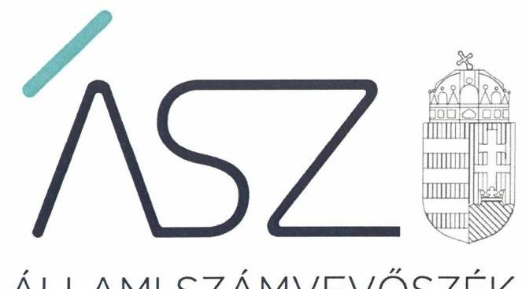
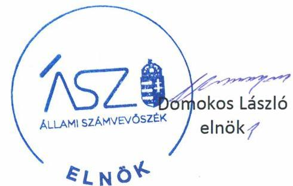
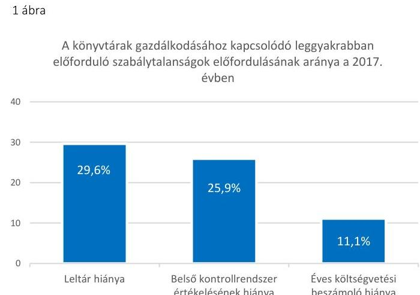
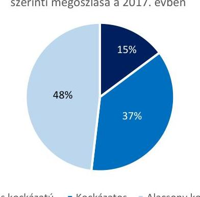
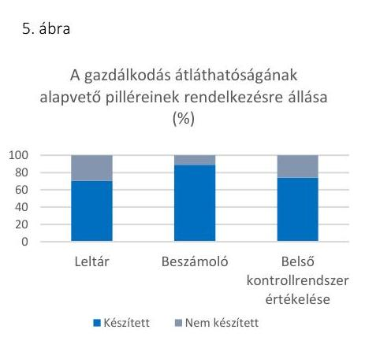
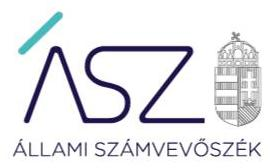

ÁLLAMI SZÁMVEVŐSZÉK

# JELENTÉS 

A nyilvános könyvtári ellátás múködésének kockázatértékelésen alapuló ellenőrzése

A nyilvános könyvtári ellátás múködésének kockázatértékelésen alapuló ellenőrzése
2020.

20017
www.asz.hu

---

ÁLLAMI SZÁMVEVŐSZÉK

# JELENTÉS

A nyilvános könyvtári ellátás működésének kockázatértékelésen alapuló ellenőrzése

A nyilvános könyvtári ellátás működésének kockázatértékelésen alapuló ellenőrzése

2020. 02. hó 04. nap

20017
www.asz.hu

---

# AZ ELLENŐRZÉST FELÜGYELTE: 

MAROZSÁN LÁSZLÓNÉ felügyeleti vezető

## AZ ELLENŐRZÉST VEZETTE ÉS A VÉGREHAJTÁSÁÉRT FELELŐS:

HOFMEISTER LÁSZLÓ ellenőrzésvezető

## A PROGRAM ÖSSZEÁLLÍTÁSÁÉRT FELELŐS:

SALAMON ILDIKÓ tervezési vezető

IKTATÓSZÁM: EL-2412-001/2020.
TÉMASZÁM: 2518
ELLENŐRZÉS-AZONOSÍTÓ SZÁM: V-086201

---

# TARTALOMJEGYZÉK 

■ ÖSSZEGZÉS ..... 5
■ AZ ELLENŐRZÉS CÉLJA ..... 7
■ AZ ELLENŐRZÉS TERÜLETE ..... 8
■ AZ ELLENŐRZÉS HÁTTERE, INDOKOLTSÁGA ..... 9
■ A JELENTÉS LÉNYEGES KÉRDÉSKÖREI ..... 10
■ ELLENŐRZÉS HATÓKÖRE ÉS MÓDSZEREI ..... 11
■ MEGÁLLAPÍTÁSOK ..... 13
■ MELLÉKLETEK ..... 15
I. sz. melléklet: Ellenőrzött könyvtárak kockázati területeinek értékelése ..... 15
II. sz. melléklet: Az ellenőrzött könyvtárakra vonatkozó egyedi ellenőrzési megállapítások és javaslatok ..... 16
III. sz. melléklet: Értelmező szótár ..... 23
■ FÜGGELÉK: ÉSZREVÉTELEK ..... 25
■ RÖVIDÍTÉSEK JEGYZÉKE ..... 31

---

.

---

# ÖSSZEGZÉS 

Az Állami Számvevőszék a kockázatalapon kiválasztott 27 könyvtár gazdálkodásának alapvető feltételei meglétét és a gazdálkodásuk átláthatóságát értékelte. A gazdálkodás alapvető szabályozottsága és ezzel a közpénzekkel való elszámoltathatóság öt könyvtárnál nem volt biztositott. A nemzeti vagyon védelme nem valósult meg tíz könyvtárnál.

## Az ellenőrzés társadalmi indokoltsága

Jelen ellenőrzés 27 könyvtár gazdálkodásának lényeges területeire terjedt ki. A könyvtárak kockázatelemzés alapján kerültek kiválasztásra, nem reprezentálják a hazai könyvtárakat. Az ellenőrzés hozzájárulhat a nyilvános könyvtárak ellenőrzésének nagyobb lefedettségéhez, támogatja a közpénzek felhasználásának és a közvagyon használatának szabályszerűségét, célszerűségét.

A könyvtárak felbecsülhetetlen nemzeti értékeket, az egyetemes kultúrához kapcsolódó dokumentumokat, gyűjteményeket őriznek. A társadalom egésze szempontjából szükséges a könyvtári ellátás fenntartása és fejlesztése. Az állami és önkormányzati fenntartású könyvtárak saját gyűjteményében nyilvántartott kulturális javak a nemzeti vagyon köréhez tartoznak.

A könyvtárak fenntartására fordított közpénz nagysága, a nyilvános könyvtárak fenntartóinak sokszínűsége, a nyilvános könyvtárak, és a feladatellátó helyek számossága, valamint a könyvtárak által kezelt speciális vagyoni kör, továbbá a témakört érintően azonosított kockázatok alátámasztják a nyilvános könyvtárak ellenőrzésének szükségességét.

## Főbb megállapítások, következtetések, javaslatok

Az ellenőrzés a kiválasztott könyvtárak gazdálkodásának lényeges területeit értékelte, melynek kockázati szintű értékelését az I. melléklet tartalmazza.

A 27 könyvtárnál a leggyakrabban előforduló szabálytalanságokat az 1. ábra mutatja be, melyeknek következtében a gazdálkodás átláthatósága és a vagyon védelme sérült.

---

#### 2. ábra

Az ellenőrzött könyvtárak 2017. évi gazdálkodása kockázati besorolásának megoszlását a 2. ábra szemlélteti.

A 27 ellenőrzött könyvtár közül a gazdálkodás értékelése alapján négy könyvtár minősült magas kockázatúnak, tekintettel a hiányos számviteli szabályozásra, valamint az éves költségvetési beszámolót alátámasztó leltár és a belső kontrollrendszer minősítésének hiányára, továbbá a beszámoló készítési kötelezettség teljesítésének elmulasztására. A számviteli keretek hiányos kialakítása nem biztosította a szabályszerű közpénzfelhasználást. Alátámasztott mérleg hiányában a könyvtárak éves költségvetési beszámolója nem volt megalapozott, a vagyon védelme nem volt biztosított. A belső kontrollrendszer minőségének értékelése a könyvtár vezetőjének elszámoltathatóságához kapcsolódó alapdokumentum, így annak hiánya következtében a felelős vezetői feladatellátás nem valósult meg.

Az ellenőrzött könyvtárak közül 12 könyvtár kapott kockázatos minősítést. Ezen könyvtárak esetén a gazdálkodás lényeges területén állapított meg szabálytalanságot az Állami Számvevőszék. A számviteli szabályozás és a kontrollrendszer hiányosságai a gazdálkodás kockázatait növelték, a közpénzek szabályszerű felhasználását nem biztosították.

Jogkövető magatartást az ellenőrzés során 11 könyvtárnál tapasztalt az ÁSZ1. Ezek a könyvtárak kialakították a szabályszerű gazdálkodás alapvető feltételeit, továbbá összeállították a vagyon elsődleges védelmét jelentő leltárral alátámasztott éves költségvetési beszámolójukat. Jogkövető magatartásuknak köszönhetően ezeknek a könyvtáraknak a gazdálkodását alacsony kockázati szintűnek értékelte az ÁSZ.

A 2017. évet követően javult az ellenőrzött könyvtárak szabályozottsága. A jobb szabályozási környezetben gazdálkodó könyvtáraknál a közpénzfelhasználás a 2019. évre alacsonyabb kockázatot hordoz.

---

# AZ ELLENŐRZÉS CÉLJA 

Az ellenőrzés célja annak megállapítása volt, hogy a nyilvános könyvtárak biztosították-e a szabályszerű pénzügyi és vagyongazdálkodás alapvető feltételeit.

---

# **AZ ELLENŐRZÉS TERÜLETE**

### **Könyvtárak**

A kockázatelemzés alapján ellenőrzésre kijelölt 27 nyilvános könyvtár közül 24 könyvtár önkormányzati fenntartású, ezek irányító szervei a települési vagy megyei önkormányzatok. A Magyar Mezőgazdasági Múzeum és Könyvtár irányító szerve az Agrárminisztérium, az Országos Széchenyi Könyvtár irányító szerve az Emberi Erőforrások Minisztériuma. Az MTA könyvtár és Információs Központ fenntartója és irányító szerve a Magyar Tudományos Akadémia. Az ellenőrzött intézmények mindegyike önálló jogi személy.

Az ellenőrzött intézmények alaptevékenysége a nyilvános könyvtári ellátás biztosítása és közművelődési tevékenység ellátása, néhány intézmény esetében közgyűjteményi feladatok ellátása.

---

# AZ ELLENŐRZÉS HÁTTERE, INDOKOLTSÁGA 

A könyvtárak fenntartására fordított közpénz nagysága, a nyilvános könyvtárak fenntartóinak sokszínűsége, a nyilvános könyvtárak, és a feladatellátó helyek számossága, valamint a könyvtárak által kezelt speciális vagyoni kör, továbbá a témakört érintően azonosított kockázatok alátámasztották a nyilvános könyvtárak ellenőrzésének szükségességét.

Az állami és önkormányzati fenntartású könyvtárak saját gyűjteményében nyilvántartott kulturális javak a nemzeti vagyon köréhez tartoznak, ezért a vagyon értékmegőrzése, gyarapítása, állagának védelme, illetve hasznosítása terén megtett intézkedések kiemelkedő fontosságúak.

A lényeges területekre kiterjedő ellenőrzés hozzájárult - az ellenőrzött szervezetek leterheltségének mérséklése mellett - az ellenőrzés időtartamának csökkentéséhez, vagyis az ellenőrzési hatékonyság növeléséhez, továbbá az ellenőrzött szervezetek számának növeléséhez, ezáltal a nyilvános könyvtárak ellenőrzésének nagyobb lefedettségéhez. A lényeges területekre kiterjedő ellenőrzések előmozdíthatják a közpénzek felhasználásának és a közvagyon használatának célszerűségét és hatékonyságát.

---

# A JELENTÉS LÉNYEGES KÉRDÉSKÖREI 

1. A könyvtárak biztositották-e a gazdálkodás alapvető feltételeit?
2. A könyvtárak gazdálkodása átlátható volt-e?

---

# ELLENŐRZÉS HATÓKÖRE ÉS MÓDSZEREI 

## Az ellenőrzés típusa

Megfelelőségi ellenőrzés.

## Az ellenőrzött időszak

2017-2018. évek.

## Az ellenőrzés tárgya

A nyilvános könyvtárak vonatkozásában a gazdálkodás átláthatóságának ellenőrzése, továbbá annak értékelése, hogy biztosították-e a gazdálkodás szabályozottságát és a kontrolltevékenységek kialakítását.

## Az ellenőrzött szervezetek

A kockázati alapon kiválasztott 27 könyvtár a II. melléklet szerint.

## Az ellenőrzés jogalapja

Az ÁSZ tv. ${ }^{2}$ 1. § (3) bekezdése, az 5. § (2)-(3) bekezdései, a (4) bekezdés a) pontja, továbbá a (6) bekezdése.

## Az ellenőrzés módszerei

Az ellenőrzést az ellenőrzött időszakban hatályos jogszabályok, az ellenőrzés szakmai szabályai, a jelen ellenőrzésre irányadó ÁSZ módszertanok, az ellenőrzési programban foglalt értékelési szempontok szerint hajtotta végre az ÁSZ. Az ellenőrzést az ÁSZ a program kérdéseire adott válaszok kiértékelésével, valamint a programban ismertetett adatforrások, továbbá az adott időszakban hatályos jogszabályok figyelembevételével folytatta le.

A kockázatértékelésen alapuló, új módszertanú ellenőrzés a pénzügyi és vagyongazdálkodás lényeges területeire terjedt ki, és súlypontok meghatározásával lehetőséget biztosított a kockázatok beazonosítására. A kockázatokat két lényeges kérdéskörön belül három kockázati terület alapján értékelte az ÁSZ:

1. A gazdálkodás alapvető feltételeinek biztosításának ellenőrzése
$\longrightarrow$ a gazdálkodás szabályozottsága

---

$\longrightarrow$ a kontrolltevékenységek kialakítása
2. A gazdálkodás átláthatóságának ellenőrzése

A kockázati területek értékelése alapján kerültek besorolásra az egyes könyvtárak alacsony, kockázatos és magas kockázatú kategóriákba.

Az ellenőrzés ideje alatt az ellenőrzött szervezettel történő kapcsolattartás az ÁSZ szervezeti és működési szabályzatának vonatkozó előírásai alapján volt biztosított.

---

# 1. A könyvtárak biztosították-e a gazdálkodás alapvető feltételeit? 

Összegző megállapítás

A kockázatalapon kiválasztott 27 könyvtár közül 22 kialakította a szabályszerű gazdálkodás alapvető szabályozási feltételeit a 2017. évben.

A GAZDÁLKODÁS SZABÁLYOZOTTSÁGA az ellenőrzött könyvtárak többségénél alacsony kockázatot hordozott, mivel a könyvtárak biztosították a szabályszerű gazdálkodás alapvető feltételeit. Egy könyvtár nem alakította ki az Áhsz. ${ }^{3} 50 . \S$ (1) bekezdésben és a Számv. tv. ${ }^{4}$ 14. § (3) bekezdésében előírtak ellenére számviteli politikáját, valamint annak keretében nem készítette el Számv. tv. 14. § (5) bekezdés rendelkezései ellenére az eszközök és a források leltárkészítési és leltározási szabályzatát, az eszközök és a források értékelési szabályzatát, a pénzkezelési szabályzatát a 2017. évben. Ezáltal nem volt biztosított a közpénzfelhasználás szabályozottsága. A Számv. tv. által meghatározott szabályzatok rendelkezésre állására vonatkozó adatokat a 3. ábra szemlélteti.

## A KONTROLLTEVÉKENYSÉGEK KIALAKÍTÁSÁ-

NAK hiánya három ellenőrzött esetében hordozott kockázatot a pénzgazdálkodás elszámolásának szabályszerűsége tekintetében a 2017. évben.

Kettő könyvtárnál az Ávr. ${ }^{5}$ 13. § (2) bekezdés a) pontjának előírása ellenére a könyvtár vezetője nem szabályozta a gazdálkodási jogköröket gyakorló személyek kijelölésének rendjét.

Egy könyvtár vezetője a 2017. évben az Ávr. 60. § (3) bekezdésében foglaltak ellenére nem gondoskodott nyilvántartás vezetéséről a gazdálkodási jogkörök gyakorlására jogosult személyekről és aláírás-mintájukról.

Az ellenőrzött könyvtárak gazdálkodási jogkörgyakorlása szabályozásával és a gazdálkodási jogkörgyakorlókra vonatkozó nyilvántartással kapcsolatos tevékenységének értékelését a 4. ábra mutatja be a 2017. évre vonatkozóan.

## 2. A könyvtárak gazdálkodása átlátható volt-e?

## Összegző megállapítás

A 2017. évben 13 ellenőrzött könyvtár gazdálkodása nem volt átlátható.

LELTÁRRAL NEM TÁMASZTOTTA ALÁ hét könyvtár az éves költségvetési beszámolója mérlegtételeit az Áhsz. 5. § (1) bekezdés, az Áhsz. 22. § (1)-(2) bekezdései, valamint a Számv. tv. 69. § (1) bekezdés előírásai ellenére a 2017. évben. Leltárral alátámasztott mérleg hiányában

---

a könyvtárak éves költségvetési beszámolója nem volt megalapozott, a vagyon védelme nem volt biztosított.

ÉVES KÖLTSÉGVETÉSI BESZÁMOLÓT három ellenőrzött könyvtár az Áhsz. 5. § (1) bekezdésében foglaltak ellenére nem készített a 2017. évben, így nem volt biztosított a nemzeti vagyon védelme.

Hét könyvtár esetében a könyvtár vezetője az intézmény belső kontrollrendszerének minőségét nem értékelte a Bkr. ${ }^{6} 11 . \S$ (1) bekezdésének előírása ellenére a 2017. évben.

Az éves költségvetési beszámoló, a leltár, valamint belső kontrollrendszer értékeléséről szóló nyilatkozat rendelkezésre állását az ellenőrzött könyvtárak vonatkozásában az 5. ábra szemlélteti.

Az egyes ellenőrzött könyvtáraknál tapasztalt 2017-2018. évi egyedi szabálytalanságokat, jogszabályi követelményeket és a kapcsolódó javaslatokat kockázati szintek szerinti csoportosításban a II. számú melléklet mutatja be.

---

# MELLÉKLETEK

I. SZ. MELLÉKLET: ELLENŐRZÖTT KÖNYVTÁRAK KOCKÁZATI TERÜLETEINEK ÉRTÉKELÉSE

|  Könyvtár megnevezése | 1. lényeges kérdéskör |  |  |  | 2. lényeges kérdéskör |  | Összesiített kockázati értékelés |   |
| --- | --- | --- | --- | --- | --- | --- | --- | --- |
|   | Gazdálkodás szabályozottságának kockázati értékelése |  | Kontrolltevékenységek kialakításának kockázati értékelése |  | Gazdálkodás átláthatóságának kockázati értékelése |  |  |   |
|   | 2017. | 2018. | 2017. | 2018. | 2017. | 2018. | 2017. | 2018.  |
|  Bács-Kiskun Megyei Katona József Könyvtár (Kecskemét) |  |  |  |  |  |  |  |   |
|  Balassi Bálint Megyei Könyvtár (Salgótarján) |  |  |  |  |  |  |  |   |
|  Békés Megyei Könyvtár (Békéscsaba) |  |  |  |  |  |  |  |   |
|  Borsodnádasdi Közösségi Ház és Könyvtár |  |  |  |  |  |  |  |   |
|  Bródy Sándor Megyei és Városi Könyvtár (Eger) |  |  |  |  |  |  |  |   |
|  Csorba Győző Könyvtár (Pécs) |  |  |  |  |  |  |  |   |
|  Dr. Kovács Pál Könyvtár és Közösségi Tér (Győr) |  |  |  |  |  |  |  |   |
|  Fegyverneki Müvelődési Ház és Könyvtár |  |  |  |  |  |  |  |   |
|  Fővárosi Szabó Ervin Könyvtár (Budapest) |  |  |  |  |  |  |  |   |
|  Halis István Városi Könyvtár (Nagykanizsa) |  |  |  |  |  |  |  |   |
|  II. Rákóczi Ferenc Megyei és Városi Könyvtár (Miskolc) |  |  |  |  |  |  |  |   |
|  Kék Géza Müvelődési Ház és Könyvtár (Diósd) |  |  |  |  |  |  |  |   |
|  Körösladányi Általános Müvelődési Központ |  |  |  |  |  |  |  |   |
|  Kunhegyes Városi Könyvtár és Közművelődési Intézmény |  |  |  |  |  |  |  |   |
|  Magyar Mezőgazdasági Múzeum és Könyvtár (Budapest) |  |  |  |  |  |  |  |   |
|  Márai Sándor Közművelődési Intézmény és Városi Könyvtár (Halásztelek) |  |  |  |  |  |  |  |   |
|  Méliusz Juhász Péter Könyvtár (Debrecen) |  |  |  |  |  |  |  |   |
|  Mészáros Károly Városi Könyvtár (Hajdúdorog) |  |  |  |  |  |  |  |   |
|  Magyar Tudományos Akadémia Könyvtár és Információs Központ (Budapest) |  |  |  |  |  |  |  |   |
|  Országos Széchényi Könyvtár (Budapest) |  |  |  |  |  |  |  |   |
|  Könyvtár és Müvelődési Ház (Pusztaszabolcs) |  |  |  |  |  |  |  |   |
|  Városi Müvelődési Ház, Könyvtár és Szabadidő Központ (Soltvadkert) |  |  |  |  |  |  |  |   |
|  Somogyi Károly Városi és Megyei Könyvtár (Szeged) |  |  |  |  |  |  |  |   |
|  Széchenyi István Városi Könyvtár (Sopron) |  |  |  |  |  |  |  |   |
|  Tát Város Önkormányzat Kultúrház és Könyvtár |  |  |  |  |  |  |  |   |
|  Tatabánya Megyei Jogú Város József Attila Megyei és Városi Könyvtár |  |  |  |  |  |  |  |   |
|  Vörösmarty Mihály Könyvtár (Székesfehérvár) |  |  |  |  |  |  |  |   |

Jelmegyerázat:

---

# Magas kockázatú könyvtárak 

## Csorba Győző Könyvtár

## Megállapítások

A könyvtár gazdálkodására vonatkozó belső szabályozás nem felelt meg az előírásoknak, mivel a 2017-2018. években nem rendelkezett az Áhsz. 50. § (1) bekezdés és a Számv. tv. 14. § (5) bekezdés b) pontjában előírt eszközök és a források értékelési szabályzattal.

A könyvtár a 2017-2018. évekre vonatkozó éves költségvetési beszámoló mérlegtételeinek alátámasztásához leltárt nem állított össze az Áhsz. 5. § (1) bekezdésében, az Áhsz. 22. § (1)-(2) bekezdésében, valamint a Számv. tv. 69. § (1) bekezdés előírásában foglaltak ellenére.

A könyvtár vezetője a Bkr. 11. § (1) bekezdésében előírtak ellenére a 2017-2018. évekre vonatkozóan a költségvetési szerv belső kontrollrendszerének minőségét nem értékelte.

## Javaslatok a Csorba Győző Könyvtár vezetője részére

1. Intézkedjen a jogszabályi előírásoknak megfelelően az eszközök és források értékelési szabályzatának elkészítéséről.
2. Intézkedjen az éves költségvetési beszámoló elkészítéséhez, a mérlegtételeinek alátámasztásához a jogszabályi előírásnak megfelelő leltár öszszeállításáról.
3. Gondoskodjon a Bkr. előírásának megfelelően az Intézmény belső kontrollrendszere minőségének értékeléséről.

## Kék Géza Művelődési Ház és Könyvtár

## Megállapítások

A könyvtár gazdálkodására vonatkozó belső szabályozás nem felelt meg az előírásoknak, mivel a 2017. évben nem rendelkezett az Áhsz. 50. § (1) bekezdés és a Számv. tv. 14. § (3) bekezdésében előírt számviteli politikával és az Számv. tv. 14. § (5) bekezdés a), b) és d) pontjaiban elkészítendő szabályzatok - az eszközök és a források leltárkészítési és leltározási szabályzata, az eszközök és a források értékelési szabályzata és a pénzkezelési szabályzat - egyikével sem.

Éves költségvetési beszámolót a 2017. évben az Áhsz. 5. § (1) bekezdésében foglaltak ellenére nem készítettek.

---

# Széchenyi István Városi Könyvtár 

## Megállapítások

A 2017. évben az Ávr. 60. § (3) bekezdésében foglaltak ellenére az ellenjegyzésre és érvényesítésre jogosult személyekről és aláírás-mintájukról nem vezetettek nyilvántartást.

A könyvtár a 2017. évre vonatkozó éves költségvetési beszámoló mérlegtételeinek alátámasztásához leltárt nem állított össze az Áhsz. 5. § (1) bekezdésében, az Áhsz. 22. § (1)-(2) bekezdésében, valamint a Számv. tv. 69. § (1) bekezdés előírásában foglaltak ellenére.

## Tát Város Önkormányzat Kultúrház és Könyvtár

## Megállapítások

A könyvtár a 2017. évben nem állított össze leltárt az Áhsz. 5. § (1) bekezdésében, az Áhsz. 22. § (1)-(2) bekezdésében, valamint a Számv. tv. 69. § (1) bekezdés előírásában foglaltak ellenére.

Éves költségvetési beszámolót a 2017. évben az Áhsz. 5. § (1) bekezdésében foglaltak ellenére nem készítettek.

A könyvtár vezetője Az Ávr. 13. § (2) bekezdés a) pontjának előírása ellenére nem szabályozta a 2017-2018. években a gazdálkodási jogköröket gyakorló személyek kijelölésének rendjét.

A könyvtár vezetője a Bkr. 11. § (1) bekezdésében előírtak ellenére a 2017. évre vonatkozóan a költségvetési szerv belső kontrollrendszerének minőségét nem értékelte.

## Javaslat Tát Város Önkormányzat Kultúrház és Könyvtár vezetője részére

Intézkedjen az Ávr. előírásainak megfelelőn a gazdálkodási jogköröket gyakorló személyek kijelölésének rendjével kapcsolatos előírások belső szabályzatban való rendezéséről.

---

# Kockázatos besorolású könyvtárak 

## Borsodnádasdi Közösségi Ház és Könyvtár

## Megállapítások

A könyvtár a 2017. évre vonatkozó éves költségvetési beszámoló mérlegtételeinek alátámasztásához leltárt nem állított össze az Áhsz. 5. § (1) bekezdésében, az Áhsz. 22. § (1)-(2) bekezdésében, valamint a Számv. tv. 69. § (1) bekezdés előírásában foglaltak ellenére.

A könyvtár vezetője a Bkr. 11. § (1) bekezdésében előírtak ellenére a 2017. évre vonatkozóan a költségvetési szerv belső kontrollrendszerének minőségét nem értékelte.

## Bródy Sándor Megyei és Városi Könyvtár

## Megállapítás

A könyvtár a 2017. évre vonatkozó éves költségvetési beszámoló mérlegtételeinek alátámasztásához leltárt nem állított össze az Áhsz. 5. § (1) bekezdésében, az Áhsz. 22. § (1)-(2) bekezdésében, valamint a Számv. tv. 69. § (1) bekezdés előírásában foglaltak ellenére.

## Dr. Kovács Pál Könyvtár és Közösségi Tér

## Megállapítás

A könyvtár a 2017-2018. évekre vonatkozó éves költségvetési beszámoló mérlegtételeinek alátámasztásához leltárt nem állított össze az Áhsz. 5. § (1) bekezdésében, az Áhsz. 22. § (1)-(2) bekezdésében, valamint a Számv. tv. 69. § (1) bekezdés előírásában foglaltak ellenére.

## Javaslat Dr. Kovács Pál Könyvtár és Közösségi Tér vezetője részére

Intézkedjen az éves költségvetési beszámoló elkészitéséhez, a mérlegtételeinek alátámasztásához a jogszabályi előirásnak megfelelő leltár összeállításáról.

## Halis István Városi Könyvtár

## Megállapítás

A 2018. évben az Ávr. 60. § (3) bekezdésében foglaltak ellenére a gazdálkodási jogkörök gyakorlására jogosult személyekről és aláírás-mintájukról nem vezetettek nyilvántartást.

---

# Javaslat Halis István Városi Könyvtár vezetője részére 

Intézkedjen az Ávr. előírása szerinti nyilvántartás vezetéséről a gazdálkodási jogkörök gyakorlására jogosult személyekről és aláírás-mintájukról.

## Körösladányi Általános Művelődési Központ

## Megállapítások

Éves költségvetési beszámolót a 2017-2018. években az Áhsz. 5. § (1) bekezdésében foglaltak ellenére nem készítettek.

A könyvtár vezetője a Bkr. 11. § (1) bekezdésében előírtak ellenére a 2017-2018. évekre vonatkozóan a költségvetési szerv belső kontrollrendszerének minőségét nem értékelte.

## Javaslat a Körösladányi Általános Művelődési Központ vezetője részére

1. Intézkedjen az Áhsz. előírása szerinti éves költségvetési beszámoló elkészítéséről.
2. Gondoskodjon a Bkr. előírásának megfelelően az Intézmény belső kontrollrendszere minőségének értékeléséről.

## Kunhegyes Városi Könyvtár és Közművelődési Intézmény

## Megállapítás

A könyvtár vezetője a Bkr. 11. § (1) bekezdésében előírtak ellenére a 20172018. évekre vonatkozóan a költségvetési szerv belső kontrollrendszerének minőségét nem értékelte.

---

# Javaslat Kunhegyes Városi Könyvtár és Közművelődési Intézmény vezetője részére 

Gondoskodjon a Bkr. előírásának megfelelően az Intézmény belső kontrollrendszere minőségének értékeléséről.

## Magyar Mezőgazdasági Múzeum és Könyvtár

## Megállapítás

A könyvtár vezetője az Ávr. 13. § (2) bekezdés a) pontjának előírása ellenére nem szabályozta a 2017. évben a gazdálkodási jogköröket gyakorló személyek kijelölésének rendjét.

## Márai Sándor Közművelődési Intézmény és Városi Könyvtár

## Megállapítás

A könyvtár vezetője a Bkr. 11. § (1) bekezdésében előírtak ellenére a 2018. évre vonatkozóan a költségvetési szerv belső kontrollrendszerének minőségét nem értékelte.

## Javaslat Márai Sándor Közművelődési Intézmény és Városi Könyvtár vezetője részére

Gondoskodjon a Bkr. előírásának megfelelően az Intézmény belső kontrollrendszere minőségének értékeléséről.

## Magyar Tudományos Akadémia Könyvtár és Információs Központ

## Megállapítás

A könyvtár a 2017-2018. évekre vonatkozó éves költségvetési beszámoló mérlegtételeinek alátámasztásához leltárt nem állított össze az Áhsz. 5. § (1) bekezdésében, az Áhsz. 22. § (1)-(2) bekezdésében, valamint a Számv. tv. 69. § (1) bekezdés előírásában foglaltak ellenére.

---

# Javaslat Magyar Tudományos Akadémia Könyvtár és Információs Központ vezetője részére 

Intézkedjen az éves költségvetési beszámoló elkészitéséhez, a mérlegtételeinek alátámasztásához a jogszabályi előírásnak megfelelő leltár összeállításáról.

## Könyvtár és Múvelődési Ház (Pusztaszabolcs)

## Megállapítás

A könyvtár vezetője a Bkr. 11. § (1) bekezdésében előírtak ellenére a 20172018. évekre vonatkozóan a költségvetési szerv belső kontrollrendszerének minőségét nem értékelte.

## Javaslat Könyvtár és Múvelődési Ház vezetője részére (Pusztaszabolcs)

Gondoskodjon a Bkr. előírásának megfelelően az Intézmény belső kontrollrendszere minőségének értékeléséről.

## Városi Múvelődési Ház, Könyvtár és Szabadidő Központ (Soltvadkert)

## Megállapítás

A könyvtár vezetője a Bkr. 11. § (1) bekezdésében előírtak ellenére a 20172018. évekre vonatkozóan a költségvetési szerv belső kontrollrendszerének minőségét nem értékelte.

## Javaslat Városi Múvelődési Ház, Könyvtár és Szabadidő Központ (Soltvadkert )vezetője részére

Gondoskodjon a Bkr. előírásának megfelelően az Intézmény belső kontrollrendszere minőségének értékeléséről.

## Vörösmarty Mihály Könyvtár

## Megállapítás

A könyvtár a 2017-2018. évekre vonatkozó éves költségvetési beszámoló mérlegtételeinek alátámasztásához leltárt nem állított össze az Áhsz. 5. § (1) bekezdésében, az Áhsz. 22. § (1)-(2) bekezdésében, valamint a Számv. tv. 69. § (1) bekezdés előírásában foglaltak ellenére.

---

# Javaslat a Vörösmarty Mihály Könyvtár vezetője részére 

Intézkedjen az éves költségvetési beszámoló elkészitéséhez, a mérlegtételeinek alátámasztásához a jogszabályi előirásnak megfelelő leltár öszszeállitásáról.

## Alacsony kockázati besorolású könyvtárak

Ezen könyvtárak biztosították a szabályszerű gazdálkodás alapvető feltételeit, elkészítették a leltárral alátámasztott éves költségvetési beszámolójukat.

- Bács-Kiskun Megyei Katona József Könyvtár
- Balassi Bálint Megyei Könyvtár
- Békés Megyei Könyvtár
- Fegyverneki Művelődési Ház és Könyvtár
- Fővárosi Szabó Ervin Könyvtár
- II. Rákóczi Ferenc Megyei és Városi Könyvtár
- Méliusz Juhász Péter Könyvtár
- Mészáros Károly Városi Könyvtár
- Országos Széchényi Könyvtár
- Somogyi Károly Városi és Megyei Könyvtár
- Tatabánya Megyei Jogú Város József Attila Megyei és Városi Könyvtár

---

# III. SZ. MELLÉKLET: ÉRTELMEZŐ SZÓTÁR 

belső kontrollrendszer

A belső kontrollrendszer a kockázatok kezelése és tárgyilagos bizonyosság megszerzése érdekében kialakított folyamatrendszer, amely azt a célt szolgálja, hogy a múködés és gazdálkodás során a tevékenységeket szabályszerűen, gazdaságosan, hatékonyan, eredményesen hajtsák végre, az elszámolási kötelezettségeket teljesítsék, megvédjék az erőforrásokat a veszteségektől, károktól és nem rendeltetésszerű használattól. (Forrás: Áht. ${ }^{7}$ 69. § (1) bekezdése)
kontrolltevékenységek

A költségvetési szerv vezetője által a szervezeten belül kialakított (kontroll) tevékenységek, melyek biztosítják a kockázatok kezelését, hozzájárulnak a szervezet céljainak eléréséhez és erősítik a szervezet integritását. (Forrás: Bkr. 8. § (1) bekezdés)
könyvtár
nyilvános könyvtári ellátás
a muzeális intézményekről, a nyilvános könyvtári ellátásról és a közművelődésről szóló 1997. évi CXL törvényben meghatározott könyvtári dokumentumok rendszeres gyűjtését, feltárását, megőrzését és használatát biztosító szervezet.
a nyilvános könyvtárak által nyújtott szolgáltatások és az e szolgáltatások nyújtását elősegítő központi szolgáltatások összessége, amelyek biztosítják az információhoz való szabad hozzáférést.

---

.

---

# FÜGGELÉK: ÉSZREVÉTELEK 

A jelentéstervezetet a Számvevőszék 15 napos észrevételezésre megküldte az ellenőrzött szervezetek vezetőinek az ÁSZ tv. 29. §* (1) bekezdése előírásának megfelelően.

A jelentéstervezet megállapításaira a Bródy Sándor Megyei és Városi Könyvtár igazgatója, a Dr. Kovács Pál Könyvtár és Közösségi Tér igazgatója, a Kunhegyes Városi Könyvtár és Közművelődési Intézmény igazgatója, a Magyar Mezőgazdasági Múzeum és Könyvtár föigazgatója, a Márai Sándor Közművelődési Intézmény és Városi Könyvtár igazgatója és a Széchenyi István Városi Könyvtár igazgatója tett észrevételt.
Az ÁSZ tv. 29. § (3) bekezdésével összhangban az ÁSZ a Függelékben feltünteti az ellenőrzés megállapításaival kapcsolatban tett, figyelembe nem vett észrevételeket, és megindokolja, hogy azokat miért nem fogadta el.

[^0]
[^0]:    * 29. § (1) Az Állami Számvevőszék az ellenőrzési megállapításait megküldi az ellenőrzött szervezet vezetőjének vagy az általa megbízott személynek, és annak, akinek személyes felelősségét állapította meg.
    (2) Az ellenőrzött szervezet vezetője és a felelősként megjelölt személy az ellenőrzés megállapításaira tizenöt napon belül írásban észrevételt tehet.
    (3) Az Állami Számvevőszék az észrevételre a beérkezésétől számított harminc napon belül írásban válaszol. A figyelembe nem vett észrevételeket köteles a jelentésben feltüntetni, és megindokolni, hogy azokat miért nem fogadta el.

---

# A Bródy Sándor Megyei és Városi Könyvtár igazgatója által tett észrevétel 

Az igazgató észrevételében leírta, hogy az ÁSZ által hiányolt mérlegtételeket alátámasztó leltárt a Bródy Sándor Megyei és Városi Könyvtár vonatkozásában az ÁSZ rendelkezésére bocsátották a 2018. augusztus 16-án, 2019. január 15-én és 2019. március 19-én kelt teljességi és hitelességi nyilatkozataik szerint.

Az ÁSZ az ellenőrzési megállapításait az ellenőrzött időszakban hatályos jogszabályok és az ellenőrzött szervezet közreműködési kötelezettsége keretében, az ellenőrzött szervezet által rendelkezésre bocsátott, Teljességi és hitelességi nyilatkozattal alátámasztott dokumentumokra alapozva fogalmazta meg. A Bródy Sándor Megyei és Városi Könyvár (továbbiakban: Könyvtár) igazgatója, továbbá a Könyvtár gazdálkodási feladatait 2017. január 1-jét követően ellátó Egri Köszzolgáltatások Városi Intézménye igazgatója által aláírt Teljességi és hitelességi nyilatkozatokban foglaltak szerint az átadott dokumentumok, adatok megbízhatóak, az ÁSZ által bekért adatokra, dokumentumokra vonatkozóan teljes körű információt tartalmaznak.

Az észrevételt az ÁSZ nem fogadja el. Az ellenőrzési dokumentumok ismételt felülvizsgálata során megállapítást nyert, hogy a 2017. évben a mérlegsorokat tételesen mennyiségben és értékben a Könyvtár leltárral nem támasztotta alá. A nemzeti vagyonba tartozó befektetett eszközök, a saját tőke és - a Költségvetési évben esedékes kötelezettségek munkaadókat terhelő járulékokra és szociális hozzájárulás adóra mérlegsor kivételével - a kötelezettségek 2017. évi mérlegben kimutatott összegének leltárral való alátámasztását az adatszolgáltatás során beküldött és Igazgató úrhölgy által az észrevételében is hivatkozott dokumentumok nem igazolják. A „Mérlegleltár 2017 S.pdf" dokumentum alapján továbbá az adott előlegek összege tekintetében a leltárban szereplő és az éves költségvetési beszámoló mérlegében kimutatott összeg eltért, így a D/III. Követelés jellegű sajátos elszámolások mérlegsor összegét a Könyvtár leltárral nem támasztotta alá. A fentiek alapján a 2017. évben a Könyvtár a vagyonelemek teljes körére, így a beszámoló mérlegsorainak alátámasztására az Áhsz. 5. § (1), 22. § (1)-(2) bekezdéseiben, valamint a Számv. tv. 69. § (1) bekezdésében előírt leltárt nem állított össze, ezért a jelentéstervezet leltárra vonatkozó megállapítása helytálló, a jelentéstervezet módosítása nem indokolt.

## A Dr. Kovács Pál Könyvtár és Közösségi Tér igazgatója által tett észrevétel

Az igazgató észrevétele szerint a 2017 és 2018. évi mérlegek leltárral való alátámasztását igazoló dokumentumokat feltöltötték az ÁSZ elektronikus rendszerébe.

Az Áhsz. 22. § (1) bekezdés szerint az éves költségvetési beszámoló elkészítéséhez, a mérleg tételeinek alátámasztásához olyan leltárt kell összeállítani és megőrizni, amely tételesen, ellenőrizhető módon tartalmazza a mérlegben szereplő eszközöket és forrásokat. A leltározás konkrét szabályait a Dr. Kovács Pál Könyvtár és Közösségi Tér (a továbbiakban: Könyvtár) számviteli politika keretében elkészített Leltárkészítés és leltározási szabályzatában (a továbbiakban: szabályzat) határozta meg. A szabályzat 2.9 pontjában a leltárral szemben támasztott alaki és tartalmi követelmények, a 2.10. pontban a leltározás módja került meghatározásra. Az eszközök, források leltározására vonatkozóan a szabályzat 5.1. pontja ad iránymutatást.

Az ellenőrzés során az EL-0968-004/2018. és az EL-0968-033/2019. iktatószámú adatbekérő levelekben kérte az ÁSZ - többek között - a könyvtár mérleg tételeit alátámasztó leltárainak dokumentumait, a leltározási ütemtervet, a leltározás összesített kiértékeléséről készített dokumentumot, a mérlegsorokat alátámasztó leltár egyeztetések dokumentumait.

A Könyvtár az adatszolgáltatás során a mérlegtételek alátámasztására - az igazgató észrevételének mellékletében részletezett dokumentumokkal megegyező - dokumentumokat töltött fel. Az igazgató az adatszolgáltatás során beküldött dokumentumok hiánytalanságáért és hatályosságáért a 2018. augusztus 17-én, illetve a 2019. szeptember 16-án kelt teljességi és hitelességi nyilatkozatban teljes felelősséget vállalt.

Az ÁSZ az ellenőrzés megállapításait az ellenőrzési adatszolgáltatás során a részére törvényi határidőben rendelkezésre bocsátott hiteles dokumentumokra alapozva fogalmazta meg.

A Könyvtár által megküldött dokumentumok értékelése során megállapítást nyert, hogy 2017. évben mindössze a tárgyi eszközök és a készletek, 2018. évben csak a készletek leltára felelt meg a leltárral szemben támasztott kritériumoknak.

---

A 2017-2018. év vonatkozásában a követelések, a kötelezettségek, az aktív- és passzív időbeli elhatárolások, illetve 2018. évben a tárgyi eszközök mérlegsorainak alátámasztására megküldött dokumentumok nem felelnek meg az Áhsz. 22. § (1) bekezdésben foglaltaknak az alábbiak miatt:

- A források - saját tőke mérlegsorhoz sem 2017. évben, sem 2018. évben nem készült leltár;
- 2018. évben a tárgyi eszközök leltár kiértékelése tekintetében megküldött dokumentum nem hiteles, mivel nem tartalmazza a leltározás végrehajtásáért és ellenőrzéséért felelős személyek aláírását;
- A követelések, a kötelezettségek, az aktív- és passzív időbeli elhatárolások tekintetében 2017-2018. évben a könyvtár az adott főkönyvi kartonok - az adatszolgáltatás időpontjában történt - lekérdezéseit küldte meg, melyek nem azonosak az elvégzett leltározás (egyeztetés) eredményét dokumentáló leltárral. A dokumentumok hitelessége nem igazolt.

A fentiek alapján az igazgató észrevételét az ÁSZ nem fogadja el. A jelentéstervezet megállapítása helytálló, a Könyvtár a 2017-2018. évi beszámolója mérlegtételeinek alátámasztásához az Áhsz. 22. § (1) bekezdése szerint leltárt nem készített, a jelentéstervezet módosítása nem indokolt.

# A Kunhegyes Városi Könyvtár és Közművelődési Intézmény igazgatója által tett észrevétel 

Az igazgató észrevételében leírta, hogy Bkr. 11. § (1) bekezdésében előírt vezetői nyilatkozatot 2017. és 2018. év tekintetében is Kunhegyes Város Önkormányzatától, mint fenntartótól kérte meg az ÁSZ. Észrevételében megadta a dokumentumok teljességi és hitelességi nyilatkozatban feltüntetett sorszámait. Egyben arról adott tájékoztatást, hogy Kunhegyes Városi Könyvtár és Közművelődési Intézmény (továbbiakban: Könyvtár) gazdasági szervezettel nem rendelkező költségvetési szerv, gazdálkodással összefüggő feladatait a Kunhegyesi Polgármesteri Hivatal látja el. Leírta továbbá, hogy a Hivatal vezetője a felelős a belső kontrollrendszer működtetéséért, ezért nyilatkozata vonatkozik a Könyvtárra is.

Az ÁSZ az ellenőrzés megállapításait az ellenőrzési adatszolgáltatások során a részére törvényi határidőben rendelkezésre bocsátott hiteles dokumentumokra alapozva fogalmazta meg.

Az ellenőrzés során az EL-0950-003/2018 iktatószámú adatbekérő levél és az EL-0950-028/2019 iktatószámú adatbekérő levél címzettje a Könyvtár vezetőjeként az igazgató volt. Az adatbekérő levelek 2. számú mellékletét képező Dokumentumjegyzékek 1.5. pontjában és 9. pontjában kérte az ÁSZ a belső kontrollrendszer működésének értékeléséről szóló, a Bkr. 11. § (1) bekezdésének előírása alapján elkészítendő, a Bkr. 1. melléklet szerinti vezetői nyilatkozat megküldését.

A jelzett adatbekérésekhez kapcsolódóan az igazgató 2018. szeptember 7-i, illetve 2019. szeptember 18-i keltezésű teljességi és hitelességi nyilatkozatában kijelentette, hogy az ÁSZ rendelkezésére bocsátott dokumentumok, adatok megbízhatóak és a bekért adatokra, dokumentumokra vonatkozóan teljes körű információt tartalmaznak.

A Könyvtár által megküldött dokumentumok értékelése során megállapítást nyert, hogy az adatbekérésre nyitva álló határidő alatt az ÁSZ elektronikus adatszolgáltatási rendszerébe a 2017. és 2018. évekre vonatkozóan a belső kontrollrendszer működéséről a Könyvtár igazgatója által tett vezetői nyilatkozatok nem kerültek feltöltésre. Az igazgató által aláírt, fent hivatkozott teljességi és hitelességi nyilatkozatok 96. illetve 16. sora - mint ahogy ezt észrevételében is jelezte - a Könyvtár gazdasági feladatait ellátó Kunhegyesi Polgármesteri Hivatal jegyzőjének a nyilatkozatát tartalmazta.

Az Áht. 69. § (2) bekezdésének előírása értelmében a költségvetési szerv vezetője felelős a belső kontrollrendszer létrehozásáért, működtetéséért és fejlesztéséért. Továbbá a Bkr. 11. § (1) bekezdése a vezetői nyilatkozat megtételére vonatkozó kötelezettséget a költségvetési szerv vezetője részére írja elő, függetlenül a gazdasági feladatok ellátásának formájától, annak ellátását végző szervtől:„A költségvetési szerv vezetője köteles az 1. melléklet szerinti nyilatkozatban értékelni a költségvetési szerv belső kontrollrendszerének minőségét." A Bkr. 2. § nd) pontja értelmében a költségvetési szerv vezetője a helyi önkormányzati költségvetési szerv esetén annak vezetője.

A fentiekre tekintettel az ÁSZ az észrevételt nem fogadja el, a jelentéstervezet megállapítása helytálló, a jelentéstervezet módosítása nem indokolt.

---

# A Magyar Mezőgazdasági Múzeum és Könyvtár föigazgatója által tett észrevétel 

A főigazgató észrevételében jelezte, hogy Magyar Mezőgazdasági Múzeum és Könyvtár (továbbiakban: Könyvtár) rendelkezett a gazdálkodási jogköröket tartalmazó szabályzattal és a gazdálkodási jogköröket gyakorló személyek kijelölési rendjével, amelyet az ellenőrzési adatszolgáltatás során határidőn belül rendelkezésre bocsátottak, de adminisztrációs hiba miatt a 2017. évi Gazdálkodási Szabályzat aláírás nélküli példánya került megküldésre. A gazdálkodási jogköröket gyakorló személyek eredeti példányú kijelölései az aláírás nélküli szabályzat mögé kerültek szkennelésre és feltöltésre. Egyúttal jelezte, hogy észrevételéhez mellékelten csatolta a 2017. évi Gazdálkodási szabályzat hitelesített másolati példányát, továbbá a szabályzat intézményi iktatásának másolatát.
Az ÁSZ az ellenőrzés megállapításait az ellenőrzési adatszolgáltatások során a részére törvényi határidőben rendelkezésre bocsátott hiteles dokumentumokra alapozva fogalmazza meg. Az adatszolgáltatásra nyitva álló törvényi határidőn kívül, utólag rendelkezésre bocsátott dokumentumokat az ÁSZ nem értékeli.
Az EL-0962-016/2019. iktatószámú adatbekérő levélben és annak 2. számú mellékletét képező dokumentumjegyzékben aláírt és hiteles dokumentumok átadását kérte az ÁSZ, beleértve annak 5. sorában megjelölt „a gazdálkodási jogkörgyakorlásra vonatkozó belső szabályozás" dokumentumot is, amelyhez a Könyvtár egy aláírás nélküli dokumentumot szolgáltatott. A főigazgató észrevételében is elismerte, hogy az ellenőrzési adatszolgáltatás során a 2017. évi Gazdálkodási szabályzat aláírás nélküli példányát töltötték fel az adatszolgáltatási felületre. Fentiekre tekintettel az észrevételt az ÁSZ nem fogadja el, a jelentéstervezet megállapítása helytálló, módosítása nem indokolt.

## A Márai Sándor Közművelődési Intézmény és Városi Könyvtár igazgatója által tett észrevétel

A Márai Sándor Közművelődési Intézmény és Városi Könyvtár (továbbiakban: Könyvtár) igazgatója észrevételében leírta, hogy a Bkr. 11. § (1) bekezdésének megfelelően Halásztelek Képviselő-testülete számára előterjesztésre került a jelentéstervezet által hiányként értékelt költségvetési szerv belső kontrollrendszerének minőségéről szóló nyilatkozata. A nyilatkozatot megtette, az eltérés adminisztrációs hibából adódott. A fenntartóhoz benyújtott nyilatkozat keltezése, érkeztetési dátuma bizonyítja, hogy az a 2018. évi zárszámadási rendelethez készült.
Az ellenőrzés során 2018. évre vonatkozóan az EL-0949-021/2019 iktatószámú adatbekérő levél 2. számú mellékletét képező Dokumentumjegyzék 9. pontjában kérte az ÁSZ a Bkr. 11. § (1) bekezdésében előírt, Bkr. 1. melléklet szerinti vezetői nyilatkozat megküldését.
Az ÁSZ az ellenőrzés megállapításait az ellenőrzési adatszolgáltatás során a részére törvényi határidőben rendelkezésre bocsátott hiteles dokumentumokra alapozva fogalmazta meg.
A jelzett adatbekéréshez kapcsolódóan az igazgató 2019. szeptember 17-i keltezésű nyilatkozatában kijelentette, hogy az ÁSZ rendelkezésére bocsátott dokumentumok, adatok megbízhatóak és a bekért adatokra, dokumentumokra vonatkozóan teljes körű információt tartalmaznak. A Könyvtár által megküldött dokumentumok értékelése során megállapítást nyert, hogy az adatbekérésre nyitva álló határidő alatt az ÁSZ elektronikus adatszolgáltatási rendszerébe 2018. évre vonatkozóan a belső kontrollrendszer múködéséről vezetői nyilatkozat nem került feltöltésre. A nyilatkozat mellékletének 20. sorában feltüntetett - vezetői nyilatkozat 2018. pdf elnevezésű fájl a 2017. évre készített vezetői nyilatkozatot tartalmazta.
A fentiekre tekintettel az észrevételt az ÁSZ nem fogadja el, a jelentéstervezet megállapítása helytálló, 2018. évre vonatkozóan a Bkr. 11. § (1) bekezdés előírása ellenére, annak 1. melléklete szerint a költségvetési szerv belső kontrollrendszerének minőségét az igazgató nem értékelte. A jelentéstervezet módosítása nem indokolt.

## A Széchenyi István Városi Könyvtár igazgatója által tett észrevétel

A Széchenyi István Városi Könyvtár (továbbiakban: Könyvtár) igazgatója észrevételében leírta, hogy a 2017. év vonatkozásában a jelentéstervezet megállapításában hiányként szereplő nyilvántartást és a mérlegtételeket alátámasztó leltárt az ÁSZ rendelkezésére bocsátották a kért határidőben.
Az ÁSZ az ellenőrzési megállapításait az ellenőrzési adatszolgáltatás során a részére törvényi határidőben rendelkezésre bocsátott dokumentumokra alapozva fogalmazta meg.

---

Az ÁSZ az EL-0971-003/2018. iktatószámú adatbekérő levele 2. számú mellékletének 1.3. pontjában bekérte 20152017. évekre vonatkozóan a kötelezettségvállalásra, pénzügyi ellenjegyzésre, teljesítés igazolásra, érvényesítésre, utalványozásra jogosult személyekről és aláírás-mintájukról vezetett nyilvántartást.

Az igazgató a jelzett adatbekéréshez kapcsolódóan 2018. augusztus 21-ei keltezésű nyilatkozatában kijelentette, hogy az ÁSZ rendelkezésére bocsátott dokumentumok, adatok megbízhatóak és a bekért adatokra, dokumentumokra vonatkozóan teljes körű információt tartalmaznak.

Az ÁSZ rendelkezésére bocsátott, az igazgató észrevételében hivatkozott dokumentum ismételt felülvizsgálata alapján megállapítást nyert, hogy az a 2017. évre vonatkozóan nem tartalmazza a pénzügyi ellenjegyzésre, valamint az érvényesítésre jogosult személyek megnevezését, aláírás-mintáját. Ezáltal a Könyvtárnál az Ávr. 60. § (3) bekezdés előírása ellenére nem vezettek nyilvántartást a pénzügyi ellenjegyzésre és érvényesítésre jogosult személyekről és aláírás-mintájukról.

A fentiekre tekintettel az észrevételt az ÁSZ nem fogadja el, az ÁSZ megállapítása helytálló, a jelentéstervezet módosítása nem indokolt.

Az ÁSZ az EL-0971-003/2018. iktatószámú adatbekérő levele 2. számú mellékletének 1.4. pontjában bekérte 20152017. évekre vonatkozóan a mérleg tételeit alátámasztó leltárat. A jelzett adatbekéréshez kapcsolódóan az igazgató 2018. augusztus 21-ei keltezésű nyilatkozatában kijelentette, hogy az ÁSZ rendelkezésére bocsátott dokumentumok, adatok megbízhatóak és a bekért adatokra, dokumentumokra vonatkozóan teljes körű információt tartalmaznak.

Az ÁSZ rendelkezésére bocsátott, az igazgató észrevételében hivatkozott 2017. évre vonatkozó dokumentum felülvizsgálata során megállapítást nyert, hogy a 2017. évi mérlegsorokat tételesen mennyiségben és értékben a Könyvtár leltárral nem támasztotta alá. Az észrevételben hivatkozott és az ÁSZ részére az adatszolgáltatás során megküldött 'Mérleg alátámasztás2017.pdf' dokumentum nem tartalmazza a 2017. évi mérlegben szereplő források leltárát, ezáltal a források mérlegtételei leltárral nem alátámasztottak.

A leírt hiányosságokra tekintettel a Könyvtár 2017. évi költségvetési beszámolója mérlegtételeinek alátámasztásához az Áhsz. 5. § (1) és 22. § (1)-(2) bekezdéseiben, valamint a Számv. tv. 69. § (1) bekezdésében előírt leltárt nem állítottak össze.

A fentiekre tekintettel az észrevételt az ÁSZ nem fogadja el, az ÁSZ megállapítása helytálló, a jelentéstervezet módosítása nem indokolt.

---

.

---

# RÖVIDÍTÉSEK JEGYZÉKE 

${ }^{1}$ ÁSZ
${ }^{2}$ Ász tv.
${ }^{3}$ Áhsz.
${ }^{4}$ Számv. tv.
${ }^{5}$ Ávr.
${ }^{6}$ Bkr.
${ }^{7}$ Áht.

Állami Számvevőszék
2011. évi LXVI. törvény az Állami Számvevőszékről (hatályos 2011. július 1-jétől)
4/2013. (I. 11.) Korm. rendelet az államháztartás számviteléről (hatályos 2014. január 1-jétől)
2000. évi C. törvény a számvitelről (hatályos 2001. január 1-jétől)
368/2011. (XII. 31.) Korm. rendelet az államháztartásról szóló törvény végrehajtásáról (hatályos 2012. január 1-jétől)
370/2011. (XII. 31.) Korm. rendelet a költségvetési szervek belső kontrollrendszeréről és belső ellenőrzéséről (hatályos 2012. január 1-jétől)
2011. évi CXCV. törvény az államháztartásról (hatályos 2011. január 31-étől)

---

1052 Budapest, Apáczai Cs. J. u. 10. | PO box: 1364 Budapest 4. Pf. 54 TEL: +36 14849145
email: kapcsolattartas@asz.hu | international@asz.hu web: www.asz.hu | www.aszhirportal.hu