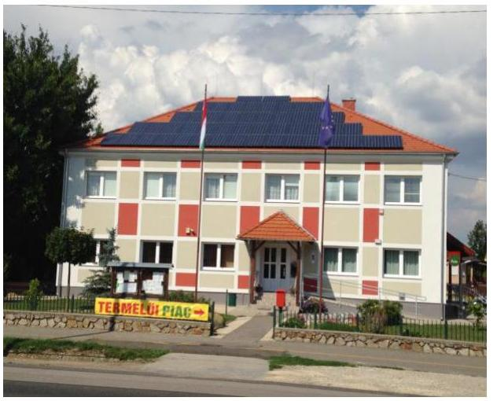
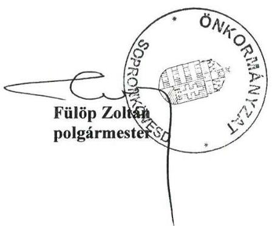
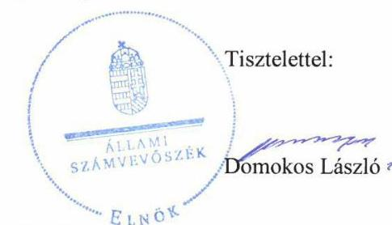
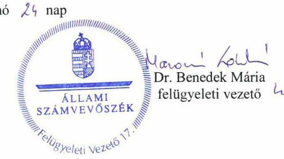

ÁLLAMI SZÁMVEVŐSZÉK

# JELENTÉS 

## Önkormányzatok ellenőrzése

Integritás- és belső kontrollrendszer, Befektetési tevékenységek ellenőrzése Sopronkövesd Községi Önkormányzat
2020.

20018
www.asz.hu

---

ÁLLAMI SZÁMVEVŐSZÉK

# JELENTÉS 

## Önkormányzatok ellenőrzése

Integritás- és belső kontrollrendszer, Befektetési tevékenységek ellenőrzése Sopronkövesd Községi Önkormányzat
2020. 02. hó 25. nap

20018
www.asz.hu

---

# AZ ELLENŐRZÉST FELÜGYELTE: 

DR. BENEDEK MÁRIA felügyeleti vezető

## AZ ELLENŐRZÉST VEZETTE ÉS A VÉGREHAJTÁSÁÉRT FELELŐS:

ASZTALOSNÉ ZUPCSÁN ERIKA ellenőrzésvezető
GÁL MAGDOLNA ellenőrzésvezető

## A PROGRAM ÖSSZEÁLLÍTÁSÁÉRT FELELŐS:

TÓTPÁL SZABOLCS osztályvezető

IKTATÓSZÁM: EL-2414-001/2020.
TÉMASZÁM: 2485
ELLENŐRZÉS-AZONOSÍTÓ SZÁM: V082932, V082999, V0829113

---

# TARTALOMJEGYZÉK 

■ ÖSSZEGZÉS ..... 5
■ AZ ELLENŐRZÉS CÉLJA ..... 7
■ AZ ELLENŐRZÉS TERÜLETE ..... 8
■ AZ ELLENŐRZÉS HÁTTERE, INDOKOLTSÁGA ..... 9
■ A JELENTÉS LÉNYEGES KÉRDÉSKÖREI ..... 10
■ AZ ELLENŐRZÉS HATÓKÖRE ÉS MÓDSZEREI ..... 11
■ MEGÁLLAPÍTÁSOK ..... 13
■ JAVASLATOK ..... 16
■ MELLÉKLETEK ..... 17
I. sz. melléklet: Értelmező szótár ..... 17
■ FÜGGELÉKEK ..... 19
I. sz. függelék a jelentéshez ..... 19
II. sz. függelék: Észrevételek ..... 20
■ RÖVIDÍTÉSEK JEGYZÉKE ..... 27

---

.

---

# ÖSSZEGZÉS 

A Sopronkövesd Községi Önkormányzat belső kontrollrendszerének kialakítása és müködtetése a 2013-2017. években nem volt szabályszerű, az nem biztositotta a befektetési tevékenység szabályszerű végzését. A befektetések nyilvántartása, leltározása nem volt szabályszerű, a 2017. évi beszámoló nem mutatott megbízható, valós összképet az önkormányzati vagyonról. A korrupciós kockázatokkal szembeni védettség nem volt biztositott.

## Az ellenőrzés társadalmi indokoltsága

Az Állami Számvevőszék alapvető feladata a közpénzekkel, az állami és önkormányzati vagyonnal való gazdálkodás ellenőrzése. Az Alaptörvény szerint az önkormányzatok kötelezettsége a kiegyensúlyozott, átlátható és fenntartható költségvetési gazdálkodás elvének érvényesítése, a nemzeti vagyonnal való rendeltetésszerű és felelős módon való gazdálkodás biztosítása. Az Állami Számvevőszék stratégiájában megfogalmazott célkitűzése az integritás alapú, átlátható és elszámoltatható közpénzfelhasználás elősegítése. Az önkormányzatok szabad pénzeszközeinek felhasználása során kiemelten fontos a felelős gazdálkodás érvényesülése, amely összhangban kell, hogy legyen az önkormányzati vagyongazdálkodás alapelveivel.

Ennek megvalósítása érdekében az Állami Számvevőszék prioritásként kezeli a közpénzzel gazdálkodó szervezetek esetében a belső kontrollrendszer, valamint a befektetési tevékenység szabályszerű működésének ellenőrzését.

## Főbb megállapítások, következtetések, javaslatok

Sopronkövesd Községi Önkormányzat belső kontrollrendszerének kialakítása és működtetése a 2013-2017. években nem volt szabályszerű.

Sopronkövesd Községi Önkormányzat jegyzője az integrált kockázatkezelési rendszert nem szabályszerűen müködtette, a 2017. évben nem gondoskodott az Önkormányzat minden szintjén érvényesülő kockázatkezelési rendszer működtetéséről. A 2017. évben a kontrollkörnyezet kialakítása szabályszerű volt, azonban sem a Sopronkövesd Községi Önkormányzat, sem a Sopronkövesdi Közös Önkormányzati Hivatal nem rendelkezett iratkezelési szabályzattal, így nem kerültek meghatározásra a köziratok kezelésével, nyilvántartásával és őrzésével kapcsolatos részletes szabályok. A kontrolltevékenységek, az információs és kommunikációs rendszer, valamint a monitoring rendszer működtetése szabályszerű volt.

Sopronkövesd Községi Önkormányzat nem alakított ki a teljesítmény mérésére alkalmas követelményeket, így a teljesítmény mérésének lehetőségét nem biztosította.

Sopronkövesd Községi Önkormányzat befektetési tevékenységének szabályszerű végzését a belső kontrollrendszer a 2013-2017. években nem biztosította. A befektetésekkel kapcsolatos döntéshozatal, a döntések végrehajtása, a befektetések számviteli elszámolása és nyilvántartása 2013-2016. években nem volt szabályszerű, a 2017. évben a befektetések nyilvántartása kivételével szabályszerű volt. Sopronkövesd Községi Önkormányzat a 2013-2016. években nem rendelkezett számviteli politikával és az annak keretében elkészítendő szabályzatokkal. Mindezek következtében a számviteli elszámolás, a leltározás, az értékelés, és a pénzkezelés szabályai nem kerültek rögzítésre, így a költségvetési beszámoló összeállítása során nem volt biztosított a számviteli alapelvek érvényesülése. A 2013-2016. években a belső kontrollrendszer kiépítettsége az alapvető szabályozások hiánya miatt nem szolgálta a közpénzfelhasználás szabályosságát, nem járult hozzá a szabálytalanságok és a hibák megelőzéséhez. A 2017. évben a befektetési jegyekkel kapcsolatos részletező nyilvántartás tartalmi hiányosságai miatt, a befektetések nyilvántartása nem volt szabályszerű. A befektetési jegyek, valamint a lekötött bankbetétek mérleg tételeinek alátámasztására a leltározás egyeztetéssel történő elvégzése nem történt meg. A feltárt szabálytalanságok következtében nem igazolt, hogy a 2017. évi éves beszámoló Sopronkövesd Községi Önkormányzat vagyoni és pénzügyi helyzetéről megbízható, valós

---

összképet mutatott. A közpénzek felhasználása és a nemzeti vagyon kezelése tekintetében nem érvényesült az átláthatóság Alaptörvényben foglalt elve.

Sopronkövesd Községi Önkormányzat az integritás alapú múködést nem biztosította, így nem volt védett a korrupciós kockázatokkal szemben.

Az Állami Számvevőszék az intézkedések megtétele céljából a Polgármester részére egy, a Jegyző részére öt javaslatot fogalmazott meg.

---

# AZ ELLENŐRZÉS CÉLJA 

AZ ELLENŐRZÉS CÉLJA annak megállapítása volt, hogy az önkormányzat belső kontrollrendszere biz-tosította-e a közpénzekkel és a nemzeti vagyonnal történő elszámoltatható, átlátható, szabályszerű, gazdaságos, hatékony és eredményes gazdálkodás feltételeit, a kontrollkörnyezet biztosította-e a befektetési tevékenységek szabályszerű végzését. Az ellenőrzés keretében értékeltük, hogy az önkormányzatnál kiépítették és erősítet-ték-e a korrupciós kockázatok kezelését szolgáló integritás kontrollokat, megteremtették-e a teljesítményellenőrzés feltételeit, továbbá, hogy az egyes befektetési tevékenységekkel kapcsolatos döntéshozatal és a döntések végrehajtása, valamint az egyes befektetések számviteli elszámolása, nyilvántartása szabályszerű volt-e, a külső és belső ellenőrzések támogatták-e az egyes befektetési tevékenységek szabályszerű végzését.

---

# **AZ ELLENŐRZÉS TERÜLETE**

## **Sopronkövesd Községi Önkormányzat**

Sopronkövesd község Győr-Moson-Sopron megyében fekszik. Lakossága 2018. január 1. napján – a Központi Statisztikai Hivatal által kiadott, Magyarország közigazgatási helynévkönyve alapján – 1306 fő volt.

Sopronkövesd Községi Önkormányzat hat tagú képviselőtestületének1 munkáját egy állandó bizottság segítette. A polgármester2 a 2014. évi önkormányzati választások óta töltötte be tisztségét. Sopronkövesd Községi Önkormányzat 2017-ben négy társulásnak volt tagja.

A Sopronkövesdi Közös Önkormányzati Hivatal öt település vonatkozásában látta el feladatait, gazdasági szervezettel nem rendelkezett, a foglalkoztatottak száma hét fő volt. A jegyző3 2013. január 1-jétől látta el feladatait.

Sopronkövesd Községi Önkormányzat a 2017. évi költségvetési beszámolója szerint 586,5 millió Ft költségvetési és 209,6 millió Ft finanszírozási bevételt ért el, 347,5 millió Ft költségvetési és 385,0 millió Ft finanszírozási kiadást teljesített. A könyvviteli mérleg szerinti eszközvagyon értéke 2017. december 31-én 2 356,0 millió Ft volt, melyből a tárgyi eszközök 1 662,6 millió Ft-ot, a pénzeszközök 68,4 millió Ft-ot, a követelések 186,3 millió Ft-ot tettek ki.

Sopronkövesd Községi Önkormányzat által a szabad pénzeszközei lekötésére vásárolt befektetési jegyek4 értéke 415,2 millió forint, a lekötött bankbetét értéke 36,9 millió forint volt 2017. december 31-én.

---

# AZ ELLENŐRZÉS HÁTTERE, INDOKOLTSÁGA 

A BELSŐ KONTROLLRENDSZER kialakítása és múködtetése nélkül nem valósítható meg a közpénzek, a közvagyon átlátható, szabályos, gazdaságos, hatékony és eredményes felhasználása. A belső kontrollrendszer azt a célt szolgálja, hogy a költségvetési szervek múködésük és gazdálkodásuk során a tevékenységeket szabályszerűen hajtsák végre, teljesítsék elszámolási kötelezettségeiket és megvédjék az erőforrásokat a veszteségektől, a károktól és a nem rendeltetésszerű használattól.

A belső kontrollrendszer magában foglalja mindazon elveket, eljárásokat és belső szabályzatokat, melyek biztosítják, hogy a költségvetési szerv valamennyi tevékenysége és célja összhangban legyen a szabályszerűséggel, szabályozottsággal, valamint a gazdaságosság, hatékonyság és eredményesség követelményeivel, az eszközökkel és forrásokkal való gazdálkodásban ne kerüljön sor pazarlásra, visszaélésre, rendeltetésellenes felhasználásra. Megfelelő, pontos és naprakész információk álljanak rendelkezésre a költségvetési szerv múködésével kapcsolatosan, és a belső kontrollrendszer harmonizációjára, összehangolására vonatkozó jogszabályok végrehajtásra kerüljenek. Az integritás kontrollok kiépítése, erősítése a szervezet korrupciós kockázatainak kezelését szolgálja. A teljesítménykövetelmények meghatározása és múködtetése megalapozhatja az önkormányzatoknál a teljesítményellenőrzés lefolytatását.

AZ ÖNKORMÁNYZATI VAGYONGAZDÁLKODÁS keretében az önkormányzatok átmenetileg szabad pénzeszközeinek befektetését jogszabály nem tiltja, a befektetések jellege nem korlátozott, a pénzpiaci szolgáltatók közül az önkormányzatok a kínált szolgáltatás és annak költségei alapján szabadon választhatnak, azonban a veszteséges gazdálkodás kockázatai és következményei az önkormányzatokat terhelik. A szabad pénzeszközök felhasználása során kiemelten fontos a felelős gazdálkodás érvényesülése, amely összhangban kell, hogy legyen, az önkormányzati gazdálkodás alapelveivel.

Az ellenőrzéssel feltárásra kerülhetnek azok a kockázatok, amelyek az önkormányzatok gazdálkodásával, ezen belül befektetési tevékenységeivel, kontrollkörnyezetével kapcsolatosak és a befektetési tevékenységek szabályszerű végrehajtását befolyásolják. Az ellenőrzéssel az önkormányzatok befektetési/vagyongazdálkodási döntései értékelhetővé válnak, és megalapozott megállapítás tehető arra vonatkozóan, hogy milyen hatást gyakoroltak az önkormányzat vagyonára a képviselő-testület döntései.

---

# A JELENTÉS LÉNYEGES KÉRDÉSKÖREI 

1.     - Az önkormányzat belső kontrollrendszerének kialakítása és müködtetése szabályszerű volt-e a 2017. évben?
2.     - Az önkormányzatnál alakítottak-e ki a teljesítmény mérésére alkalmas követelményeket?
3.     - Az önkormányzat befektetési tevékenységének szabályszerű végzését a kiépített belső kontrollrendszer biztositotta-e a 2013-2017. években, a befektetésekkel kapcsolatos döntéshozatal és a döntések végrehajtása, a befektetések számviteli elszámolása, nyilvántartása szabályszerű volt-e?

---

# AZ ELLENŐRZÉS HATÓKÖRE ÉS MÓDSZEREI 

## Az ellenőrzés típusa

Megfelelőségi ellenőrzés.

## Az ellenőrzött időszak

A belső kontrollrendszer ellenőrzésére vonatkozóan a 2017. év volt.
Az egyes befektetési tevékenységek ellenőrzése tekintetében a 2013. január 1 - 2017. december 31. közötti időszak volt.

## Az ellenőrzés tárgya

Az önkormányzat és a gazdálkodási feladatokat ellátó hivatala belső kontrollrendszerének kialakítása és múködtetése, valamint az integritás kontrollok kiépítettsége, a teljesítményellenőrzés feltételeinek rendelkezésre állása volt.

Az egyes befektetési tevékenységek esetében a Számv. tv. ${ }^{5}$ 3. § (6) bekezdés 2. és 3. pontja szerint az önkormányzat 2017. december 31-én meglévő befektetési jegyei, lekötött bankbetétei voltak.

## Az ellenőrzött szervezet

Sopronkövesd Községi Önkormányzat.

## Az ellenőrzés jogalapja

Az ellenőrzés jogszabályi alapját az ÁSZ tv ${ }^{6}$. 1. § (3) bekezdés, 5. § (2) és (6) bekezdései, valamint az Áht ${ }^{7}$. 61. § (2) bekezdésének előírásai képezték.

## Az ellenőrzés módszerei

Az ÁSZ ${ }^{8}$ az ellenőrzést az ellenőrzési program szempontjai, az ellenőrzött időszakban hatályos jogszabályok, az ellenőrzés szakmai szabályai, a jelen ellenőrzésre irányadó ÁSZ módszertanok figyelembevételével hajtotta végre.

Az ÁSZ az ellenőrzés ideje alatt az ellenőrzött szervezettel történő kapcsolattartást az ÁSZ SZMSZ ${ }^{9}$-ének vonatkozó előírásai alapján biztosította.

---

Az ellenőrzési kérdések megválaszolásához szükséges bizonyítékok megszerzése az ellenőrzött által rendelkezésre bocsátott dokumentumokra, adatokra alapozva mintavételezés, valamint elemző eljárás útján történt. Az ellenőrzési bizonyítékként felhasználható adatforrások közé tartoztak az ellenőrzési program részletes szempontjainál felsorolt adatforrások, valamint minden egyéb - az ellenőrzés folyamán feltárt, az ellenőrzés szempontjából információt tartalmazó - dokumentumok.

Az ellenőrzés lefolytatásához az ellenőrzött szervezet tanúsítványok kitöltésével, valamint az ÁSZ által kért dokumentumok megküldésével szolgáltatott adatokat, amelyek valódiságát és teljes körűségét az ellenőrzött szervezet vezetője által tett teljességi és hitelességi nyilatkozat igazolta. A rendelkezésre bocsátott adatok, információk kontrollja az ellenőrzés keretében történt.

Az önkormányzat belső kontrollrendszere egyes pilléreinek kialakítására és múködtetésére vonatkozó értékelés
$\longrightarrow$ „szabályszerü", amennyiben az értékelt területen az elért „igen" válaszok százalékban kifejezett, egész számra kerekített aránya legalább $85 \%$,
$\longrightarrow$ „nem szabályszerű", ha nem érte el a 85\%-ot.
Az önkormányzat belső kontrollrendszerének összesített értékelése az egyes részterületek esetében kapott megfelelőségi arányok számtani átlaga alapján történt és megegyezett a pillérenként (kontrollterületenként) alkalmazott százalékos értékelésekkel, a következő eltérésekkel: a kontrollrendszer egésze esetében a „szabályszerű" értékelésnek a százalékos értéken felül további feltétele, hogy egyik kontrollterület sem kaphatott „nem szabályszerű" értékelést.

A 2017. évi kiadások teljesítéséhez kapcsolódó pénzgazdálkodási belső kontrollok múködésének szabályszerűsége esetében az ellenőrzés azokra a legnagyobb értékű tételekre - a lényeges sokaságra - terjedt ki, melyek összértéke eléri a teljes sokaság összértékének 50\%-át.

A lényeges sokaságból véletlen mintavételi eljárással kiválasztott tételek kerültek ellenőrzésre.
„Szabályszerű egy ellenőrzött területet, amennyiben 95\%-os bizonyossággal az ellenőrzött sokaságban az átlagos hibaarány legfeljebb 10\%, "nem szabályszerű", amennyiben 10\%-nál magasabb arányt képviselt.

Amennyiben az önkormányzat múködését és gazdálkodását alapvetően meghatározó dokumentum hiánya miatt, valamely lényeges kérdéskörre vonatkozóan az ÁSZ megállapítást tett, további ellenőrzési tevékenységek az adott kérdéskörrel és az azzal szoros logikai kapcsolatban lévő kérdéskörökkel összefüggésben - ráépülő jelleggel - nem kerültek végrehajtásra.

---

# 1. Az önkormányzat belső kontrollrendszerének kialakítása és müködtetése szabályszerű volt-e a 2017. évben? 

Összegző megállapítás

Az Önkormányzat ${ }^{10}$ belső kontrollrendszerének kialakítása és müködtetése a 2017. évben nem volt szabályszerű.

A KONTROLLKÖRNYEZET kialakítása szabályszerű volt. A kép-viselő-testület elfogadta az Önkormányzati SZMSZ ${ }^{11}$-t, megalkotta az Önkormányzat Vagyonrendeletét ${ }^{12}$. A Hivatal ${ }^{13}$ rendelkezett Alapító okirat$\mathrm{tal}^{14}$, illetve Hivatali SZMSZ ${ }^{15}$-szel.

A polgármester kialakította az Önkormányzat számviteli politikáját és az annak keretében elkészítendő szabályzatokat ${ }^{16}$, elkészítette az Önkormányzat számlarendjét ${ }^{17}$.

A jegyző kialakította a Hivatal számviteli politikáját és az annak keretében elkészítendő szabályzatokat ${ }^{18}$, elkészítette a Hivatal számlarendjét ${ }^{19}$.

A jegyző az Ltv. ${ }^{20}$ 10. § (1) bekezdés a) és c) pontjait megsértve az Önkormányzat és a Hivatal vonatkozásában nem gondoskodott az iratkezelési szabályzat kiadásáról. Iratkezelési szabályzat hiányában a köziratok kezelésével, nyilvántartásával és őrzésével kapcsolatos részletes szabályok előírása nem volt biztosított.

## AZ INTEGRÁLT KOCKÁZATKEZELÉSI RENDSZER

működtetése nem volt szabályszerű.
A jegyző az Integrált kockázatkezelés eljárásrendjét ${ }^{21}$ kialakította, azonban a Bkr. 3. § b) pontjában foglaltak ellenére nem gondoskodott az Önkormányzat minden szintjén érvényesülő integrált kockázatkezelési rendszer működtetéséről.

A KONTROLLTEVÉKENYSÉGEK működtetése szabályszerű volt. A jegyző a kötelezettségvállalásra, pénzügyi ellenjegyzésre, teljesítés igazolására, érvényesítésre, utalványozásra jogosult személyekről és aláírás-mintájukról naprakész nyilvántartást vezetett. A kötelezettségvállalási és a teljesítés igazolási jogkörök gyakorlása szabályszerűen történt, továbbá az Ávr. ${ }^{22}$ szerinti összeférhetetlenségi szabályokat betartották.

## AZ INFORMÁCIÓS ÉS KOMMUNIKÁCIÓS RENDSZER működtetése szabályszerű volt. A jegyző elkészítette az adatvédelmi és adatbiztonsági szabályzatot ${ }^{23}$. Az Önkormányzat rendelkezett közérdekű adatok szabályzattal ${ }^{24}$, a közérdekű bejelentések szabályzatával ${ }^{25}$, valamint információs és kommunikációs szabályzattal ${ }^{26}$.

A MONITORING RENDSZER működtetése szabályszerű volt.
A jegyző kialakította az operatív tevékenységek keretében megvalósuló folyamatos és eseti nyomon követés rendszerét.

---

Az Önkormányzat éves belső ellenőrzési tervét a képviselő-testület jóváhagyta, az Önkormányzat rendelkezett a jegyző által jóváhagyott belső ellenőrzési kézikönyvvel ${ }^{27}$. A jegyző a külső ellenőrzésekről vezette a Bkr. szerinti nyilvántartást.

A belső ellenőrzési jelentésekben feltárt hiányosságok megszüntetése érdekében a jegyző elkészítette az intézkedési terveket.

A belső ellenőrzési vezető a Bkr. 47. § (1) bekezdésében előírtak ellenére nem vezetett olyan nyilvántartást, amellyel a belső ellenőrzési jelentésekben tett javaslatokra vonatkozó intézkedési terveket és azok végrehajtását nyomon követte volna, emiatt nem volt biztosított a javaslatok hasznosulásának és a feltárt hibák, hiányosságok kijavításának nyomon követése.

A jegyző a Bkr. 1. melléklete szerinti nyilatkozatban értékelte az Önkormányzat belső kontrollrendszerének minőségét. A jegyző nyilatkozatában a Hivatal kockázatkezelési rendszerének kialakítását folyamatban lévőnek értékelte. Az ÁSZ ellenőrzése igazolta a nyilatkozatban foglaltakat.

Az Önkormányzat nem végzett rendszeres kockázatelemzést az integritási, korrupciós kockázatok felmérésére, így nem volt védett a korrupciós kockázatokkal szemben.

# 2. Az önkormányzatnál alakítottak-e ki a teljesítmény mérésére alkalmas követelményeket? 

## Összegző megállapítás

Az Önkormányzatnál nem alakítottak ki a teljesítmény mérésére alkalmas követelményeket.

Az Önkormányzat a szervezeti célok elérését szolgáló feladatok, folyamatok, tevékenységek mérését szolgáló indikátorokat, mérőszámokat, fel-adat- és teljesítménymutatókat nem képzett, így a teljesítmény mérésének lehetőségét nem biztosította.

---

# 3. Az önkormányzat befektetési tevékenységének szabályszerű végzését a kiépített belső kontrollrendszer biztosította-e a 2013-2017. években, a befektetésekkel kapcsolatos döntéshozatal és a döntések végrehajtása, a befektetések számviteli elszámolása, nyilvántartása szabályszerű volt-e? 

Összegző megállapítás

A 2013-2017. években az önkormányzat befektetési tevékenységének szabályszerű végzését a belső kontrollrendszer nem biztosította. A befektetésekkel kapcsolatos döntéshozatal, a döntések végrehajtása, a befektetések számviteli elszámolása és nyilvántartása 2013-2016. években nem volt szabályszerű, a 2017. évben a befektetések nyilvántartása kivételével szabályszerű volt.

A polgármester a 2013-2016. években a Számv. tv. 14. § (3) bekezdésében, illetve az (5) bekezdés a), b), d) pontjaiban foglaltak ellenére nem alakította ki az Önkormányzat számviteli politikáját, és az annak keretében elkészítendő eszközök és források leltárkészítési és leltározási szabályzatát, az eszközök és források értékelési szabályzatát, valamint a pénzkezelési szabályzatát, ezáltal a 2013-2016. években a belső kontrollrendszer kialakítása és múködtetése nem volt szabályszerű. A 2013-2016. években a kontrollkörnyezet nem biztosította a befektetési tevékenységek szabályszerű végzését, így a befektetésekkel kapcsolatos döntéshozatal, a döntések végrehajtása, a befektetések számviteli elszámolása, nyilvántartása a 20132016. években nem volt szabályszerű.

A 2017. évben a belső kontrollrendszer kialakítása és múködtetése nem volt szabályszerű, így az nem biztosította a befektetési tevékenységek szabályszerű végzését.

A jegyző által a 2017. évben a befektetési jegyekről vezetett részletező nyilvántartás nem volt szabályszerű, mivel az Áhsz. ${ }^{28}$ 45. § (3) bekezdésében foglaltak ellenére a nyilvántartás nem tartalmazta a befektetési jegyek beszerzési ideje, a befektetési jegyek bekerülési értéke, és annak változásai kivételével az Áhsz. 14. melléklet VIII./1. a)-i) pontjaiban előírt adatokat.

A jegyző a 2017. évben a Számv. tv. 69. § (3) bekezdésében foglaltak ellenére a befektetési jegyek, valamint a lekötött bankbetétek mérleg tételeinek alátámasztásához a leltárba bekerülő adatok valódiságáról - a leltár összeállítását megelőzően - leltározással nem győződött meg, mivel az egyeztetést nem végezte el. Leltározás hiányában nem történt meg a 2017. évi éves beszámoló mérlegének szabályszerű alátámasztása.

A 2017. évben az Önkormányzat egyes befektetéseivel kapcsolatos döntéshozatala, a döntések végrehajtása szabályszerű volt. A képviselőtestület a Vagyonrendeletben felhatalmazta a polgármestert az átmenetileg szabad készpénzvagyon bankbetétként való elhelyezésére, hitelviszonyt megtestesítő értékpapírok vásárlására. A polgármester befektetési jegyek vásárlására és bankbetétek lekötésére vonatkozó döntése a Vagyonrendelettel összhangban történt.

A 2017. évben a befektetések besorolása, a bekerülési érték meghatározása szabályszerű volt.

---

# JAVASLATOK 

Az ÁSZ tv. 33. § (1) bekezdésében foglaltak értelmében az ellenőrzött szervezet vezetője köteles a jelentésben foglalt megállapításokhoz kapcsolódó intézkedési tervet összeállítani és azt a jelentés kézhezvételétől számított 30 napon belül az ÁSZ részére megküldeni. Amennyiben az ellenőrzött szervezet vezetője nem küldi meg határidőben az intézkedési tervet, vagy továbbra sem elfogadható intézkedési tervet küld, az Állami Számvevőszék elnöke az ÁSZ tv. 33. § (3) bekezdése a) és b) pontjaiban foglaltakat érvényesítheti.

## a polgármesternek

1. Intézkedjen az Állami Számvevőszék ellenőrzése során feltárt hiányosságok és/vagy szabálytalanságok tekintetében a munkajogi felelősség tisztázására irányuló eljárás megindításáról, és ennek eredménye ismeretében tegye meg a szükséges intézkedéseket.
(1. sz. megállapítás 4. bekezdés 1. mondata, 6. és 13. bekezdése, 3. sz. megállapítás 3. és 4. bekezdése alapján)

## a jegyzőnek

1. Intézkedjen az egyedi iratkezelési szabályzat Ltv. előirása szerinti kiadásáról.
(1. sz. megállapítás 4. bekezdés 1 mondata alapján)
2. Intézkedjen a Bkr. előirásának megfelelően az integrált kockázatkezelési rendszer müködtetéséről.
(1. sz. megállapítás 6. bekezdése alapján)
3. Intézkedjen, hogy a Bkr. előirásának megfelelően a belső ellenőrzési vezető éves bontásban nyilvántartást vezessen a belső ellenőrzési jelentésekben tett megállapításoknak, javaslatoknak, a vonatkozó intézkedési terveknek és azok végrehajtásának nyomonkövetéséről.
(1. sz. megállapítás 13. bekezdése alapján)
4. Intézkedjen a befektetési jegyek részletező nyilvántartása Áhsz.-ben elöirt tartalommal történő vezetéséről.
(3. sz. megállapítás 3. bekezdése alapján)
5. Intézkedjen a Számv. tv. előírásainak megfelelően a befektetési jegyek, valamint a lekötött bankbetétek mérlegtételeinek alátámasztásához a leltárba bekerülő adatok valódiságáról - a leltár összeállítását megelőzően - a leltározás egyeztetéssel történő elvégzéséről.
(3. sz. megállapítás 4. bekezdése alapján)

---

# MELLÉKLETEK 

- I. SZ. MELLÉKLET: ÉRTELMEZŐ SZÓTÁR
belső ellenőrzés
belső kontrollrendszer
belső kontrollrendszer területei
információs és kommunikációs rendszer
integrált kockázatkezelési rendszer
integritás
kockázat
kontrollkörnyezet
kontrolltevékenységek
kommunikáció
önkormányzati hivatal

Független, tárgyilagos bizonyosságot adó és tanácsadó tevékenység, amelynek célja, hogy az ellenőrzött szervezet működését fejlessze és eredményességét növelje, az ellenőrzött szervezet céljai elérése érdekében rendszerszemléletű megközelítéssel és módszeresen értékeli, illetve fejleszti az ellenőrzött szervezet irányítási és belső kontrollrendszerének hatékonyságát. (Forrás: Bkr. 2. § b) pontja)
A belső kontrollrendszer a kockázatok kezelése és tárgyilagos bizonyosság megszerzése érdekében kialakított folyamatrendszer, amely azt a célt szolgálja, hogy a müködés és gazdálkodás során a tevékenységeket szabályszerűen, gazdaságosan, hatékonyan, eredményesen hajtsák végre, az elszámolási kötelezettségeket teljesítsék, megvédjék az erőforrásokat a veszteségektől, károktól és nem rendeltetésszerű használattól. (Forrás: Áht. 69. § (1) bekezdése)
A kontrollkörnyezet, az integrált kockázatkezelési rendszer, a kontrolltevékenységek, az információs és kommunikációs rendszer, valamint a nyomon követési (monitoring) rendszer. (Forrás: Bkr. 3. §-a)
A költségvetési szerv vezetője által kialakított és müködtetett olyan rendszer, mely biztosítja, hogy a megfelelő információk a megfelelő időben eljutnak az illetékes szervezethez, szervezeti egységhez, illetve személyhez. (Forrás: Bkr. 9. § (1) bekezdés)
Olyan folyamatalapú kockázatkezelési rendszer, amely a szervezet minden tevékenységére kiterjed, egységes módszertan és eljárások alkalmazásával, a szervezet célkitűzéseinek és értékeinek figyelembevételével biztosítja a szervezet kockázatainak teljes körű azonosítását, azok meghatározott kritériumok szerinti értékelését, valamint a kockázatok kezelésére vonatkozó intézkedési terv elkészítését és az abban foglaltak nyomon követését. (Forrás: Bkr. 2. § m) pontja, 2016. október 1-jétől)
Az integritás az elvek, értékek, cselekvések, módszerek, intézkedések konzisztenciáját jelenti, vagyis olyan magatartásmódot, amely meghatározott értékeknek megfelel. (Forrás: Nemzetgazdasági Minisztérium: Magyarországi államháztartási belső kontroll standardok Útmutató 1.6.1. pontja, 2012. december)
A kockázat annak a valószínűségét jelenti, hogy egy vagy több esemény vagy intézkedés nem kívánt módon befolyásolja a rendszer müködését, céljainak megvalósulását. (Forrás: Javaslatok a korrupciós kockázatok kezelésére - Kockázatkezelési és ellenőrzési módszertan 35. oldal, ÁSZ)
A költségvetési szerv vezetője által kialakított olyan elvek, eljárások, belső szabályzatok összessége, amelyben világos a szervezeti struktúra, a folyamatok átláthatók, egyértelműek a felelősségi, hatásköri viszonyok és feladatok, meghatározottak, ismertek és elfogadottak az etikai elvárások a szervezet minden szintjén, átlátható a humánerőforrás-kezelés, biztosított a szervezeti célok és értékek irányában való elkötelezettség fejlesztése és elősegítése. (Forrás: Bkr. 6. § (1) bekezdés)
A költségvetési szerv vezetője által a szervezeten belül kialakított (kontroll) tevékenységek, melyek biztosítják a kockázatok kezelését, hozzájárulnak a szervezet céljainak eléréséhez és erősítik a szervezet integritását. (Forrás: Bkr. 8. § (1) bekezdés)
Az a tevékenység, melynek során információ továbbítása valósul meg. A kommunikációs folyamat résztvevői között tájékoztatás történik, mely során tényeket, ezek magyarázatát közlik.
A polgármesteri hivatal, a főpolgármesteri hivatal, a megyei önkormányzati hivatal és a közös önkormányzati hivatal. (Forrás: Áht. 1. § 18. pont)

---

társulás

monitoring
monitoring-rendszer
közös önkormányzati hivatal
hitelviszonyt megtestesítő értékpapír
vagyongazdálkodás
betét

A helyi önkormányzatok képviselő-testületei megállapodhatnak abban, hogy egy vagy több önkormányzati feladat- és hatáskör, valamint a polgármester és a jegyző államigazgatási feladat- és hatáskörének hatékonyabb, célszerűbb ellátására jogi személyiséggel rendelkező társulást hoznak létre. (Forrás: Mötv. ${ }^{29}$ 87. §)
A monitoring általánosságban a különböző szintű szervezeti célok megvalósításának folyamatát kíséri figyelemmel, melynek során a releváns eseményekről és tevékenységekről (együtt: folyamatokról) rendszeres jelleggel, strukturált, döntéstámogató információkhoz jutnak a szervezet vezetői. (Forrás: NGM Útmutató a költségvetési szervek monitoring rendszeréhez 2011. november)
A költségvetési szerv vezetője köteles kialakítani a szervezet tevékenységének a célok megvalósításának nyomon követését biztosító rendszert, amely az operatív tevékenységek keretében megvalósuló folyamatos és eseti nyomon követésből, valamint az operatív tevékenységektől függetlenül múködő belső ellenőrzésből állhat. (Forrás: Bkr. 10. §)
A települési képviselő-testület más települési képviselő-testülettel társult képviselőtestületet alakíthat, amely esetén a képviselő-testületek részben vagy egészben egyesítik a költségvetésüket, közös önkormányzati hivatalt tartanak fenn és intézményeiket közösen múködtetik. (Forrás: Mötv. 56. § (1)-(2) bekezdései)
minden olyan értékpapír, illetve törvény által értékpapírnak minősített, jogot megtestesítő okirat, amelyben a kibocsátó (adós) meghatározott pénzösszeg rendelkezésére bocsátását elismerve arra kötelezi magát, hogy a pénz (kölcsön) összegét, valamint annak meghatározott módon számított kamatát vagy egyéb hozamát, és az általa esetleg vállalt egyéb szolgáltatásokat az értékpapír birtokosának (a hitelezőnek) a megjelölt időben és módon megfizeti, illetve teljesíti. Ide tartozik különösen: a kötvény, a kincstárjegy, a letéti jegy, a pénztárjegy, a célrészjegy, a takaréklevél, a jelzáloglevél, a hajóraklevél, a közraktárjegy, az árujegy, a zálogjegy, a kárpótlási jegy, a határozott idejű befektetési alap által kibocsátott befektetési jegy (Számv. tv. (6) bekezdés 2. pont)
a nemzeti vagyongazdálkodás feladata a nemzeti vagyon rendeltetésének megfelelő, az állam, az önkormányzat mindenkori teherbíró képességéhez igazodó, elsődlegesen a közfeladatok ellátásához és a mindenkori társadalmi szükségletek kielégítéséhez szükséges, egységes elveken alapuló, átlátható, hatékony és költségtakarékos múködtetése, értékének megőrzése, állagának védelme, értéknövelő használata, hasznosítása, gyarapítása, továbbá az állam vagy a helyi önkormányzat feladatának ellátása szempontjából feleslegessé váló vagyontárgyak elidegenítése (Nvtv. ${ }^{30}$ 7. § (2) bekezdése)
a Ptk. szerinti betétszerződés vagy a takarékbetétről szóló 1989. évi 2. törvényerejű rendelet szerinti takarékbetét-szerződés alapján fennálló tartozás, ideértve a hitelintézetnél a fizetésiszámla-szerződés alapján fennálló pozitív számlaegyenleget is (Hpt. ${ }^{31}$ 6. § (1) bekezdés 8. pont).

---

# FÜGGELÉKEK 

- I. SZ. FÜGGELÉK A JELENTÉSHEZ

Az Állami Számvevőszék az ellenőrzések során feltárt tényekhez kapcsolódó további körülmények tisztázására eszközrendszerrel nem rendelkezik. Amennyiben az ellenőrzésen túlmutatóan indokoltnak látszik az ellenőrzés során feltárt körülmények további vizsgálata, az Állami Számvevőszék törvényi felhatalmazás alapján az ellenőrzés által feltárt körülményeket továbbítja a hatáskörrel rendelkező szervnek a szükséges intézkedések megtétele, eljárások lefolytatása érdekében.
Az Önkormányzat 2017. december 31-én 415,2 millió forint értékű befektetési jegyet, és 36,9 millió forint összegű lekötött bankbetétet tartott nyilván.
A 2017. évben a befektetési jegyekről vezetett részletező nyilvántartás nem volt szabályszerű, mivel a befektetési jegyek beszerzési ideje, a befektetési jegyek bekerülési értéke, és annak változásai kivételével az Áhsz. 45. § (3) bekezdésében foglaltak ellenére nem tartalmazta a 14. melléklet VIII./1. a)-i) pontjaiban előirt adatokat.

Az Önkormányzatnál a 2017. évben a Számv. tv. 69. § (3) bekezdésének előírásait megsértve a befektetési jegyek, valamint a lekötött bankbetétek mérleg tételeinek alátámasztásához a leltárba bekerülő adatok valódiságáról - a leltár összeállítását megelőzően - leltározással nem győződtek meg, mivel az egyeztetést nem végezték el.
A részletező nyilvántartás hiányosságai miatt, valamint a leltározás elvégzésének hiányában nem igazolt, hogy az Önkormányzat 2017. évi éves beszámolója az Önkormányzat vagyonáról megbízható, valós összképet mutat.
Az eset konkrét körülményeinek feltárására a Magyar Államkincstár rendelkezik hatáskörrel.

---

A jelentéstervezetet a Számvevőszék 15 napos észrevételezésre megküldte az ellenőrzött szervezet vezetőjének az ÁSZ tv. 29. §* (1) bekezdése előírásának megfelelően.

Sopronkövesd Községi Önkormányzat polgármestere élt az ÁSZ tv. 29. § (2) bekezdésében foglalt észrevételezési jogával, a jelentéstervezet megállapításaira a törvényes határidőn belül észrevételt tett.
Sopronkövesd Községi Önkormányzat polgármesterének észrevételét és az arra adott választ a függelék tartalmazza.

[^0]
[^0]:    * 29. § (1) Az Állami Számvevőszék az ellenőrzési megállapításait megküldi az ellenőrzött szervezet vezetőjének vagy az általa megbízott személynek, és annak, akinek személyes felelősségét állapította meg.
    (2) Az ellenőrzött szervezet vezetője és a felelősként megjelölt személy az ellenőrzés megállapításaira tizenöt napon belül írásban észrevételt tehet.
    (3) Az Állami Számvevőszék az észrevételre a beérkezésétől számított harminc napon belül írásban válaszol. A figyelembe nem vett észrevételeket köteles a jelentésben feltüntetni, és megindokolni, hogy azokat miért nem fogadta el.

---

420-6/2019.
Tárgy: Észrevétel az ÁSZ jelentés-tervezethez
Hív.szám: EL-0834-035/2019.

Domokos László
Elnök Úr
részére

# ÁLLAMI SZÁMVEVŐSZÉK 

Budapest 4.
Pf. 54.
1364.

Tisztelt Domokos László Elnök Úr!
1./ Alulírott Fülöp Zoltán, mint Sopronkövesd Községi Önkormányzat polgármestere, tárgyi ügyben, az „Önkormányzatok ellenörzése - Integritás- és belsö kontrollrendszer, Befektetési tevékenységek ellenörzése - Sopronkövesd Községi Önkormányzat" címủ számvevőszéki jelentéstervezettel kapcsolatban
az alábbi nyilatkozatot teszem:
Az Állami Számvevőszék közreműködését megköszönve ezúton kívánom jelezni, hogy az Állami Számvevőszék ellenőrzése során feltárt hiányosságok és/vagy szabálytalanságok tekintetében (azok körét mérlegelve) a munkajogi felelősség tisztázására irányuló eljárás megindítását nem tartom szükségesnek. (Ezt természetesen az intézkedési terv kapcsán külön is meg kívánom erősíteni.)

Jelen nyilatkozat az Állami Számvevőszékről szóló 2011. évi LXVI. törvény 29.§ (2) bekezdése alapján érdemi észrevételnek nem minősül.
2./ Fülöp Zoltán, mint Sopronkövesd Községi Önkormányzat polgármestere, valamint Fücsökné Torma Lívia, mint Sopronkövesdi Közös Önkormányzati Hivatal jegyzője az Állami Számvevőszékről szóló 2011. évi LXVI. törvény 29.§ (2) bekezdése alapján a fenti hivatkozási számú, „Önkormányzatok ellenörzése - Integritás- és belső kontrollrendszer,

---

Befektetési tevékenységek ellenörzése - Sopronkövesd Községi Önkormányzat" címủ számvevőszéki jelentéstervezet polgármesteri feladat- és hatáskörben megfogalmazott 1 javaslat, valamint a jegyzői feladat- és hatáskörben megfogalmazott 5 javaslat vonatkozásában az alábbi nyilatkozatot tesszük:

Álláspontunk alapján integritáskontrollnak tekinthetők egyrészt a szervezetre vonatkozó jogszabályok, és az azok alapján készített belső szabályzatok (kemény kontrollok), valamint a szervezeti értékekkel, elvekkel összefüggésben a szervezet által készített azon belső szabályozások, amelyeknek megalkotását jogszabály nem írja elő (lágy kontrollok). (Az ellenőrzés keretében az Állami Számvevőszék értékelte, hogy az önkormányzatnál kiépítették és erősítették-e a korrupciós kockázatok kezelését szolgáló integritás kontrollokat.)

Figyelemmel a fentiekre, kérjük a Tisztelt Állami Számvevőszéket, hogy a jelentéstervezetben szíveskedjen feltüntetni, hogy mely esetben vonatkozik a megállapításuk ún. kemény kontrollokra, illetve mely esetben vonatkozik a megállapításuk az ún. lágy kontrollokra.

A továbbiakban egyéb érdemi észrevételt nem kívánunk tenni.
Jelen nyilatkozat az Állami Számvevőszékről szóló 2011. évi LXVI. törvény 29.§ (2) bekezdése alapján érdemi észrevételnek minősül.,

Sopronkövesd, 2019. december 17.

Fücsökné Torma Lívia
jegyzó

---

ELNÖK

Ikt. szám: EL-0834-039/2020.

# Fülöp Zoltán úr 

polgármester

## Sopronkövesd Községi Önkormányzat

## Sopronkövesd

## Tisztelt Polgármester Úr!

Az „Önkormányzatok ellenörzése - Integritás- és belsö kontrollrendszer, Befektetési tevékenységek ellenörzése - Sopronkövesd Községi Önkormányzat" címmel készített számvevőszéki jelentéstervezetre tett, 420-6/2019. számú levelében megküldött észrevételét megkaptam.
Az Állami Számvevőszék észrevételekre vonatkozó álláspontjáról a felügyeleti vezető által készített részletes tájékoztatást csatoltan megküldőm.
Tájékoztatom Polgármester urat, hogy a számvevőszéki jelentésben - az Állami Számvevőszékről szóló 2011. évi LXVI. törvény 29. § (3) bekezdése alapján - a figyelembe nem vett észrevételeket szerepeltetjük az elutasítás indokának feltüntetésével.

Budapest, 2020. 01 hó 27 nap

Melléklet: Tájékoztatás az észrevételek kezeléséről

---

# Tájékoztatás az észrevételek kezeléséről 

Az „Önkormányzatok ellenörzése - Integritás- és belső kontrollrendszer, Befektetési tevékenységek ellenörzése - Sopronkövesd Községi Önkormányzat" címủ jelentéstervezetre (továbbiakban: jelentéstervezet) a 2019. december 17 -én kelt, 420-6/2019. számú levélben megküldött észrevételét áttekintettem. Az észrevétel kezeléséről az alábbi tájékoztatást adom. Az Állami Számvevőszékről szóló 2011. évi LXVI. törvény (továbbiakban: ÁSZ tv.) 29. § (2) bekezdésében foglaltak alapján az ellenőrzött szervezet vezetője az ellenőrzés megállapításaira tizenöt napon belül észrevételt tehet. Polgármester úr levelének 1. pontjában leírtakat az Állami Számvevőszék (továbbiakban: ÁSZ) nem tekinti észrevételnek, mivel abban Polgármester úr az ÁSZ közremüködését megköszöni és arról nyilatkozik, hogy a munkajogi felelősség tisztázására irányuló eljárás megindítását nem tartja szükségesnek.

## Integritás kontrollokra vonatkozó észrevétel

Polgármester úr a Sopronkövesdi Közös Önkormányzati Hivatal jegyzőjével (továbbiakban: jegyző) közös levelének 2. pontjában az alábbi észrevételt teszi: „....számvevőszéki jelentéstervezet polgármesteri feladat és hatáskörben megfogalmazott 1 javaslat, valamint a jegyzői feladat és hatáskörben megfogalmazott 5 javaslat vonatkozásában az alábbi nyilatkozatot tesszük: Álláspontunk alapján integritáskontrollnak tekinthetők egyrészt a szervezetre vonatkozó jogszabályok, és az azok alapján készitett belső szabályzatok (kemény kontrollok), valamint a szervezeti értékekkel, elvekkel összefüggésben a szervezet által készitett azon belső szabályozások, amelyeknek megalkotását jogszabály nem írja elő (lágy kontrollok). (Az ellenőrzés keretében az Állami Számvevőszék értékelte, hogy az önkormányzatnál kiépítették és erősítették-e a korrupciós kockázatok kezelését szolgáló integritás kontrollokat.)
Figyelemmel a fentiekre, kérjük, a Tisztelt Állami Számvevőszéket, hogy a jelentéstervezetben szíveskedjen feltüntetni, hogy mely esetben vonatkozik a megállapításuk ún. kemény kontrollokra, illetve mely esetben vonatkozik a megállapításuk az ún. lágy kontrollokra."
Az ún. „lágy" kontrollok egy szervezeten belül jelenlévő olyan mechanizmusok, amelyek meglétét nem írja elő kötelező szabály a szervezet számára, és megsértésükhöz nem kapcsolódik deklarált jogkövetkezmény, szankció, szemben a hagyományos, kemény kontrollokkal, amelyek közvetlen, ellenőrizhető, külső alkalmazkodást várnak el a munkatársaktól, megsértésük esetén szankció fenyeget.
A számvevőszéki jelentéstervezet megállapításai a „kemény" kontrollok esetében tartalmazzák a szabályszerűségi minősítést, negatív megállapítás esetén a pontos jogszabályi előírás megjelölésével. Emiatt a jelentéstervezet kiegészítése az észrevételben kért kontrollok külön megjelölésével nem indokolt.

---

Polgármester úr észrevételében a számvevőszéki jelentéstervezet megállapításait nem vitatja. Fent leírtak alapján Polgármester úr észrevételét az ÁSZ nem veszi figyelembe, a számvevőszéki jelentéstervezet megállapításainak módosítása nem indokolt.

Budapest, 2020. O 1 hó 14 nap

---

.

---

# RÖVIDÍTÉSEK JEGYZÉKE 

${ }^{1}$ képviselő-testület
${ }^{2}$ polgármester
${ }^{3}$ jegyző
${ }^{4}$ befektetési jegy
${ }^{5}$ Számv. tv.
${ }^{6}$ Ász tv.
${ }^{7}$ Áht.
${ }^{8}$ ÁSZ
${ }^{9}$ ÁSZ SZMSZ
${ }^{10}$ Önkormányzat
${ }^{11}$ Önkormányzati SZMSZ
${ }^{12}$ Vagyonrendelet
${ }^{13}$ Hivatal
${ }^{14}$ Alapító okirat
${ }^{15}$ Hivatali SZMSZ
${ }^{16}$ Önkormányzat számviteli politikája és annak keretében elkészítendő szabályzatok
${ }^{17}$ Önkormányzat Számlarend
${ }^{18}$ Hivatal számviteli politikája és annak keretében elkészítendő szabályzatok
${ }^{19}$ Hivatal Számlarend
${ }^{20}$ Ltv.
${ }^{21}$ Integrált kockázatkezelés eljárásrendje

Sopronkövesd Községi Önkormányzat Képviselő-testülete
Sopronkövesd Községi Önkormányzat polgármestere
Sopronkövesdi Közös Önkormányzati Hivatal jegyzője
tőkegarantált befektetési jegy
2000. évi C. törvény a számvitelről
2011. évi LXVI. törvény az Állami Számvevőszékről
2011. évi CXCV. törvény az államháztartásról

Állami Számvevőszék
Az Állami Számvevőszék Szervezeti és Működési Szabályzata
Sopronkövesd Községi Önkormányzat
Sopronkövesd Községi Önkormányzat Képviselő-testületének 11/2014. (XII.12.) önk. rendelete Sopronkövesd Község Önkormányzata szervezeti és működési szabályzatról (hatályos: 2015. január 1-jétől)
Sopronkövesd Községi Önkormányzat Képviselő-testületének 6/2014 (VI.30.) Önkormányzati rendelete az önkormányzat vagyonáról és a vagyonhasznosítás szabályairól (hatályos: 2014. augusztus 1-étől)
Sopronkövesdi Közös Önkormányzati Hivatal
A Sopronkövesd Közös Önkormányzati Hivatal Alapító Okirata
(hatályos: 2013. január 1-jétől)
Sopronkövesd Közös Önkormányzati Hivatal Szervezeti és Müködési Szabályzata
(hatályos: 2013. március 1-jétől)
Sopronkövesd Községi Önkormányzat Számviteli Politika
(hatályos: 2017. január 1-jétől)
Sopronkövesd Községi Önkormányzat Leltározási és leltárkészítési szabályzat
(hatályos: 2017. január 1-jétől)
Sopronkövesd Községi Önkormányzat Eszközök és források értékelési szabályzata
(hatályos: 2017. január 1-jétől)
Sopronkövesd Községi Önkormányzat Pénzkezelési szabályzat
(hatályos: 2017. január 1-jétől)
Sopronkövesd Községi Önkormányzat Számlarend (hatályos: 2017. január 1-jétől)
Sopronkövesdi Közös Önkormányzati Hivatal Számvitel Politika
(hatályos: 2017. január 1-jétől)
Sopronkövesdi Közös Önkormányzati Hivatal Leltározási és leltárkészítési
szabályzat (hatályos: 2017. január 1-jétől)
Sopronkövesdi Közös Önkormányzati Hivatal Eszközök és források értékelési
szabályzata (hatályos: 2017. január 1-jétől)
Sopronkövesdi Közös Önkormányzati Hivatal Pénzkezelési szabályzat
(hatályos: 2017. január 1-jétől)
Sopronkövesdi Közös Önkormányzati Hivatal Számlarend
(hatályos: 2017. január 1-jétől)
1995.évi LXVI. törvény a köziratokról, a közlevéltárakról és a magánlevéltári anyag védelméről
Sopronkövesdi Közös Önkormányzati Hivatal Integrált kockázatkezelés eljárásrendjéről szóló szabályzata (hatályos: 2017. január 1-jétől)

---

${ }^{22}$ Ávr.
${ }^{23}$ Adatvédelmi és adatbiztonsági szabályzat
${ }^{24}$ Közérdekú adatok szabályzata
${ }^{25}$ Közérdekú bejelentések szabályzata
${ }^{26}$ Információs és kommunikációs szabályzat
${ }^{27}$ Belső ellenőrzési kézikönyv
${ }^{28}$ Áhsz
${ }^{29}$ Mötv.
${ }^{30}$ Nvtv.
${ }^{31} \mathrm{Hpt}$.
368/2011. (XII. 31.) Korm. rendelet az államháztartásról szóló törvény végrehajtásáról
Sopronkövesdi Közös Önkormányzati Hivatal Adatvédelmi és adatbiztonsági szabályzat (hatályos: 2017. április 1-jétől)
Sopronkövesdi Közös Önkormányzati Hivatal Szabályzat a közérdekú adatok megismerésére irányuló kérelmek intézésének, továbbá a kötelezően közzéteendő adatok nyilvánosságra hozatalának rendjéről (hatályos: 2015. február 15-étől)
Sopronkövesdi Közös Önkormányzati Hivatal Szabályzata a Közérdekú adatok közzétételi kötelezettségének teljesítéséről (hatályos: 2017. január 1-jétől)
Sopronkövesdi Közös Önkormányzati Hivatal Információs és Kommunikációs Szabályzata (hatályos: 2017. január 26-tól)
Sopronkövesdi Közös Önkormányzati Hivatal Belső ellenőrzési kézikönyv (hatályos: 2013. július 1-jétől)
4/2013. (I.11.) Korm. rendelet az államháztartás számviteléről (hatályos:2014. január 1-jétől)
2011. évi CLXXXIX. törvény Magyarország helyi önkormányzatairól
2011. évi CXCVI. törvény a nemzeti vagyonról
2013. évi CCXXXVII. törvény a hitelintézetekről és a pénzügyi vállalkozásokról (hatályos: 2014. január 1-jétől)

---

# ASZ 

ALLAMI SZAMVEVOSZEK
1052 Budapest, Apáczai Cs. J. u. 10. I 1364 Budapest 4. Pf. 54 TEL: +36 14849100
email: szamvevoszek@asz.hu
web: www.asz.hu | www.aszhirportal.hu