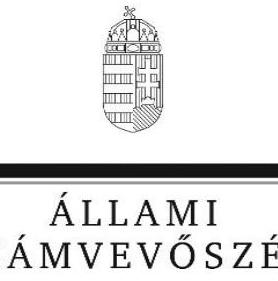
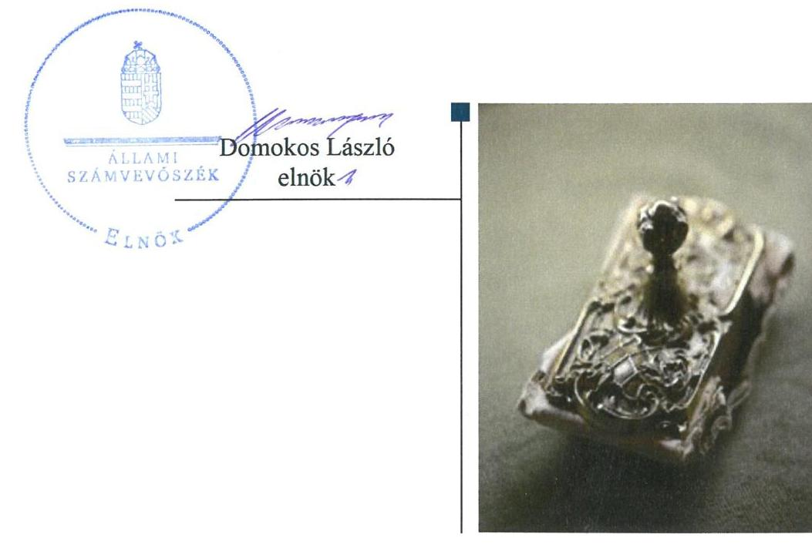
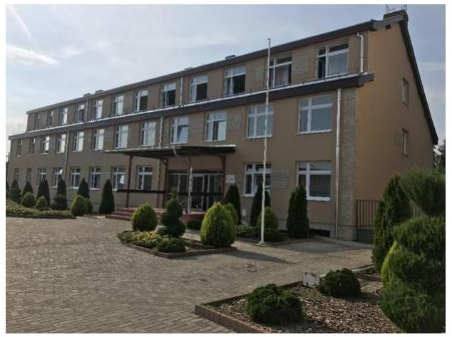
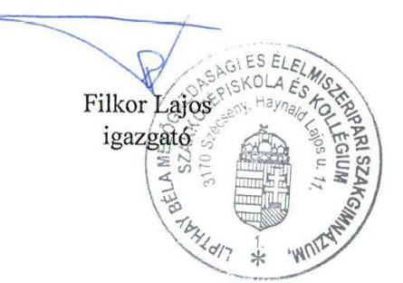
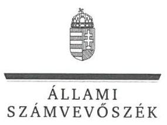
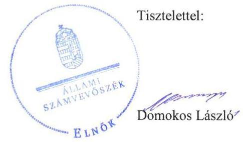

# Jelentés

## Központi költségvetési szervek ellenőrzése

Lipthay Béla Mezőgazdasági és Élelmiszeripari Szakgimnázium, Szakközépiskola és Kollégium 2020.

20019 www.asz.hu

---

# Jelentés 

## Központi költségvetési szervek ellenőrzése

Lipthay Béla Mezőgazdasági és Élelmiszeripari Szakgimnázium, Szakközépiskola és Kollégium 2020. 01. hó 28. nap

---

# AZ ELLENŐRZÉST FELÜGYELTE:

## MAKKAI MÁRIA felügyeleti vezető

## AZ ELLENŐRZÉST VEZETTE ÉS A VÉGREHAJTÁSÁÉRT FELELŐS:

### KISS ISTVÁN GYÖRGY ellenőrzésvezető

### DR. TÓTH LILI ellenőrzésvezetőként eljáró elemző számvevő

## A PROGRAM ÖSSZEÁLLÍTÁSÁÉRT FELELŐS:

### TÓTPÁL SZABOLCS osztályvezető

IKTATÓSZÁM: EL-2410-001/2020.

|  Jelentéseink az Országgyűlés számítógépes hálózatán és az Interneta a www.asz.hu címen is olvashatóak. | TÉMASZÁM: 2450  |
| --- | --- |
|   | ELLENŐRZÉS-AZONOSÍTÓ SZÁM: V079164  |

---

# TARTALOMJEGYZÉK 

■ ÖSSZEGZÉS ..... 5
■ AZ ELLENŐRZÉS CÉLJA ..... 6
■ AZ ELLENŐRZÉS TERÜLETE ..... 7
■ AZ ELLENŐRZÉS HÁTTERE, INDOKOLTSÁGA ..... 8
■ A JELENTÉS LÉNYEGES KÉRDÉSKÖREI ..... 9
■ AZ ELLENŐRZÉS HATÓKÖRE ÉS MÓDSZEREI ..... 10
■ MEGÁLLAPÍTÁSOK ..... 12
■ JAVASLATOK ..... 15
■ MELLÉKLETEK ..... 17
I. sz. melléklet: Értelmező szótár ..... 17
■ FÜGGELÉK: ÉSZREVÉTELEK ..... 19
■ RÖVIDÍTÉSEK JEGYZÉKE ..... 27

---

.

---

# ÖSSZEGZÉS 

A Lipthay Béla Mezőgazdasági és Élelmiszeripari Szakgimnázium, Szakközépiskola és Kollégium belső kontrollrendszerének kialakítása és müködtetése, pénzügyi és vagyongazdálkodása nem volt szabályszerű, nem biztosította a nemzeti vagyonnal való átlátható, elszámoltatható, felelős gazdálkodást, a vagyon védelmét. Az intézmény nem volt védett a korrupcióval szemben.

## Az ellenőrzés társadalmi indokoltsága

Magyarország versenyképességének és a magyar gazdaság fejlődésének alapvető feltétele a magyar munkavállalók megfelelő szakmai képzettsége és felkészültsége, amelyben a szakképzési rendszernek döntő szerepe van. A mezőgazdaság vonatkozásában is kiemelten fontos ez, hiszen a magyar mezőgazdaság piaci versenyképességét és eredményességét nagymértékben befolyásolja az agrárszférában dolgozók képzettsége, felkészültsége. A szakképzés legjelentősebb színterei a szakképző iskolák. Az eredményes és célszerű szakképzés alapja és alapvető feltétele a szakképző intézmények közpénzekkel és a közvagyonnal való törvényes, átlátható és a korrupcióval szembeni védelmet biztosító múködése és gazdálkodása. Ezért ezen szervezetekkel szemben is alapvető társadalmi igény, hogy a rájuk bízott közpénzekkel, közvagyonnal szabályosan gazdálkodjanak. Emellett a szakképzésben részt vevő pedagógusok, tanulók és a szülők jogos elvárása, hogy a szakképző iskolák múködése átlátható és elszámoltatható legyen. Mindezen igényekkel összhangban, a közpénzügyek átláthatóságának előmozdítása, a közvagyon védelme érdekében került sor az agrárszakképző iskolák belső kontrollrendszerének és gazdálkodásának ellenőrzésére.

## Főbb megállapítások, következtetések, javaslatok

A Lipthay Béla Mezőgazdasági és Élelmiszeripari Szakgimnázium, Szakközépiskola és Kollégium nem szabályszerű kontrollkörnyezetben múködött a 2016-2017. években. A 2017. évben integrált kockázatkezelési rendszert, valamint monitoring rendszert nem múködtetett, információs és kommunikációs rendszert nem alakított ki, ezért belső kontrollrendszere nem biztosította a közpénzfelhasználás szabályozottságát.

A Lipthay Béla Mezőgazdasági és Élelmiszeripari Szakgimnázium, Szakközépiskola és Kollégium pénzügyi gazdálkodása a 2016. évben nem volt szabályszerű és elszámoltatható a kötelezettségvállalások nyilvántartásának tartalmi hiányosságai miatt.

A Lipthay Béla Mezőgazdasági és Élelmiszeripari Szakgimnázium, Szakközépiskola és Kollégium vagyongazdálkodása a 2016 - 2017. években nem volt szabályszerű és átlátható, mivel a költségvetési beszámolók mérleg tételei leltárral nem voltak alátámasztottak, a beszámolók nem igazolták a vagyon megőrzését.

A Lipthay Béla Mezőgazdasági és Élelmiszeripari Szakgimnázium, Szakközépiskola és Kollégium nem gondoskodott az integritáselvű működést támogató, kötelezően előírt kontrollok kiépítéséről.

Az Állami Számvevőszék a jelentésben foglalt megállapítások alapján a Lipthay Béla Mezőgazdasági és Élelmiszeripari Szakgimnázium, Szakközépiskola és Kollégium igazgatója részére hat javaslatot fogalmazott meg.

---

# AZ ELLENŐRZÉS CÉLJA

**AZ ELLENŐRZÉS CÉLJA** annak megállapítása volt, hogy a központi költségvetési szervre vonatkozó irányító szervi feladatellátás a jogszabályi előírások betartásával történt-e; a központi költségvetési szerv belső kontrollrendszere biztosította-e az átlátható, szabályszerű, gazdaságos, hatékony és eredményes gazdálkodás feltételeit; kiépítették és erősítették-e a korrupciós kockázatok kezelését szolgáló integritás kontrollokat; megteremtették-e a teljesítményellenőrzés feltételeit. Továbbá annak megállapítása, hogy a szervezet gazdálkodása során elszámoltatható és megfelel-e annak az Alaptörvényben meghatározott alapvetésnek, hogy Magyarország a kiegyensúlyozott, átlátható és fenntartható költségvetési gazdálkodás elvét érvényesíti. Érvényesül-e a nemzeti vagyon kezelésének és védelmének célja, azaz a szervezet vagyona a közérdeket szolgálja, a közös szükségletek kielégítése és a természeti erőforrások megóvása, valamint a jövő nemzedékek szükségleteinek figyelembevétele mellett.

---

# **AZ ELLENŐRZÉS TERÜLETE**

## **Lipthay Béla Mezőgazdasági és Élelmiszeripari Szakgimnázium, Szakközépiskola és Kollégium**

A szécsényi székhelyű Lipthay Béla Mezőgazdasági és Élelmiszeripari Szakgimnázium, Szakközépiskola és Kollégiumot 2013. augusztus 1-jén alapította a Földművelésügyi Minisztérium a Klebelsberg Intézményfenntartó Központ jogutód intézményeként.

Az Alapító okirat szerint az intézmény alaptevékenysége a szakgimnáziumi, szakközépiskolai nevelés—oktatás, kollégiumi ellátás, a Köznevelési Hídprogram és Szakképzési Hídprogram keretében folyó nevelés-oktatás, valamint a 2016. szeptember 1. napja előtt megkezdett tanulmányok tekintetében a szakközépiskolai és szakiskolai nevelés-oktatás.

Alaptevékenységéhez tartozik továbbá a többi tanulóval együtt nevelhető, oktatható sajátos nevelési igényű tanulók iskolai nevelése, oktatása, valamint a beilleszkedési, tanulási, magatartási nehézséggel küzdő tanulók iskolai nevelése-oktatása.

Az Intézmény1 gazdálkodásával összefüggő feladatokat az FM Középmagyarországi Agrár-szakképző Központ, Bercsényi Miklós Élelmiszeripari Szakképző Iskola és Kollégium látta el. Az Intézmény Irányító szerve az Agrárminisztérium. Az ellenőrzött időszakban az Intézménynél szervezeti, szerkezeti átalakításra nem került sor, az igazgató személye nem változott. Az iskola maximális nappali tagozatos tanulói létszáma 2016-ban 480 fő, a kollégium férőhelyeinek száma 80 fő volt.

---

# AZ ELLENŐRZÉS HÁTTERE, INDOKOLTSÁGA 

Az ÁSZ ${ }^{2}$ ellenőrzi a költségvetési szervek gazdálkodását, működését, hogy megállapításaival támogassa az ellenőrzött szervezetek szabályszerű gazdálkodását, javaslataival elősegítse az Alaptörvényben megfogalmazott alapvetések érvényesülését a mindennapi életben a szervezetek szintjén. Az egyes ellenőrzések megállapításaival és egy időszak ellenőrzési eredményeinek elemzésével az ÁSZ ráirányíthatja a jogalkotók figyelmét a központi alrendszerben vagy annak egy ágazatában esetlegesen felmerülő pénzügyi, szabályozási feszültségekre.

Az elvégzett ellenőrzések során az ÁSZ „jó gyakorlatokat" is azonosíthat, melyeket tanácsadó funkciója keretében szélesebb körben is megismertethet az érintettekkel, ezáltal is hozzájárulva a költségvetési rendszer szabályozott, átlátható, kiegyensúlyozott és fenntartható működéséhez.

Az ellenőrzés a szervezet kockázatértékelése alapján, az egyedi és lényeges jellemzők figyelembevételével, az ellenőrzésre kiválasztott modullal történik.

Az integritás- és belső kontroll modul a központi költségvetési szerv múködésének irányítottságát, korrupció elleni védettségét értékeli.

A belső kontrollrendszer kialakítása és működtetése nélkül nem valósítható meg a közpénzek, a közvagyon átlátható, szabályos, gazdaságos, hatékony és eredményes felhasználása. A belső kontrollrendszer azt a célt szolgálja, hogy a költségvetési szervek múködésük és gazdálkodásuk során a tevékenységeket szabályszerűen hajtsák végre, teljesítsék elszámolási kötelezettségeiket és megvédjék az erőforrásokat a veszteségektől, a károktól és a nem rendeltetésszerű használattól.

Az államháztartás központi alrendszerébe tartozó szervezet vagyona a nemzeti vagyon része, és az Alaptörvény is rögzíti, hogy a vagyonnal való gazdálkodás célja a közérdek szolgálata.

---

# A JELENTÉS LÉNYEGES KÉRDÉSKÖREI 

1. Az Irányító szerv ellenőrzött Intézményre vonatkozó feladatellátása szabályszerű volt-e?
2. Az Intézmény belső kontrollrendszerének kialakítása és müködtetése szabályszerű volt-e?
3. Az Intézmény pénzügyi gazdálkodása szabályszerű volt-e?
4. Az Intézmény vagyongazdálkodása szabályszerű volt-e?

---

# AZ ELLENŐRZÉS HATÓKÖRE ÉS MÓDSZEREI 

## Az ellenőrzés típusa

Megfelelőségi ellenőrzés.

## Az ellenőrzött időszak

Az irányítószervi feladatellátás és a pénzügyi gazdálkodás tekintetében 2016. év. A belső kontrollrendszer és vagyongazdálkodás tekintetében a 2016. és 2017. év.

## Az ellenőrzés tárgya

Az ellenőrzött szervezetre vonatkozó irányító szervi feladatok ellátása. Az intézmény pénzügyi és vagyongazdálkodása, átalakításának vagy át-szervezésének lebonyolítása. Az intézmény belső kontroll rendszerének kialakítása és múködtetése. Az intézménynél az integritáskontrollok ki-építettsége, az integritás szemlélet érvényesülése, a teljesítményellenőrzés feltételei.

## Az ellenőrzött szervezet

Lipthay Béla Mezőgazdasági és Élelmiszeripari Szakgimnázium, Szakközépiskola és Kollégium, a gazdasági szervezet feladatait ellátó AM Közép-magyarországi Agrár-szakképző Központ, Bercsényi Miklós Élelmiszeripari Szakgimnázium, Szakközépiskola és Kollégium, valamint az Agrárminisztérium mint irányító szerv.

## Az ellenőrzés jogalapja

Az ellenőrzés jogszabályi alapját az ÁSZ tv. ${ }^{3} 1 . \S$ (3) bekezdés, 5. § (2)-(4) és (6) bekezdései, valamint az Áht. 61. § (2) bekezdésének előírásai képezik.

## Az ellenőrzés módszerei

Az ellenőrzésre a szakmai program szempontjai, az ellenőrzött időszakban hatályos jogszabályok, az ellenőrzés szakmai szabályai, a jelen ellenőrzésre irányadó ÁSZ módszertanok figyelembevételével került sor.

Az ellenőrzés ideje alatt az ellenőrzött szervezetekkel a kapcsolattartást az ÁSZ SZMSZ ${ }^{4}$ ének vonatkozó előírásai alapján biztosította az ÁSZ.

---

Az ellenőrzési kérdések megválaszolásához szükséges bizonyítékok meg-szerzése az ellenőrzött szervezetek által rendelkezésre bocsátott dokumentumokra, adatokra alapozva megfigyelés, szemle (szemrevételezés), kérdésfeltevés (információkérés), mintavételezés, valamint elemző eljárás útján történt.

Az ellenőrzési bizonyítékként felhasználható adatforrások közé tartoztak egyrészt a szakmai program részletes szempontjainál felsorolt adatforrások, másrészt minden egyéb - az ellenőrzés folyamán feltárt, az ellenőrzés szempontjából információt tartalmazó - dokumentum.

Az ellenőrzés lefolytatásához az ellenőrzött szervezet tanúsítványok kitöltésével, valamint az ÁSZ által kért dokumentumok megküldésével szolgáltatott adatokat, amelyek valódiságát és teljes körűségét az ellenőrzött szervezet vezetője által tett teljességi és hitelességi nyilatkozat igazolta. A rendelkezésre bocsátott adatok, információk kontrollja az ellenőrzés keretében történt.

A központi költségvetési szerv belső kontrollrendszere egyes pilléreinek kialakítására és működtetésére vonatkozó értékelés:
$\longrightarrow$ „szabályszerú", amennyiben az értékelt területen az elért „igen" válaszok százalékban kifejezett, egész számra kerekített aránya legalább $85 \%$,
$\longrightarrow$ „nem szabályszerű", ha nem érte el a $85 \%$-ot,
A központi költségvetési szerv belső kontrollrendszerének összesített értékelése az egyes részterületek esetében kapott megfelelőségi arányok számtani átlaga alapján történt és megegyezik a pillérenként (kontroll-területenként) alkalmazott százalékos értékelésekkel, a következő eltérésekkel: a kontrollrendszer egésze esetében a „szabályszerű" értékelésnek a százalékos értéken felül további feltétele volt, hogy egyik kontrollterület sem kaphat „nem szabályszerű" értékelést.

Amennyiben az ellenőrzött szervezet működését, pénzügyi és vagyongazdálkodását alapvetően meghatározó dokumentum hiánya, szabálytalansága miatt, valamely lényeges kérdéskörre vonatkozóan az ÁSZ megállapítást tett, a továbbiakban az ellenőrzési tevékenységek az adott ellenőrzési kérdéskörrel és az azzal szoros logikai kapcsolatban lévő más ráépülő jellegű ellenőrzési kérdésekkel nem kerültek végrehajtásra.

---

# MEGÁLLAPÍTÁSOK 

## 1. Az Irányító szerv ellenőrzött Intézményre vonatkozó feladatellátása szabályszerű volt-e?

Összegző megállapítás Az Irányító szerv ${ }^{5}$ feladatellátása a 2016. évben szabályszerű volt.

AZ IRÁNYÍTÓ SZERV alapítói jogosultságait az Áht. ${ }^{6}$ előírásai szerint gyakorolta.

AZ INTÉZMÉNY ELEMI KÖLTSÉGVETÉSÉT és éves költségvetési beszámolóját az Irányító szerv szabályszerűen jóváhagyta. Az Irányító szerv meghatározta az Intézmény éves létszámkeretét és költségvetési maradványát.

A TERVEZETT BEVÉTELEK ÉS KIADÁSOK megállapításához az Irányító szerv az Áht. 13. § (2) bekezdése szerinti kiadta az általános és kötelezően érvényesítendő tervezési követelményeket.

## 2. Az Intézmény belső kontrollrendszerének kialakítása és müködtetése szabályszerű volt-e?

Összegző megállapítás Az Intézmény belső kontrollrendszerének kialakítása és müködtetése nem volt szabályszerű a 2016-2017. években.

AZ INTÉZMÉNY BELSŐ KONTROLLRENDSZERE a 2016. évben nem volt szabályszerű, mivel nem értékelte az Intézmény vezetője a belső kontrollrendszer minőségét a Bkr. ${ }^{7}$ 11. § (1) bekezdése ellenére a 2016. év tekintetében. Az Intézmény nem rendelkezett továbbá az Ávr. 60. § (3) bekezdés ellenére a 2016. évben a belső szabályzatában foglaltak szerinti naprakész nyilvántartással a kötelezettségvállalásra és teljesítés igazolására jogosult személyekről és aláírás-mintájukról.

AZ INTÉZMÉNY NEM SZABÁLYSZERŰ KONTROLLKÖRNYEZETBEN MŰKÖDÖTT, és a kontrolltevékenységek gyakorlása nem volt szabályszerű a 2017. évben, mivel az Intézmény nem rendelkezett az Ávr. 60. § (3) bekezdés ellenére a belső szabályzatában foglaltak szerinti naprakész nyilvántartással a kötelezettségvállalásra és a teljesítés igazolására jogosult személyekről és aláírás-mintájukról.

AZ INTEGRÁLT KOCKÁZATKEZELÉSI RENDSZERT az Intézmény nem múködtetett a 2017. évben a Bkr. 7.§ (1) bekezdés ellenére, mivel a Bkr. 7. § (2) bekezdés ellenére nem történt meg

---

az Intézmény tevékenységében rejlő és szervezeti célokkal összefüggő kockázatok felmérése és megállapítása, ezáltal a kockázatokkal kapcsolatban szükséges intézkedések, és az intézkedések nyomon követése módjának meghatározása sem. Az Intézmény a Bkr. 7. § (4) bekezdése ellenére nem jelölte ki továbbá az integrált kockázatkezelési rendszer koordinálásának szervezeti felelősét a 2017. évben.

INFORMÁCIÓS ÉS KOMMUNIKÁCIÓS RENDSZERT az Intézmény nem alakított ki a 2017. évben a Bkr. 3. § d) pontja ellenére. Az Intézmény az Ávr. 13. § (2) bekezdés h) pontja ellenére nem szabályozta a közérdekű adatok megismerésére irányuló kérelmek intézésének, és a kötelezően közzéteendő adatok nyilvánosságra hozatalának rendjét.

MONITORING RENDSZERT az Intézmény nem múködtetett a Bkr. 3. § e) pont ellenére. Az Intézmény vezetője a Bkr. 11. § (1) bekezdése ellenére a Bkr. 1. számú melléklete szerinti nyilatkozatban nem értékelte a belső kontrollrendszer minőségét a 2017. év tekintetében, így a belső kontrollrendszer minőségének nyomon követése, értékelése nem valósult meg.

AZ INTEGRITÁS KONTROLLOK kiépítése nem volt megfelelő az Intézménynél a jogszabályok által előírt kontrollok hiányában a 2016-2017. évben. Az Intézmény nem alakította ki a Bkr. 6. § (4) bekezdésben előírtak ellenére szervezeti integritást sértő események kezelésének eljárásrendjét a 2017. évben.

A TELJESÍTMÉNY MÉRÉSÉRE alkalmas követelményeket az Intézmény nem alakított ki a 2016-2017. évben. Az Intézmény nem képzett a szervezeti célok eléréséhez szükséges feladatok és folyamatok mérésére szolgáló indikátorokat, mérőszámokat, feladat és teljesítménymutatókat, ezáltal nem biztosították a teljesítménymérés feltételeit.

# 3. Az Intézmény pénzügyi gazdálkodása szabályszerű volt-e? 

## Összegző megállapítás

Az Intézmény pénzügyi gazdálkodása nem volt szabályszerű 2016. évben.

Az Intézmény az Ávr. 56. § (1) bekezdés ellenére nem gondoskodott a kötelezettségvállalások Áhsz. szerinti nyilvántartásba vételéről, mivel az Intézmény nem vezetett az Áhsz. ${ }^{8}$ 39. § (3) bekezdés alapján az Áhsz. 14. melléklet II. fejezet 4. pontjában foglalt követelményeknek megfelelő nyilvántartást.

---

# 4. Az Intézmény vagyongazdálkodása szabályszerű volt-e? 

| Összegző megállapítás | Az Intézmény vagyongazdálkodása nem volt szabályszerű a 2016-2017. években. |
| :--: | :--: |
|  | Az Intézmény a 2016 - 2017. évi költségvetési beszámolóinak mérlegtételeit a Számv.tv. ${ }^{9}$ 69. § (1), valamint az Áhsz. 5. § (1) és az Áhsz. 22. (1)-(2) bekezdése ellenére leltárral nem támasztotta alá. |

---

# JAVASLATOK 

Az ÁSZ tv. 33. § (1) bekezdésében foglaltak értelmében az ellenőrzött szervezet vezetője köteles a jelentésben foglalt megállapításokhoz kapcsolódó intézkedési tervet összeállítani és azt a jelentés kézhezvételétől számított 30 napon belül az ÁSZ részére megküldeni. Amennyiben az ellenőrzött szervezet vezetője nem küldi meg határidőben az intézkedési tervet, vagy továbbra sem elfogadható intézkedési tervet küld, az Állami Számvevőszék elnöke az ÁSZ tv. 33. § (3) bekezdése a) és b) pontjaiban foglaltakat érvényesítheti.

## Lipthay Béla Mezőgazdasági és Élelmiszeripari Szakgimnázium, Szakközépiskola és Kollégium igazgatójának

1. Intézkedjen a kötelezettségvállalásra, teljesités igazolására jogosult személyekről és aláírás-mintájukról naprakész nyilvántartás vezetéséről.
(2. sz. megállapítás 2. bekezdése alapján)
2. Intézkedjen a Bkr. elöírásainak megfelelően integrált kockázatkezelési rendszer müködtetéséről és az integrált kockázatkezelési rendszer koordinálására szervezeti felelős kijelöléséről.
(2. sz. megállapítás 3. bekezdése alapján)
3. Intézkedjen az Ávr. elöírásainak megfelelően a közérdekü adatok megismerésére irányuló kérelmek intézésének, továbbá a kötelezően közzéteendő adatok nyilvánosságra hozatalának rendje szabályozásáról.
(2. sz. megállapítás 4. bekezdés második mondata alapján)
4. Intézkedjen a Bkr. elöírásának megfelelően a belső kontrollrendszer minőségét értékelő nyilatkozat elkészitéséről.
(2. sz. megállapítás 5. bekezdés második mondata alapján)
5. Intézkedjen a szervezeti integritást sértő események kezelése eljárásrendjének szabályozásáról.
(2. sz. megállapítás 6. bekezdés második mondata alapján)
6. Intézkedjen a jogszabályi elöírásoknak megfelelően a mérleg tételeit alátámasztó leltár elkészitéséről.
(4. sz. megállapítás 1. bekezdése alapján)

---

.

---

# MELLÉKLETEK 

- I. SZ. MELLÉKLET: ÉRTELMEZŐ SZÓTÁR
belső kontrollrendszer
belső kontrollrendszer területei
információs és kommunikációs rendszer
integritás
irányító szerv
kockázat
kockázatkezelési rendszer
integrált kockázatkezelési rendszer
kontrollkörnyezet
kontrolltevékenységek

A belső kontrollrendszer a kockázatok kezelése és tárgyilagos bizonyosság megszerzése érdekében kialakított folyamatrendszer, amely azt a célt szolgálja, hogy a múködés és gazdálkodás során a tevékenységeket szabályszerűen, gazdaságosan, hatékonyan, eredményesen hajtsák végre, az elszámolási kötelezettségeket teljesítsék, megvédjék az erőforrásokat a veszteségektől, károktól és nem rendeltetésszerű használattól. (Forrás: Áht. 69. § (1) bekezdése)
A kontrollkörnyezet, a kockázatkezelési rendszer, a kontrolltevékenységek, az információs és kommunikációs rendszer, valamint a nyomon követési (monitoring) rendszer. (Forrás: Bkr. 3. §-a)
A költségvetési szerv vezetője által kialakított és múködtetett olyan rendszer, mely biztosítja, hogy a megfelelő információk a megfelelő időben eljutnak az illetékes szervezethez, szervezeti egységhez, illetve személyhez. (Forrás: Bkr. 9. § (1) bekezdés)
Az integritás - egyik gyakran használt jelentése szerint - az elvek, értékek, cselekvések, módszerek, intézkedések konzisztenciáját jelenti, vagyis olyan magatartásmódot, amely meghatározott értékeknek megfelel. Integritás-irányítási rendszer bevezetése a szervezetben a szervezethez rendelt közfeladatok integritás szempontú ellátását, az érték alapú múködéssel (integritással) összefüggő szervezeti követelmények következetes érvényesítését jelenti. (Forrás: Nemzetgazdasági Minisztérium: Államháztartási Belső Kontroll Standardok és Gyakorlati Útmutató 1.6. Etikai értékek és integritás 46. oldal, 2017. szeptember)
A költségvetési szerv tekintetében az Áht-ban meghatározott irányítási hatáskört gyakorló szerv. (Forrás: Áht. 1. § 9. pontja)
A kockázat annak a valószínűségét jelenti, hogy egy vagy több esemény vagy intézkedés nem kívánt módon befolyásolja a rendszer múködését, céljainak megvalósulását. (Forrás: Javaslatok a korrupciós kockázatok kezelésére - Kockázatkezelési és ellenőrzési módszertan 35. oldal, ÁSZ)
Olyan irányítási eszközök és módszerek összessége, melynek elemei a szervezeti célok elérését veszélyeztető tényezők (kockázatok) azonosítása, elemzése, csoportosítása, nyomon követése, valamint szükség esetén a kockázati kitettség mérséklése.(Forrás: Bkr. 2. § m) pontja)
Olyan folyamatalapú kockázatkezelési rendszer, amely a szervezet minden tevékenységére kiterjed, egységes módszertan és eljárások alkalmazásával, a szervezet célkitűzéseinek és értékeinek figyelembevételével biztosítja a szervezet kockázatainak teljes körű azonosítását, azok meghatározott kritériumok szerinti értékelését, valamint a kockázatok kezelésére vonatkozó intézkedési terv elkészítését és az abban foglaltak nyomon követését. (Forrás: Bkr. 2. § m) pontja, 2016. október 1-jétől)
A költségvetési szerv vezetője által kialakított olyan elvek, eljárások, belső szabályzatok összessége, amelyben világos a szervezeti struktúra, a folyamatok átláthatók, egyértelmúek a felelősségi, hatásköri viszonyok és feladatok, meghatározottak, ismertek és elfogadottak az etikai elvárások a szervezet minden szintjén, átlátható a humánerőforrás-kezelés. (Forrás: Bkr. 6. § (1) bekezdés)
A költségvetési szerv vezetője által a szervezeten belül kialakított (kontroll) tevékenységek, melyek biztosítják a kockázatok kezelését, hozzájárulnak a szervezet céljainak eléréséhez és erősítik a szervezet integritását. (Forrás: Bkr. 8. § (1) bekezdés)

---

| kommunikáció | Az a tevékenység, melynek során információ továbbítása valósul meg. A kommunikációs folyamat résztvevői között tájékoztatás történik, mely során tényeket, ezek magyarázatát közlik. |
| :--: | :--: |
| vagyongazdálkodás | A nemzeti vagyongazdálkodás feladata a nemzeti vagyon rendeltetésének megfelelő, az állam, az önkormányzat mindenkori teherbíró képességéhez igazodó, elsődlegesen a közfeladatok ellátásához és a mindenkori társadalmi szükségletek kielégítéséhez szükséges, egységes elveken alapuló, átlátható, hatékony és költségtakarékos működtetése, értékének megőrzése, állagának védelme, értéknövelő használata, hasznosítása, gyarapítása, továbbá az állam vagy a helyi önkormányzat feladatának ellátása szempontjából feleslegessé váló vagyontárgyak elidegenítése. (Forrás: Nvtv. 7. § (2) bekezdése) |

---

# FÜGGELÉK: ÉSZREVÉTELEK 

A jelentéstervezetet a Számvevőszék 15 napos észrevételezésre megküldte az ellenőrzött szervezetek vezetőinek az ÁSZ tv. 29. § (1) bekezdése előirásának megfelelően.

Az ÁSZ a jelentéstervezetet észrevételezésre megküldte a Lipthay Béla Mezőgazdasági és Élelmiszeripari Szakgimnázium, Szakközépiskola és Kollégium igazgatójának és a gazdasági szervezet feladatait ellátó AM Közép-magyarországi Agrárszakképző Központ, Bercsényi Miklós Élelmiszeripari Szakgimnázium, Szakközépiskola és Kollégium föigazgatójának, valamint az agrárminiszternek.
A Lipthay Béla Mezőgazdasági és Élelmiszeripari Szakgimnázium, Szakközépiskola és Kollégium igazgatójának észrevételét és az arra adott választ a függelék tartalmazza.

---

# LIPTHAY BÉLA MEZŐGAZDASÁGI ÉS ÉLELMISZERIPARI SZAKGIMNÁZIUM, SZAKKÖZÉPISKOLA ÉS KOLLÉGIUM 

Levélcím: 3170 Szécsény, Haynald L. u.11., Pf.: 40 Telefon/fax: (32) 370-573, Telefon: (32) 370-936

Web: www.lipthay.hu, E-mail:
lipthayiskola@gmail.com

Állami Számvevőszék
1052 Budapest
Apáczai Csere János utca 10.
1364 Budapest 4. Pf. 54

Iktatószám: LB/30-155/2019.
Tárgy: Észrevétel EL-1190-047/2019 levélre
Ügyintézőnk: Kovács Gábor (32/370-573)
Melléklet: tartalom szerint

## Tisztelt Domokos László Elnök Úr!

Válaszul az EL-1190-047/2019 levelére a Lipthay Béla Mezőgazdasági és Élelmiszeripari Szakgimnázium, Szakközépiskola és Kollégium intézmény részéről az alábbiak szerint megküldjük az Intézmény észrevételét.

Megállapítás: Az intézmény belső kontrollrendszere a 2016. évben nem volt szabályszerű, mivel nem értékelte az intézmény vezetője a belső kontrollrendszer minőségét.
Észrevétel: 2016. évre vonatkozó Nyilatkozat a belső kontrollrendszer minőségéről esedékességekor elkészült és a 2016. évi költségvetési beszámolóhoz csatolva megküldésre került a Fenntartóhoz. (A Nyilatkozatot csatoljuk.)

Megállapítás: Az Intézmény nem rendelkezett naprakész nyilvántartással a kötelezettségvállalásra és teljesítés igazolásra jogosult személyekről és aláírás-mintájukról 2016. évben.
Észrevétel: Az Intézmény Pénz- és Értékkezelési Szabályzatának 15. számú melléklete tartalmazta a kötelezettségvállalásra és teljesítésigazolásra jogosult személyekről és aláírásmintájukról vezetett nyilvántartást. (A szabályzatot csatoljuk.)

Megállapítás: Az Intézmény nem rendelkezett a belső szabályzatban foglaltak szerinti naprakész nyilvántartással a kötelezettségvállalásra és a teljesítésigazolásra jogosult személyekről és aláírás-mintájukról 2017. évben.
Észrevétel: Az Intézmény Pénz- és Értékkezelési Szabályzatának 15. számú melléklete tartalmazta a kötelezettségvállalásra és teljesítésigazolásra jogosult személyekről és aláírásmintájukról vezetett nyilvántartást 2017. évben.

Megállapítás: Nem történt meg az Intézmény tevékenységében rejlő és szervezeti célokkal összefüggő kockázatok felmérése és megállapítása, ezáltal a kockázatokkal kapcsolatban szükséges intézkedések, és az intézkedések módjának meghatározása sem. Az Intézmény nem jelölte ki az integrált kockázatkezelési rendszer koordinálásának szervezeti felelőstt 2017. évben.
Észrevétel: Kockázatok felmérése a belső ellenőrzési terv alapjait képezve elkészült.
A kockázatkezelési szabályzattal az Intézmény 2013. évtől rendelkezett azonban 2018. január 1-i hatállyal új szabályzat készült. (A Szabályzatot csatoljuk)
Az Integrált kockázatkezelési rendszer szervezeti felelőse 2017. szeptember 1. napi hatállyal Barna Mátyás igazgatóhelyettes. (A kijelölés megtörtént, mellékletként csatoljuk.)

---

Megállapítás: Információs és kommunikációs rendszert az Intézmény nem alakított ki a 2017. évben. Az Intézmény nem szabályozta a közérdekủ adatok megismerésére irányuló kérelmek kezelésének, és a kötelezően közzéteendő adatok nyilvánosságra hozatalának rendjét.
Észrevétel: A közérdekủ adatok nyilvánosságra hozatalának rendjét 2018. január 1 napi hatállyal szabályozta az Intézmény. (A Szabályzatot csatoljuk.)

Megállapítás: Az intézmény belső kontrollrendszere a 2017.évben nem volt szabályszerű, mivel nem értékelte az intézmény vezetője a belső kontrollrendszer minőségét.
Észrevétel: A 2017. évre vonatkozó Nyilatkozat a belső kontrollrendszer minőségéről esedékességekor elkészült és a 2017. évi költségvetési beszámolóhoz csatolva megküldésre került a Fenntartóhoz. (A Nyilatkozatot csatoljuk.)

Megállapítás: Az integritás kontrollok kiépítése nem volt megfelelő az Intézménynél a jogszabályokban előírt kontrollok hiányában 2016-2017 évben. Az Intézmény nem alakított ki a szervezeti integritást sértő események kezelésének eljárásrendjét 2017.évben.
Észrevétel: Az Intézmény elkészítette és 2018. január 1. napi hatállyal életbe léptette a szervezeti integritást sértő események kezelésének eljárásrendjét. (A Szabályzatot csatoljuk.)

Megállapítás: A teljesítmény mérésére alkalmas követelményeket az Intézmény nem alakított ki a 2016-2017 évben. Az intézmény nem képzett a szervezeti célok eléréséhez szükséges feladatok és folyamatok mérésére szolgáló indikátorokat, mérőszámokat, feladat és teljesítménymutatókat, ezáltal nem biztosították a teljesítménymérés feltételeit.
Észrevétel: A Pedagógus önértékelő rendszerben alkalmazott indikátormutatók alapján megtalálhatók az értékelések. Az elektronikus felületet az Oktatási Hivatal kezeli. Riportnyomtatási lehetőségünk van.

Megállapítás: Az Intézmény nem gondoskodott a kötelezettségvállalások Áhsz. szerinti nyilvántartásba vételéről, mivel az Intézmény nem vezetett megfelelő nyilvántartást.
Észrevétel: Az Intézménynél alkalmazott könyvelési program (EPER) vezeti az Áhsz. szerinti kötelezettségvállalás nyilvántartását. (A nyilvántartást csatoljuk.)

Megállapítás: Az Intézmény a 2016-2017. évi költségvetési beszámolóinak mérlegtételeit leltárral nem támasztotta alá.
Észrevétel: Az Intézménynél alkalmazott tárgyi eszköz nyilvántartó program tartalmazza a beszámoló mérlegtételeinek alátámasztására vonatkozó tételes eszközlistát. (A leltárfelvételi íveket csatoljuk 2017. évről.)

Szécsény, 2019. november 20.

Tisztelettel:

---

EL N Ö K

Ikt.szám: EL-1190-057/2019.

# Filkor Lajos úr 

igazgató

Lipthay Béla Mezőgazdasági és Élelmiszeripari Szakgimnázium, Szakközépiskola és Kollégium

Szécsény

## Tisztelt Igazgató Úr!

A „Központi költségvetési szervek ellenőrzése - Lipthay Béla Mezőgazdasági és Élelmiszeripari Szakgimnázium, Szakközépiskola és Kollégium" címmel készített számvevőszéki jelentéstervezetre tett észrevételét köszönettel megkaptam.

Az Állami Számvevőszék észrevételre vonatkozó álláspontjáról a felügyeleti vezető által készített részletes tájékoztatást mellékelten megküldöm.

Tájékoztatom Igazgató urat, hogy a számvevőszéki jelentésben - az Állami Számvevőszékről szóló 2011. évi LXVI. törvény 29. § (3) bekezdése alapján - a figyelembe nem vett észrevételt szerepeltetjük, annak indoklásával, hogy azt az Állami Számvevőszék miért nem fogadta el.

Budapest, 2019. 11 hó 25 nap

Melléklet: Tájékoztatás az észrevétel kezeléséről

---

# Tájékoztatás   az észrevétel kezeléséről 

A „Központi költségvetési szervek ellenőrzése - Lipthay Béla Mezőgazdasági és Élelmiszeripari Szakgimnázium, Szakközépiskola és Kollégium" című jelentéstervezetre 2019. november 21-én érkezett észrevételét áttekintettük, annak kezelésével kapcsolatban a következő tájékoztatást adom.

1. A jelentéstervezet 2. számú megállapítás 1. bekezdés 1. mondatában foglaltakkal kapcsolatban tett észrevételre adott válasz
Az észrevétel szerint a belső kontrollrendszer minőségének értékeléséről szóló, 2016. évi vezetői nyilatkozat elkészült és - a 2016. évi beszámolóhoz csatolva - megküldésre került a fenntartóhoz.
Tájékoztatom Igazgató urat, hogy az Állami Számvevőszék ellenőrzési megállapításai az Állami Számvevőszékről szóló 2011. évi LXVI. törvénynek (továbbiakban: ÁSZ törvény) megfelelően minden esetben az ellenőrzés során bekért és az arra nyitva álló határidőn belül rendelkezésre bocsátott dokumentumokon alapulnak. Igazgató úr az ÁSZ rendelkezésére bocsátott dokumentumokról 2018. október 24-én és 2019. március 25-én teljességi és hitelességi nyilatkozatot állított ki, melyben nyilatkozott, hogy az ÁSZ részére átadott dokumentumok megbízhatóak, a bekért adatokra, dokumentumokra vonatkozóan teljes körű információt tartalmaznak.
A törvényi határidőn belül rendelkezésre bocsátott dokumentumokat ismételten áttekintettük. Az intézmény adatszolgáltatása nem tartalmazta az észrevétel mellékleteként megküldött nyilatkozatot. Ezért az észrevételt nem fogadjuk el a jelentéstervezet módosítása nem indokolt.
2. A jelentéstervezet 2. számú megállapítás 1. bekezdés 2. mondatában foglaltakkal kapcsolatban tett észrevételre adott válasz
Az észrevétel szerint az intézmény Pénz- és Értékkezelési Szabályzatának 15. számú melléklete tartalmazta a kötelezettségvállalásra és teljesítésigazolásra jogosult személyekről és aláírás-mintájukról vezetett nyilvántartást a 2016. évben.
Az intézmény által az arra nyitva álló határidőben az ÁSZ rendelkezésére bocsátott dokumentumok ismételt áttekintése alapján tájékoztatom Igazgató urat, hogy az adatszolgáltatás keretében rendelkezésre bocsátott, hivatkozott szabályzat - amelyről Igazgató úr teljességi és hitelességi nyilatkozat állított ki - mellékletet nem tartalmazott. Továbbá tájékoztatom Igazgató urat, hogy az ellenőrzés rendelkezésére bocsátott „Aláírás mintáról vezetett nyilvántartás 2016.pdf" elnevezésű dokumentum az érvényességre, hatályosságra vonatkozóan dátumot, időszakot nem tartalmaz, ezért az államháztartásról szóló törvény végrehajtásáról szóló 368/2011. (XII. 31.) Korm. rendelet (Ávr.) 60. § (3) bekezdésében előírt naprakész nyilvántartás vezetését nem igazolja.
Mindezek alapján az észrevételt nem fogadjuk el a jelentéstervezet módosítása nem indokolt.

---

3. A jelentéstervezet 2. számú megállapítás 2. bekezdésében foglaltakkal kapcsolatban tett észrevételre adott válasz
Az észrevétel szerint az intézmény Pénz- és Értékkezelési Szabályzatának 15. számú melléklete tartalmazta a kötelezettségvállalásra és teljesítésigazolásra jogosult személyekről és aláírás-mintájukról vezetett nyilvántartást a 2017. évben.
Az előző észrevételre adott tájékoztatással megegyezően az intézmény által az arra nyitva álló határidőben az ÁSZ rendelkezésére bocsátott dokumentumok ismételt áttekintése alapján tájékoztatom Igazgató urat, hogy az adatszolgáltatás keretében rendelkezésre bocsátott, hivatkozott szabályzat - amelyről Igazgató úr teljességi és hitelességi nyilatkozat állított ki mellékletet nem tartalmazott. Továbbá tájékoztatom Igazgató urat, hogy az ellenőrzés rendelkezésére bocsátott „Aláirás mintáról vezetett nyilvántartás_2017.pdf" elnevezésủ dokumentum az érvényességre, hatályosságra vonatkozóan dátumot, időszakot nem tartalmaz, ezért az Ávr. 60. § (3) bekezdésében előírt naprakész nyilvántartás vezetését nem igazolja.
Mindezek alapján az észrevételt nem fogadjuk el a jelentéstervezet módosítása nem indokolt.
4. A jelentéstervezet 2. számú megállapítás 3. bekezdésében foglaltakkal kapcsolatban tett észrevételre adott válasz
Az észrevétel szerint a kockázatok felmérése a belső ellenőrzési terv alapjait képezve elkészült, valamint 2017. szeptember 1-től integrált kockázatkezelési rendszer szervezeti felelősének kijelölése megtörtént.
Az intézmény tevékenységében rejlő és szervezeti célokkal összefüggő kockázatok felmérése és megállapítása, ezáltal a kockázatokkal kapcsolatban szükséges intézkedések és az intézkedések módjának meghatározása nem azonos fogalom a belső ellenőrzési terv kockázatelemzéssel való megalapozásával. A költségvetési szervek belső kontrollrendszeréről és belső ellenőrzéséről szóló 370/2011. (XII. 31.) Korm. rendelet (Bkr.) szerint két külön kontrollpillérhez tartozó kötelezettséget jelentenek. Az integrált kockázatkezelési rendszer koordinálásának szervezeti felelősével kapcsolatban az adatszolgáltatásra nyitva álló határidőben - a dokumentumok ismételt áttekintése alapján - az intézmény dokumentumot nem bocsátott az ÁSZ rendelkezésére. Mindezek alapján az ÁSZ megállapítása helytálló, a jelentéstervezet módosítása nem indokolt.
5. A jelentéstervezet 2. számú megállapítás 4. bekezdésében szereplő megállapítással kapcsolatban tett észrevételre adott válasz
Az észrevételben foglaltak szerint az intézmény a közérdekủ adatok nyilvánosságra hozatalának rendjét 2018. január 1-től szabályozta.
Az észrevételt köszönjük, az megerősíti az ÁSZ megállapítását, amely szerint az ellenőrzött időszakban az intézmény nem rendelkezett a kötelezően közzéteendő adatok nyilvánosságra hozatalának rendjére vonatkozó szabályozással. A jelentéstervezet módosítása nem indokolt.

---

6. A jelentéstervezet 2. számú megállapítás 5. bekezdés második mondatában foglaltakkal kapcsolatban tett észrevételre adott válasz
Az észrevétel szerint a belső kontrollrendszer minőségének értékeléséről szóló, 2017. évi vezetői nyilatkozat elkészült és a 2017. évi beszámolóhoz csatolva megküldésre került a fenntartóhoz.
Az ellenőrzés megállapítása azt rögzíti, hogy az ellenőrzött szervezet a Bkr. 1. számú melléklete szerinti nyilatkozatban nem értékelte a belső kontrollrendszer minőségét a 2017. év tekintetében. A rendelkezésre bocsátott dokumentumok felülvizsgálata alapján az ÁSZ megállapítása helytálló, az intézmény adatszolgáltatásában szereplő nyilatkozat nem felel meg a Bkr. 2017. évben hatályos előírásainak, mert nem tartalmazza a Bkr. 2016. október 1-jétől hatályos módosításában szereplő változásokat. Az észrevételt nem fogadjuk el, a jelentéstervezet módosítása nem indokolt.
7. A jelentéstervezet 2. számú megállapítás 6 . bekezdésében foglaltakkal kapcsolatban tett észrevételre adott válasz
Az észrevételben foglaltak szerint az intézmény 2018. január 1-én hatályba léptette a szervezeti integritást sértő események kezelésének eljárásrendjét.
A 2018-ban hatályba lépett szabályozásról szóló tájékoztatást köszönjük, az megerősíti az ÁSZ megállapítását, amely szerint az ellenőrzött időszakban az intézmény nem rendelkezett az érintett szabályozással. Ezért a jelentéstervezet módosítása nem indokolt.
8. A jelentéstervezet 2. számú megállapítás 7. bekezdésében foglaltakkal kapcsolatban tett észrevételre adott válasz
Az észrevétel a teljesítmény mérésére alkalmas követelmények kialakításának hiányával kapcsolatban rögzíti, hogy a „Pedagógus önértékelö rendszerben" megtalálhatóak az értékelések, amelyet az Oktatási Hivatal kezel és riportnyomtatási lehetősége van az intézménynek.
Az észrevételben foglalt tájékoztatást köszönjük, az nem érinti az ÁSZ megállapítását, amely az intézmény adatszolgáltatásán alapul. Tájékoztatom Igazgató urat, hogy az intézmény - az adatszolgáltatása keretében kiöltött - a rendelkezésre álló forrásokkal való gazdaságos, hatékony és eredményes gazdálkodás követelményeiről szóló 1. számú tanúsítványt „nemlegesen" töltötte ki. Az észrevételt nem fogadjuk el, a jelentéstervezet módosítása nem indokolt.
9. A jelentéstervezet 3. számú megállapításban foglaltakkal kapcsolatban tett észrevételre adott válasz
Az észrevétel rögzíti, hogy az intézmény az Áhsz. szerint vezeti a kötelezettségvállalások nyilvántartását, ennek alátámasztására észrevételéhez csatolva megküldte a kötelezettségvállalások 2018. évi részletező nyilvántartását.
Tájékoztatom Igazgató urat, hogy az ÁSZ megállapítása a 2016. évre vonatkozik, amelyhez az adatszolgáltatás keretében az ÁSZ rendelkezésére bocsátott nyilvántartás nem felelt meg az Áhsz. 14. melléklet II. fejezet 4. pontjában foglalt követelményeknek. Ezért az észrevételt nem fogadjuk el, a jelentéstervezet módosítása nem indokolt.

---

10. A jelentéstervezet 4. számú megállapításban foglaltakkal kapcsolatban tett észrevételre adott válasz
Az észrevétel szerint az intézménynél alkalmazott tárgyi eszköz nyilvántartó program tartalmazza a beszámoló mérlegtételeit alátámasztó „tételes eszközlistát".
Az észrevételben foglaltakkal ellentétben a beszámoló mérlegtételeinek alátámasztásához nem elegendő a tárgyi eszközöket tartalmazó „eszközlista", a mérleg alátámasztásához a számvitelről szóló 2000 . évi C. törvény alapján olyan leltárt kell összeállítani és megőrizni, amely tételesen, ellenőrizhető módon tartalmazza a mérleg fordulónapján meglévő eszközöket és forrásokat mennyiségben és értékben.

Budapest, 2019. 12. hó 00 nap

Makkai Mária
felügyeleti vezető

---

# RÖVIDÍTÉSEK JEGYZÉKE 

${ }^{1}$ Intézmény
${ }^{2}$ ÁSZ
${ }^{3}$ ÁSZ tv.
${ }^{4}$ ÁSZ SZMSZ
${ }^{5}$ Irányító szerv
${ }^{6}$ Áht.
${ }^{7}$ Bkr.
${ }^{8}$ Áhsz.
${ }^{9}$ Számv. tv.

Lipthay Béla Mezőgazdasági és Élelmiszeripari Szakgimnázium, Szakközépiskola és Kollégium
Állami Számvevőszék
Az Állami Számvevőszékről szóló 2011. évi LXVI. törvény
Állami Számvevőszék Szervezeti és Müködési Szabályzata
Agrárminisztérium
Az államháztartásról szóló 2011. évi CXCV. törvény
A költségvetési szervek belső kontrollrendszeréről és belső ellenőrzéséről szóló 370/2011. (XII. 31.) Korm. rendelet
Az államháztartás számviteléről szóló 4/2013. (I. 11.) Korm. rendelet
A számvitelről szóló 2000. évi C. törvény

---

# ÁLLAMI SZÁMVEVŐSZÉK 

1052 Budapest, Apáczai Csere János utca 10.
Levélcím: 1364 Budapest 4. Pf. 54
Telefon: +36 14849100 Telefax: +36 14849200
www.asz.hu