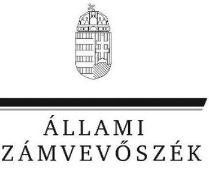
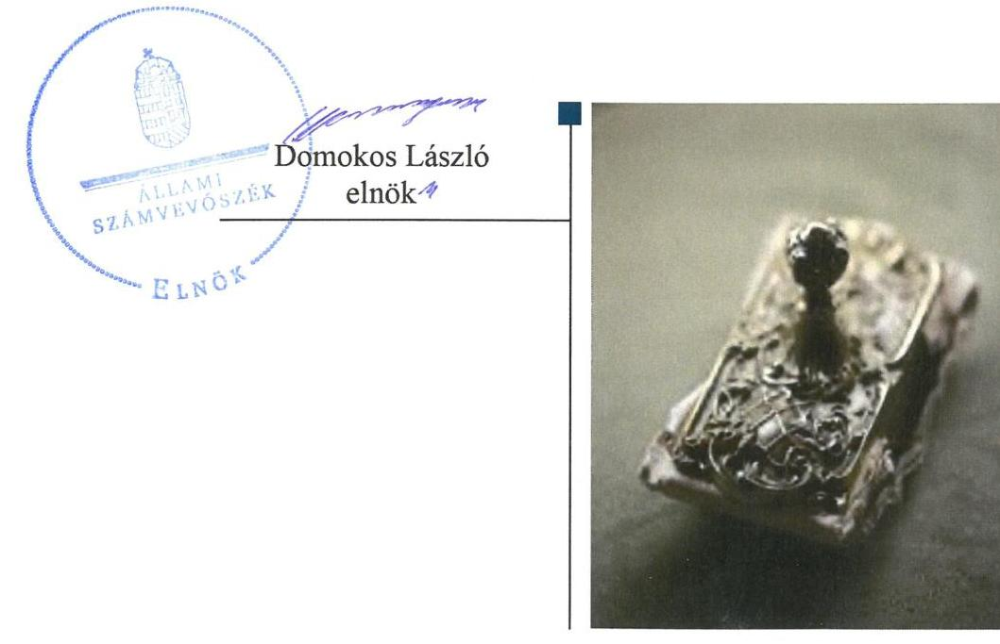
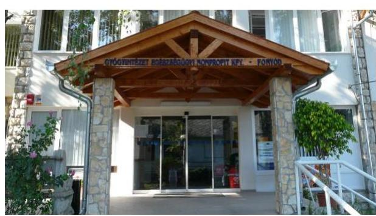
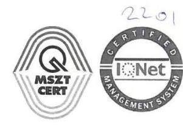
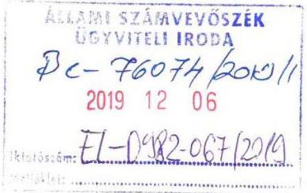
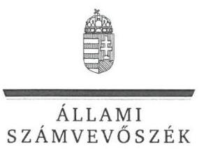
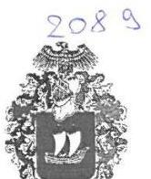
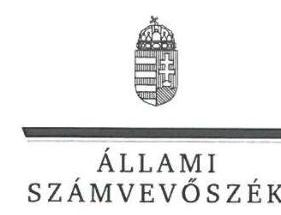
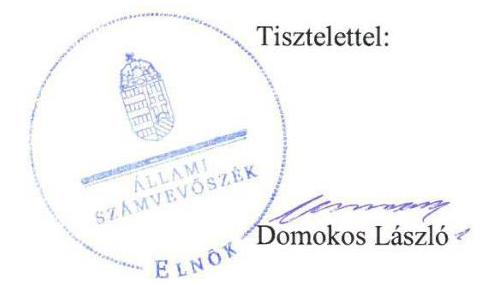

# Jelentés

## Nemzeti tulajdonú gazdasági társaságok ellenőrzése

Egészségügyi Ellátást Szervező és Működtető Nonprofit Közhasznú Korlátolt Felelősségű Társaság

2020.

20020 www.asz.hu

---

# Jelenetés 

## Nemzeti tulajdonú gazdasági társaságok ellenőrzése

Egészségügyi Ellátást Szervező és Múködtető Nonprofit Közhasznú Korlátolt Felelősségű Társaság 2020. 04. hó 30. nap

---

# AZ ELLENŐRZÉST FELÜGYELTE:

## MAKKAI MÁRIA felügyeleti vezető

## AZ ELLENŐRZÉST VEZETTE ÉS A VÉGREHAJTÁSÁÉRT FELELŐS:

### SIPOSNÉ DÓCZI KLÁRA ellenőrzésvezető

## A PROGRAM ÖSSZEÁLLÍTÁSÁÉRT FELELŐS:

### TÓTPÁL SZABOLCS osztályvezető

---

**IKTATÓSZÁM:** EL-2411-001/2020

**TÉMASZÁM:** 2478

**ELLENŐRZÉS-AZONOSÍTÓ SZÁM:** V082235 ÉS V082262

---

Jelentéseink az Országgyűlés számítógépes hálózatán és az Interneta a www.asz.hu címen is olvashatóak.

---

# TARTALOMJEGYZÉK 

- ÖSSZEGZÉS ..... 5
- AZ ELLENŐRZÉS CÉLJA ..... 6
- AZ ELLENŐRZÉS TERÜLETE ..... 7
- AZ ELLENŐRZÉS HÁTTERE, INDOKOLTSÁGA ..... 8
- A JELENTÉS LÉNYEGES KÉRDÉSKÖREI ..... 9
- AZ ELLENŐRZÉS HATÓKÖRE ÉS MÓDSZEREI ..... 10
- MEGÁLLAPÍTÁSOK ..... 12
- JAVASLATOK ..... 14
- MELLÉKLETEK ..... 15
I. sz. melléklet: Értelmező szótár ..... 15
- FÜGGELÉK: ÉSZREVÉTELEK ..... 17
- RÖVIDÍTÉSEK JEGYZÉKE ..... 25

---

.

---

# ÖSSZEGZÉS 

Fonyód Város Önkormányzatának az Egészségügyi Ellátást Szervező és Müködtető Nonprofit Közhasznú Korlátolt Felelősségű Társaság feletti tulajdonosi joggyakorlása nem volt átlátható és elszámoltatható.
A Társaság vagyongazdálkodásának kialakítása biztositotta a szabályszerü, átlátható és az elszámoltatható gazdálkodás feltételeit, az ellenőrzés a vagyongazdálkodás területén lényeges kockázatot nem azonositott.

## Az ellenőrzés társadalmi indokoltsága

Az Állami Számvevőszék kiemelt célja, hogy ellenőrzéseivel hozzájáruljon ahhoz, hogy a közpénzeket, illetve az ingyenesen juttatott közvagyont az államháztartáson kívül múködő szervezetek is átlátható, rendezett módon használják fel.

Az állam és a helyi önkormányzatok tulajdona nemzeti vagyon, melynek megőrzése érdekében kiemelten fontos a nemzeti tulajdonú gazdasági társaságok ellenőrzése. Ellenőrzésüket további társadalmi elvárás is indokolja. Részben a gazdálkodásuk körébe tartozó vagyon nagysága, részben az általuk ellátott közszolgáltatások, sajátos feladatellátások, mivel tevékenységükön keresztül a lakosság széles köre kerül kapcsolatba a társaságokkal.
Az Állami Számvevőszék céljaival és a társadalmi igénnyel összhangban, a gazdasági társaságok kiemelt fontosságú szerepe miatt került sor az Egészségügyi Ellátást Szervező és Müködtető Nonprofit Közhasznú Korlátolt Felelősségű Társaság vagyongazdálkodásának, illetve Fonyód Város Önkormányzata tulajdonosi joggyakorlásának ellenőrzésére.

## Főbb megállapítások, következtetések, javaslatok

Fonyód Város Önkormányzata nem igazolta, hogy megalkotta a vezető tisztségviselők, a felügyelő bizottsági tagok és a vezető munkakörben dolgozó munkavállalók javadalmazására vonatkozó szabályzatot, ezáltal az Önkormányzat tulajdonosi joggyakorlása nem volt szabályszerű.

Az Egészségügyi Ellátást Szervező és Működtető Nonprofit Közhasznú Korlátolt Felelősségű Társaság a számviteli beszámolók mérlegtételeit a törvényi előírásoknak megfelelő leltárakkal támasztotta alá, ezáltal biztosította, hogy a beszámolóiban szereplő adatok a valóságban megtalálhatóak, megalapozottak voltak.

Az Állami Számvevőszék a jelentésbe foglalt megállapítások alapján az Egészségügyi Ellátást Szervező és Múködtető Nonprofit Közhasznú Korlátolt Felelősségű Társaság ügyvezetőjének egy javaslatot fogalmazott meg.

---

# AZ ELLENŐRZÉS CÉLJA 

AZ ELLENŐRZÉS CÉLJA annak megállapítása volt, hogy a tulajdonosi joggyakorló a gazdasági társaságai feletti tulajdonosi joggyakorlás kereteit kialakította-e, tulajdonosi jogait megfelelően gyakorolta-e és kötelezettségeit teljesítette-e. Az ellenőrzés célja volt továbbá annak megállapítása, hogy a gazdasági társaság biztosította-e a vagyon védelmét a nyilvántartások szabályszerű vezetése és a mérleg tételeinek leltárral történő alátámasztása útján, valamint szabályszerűen gondoskodott-e a társaság használatában, kezelésében lévő nemzeti vagyon értékének megőrzéséről, gyarapításáról, hasznosításáról, továbbá gazdálkodásának a kormányzati szektor hiányára és az államadósságra befolyással bíró elemei a jogszabályi előírásoknak megfeleltek-e és az adatszolgáltatási kötelezettségének eleget tett-e.

---

# **AZ ELLENŐRZÉS TERÜLETE**

## **Egészségügyi Ellátást Szervező és Működtető Nonprofit Közhasznú Korlátolt Felelősségű Társaság és a tulajdonosi jogokat gyakorló Fonyód Város Önkormányzata**

Az Egészségügyi Ellátást Szervező és Működtető Nonprofit Közhasznú Korlátolt Felelősségű Társaság az 1997. november elsején alakult Egészségügyi Ellátást Szervező és Működtető Közhasznú Társaság Fonyód Kiemelten Közhasznú Szervezet jogutódjaként 2009. január 15-én kezdte meg működését. A Társaság1 100%-os tulajdonosa az ellenőrzött időszakban Fonyód Város Önkormányzata volt. Az Önkormányzat2 az önkormányzati egészségügyi feladatok ellátására, határozatlan időre, 114 M Ft jegyzett tőkével - mely 5 M Ft pénzbeli betétből és 109 M Ft apportból állt -, hozta létre a Társaságot.

A Társaság közhasznú feladatként általános járóbeteg-ellátást, szakorvosi járóbeteg-ellátást és egyéb humán egészségügyi ellátást nyújtott Fonyód és a környező települései lakossága, illetve a városban nyaraló vendégek számára. A területi ellátási kötelezettséggel érintett lakosok száma 2015. évben 80 085 fő, 2016. évben 88 907 fő, 2017. évben 83 756 fő volt.

A Társaság vállalkozási tevékenység keretében foglalkozás–egészségügyi szolgáltatást nyújtott, és bérbe adta a tulajdonában álló ingatlan egy részét. Az ellenőrzött időszakban a Társaság más gazdasági társaságban részesedéssel nem rendelkezett, vagyonkezelésbe kapott vagyona nem volt. A Társaságnak 2015-2017. években 20 M Ft hosszúlejáratú kötelezettsége a Dél-dunántúli Operatív Program támogatási rendszeréhez szükséges önerőhöz az Alapító által nyújtott kölcsönből származott.

A Társaság a 2013/60. Hivatalos Értesítőben közzétett 2013.12.16-tól hatályos, a 2015/66. Hivatalos Értesítőben közzétett 2015.12.30-től hatályos és a 2017/28. Hivatalos Értesítőben közzétett 2017.06.15-től hatályos NGM közlemények szerint kormányzati szektorba sorolt egyéb szervezet volt.

A Társaság ügyvezetőjének a személye az ellenőrzött időszakban háromszor változott. A Társaság működését három tagú felügyelőbizottság ellenőrizte. A Társaságnál a 2015-2017 években a Számv. tv. előírásai alapján nem volt kötelező a könyvvizsgálat, az Alapítói okirat3-ban döntöttek állandó könyvvizsgáló megbízásáról. A Társaságnál a foglalkoztatottak átlagos statisztikai létszáma 35 fő volt az ellenőrzött időszak minden évében.

A Polgármester4 2014-óta töltötte be tisztségét, a Jegyző5 2017. július 1-től vezette a Fonyódi Polgármesteri Hivatalt.

---

# AZ ELLENŐRZÉS HÁTTERE, INDOKOLTSÁGA 

Az Alaptörvény 38. cikke alapján az állam és a helyi önkormányzatok tulajdona nemzeti vagyon. A nemzeti vagyon megőrzése, megóvása érdekében kiemelten fontos ezen nemzeti tulajdonú gazdasági társaságok ellenőrzése. Gazdálkodásuk jellemzően a közérdeklődés és a médiafigyelmének középpontjában áll, amihez hozzájárul a gazdálkodásuk körébe tartozó - a nemzeti vagyon részét képező - vagyon nagysága, illetve az általuk ellátott közszolgáltatások minősége és hatékonysága.

Ellenőrzéseink feltárhatják, hogy a tulajdonosi felügyelet hozzájárult-e a szabályszerű gazdálkodáshoz és feladatellátáshoz.

Az ellenőrzés eredményeként meghatározhatóvá válnak a szervezet vagyongazdálkodást érintő kockázatai, ezzel lehetővé téve a kockázatok csökkentését.

A megállapítások alapján megfogalmazott számvevőszéki javaslatok hasznosítása elősegítheti a meglévő hibák megszüntetését. A jó gyakorlatok bemutatásával az Állami Számvevőszék hozzájárulhat a követendő megoldások megismertetéséhez, terjesztéséhez.

---

# A JELENTÉS LÉNYEGES KÉRDÉSKÖREI 

1. A tulajdonosi jogok gyakorlása szabályszerű volt-e?
2. A gazdasági társaság vagyongazdálkodási tevékenysége szabályszerű volt-e?
3. A gazdasági társaság államadósságra befolyással bíró elemei megfeleltek-e a jogszabályi előírásoknak, adatszolgáltatási kötelezettségének eleget tett-e?

---

# AZ ELLENŐRZÉS HATÓKÖRE ÉS MÓDSZEREI 

## Az ellenőrzés típusa

Megfelelőségi ellenőrzés.

## Az ellenőrzött időszak

A tulajdonosi joggyakorlás tekintetében az ellenőrzött időszak 2017. január 1-től az ellenőrzés megkezdésének napjáig - 2018. augusztus 15. - terjedt ki az éves beszámoló elfogadása kivételével, amelynél az ellenőrzött időszak 2015. január 1-től az ellenőrzés megkezdésének napjáig tartott.

A gazdasági társaság vagyongazdálkodása vonatkozásában az ellenőrzött időszak a 2015 -2017 évek, a 2017. évi beszámoló jóváhagyása tekintetében a 2018. június elsejéig tartó időszak.

A kormányzati szektorba tartozó gazdálkodás és adatszolgáltatás tekintetében 2015. január 1-től 2017. december 31-ig, a beszámoló jóváhagyása és közzététele tekintetében 2018. június elsejéig tartó, az adatszolgáltatás teljesítése tekintetében 2018. június 29-ig tartó időszak.

## Az ellenőrzés tárgya

Az önkormányzat tulajdonosi joggyakorlása, a 100\%-os tulajdonában lévő gazdasági társaság feletti tulajdonosi joggyakorlás kialakítása és múködtetése. A Társaság vagyongazdálkodása keretében a társaság használatában lévő nemzeti vagyon, illetve a saját vagyon tekintetébe a vagyonnyilvántartások vezetése, leltára. Valamint a társaság gazdálkodásának az államadósságra befolyással bíró elemei és a jogszabályi előírásoknak megfelelő adatszolgáltatási kötelezettségének teljesítése.

## Az ellenőrzött szervezet

Egészségügyi Ellátást Szervező és Müködtető Nonprofit Közhasznú Korlátolt Felelősségű Társaság és Fonyód Város Önkormányzata

## Az ellenőrzés jogalapja

Az ellenőrzés jogalapját az ÁSZ tv ${ }^{6}$. 1. § (3) bekezdése, 5. § (4) bekezdése képezi.

---

# Az ellenőrzés módszerei 

Az ellenőrzést az ellenőrzési program ellenőrzési kérdései, az ellenőrzött időszakban hatályos jogszabályok, az ellenőrzés szakmai szabályok és módszertanok alapján, a nemzetközi standardok figyelembe vételével végeztük.

Az ellenőrzés ideje alatt az ellenőrzött szervezetekkel történő kapcsolattartást az ÁSZ ${ }^{7}$ Szervezeti és Múködési Szabályzatának vonatkozó előírásai alapján biztosítottuk.

Az ellenőrzési kérdések megválaszolásához szükséges bizonyítékok megszerzése a következő ellenőrzési eljárások alkalmazásával történt: megfigyelés, információkérés, összehasonlítás, elemző eljárás. Az ellenőrzési bizonyítékként felhasználható adatforrások közé tartoztak az ellenőrzési programban felsorolt adatforrások, továbbá minden - az ellenőrzés folyamán - feltárt, az ellenőrzés szempontjából információkat tartalmazó dokumentum.

Az ellenőrzést a kérdésekre adott válaszok kiértékelésével, valamint a megjelölt adatforrások, a tanúsítványok felhasználásával, továbbá az adott időszakban hatályos jogszabályok figyelembe vételével folytattuk le.

A 2017. január 1-től az ellenőrzés megkezdésének napjáig ellenőriztük a tulajdonosi joggyakorlás kereteinek kialakítását, a tulajdonosi joggyakorló tevékenységét a felügyelőbizottság múködéséhez kapcsolódóan, valamint azt, hogy a tulajdonosi joggyakorló - amennyiben a gazdasági társaság feladatellátásához kapcsolódóan határozott meg követelményeket, elvárásokat - a nemzeti vagyon értékének megőrzése érdekében monito-rozta-e azok teljesülését. A 2015. január 1-től az ellenőrzés megkezdésének napjáig ellenőriztük a tulajdonosi joggyakorló részvételét az éves beszámoló elfogadására vonatkozó döntéshozatalban.

A gazdasági társaság vagyonhoz kapcsolódó nyilvántartásai vezetésének megfelelősége, valamint a nemzeti vagyon értéke megőrzésének, gyarapításának, hasznosításának szabályszerűsége 2015. és 2017. évek tekintetében került ellenőrzésre. A teljes ellenőrzött időszakot, 2015-2017 éveket érintően történt meg a lényeges dokumentumok és a mérleg tételeinek leltárral való alátámasztottságának az értékelése.

A vagyonnyilvántartások és a leltár szabályszerűsége esetében az ellenőrzés azokra a legnagyobb értékű tételekre - lényeges sokaságra - terjedt ki, melyek összértéke elérte a teljes sokaság összértékének 50\%-át. A lényeges sokaságot tételesen ellenőriztük.

A kormányzati szektorba sorolt gazdasági társaság adatszolgáltatási kötelezettségére vonatkozó jogszabályi előírások betartását az e területre vonatkozó teljes ellenőrzött időszakra értékeltük.

---

# 1. A tulajdonosi jogok gyakorlása szabályszerű volt-e? 

## Összegző megállapítás

Az Önkormányzatnak a Társaság feletti tulajdonosi joggyakorlása nem volt szabályszerű.

Az Önkormányzat mint a Társaság egyszemélyes alapítója nem igazolta, hogy a Taktv. ${ }^{8} 5 . \S$ (3) bekezdésébe foglalt előírások szerint szabályzatban rendelkezett a vezető tisztségviselők, a felügyelőbizottsági tagok, valamint az Mt. ${ }^{9}$ 208. § hatálya alá tartozó munkavállalók javadalmazásának, valamint jogviszonyuk megszűnése esetére biztosított juttatások módjának, mértékének elveiről, annak rendszeréről, ezért az Önkormányzatnak a Társaság feletti tulajdonosi joggyakorlása nem volt szabályszerű.

## 2. A gazdasági társaság vagyongazdálkodási tevékenysége szabályszerű volt-e?

## Összegző megállapítás

A Társaság vagyongazdálkodása a leltárak és a vagyon nyilvántartása tekintetében szabályszerű volt.

A Társaság rendelkezett a Számv. tv. ${ }^{10}$ előírásainak megfelelően Leltározási szabályzat ${ }^{11}$-tal. A szabályzat tartalmazta a leltározásra és leltárkészítésre vonatkozó szabályokat, előírásokat.

A Társaság az ellenőrzött időszak minden évében a Számv. tv. előírásainak megfelelő leltárakkal támasztotta alá a mérlegében szereplő tételeit, és biztosította az üzleti év mérleg-fordulónapjára vonatkozóan a főkönyvi könyvelés és az analitikus nyilvántartások adatai közötti egyeztetést. A 2015 - 2017 évi leltárak a Számv. tv. szabályozása szerint tételesen és ellenőrizhető módon tartalmazták a Társaságnak a mérleg fordulónapján fennálló eszközeit és forrásait mennyiségben és értékben.

A Társaság a saját vagyonához kapcsolódó nyilvántartásait a Számv. tv. vonatkozó előírásai és a Számviteli politiká ${ }^{12}$-ban meghatározottak szerint vezette.

---

# 3. A gazdasági társaság államadósságra befolyással bíró elemei megfeleltek-e a jogszabályi előírásoknak, adatszolgáltatási kötelezettségének eleget tett-e? 

## Összegző megállapítás

A Társaság a jogszabályokban előírt adatszolgáltatási kötelezettségének nem tett eleget.

A Társaságnak nem volt az államadósságra befolyással bíró kötelezettségvállalása az ellenőrzött időszakban. A Társaság az Áht. ${ }^{13}$ 107. § (1) bekezdésében és az Ávr. ${ }^{14} 5$. melléklet 23 . sorában előírt adatszolgáltatási kötelezettségének az ellenőrzött időszakban nem tett eleget, mert az államháztartásért felelős miniszternek nem küldte meg a számviteli törvény szerinti beszámolóit, kiemelt mutatóit, költségvetési kapcsolatainak bemutatását.

---

# JAVASLATOK 

Az ÁSZ tv. 33. § (1) bekezdésében foglaltak értelmében az ellenőrzött szervezet vezetője köteles a jelentésben foglalt megállapításokhoz kapcsolódó intézkedési tervet összeállítani és azt a jelentés kézhezvételétől számított 30 napon belül az ÁSZ részére megküldeni. Amennyiben az ellenőrzött szervezet vezetője nem küldi meg határidőben az intézkedési tervet, vagy továbbra sem elfogadható intézkedési tervet küld, az Állami Számvevőszék elnöke az ÁSZ tv. 33. § (3) bekezdése a) és b) pontjaiban foglaltakat érvényesítheti.

## az Egészségügyi Ellátást Szervező és Müködtető Nonprofit Közhasznú Korlátolt Felelősségű Társaság ügyvezetőjének

1. Intézkedjen az Áht.-ben elöirt adatszolgáltatási kötelezettség teljesitéséről.
(3. sz. megállapítás 1. bekezdés második mondata alapján)

---

# MELLÉKLETEK 

- I. SZ. MELLÉKLET: ÉRTELMEZŐ SZÓTÁR
gazdasági társaság
közfeladat
nemzeti vagyon
tulajdonosi jogok gyakorlója
nemzeti vagyon hasznosítása
nemzeti vagyon használója

A gazdasági társaságok üzletszerű közös gazdasági tevékenység folytatására, a tagok vagyoni hozzájárulásával létrehozott, jogi személyiséggel rendelkező vállalkozások, amelyekben a tagok a nyereségből közösen részesednek, és a veszteséget közösen viselik. Forrás: Ptk. 3:88. § (1) bekezdése
Az Áht. 3/A. § (1) bekezdése alapján közfeladat a jogszabályban meghatározott állami vagy önkormányzati feladat.
Nvtv. 1. § (2) bekezdése szerint nemzeti vagyonba tartozik többek között: „az állam vagy a helyi önkormányzat kizárólagos tulajdonában álló dolgok, az a) pont hatálya alá nem tartozó, állam vagy a helyi önkormányzat tulajdonában lévő dolog,
az állam vagy a helyi önkormányzat tulajdonában lévő pénzügyi eszközök, továbbá az államot vagy a helyi önkormányzatot megillető társasági részesedések,
az államot vagy a helyi önkormányzatot megillető bármely vagyoni értékkel rendelkező jogosultság, amelyet jogszabály vagyoni értékű jogként nevesít." Aki a nemzeti vagyon felett az államot vagy a helyi önkormányzatot megillető tulajdonosi jogok és kötelezettségek összességének gyakorlására jogosult. Forrás: Nvtv. 3. § (1) 17. pontja
A tulajdonosi joggyakorló vagy a nemzeti vagyon használója által a nemzeti vagyon birtoklásának, használatának, hasznok szedése jogának bármely - a tulajdonjog átruházását nem eredményező - jogcímen történő átengedése, ide nem értve a vagyonkezelésbe adást, valamint a haszonélvezeti jog alapítását. Forrás: Nvtv. 3. § (1) bekezdés 4. pont
Azon természetes személy, jogi személy vagy jogi személyiséggel nem rendelkező szervezet, aki vagy amely állami vagyon tekintetében törvény vagy szerződés alapján, a helyi önkormányzat vagyona tekintetében törvény, a helyi önkormányzat rendelete vagy szerződés alapján bármely jogcímen nemzeti vagyont birtokol, használ, szedi annak használt, kivéve a tulajdonosi joggyakorló. Forrás: Nvtv. 3. § (1) bekezdés 11. pont

---

.

---

# FÜGGELÉK: ÉSZREVÉTELEK 

A jelentéstervezetet a Számvevőszék 15 napos észrevételezésre megküldte az ellenőrzött szervezetek vezetőinek az ÁSZ tv. 29. §* (1) bekezdése előírásának megfelelően.

Az ÁSZ a jelentéstervezetet észrevételezésre megküldte az Egészségügyi Ellátást Szervező és Müködtető Nonprofit Közhasznú Korlátolt Felelősségü Társaság ügyvezetőjének és Fonyód Város polgármesterének.
Az Egészségügyi Ellátást Szervező és Müködtető Nonprofit Közhasznú Korlátolt Felelősségü Társaság ügyvezetőjének és Fonyód Város polgármesterének észrevételét és az azokra adott választ a függelék alább tartalmazza.

[^0]
[^0]:    * 29. § (1) Az Állami Számvevőszék az ellenőrzési megállapításait megküldi az ellenőrzött szervezet vezetőjének vagy az általa megbízott személynek, és annak, akinek személyes felelősségét állapította meg.
    (2) Az ellenőrzött szervezet vezetője és a felelősként megjelölt személy az ellenőrzés megállapításaira tizenöt napon belül írásban észrevételt tehet.
    (3) Az Állami Számvevőszék az észrevételre a beérkezésétől számított harminc napon belül írásban válaszol. A figyelembe nem vett észrevételeket köteles a jelentésben feltüntetni, és megindokolni, hogy azokat miért nem fogadta el.

---

Nyilvántartási szám: ISO 9001: 503/1017(4)-977(4)

H-8640 Fonyód, Szent István u. 27.
Tel/ fax: 85/560 970, 560 980
Fax 85/560 981
Központi Ügyeleti Szolgálat: 85/360 050
e-mail: ekbt@t-online.hu

ügyvezető: Dr Bárczi Tamás

# Egészségügyi Nonprofit Kft. - Fonyód

**Állami Számvevőszék**
1052 Budapest, Apáczai Csere János u. 10.
1364 Budapest 4. Pf. 54.

**Domokos László**
Elnök

**Tisztelt Állami Számvevőszék!**
Tisztelt Elnök Úr!

**Ügyiratszám: 141-3 /2019.**
**Ügyintéző:** Ihász Istvánné
**Fonyód, 2019. december 03.**
**Tárgy: ÁSZ ellenőrzés**

Az Állami számvevőszék gyógyintézetünket az Egészségügyi Ellátást Szervező és Működtető Nonprofit Közhasznú Korlátolt Felelősségű Társaság - Fonyód -ot, mint „Nemzeti tulajdonú gazdasági társaságot ellenőrizte.”

Az ÁSZ jelentés az alábbi megállapítást tette (3-as pont):

## A társaság a jogszabályokban előírt adatszolgáltatási kötelezettségének nem tett eleget.

A Társaságnak nem volt az államadósságra befolyással bíró kötelezettségvállalása az ellenőrzött időszakban. A Társaság az Áht.13 107. §(1) bekezdésében és az Ávr.14 5. melléklet 23. sorában előírt adatszolgáltatási kötelezettségének az ellenőrzött időszakban nem tett eleget, mert az államháztartásért felelős miniszternek nem küldte meg a számviteli törvény szerinti beszámolóit, kiemelt mutatói, költségvetési kapcsolatainak bemutatását.

Gazdasági társaságunk a megállapításnak eleget tett, az EL-0982-063/2019 iktatószámú levelükre hivatkozva mellékelten csatoljuk a Pénzügy Minisztérium Államháztartásért Felelős Államtitkárságnak megküldött beszámolók feladóvevényét.

Tisztelettel

Dr. Bárczi Tamás
Egészségügyi Illnesset Szervező és Működtető Nonprofit Kismelkedően Közhasznú Korlátolt Felelősségű Társaság - Fonyód
1052 Budapest, Apáczai Csere János
Tel/ Fax: 85/560 970, 560 980
Fax: 85/560 970, 560 980
E-mail: ekbt@t-online.hu

Tárgy: ÁSZ ellenőrzés

Egészségügyi Nonprofit, Kft. - Fonyód
Adószám: 18767311-2-14 - Cégjegyzékszám: 14-09-308820 - Nyilvántartó cégbíróság: Somogy Megyei Bíróság mint Cégbíróság

---

ELNÖK

Ikt.szám: EL-0982-068/2019.

dr. Bárczi Tamás János
ügyvezető

# Egészségügyi Ellátást Szervező és Működtető Nonprofit Közhasznú Korlátolt Felelősségű Társaság 

## Fonyód

## Tisztelt Ügyvezető Úr!

A „Nemzeti tulajdonú gazdasági társaságok ellenőrzése - Egészségügyi Ellátást Szervező és Müködtető Nonprofit Közhasznú Korlátolt Felelősségű Társaság" címmel készített számvevőszéki jelentéstervezetre írt 141-3/2019. számú levelét köszönettel megkaptam.
Az Állami Számvevőszék észrevételre vonatkozó álláspontjáról a felügyeleti vezető által készített részletes tájékoztatást mellékelten megküldőm.
Tájékoztatom Ügyvezető urat, hogy a számvevőszéki jelentésben - az Állami Számvevőszékről szóló 2011. évi LXVI. törvény 29. § (3) bekezdése alapján - a figyelembe nem vett észrevételt szerepeltetjük, annak indoklásával, hogy azt az Állami Számvevőszék miért nem fogadta el.

Budapest, 2020. 01 hó 06 nap

Tisztelettel:

Melléklet: Tájékoztatás az észrevétel kezeléséről

---

# Tájékoztatás   az észrevétel kezeléséről 

A „Nemzeti tulajdonú gazdasági társaságok ellenőrzése - Egészségügyi Ellátást Szervező és Müködtető Nonprofit Közhasznú Korlátolt Felelősségü Társaság" címü jelentéstervezetre 2019. december 6-án érkezett észrevételét áttekintettük, annak kezelésével kapcsolatban a következő tájékoztatást adom.
A jelentéstervezet 3. számú megállapításával kapcsolatban tett észrevételére adott válasz:
Tájékoztatom Ügyvezető urat, hogy az Állami Számvevőszék (továbbiakban ÁSZ) megállapításai minden esetben az Állami Számvevőszékről szóló 2011. évi LXVI. törvénynek megfelelően az ellenőrzés során bekért és az arra nyitva álló határidőn belül rendelkezésre bocsátott dokumentumokon alapulnak. A Társaság ellenőrzött időszakot követően tett intézkedését az ÁSZ nem értékelte.
Ügyvezető úr levele megerősíti a jelentéstervezet megállapítását, annak módosítása nem indokolt.

Budapest, 20 , 01 hó 0. nap

Makkai Mária
felügyeleti vezető

---

FONYÓ VÁROS ÖNKORMÁNYZATA

Ügyiratszám: 03/1915-8/2019.
Ügyintéző: Nagy Brigitta

Tárgy: Észrevétel jelentéstervezetre
Hiv.szám: EL-0982-064/2019.

Állami Számvevőszék
Domokos László elnök úr

Budapest
Apáczai Csere János utca 10.
Pf: 54.

1364

Tisztelt Elnök Úr!

Alulírott Hidvégi József Fonyód Város Önkormányzat polgármestere az Állami Számvevőszék által folyamatban lévő, a „Nemzeti tulajdonú gazdasági társaságok ellenőrzése - Egészségügyi Ellátást Szervező és Müködtető Nonprofit Közhasznú Korlátolt Felelősségű Társaság" címmel készített EL-0982-064/2019. számon kiadott jelentéstervezetére az ÁSZ tv. 29. § (2) bekezdése szerint rendelkezésre álló határidőn belül az alábbi észrevételt teszem:

A jelentéstervezet 1. számú megállapítása szerint az Önkormányzatnak a Társaság feletti tulajdonosi joggyakorlása nem volt szabályszerű, mert az Önkormányzat, mint a Társaság egyszemélyes alapítója nem igazolta, hogy a Taktv. 5.§ (3) bekezdésébe foglalt előírások szerint szabályzatban rendelkezett a vezető tisztségviselők, a felügyelőbizottsági tagok, valamint az Mt. 208 § hatálya alá tartozó munkavállalók javadalmazásának, valamint jogviszonyuk megszűnése esetére biztosított juttatások módjának, mértékének elveiről, annak rendszeréről.

Tájékoztatom Tisztelt Elnök urat, hogy Fonyód Város Önkormányzat Képviselő-testülete, mint alapító szerv, az Egészségügyi Nonprofit Kft. - Fonyód (H-8640 Fonyód Szent István u. 27.) Vezetői javadalmazási szabályzatát megalkotta és 159/2010. (VIII.10.) számú KT. határozatával elfogadta.

Kérem Tisztelt Elnök urat a fentiek figyelembe vételével az észrevétel elfogadására.

Fonyód, 2019. november 18.

Tisztelettel:

Hidvégi József
polgármester

8640 Fonyód, Fő u. 19.
Tel.: 85/562-980

---

ELNÖK

Ikt.szám: EL-0982-066/2019.

# Hídvégi József úr 

polgármester

## Fonyód Város Önkormányzata

Fonyód

## Tisztelt Polgármester Úr!

A „Nemzeti tulajdonú gazdasági társaságok ellenőrzése - Egészségügyi Ellátást Szervező és Müködtető Nonprofit Közhasznú Korlátolt Felelősségü Társaság" címmel készített számvevőszéki jelentéstervezetre tett észrevételét köszönettel megkaptam.

Az Állami Számvevőszék észrevételre vonatkozó álláspontjáról a felügyeleti vezető által készített részletes tájékoztatást mellékelten megküldőm.

Tájékoztatom Polgármester urat, hogy a számvevőszéki jelentésben - az Állami Számvevőszékről szóló 2011. évi LXVI. törvény 29. § (3) bekezdése alapján - a figyelembe nem vett észrevételt szerepeltetjük, annak indoklásával, hogy azt az Állami Számvevőszék miért nem fogadta el.

Budapest, 2019. 16 hó 60 nap

Melléklet: Tájékoztatás az észrevétel kezeléséről

---

# Tájékoztatás   az észrevétel kezeléséről 

A „Nemzeti tulajdonú gazdasági társaságok ellenőrzése - Egészségügyi Ellátást Szervezö és Müködtető Nonprofit Közhasznú Korlátolt Felelősségü Társaság" címü jelentéstervezetre 2019. november 21 -én érkezett észrevételét áttekintettük, annak kezelésével kapcsolatban a következő tájékoztatást adom.
A jelentéstervezet 1. számú megállapításával kapcsolatban tett észrevétel tájékoztat arról, hogy Fonyód Város Önkormányzat Képviselő-testülete, mint alapító szerv, az Egészségügyi Nonprofit Kft. Vezetői javadalmazási szabályzatát megalkotta és 159/2010. (VIII.10.) számú KT. határozatával elfogadta.
Tájékoztatom Polgármester urat, hogy az Állami Számvevőszék ellenőrzési megállapításai az Állami Számvevőszékről szóló 2011. évi LXVI. törvénynek megfelelően minden esetben az ellenőrzés során bekért és az arra nyitva álló határidőn belül rendelkezésre bocsátott dokumentumokon alapulnak. Az észrevételben hivatkozott dokumentumot nem bocsátották az ellenőrzés rendelkezésére.
A fentiek alapján az észrevételt nem fogadjuk el, a jelentéstervezet módosítása nem indokolt.

Budapest, 2019. 12. hó 04. nap

Makkai Mária
felügyeleti vezető

---

.

---

# RÖVIDÍTÉSEK JEGYZÉKE 

${ }^{1}$ Társaság
${ }^{2}$ Önkormányzat
${ }^{3}$ Alapító okirat
${ }^{4}$ Polgármester
${ }^{5}$ Jegyző
${ }^{6}$ ÁSZ tv.
${ }^{7}$ ÁSZ
${ }^{8}$ Taktv.
${ }^{9}$ Mt.
${ }^{10}$ Számv. tv.
${ }^{11}$ Leltározási szabályzat
${ }^{12}$ Számviteli politika
${ }^{13}$ Áht.
${ }^{14}$ Ávr.

Egészségügyi Ellátást Szervező és Működtető Nonprofit Közhasznú Korlátolt Felelősségű Társaság
Fonyód Város Önkormányzata
Egészségügyi Ellátást Szervező és Működtető Nonprofit Közhasznú Korlátolt Felelősségű Társaság Alapító okirata és annak módosításai
Fonyód Város Önkormányzat polgármestere
Fonyód Város Önkormányzat jegyzője
2011. évi LXVI. törvény az Állami Számvevőszékről (hatályos: 2011. július 1-től)

Állami Számvevőszék
2009. évi CXXII. törvény a köztulajdonban álló gazdasági társaságok takarékosabb müködéséről (hatályos: 2009. december 4-től)
2012. évi I. törvény a munka törvénykönyvéről (hatályos: 2012. július 1-jétől)
2000. évi C. törvény a számvitelről (hatályos 2001. január 1-től)

Egészségügyi Ellátást Szervező és Müködtető Nonprofit Közhasznú Korlátolt Felelősségű Társaság Leltározási szabályzata
Egészségügyi Ellátást Szervező és Müködtető Nonprofit Közhasznú Korlátolt Felelősségű Társaság Számviteli politikája
2011. évi CXCV. törvény az államháztartásról (hatályos:

368/2011. (XII. 31) Korm. rendelet az államháztartásról szóló törvény végrehajtásáról

---

# ÁLLAMI SZÁMVEVŐSZÉK 

1052 Budapest, Apáczai Csere János utca 10.
Levélcím: 1364 Budapest 4. Pf. 54
Telefon: +36 14849100 Telefax: +36 14849200
www.asz.hu