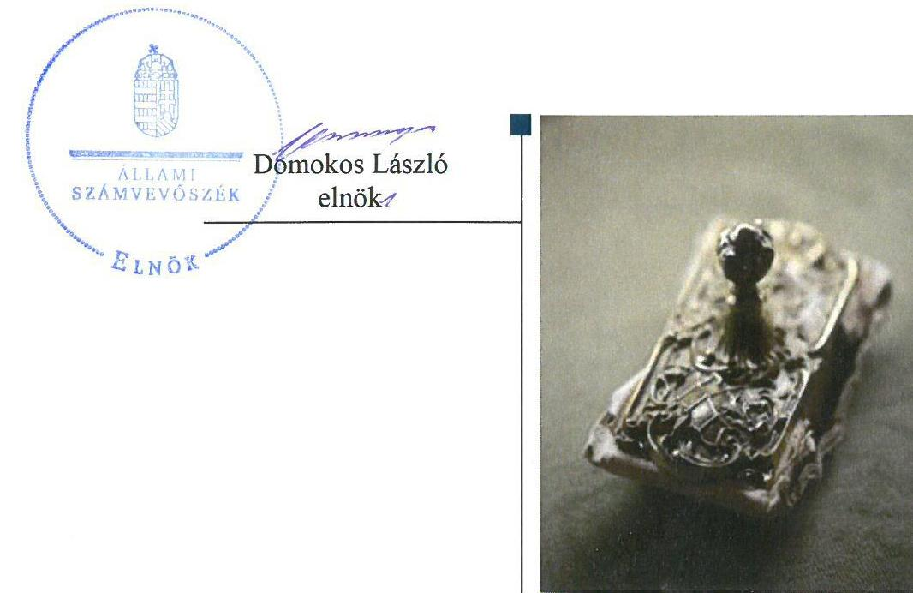

# Jelenetés 

## Központi költségvetési szervek ellenőrzése

Bársony István Mezőgazdasági Szakgimnázium, Szakközépiskola és Kollégium
2020.

---

# Jelentés 

## Központi költségvetési szervek ellenőrzése

Bársony István Mezőgazdasági Szakgimnázium, Szakközépiskola és Kollégium
2020. 01. hó 28. nap

---

# AZ ELLENŐRZÉST FELÜGYELTE:

## MAROZSÁN LÁSZLÓNÉ felügyeleti vezető

## AZ ELLENŐRZÉST VEZETTE ÉS A VÉGREHAJTÁSÁÉRT FELELŐS:

### BÁLINT KÁLMÁN KADOCSA ellenőrzésvezető

### A PROGRAM ÖSSZEÁLLÍTÁSÁÉRT FELELŐS:

### TÓTPÁL SZABOLCS osztályvezető

---

**IKTATÓSZÁM:** EL-2415-001/2020

**TÉMASZÁM:** 2450

**ELLENŐRZÉS-AZONOSÍTÓ SZÁM:** V079144

---

Jelentéseink az Országgyűlés számítógépes hálózatán és az Interneten a www.asz.hu címen is olvashatóak.

---

# TARTALOMJEGYZÉK 

■ ÖSSZEGZÉS ..... 5
■ AZ ELLENŐRZÉS CÉLJA ..... 6
■ AZ ELLENŐRZÉS TERÜLETE ..... 7
■ AZ ELLENŐRZÉS HÁTTERE, INDOKOLTSÁGA ..... 8
■ A JELENTÉS LÉNYEGES KÉRDÉSKÖREI ..... 10
■ AZ ELLENŐRZÉS HATÓKÖRE ÉS MÓDSZEREI ..... 11
■ MEGÁLLAPÍTÁSOK ..... 13
■ JAVASLATOK ..... 16
■ MELLÉKLETEK ..... 19
I. sz. melléklet: Értelmező szótár ..... 19
■ FÜGGELÉK: ÉSZREVÉTELEK ..... 21
■ RÖVIDÍTÉSEK JEGYZÉKE ..... 25

---

.

---

# ÖSSZEGZÉS 

A Bársony István Mezőgazdasági Szakgimnázium, Szakközépiskola és Kollégium működésének szabályozottsága, pénzügyi és vagyongazdálkodása nem felelt meg a jogszabályi előírásoknak. Nem volt biztosítva a felelős gazdálkodás, a közpénzek átlátható, szabályszerű felhasználása, és a nemzeti vagyonnal történő elszámoltatható gazdálkodás. A korrupcióval szemben nem volt védett.

## Az ellenőrzés társadalmi indokoltsága

Magyarország versenyképességének és a magyar gazdaság fejlődésének alapvető feltétele a magyar munkavállalók megfelelő szakmai képzettsége és felkészültsége, amelyben a szakképzési rendszernek döntő szerepe van. A mezőgazdaság vonatkozásában is kiemelten fontos ez, hiszen a magyar mezőgazdaság piaci versenyképességét és eredményességét nagymértékben befolyásolja az agrárszférában dolgozók képzettsége, felkészültsége. A szakképzés legjelentősebb színterei a szakképző iskolák. Az eredményes és célszerű szakképzés alapja és alapvető feltétele a szakképző intézmények közpénzekkel és a közvagyonnal való törvényes, átlátható és a korrupcióval szembeni védelmet biztosító működése és gazdálkodása. Ezért ezen szervezetekkel szemben is alapvető társadalmi igény, hogy a rájuk bízott közpénzekkel, közvagyonnal szabályosan gazdálkodjanak. Emellett a szakképzésben részt vevő pedagógusok, tanulók és a szülők jogos elvárása, hogy a szakképző iskolák működése átlátható és elszámoltatható legyen. Mindezen igényekkel összhangban, a közpénzügyek átláthatóságának előmozdítása, a közvagyon védelme érdekében került sor az agrárszakképző iskolák belső kontrollrendszerének és gazdálkodásának ellenőrzésére.

## Főbb megállapítások, következtetések, javaslatok

A Bársony István Mezőgazdasági Szakgimnázium, Szakközépiskola és Kollégium belső kontrollrendszere a hiányos szabályozás és működtetésében feltárt szabálytalanságok miatt nem biztosította a szabályszerű működés és gazdálkodás feltételeit.

A Bársony István Mezőgazdasági Szakgimnázium, Szakközépiskola és Kollégium vagyongazdálkodása a 2016. és 2017. években nem volt szabályszerű, költségvetési beszámolói leltárral nem voltak alátámasztottak. A Bársony István Mezőgazdasági Szakgimnázium, Szakközépiskola és Kollégium pénzügyi gazdálkodása a 2016. évben nem volt szabályszerű a kötelezettségekről vezetett előírt nyilvántartás hiánya miatt.

A Bársony István Mezőgazdasági Szakgimnázium, Szakközépiskola és Kollégiumban nem tették meg a legalapvetőbb intézkedéseket sem a korrupció megelőzése érdekében, mivel nem határozta meg az igazgató a döntésre, javaslattételre jogosult munkakörökkel kapcsolatosan a vagyonnyilatkozat-tételi kötelezettséget a szervezeti és működési szabályzatban.

A megállapítások alapján az Állami Számvevőszék a Bársony István Mezőgazdasági Szakgimnázium, Szakközépiskola és Kollégium intézményvezetője részére 11 javaslatot fogalmazott meg.

---

# AZ ELLENŐRZÉS CÉLJA 

AZ ELLENŐRZÉS CÉLJA annak megítélése volt, hogy az ellenőrzött intézményre vonatkozó irányító szervi feladatellátás a jogszabályi előírások betartásával történt-e; az intézménynél a belső kontrollrendszer kialakítása és működtetése szabályszerű volt-e, biztosította-e az átlátható, szabályszerű, gazdaságos, hatékony és eredményes gazdálkodás feltételeit; az intézmény pénzügyi és vagyongazdálkodása megfelelt-e a jogszabályi előírásoknak és belső szabályzatainak. Az ellenőrzés keretében az Állami Számvevőszék értékelte az intézmény korrupciós kockázatainak kezelését szolgáló integritás kontrollok kiépítettségét és az integritás szemlélet érvényesülését, a teljesítményellenőrzés feltételeinek kialakítását. Értékelte továbbá, hogy az ellenőrzött megfelel-e annak az Alaptörvényben meghatározott alapvetésnek, hogy Magyarország a kiegyensúlyozott, átlátható és fenntartható költségvetési gazdálkodás elvét érvényesíti. Érvényesült-e a nemzeti vagyon kezelésének és védelmének célja, azaz a szervezet vagyona a közérdeket szolgálta-e a közös szükségletek kielégítése és a természeti erőforrások megóvása, valamint a jövő nemzedékek szükségleteinek figyelembevétele mellett.

---

# **AZ ELLENŐRZÉS TERÜLETE**

## **Bársony István Mezőgazdasági Szakgimnázium, Szakközépiskola és Kollégium**

A csongrádi székhelyű Intézményt1 1928-ban alapították, a fenntartói és irányítói jogokat és hatásköröket a Minisztérium2 2013. augusztus 1-től gyakorolja.

Az Intézmény tevékenysége szakgimnáziumi, szakközépiskolai nevelés-oktatás és kollégiumi ellátás, valamint felnőttoktatás.

Az Intézmény tanulói létszáma a 2016/2017-es tanévben 364 fő volt. Az Intézmény az ellenőrzött időszakban környezetvédelem, környezetvédelem-vízgazdálkodás, valamint mezőgazdaság szakmacsoportokban biztosított szakképzési lehetőséget.

Az ellenőrzött időszakban az Intézménynél szervezeti, szerkezeti átalakításra nem került sor, az igazgató személye nem változott.

Az Intézmény önálló gazdasági szervezettel nem rendelkezik, gazdasági feladatait Bedő Albert Erdészeti Szakgimnázium, Szakközépiskola és Kollégium látja el.

Az Intézmény költségvetési kiadása 2016-ban 371 millió forint, 2017-ben 495 millió forint, az Irányító szervtől működéséhez kapott költségvetési támogatása 2016-ban 268 millió forint, 2017-ben 296 millió forint volt.

---

# AZ ELLENŐRZÉS HÁTTERE, INDOKOLTSÁGA 

Az államháztartás központi alrendszerének közpénz felhasználása, az intézmények által ellátott közfeladatok sokrétűsége, valamint a feladatellátásához rendelt vagyon nagyságrendje indokolja, hogy az ÁSZ ${ }^{3}$ ellenőrzéseket folytasson a pénzügyi és vagyongazdálkodás területén. Az ÁSZ az ellenőrzései során feltárja a gazdálkodást, a központi alrendszer intézményei átalakulását, átszervezését érintő szabályozások esetleges hiányosságait, a szabályozással nem érintett gazdálkodási területeket, rámutathat a vagyongazdálkodási tevékenység - ezen belül a tulajdonosi joggyakorlás és vagyonkezelés - esetleges szabálytalanságaira, értékeli az állami vagyon nyilvántartására és elszámolására vonatkozó eljárásokat.

Az ellenőrzés várhatóan hozzájárul a központi intézmények pénzügyi helyzetének pontosabb megítéléséhez, és a jó gyakorlat kialakításán és terjesztésén keresztül az ellenőrzések elősegíthetik a gazdálkodás szabályszerűségének javítását.

Az ellenőrzések megállapításai támogathatják az ellenőrzött szervezetek szabályszerű gazdálkodását, javaslataival elősegítheti az Alaptörvényben megfogalmazott alapvetések érvényesülését a mindennapi életben a szervezetek szintjén. A központi költségvetés rendszerében zajló folyamatok holisztikus elemzései, a kockázatok folyamatos figyelemmel kísérésének módszerével, az így kiválasztott szervezetek célzott, hatékony ellenőrzéseivel az ÁSZ betölti a legfőbb gazdasági ellenőrző szerv küldetését.

Az ellenőrzés a szervezet kockázatértékelése alapján, az egyedi és lényeges jellemzők figyelembevételével, az ellenőrzésre kiválasztott modullal történt. Az integritás- és belső kontroll modul a központi költségvetési szerv működésének irányítottságát, korrupció elleni védettségét értékelte.

A belső kontrollrendszer kialakítása és működtetése nélkül nem valósítható meg a közpénzek, a közvagyon átlátható, szabályos, gazdaságos, hatékony és eredményes felhasználása. A belső kontrollrendszer azt a célt szolgálja, hogy a költségvetési szervek működésük és gazdálkodásuk során a tevékenységeket szabályszerűen hajtsák végre, teljesítsék elszámolási kötelezettségeiket és megvédjék az erőforrásokat a veszteségektől, a károktól és a nem rendeltetésszerű használattól. A belső kontrollrendszer magában foglalja mindazon elveket, eljárásokat és belső szabályzatokat, melyek biztosítják, hogy a költségvetési szerv valamennyi tevékenysége és célja összhangban legyen a szabályszerűséggel, szabályozottsággal, valamint a gazdaságosság, hatékonyság és eredményesség követelményeivel, az eszközökkel és forrásokkal való gazdálkodásban ne kerüljön sor pazarlásra, visszaélésre, rendeltetésellenes felhasználásra. Megfelelő, pontos és naprakész információk álljanak rendelkezésre a költségvetési szerv működésével kapcsolatosan, és a belső kontrollrendszer harmonizációjára, összehangolására vonatkozó jogszabályok végrehajtásra kerüljenek. Az integritás kontrollok kiépítése, erősítése a szervezet korrupciós kockázatainak kezelését szolgálja. A teljesítménykövetelmények meghatározása és működtetése megalapozhatja a központi költségvetési szervnél a teljesítményellenőrzés lefolytatását.

---

Az egyes ellenőrzések megállapításaival és egy időszak ellenőrzési eredményeinek elemzésével az ÁSZ ráirányíthatja a jogalkotók figyelmét a központi alrendszerben vagy annak egy ágazatában esetlegesen felmerülő pénzügyi, szabályozási feszültségekre. Az elvégzett ellenőrzések során az ÁSZ „jó gyakorlatokat" is azonosíthat, melyeket tanácsadó funkciója keretében szélesebb körben is megismertethet az érintettekkel, ezáltal is hozzájárulva a költségvetési rendszer szabályozott, átlátható, kiegyensúlyozott és fenntartható működéséhez.

---

# A JELENTÉS LÉNYEGES KÉRDÉSKÖREI 

1.     - Az irányító szerv ellenőrzött költségvetési szervre vonatkozó feladatellátása szabályszerű volt-e?
2.     - A belső kontrollrendszer kialakítása és működtetése biztosította-e a közpénzekkel és a nemzeti vagyonnal történő átlátható, szabályszerű gazdálkodást?
3.     - A költségvetési szerv pénzügyi gazdálkodása szabályszerű volt-e?
4.     - A költségvetési szerv vagyongazdálkodása szabályszerű volt-e?
5. Az intézménynél alakítottak-e ki a teljesítmény mérésére alkalmas követelményeket?

---

# AZ ELLENŐRZÉS HATÓKÖRE ÉS MÓDSZEREI 

## Az ellenőrzés típusa

Megfelelőségi ellenőrzés.

## Az ellenőrzött időszak

A szervezet vagyongazdálkodása, integritás és belső kontrollrendszerének értékelése tekintetében a 2016-2017. évek.

Az irányító szervi feladatellátás és a szervezet pénzügyi gazdálkodása tekintetében a 2016. év.

## Az ellenőrzés tárgya

Az Intézmény belső kontrollrendszerének kialakítása és működtetése, pénzügyi és vagyongazdálkodása, az integritáskontrollok kiépítettsége, az integritás szemlélet érvényesülése, a teljesítmény ellenőrzés feltételeinek fennállása, valamint az irányító szervi feladatellátás.

## Az ellenőrzött szervezet

- Bársony István Mezőgazdasági Szakgimnázium, Szakközépiskola és Kollégium
- Földművelésügyi Minisztérium, mint irányító szerv (2018. május 18-tól Agrárminisztérium)
- Bedő Albert Erdészeti Szakgimnázium, Szakközépiskola és Kollégium, mint gazdálkodási feladatokat ellátó szervezet, 2017-re vonatkozóan

## Az ellenőrzés jogalapja

Az ellenőrzés jogszabályi alapját az ÁSZ tv. ${ }^{4}$ 1. § (3) bekezdés, 5. § (2)-(3) bekezdései, 5. § (4) bekezdés a) pontja, valamint az Áht. ${ }^{5}$ 61. § (2) bekezdésének előírásai képezték.

## Az ellenőrzés módszerei

Az ellenőrzésre a szakmai program szempontjai, az ellenőrzött időszakban hatályos jogszabályok, az ellenőrzés szakmai szabályai, a jelen ellenőrzésre irányadó ÁSZ módszertanok figyelembevételével került sor.

---

Az ÁSZ az ellenőrzés ideje alatt az ellenőrzött szervezetekkel a kapcsolattartást az ÁSZ SZMSZ ${ }^{\circledR}$-ének vonatkozó előírásai alapján biztosította.

Az ellenőrzési kérdések megválaszolásához szükséges bizonyítékok megszerzése az ellenőrzött szervezetek által rendelkezésre bocsátott dokumentumokra, adatokra alapozva megfigyelés, szemle (szemrevételezés), kérdésfeltevés (információkérés), mintavételezés, valamint elemző eljárás útján történt.

Az ellenőrzési bizonyítékként felhasználható adatforrások közé tartoztak egyrészt a szakmai program részletes szempontjainál felsorolt adatforrások, másrészt minden egyéb - az ellenőrzés folyamán feltárt, az ellenőrzés szempontjából információt tartalmazó - dokumentum.

Az ellenőrzés lefolytatásához az ellenőrzött szervezetek a tanúsítványok kitöltésével, valamint az ÁSZ által kért dokumentumok megküldésével szolgáltattak adatokat, amelyek valódiságát és teljes körűségét az ellenőrzött szervezet vezetője által tett teljességi és hitelességi nyilatkozat igazolta. Az így rendelkezésre bocsátott adatok, információk kontrollja az ellenőrzés keretében történt.

Az Intézmény belső kontrollrendszere egyes pilléreinek kialakítására és működtetésére vonatkozó értékelés a következő volt:
$\longrightarrow$ „szabályszerű", amennyiben az értékelt területen az elért „igen" válaszok százalékban kifejezett, egész számra kerekített aránya legalább $85 \%$ volt,
$\longrightarrow$ „nem szabályszerű", ha nem érte el a 85\%-ot.
A központi költségvetési szerv belső kontrollrendszerének összesített értékelése az egyes részterületek esetében kapott megfelelőségi arányok számtani átlaga alapján történt és megegyezett a pillérenként (kontrollterületenként) alkalmazott százalékos értékelésekkel, a következő eltérésekkel: a kontrollrendszer egésze esetében a „szabályszerű" értékelésnek a százalékos értéken felül további feltétele volt, hogy egyik kontrollterület sem kaphat „nem szabályszerű" értékelést.

Az ÁSZ statisztikai módszereken alapuló mintavételt alkalmazott.
A 2017. évi kiadások (külső személyi juttatások, felhalmozási kiadások, dologi kiadások) esetében az ellenőrzés azokra a legnagyobb értékű tételekre - a lényeges sokaságra - terjedt ki, melyek összértéke eléri a teljes sokaság összértékének 50\%-át.

A 2017. évi kiadások esetében a lényeges sokaságot tételesen ellenőrizte az ÁSZ.

A 2017. évi beruházások, felújítások végrehajtásának, valamint a feladatellátást szolgáló állami vagyontárgyak év végi értékelésének szabályszerűsége
 esetében tételes ellenőrzésre került sor.

---

# 1. Az irányító szerv ellenőrzött költségvetési szervre vonatkozó feladatellátása szabályszerű volt-e? 

Összegző megállapítás A Minisztériumnak az Intézményre vonatkozó feladatellátása szabályszerű volt.

A Minisztérium jóváhagyta az Intézmény elemi költségvetését, költségvetési beszámolóját a jogszabályi előírásoknak megfelelően.

A Minisztérium az Áht-ben foglalt hatáskörét gyakorolva beszámoltatta az Intézmény vezetőjét az éves szakmai feladatellátásról, valamint az éves gazdálkodásról.

## 2. A belső kontrollrendszer kialakítása és működtetése biztosította-e a közpénzekkel és a nemzeti vagyonnal történő átlátható, szabályszerű gazdálkodást?

## Összegző megállapítás Az Intézmény belső kontrollrendszerének kialakítása és működtetése nem volt szabályszerű a 2016-2017. évben.

Az Intézmény belső kontrollrendszerének kialakítása és működtetése a 2016. évben nem volt szabályszerű, mert az Intézmény szervezeti és működési szabályzata nem tartalmazta a vagyonnyilatkozat-tételi kötelezettséggel járó munkaköröket a Vnytv. ${ }^{7}$ 4. § a) pontja ellenére.

Az Intézmény belső kontrollrendszerének kialakítása és működtetése a 2017. évben nem volt szabályszerű, mert:
$\longrightarrow$ az Intézmény a 2017. évben a szervezeti és működési szabályzatában nem határozta meg a Vnytv. 3. § (1) bekezdés b-c. pontjában rögzítettek ellenére a döntésre, javaslattételre jogosult munkakörökkel kapcsolatosan a vagyonnyilatkozat-tételi kötelezettséget,
$\longrightarrow$ az Intézmény az Áhsz. 51.§ (2) bekezdésében előírtak ellenére 2017. augusztus 30-ig nem rendelkezett számlarenddel,
$\longrightarrow$ a 2017. évben az Áhsz. ${ }^{8}$ 50.§ (7) bekezdése ellenére a számviteli politikában ${ }^{9}$ nem rögzítették az általános költségek, valamint az általános kiadások és bevételek tevékenységekre történő felosztásának módját, a felosztáshoz alkalmazott mutatókat, vetítési alapokat.
Az Intézmény rendelkezett Leltározási szabályzattal ${ }^{10}$, Értékelési szabályzattal ${ }^{11}$, Pénzkezelési szabályzattal ${ }^{12}$, valamint Önköltségszámítási szabályzattal ${ }^{13}$.

INTEGRÁLT KOCKÁZATKEZELÉSI RENDSZERT az Intézmény vezetője a 2017. évben a Bkr. ${ }^{14}$ 7. § (1) bekezdésben előírtak ellenére nem működtette, mert a Bkr. 7. § (2) pontjában foglaltak ellenére

---

nem mérte fel és nem állapította meg az Intézmény tevékenységében rejlő szervezeti célokkal összefüggő kockázatokat, a kockázatokkal kapcsolatban szükséges intézkedéseket.

# A KONTROLLTEVÉKENYSÉGEK GYAKORLÁSA a 

2017. évben nem volt szabályszerű, mert a dologi kiadások esetében az Ávr. 56. § (1) bekezdése ellenére a kötelezettségvállalást követően 2017. augusztus 11-ig nem gondoskodtak a költségvetési év és az azt követő évek szabad előirányzatait terhelő rész lekötéséről, 2017. augusztus 12-től a költségvetési év és az azt követő éveket terhelő rész nyilvántartásba vételéről.

Az Intézmény vezetője nem alakította ki az információs és kommunikációs rendszert, nem határozta meg a beszámolási szinteket, határidőket, módokat megsértve ezzel a Bkr. 9. § (1)-(2) bekezdésében foglaltakat.

Az Intézményre vonatkozóan a jogszabályokban előírt adatszolgáltatási kötelezettség teljesítéséről nem gondoskodtak, mert:
— az Intézmény vezetője nem gondoskodott a 2017. évben az Ávr. 169. § (2) bekezdésben előírt időközi költségvetési jelentés a Kincstár által működtetett elektronikus adatszolgáltató rendszerbe történő feltöltéséről,
— az Intézmény vezetője nem gondoskodott a 2017. évben az Ávr. 170. § (2) bekezdésben előírt időközi mérlegjelentés a Kincstár által működtetett elektronikus adatszolgáltató rendszerbe határidőben történő feltöltéséről.

NYOMONKÖVETÉSI RENDSZERT az Intézmény vezetője a Bkr. 10. §-ban foglaltak ellenére nem alakította ki. A pályázatokkal kapcsolatos feladatokon kívül, egyéb eseti és folyamatos nyomon követést dokumentáltan nem végzett.

Az Intézmény vezetője az Áht. 70. § (1) bekezdésében előírtak ellenére 2017. augusztus 31-ig nem gondoskodott az Intézményre vonatkozó belső ellenőrzés kialakításáról. A belső ellenőrzés kereteit az Intézmény vezetője 2017. szeptember 1-vel kialakította, azonban a Bkr. 10. §-ban foglaltak ellenére nem működtette, mert a 2017. évben az Intézményre vonatkozóan belső ellenőrzés nem történt.

AZ INTEGRITÁSI kontrollok kiépítettségi szintje az Intézménynél nem támogatta a korrupciós kockázatok kezelését. Az Intézmény nem végzett kockázatelemzést. Az Intézmény nem működtette az integritást erősítő nem kötelezően előírt kontrollokat.

Az Intézmény vezetője a Bkr. szerint értékelte az Intézmény belső kontrollrendszerének minőségét. Vezetői nyilatkozatában 2016-2017. évekre vonatkozóan szabályszerűnek minősítette az Intézmény belső kontrollrendszerét. Az ÁSZ ellenőrzés megállapításai a 2016-2017. években kiadott vezetői nyilatkozatokat nem támasztották alá.

---

# 3. A költségvetési szerv pénzügyi gazdálkodása szabályszerű volt-e? 

## Összegző megállapítás

Az Intézmény pénzügyi gazdálkodása a 2016. évben nem volt szabályszerű.

Az Intézménynél az Áhsz. 39. § (3) bekezdésben előírtak ellenére nem vezették a kötelezettségvállalásokról az Áhsz 14. melléklet II. rész 4. pontja szerinti nyilvántartást.

## 4. A költségvetési szerv vagyongazdálkodása szabályszerű volt-e?

## Összegző megállapítás

Az Intézmény vagyongazdálkodása a 2016. és a 2017. évben nem volt szabályszerű.

Az Intézmény vagyongazdálkodása 2016-2017. évben nem volt szabályszerű, mert:
$\longrightarrow$ az Áhsz. 5. § (1) bekezdésében, a 22. § (1)-(2) bekezdéseiben, valamint a Számv. ${ }^{15}$ tv. 69. § (1) bekezdésében előírtak ellenére az Intézmény a mérleg tételeit 2016-2017. évekre vonatkozóan leltárral nem támasztotta alá,
$\longrightarrow$ az Intézményre vonatkozóan a 2017. évben az intézményi feladat ellátást szolgáló ingatlanok esetében, az Áhsz 39. § (3) bekezdésében foglaltak ellenére valamint, az Áhsz 14. melléklet VII. 1. bekezdés e) pontjában előírtak ellenére a részletező nyilvántartást nem vezették,
$\longrightarrow$ a 2017. évi beruházások felújítások végrehajtása során az Ávr. 50. § (1a) bekezdésében foglaltakat megsértve a kötelezettségvállalás nem tartalmazta a szervezet képviselőjének nyilatkozatát arra vonatkozóan, hogy átlátható szervezetnek minősül.

## 5. Az intézménynél alakítottak-e ki a teljesítmény mérésére alkalmas követelményeket?

## Összegző megállapítás

A teljesítmény mérésére alkalmas követelményeket az Intézménynél nem alakítottak ki.

Az Intézmény vezetője a szervezeti célok elérését szolgáló feladatok, folyamatok, tevékenységek mérését szolgáló indikátorokat, mérőszámokat, feladat- és teljesítménymutatókat nem képezett, az Intézmény a teljesítmény mérésének lehetőségét nem biztosította.

---

# JAVASLATOK 

Az ÁSZ tv. 33. § (1) bekezdésében foglaltak értelmében az ellenőrzött szervezet vezetője köteles a jelentésben foglalt megállapításokhoz kapcsolódó intézkedési tervet összeállítani és azt a jelentés kézhezvételétől számított 30 napon belül az ÁSZ részére megküldeni. Amennyiben az ellenőrzött szervezet vezetője nem küldi meg határidőben az intézkedési tervet, vagy továbbra sem elfogadható intézkedési tervet küld, az Állami Számvevőszék elnöke az ÁSZ tv. 33. § (3) bekezdés a) és b) pontjaiban foglaltakat érvényesítheti.

## Bársony István Mezőgazdasági Szakgimnázium, Szakközépiskola és Kollégium igazgatója részére

1. Intézkedjen a Vnytv. előírásainak megfelelően a vagyonnyilatkozat-tételi kötelezettség SZMSZ-ben való feltüntetéséről.
(2. sz. megállapítás 2. bekezdés 1. francia bekezdése alapján)
2. Intézkedjen, hogy a számviteli politika feleljen meg az Áhsz. előírásainak.
(2. sz. megállapítás 2. bekezdés 3. francia bekezdése alapján)
3. Intézkedjen az integrált kockázatkezelési rendszer Bkr. előírásának megfelelő működtetéséről.
(2. sz. megállapítás 4. bekezdése alapján)
4. Gondoskodjon a kiadások esetében a kötelezettségvállalás jogszabályi előírások szerinti nyilvántartásba vételéről.
(2. sz. megállapítás 5. bekezdése alapján)
5. Intézkedjen az információs és kommunikációs rendszer Bkr. előírásának megfelelő kialakításáról és működtetéséről.
(2. sz. megállapítás 6. bekezdése alapján)
6. Gondoskodjon az adatszolgáltatási kötelezettség Ávr. előírásainak megfelelő teljesítéséről.
(2. sz. megállapítás 7. bekezdés 1-2. francia bekezdései alapján)
7. Intézkedjen a nyomonkövetési rendszer Bkr. előírása szerinti kialakításáról és működtetéséről.
(2. sz. megállapítás 8. bekezdése alapján)

---

8. Gondoskodjon az Intézmény belső ellenőrzésének Bkr. szerinti működtetéséről.
(2. sz. megállapítás 9. bekezdés 2. mondat 2-3. tagmondata alapján)
9. Intézkedjen az éves költségvetési beszámoló elkészítéséhez, a mérlegtételeinek alátámasztásához a jogszabályi előírásnak megfelelő leltár összeállításáról.
(4. sz. megállapítás 1. bekezdés 1. francia bekezdése alapján)
10. Gondoskodjon az Áhsz. előírásainak megfelelő részletező nyilvántartás vezetéséről az Intézmény feladatellátását szolgáló ingatlanokról.
(4. sz. megállapítás 1. bekezdés 2. francia bekezdése alapján)
11. Gondoskodjon arról, hogy jogi személlyel, jogi személyiséggel nem rendelkező szervezettel kötött visszterhes szerződések esetén a szerződés az Ávr. előírásának megfelelően tartalmazza a szerződő fél képviselőjének nyilatkozatát arra vonatkozóan, hogy átlátható szervezetnek minősül.
(4. sz. megállapítás 1. bekezdés 3. francia bekezdése alapján)

---

.

---

# MELLÉKLETEK 

- I. SZ. MELLÉKLET: ÉRTELMEZŐ SZÓTÁR
állami vagyon
állami vagyonnak minősül:
a) az állam tulajdonában lévő dolog, valamint a dolog módjára hasznosítható természeti erő,
b) az a) pont hatálya alá nem tartozó mindazon vagyon, amely vonatkozásában törvény az állam kizárólagos tulajdonjogát nevesíti,
c) az állam tulajdonában lévő tagsági jogviszonyt megtestesítő értékpapír, illetve az államot megillető egyéb társasági részesedés,
d) az államot megillető olyan immateriális, vagyoni értékkel rendelkező jogosultság, amelyet jogszabály vagyoni értékű jogként nevesít. (Forrás: Vtv. 1. § (2) bekezdése)
állami vagyon kezelője /vagyonkezelő
átalakítás
belső ellenőrzés
belső kontrollrendszer
belső kontrollrendszer területei
ellenőrzési nyomvonal
információs és kommunikációs rendszer
integritás

Állami vagyonnak minősül:
a) az állam tulajdonában lévő dolog, valamint a dolog módjára hasznosítható természeti erő,
b) az a) pont hatálya alá nem tartozó mindazon vagyon, amely vonatkozásában törvény az állam kizárólagos tulajdonjogát nevesíti,
c) az állam tulajdonában lévő tagsági jogviszonyt megtestesítő értékpapír, illetve az államot megillető egyéb társasági részesedés,
d) az államot megillető olyan immateriális, vagyoni értékkel rendelkező jogosultság, amelyet jogszabály vagyoni értékű jogként nevesít. (Forrás: Vtv. 1. § (2) bekezdése)
Az állami vagyont az MNV Zrt ${ }^{16}$. maga kezeli, vagy szerződés - így különösen bérlet, haszonbérlet, megbízás - alapján központi költségvetési szervnek, természetes vagy jogi személynek, vagy jogi személyiséggel nem rendelkező gazdálkodó szervezetnek hasznosításra átengedi." Az állami vagyonra vonatkozóan az MNV Zrt. kizárólag az Nvtv.-ben meghatározott személyekkel köthet vagyonkezelési szerződést. (Forrás: Vtv. 27. § (1) bekezdése, hatályos 2012. január 1-jétől)
A költségvetési szerv általános jogutódlással történő megszüntetése átalakítással történhet. Az átalakítás lehet egyesítés vagy különválás. Az egyesítés lehet beolvadás vagy összeolvadás. (2015. január 1-jétől Áht. 11. § (2) bekezdés)
Független, tárgyilagos bizonyosságot adó és tanácsadó tevékenység, amelynek célja, hogy az ellenőrzött szervezet működését fejlessze és eredményességét növelje, az ellenőrzött szervezet céljai elérése érdekében rendszerszemléletű megközelítéssel és módszeresen értékeli, illetve fejleszti az ellenőrzött szervezet irányítási és belső kontrollrendszerének hatékonyságát. (Forrás: Bkr. 2. § b) pontja)
A belső kontrollrendszer a kockázatok kezelése és tárgyilagos bizonyosság megszerzése érdekében kialakított folyamatrendszer, amely azt a célt szolgálja, hogy a működés és gazdálkodás során a tevékenységeket szabályszerűen, gazdaságosan, hatékonyan, eredményesen hajtsák végre, az elszámolási kötelezettségeket teljesítsék, megvédjék az erőforrásokat a veszteségektől, károktól és nem rendeltetésszerű használattól. (Forrás: Áht. 69. § (1) bekezdése)
A kontrollkörnyezet, az integrált kockázatkezelési rendszer, a kontrolltevékenységek, az információs és kommunikációs rendszer, valamint a nyomon követési (monitoring) rendszer. (Forrás: Bkr. 3. §-a)
Az ellenőrzési nyomvonal a költségvetési szerv működési folyamatainak szöveges, táblázatokkal vagy folyamatábrákkal szemléltetett leírása, amely tartalmazza különösen a felelősségi és információs szinteket és kapcsolatokat, irányítási és ellenőrzési folyamatokat, lehetővé téve azok nyomon követését és utólagos ellenőrzését. (Forrás: Bkr. 6. § (3) bekezdés)
A költségvetési szerv vezetője által kialakított és működtetett olyan rendszer, mely biztosítja, hogy a megfelelő információk a megfelelő időben eljutnak az illetékes szervezethez, szervezeti egységhez, illetve személyhez. (Forrás: Bkr. 9. § (1) bekezdés)
Az integritás - egyik gyakran használt jelentése szerint - az elvek, értékek, cselekvések, módszerek, intézkedések konzisztenciáját jelenti, vagyis olyan magatartásmódot, amely meghatározott értékeknek megfelel. Integritás-irányítási rendszer bevezetése a szervezetben a szervezethez rendelt közfeladatok integritás szempontú ellátását, az

---

integrált kockázatkezelési rendszer
irányító szerv/felügyeleti szerv
kockázat
kontrollkörnyezet
kontrolltevékenységek
nyomon követési rendszer (monitoring)
vagyongazdálkodás
érték alapú működéssel (integritással) összefüggő szervezeti követelmények következetes érvényesítését jelenti. (Forrás: Nemzetgazdasági Minisztérium: Államháztartási Belső Kontroll Standardok és Gyakorlati Útmutató 1.6. Etikai értékek és integritás 46. oldal, 2017.
 szeptember)
Olyan folyamatalapú kockázatkezelési rendszer, amely a szervezet minden tevékenységére kiterjed, egységes módszertan és eljárások alkalmazásával, a szervezet célkitűzéseinek és értékeinek figyelembevételével biztosítja a szervezet kockázatainak teljes körű azonosítását, azok meghatározott kritériumok szerinti értékelését, valamint a kockázatok kezelésére vonatkozó intézkedési terv elkészítését és az abban foglaltak nyomon követését. (Forrás: Bkr. 2. § m) pontja, 2016. október 1-jétől)
A költségvetési szerv tekintetében az Áht.-ban meghatározott irányítási hatáskört gyakorló szerv. (Forrás: Áht. 1. § 9. pontja)
A kockázat annak a valószínűségét jelenti, hogy egy vagy több esemény vagy intézkedés nem kívánt módon befolyásolja a rendszer működését, céljainak megvalósulását. (Forrás: Javaslatok a korrupciós kockázatok kezelésére - Kockázatkezelési és ellenőrzési módszertan 35. oldal, ÁSZ)
A költségvetési szerv vezetője által kialakított olyan elvek, eljárások, belső szabályzatok összessége, amelyben világos a szervezeti struktúra, a folyamatok átláthatók, egyértelműek a felelősségi, hatásköri viszonyok és feladatok, meghatározottak, ismertek és elfogadottak az etikai elvárások a szervezet minden szintjén, átlátható a humán-erőforrás-kezelés. (Forrás: Bkr. 6. § (1) bekezdés)
A költségvetési szerv vezetője által a szervezeten belül kialakított (kontroll) tevékenységek, melyek biztosítják a kockázatok kezelését, hozzájárulnak a szervezet céljainak eléréséhez és erősítik a szervezet integritását. (Forrás: Bkr. 8. § (1) bekezdés)
A költségvetési szerv vezetője köteles kialakítani a szervezet tevékenységének a célok megvalósításának nyomon követését biztosító rendszert, amely az operatív tevékenységek keretében megvalósuló folyamatos és eseti nyomon követésből, valamint az operatív tevékenységektől függetlenül működő belső ellenőrzésből áll. 2016. október 1-jétől: A költségvetési szerv vezetője köteles kialakítani a szervezet tevékenységének, a célok megvalósításának nyomon követését biztosító rendszert, mely az operatív tevékenységek keretében megvalósuló folyamatos és eseti nyomon követésből, valamint az operatív tevékenységektől függetlenül működő belső ellenőrzésből állhat. (Forrás: Bkr. 10. §)
A nemzeti vagyongazdálkodás feladata a nemzeti vagyon rendeltetésének megfelelő, az állam, az önkormányzat mindenkori teherbíró képességéhez igazodó, elsődlegesen a közfeladatok ellátásához és a mindenkori társadalmi szükségletek kielégítéséhez szükséges, egységes elveken alapuló, átlátható, hatékony és költségtakarékos működtetése, értékének megőrzése, állagának védelme, értéknövelő használata, hasznosítása, gyarapítása, továbbá az állam vagy a helyi önkormányzat feladatának ellátása szempontjából feleslegessé váló vagyontárgyak elidegenítése. (Forrás: Nvtv. 7. § (2) bekezdése)

---

# FÜGGELÉK: ÉSZREVÉTELEK 

A jelentéstervezetet a Számvevőszék 15 napos észrevételezésre megküldte az ellenőrzött szervezetek vezetőinek az ÁSZ tv. 29. § (1) bekezdése előírásának megfelelően.

A Bársony István Mezőgazdasági Szakgimnázium, Szakközépiskola és Kollégium igazgatója a jelentéstervezet megállapításaira írásban észrevételt tett. A gazdálkodási feladatokat ellátó Bedő Albert Erdészeti Szakgimnázium, Szakközépiskola és Kollégium igazgatója, valamint az agrárminiszter a jelentéstervezet megállapításaira nem tettek észrevételt.
Az ÁSZ tv. 29. § (3) bekezdésével összhangban az Állami Számvevőszék a Függelékben feltünteti az ellenőrzés megállapításaival kapcsolatban tett, figyelembe nem vett észrevételeket, és megindokolja, hogy azokat miért nem fogadta el.

A „Központi költségvetési szervek ellenőrzése - Bársony István Mezőgazdasági Szakgimnázium, Szakközépiskola és Kollégium" címmel készített számvevőszéki jelentéstervezet megállapításaival kapcsolatban a Bársony István Mezőgazdasági Szakgimnázium, Szakközépiskola és Kollégium (továbbiakban: Intézmény) igazgatója által 2019. december 9-én kelt levélben tett észrevételek és azok kezelésének indokolása.

## 1. A 2016. évi vagyonnyilatkozat-tételi kötelezettség belső szabályozásával kapcsolatban tett észrevétel (2. megállapítás 1. bekezdés)

Az Intézmény igazgatójának észrevétele tartalmazta, hogy az egyes vagyonnyilatkozat-tételi kötelezettségekről szóló 2007. évi CLII. törvény (továbbiakban: Vnytv.) 3. § (1) bekezdése értelmében ,,vagyonnyilatkozat tételre kötelezett az a közszolgáltatásban álló személy, aki - önállóan vagy testület tagjaként - javaslattételre, döntésre vagy ellenőrzésre jogosult." Elmondása szerint az Intézményben a fejlesztésekre vonatkozó javaslattételre a teljes pedagógusi kar, a tantestület a jogosult. Ugyanakkor nem érezte életszerűnek, hogy minden pedagógus vagyonnyilatkozat tételre kötelezett legyen. Leírta továbbá, hogy a jogszabály újraértelmezése után a szerződő partnerek kiválasztására javaslattevő, a döntésben, ellenőrzésben résztvevő vezetői munkaköröket megnevezik az SZMSZ-ben. Leírta továbbá, hogy vagyonnyilatkozat-tételi kötelezettsége az igazgatónak van, munkáltatója részére a jogszabály által meghatározott időszakokban azt teljesítette, teljesíti.
A Vnytv. 3. § (1) bekezdése nem biztosít mérlegelési lehetőséget a vagyonnyilatkozat-tételre kötelezett személyek körének kialakítását illetően. Az ellenőrzés megállapította, hogy az Intézmény 2016-2017. években hatályos SZMSZ-ében nem kerültek feltüntetésre az Intézménynél vagyonnyilatkozat-tételre

[^0]
[^0]:    * 29. § (1) Az Állami Számvevőszék az ellenőrzési megállapításait megküldi az ellenőrzött szervezet vezetőjének vagy az általa megbízott személynek, és annak, akinek személyes felelősségét állapította meg.
    (2) Az ellenőrzött szervezet vezetője és a felelősként megjelölt személy az ellenőrzés megállapításaira tizenöt napon belül írásban észrevételt tehet.
    (3) Az Állami Számvevőszék az észrevételre a beérkezésétől számított harminc napon belül írásban válaszol. A figyelembe nem vett észrevételeket köteles a jelentésben feltüntetni, és megindokolni, hogy azokat miért nem fogadta el.

---

kötelezettek (az igazgatói munkakör sem), azaz a Vnytv. 3. § (1) bekezdése értelmében a javaslattételre, döntésre, ellenőrzésre jogosultak, amivel megsértették a Vnytv. 4. § a) pontjának előírásait.
Fentiekre tekintettel az észrevételt nem fogadtuk el, a jelentéstervezet módosítása nem volt indokolt.
2. Az Intézmény számlarendjével kapcsolatban tett megállapításra érkezett észrevétel (2. megállapítás 2. bekezdés 2. franciabekezdés)
Az Intézmény igazgatója észrevételében jelezte, hogy az Intézmény gazdasági feladatait ellátó Bedő Albert Erdészeti Szakgimnázium, Szakközépiskola és Kollégium (továbbiakban: gazdasági feladatellátó) által irányított gazdasági szervezet gazdasági ügyintézői munkakörében 2016. évben teljes körű volt a fluktuáció, ezért az Intézmény gazdasági eseményeinek a könyvelése 2016. év végéig nem Csongrádon, hanem Ásotthalmon történt helyileg is. Jelezte továbbá, hogy a gazdaságvezető nyilatkozata szerint rendelkeztek a 2016-2017. években számlarenddel.
Az Intézmény által beküldött dokumentumok felülvizsgálata alapján megállapítható, hogy a számlarendre vonatkozó EL-1148-003/2018. iktatószámú adatbekérő levélben foglaltak ellenére a 2016. évben hatályos számlarendet nem, csak 2016. január 1-től hatályos bizonylati rendet adott át az Intézmény az ellenőrzés részére. Továbbá a „2017. évi zárszámadás - Magyarország 2017. évi központi költségvetése végrehajtásának ellenőrzése" című ellenőrzés adatbekérése keretében a 2017. augusztus 31-től hatályos számlarendet bocsátották az ÁSZ rendelkezésére, amihez kapcsolódóan az Intézmény igazgatója 2019. február 25-én nyilatkozott a tárgyi ellenőrzéshez való felhasználhatóságáról. A fentiekre tekintettel 2016. január 1-2017. augusztus 30. közötti időszakra vonatkozóan nem igazolták, hogy az Intézmény rendelkezett számlarenddel, erre az időszakra hatályos számlarendet nem adtak át az ellenőrzés részére. A számlarend hiányával megsértették az államháztartás számviteléről szóló 4/2013. (I. 11.) Korm. rendelet 51. § (2) bekezdését.
Az Állami Számvevőszék az ellenőrzési megállapításait az ellenőrzési adatszolgáltatás során a részére törvényi határidőben rendelkezésre bocsátott hiteles dokumentumokra alapozva fogalmazta meg. Az Intézmény igazgatójának 2018. november 8-án kelt teljességi és hitelességi nyilatkozatában az átadott dokumentumok, adatok hitelességéért, valódiságáért, hiánytalanságáért és hatályosságáért teljes felelősséget vállalt, valamint a 2019. február 25-én kelt, a korábban bekért adatok felhasználhatóságáról kiállított nyilatkozatában jogi felelősségének tudatában kijelentette, hogy a korábbi ellenőrzésben átadott dokumentumok a jelen ellenőrzés vonatkozásában megbízhatóak, hatályosak, felhasználhatóak és a bekért adatokra vonatkozóan teljeskörű információt tartalmaznak. Fentiekre tekintettel az észrevételt nem fogadtuk el, a jelentéstervezet módosítása nem volt indokolt.
3. A 2017. évi belső ellenőrzési rendszerrel kapcsolatban tett észrevétel (2. megállapítás 9. bekezdés; 8. javaslat)

Az Intézmény igazgatója észrevételében jelezte, hogy a költségvetési szervek belső kontrollrendszeréről és belső ellenőrzéséről szóló 370/2011. (XII. 31.) Korm. rendelet (továbbiakban: Bkr.) 15. § (4) bekezdése értelmében a gazdasági szervezettel nem rendelkező költségvetési szervként az Intézménynél a belső ellenőrzési feladatokat a gazdasági feladatellátó költségvetési szerv vagy az irányító szerv által kijelölt szervnek kellett elvégeznie, így 2017. január 1-től a gazdasági feladatellátó feladat- és hatásköre volt a belső ellenőrzési rendszer működtetése.
A Bkr. 15. § (4) bekezdése a belső ellenőrzés elvégzésére vonatkozó részletszabályokat rögzíti. Ugyanakkor az államháztartásról szóló 2011. évi CXCV. törvény (továbbiakban: Áht.) 70. § (1) bekezdése szerint a belső ellenőrzés kialakításáról, megfelelő működtetéséről és függetlenségének biztosításáról a költségvetési szerv vezetője köteles gondoskodni.
Az Intézmény igazgatójának - ellenőrzési adatszolgáltatás során átadott - 2018. november 9-én kelt

---

nyilatkozata rögzíti, hogy az Intézmény önálló belső ellenőrrel nem rendelkezett, az erre irányuló feladatokat a gazdasági feladatellátó látta el, de tényleges belső ellenőrzés a 2018. évben valósult meg. A belső ellenőrzés 2017. évi működtetését bizonyító dokumentumot nem bocsátottak az ellenőrzés rendelkezésére. Az Intézmény igazgatójának fenti észrevétele és nyilatkozata megerősítette az ellenőrzés vonatkozó megállapítását a belső ellenőrzés 2017. évi működésének hiányára vonatkozóan. Fentiekre tekintettel az észrevételt nem fogadtuk el, a jelentéstervezet módosítása nem volt indokolt.
4. A 2017. évi adatszolgáltatásokkal kapcsolatban érkezett észrevétel (2. megállapítás 7. bekezdése; 6. javaslat)

Az Intézmény igazgatója - az adatszolgáltatási kötelezettségekkel kapcsolatos megállapításra hivatkozva - észrevételében jelezte, hogy az Intézmény az Áht. 10. § (4/a) bekezdése szerint nem rendelkezett gazdasági szervezettel. A gazdasági szervezeti feladatokat a gazdasági feladatellátó költségvetési szerv látta el.
5. A 2016-2017. évi kötelezettségvállalás nyilvántartással kapcsolatban érkezett észrevétel (2. megállapítás 5. bekezdése, 3. megállapítás 1. bekezdése, 4. javaslat)
Az Intézmény igazgatója a jelentéstervezet kötelezettségvállalási nyilvántartásokkal kapcsolatos megállapítására hivatkozva észrevételében jelezte, hogy az Intézmény az Áht. 10. § (4/a) bekezdése szerint nem rendelkezett gazdasági szervezettel, így ez nem az Intézmény feladat- és hatáskörébe tartozott.
6. A 2016-2017. évi leltározással és az ingatlanokra vonatkozó részletező nyilvántartás vezetésével kapcsolatban tett megállapításra érkezett észrevétel (4. megállapítás 1. bekezdés 1-2. francia bekezdés; 9-10. javaslat)
Az Intézmény igazgatója a jelentéstervezet 2016. és 2017. évi mérlegtételek leltárral történő alátámasztásának hiányával és az ingatlanokra vonatkozó részletező nyilvántartás vezetésének hiányával kapcsolatos megállapítására hivatkozva észrevételében jelezte, hogy az Intézmény az Áht. 10. § (4/a) bekezdése szerint nem rendelkezett gazdasági szervezettel, így a 2016-2017. években ez nem tartozott az Intézmény feladat- és hatáskörébe, valamint az sem, hogy a gazdasági ügyintézőket kiválassza, a rájuk vonatkozó munkáltatói jogokat gyakorolja, feladataikat meghatározza és a feladatok végrehajtását ellenőrizze.
Az Intézmény igazgatóját az Állami Számvevőszék tájékoztatta a 4-6. pontokban leírt tájékoztatásához, észrevételeihez kapcsolódóan, hogy az Áht. 10. § (1) bekezdése értelmében a költségvetési szerv vezetője felelős a közfeladatok jogszabályban, alapító okiratban, belső szabályzatban foglaltaknak megfelelő ellátásáért, valamint a költségvetési szerv számára jogszabályban előírt kötelezettségek teljesítéséért. Az Intézmény igazgatójának tájékoztatása a gazdasági feladatok ellátására vonatkozóan a jelentéstervezet megállapítását nem befolyásolta, észrevételeiben a jelentéstervezet kapcsolódó megállapítását nem vitatta, így a jelentéstervezet módosítása nem volt indokolt.

---

.

---

# RÖVIDÍTÉSEK JEGYZÉKE 

${ }^{1}$ Intézmény
${ }^{2}$ Minisztérium
${ }^{3}$ ÁSZ
${ }^{4}$ ÁSZ tv.
${ }^{5}$ Áht.
${ }^{6}$ ÁSZ SZMSZ
${ }^{7}$ Vnytv
${ }^{8}$ Áhsz.
${ }^{9}$ Számviteli politika
${ }^{10}$ Leltározási szabályzat
${ }^{11}$ Értékelési szabályzat
${ }^{12}$ Pénzkezelési szabályzat
${ }^{13}$ Önköltségszámítási szabályzat
${ }^{14}$ Bkr.
${ }^{15}$ Számv. tv.
${ }^{16}$ MNV Zrt.

Bársony István Mezőgazdasági Szakgimnázium, Szakközépiskola és Kollégium Agrárminisztérium, 2018. május 17-ig Földművelésügyi Minisztérium Állami Számvevőszék
2011. évi LXVI. törvény az Állami Számvevőszékről (hatályos: 2011. július 1-jétől) Az államháztartásról szóló 2011. évi CXCV. törvény (hatályos: 2011. december 31-étől)
Állami Számvevőszék Szervezeti és Működési Szabályzata
2007. évi
 CLII. törvény egyes vagyonnyilatkozat-tételi kötelezettségekről (hatályos: 2007. december 8-tól)
4/2013. (I. 11.) Korm. rendelet az államháztartás számviteléről (hatályos: 2014. január 1-től)
Bársony István Mezőgazdasági Szakgimnázium, Szakközépiskola és Kollégium számviteli politikája,
szabályzat: hatályos: 2016. január 1-től 2017. augusztus 30-ig, szabályzat: hatályos: 2017. augusztus 31-től
Bársony István Mezőgazdasági Szakgimnázium, Szakközépiskola és Kollégium eszközök és források leltárkészítési és leltározási szabályzata, szabályzat: hatályos: 2016. január 1-től 2017. augusztus 30-ig, szabályzat: hatályos: 2017. augusztus 31-től
Bársony István Mezőgazdasági Szakgimnázium, Szakközépiskola és Kollégium eszközök és források értékelési szabályzata, szabályzat: hatályos: 2016. január 1-től 2017. augusztus 30-ig, szabályzat: hatályos: 2017. augusztus 31-től
Bársony István Mezőgazdasági Szakgimnázium, Szakközépiskola és Kollégium pénzkezelési szabályzata, hatályos: 2016. január 1.
Bársony István Mezőgazdasági Szakgimnázium, Szakközépiskola és Kollégium önköltségszámítási szabályzata, szabályzat: hatályos: 2013. október 1-től 2017. augusztus 30-ig, szabályzat: hatályos: 2017. augusztus 31-től
370/2011. (XII. 31.) Korm. rendelet a költségvetési szervek belső kontrollrendszeréről és belső ellenőrzéséről
2000. évi C. törvény a számvitelről, hatályos: 2001. január 1-től Magyar Nemzeti Vagyonkezelő Zrt.

---

# ÁLLAMI SZÁMVEVŐSZÉK 

1052 Budapest, Apáczai Csere János utca 10.
Levélcím: 1364 Budapest 4. Pf. 54
Telefon: +36 14849100 Telefax: +36 14849200
www.asz.hu
