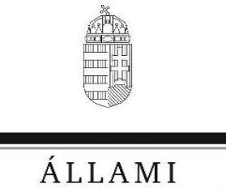
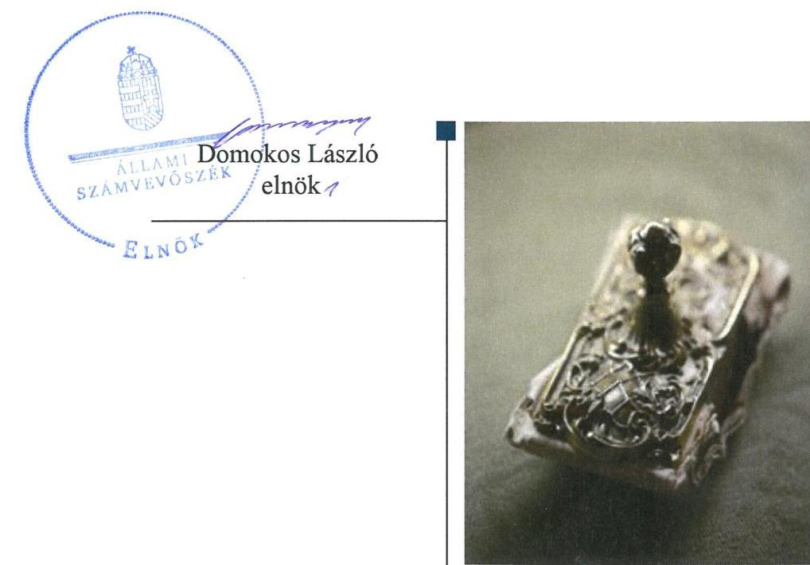
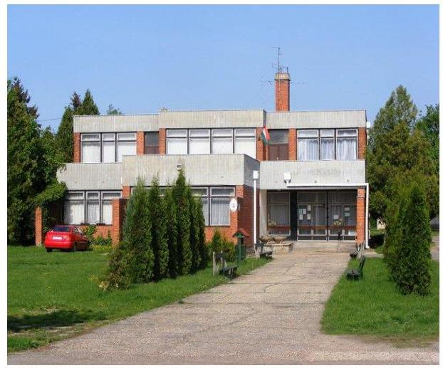
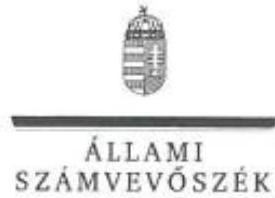

# Jelentés

## A nyilvános könyvtári ellátás működésének ellenőrzése

Beledi Általános Művelődési Központ 2020.

20022 www.asz.hu

---

# Jelentés 

## A nyilvános könyvtári ellátás működésének ellenőrzése

Beledi Általános Művelődési Központ 2020. 01. hó 31. nap

---

# AZ ELLENŐRZÉST FELÜGYELTE:

DR. NAGY IMRE felügyeleti vezető

# AZ ELLENŐRZÉST VEZETTE ÉS A VÉGREHAJTÁSÁÉRT FELELŐS:

- **ÓDOR ZOLTÁN TAMÁS** ellenőrzésvezető
- **KUSZINGER ANDREA** ellenőrzésvezető
- **MOLNÁR ZSUZSANNA** ellenőrzésvezető

# A PROGRAM ÖSSZEÁLLÍTÁSÁÉRT FELELŐS:

- **TÓTPÁL SZABOLCS** osztályvezető

---

**Jelentéseink az Országgyűlés számítógépes hálózatán és az Interneten a www.asz.hu címen is olvashatóak.**

---

**IKTATÓSZÁM:** EL-2419-001/2020

**TÉMASZÁM:** 2496

**ELLENŐRZÉS-AZONOSÍTÓ SZÁM:** V084001

---

# TARTALOMJEGYZÉK 

■ ÖSSZEGZÉS ..... 5
■ AZ ELLENŐRZÉS CÉLJA ..... 6
■ AZ ELLENŐRZÉS TERÜLETE ..... 7
■ AZ ELLENŐRZÉS HÁTTERE, INDOKOLTSÁGA ..... 8
■ A JELENTÉS LÉNYEGES KÉRDÉSKÖREI ..... 9
■ AZ ELLENŐRZÉS HATÓKÖRE ÉS MÓDSZEREI ..... 10
■ MEGÁLLAPÍTÁSOK ..... 12
■ JAVASLATOK ..... 14
■ MELLÉKLETEK ..... 17
I. sz. melléklet: Fogalomtár ..... 17
■ FÜGGELÉKEK ..... 19
I. sz. függelék a jelentéshez ..... 19
II. sz. függelék: Észrevételek ..... 20
■ RÖVIDÍTÉSEK JEGYZÉKE ..... 27

---

.

---

# ÖSSZEGZÉS 

A Beledi Általános Művelődési Központ belső kontrollrendszerének kialakítása a 2017. évben nem teremtette meg az átlátható és elszámoltatható gazdálkodás kereteit. Az Intézmény pénzügyi és vagyongazdálkodása a 2015-2017. években nem biztosította a nemzeti vagyonnal való felelős gazdálkodást. A korrupció elleni védelem nem volt biztosított.

## Az ellenőrzés társadalmi indokoltsága

Törvényben deklarált célja szerint a könyvtári ellátás fenntartása és fejlesztése az állampolgárok és a társadalom egésze szempontjából szükséges, a könyvtári és információs szolgáltatás állami fenntartása stratégiai fontosságú. A könyvtárak felbecsülhetetlen nemzeti értékeket, az egyetemes kultúrához kapcsolódó dokumentumokat, gyűjteményeket őriznek. A közgyűjtemény a nemzeti vagyon körébe tartozik, ezért kiemelten indokolt az Állami Számvevőszék ezen területen történő ellenőrzése is.

## Főbb megállapítások, következtetések, javaslatok

A Beledi Általános Művelődési Központ belső kontrollrendszerének kialakítása a 2017. évben nem volt szabályszerű, mivel szervezeti és működési szabályzattal, adatvédelmi és adatbiztonsági szabályzattal nem rendelkezett, illetve nem szabályozta az integrált kockázatkezelés eljárásrendjét, ezáltal nem biztosította a szabályszerű működést. Belső szabályzat nem szabályozta a kötelezően közzéteendő adatok nyilvánosságra hozatalának rendjét, ezáltal nem volt biztosított a közérdekű adatok nyilvánossága. A monitoring rendszer kialakítása és működtetése szabályszerű volt. A belső kontrollrendszer és az integritási kontrollok kialakítása során feltárt hiányosságok miatt a Beledi Általános Művelődési Központnál a korrupció elleni védelem nem volt biztosított.

A pénzügyi gazdálkodás nem volt szabályszerű, mert a 2015-2017. években a gazdálkodásra jogosultak és aláírásmintájuk naprakész nyilvántartása nem volt biztosított.

A vagyongazdálkodás a 2015-2017. években nem volt szabályszerű, mivel a Beledi Általános Művelődési Központ 2015-2017. évi beszámolók mérlegtételeit leltárral nem támasztotta alá, így nem biztosította a felelős gazdálkodást.

Beled Város Önkormányzata a Beledi Általános Művelődési Központra vonatkozó fenntartói feladatait a 2015-2017. években szabályszerűen gyakorolta. Ugyanakkor az Önkormányzat által fenntartott Intézmény nem rendelkezett az alapvető szervezeti és felelősségi viszonyokat rögzítő szervezeti és működési szabályzattal, ezáltal a törvényes működés feltételei az intézménynél nem voltak biztosítottak.

Az Állami Számvevőszék az ellenőrzés megállapításai alapján a Beledi Általános Művelődési Központ Intézményvezetőjének hét javaslatot fogalmazott meg.

---

# AZ ELLENŐRZÉS CÉLJA 

Az ellenőrzés célja, annak megállapítása, hogy a nyilvános könyvtár (mint intézmény) pénzügyi és vagyongazdálkodása, a könyvtár által kezelt vagyon nyilvántartása és megőrzése, a belső kontrollrendszer kialakítása és működtetése, valamint az intézményfenntartói feladatok ellátása szabályszerűen történt-e, érvényesült-e az integritás szemlélet.

---

# **AZ ELLENŐRZÉS TERÜLETE**

## **Beledi Általános Művelődési Központ**

Az Intézmény1 Győr-Moson-Sopron megyében, a Kapuvári járásban helyezkedik el. Beled város állandó lakosainak száma a Központi Statisztikai Hivatal Magyarország közigazgatási helynévkönyve alapján 2018. január 1-jén 2609 fő volt.

A 2015-2017. években a fenntartói jogokat az Önkormányzat2 gyakorolta. Az Intézményt az Önkormányzat Képviselőtestülete3 2013. január 1-jén alapította, jogelődje a Mikrotérségi Általános Művelődési Központ Beled volt.

Az Intézmény típusa többcélú intézmény, általános művelődési központ. Közfeladata óvodai nevelés három éves kortól, beleértve a többi gyermekkel együtt fejleszthető sajátos nevelési igényű gyermekek ellátását, továbbá közművelődés, művelődési ház, nyilvános könyvtári feladatok ellátása a Kultv.4 55. §-a és 65. §-a szerint. Működési területe Beled város közigazgatási területére terjedt ki.

A 2015-2017. években az Intézményvezető5 személyében változás nem történt. Az ellenőrzött években az Intézmény gazdasági szervezettel nem rendelkező költségvetési szerv volt, gazdálkodási tevékenységét a Hivatal6 látta el Munkamegosztási megállapodásban7 rögzítettek alapján.

A Hivatal vezetője, a jegyző8 2013. január 1-je óta látta el feladatát.

Az Intézmény a 2015-2017. évi költségvetési beszámolója alapján a 2015-2017. években összesen több mint 370 millió Ft központi költségvetési bevételt ért el és közel 370 millió Ft központi költségvetési kiadást teljesített. A foglalkoztatottak átlagos statisztikai állományi létszáma 2015-ben 23 fő, 2016-ban és 2017-ben 22 fő volt.

Az Intézmény vagyonkezelésbe vett vagyonnal a 2015-2017. években nem rendelkezett.

Az Intézmény a 2017. évben 12 442 db – 17,6 millió Ft értékű – könyvtári dokumentummal rendelkezett, amelyek között muzeális könyvtári dokumentumot nem tartottak nyilván.

---

# AZ ELLENŐRZÉS HÁTTERE, INDOKOLTSÁGA 

A könyvtárak fenntartására fordított közpénz nagysága, a nyilvános könyvtárak fenntartóinak sokszínűsége, a nyilvános könyvtárak, és a feladatellátó helyek számossága, valamint a könyvtárak által kezelt speciális vagyoni kör, továbbá a témakört érintően azonosított kockázatok alátámasztják a nyilvános könyvtárak ellenőrzésének szükségességét. Az egyes ellenőrzések megállapításaival és egy időszak ellenőrzési eredményeinek elemzésével az ÁSZ ${ }^{9}$ ráirányíthatja a jogalkotók figyelmét a központi alrendszerben vagy annak egy ágazatában esetlegesen felmerülő pénzügyi, szabályozási feszültségekre.

---

# A JELENTÉS LÉNYEGES KÉRDÉSKÖREI 

1. Az Intézmény fenntartója feladatait szabályszerűen látta-e el?
2. Az Intézmény belső kontrollrendszerének kialakítása és működtetése a jogszabályi előírásoknak megfelelt-e?
3. Az Intézmény pénzügyi és vagyongazdálkodása szabályszerű volt-e?

---

# AZ ELLENŐRZÉS HATÓKÖRE ÉS MÓDSZEREI 

## Az ellenőrzés típusa

Megfelelőségi ellenőrzés.

## Az ellenőrzött időszak

A 2015-2017. évek, belső kontrollrendszer tekintetében a 2017. év

## Az ellenőrzés tárgya

A könyvtár (intézmény) fenntartásával kapcsolatos Kultv.-ben meghatározott fenntartói feladatok ellátása volt. Az intézmény belső kontroll rendszerének kialakítása és működtetése. A pénzügyi és vagyongazdálkodás szabályszerűsége. Az intézmény egyes pénzügyi és vagyongazdálkodási feladatainak, beszámolási és adatszolgáltatási kötelezettségének teljesítése volt. Az integritás szemlélet érvényesülése az intézményben.

## Az ellenőrzött szervezet

Beledi Általános Művelődési Központ, Beled Város Önkormányzata

## Az ellenőrzés jogalapja

Az ÁSZ tv. ${ }^{10}$ 1. § (3) bekezdése, az 5. § (2)-(3) bekezdései, a (4) bekezdés a) pontja, továbbá az (6) bekezdése.

## Az ellenőrzés módszerei

Az ÁSZ az ellenőrzést az ÁSZ hivatalos honlapján (www.asz.hu) az ellenőrzés szakmai szabályai közt közzétett, a jelen ellenőrzésre irányadó módszertani útmutatók alapján, az ellenőrzési programban foglalt értékelési szempontok szerint hajtotta végre. Az ellenőrzést az ÁSZ a program kérdéseire adott válaszok kiértékelésével, valamint a programban ismertetett ellenőrzési kérdések, kritériumok, adatforrások között megjelölt adatforrások, a program III. sz. mellékletben felsorolt tanúsítványok felhasználásával, továbbá az adott időszakban hatályos jogszabályok figyelembevételével folytatatta le.

Az ellenőrzés ideje alatt az ellenőrzött szervezettel történő kapcsolattartást az ÁSZ SZMSZ ${ }^{11}$-ének vonatkozó előírásai alapján volt biztosított.

---

Az ellenőrzési kérdések megválaszolásához szükséges bizonyítékok megszerzése a következő ellenőrzési eljárások alkalmazásával történt: megfigyelés, szemle (szemrevételezés), kérdésfeltevés (információkérés), valamint elemző eljárás.

---

# 1. Az Intézmény fenntartója feladatait szabályszerűen látta-e el? 

## Összegző megállapítás

Az Önkormányzat fenntartói feladatait a 2015-2017. években szabályszerűen látta el.

A FENNTARTÓI FELADATOKAT ellátó Önkormányzat kiadta az Intézmény Alapító okirat ${ }_{1-6}{ }^{12}$-át, munkáltatói, szabályozási, irányítói, döntési és jóváhagyási jogkörét szabályszerűen gyakorolta.

Ugyanakkor az Önkormányzat által fenntartott Intézmény nem rendelkezett az alapvető szervezeti és felelősségi viszonyokat rögzítő szervezeti és működési szabályzattal.

## 2. Az Intézmény belső kontrollrendszerének kialakítása és működtetése a jogszabályi előírásoknak megfelelt-e?

## Összegző megállapítás

Az Intézmény belső kontrollrendszerének kialakítása a 2017. évben nem volt szabályszerű.

KONTROLLKÖRNYEZET kialakítása nem volt szabályszerű, mivel az Intézmény az Áht 10. § (5) bekezdésében foglaltak ellenére szervezeti és működési szabályzattal a 2017. évben nem rendelkezett.

INTEGRÁLT KOCKÁZATKEZELÉSI RENDSZER kialakítása nem volt szabályszerű, mivel az Intézmény a Bkr. ${ }^{13}$ 6. § (4) bekezdésében foglaltak ellenére nem szabályozta a szervezeti integritást sértő események kezelésének eljárásrendjét, valamint az integrált kockázatkezelés eljárásrendjét.

KONTROLLTEVÉKENYSÉG szabályszerű gyakorlásának feltételei nem kerültek kialakításra, mert az Ávr. 60. § (3) bekezdésében előírtak ellenére nem gondoskodtak a kötelezettségvállalásra, teljesítés igazolására jogosult személyek és aláírás-mintájuk naprakész nyilvántartásának vezetéséről. Így a kontrolltevékenység működtetése nem volt szabályszerű.

INFORMÁCIÓS ÉS KOMMUNIKÁCIÓS RENDSZER kialakítása nem volt szabályszerű, mivel az Intézmény a Bkr. 9. § (1) bekezdésében foglaltak ellenére nem alakított ki olyan rendszereket, melyek biztosítják, hogy a megfelelő információk a megfelelő időben eljussanak az illetékes szervezethez, szervezeti egységhez, illetve személyhez. Az Intézmény az Info tv. ${ }^{14}$ 24. § (3) bekezdésében foglaltak ellenére nem készített adatvédelmi és adatbiztonsági szabályzatot. Nem rendezte belső szabály-

---

zatban az Ávr. ${ }^{15}$ 13. § (2) bekezdés h) pontjában foglaltak ellenére a közérdekű adatok megismerésére irányuló kérelmek intézésének, és a kötelezően közzéteendő adatok nyilvánosságra hozatalának rendjét.

A MONITORING RENDSZER működtetése szabályszerű volt. Az intézményvezető a Bkr.-ben előírtak alapján kialakította a Társaság tevékenységének, céljainak nyomon követési rendszerét, belső ellenőrzés útján gondoskodott a monitoring rendszer működtetéséről. A belső ellenőrzés működtetése szabályszerű volt.

A Bkr. 11.§ (1) bekezdésben előírt vezetői nyilatkozatot az Intézmény vezetője megtette, azonban az nem volt összhangban az ellenőrzés megállapításaival.

Az Intézményvezető nem lépett fel a korrupciós kockázatok kezelése, a korrupciós veszélyek elhárítása érdekében, mivel szervezeti és működési szabályzattal, szervezeti integritást sértő események kezelésének eljárásrendjével, integrált kockázatkezelési szabályzattal nem rendelkezett, a tevékenységében rejlő kockázatokat nem mérte fel.

# 3. Az Intézmény pénzügyi és vagyongazdálkodása szabályszerű volt-e? 

## Összegző megállapítás

Az Intézmény pénzügyi és vagyongazdálkodási tevékenysége a 2015-2017. években nem volt szabályszerű.

PÉNZÜGYI GAZDÁLKODÁSA nem volt szabályszerű, mivel az Intézmény az Ávr. 60. § (3) bekezdésében foglaltak ellenére a 2015-2017. években nem vezetett naprakész nyilvántartást a kötelezettségvállalásra, teljesítés igazolására jogosult személyek aláírás-mintáiról.

A VAGYONGAZDÁLKODÁSA nem volt szabályszerű, mivel az Intézmény mérlegtételeinek alátámasztásához az Áhsz. 5.§ (1) és az Áhsz. 22. § (1) bekezdése, valamint a Számv. tv. 69. § (1) bekezdésének előírása ellenére, 2015 - 2017. évekre vonatkozóan az Intézménynél nem állítottak össze leltárt, amely tételesen, ellenőrizhető módon tartalmazta volna a mérleg fordulónapján meglévő eszközöket és forrásokat mennyiségben és értékben. Leltár hiányában a mérleg nem volt alátámasztott, a 2015.-2017. évi beszámoló nem volt megalapozott.

---

# JAVASLATOK 

Az ÁSZ tv. 33. § (1) bekezdésében foglaltak értelmében az ellenőrzött szervezet vezetője köteles a jelentésben foglalt megállapításokhoz kapcsolódó intézkedési tervet összeállítani és azt a jelentés kézhezvételétől számított 30 napon belül az ÁSZ részére megküldeni. Amennyiben az ellenőrzött szervezet vezetője nem küldi meg határidőben az intézkedési tervet, vagy továbbra sem elfogadható intézkedési tervet küld, az Állami Számvevőszék elnöke az ÁSZ tv. 33. § (3) bekezdés a) és b) pontjaiban foglaltakat érvényesítheti.

## Beledi Általános Művelődési Központ intézményvezetője

1. Készítse el az Intézmény szervezeti és működési szabályzatát és terjessze be jóváhagyásra a fenntartó szerv részére.
(2. sz. megállapítás 1. bekezdése alapján)
2. Szabályozza a szervezeti
 integritást sértő események kezelésének eljárásrendjét, valamint az integrált kockázatkezelés eljárásrendjét.
(2. sz. megállapítás 2. bekezdése alapján)
3. Intézkedjen a kötelezettségvállalásra, teljesítés igazolására jogosult személyek és aláírás-mintájuk naprakész nyilvántartásának vezetéséről a jogszabályi előírásnak megfelelően.
(2. sz. megállapítás 3. bekezdés alapján)
4. Alakítsa ki a jogszabályban foglalt követelményeknek megfelelő információs és kommunikációs rendszert.
(2. sz. megállapítás 4. bekezdés 1. mondata alapján)

---

5. Készítse el a jogszabályi előírás alapján az intézmény adatvédelmi és adatbiztonsági szabályzatát.
(2. sz. megállapítás 4. bekezdés 2. mondata alapján)
6. Készítse el a jogszabályban előírt közérdekű adatok megismerésére irányuló kérelmek intézésének és a kötelezően közzéteendő adatok nyilvánosságra hozatalának rendjét rögzítő szabályzatot.
(2. sz. megállapítás 4. bekezdés 3. mondata alapján)
7. Intézkedjen a jogszabályban előírt leltár készítéséről.
(3. sz. megállapítás 2. bekezdés alapján)

---

.

---

# MELLÉKLETEK 

## I. SZ. MELLÉKLET: FOGALOMTÁR

fenntartó
könyvtári dokumentum
kulturális javak
muzeális dokumentumok
nyilvános könyvtár

A fenntartó a Kultv.-ben foglaltak alapján meghatározza a könyvtár feladatait és használati szabályzatát, kiadja alapító okiratát, jóváhagyja szervezeti és működési szabályzatát, biztosítja a feladatok ellátásához szükséges személyi és tárgyi feltételeket, ennek során figyelembe veszi a kultúráért felelős miniszter által meghatározott szakmai követelményeket és normatívákat. Továbbá jóváhagyja a könyvtár fejlesztésére vonatkozó terv(ek)et, az országos könyvtári szakértői névjegyzékben szereplő szakértők közreműködésével értékeli a könyvtár szakmai tevékenységét, biztosítja a könyvtár szakmai önállóságát, és ellátja a könyvtár fenntartásával, irányításával kapcsolatos más jogszabályokban meghatározott feladatokat. (Forrás: Kultv. 68. § (1) bek.)

A könyvtár fenntartó szerve önkormányzati könyvtár esetében a könyvtár közvetlen irányítását végző települési önkormányzat, önálló költségvetési intézményként működő könyvtár esetében a könyvtár felügyeleti szerve, egyéb könyvtár esetében az a szerv (vállalat, intézet, intézmény), illetőleg társadalmi szervezet, amelynek költségvetésében a könyvtár működésével járó személyi és dologi kiadások biztosítva vannak. Ha a könyvtárat több szerv közösen tartja fenn, illetőleg működésének költségeihez több szerv járul hozzá, fenntartónak - a szabályzat alkalmazásában - a könyvtár működtetését ellátó szervet kell tekinteni. (Forrás: 3/1975. (VIII. 17.) KM-PM együttes rendelet 1. § (4)-(5) bek.)
a könyvtár által állományba vett, alap- és kiegészítő feladatai ellátásához szükséges tudományos, oktatási, művészeti, közművelődési vagy történeti értékű könyv, időszaki kiadvány, folyóirat, egyéb kiadvány, valamint minden szöveg-, kép-, adat- és hangrögzítés - beleértve a könyvtár állományába vett elektronikus dokumentumot is - kivéve az Ltv. hatálya alá tartozó, irattári jellegű levéltári anyagnak minősülő dokumentumot. A könyvtár dokumentumainak összessége a könyvtári állomány. (Forrás: 3/1975. (VIII. 17.) KM-PM együttes rendelet 1. § (1) bek.)
az élettelen és élő természet keletkezésének, fejlődésének, az emberiség, a magyar nemzet, Magyarország történelmének kiemelkedő és jellemző tárgyi, képi, hangrögzített, írásos emlékei, és egyéb bizonyítékai - az ingatlanok kivételével -, a művészeti alkotások.
a) középkori kódex vagy nyelvemlék,
b) középkori, koraújkori kézirat,
c) 1701 előtt megjelent könyvtári dokumentum,
d) 1851 előtt Magyarországon megjelent könyvtári dokumentum,
e) 1851 előtt külföldön megjelent hungarikum, továbbá
f) amely jogszabály vagy a könyvtár gyűjtőkör szabályzata szerint végleges megőrzési (archiválási) kötelezettséggel található a könyvtár gyűjteményében
Mindenki által használható és megközelíthető; rendelkezik kizárólagosan a könyvtári szolgáltatások céljaira alkalmas helyiséggel; rendszeresen, a felhasználók többsége számára megfelelő időpontban, ötezer fő feletti településen működő települési könyvtár esetében legalább heti 25 órában, továbbá legalább havonta két hétvégi napon tart nyitva. Vezetője a könyvtárakban foglalkoztatottak képesítési követelményeire és jogviszonyára irányadó jogszabályokban meghatározott végzettséggel és szakképzettséggel rendelkezik; könyvtári szakembert alkalmaz; helyben nyújtott alapszolgáltatásai ingyenesek; statisztikai adatokat szolgáltat. Éves szakmai munkaterv alapján ellátja alapfeladatait, tevékenységéről éves szakmai beszámolót készít; részt vesz a kulturális alapellátás kiterjesztésében; elnevezésében megjelenik a könyvtár kifejezés. (Forrás: Kultv. 54. § (1) bek.)

---

nyilvános könyvtár alapfeladatai

A fenntartó által kiadott alapító okiratban és a szervezeti és működési szabályzatban meghatározott fő céljait küldetésnyilatkozatban közzé teszi; gyűjteményét folyamatosan fejleszti, feltárja, megőrzi, gondozza és rendelkezésre bocsátja; tájékoztat a könyvtár és a nyilvános könyvtári rendszer dokumentumairól és szolgáltatásairól; biztosítja más könyvtárak állományának és szolgáltatásainak elérését. Részt vesz a könyvtárak közötti dokumentum- és információcserében; biztosítja az elektronikus könyvtári dokumentumok elérhetőségét; a könyvtárhasználókat segíti a digitális írástudás, az információs műveltség elsajátításában, az egész életen át tartó tanulás folyamatában; segíti az oktatásban, képzésben részt vevők információellátását, a tudományos kutatás és az adatbázisokból történő információkérés lehetőségét. Kulturális, közösségi és egyéb könyvtári programokat szervez; tudás-, információ- és kultúraközvetítő tevékenységével hozzájárul az életminőség javításához, az ország versenyképességének növeléséhez és a szolgáltatásait a könyvtári minőségirányítás szempontjait figyelembe véve szervezi. (Forrás: Kultv. 55. § (1) bek.)
nyilvános könyvtári ellátás a nyilvános könyvtárak által nyújtott szolgáltatások és az e szolgáltatások nyújtását elősegítő központi szolgáltatások összessége, amelyek biztosítják az információhoz való szabad hozzáférést.

---

# FÜGGELÉKEK 

- I. SZ. FÜGGELÉK A JELENTÉSHEZ

Az Állami Számvevőszék az ellenőrzések során feltárt tényekhez kapcsolódó további körülmények tisztázására eszközrendszerrel nem rendelkezik. Amennyiben az ellenőrzésen túlmutatóan indokoltnak látszik az ellenőrzés során feltárt körülmények további vizsgálata, az Állami Számvevőszék törvényi felhatalmazás alapján az ellenőrzés által feltárt körülményeket továbbítja a hatáskörrel rendelkező szervnek a szükséges intézkedések megtétele, eljárások lefolytatása érdekében.

Az Intézmény a 2015-2017. évi beszámolók mérlegtételeit nem támasztotta alá leltárral. Ezzel megsértették az Áhsz 5.§ (1) és az Áhsz 22. § (1)-(2) bekezdésében, valamint Számv. tv. 69. § (1) bekezdésben foglaltakat.

Az Intézmény mérlegfőösszege 2015. december 31-én 7,12 M Ft, 2016. december 31-én 6,06 M Ft és 2017. december 31-én 5,47 M Ft volt. A leltárral nem alátámasztott mérlegsorok értéke 2015-ben 7,12 M Ft, 2016-ban 6,06 M Ft, 2017-ben 5,47 M Ft volt.
Leltár hiányában nem igazolt, hogy az Intézmény 2015-2017. évi beszámolóiban szereplő leltárelemek a valóságban is fellelhetőek, ezért felmerül, hogy az Intézményt vagyoni hátrány érhette.

Az eset konkrét körülményeinek felderítésére az Ügyészség rendelkezik hatáskörrel.

---

A jelentéstervezetet a Számvevőszék 15 napos észrevételezésre megküldte az ellenőrzött szervezetek vezetőinek az ÁSZ tv. 29. § (1) bekezdése előírásának megfelelően.

Beled Város Önkormányzatának polgármestere a jelentéstervezet megállapításaira írásban észrevételt tett.
Az ÁSZ tv. 29. § (3) bekezdésével összhangban az ÁSZ a Függelékben feltünteti az ellenőrzés megállapításaival kapcsolatban tett, figyelembe nem vett észrevételeket, és megindokolja, hogy azokat miért nem fogadta el.

[^0]
[^0]:    * 29. § (1) Az Állami Számvevőszék az ellenőrzési megállapításait megküldi az ellenőrzött szervezet vezetőjének vagy az általa megbízott személynek, és annak, akinek személyes felelősségét állapította meg.
    (2) Az ellenőrzött szervezet vezetője és a felelősként megjelölt személy az ellenőrzés megállapításaira tizenöt napon belül írásban észrevételt tehet.
    (3) Az Állami Számvevőszék az észrevételre a beérkezésétől számított harminc napon belül írásban válaszol. A figyelembe nem vett észrevételeket köteles a jelentésben feltüntetni, és megindokolni, hogy azokat miért nem fogadta el.

---

# Beled Város Önkormányzata Major Jenő polgármester 

Cím: H-9343 Beled, Rákóczi u. 137.
Tel/Fax: $\quad 96 / 594-170,96 / 594-185$
E-mail: polgarmester@beledhivatal.eu
Ikt.szám: I/1320-5/2019
Ügyintéző: Bérczes-Kápolnási Renáta (96/594-180)

Tárgy: Észrevétel az EL-0943-055/2019. számú jelentésre

## Állami Számvevőszék 1052 Budapest   Apáczai Csere János utca 10.   Domokos László Elnök Úr részére

Tisztelt Elnök Úr!

Köszönettel megkaptuk az EL-0943-055/2019. iktatószámú jelentésüket „A nyilvános könyvtári ellátás működésének ellenőrzése - Beledi Általános Művelődési Központ" című ellenőrzéséről. A tervezettel kapcsolatban az alábbi észrevételeket szeretnénk tenni:

1. A 2. sz. megállapítás 1. bekezdésében szereplő állítás, miszerint a Beledi Általános Művelődési Központ (továbbiakban: Intézmény) nem rendelkezett szervezeti és működési szabályzattal (továbbiakban: SZMSZ), nem helytálló, a vizsgált időszakban (2015-2017. év) az alábbi SZMSZ-ekkel rendelkezett:

- 2013. június 10 -én az Intézmény megalkotta SZMSZ-ét, melyet Beled Város Önkormányzatának Képviselő-testülete a 82/2013. (IX. 05.) határozatával elfogadott
- 2015. szeptember 20-án az Intézmény megalkotta újabb SZMSZ-ét, melyet Beled Város Önkormányzatának Képviselő-testülete a 101/2015. (IX. 24.) határozatával elfogadott
Sajnálatos módon az adatbekérés során tévesen nem megfelelő példány került feltöltésre.

2. A 2. sz. megállapítás 3. bekezdésében szereplő állítás, miszerint a kötelezettségvállalásra és a teljesítésigazolásra jogosult személyek és aláírás-mintájuk naprakész nyilvántartásának vezetése nem történt meg, nem tartjuk helytállónak, ugyanis az adatbekérések során feltöltésre kerültek mind az aláírásmintákat tartalmazó

---

nyilvántartások, mind pedig az összeférhetetlenség és akadályoztatás elkerülése érdekében készült meghatalmazások.
3. A 2. sz. megállapítás 4. bekezdés 2. mondatában szereplő állítás, mely szerint nem készült adatvédelmi és adatbiztonsági szabályzat, nem helytálló, ugyanis a szabályzat 2013. augusztus 29-én elkészült, mely az SZMSZ mellékletét képezte, azonban az 1. pontban említett sajnálatos módon az adatbekérés során tévesen nem megfelelő példánya került feltöltésre az SZMSZ-nek, így az adatvédelmi és adatbiztonsági szabályzat feltöltésére sem került sor.
4. A 3. sz. megállapítás 2. bekezdésében szereplő állítás, mely szerint nem készült leltár, nem tartjuk helytállónak, a Könyvtár intézményegység tekintetében feltöltésre került az adatbekérés során.

Tisztelettel kérjük, hogy Intézményünk megítélésénél, valamint a végleges jelentés elkészítésekor észrevételeinket szíveskedjen figyelembe venni.

Kelt: Beled, 2019. december 16.

Tisztelettel:

Major Jenő
polgármester

---

#  

Ikt.szám: EL-0943-061/2020.

## Major Jenő úr

polgármester
Beled Város Önkormányzata

## Beled

## Tisztelt Polgármester Úr!

„A nyilvános könyvtári ellátás működésének ellenőrzése - Beledi Általános Művelődési Központ" címmel készített számvevőszéki jelentéstervezetre tett, I/1320-5/2019. iktatószámú levelében megküldött észrevételeit köszönettel megkaptam.
Az Állami Számvevőszék észrevételekre vonatkozó álláspontjáról a felügyeleti vezető által készített részletes tájékoztatást csatoltan megküldöm.
Tájékoztatom Polgármester urat, hogy a számvevőszéki jelentésben - az Állami Számvevőszékről szóló 2011. évi LXVI. törvény 29. § (3) bekezdése alapján - a figyelembe nem vett észrevételeket szerepeltetjük annak indoklásával, hogy azokat miért nem fogadtuk el.

Budapest, 2020. 01. hó 3. nap

Tisztelettel:

Domokos László

Melléklet: Tájékoztatás az észrevételek kezeléséről

---

# Tájékoztatás   az észrevételek kezeléséről 

„A nyilvános könyvtári ellátás működésének ellenőrzése - Beledi Általános Művelődési Központ" című jelentéstervezetre (továbbiakban: jelentéstervezet) a 2019. december 16-án kelt, I/1320-5/2019 iktatószámú levélben megküldött észrevételeit áttekintettem. Az észrevételek kezeléséről az alábbi tájékoztatást adom.

## 1. A jelentéstervezet 2. számú megállapítás 1. bekezdésére vonatkozó észrevétel:

Polgármester úr észrevétele szerint a Beledi Általános Művelődési Központ (a továbbiakban: Intézmény) 2013. június 10-én megalkotta szervezeti és működési szabályzatát (SZMSZ), melyet Beled Város Önkormányzatának Képviselő-testülete a 82/2013. (IX. 05.) határozatával elfogadott. 2015. szeptember 20-án az Intézmény megalkotta újabb SZMSZ-ét, melyet a Képviselő-testület a 101/2015. (IX. 24.) határozatával elfogadott. Polgármester úr jelezte továbbá, hogy az adatbekérés során tévesen nem megfelelő példány került feltöltésre.
Az észrevételt nem fogadom el. Az ÁSZ az ellenőrzési megállapításait az adatszolgáltatás során a részére törvényi határidőben rendelkezésre bocsátott dokumentumokra alapozva fogalmazza meg. Polgármester úr által aláírt 2018. szeptember 18-án kelt teljességi és hitelességi nyilatkozat szerint az ÁSZ részére átadott dokumentumok, adatok megbízhatóak, és a bekért adatokra, dokumentumokra vonatkozóan teljes körű információt tartalmaznak. A beküldött dokumentumok felülvizsgálata során az ÁSZ megállapította, hogy a teljességi és hitelességi nyilatkozat 221. pontjában felsorolt, az Intézmény SZMSZ-eként feltöltött dokumentum a kiadmányozó aláírását és bélyegzőlenyomatot nem tartalmazza, így hiteles dokumentumként nem fogadható el.
Polgármester úr észrevételéhez mellékelt, az ÁSZ részére az adatszolgáltatásra biztosított határidőn kívül megküldött, utólag rendelkezésre bocsátott dokumentumokat az ÁSZ nem értékeli.
A fent
 leírtak alapján a jelentéstervezetben szereplő 2. számú megállapítás 1. bekezdés módosítása nem indokolt.

## 2. A jelentéstervezet 2. számú megállapítás 3. bekezdésére vonatkozó észrevétel:

Polgármester úr észrevételében leírta, hogy az adatbekérések során feltöltésre kerültek mind az aláírás-mintákat tartalmazó nyilvántartások, mind pedig az összeférhetetlenség és akadályoztatás elkerülése érdekében készült meghatalmazások.
Az észrevételt nem fogadom el. Az ellenőrzési dokumentumok felülvizsgálatát követően az ÁSZ megállapította, hogy az intézményvezető - az Ávr. 52. § (1) bekezdés a) pontja, továbbá az 57. § (4) bekezdése előírásai ellenére - kötelezettségvállalásra és teljesítésigazolásra a kötelezettséget vállaló szerv alkalmazásában álló személy (intézmény dolgozója) helyett a 2014. október 23-i keltezésű dokumentumokban polgármester úr részére adott felhatalmazást és kijelölést kötelezettségvállalásra és teljesítésigazolásra.
A fentiek miatt a jelentéstervezet módosítása nem indokolt.

# 3. A jelentéstervezet 2. számú megállapítás 4. bekezdés 2. mondatára vonatkozó észrevétel: 

Polgármester úr észrevétele szerint az adatvédelmi és adatbiztonsági szabályzat 2013. augusztus 29-én elkészült, mely az SZMSZ mellékletét képezi, azonban az adatbekérés során tévesen nem megfelelő példánya került feltöltésre az SZMSZ-nek, így a szabályzat feltöltésére sem került sor.
Az észrevételt nem fogadom el. Az ÁSZ az ellenőrzési megállapításait az adatszolgáltatás során a részére törvényi határidőben rendelkezésre bocsátott dokumentumokra alapozva fogalmazza meg. Az intézményvezető által aláírt, 2018. szeptember 18-án kelt teljességi és hitelességi nyilatkozat szerint az ÁSZ részére átadott dokumentumok, adatok megbízhatóak, és a bekért adatokra, dokumentumokra vonatkozóan teljes körű információt tartalmaznak. Az ellenőrzési dokumentumok felülvizsgálatát követően az ÁSZ megállapította, hogy a teljességi és hitelességi nyilatkozat 5. pontjában felsorolt dokumentum a Beledi Közös Önkormányzati Hivatal 2013. május 1-jétől hatályos Adatvédelmi és adatbiztonsági szabályzata, azonban a szabályzat hatálya nem terjed ki az Intézményre.
A fent leírtak alapján az ÁSZ polgármester úr észrevételét nem veszi figyelembe, a számvevőszéki jelentéstervezetben szereplő 2. számú megállapítás 4. bekezdés 2. mondatának módosítása nem indokolt.
Az észrevételhez mellékelt, az ÁSZ részére az adatszolgáltatásra biztosított határidőn túl rendelkezésre bocsátott dokumentumokat az ÁSZ nem értékeli.

## 4. A jelentéstervezet 3. számú megállapítás 2. bekezdésére vonatkozó észrevétel:

Polgármester úr észrevétele szerint a Könyvtár intézményegység tekintetében a leltár feltöltésre került az adatbekérés során.
Az észrevételt nem fogadom el. Az ÁSZ az EL-0943-003/2018. és az EL-0943-004/2018. iktatószámú adatbekérő levelek 2. sz. mellékletének 1.4 pontjában az ellenőrzött időszakra vonatkozó (2015. január 1. - 2017. december 31.) mérleg tételeit alátámasztó leltárakat kérte beküldeni. Az ÁSZ az ellenőrzési megállapításait az adatszolgáltatás során a részére törvényi határidőben rendelkezésre bocsátott dokumentumokra alapozva fogalmazza meg. Az intézményvezető által aláírt 2018. augusztus 17-én kelt teljességi és hitelességi nyilatkozat szerint az ÁSZ részére átadott dokumentumok, adatok megbízhatóak, és a bekért adatokra, dokumentumokra vonatkozóan teljes körű információt tartalmaznak.
Az ellenőrzési dokumentumok felülvizsgálatát követően az ÁSZ megállapította, hogy az intézményvezető által aláírt 2015-2017. évi Leltározási ütemtervek az Intézmény valamennyi leltározási körzetére (óvoda, konyha, könyvtár, művelődési ház, felnőttképzés, tornacsarnok) vonatkoznak, ugyanakkor a teljességi és hitelességi nyilatkozat 63-65. pontjában felsorolt leltár2015.pdf, leltár2016.pdf, leltár2017.pdf dokumentumok első oldalai kizárólag a Beledi Művelődési Ház nagyértékű eszközeinek (9 tétel) leltárai, a 2-8. oldalak a könyvtári olvasó és könyvtári belső terem kisértékű eszközeire vonatkozó „aleltári leltárívek”. Így az Intézmény mérlegtételeinek alátámasztásához az Áhsz. 5.§ (1) és az Áhsz. 22. § (1) bekezdése, valamint a Számv. tv. 69. § (1) bekezdésének előírása ellenére a 2015-2017. évekre vonatkozóan nem állítottak össze olyan leltárt, amely tételesen, ellenőrizhető módon tartalmazta volna a mérleg fordulónapján meglévő eszközöket és forrásokat mennyiségben és értékben.
A fent leírtak alapján a számvevőszéki jelentéstervezetben szereplő 3. számú megállapítás 2. bekezdés módosítása nem indokolt.

Budapest, 2020. 01. hó to nap

Dr. Nagy Imre
felügyeleti vezető

---

# RÖVIDÍTÉSEK JEGYZÉKE 

${ }^{1}$ Intézmény
${ }^{2}$ Önkormányzat
${ }^{3}$ Önkormányzat Képviselő-testülete
${ }^{4}$ Kultv.
${ }^{5}$ Intézményvezető
${ }^{6}$ Hivatal
${ }^{7}$ Munkamegosztási megállapodás
${ }^{8}$ jegyző
${ }^{9}$ ÁSZ
${ }^{10}$ ÁSZ tv.
${ }^{11}$ ÁSZ SZMSZ
${ }^{12}$ Alapító okirat ${ }_{1-6}$
${ }^{13}$ Bkr.
${ }^{14}$ Info tv.
${ }^{15}$ Ávr.

Beledi Általános Művelődési Központ
Beled Város Önkormányzata
Beled Város Önkormányzata Képviselő-testülete
1997. évi CXL. törvény a muzeális intézményekről, a nyilvános könyvtári ellátásról és a közművelődésről (hatályos: 1998. január 1-jétől)
Beled Általános Művelődési Központ intézményvezetője
Beledi Közös Önkormányzati Hivatal
Munkamegosztási megállapodás a munkamegosztás és a felelősségvállalás rendjéről a Beledi Közös Önkormányzati Hivatal és a Beledi Általános Művelődési Központ között (hatályos: 2014. január 1-jétől)
Beledi Közös Önkormányzati Hivatal jegyzője
Állami Számvevőszék
2011. évi LXVI. törvény az Állami Számvevőszékről (hatályos: 2011. július 1-jétől)

Az Állami Számvevőszék Szervezeti és Működési Szabályzata
Alapító okirat ${ }_{1}$ : Beledi Általános Művelődési Központ Alapító okirata (hatályos: 2014. augusztus 1-jétől)

Alapító okirat2 Beledi Általános Művelődési Központ Alapító okirata (kelt: 2015. február 24.)
Alapító okirat3 Beledi Általános Művelődési Központ Alapító okirata (kelt: 2016. február 12.)
Alapító okirat4 Beledi Általános Művelődési Központ Alapító okirata (kelt: 2016. július 14.)
Alapító okirat5 Beledi Általános Művelődési Központ Alapító okirata (kelt: 2017. április 13.)
Alapító okirat6 Beledi Általános Művelődési Központ Alapító okirata (kelt: 2017. június 13.)
370/2011. (XII. 31.) Korm. rendelet a költségvetési szervek belső kontrollrendszeréről és belső ellenőrzéséről
2011. évi CXII. törvény az információs önrendelkezési jogról és az információszabadságról
368/2011. (XII. 31.) Korm. rendelet az államháztartásról szóló törvény végrehajtásáról (hatályos: 2012. január 1-jétől)

---

# ÁLLAMI SZÁMVEVŐSZÉK 

1052 Budapest, Apáczai Csere János utca 10.
Levélcím: 1364 Budapest 4. Pf. 54
Telefon: +36 14849100 Telefax: +36 14849200
www.asz.hu
