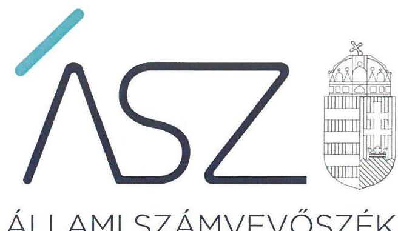
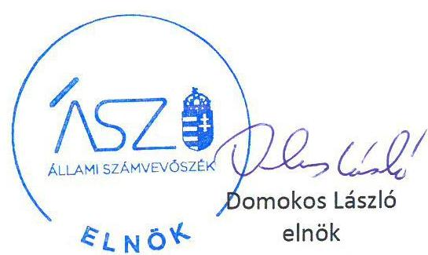
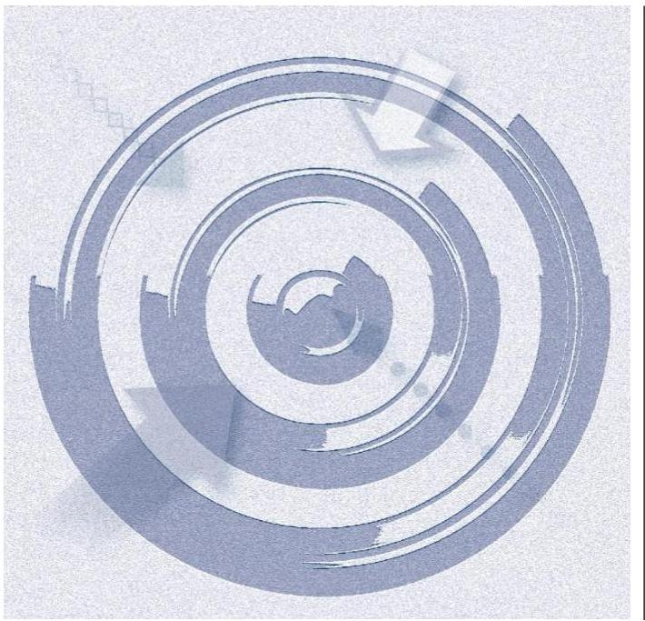
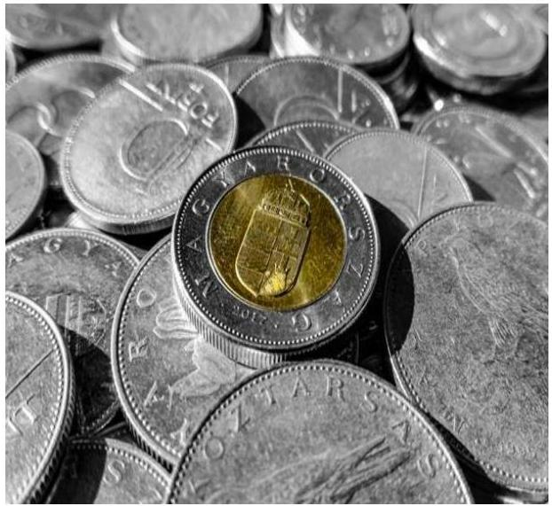

ÁLLAMI SZÁMVEVŐSZÉK

# JELENTÉS 

Az államháztartás központi alrendszerei fejezeteinek ellenőrzése

A Magyar Tudományos Akadémia kutatóközpontjai és kutatóintézetei vagyongazdálkodásának ellenőrzése - MTA Természettudományi Kutatóközpont
2020.

20023
www.asz.hu

---

ÁLLAMI SZÁMVEVŐSZÉK

# JELENTÉS

Az államháztartás központi alrendszere fejezeteinek ellenőrzése

A Magyar Tudományos Akadémia kutatóközpontjai és kutatóintézetei vagyongazdálkodásának ellenőrzése – MTA Természettudományi Kutatóközpont

2020. 02. hó 21. nap

20023
www.asz.hu

---

# AZ ELLENŐRZÉST FELÜGYELTE: 

DR. NAGY IMRE felügyeleti vezető

## AZ ELLENŐRZÉST VEZETTE ÉS A VÉGREHAJTÁSÁÉRT FELELŐS:

RÁCZKEVI KATALIN ellenőrzésvezető

## A PROGRAM ÖSSZEÁLLÍTÁSÁÉRT FELELŐS:

SZALAY NAGY JÁNOS projektvezető

IKTATÓSZÁM: EL-2420-001/2020.
TÉMASZÁM: 2517
ELLENŐRZÉS-AZONOSÍTÓ SZÁM: V086114

---

# TARTALOMJEGYZÉK 

■ ÖSSZEGZÉS ..... 5
■ AZ ELLENŐRZÉS CÉLJA ..... 6
■ AZ ELLENŐRZÉS TERÜLETE ..... 7
■ AZ ELLENŐRZÉS HÁTTERE, INDOKOLTSÁGA ..... 8
■ A JELENTÉS LÉNYEGES KÉRDÉSKÖREI ..... 9
■ AZ ELLENŐRZÉS HATÓKÖRE ÉS MÓDSZEREI ..... 10
■ MEGÁLLAPÍTÁSOK ..... 12
■ JAVASLATOK ..... 13
■ MELLÉKLETEK ..... 15
I. sz. melléklet: Értelmező szótár ..... 15
■ FÜGGELÉKEK ..... 17
I. sz. függelék a jelentéshez ..... 17
II. sz. függelék: Észrevételek ..... 18
■ RÖVIDÍTÉSEK JEGYZÉKE ..... 21

---

.

---

# ÖSSZEGZÉS 

A Magyar Tudományos Akadémia Természettudományi Kutatóközpont 2016-2018. években nem biztosította a közvagyon megőrzését és célszerü felhasználását, ami kockázatot jelentett a kutatási közfeladatának ellátására.

## Az ellenőrzés társadalmi indokoltsága

Magyarország versenyképességének és a magyar gazdaság fejlődésének meghatározó tényezője a kutatás-fejlesztésre és az innovációra fordított hazai és uniós források eredményes, hatékony felhasználása. A magyar kutatás-fejlesztés területén kiemelt szerepet játszanak a központi költségvetésből biztosított támogatás felhasználásával múködtetett, 2019. augusztus 31-ig a Magyar Tudományos Akadémia által irányított kutatóintézetek, kutatóközpontok. A Természettudományi Kutatóközpont az enzimológia, a szerves kémia, a kognitív idegtudományok, a pszichológia, valamint az anyag- és környezetkémia területén végzett kutatásokat.

A kutatás-fejlesztési közfeladat eredményes ellátásának feltétele, hogy az ehhez szükséges eszközök a kutatási tevékenységet ténylegesen végző intézeteknél, központoknál rendelkezésre álljanak, továbbá ezekkel a közfeladatuk érdekében, átlátható és elszámoltatható módon, a vagyon megőrzését biztosítva gazdálkodjanak.

Az ellenőrzés indokoltságát erősítette, hogy jogszabályi változás nyomán 2019. szeptember 1-től a kutatóintézetek és kutatóközpontok irányítása az Eötvös Loránd Kutatási Hálózat Titkárságához került át, a kutatóintézetek és kutatóközpontok ezt követően központi költségvetési szervként működnek tovább. A magyar kutatás-fejlesztés szempontjából kiemelten fontos, hogy az új szervezeti keretek között induló kutatóhálózat életképessége, a közfeladatot szolgáló vagyon megőrzése biztosított legyen.

Az Állami Számvevőszék az ellenőrzési megállapításokon keresztül hozzájárul a közvagyon védelméhez és rámutat a közfeladatot ellátó kutatóhálózat működőképességére is kiható vagyongazdálkodás kockázataira.

## Főbb megállapítások, következtetések, javaslatok

A Magyar Tudományos Akadémia Természettudományi Kutatóközpont a 2016-2018. évi költségvetési beszámolójának mérlegtételeit leltárral nem támasztotta alá, az eszközök mennyiségi leltározását az ellenőrzött időszakban nem hajtotta végre.

A leltár hiányának következtében nem igazolt, hogy a közvagyonba tartozó kutatási eszközök rendelkezésre álltake a közfeladat ellátásához.

A főigazgatónak a Kutatóközpont belső kontrollrendszerének minőségéről tett éves nyilatkozata nem állt összhangban az ellenőrzés megállapításaival, nem adott valós értékelést a gazdálkodás szabályszerűségét biztosító kontrollok működéséről. Így a főigazgatói nyilatkozat nem töltötte be a szerepét a kontrollrendszer hiányosságainak feltárásában és kijavításában, a felelős gazdálkodás erősítésében.

A közvagyon védelme és a közfeladat ellátása szempontjából elsődleges, hogy a kutatóközpont intézkedjen a szabálytalanságok megszüntetéséről és a hiányosságok orvoslásáról annak érdekében, hogy helyreálljon a vagyongazdálkodás törvényessége és biztosított legyen a vagyon megőrzése.

---

# AZ ELLENŐRZÉS CÉLJA 

AZ ELLENŐRZÉS CÉLJA annak megállapítása, hogy az MTA kutatóközpontok és kutatóintézetek vagyongazdálkodása során érvényesült-e az átláthatóság és elszámoltathatóság. Az ellenőrzés a fejezethez tartozó intézmények kockázatértékelése alapján, az egyedi és lényeges jellemzők figyelembevételével történik.

---

# **AZ ELLENŐRZÉS TERÜLETE**

## **Magyar Tudományos Akadémia Természettudományi Kutatóközpont**

Az MTA Természettudományi Kutatóközpont 2012. január 1-ján jött létre az MTA Kémiai Kutatóközpont, a Műszaki Fizikai és Anyagtudományi Kutató Intézet, a Szegedi Biológiai Központ Enzimológiai Intézet, valamint a MTA Pszichológiai Kutatóintézet összevonásával. Az ellenőrzött időszakban a Kutatóközpont1 önálló jogi személyként működő köztestületi költségvetési szerv, amely felett az MTA2 irányítási jogot gyakorolt.

Az MTA Természettudományi Kutatóközpont az ellenőrzött időszakban multidiszciplináris természettudományi kutatásokat végzett az enzimológia, a szerves kémia, a kognitív idegtudományok és a pszichológia, valamint az anyag- és környezetkémia terén. Ezen tudományterületeken kísérleti fejlesztéseket folytatott új, hatékony és biztonságos gyógyszerek létrehozása érdekében.

Az ellenőrzött időszakban a Kutatóközpont az MTAtv.3-ben előírt közfeladatokat látta el, tevékenységét az Anyag és Környezetkémiai Intézetben, az Enzimológiai Intézetben, a Kognitív Idegtudományi és Pszichológiai Intézetben, és a Szerves Kémiai Intézetben folytatta.

A Kutatóközpont főigazgatóját4 és gazdasági vezetőjét az MTA elnöke nevezte ki, személyük az ellenőrzött időszakban nem változott.

A Kutatóközpont saját vagyonnal, valamint az MTA-tól használatba átvett vagyonnal rendelkezett. Az MTA a használatra átadott vagyon feletti rendelkezési jogot megtartotta, az eszközök használatával kapcsolatos feladatokat és a költségek viselését továbbadta a Kutatóközpontnak. Az MTA és a Kutatóközpont közötti használati szerződés5 alapján a Kutatóközpont volt köteles gondoskodni az eszközök állagmegóvásáról, továbbá viselni az eszközök működtetésével összefüggő üzemeltetési, fenntartási és javítási költségeket.

A Kutatóintézet az MTA-tól kettő ingatlant, továbbá 7,05 milliárd Ft értékű ingó vagyont vett át használatra.

A Kutatóközpont beszámolójában szereplő vagyon 2016. évről 2018. év végére mintegy 1,1 milliárd Ft-tal nőtt.

A Kutatóközpont átlagos statisztikai állományi létszáma 2016. év végén 456 fő, 2017-ben 453 fő, 2018-ban 481 fő volt.

---

# AZ ELLENŐRZÉS HÁTTERE, INDOKOLTSÁGA 

Az MTA Magyarország legmagasabb szintű tudományos testülete, a központi költségvetésben önálló fejezetet alkot. Az MTA tv. 2019. augusztus 31-ig hatályos előírásai alapján az MTA feladatainak ellátása céljából közfinanszírozású kutatóközpontokat és kutatóintézeteket, kiszolgáló és egyéb intézményeket létesít és múködtet, amelyek felett irányítási jogot gyakorol. Az MTA kutatóközpontok és a kutatóintézetek 2019. augusztus 31-ig köztestületi költségvetési szervek voltak.

Az ÁSZ ${ }^{6}$ ellenőrzi az éves költségvetési törvény végrehajtását. Az ellenőrzés során feltárt kockázatok és a terület folyamatos értékelésével beazonosított kockázatok kezelése érdekében ellenőrzi többek között a költségvetési szervek gazdálkodását, múködését. Az ellenőrzések megállapításaival támogatja az ellenőrzött szervezetek szabályszerű gazdálkodását, javaslataival elősegíti az Alaptörvényben megfogalmazott alapvetések érvényesülését a mindennapi életben a szervezetek szintjén. Az ÁSZ megállapításaival elősegíti az ellenőrzöttek közpénzekkel való felelős gazdálkodását, illetve az újszerű megközelítésű ellenőrzéssel hozzájárul az értékteremtő rend kialakításához és megőrzéséhez.

Az ellenőrzés a vagyongazdálkodásra fókuszál. Az ellenőrzés megállapításai, javaslatai alapján javulhat a kutatóhálózat múködésének szabályszerűsége, a kutatásokra fordított közpénzek felhasználásának átláthatósága, a tudomány eredményeinek hasznosulása, hozzájárulva ezzel a „jól irányított állam" múködéséhez.

---

# A JELENTÉS LÉNYEGES KÉRDÉSKÖREI 

1. A Kutatóközpont vagyongazdálkodására vonatkozó alapvető szabályozása szabályszerü volt-e?
2. A Kutatóközpont vagyongazdálkodása során biztosított volt-e a vagyon megőrzése?

---

# AZ ELLENŐRZÉS HATÓKÖRE ÉS MÓDSZEREI 

## Az ellenőrzés típusa

Megfelelőségi ellenőrzés.

## Az ellenőrzött időszak

2016., 2017., 2018. évek

## Az ellenőrzés tárgya

A Magyar Tudományos Akadémia Természettudományi Kutatóközpont vagyongazdálkodásának ellenőrzése.

## Az ellenőrzött szervezet

Magyar Tudományos Akadémia Természettudományi Kutatóközpont

## Az ellenőrzés jogalapja

Az ellenőrzés jogszabályi alapját az ÁSZ tv. ${ }^{7}$ 1. § (3) bekezdés, 5. § (2)-(4) és (6) bekezdései, valamint az Áht. ${ }^{8}$ 61. § (2) bekezdésének előírásai képezik.

## Az ellenőrzés módszerei

Az ÁSZ az ellenőrzést az ellenőrzési program szempontjai, az ellenőrzött időszakban hatályos jogszabályok, az ellenőrzés szakmai szabályai, a jelen ellenőrzésre irányadó ÁSZ módszertanok figyelembevételével hajtotta végre.

Az ellenőrzési kérdések megválaszolásához szükséges bizonyítékok meg-szerzése az ellenőrzött által rendelkezésre bocsátott dokumentumokon alapult.

Az ellenőrzési bizonyítékként felhasználható adatforrások közé tartoztak egyrészt az ellenőrzési program részletes szempontjainál felsorolt adatforrások, másrészt minden egyéb - az ellenőrzés folyamán feltárt, az ellenőrzés szempontjából információt tartalmazó - dokumentum. Az ellenőrzés lefolytatásához az ellenőrzött szervezet az ÁSZ által kért dokumentumok megküldésével szolgáltatott adatokat, amelyek valódiságát és teljes

---

körűségét az adatszolgáltató szervezet vezetője által tett teljességi és hitelességi nyilatkozat igazolta. Az így rendelkezésre bocsátott adatok, információk kontrollja az ellenőrzés keretében történt.

Az ellenőrzés ideje alatt az ÁSZ ellenőrzött szervezettel történő kapcsolattartást az ÁSZ SZMSZ ${ }^{9}$-ének vonatkozó előírásai alapján biztosította.

---

# 1. A Kutatóközpont vagyongazdálkodására vonatkozó alapvető szabályozása szabályszerű volt-e? 

Összegző megállapítás

A Kutatóközpont vagyongazdálkodására vonatkozó alapvető szabályozása az ellenőrzött időszakban szabályszerű volt.

A Kutatóközpont 2016. április 29-től rendelkezett az MTA elnöke által jóváhagyott SZMSZ ${ }^{10}$-el.

A Kutatóközpont az ellenőrzött időszakban rendelkezett a Számv.tv. ${ }^{11}$, illetve az Áhsz. ${ }^{12}$ előírásaival összhangban Számviteli politikával ${ }^{13}$, Leltározási szabályzattal ${ }^{14}$, Értékelési szabályzattal ${ }^{15}$.

A gazdálkodás rendjét is meghatározó - Ávr.-ben előírt - Gazdálkodási Ügyrendet ${ }^{16}$ elkészítették, a gazdálkodási jogkörök gyakorlására jogosult személyekről és aláírás-mintájukról az előírásoknak megfelelő nyilvántartást vezettek.

A Kutatóközpont főigazgatója a Bkr. ${ }^{17}$ 1. számú melléklete szerinti nyilatkozatban értékelte a költségvetési szerv belső kontrollrendszerének minőségét. A nyilatkozat tartalmát a vagyongazdálkodás terén feltárt szabálytalanságok miatt az ÁSZ ellenőrzése nem igazolta vissza.

## 2. A Kutatóközpont vagyongazdálkodása során biztosított volt-e a vagyon megőrzése?

## Összegző megállapítás

A Kutatóközpont vagyongazdálkodása nem volt szabályszerű, a vagyon megőrzése nem volt biztosított.

A Kutatóközpont a költségvetési beszámoló mérlegében szereplő tárgyi eszközök állományát az ellenőrzött időszakban mennyiségi felvétellel történő leltározással egyik évben sem támasztotta alá, így nem tett eleget az Áhsz. 22. §. (2) és a Számv. tv. 69. § (3) bekezdésében előírt leltározási kötelezettségnek.

A Kutatóközpont 2016-2018. évekre vonatkozóan a költségvetési beszámoló mérlegtételeit az Áhsz. 22. §. (1) és a Számv. tv. 69. § (1) bekezdésében előírt leltárral nem támasztotta alá, ezáltal nem biztosította a beszámoló megbízhatóságát.

---

# JAVASLATOK 

Az ÁSZ tv. 33. § (1) bekezdésében foglaltak értelmében az ellenőrzött szervezet vezetője köteles a jelentésben foglalt megállapításokhoz kapcsolódó intézkedési tervet összeállítani és azt a jelentés kézhezvételétől számított 30 napon belül az ÁSZ részére megküldeni. Amennyiben az ellenőrzött szervezet vezetője nem küldi meg határidőben az intézkedési tervet, vagy továbbra sem elfogadható intézkedési tervet küld, az Állami Számvevőszék elnöke az ÁSZ tv. 33. § (3) bekezdése a) és b) pontjaiban foglaltakat érvényesítheti.

## Természettudományi Kutatóközpont föigazgatójának

1. Intézkedjen a jogszabályi előírások szerinti mennyiségi felvétellel történő leltározás elvégzéséről a 2019. évben, majd azt követően a jogszabályban előírt gyakorisággal.
(2. sz. megállapítás 1. bekezdése alapján)
2. Intézkedjen a jogszabályi előírásoknak megfelelően minden évben a mérleg tételeit alátámasztó leltár összeállításáról.
(2. sz. megállapítás 2. bekezdés alapján)

---

.

---

# MELLÉKLETEK 

- I. SZ. MELLÉKLET: ÉRTELMEZŐ SZÓTÁR
hasznosítás
közfeladat
köztestület

MTA kutatóhálózat

MTA Kutatóközpont

MTA Kutatóintézet

MTA vagyon
vagyongazdálkodás
az állami vagyon bármely - a tulajdonjog átruházását nem eredményező - módon, jogcímen történő átadása, átengedése, ide nem értve a haszonélvezeti jog létesítését, valamint a vagyonkezelésbe adást (Forrás: Vtvr. 1. § (7) bekezdés e) pont, hatályos 2012. január 1-jétől);
Jogszabályban meghatározott állami vagy önkormányzati feladat, amit az arra kötelezett közérdekből, a jogszabályban meghatározott követelményeknek és feltételeknek megfelelve végez, ideértve a lakosság közszolgáltatásokkal való ellátását, továbbá az állam nemzetközi szerződésekben vállalt kötelezettségeiből adódó közérdekű feladatokat, valamint e feladatok ellátásakor szükséges infrastruktúra biztosítását is. (Forrás: Nvtv. 3. § (1) bekezdés 7. pontja).
A köztestület önkormányzattal és nyilvántartott tagsággal rendelkező szervezet, amelynek létrehozását törvény rendeli el. A köztestület a tagságához, illetve a tagsága által végzett tevékenységhez kapcsolódó közfeladatot lát el. A köztestület jogi személy. Köztestület különösen a Magyar Tudományos Akadémia. (Forrás: 2006. évi LXV. törvény 8/A. § (1)(2) bekezdés.

AZ MTA feladatainak ellátása céljából közfinanszírozású kutatóhálózatot létesít és múködtet, amely felett irányítási jogot gyakorol. (forrás: MTAtv. 2. § (1) bekezdés, hatályos 2019. augusztus 31-ig)

Az MTA kutatóhálózata 10 kutatóközpontból és bennük 38 intézetből, 5 önálló jogállású kutatóintézetből, 96 akadémiai támogatású egyetemi, illetve közgyűjteményekben létesített kutatócsoportból, valamint 95 Lendület-kutatócsoportból (együttesen: kutatóhely) áll.
Az akadémiai kutatóközpont költségvetési szerv. A kutatóközpont autonóm módon vesz részt az Akadémia közfeladatainak megoldásában, önállóan is vállal közfeladatokat, továbbá egyéb tevékenységet is végezhet. Tudományos tevékenységéről és gazdálkodásáról évente beszámolót készít, amelyet az Akadémia az e törvényben és az Alapszabályban leírtak szerint értékel. (forrás: MTAtv. 18. § (1) bekezdés, hatályos 2019. augusztus 31-ig)
Az akadémiai kutatóintézet költségvetési szerv. Az akadémiai kutatóközpont keretein belül múködő kutatóintézet a kutatóközpont szervezeti egysége. A kutatóintézet autonóm módon vesz részt az Akadémia közfeladatainak megoldásában, önállóan is vállal közfeladatokat, továbbá egyéb tevékenységet is végezhet. (forrás: MTAtv. 18. § (1) bekezdés, hatályos 2019. augusztus 31-ig)
Az MTA vagyonába tartozik az MTA-nak átadott törzsvagyon és az állami vagyonról szóló 2007. évi CVI. törvény 69. § (1) bekezdése alapján az MTA-nak átadott vagyon (a továbbiakban: az MTA vagyona). Az MTA vagyonába tartoznak az ingatlanok, az immateriális javak (ideértve a szellemi tulajdont is), a tárgyi eszközök, a pénz, a befektetések és a részesedések is. Az MTA nem gazdálkodik állami vagyonnal, mert a korábbi rábízott vagyon is a tulajdonába került. (forrás: MTAtv. 23. § (2) bekezdés)
A nemzeti vagyongazdálkodás feladata a nemzeti vagyon rendeltetésének megfelelő, az állam, az önkormányzat mindenkori teherbíró képességéhez igazodó, elsődlegesen a közfeladatok ellátásához és a mindenkori társadalmi szükségletek kielégítéséhez szükséges, egységes elveken alapuló, átlátható, hatékony és költségtakarékos múködtetése, értékének megőrzése, állagának védelme, értéknövelő használata, hasznosítása, gyarapítása, továbbá az állam vagy a helyi önkormányzat feladatának ellátása szempontjából feleslegessé váló vagyontárgyak elidegenítése. (Forrás: Nvtv. 7. § (2) bekezdése)

---

.

---

# FÜGGELÉKEK 

- I. SZ. FÜGGELÉK A JELENTÉSHEZ

Az Állami Számvevőszék az ellenőrzések során feltárt tényekhez kapcsolódó további körülmények tisztázására eszközrendszerrel nem rendelkezik. Amennyiben az ellenőrzésen túlmutatóan indokoltnak látszik az ellenőrzés során feltárt körülmények további vizsgálata, az Állami Számvevőszék törvényi felhatalmazás alapján az ellenőrzés által feltárt körülményeket továbbítja a hatáskörrel rendelkező szervnek a szükséges intézkedések megtétele, eljárások lefolytatása érdekében.
I.

Az MTA Természettudományi Kutatóközpont 2016-2018. években az éves költségvetési beszámolja mérlegtételeit leltárral nem támasztotta alá, a mérlegben szereplő tárgyi eszközök állományát mennyiségi felvétellel nem leltározta egyik évben sem. Ezzel megsértette az Áhsz. 5. § (1) bekezdésében, a 22. § (1)-(2) bekezdéseiben, valamint a Számv. tv. 69. § (1),(3) bekezdéseiben foglaltakat.
Leltár és mennyiségi leltárfelvétel hiányában nem igazolt, hogy a 2016-2018. évi éves költségvetési beszámolók mérlegében szereplő tételek a valóságban is megtalálhatóak, továbbá nem igazolt, hogy az eszközeit és forrásait a feladatkörébe tartozó feladatra használta fel. Ezért felmerül a gyanú, hogy az MTA Természettudományi Kutatóközpontot vagyoni hátrány érhette.
Az eset körülményeinek felderítésére a nyomozó hatóság rendelkezik hatáskörrel.
II.

A fentiekben rögzített, leltározásra és leltárra vonatkozó hiányosságok miatt nem igazolt, hogy a 2016-2018. évi éves költségvetési beszámolók megbízható, valós összképet mutatnak az MTA Természettudományi Kutatóközpont vagyonáról, annak összetételéről.
Az eset teljes körü feltárására a Nemzeti Adó- és Vámhivatal rendelkezik hatáskörrel.

---

A jelentéstervezetet a Számvevőszék 15 napos észrevételezésre megküldte az ellenőrzött szervezet vezetőjének az ÁSZ tv. 29. §* (1) bekezdése előírásának megfelelően.

A Természettudományi Kutatóközpont föigazgatója a jelentéstervezet megállapításaira írásban észrevételt tett.
Az ÁSZ tv. 29. § (3) bekezdésével összhangban az ÁSZ a Függelékben feltünteti az ellenőrzés megállapításaival kapcsolatban tett, figyelembe nem vett észrevételeket, és megindokolja, hogy azokat miért nem fogadta el.

[^0]
[^0]:    * 29. § (1) Az Állami Számvevőszék az ellenőrzési megállapításait megküldi az ellenőrzött szervezet vezetőjének vagy az általa megbízott személynek, és annak, akinek személyes felelősségét állapította meg.
    (2) Az ellenőrzött szervezet vezetője és a felelősként megjelölt személy az ellenőrzés megállapításaira tizenöt napon belül írásban észrevételt tehet.
    (3) Az Állami Számvevőszék az észrevételre a beérkezésétől számított harminc napon belül írásban válaszol. A figyelembe nem vett észrevételeket köteles a jelentésben feltüntetni, és megindokolni, hogy azokat miért nem fogadta el.

---

„Az államháztartás központi alrendszere fejezeteinek ellenőrzése - A Magyar Tudományos Akadémia kutatóközpontjai és kutatóintézetei vagyongazdálkodásának ellenőrzése - MTA Természettudományi Kutatóközpont" címmel készített számvevőszéki jelentéstervezet megállapításaival kapcsolatban a főigazgató által 2019. december 27-én tett (az Állami Számvevőszékhez 2020. január 2-án érkezett) el nem fogadott észrevételek és azok kezelésének indokolása.

# A jelentéstervezet 2. számú megállapítás 1-2. bekezdésével kapcsolatos észrevétel 

A Kutatóközpont főigazgatója észrevételében leírta, hogy a 2018. évben az eszközök mennyiségi leltárfelvétele megtörtént. A leltárfelvételi ívek megtekinthetők, a kiértékelést a Kutatóközpont a mérleg késztés utáni időszakra halasztotta az idő rövidsége miatt.

Az ÁSZ az ellenőrzési megállapításait az adatszolgáltatás során a részére törvényi határidőben rendelkezésre bocsátott dokumentumokra alapozva fogalmazza meg. A Kutatóközpont főigazgatójának teljességi és hitelességi nyilatkozata szerint az ÁSZ részére átadott dokumentumok, adatok megbízhatóak, és a bekért adatokra, dokumentumokra vonatkozóan teljes körű információt tartalmaznak. A teljességi és hitelességi nyilatkozat alapján a Kutatóközpont az adatszolgáltatás során - az észrevételben rögzítettekkel ellentétben - a 2018. évekre vonatkozóan a tárgyi eszközök állományára vonatkozó mennyiségi felvétellel történő leltározás dokumentumát, illetve az éves beszámoló mérlegtételeit alátámasztó, a Számv. tv. 69. § (1) bekezdésben előírtak szerint összeállított leltárt igazoló dokumentumokat nem bocsátott az ellenőrzés rendelkezésére. Az előbbiekre tekintettel az ÁSZ az észrevételt nem fogadja el, a jelentéstervezet módosítása nem indokolt.

---

.

---

# RÖVIDÍTÉSEK JEGYZÉKE 

${ }^{1}$ Kutatóközpont
${ }^{2}$ MTA
${ }^{3}$ MTAtv.
${ }^{4}$ főigazgató
${ }^{5}$ használati szerződés
${ }^{6}$ ÁSZ
${ }^{7}$ ÁSZ.tv.
${ }^{8}$ Áht.
${ }^{9}$ ÁSZ SZMSZ
${ }^{10}$ SZMSZ
${ }^{11}$ Számv.tv.
${ }^{12}$ Áhsz.
${ }^{13}$ Számviteli politika
${ }^{14}$ Leltározási szabályzat
${ }^{15}$ Értékelési szabályzat
${ }^{16}$ Gazdálkodási Úgyrend
${ }^{17}$ Bkr.

Magyar Tudományos Akadémia Természettudományi Kutatóközpont
Magyar Tudományos Akadémia
1994. évi XL. törvény a Magyar Tudományos Akadémiáról (hatályos: 1994. június 30-tól)
az MTA Természettudományi Kutatóközpont főigazgatója
az MTA és az MTA Természettudományi Kutatóközpont között létrejött ESZ/61-2015-TTK. és ESZ/62-2015-TTK. számú ingó és ingatlanvagyon hasznosítási szerződés, kelt 2015. március 31-én
Állami Számvevőszék
2011. évi LXVI. törvény az Állami Számvevőszékről (hatályos: 2011. július 1-jétől)
2011. évi CXCV. törvény az államháztartásról (hatályos: 2012. január 1-jétől)
az Állami Számvevőszék Szervezeti és Működési Szabályzata
MTA TTK Szervezeti és Működési Szabályzata (hatályos: 2016. április 29-től)
a számvitelről szóló 2000. évi C törvény
az államháztartás számviteléről szóló 4/2013. (I. 11.) Korm. rendelet (hatályos: 2014. január 1-től)
16/2015. (III. 31.) Főigazgatói utasítás az MTA Természettudományi Kutatóközpont számviteli politikájáról (hatályos: 2015. március 31-étől)
16/2015. (III. 31.) Főigazgatói utasítás az MTA Természettudományi Kutatóközpont Eszközök és források leltárkészítési és leltározási szabályzatáról (hatályos: 2015. március 31-étől)
14/2015. (III. 31.) Főigazgatói utasítás az MTA Természettudományi Kutatóközpont Eszközök és források értékelési szabályzatáról (hatályos: 2015. március 31-étől)
20/2015. (IV. 1.) számú Főig utasítás az MTA Természettudományi Kutatóközpont gazdasági szervezet és kutatóintézetek ügyrendjéről (hatályos: 2015. április 1-jétől)
370/2011. (XII.31.) Korm. rendelet a költségvetési szervek belső kontrollrendszeréről és belső ellenőrzéséről

---

# ASZ 

ALLAMI SZAMVEVOSZEK
1052 Budapest, Apáczai Cs. J. u. 10. I 1364 Budapest 4. Pf. 54 TEL: +36 14849100
email: szamvevoszek@asz.hu
web: www.asz.hu | www.aszhirportal.hu