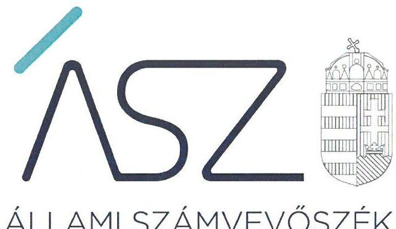
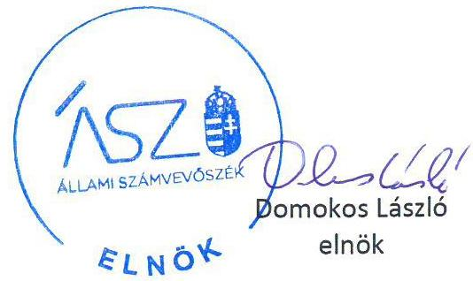
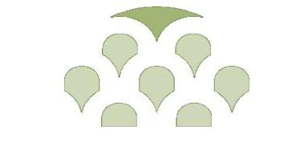

ÁLLAMI SZÁMVEVŐSZÉK

# JELENTÉS

## Az államháztartás központi alrendszere fejezeteinek ellenőrzése

A Magyar Tudományos Akadémia kutatóközpontjai és kutatóintézetei vagyongazdálkodásának ellenőrzése – MTA Bölcsészettudományi Kutatóközpont

2020.

20024
www.asz.hu

---

# JELENTÉS

Az államháztartás központi alrendszere fejezeteinek ellenőrzése

A Magyar Tudományos Akadémia kutatóközpontjai és kutatóintézetei vagyongazdálkodásának ellenőrzése – MTA Bölcsészettudományi Kutatóközpont

2020. 02. hó 21. nap

20024
www.asz.hu

---

# AZ ELLENŐRZÉST FELÜGYELTE: 

DR. NAGY IMRE felügyeleti vezető

## AZ ELLENŐRZÉST VEZETTE ÉS A VÉGREHAJTÁSÁÉRT FELELŐS:

RÁCZKEVI KATALIN ellenőrzésvezető

A PROGRAM ÖSSZEÁLLÍTÁSÁÉRT FELELŐS:
SZALAY NAGY JÁNOS projektvezető

IKTATÓSZÁM: EL-2421-001/2020.
TÉMASZÁM: 2517
ELLENŐRZÉS-AZONOSÍTÓ SZÁM: V086103

Jelentéseink az Országgyúlés számítógépes hálózatán és az interneten a www.asz.hu címen is olvashatóak.

---

# TARTALOMJEGYZÉK 

■ ÖSSZEGZÉS ..... 5
■ AZ ELLENŐRZÉS CÉLJA ..... 6
■ AZ ELLENŐRZÉS TERÜLETE ..... 7
■ AZ ELLENŐRZÉS HÁTTERE, INDOKOLTSÁGA ..... 8
■ A JELENTÉS LÉNYEGES KÉRDÉSKÖREI ..... 9
■ AZ ELLENŐRZÉS HATÓKÖRE ÉS MÓDSZEREI ..... 10
■ MEGÁLLAPÍTÁSOK ..... 12
■ MELLÉKLETEK ..... 13
I. sz. melléklet: Értelmező szótár ..... 13
■ FÜGGELÉKEK ..... 15
I. sz. függelék a jelentéshez ..... 15
II. sz. függelék: Észrevételek ..... 16
■ RÖVIDÍTÉSEK JEGYZÉKE ..... 19

---

.

---

# ÖSSZEGZÉS 

A Magyar Tudományos Akadémia Bölcsészettudományi Kutatóközpont a 2016. és 2017. években nem biztositotta a közvagyon megőrzését, ami kockázatot jelentett a kutatási közfeladatok célszerú ellátására. A 2018. évi vagyongazdálkodásban a vagyon megőrzése szempontjából kockázat nem merült fel.

## Az ellenőrzés társadalmi indokoltsága

Magyarország versenyképességének és a magyar gazdaság fejlődésének meghatározó tényezője a kutatás-fejlesztésre és az innovációra fordított hazai és uniós források eredményes, hatékony felhasználása. A magyar kutatás-fejlesztés területén kiemelt szerepet játszanak a központi költségvetésből biztosított támogatás felhasználásával múködtetett, 2019. augusztus 31-ig a Magyar Tudományos Akadémia által irányított kutatóintézetek, kutatóközpontok. A Bölcsészettudományi Kutatóközpont a filozófia, az irodalomtudomány, a művészettörténet, a néprajztudomány, a régészet, a történettudomány és a zenetudomány területén végzett kutatásokat.

A kutatás-fejlesztési közfeladat eredményes ellátásának feltétele, hogy az ehhez szükséges eszközök a kutatási tevékenységet ténylegesen végző intézeteknél, központoknál rendelkezésre álljanak, továbbá ezekkel a közfeladatuk érdekében, átlátható és elszámoltatható módon, a vagyon megőrzését biztosítva gazdálkodjanak.

Az ellenőrzés indokoltságát erősítette, hogy jogszabályi változás nyomán 2019. szeptember 1-től a kutatóintézetek és kutatóközpontok irányítása az Eötvös Loránd Kutatási Hálózat Titkárságához került át, a kutatóintézetek és kutatóközpontok ezt követően központi költségvetési szervként múködnek tovább. A magyar kutatás-fejlesztés szempontjából kiemelten fontos, hogy az új szervezeti keretek között induló kutatóhálózat életképessége, a közfeladatot szolgáló vagyona megőrzése biztosított legyen.

Az Állami Számvevőszék az ellenőrzési megállapításokon keresztül hozzájárul a közvagyon védelméhez és rámutat a közfeladatot ellátó kutatóhálózat működőképességére is kiható vagyongazdálkodás kockázataira.

## Főbb megállapítások, következtetések, javaslatok

A Magyar Tudományos Akadémia Bölcsészettudományi Kutatóközpont a 2016-2017. évi beszámolójának mérlegét leltárral nem támasztotta alá, az eszközök és források egyeztetéssel történő leltározását nem hajtotta végre.

A leltár hiányának következtében nem igazolt, hogy a közvagyonba tartozó kutatási eszközök rendelkezésre álltake a közfeladat ellátásához. A Kutatóközpont a 2018. évi beszámoló mérlegtételeit a jogszabályban előírtaknak megfelelően leltárral alátámasztotta.

A főigazgatónak a Kutatóközpont belső kontrollrendszere minőségéről tett éves nyilatkozata 2016-2017. évekre vonatkozóan nem állt összhangban az ellenőrzés megállapításaival, nem adott valós értékelést a gazdálkodás szabályszerűségét biztosító kontrollok múködéséről. Így a főigazgatói nyilatkozat nem töltötte be a szerepét a kontrollrendszer hiányosságainak feltárásában és kijavításában, a felelős gazdálkodás erősítésében.

---

# AZ ELLENŐRZÉS CÉLJA 

AZ ELLENŐRZÉS CÉLJA annak megállapítása, hogy az MTA kutatóközpontok és kutatóintézetek vagyongazdálkodása során érvényesült-e az átláthatóság és elszámoltathatóság. Az ellenőrzés a fejezethez tartozó intézmények kockázatértékelése alapján, az egyedi és lényeges jellemzők figyelembevételével történik

---

# AZ ELLENŐRZÉS TERÜLETE 

## Magyar Tudományos Akadémia Bölcsészettudományi Kutatóközpont

## Bölcsészettudományi Kutatóközpont

A Kutatóközpont ${ }^{1}$ 2012. január 1-jével az MTA Filozófiai Kutatóintézetnek, az MTA Irodalomtudományi Intézetének, az MTA Művészettörténeti Kutatóintézetének, az MTA Néprajzi Kutatóintézetének, az MTA Régészeti Intézetének, az MTA Társadalomkutató Központnak és az MTA Zenetudományi Intézetnek az MTA Történettudományi Intézetbe történő beolvadásával jött létre.

Az ellenőrzött időszakban a Kutatóközpont irányító szerve az MTA ${ }^{2}$ volt. A Kutatóközpont önálló jogi személyként, saját gazdasági szervezettel rendelkező köztestületi költségvetési szervként működött.

A Kutatóközpont közfeladatként ellátott alaptevékenysége a filozófia, az irodalomtudomány, a művészettörténet, a néprajztudomány, a régészet, a történettudomány és a zenetudomány területén a szervezeti egységeiben zajló egyéni és csoportos, alap- és alkalmazott kutatások végzése és koordinálása. Alaptevékenységét a szervezeti egységeit alkotó Filozófiai Intézet ${ }^{3}$, Irodalomtudományi Intézet ${ }^{4}$, Művészettörténeti Intézet ${ }^{5}$, Néprajztudományi Intézet ${ }^{6}$, Régészeti Intézet ${ }^{7}$, Történettudományi Intézet ${ }^{8}$ és Zenetudományi Intézet ${ }^{9}$ útján látta le.

A Kutatóközpontot 2016-2018. években a Főigazgató ${ }^{10}$ vezette, az ellenőrzött időszakban személyében nem történt változás.

A Kutatóközpont saját vagyonnal, valamint az MTA-tól használatba átvett vagyonnal rendelkezett. Az MTA a használatra átadott vagyon feletti rendelkezési jogot megtartotta, az eszközök használatával kapcsolatos feladatokat és a költségek viselését továbbadta a Kutatóközpontnak. Az MTA és a Kutatóközpont közötti használati szerződés ${ }^{11}$ alapján a Kutatóközpont volt köteles gondoskodni az eszközök állagmegóvásáról, továbbá viselni az eszközök müködtetésével összefüggő üzemeltetési, fenntartási és javítási költségeket.

A Kutatóintézet az MTA-tól négy ingatlant, továbbá 1,04 Mrd Ft értékű ingó vagyont vett át használatra.

A Kutatóközpont mérleg szerinti vagyonának nagyságrendje a 2016. évben 1,8 Mrd Ft, 2018. évben 2,7 Mrd Ft volt.

A Kutatóközpont átlagos statisztikai állományi létszáma 2016-ban 386 fő, 2018-ban 418 fő volt.

---

# AZ ELLENŐRZÉS HÁTTERE, INDOKOLTSÁGA 

Az MTA Magyarország legmagasabb szintű tudományos testülete, a központi költségvetésben önálló fejezetet alkot. Az MTA tv. ${ }^{12}$ 2019. augusztus 31-ig hatályos előírásai alapján az MTA feladatainak ellátása céljából közfinanszírozású kutatóközpontokat és kutatóintézeteket, kiszolgáló és egyéb intézményeket létesít és múködtet, amelyek felett irányítási jogot gyakorol. Az MTA kutatóközpontok és a kutatóintézetek 2019. augusztus 31-ig köztestületi költségvetési szervek voltak.

Az ÁSZ ellenőrzi az éves költségvetési törvény végrehajtását. Az ellenőrzés során feltárt kockázatok és a terület folyamatos értékelésével beazonosított kockázatok kezelése érdekében ellenőrzi többek között a költségvetési szervek gazdálkodását, múködését. Az ellenőrzések megállapításaival támogatja az ellenőrzött szervezetek szabályszerű gazdálkodását, javaslataival elősegíti az Alaptörvényben megfogalmazott alapvetések érvényesülését a mindennapi életben a szervezetek szintjén. Az ÁSZ megállapításaival elősegíti az ellenőrzöttek közpénzekkel való felelős gazdálkodását, illetve az újszerű megközelítésű ellenőrzéssel hozzájárul az értékteremtő rend kialakításához és megőrzéséhez.

Az ellenőrzés a vagyongazdálkodásra fókuszál. Az ellenőrzés megállapításai, javaslatai alapján javulhat a kutatóhálózat múködésének szabályszerűsége, a kutatásokra fordított közpénzek felhasználásának átláthatósága, a tudomány eredményeinek hasznosulása, hozzájárulva ezzel a „jól irányított állam" múködéséhez.

---

# A JELENTÉS LÉNYEGES KÉRDÉSKÖREI 

1. A Kutatóközpont vagyongazdálkodására vonatkozó alapvető szabályozása szabályszerü volt-e?
2. A Kutatóközpont vagyongazdálkodása során biztosított volt-e a vagyon megőrzése?

---

# AZ ELLENŐRZÉS HATÓKÖRE ÉS MÓDSZEREI 

## Az ellenőrzés típusa

Megfelelőségi ellenőrzés.

## Az ellenőrzött időszak

2016., 2017., 2018. évek

## Az ellenőrzés tárgya

A Magyar Tudományos Akadémia Bölcsészettudományi Kutatóközpont vagyongazdálkodásának ellenőrzése.

## Az ellenőrzött szervezet

Magyar Tudományos Akadémia Bölcsészettudományi Kutatóközpont

## Az ellenőrzés jogalapja

Az ellenőrzés jogszabályi alapját az ÁSZ tv. ${ }^{13}$ 1. § (3) bekezdés, 5. § (2)-(4) és (6) bekezdései, valamint az Áht. 61. § (2) bekezdésének előírásai képezik.

## Az ellenőrzés módszerei

Az ÁSZ az ellenőrzést az ellenőrzési program szempontjai, az ellenőrzött időszakban hatályos jogszabályok, az ellenőrzés szakmai szabályai, a jelen ellenőrzésre irányadó ÁSZ módszertanok figyelembevételével hajtotta végre.

Az ellenőrzési kérdések megválaszolásához szükséges bizonyítékok meg-szerzése az ellenőrzött által rendelkezésre bocsátott dokumentumokon alapult.

Az ellenőrzési bizonyítékként felhasználható adatforrások közé tartoztak egyrészt az ellenőrzési program részletes szempontjainál felsorolt adatforrások, másrészt minden egyéb - az ellenőrzés folyamán feltárt, az ellenőrzés szempontjából információt tartalmazó - dokumentum. Az ellenőrzés lefolytatásához az ellenőrzött szervezet az ÁSZ által kért dokumentumok megküldésével szolgáltatott adatokat, amelyek valódiságát és teljes

---

körűségét az adatszolgáltató szervezet vezetője által tett teljességi és hitelességi nyilatkozat igazolta. Az így rendelkezésre bocsátott adatok, információk kontrollja az ellenőrzés keretében történt.

Az ellenőrzés ideje alatt az ÁSZ az ellenőrzött szervezettel történő kapcsolattartást az ÁSZ SZMSZ ${ }^{14}$-ének vonatkozó előírásai alapján biztosította.

---

# 1. A Kutatóközpont vagyongazdálkodására vonatkozó alapvető szabályozása szabályszerű volt-e? 

Összegző megállapítás

Az MTA Bölcsészettudományi Kutatóközpont vagyongazdálkodásának alapvető szabályozása 2016-2018. közötti időszakban szabályszerű volt.

A Kutatóközpont rendelkezett az irányító szerv által jóváhagyott, az Áht. ${ }^{15}$ és Ávr. ${ }^{16}$ előírásainak megfelelő SZMSZ ${ }^{17}$-el.

A Kutatóközpont az ellenőrzött időszakban rendelkezett a Számv. tv. ${ }^{18}$ előírásainak megfelelően Számviteli politikával, Leltározási szabályzattal ${ }^{19}$ és Értékelési szabályzattal ${ }^{20}$.

A gazdálkodás részletes szabályait az Ávr. előírásának megfelelően Gazdálkodási szabályzat ${ }^{21}$-ban határozta meg.

Az Ávr. előírásai alapján a kötelezettségvállalásra, teljesítés igazolására jogosult személyekről és aláírás-mintájukról nyilvántartást vezettek.

A Kutatóközpont főigazgatója a Bkr. ${ }^{22}$ 1. számú melléklete szerinti nyilatkozatban értékelte a költségvetési szerv belső kontrollrendszerének minőségét. A nyilatkozat tartalmát a vagyongazdálkodás terén 2016-2017. évekre vonatkozóan a feltárt szabálytalanságok miatt az ÁSZ ellenőrzése nem igazolta vissza.

## 2. A Kutatóközpont vagyongazdálkodása során biztosított volt-e a vagyon megőrzése?

## Összegző megállapítás

Az MTA Bölcsészettudományi Kutatóközpont vagyongazdálkodása során a vagyon megőrzése 2016.-2017. években nem volt biztosított. A vagyon megőrzésében 2018. évre az ellenőrzés kockázatot nem tárt fel.

A Kutatóközpont a 2016-2017. évekre vonatkozóan a költségvetési beszámoló mérlegét az Áhsz. 22. § (1) - (2) bekezdéseiben, a Számv. tv. 69. § (1) bekezdésében, valamint a Leltározási szabályzat VII. fejezet 2. pontjában rögzítettek ellenére leltárral nem támasztotta alá.

A Kutatóközpont a 2016-2017. években a főkönyvi könyvelés és az analitikus nyilvántartások adatai közötti egyeztetést a Számv. tv 69. §. (2) bekezdése ellenére nem végezte el. A 2018. évi beszámoló mérlegtételeit a Számv. tv. előírásainak megfelelően leltárral alátámasztották.

---

# MELLÉKLETEK 

- I. SZ. MELLÉKLET: ÉRTELMEZŐ SZÓTÁR
állami vagyon
állami vagyonnak minősül:
a) az állam tulajdonában lévő dolog, valamint a dolog módjára hasznosítható természeti erő,
b) az a) pont hatálya alá nem tartozó mindazon vagyon, amely vonatkozásában törvény az állam kizárólagos tulajdonjogát nevesíti,
c) az állam tulajdonában lévő tagsági jogviszonyt megtestesítő értékpapír, illetve az államot megillető egyéb társasági részesedés,
d) az államot megillető olyan immateriális, vagyoni értékkel rendelkező jogosultság, amelyet jogszabály vagyoni értékű jogként nevesít. (Forrás: Vtv. 1. § (2) bekezdése)
állami vagyon használója
az a természetes vagy jogi személy, jogi személyiséggel nem rendelkező szervezet, aki, vagy amely törvény vagy szerződés alapján, bármely jogcímen (bérlet, haszonbérlet, használat stb.) állami vagyont birtokol, használ, szedi annak hasznait, hasznosít, ide nem értve a haszonélvezőt, a vagyonkezelőt és a tulajdonosi jogok gyakorlóját (Forrás: Vtvr. 1. § (7) bekezdés a) pont, hatályos 2012. január 1-jétől)
állami vagyon kezelője /vagyonkezelő
Az állami vagyont az MNV Zrt. maga kezeli, vagy szerződés - így különösen bérlet, haszonbérlet, megbízás - alapján központi költségvetési szervnek, természetes vagy jogi személynek, vagy jogi személyiséggel nem rendelkező gazdálkodó szervezetnek hasznosításra átengedi." Az állami vagyonra vonatkozóan az MNV Zrt. kizárólag az Nvtv-ben meghatározott személyekkel köthet vagyonkezelési szerződést. (Forrás: Vtv. 27. § (1) bekezdése, hatályos 2012. január 1-jétől)
hasznosítás
A nemzeti vagyon birtoklásának, használatának, hasznok szedése jogának bármely a tulajdonjog átruházását nem eredményező - jogcímen történő átengedése, ide nem értve a vagyonkezelésbe adást, valamint a haszonélvezeti jog alapítását. (Forrás: Nvtv. 3. § (1) bekezdés 4. pontja)
közfeladat
jogszabályban meghatározott állami vagy önkormányzati feladat, amit az arra kötelezett közérdekből, a jogszabályban meghatározott követelményeknek és feltételeknek megfelelve végez, ideértve a lakosság közszolgáltatásokkal való ellátását, továbbá az állam nemzetközi szerződésekben vállalt kötelezettségeiből adódó közérdekű feladatokat, valamint e feladatok ellátásakor szükséges infrastruktúra biztosítását is. (Forrás: Nvtv. 3. § (1) bekezdés 7. pontja).
köztestület önkormányzattal és nyilvántartott tagsággal rendelkező szervezet, amelynek létrehozását törvény rendeli el. A köztestület a tagságához, illetve a tagsága által végzett tevékenységhez kapcsolódó közfeladatot lát el. A köztestület jogi személy. Köztestület különösen a Magyar Tudományos Akadémia. (Forrás: 2006. évi LXV. törvény 8/A. § (1)-(2) bekezdés.
MTA kutatóhálózat AZ MTA feladatainak ellátása céljából közfinanszírozású kutatóhálózatot létesít és működtet, amely felett irányítási jogot gyakorol. (forrás: MTAtv. 2. § (1) bekezdés, hatályos 2019. augusztus 31-ig)
Az MTA kutatóhálózata 10 kutatóközpontból és bennük 38 intézetből, 5 önálló jogállású kutatóintézetből, 96 akadémiai támogatású egyetemi, illetve közgyűjteményekben létesített kutatócsoportból, valamint 95 Lendület-kutatócsoportból (együttesen: kutatóhely) áll.

---

MTA Kutatóközpont

MTA Kutatóintézet

MTA vagyon
vagyongazdálkodás

Az akadémiai kutatóközpont költségvetési szerv. A kutatóközpont autonóm módon vesz részt az Akadémia közfeladatainak megoldásában, önállóan is vállal közfeladatokat, továbbá egyéb tevékenységet is végezhet. Tudományos tevékenységéről és gazdálkodásáról évente beszámolót készít, amelyet az Akadémia az e törvényben és az Alapszabályban leírtak szerint értékel. (forrás: MTAtv. 18. § (1) bekezdés, hatályos 2019. augusztus 31-ig)

Az akadémiai kutatóintézet költségvetési szerv. Az akadémiai kutatóközpont keretein belül múködő kutatóintézet a kutatóközpont szervezeti egysége. A kutatóintézet autonóm módon vesz részt az Akadémia közfeladatainak megoldásában, önállóan is vállal közfeladatokat, továbbá egyéb tevékenységet is végezhet. (forrás: MTAtv. 18. § (1) bekezdés, hatályos 2019. augusztus 31-ig)
Az MTA vagyonába tartozik az MTA-nak átadott törzsvagyon és az állami vagyonról szóló 2007. évi CVI. törvény 69. § (1) bekezdése alapján az MTA-nak átadott vagyon (a továbbiakban: az MTA vagyona). Az MTA vagyonába tartoznak az ingatlanok, az immateriális javak (ideértve a szellemi tulajdont is), a tárgyi eszközök, a pénz, a befektetések és a részesedések is. Az MTA nem gazdálkodik állami vagyonnal, mert a korábbi rábízott vagyon is a tulajdonába került. (forrás: MTAtv. 23. § (2) bekezdés)
A nemzeti vagyongazdálkodás feladata a nemzeti vagyon rendeltetésének megfelelő, az állam, az önkormányzat mindenkori teherbíró képességéhez igazodó, elsődlegesen a közfeladatok ellátásához és a mindenkori társadalmi szükségletek kielégítéséhez szükséges, egységes elveken alapuló, átlátható, hatékony és költségtakarékos múködtetése, értékének megőrzése, állagának védelme, értéknövelő használata, hasznosítása, gyarapítása, továbbá az állam vagy a helyi önkormányzat feladatának ellátása szempontjából feleslegessé váló vagyontárgyak elidegenítése. (Forrás: Nvtv. 7. § (2) bekezdése)

---

# FÜGGELÉKEK 

- I. SZ. FÜGGELÉK A JELENTÉSHEZ

Az Állami Számvevőszék az ellenőrzések során feltárt tényekhez kapcsolódó további körülmények tisztázására eszközrendszerrel nem rendelkezik. Amennyiben az ellenőrzésen túlmutatóan indokoltnak látszik az ellenőrzés során feltárt körülmények további vizsgálata, az Állami Számvevőszék törvényi felhatalmazás alapján az ellenőrzés által feltárt körülményeket továbbítja a hatáskörrel rendelkező szervnek a szükséges intézkedések megtétele, eljárások lefolytatása érdekében.
I.

Az MTA Bölcsészettudományi Kutatóközpont a 2016-2017. évekre vonatkozóan az éves költségvetési beszámolók mérlegtételeit leltárral nem támasztotta alá, a fökönyvi könyvelés és az analitikus nyilvántartások adatai közötti egyeztetéssel történő leltározást nem végezte el. Ezzel megsértette az Áhsz. 5. § (1) bekezdésében, a 22. § (1)-(2) bekezdéseiben, valamint a Számv. tv. 69. § (1)-(2) bekezdéseiben foglaltakat.
Leltár és leltározás hiányában nem igazolt, hogy a 2016.-2017. évi éves költségvetési beszámolók mérlegében szereplő tételek a valóságban is megtalálhatóak, továbbá nem igazolt, hogy az eszközeit és forrásait a feladatkörébe tartozó feladatra használta fel. Ezért felmerül a gyanú, hogy az MTA Bölcsészettudományi Kutatóközpontot vagyoni hátrány érhette.
Az eset körülményeinek felderítésére a nyomozó hatóság rendelkezik hatáskörrel.
II.

A fentiekben rögzített, leltározásra és leltárra vonatkozó hiányosságok miatt nem igazolt, hogy a 2016-2017. évi éves költségvetési beszámolók megbízható, valós összképet mutatnak az MTA Bölcsészettudományi Kutatóközpont vagyonáról, annak összetételéről.
Az eset teljes körü feltárására a Nemzeti Adó- és Vámhivatal rendelkezik hatáskörrel.

---

A jelentéstervezetet a Számvevőszék 15 napos észrevételezésre megküldte az ellenőrzött szervezet vezetőjének az ÁSZ tv. 29. §* (1) bekezdése előírásának megfelelően.

A Bölcsészettudományi Kutatóközpont föigazgatója a jelentéstervezet megállapításaira írásban észrevételt tett.
Az ÁSZ tv. 29. § (3) bekezdésével összhangban az ÁSZ a Függelékben feltünteti az ellenőrzés megállapításaival kapcsolatban tett, figyelembe nem vett észrevételeket, és megindokolja, hogy azokat miért nem fogadta el.

[^0]
[^0]:    * 29. § (1) Az Állami Számvevőszék az ellenőrzési megállapításait megküldi az ellenőrzött szervezet vezetőjének vagy az általa megbízott személynek, és annak, akinek személyes felelősségét állapította meg.
    (2) Az ellenőrzött szervezet vezetője és a felelősként megjelölt személy az ellenőrzés megállapításaira tizenöt napon belül írásban észrevételt tehet.
    (3) Az Állami Számvevőszék az észrevételre a beérkezésétől számított harminc napon belül írásban válaszol. A figyelembe nem vett észrevételeket köteles a jelentésben feltüntetni, és megindokolni, hogy azokat miért nem fogadta el.

---

„Az államháztartás központi alrendszere fejezeteinek ellenőrzése - A Magyar Tudományos Akadémia kutatóközpontjai és kutatóintézetei vagyongazdálkodásának ellenőrzése - MTA Bölcsészettudományi Kutatóközpont" címmel készített számvevőszéki jelentéstervezet megállapításaival kapcsolatban a főigazgató által 2019. december 20-án tett (az Állami Számvevőszékhez 2019. december 31-én érkezett) el nem fogadott észrevételek és azok kezelésének indokolása.

# 1. A jelentéstervezet 2. számú megállapítás első és második bekezdésével kapcsolatos észrevétel 

A Kutatóközpont főigazgatója észrevételében kifogásolta a 2016-2017. évek tekintetében a leltározásra vonatkozó megállapítást, figyelemmel arra, hogy az adatbekérések során a mennyiségi felvétellel és egyeztetéssel elvégzett leltározás dokumentumait az ÁSZ rendelkezésére bocsátották. Ezek igazolására megnevezte a beküldött dokumentumokat, a beküldés időpontját az adatszolgáltatásról kiállított teljességi és hitelességi nyilatkozat vonatkozó pontjára történő hivatkozással. Az észrevételben a főigazgató kifogásolta továbbá az analitikus és főkönyvi nyilvántartások egyeztetésének hiányára vonatkozó megállapítást, melyek esetében hivatkozott a feltöltött fájlok tartalmára, különösen azokra a dokumentumokra, amelyek az analitikus és a főkönyvi nyilvántartás egyeztetése során feltárt eltéréseket, azok indokait és a javításuk tényét mutatják be.

Az ÁSZ az ellenőrzési megállapításait az adatszolgáltatás során a részére törvényi határidőben rendelkezésre bocsátott dokumentumokra alapozva fogalmazza meg. A teljességi és hitelességi nyilatkozat szerint az ÁSZ részére átadott dokumentumok, adatok megbízhatóak, és a bekért adatokra, dokumentumokra vonatkozóan teljes körű információt tartalmaznak. A 2019. július 19-én megküldött adatszolgáltatás dokumentumai a 2016-2017. év tekintetében tartalmazták a főkönyvi számlák nyitó és záró adatait, de nem tartalmazták a főkönyvi és analitikus nyilvántartások egyeztetésének dokumentumait.

A 2019. augusztus 9. napján kelt teljességi és hitelességi nyilatkozat alapján a Kutatóközpont az adatszolgáltatás során a 2016-2017. évekre vonatkozóan nem küldte meg, az egyeztetéssel történő leltározás elrendelésének dokumentumait, a leltározási utasítást, a leltározás záró jegyzőkönyvét, így nem bocsátotta az ellenőrzés rendelkezésére a leltározás teljes körű elvégzését igazoló dokumentumokat. A fentiekre tekintettel az észrevételt az ÁSZ nem fogadja el, a jelentéstervezet módosítása nem indokolt.

## 2. A jelentéstervezet Ellenőrzés területével kapcsolatos észrevétel

A jelentéstervezet tárgyilagossága, illetve pontosítása érdekében a főigazgató észrevételében az Ellenőrzés területe részben pontosítani kérte az MTA-tól használatra átvett ingó-és ingatlan vagyonra vonatkozó szövegrészt.

A rendelkezésre álló használati szerződések alapján megállapítást nyert, hogy a 2015. évi szerződésben, amely három ingatlan használatáról szólt, a c) pont alatt jelölt ingatlan megegyezik a 2017. évi szerződésben - amely két ingatlan használatáról szólt - a b) pontban jelölt ingatlannal. A szerződések alapján a Kutatóközpont tehát összesen négy ingatlant vett át az MTA-tól használatra. Az észrevételt az ÁSZ nem fogadja el, a szövegrész pontosítása nem indokolt.

## 3. A jelentéstervezet 2. számú megállapítás ötödik bekezdésével kapcsolatos észrevétel

A főigazgató véleménye szerint a Bkr. 1. számú melléklete szerint kiadott nyilatkozata - az észrevételei figyelembevételével - az ellenőrzés időszakában összhangban voltak az ellenőrzés megállapításaival, ezért kérte a jelentéstervezet vonatkozó nemleges megállapításainak módosítását is.

A főigazgató észrevételét az ÁSZ nem fogadja el, mivel az észrevételek a jelentéstervezet megállapításait nem módosítják, a jelentéstervezet Kutatóközpont főigazgatójának Bkr. nyilatkozatával összefüggésben leírt következtetését az ÁSZ fenntartja.

---

.

---

# RÖVIDÍTÉSEK JEGYZÉKE 

${ }^{1}$ Kutatóközpont
${ }^{2}$ MTA
${ }^{3}$ Filozófiai Intézet
${ }^{4}$ Irodalomtudományi Intézet
${ }^{5}$ Művészettörténeti Intézet
${ }^{6}$ Néprajztudományi Intézet
${ }^{7}$ Régészeti Intézet
${ }^{8}$ Történettudományi Intézet
${ }^{9}$ Zenetudományi Intézet
${ }^{10}$ Főigazgató
${ }^{11}$ vagyonhasználati szerződések
${ }^{12}$ MTA tv.
${ }^{13}$ ÁSZ tv.
${ }^{14}$ ÁSZ SZMSZ
${ }^{15}$ Áht.
${ }^{16}$ Ávr.
${ }^{17}$ SZMSZ
${ }^{18}$ Számv. tv.
${ }^{19}$ Leltározási szabályzat
${ }^{20}$ Értékelési szabályzat
${ }^{21}$ Gazdálkodási szabályzat
${ }^{22}$ Bkr.

Magyar Tudományos Akadémia Bölcsészettudományi Kutatóközpont
Magyar Tudományos Akadémia
Magyar Tudományos Akadémia Bölcsészettudományi Kutatóközpont Filozófiai Intézet

Magyar Tudományos Akadémia Bölcsészettudományi Kutatóközpont Irodalomtudományi Intézet

Magyar Tudományos Akadémia Bölcsészettudományi Kutatóközpont Művészettörténeti Intézet

Magyar Tudományos Akadémia Bölcsészettudományi Kutatóközpont Néprajztudományi Intézet

Magyar Tudományos Akadémia Bölcsészettudományi Kutatóközpont Régészeti Intézet

Magyar Tudományos Akadémia Bölcsészettudományi Kutatóközpont Történettudományi Intézet

Magyar Tudományos Akadémia Bölcsészettudományi Kutatóközpont Zenetudományi Intézet

Magyar Tudományos Akadémia Bölcsészettudományi Kutatóközpont Főigazgatója

Magyar Tudományos Akadémia, mint tulajdonos, valamint az MTA Bölcsészettudományi Kutatóközpont, mint használó között létrejött MTA BTK-KP/2502-6/2015; MTA BTK-KP/5678-1/2017. iktatószámú szerződések 1994. évi XL. törvény a Magyar Tudományos Akadémiáról (hatályos: 1994. június 30-tól)
az Állami Számvevőszékről szóló 2011. évi LXVI. törvény
az Állami Számvevőszék Szervezeti és Működési Szabályzata
2011. évi CXCV. törvény az államháztartásról

368/2011. (XII. 31.) Korm. rendelet az államháztartásról szóló törvény végrehajtásáról (hatályos: 2012. január 1-jétől)

Magyar Tudományos Akadémia Bölcsészettudományi Kutatóközpont Szervezeti és múködési szabályzat (hatályos: 2012. január 1-jétől 2018. december 19-ig) 2000. évi C. törvény a számvitelről

MTA BTK-KP/1055-1/2014. számú MTA Bölcsészettudományi Kutatóközpont Eszközök és források leltárkészítési és leltározási szabályzata (hatályos: 2014. április 1-jétől)

MTA Bölcsészettudományi Kutatóközpont Eszközök és források értékelési szabályzata (hatályos: 2015. január 1-jétől)

MTA BTK-KP/5046-1/2015. számú MTA Bölcsészettudományi Kutatóközpont Gazdálkodási szabályzat
(hatályos: 2015. szeptember 1-jétől 2017. december 31-ig);
MTA BTK-KP/6099-1/2017. számú MTA Bölcsészettudományi Kutatóközpont Gazdálkodási szabályzat (hatályos: 2018. január 1-jétől)

370/2011. (XII.31.) Korm. rendelet a költségvetési szervek belső kontrollrendszeréről és belső ellenőrzéséről

---

# ASZ 

ALLAMI SZAMVEVOSZEK
1052 Budapest, Apáczai Cs. J. u. 10. I 1364 Budapest 4. Pf. 54 TEL: +36 14849100
email: szamvevoszek@asz.hu
web: www.asz.hu | www.aszhirportal.hu