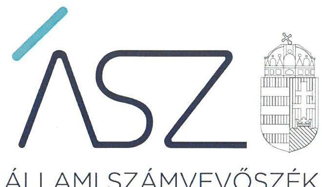
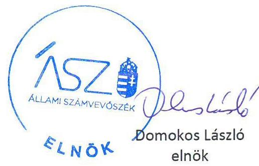

ÁLLAMI SZÁMVEVŐSZÉK

# JELENTÉS

## Az államháztartás központi alrendszere fejezeteinek ellenőrzése

A Magyar Tudományos Akadémia kutatóközpontjai és kutatóintézetei vagyongazdálkodásának ellenőrzése – MTA Wigner Fizikai Kutatóközpont

2020.

20025

www.asz.hu

---

# JELENTÉS

## Az államháztartás központi alrendszere fejezeteinek ellenőrzése

A Magyar Tudományos Akadémia kutatóközpontjai és kutatóintézetei vagyongazdálkodásának ellenőrzése – MTA Wigner Fizikai Kutatóközpont

2020. 02. hó 21. nap

20025
www.asz.hu

---

AZ ELLENŐRZÉST FELÜGYELTE:
DR. NAGY IMRE felügyeleti vezető

AZ ELLENŐRZÉST VEZETTE ÉS A VÉGREHAJTÁSÁÉRT FELELŐS:
RÁCZKEVI KATALIN ellenőrzésvezető

A PROGRAM ÖSSZEÁLLÍTÁSÁÉRT FELELŐS:
SZALAY NAGY JÁNOS projektvezető

IKTATÓSZÁM: EL-2422-001/2020.
TÉMASZÁM: 2517
ELLENŐRZÉS-AZONOSÍTÓ SZÁM: V086115
jelentéseink az Országgyülés számítógépes hálózatán és az Interneten a www.asz.hu címen is olvashatóak.

---

# TARTALOMJEGYZÉK 

■ ÖSSZEGZÉS ..... 5
■ AZ ELLENŐRZÉS CÉLJA ..... 7
■ AZ ELLENŐRZÉS TERÜLETE ..... 8
■ AZ ELLENŐRZÉS HÁTTERE, INDOKOLTSÁGA ..... 9
■ A JELENTÉS LÉNYEGES KÉRDÉSKÖRE ..... 10
■ AZ ELLENŐRZÉS HATÓKÖRE ÉS MÓDSZEREI ..... 11
■ MEGÁLLAPÍTÁSOK ..... 13
■ JAVASLATOK ..... 14
■ MELLÉKLETEK ..... 15
I. sz. melléklet: Értelmező szótár ..... 15
■ FÜGGELÉKEK ..... 17
I. sz. függelék a jelentéshez ..... 17
II. sz. függelék: Észrevételek ..... 18
■ RÖVIDÍTÉSEK JEGYZÉKE ..... 21

---

.

---

# ÖSSZEGZÉS 

A Magyar Tudományos Akadémia Wigner Fizikai Kutatóközpont a 2016., 2017. és 2018. években nem biztosította a közvagyonnal való felelős gazdálkodást, a vagyon megőrzésének és célszerű felhasználásának alapvető feltételeit, ami kockázatot jelentett a kutatási közfeladatának ellátására.

## Az ellenőrzés társadalmi indokoltsága

Magyarország versenyképességének és a magyar gazdaság fejlődésének meghatározó tényezője a kutatás-fejlesztésre és az innovációra fordított hazai és uniós források eredményes, hatékony felhasználása. A magyar kutatás-fejlesztés területén kiemelt szerepet játszanak a központi költségvetésből biztosított támogatás felhasználásával működtetett, 2019. augusztus 31-ig a Magyar Tudományos Akadémia által irányított kutatóintézetek, kutatóközpontok.

A Magyar Tudományos Akadémia Wigner Fizikai Kutatóközpont kísérleti és elméleti részecskefizika, magfizika, általános relativitáselmélet, gravitáció, fúziós plazmafizika, űrfizika, nukleáris anyagtudomány, valamint kísérleti és elméleti szilárdtest-fizika, statisztikus fizika, atomfizika, optika, és anyagtudományok területén végzett kutatásokat.

A kutatás-fejlesztési közfeladat eredményes ellátásának feltétele, hogy az ehhez szükséges eszközök a kutatási tevékenységet ténylegesen végző intézeteknél, központoknál rendelkezésre álljanak, továbbá ezekkel a közfeladatuk érdekében, átlátható és elszámoltatható módon, a vagyon megőrzését biztosítva gazdálkodjanak.

Az ellenőrzés indokoltságát erősítette, hogy jogszabályi változás nyomán 2019. szeptember 1-től a kutatóintézetek és kutatóközpontok irányítása az Eötvös Loránd Kutatási Hálózat Titkárságához került át, a kutatóintézetek és kutatóközpontok ezt követően központi költségvetési szervként működnek tovább. A magyar kutatás-fejlesztés szempontjából kiemelten fontos, hogy az új szervezeti keretek között induló kutatóhálózat életképessége, a köz-feladatot szolgáló vagyon megőrzése biztosított legyen.

Az Állami Számvevőszék az ellenőrzési megállapításokon keresztül hozzájárul a közvagyon védelméhez és rámutat a közfeladatot ellátó kutatóhálózat működőképességére is kiható vagyongazdálkodás kockázataira.

## Főbb megállapítások, következtetések, javaslatok

A 2016-2018. években a Magyar Tudományos Akadémia Wigner Fizikai Kutatóközpont a szabályszerű közpénzfelhasználáshoz szükséges alapvető szabályozási feltételeket nem alakította ki, mert a kötelezettségvállalásra és a teljesítésigazolásra jogosult személyekről és aláírás mintájukról a jogszabályban előírt nyilvántartást nem vezette. A kötelezettségvállalásra és teljesítés igazolására jogosultak és aláírás mintájuk nyilvántartásának hiányában nem biztosított, hogy kötelezettséget csak az vállalhasson, teljesítést csak az igazolhasson, aki erre jogosult volt. Így a Kutatóközpont nem teremtette meg a garanciális feltételeket ahhoz, hogy kötelezettségvállalásra, ill. kifizetésre kizárólag a feladatkörébe tartozó cél érdekében, szabályszerűen kerüljön sor.

A gazdálkodási jogkörök gyakorlására jogosult személyekről és aláírás mintájukról vezetett nyilvántartás hiányában nem volt biztosított, hogy a Kutatóközpont könyvvezetését és vagyonnyilvántartását szabályszerűen kiállított bizonylatok alapján állította össze. Szabályszerű könyvvezetés és részletező nyilvántartás hiányában nem volt biztosított, hogy az éves költségvetési beszámolót alátámasztó főkönyvi kivonatok és leltárak a jogszabályi előírásoknak megfelelnek, ezáltal nem igazolt, hogy a 2016-2018. évekre vonatkozó költségvetési beszámolók mérlegei megbízható, valós összképet mutatnak a Kutatóközpont vagyonáról, annak összetételéről, a Kutatóközpont pénzügyi helyzetéről.

A Kutatóközpont főigazgatójának a belső kontrollrendszer minőségéről tett éves nyilatkozata nem állt összhangban az ellenőrzés megállapításaival, nem adott valós értékelést a gazdálkodás szabályszerűségét biztosító kontrollok kialakításáról, nem biztosította a szabálytalanságok feltárását és megszüntetését. Így a főigazgatói nyilatkozat nem 

---

töltötte be a szerepét a kontrollrendszer hiányosságaiban feltárásában és kijavításában, a felelős gazdálkodás erősítésében.

A közvagyon védelme és közfeladat ellátása szempontjából elsődleges, hogy a Kutatóközpont intézkedjen a szabálytalanságok megszüntetéséről és a hiányosságok orvoslásáról annak érdekében, hogy helyreálljon a vagyongazdálkodás törvényessége és biztosított legyen a vagyon megőrzése.

---

# AZ ELLENŐRZÉS CÉLJA 

AZ ELLENŐRZÉS CÉLJA annak megállapítása, hogy az MTA kutatóközpontok és kutatóintézetek vagyongazdálkodása során érvényesült-e az átláthatóság és elszámoltathatóság. Az ellenőrzés a fejezethez tartozó intézmények kockázatértékelése alapján, az egyedi és lényeges jellemzők figyelembevételével történik.

---

# **AZ ELLENŐRZÉS TERÜLETE**

## **Magyar Tudományos Akadémia Wigner Fizikai Kutatóközpont**

Az MTA Wigner Fizikai Kutatóközpontot 1992. január 01-jén alapította a Magyar Tudományos Akadémia.

A Kutatóközpont¹ az ellenőrzött időszakban önálló jogi személyként működő köztestületi költségvetési szerv volt, amely felett az MTA² irányítási jogot gyakorolt.

Az ellenőrzött időszakban a Kutatóközpont az MTA tv.³-ben megjelölt közfeladatokat látta el, küldetése felfedező jellegű fizikai kutatások lefolytatása volt. Fő tevékenysége körében a Kutatóközpont kísérleti és elméleti részecskefizikával, magfizikával, általános relativitáselmélettel, gravitációval, fúziós plazmafizikával, űrfizikával, nukleáris anyagtudománnyal, valamint kísérleti és elméleti szilárdtest-fizikával, statisztikus fizikával, atomfizikával, optikával, és anyagtudománnyal foglalkozott.

Kutatási feladatai körében felfedező kutatásokat végzett a nagyenergiás fizika, nehézionfizika, kondenzált anyagok fizikája, elméleti és matematikai fizika, kvantumelméletek, gravitációs hullámok és kozmológia, elméleti idegtudomány, bolygóközi gázok, forró plazmák és hűtött atomok fizikája, komplex rendszerek fizikája, lágy anyagok fizikája, nanoszerkezetek, vékonyrétegek és felületek fizikája, neutronfizika, fémfizika, optikai kristályos fizikája, a kvantumoptika és lézerfizika egyes területein, a nukleáris szilárdtest-fizika, kulturális örökség védelme továbbá a környezetfizika területén.

A Kutatóközpont főigazgatójának személye az ellenőrzött időszakban nem változott, a gazdasági igazgató személyében 2016-ban történt változás.

A Kutatóközpont beszámolójában szereplő vagyon nagyságrendje 2016. évről 2018. évre közel 1 milliárd Ft-tal csökkent. A Kutatóközpont átlagos statisztikai állományi létszáma 2016. év végén 352 fő, 2018-ban 371 fő volt.

---

# AZ ELLENŐRZÉS HÁTTERE, INDOKOLTSÁGA 

Az MTA Magyarország legmagasabb szintű tudományos testülete, a központi költségvetésben önálló fejezetet alkot. Az MTA tv. ${ }^{4}$ 2019. augusztus 31-ig hatályos előírásai alapján az MTA feladatainak ellátása céljából közfinanszírozású kutatóközpontokat és kutatóintézeteket, kiszolgáló és egyéb intézményeket létesít és működtet, amelyek felett irányítási jogot gyakorol. Az MTA kutatóközpontok és a kutatóintézetek 2019. augusztus 31-ig köztestületi költségvetési szervek voltak.

Az ÁSZ ${ }^{5}$ ellenőrzi az éves költségvetési törvény végrehajtását. Az ellenőrzés során feltárt kockázatok és a terület folyamatos értékelésével beazonosított kockázatok kezelése érdekében ellenőrzi többek között a költségvetési szervek gazdálkodását, működését. Az ellenőrzések megállapításaival támogatja az ellenőrzött szervezetek szabályszerű gazdálkodását, javaslataival elősegíti az Alaptörvényben megfogalmazott alapvetések érvényesülését a mindennapi életben a szervezetek szintjén. Az ÁSZ megállapításaival elősegíti az ellenőrzöttek közpénzekkel való felelős gazdálkodását, illetve az újszerű megközelítésű ellenőrzéssel hozzájárul az értékteremtő rend kialakításához és megőrzéséhez.

Az ellenőrzés a vagyongazdálkodásra fókuszál. Az ellenőrzés megállapításai, javaslatai alapján javulhat a kutatóhálózat működésének szabályszerűsége, a kutatásokra fordított közpénzek felhasználásának átláthatósága, a tudomány eredményeinek hasznosulása, hozzájárulva ezzel a „jól irányított állam" működéséhez.

---

# A JELENTÉS LÉNYEGES KÉRDÉSKÖRE 

- A Kutatóközpont vagyongazdálkodására vonatkozó alapvető szabályozása szabályszerű volt-e, valamint vagyongazdálkodása során biztosított volt-e a vagyon megőrzése?

---

# AZ ELLENŐRZÉS HATÓKÖRE ÉS MÓDSZEREI 

## Az ellenőrzés típusa

Megfelelőségi ellenőrzés.

## Az ellenőrzött időszak

2016., 2017., 2018. évek

## Az ellenőrzés tárgya

A Magyar Tudományos Akadémia Wigner Fizikai Kutatóközpont vagyongazdálkodásának ellenőrzése

## Az ellenőrzött szervezet

Magyar Tudományos Akadémia Wigner Fizikai Kutatóközpont

## Az ellenőrzés jogalapja

Az ellenőrzés jogszabályi alapját az ÁSZ tv. ${ }^{6} 1 . \S$ (3) bekezdés, 5. § (2)-(4) és (6) bekezdései, valamint az Áht. 61. § (2) bekezdésének előírásai képezik.

## Az ellenőrzés módszerei

Az ÁSZ az ellenőrzést az ellenőrzési program szempontjai, az ellenőrzött időszakban hatályos jogszabályok, az ellenőrzés szakmai szabályai, a jelen ellenőrzésre irányadó ÁSZ módszertanok figyelembevételével hajtotta végre.

Az ellenőrzési kérdések megválaszolásához szükséges bizonyítékok megszerzése az ellenőrzött által rendelkezésre bocsátott dokumentumokon alapult.

Az ellenőrzési bizonyítékként felhasználható adatforrások közé tartoztak egyrészt az ellenőrzési program részletes szempontjainál felsorolt adatforrások, másrészt minden egyéb - az ellenőrzés folyamán feltárt, az ellenőrzés szempontjából információt tartalmazó - dokumentum. Az ellenőrzés lefolytatásához az ellenőrzött szervezet az ÁSZ által kért dokumentumok megküldésével szolgáltatott adatokat, amelyek valódiságát és teljes

---

körűségét az adatszolgáltató szervezet vezetője által tett teljességi és hitelességi nyilatkozat igazolta. Az így rendelkezésre bocsátott adatok, információk kontrollja az ellenőrzés keretében történt.

Az ellenőrzés ideje alatt az ellenőrzött szervezettel történő kapcsolattartást az ÁSZ SZMSZ ${ }^{7}$-ének vonatkozó előírásai alapján biztosítottuk.

---

# A Kutatóközpont vagyongazdálkodására vonatkozó alapvető szabályozása szabályszerű volt-e, valamint vagyongazdálkodása során biztosított volt-e a vagyon megőrzése? 

Összegző megállapítás

A Wigner Fizikai Kutatóközpont vagyongazdálkodásának 2016-2018. évi alapvető szabályozása nem volt szabályszerű, a vagyon megőrzése nem volt biztosított.

A Kutatóközpont kontrollkörnyezetének kialakítása nem biztosította a közpénzfelhasználás szabályozottságát és a vagyonnal való felelős gazdálkodást, továbbá a vagyongazdálkodása nem volt szabályszerű, mivel az Ávr. ${ }^{8}$ 60. § (3) bekezdés ellenére nem rendelkezett a kötelezettségvállalásra, teljesítés igazolására jogosult személyekről és aláírás-mintájukról vezetett nyilvántartással.

A gazdálkodási jogkörök gyakorlására jogosult személyekről és aláírás mintájukról vezetett nyilvántartás hiányában nem volt biztosított, hogy a Kutatóközpont kiadásairól készült számviteli bizonylatok megfelelnek az Áhsz. ${ }^{9}$ és a Számv.tv. ${ }^{10}$ előírásainak. Ebből következően nem igazolható, hogy a Kutatóközpont a könyvvezetését és részletező nyilvántartásait szabályszerűen kiállított bizonylatok alapján állította össze. Szabályszerű könyvvezetés és részletező nyilvántartás hiányában nem volt biztosított, hogy az éves költségvetési beszámolót alátámasztó főkönyvi kivonatok és leltárak a jogszabályi előírásoknak megfelelnek, ezáltal nem igazolt, hogy a 2016-2018. évekre vonatkozó költségvetési beszámolók megbízható, valós összképet mutatnak a Kutatóközpont vagyonáról, annak összetételéről, pénzügyi helyzetéről.

A Kutatóközpont főigazgatójának a Bkr. ${ }^{11}$ 11. § (1) bekezdésében előírt nyilatkozata nem állt összhangban az ellenőrzés megállapításaival, mert a nyilatkozatban foglaltakkal ellentétben a főigazgató 2016-2018. években nem gondoskodott a gazdálkodás szabályszerűségét biztosító kontrollok kialakításáról.

---

# JAVASLATOK 

Az ÁSZ tv. 33. § (1) bekezdésében foglaltak értelmében az ellenőrzött szervezet vezetője köteles a jelentésben foglalt megállapításokhoz kapcsolódó intézkedési tervet összeállítani és azt a jelentés kézhezvételétől számított 30 napon belül az ÁSZ részére megküldeni. Amennyiben az ellenőrzött szervezet vezetője nem küldi meg határidőben az intézkedési tervet, vagy továbbra sem elfogadható intézkedési tervet küld, az Állami Számvevőszék elnöke az ÁSZ tv. 33. § (3) bekezdése a) és b) pontjaiban foglaltakat érvényesítheti.

## a Wigner Fizikai Kutatóközpont főigazgatójának

1. Intézkedjen a kötelezettségvállalásra, teljesítés igazolására jogosult személyekről és aláírás-mintájukról vezetett nyilvántartás vezetéséről a jogszabályi előírásnak megfelelően.
(1. sz. megállapítás 1. bekezdése alapján)

---

# MELLÉKLETEK 

- I. SZ. MELLÉKLET: ÉRTELMEZŐ SZÓTÁR
hasznosítás
közfeladat
köztestület

MTA kutatóhálózat

MTA Kutatóközpont

MTA Kutatóintézet

MTA vagyon
vagyongazdálkodás
az állami vagyon bármely - a tulajdonjog átruházását nem eredményező - módon, jogcímen történő átadása, átengedése, ide nem értve a haszonélvezeti jog létesítését, valamint a vagyonkezelésbe adást (Forrás: Vtvr. 1. § (7) bekezdés e) pont, hatályos 2012. január 1-jétől);
Jogszabályban meghatározott állami vagy önkormányzati feladat, amit az arra kötelezett közérdekből, a jogszabályban meghatározott

 követelményeknek és feltételeknek megfelelve végez, ideértve a lakosság közszolgáltatásokkal való ellátását, továbbá az állam nemzetközi szerződésekben vállalt kötelezettségeiből adódó közérdekű feladatokat, valamint e feladatok ellátásakor szükséges infrastruktúra biztosítását is. (Forrás: Nvtv. 3. § (1) bekezdés 7. pontja).
A köztestület önkormányzattal és nyilvántartott tagsággal rendelkező szervezet, amelynek létrehozását törvény rendeli el. A köztestület a tagságához, illetve a tagsága által végzett tevékenységhez kapcsolódó közfeladatot lát el. A köztestület jogi személy. Köztestület különösen a Magyar Tudományos Akadémia. (Forrás: 2006. évi LXV. törvény 8/A. § (1)(2) bekezdés.

AZ MTA feladatainak ellátása céljából közfinanszírozású kutatóhálózatot létesít és működtet, amely felett irányítási jogot gyakorol. (forrás: MTAtv. 2. § (1) bekezdés, hatályos 2019. augusztus 31-ig)

Az MTA kutatóhálózata 10 kutatóközpontból és bennük 38 intézetből, 5 önálló jogállású kutatóintézetből, 96 akadémiai támogatású egyetemi, illetve közgyűjteményekben létesített kutatócsoportból, valamint 95 Lendület-kutatócsoportból (együttesen: kutatóhely) áll.
Az akadémiai kutatóközpont költségvetési szerv. A kutatóközpont autonóm módon vesz részt az Akadémia közfeladatainak megoldásában, önállóan is vállal közfeladatokat, továbbá egyéb tevékenységet is végezhet. Tudományos tevékenységéről és gazdálkodásáról évente beszámolót készít, amelyet az Akadémia az e törvényben és az Alapszabályban leírtak szerint értékel. (forrás: MTAtv. 18. § (1) bekezdés, hatályos 2019. augusztus 31-ig)
Az akadémiai kutatóintézet költségvetési szerv. Az akadémiai kutatóközpont keretein belül működő kutatóintézet a kutatóközpont szervezeti egysége. A kutatóintézet autonóm módon vesz részt az Akadémia közfeladatainak megoldásában, önállóan is vállal közfeladatokat, továbbá egyéb tevékenységet is végezhet. (forrás: MTAtv. 18. § (1) bekezdés, hatályos 2019. augusztus 31-ig)
Az MTA vagyonába tartozik az MTA-nak átadott törzsvagyon és az állami vagyonról szóló 2007. évi CVI. törvény 69. § (1) bekezdése alapján az MTA-nak átadott vagyon (a továbbiakban: az MTA vagyona). Az MTA vagyonába tartoznak az ingatlanok, az immateriális javak (ideértve a szellemi tulajdont is), a tárgyi eszközök, a pénz, a befektetések és a részesedések is. Az MTA nem gazdálkodik állami vagyonnal, mert a korábbi rábízott vagyon is a tulajdonába került. (forrás: MTAtv. 23. § (2) bekezdés)
A nemzeti vagyongazdálkodás feladata a nemzeti vagyon rendeltetésének megfelelő, az állam, az önkormányzat mindenkori teherbíró képességéhez igazodó, elsődlegesen a közfeladatok ellátásához és a mindenkori társadalmi szükségletek kielégítéséhez szükséges, egységes elveken alapuló, átlátható, hatékony és költségtakarékos működtetése, értékének megőrzése, állagának védelme, értéknövelő használata, hasznosítása, gyarapítása, továbbá az állam vagy a helyi önkormányzat feladatának ellátása szempontjából feleslegessé váló vagyontárgyak elidegenítése. (Forrás: Nvtv. 7. § (2) bekezdése)

---

.

---

# FÜGGELÉKEK 

- I. SZ. FÜGGELÉK A JELENTÉSHEZ

Az Állami Számvevőszék az ellenőrzések során feltárt tényekhez kapcsolódó további körülmények tisztázására eszközrendszerrel nem rendelkezik. Amennyiben az ellenőrzésen túlmutatóan indokoltnak látszik az ellenőrzés során feltárt körülmények további vizsgálata, az Állami Számvevőszék törvényi felhatalmazás alapján az ellenőrzés által feltárt körülményeket továbbítja a hatáskörrel rendelkező szervnek a szükséges intézkedések megtétele, eljárások lefolytatása érdekében.

Az MTA Wigner Fizikai Kutatóközpont a 2016-2018. években a kötelezettségvállalásra és teljesítésigazolásra jogosult személyekről és aláírás-mintájukról az Ávr. 60.§ (3) bekezdésében foglaltak ellenére nem vezetett nyilvántartást, így a kifizetésekhez kapcsolódóan a kötelezettségvállalásra és a teljesítések igazolására jogosult felelős személy(ek) nem voltak azonosíthatóak.
A kötelezettségvállalásra és a teljesítés igazolására jogosult személy(ek) azonosíthatóságának hiányában nem zárható ki, hogy az MTA Wigner Fizikai Kutatóközpontnál olyan kötelezettségvállalások és kifizetések történtek, amelyek nem az ellenőrzött szervezet feladatellátását szolgálták, illetve nem szerződésszerű teljesítésekhez kapcsolódtak. Mindezek alapján felmerül a gyanú, hogy az MTA Wigner Fizikai Kutatóközpontot vagyoni hátrány érhette.
Az eset körülményeinek felderítésére a nyomozó hatóság rendelkezik hatáskörrel.

---

A jelentéstervezetet a Számvevőszék 15 napos észrevételezésre megküldte az ellenőrzött szervezet vezetőjének az ÁSZ tv. 29. § (1) bekezdése előírása szerint.

A Magyar Tudományos Akadémia Wigner Fizikai Kutatóközpont főigazgatója a jelentéstervezet megállapításaira írásban észrevételt tett.
Az ÁSZ tv. 29. § (3) bekezdésével összhangban az ÁSZ a Függelékben feltünteti az ellenőrzés megállapításaival kapcsolatban tett, figyelembe nem vett észrevételeket, és megindokolja, hogy azokat miért nem fogadta el.

# A jelentéstervezet 1. számú megállapítás 1. bekezdésére vonatkozó észrevétel: 

A főigazgató észrevétele szerint a Wigner Fizikai Kutatóközpont a „Nyilvántartás a kötelezettségvállalásra, pénzügyi ellenjegyzésre, utalványozásra és érvényesítésre" dokumentumot 2019.07.23-án, 11 óra 29 perc 11 másodperc időpontban sikeresen feltöltötte az ÁSZ Elektronikus Adatbekérési Rendszerébe (a feltöltött fájl kódja: 66c8a6eac5ec921b34a3blc05db84bel), ezért vitatja a gazdálkodási jogkörök nyilvántartására vonatkozó megállapítást.
Az észrevételt nem fogadom el. Az ÁSZ az EL-1626-003/2019. iktatószámú adatbekérő levél 2. számú mellékletének I. 2. pontjában a kötelezettségvállalásra, pénzügyi ellenjegyzésre, teljesítés igazolásra, érvényesítésre, utalványozásra jogosult személyekről és aláírás-mintájukról vezetett nyilvántartást kérte beküldeni.

A gazdálkodási jogkörök gyakorlására jogosult személyek és aláírás mintájuk nyilvántartásának elsődleges célja, hogy igazolja a Kutatóközpont nevében kötelezettséget vállaló és a kifizetést megelőzően a teljesítést igazoló személy jogosultságát, biztosítsa az aláírás azonosíthatóságát és a jogkörgyakorlás szabályszerűségének ellenőrizhetőségét. Ezáltal a jogszabályban előírt nyilvántartás vezetése jelenti az alapvető garanciális feltételét annak, hogy a kifizetések a Kutatóközpont feladatellátását szolgálják, illetve szerződésszerű teljesítéshez kapcsolódjanak.
Az ÁSZ az ellenőrzési megállapításait az adatszolgáltatás során a részére törvényi határidőben rendelkezésre bocsátott dokumentumokra alapozva fogalmazza meg. A főigazgató által aláírt 2019. július 23-án kelt teljességi és hitelességi nyilatkozat szerint az ÁSZ részére átadott dokumentumok, adatok megbízhatóak, és a bekért adatokra, dokumentumokra vonatkozóan teljes körű információt tartalmaznak.

[^0]
[^0]:    * 29. § (1) Az Állami Számvevőszék az ellenőrzési megállapításait megküldi az ellenőrzött szervezet vezetőjének vagy az általa megbízott személynek, és annak, akinek személyes felelősségét állapította meg.
    (2) Az ellenőrzött szervezet vezetője és a felelősként megjelölt személy az ellenőrzés megállapításaira tizenöt napon belül írásban észrevételt tehet.
    (3) Az Állami Számvevőszék az észrevételre a beérkezésétől számított harminc napon belül írásban válaszol. A figyelembe nem vett észrevételeket köteles a jelentésben feltüntetni, és megindokolni, hogy azokat miért nem fogadta el.

---

Az ellenőrzési dokumentumok felülvizsgálatát követően az ÁSZ megállapította, hogy a főigazgató észrevételében hivatkozott dokumentum nem értékelhető az Ávr. 60. § (3) bekezdés szerinti, a kötelezettségvállalásra, teljesítés igazolására jogosult személyekről és aláírás-mintájukról vezetett nyilvántartásként az alábbi okok miatt.
a) A beküldött dokumentum az Ávr. 60. § (3) bekezdésében foglaltak ellenére nem tartalmazza a teljesítés igazolásra jogosult személyek nevét és aláírás-mintáját.
b) A nyilvántartásként beküldött dokumentum kötelezettségvállalóként kizárólag a gazdasági igazgató és egy intézetigazgató jogkörét és aláírás-mintáját tartalmazza, a főigazgató és a főigazgató-helyettes megjelölését és aláírás-mintáját a dokumentum nem rögzíti. Ez nem biztosítja a kötelezettségvállalások szabályszerű gyakorlását a Kutatóközpontnál.
A Kutatóközpont 2012. szeptember 27-én jóváhagyott Szervezeti és működési szabályzatának (továbbiakban: SZMSZ) 4. melléklete rögzíti a gazdálkodási jogkörök gyakorlásának alapvető szabályozását, köztük a kötelezettségvállalásra jogosult vezetők megjelölését, ezért a nyilvántartásként beküldött dokumentum értékelése során az SZMSZ mellékletében foglalt előírásokat is figyelembe vettük.

- Az SZMSZ szabályozása szerint a főigazgató rendelkezik általános kötelezettségvállalási jogkörrel minden kiadás tekintetében. Emellett az SZMSZ melléklete rögzíti azokat a lényeges tárgyköröket is, amelyek tekintetében a főigazgató kizárólagos kötelezettségvállalási jogkörrel rendelkezik. Ezzel szemben a nyilvántartásként beküldött dokumentum nem tartalmazza a kötelezettségvállalásra jogosult főigazgató aláírás-mintáját, ezáltal a főigazgatói kötelezettségvállalási jogkörbe tartozó kiadásoknál nem biztosítja a kötelezettségvállaláson szereplő aláírás azonosíthatóságát és a kötelezettségvállalás szabályszerűségének ellenőrizhetőségét.
- A főigazgató-helyettes megjelölését és aláírás-mintáját a nyilvántartásként megküldött dokumentum nem tartalmazza, miközben az SZMSZ hivatkozott melléklete alapján a főigazgató-helyettes korlátozottan kötelezettséget vállalhat a beruházások, a felújítások és a dologi kiadások tekintetében évi maximum nettó 50-50 millió forintig.
- A nyilvántartásként beküldött dokumentumban kötelezettségvállalásra jogosultként megjelölt gazdasági igazgató az SZMSZ melléklete szerint egy tárgykörben sem rendelkezik kötelezettségvállalói jogkörrel.
- A nyilvántartásként beküldött dokumentumban kötelezettségvállalásra jogosultként megjelölt intézetigazgató az SZMSZ hivatkozott melléklete alapján korlátozottan vállalhat kötelezettséget kizárólag a beruházások, a felújítások és a dologi kiadások tekintetében évi maximum nettó 50-50 millió forintig. Így az intézetigazgató összesen a három tárgykör tekintetében legfeljebb évi nettó 150 millió forintig vállalhatott kötelezettséget.

Mindezek alapján az észrevételét ezért nem fogadjuk el, a jelentéstervezet módosítása nem indokolt.

---

.

---

# RÖVIDÍTÉSEK JEGYZÉKE 

${ }^{1}$ Kutatóközpont
${ }^{2}$ MTA
${ }^{3}$ MTAtv.
${ }^{4}$ MTA tv.
${ }^{5}$ ÁSZ
${ }^{6}$ ÁSZ.tv.
${ }^{7}$ ÁSZ SZMSZ
${ }^{8}$ Ávr.
${ }^{9}$ Áhsz
${ }^{10}$ Számv. tv.
${ }^{11}$ Bkr.

Magyar Tudományos Akadémia Wigner Fizikai Kutatóközpont
Magyar Tudományos Akadémia
1994. évi törvény a Magyar Tudományos Akadémiáról
1994. évi XL. törvény a Magyar Tudományos Akadémiáról (hatályos: 1994. június 30-tól)
Állami Számvevőszék
az Állami Számvevőszékről szóló 2011. évi LXVI. törvény
az Állami Számvevőszék Szervezeti és Működési Szabályzata
367/2011. (XII.31.) Korm. rendelet az államháztartásról szóló törvény végrehajtásáról
az államháztartás számviteléről szóló 4/2013. (I. 11.) Korm. rendelet (hatályos: 2014. január 1-től)
2000. évi C. törvény a számvitelről

370/2011. (XII.31.) Korm. rendelet a költségvetési szervek belső kontrollrendszeréről és belső ellenőrzéséről

---

# ÁSZ 

ÁLLAMI SZÁMVEVŐSZÉK
1052 Budapest, Apáczai Cs. J. u. 10. I 1364 Budapest 4. Pf. 54 TEL: +36 14849100
email: szamvevoszek@asz.hu
web: www.asz.hu | www.aszhirportal.hu

