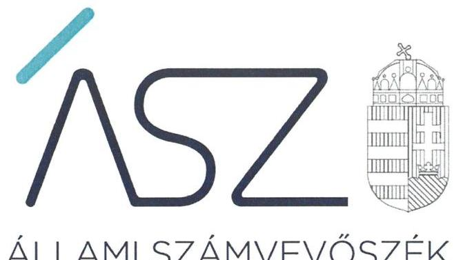
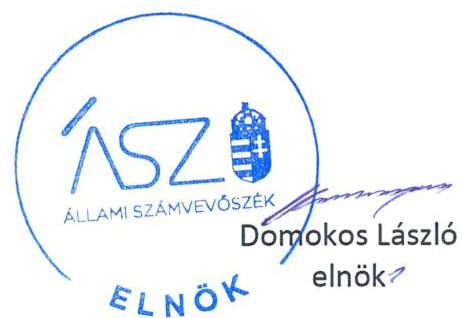
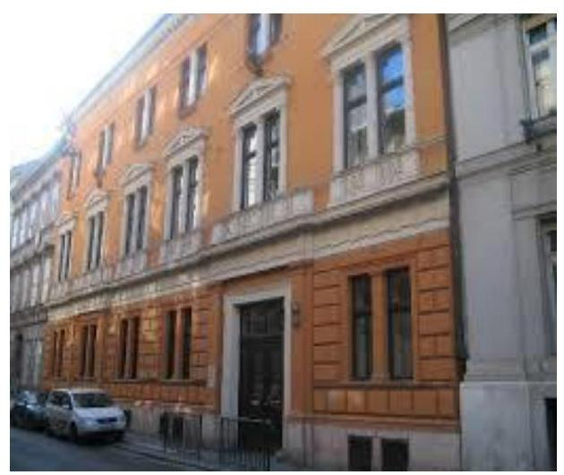

ÁLLAMI SZÁMVEVŐSZÉK

# JELENTÉS

## Az államháztartás központi alrendszere fejezeteinek ellenőrzése

A Magyar Tudományos Akadémia kutatóközpontjai és kutatóintézetei vagyongazdálkodásának ellenőrzése – MTA Rényi Alfréd Matematikai Kutatóintézet

2020.

20026
www.asz.hu

---

ÁLLAMI SZÁMVEVŐSZÉK

# JELENTÉS

Az államháztartás központi alrendszere fejezeteinek ellenőrzése

A Magyar Tudományos Akadémia kutatóközpontjai és kutatóintézetei vagyongazdálkodásának ellenőrzése – MTA Rényi Alfréd Matematikai Kutatóintézet

2020. 01. hó 24. nap

20026
www.asz.hu

---

# AZ ELLENŐRZÉST FELÜGYELTE: 

DR. NAGY IMRE felügyeleti vezető

## AZ ELLENŐRZÉST VEZETTE ÉS A VÉGREHAJTÁSÁÉRT FELELŐS:

ÁRPÁSI TIBOR ellenőrzésvezető

## A PROGRAM ÖSSZEÁLLÍTÁSÁÉRT FELELŐS:

## SZALAY NAGY JÁNOS projektvezető

IKTATÓSZÁM: EL-2424-001/2020.
TÉMASZÁM: 2517
ELLENŐRZÉS-AZONOSÍTÓ SZÁM: V086110

Jelentéseink az Országgyülés számítógépes hálózatán és az interneten a www.asz.hu címen is olvashatóak.

---

# TARTALOMJEGYZÉK 

■ ÖSSZEGZÉS ..... 5
■ AZ ELLENŐRZÉS CÉLJA ..... 6
■ AZ ELLENŐRZÉS TERÜLETE ..... 7
■ AZ ELLENŐRZÉS HÁTTERE, INDOKOLTSÁGA ..... 8
■ A JELENTÉS LÉNYEGES KÉRDÉSKÖREI ..... 9
■ AZ ELLENŐRZÉS HATÓKÖRE ÉS MÓDSZEREI ..... 10
■ MEGÁLLAPÍTÁSOK ..... 12
■ JAVASLATOK ..... 14
■ MELLÉKLETEK ..... 15
I. sz. melléklet: Fogalomtár ..... 15
■ FÜGGELÉKEK ..... 17
I. sz. függelék a jelentéshez ..... 17
II. sz. függelék: Észrevételek ..... 18
■ RÖVIDÍTÉSEK JEGYZÉKE ..... 23

---

.

---

# ÖSSZEGZÉS 

A Magyar Tudományos Akadémia Rényi Alfréd Matematikai Kutatóintézet a 2016., 2017. és 2018. években nem biztosította a közvagyonnal való felelős gazdálkodást, a vagyon megőrzésének és célszerű felhasználásának alapvető feltételeit, ami kockázatot jelentett kutatási közfeladatának ellátására.

## Az ellenőrzés társadalmi indokoltsága

Magyarország versenyképességének és a magyar gazdaság fejlődésének meghatározó tényezője a kutatás-fejlesztésre és az innovációra fordított hazai és uniós források eredményes, hatékony felhasználása. A magyar kutatás-fejlesztés területén kiemelt szerepet játszanak a központi költségvetésből biztosított támogatás felhasználásával működtetett, 2019. augusztus 31-ig a Magyar Tudományos Akadémia által irányított kutatóintézetek, kutatóközpontok. A Rényi Alfréd Matematikai Kutatóintézet a matematika területén végzett alap- és alkalmazott kutatásokat.

A kutatás-fejlesztési közfeladat eredményes ellátásának feltétele, hogy az ehhez szükséges eszközök a kutatási tevékenységet ténylegesen végző intézeteknél, központoknál rendelkezésre álljanak, továbbá ezekkel a közfeladatuk érdekében, átlátható és elszámoltatható módon, a vagyon megőrzését biztosítva gazdálkodjanak.

Az ellenőrzés indokoltságát erősítette, hogy jogszabályi változás nyomán 2019. szeptember 1-től a kutatóintézetek és kutatóközpontok irányítása az Eötvös Loránd Kutatási Hálózat Titkárságához került át, a kutatóintézetek és kutatóközpontok ezt követően központi költségvetési szervként működnek tovább. A magyar kutatás-fejlesztés szempontjából kiemelten fontos, hogy az új szervezeti keretek között induló kutatóhálózat életképessége, a közfeladatot szolgáló vagyon megőrzése biztosított legyen.

Az Állami Számvevőszék az ellenőrzési megállapításokon keresztül hozzájárul a közvagyon védelméhez és rámutat a közfeladatot ellátó kutatóhálózat működőképességére is kiható vagyongazdálkodás kockázataira.

## Főbb megállapítások, következtetések, javaslatok

Az MTA Rényi Alfréd Matematikai Kutatóintézet szervezeti és működési szabályzat hiányában nem alakította ki a szervezeti felépítését és működésének rendjét, nem határozta meg a vagyongazdálkodáshoz kapcsolódó feladat- és hatásköröket, a hatáskörök gyakorlásának módját, és az ezekhez kapcsolódó felelősségi szabályokat. Ezáltal nem teremtette meg a szabályszerű vagyongazdálkodáshoz szükséges alapvető szervezeti és szabályozási feltételeket.

Leltár hiányában nem volt biztosított, hogy a Kutatóintézet 2016., 2017. és 2018. évi beszámolójában szereplő tételek a valóságban is megtalálhatók, továbbá nem igazolt, hogy a közvagyonba tartozó kutatási eszközök rendelkezésre álltak a közfeladat ellátásához. Ezáltal a Kutatóintézet nem tett eleget a vagyon megőrzésére, védelmére előírt alapvető követelményeknek.

A Kutatóintézet igazgatójának a Kutatóintézet belső kontrollrendszerének minőségéről tett éves nyilatkozata nem állt összhangban az ellenőrzés megállapításaival, nem adott valós értékelést a gazdálkodás szabályszerűségét biztosító kontrollok kialakításáról és működéséről, így nem biztosította a szabálytalanságok feltárását és megszüntetését. Ezáltal az igazgatói nyilatkozat nem töltötte be a szerepét a kontrollrendszer hiányosságainak feltárásában és kijavításában, a felelős gazdálkodás erősítésében.

A közvagyon védelme és a közfeladat ellátása szempontjából elsődleges, hogy a Kutatóintézet intézkedjen a szabálytalanságok megszüntetéséről és a hiányosságok orvoslásáról annak érdekében, hogy helyreálljon a vagyongazdálkodás törvényessége és biztosított legyen a vagyon megőrzése.

---

# AZ ELLENŐRZÉS CÉLJA 

AZ ELLENŐRZÉS CÉLJA annak megállapítása volt, hogy az MTA ${ }^{1}$ kutatóközpontok és kutatóintézetek vagyongazdálkodása során érvényesült-e az átláthatóság és elszámoltathatóság.

---

# AZ ELLENŐRZÉS TERÜLETE 

## MTA Rényi Alfréd Matematikai Kutatóintézet

Az 1950-ben alapított MTA Rényi Alfréd Matematikai Kutatóintézet alaptevékenysége keretében nemzetközi szintű alap- és alkalmazott kutatásokat folytat a matematika különböző területein, összpontosítva olyan elméleti vizsgálatokra, amelyek egyfelől a matematika belső fejlődése, másrészt a matematikának más tudományokban és a társadalmi gyakorlatban való hatékony alkalmazása szempontjából jelentősek. Aktívan támogatja a matematika oktatását és a különböző szintű matematikai szakemberek képzését, valamint közreműködik más intézményeknél dolgozó matematikusok tudományos továbbképzésében, a matematikai kultúra általános fejlesztésében.

A Kutatóintézet ${ }^{2}$ egyéb feladatai keretében kutatási alaptevékenységével összefüggésben tudományos szak- és ismeretterjesztő kiadványokat jelentet meg, segíti a tudomány magyar nyelven való művelését, együttműködik a hazai kutatóközpontokkal, kutatóintézetekkel, velük közös kutatásokat folytat, kapcsolatokat tart fenn és létesít más országok tudományos intézményeivel, nemzetközi tudományos társaságokkal, elősegíti a magyar kutatások jelenlétét a nemzetközi tudományos életben, hazai és nemzetközi tudományos programokat és konferenciákat szervez, pályázatokat ír ki, segíti a tudományos kutatások eredményeinek társadalmi és gazdasági hasznosítását, a felsőoktatási intézményekkel együttműködve részt vesz az oktatómunkában, közös kutatási, képzési és továbbképzési feladatokat lát el, továbbá országos matematikai szakkönyvtárat működtet.

A Kutatóintézet az ellenőrzött időszakban önálló jogi személy, saját költségvetéssel és gazdasági szervezettel rendelkező köztestületi költségvetési szerv volt, amely felett az irányítási jogot a Magyar Tudományos Akadémia gyakorolta. Az MTA elnöke által kinevezett igazgató személye az ellenőrzött időszakban nem változott.

A Kutatóintézet tevékenységét az MTA-val 2015-ben megkötött Ingatlanhasználati szerződés ${ }^{3}$ és 260,6 MFt értékű tárgyi eszközt magába foglaló Ingóvagyon-használati szerződés ${ }^{4}$ alapján MTA tulajdonú, valamint saját eszközökkel végezte. A Kutatóintézet éves költségvetési beszámolóiban kimutatott, feladatai ellátásához használt befektetett eszközeinek értéke 2016. évben 398,4 MFt, 2017. évben 482,3 MFt, míg 2018. évben 480,1 MFt volt. A Kutatóintézet az ellenőrzött időszakban vagyonkezelési szerződéssel, vagyonkezelésbe vett vagyonelemekkel, gazdasági társaságban részesedéssel nem rendelkezett.

Az MTA a használatra átadott vagyon feletti rendelkezési jogot megtartotta, az eszközök használatával kapcsolatos feladatokat és a költségek viselését továbbadta a Kutatóintézetnek. Az MTA és a Kutatóintézet közötti használati szerződés alapján a Kutatóintézet volt köteles gondoskodni az eszközök állagmegóvásáról, továbbá viselni az eszközök működtetésével összefüggő üzemeltetési, fenntartási és javítási költségeket.

---

# AZ ELLENŐRZÉS HÁTTERE, INDOKOLTSÁGA 

Az ÁSZ ${ }^{5}$ ellenőrzi az éves költségvetési törvény végrehajtását, az ellenőrzés során feltárt kockázatok és a terület folyamatos értékelésével beazonosított kockázatok kezelése érdekében ellenőrzi többek között a költségvetési szervek gazdálkodását, működését, hogy az ellenőrzések megállapításaival támogassa az ellenőrzött szervezetek szabályszerű gazdálkodását, javaslataival elősegítse az Alaptörvényben megfogalmazott alapelvek érvényesülését a mindennapi életben a szervezetek szintjén. Az ÁSZ megállapításaival elősegíti az ellenőrzöttek közpénzekkel való felelős gazdálkodását, illetve az újszerű megközelítésű ellenőrzéssel hozzájárul az értékteremtő rend kialakításához és megőrzéséhez.

Az ellenőrzés a vagyongazdálkodásra fókuszál.
Az ellenőrzés következtében várhatóan reális kép alakítható ki a vagyongazdálkodás szabályszerűségéről. Az ellenőrzés megállapításai, javaslatai alapján javulhat a kutatóhálózat működésének szabályszerűsége, a kutatásokra fordított közpénzek felhasználásának átláthatósága, a tudomány eredményeinek hasznosulása, hozzájárulva ezzel a „jól irányított állam" működéséhez.

---

# A JELENTÉS LÉNYEGES KÉRDÉSKÖREI 

1. Az MTA Rényi Alfréd Matematikai Kutatóintézet vagyongazdálkodására vonatkozó alapvető szabályozása szabályszerű volt-e?
2. Az MTA Rényi Alfréd Matematikai Kutatóintézet vagyongazdálkodása során biztosított volt-e a vagyon megőrzése?

---

# AZ ELLENŐRZÉS HATÓKÖRE ÉS MÓDSZEREI 

## Az ellenőrzés típusa

Megfelelőségi ellenőrzés.

## Az ellenőrzött időszak

Az ellenőrzött időszak a 2016., 2017. és 2018. évek.

## Az ellenőrzés tárgya

Az MTA Rényi Alfréd Matematikai Kutatóintézet vagyongazdálkodásának ellenőrzése.

## Az ellenőrzött szervezet

MTA Rényi Alfréd Matematikai Kutatóintézet

## Az ellenőrzés jogalapja

Az ellenőrzés jogszabályi alapját az ÁSZ tv. ${ }^{6} 1 . \S$ (3) bekezdése és 5. § (2)(4) és (6) bekezdései, valamint az Áht. ${ }^{7} 61 . \S$ (2) bekezdésének előírásai képezték.

## Az ellenőrzés módszerei

Az ÁSZ az ellenőrzést a szakmai program szempontjai, az ellenőrzött időszakban hatályos jogszabályok, az ellenőrzés szakmai szabályai, a jelen ellenőrzésre irányadó ÁSZ módszertanok figyelembevételével végezte.

Az ellenőrzés ideje alatt az ellenőrzött szervezettel történő kapcsolattartást az ÁSZ Szervezeti és Működési Szabályzatának vonatkozó előírásai alapján biztosította az ÁSZ.

Az ellenőrzési kérdések megválaszolásához szükséges bizonyítékok megszerzése az ellenőrzött által rendelkezésre bocsátott dokumentumokra, adatokra alapozva megfigyelés, szemle (szemrevételezés), kérdésfeltevés (információkérés), valamint elemző eljárás útján történt. Az ellenőrzési bizonyítékként felhasználható adatforrások közé tartoztak egyrészt az ellenőrzési program részletes szempontjainál felsorolt adatforrások, másrészt minden egyéb - az ellenőrzés folyamán feltárt, az ellenőrzés

---

szempontjából információt tartalmazó - dokumentum. Az ellenőrzés lefolytatásához az ellenőrzött szervezet az ÁSZ által kért dokumentumok megküldésével szolgáltatott adatokat, amelyek valódiságát és teljes körűségét az adatszolgáltató szervezet vezetője által tett teljességi és hitelességi nyilatkozat igazolta. Az így rendelkezésre bocsátott adatok, információk kontrollja az ellenőrzés keretében történt.

Amennyiben az ellenőrzött szervezet vagyongazdálkodását alapvetően meghatározó dokumentum hiánya miatt valamely lényeges kérdéskörre vonatkozóan az ÁSZ megállapítást tett, további ellenőrzési tevékenységek az adott kérdéskörrel és az azzal szoros logikai kapcsolatban lévő kérdéskörökkel - ráépülő jelleggel - nem kerültek végrehajtásra.

---

# 1. Az MTA Rényi Alfréd Matematikai Kutatóintézet vagyongazdálkodására vonatkozó alapvető szabályozása szabályszerű volt-e? 

Összegző megállapítás

Az MTA Rényi Alfréd Matematikai Kutatóintézet vagyongazdálkodására vonatkozó alapvető szabályozása a 2016-2018. években nem volt szabályszerű.

A Kutatóintézet belső szabályozási rendszerének kialakítása nem volt szabályszerű 2016-2018-ban, mivel az Áht. 10. § (5) bekezdésében rögzítettek ellenére a szervezetét, feladatai ellátásának részletes belső rendjét és módját szervezeti és működési szabályzatban nem állapították meg.

A Kutatóintézet gazdálkodására vonatkozó szabályozás 2016. január 1. és 2016. március 30. között nem felelt meg az előírásoknak, mivel a Számv. tv. ${ }^{8}$ 14. § (3) bekezdése és az Áhsz. ${ }^{9}$ 50. § (1) bekezdése ellenére nem rendelkezett számviteli politikával. A Kutatóintézet 2016. március 31. és 2018. március 29. között Számviteli politikájában ${ }_{1,2}{ }^{10}$ a Számv. tv. 14. § (4) bekezdésében előírtak ellenére nem rögzítette azokat a jellemző szabályokat, előírásokat, módszereket, amelyekkel meghatározza, hogy mit tekint a számviteli elszámolás, az értékelés szempontjából kivételes nagyságú vagy előfordulású bevételnek, költségnek, ráfordításnak. A Számviteli politika ${ }_{3}$ tartalma 2018. március 30-tól összhangban állt a jogszabályi előírásokkal.

A Kutatóintézet Leltározási szabályzata ${ }_{1-3}{ }^{11}$ az Áhsz. 22. § (2) bekezdés b) pontjában foglaltakkal ellentétben nem határozta meg a használt, de a mérlegben értékkel nem szereplő immateriális javak, tárgyi eszközök, készletek leltározásának módját az ellenőrzött időszakban.

Az ÁSZ ellenőrzése az alapvető szabályozási hiányosságok miatt nem igazolta vissza a Kutatóintézet igazgatójának a 2016-2018. évekre vonatkozóan a belső kontrollrendszer kialakításáról, szabályszerű, eredményes, gazdaságos és hatékony működéséről a Bkr. ${ }^{12}$ előírása szerint tett vezetői nyilatkozataiban foglaltakat.

## 2. Az MTA Rényi Alfréd Matematikai Kutatóintézet vagyongazdálkodása során biztosított volt-e a vagyon megőrzése?

Összegző megállapítás

Az MTA Rényi Alfréd Matematikai Kutatóintézet vagyongazdálkodása a 2016-2018. években nem volt szabályszerű.

A Kutatóintézet a 2016-2018. években az éves költségvetési beszámolók mérlegtételeit a Számv. tv. 69. § (1) bekezdésében foglaltak és az Áhsz.
 22. § (1) bekezdése előírásainak ellenére - a mérleg fordulónapján

---

meglévő eszközöket és forrásokat mennyiségben és értékben tételesen, ellenőrizhető módon tartalmazó - leltárral nem támasztotta alá, mivel az immateriális javak és tárgyi eszközök tételes leltárait nem állította össze.

---

# JAVASLATOK 

Az ÁSZ tv. 33. § (1) bekezdésében foglaltak értelmében az ellenőrzött szervezet vezetője köteles a jelentésben foglalt megállapításokhoz kapcsolódó intézkedési tervet összeállítani és azt a jelentés kézhezvételétől számított 30 napon belül az ÁSZ részére megküldeni. Amennyiben az ellenőrzött szervezet vezetője nem küldi meg határidőben az intézkedési tervet, vagy továbbra sem elfogadható intézkedési tervet küld, az Állami Számvevőszék elnöke az ÁSZ tv. 33. § (3) bekezdés a) és b) pontjaiban foglaltakat érvényesítheti.

## Rényi Alfréd Matematikai Kutatóintézet igazgatója

1. Intézkedjen a szervezeti és működési szabályzat elkészítéséről a jogszabályi előírásnak megfelelően.
(1. sz. megállapítás 1. bekezdése alapján)
2. Intézkedjen a leltározási szabályzat jogszabályi előírásnak megfelelő kiegészítéséről.
(1. sz. megállapítás 3. bekezdése alapján)
3. Intézkedjen a jogszabályi előírásoknak megfelelően minden évben a mérleg tételeit alátámasztó leltár összeállításáról.
(2. sz. megállapítás 1. bekezdése alapján)

---

# MELLÉKLETEK 

- I. SZ. MELLÉKLET: FOGALOMTÁR
állami vagyon
állami vagyon használója
állami vagyon kezelője /vagyonkezelő
hasznosítás
közfeladat
köztestület

MTA kutatóhálózat

Állami vagyonnak minősül:
a) az állam tulajdonában lévő dolog, valamint a dolog módjára hasznosítható természeti erő,
b) az a) pont hatálya alá nem tartozó mindazon vagyon, amely vonatkozásában törvény az állam kizárólagos tulajdonjogát nevesíti,
c) az állam tulajdonában lévő tagsági jogviszonyt megtestesítő értékpapír, illetve az államot megillető egyéb társasági részesedés,
d) az államot megillető olyan immateriális, vagyoni értékkel rendelkező jogosultság, amelyet jogszabály vagyoni értékű jogként nevesít. (Forrás: Vtv. ${ }^{13}$ 1. § (2) bekezdése)
az a természetes vagy jogi személy, jogi személyiséggel nem rendelkező szervezet, aki, vagy amely törvény vagy szerződés alapján, bármely jogcímen (bérlet, haszonbérlet, használat stb.) állami vagyont birtokol, használ, szedi annak hasznait, hasznosít, ide nem értve a haszonélvezőt, a vagyonkezelőt és a tulajdonosi jogok gyakorlóját (Forrás: Vtvr. ${ }^{14}$ 1. § (7) bekezdés a) pont, hatályos 2012. január 1-jétől)
Az állami vagyont az MNV Zrt. ${ }^{15}$ maga kezeli, vagy szerződés - így különösen bérlet, haszonbérlet, megbízás - alapján központi költségvetési szervnek, természetes vagy jogi személynek, vagy jogi személyiséggel nem rendelkező gazdálkodó szervezetnek hasznosításra átengedi." Az állami vagyonra vonatkozóan az MNV Zrt. kizárólag az Nvtv ${ }^{16}$-ben meghatározott személyekkel köthet vagyonkezelési szerződést. (Forrás: Vtv. 27. § (1) bekezdése, hatályos 2012. január 1-jétől)
az állami vagyon bármely - a tulajdonjog átruházását nem eredményező - módon, jogcímen történő átadása, átengedése, ide nem értve a haszonélvezeti jog létesítését, valamint a vagyonkezelésbe adást (Forrás: Vtvr. 1. § (7) bekezdés e) pont, hatályos 2012. január 1-jétől);
Jogszabályban meghatározott állami vagy önkormányzati feladat, amit az arra kötelezett közérdekből, a jogszabályban meghatározott követelményeknek és feltételeknek megfelelve végez, ideértve a lakosság közszolgáltatásokkal való ellátását, továbbá az állam nemzetközi szerződésekben vállalt kötelezettségeiből adódó közérdekű feladatokat, valamint e feladatok ellátásakor szükséges infrastruktúra biztosítását is. (Forrás: Nvtv. 3. § (1) bekezdés 7. pontja).
A köztestület önkormányzattal és nyilvántartott tagsággal rendelkező szervezet, amelynek létrehozását törvény rendeli el. A köztestület a tagságához, illetve a tagsága által végzett tevékenységhez kapcsolódó közfeladatot lát el. A köztestület jogi személy. Köztestület különösen a Magyar Tudományos Akadémia. (Forrás: 2006. évi LXV. törvény ${ }^{17}$ 8/A. § (1)-(2) bekezdés).
AZ MTA feladatainak ellátása céljából közfinanszírozású kutatóhálózatot létesít és működtet, amely felett irányítási jogot gyakorol. (forrás: MTAtv. ${ }^{18}$ 2. § (1) bekezdés, hatályos 2019. augusztus 31-ig)
Az MTA kutatóhálózata 10 kutatóközpontból és bennük 38 intézetből, 5 önálló jogállású kutatóintézetből, 96 akadémiai támogatású egyetemi, illetve közgyűjteményekben létesített kutatócsoportból, valamint 95 Lendület-kutatócsoportból (együttesen: kutatóhely) áll.

---

MTA Kutatóközpont

Az akadémiai kutatóközpont költségvetési szerv. A kutatóközpont autonóm módon vesz részt az Akadémia közfeladatainak megoldásában, önállóan is vállal közfeladatokat, továbbá egyéb tevékenységet is végezhet. Tudományos tevékenységéről és gazdálkodásáról évente beszámolót készít, amelyet az Akadémia az e törvényben és az Alapszabályban leírtak szerint értékel. (forrás: MTAtv. 18. § (1) bekezdés, hatályos 2019. augusztus 31-ig)

---

# FÜGGELÉKEK 

- I. SZ. FÜGGELÉK A JELENTÉSHEZ

Az Állami Számvevőszék az ellenőrzések során feltárt tényekhez kapcsolódó további körülmények tisztázására eszközrendszerrel nem rendelkezik. Amennyiben az ellenőrzésen túlmutatóan indokoltnak látszik az ellenőrzés során feltárt körülmények további vizsgálata, az Állami Számvevőszék törvényi felhatalmazás alapján az ellenőrzés által feltárt körülményeket továbbítja a hatáskörrel rendelkező szervnek a szükséges intézkedések megtétele, eljárások lefolytatása érdekében.
I.

Az MTA Rényi Alfréd Matematikai Kutatóintézet a 2016-2018. évi éves költségvetési beszámolói mérlegtételeit nem támasztotta alá leltárral, amely tételesen, ellenőrizhető módon tartalmazza a mérlegfordulónapján meglévő eszközöket és forrásokat mennyiségben és értékben. Ezzel megsértette az Áhsz. 5. § (1) bekezdésében és 22. § (1) bekezdésében, valamint a Számv. tv. 69. § (1) bekezdésében előírtakat.
Leltár hiányában nem igazolt, hogy a 2016-2018. évi éves költségvetési beszámolók mérlegében szereplő tételek a valóságban is megtalálhatóak, továbbá nem igazolt, hogy az eszközeit és forrásait a feladatkörébe tartozó feladatra használta fel. Ezért felmerül a gyanú, hogy az MTA Rényi Alfréd Matematikai Kutatóintézetet vagyoni hátrány érhette.
Az eset körülményeinek felderítésére a nyomozó hatóság rendelkezik hatáskörrel.
II.

A fentiekben rögzített, leltárra vonatkozó hiányosságok miatt nem igazolt, hogy a 2016-2018. évi éves költségvetési beszámolók megbízható, valós összképet mutatnak az MTA Rényi Alfréd Matematikai Kutatóintézet vagyonáról, annak összetételéről.
Az eset teljes körű feltárására a Nemzeti Adó- és Vámhivatal rendelkezik hatáskörrel.

---

A jelentéstervezetet a Számvevőszék 15 napos észrevételezésre megküldte az ellenőrzött szervezet vezetőjének az ÁSZ tv. 29. § (1) bekezdése előírásának megfelelően.

A Rényi Alfréd Matematikai Kutatóintézet igazgatója a jelentéstervezet megállapításaira írásban észrevételt tett.
Az ÁSZ tv. 29. § (3) bekezdésével összhangban az ÁSZ a Függelékben feltünteti az ellenőrzés megállapításaival kapcsolatban tett, figyelembe nem vett észrevételeket, és megindokolja, hogy azokat miért nem fogadta el.

[^0]
[^0]:    * 29. § (1) Az Állami Számvevőszék az ellenőrzési megállapításait megküldi az ellenőrzött szervezet vezetőjének vagy az általa megbízott személynek, és annak, akinek személyes felelősségét állapította meg.
    (2) Az ellenőrzött szervezet vezetője és a felelősként megjelölt személy az ellenőrzés megállapításaira tizenöt napon belül írásban észrevételt tehet.
    (3) Az Állami Számvevőszék az észrevételre a beérkezésétől számított harminc napon belül írásban válaszol. A figyelembe nem vett észrevételeket köteles a jelentésben feltüntetni, és megindokolni, hogy azokat miért nem fogadta el.

---

„Az államháztartás központi alrendszere fejezeteinek ellenőrzése - A Magyar Tudományos Akadémia kutatóközpontjai és kutatóintézetei vagyongazdálkodásának ellenőrzése - MTA Rényi Alfréd Matematikai Kutatóintézet" címmel készített számvevőszéki jelentéstervezet megállapításaival kapcsolatban az igazgató által 2019. december 20-án tett (az Állami Számvevőszékhez 2020. január 2-án érkezett) el nem fogadott észrevételek és azok kezelésének indokolása.

# A jelentéstervezet 1. számú összegző megállapítás 1. bekezdésével és az 1. számú javaslattal kapcsolatos észrevétel 

A Kutatóintézet igazgatója észrevételében jelezte, hogy a vizsgált időszakban nem volt a fenntartó által jóváhagyott szervezeti és működési szabályzata (továbbiakban: SZMSZ) a Kutatóintézetnek, ezzel szemben mindig rendelkeztek a felügyeleti szervhez benyújtott, jóváhagyásra váró SZMSZ-szel, és a felügyeleti szerv jóváhagyásával ezekben az időszakokban az ezen SZMSZ-ben foglaltak szerint működtek. A fenntartói fórumok által még véglegesen jóvá nem hagyott SZMSZ rendelkezései a gyakorlatban belső alkalmazásra kerültek, valamint a hatályos jogszabályok és a Kutatóintézet szabályzatai voltak hatályba léptetve és alkalmazva. Az igazgató tájékoztatást adott arról, hogy 2019-ben a Kutatóintézet SZMSZ-e megújításra és a fenntartó által jóváhagyásra is került. A jóváhagyott dokumentumot észrevételéhez melléklete. Az észrevételhez csatolt SZMSZ-re tekintettel az igazgató kéri törölni a jelentéstervezet 1. számú javaslatát.

Az ÁSZ az EL-1621-001/2019. iktatószámú adatbekérő levele 3. számú mellékletének I.1. pontjában bekérte a Kutatóintézet 2016. január 1. és 2018. december 31. közötti időszakban hatályban lévő SZMSZ-eit. Az ehhez kapcsolódó dokumentumokat az igazgató 2019. július 17-én kelt nyilatkozata szerint az ÁSZ rendelkezésére bocsátotta. Az ÁSZ rendelkezésére bocsátott dokumentumok ismételt felülvizsgálata megerősítette, hogy azok nem tartalmazzák a Magyar Tudományos Akadémia, mint a Kutatóintézet irányító szervének jóváhagyását, továbbá ezen jóváhagyásokat az ÁSZ rendelkezésére bocsátott további dokumentumok sem igazolják. Ezen tényt az igazgató észrevételében is elismeri. Az adatbekérés során az ÁSZ rendelkezésére bocsátott 'rényi-szervezeti és működési szabályzat 2010.pdf' elnevezésű dokumentum nem tartalmazza az irányító szervi jóváhagyáson kívül a kiadmányozó igazgató aláírását sem.

Az ÁSZ megállapításait az ÁSZ felhívására - az ÁSZ tv. 28. § (2) bekezdésben meghatározott adatszolgáltatási időszakon belül megküldött és a teljességi és hitelességi nyilatkozatban szereplő dokumentumokra alapozza.

Mindezek alapján az észrevételt nem fogadjuk el, a jelentéstervezet módosítása nem indokolt.

## A jelentéstervezet 1. számú összegző megállapítás 2. bekezdés 1. mondatával kapcsolatos észrevétel

A Kutatóintézet igazgatója észrevételében jelezte, hogy a Kutatóintézet 2016. január 1. és 2016. március 30. közötti időszakban is rendelkezett hatályos számviteli politikával, amely 2014. március 31-től hatályos, 2015. január 6-án módosított szabályzat. Álláspontja szerint a beküldött 2015. évi számviteli politika módosítás két ponton utal arra, hogy egy hatályos szabályzat módosítása, ezért vélelmezhető volt, hogy 2016.01.01-től 2016.03.31. közötti időszakban is rendelkeztek hatályos számviteli politikával.

Az ÁSZ az EL-1621-001/2019. iktatószámú adatbekérő levele 3. számú mellékletének I.2. pontjában bekérte a Kutatóintézet 2016. január 1. és 2018. december 31 közötti időszakban hatályban lévő számviteli politikáit. Az ehhez kapcsolódó dokumentumokat az igazgató 2019. július 17-én kelt nyilatkozata szerint az ÁSZ rendelkezésére bocsátotta. Az ÁSZ rendelkezésére bocsátott dokumentumok ismételt felülvizsgálata megerősítette, hogy az nem számviteli politika, hanem a számviteli politikájának a mérlegkészítés időpontjára vonatkozó módosítása, amit az igazgató észrevételében is elismer. Jelzett időszakban hatályos kutatóintézeti számviteli politika meglétét az ÁSZ rendelkezésére bocsátott további dokumentumok sem igazolják.

Fentiek alapján a Kutatóintézet a Számv. tv. 14. § (3) bekezdése és az Áhsz. 50. § (1) bekezdése ellenére nem rendelkezett számviteli politikával 2016. január 1. és 2016. március 30. között, így a gazdálkodására vonatkozó szabályozás ez alatt az időszak alatt nem felelt meg az előírásoknak.

---

Az ÁSZ megállapításait az ÁSZ felhívására - az ÁSZ tv. 28. § (2) bekezdésben meghatározott adatszolgáltatási időszakon belül megküldött és a teljességi és hitelességi nyilatkozatban szereplő dokumentumokra alapozza.

Mindezek alapján az észrevételt nem fogadjuk el, a jelentéstervezet módosítása nem indokolt.

# A jelentéstervezet 1. számú összegző megállapítás 2. bekezdés 2. mondatával kapcsolatos észrevétel 

A Kutatóintézet igazgatója észrevételében jelezte, hogy a Kutatóintézet a hivatkozott időszakban hatályos, 2016. március 31-én kiadott számviteli politikában rögzítette azokat a jellemző szabályokat, előírásokat, módszereket, amelyekkel meghatározta, hogy mit tekint a számviteli elszámolás és értékelés szempontjából lényegesnek, jelentősnek, nem lényegesnek, nem jelentősnek, de valóban nem tért ki a 2016. évi szabályozás arra, mit tekintenek „kivételes nagyságú" vagy „kivételes előfordulású" tételnek.

Az ÁSZ által bekért és az ÁSZ rendelkezésére bocsátott, 2016. március 31. és
 2018. március 29. között hatályos kutatóintézeti számviteli politikák ismételt felülvizsgálata során megállapításra került, hogy azok 2018. március 29-ig a Számv. tv. 14. § (4) bekezdés előírása ellenére nem rögzítették azokat a jellemző szabályokat, előírásokat, módszereket, amelyekkel meghatározza a Kutatóintézet, hogy mit tekint a számviteli elszámolás, az értékelés szempontjából kivételes nagyságú vagy előfordulású bevételnek, költségnek, ráfordításnak. Az igazgató ezt a tényt észrevételében megerősíti.

Mindezek alapján az észrevételt nem fogadjuk el, a jelentéstervezet módosítása nem indokolt.

## A jelentéstervezet 1. számú összegző megállapítás 3. bekezdésével és a 2. számú javaslattal kapcsolatos észrevétel

A Kutatóintézet igazgatójának észrevétele szerint az Áhsz. 22. § (2) bekezdés b) pontja nem rendelkezik arról, hogy a használt, de a mérlegben értékkel nem szereplő immateriális javakra, tárgyi eszközökre, készletekre más eszközökhöz képest eltérő leltározási módszert vagy módszereket kell a Leltározási szabályzatban rögzíteni. Álláspontja szerint továbbá az ellenőrzés rendelkezésére bocsátott Leltározási szabályzat több ponton is tartalmaz rendelkezéseket ezen eszközök leltározása tekintetében. Ilyen szabályozási helyek például a 9. oldal 4. bekezdése, 9. oldal utolsó bekezdése, 12. oldal 2.1. a) és b) és e) pontjai.

Az Áhsz. 22. § (2) bekezdés b) pontjában foglalt előírás szerint a leltározás végrehajtását az Számv. tv. 69. § (1)-(3), valamint (5) és (6) bekezdése szerint kell végrehajtani azzal, hogy a használt, de a mérlegben értékkel nem szereplő immateriális javakat, tárgyi eszközöket, készleteket a leltározási és leltárkészítési szabályzatban meghatározott módon kell leltározni. Az Áhsz. előírása egyértelműen kötelezi a költségvetési szervet arra, hogy a leltározási és leltárkészítési szabályzatában külön rögzítse a jelzett eszközcsoportokra vonatkozó leltározás szabályait.

Az ÁSZ az EL-1621-001/2019. iktatószámú adatbekérő levele 3. számú mellékletének I.3. pontjában bekérte a Kutatóintézet 2016. január 1. és 2018. december 31. közötti időszakban hatályban lévő eszközök és a források leltárkészítési és leltározási szabályzatait, amelyeket a Kutatóintézet igazgatója 2019. július 17-én kelt nyilatkozata szerint az ÁSZ rendelkezésére bocsátott.

Az ÁSZ rendelkezésére bocsátott leltárkészítési és leltározási szabályzatok ismételt felülvizsgálata megerősítette, hogy a Kutatóintézet 2016. január 1. és 2016. december 31. között hatályban lévő leltározási és leltárkészítési szabályzata az észrevételében hivatkozott pontokat nem tartalmazza, így ebben az időszakban nem rendelkezett a Kutatóintézet által használt, de a mérlegben értékkel nem szereplő immateriális javak, tárgyi eszközök, készletek leltározásának módjáról.

A Kutatóintézet 2016. december 11. és 2018. március 30., valamint 2018. március 31. és 2018. december 31. között hatályban lévő leltározási és leltárkészítési szabályzatainak észrevételben hivatkozott pontjai sem határozták meg a használt, de a mérlegben értékkel nem szereplő immateriális javak, tárgyi eszközök, készletek leltározásának módját. A szabályzatok hivatkozott 9. oldal 4. bekezdése „A leltározásra vonatkozó jogszabályi előírások" cím alatt a jogszabá-

---

lyi előírásokat mutatta be: megismételte a jogszabály előírását, de a használt, de a mérlegben értékkel nem szereplő immateriális javak, tárgyi eszközök, készletek leltározásának módját nem szabályozta. A szabályzatok további hivatkozott rendelkezései pedig nem a használt, de a mérlegben értékkel nem szereplő tételekre vonatkoztak, hanem a megszüntetés esetén követendő szabályokat, továbbá a kölcsönben és javításra adott, vagy használatból kivont, leírt eszközök nyilvántartására, leltározására, selejtezésére vonatkozó rendelkezéseket tartalmazták.

Fentiek alapján a Kutatóintézet a 2016. január 1. és 2018. december 31. közötti időszakban nem rögzítette szabályzataiban a használt, de a mérlegben értékkel nem szereplő immateriális javak, tárgyi eszközök, készletek leltározásának módját, ezért az észrevételt nem fogadjuk el, a jelentéstervezet módosítása nem indokolt.

# A jelentéstervezet 1. számú összegző megállapítás 4. bekezdésével kapcsolatos észrevétel 

A Kutatóintézet igazgatója észrevételében jelezte, hogy véleménye szerint a vizsgált időszakban a Kutatóintézet szabályozási rendszere nem szenvedett alapvető hiányosságoktól, a feltárt esetleges pontatlanságok és tartalmi hiányosságok nem voltak olyan súlyúak, hogy a Kutatóintézet belső kontrollrendszerét, a hatékony, gazdaságos és eredményes működését akadályozták volna. Kéri, az észrevételei alapján a fenti megállapításból az „alapvető" jelzőt törölni.

Az igazgató a Bkr. 11.§ (1) bekezdés előírása és a Bkr. 1. melléklet szerinti, az ÁSZ rendelkezésére bocsátott nyilatkozataiban értékelte a Kutatóintézet belső kontrollrendszere minőségét 2016-2018. évek vonatkozásában, bennük a Kutatóintézet kontrollkörnyezetét is. Az ÁSZ jelentéstervezet 1. sz. összegző megállapítás 1-3. bekezdéseiben szereplő, a Kutatóintézet kontrollkörnyezetének részét képező szabályozásokra (SZMSZ, számviteli politika, leltározási és leltárkészítési szabályzat) vonatkozó megállapításai jogszabályi előírások megsértését rögzítik. A hivatkozott dokumentumok kulcsfontosságúak, alapvető mértékben meghatározzák a szervezet vagyongazdálkodásának szabályosságát.

Mindezek alapján az észrevételt nem fogadjuk el, a jelentéstervezet módosítása nem indokolt.

## A jelentéstervezet 2. számú összegző megállapítás 1. bekezdésével és a 3. számú javaslattal kapcsolatos észrevétel

A Kutatóintézet igazgatója észrevételében jelezte, hogy a 2016-2018. évekre vonatkozó leltárdokumentációt az ÁSZ rendelkezésére bocsátották. Észrevételéhez tételes leltári listákat csatolt az immateriális javak, ingatlanok és a gépek, berendezések, felszerelések vonatkozásában.

Az ÁSZ megállapításait az ÁSZ felhívására - az ÁSZ tv. 28. § (2) bekezdésben meghatározott adatszolgáltatási időszakon belül megküldött és a teljességi és hitelességi nyilatkozatban szereplő dokumentumokra alapozza.

Az ÁSZ az EL-1621-001/2019. iktatószámú adatbekérő levele 3. számú mellékletének I.5. pontjában bekérte a Kutatóintézet 2016-2018. évi mérlegtételeit alátámasztó leltárakat, amiket Igazgató úr 2019. július 17-én kelt nyilatkozata szerint az ÁSZ rendelkezésére bocsátott.

A Számv. tv. 69. § (1) bekezdése előírja, hogy a könyvek üzleti év végi zárásához, a beszámoló elkészítéséhez, a mérleg tételeinek alátámasztásához olyan leltárt kell összeállítani és e törvény előírásai szerint megőrizni, amely tételesen, ellenőrizhető módon tartalmazza a Kutatóintézet mérleg fordulónapján meglévő eszközeit és forrásait mennyiségben és értékben. Az Áhsz. 22. § (1) bekezdése előírja, hogy az éves költségvetési beszámoló elkészítéséhez, a mérleg tételeinek alátámasztásához olyan leltárt kell összeállítani és megőrizni, amely tételesen, ellenőrizhető módon tartalmazza a mérlegben szereplő eszközöket és forrásokat.

Az ÁSZ rendelkezésére bocsátott, Igazgató úr 2019. július 17-én kelt nyilatkozatában szereplő 2016-2018. évi leltározási dokumentumok (nyilatkozat melléklet dokumentumjegyzékének 7-10. pontjaiban szereplő dokumentumok) ismételt felülvizsgálata megerősítette, hogy azok nem tartalmazzák a mérleg fordulónapján meglévő immateriális javak és tárgyi eszközök tételes leltárát mennyiségben és értékben. A Kutatóintézet igazgatója által hivatkozott dokumentumok a jelentéstervezet megállapításában szereplő eszközcsoportok vonatkozásában kizárólag a főkönyvi számlák

---

és az analitikus nyilvántartás összesített adatainak egyeztetését tartalmazzák, a mérleg fordulónapjára vonatkozó analitikus nyilvántartásokat nem küldték meg. Ezek hiányában nem igazolta olyan leltár készítését, amely tételesen, ellenőrizhető módon tartalmazza a Kutatóintézet mérleg fordulónapján meglévő eszközeit és forrásait mennyiségben és értékben.

Mindezek alapján az észrevételt nem fogadjuk el, az ÁSZ megállapítása helytálló, a jelentéstervezet módosítása nem indokolt.

---

# RÖVIDÍTÉSEK JEGYZÉKE 

${ }^{1}$ MTA
${ }^{2}$ Kutatóintézet
${ }^{3}$ Ingatlanhasználati szerződés
${ }^{4}$ Ingóvagyon-használati szerződés
${ }^{5}$ ÁSZ
${ }^{6}$ ÁSZ tv.
${ }^{7}$ Áht.
${ }^{8}$ Számv.tv.
${ }^{9}$ Áhsz.
${ }^{10}$ Számviteli politika $1-3$
${ }^{11}$ Leltározási szabályzat ${ }_{1-3}$
${ }^{12}$ Bkr.
${ }^{13} \mathrm{Vtv}$.
${ }^{14} \mathrm{Vtvr}$.
${ }^{15}$ MNV Zrt.
${ }^{16} \mathrm{Nvtv}$.
${ }^{17}$ 2006. évi LXV. törvény
${ }^{18}$ MTAtv.

Magyar Tudományos Akadémia
Magyar Tudományos Akadémia Rényi Alfréd Matematikai Kutatóintézet
Ingatlanhasználati szerződés az MTA tulajdonát képező ingatlanok használatáról (kelt: 2015. szeptember 14.)
Ingóvagyon-használati szerződés az MTA tulajdonát képező ingó vagyontárgyak használatáról (kelt: 2015. szeptember 14.)
Állami Számvevőszék
2011. évi LXVI. törvény az Állami Számvevőszékről (hatályos: 2011. július 1-től)
2011. évi CXCV. törvény az államháztartásról (hatályos: 2012. január 1-től)
2000. évi C. törvény a számvitelről
4/2013. (I.11.) Korm. rendelet az államháztartás számviteléről (hatályos: 2014. január 1-től)
MTA Rényi Alfréd Matematikai Kutatóintézet Számviteli politika
Számviteli politika1 (hatályos: 2016. március 31-től)
Számviteli politika2 (hatályos: 2017. március 30-tól)
Számviteli politika3 (hatályos: 2018. március 30-tól)
MTA Rényi Alfréd Matematikai Kutatóintézet Leltározási és leltárkészítési szabályzat szabályzat1 (hatályos: 2012. január 1-től)
szabályzat2 (hatályos: 2016. december 1-től)
szabályzat3 (hatályos: 2018. március 31-től)
370/2011. (XII. 31.) Korm. rendelet a költségvetési szervek belső
kontrollrendszeréről és belső ellenőrzéséről (hatályos: 2012. január 1-től)
2007. évi CVI. törvény az állami vagyonról (hatályos: 2007. szeptember 15-től)
254/2007. (X. 4.) Korm. rendelet az állami vagyonnal való gazdálkodásról (hatályos: 2007. október 4-től)
Magyar Nemzeti Vagyonkezelő Zrt.
2011. évi CXCVI. törvény a nemzeti vagyonról (hatályos: 2011. december 31-től)
2006. évi LXV. törvény az államháztartásról szóló 1992. évi XXXVIII. törvény és egyes kapcsolódó törvények módosításáról (hatályos: 2012. augusztus 24-től)
1994. évi XL. törvény a Magyar Tudományos Akadémiáról (hatályos: 1994. június 30-tól)

---

# ÁSZ 

ÁLLAMI SZÁMVEVŐSZÉK
1052 Budapest, Apáczai Cs. J. u. 10. I 1364 Budapest 4. Pf. 54
TEL: +36 14849100
email: szamvevoszek@asz.hu
web: www.asz.hu | www.aszhirportal.hu
