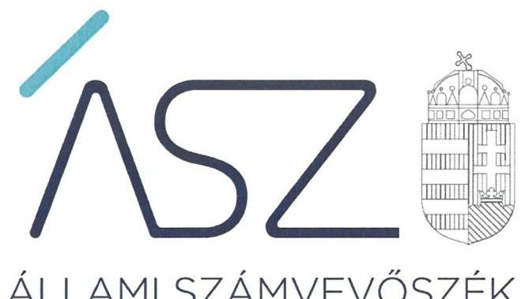
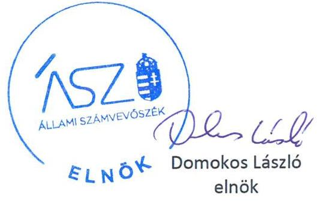
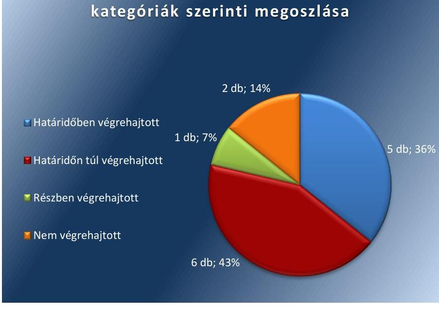

ÁLLAMI SZÁMVEVŐSZÉK

# JELENTÉS 

## Utóellenőrzések

Az állami tulajdonban lévő gazdálkodó szervezetek vagyonmegőrzési és gazdálkodási tevékenységének utóellenőrzése - Nemzeti Fogyatékosságügyi- és Szociálpolitikai Központ Közhasznú Nonprofit Korlátolt Felelősségű Társaság

2020
20027
www.asz.hu

---

# JELENTÉS

## Utóellenőrzések

Az állami tulajdonban lévő gazdálkodó szervezetek vagyonmegőrzési és gazdálkodási tevékenységének utóellenőrzése - Nemzeti Fogyatékosságügyi- és Szociálpolitikai Központ Közhasznú Nonprofit Korlátolt Felelősségű Társaság

2020. 02. hó 26. nap

20027
www.asz.hu

---

# AZ ELLENŐRZÉST FELÜGYELTE: 

MAROZSÁN LÁSZLÓNÉ felügyeleti vezető

## AZ ELLENŐRZÉST VEZETTE ÉS A VÉGREHAJTÁSÁÉRT FELELŐS:

DR. NAGY JUDIT ellenőrzésvezető

## A PROGRAM ÖSSZEÁLLÍTÁSÁÉRT FELELŐS:

TÓTPÁL SZABOLCS osztályvezető

## A TÉMÁHOZ KAPCSOLÓDÓ KORÁBBI SZÁMVEVŐSZÉKI JELENTÉSEK:

- címe: Az állami tulajdonban (résztulajdonban) lévő gazdálkodó szervezetek vagyonmegőrzési és gazdálkodási tevékenységének ellenőrzéseFogyatékos Személyek Esélyegyenlőségéért Közhasznú Nonprofit Kft. 2016.
- sorszáma: 16145.

IKTATÓSZÁM: EL-2423-001/2020.
TÉMASZÁM: 2460
ELLENŐRZÉS-AZONOSÍTÓ SZÁM: V080464

---

# TARTALOMJEGYZÉK 

■ ÖSSZEGZÉS ..... 5
■ AZ ELLENŐRZÉS CÉLJA ..... 6
■ AZ ELLENŐRZÉS TERÜLETE ..... 7
■ AZ ELLENŐRZÉS HÁTTERE, INDOKOLTSÁGA ..... 8
■ A JELENTÉS LÉNYEGES KÉRDÉSKÖREI ..... 9
■ AZ ELLENŐRZÉS HATÓKÖRE ÉS MÓDSZEREI ..... 10
■ MEGÁLLAPÍTÁSOK ..... 12
■ MELLÉKLETEK ..... 15
I. sz. melléklet: Nemzeti Fogyatékosságügyi- és Szociálpolitikai Központ Közhasznú Nonprofit Kft. intézkedési terve végrehajtásának értékelése ..... 15
■ FÜGGELÉK: ÉSZREVÉTELEK ..... 19
■ RÖVIDÍTÉSEK JEGYZÉKE ..... 21

---

.

---

# ÖSSZEGZÉS 

Az Állami Számvevőszék a Nemzeti Fogyatékosságügyi- és Szociálpolitikai Központ Közhasznú Nonprofit Korlátolt Felelősségű Társaság utóellenőrzése során megállapította, hogy az intézkedési tervben vállalt feladatok végrehajtásának és a végre nem hajtott intézkedések együttes hatásaként a szabályozottság javult, azonban a közpénzzel való gazdálkodás területén továbbra is azonosítható kockázat.

## Az ellenőrzés társadalmi indokoltsága

Az Állami Számvevőszék stratégiájában célul tűzte ki a számvevőszéki munka hasznosulásának javítását. Ezzel összhangban ellenőrzi, hogy az ellenőrzött szervezetek megvalósították-e a korábbi ellenőrzései által feltárt hibák, hiányosságok és szabálytalanságok megszüntetése céljából elkészített intézkedési tervekben foglaltakat. A rendszeres utóellenőrzések hozzájárulnak a szükséges intézkedések tényleges végrehajtáshoz, ezáltal a közpénzügyek rendezettségének javulásához.

## Főbb megállapítások, következtetések, javaslatok

A Nemzeti Fogyatékosságügyi- és Szociálpolitikai Központ Közhasznú Nonprofit Korlátolt Felelősségű Társaság az Állami Számvevőszék intézkedést igénylő megállapításai alapján készített intézkedési tervének tizenkét pontjában tizennégy végrehajtandó feladatot határozott meg, amelyből öt feladatot határidőben végrehajtott, hat feladatot határidőn túl hajtott végre, egy feladatot részben, két feladatot nem hajtott végre.

A Nemzeti Fogyatékosságügyi- és Szociálpolitikai Központ Közhasznú Nonprofit Korlátolt Felelősségű Társaság hatályba helyezte az önköltségszámítás rendjére, a közérdekű adatok megismerésére irányuló igények teljesítésének rendjére, valamint az adatvédelemre, adatbiztonságra vonatkozó szabályzatait. Ezért a szabályozottság területén a kockázatok csökkentek.

A pénzügyi gazdálkodása továbbra is kockázatot hordoz, tekintettel arra, hogy a Társaság nem rendelkezik a Számviteli törvény szerint számlarenddel és nem készítették el az önköltségszámítás rendjét szabályozó szabályzatban előírt, önköltségre vonatkozó kalkulációkat.

---

# AZ ELLENŐRZÉS CÉLJA 

Az ellenőrzés célja annak értékelése volt, hogy a számvevőszéki jelentésben ${ }^{1}$ foglalt, intézkedéseket igénylő megállapításokkal összhangban készített intézkedési tervben meghatározott feladatokat az ellenőrzött szervezet vég-rehajtotta-e.

---

# AZ ELLENŐRZÉS TERÜLETE 

## Nemzeti Fogyatékosságügyi- és Szociálpolitikai Központ Közhasznú Nonprofit Kft.

A Fogyatékos Személyek Esélyegyenlőségéért Közhasznú Nonprofit Kft amelynek elnevezése 2019. augusztus 3-tól Nemzeti Fogyatékosságügyi- és Szociálpolitikai Központ Közhasznú Nonprofit Kft.-re módosult, a Magyar Állam 100\%-os tulajdonában álló gazdasági társaság, alapítását Korm. határozat ${ }^{2}$ rendelte el. Fő tevékenysége társadalomtudományi, humán kutatás, fejlesztés. Közhasznú tevékenységként végez rehabilitációs, szociális szolgáltatások nyújtását, köznevelési intézmények szakmai támogatását autizmus témában. A közhasznúsági fokozat, illetve jogállás megszerzésének dátuma: 2012. január 12.

A tulajdonosi jogokat 2018. július 1-ig az MNV Zrt. ${ }^{3}$, majd azt követően az $\mathrm{EMMI}^{4}$ gyakorolta. A Társaság ${ }^{5}$ a Kormányzati szektorba sorolt egyéb szervezet ${ }^{6}$-nek minősül.

Az Ügyvezető ${ }^{7}$ személye az utóellenőrzéssel érintett időszakban 2018. június 14.-én változott.

Az ÁSZ ${ }^{8}$ a 2016. évben ellenőrizte a Társaság vagyonmegőrzési és gazdálkodási tevékenységét, a 2011. január 1. és 2014. december 31. közötti időszakra vonatkozóan. Az ellenőrzés célja annak értékelése volt, hogy a Társaság által ellátott feladatok bevételei, ráfordításai elszámolásának és vagyongazdálkodási tevékenységének szabályozása megfelelt-e a jogszabályi előírásoknak, és azok végrehajtása szabályszerű volt-e; a vagyonváltozást eredményező döntések esetében a tulajdonosi jogok gyakorlója és a gazdálkodó szervezet szabályszerűen jártak-e el; a gazdálkodó szervezet épített-e ki és működtetett-e információs rendszert a szabályszerű vagyongazdálkodás érdekében. Az ellenőrzés célja volt továbbá annak értékelése is, hogy a kormányzati szektorba sorolt egyéb szervezetek gazdálkodásának a kormányzati szektor hiányára és az államadósságra befolyással bíró elemei a jogszabályi előírásoknak megfeleltek-e. Az erről szóló 16145. számú számvevőszéki jelentést az ÁSZ 2016. szeptember 15-én hozta nyilvánosságra.

Az utóellenőrzés a számvevőszéki jelentésben megfogalmazott intézkedést igénylő megállapításokra és javaslatokra készített intézkedési terv ${ }^{9}$ ben foglalt feladatok végrehajtásának ellenőrzésére, értékelésére irányult.

---

# AZ ELLENŐRZÉS HÁTTERE, INDOKOLTSÁGA 

Az ÁSZ tv. ${ }^{10}$ 33. § (1) bekezdése értelmében a számvevőszéki jelentések intézkedést igénylő megállapításaihoz és javaslataihoz kapcsolódóan az ellenőrzött szervezetek vezetője intézkedési tervet köteles összeállítani, és az Állami Számvevőszék részére megküldeni.

Az ÁSZ által befogadott intézkedési tervben foglaltak megvalósítását - az ÁSZ tv. 33. § (7) bekezdésében foglaltak alapján - az Állami Számvevőszék utóellenőrzés keretében ellenőrizheti. Az utóellenőrzések keretében - az intézkedések értékelése során - az Állami Számvevőszék figyelembe veszi az ellenőrzött szervezetek működési feltételeiben, valamint a jogszabályi előírásokban bekövetkezett változásokat.

Az utóellenőrzés során az ÁSZ értékeli, hogy az érintett számvevőszéki jelentésben foglalt megállapításokkal és javaslatokkal összhangban, az ellenőrzött szervezet által készített intézkedési tervben meghatározott feladatokat a feladatra kijelöltek végrehajtották-e.

Az intézkedések végrehajtásával az adott terület szabályszerű múködése vonatkozásában a kockázatok csökkenhetnek, azonban hosszabb távon az intézkedési tervben foglaltak végrehajtásával önmagában nem szűnnek meg, csak akkor, ha beépülnek az ellenőrzött szervezet működésébe, azokat folyamatosan karbantartják, figyelembe véve, illetve kezelve a változásokat. Emellett az intézkedések végrehajtásáig újabb kockázatok merülhetnek fel a szabályszerű működés vonatkozásában, amelyek kezelése szintén kiemelten fontos az ellenőrzött szervezet számára.

Az ellenőrzött szervezet vezetője által készített intézkedési tervekben foglalt feladatok hiányos, illetve késedelmes végrehajtása, vagy annak elmaradása a szabályszerűség és a felelős vezetői magatartás vonatkozásában kockázatot hordoz, ami azt mutatja, hogy az ellenőrzések során feltárt hibák, hiányosságok és szabálytalanságok kezelése nem kapott kellő hangsúlyt. Az utóellenőrzés során is fennálló szabálytalanságok esetén a közpénz, közvagyon veszélyeztetettségi kockázat valószínűsített hatásának értékelése további intézkedéseket vonhat maga után.

Az ellenőrzött szervezet szintjén az utóellenőrzés feltárja, hogy a szervezet az intézkedések végrehajtásával hasznosította-e a korábbi ellenőrzési jelentésben a hiányosságok megszüntetése, illetve a kockázatok kezelése érdekében megfogalmazott javaslatokat, illetve az intézkedések végrehajtása elmaradásának következtében továbbra is fennálló szabálytalanság esetén értékeli a közpénzek, közvagyon veszélyeztetettségét.

Az ÁSZ szintjén az utóellenőrzés visszacsatolást ad az ellenőrzési jelentések hasznosulásáról, az intézkedések elmaradásának, vagy részleges megvalósulásának a közpénzek, közvagyon veszélyeztetettségére gyakorolt valószínűsített hatásának értékelése, további intézkedéseket vonhat maga után.

---

# A JELENTÉS LÉNYEGES KÉRDÉSKÖREI 

1. Az ellenőrzött szervezet az intézkedési tervben foglaltakat az elöirt határidőben végrehajtotta-e?

---

# AZ ELLENŐRZÉS HATÓKÖRE ÉS MÓDSZEREI 

## Az ellenőrzés típusa

Megfelelőségi ellenőrzés.

## Az ellenőrzött időszak

Az utóellenőrzés alapját képező számvevőszéki jelentés közzétételének napjától az ellenőrzésről szóló kiértesítő levél keltének napjáig, azaz 2016. szeptember 15.-tól 2019. augusztus 10-ig tartó időszak.

## Az ellenőrzés tárgya

A számvevőszéki jelentésben foglalt megállapításokkal és javaslatokkal összhangban a Társaság által készített intézkedési tervben foglaltak végrehajtásának ellenőrzése.

## Az ellenőrzött szervezet

Nemzeti Fogyatékosságügyi- és Szociálpolitikai Központ Közhasznú Nonprofit Kft. (2019. augusztus 2-ig Fogyatékos Személyek Esélyegyenlőségéért Közhasznú Nonprofit Kft.)

## Az ellenőrzés jogalapja

Az ellenőrzés jogszabályi alapját az ÁSZ tv. 33. § (7) bekezdésének előírásai képezték.

## Az ellenőrzés módszerei

Az ÁSZ az ellenőrzést az ellenőrzött időszakban hatályos jogszabályok, az ellenőrzés szakmai szabályai, a jelen ellenőrzésre irányadó ÁSZ módszertanok, az ellenőrzési programban foglalt értékelési szempontok szerint végezte.

Az ellenőrzés ideje alatt az ellenőrzött szervezettel történő kapcsolattartást az ÁSZ SZMSZ ${ }^{11}$-ének vonatkozó előírásai alapján biztosította az ÁSZ.

---

Az utóellenőrzés megállapításait az ÁSZ rendelkezésére álló, valamint az ÁSZ adatbekérése szerint az ellenőrzött szervezet által rendelkezésre bocsátott dokumentumok alapozták meg.

Az ellenőrzési kérdések megválaszolásához szükséges bizonyítékok megszerzése az ellenőrzött által rendelkezésre bocsátott dokumentumokra, adatokra alapozva megfigyelés. szemle (szemrevételezés), kérdésfeltevés (információkérés), valamint elemző eljárás alkalmazásával történt. Az ellenőrzési bizonyítékként felhasználható adatforrások közé tartoztak egyrészt az ellenőrzési program részletes szempontjainál felsorolt adatforrások, másrészt minden - az ellenőrzés folyamán feltárt, az ellenőrzés szempontjából információt tartalmazó - dokumentum.

Az intézkedési tervben előírt feladatokat azok végrehajthatósága, illetve végrehajtása szempontjából az alábbiak szerint értékelte az ÁSZ:
„határidőben végrehajtott" a feladat, ha a teljesítés dokumentáltan, az intézkedési tervben előírt határidőben és tartalommal megtörtént;
„határidőn túl végrehajtott" a feladat, ha annak teljesítése az intézkedési tervben meghatározott módon, de az előírt határidőn túl történt meg;
„részben végrehajtott" a feladat, ha végrehajtása teljes körűen az intézkedési tervben előírt módon nem történt meg;
„nem végrehajtott" a feladat, ha a végrehajtás nem történt meg, dokumentumokkal nem igazolt annak teljesítése;
„okafogyottá vált" a feladat, ha végrehajtására - meghatározott esemény bekövetkezése, továbbá külső körülmény, a működést érintő feltétel változása miatt - már nincs szükség, illetve lehetőség, és egyértelműen megállapítható, hogy az intézkedést szükségessé tevő körülmény a jövőben nem fordulhat elő;
„nem időszerü" az a feladat, amelynek ellenőrzési időszakon belüli végrehajtására azért nem került (kerülhetett) sor, mert az intézkedés alapjául szolgáló esemény nem következett be, de annak jövőbeni előfordulása lehetséges, a végrehajtása nem volt esedékes, vagy a végrehajtás határideje még nem járt le.
Az ellenőrzés lefolytatásához az ellenőrzött szervezet a tanúsítványok elektronikus kitöltésével, valamint az ÁSZ által kért dokumentumok elektronikus megküldésével szolgáltatott adatokat, amelyek valódiságát és teljes körűségét az ellenőrzött szervezet vezetője által tett teljességi és hitelességi nyilatkozat igazolta. Az így rendelkezésre bocsátott adatok, információk kontrollja az ellenőrzés keretében megtörtént.

---

# MEGÁLLAPÍTÁSOK 

## 1. Az ellenőrzött szervezet az intézkedési tervben foglaltakat az előírt határidőben végrehajtotta-e?

Összegző megállapítás

A Társaság az intézkedési tervében meghatározott tizennégy feladat közül tizenegyet végrehajtott, egyet részben, kettőt nem hajtott végre.

Az ÁSZ a 16145. számú jelentésében az Ügyvezető részére tizenkét javaslatot fogalmazott meg. A hiányosságok és szabálytalanságok megszüntetésére a Társaság ügyvezetője által készített tizenkét intézkedési tervpontban meghatározott tizennégy feladatot, a végrehajtás határidejét, a felelősöket és a feladatok végrehajtásának értékelését az 1. számú melléklet mutatja be.

Az intézkedési tervben meghatározott feladatok végrehajtásának értékelési kategóriák szerinti megoszlását az 1. ábra szemlélteti.

1. ábra

A feladatok végrehajtásának értékelési kategóriák szerinti megoszlása

A SZABÁLYOZOTTSÁG javítása érdekében a Társaságnál gondoskodtak a Közérdekű adatszolgáltatási szabályzat, az Adatvédelmi és adatbiztonsági szabályzat, valamint az Önköltségszámítási szabályzat hatályba helyezéséről. (9.-11. sorok az I. sz. mellékletben)

A PÉNZÜGYI GAZDÁLKODÁS továbbra is kockázatot hordoz, mivel nem gondoskodtak arról, hogy a hatályba léptetett Önköltségszámítási szabályzat szerinti kalkuláció módszerével állapítsák

---

meg az önköltséget, továbbá. a Társaság nem rendelkezik a Számv. tv. ${ }^{12}-$ nek megfelelő számlarenddel. (13-14. sor az I. sz. mellékletben)

AZ INFORMÁCIÓS RENDSZER területén tapasztalt kockázatok csökkentek, az éves beszámolók közzétételének felülvizsgálata megtörtént (3. sor az I. sz. mellékletben).

---

.

---

# MELLÉKLETEK

- I. SZ. MELLÉKLET: NEMZETI FOGYATÉKOSSÁGÜGYI- ÉS SZOCIÁLPOLITIKAI KÖZPONT KÖZHASZNÚ NONPROFIT KFT. INTÉZKEDÉSI TERVE VÉGREHAJTÁSÁNAK ÉRTÉKELÉSE

|  Sorszám | Az intézkedési tervben rögzített feladat | Az intézkedési tervben meghatározott határidő | Az intézkedési tervben meghatározott felelős | A feladat végrehajtása  |
| --- | --- | --- | --- | --- |
|  1. | Eltérés egyeztetése, a hiba kimutatása, jövőbeni fokozott figyelem az analitikus egyeztetéseknél
(5. sz. intézkedési tervpont - leltári eltérés egyeztetése témában) | 2016. október 5. | Üzemeltetési és gazdasági vezető | A Társaság az egyeztetés eredményeként a 2016. október 5.-én felvett jegyzőkönyvében megállapította, hogy a leltárkiértékeléseknél 2013-2015. években nem keletkezett eltérés.  |
|  2. | Használatba adott ingatlanok szerződés aláírásainak gyorsítása
(7. sz. intézkedési tervpont) | 2016. december 31. | Ügyvezető helyettes | A Társaság intézkedéseket tett a használatba adott ingatlanokra vonatkozó telek-átalakítási, illetve épületfeltüntetési eljárás gyorsításra, amely feltétele volt az ingatlanok tulajdonjogi viszonyai rendezésének, a használatba adási szerződések megkötésének.  |
|  3. | Kivizsgálás, az ellenőrzést követő évek vizsgálata
(9. sz. intézkedési tervpont - az éves beszámolók közzétételének kivizsgálása témában) | 2016. október 5. | Üzemeltetési és gazdasági vezető | Az éves beszámolók szabályszerű közzétételének vizsgálata 2016. október 5.-én megtörtént, arról jegyzőkönyv készült.  |
|  4. | Jegyzőkönyv a közzétételi kötelezettség teljesítésének felülvizsgálatáról
(11. sz. intézkedési tervpont) | 2016. október 10. | Ügyvezető helyettes | A Társaság a közzétételi kötelezettsége teljesítését felülvizsgálta, erről az 2016. október 10-ei dátummal felvett jegyzőkönyvvel teljesítette az intézkedési tervben vállalt feladatot.  |
|  5. | Eset kivizsgálása, a szükséges intézkedés megtétele
(6. sz. intézkedési tervpont - a mérleg alátámasztásával kapcsolatban feltárt szabálytalanság tekintetében a felelősség tisztázása témában) | 2016. október 5. | Ügyvezető | A leltárkiértékeléseknél a 2016. október 5.-én felvett jegyzőkönyv mellékletei szerint az eset kivizsgálása megtörtént, a 20132015. évekre nem állapítottak meg eltérést, ezért további intézkedések megtétele nem volt szükséges.  |
|  6. | Értékbecslés megrendelése
(2.a. sz. intézkedési tervpont - térítés nélkül átvett ingatlanok piaci értékének megállapítása témában) | 2016. október 31. | Üzemeltetési és gazdasági vezető | A térítés nélkül átvett ingatlanok bekerülési értékének meghatározása érdekében a piaci érték megállapításához szükséges értékbecslés megrendelése (szerződéskötés) 2016. november 22-én, a vállalt határidőn túl történt.  |
|  7. | Értékbecslés alapján a könyvelés korrigálása
(2.b. sz. intézkedési tervpont - térítés nélkül átvett ingatlanok bekerülési értékének korrigálása a piaci értékre témában) | Szakértői vélemény beérkezésétől számított 5. nap | Üzemeltetési és gazdasági vezető | Az értékbecslésre vonatkozó szakértői vélemény a teljesítés igazolás alapján 2016. december 14-én készült el. azonban a könyvelési korrekció szakértői vélemény beérkezésétől számított 5. napon belüli végrehajtása dokumentumokkal nem igazolt. A könyvelés korrigálása  |

---

|  E
F
G
S
A | Az intézkedési tervben rögzített feladat | Az intézkedési tervben meghatározott határidő | Az intézkedési tervben meghatározott felelős | A feladat végrehajtása  |
| --- | --- | --- | --- | --- |
|   |  |  |  | a Társaság 2016. üzleti évéről készült beszámolójában foglaltak alapján megtörtént.  |
|  8. | Értékbecslés alapján az értékcsökkenés kiszámítása és korrigálása a könyvelésben
(3. sz. intézkedési tervpont) | Szakértői vélemény beérkezésétől számított 5. nap | Üzemeltetési és gazdasági vezető | Az értékbecslésre vonatkozó szakértői vélemény a teljesítés igazolás alapján 2016. december 14-én készült el, azonban ez alapján az értékcsökkenés kiszámításának és a könyvelés korrigálásának a szakértői vélemény beérkezésétől számított 5. napon belüli elvégzése dokumentumokkal nem igazolt. A bekerülési érték korrekciójához kapcsolódóan az értékcsökkenés kiszámítása és korrigálása a Társaság 2016. üzleti évéről készült beszámolójában foglaltak alapján megtörtént.  |
|  9. | Szabályzat elkészítése
(8.a. sz. intézkedési tervpont - önköltségszámítás rendjére vonatkozó belső szabályzat témában) | 2016. november 15. | Üzemeltetési és gazdasági vezető | Az Önköltségszámítási szabályzat aláírására, hatályba helyezésére 2016. november 24-n került sor.  |
|  10. | Szabályzat elkészítése
(10. sz. intézkedési tervpont - szabályzat készítése a közérdekű adatok megismerésének rendjéről és a közzétételi kötelezettség részletes szabályairól témában) | 2016. április 5. | Ügyvezető helyettes | A 2016. december 15.-től hatályos, Közérdekű adatszolgáltatási szabályzat tartalmazza a közérdekű adatok egyedi igénylésének eljárási rendjét (6. fejezet) és a közzétételi kötelezettség teljesítésének szabályait (5. fejezet).  |
|  11. | Szabályzat elkészítése
(12. sz. intézkedési tervpont - adatvédelmi és adatbiztonsági szabályzat készítése témában) | 2016. november 15. | Ügyvezető helyettes | Az Adatvédelmi és adatbiztonsági szabályzat elkészítése dokumentummal nem igazolt, 2016. november 30.-án került elfogadásra, hatályos: 2016. december 1-től.  |
|   |  |  | Részben végrehajtott feladatok |   |
|  12. | Eltérés egyeztetése, a hiba kimutatása
(4. sz. intézkedési tervpont - főkönyvi könyvelés és analitikus nyilvántartások adatai közötti egyeztetés témában) | 2016. október 5. | Üzemeltetési és gazdasági vezető | A Társaság az egyeztetés eredményeként a 2016. október 5.-én felvett jegyzőkönyvében megállapította, hogy 2013-2014. években nem keletkezett eltérés.
Végrehajtott feladatrész: A jegyzőkönyvben megállapítottakat 2014. év vonatkozásában tárgyi eszköz analitikával alátámasztották.
Nem végrehajtott feladatrész:
- A jegyzőkönyvben megállapítottakat 2013. év vonatkozásában tárgyi eszköz analitikával nem támasztották alá.
- Az egyeztetést a 2015. évre vonatkozóan nem folytatták le.  |

---

|  E
S
Z | Az intézkedési tervben rögzített feladat | Az intézkedési tervben meghatározott határidő | Az intézkedési tervben meghatározott felelős | A feladat végrehajtása  |
| --- | --- | --- | --- | --- |
|  13. | Számlarend elkészítése a számviteli törvénynek megfelelően
(1. sz. intézkedési tervpont) | 2016. október 31. | Üzemeltetési és gazdasági vezető | A Társaság 2017. március 31-én elfogadott Számlarendje nem került kiegészítésre a vállalt intézkedésnek megfelelően, az továbbra sem felel meg a Számv. tv. 161. § (2) bekezdés c) és d) pontjában foglaltaknak.  |
|  14. | Szabályzat alapján a kalkuláció elkészítése
(8.b. sz. intézkedési tervpont - önköltségszámítás rendjére vonatkozó belső szabályzat alapján a kalkuláció elkészítése témában) | 2016. november 30. | Üzemeltetési és gazdasági vezető | Az Önköltségszámítási szabályzat hatályba lépését követően az önköltségről kalkuláció elkészítését a Társaság dokumentummal nem igazolta.  |

---

.

---

# FÜGGELÉK: ÉSZREVÉTELEK 

A jelentéstervezetet a Számvevőszék 15 napos észrevételezésre megküldte az ellenőrzött szervezet vezetőjének az ÁSZ tv. 29. §* (1) bekezdése előírásának megfelelően.

A Nemzeti Fogyatékosságügyi- és Szociálpolitikai Központ Közhasznú Nonprofit Kft. ügyvezetője az ÁSZ tv. 29. § (2) bekezdésében foglalt észrevételezési jogával nem élt.

[^0]
[^0]:    * 29. § (1) Az Állami Számvevőszék az ellenőrzési megállapításait megküldi az ellenőrzött szervezet vezetőjének vagy az általa megbízott személynek, és annak, akinek személyes felelősségét állapította meg.
    (2) Az ellenőrzött szervezet vezetője és a felelősként megjelölt személy az ellenőrzés megállapításaira tizenöt napon belül írásban észrevételt tehet.
    (3) Az Állami Számvevőszék az észrevételre a beérkezésétől számított harminc napon belül írásban válaszol. A figyelembe nem vett észrevételeket köteles a jelentésben feltüntetni, és megindokolni, hogy azokat miért nem fogadta el.

---

.

---

# RÖVIDÍTÉSEK JEGYZÉKE 

${ }^{1}$ Számvevőszéki jelentés
${ }^{2}$ Korm. határozat
${ }^{3}$ MNV Zrt.
${ }^{4}$ EMMI
${ }^{5}$ Társaság
${ }^{6}$ Kormányzati szektorba sorolt egyéb szervezet
${ }^{7}$ Ügyvezető
${ }^{8}$ ÁSZ
${ }^{9}$ intézkedési terv
${ }^{10}$ ÁSZ tv.
${ }^{11}$ ÁSZ SZMSZ
${ }^{12}$ Számv. tv.
„Az állami tulajdonban (résztulajdonban) lévő gazdálkodó szervezetek vagyonmegőrzési és gazdálkodási tevékenységének ellenőrzése- Fogyatékos Személyek Esélyegyenlőségéért Közhasznú Nonprofit Kft. 2016." című 16145. számú jelentés
1121/2011. (IV. 28.) Korm. határozat a Fogyatékos Személyek Esélyegyenlőségéért Közalapítvány közhasznú nonprofit gazdasági társasággá történő átalakításáról
Magyar Nemzeti Vagyonkezelő Zrt.
Emberi Erőforrások Minisztériuma
Nemzeti Fogyatékosságügyi- és Szociálpolitikai Központ Közhasznú Nonprofit Korlátolt Felelősségű Társaság
2015. december 30-tól 2017. június 14-ig hatályos NGM Közlemény szerint központi kormányzat alszektorba besorolt szervezet a 82. sorszám alatt, 2017. június 15-től hatályos NGM Közleményekben 36. sorszám alatt

Nemzeti Fogyatékosságügyi- és Szociálpolitikai Központ Közhasznú Nonprofit Kft. ügyvezetője
Állami Számvevőszék
Fogyatékos Személyek Esélyegyenlőségéért Közhasznú Nonprofit Kft. intézkedési terve (iktatószám: V-1036-333/2016.)
2011. évi LXVI. törvény az Állami Számvevőszékről (hatályos: 2011. július 1-jétől)

Az Állami Számvevőszék Szervezeti és Működési Szabályzata
2000. évi C. törvény a számvitelről

---

# ASZ 

ALLAMI SZAMVEVOSZEK
1052 Budapest, Apáczai Cs. J. u. 10. I 1364 Budapest 4. Pf. 54 TEL: +36 14849100
email: szamvevoszek@asz.hu
web: www.asz.hu | www.aszhirportal.hu