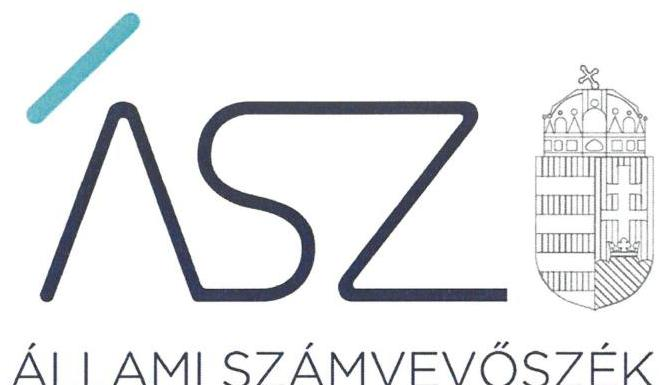
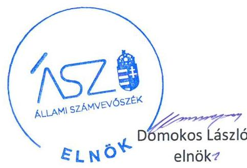
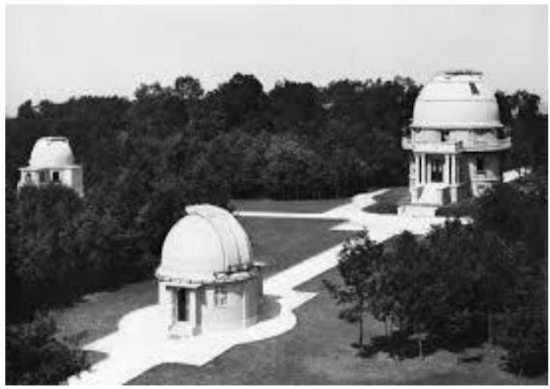

ÁLLAMI SZÁMVEVŐSZÉK

# JELENTÉS

## Az államháztartás központi alrendszere fejezeteinek ellenőrzése

A Magyar Tudományos Akadémia kutatóközpontjai és kutatóintézetei vagyongazdálkodásának ellenőrzése – MTA Csillagászati és Földtudományi Kutatóközpont

2020.

20028

www.asz.hu

---

# JELENTÉS

## Az államháztartás központi alrendszere fejezeteinek ellenőrzése

A Magyar Tudományos Akadémia kutatóközpontjai és kutatóintézetei vagyongazdálkodásának ellenőrzése – MTA Csillagászati és Földtudományi Kutatóközpont

2020. 02. hó 12. nap

20028 www.asz.hu

---

AZ ELLENŐRZÉST FELÜGYELTE:
DR. NAGY IMRE felügyeleti vezető

AZ ELLENŐRZÉST VEZETTE ÉS A VÉGREHAJTÁSÁÉRT FELELŐS:
DR. GÁL NÓRA ellenőrzésvezető

A PROGRAM ÖSSZEÁLLÍTÁSÁÉRT FELELŐS:
SZALAY NAGY JÁNOS projektvezető

IKTATÓSZÁM: EL-2430-001/2020.
TÉMASZÁM: 2517
ELLENŐRZÉS-AZONOSÍTÓ SZÁM: V086104

Jelentéseink az Országgyülés számítógépes hálózatán és az Interneten a www.asz.hu címen is olvashatóak.

---

# TARTALOMJEGYZÉK 

■ ÖSSZEGZÉS ..... 5
■ AZ ELLENŐRZÉS CÉLJA ..... 6
■ AZ ELLENŐRZÉS TERÜLETE ..... 7
■ AZ ELLENŐRZÉS HÁTTERE, INDOKOLTSÁGA ..... 8
■ A JELENTÉS LÉNYEGES KÉRDÉSKÖREI ..... 9
■ AZ ELLENŐRZÉS HATÓKÖRE ÉS MÓDSZEREI ..... 10
■ MEGÁLLAPÍTÁSOK ..... 12
■ MELLÉKLETEK ..... 13
I. sz. melléklet: Értelmező szótár ..... 13
■ FÜGGELÉK: ÉSZREVÉTELEK ..... 15
■ RÖVIDÍTÉSEK JEGYZÉKE ..... 17

---

.

---

# ÖSSZEGZÉS 

A Magyar Tudományos Akadémia Csillagászati és Földtudományi Kutatóközpont vagyongazdálkodása a 2016-2017. években nem volt szabályszerű, az ellenőrzött időszak végére javult, lényeges fennmaradó kockázatot az ellenőrzés nem azonosított.

## Az ellenőrzés társadalmi indokoltsága

Magyarország versenyképességének és a magyar gazdaság fejlődésének meghatározó tényezője a kutatás-fejlesztésre és az innovációra fordított hazai és uniós források eredményes, hatékony felhasználása. A magyar kutatás-fejlesztés területén kiemelt szerepet játszanak a központi költségvetésből biztosított támogatás felhasználásával működtetett, 2019. augusztus 31-ig a Magyar Tudományos Akadémia által irányított kutatóintézetek, kutatóközpontok. A Csillagászati és Földtudományi Kutatóközpont a csillagászat és földtudomány területén végzett kutatásokat.

A kutatás-fejlesztési közfeladat eredményes ellátásának feltétele, hogy az ehhez szükséges eszközök a kutatási tevékenységet ténylegesen végző intézeteknél, központoknál rendelkezésre álljanak, továbbá ezekkel a közfeladatuk érdekében, átlátható és elszámoltatható módon, a vagyon megőrzését biztosítva gazdálkodjanak.

Az ellenőrzés indokoltságát erősítette, hogy jogszabályi változás nyomán 2019. szeptember 1-től a kutatóintézetek és kutatóközpontok irányítása az Eötvös Loránd Kutatási Hálózat Titkárságához került át, a kutatóintézetek és kutatóközpontok ezt követően központi költségvetési szervként működnek tovább. A magyar kutatás-fejlesztés szempontjából kiemelten fontos, hogy az új szervezeti keretek között induló kutatóhálózat életképessége, a közfeladatot szolgáló vagyon megőrzése biztosított legyen.

Az Állami Számvevőszék az ellenőrzési megállapításokon keresztül hozzájárul a közvagyon védelméhez és rámutat a közfeladatot ellátó kutatóhálózat működőképességére is kiható vagyongazdálkodás kockázataira.

## Főbb megállapítások, következtetések, javaslatok

A 2016-2017. években a Magyar Tudományos Akadémia Csillagászati és Földtudományi Kutatóközpont vagyongazdálkodása nem volt szabályszerű, mert nem rendelkezett számviteli politikával, így a gazdálkodása alapvető kereteit nem alakította ki.

Számviteli politika hiányában nem határozta meg azokat az alapvető módszereket, eszközöket és eljárásokat, amelyek a számviteli törvényi előírások végrehajtásához szükségesek. Ezáltal nem alakította ki a szabályszerű könyvvezetés és vagyongazdálkodás alapvető számviteli kereteit. Így nem biztosította annak szabályozási feltételeit, hogy az éves beszámolót a törvényi követelményeknek megfelelő bizonylatok és szabályszerű, megbízható könyvvezetés támasza alá.

A kutatóközpont főigazgatójának belső kontrollrendszer minőségéről tett éves nyilatkozata a 2016-2017. években nem állt összhangban az ellenőrzés megállapításaival, nem adott valós értékelést a gazdálkodás szabályszerűségét biztosító kontrollok működtetéséről, nem biztosította a szabálytalanságok feltárását és megszüntetését. Így az igazgatói nyilatkozat nem töltötte be a szerepét a kontrollrendszer hiányosságaiban feltárásában és kijavításában, a felelős gazdálkodás erősítésében.

A 2018. évben a Magyar Tudományos Akadémia Csillagászati és Földtudományi Kutatóközpont a vagyongazdálkodása szabályozási feltételeit kialakította, a feladatellátását szolgáló vagyon megőrzése vonatkozásában az ellenőrzés lényeges kockázatot nem tárt fel.

---

# AZ ELLENŐRZÉS CÉLJA 

AZ ELLENŐRZÉS CÉLJA annak megállapítása, hogy az MTA kutatóközpontok és kutatóintézetek vagyongazdálkodása során érvényesült-e az átláthatóság és elszámoltathatóság. Az ellenőrzés a fejezethez tartozó intézmények kockázatértékelése alapján, az egyedi és lényeges jellemzők figyelembevételével történik.

---

# **AZ ELLENŐRZÉS TERÜLETE**

## **MTA- Csillagászati és Földtudományi Kutatóközpont**

Az MTA Csillagászati és Földtudományi Kutatóközpont 2012. január 1-jén az MTA Földrajztudományi Kutatóintézetnek, az MTA Geodéziai és Geofizikai Kutatóintézetnek, valamint az MTA Geokémiai Kutatóintézetnek az MTA Konkoly-Thege Miklós Csillagászati Kutatóintézetbe való beolvadásával jött létre. Az MTA CSFK¹ egy csillagászati tevékenységet végző nonprofit kft.-ben többségi, 90%-os tulajdonrésszel rendelkezett.

Az ellenőrzött időszakban az MTA CSFK önálló jogi személy, köztestületi költségvetési szerv volt, az MTAtv.² 3. §-ában megjelölt közfeladatokat látta el, az irányító szerve az MTA³ volt.

Az MTA CSFK közfeladatként ellátott tevékenységének célja csillagászati és földtudományi kutatások végzése, a Nemzeti Szeizmológiai Hálózat működtetése, obszervatóriumi, terepi és laboratóriumi mérések végzése, a mérési adatok tudományos feldolgozása és publikálása, laboratóriumok és obszervatóriumok fenntartása.

A Kutatóközpontot a Főigazgató vezette, munkáját a főigazgató helyettes és a gazdasági igazgató támogatta. A Főigazgató személye az ellenőrzött időszakban egy esetben, a gazdasági igazgató személye szintén egy esetben változott.

A Kutatóközpont a közfeladatait saját vagyonával látta el. A rendelkezésére álló vagyon 2018. évben mintegy 4,2 Mrd forint volt.

A Kutatóközpont átlagos statisztikai állományi létszáma 2016-ban 202 fő, míg 2018-ban 206 fő volt.

---

# AZ ELLENŐRZÉS HÁTTERE, INDOKOLTSÁGA 

Az ÁSZ ${ }^{4}$ ellenőrzi a költségvetési szervek gazdálkodását, működését, hogy megállapításaival támogassa az ellenőrzött szervezetek szabályszerű gazdálkodását, javaslataival elősegítse az Alaptörvényben ${ }^{5}$ megfogalmazott alapvetések érvényesülését a mindennapi életben a szervezetek szintjén. A központi költségvetés rendszerében zajló folyamatok holisztikus elemzései, a kockázatok folyamatos figyelemmel kísérésének módszerével, az így kiválasztott szervezetek célzott, hatékony ellenőrzéseivel az ÁSZ betölti a legfőbb gazdasági ellenőrző szerv küldetését. Az egyes ellenőrzések megállapításaival és egy időszak ellenőrzési eredményeinek elemzésével az ÁSZ ráirányíthatja a jogalkotók figyelmét a központi alrendszerben vagy annak egy ágazatában esetlegesen felmerülő pénzügyi, szabályozási feszültségekre. Az elvégzett ellenőrzések során az ÁSZ „jó gyakorlatokat" is azonosíthat, melyeket tanácsadó funkciója keretében szélesebb körben is megismertethet az érintettekkel, ezáltal is hozzájárulva a költségvetési rendszer szabályozott, átlátható, kiegyensúlyozott és fenntartható működéséhez.

Az államháztartás központi költségvetésében önálló fejezetet alkotó MTA és az MTA kutatóközpontok és kutatóintézetek közpénz felhasználása, az intézmények által országosan ellátott közfeladatok, valamint a feladatellátásához rendelt vagyon nagyságrendje indokolja, hogy az ÁSZ ellenőrzéseket folytasson a vagyongazdálkodás területén. Az ÁSZ az ellenőrzései során feltárja az ellenőrzött szervezet által nem szabályozott gazdálkodási területeket, rámutat a vagyongazdálkodási tevékenység - ezen belül a tulajdonosi joggyakorlás és vagyonkezelés - esetleges szabálytalanságaira, értékeli az állami vagyon nyilvántartására és elszámolására vonatkozó eljárásokat.

---

# A JELENTÉS LÉNYEGES KÉRDÉSKÖREI 

1. Az MTA kutatóközpont vagyongazdálkodására vonatkozó alapvető szabályozása szabályszerű volt-e?
2. Az MTA kutatóközpont vagyongazdálkodása során biztosított volt-e a vagyon megőrzése?

---

# AZ ELLENŐRZÉS HATÓKÖRE ÉS MÓDSZEREI 

## Az ellenőrzés típusa

Megfelelőségi ellenőrzés.

## Az ellenőrzött időszak

2016., 2017., 2018. évek

## Az ellenőrzés tárgya

Magyar Tudományos Akadémia Csillagászati és Földtudományi Kutatóközpont vagyongazdálkodásának ellenőrzése.

## Az ellenőrzött szervezet

Magyar Tudományos Akadémia Csillagászati és Földtudományi Kutatóközpont

## Az ellenőrzés jogalapja

Az ellenőrzés jogszabályi alapját az ÁSZ tv. ${ }^{6}$ 1. § (3) bekezdés, 5. § (2)-(4) és (6) bekezdései, valamint az Áht. ${ }^{7}$ 61. § (2) bekezdésének előírásai képezik.

## Az ellenőrzés módszerei

Az ÁSZ az ellenőrzést az ellenőrzési program szempontjai, az ellenőrzött időszakban hatályos jogszabályok, az ellenőrzés szakmai szabályai, a jelen ellenőrzésre irányadó ÁSZ módszertanok figyelembevételével hajtja végre.

Az ellenőrzési kérdések megválaszolásához szükséges bizonyítékok megszerzése az ellenőrzött által rendelkezésre bocsátott dokumentumokon alapul. Az ellenőrzési bizonyítékként felhasználható adatforrások közé tartoznak egyrészt az ellenőrzési program részletes szempontjainál felsorolt adatforrások, másrészt minden egyéb - az ellenőrzés folyamán feltárt, az ellenőrzés szempontjából információt tartalmazó - dokumentum. Az ellenőrzés lefolytatásához az ellenőrzött szervezet az ÁSZ által kért dokumentumok megküldésével szolgáltat adatokat, amelyek valódiságát és teljes körűségét az adatszolgáltató szervezet vezetője által tett teljességi és

---

hitelességi nyilatkozat igazolja. Az így rendelkezésre bocsátott adatok, információk kontrollja az ellenőrzés keretében történt.

Az ellenőrzés ideje alatt az ellenőrzött szervezettel történő kapcsolattartást az ÁSZ SZMSZ-ének vonatkozó előírásai alapján biztosítottuk.

Amennyiben az ellenőrzött szerv működését és vagyongazdálkodását alapvetően meghatározó dokumentum hiánya miatt, valamely lényeges kérdéskörre vonatkozóan az ÁSZ megállapítást tett, további ellenőrzési tevékenységek az adott kérdéskörrel és azzal szoros logikai kapcsolatban lévő kérdéskörökkel kapcsolatosan - ráépülő jelleggel - kerültek végrehajtásra.

---

# 1. Az MTA kutatóközpont vagyongazdálkodására vonatkozó alapvető szabályozása szabályszerű volt-e? 

Összegző megállapítás

Az MTA CSFK vagyongazdálkodásának 2016-2017. évi szabályozása nem volt szabályszerű, a 2018. évben szabályszerű volt.

A 2016-2017. években az MTA CSFK gazdálkodására vonatkozó szabályozás nem felelt meg az előírásoknak, mivel a Számv. tv. ${ }^{8} 14 . \S$ (3) bekezdése és az Áhsz. ${ }^{9} 50 . \S$ (1) bekezdése ellenére nem rendelkezett számviteli politikával.

A főigazgató a 2016-2018. években a Bkr. ${ }^{10} 1$. számú melléklete szerinti nyilatkozatban értékelte a költségvetési szerv belső kontrollrendszerének minőségét. A nyilatkozat tartalmát a 2016-2017. évekre vonatkozóan az ÁSZ ellenőrzése nem igazolta vissza.

Az MTA CSFK a 2018. évben rendelkezett az MTAtv. 17. §-ában előírtak szerint jóváhagyott SZMSZ ${ }^{11}$-szel.

Az MTA CSFK gazdasági szervezetére vonatkozó szabályokat a 2018. évben Ügyrend ${ }_{1,2}{ }^{12}$-ben rögzítették az Áht. és az Ávr. előírásaival összhangban. A 2018. évben rendelkeztek az Ávr. előírásának megfelelően a gazdálkodás részletes rendjét leíró gazdálkodási szabályzattal ${ }^{13}$, az Ávr. előírása alapján a kötelezettségvállalásra, teljesítés igazolására jogosult személyekről és aláírás-mintájukról nyilvántartást vezettek.

A 2018. évben a Számv. tv., illetve az Áhsz. előírásaival összhangban rendelkeztek számviteli politikával ${ }^{14}$, a főigazgató által kiadott leltározási szabályzattal ${ }^{15}$-tal, valamint értékelési szabályzattal ${ }^{16}$-tal.

## 2. Az MTA kutatóközpont vagyongazdálkodása során biztosított volt-e a vagyon megőrzése?

Összegző megállapítás

Az MTA CSFK vagyongazdálkodása a 2016-2017. években nem volt szabályszerű, a 2018. évben az ellenőrzés lényeges kockázatot nem azonosított.

A 2016-2017. években az MTA CSFK a Számv. tv. 14. § (3) bekezdése és az Áhsz. 50. § (1) bekezdése ellenére nem rendelkezett a könyvvezetés alapvető kereteit biztosító számviteli politikával, így a vagyongazdálkodása nem volt elszámoltatható.

A 2018. évben a mérleg tételeit alátámasztó leltárt a Számv. tv. 69. § (1) bekezdés, és az Áhsz. 22. § (1) bekezdés előírásai szerint állították össze.

---

# MELLÉKLETEK 

- I. SZ. MELLÉKLET: ÉRTELMEZŐ SZÓTÁR
állami vagyon
állami vagyonnak minősül:
a) az állam tulajdonában lévő dolog, valamint a dolog módjára hasznosítható természeti erő,
b) az a) pont hatálya alá nem tartozó mindazon vagyon, amely vonatkozásában törvény az állam kizárólagos tulajdonjogát nevesíti,
c) az állam tulajdonában lévő tagsági jogviszonyt megtestesítő értékpapír, illetve az államot megillető egyéb társasági részesedés,
d) az államot megillető olyan immateriális, vagyoni értékkel rendelkező jogosultság, amelyet jogszabály vagyoni értékű jogként nevesít. (Forrás: Vtv. 1. § (2) bekezdése)
állami vagyon használója
az a természetes vagy jogi személy, jogi személyiséggel nem rendelkező szervezet, aki, vagy amely törvény vagy szerződés alapján, bármely jogcímen (bérlet, haszonbérlet, használat stb.) állami vagyont birtokol, használ, szedi annak használt, hasznosít, ide nem értve a haszonélvezőt, a vagyonkezelőt és a tulajdonosi jogok gyakorlóját (Forrás: Vtvr. 1. § (7) bekezdés a) pont, hatályos 2012. január 1-jétől)
állami vagyon kezelője /vagyonkezelő
Az állami vagyont az MNV Zrt. maga kezeli, vagy szerződés -
 így különösen bérlet, haszonbérlet, megbízás alapján központi költségvetési szervnek, természetes vagy jogi személynek, vagy jogi személyiséggel nem rendelkező gazdálkodó szervezetnek hasznosításra átengedi." Az állami vagyonra vonatkozóan az MNV Zrt. kizárólag az Nvtv-ben meghatározott személyekkel köthet vagyonkezelési szerződést. (Forrás: Vtv. 27. § (1) bekezdése, hatályos 2012. január 1-jétől)
hasznosítás
A nemzeti vagyon birtoklásának, használatának, hasznok szedése jogának bármely a tulajdonjog átruházását nem eredményező jogcímen történő átengedése, ide nem értve a vagyonkezelésbe adást, valamint a haszonélvezeti jog alapítását. (Forrás: Nvtv. 3. § (1) bekezdés 4. pontja)
közfeladat
Jogszabályban meghatározott állami vagy önkormányzati feladat, amit az arra kötelezett közérdekből, a jogszabályban meghatározott követelményeknek és feltételeknek megfelelve végez, ideértve a lakosság közszolgáltatásokkal való ellátását, továbbá az állam nemzetközi szerződésekben vállalt kötelezettségeiből adódó közérdekű feladatokat, valamint e feladatok ellátásakor szükséges infrastruktúra biztosítását is. (Forrás: Nvtv. 3. § (1) bekezdés 7. pontja).
köztestület önkormányzattal és nyilvántartott tagsággal rendelkező szervezet, amelynek létrehozását törvény rendeli el. A köztestület a tagságához, illetve a tagsága által végzett tevékenységhez kapcsolódó közfeladatot lát el. A köztestület jogi személy. Köztestület különösen a Magyar Tudományos Akadémia. (Forrás: 2006. évi LXV. törvény 8/A. § (1)-(2) bekezdés.
MTA kutatóhálózat
Az MTA feladatainak ellátása céljából közfinanszírozású kutatóhálózatot létesít és működtet, amely felett irányítási jogot gyakorol. (forrás: MTAtv. 2. § (1) bekezdés, hatályos 2019. augusztus 31-ig)
MTA kutatóhálózata 10 kutatóközpontból és bennük 38 intézetből, 5 önálló jogállású kutatóintézetből, 96 akadémiai támogatású egyetemi, illetve közgyűjteményekben létesített kutatócsoportból, valamint 95 Lendület-kutatócsoportból (együttesen: kutatóhely) áll.
MTA Kutatóközpont
Az akadémiai kutatóközpont költségvetési szerv. A kutatóközpont autonóm módon vesz részt az Akadémia közfeladatainak megoldásában, önállóan is vállal közfeladatokat, továbbá egyéb tevékenységet is végezhet. Tudományos tevékenységéről és

---

MTA Kutatóintézet

MTA vagyon
vagyongazdálkodás
gazdálkodásáról évente beszámolót készít, amelyet az Akadémia az e törvényben és az Alapszabályban leírtak szerint értékel. (forrás: MTAtv. 18. § (1) bekezdés, hatályos 2019. augusztus 31-ig)

Az akadémiai kutatóintézet költségvetési szerv. Az akadémiai kutatóközpont keretein belül működő kutatóintézet a kutatóközpont szervezeti egysége. A kutatóintézet autonóm módon vesz részt az Akadémia közfeladatainak megoldásában, önállóan is vállal közfeladatokat, továbbá egyéb tevékenységet is végezhet. (forrás: MTAtv. 18. § (1) bekezdés, hatályos 2019. augusztus 31-ig)
Az MTA vagyonába tartozik az MTA-nak átadott törzsvagyon és az állami vagyonról szóló 2007. évi CVI. törvény 69. § (1) bekezdése alapján az MTA-nak átadott vagyon (a továbbiakban: az MTA vagyona). Az MTA vagyonába tartoznak az ingatlanok, az immateriális javak (ideértve a szellemi tulajdont is), a tárgyi eszközök, a pénz, a befektetések és a részesedések is. Az MTA nem gazdálkodik állami vagyonnal, mert a korábbi rábízott vagyon is a tulajdonába került. (forrás: MTAtv. 23. § (2) bekezdés) A nemzeti vagyongazdálkodás feladata a nemzeti vagyon rendeltetésének megfelelő, az állam, az önkormányzat mindenkori teherbíró képességéhez igazodó, elsődlegesen a közfeladatok ellátásához és a mindenkori társadalmi szükségletek kielégítéséhez szükséges, egységes elveken alapuló, átlátható, hatékony és költségtakarékos működtetése, értékének megőrzése, állagának védelme, értéknövelő használata, hasznosítása, gyarapítása, továbbá az állam vagy a helyi önkormányzat feladatának ellátása szempontjából feleslegessé váló vagyontárgyak elidegenítése. (Forrás: Nvtv. 7. § (2) bekezdése)

---

# FÜGGELÉK: ÉSZREVÉTELEK 

A jelentéstervezetet a Számvevőszék 15 napos észrevételezésre megküldte az ellenőrzött szervezet vezetőjének az ÁSZ tv. 29. § (1) bekezdése előírásának megfelelően.

Magyar Tudományos Akadémia Csillagászati és Földtudományi Kutatóközpont főigazgatója a jelentéstervezet megállapításaira írásban észrevételt tett.
Az ÁSZ tv. 29. § (3) bekezdésével összhangban az ÁSZ a Függelékben feltünteti az ellenőrzés megállapításaival kapcsolatban tett, figyelembe nem vett észrevételeket, és megindokolja, hogy azokat miért nem fogadta el.

[^0]
[^0]:    * 29. § (1) Az Állami Számvevőszék az ellenőrzési megállapításait megküldi az ellenőrzött szervezet vezetőjének vagy az általa megbízott személynek, és annak, akinek személyes felelősségét állapította meg.
    (2) Az ellenőrzött szervezet vezetője és a felelősként megjelölt személy az ellenőrzés megállapításaira tizenöt napon belül írásban észrevételt tehet.
    (3) Az Állami Számvevőszék az észrevételre a beérkezésétől számított harminc napon belül írásban válaszol. A figyelembe nem vett észrevételeket köteles a jelentésben feltüntetni, és megindokolni, hogy azokat miért nem fogadta el.

---

# 1. A jelentéstervezet Összegzésével, a Főbb megállapítások, következtetések, javaslatok fejezet 1-3. bekezdéseivel, a 2. számú összegző megállapítással és a 2. számú megállapítás 1. bekezdésével kapcsolatos észrevétel 

A főigazgató észrevételében jelezte, hogy az MTA CSFK a törvényi előírásoknak megfelelően rendelkezett Számviteli Politikával a 2016-2017. években. A Számviteli Politikát azonban adminisztrációs hiba miatt nem bocsátották az ellenőrzés rendelkezésére. A főigazgató jelezte továbbá, hogy Számviteli Politika birtokában az MTA CSFK vagyongazdálkodása szabályszerű volt, valamint az MTA CSFK belső kontrollrendszer minőségéről tett nyilatkozata valós értékelést adott a gazdálkodás szabályszerűségéről és betöltötte szerepét a kontrollrendszer hiányosságainak feltárásában és kijavításában, a felelős gazdálkodás erősítésében.

Az ÁSZ az ellenőrzési megállapításait az adatszolgáltatás során a részére törvényi határidőben rendelkezésre bocsátott dokumentumokra alapozva fogalmazza meg. A teljességi és hitelességi nyilatkozatuk szerint az ÁSZ részére átadott dokumentumok, adatok megbízhatóak, és a bekért adatokra, dokumentumokra vonatkozóan teljes körű információt tartalmaznak. A teljességi és hitelességi nyilatkozat alapján az MTA CSFK az adatszolgáltatás során 2016-2017. évekre vonatkozó számviteli politikát nem bocsátott az ellenőrzés rendelkezésére. Ennek tényét az észrevételben foglaltak is megerősítik. Az észrevételéhez mellékletként csatolt dokumentumot az ÁSZ nem értékeli.

A Számviteli Politika hiányában a jelentéstervezet az MTA CSFK vagyongazdálkodásával és az MTA CSFK főigazgatójának belső kontrollrendszer minőségéről tett éves (2016-2017. évekre vonatkozó) nyilatkozatával kapcsolatban megfogalmazott megállapítása helytálló.
A fentiekre tekintettel az észrevételt nem fogadjuk el, a jelentéstervezet módosítása nem indokolt.

---

# RÖVIDÍTÉSEK JEGYZÉKE 

${ }^{1}$ MTA CSFK
${ }^{2}$ MTAtv.
${ }^{3}$ MTA
${ }^{4}$ ÁSZ
5 Alaptörvény
${ }^{6}$ ÁSZ tv.
${ }^{7}$ Áht.
${ }^{8}$ Számv.tv.
${ }^{9}$ Áhsz.
${ }^{10}$ Bkr.
${ }^{11}$ SZMSZ
${ }^{12}$ ügyrend ${ }_{1,2}$
${ }^{13}$ gazdálkodási szabályzat
${ }^{14}$ számviteli politika
${ }^{15}$ leltározási szabályzat
${ }^{16}$ értékelési szabályzat

MTA Csillagászati és Földtudományi Kutatóközpont
1994. évi XL. törvény a Magyar Tudományos Akadémiáról

Magyar Tudományos Akadémia
Állami Számvevőszék
Magyarország Alaptörvénye (2011. április 25.)
2011. évi LXVI. törvény az Állami Számvevőszékről (hatályos: 2011. július 1-jétől)
2011. évi CXCV. törvény az államháztartásról (hatályos: 2012. január 1-jétől)
2000. évi C. törvény a számvitelről
az államháztartás számviteléről szóló 4/2013. (I. 11.) Korm. rendelet
370/2011. (XII.31.) Korm. rendelet a költségvetési szervek belső
kontrollrendszeréről és belső ellenőrzéséről
CSFK Szervezeti és Működési Szabályzata (hatályos: 2017. október 10-től)
CSFK Gazdasági Igazgatóság ügyrendje (hatályos: 2016. augusztus 1-től)
CSFK Gazdasági Igazgatóság ügyrendje (hatályos: 2018. szeptember 1-től)
CSFK Gazdálkodási Szabályzata, jóváhagyva 2017. március 28-án
CSFK Számviteli politikája (hatályos: 2018. január 1-től)
CSFK Eszközök és források leltározási és leltárkészítési szabályzata
(hatályos 2018. január 1-től)
CSFK Eszközök és források értékelési szabályzata (hatályos: 2018. január 1-től)

---

1052 Budapest, Apáczai Cs. J. u. 10. | PO box: 1364 Budapest 4. Pf. 54 TEL: +36 14849145
email: kapcsolattartas@asz.hu | international@asz.hu
web: www.asz.hu | www.aszhirportal.hu
