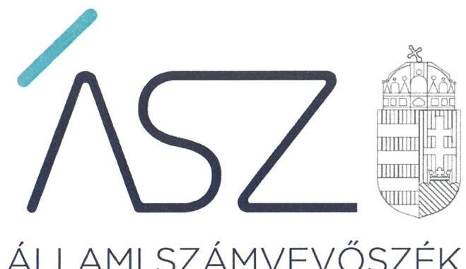
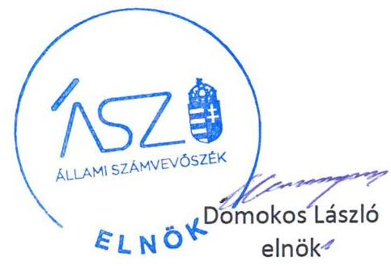
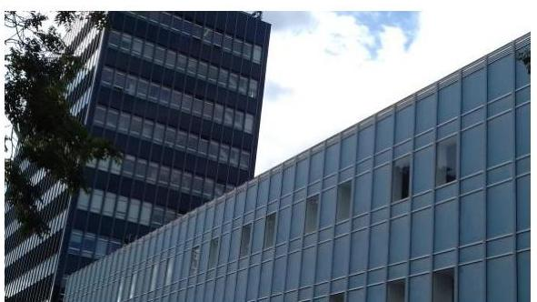
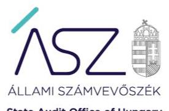

ÁLLAMI SZÁMVEVŐSZÉK

# JELENTÉS

## Az államháztartás központi alrendszere fejezeteinek ellenőrzése

A Magyar Tudományos Akadémia kutatóközpontjai és kutatóintézetei vagyongazdálkodásának ellenőrzése – MTA Kísérleti Orvostudományi Kutatóintézet

2020.

20029
www.asz.hu

---

# JELENTÉS

## Az államháztartás központi alrendszere fejezeteinek ellenőrzése

A Magyar Tudományos Akadémia kutatóközpontjai és kutatóintézetei vagyongazdálkodásának ellenőrzése – MTA Kísérleti Orvostudományi Kutatóintézet

2020. 02. hó 12. nap

20029
www.asz.hu

---

# AZ ELLENŐRZÉST FELÜGYELTE: 

DR. NAGY IMRE felügyeleti vezető

## AZ ELLENŐRZÉST VEZETTE ÉS A VÉGREHAJTÁSÁÉRT FELELŐS:

MOLNÁR ZSUZSANNA ellenőrzésvezető

## A PROGRAM ÖSSZEÁLLÍTÁSÁÉRT FELELŐS:

SZALAY NAGY JÁNOS projektvezető

IKTATÓSZÁM: EL-2434-001/2020.
TÉMASZÁM: 2517
ELLENŐRZÉS-AZONOSÍTÓ SZÁM: V086106

Jelentéseink az Országgyúlés számítógépes hálózatán és az Interneten a www.asz.hu címen is olvashatóak.

---

# TARTALOMJEGYZÉK 

■ ÖSSZEGZÉS ..... 5
■ AZ ELLENŐRZÉS CÉLJA ..... 6
■ AZ ELLENŐRZÉS TERÜLETE ..... 7
■ AZ ELLENŐRZÉS HÁTTERE, INDOKOLTSÁGA ..... 8
■ A JELENTÉS LÉNYEGES KÉRDÉSKÖREI ..... 9
■ AZ ELLENŐRZÉS HATÓKÖRE ÉS MÓDSZEREI ..... 10
■ MEGÁLLAPÍTÁSOK ..... 12
■ MELLÉKLETEK ..... 13
I. sz. melléklet: Értelmező szótár ..... 13
■ FÜGGELÉK: ÉSZREVÉTELEK ..... 15
■ RÖVIDÍTÉSEK JEGYZÉKE ..... 17

---

.

---

# ÖSSZEGZÉS 

A Magyar Tudományos Akadémia Kísérleti Orvostudományi Kutatóintézet a vagyongazdálkodás feltételeit szabályozta, 2016-2018. évi vagyongazdálkodásában a vagyon megőrzése szempontjából kockázat nem merült fel.

## Az ellenőrzés társadalmi indokoltsága

Magyarország versenyképességének és a magyar gazdaság fejlődésének meghatározó tényezője a kutatás-fejlesztésre és az innovációra fordított hazai és uniós források eredményes, hatékony felhasználása. A magyar kutatás-fejlesztés területén kiemelt szerepet játszanak a központi költségvetésből biztosított támogatás felhasználásával múködtetett, 2019. augusztus 31-ig a Magyar Tudományos Akadémia által irányított kutatóintézetek, kutatóközpontok. A Kísérleti Orvostudományi Kutatóintézet elsősorban az idegtudományok területén végzett kutatásokat.

A kutatás-fejlesztési közfeladat eredményes ellátásának feltétele, hogy az ehhez szükséges eszközök a kutatási tevékenységet ténylegesen végző intézeteknél, központoknál rendelkezésre álljanak, továbbá ezekkel a közfeladatellátás érdekében átlátható és elszámoltatható módon, a vagyon megőrzését biztosítva gazdálkodjanak.

Az ellenőrzés indokoltságát erősítette, hogy jogszabályi változás nyomán 2019. szeptember 1-től a kutatóintézetek és kutatóközpontok irányítása az Eötvös Loránd Kutatási Hálózat Titkárságához került át, a kutatóintézetek és kutatóközpontok ezt követően központi költségvetési szervként működnek tovább. A magyar kutatás-fejlesztés szempontjából kiemelten fontos, hogy az új szervezeti keretek között induló kutatóhálózat életképessége, a közfeladatot szolgáló vagyon megőrzése biztosított legyen.

Mindezek alapján azért került sor a kutatóintézetek, kutatóközpontok vagyongazdálkodásának ellenőrzésére, hogy az Állami Számvevőszék az ellenőrzési megállapításokon keresztül hozzájáruljon a közvagyon védelméhez és rámutasson a közfeladatot ellátó kutatóhálózat működőképességére is kiható vagyongazdálkodás lehetséges kockázataira.

## Főbb megállapítások, következtetések, javaslatok

A Magyar Tudományos Akadémia Kísérleti Orvostudományi Kutatóintézet a vagyongazdálkodás alapvető kereteit a szervezeti és működési szabályzattal, számviteli szabályzatokkal, valamint a gazdálkodás rendjét meghatározó szabályzatokkal az előírásoknak megfelelően kialakította.

A Kutatóintézet a 2016-2018. évi beszámolója mérleg tételeit az előírásoknak megfelelően leltárral alátámasztotta. Az eszközök mennyiségi felvétellel történő leltározását valamint a főkönyvi könyvelés és az analitikus nyilvántartások közötti egyeztetéseket a jogszabályi előírásoknak megfelelően elvégezték. A közfeladat ellátását biztosító vagyon megőrzéséről gondoskodtak.

---

# **AZ ELLENŐRZÉS CÉLJA**

**AZ ELLENŐRZÉS CÉLJA** annak megállapítása, hogy az MTA¹ Kísérleti Orvostudományi Kutatóintézet vagyongazdálkodása során érvényesült-e az átláthatóság és elszámoltathatóság.

---

# **AZ ELLENŐRZÉS TERÜLETE**

## **MTA Kísérleti Orvostudományi Kutatóintézet**

Az MTA Kísérleti Orvostudományi Kutatóintézetet 1952. február 8-án alapították azzal a céllal, hogy az idegtudományok területén végzett alapkutatások során az egyes törvényszerűségek feltárásával, illetőleg feltárásukhoz való hozzájárulással elősegítse az ember egészségének megóvását, betegségeinek eredményes gyógyítását. Az ellenőrzött időszakban a Kutatóintézet2 önálló jogi személyként működő köztestületi költségvetési szerv volt, amely felett az MTA irányítási jogot gyakorolt.

A Kutatóintézet igazgatójának és gazdasági vezetőjének személye az ellenőrzött időszakban nem változott.

A Kutatóintézet 2016-2018. években vállalkozási tevékenységet nem végzett.

A Kutatóintézet orvostudományi alap- és kísérleti kutatásokat, fejlesztéseket, valamint biológiai alap-, alkalmazott kutatásokat és kísérleti fejlesztéseket végzett elsősorban az idegtudományok területén. Részt vett a korszerű kutatás módjának, módszertanának fejlesztésében, a posztgraduális képzésben és a tudományos ismeretek terjesztésében. Kiemelten foglalkozott tudományos szak- és ismeretterjesztő kiadványok megjelentetésével, szorgalmazta és segítette a tudományos kutatások eredményeinek társadalmi és gazdasági hasznosítását.

A Kutatóintézet közfeladatainak ellátása az MTA-tól átvett két ingatlan3, mintegy 4,6 Mrd forintnyi tárgyi eszköz4 és saját vagyon használatával valósult meg. Az MTA a vagyon feletti rendelkezési jogot megtartotta, az eszközök használatával kapcsolatos feladatokat és a költségek viselését továbbadta a Kutatóintézetnek. Az MTA és a Kutatóintézet közötti vagyonhasználati szerződés alapján a Kutatóintézet volt köteles gondoskodni az eszközök állagmegóvásáról, továbbá viselni az eszközök működtetésével összefüggő üzemeltetési, fenntartási és javítási költségeket.

2018-ban a Kutatóintézet rendelkezésére álló vagyon beszámolóban kimutatott értéke meghaladta a 9 Mrd Ft-ot.

---

# AZ ELLENŐRZÉS HÁTTERE, INDOKOLTSÁGA 

Az MTA Magyarország legmagasabb szintű tudományos testülete, a központi költségvetésben önálló fejezetet alkot. Az MTA tv. ${ }^{5}$ 2019. augusztus 31-ig hatályos előírásai alapján az MTA feladatainak ellátása céljából közfinanszírozású kutatóközpontokat és kutatóintézeteket, kiszolgáló és egyéb intézményeket létesít és múködtet, amelyek felett irányítási jogot gyakorol. Az MTA kutatóközpontok és a kutatóintézetek 2019. augusztus 31-ig köztestületi költségvetési szervek voltak.

Az ÁSZ ellenőrzi az éves költségvetési törvény végrehajtását. Az ellenőrzés során feltárt kockázatok és a terület folyamatos értékelésével beazonosított kockázatok kezelése érdekében ellenőrzi többek között a költségvetési szervek gazdálkodását, múködését. Így az ellenőrzések megállapításaival támogatja az ellenőrzött szervezetek szabályszerű gazdálkodását, javaslataival elősegíti az Alaptörvényben megfogalmazott alapvetések érvényesülését a mindennapi életben a szervezetek szintjén. Az ÁSZ megállapításaival elősegíti az ellenőrzöttek közpénzekkel való felelős gazdálkodását, illetve az újszerű megközelítésű ellenőrzéssel hozzájárul az értékteremtő rend kialakításához és megőrzéséhez.

Az ellenőrzés a vagyongazdálkodásra fókuszál. Az ellenőrzés következtében várhatóan reális kép alakítható ki a vagyongazdálkodás szabályszerűségéről. Az ellenőrzés megállapításai, javaslatai alapján javulhat a kutatóhálózat múködésének szabályszerűsége, a kutatásokra fordított közpénzek felhasználásának átláthatósága, a tudomány eredményeinek hasznosulása, hozzájárulva ezzel a „jól irányított állam" múködéséhez.

---

# A JELENTÉS LÉNYEGES KÉRDÉSKÖREI 

1. A Kutatóintézet vagyongazdálkodására vonatkozó alapvető szabályozása szabályszerü volt-e?
2. A Kutatóintézet vagyongazdálkodása során biztositott volt-e a vagyon megőrzése?

---

# AZ ELLENŐRZÉS HATÓKÖRE ÉS MÓDSZEREI 

## Az ellenőrzés típusa

Megfelelőségi ellenőrzés.

## Az ellenőrzött időszak

2016., 2017. és 2018. évek.

## Az ellenőrzés tárgya

MTA Kísérleti Orvostudományi Kutatóintézet vagyongazdálkodásának ellenőrzése.

## Az ellenőrzött szervezet

MTA Kísérleti Orvostudományi Kutatóintézet

## Az ellenőrzés jogalapja

Az ellenőrzés jogszabályi alapját az ÁSZ tv. ${ }^{6}$ 1. § (3) bekezdésének, az 5. § (2)-(4) és (6) bekezdésének, valamint az Áht. 61. § (2) bekezdésének előírásai képezték.

## Az ellenőrzés módszerei

Az ellenőrzést az ÁSZ a szakmai program szempontjai, az ellenőrzött időszakban hatályos jogszabályok, az ellenőrzés szakmai szabályai, a jelen ellenőrzésre irányadó ÁSZ módszertanok figyelembevételével végezte.

Az ellenőrzés ideje alatt az ellenőrzött szervezettel történő kapcsolattartást az ÁSZ SZMSZ ${ }^{7}$-ének vonatkozó előírásai alapján biztosította.

Az ellenőrzési kérdések megválaszolásához szükséges bizonyítékok megszerzése az ellenőrzött által rendelkezésre bocsátott dokumentumokra, adatokra alapozva megfigyelés, szemle (szemrevételezés), kérdésfeltevés (információkérés), valamint elemző eljárás útján történt. Az ellenőrzési bizonyítékként felhasználható adatforrások közé tartoznak egyrészt az ellenőrzési program részletes szempontjainál felsorolt adatforrások, másrészt minden egyéb - az ellenőrzés folyamán feltárt, az ellenőrzés szempontjából információt tartalmazó - dokumentum. Az ellenőrzés lefolytatásához az ellenőrzött szervezet az ÁSZ által kért dokumentumok

---

megküldésével szolgáltatott adatokat, amelyek valódiságát és teljes körűségét az adatszolgáltató szervezet vezetője által tett teljességi és hitelességi nyilatkozat igazolja. Az így rendelkezésre bocsátott adatok, információk kontrollja az ellenőrzés keretében történt meg.

---

# 1. A Kutatóintézet vagyongazdálkodására vonatkozó alapvető szabályozása szabályszerű volt-e? 

## Összegző megállapítás

A Kutatóintézet vagyongazdálkodására vonatkozó alapvető szabályozása szabályszerű volt.

A Kutatóintézet szervezeti felépítése, a szervezeti egységek feladatai, a feladatok ellátásának részletes belső rendje és módja - az Áht. ${ }^{8}$ és az Ávr. ${ }^{9}$ előírásai szerint - meghatározásra kerültek a Kutatóintézet SZMSZ-ében ${ }^{10}$.

A Kutatóintézet rendelkezett - a Számv. tv. ${ }^{11}$ szerinti - számviteli politikával ${ }_{1,2}{ }^{12}$ és az annak keretében elkészítendő eszközök és a források leltárkészítési és leltározási szabályzatával ${ }_{1,2}{ }^{13}$, valamint az eszközök és a források értékelési szabályzatával ${ }_{1,2}{ }^{14}$. Gazdálkodásának részletes rendjét - az Áht.-ban és Ávr.-ben előírtak szerint - a gazdálkodás ügyrendjét tartalmazó belső szabályzatban ${ }^{15}$ határozták meg. A kötelezettségvállalásra, pénzügyi ellenjegyzésre, teljesítés igazolására, érvényesítésre, utalványozásra jogosult személyekről és aláírás-mintájukról - az Ávr. előírása szerinti - nyilvántartást vezették.

A Kutatóintézet igazgatója a Bkr. ${ }^{16}$ előírása szerint nyilatkozatában értékelte a költségvetési szerv belső kontrollrendszerének minőségét.

## 2. A Kutatóintézet vagyongazdálkodása során biztosított volt-e a vagyon megőrzése?

## Összegző megállapítás

A Kutatóintézet a 2016.-2018. évi vagyongazdálkodása során a vagyon megőrzését biztosította.

A Kutatóintézet a 2016-2018. évi beszámoló mérleg tételeit a Számv. tv. 69. § (1) és (3) bekezdései, az Áhsz. 22. § (1)-(2) bekezdései, valamint a Leltározási szabályzat előírásai szerint leltárakkal alátámasztotta.

Az ellenőrzött időszakban a Számv. tv. előírásainak megfelelően a mérleg tételeihez kapcsolódó főkönyvi könyvelés és analitikus nyilvántartások közötti egyeztetéseket, valamint a mennyiségi felvétellel történő leltározást a mérleg fordulónapjára vonatkozóan elvégezték.

---

# MELLÉKLETEK 

- I. SZ. MELLÉKLET: ÉRTELMEZŐ SZÓTÁR
köztestület

MTA kutatóhálózat

MTA Kutatóközpont

MTA Kutatóintézet

A köztestület önkormányzattal és nyilvántartott tagsággal rendelkező szervezet, amelynek létrehozását törvény rendeli el. A köztestület a tagságához, illetve a tagsága által végzett tevékenységhez kapcsolódó közfeladatot lát el. A köztestület jogi személy. Köztestület különösen a Magyar Tudományos Akadémia. (Forrás: 2006. évi LXV. törvény 8/A. § (1)-(2) bekezdés.
AZ MTA feladatainak ellátása céljából közfinanszírozású kutatóhálózatot létesít és múködtet, amely felett irányítási jogot gyakorol. (forrás: MTAtv. 2. § (1) bekezdés, hatályos 2019. augusztus 31-ig)
Az MTA kutatóhálózata 10 kutatóközpontból és bennük 38 intézetből, 5 önálló jogállású kutatóintézetből, 96 akadémiai támogatású egyetemi, illetve közgyűjteményekben létesített kutatócsoportból, valamint 95 Lendület-kutatócsoportból (együttesen: kutatóhely) áll.
Az akadémiai kutatóközpont költségvetési szerv. A kutatóközpont autonóm módon vesz részt az Akadémia közfeladatainak megoldásában, önállóan is vállal közfeladatokat, továbbá egyéb tevékenységet is végezhet. Tudományos tevékenységéről és gazdálkodásáról évente beszámolót készít, amelyet az Akadémia az e törvényben és az Alapszabályban leírtak szerint értékel. (forrás: MTAtv. 18. § (1) bekezdés, hatályos 2019. augusztus 31-ig)

Az akadémiai kutatóintézet költségvetési szerv. Az akadémiai kutatóközpont keretein belül múködő kutatóintézet a kutatóközpont szervezeti egysége. A kutatóintézet autonóm módon vesz részt az Akadémia közfeladatainak megoldásában, önállóan is vállal közfeladatokat, továbbá egyéb tevékenységet is végezhet. (forrás: MTAtv. 18. § (1) bekezdés, hatályos 2019. augusztus 31-ig)

---

.

---

# FÜGGELÉK: ÉSZREVÉTELEK 

A jelentéstervezetet a Számvevőszék 15 napos észrevételezésre megküldte az ellenőrzött szervezet vezetőjének az ÁSZ tv. 29. §* (1) bekezdése előírásának megfelelően.

Az MTA Kísérleti Orvostudományi Kutatóintézet igazgatója a jelentéstervezet megállapításaira írásban észrevételt tett. Az észrevételben foglaltakat az Állami Számvevőszék elfogadta és a jelentésen átvezette.

[^0]
[^0]:    * 29. § (1) Az Állami Számvevőszék az ellenőrzési megállapításait megküldi az ellenőrzött szervezet vezetőjének vagy az általa megbízott személynek, és annak, akinek személyes felelősségét állapította meg.
    (2) Az ellenőrzött szervezet vezetője és a felelősként megjelölt személy az ellenőrzés megállapításaira tizenöt napon belül írásban észrevételt tehet.
    (3) Az Állami Számvevőszék az észrevételre a beérkezésétől számított harminc napon belül írásban válaszol. A figyelembe nem vett észrevételeket köteles a jelentésben feltüntetni, és megindokolni, hogy azokat miért nem fogadta el.

---

.

---

# RÖVIDÍTÉSEK JEGYZÉKE 

${ }^{1}$ MTA
${ }^{2}$ Intézet
${ }^{3}$ átvett két ingatlan
${ }^{4}$ átvett tárgyi eszköz
${ }^{5}$ MTA tv.
${ }^{6}$ ÁSZ tv.
${ }^{7}$ ÁSZ SZMSZ
${ }^{8}$ Áht.
${ }^{9}$ Ávr.
${ }^{10}$ SZMSZ
${ }^{11}$ Számv. tv.
${ }^{12}$ számviteli politika $_{1,2}$
${ }^{13}$ eszközök és a források leltárkészítési és leltározási szabályzata ${ }_{1,2}$
${ }^{14}$ az eszközök és a források értékelési szabályzata ${ }_{1,2}$
${ }^{15}$ a gazdálkodás ügyrendjét tartalmazó belső szabályzat
${ }^{16}$ Bkr.

Magyar Tudományos Akadémia
MTA Kísérleti Orvostudományi Kutatóintézet
1: Budapest, VIII. ker. Szigony u. 43. szám alatti ingatlan
2: Zamárdi, Vécsey Károly u. 93. szám alatti ingatlan gépek, berendezések, felszerelések, járművek
1994. évi XL. törvény a Magyar Tudományos Akadémiáról (hatályos: 1994. június 30-tól)
2011. évi LXVI. törvény az Állami Számvevőszékről (hatályos: 2011. július 1-jétől) Az Állami Számvevőszék elnökének 2/2018. (XII.28.) ÁSZ utasítása az Állami Számvevőszék Szervezeti és Müködési Szabályzatáról (hatályos: 2019. január 1-jétől)
2011. évi CXCV. törvény az államháztartásról (hatályos: 2012. január 1-jétől) Az államháztartásról szóló törvény végrehajtásáról szóló 368/2011. (XII. 31.) Korm. rendelet (hatályos: 2012. január 1-től)
MTA KOKI Szervezeti és Müködési Szabályzata (hatályos: 2003. május 19-től)
A számvitelről szóló 2000. évi C. törvény (hatályos: 2001. január 1-jétől)
1: Magyar Tudományos Akadémia Kísérleti Orvostudományi Kutatóintézet Számviteli Politika (hatályos: 2014. január 1-jétől 2018. szeptember 30-ig)
2: Magyar Tudományos Akadémia Kísérleti Orvostudományi Kutatóintézet Számviteli Politika (hatályos: 2018. október 1-jétől)
1: Magyar Tudományos Akadémia Kísérleti Orvostudományi Kutatóintézet Eszközök és források leltározási és leltárkészítési szabályzata
(hatályos: 2014. január 1-jétől 2018. október 31-ig)
2: Magyar Tudományos Akadémia Kísérleti Orvostudományi Kutatóintézet Eszközök és források leltározási és leltárkészítési szabályzata
(hatályos: 2018. november 1-jétől)
1: Magyar Tudományos Akadémia Kísérleti Orvostudományi Kutatóintézet Eszközök és források értékelési szabályzata
(hatályos: 2014. január 1-jétől 2018. szeptember 30-ig)
2: Magyar Tudományos Akadémia Kísérleti Orvostudományi Kutatóintézet Eszközök és források értékelési szabályzata (hatályos: 2018. október 1-jétől)
Magyar Tudományos Akadémia Kísérleti Orvostudományi Kutatóintézet Pénzügyi Szervezetének ügyrendje (hatályos: 2014. november 30-tól)
370/2011. (XII. 31.) Korm. rendelet a költségvetési szervek belső
kontrollrendszeréről és belső ellenőrzéséről (hatályos: 2012. január 1-jétől)

---

1052 Budapest, Apáczai Cs. J. u. 10. | PO box: 1364 Budapest 4. Pf. 54 TEL: +36 14849145
email: kapcsolattartas@asz.hu | international@asz.hu web: www.asz.hu | www.aszhirportal.hu