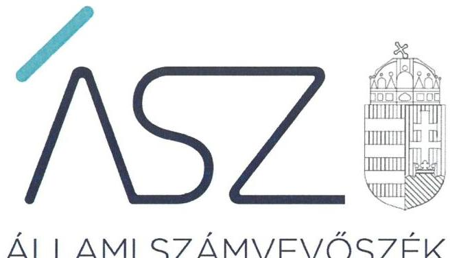
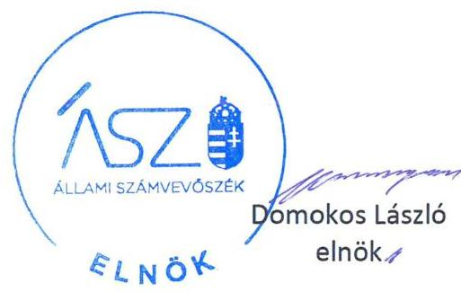

ÁLLAMI SZÁMVEVŐSZÉK

# JELENTÉS 

## Az államháztartás központi alrendszere fejezeteinek ellenőrzése

A Magyar Tudományos Akadémia kutatóközpontjai és kutatóintézetei vagyongazdálkodásának ellenőrzése - MTA Közgazdaság- és Regionális Tudományi Kutatóközpont

2020.

20030
www.asz.hu

---

# JELENTÉS

## Az államháztartás központi alrendszere fejezeteinek ellenőrzése

A Magyar Tudományos Akadémia kutatóközpontjai és kutatóintézetei vagyongazdálkodásának ellenőrzése – MTA Közgazdaság- és Regionális Tudományi Kutatóközpont

2020.

02. hó 21. nap

20030
www.asz.hu

---

# AZ ELLENŐRZÉST FELÜGYELTE: 

DR. NAGY IMRE felügyeleti vezető

## AZ ELLENŐRZÉST VEZETTE ÉS A VÉGREHAJTÁSÁÉRT FELELŐS:

MOLNÁR ZSUZSANNA ellenőrzésvezető

## A PROGRAM ÖSSZEÁLLÍTÁSÁÉRT FELELŐS:

SZALAY NAGY JÁNOS projektvezető

IKTATÓSZÁM: EL-2428-001/2020.
TÉMASZÁM: 2517
ELLENŐRZÉS-AZONOSÍTÓ SZÁM: V086107

Jelentéseink az Országgyúlés számítógépes hálózatán és az Interneten a www.asz.hu címen is olvashatóak.

---

# TARTALOMJEGYZÉK 

■ ÖSSZEGZÉS ..... 5
■ AZ ELLENŐRZÉS CÉLJA ..... 6
■ AZ ELLENŐRZÉS TERÜLETE ..... 7
■ AZ ELLENŐRZÉS HÁTTERE, INDOKOLTSÁGA ..... 8
■ A JELENTÉS LÉNYEGES KÉRDÉSKÖREI ..... 9
■ AZ ELLENŐRZÉS HATÓKÖRE ÉS MÓDSZEREI ..... 10
■ MEGÁLLAPÍTÁSOK ..... 12
■ JAVASLATOK ..... 13
■ MELLÉKLETEK ..... 15
I. sz. melléklet: Értelmező szótár ..... 15
■ FÜGGELÉKEK ..... 17
I. sz. függelék a jelentéshez ..... 17
II. sz. függelék: Észrevételek ..... 18
■ RÖVIDÍTÉSEK JEGYZÉKE ..... 21

---

.

---

# ÖSSZEGZÉS 

A Magyar Tudományos Akadémia Közgazdaság- és Regionális Tudományi Kutatóközpont a 2016., 2017. és 2018. években nem biztosította a közvagyon megőrzését, ami kockázatot jelentett a kutatási közfeladatok célszerú ellátására.

## Az ellenőrzés társadalmi indokoltsága

Magyarország versenyképességének és a magyar gazdaság fejlődésének meghatározó tényezője a kutatás-fejlesztésre és az innovációra fordított hazai és uniós források eredményes, hatékony felhasználása. A magyar kutatás-fejlesztés területén kiemelt szerepet játszanak a központi költségvetésből biztosított támogatás felhasználásával múködtetett, 2019. augusztus 31-ig a Magyar Tudományos Akadémia által irányított kutatóintézetek, kutatóközpontok. A Közgazdaság- és Regionális Tudományi Kutatóközpont a közgazdaságtudomány, a világgazdaság, a térbeli folyamatok, valamint a más társadalomtudományokkal határos területeken végzett kutatásokat.

A kutatás-fejlesztési közfeladat eredményes ellátásának feltétele, hogy az ehhez szükséges eszközök a kutatási tevékenységet ténylegesen végző intézeteknél, központoknál rendelkezésre álljanak, továbbá ezekkel a közfeladatellátás érdekében átlátható és elszámoltatható módon, a vagyon megőrzését biztosítva gazdálkodjanak.

Az ellenőrzés indokoltságát erősítette, hogy jogszabályi változás nyomán 2019. szeptember 1-től a kutatóintézetek és kutatóközpontok irányítása az Eötvös Loránd Kutatási Hálózat Titkárságához került át, a kutatóintézetek és kutatóközpontok ezt követően központi költségvetési szervként működnek tovább. A magyar kutatás-fejlesztés szempontjából kiemelten fontos, hogy az új szervezeti keretek között induló kutatóhálózat életképessége, a közfeladatot szolgáló vagyon megőrzése biztosított legyen.

Az Állami Számvevőszék az ellenőrzési megállapításokon keresztül hozzájárul a közvagyon védelméhez és rámutat a közfeladatot ellátó kutatóhálózat működőképességére is kiható vagyongazdálkodás kockázataira.

## Főbb megállapítások, következtetések, javaslatok

Leltár hiányában nem volt igazolt a 2016-2018. években, hogy a közvagyonba tartozó kutatási eszközök rendelkezésre álltak a közfeladat ellátásához, és azokat a Magyar Tudományos Akadémia Közgazdaság- és Regionális Tudományi Kutatóközpont a célnak megfelelően, a közfeladat ellátására, a társadalomtudományokhoz kapcsolódó kutatási tevékenységre használta.

A Kutatóközpont főigazgatójának a belső kontrollrendszer minőségéről tett éves nyilatkozata nem állt összhangban az ellenőrzés megállapításaival, nem adott valós értékelést a gazdálkodás szabályszerűségét biztosító kontrollok működéséről, nem biztosította a szabálytalanságok feltárását és megszüntetését. Így a főigazgatói nyilatkozat nem töltötte be a szerepét a kontrollrendszer hiányosságainak feltárásában és kijavításában, a felelős gazdálkodás erősítésében.

A közvagyon védelme és a közfeladat ellátása szempontjából elsődleges, hogy a Kutatóközpont intézkedjen a szabálytalanságok megszüntetéséről és a hiányosságok orvoslásáról annak érdekében, hogy helyreálljon a vagyongazdálkodás törvényessége és biztosított legyen a vagyon megőrzése.

---

# AZ ELLENŐRZÉS CÉLJA

**AZ ELLENŐRZÉS CÉLJA** annak megállapítása, hogy az MTA¹ Közgazdaság- és Regionális Tudományi Kutatóközpont vagyongazdálkodása során érvényesült-e az átláthatóság és elszámoltathatóság.

---

# AZ ELLENŐRZÉS TERÜLETE 

## MTA Közgazdaság- és Regionális Tudományi Kutatóközpont

Az MTA Közgazdaság- és Regionális Tudományi Kutatóközpontot 1954. október 10-én alapították, jelenlegi formájában azonban 2012. január 1-jén jött létre három akadémiai kutatóintézet - a Közgazdaság-tudományi Intézet, a Világgazdasági Intézet és a Regionális Kutatások Intézete - összevonásával.

Az ellenőrzött időszakban a Kutatóközpont² önálló jogi személyként múködő köztestületi költségvetési szerv volt, amely felett az MTA irányítási jogot gyakorolt.

A Kutatóközpont főigazgatójának személye az ellenőrzött időszakban nem változott.

A Kutatóközpont 2016-2018. években vállalkozási tevékenységet nem végzett.

A Kutatóközpont közfeladatként ellátott alaptevékenysége: elméleti és empirikus kutatások végzése a közgazdaságtudomány, a világgazdaság, a térbeli folyamatok, valamint a más társadalomtudományokkal határos területeken. Kutatási alaptevékenysége körében feladata többek között a magyar gazdaság nemzetközi versenyképességének változó feltételeivel, a gazdasági növekedés makro- és mikroszintű tényezőinek egymásra hatásával, valamint a gazdasági biztonság fő területeivel és a magyar prioritásokkal kapcsolatos kutatások.

A Kutatóközpont közfeladatainak ellátása az MTA-tól átvett öt ingatlan ${ }^{3}$, mintegy 726,6 millió forintnyi tárgyi eszköz ${ }^{4}$ és saját vagyon használatával valósult meg. Az MTA az átadott vagyona feletti rendelkezési jogot megtartotta, az eszközök használatával kapcsolatos feladatokat és a költségek viselését továbbadta a Kutatóközpontnak. Az MTA és a Kutatóközpont közötti vagyonhasználati szerződés alapján a Kutatóközpont volt köteles gondoskodni az eszközök állagmegóvásáról, továbbá viselni az eszközök múködtetésével összefüggő üzemeltetési, fenntartási és javítási költségeket.

2018-ban a Kutatóközpont rendelkezésére álló vagyon beszámolóban kimutatott értéke meghaladta a 950 millió forintot.

---

# AZ ELLENŐRZÉS HÁTTERE, INDOKOLTSÁGA 

Az MTA Magyarország legmagasabb szintű tudományos testülete, a központi költségvetésben önálló fejezetet alkot. Az MTA tv. ${ }^{5}$ 2019. augusztus 31-ig hatályos előírásai alapján az MTA feladatainak ellátása céljából közfinanszírozású kutatóközpontokat és kutatóintézeteket, kiszolgáló és egyéb intézményeket létesít és múködtet, amelyek felett irányítási jogot gyakorol. Az MTA kutatóközpontok és a kutatóintézetek 2019. augusztus 31-ig köztestületi költségvetési szervek voltak.

Az ÁSZ ellenőrzi az éves költségvetési törvény végrehajtását. Az ellenőrzés során feltárt kockázatok és a terület folyamatos értékelésével beazonosított kockázatok kezelése érdekében ellenőrzi többek között a költségvetési szervek gazdálkodását, múködését. Így az ellenőrzések megállapításaival támogatja az ellenőrzött szervezetek szabályszerű gazdálkodását, javaslataival elősegíti az Alaptörvényben megfogalmazott alapvetések érvényesülését a mindennapi életben a szervezetek szintjén. Az ÁSZ megállapításaival elősegíti az ellenőrzöttek közpénzekkel való felelős gazdálkodását, illetve az újszerű megközelítésű ellenőrzéssel hozzájárul az értékteremtő rend kialakításához és megőrzéséhez.

Az ellenőrzés a vagyongazdálkodásra fókuszál. Az ellenőrzés következtében várhatóan reális kép alakítható ki a vagyongazdálkodás szabályszerűségéről. Az ellenőrzés megállapításai, javaslatai alapján javulhat a kutatóhálózat múködésének szabályszerűsége, a kutatásokra fordított közpénzek felhasználásának átláthatósága, a tudomány eredményeinek hasznosulása, hozzájárulva ezzel a „jól irányított állam" múködéséhez.

---

# A JELENTÉS LÉNYEGES KÉRDÉSKÖREI 

1. A Kutatóközpont vagyongazdálkodására vonatkozó alapvető szabályozása szabályszerü volt-e?
2. A Kutatóközpont vagyongazdálkodása során biztositott volt-e a vagyon megőrzése?

---

# AZ ELLENŐRZÉS HATÓKÖRE ÉS MÓDSZEREI 

## Az ellenőrzés típusa

Megfelelőségi ellenőrzés.

## Az ellenőrzött időszak

2016., 2017. és 2018. évek.

## Az ellenőrzés tárgya

MTA Közgazdaság- és Regionális Tudományi Kutatóközpont vagyon-gazdálkodásának ellenőrzése.

## Az ellenőrzött szervezet

MTA Közgazdaság- és Regionális Tudományi Kutatóközpont

## Az ellenőrzés jogalapja

Az ellenőrzés jogszabályi alapját az ÁSZ tv. ${ }^{6}$ 1. § (3) bekezdésének, az 5. § (2)-(4) és (6) bekezdésének, valamint az Áht. 61. § (2) bekezdésének előírásai képezték.

## Az ellenőrzés módszerei

Az ellenőrzést az ÁSZ a szakmai program szempontjai, az ellenőrzött időszakban hatályos jogszabályok, az ellenőrzés szakmai szabályai, a jelen ellenőrzésre irányadó ÁSZ módszertanok figyelembevételével végezte.

Az ellenőrzés ideje alatt az ellenőrzött szervezettel történő kapcsolattartást az ÁSZ SZMSZ ${ }^{7}$-ének vonatkozó előírásai alapján biztosította.

Az ellenőrzési kérdések megválaszolásához szükséges bizonyítékok megszerzése az ellenőrzött által rendelkezésre bocsátott dokumentumokra, adatokra alapozva megfigyelés, szemle (szemrevételezés), kérdésfeltevés (információkérés), valamint elemző eljárás útján történt. Az ellenőrzési bizonyítékként felhasználható adatforrások közé tartoznak egyrészt az ellenőrzési program részletes szempontjainál felsorolt adatforrások, másrészt minden egyéb - az ellenőrzés folyamán feltárt, az ellenőrzés szempontjából információt tartalmazó - dokumentum. Az ellenőrzés lefolytatásához az ellenőrzött szervezet az ÁSZ által kért dokumentumok

---

megküldésével szolgáltatott adatokat, amelyek valódiságát és teljes körűségét az adatszolgáltató szervezet vezetője által tett teljességi és hitelességi nyilatkozat igazolja. Az így rendelkezésre bocsátott adatok, információk kontrollja az ellenőrzés keretében történt meg.

---

# 1. A Kutatóközpont vagyongazdálkodására vonatkozó alapvető szabályozása szabályszerű volt-e? 

## Összegző megállapítás

A Kutatóközpont vagyongazdálkodására vonatkozó alapvető szabályozása szabályszerű volt.

A Kutatóközpont szervezeti felépítése, működési rendje, a szervezeti egységek megnevezése és feladatai - az Áht. ${ }^{8}$ és az Ávr. ${ }^{9}$ előírásai szerint meghatározásra kerültek a Kutatóközpont SZMSZ-ében ${ }_{1-3}{ }^{10}$.

A Kutatóközpont rendelkezett - a Számv. tv. ${ }^{11}$ és az Áhsz ${ }^{12}$ előírása szerint - számviteli politikával ${ }_{1-3}{ }^{13}$ és az annak keretében elkészítendő eszközök és a források leltárkészítési és leltározási szabályzatával ${ }^{14}$, valamint az eszközök és a források értékelési szabályzatával ${ }_{1-3}{ }^{15}$. Gazdálkodásának részletes rendjét - az Áht.-ban előírtak szerint - belső szabályzatban ${ }_{1-3}{ }^{16}$ határozták meg. A kötelezettségvállalásra, teljesítés igazolására jogosult személyekről és aláírás-mintájukról - az Ávr. előírása szerinti - nyilvántartást vezették.

A Kutatóközpont főigazgatója a Bkr. ${ }^{17}$ előírása szerint nyilatkozatában értékelte a költségvetési szerv belső kontrollrendszerének minőségét.

## 2. A Kutatóközpont vagyongazdálkodása során biztosított volt-e a vagyon megőrzése?

## Összegző megállapítás

A Kutatóközpont vagyongazdálkodása nem volt szabályszerű az ellenőrzött időszakban.

A Kutatóközpont költségvetési beszámolójának mérleg tételeit nem támasztotta alá a 2016-2018. években az Áhsz. és a Számv. tv. által előírt leltárral, mert
—az Áhsz. 22. § (2) bekezdésében és a Számv.tv. 69. § (3) bekezdésében foglaltak ellenére nem győződtek meg leltározással a leltárba bekerülő adatok valódiságáról, továbbá
—az Áhsz. 22. § (1) bekezdésében, a Számv.tv. 69. § (1) bekezdésében, valamint az eszközök és a források leltárkészítési és leltározási szabályzatának 2.1. pontjában foglaltak ellenére nem állítottak össze leltárakat, amelyek tételesen, ellenőrizhető módon tartalmazták a mérleg fordulónapján meglévő eszközöket mennyiségben és értékben.
A Kutatóközpont főigazgatója a Bkr. 11. § (1) bekezdésében előírt vezetői nyilatkozatában foglaltakkal ellentétesen nem gondoskodott olyan kontrollok müködtetéséről, amelyek megfelelő bizonyosságot nyújtottak volna a beszámolók szabályszerű leltárral való alátámasztására.

---

# JAVASLATOK 

Az ÁSZ tv. 33. § (1) bekezdésében foglaltak értelmében az ellenőrzött szervezet vezetője köteles a jelentésben foglalt megállapításokhoz kapcsolódó intézkedési tervet összeállítani és azt a jelentés kézhezvételétől számított 30 napon belül az ÁSZ részére megküldeni. Amennyiben az ellenőrzött szervezet vezetője nem küldi meg határidőben az intézkedési tervet, vagy továbbra sem elfogadható intézkedési tervet küld, az Állami Számvevőszék elnöke az ÁSZ tv. 33. § (3) bekezdése a) és b) pontjaiban foglaltakat érvényesítheti.

## Közgazdaság- és Regionális Tudományi Kutatóközpont föigazgatójának

1. Intézkedjen
a) a jogszabályi előírások szerinti mennyiségi felvétellel, egyeztetéssel történő leltározás elvégzéséről a 2019. évre, majd azt követően a jogszabályban előírt gyakorisággal, továbbá
b) a jogszabályi előírásoknak megfelelően minden évben a mérleg tételeit alátámasztó leltár összeállításáról.
(2. sz. megállapítás 1. bekezdése alapján)

---

.

---

# MELLÉKLETEK 

- I. SZ. MELLÉKLET: ÉRTELMEZŐ SZÓTÁR
köztestület

MTA kutatóhálózat

MTA Kutatóközpont

MTA Kutatóintézet

A köztestület önkormányzattal és nyilvántartott tagsággal rendelkező szervezet, amelynek létrehozását törvény rendeli el. A köztestület a tagságához, illetve a tagsága által végzett tevékenységhez kapcsolódó közfeladatot lát el. A köztestület jogi személy. Köztestület különösen a Magyar Tudományos Akadémia. (Forrás: 2006. évi LXV. törvény 8/A. § (1)-(2) bekezdés.
AZ MTA feladatainak ellátása céljából közfinanszírozású kutatóhálózatot létesít és múködtet, amely felett irányítási jogot gyakorol. (forrás: MTAtv. 2. § (1) bekezdés, hatályos 2019. augusztus 31-ig)
Az MTA kutatóhálózata 10 kutatóközpontból és bennük 38 intézetből, 5 önálló jogállású kutatóintézetből, 96 akadémiai támogatású egyetemi, illetve közgyűjteményekben létesített kutatócsoportból, valamint 95 Lendület-kutatócsoportból (együttesen: kutatóhely) áll.
Az akadémiai kutatóközpont költségvetési szerv. A kutatóközpont autonóm módon vesz részt az Akadémia közfeladatainak megoldásában, önállóan is vállal közfeladatokat, továbbá egyéb tevékenységet is végezhet. Tudományos tevékenységéről és gazdálkodásáról évente beszámolót készít, amelyet az Akadémia az e törvényben és az Alapszabályban leírtak szerint értékel. (forrás: MTAtv. 18. § (1) bekezdés, hatályos 2019. augusztus 31-ig)

Az akadémiai kutatóintézet költségvetési szerv. Az akadémiai kutatóközpont keretein belül múködő kutatóintézet a kutatóközpont szervezeti egysége. A kutatóintézet autonóm módon vesz részt az Akadémia közfeladatainak megoldásában, önállóan is vállal közfeladatokat, továbbá egyéb tevékenységet is végezhet. (forrás: MTAtv. 18. § (1) bekezdés, hatályos 2019. augusztus 31-ig)

---

.

---

# FÜGGELÉKEK 

- I. SZ. FÜGGELÉK A JELENTÉSHEZ

Az Állami Számvevőszék az ellenőrzés során feltárt tényekhez kapcsolódó további körülmények tisztázására eszközrendszerrel nem rendelkezik. Amennyiben az ellenőrzésen túlmutatóan indokoltnak látszik az ellenőrzés során feltárt körülmények további vizsgálata, az Állami Számvevőszék törvényi felhatalmazás alapján az ellenőrzés által feltárt körülményeket továbbítja a hatáskörrel rendelkező szervnek a szükséges intézkedések megtétele, eljárások lefolytatása érdekében.
I.

Az MTA Közgazdaság- és Regionális Tudományi Kutatóközpont a 2016-2018. évi éves költségvetési beszámolói mérlegtételeit leltárral nem támasztotta alá, nem végzett leltározást egyik évben sem. Ezzel megsértette az Áhsz. 5. § (1) bekezdésében, a 22. § (1)(2) bekezdéseiben, valamint a Számv. tv. 69. § (1),(3) bekezdéseiben foglaltakat.
Leltár és leltározás hiányában nem igazolt, hogy a 2016-2018. évi éves költségvetési beszámolók mérlegében szereplő tételek a valóságban is megtalálhatóak, továbbá nem igazolt, hogy az eszközeit és forrásait a feladatkörébe tartozó feladatra használta fel. Ezért felmerül a gyanú, hogy az MTA Közgazdaság- és Regionális Tudományi Kutatóközpontot vagyoni hátrány érhette.
Az eset körülményeinek felderítésére a nyomozó hatóság rendelkezik hatáskörrel.
II.

A fentiekben rögzített, leltározásra és leltárra vonatkozó hiányosságok miatt nem igazolt, hogy a 2016-2018. évi éves költségvetési beszámolók megbízható, valós összképet mutatnak az MTA Közgazdaság- és Regionális Tudományi Kutatóközpont vagyonáról, annak összetételéről.
Az eset teljes körü feltárására a Nemzeti Adó- és Vámhivatal rendelkezik hatáskörrel.

---

A jelentéstervezetet a Számvevőszék 15 napos észrevételezésre megküldte az ellenőrzött szervezet vezetőjének az ÁSZ tv. 29. §* (1) bekezdése előírásának megfelelően.

A Közgazdaság- és Regionális Tudományi Kutatóközpont föigazgatója a jelentéstervezet megállapításaira írásban észrevételt tett.
Az ÁSZ tv. 29. § (3) bekezdésével összhangban az Állami Számvevőszék a Függelékben feltünteti az ellenőrzés megállapításaival kapcsolatban tett, figyelembe nem vett észrevételeket, és megindokolja, hogy azokat miért nem fogadta el.

[^0]
[^0]:    * 29. § (1) Az Állami Számvevőszék az ellenőrzési megállapításait megküldi az ellenőrzött szervezet vezetőjének vagy az általa megbízott személynek, és annak, akinek személyes felelősségét állapította meg.
    (2) Az ellenőrzött szervezet vezetője és a felelősként megjelölt személy az ellenőrzés megállapításaira tizenöt napon belül írásban észrevételt tehet.
    (3) Az Állami Számvevőszék az észrevételre a beérkezésétől számított harminc napon belül írásban válaszol. A figyelembe nem vett észrevételeket köteles a jelentésben feltüntetni, és megindokolni, hogy azokat miért nem fogadta el.

---

„Az államháztartás központi alrendszere fejezeteinek ellenőrzése - A Magyar Tudományos Akadémia kutatóközpontjai és kutatóintézetei vagyongazdálkodásának ellenőrzése - MTA Közgazdaság- és Regionális Tudományi Kutatóközpont" címmel készített számvevőszéki jelentéstervezet megállapításaival kapcsolatban a Közgazdaság- és Regionális Tudományi Kutatóközpont (továbbiakban: Kutatóközpont) föigazgatója által 2019. december 20-án kelt levélben tett észrevételek és azok kezelésének indokolása.

# 1. A vagyongazdálkodás szabályszerűségével kapcsolatban tett észrevétel (Jelentéstervezet 2. megállapításának összegző megállapítása és 1. bekezdése, I. számú függeléke, 1. számú javaslata) 

A Kutatóközpont főigazgatója észrevételében leírta, hogy nem ért egyet a jelentéstervezet 2. megállapítását összegző azon mondattal, hogy a „Kutatóközpont vagyongazdálkodása nem volt szabályszerű az ellenőrzött időszakban". Ennek alátámasztására tájékoztatott, hogy a jelentéstervezet 1. számú megállapításának összegzésében a Kutatóközpont vagyongazdálkodására vonatkozó alapvető szabályozást az Állami Számvevőszék is szabályszerűnek minősítette. Az alapvető szabályozás részét képező Leltározási szabályzatra vonatkozó tartalmi megállapítás vagy javaslat sem került megfogalmazásra. Levelében foglaltak szerint a Kutatóközpont a 2016-2018. években a számvitelről szóló 2000. évi C. törvény (továbbiakban: Számv. tv.) 69. § (3) bekezdésében foglalt előírásokkal és hatályos Leltározási szabályzatuk 2.3.A pontjában foglalt előírásokkal összhangban végzete el a leltározást. A Számv. tv. 69. § (3) bekezdése ugyanis csak háromévenként ír elő kötelező jelleggel mennyiségi felvétellel történő leltározást folyamatos mennyiségi nyilvántartás vezetése esetén. Észrevétele szerint a Kutatóközpont 2016ban mennyiségi felvétellel, 2017-2018. években egyeztetéssel tett eleget leltározási kötelezettségének. A mérlegsorok analitikus leltárral való alátámasztása mindhárom vizsgált év tekintetében megtörtént és bizonyítottan elvégezték az analitikus és főkönyvi nyilvántartások egyeztetését, amelyet az adatszolgáltatási fázisban átadott dokumentumok tanúsítanak.
Észrevételére válaszolva tájékoztattuk a Kutatóközpont főigazgatóját, hogy a beküldött dokumentumok az észrevételben foglaltakkal ellentétben nem támasztják alá, hogy a 2016-2018. időszakban a Kutatóközpontnál mennyiségi felvétellel történő leltározás elvégzésre került. A 2016-2018. évek tekintetében az Immateriális javak és Gépek, berendezések, felszerelések, járművek mérlegsorokról, valamint a 2018. év tekintetében az Ingatlanokról és kapcsolódó vagyoni értékủ jogok mérlegsorról az analitikus nyilvántartó programból kinyomtatott állományalakulási részletező listák kerültek beküldésre, amelyek az eszközök mérleg fordulónapra vonatkozó konkrét értékét sem tartalmazták. Az ingatlanok és kapcsolódó vagyoni értékủ jogok mérlegsor leltározásának alátámasztására 2016. és 2017. évek viszonylatában semmilyen dokumentum nem került átadásra. Fentiekre tekintettel az ellenőrzés részére átadott dokumentumok nem igazolják, hogy a Kutatóközpont a 2016-2018. években a Számv. tv. 69. § (1) és (3) bekezdésében foglaltak előírásoknak megfelelő leltárt készített, amely eszközeit és forrásait tételesen, ellenőrizhető módon tartalmazta volna mennyiségben és értékben.
A 2019. július 22-én és a 2019. augusztus 12-én kelt teljességi és hitelességi nyilatkozatokban az átadott dokumentumok, adatok hitelességéért, valódiságáért, hiánytalanságáért és hatályosságáért teljes felelősséget vállaltak. Az Állami Számvevőszék az ellenőrzési megállapításait az ellenőrzési adatszolgáltatás során a részére törvényi határidőben rendelkezésre bocsátott hiteles dokumentumokra alapozva fogalmazza meg. Fentiekre tekintettel az észrevételt nem fogadtuk el, a jelentéstervezet módosítása nem volt indokolt.

## 2. Az éves belső kontroll nyilatkozatokkal kapcsolatban tett megállapításra érkezett észrevétel (Jelentéstervezet 2. megállapítás 2. bekezdés)

A Kutatóközpont főigazgatója észrevételében jelezte, hogy a költségvetési szervek belső kontrollrendszeréről és belső ellenőrzéséről szóló 370/2011. (XII. 31.) Korm. rendelet (Bkr.) 11. § (1) bekezdésében előírt, a korábbi főigazgató által tett vezetői nyilatkozatokra tett megállapítást is vitatja, hiszen gondos-

---

kodtak a belső kontrollrendszer kialakításáról, valamint szabályszerű, eredményes, gazdaságos és hatékony működéséről, olyan kontrollok működtetéséről, amelyek megfelelő bizonyosságot nyújtottak a beszámolók szabályszerű leltárral való alátámasztására.
Észrevételére válaszolva tájékoztattuk a Kutatóközpont főigazgatóját, hogy a Kutatóközpont korábbi főigazgatója 2016-2018. évi Bkr. 11. § (1) bekezdése szerinti vezetői nyilatkozatokban kijelentette, hogy az intézménynél a számviteli rendről gondoskodott. A nyilatkozat szerint továbbá gondoskodott olyan rendszer bevezetéséről, amely megfelelő bizonyosságot nyújt az eljárások jogszerűségére és szabályszerűségére vonatkozóan. A 2016-2018. évi vezetői nyilatkozatban foglaltaktól eltérően a Kutatóközpont számviteli rendjéhez kapcsolódó kontrollok nem biztosították a leltározás és a leltár szabályszerűségét, mivel a belső kontrollrendszer nem tárta fel, hogy a Kutatóközpontnál a Számv. tv. 69. § (1) és (3) bekezdésében és a Leltározási szabályzat 2.3.A pontjában foglaltak előírásoknak megfelelő leltározásra és leltár készítésére nem került sor a 2016-2018. években.
Fentiekre tekintettel az észrevételt nem fogadtuk el, a jelentéstervezet módosítása nem volt indokolt.
3. A gazdasági vezető személyével kapcsolatban tett észrevétel (Jelentéstervezet 7. oldal 3. bekezdése)

A Kutatóközpont főigazgatója észrevételében jelezte, hogy a jelentéstervezet ellenőrzés területét bemutató részének módosítása indokolt, mivel az ott leírtakkal ellentétben a gazdasági vezető személye az ellenőrzött időszakban változott. Tájékoztatása szerint 2016. június 12. és 2018. szeptember 16. között a gazdasági vezetői feladatokat más személy látta el az eredeti gazdasági vezető tartós távolléte miatt.
Észrevételére válaszolva tájékoztattuk a Kutatóközpont főigazgatóját, hogy kapcsolódó észrevételét elfogadtuk és a jelentéstervezetet ennek megfelelően módosítottuk.
4. A Kutatóközpont köztestületi költségvetési szerv státuszával kapcsolatban érkezett észrevétel (Jelentéstervezet 8. oldal 1. bekezdése)
A Kutatóközpont főigazgatója észrevételében jelezte, hogy jelentéstervezet ellenőrzés hátterét, indokoltságát bemutató részének pontosítása indokolt, mivel az MTA kutatóközpontok és kutatóintézetek 2019. július 31. helyett 2019. augusztus 31-ig voltak köztestületi költségvetési szervek.

Észrevételére válaszolva tájékoztattuk a Kutatóközpont főigazgatóját, hogy kapcsolódó észrevételét elfogadtuk és a jelentéstervezetet ennek megfelelően módosítottuk.

---

# RÖVIDÍTÉSEK JEGYZÉKE 

${ }^{1}$ MTA
${ }^{2}$ Kutatóközpont
${ }^{3}$ átvett öt ingatlan
${ }^{4}$ átvett tárgyi eszköz
${ }^{5}$ MTA tv.
${ }^{6}$ ÁSZ tv.
${ }^{7}$ ÁSZ SZMSZ
${ }^{8}$ Áht.
${ }^{9}$ Ávr.
${ }^{10} \mathrm{SZMSZ}_{1-3}$
${ }^{11}$ Számv. tv.
${ }^{12}$ Áhsz.
${ }^{13}$ Számviteli politika $_{1-3}$
${ }^{14}$ eszközök és a források leltárkészítési leltározási szabályzata
${ }^{15}$ eszközök és a források értékelési szabályzata ${ }_{1-2}$
${ }^{16}$ gazdálkodás ügyrendjét tartalmazó belső szabályzat ${ }_{1-3}$

Magyar Tudományos Akadémia
MTA Közgazdaság- és Regionális Tudományi Kutatóközpont
1: Budapest, IX. ker. Tóth Kálmán u. 4. szám alatti ingatlan,
2: Pécs, Papnövelde u. 22. szám alatti ingatlan,
3: Kecskemét, Rákóczi u. 3. szám alatti ingatlanok,
4: Békéscsaba, Szabó Dezső u. 40-42. szám alatti ingatlan
5: Győr, Liszt Ferenc u. 10. alatti ingatlan
gépek, berendezések, felszerelések, járművek
1994. évi XL. törvény a Magyar Tudományos Akadémiáról
(hatályos: 1994. június 30-tól)
2011. évi LXVI. törvény az Állami Számvevőszékről (hatályos: 2011. július 1-jétől)

Az Állami Számvevőszék elnökének 2/2018. (XII.28.) ÁSZ utasítása az Állami
Számvevőszék Szervezeti és Működési Szabályzatáról
(hatályos: 2019. január 1-jétől)
2011. évi CXCV. törvény az államháztartásról (hatályos: 2012. január 1-jétől)

Az államháztartásról szóló törvény végrehajtásáról szóló 368/2011. (XII. 31.)
Korm. rendelet (hatályos: 2012. január 1-jétől)
1: Magyar Tudományos Akadémia Közgazdaság- és Regionális Tudományi Kutatóközpont Szervezeti és múködési szabályzat (hatályos: 2012. június 26-tól)
2: Magyar Tudományos Akadémia Közgazdaság- és Regionális Tudományi Kutatóközpont Szervezeti és múködési szabályzat (hatályos: 2016. június 20-tól)
3: Magyar Tudományos Akadémia Közgazdaság- és Regionális Tudományi Kutatóközpont Szervezeti és múködési szabályzat (hatályos: 2018. november 23-tól)
A számvitelről szóló 2000. évi C. törvény (hatályos: 2001. január 1-jétől)
Az államháztartás számviteléről szóló 4/2013. (I. 11.) Korm. rendelet
(hatályos 2014. január 1-jétől)
1: Magyar Tudományos Akadémia Közgazdaság- és Regionális Tudományi Kutatóközpont Számviteli politika (hatályos: 2015. február 1-jétől)
2: Magyar Tudományos Akadémia Közgazdaság- és Regionális Tudományi Kutatóközpont Számviteli politika (hatályos: 2016. november 15-től)
3: Magyar Tudományos Akadémia Közgazdaság- és Regionális Tudományi Kutatóközpont Számviteli politika (hatályos: 2018. január 1-jétől)
Magyar Tudományos Akadémia Közgazdaság- és Regionális Tudományi Kutatóközpont Eszközök és források leltárkészítési és leltározási szabályzata
(hatályos: 2015. február 15-től)
1: Magyar Tudományos Akadémia Közgazdaság- és Regionális Tudományi Kutatóközpont Eszközök és források értékelési szabályzat
(hatályos: 2014. február 15-től)
2: Magyar Tudományos Akadémia Közgazdaság- és Regionális Tudományi Kutatóközpont Eszközök és források értékelési szabályzat
(hatályos: 2018. január 1-jétől)
1: Magyar Tudományos Akadémia Közgazdaság- és Regionális Tudományi Kutatóközpont Gazdálkodási szabályzat (hatályos: 2015. február 15-től)

---

2: Magyar Tudományos Akadémia Közgazdaság- és Regionális Tudományi Kutatóközpont Gazdálkodási szabályzat (hatályos: 2016. június 30-tól)
3: Magyar Tudományos Akadémia Közgazdaság- és Regionális Tudományi Kutatóközpont Gazdálkodási szabályzat (hatályos: 2018. január 1-jétől)
370/2011. (XII. 31.) Korm. rendelet a költségvetési szervek belső
kontrollrendszeréről és belső ellenőrzéséről (hatályos: 2012. január 1-jétől)

---

# 1052 

1052 Budapest, Apáczai Cs. J. u. 10. I 1364 Budapest 4. Pf. 54 TEL: +36 14849100
email: szamvevoszek@asz.hu
web: www.asz.hu | www.aszhirportal.hu