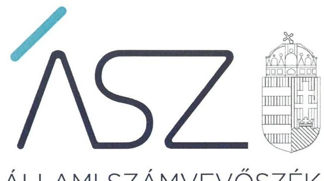
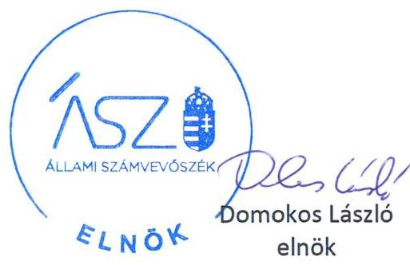
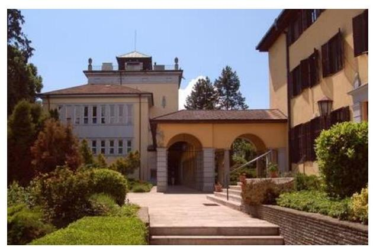

ÁLLAMI SZÁMVEVŐSZÉK

# JELENTÉS 

Az államháztartás központi alrendszerei fejezeteinek ellenőrzése

A Magyar Tudományos Akadémia kutatóközpontjai és kutatóintézetei vagyongazdálkodásának ellenőrzése - MTA Ökológiai Kutatóközpont

2020.

20031
www.asz.hu

---

ÁLLAMI SZÁMVEVŐSZÉK

# JELENTÉS

Az államháztartás központi alrendszerei fejezeteinek ellenőrzése

A Magyar Tudományos Akadémia kutatóközpontjai és kutatóintézetei vagyongazdálkodásának ellenőrzése – MTA Ökológiai Kutatóközpont

2020. 02. hó 21. nap

20031
www.asz.hu

---

# AZ ELLENŐRZÉST FELÜGYELTE: 

DR. NAGY IMRE felügyeleti vezető

## AZ ELLENŐRZÉST VEZETTE ÉS A VÉGREHAJTÁSÁÉRT FELELŐS:

ÁRPÁSI TIBOR ellenőrzésvezető

## A PROGRAM ÖSSZEÁLLÍTÁSÁÉRT FELELŐS:

## SZALAY NAGY JÁNOS projektvezető

IKTATÓSZÁM: EL-2427-001/2020.
TÉMASZÁM: 2517
ELLENŐRZÉS-AZONOSÍTÓ SZÁM: V086109

Jelentéseink az Országgyúlés számítógépes hálózatán és az interneten a www.asz.hu címen is olvashatóak.

---

# TARTALOMJEGYZÉK 

■ ÖSSZEGZÉS ..... 5
■ AZ ELLENŐRZÉS CÉLJA ..... 6
■ AZ ELLENŐRZÉS TERÜLETE ..... 7
■ AZ ELLENŐRZÉS HÁTTERE, INDOKOLTSÁGA ..... 8
■ A JELENTÉS LÉNYEGES KÉRDÉSKÖRE ..... 9
■ AZ ELLENŐRZÉS HATÓKÖRE ÉS MÓDSZEREI ..... 10
■ MEGÁLLAPÍTÁSOK ..... 12
■ JAVASLATOK ..... 13
■ MELLÉKLETEK ..... 15
I. sz. melléklet: Fogalomtár ..... 15
■ FÜGGELÉKEK ..... 17
I. sz. függelék a jelentéshez ..... 17
II. sz. függelék: Észrevételek ..... 18
■ RÖVIDÍTÉSEK JEGYZÉKE ..... 21

---

.

---

# ÖSSZEGZÉS 

A Magyar Tudományos Akadémia Ökológiai Kutatóközpont a 2016., 2017. és 2018. években nem biztositotta a közvagyonnal való felelős gazdálkodást, a vagyon megőrzésének és célszerú felhasználásának alapvető feltételeit, ami kockázatot jelentett a kutatási közfeladatának ellátására.

## Az ellenőrzés társadalmi indokoltsága

Magyarország versenyképességének és a magyar gazdaság fejlődésének meghatározó tényezője a kutatás-fejlesztésre és az innovációra fordított hazai és uniós források eredményes, hatékony felhasználása. A magyar kutatás-fejlesztés területén kiemelt szerepet játszanak a központi költségvetésből biztosított támogatás felhasználásával múködtetett, 2019. augusztus 31-ig a Magyar Tudományos Akadémia által irányított kutatóintézetek, kutatóközpontok. Az Ökológiai Kutatóközpont az ökológia területén végzett alap- és alkalmazott kutatásokat.

A kutatás-fejlesztési közfeladat eredményes ellátásának feltétele, hogy az ehhez szükséges eszközök a kutatási tevékenységet ténylegesen végző intézeteknél, központoknál rendelkezésre álljanak, továbbá ezekkel a közfeladatuk érdekében, átlátható és elszámoltatható módon, a vagyon megőrzését biztosítva gazdálkodjanak.

Az ellenőrzés indokoltságát erősítette, hogy jogszabályi változás nyomán 2019. szeptember 1-től a kutatóintézetek és kutatóközpontok irányítása az Eötvös Loránd Kutatási Hálózat Titkárságához került át, a kutatóintézetek és kutatóközpontok ezt követően központi költségvetési szervként múködnek tovább. A magyar kutatás-fejlesztés szempontjából kiemelten fontos, hogy az új szervezeti keretek között induló kutatóhálózat életképessége, a közfeladatot szolgáló vagyon megőrzése biztosított legyen.

Az Állami Számvevőszék az ellenőrzési megállapításokon keresztül hozzájárul a közvagyon védelméhez és rámutat a közfeladatot ellátó kutatóhálózat működőképességére is kiható vagyongazdálkodás kockázataira.

## Főbb megállapítások, következtetések, javaslatok

Az MTA Ökológiai Kutatóközpont leltárkészítési és leltározási szabályzat hiányában nem határozta meg a számviteli törvényi előírások végrehajtásához és az éves beszámoló mérlegének alátámasztásához szükséges követelményeket. Ezáltal nem teremtette meg annak a szabályozási feltételeit, hogy az éves beszámoló valós és megbízható képet mutasson a Kutatóközpont vagyonáról, továbbá a beszámolójában szereplő tételek a valóságban is megtalálhatók.
2016., 2017. és 2018. években leltár hiányában nem igazolt, hogy a közvagyonba tartozó kutatási eszközök rendelkezésre álltak a közfeladat ellátásához.

A Kutatóközpont főigazgatójának a Kutatóközpont belső kontrollrendszerének minőségéről tett éves nyilatkozata nem állt összhangban az ellenőrzés megállapításaival, nem adott valós értékelést a gazdálkodás szabályszerűségét biztosító kontrollok kialakításáról és múködéséről, így nem biztosította a szabálytalanságok feltárását és megszüntetését. Ezáltal a főigazgatói nyilatkozat nem töltötte be a szerepét a kontrollrendszer hiányosságainak feltárásában és kijavításában, a felelős gazdálkodás erősítésében.

A közvagyon védelme és a közfeladat ellátása szempontjából elsődleges, hogy a Kutatóközpont intézkedjen a szabálytalanságok megszüntetéséről és a hiányosságok orvoslásáról annak érdekében, hogy helyreálljon a vagyongazdálkodás törvényessége és biztosított legyen a vagyon megőrzése.

---

# AZ ELLENŐRZÉS CÉLJA 

AZ ELLENŐRZÉS CÉLJA annak megállapítása volt, hogy az MTA ${ }^{1}$ kutatóközpontok és kutatóintézetek vagyongazdálkodása során érvényesült-e az átláthatóság és elszámoltathatóság.

---

# AZ ELLENŐRZÉS TERÜLETE 

## MTA Ökológiai Kutatóközpont

Az MTA Ökológiai Kutatóközpontja 2012. január 1-jén alakult meg az MTA Ökológiai és Botanikai Kutatóintézetének és az MTA Duna-kutató Intézetének az MTA Balatoni Limnológiai Kutatóintézetbe történő integrálódásával.

A Kutatóközpont ${ }^{2}$ küldetése a magas színvonalú felfedező és célzott kutatás mind az ökológia szakterületein, mind az ökológiával határos (interdiszciplináris) tudományterületeken. Feladatai közé tartozik, hogy kutatási eredményeivel elősegítse az élővilág és az ökoszisztémák megőrzését; e kutatási eredményeket közölje, megjelenítse a magyarországi, EU-s és nemzetközi szakpolitikában, az oktatásban és az ismeretterjesztésben, így elősegítse a fenntartható fejlődést Magyarországon és külföldön. Feladata továbbá a vácrátóti Nemzeti Botanikus Kert gyűjteményeinek fenntartása, fejlesztése, gondozása. Szakmai kérdésekben a Kutatóközponti Tudományos Tanács fogja össze a három intézetet, a Duna-Kutató Intézetet, a Limnológiai Intézetet és az Ökológiai és Botanikai Intézetet.

A Kutatóközpont a 2016-2018. években önálló jogi személyként, saját költségvetéssel és gazdasági szervezetettel rendelkező köztestületi költségvetési szerv volt, amely felett az irányítási jogot az Magyar Tudományos Akadémia gyakorolta. Az MTA elnöke által kinevezett főigazgató személye az ellenőrzött időszakban nem változott.

A Kutatóközpont éves költségvetési beszámolóiban kimutatott, feladatai ellátásához használt befektetett eszközeinek értéke 2016. évben 2001,3 M Ft, 2017. évben 2005,0 M Ft, míg 2018. évben 2098,8 M Ft volt. A Kutatóközpontnak a 2016-2018. években a nemzeti vagyon körébe tartozó vagyonkezelésbe vett vagyona nem volt, gazdasági társaságban tulajdoni részesedéssel nem rendelkezett.

---

# AZ ELLENŐRZÉS HÁTTERE, INDOKOLTSÁGA 

Az ÁSZ ${ }^{3}$ ellenőrzi az éves költségvetési törvény végrehajtását, az ellenőrzés során feltárt kockázatok és a terület folyamatos értékelésével beazonosított kockázatok kezelése érdekében ellenőrzi többek között a költségvetési szervek gazdálkodását, működését, hogy az ellenőrzések megállapításaival támogassa az ellenőrzött szervezetek szabályszerű gazdálkodását, javaslataival elősegítse az Alaptörvényben megfogalmazott alapvetések érvényesülését a mindennapi életben a szervezetek szintjén. Az ÁSZ megállapításaival elősegíti az ellenőrzöttek közpénzekkel való felelős gazdálkodását, illetve az újszerű megközelítésű ellenőrzéssel hozzájárul az értékteremtő rend kialakításához és megőrzéséhez.

Az ellenőrzés a vagyongazdálkodásra fókuszál.
Az ellenőrzés következtében várhatóan reális kép alakítható ki a vagyongazdálkodás szabályszerűségéről. Az ellenőrzés megállapításai, javaslatai alapján javulhat a kutatóhálózat működésének szabályszerűsége, a kutatásokra fordított közpénzek felhasználásának átláthatósága, a tudomány eredményeinek hasznosulása, hozzájárulva ezzel a „jól irányított állam" működéséhez.

---

# A JELENTÉS LÉNYEGES KÉRDÉSKÖRE 

Az MTA Ökológiai Kutatóközpont vagyongazdálkodására vonatkozó alapvető szabályozása szabályszerü volt-e, vagyongazdálkodása során biztositott volt-e a vagyon megőrzése?

---

# AZ ELLENŐRZÉS HATÓKÖRE ÉS MÓDSZEREI 

## Az ellenőrzés típusa

Megfelelőségi ellenőrzés.

## Az ellenőrzött időszak

Az ellenőrzött időszak a 2016., 2017. és 2018. évek.

## Az ellenőrzés tárgya

Az MTA Ökológia Kutatóközpont vagyongazdálkodásának ellenőrzése.

## Az ellenőrzött szervezet

MTA Ökológia Kutatóközpont

## Az ellenőrzés jogalapja

Az ellenőrzés jogszabályi alapját az ÁSZ tv. ${ }^{4} 1$. § (3) bekezdése és 5. § (2)(4) és (6) bekezdései, valamint az Áht. ${ }^{5} 61 . \S$ (2) bekezdésének előírásai képezték.

## Az ellenőrzés módszerei

Az ÁSZ az ellenőrzést a szakmai program szempontjai, az ellenőrzött időszakban hatályos jogszabályok, az ellenőrzés szakmai szabályai, a jelen ellenőrzésre irányadó ÁSZ módszertanok figyelembevételével végezte.

Az ellenőrzés ideje alatt az ellenőrzött szervezettel történő kapcsolattartást az ÁSZ Szervezeti és Múködési Szabályzatának vonatkozó előírásai alapján biztosította az ÁSZ.

Az ellenőrzési kérdések megválaszolásához szükséges bizonyítékok megszerzése az ellenőrzött által rendelkezésre bocsátott dokumentumokra, adatokra alapozva megfigyelés, szemle (szemrevételezés), kérdésfeltevés (információkérés), valamint elemző eljárás útján történt. Az ellenőrzési bizonyítékként felhasználható adatforrások közé tartoztak egyrészt az ellenőrzési program részletes szempontjainál felsorolt adatforrások, másrészt minden egyéb - az ellenőrzés folyamán feltárt, az ellenőrzés szempontjából információt tartalmazó - dokumentum. Az ellenőrzés lefolytatásához az ellenőrzött szervezet az ÁSZ által kért dokumentumok

---

megküldésével szolgáltatott adatokat, amelyek valódiságát és teljes körűségét az adatszolgáltató szervezet vezetője által tett teljességi és hitelességi nyilatkozat igazolta. Az így rendelkezésre bocsátott adatok, információk kontrollja az ellenőrzés keretében történt.

Amennyiben az ellenőrzött szervezet vagyongazdálkodását alapvetően meghatározó dokumentum hiánya miatt valamely lényeges kérdéskörre vonatkozóan az ÁSZ megállapítást tett, további ellenőrzési tevékenységek az adott kérdéskörrel és az azzal szoros logikai kapcsolatban lévő kérdéskörökkel - ráépülő jelleggel - nem kerültek végrehajtásra.

---

# MEGÁLLAPÍTÁSOK 

## Az MTA Ökológiai Kutatóközpont vagyongazdálkodására vonatkozó alapvető szabályozása szabályszerű volt-e, vagyongazdálkodása során biztosított volt-e a vagyon megőrzése?

Összegző megállapítás

Az MTA Ökológiai Kutatóközpont vagyongazdálkodása a 20162018. években nem volt szabályszerű.

A Kutatóközpont az ellenőrzött időszakban nem rendelkezett a Számv. tv. ${ }^{6}$ 14. § (5) bekezdés a) pontjában előírt eszközök és források leltárkészítési és leltározási szabályzatával. A szabályozás hiánya miatt nem volt biztosított a leltározás végrehajtásának és a mérlegtételeket alátámasztó leltárak összeállításának feltételrendszere.

A Kutatóközpont a 2016-2018. években az éves költségvetési beszámolók mérlegtételeit a Számv. tv. 69. § (1) bekezdésében foglaltak és az Áhsz. 22. § (1) bekezdése előírásainak ellenére - a mérleg fordulónapján meglévő eszközöket és forrásokat mennyiségben és értékben tételesen, ellenőrizhető módon tartalmazó - leltárral nem támasztotta alá.

A Kutatóközpont 2016. január 1. és 2016. május 31. között a Számv. tv. 14. § (5) bekezdés b) pontjában foglaltak ellenére nem rendelkezett eszközök és a források értékelési szabályzatával.

A Kutatóközpont Számviteli politikájában ${ }_{1,2}{ }^{7}$ a Számv. tv. 14. § (4) bekezdésében előírtak ellenére nem rögzítette azokat a jellemző szabályokat, előírásokat, módszereket, amelyekkel meghatározza, hogy mit tekint a számviteli elszámolás, az értékelés szempontjából kivételes nagyságú vagy előfordulású bevételnek, költségnek, ráfordításnak, továbbá nem határozta meg, hogy a törvényben biztosított választási, minősítési lehetőségek közül melyeket, milyen feltételek fennállása esetén alkalmaz, az alkalmazott gyakorlatot milyen okok miatt kell megváltoztatni.

Az ÁSZ ellenőrzése az alapvető szabályozási és vagyongazdálkodási hiányosságok miatt nem igazolta vissza a 2016-2018. évekre vonatkozóan a Kutatóintézet főigazgatójának a belső kontrollrendszer kialakításáról, szabályszerű, eredményes, gazdaságos és hatékony működéséről a Bkr. ${ }^{8}$ előírása szerint tett vezetői nyilatkozataiban foglaltakat.

---

# JAVASLATOK 

Az ÁSZ tv. 33. § (1) bekezdésében foglaltak értelmében az ellenőrzött szervezet vezetője köteles a jelentésben foglalt megállapításokhoz kapcsolódó intézkedési tervet összeállítani és azt a jelentés kézhezvételétől számított 30 napon belül az ÁSZ részére megküldeni. Amennyiben az ellenőrzött szervezet vezetője nem küldi meg határidőben az intézkedési tervet, vagy továbbra sem elfogadható intézkedési tervet küld, az Állami Számvevőszék elnöke az ÁSZ tv. 33. § (3) bekezdése a) és b) pontjaiban foglaltakat érvényesítheti.

## Ökológiai Kutatóközpont föigazgatója részére

1. Intézkedjen az eszközök és források leltározási és leltárkészítési szabályzatának elkészitéséről a jogszabályi előirásnak megfelelően.
(1. sz. megállapítás 1. bekezdése alapján)
2. Intézkedjen minden évben leltár összeállításáról a jogszabályi előírásoknak megfelelően.
(1. sz. megállapítás 2. bekezdése alapján)
3. Intézkedjen, hogy a jogszabályi előírásnak megfelelő számviteli politikával rendelkezzen.
(1. sz. megállapítás 4. bekezdése alapján)

---

.

---

# MELLÉKLETEK 

- I. SZ. MELLÉKLET: FOGALOMTÁR
állami vagyon
állami vagyon használója
állami vagyon kezelője /vagyonkezelő
hasznosítás
közfeladat
köztestület

MTA kutatóhálózat

Állami vagyonnak minősül:
a) az állam tulajdonában lévő dolog, valamint a dolog módjára hasznosítható természeti erő,
b) az a) pont hatálya alá nem tartozó mindazon vagyon, amely vonatkozásában törvény az állam kizárólagos tulajdonjogát nevesíti,
c) az állam tulajdonában lévő tagsági jogviszonyt megtestesítő értékpapír, illetve az államot megillető egyéb társasági részesedés,
d) az államot megillető olyan immateriális, vagyoni értékkel rendelkező jogosultság, amelyet jogszabály vagyoni értékű jogként nevesít. (Forrás: Vtv. ${ }^{9}$ 1. § (2) bekezdése)
az a természetes vagy jogi személy, jogi személyiséggel nem rendelkező szervezet, aki, vagy amely törvény vagy szerződés alapján, bármely jogcímen (bérlet, haszonbérlet, használat stb.) állami vagyont birtokol, használ, szedi annak hasznait, hasznosít, ide nem értve a haszonélvezőt, a vagyonkezelőt és a tulajdonosi jogok gyakorlóját (Forrás: Vtvr. ${ }^{10}$ 1. § (7) bekezdés a) pont, hatályos 2012. január 1-jétől)
Az állami vagyont az MNV Zrt. ${ }^{11}$ maga kezeli, vagy szerződés - így különösen bérlet, haszonbérlet, megbízás - alapján központi költségvetési szervnek, természetes vagy jogi személynek, vagy jogi személyiséggel nem rendelkező gazdálkodó szervezetnek hasznosításra átengedi." Az állami vagyonra vonatkozóan az MNV Zrt. kizárólag az Nvtv ${ }^{12}$-ben meghatározott személyekkel köthet vagyonkezelési szerződést. (Forrás: Vtv. 27. § (1) bekezdése, hatályos 2012. január 1-jétől)
az állami vagyon bármely - a tulajdonjog átruházását nem eredményező - módon, jogcímen történő átadása, átengedése, ide nem értve a haszonélvezeti jog létesítését, valamint a vagyonkezelésbe adást (Forrás: Vtvr. 1. § (7) bekezdés e) pont, hatályos 2012. január 1-jétől);
Jogszabályban meghatározott állami vagy önkormányzati feladat, amit az arra kötelezett közérdekből, a jogszabályban meghatározott követelményeknek és feltételeknek megfelelve végez, ideértve a lakosság közszolgáltatásokkal való ellátását, továbbá az állam nemzetközi szerződésekben vállalt kötelezettségeiből adódó közérdekű feladatokat, valamint e feladatok ellátásakor szükséges infrastruktúra biztosítását is. (Forrás: Nvtv. 3. § (1) bekezdés 7. pontja).
A köztestület önkormányzattal és nyilvántartott tagsággal rendelkező szervezet, amelynek létrehozását törvény rendeli el. A köztestület a tagságához, illetve a tagsága által végzett tevékenységhez kapcsolódó közfeladatot lát el. A köztestület jogi személy. Köztestület különösen a Magyar Tudományos Akadémia. (Forrás: 2006. évi LXV. törvény ${ }^{13}$ 8/A. § (1)-(2) bekezdés).
AZ MTA feladatainak ellátása céljából közfinanszírozású kutatóhálózatot létesít és működtet, amely felett irányítási jogot gyakorol. (forrás: MTAtv. ${ }^{14}$ 2. § (1) bekezdés, hatályos 2019. augusztus 31-ig)
Az MTA kutatóhálózata 10 kutatóközpontból és bennük 38 intézetből, 5 önálló jogállású kutatóintézetből, 96 akadémiai támogatású egyetemi, illetve közgyűjteményekben létesített kutatócsoportból, valamint 95 Lendület-kutatócsoportból (együttesen: kutatóhely) áll.

---

MTA Kutatóközpont

Az akadémiai kutatóközpont költségvetési szerv. A kutatóközpont autonóm módon vesz részt az Akadémia közfeladatainak megoldásában, önállóan is vállal közfeladatokat, továbbá egyéb tevékenységet is végezhet. Tudományos tevékenységéről és gazdálkodásáról évente beszámolót készít, amelyet az Akadémia az e törvényben és az Alapszabályban leírtak szerint értékel. (forrás: MTAtv. 18. § (1) bekezdés, hatályos 2019. augusztus 31-ig)

---

# FÜGGELÉKEK 

- I. SZ. FÜGGELÉK A JELENTÉSHEZ

Az Állami Számvevőszék az ellenőrzések során feltárt tényekhez kapcsolódó további körülmények tisztázására eszközrendszerrel nem rendelkezik. Amennyiben az ellenőrzésen túlmutatóan indokoltnak látszik az ellenőrzés során feltárt körülmények további vizsgálata, az Állami Számvevőszék törvényi felhatalmazás alapján az ellenőrzés által feltárt körülményeket továbbítja a hatáskörrel rendelkező szervnek a szükséges intézkedések megtétele, eljárások lefolytatása érdekében.
I.

1. Az MTA Ökológiai Kutatóközpont a 2016-2018. évi éves költségvetési beszámolói mérlegtételeit nem támasztotta alá leltárral, amely tételesen, ellenőrizhető módon tartalmazza a mérleg fordulónapján meglévő eszközöket és forrásokat mennyiségben és értékben. Ezzel megsértette az Áhsz. 5. § (1) bekezdésében és 22. § (1) bekezdésében, valamint a Számv. tv. 69. § (1) bekezdésében előírtakat.
2. Az MTA Ökológiai Kutatóközpont a 2016-2018. években a Számv. tv. 14. § (5) pont a) bekezdésében foglaltak ellenére nem rendelkezett az eszközök és a források leltározási és leltárkészítési szabályzatával.
A szabályozottság és a leltár hiányában nem igazolt, hogy a 2016-2018. évi éves költségvetési beszámolók mérlegében szereplő tételek a valóságban is megtalálhatóak, továbbá nem igazolt, hogy az eszközeit és forrásait a feladatkörébe tartozó feladatra használta fel. Ezért felmerül a gyanú, hogy az MTA Ökológiai Kutatóközpontot vagyoni hátrány érhette.
Az eset körülményeinek felderítésére a nyomozó hatóság rendelkezik hatáskörrel.
II.

A fentiekben rögzített, leltárra vonatkozó hiányosságok miatt nem igazolt, hogy a 20162018. évi éves költségvetési beszámolók megbízható, valós összképet mutatnak az MTA Ökológiai Kutatóközpont vagyonáról, annak összetételéről.
Az eset teljes körü feltárására a Nemzeti Adó- és Vámhivatal rendelkezik hatáskörrel.

---

A jelentéstervezetet a Számvevőszék 15 napos észrevételezésre megküldte az ellenőrzött szervezet vezetőjének az ÁSZ tv. 29. §* (1) bekezdése előírásának megfelelően.

Az Ökológiai Kutatóközpont föigazgatója a jelentéstervezet megállapításaira írásban észrevételt tett.
Az ÁSZ tv. 29. § (3) bekezdésével összhangban az ÁSZ a Függelékben feltünteti az ellenőrzés megállapításaival kapcsolatban tett, figyelembe nem vett észrevételeket, és megindokolja, hogy azokat miért nem fogadta el.

[^0]
[^0]:    * 29. § (1) Az Állami Számvevőszék az ellenőrzési megállapításait megküldi az ellenőrzött szervezet vezetőjének vagy az általa megbízott személynek, és annak, akinek személyes felelősségét állapította meg.
    (2) Az ellenőrzött szervezet vezetője és a felelősként megjelölt személy az ellenőrzés megállapításaira tizenöt napon belül írásban észrevételt tehet.
    (3) Az Állami Számvevőszék az észrevételre a beérkezésétől számított harminc napon belül írásban válaszol. A figyelembe nem vett észrevételeket köteles a jelentésben feltüntetni, és megindokolni, hogy azokat miért nem fogadta el.

---

A számvevőszéki jelentéstervezet megállapításaival kapcsolatban a főigazgató által 2019. december 16-án tett (az Állami Számvevőszékhez 2019. december 18-án érkezett) el nem fogadott észrevételek és azok kezelésének indokolása.

# 1. Az 1. számú megállapítás 1. bekezdésére tett észrevétel: 

A főigazgató észrevételében jelezte, hogy az ellenőrzés rendelkezésére bocsátott dokumentumok alapján valóban úgy tűnhet, hogy az Ökológiai Kutatóközpont (továbbiakban: Kutatóközpont) nem rendelkezik Eszközök és források leltározási és leltárkészítési szabályzatával, mert a feltöltés során a szabályzat helyett kétszer töltötték fel a szabályzat módosítását.

Az ÁSZ az ellenőrzési megállapításait az adatszolgáltatás során a részére törvényi határidőben rendelkezésre bocsátott dokumentumokra alapozva fogalmazza meg. Az észrevételéhez mellékelt, a törvényi határidőn túl utólagosan megküldött dokumentumot az Állami Számvevőszék nem értékeli. A teljességi és hitelességi nyilatkozatuk szerint az Állami Számvevőszék részére átadott dokumentumok, adatok megbízhatóak, és a bekért adatokra, dokumentumokra vonatkozóan teljes körű információt tartalmaznak. A teljességi és hitelességi nyilatkozat alapján a Kutatóközpont az adatszolgáltatás során a Számv. tv. 14. § (5) bekezdés a) pontjában előírt eszközök és források leltárkészítési és leltározási szabályzatát nem bocsátotta az ellenőrzés rendelkezésére. Ennek tényét az észrevételben foglaltak is megerősítik. Az előbbiekre tekintettel az észrevételt nem fogadtuk el, a jelentéstervezet módosítása nem indokolt.

## 2. A jelentéstervezet 1. számú megállapítás 2. bekezdésére tett észrevétel:

A főigazgató észrevételében jelezte, hogy az ellenőrzött időszakban 2018. december 31-i fordulónappal készült tételes felvevő leltár, amelynek jegyzőkönyvét, kiértékelését feltöltötték az adatszolgáltatás során. A 2016. és 2017. években az analitika és a főkönyv egyeztetése megtörtént, amelynek dokumentumait szintén az ellenőrzés rendelkezésére bocsátották.

Az Állami Számvevőszék az ellenőrzési megállapításait az adatszolgáltatás során a részére törvényi határidőben rendelkezésre bocsátott dokumentumokra alapozva fogalmazza meg. A teljességi és hitelességi nyilatkozatuk szerint az Állami Számvevőszék részére átadott dokumentumok, adatok megbízhatóak, és a bekért adatokra, dokumentumokra vonatkozóan teljes körű információt tartalmaznak. A teljességi és hitelességi nyilatkozat alapján a Kutatóközpont az adatszolgáltatás során a 2016-2018. évekre vonatkozóan az éves beszámoló mérlegtételeit alátámasztó, a Számv. tv. 69. § (1) bekezdésben előírtak szerint összeállított leltárt igazoló dokumentumokat nem bocsátott az ellenőrzés rendelkezésére. Leltár dokumentumaként az ellenőrzés rendelkezésére bocsátott főkönyvi kivonatok, eredmény-kimutatás, áfa bevallás, együttműködési megállapodás, szerződések nem igazolják a Számv. tv. 69. § (2) bekezdésében előírt egyeztetés elvégzését, így a Számv. tv. 69. § (1) bekezdésében foglaltak ellenére nem támasztják alá a mérleg tételeit tételesen és ellenőrizhető módon mennyiségben és értékben. Az előbbiekre tekintettel az észrevételt nem fogadtuk el, a jelentéstervezet módosítása nem indokolt.

## 3. A jelentéstervezet 1. számú megállapítás 3. bekezdésére tett észrevétel:

A főigazgató észrevételében jelezte, hogy a Kutatóközpont valóban nem rendelkezett 2016. január 1-től május 31-ig Eszközök és források értékelési szabályzatával, de a 2016. június 1-jén kiadott szabályzat rendelkezéseit 2016. január 1-jei visszamenőleges hatállyal kell alkalmazni.

Az adatszolgáltatás során az ellenőrzés rendelkezésére bocsátott eszközök és a források értékelési szabályzatának záró rendelkezése tartalmazza, hogy a szabályzatban foglaltakat 2016. január 1-jétől kell alkalmazni. A kiadmányozás dátuma szerint azonban a szabályzatot a gazdálkodó képviseletére jogosult személy 2016. június 1-jén készítette el. Az előbbiekből következően a Kutatóközpont 2016. január 1. és 2016. május 31. között a Számv. tv. 14. § (5) bekezdés b) pontjában foglaltak ellenére nem rendelkezett eszközök és a források értékelési szabályzatával, ennek tényét az észrevételben foglaltak is megerősítik. Az előbbiekre tekintettel az észrevételt nem fogadtuk el, a jelentéstervezet módosítása nem indokolt.

---

.

---

# RÖVIDÍTÉSEK JEGYZÉKE 

${ }^{1}$ MTA
${ }^{2}$ kutatóközpont
${ }^{3}$ ÁSZ
${ }^{4}$ ÁSZ tv.
${ }^{5}$ Áht.
${ }^{6}$ Számv. tv.
${ }^{7}$ Számviteli politika ${ }_{1,2}$
${ }^{8}$ Bkr.
${ }^{9}$ Vtv.
${ }^{10}$ Vtvr.
${ }^{11}$ MNV Zrt.
${ }^{12}$ Nvtv.
${ }^{13}$ 2006. évi LXV. törvény
${ }^{14}$ MTAtv.

Magyar Tudományos Akadémia
MTA Ökológiai Kutatóközpont
Állami Számvevőszék
2011. évi LXVI. törvény az Állami Számvevőszékről (hatályos: 2011. július 1-től)
2011. évi CXCV. törvény az államháztartásról (hatályos: 2012. január 1-től)
2000. évi. C. törvény a számvitelről (hatályos: 2001. január 1-től)

Magyar Tudományos Akadémia Ökológiai Kutatóközpont Számviteli politikája
Számviteli politika1 (hatályos: 2016. január 1-től)
Számviteli politika2 (hatályos: 2017. január 1-től)
370/2011. (XII. 31.) Korm. rendelet a költségvetési szervek belső
kontrollrendszeréről és belső ellenőrzéséről (hatályos: 2012. január 1-től)
2007. évi CVI. törvény az állami vagyonról (hatályos: 2007. szeptember 15-től)
254/2007. (X. 4.) Korm. rendelet az állami vagyonnal való gazdálkodásról
(hatályos: 2007. október 4-től)
Magyar Nemzeti Vagyonkezelő Zrt.
2011. évi CXCVI. törvény a nemzeti vagyonról (hatályos: 2011. december 31-től)
2006. évi LXV. törvény az államháztartásról szóló 1992. évi XXXVIII. törvény és egyes kapcsolódó törvények módosításáról (hatályos: 2012. augusztus 24-től)
1994. évi XL. törvény a Magyar Tudományos Akadémiáról
(hatályos: 1994. június 30-tól)

---

# ASZ 

ALLAMI SZAMVEVOSZEK
1052 Budapest, Apáczai Cs. J. u. 10. I 1364 Budapest 4. Pf. 54 TEL: +36 14849100
email: szamvevoszek@asz.hu
web: www.asz.hu | www.aszhirportal.hu