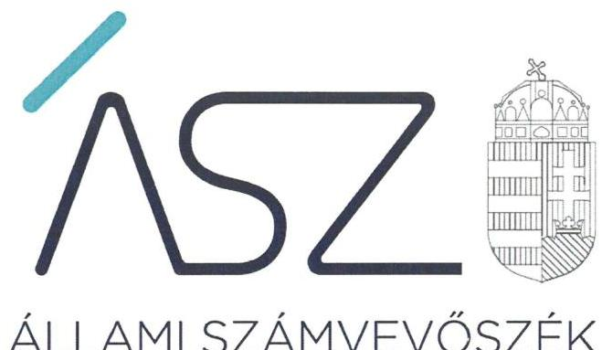
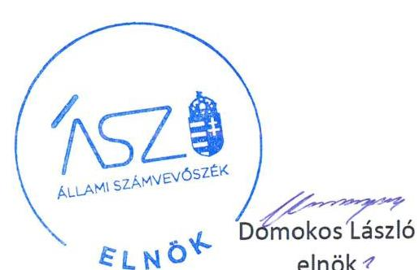
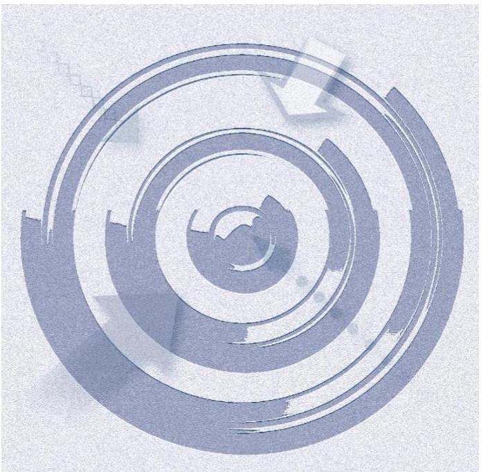

ÁLLAMI SZÁMVEVŐSZÉK

# JELENTÉS 

Az államháztartás központi alrendszerei fejezeteinek ellenőrzése

A Magyar Tudományos Akadémia kutatóközpontjai és kutatóintézetei vagyongazdálkodásának ellenőrzése - MTA Agrártudományi Kutatóközpont

2020.

20032
www.asz.hu

---

ÁLLAMI SZÁMVEVŐSZÉK

# JELENTÉS 

Az államháztartás központi alrendszerei fejezeteinek ellenőrzése

A Magyar Tudományos Akadémia kutatóközpontjai és kutatóintézetei vagyongazdálkodásának ellenőrzése - MTA Agrártudományi Kutatóközpont
2020. 02 . hó 24. nap

20032
www.asz.hu

---

AZ ELLENŐRZÉST FELÜGYELTE:
DR. NAGY IMRE felügyeleti vezető

AZ ELLENŐRZÉST VEZETTE ÉS A VÉGREHAJTÁSÁÉRT FELELŐS:
DR. GÁL NÓRA ellenőrzésvezető

A PROGRAM ÖSSZEÁLLÍTÁSÁÉRT FELELŐS:
SZALAY NAGY JÁNOS projektvezető

IKTATÓSZÁM: EL-2426-001/2020.
TÉMASZÁM: 2517
ELLENŐRZÉS-AZONOSÍTÓ SZÁM: V086101

Jelentéseink az Országgyúlés számítógépes hálózatán és az Interneten a www.asz.hu címen is olvashatóak.

---

# TARTALOMJEGYZÉK 

■ ÖSSZEGZÉS ..... 5
■ AZ ELLENŐRZÉS CÉLJA ..... 6
■ AZ ELLENŐRZÉS TERÜLETE ..... 7
■ AZ ELLENŐRZÉS HÁTTERE, INDOKOLTSÁGA ..... 8
■ A JELENTÉS LÉNYEGES KÉRDÉSKÖREI ..... 9
■ AZ ELLENŐRZÉS HATÓKÖRE ÉS MÓDSZEREI ..... 10
■ MEGÁLLAPÍTÁSOK ..... 12
■ JAVASLATOK ..... 13
■ MELLÉKLETEK ..... 15
I. sz. melléklet: Értelmező szótár ..... 15
■ FÜGGELÉKEK ..... 17
I. sz. függelék a jelentéshez ..... 17
II. sz. függelék: Észrevételek ..... 18
■ RÖVIDÍTÉSEK JEGYZÉKE ..... 21

---

.

---

# ÖSSZEGZÉS 

A Magyar Tudományos Akadémia Agrártudományi Kutatóközpont a 2016., 2017. és 2018. években nem biztosította a közvagyon megőrzését, ami kockázatot jelentett a kutatási közfeladatok célszerú ellátására.

## Az ellenőrzés társadalmi indokoltsága

Magyarország versenyképességének és a magyar gazdaság fejlődésének meghatározó tényezője a kutatás-fejlesztésre és az innovációra fordított hazai és uniós források eredményes, hatékony felhasználása. A magyar kutatás-fejlesztés területén kiemelt szerepet játszanak a központi költségvetésből biztosított támogatás felhasználásával múködtetett, 2019. augusztus 31-ig a Magyar Tudományos Akadémia által irányított kutatóintézetek, kutatóközpontok. Az Agrártudományi Kutatóközpont az agrártudományok területén végzett alkalmazott kutatásokat és fejlesztéseket.

A kutatás-fejlesztési közfeladat eredményes ellátásának feltétele, hogy az ehhez szükséges eszközök a kutatási tevékenységet ténylegesen végző intézeteknél, központoknál rendelkezésre álljanak, továbbá ezekkel a közfeladatuk érdekében, átlátható és elszámoltatható módon, a vagyon megőrzését biztosítva gazdálkodjanak.

Az ellenőrzés indokoltságát erősítette, hogy jogszabályi változás nyomán 2019. szeptember 1-től a kutatóintézetek és kutatóközpontok irányítása az Eötvös Loránd Kutatási Hálózat Titkárságához került át, a kutatóintézetek és kutatóközpontok ezt követően központi költségvetési szervként működnek tovább. A magyar kutatás-fejlesztés szempontjából kiemelten fontos, hogy az új szervezeti keretek között induló kutatóhálózat életképessége, a közfeladatot szolgáló vagyon megőrzése biztosított legyen.
Az Állami Számvevőszék az ellenőrzési megállapításokon keresztül hozzájárul a közvagyon védelméhez és rámutat a közfeladatot ellátó kutatóhálózat működőképességére is kiható vagyongazdálkodás kockázataira.

## Főbb megállapítások, következtetések, javaslatok

A Magyar Tudományos Akadémia Agrártudományi Kutatóközpont vagyongazdálkodása nem volt szabályszerű, az éves beszámoló mérlegtételeit leltárral nem támasztotta alá. Leltár hiányában nem volt biztosított, hogy a kutatóközpont beszámolóiban szereplő tételek a valóságban is megtalálhatóak és a közvagyonba tartozó kutatási eszközök a közfeladat ellátásához rendelkezésre állnak. Így nem tett eleget a vagyon megőrzésére, védelmére előírt alapvető követelményeknek.

A kutatóközpont főigazgatójának a belső kontrollrendszer minőségéről tett éves nyilatkozata nem állt összhangban az ellenőrzés megállapításaival, nem adott valós értékelést a gazdálkodás szabályszerűségét biztosító kontrollok működtetéséről, nem biztosította a szabálytalanságok feltárását és megszüntetését. Így a főigazgatói nyilatkozat nem töltötte be a szerepét a felelős gazdálkodás erősítésében.

A közvagyon védelme és a közfeladat ellátása szempontjából elsődleges, hogy a kutatóközpont intézkedjen a szabálytalanságok megszüntetéséről és a hiányosságok orvoslásáról annak érdekében, hogy helyreálljon a vagyongazdálkodás törvényessége és biztosított legyen a vagyon megőrzése.

Az Állami Számvevőszék az intézkedések megtétele céljából a Magyar Tudományos Akadémia Agrártudományi Kutatóközpont főigazgatója részére két javaslatot fogalmazott meg, melyre az érintettnek 30 napon belül intézkedési tervet kell készítenie.

---

# AZ ELLENŐRZÉS CÉLJA

**AZ ELLENŐRZÉS CÉLJA** annak megállapítása, hogy az MTA kutatóközpontok és kutatóintézetek vagyongazdálkodása során érvényesült-e az átláthatóság és elszámoltathatóság. Az ellenőrzés a fejezethez tartozó intézmények kockázatértékelése alapján, az egyedi és lényeges jellemzők figyelembevételével történik.

---

# **AZ ELLENŐRZÉS TERÜLETE**

## **MTA Agrártudományi Kutatóközpont**

Az MTA Agrártudományi Kutatóközpont 2012. január 1-jén az MTA Állatorvos-tudományi Kutatóintézet, az MTA Növényvédelmi Kutatóintézet, és az MTA Talajtani és Agrokémiai Kutatóintézet MTA Mezőgazdasági Kutatóintézetébe történő beolvadásával jött létre.

Az ellenőrzött időszakban az MTA ATK¹ önálló jogi személy, köztestületi költségvetési szerv volt, az MTAtv.² 3. §-ában megjelölt közfeladatokat látta el, az irányító szerve az MTA³ volt.

Az MTA ATK közfeladatként ellátott alaptevékenységének célja, hogy alapkutatásokat, alkalmazott kutatásokat és fejlesztéseket végezzen az agrártudományok területén, valamint részt vegyen a tudományos és szakmai ismeretek átadásában.

A kutatóközpontot a Főigazgató vezette, az ellenőrzött időszakban a Főigazgató személyében nem történt változás.

A kutatóközpont egyrészt saját vagyonnal, másrészt az MTA-tól használatba átvett vagyonnal rendelkezett. Az MTA a használatra átadott vagyon feletti rendelkezési jogot megtartotta, az eszközök használatával kapcsolatos feladatokat és a költségek viselését továbbadta a kutatóközpontnak. Az MTA és a kutatóközpont közötti használati szerződés alapján a kutatóközpont volt köteles gondoskodni az eszközök állagmegóvásáról, továbbá viselni az eszközök működtetésével összefüggő üzemeltetési, fenntartási és javítási költségeket.

A kutatóközpont a közfeladatai ellátásához az MTA-tól 29 ingatlant és 3,4 Mrd Ft értékű ingó vagyont vett át használatra.

Az MTA ATK rendelkezésére álló vagyon 2018. évben nagyságrendileg 13 Mrd Ft volt.

A kutatóközpont átlagos statisztikai állományi létszáma 2016-ban 426 fő, míg 2018-ban 467 fő volt.

---

# AZ ELLENŐRZÉS HÁTTERE, INDOKOLTSÁGA 

Az ÁSZ ${ }^{4}$ ellenőrzi a költségvetési szervek gazdálkodását, működését, hogy megállapításaival támogassa az ellenőrzött szervezetek szabályszerű gazdálkodását, javaslataival elősegítse az Alaptörvényben ${ }^{5}$ megfogalmazott alapvetések érvényesülését a mindennapi életben a szervezetek szintjén. A központi költségvetés rendszerében zajló folyamatok holisztikus elemzései, a kockázatok folyamatos figyelemmel kísérésének módszerével, az így kiválasztott szervezetek célzott, hatékony ellenőrzéseivel az ÁSZ betölti a legfőbb gazdasági ellenőrző szerv küldetését. Az egyes ellenőrzések megállapításaival és egy időszak ellenőrzési eredményeinek elemzésével az ÁSZ ráirányíthatja a jogalkotók figyelmét a központi alrendszerben vagy annak egy ágazatában esetlegesen felmerülő pénzügyi, szabályozási feszültségekre. Az elvégzett ellenőrzések során az ÁSZ „jó gyakorlatokat" is azonosíthat, melyeket tanácsadó funkciója keretében szélesebb körben is megismertethet az érintettekkel, ezáltal is hozzájárulva a költségvetési rendszer szabályozott, átlátható, kiegyensúlyozott és fenntartható működéséhez.

Az államháztartás központi költségvetésében önálló fejezetet alkotó MTA és az MTA kutatóközpontok és kutatóintézetek közpénz felhasználása, az intézmények által országosan ellátott közfeladatok, valamint a feladatellátásához rendelt vagyon nagyságrendje indokolja, hogy az ÁSZ ellenőrzéseket folytasson a vagyongazdálkodás területén. Az ÁSZ az ellenőrzései során feltárja az ellenőrzött szervezet által nem szabályozott gazdálkodási területeket, rámutat a vagyongazdálkodási tevékenység - ezen belül a tulajdonosi joggyakorlás és vagyonkezelés - esetleges szabálytalanságaira, értékeli az állami vagyon nyilvántartására és elszámolására vonatkozó eljárásokat.

---

# A JELENTÉS LÉNYEGES KÉRDÉSKÖREI 

1. Az MTA kutatóközpont vagyongazdálkodására vonatkozó alapvető szabályozása szabályszerü volt-e?
2. Az MTA kutatóközpont vagyongazdálkodása során biztositott volt-e a vagyon megőrzése?

---

# AZ ELLENŐRZÉS HATÓKÖRE ÉS MÓDSZEREI 

## Az ellenőrzés típusa

Megfelelőségi ellenőrzés.

## Az ellenőrzött időszak

2016., 2017., 2018. évek.

## Az ellenőrzés tárgya

Magyar Tudományos Akadémia Agrártudományi Kutatóközpont vagyongazdálkodásának ellenőrzése.

## Az ellenőrzött szervezet

Magyar Tudományos Akadémia Agrártudományi Kutatóközpont

## Az ellenőrzés jogalapja

Az ellenőrzés jogszabályi alapját az ÁSZ tv. ${ }^{6} 1 . \S$ (3) bekezdés, 5. § (2)-(4) és (6) bekezdései, valamint az Áht. ${ }^{7} 61 . \S$ (2) bekezdésének előírásai képezik.

## Az ellenőrzés módszerei

Az ÁSZ az ellenőrzést az ellenőrzési program szempontjai, az ellenőrzött időszakban hatályos jogszabályok, az ellenőrzés szakmai szabályai, a jelen ellenőrzésre irányadó ÁSZ módszertanok figyelembevételével hajtotta végre.

Az ellenőrzési kérdések megválaszolásához szükséges bizonyítékok megszerzése az ellenőrzött által rendelkezésre bocsátott dokumentumokon alapult. Az ellenőrzési bizonyítékként felhasználható adatforrások közé tartoznak egyrészt az ellenőrzési program részletes szempontjainál felsorolt adatforrások, másrészt minden egyéb - az ellenőrzés folyamán feltárt, az ellenőrzés szempontjából információt tartalmazó - dokumentum. Az ellenőrzés lefolytatásához az ellenőrzött szervezet az ÁSZ által kért dokumentumok megküldésével szolgáltat adatokat, amelyek valódiságát és teljes körűségét az adatszolgáltató szervezet vezetője által tett teljességi és hitelességi nyilatkozat igazolja. Az így rendelkezésre bocsátott adatok, információk kontrollja az ellenőrzés keretében történt.

---

Az ellenőrzés ideje alatt az ellenőrzött szervezettel történő kapcsolattartást az ÁSZ SZMSZ-ének vonatkozó előírásai alapján biztosítottuk.

---

# 1. Az MTA kutatóközpont vagyongazdálkodására vonatkozó alapvető szabályozása szabályszerű volt-e? 

Összegző megállapítás

Az MTA ATK vagyongazdálkodásának 2016-2018. évi szabályozása szabályszerű volt.

A Kutatóintézet rendelkezett az Áht. 10. § (5) bekezdésében előírtak szerinti SZMSZ ${ }_{1,2}{ }^{8}$-szel.

Az MTA ATK gazdasági szervezetére vonatkozó szabályokat Ügyrend ${ }_{1,2}{ }^{9}$ ben rögzítették az Áht. és az Ávr. ${ }^{10}$ előírásaival összhangban. Rendelkeztek az Ávr. előírásának megfelelően a gazdálkodás részletes rendjét leíró Gazdálkodási szabályzat ${ }_{1,2}{ }^{11}$-tal. Az Ávr. előírása alapján a kötelezettségvállalásra, teljesítés igazolására jogosult személyekről és aláírás-mintájukról nyilvántartást vezettek.

A Számv. tv. ${ }^{12}$, valamint az Áhsz. ${ }^{13}$ előírásaival összhangban rendelkeztek Számviteli politika ${ }_{1-4}{ }^{14}$-val, az Eszközök és a források leltárkészítési és leltározási szabályzata ${ }^{15}$-val és az Eszközök és források értékelési szabály-zata ${ }_{1-3}{ }^{16}$-val.

## 2. Az MTA kutatóközpont vagyongazdálkodása során biztosított volt-e a vagyon megőrzése?

## Összegző megállapítás

Az MTA ATK vagyongazdálkodása a 2016-2018. években nem volt szabályszerű.

A 2016-2018. években a Kutatóközpont nem rendelkezett olyan leltárral, amely az Áhsz. 5. § (1) bekezdésében, 22. § (1) bekezdésében, valamint a Számv. tv. 69. § (1) bekezdésében előírtak szerint tételesen, ellenőrizhető módon tartalmazta a mérleg fordulónapján meglévő eszközöket és forrásokat, ezáltal a beszámoló megbízhatósága nem volt biztosított.

A Kutatóközpont a 2016-2018. évek egyikében sem végzett olyan mennyiségi felvétellel történő leltározást, amely az Áhsz. 22. § (2) bekezdésében, valamint a Számv. tv. 69. § (3) bekezdésében előírtak szerint tételesen, ellenőrizhető módon tartalmazta a mérleg fordulónapján meglévő eszközöket és forrásokat.

A főigazgató a Bkr. ${ }^{17}$ előírása szerint nyilatkozatban értékelte a költségvetési szerv belső kontrollrendszerének minőségét, amely nyilatkozat tartalmát az ÁSZ ellenőrzése nem igazolta vissza.

---

# JAVASLATOK 

Az ÁSZ tv. 33. § (1) bekezdésében foglaltak értelmében az ellenőrzött szervezet vezetője köteles a jelentésben foglalt megállapításokhoz kapcsolódó intézkedési tervet összeállítani és azt a jelentés kézhezvételétől számított 30 napon belül az ÁSZ részére megküldeni. Amennyiben az ellenőrzött szervezet vezetője nem küldi meg határidőben az intézkedési tervet, vagy továbbra sem elfogadható intézkedési tervet küld, az Állami Számvevőszék elnöke az ÁSZ tv. 33. § (3) bekezdése a) és b) pontjaiban foglaltakat érvényesítheti.

## Agrártudományi Kutatóközpont föigazgatója részére

1. Intézkedjen a jogszabályi előírásoknak megfelelően minden évben a mérleg tételeit alátámasztó leltár összeállításáról.
(2. sz. megállapítás 1. bekezdése alapján)
2. Intézkedjen a jogszabályi előírások szerinti mennyiségi felvétellel történő leltározás elvégzéséről a 2019. évre, majd azt követően a jogszabályban és a belső szabályozásában előírt gyakorisággal.
(2. sz. megállapítás 2. bekezdése alapján)

---

.

---

# MELLÉKLETEK 

- I. SZ. MELLÉKLET: ÉRTELMEZŐ SZÓTÁR
állami vagyon
állami vagyonnak minősül:
a) az állam tulajdonában lévő dolog, valamint a dolog módjára hasznosítható természeti erő,
b) az a) pont hatálya alá nem tartozó mindazon vagyon, amely vonatkozásában törvény az állam kizárólagos tulajdonjogát nevesíti,
c) az állam tulajdonában lévő tagsági jogviszonyt megtestesítő értékpapír, illetve az államot megillető egyéb társasági részesedés,
d) az államot megillető olyan immateriális, vagyoni értékkel rendelkező jogosultság, amelyet jogszabály vagyoni értékű jogként nevesít. (Forrás: Vtv. 1. § (2) bekezdése)
állami vagyon használója
az a természetes vagy jogi személy, jogi személyiséggel nem rendelkező szervezet, aki, vagy amely törvény vagy szerződés alapján, bármely jogcímen (bérlet, haszonbérlet, használat stb.) állami vagyont birtokol, használ, szedi annak használt, hasznosít, ide nem értve a haszonélvezőt, a vagyonkezelőt és a tulajdonosi jogok gyakorlóját (Forrás: Vtvr. 1. § (7) bekezdés a) pont, hatályos 2012. január 1-jétől)
állami vagyon kezelője /vagyonkezelő
Az állami vagyont az MNV Zrt. maga kezeli, vagy szerződés - így különösen bérlet, haszonbérlet, megbízás - alapján központi költségvetési szervnek, természetes vagy jogi személynek, vagy jogi személyiséggel nem rendelkező gazdálkodó szervezetnek hasznosításra átengedi." Az állami vagyonra vonatkozóan az MNV Zrt. kizárólag az Nvtv-ben meghatározott személyekkel köthet vagyonkezelési szerződést. (Forrás: Vtv. 27. § (1) bekezdése, hatályos 2012. január 1-jétől)
hasznosítás
A nemzeti vagyon birtoklásának, használatának, hasznok szedése jogának bármely a tulajdonjog átruházását nem eredményező - jogcímen történő átengedése, ide nem értve a vagyonkezelésbe adást, valamint a haszonélvezeti jog alapítását. (Forrás: Nvtv. 3. § (1) bekezdés 4. pontja)
közfeladat
Jogszabályban meghatározott állami vagy önkormányzati feladat, amit az arra kötelezett közérdekből, a jogszabályban meghatározott követelményeknek és feltételeknek megfelelve végez, ideértve a lakosság közszolgáltatásokkal való ellátását, továbbá az állam nemzetközi szerződésekben vállalt kötelezettségeiből adódó közérdekű feladatokat, valamint e feladatok ellátásakor szükséges infrastruktúra biztosítását is. (Forrás: Nvtv. 3. § (1) bekezdés 7. pontja).
köztestület
A köztestület önkormányzattal és nyilvántartott tagsággal rendelkező szervezet, amelynek létrehozását törvény rendeli el. A köztestület a tagságához, illetve a tagsága által végzett tevékenységhez kapcsolódó közfeladatot lát el. A köztestület jogi személy. Köztestület különösen a Magyar Tudományos Akadémia. (Forrás: 2006. évi LXV. törvény 8/A. § (1)-(2) bekezdés.
köztestület
MTA kutatóhálózat
AZ MTA feladatainak ellátása céljából közfinanszírozású kutatóhálózatot létesít és múködtet, amely felett irányítási jogot gyakorol. (forrás: MTAtv. 2. § (1) bekezdés, hatályos 2019. augusztus 31-ig)
Az MTA kutatóhálózata 10 kutatóközpontból és bennük 38 intézetből, 5 önálló jogállású kutatóintézetből, 96 akadémiai támogatású egyetemi, illetve közgyűjteményekben létesített kutatócsoportból, valamint 95 Lendület-kutatócsoportból (együttesen: kutatóhely) áll.
MTA Kutatóközpont
Az akadémiai kutatóközpont költségvetési szerv. A kutatóközpont autonóm módon vesz részt az Akadémia közfeladatainak megoldásában, önállóan is vállal közfeladatokat, továbbá egyéb tevékenységet is végezhet. Tudományos tevékenységéről és

---

MTA Kutatóintézet

MTA vagyon
vagyongazdálkodás
gazdálkodásáról évente beszámolót készít, amelyet az Akadémia az e törvényben és az Alapszabályban leírtak szerint értékel. (forrás: MTAtv. 18. § (1) bekezdés, hatályos 2019. augusztus 31-ig)

Az akadémiai kutatóintézet költségvetési szerv. Az akadémiai kutatóközpont keretein belül múködő kutatóintézet a kutatóközpont szervezeti egysége. A kutatóintézet autonóm módon vesz részt az Akadémia közfeladatainak megoldásában, önállóan is vállal közfeladatokat, továbbá egyéb tevékenységet is végezhet. (forrás: MTAtv. 18. § (1) bekezdés, hatályos 2019. augusztus 31-ig)
Az MTA vagyonába tartozik az MTA-nak átadott törzsvagyon és az állami vagyonról szóló 2007. évi CVI. törvény 69. § (1) bekezdése alapján az MTA-nak átadott vagyon (a továbbiakban: az MTA vagyona). Az MTA vagyonába tartoznak az ingatlanok, az immateriális javak (ideértve a szellemi tulajdont is), a tárgyi eszközök, a pénz, a befektetések és a részesedések is. Az MTA nem gazdálkodik állami vagyonnal, mert a korábbi rábízott vagyon is a tulajdonába került. (forrás: MTAtv. 23. § (2) bekezdés) A nemzeti vagyongazdálkodás feladata a nemzeti vagyon rendeltetésének megfelelő, az állam, az önkormányzat mindenkori teherbíró képességéhez igazodó, elsődlegesen a közfeladatok ellátásához és a mindenkori társadalmi szükségletek kielégítéséhez szükséges, egységes elveken alapuló, átlátható, hatékony és költségtakarékos múködtetése, értékének megőrzése, állagának védelme, értéknövelő használata, hasznosítása, gyarapítása, továbbá az állam vagy a helyi önkormányzat feladatának ellátása szempontjából feleslegessé váló vagyontárgyak elidegenítése. (Forrás: Nvtv. 7. § (2) bekezdése)

---

# FÜGGELÉKEK 

- I. SZ. FÜGGELÉK A JELENTÉSHEZ

Az Állami Számvevőszék az ellenőrzések során feltárt tényekhez kapcsolódó további körülmények tisztázására eszközrendszerrel nem rendelkezik. Amennyiben az ellenőrzésen túlmutatóan indokoltnak látszik az ellenőrzés során feltárt körülmények további vizsgálata, az Állami Számvevőszék törvényi felhatalmazás alapján az ellenőrzés által feltárt körülményeket továbbítja a hatáskörrel rendelkező szervnek a szükséges intézkedések megtétele, eljárások lefolytatása érdekében.
I.

Az MTA Agrártudományi Kutatóközpont a 2016-2018. évi éves költségvetési beszámolók mérlegtételeit egyik évben sem támasztotta alá olyan mennyiségi felvétellel történő leltározással és leltárral, amely tételesen, ellenőrizhető módon tartalmazza a mérleg fordulónapján meglévő eszközöket és forrásokat mennyiségben és értékben. Ezzel megsértette az Áhsz. 5. § (1) bekezdésében, a 22. § (1)-(2) bekezdéseiben, valamint a Számv. tv. 69. § (1),(3) bekezdéseiben foglaltakat.

Leltár és mennyiségi leltárfelvétel hiányában nem igazolt, hogy a 2016-2018. évi éves költségvetési beszámolók mérlegében szereplő tételek a valóságban is megtalálhatóak, továbbá nem igazolt, hogy az eszközeit és forrásait a feladatkörébe tartozó feladatra használta fel. Ezért felmerül annak a gyanúja, hogy az MTA Agrártudományi Kutatóközpontot vagyoni hátrány érhette.
Az eset konkrét körülményeinek felderítésére a nyomozó hatóság rendelkezik hatáskörrel.
II.

A fentiekben rögzített, leltározásra és leltárra vonatkozó hiányosságok miatt nem igazolt, hogy a 2016-2018. évi éves költségvetési beszámolók megbízható, valós összképet mutatnak az MTA Agrártudományi Kutatóközpont vagyonáról, annak összetételéről.
Az eset teljes körü feltárására a Nemzeti Adó- és Vámhivatal rendelkezik hatáskörrel.

---

A jelentéstervezetet a Számvevőszék 15 napos észrevételezésre megküldte az ellenőrzött szervezet vezetőjének az ÁSZ tv. 29. §* (1) bekezdése előírásának megfelelően.

Az Agrártudományi Kutatóközpont föigazgatója a jelentéstervezet megállapításaira írásban észrevételt tett.
Az ÁSZ tv. 29. § (3) bekezdésével összhangban az ÁSZ a Függelékben feltünteti az ellenőrzés megállapításaival kapcsolatban tett, figyelembe nem vett észrevételeket, és megindokolja, hogy azokat miért nem fogadta el.

[^0]
[^0]:    * 29. § (1) Az Állami Számvevőszék az ellenőrzési megállapításait megküldi az ellenőrzött szervezet vezetőjének vagy az általa megbízott személynek, és annak, akinek személyes felelősségét állapította meg.
    (2) Az ellenőrzött szervezet vezetője és a felelősként megjelölt személy az ellenőrzés megállapításaira tizenöt napon belül írásban észrevételt tehet.
    (3) Az Állami Számvevőszék az észrevételre a beérkezésétől számított harminc napon belül írásban válaszol. A figyelembe nem vett észrevételeket köteles a jelentésben feltüntetni, és megindokolni, hogy azokat miért nem fogadta el.

---

A számvevőszéki jelentéstervezet megállapításaival kapcsolatban a főigazgató által 2019. december 17-én tett (az Állami Számvevőszékhez 2019. december 23-án érkezett) el nem fogadott észrevételek és azok kezelésének indokolása.

# 1. A 2. számú megállapítás 1-2. bekezdésére és a kapcsolódó 1-2. számú javaslatok tett észrevétel: 

A főigazgató észrevételében jelezte, hogy a hatályos Leltározási szabályzatnak megfelelően két évente végeznek mennyiségi felvétellel leltározást, így 2017-ben és 2019-ben is. A 2017-re leltározási utasítással, ütemtervvel elrendelt teljes körű mennyiségi felvétellel történő leltározás 2017. november 6-ától 2018. január 12-éig tartott, 93 leltárkörzetben, leltárfelelősök közreműködésével. A leltározásról záró jegyzőkönyv készült, leltáreltérés nem volt. Az ÁSZ részére a 2017. évi leltározáshoz a teljes körű mennyiségi felvétellel kapcsolatos dokumentációt a 2019. augusztus 8 -ai teljességi és hitelességi nyilatkozattal igazoltan feltöltötték.
Az ATK a 2019. július 21-ei, EL-1612-011/2019. iktatószámú adatbekérő levelünkben bekért dokumentumok közül a leltározás elrendelésének dokumentumait, a leltározási utasításokat a 2019. augusztus 8-án aláírt teljességi és hitelességi nyilatkozattal igazoltan az ATK nem adta át az ellenőrzés részére így a 2017. évi mennyiségi felvétellel történt leltározás teljes körűsége nem állapítható meg.
A 2017-ben a befektetett eszközök, a forgóeszközök, a pénzeszközök és a követelések mérlegtételeinek alátámasztására az ATK a leltár záró jegyzőkönyvet csatolta, amelyben csak a hivatkozott mérlegsorok összesített értéke szerepel. Az ATK nem töltött fel olyan dokumentumot, ami a fősorok részletezett tételeit tartalmazza, és amely alapján megállapítható, hogy az analitikák és a főkönyvi számlák közti egyeztetést a leltározás során elvégezték. Nem állapítható meg továbbá, hogy az összesített mérlegérték milyen tételekből áll össze.
Előzőek alapján a 2017. évi leltár nem felelt meg a számvitelről szóló 2000. évi C. törvény 69. § (1) bekezdésében előírtaknak, mivel nem tételesen, ellenőrizhető módon tartalmazta a mérleg fordulónapján meglévő eszközöket, ezáltal a költségvetési beszámolóban kimutatott vagyontárgyak leltárral való alátámasztottsága és a mérlegérték megállapítása nem volt szabályszerű.
Továbbá az ellenőrzéshez az ATK által az adatbekérés során beküldött dokumentumok felülvizsgálata alapján megállapítottuk, hogy a 2016. és 2018. években a leltározást egyeztetéssel végezték, azonban 2016-ban és 2018-ban a 34. Készletek, továbbá 2016-ban a 161. Követelések mérlegsorokhoz kapcsolódó egyenlegek összege nem egyezett meg az ATK által a főösszegek alátámasztására analitikus nyilvántartásokban, dokumentumokban szereplő összegekkel. A leltáreltérések kezelésére, kivizsgálására vonatkozóan nem töltött fel dokumentumokat, ezért a leltár nem fogadható el szabályszerűnek. Az előbbiekre tekintettel az észrevételt nem fogadtuk el, a jelentéstervezet módosítása nem indokolt.

## 2. A jelentéstervezet 2. számú megállapítás 3. bekezdésére tett észrevétel:

A főigazgató észrevételében leírta, hogy az ATK-nál a 2017. évi zárszámadás kapcsán az ÁSZ 2018-ban megfelelőségi ellenőrzést folytatott le. Az ellenőrzésről készült jelentés az ATK-ra vonatkozó megállapítást nem tartalmazott. Az ATK a vagyongazdálkodásával összefüggő feladatok végrehajtásakor, így a leltározást érintő előírások betartásával kapcsolatban is, a hatályos jogszabályoknak és a belső szabályozásoknak megfelelően járt el, ezért a főigazgató kéri az észrevétel elfogadását, a 2. összegző megállapítás felülvizsgálatát, a belső kontroll rendszer minőségére vonatkozó vezetői nyilatkozat elfogadását.

A 2017. évi zárszámadási ellenőrzés célja elsősorban annak megállapítása volt, hogy a központi költségvetés bevételi és kiadási előirányzatainak teljesítése megfelelt-e a jogszabályi előírásoknak és tartalmaz-e lényeges hibát; a költségvetés végrehajtásában jog-és hatáskörrel rendelkezők a 2017. évi költségvetésben meghatározott pénzügyi keretek között szabályszerűen gazdálkodtak-e a közpénzekkel. Jelen ellenőrzés célja az ellenőrzési program alapján annak megállapítása volt, hogy az MTA kutatóközpontok és kutatóintézetek vagyongazdálkodása során érvényesült-e az átláthatóság és elszámoltathatóság. Mindezek alapján a zárszámadási ellenőrzés és jelen ellenőrzés megállapításai között a vagyongazdálkodás tekintetében nincs összefüggés.
A 2016-2018. évekre elvégzett ellenőrzés során a vagyongazdálkodásra, leltározásra tett megállapítások alapján a vezetői nyilatkozatok tartalmára vonatkozóan az észrevételt nem fogadtuk el, a jelentéstervezet módosítása nem indokolt.

---

.

---

# RÖVIDÍTÉSEK JEGYZÉKE 

${ }^{1}$ MTA ATK
${ }^{2}$ MTAtv.
${ }^{3}$ MTA
${ }^{4}$ ÁSZ
${ }^{5}$ Alaptörvény
${ }^{6}$ ÁSZ tv.
${ }^{7}$ Áht.
${ }^{8}$ SZMSZ ${ }_{1,2}$
${ }^{9}$ Ügyrend $_{1,2}$
${ }^{10}$ Ávr.
${ }^{11}$ Gazdálkodási szabályzat ${ }_{1,2}$
${ }^{12}$ Számv. tv.
${ }^{13}$ Áhsz.
${ }^{14}$ Számviteli Politika ${ }_{1-4}$
${ }^{15}$ Eszközök és a források leltárkészítési és leltározási szabályzata
${ }^{16}$ Eszközök és a források értékelési szabályzata ${ }_{1,2,3}$
${ }^{17}$ Bkr.

Magyar Tudományos Akadémia Agrártudományi Kutatóközpont
1994. évi XL. törvény a Magyar Tudományos Akadémiáról

Magyar Tudományos Akadémia
Állami Számvevőszék
Magyarország Alaptörvénye (2011. április 25.)
2011. évi LXVI. törvény az Állami Számvevőszékről (hatályos: 2011. július 1-jétől)
2011. évi CXCV. törvény az államháztartásról (hatályos: 2012. január 1-jétől)

MTA Agrártudományi Kutatóközpont 2012. március 20-tól 2016. július 31-ig hatályos Szervezeti és Múködési szabályzata

MTA Agrártudományi Kutatóközpont 2016. augusztus 1-től hatályos Szervezeti és Múködési szabályzata
Ügyrend az MTA Agrártudományi Kutatóközpont Gazdasági Igazgatósága gazdálkodással összefüggő feladataira (hatályos 2015. február 13-tól 2016. október 31-ig)
Ügyrend az MTA Agrártudományi Kutatóközpont Gazdasági Igazgatósága gazdálkodással összefüggő feladataira (hatályos: 2016. november 1-től)
368/2011. (XII. 31.) Korm. rendelet az államháztartásról szóló törvény végrehajtásáról (hatályos: 2012. január 1-jétől)
MTA Agrártudományi Kutatóközpont 2015. február 11-től 2016. augusztus 31-ig hatályos Gazdálkodási szabályzata

MTA Agrártudományi Kutatóközpont 2016. szeptember 1-től hatályos Gazdálkodási szabályzata
2000. évi C. törvény a számvitelről
4/2013. (I. 11.) Korm. rendelet az államháztartás számviteléről (hatályos 2014. január 1-jétől)
MTA Agrártudományi Kutatóközpont 2015. április 10-től 2016. február 28-tól hatályos Számviteli Politikája

MTA Agrártudományi Kutatóközpont 2016. március 1-től 2017. április 24-ig hatályos Számviteli Politikája

MTA Agrártudományi Kutatóközpont 2017. április 25-től 2017. szeptember 24-ig hatályos Számviteli Politikája

MTA Agrártudományi Kutatóközpont 2017. szeptember 25-től hatályos Számviteli Politikája

MTA Agrártudományi Kutatóközpont 2015. március 20-tól hatályos Eszközök és a források leltárkészítési és leltározási szabályzata

MTA Agrártudományi Kutatóközpont 2017. július 5-től 2017. szeptember 24-ig hatályos Eszközök és források értékelési szabályzata

MTA Agrártudományi Kutatóközpont 2017. július 5-től 2017. szeptember 24-ig hatályos Eszközök és források értékelési szabályzata

MTA Agrártudományi Kutatóközpont 2017. szeptember 25-től hatályos Eszközök és források értékelési szabályzata
370/2011. (XII. 31.) Korm. rendelet a költségvetési szervek belső
kontrollrendszeréről és belső ellenőrzéséről (hatályos: 2012. január 1-jétől)

---

# ASZ 

ALLAMI SZAMVEVOSZEK
1052 Budapest, Apáczai Cs. J. u. 10. I 1364 Budapest 4. Pf. 54
TEL: +36 14849100
email: szamvevoszek@asz.hu
web: www.asz.hu | www.aszhirportal.hu