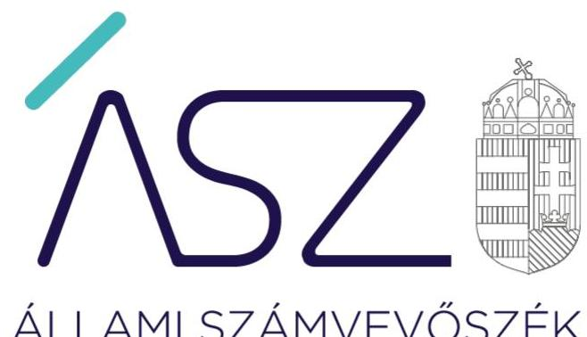
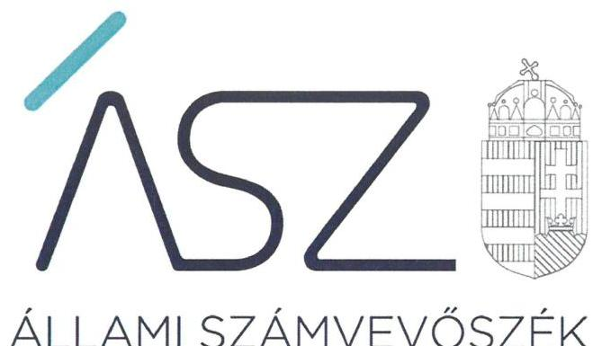
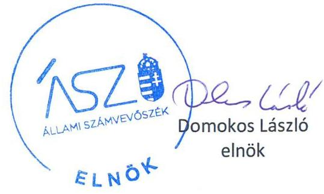
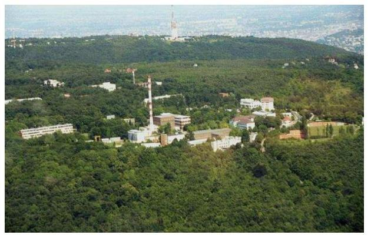

ÁLLAMI SZÁMVEVŐSZÉK

# JELENTÉS 

## Az államháztartás központi alrendszere fejezeteinek ellenőrzése

A Magyar Tudományos Akadémia kutatóközpontjai és kutatóintézetei vagyongazdálkodásának ellenőrzése - MTA Energiatudományi Kutatóközpont

2020.

20033
www.asz.hu

---

# JELENTÉS

## Az államháztartás központi alrendszere fejezeteinek ellenőrzése

A Magyar Tudományos Akadémia kutatóközpontjai és kutatóintézetei vagyongazdálkodásának ellenőrzése – MTA Energiatudományi Kutatóközpont

2020. 02. hó 21. nap

20033
www.asz.hu

---

AZ ELLENŐRZÉST FELÜGYELTE:
DR. NAGY IMRE felügyeleti vezető

AZ ELLENŐRZÉST VEZETTE ÉS A VÉGREHAJTÁSÁÉRT FELELŐS:
DR. GÁL NÓRA ellenőrzésvezető

A PROGRAM ÖSSZEÁLLÍTÁSÁÉRT FELELŐS:
SZALAY NAGY JÁNOS projektvezető

IKTATÓSZÁM: EL-2431-001/2020.
TÉMASZÁM: 2517
ELLENŐRZÉS-AZONOSÍTÓ SZÁM: V086105

Jelentéseink az Országgyűlés számítógépes hálózatán és az Interneten a www.asz.hu címen is olvashatóak.

---

# TARTALOMJEGYZÉK 

■ ÖSSZEGZÉS ..... 5
■ AZ ELLENŐRZÉS CÉLJA ..... 6
■ AZ ELLENŐRZÉS TERÜLETE ..... 7
■ AZ ELLENŐRZÉS HÁTTERE, INDOKOLTSÁGA ..... 8
■ A JELENTÉS LÉNYEGES KÉRDÉSKÖREI ..... 9
■ AZ ELLENŐRZÉS HATÓKÖRE ÉS MÓDSZEREI ..... 10
■ MEGÁLLAPÍTÁSOK ..... 12
■ JAVASLATOK ..... 13
■ MELLÉKLETEK ..... 15
I. sz. melléklet: Értelmező szótár ..... 15
■ FÜGGELÉKEK ..... 17
I. sz. függelék a jelentéshez ..... 17
II. sz. függelék: Észrevételek ..... 18
■ RÖVIDÍTÉSEK JEGYZÉKE ..... 21

---

.

---

# ÖSSZEGZÉS 

A Magyar Tudományos Akadémia Energiatudományi Kutatóközpont a 2016., 2017. és 2018. években nem biztosította a közvagyonnal való felelős gazdálkodást, a vagyon megőrzésének és célszerű felhasználásának alapvető feltételeit, ami kockázatot jelentett a kutatási közfeladatának ellátására.

## Az ellenőrzés társadalmi indokoltsága

Magyarország versenyképességének és a magyar gazdaság fejlődésének meghatározó tényezője a kutatás-fejlesztésre és az innovációra fordított hazai és uniós források eredményes, hatékony felhasználása. A magyar kutatás-fejlesztés területén kiemelt szerepet játszanak a központi költségvetésből biztosított támogatás felhasználásával működtetett, 2019. augusztus 31-ig a Magyar Tudományos Akadémia által irányított kutatóintézetek, kutatóközpontok. Az Energiatudományi Kutatóközpont a magyar nukleáris biztonsági szaktudás folyamatos elmélyítése érdekében folytatott nemzetközi színvonalú tudományos kutatásokat.

A kutatás-fejlesztési közfeladat eredményes ellátásának feltétele, hogy az ehhez szükséges eszközök a kutatási tevékenységet ténylegesen végző intézeteknél, központoknál rendelkezésre álljanak, továbbá ezekkel a közfeladatuk érdekében, átlátható és elszámoltatható módon, a vagyon megőrzését biztosítva gazdálkodjanak.

Az ellenőrzés indokoltságát erősítette, hogy jogszabályi változás nyomán 2019. szeptember 1-től a kutatóintézetek és kutatóközpontok irányítása az Eötvös Loránd Kutatási Hálózat Titkárságához került át, a kutatóintézetek és kutatóközpontok ezt követően központi költségvetési szervként működnek tovább. A magyar kutatás-fejlesztés szempontjából kiemelten fontos, hogy az új szervezeti keretek között induló kutatóhálózat életképessége, a közfeladatot szolgáló vagyon megőrzése biztosított legyen.

Az Állami Számvevőszék az ellenőrzési megállapításokon keresztül hozzájárul a közvagyon védelméhez és rámutat a közfeladatot ellátó kutatóhálózat működőképességére is kiható vagyongazdálkodás kockázataira.

## Főbb megállapítások, következtetések, javaslatok

A 2016-2018. években az Magyar Tudományos Akadémia Energiatudományi Kutatóközpont vagyongazdálkodásának szabályozása nem volt szabályszerű, mivel az MTAtv. és az Áht. előírása ellenére a fejezetet irányító szerv által jóváhagyott szervezeti és működési szabályzattal nem rendelkezett. Szervezeti és működési szabályzat hiányában nem alakították ki a kutatóközpont szervezeti felépítését és működésének rendjét, nem határozták meg a vagyongazdálkodáshoz kapcsolódó feladat- és hatásköröket, a hatáskörök gyakorlásának módját, és az ezekhez kapcsolódó felelősségi szabályokat. Ezáltal nem teremtették meg a szabályszerű vagyongazdálkodáshoz szükséges alapvető szervezeti és szabályozási feltételeket.

A kutatóközpont főigazgatójának belső kontrollrendszer minőségéről tett éves nyilatkozata nem állt összhangban az ellenőrzés megállapításaival, nem adott valós értékelést a gazdálkodás szabályszerűségét biztosító kontrollok kialakításáról és működtetéséről, nem biztosította a szabálytalanságok feltárását és megszüntetését. Így a főigazgatói nyilatkozat nem töltötte be a szerepét a kontrollrendszer hiányosságainak feltárásában és kijavításában, a felelős gazdálkodás erősítésében.

A közvagyon védelme és a közfeladat ellátása szempontjából elsődleges, hogy a kutatóközpont intézkedjen a szabálytalanságok megszüntetéséről és a hiányosságok orvoslásáról annak érdekében, hogy helyreálljon a vagyongazdálkodás törvényessége és biztosított legyen a vagyon megőrzése.

---

# AZ ELLENŐRZÉS CÉLJA 

AZ ELLENŐRZÉS CÉLJA annak megállapítása, hogy az MTA kutatóközpontok és kutatóintézetek vagyongazdálkodása során érvényesült-e az átláthatóság és elszámoltathatóság. Az ellenőrzés a fejezethez tartozó intézmények kockázatértékelése alapján, az egyedi és lényeges jellemzők figyelembevételével történik.

---

# AZ ELLENŐRZÉS TERÜLETE

## MTA Energiatudományi Kutatóközpont

Az MTA Energiatudományi Kutatóközpont 2012. január 1-jén jött létre. Az ellenőrzött időszakban az MTA EK¹ szervezetéhez tartozott az Atomenergia-kutató Intézet, az Energia- és Környezetbiztonsági Intézet és a Műszaki Fizikai és Anyagtudományi Intézet.

Az MTA EK önálló jogi személy, köztestületi költségvetési szerv volt, az MTAtv.² 3. §-ában megjelölt közfeladatokat látta el, az irányító szerve az MTA³ volt.

Az MTA EK közfeladatként ellátott tevékenységének célja, hogy nemzetközi színvonalú tudományos kutatásokat folytasson a magyar nukleáris biztonsági szaktudás folyamatos elmélyítése érdekében. A Kutatóközpont intézeteinek kutatási területe a magyarországi atomerőmű blokkok biztonsága, az új atomerőmű generáció kifejlesztése, a sugárvédelem és nukleáris védettség, valamint a „megújuló” energiaforrások.

A Kutatóközpontot a Főigazgató vezette, munkáját a főigazgató helyettes és a gazdasági igazgató támogatta. Az ellenőrzött időszakban a Főigazgató és a gazdasági igazgató személye nem változott.

A kutatóközpont egyrészt saját vagyonnal, másrészt az MTA-tól használatba átvett vagyonnal rendelkezett. Az MTA a használatra átadott vagyon feletti rendelkezési jogot megtartotta, az eszközök használatával kapcsolatos feladatokat és a költségek viselését továbbadta a kutatóközpontnak. Az MTA és a kutatóközpont közötti használati szerződés alapján a kutatóközpont volt köteles gondoskodni az eszközök állagmegóvásáról, továbbá viselni az eszközök működtetésével összefüggő üzemeltetési, fenntartási és javítási költségeket.

A Kutatóközpont a közfeladatai ellátására az MTA-tól 16 ingatlant és 5,2 Mrd Ft értékű ingó vagyont vett át használatra. A rendelkezésére álló vagyona 2018. évben nagyságrendileg 9,2 Mrd forint volt.

A Kutatóközpont átlagos statisztikai állományi létszáma 2016-ban 352 fő, 2018-ban 345 fő volt.

---

# AZ ELLENŐRZÉS HÁTTERE, INDOKOLTSÁGA 

Az ÁSZ ${ }^{4}$ ellenőrzi a költségvetési szervek gazdálkodását, működését, hogy megállapításaival támogassa az ellenőrzött szervezetek szabályszerű gazdálkodását, javaslataival elősegítse az Alaptörvényben ${ }^{5}$ megfogalmazott alapvetések érvényesülését a mindennapi életben a szervezetek szintjén. A központi költségvetés rendszerében zajló folyamatok holisztikus elemzései, a kockázatok folyamatos figyelemmel kísérésének módszerével, az így kiválasztott szervezetek célzott, hatékony ellenőrzéseivel az ÁSZ betölti a legfőbb gazdasági ellenőrző szerv küldetését. Az egyes ellenőrzések megállapításaival és egy időszak ellenőrzési eredményeinek elemzésével az ÁSZ ráirányíthatja a jogalkotók figyelmét a központi alrendszerben vagy annak egy ágazatában esetlegesen felmerülő pénzügyi, szabályozási feszültségekre. Az elvégzett ellenőrzések során az ÁSZ „jó gyakorlatokat” is azonosíthat, melyeket tanácsadó funkciója keretében szélesebb körben is megismertethet az érintettekkel, ezáltal is hozzájárulva a költségvetési rendszer szabályozott, átlátható, kiegyensúlyozott és fenntartható működéséhez.

Az államháztartás központi költségvetésében önálló fejezetet alkotó MTA és az MTA kutatóközpontok és kutatóintézetek közpénz felhasználása, az intézmények által országosan ellátott közfeladatok, valamint a feladatellátásához rendelt vagyon nagyságrendje indokolja, hogy az ÁSZ ellenőrzéseket folytasson a vagyongazdálkodás területén. Az ÁSZ az ellenőrzései során feltárja az ellenőrzött szervezet által nem szabályozott gazdálkodási területeket, rámutat a vagyongazdálkodási tevékenység - ezen belül a tulajdonosi joggyakorlás és vagyonkezelés - esetleges szabálytalanságaira, értékeli az állami vagyon nyilvántartására és elszámolására vonatkozó eljárásokat.

---

# A JELENTÉS LÉNYEGES KÉRDÉSKÖREI 

1. Az MTA kutatóközpont vagyongazdálkodására vonatkozó alapvető szabályozása szabályszerű volt-e?
2. Az MTA kutatóközpont vagyongazdálkodása során biztosított volt-e a vagyon megőrzése?

---

# AZ ELLENŐRZÉS HATÓKÖRE ÉS MÓDSZEREI 

## Az ellenőrzés típusa

Megfelelőségi ellenőrzés.

## Az ellenőrzött időszak

2016., 2017., 2018. évek.

## Az ellenőrzés tárgya

Magyar Tudományos Akadémia Energiatudományi Kutatóközpont vagyongazdálkodásának ellenőrzése.

## Az ellenőrzött szervezet

Magyar Tudományos Akadémia Energiatudományi Kutatóközpont

## Az ellenőrzés jogalapja

Az ellenőrzés jogszabályi alapját az ÁSZ tv. ${ }^{6}$ 1. § (3) bekezdés, 5. § (2)-(4) és (6) bekezdései, valamint az Áht. ${ }^{7}$ 61. § (2) bekezdésének előírásai képezik.

## Az ellenőrzés módszerei

Az ÁSZ az ellenőrzést az ellenőrzési program szempontjai, az ellenőrzött időszakban hatályos jogszabályok, az ellenőrzés szakmai szabályai, a jelen ellenőrzésre irányadó ÁSZ módszertanok figyelembevételével hajtja végre.

Az ellenőrzési kérdések megválaszolásához szükséges bizonyítékok megszerzése az ellenőrzött által rendelkezésre bocsátott dokumentumokra, adatokra alapozva megfigyelés, szemle (szemrevételezés), kérdésfeltevés (információkérés), valamint elemző eljárás útján történt. Az ellenőrzési bizonyítékként felhasználható adatforrások közé tartoznak egyrészt az ellenőrzési program részletes szempontjainál felsorolt adatforrások, másrészt minden egyéb - az ellenőrzés folyamán feltárt, az ellenőrzés szempontjából információt tartalmazó - dokumentum. Az ellenőrzés lefolytatásához az ellenőrzött szervezet az ÁSZ által kért dokumentumok megküldésével szolgáltat adatokat, amelyek valódiságát és teljes körűségét az adatszolgáltató szervezet vezetője által tett teljességi és hitelességi

---

nyilatkozat igazolja. Az így rendelkezésre bocsátott adatok, információk kontrollja az ellenőrzés keretében történt.

Az ellenőrzés ideje alatt az ellenőrzött szervezettel történő kapcsolattartást az ÁSZ SZMSZ-ének vonatkozó előírásai alapján biztosítottuk.

Amennyiben az ellenőrzött szerv működését és vagyongazdálkodását alapvetően meghatározó dokumentum hiánya miatt, valamely lényeges kérdéskörre vonatkozóan az ÁSZ megállapítást tett, további ellenőrzési tevékenységek az adott kérdéskörrel és azzal szoros logikai kapcsolatban lévő kérdéskörökkel kapcsolatosan - ráépülő jelleggel - nem kerültek végrehajtásra.

---

# 1. Az MTA kutatóközpont vagyongazdálkodására vonatkozó alapvető szabályozása szabályszerű volt-e? 

Összegző megállapítás

Az MTA EK vagyongazdálkodására vonatkozó 2016-2018. évi szabályozás nem volt szabályszerű.

Az MTA EK a 2016-2018. évekre vonatkozóan nem rendelkezett az Akadémiai Kutatóintézetek Tanácsa MTA tv. 17. § (7) bekezdés i) pontja szerinti, valamint az MTA elnökének (mint fejezetet irányító szerv vezetőjének) MTA tv. 17. § (9) bekezdése szerinti jóváhagyásával kiadott szervezeti és működési szabályzattal. Az EK belső szabályozási rendszerének kialakítása nem volt szabályszerű, mivel az Áht. 10. § (5) bekezdésében rögzítettek ellenére a szervezetét, feladatai ellátásának részletes belső rendjét és módját szervezeti és működési szabályzatban nem állapították meg.

A főigazgató a 2016-2018. években a Bkr. ${ }^{8}$ 1. számú melléklete szerinti nyilatkozatban értékelte a költségvetési szerv belső kontrollrendszerének minőségét. A nyilatkozat tartalmát az ÁSZ ellenőrzése nem igazolta vissza.

## 2. Az MTA kutatóközpont vagyongazdálkodása során biztosított volt-e a vagyon megőrzése?

Összegző megállapítás

A 2016-2018. években a szervezeti és gazdálkodási keretek kialakításának hiányában a vagyongazdálkodás nem volt szabályszerű.

SZMSZ hiányában nem határozták meg a vagyonnal való gazdálkodásért, a vagyon nyilvántartásáért felelős szervezeti egységet és a felelős személyeket, ezért a vagyongazdálkodás szabályszerűsége nem volt biztosított.

SZMSZ hiányában nem határozták meg a vagyon megőrzéséért felelős szervezeti egységet és a felelős személyeket.

---

# JAVASLATOK 

Az ÁSZ tv. 33. § (1) bekezdésében foglaltak értelmében az ellenőrzött szervezet vezetője köteles a jelentésben foglalt megállapításokhoz kapcsolódó intézkedési tervet összeállítani és azt a jelentés kézhezvételétől számított 30 napon belül az ÁSZ részére megküldeni. Amennyiben az ellenőrzött szervezet vezetője nem küldi meg határidőben az intézkedési tervet, vagy továbbra sem elfogadható intézkedési tervet küld, az Állami Számvevőszék elnöke az ÁSZ tv. 33. § (3) bekezdése a) és b) pontjaiban foglaltakat érvényesítheti.

## Energiatudományi Kutatóközpont főigazgatója

1. Intézkedjen, hogy az Energiatudományi Kutatóközpont rendelkezzen a jogszabályi előírásoknak megfelelően szervezeti és működési szabályzattal.
(1. sz. megállapítás alapján)

---

.

---

# MELLÉKLETEK 

- I. SZ. MELLÉKLET: ÉRTELMEZŐ SZÓTÁR
állami vagyon
állami vagyonnak minősül:
a) az állam tulajdonában lévő dolog, valamint a dolog módjára hasznosítható természeti erő,
b) az a) pont hatálya alá nem tartozó mindazon vagyon, amely vonatkozásában törvény az állam kizárólagos tulajdonjogát nevesíti,
c) az állam tulajdonában lévő tagsági jogviszonyt megtestesítő értékpapír, illetve az államot megillető egyéb társasági részesedés,
d)
 az államot megillető olyan immateriális, vagyoni értékkel rendelkező jogosultság, amelyet jogszabály vagyoni értékű jogként nevesít. (Forrás: Vtv. 1. § (2) bekezdése)
állami vagyon használója
az a természetes vagy jogi személy, jogi személyiséggel nem rendelkező szervezet, aki, vagy amely törvény vagy szerződés alapján, bármely jogcímen (bérlet, haszonbérlet, használat stb.) állami vagyont birtokol, használ, szedi annak hasznát, hasznosít, ide nem értve a haszonélvezőt, a vagyonkezelőt és a tulajdonosi jogok gyakorlóját (Forrás: Vtvr. 1. § (7) bekezdés a) pont, hatályos 2012. január 1-jétől)
állami vagyon kezelője /vagyonkezelő
Az állami vagyont az MNV Zrt. maga kezeli, vagy szerződés - így különösen bérlet, haszonbérlet, megbízás - alapján központi költségvetési szervnek, természetes vagy jogi személynek, vagy jogi személyiséggel nem rendelkező gazdálkodó szervezetnek hasznosításra átengedi. Az állami vagyonra vonatkozóan az MNV Zrt. kizárólag az Nvtv-ben meghatározott személyekkel köthet vagyonkezelési szerződést. (Forrás: Vtv. 27. § (1) bekezdése, hatályos 2012. január 1-jétől)
hasznosítás
A nemzeti vagyon birtoklásának, használatának, hasznok szedésének jogának bármely a tulajdonjog átruházását nem eredményező jogcímen történő átengedése, ide nem értve a vagyonkezelésbe adást, valamint a haszonélvezeti jog alapítását. (Forrás: Nvtv. 3. § (1) bekezdés 4. pontja)
közfeladat
Jogszabályban meghatározott állami vagy önkormányzati feladat, amit az arra kötelezett közérdekből, a jogszabályban meghatározott követelményeknek és feltételeknek megfelelve végez, ideértve a lakosság közszolgáltatásokkal való ellátását, továbbá az állam nemzetközi szerződésekben vállalt kötelezettségeiből adódó közérdekű feladatokat, valamint e feladatok ellátásakor szükséges infrastruktúra biztosítását is. (Forrás: Nvtv. 3. § (1) bekezdés 7. pontja).
köztestület önkormányzattal és nyilvántartott tagsággal rendelkező szervezet, amelynek létrehozását törvény rendeli el. A köztestület a tagságához, illetve a tagsága által végzett tevékenységhez kapcsolódó közfeladatot lát el. A köztestület jogi személy. Köztestület különösen a Magyar Tudományos Akadémia. (Forrás: 2006. évi LXV. törvény 8/A. § (1)-(2) bekezdés.
köztestület

MTA kutatóhálózat

MTA kutatóközpont

AZ MTA feladatainak ellátása céljából közfinanszírozású kutatóhálózatot létesít és működtet, amely felett irányítási jogot gyakorol. (forrás: MTAtv. 2. § (1) bekezdés, hatályos 2019. augusztus 31-ig)
Az MTA kutatóhálózata 10 kutatóközpontból és bennük 38 intézetből, 5 önálló jogállású kutatóintézetből, 96 akadémiai támogatású egyetemi, illetve közgyűjteményekben létesített kutatócsoportból, valamint 95 Lendület-kutatócsoportból (együttesen: kutatóhely) áll.
Az akadémiai kutatóközpont költségvetési szerv. A kutatóközpont autonóm módon vesz részt az Akadémia közfeladatainak megoldásában, önállóan is vállal közfeladatokat, továbbá egyéb tevékenységet is végezhet. Tudományos tevékenységéről és

---

MTA Kutatóintézet

MTA vagyon
vagyongazdálkodás
gazdálkodásáról évente beszámolót készít, amelyet az Akadémia az e törvényben és az Alapszabályban leírtak szerint értékel. (forrás: MTAtv. 18. § (1) bekezdés, hatályos 2019. augusztus 31-ig)

Az akadémiai kutatóintézet költségvetési szerv. Az akadémiai kutatóközpont keretein belül működő kutatóintézet a kutatóközpont szervezeti egysége. A kutatóintézet autonóm módon vesz részt az Akadémia közfeladatainak megoldásában, önállóan is vállal közfeladatokat, továbbá egyéb tevékenységet is végezhet. (forrás: MTAtv. 18. § (1) bekezdés, hatályos 2019. augusztus 31-ig)
Az MTA vagyonába tartozik az MTA-nak átadott törzsvagyon és az állami vagyonról szóló 2007. évi CVI. törvény 69. § (1) bekezdése alapján az MTA-nak átadott vagyon (a továbbiakban: az MTA vagyona). Az MTA vagyonába tartoznak az ingatlanok, az immateriális javak (ideértve a szellemi tulajdont is), a tárgyi eszközök, a pénz, a befektetések és a részesedések is. Az MTA nem gazdálkodik állami vagyonnal, mert a korábbi rábízott vagyon is a tulajdonába került. (forrás: MTAtv. 23. § (2) bekezdés) A nemzeti vagyongazdálkodás feladata a nemzeti vagyon rendeltetésének megfelelő, az állam, az önkormányzat mindenkori teherbíró képességéhez igazodó, elsődlegesen a közfeladatok ellátásához és a mindenkori társadalmi szükségletek kielégítéséhez szükséges, egységes elveken alapuló, átlátható, hatékony és költségtakarékos működtetése, értékének megőrzése, állagának védelme, értéknövelő használata, hasznosítása, gyarapítása, továbbá az állam vagy a helyi önkormányzat feladatának ellátása szempontjából feleslegessé váló vagyontárgyak elidegenítése. (Forrás: Nvtv. 7. § (2) bekezdése)

---

# FÜGGELÉKEK 

- I. SZ. FÜGGELÉK A JELENTÉSHEZ

Az Állami Számvevőszék az ellenőrzések során feltárt tényekhez kapcsolódó további körülmények tisztázására eszközrendszerrel nem rendelkezik. Amennyiben az ellenőrzésen túlmutatóan indokoltnak látszik az ellenőrzés során feltárt körülmények további vizsgálata, az Állami Számvevőszék törvényi felhatalmazás alapján az ellenőrzés által feltárt körülményeket továbbítja a hatáskörrel rendelkező szervnek a szükséges intézkedések megtétele, eljárások lefolytatása érdekében.

Az Energiatudományi Kutatóközpont a 2016-2018. évekre vonatkozóan nem rendelkezett az MTAtv. 17.§ (7) bekezdés i) pontja és az Áht. 9.§ b) pontja előírásai ellenére a fejezetet irányító szerv által jóváhagyott szervezeti és működési szabályzattal. Ezáltal nem teremtették meg a szabályszerű vagyongazdálkodáshoz szükséges alapvető szervezeti és szabályozási feltételeket.
Az SZMSZ hiánya miatt nem határozták meg a vagyongazdálkodáshoz kapcsolódó feladat- és hatásköröket, a hatáskörök gyakorlásának módját, és az ezekhez kapcsolódó felelősségi szabályokat. A feladat- és hatáskörök meghatározása hiányában nem igazolt, hogy a vagyongazdálkodáshoz kapcsolódó döntéseket az arra jogosult személy hozta meg, továbbá, hogy a döntések a szervezet érdekét szolgálták.
A vagyonnal való gazdálkodásért és a nyilvántartásért felelős szervezeti egység és személyek meghatározásának hiányában a vagyongazdálkodás szabályszerűsége és a felelős vagyonmegőrzés nem biztosított.
Szabályszerű vagyongazdálkodás hiányában nem biztosított, hogy a 2016-2018. évekre vonatkozó beszámolók megbízható, valós összképet mutatnak az ellenőrzött szervezet vagyonáról, annak összetételéről (eszközeiről és forrásairól), pénzügyi helyzetéről és tevékenysége eredményéről.
Az eset konkrét körülményeinek felderítésére a nyomozó hatóság rendelkezik hatáskörrel.

---

A jelentéstervezetet a Számvevőszék 15 napos észrevételezésre megküldte az ellenőrzött szervezet vezetőjének az ÁSZ tv. 29. § (1) bekezdése előírásának megfelelően.

Magyar Tudományos Akadémia Energiatudományi Kutatóközpont főigazgatója a jelentéstervezet megállapításaira írásban észrevételt tett.
Az ÁSZ tv. 29. § (3) bekezdésével összhangban az ÁSZ a Függelékben feltünteti az ellenőrzés megállapításaival kapcsolatban tett, figyelembe nem vett észrevételeket, és megindokolja, hogy azokat miért nem fogadta el.

[^0]
[^0]:    * 29. § (1) Az Állami Számvevőszék az ellenőrzési megállapításait megküldi az ellenőrzött szervezet vezetőjének vagy az általa megbízott személynek, és annak, akinek személyes felelősségét állapította meg.
    (2) Az ellenőrzött szervezet vezetője és a felelősként megjelölt személy az ellenőrzés megállapításaira tizenöt napon belül írásban észrevételt tehet.
    (3) Az Állami Számvevőszék az észrevételre a beérkezésétől számított harminc napon belül írásban válaszol. A figyelembe nem vett észrevételeket köteles a jelentésben feltüntetni, és megindokolni, hogy azokat miért nem fogadta el.

---

# 1. A jelentéstervezet 1. számú megállapítás 1. bekezdésével, 2. számú megállapítás 1. bekezdésével, Főbb megállapítások, következtetések, javaslatok fejezet 1. bekezdés 1. mondatával, kapcsolatos észrevétel 

A főigazgató észrevételében jelezte, hogy az MTA EK az ellenőrzött időszakban rendelkezett az előírásoknak megfelelő szervezeti és működési szabályzattal, amelyet ellenőrzés rendelkezésére bocsátott.
Az ellenőrzés rendelkezésére bocsátott szervezeti és működési szabályzat című dokumentumban szerepel jóváhagyási záradék, a záradék azonban az Akadémiai Kutatóintézetek Tanácsa és az MTA elnökének jóváhagyását nem tartalmazza. Az észrevételben rögzítettek ellenére a hivatkozott dokumentumon az MTA főtitkárának, az Akadémiai Kutatóintézetek Tanácsa elnökének és az MTA elnökének aláírása és pecsétje nem szerepel. Az előbbiekre tekintettel a Kutatóintézet az Akadémiai Kutatóintézetek Tanácsa az MTA tv. 17. § (7) bekezdés i) pontja szerinti, valamint az MTA elnökének (mint fejezetet irányító szerv vezetőjének) MTA tv. 17. § (9) bekezdése szerinti jóváhagyásával kiadott szervezeti és működési szabályzattal nem rendelkezett a 2016-2018. évekre vonatkozóan. Az észrevételt ezért nem fogadjuk el, a jelentéstervezet módosítása nem indokolt.

## 2. A jelentéstervezet 7. oldal 1. és 3. bekezdésével kapcsolatos észrevétel

A főigazgató észrevételében jelezte, hogy az MTA EK 2012. január 1-jén az MTA Izotópkutató Intézetnek az MTA Atomenergia Kutatóintézetbe történő beolvadásával jött létre. Továbbá az MTA Műszaki Fizikai és Anyagtudományi Intézet is csatlakozott az MTA EK-hoz 2015. január 1-jén. Az észrevételében jelezte továbbá, hogy a jelentéstervezet elnagyoltan tartalmazza az MTA EK tevékenységét.
Az észrevétel alapján, a jelentéstervezet 7. oldal első bekezdésének első mondatát pontosítjuk.
A jelentéstervezet 7. oldal első bekezdésének második mondata az észrevételben foglaltakkal összhangban tartalmazza, hogy az ellenőrzött időszakban az MTA EK szervezetéhez tartozott a Műszaki Fizikai és Anyagtudományi Intézet, ezért ezt az észrevételt nem fogadjuk el, az érintett bekezdés kiegészítése nem indokolt.

A jelentéstervezet az MTA EK tevékenységét az Állami Számvevőszék ellenőrzése területének bemutatásához szükséges terjedelemben tartalmazza, ezért az erre vonatkozó észrevételét nem fogadjuk el, az érintett bekezdés kiegészítése nem indokolt.

## 3. A jelentéstervezet 7. és 12. oldalaival kapcsolatos észrevétel

A főigazgató észrevételében jelezte, hogy a jelentéstervezet 7. és 12. oldalán több helyen szereplő MTA ETK rövidítés helyett a hivatalos MTA EK rövidítést kéri használni.
Az észrevételét elfogadjuk, a jelentéstervezetben a rövidítést pontosítjuk.

---

.

---

# RÖVIDÍTÉSEK JEGYZÉKE 

${ }^{1}$ MTA EK
${ }^{2}$ MTAtv.
${ }^{3}$ MTA
${ }^{4}$ ÁSZ
${ }^{5}$ Alaptörvény
${ }^{6}$ ÁSZ tv.
${ }^{7}$ Áht.
${ }^{8} \mathrm{Bkr}$.

MTA Energiatudományi Kutatóközpont
1994. évi XL. törvény a Magyar Tudományos Akadémiáról

Magyar Tudományos Akadémia
Állami Számvevőszék
Magyarország Alaptörvénye (2011. április 25.)
2011. évi LXVI. törvény az Állami Számvevőszékről (hatályos: 2011. július 1-től)
2011. évi CXCV. törvény az államháztartásról (hatályos: 2012. január 1-től)

370/2011. (XII.31.) Korm. rendelet a költségvetési szervek belső
kontrollrendszeréről és belső ellenőrzéséről

---

# ASZ 

ÁLLAMI SZÁMVEVŐSZÉK
1052 Budapest, Apáczai Cs. J. u. 10. I 1364 Budapest 4. Pf. 54 TEL: +36 14849100
email: szamvevoszek@asz.hu
web: www.asz.hu | www.aszhirportal.hu

