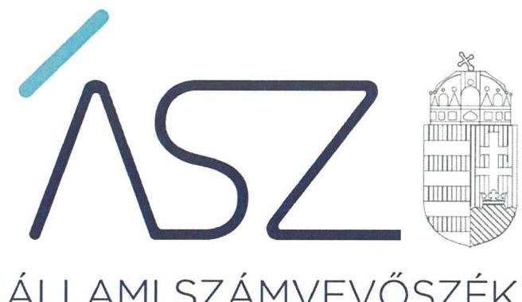
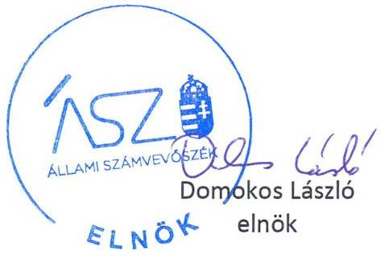
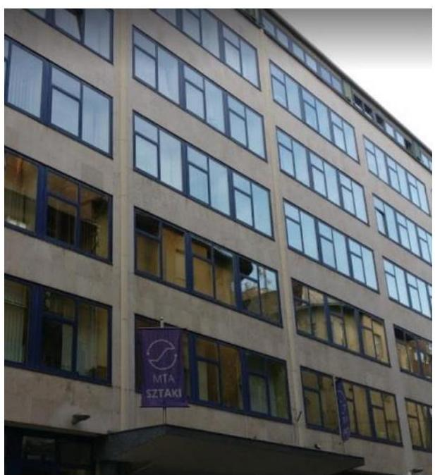

ÁLLAMI SZÁMVEVŐSZÉK

# JELENTÉS

## Az államháztartás központi alrendszere fejezeteinek ellenőrzése

A Magyar Tudományos Akadémia kutatóközpontjai és kutatóintézetei vagyongazdálkodásának ellenőrzése – MTA Számítástechnikai és Automatizálási Kutatóintézet

2020.

20034
www.asz.hu

---

ÁLLAMI SZÁMVEVŐSZÉK

# JELENTÉS

Az államháztartás központi alrendszere fejezeteinek ellenőrzése

A Magyar Tudományos Akadémia kutatóközpontjai és kutatóintézetei vagyongazdálkodásának ellenőrzése – MTA Számítástechnikai és Automatizálási Kutatóintézet

2020. 02. hó 21. nap

20034
www.asz.hu

---

# AZ ELLENŐRZÉST FELÜGYELTE: 

DR. NAGY IMRE felügyeleti vezető

## AZ ELLENŐRZÉST VEZETTE ÉS A VÉGREHAJTÁSÁÉRT FELELŐS:

ÁRPÁSI TIBOR ellenőrzésvezető

## A PROGRAM ÖSSZEÁLLÍTÁSÁÉRT FELELŐS:

SZALAY NAGY JÁNOS projektvezető

IKTATÓSZÁM: EL-2435-001/2020.
TÉMASZÁM: 2517
ELLENŐRZÉS-AZONOSÍTÓ SZÁM: V086111
Jelentéseink az Országgyúlés számítógépes hálózatán és az interneten a www.asz.hu címen is olvashatóak.

---

# TARTALOMJEGYZÉK 

■ ÖSSZEGZÉS ..... 5
■ AZ ELLENŐRZÉS CÉLJA ..... 6
■ AZ ELLENŐRZÉS TERÜLETE ..... 7
■ AZ ELLENŐRZÉS HÁTTERE, INDOKOLTSÁGA ..... 8
■ A JELENTÉS LÉNYEGES KÉRDÉSKÖREI ..... 9
■ AZ ELLENŐRZÉS HATÓKÖRE ÉS MÓDSZEREI ..... 10
■ MEGÁLLAPÍTÁSOK ..... 12
■ JAVASLATOK ..... 13
■ MELLÉKLETEK ..... 15
I. sz. melléklet: Fogalomtár ..... 15
■ FÜGGELÉKEK ..... 17
I. sz. függelék a jelentéshez ..... 17
II. sz. függelék: Észrevételek ..... 18
■ RÖVIDÍTÉSEK JEGYZÉKE ..... 21

---

.

---

# ÖSSZEGZÉS 

Az MTA Számítástechnikai és Automatizálási Kutatóintézet a 2016., 2017. és 2018. években nem biztositotta a közvagyonnal való felelős gazdálkodást, a vagyon megőrzésének és célszerú felhasználásának alapvető feltételeit, ami kockázatot jelentett a kutatási közfeladatának ellátására.

## Az ellenőrzés társadalmi indokoltsága

Magyarország versenyképességének és a magyar gazdaság fejlődésének meghatározó tényezője a kutatás-fejlesztésre és az innovációra fordított hazai és uniós források eredményes, hatékony felhasználása. A magyar kutatás-fejlesztés területén kiemelt szerepet játszanak a központi költségvetésből biztosított támogatás felhasználásával múködtetett, 2019. augusztus 31-ig a Magyar Tudományos Akadémia által irányított kutatóintézetek, kutatóközpontok. A Számítástechnikai és Automatizálási Kutatóintézet az informatika és számítástechnika területén végzett alap- és alkalmazott kutatásokat.

A kutatás-fejlesztési közfeladat eredményes ellátásának feltétele, hogy az ehhez szükséges eszközök a kutatási tevékenységet ténylegesen végző intézeteknél, központoknál rendelkezésre álljanak, továbbá ezekkel a közfeladatuk érdekében, átlátható és elszámoltatható módon, a vagyon megőrzését biztosítva gazdálkodjanak.

Az ellenőrzés indokoltságát erősítette, hogy jogszabályi változás nyomán 2019. szeptember 1-től a kutatóintézetek és kutatóközpontok irányítása az Eötvös Loránd Kutatási Hálózat Titkárságához került át, a kutatóintézetek és kutatóközpontok ezt követően központi költségvetési szervként működnek tovább. A magyar kutatás-fejlesztés szempontjából kiemelten fontos, hogy az új szervezeti keretek között induló kutatóhálózat életképessége, a közfeladatot szolgáló vagyon megőrzése biztosított legyen.

Az Állami Számvevőszék az ellenőrzési megállapításokon keresztül hozzájárul a közvagyon védelméhez és rámutat a közfeladatot ellátó kutatóhálózat működőképességére is kiható vagyongazdálkodás kockázataira.

## Főbb megállapítások, következtetések, javaslatok

Az MTA Számítástechnikai és Automatizálási Kutatóintézet vagyongazdálkodása nem volt szabályozott, mert a Kutatóintézet számviteli politikája, továbbá az eszközök és források értékelési szabályzata nem állt összhangban a jogszabályi előírásokkal az ellenőrzött években, ezáltal a Kutatóintézet nem biztosította a múködés és gazdálkodás alapvető kereteinek kialakítását.

Leltár hiányában nem volt biztosított, hogy a Kutatóintézet 2016., 2017. és 2018. évi beszámolójában szereplő tételek a valóságban is megtalálhatók, továbbá nem igazolt, hogy a közvagyonba tartozó kutatási eszközök rendelkezésre álltak a közfeladat ellátásához. Ezáltal a Kutatóintézet nem tett eleget a vagyon megőrzésére, védelmére előírt alapvető követelményeknek.

A Kutatóintézet igazgatójának a Kutatóintézet belső kontrollrendszerének minőségéről tett éves nyilatkozata nem állt összhangban az ellenőrzés megállapításaival, nem adott valós értékelést a gazdálkodás szabályszerűségét biztosító kontrollok kialakításáról és múködéséről, így nem biztosította a szabálytalanságok feltárását és megszüntetését. Ezáltal az igazgatói nyilatkozat nem töltötte be a szerepét a kontrollrendszer hiányosságainak feltárásában és kijavításában, a felelős gazdálkodás erősítésében.

A közvagyon védelme és a közfeladat ellátása szempontjából elsődleges, hogy a Kutatóintézet intézkedjen a szabálytalanságok megszüntetéséről és a hiányosságok orvoslásáról annak érdekében, hogy helyreálljon a vagyongazdálkodás törvényessége és biztosított legyen a vagyon megőrzése.

---

# AZ ELLENŐRZÉS CÉLJA 

AZ ELLENŐRZÉS CÉLJA annak megállapítása volt, hogy az MTA ${ }^{1}$ kutatóközpontok és kutatóintézetek vagyongazdálkodása során érvényesült-e az átláthatóság és elszámoltathatóság.

---

# **AZ ELLENŐRZÉS TERÜLETE**

## **MTA Számítástechnikai és Automatizálási Kutatóintézet**

Az MTA Számítástechnikai és Automatizálási Kutatóintézet 1973. január 1-én két kutatóintézet, a Számítástechnikai Központ és az Automatizálási Kutatóintézet egyesüléséből jött létre.

A Kutatóintézet2 alaptevékenységi körébe tartozott közfeladatként az alap- és alkalmazott kutatási tevékenység, kísérleti fejlesztés az informatika, az információ-technológia és a számítástechnika-alkalmazás területén, a kutatáshoz és kísérleti fejlesztéshez kapcsolódó egyéb hardver és szoftvertermékek, rendszerek (prototípusok) létrehozása, az MTA számítóközpontjának üzemeltetése, oktatás, a Kutatóintézet könyvtárának fenntartása és működtetése.

A Kutatóintézet a 2016-2018. években országos működési területű, önálló jogi személyként, saját költségvetéssel és gazdasági szervezetettel rendelkező köztestületi költségvetési szerv volt, amely felett az irányítási jogot az Magyar Tudományos Akadémia gyakorolta. Az MTA elnöke által kinevezett igazgató személye az ellenőrzött időszakban nem változott.

A Kutatóintézet tevékenységét az MTA-val 2015-ben megkötött Ingatlanhasználati szerződés3 és 1287,9 MFt értékű tárgyi eszközt használatba adásáról szóló Ingóvagyon-használati szerződés4 alapján MTA tulajdonú, valamint saját eszközökkel végezte. A Kutatóintézet éves költségvetési beszámolóiban kimutatott, feladatai ellátásához használt befektetett eszközeinek értéke 2016. évben 3402,7 MFt, 2017. évben 3281,0 MFt, míg 2018. évben 3254,6 MFt volt. A Kutatóintézet a 2016-2018. években vagyonkezelésbe vett nemzeti vagyonnal nem rendelkezett, 2018. év végén három gazdasági társaságban volt részesedése.

Az MTA a használatra átadott vagyon feletti rendelkezési jogot megtartotta, az eszközök használatával kapcsolatos feladatokat és a költségek viselését továbbadta a Kutatóintézetnek. Az MTA és a Kutatóintézet közötti használati szerződés alapján a Kutatóintézet volt köteles gondoskodni az eszközök állagmegóvásáról, továbbá viselni az eszközök működtetésével összefüggő üzemeltetési, fenntartási és javítási költségeket.

---

# AZ ELLENŐRZÉS HÁTTERE, INDOKOLTSÁGA 

Az ÁSZ ${ }^{5}$ ellenőrzi az éves költségvetési törvény végrehajtását, az ellenőrzés során feltárt kockázatok és a terület folyamatos értékelésével beazonosított kockázatok kezelése érdekében ellenőrzi többek között a költségvetési szervek gazdálkodását, működését, hogy az ellenőrzések megállapításaival támogassa az ellenőrzött szervezetek szabályszerű gazdálkodását, javaslataival elősegítse az Alaptörvényben megfogalmazott alapvetések érvényesülését a mindennapi életben a szervezetek szintjén. Az ÁSZ megállapításaival elősegíti az ellenőrzöttek közpénzekkel való felelős gazdálkodását, illetve az újszerű megközelítésű ellenőrzéssel hozzájárul az értékteremtő rend kialakításához és megőrzéséhez.

Az ellenőrzés a vagyongazdálkodásra fókuszál.
Az ellenőrzés következtében várhatóan reális kép alakítható ki a vagyongazdálkodás szabályszerűségéről. Az ellenőrzés megállapításai, javaslatai alapján javulhat a kutatóhálózat működésének szabályszerűsége, a kutatásokra fordított közpénzek felhasználásának átláthatósága, a tudomány eredményeinek hasznosulása, hozzájárulva ezzel a „jól irányított állam" működéséhez.

---

# A JELENTÉS LÉNYEGES KÉRDÉSKÖREI 

1. Az MTA kutatóintézet vagyongazdálkodására vonatkozó alapvető szabályozása szabályszerü volt-e?
2. Az MTA kutatóintézet vagyongazdálkodása során biztositott volt-e a vagyon megőrzése?

---

# AZ ELLENŐRZÉS HATÓKÖRE ÉS MÓDSZEREI 

## Az ellenőrzés típusa

Megfelelőségi ellenőrzés.

## Az ellenőrzött időszak

Az ellenőrzött időszak a 2016., 2017. és 2018. évek.

## Az ellenőrzés tárgya

Az MTA Számítástechnikai és Automatizálási Kutatóintézet vagyongazdálkodásának ellenőrzése.

## Az ellenőrzött szervezet

MTA Számítástechnikai és Automatizálási Kutatóintézet

## Az ellenőrzés jogalapja

Az ellenőrzés jogszabályi alapját az ÁSZ tv. ${ }^{6} 1 . \S$ (3) bekezdése és 5. § (2)(4) és (6) bekezdései, valamint az Áht. ${ }^{7} 61 . \S$ (2) bekezdésének előírásai képezték.

## Az ellenőrzés módszerei

Az ÁSZ az ellenőrzést a szakmai program szempontjai, az ellenőrzött időszakban hatályos jogszabályok, az ellenőrzés szakmai szabályai, a jelen ellenőrzésre irányadó ÁSZ módszertanok figyelembevételével végezte.

Az ellenőrzés ideje alatt az ellenőrzött szervezettel történő kapcsolattartást az ÁSZ Szervezeti és Múködési Szabályzatának vonatkozó előírásai alapján biztosította az ÁSZ.

Az ellenőrzési kérdések megválaszolásához szükséges bizonyítékok megszerzése az ellenőrzött által rendelkezésre bocsátott dokumentumokra, adatokra alapozva megfigyelés, szemle (szemrevételezés), kérdésfeltevés (információkérés), valamint elemző eljárás útján történt. Az ellenőrzési bizonyítékként felhasználható adatforrások közé tartoztak egyrészt az ellenőrzési program részletes szempontjainál felsorolt adatforrások, másrészt minden egyéb - az ellenőrzés folyamán feltárt, az ellenőrzés

---

szempontjából információt tartalmazó - dokumentum. Az ellenőrzés lefolytatásához az ellenőrzött szervezet az ÁSZ által kért dokumentumok megküldésével szolgáltatott adatokat, amelyek valódiságát és teljes körűségét az adatszolgáltató szervezet vezetője által tett teljességi és hitelességi nyilatkozat igazolta. Az így rendelkezésre bocsátott adatok, információk kontrollja az ellenőrzés keretében történt.

---

# 1. Az MTA kutatóintézet vagyongazdálkodására vonatkozó alapvető szabályozása szabályszerű volt-e? 

Összegző megállapítás

Az MTA SZTAKI vagyongazdálkodására vonatkozó alapvető szabályozása a 2016-2018. években nem volt szabályszerű.

A Számviteli politika ${ }_{1-4}{ }^{8}$ a Számv. tv. ${ }^{9} 14 . \S$ (4) bekezdés előírása ellenére nem tartalmazta, hogy a törvényben biztosított választási, minősítési lehetőségek közül a Kutatóintézet melyeket, milyen feltételek fennállása esetén alkalmaz, az alkalmazott gyakorlatot milyen okok miatt kell megváltoztatni.

Az Eszközök és források értékelési szabályzata ${ }_{1,2}{ }^{10}$ az Áhsz. 50. § (2) bekezdés b) pont előírása ellenére nem tartalmazta követeléstípusonként a kis összegű követelések év végi meghatározásának elveit, dokumentálásának szabályait.

A Kutatóintézet a jogszabályi előírásokkal összhangban rendelkezett a szervezetét, feladatai ellátásának részletes belső rendjét és módját meghatározó SZMSZ ${ }^{11}$-szel, az Eszközök és források leltárkészítési és leltározási szabályzatával ${ }_{1-3}{ }^{12}$, vezetett nyilvántartást a gazdálkodási jogkörök gyakorlására jogosult személyekről és aláírás-mintájukról.

A Kutatóintézet igazgatója a Bkr. ${ }^{13}$ előírása szerinti nyilatkozatban értékelte a belső kontrollrendszer minőségét. Az ÁSZ ellenőrzésének megállapításai a szabályozás és a vagyongazdálkodás hiányosságai miatt nem igazolták vissza a belső kontrollrendszer kialakításáról, szabályszerű, eredményes, gazdaságos és hatékony működéséről tett vezetői nyilatkozatokban foglaltakat.

## 2. Az MTA kutatóintézet vagyongazdálkodása során biztosított volt-e a vagyon megőrzése?

## Összegző megállapítás

Az MTA SZTAKI vagyongazdálkodása a 2016-2018. években nem volt szabályszerű.

A Kutatóintézet a 2016-2018. években az éves költségvetési beszámolók mérlegtételeit a Számv.tv. 69. § (1) bekezdésében foglaltak és az Áhsz. 22. § (1) bekezdése előírásainak ellenére - a mérleg fordulónapján meglévő eszközöket és forrásokat mennyiségben és értékben tételesen, ellenőrizhető módon tartalmazó - leltárral nem támasztotta alá, mivel az nem tartalmazta a saját tőke elemeire vonatkozó adatokat.

---

# JAVASLATOK 

Az ÁSZ tv. 33. § (1) bekezdésében foglaltak értelmében az ellenőrzött szervezet vezetője köteles a jelentésben foglalt megállapításokhoz kapcsolódó intézkedési tervet összeállítani és azt a jelentés kézhezvételétől számított 30 napon belül az ÁSZ részére megküldeni. Amennyiben az ellenőrzött szervezet vezetője nem küldi meg határidőben az intézkedési tervet, vagy továbbra sem elfogadható intézkedési tervet küld, az Állami Számvevőszék elnöke az ÁSZ tv. 33. § (3) bekezdése a) és b) pontjaiban foglaltakat érvényesítheti.

## Számítástechnikai és Automatizálási Kutatóintézet igazgatója

1. Intézkedjen, hogy a számviteli politika megfeleljen a jogszabályi előírásoknak.
(1. sz. megállapítás 1. bekezdése alapján)
2. Intézkedjen, hogy az eszközök és források értékelési szabályzata megfeleljen a jogszabályi előírásoknak.
(1. sz. megállapítás 2. bekezdése alapján)
3. Intézkedjen minden évben leltár összeállításáról a jogszabályi előírásoknak és a belső szabályozásának megfelelően.
(2. sz. megállapítás 1. bekezdés alapján)

---

.

---

# MELLÉKLETEK 

- I. SZ. MELLÉKLET: FOGALOMTÁR
állami vagyon
állami vagyon használója
állami vagyon kezelője /vagyonkezelő
hasznosítás
közfeladat
köztestület
MTA kutatóhálózat

MTA Kutatóközpont

Állami vagyonnak minősül:
a) az állam tulajdonában lévő dolog, valamint a dolog módjára hasznosítható természeti erő,
b) az a) pont hatálya alá nem tartozó mindazon vagyon, amely vonatkozásában törvény az állam kizárólagos tulajdonjogát nevesíti,
c) az állam tulajdonában lévő tagsági jogviszonyt megtestesítő értékpapír, illetve az államot megillető egyéb társasági részesedés,
d) az államot megillető olyan immateriális, vagyoni értékkel rendelkező jogosultság, amelyet jogszabály vagyoni értékű jogként nevesít. (Forrás: Vtv. ${ }^{14}$ 1. § (2) bekezdése) az a természetes vagy jogi személy, jogi személyiséggel nem rendelkező szervezet, aki, vagy amely törvény vagy szerződés alapján, bármely jogcímen (bérlet, haszonbérlet, használat stb.) állami vagyont birtokol, használ, szedi annak használt, hasznosít, ide nem értve a haszonélvezőt, a vagyonkezelőt és a tulajdonosi jogok gyakorlóját (Forrás: Vtvr. ${ }^{15}$ 1. § (7) bekezdés a) pont, hatályos 2012. január 1-jétől)
Az állami vagyont az MNV Zrt. ${ }^{16}$ maga kezeli, vagy szerződés - így különösen bérlet, haszonbérlet, megbízás - alapján központi költségvetési szervnek, természetes vagy jogi személynek, vagy jogi személyiséggel nem rendelkező gazdálkodó szervezetnek hasznosításra átengedi." Az állami vagyonra vonatkozóan az MNV Zrt. kizárólag az Nvtv ${ }^{17}$-ben meghatározott személyekkel köthet vagyonkezelési szerződést. (Forrás: Vtv. 27. § (1) bekezdése, hatályos 2012. január 1-jétől)
az állami vagyon bármely - a tulajdonjog átruházását nem eredményező - módon, jogcímen történő átadása, átengedése, ide nem értve a haszonélvezeti jog létesítését, valamint a vagyonkezelésbe adást (Forrás: Vtvr. 1. § (7) bekezdés e) pont, hatályos 2012. január 1-jétől);
Jogszabályban meghatározott állami vagy önkormányzati feladat, amit az arra kötelezett közérdekből, a jogszabályban meghatározott követelményeknek és feltételeknek megfelelve végez, ideértve a lakosság közszolgáltatásokkal való ellátását, továbbá az állam nemzetközi szerződésekben vállalt kötelezettségeiből adódó közérdekű feladatokat, valamint e feladatok ellátásakor szükséges infrastruktúra biztosítását is. (Forrás: Nvtv. 3. § (1) bekezdés 7. pontja).
A köztestület önkormányzattal és nyilvántartott tagsággal rendelkező szervezet, amelynek létrehozását törvény rendeli el. A köztestület a tagságához, illetve a tagsága által végzett tevékenységhez kapcsolódó közfeladatot lát el. A köztestület jogi személy. Köztestület különösen a Magyar Tudományos Akadémia. (Forrás: 2006. évi LXV. törvény ${ }^{18} 8 /$ A. § (1)-(2) bekezdés).
AZ MTA feladatainak ellátása céljából közfinanszírozású kutatóhálózatot létesít és müködtet, amely felett irányítási jogot gyakorol. (forrás: MTAtv. ${ }^{19}$ 2. § (1) bekezdés, hatályos 2019. augusztus 31-ig)
Az MTA kutatóhálózata 10 kutatóközpontból és bennük 38 intézetből, 5 önálló jogállású kutatóintézetből, 96 akadémiai támogatású egyetemi, illetve közgyűjteményekben létesített kutatócsoportból, valamint 95 Lendület-kutatócsoportból (együttesen: kutatóhely) áll.
Az akadémiai kutatóközpont költségvetési szerv. A kutatóközpont autonóm módon vesz részt az Akadémia közfeladatainak megoldásában, önállóan is vállal közfeladatokat, továbbá egyéb tevékenységet is végezhet. Tudományos tevékenységéről és gazdálkodásáról évente beszámolót készít, amelyet az Akadémia az e törvényben és az Alapszabályban leírtak szerint értékel. (forrás: MTAtv. 18. § (1) bekezdés, hatályos 2019. augusztus 31-ig)

---

.

---

# FÜGGELÉKEK 

- I. SZ. FÜGGELÉK A JELENTÉSHEZ

Az Állami Számvevőszék az ellenőrzések során feltárt tényekhez kapcsolódó további körülmények tisztázására eszközrendszerrel nem rendelkezik. Amennyiben az ellenőrzésen túlmutatóan indokoltnak látszik az ellenőrzés során feltárt körülmények további vizsgálata, az Állami Számvevőszék törvényi felhatalmazás alapján az ellenőrzés által feltárt körülményeket továbbítja a hatáskörrel rendelkező szervnek a szükséges intézkedések megtétele, eljárások lefolytatása érdekében.

Az MTA Számitástechnikai és Automatizálási Kutatóintézet a 2016-2018. évi éves költségvetési beszámolók mérlegtételeit nem támasztotta alá leltárral, azok saját tőkére vonatkozó adatokat nem tartalmaznak. Ezzel megsértette az Áhsz. 5. § (1) bekezdésében és 22. § (1)-(2) bekezdéseiben, valamint a Számv. tv. 69. § (1) bekezdésében előírtakat.

A fentiekben rögzített, leltárra vonatkozó hiányosságok miatt nem igazolt, hogy a 20162018. évi éves költségvetési beszámolók megbízható, valós összképet mutatnak az MTA Számitástechnikai és Automatizálási Kutatóintézet vagyonáról, annak összetételéről.
Az eset teljes körű feltárására a Nemzeti Adó- és Vámhivatal rendelkezik hatáskörrel.

---

A jelentéstervezetet a Számvevőszék 15 napos észrevételezésre megküldte az ellenőrzött szervezet vezetőjének az ÁSZ tv. 29. §* (1) bekezdése előírásának megfelelően.

A Számítástechnikai és Automatizálási Kutatóintézet igazgatója a jelentéstervezet megállapításaira írásban észrevételt tett.

Az ÁSZ tv. 29. § (3) bekezdésével összhangban az ÁSZ a Függelékben feltünteti az ellenőrzés megállapításaival kapcsolatban tett, figyelembe nem vett észrevételeket, és megindokolja, hogy azokat miért nem fogadta el.

[^0]
[^0]:    * 29. § (1) Az Állami Számvevőszék az ellenőrzési megállapításait megküldi az ellenőrzött szervezet vezetőjének vagy az általa megbízott személynek, és annak, akinek személyes felelősségét állapította meg.
    (2) Az ellenőrzött szervezet vezetője és a felelősként megjelölt személy az ellenőrzés megállapításaira tizenöt napon belül írásban észrevételt tehet.
    (3) Az Állami Számvevőszék az észrevételre a beérkezésétől számított harminc napon belül írásban válaszol. A figyelembe nem vett észrevételeket köteles a jelentésben feltüntetni, és megindokolni, hogy azokat miért nem fogadta el.

---

„Az államháztartás központi alrendszere fejezeteinek ellenőrzése - A Magyar Tudományos Akadémia kutatóközpontjai és kutatóintézetei vagyongazdálkodásának ellenőrzése - MTA Számítástechnikai és Automatizálási Kutatóintézet" címmel készített számvevőszéki jelentéstervezet megállapításaival kapcsolatban az igazgató által 2019. december 30-án tett (az Állami Számvevőszékhez 2020. január 06-án érkezett) el nem fogadott észrevételek és azok kezelésének indokolása.

# 1. A jelentéstervezet „Főbb megállapítások, következtetések, javaslatok" második bekezdésével kapcsolatos észrevétel 

A Kutatóintézet igazgatója észrevételében kifogásolta a 2016-2018. évek tekintetében a leltár hiányára vonatkozó megállapítást, figyelemmel arra, hogy a Kutatóintézet mindhárom év beszámolójában lévő valamennyi tételt (saját tőke elemeinek kivételével) leltárral támasztotta alá, különös tekintettel a mérleg eszköz oldalán szereplő mérlegsorokra. Az igazgató észrevételében elismerte, hogy a saját tőke elemeire nem készítettek leltárt.

A törvényi előírások alapján a leltárkészítési kötelezettség teljesítéséhez és a mérleg alátámasztásához teljes körű leltárt kell összeállítani, ami minden mérlegsorra és mérlegtételre kiterjed. Ennek az előírásnak az ellenőrzési dokumentumok alapján a Kutatóintézet az ellenőrzött időszakban nem tett eleget. Az ÁSZ az ellenőrzési megállapításait az adatszolgáltatás során a részére törvényi határidőben rendelkezésre bocsátott dokumentumokra alapozva fogalmazza meg. A Kutatóintézet teljességi és hitelességi nyilatkozata szerint az ÁSZ részére átadott dokumentumok, adatok megbízhatóak, és a bekért adatokra, dokumentumokra vonatkozóan teljes körű információt tartalmaznak. A Kutatóintézet által a leltárhoz beküldött dokumentumok között nem található olyan dokumentum, amely alátámasztaná, hogy a leltárt elkészítették volna a saját tőke elemeire vonatkozóan.

A fentiekre tekintettel az észrevételt az ÁSZ nem fogadja el, a jelentéstervezet módosítása nem indokolt.

## 2. A jelentéstervezet „Főbb megállapítások, következtetések, javaslatok" harmadik bekezdésével kapcsolatos észrevétel

Az igazgató észrevételében leírta, hogy az első észrevétellel összhangban az ÁSZ megállapítással csak részben ért egyet, megítélése szerint éves nyilatkozata nem teljes körűen töltötte be a felsorolt szerepét.

A dokumentumok felülvizsgálata során megállapítást nyert, hogy az igazgató az ellenőrzött időszakban a Bkr. 1. melléklete szerint nyilatkozatban évente értékelte a Kutatóintézet belső kontrollrendszerének minőségét. Az igazgató a belső kontrollrendszer nyilatkozatában többek között nyilatkozott arról, hogy gondoskodott a Kutatóintézet belső kontrollrendszere kialakításáról, valamint szabályszerű, eredményes, gazdaságos és hatékony működéséről. Az ellenőrzés megállapításai - kiemelten a vagyongazdálkodás szabályozási környezetére, annak nem szabályszerű minősítésére vonatkozó megállapítása - nem igazolták az igazgató nyilatkozataiban foglaltakat.

Az igazgató észrevételét az ÁSZ nem fogadja el, mivel az észrevétel a jelentéstervezet megállapításait nem módosítják, a jelentéstervezet Kutatóintézet igazgatójának Bkr. nyilatkozatával összefüggésben leírt következtetését az ÁSZ fenntartja.

---

.

---

# RÖVIDÍTÉSEK JEGYZÉKE 

${ }^{1}$ MTA
${ }^{2}$ Kutatóintézet
${ }^{3}$ Ingatlanhasználati szerződés
${ }^{4}$ Ingóvagyon-használati szerződés
${ }^{5}$ ÁSZ
${ }^{6}$ ÁSZ tv.
${ }^{7}$ Áht.
${ }^{8}$ Számviteli politika $1-4$
${ }^{9}$ Számv. tv.
${ }^{10}$ Eszközök és források értékelési szabályzata ${ }_{1-2}$
${ }^{11}$ SZMSZ
${ }^{12}$ Eszközök és források leltárkészítési és leltározási szabályzata ${ }_{1-3}$
${ }^{13}$ Bkr.
${ }^{14} \mathrm{Vtv}$.
${ }^{15} \mathrm{Vtvr}$.
${ }^{16}$ MNV Zrt.
${ }^{17}$ Nvtv.
${ }^{18}$ 2006. évi LXV. törvény
${ }^{19}$ MTAtv.

Magyar Tudományos Akadémia
MTA Számítástechnikai és Automatizálási Kutatóintézet
Ingatlanhasználati szerződés az MTA tulajdonát képező ingatlanok használatáról (kelt: 2015. szeptember 23.)

Ingóvagyon-használati szerződés az MTA tulajdonát képező ingó vagyontárgyak használatáról (kelt: 2015. szeptember 23.)
Állami Számvevőszék
2011. évi LXVI. törvény az Állami Számvevőszékről (hatályos: 2011. július 1-től)
2011. évi CXCV. törvény az államháztartásról (hatályos: 2012. január 1-től)

MTA Számítástechnikai és Automatizálási Kutatóintézet Számviteli politika
Számviteli politika1: hatályos 2015. január 1-től
Számviteli politika2: hatályos 2016. március 31-től
Számviteli politika3: hatályos 2017. január 1-től
Számviteli politika4: hatályos 2018. január 1-től
2000. évi. C. törvény a számvitelről (hatályos: 2001. január 1-től)
az MTA Számítástechnikai és Automatizálási Kutatóintézet Eszközök és források értékelési szabályzata
szabályzat1: hatályos: 2015. január 1-től
szabályzat2: hatályos: 2017. január 1-től
MTA Számítástechnikai és Automatizálási Kutatóintézet Szervezeti és Működési Szabályzat (hatályos: 1999. április 30-tól)

MTA Számítástechnikai és Automatizálási Kutatóintézet Eszközök és források leltárkészítési és leltározási szabályzata
szabályzat1: hatályos 2015. január 1-től
szabályzat2: hatályos 2017. január 1-től
szabályzat3: hatályos 2018. január 1-től
370/2011. (XII. 31.) Korm. rendelet a költségvetési szervek belső kontrollrendszeréről és belső ellenőrzéséről (hatályos: 2012. január 1-től)
2007. évi CVI. törvény az állami vagyonról (hatályos: 2007. szeptember 15-től)

254/2007. (X. 4.) Korm. rendelet az állami vagyonnal való gazdálkodásról (hatályos: 2007. október 4-től)

Magyar Nemzeti Vagyonkezelő Zrt.
2011. évi CXCVI. törvény a nemzeti vagyonról (hatályos: 2011. december 31-től)
2006. évi LXV. törvény az államháztartásról szóló 1992. évi XXXVIII. törvény és egyes kapcsolódó törvények módosításáról (hatályos: 2012. augusztus 24-től)
1994. évi XL. törvény a Magyar Tudományos Akadémiáról (hatályos: 1994. június 30-tól)

---

# ASZ 

ALLAMI SZAMVEVOSZEK
1052 Budapest, Apáczai Cs. J. u. 10. I 1364 Budapest 4. Pf. 54 TEL: +36 14849100
email: szamvevoszek@asz.hu
web: www.asz.hu | www.aszhirportal.hu