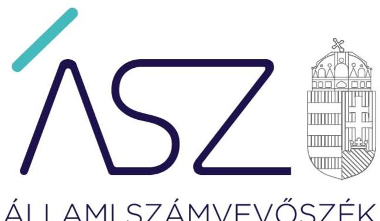
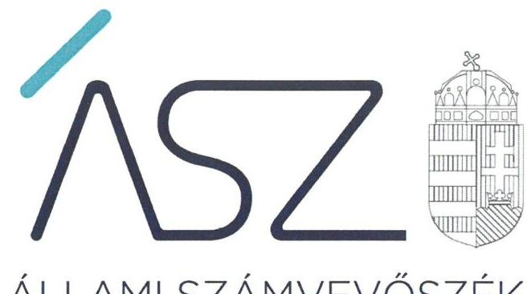
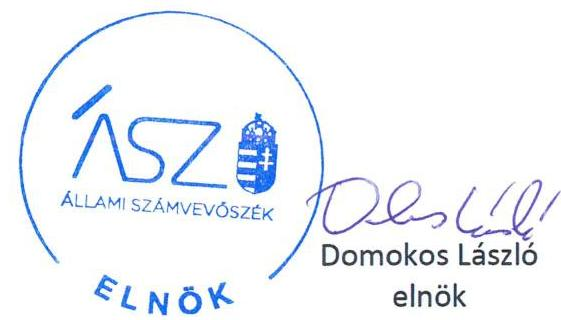
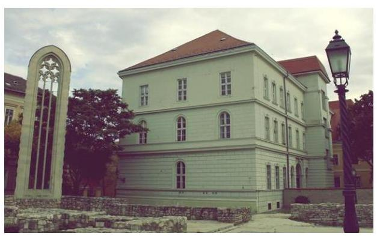

ÁLLAMI SZÁMVEVŐSZÉK

# JELENTÉS

## Az államháztartás központi alrendszere fejezeteinek ellenőrzése

A Magyar Tudományos Akadémia kutatóközpontjai és kutatóintézetei vagyongazdálkodásának ellenőrzése – MTA Társadalomtudományi Kutatóközpont

2020.

20035
www.asz.hu

---

# JELENTÉS

## Az államháztartás központi alrendszere fejezeteinek ellenőrzése

A Magyar Tudományos Akadémia kutatóközpontjai és kutatóintézetei vagyongazdálkodásának ellenőrzése – MTA Társadalomtudományi Kutatóközpont

2020. 02. hó 21. nap

20035
www.asz.hu

---

AZ ELLENŐRZÉST FELÜGYELTE:
DR. NAGY IMRE felügyeleti vezető

AZ ELLENŐRZÉST VEZETTE ÉS A VÉGREHAJTÁSÁÉRT FELELŐS:
DR. GÁL NÓRA ellenőrzésvezető

A PROGRAM ÖSSZEÁLLÍTÁSÁÉRT FELELŐS:
SZALAY NAGY JÁNOS projektvezető

IKTATÓSZÁM: EL-2429-001/2020.
TÉMASZÁM: 2517
ELLENŐRZÉS-AZONOSÍTÓ SZÁM: V086113

Jelentéseink az Országgyúlés számítógépes hálózatán és az Interneten a www.asz.hu címen is olvashatóak.

---

# TARTALOMJEGYZÉK 

■ ÖSSZEGZÉS ..... 5
■ AZ ELLENŐRZÉS CÉLJA ..... 6
■ AZ ELLENŐRZÉS TERÜLETE ..... 7
■ AZ ELLENŐRZÉS HÁTTERE, INDOKOLTSÁGA ..... 8
■ A JELENTÉS LÉNYEGES KÉRDÉSKÖREI ..... 9
■ AZ ELLENŐRZÉS HATÓKÖRE ÉS MÓDSZEREI ..... 10
■ MEGÁLLAPÍTÁSOK ..... 12
■ JAVASLATOK ..... 13
■ MELLÉKLETEK ..... 15
I. sz. melléklet: Értelmező szótár ..... 15
■ FÜGGELÉKEK ..... 17
I. sz. függelék a jelentéshez ..... 17
II. sz. függelék: Észrevételek ..... 18
■ RÖVIDÍTÉSEK JEGYZÉKE ..... 21

---

.

---

# ÖSSZEGZÉS 

A Magyar Tudományos Akadémia Társadalomtudományi Kutatóközpont a 2016., 2017. és 2018. években nem biztosította a közvagyon megőrzését, ami kockázatot jelentett a kutatási közfeladatok ellátására.

## Az ellenőrzés társadalmi indokoltsága

Magyarország versenyképességének és a magyar gazdaság fejlődésének meghatározó tényezője a kutatás-fejlesztésre és az innovációra fordított hazai és uniós források eredményes, hatékony felhasználása. A magyar kutatás-fejlesztés területén kiemelt szerepet játszanak a központi költségvetésből biztosított támogatás felhasználásával múködtetett, 2019. augusztus 31-ig a Magyar Tudományos Akadémia által irányított kutatóintézetek, kutatóközpontok. A Társadalomtudományi Kutatóközpont a jogtudomány, a kisebbségkutatás, a politikatudomány és a szociológia területén végzett kutatásokat.

A kutatás-fejlesztési közfeladat eredményes ellátásának feltétele, hogy az ehhez szükséges eszközök a kutatási tevékenységet ténylegesen végző intézeteknél, központoknál rendelkezésre álljanak, továbbá ezekkel a közfeladatuk érdekében, átlátható és elszámoltatható módon, a vagyon megőrzését biztosítva gazdálkodjanak.

Az ellenőrzés indokoltságát erősítette, hogy jogszabályi változás nyomán 2019. szeptember 1-től a kutatóintézetek és kutatóközpontok irányítása az Eötvös Loránd Kutatási Hálózat Titkárságához került át, a kutatóintézetek és kutatóközpontok ezt követően központi költségvetési szervként működnek tovább. A magyar kutatás-fejlesztés szempontjából kiemelten fontos, hogy az új szervezeti keretek között induló kutatóhálózat életképessége, a közfeladatot szolgáló vagyon megőrzése biztosított legyen.

Az Állami Számvevőszék az ellenőrzési megállapításokon keresztül hozzájárul a közvagyon védelméhez és rámutat a közfeladatot ellátó kutatóhálózat működőképességére is kiható vagyongazdálkodás kockázataira.

## Főbb megállapítások, következtetések, javaslatok

A 2016-2018. években az Magyar Tudományos Akadémia Társadalomtudományi Kutatóközpont vagyongazdálkodásának szabályozása nem volt szabályszerű, mert a szabályszerű közpénzfelhasználás alapvető kereteit nem alakította ki, a teljesítésigazolásra jogosult személyekről a jogszabályban előírt nyilvántartást nem vezette. Így nem teremtette meg a garanciális feltételeket ahhoz, hogy kifizetésekre kizárólag a kötelezettségvállalás mennyiségi és minőségi keretei között és a kutatóközpont feladatkörébe tartozó célja kerüljön sor.

A Magyar Tudományos Akadémia Társadalomtudományi Kutatóközpont vagyongazdálkodása nem volt szabályszerű, az éves beszámoló mérlegtételeit leltárral nem támasztotta alá. Leltár hiányában nem volt biztosított, hogy a kutatóközpont beszámolóiban szereplő tételek a valóságban is megtalálhatóak, és a közvagyonba tartozó kutatási eszközök közfeladat ellátásához rendelkezésre állnak. Így nem tett eleget a vagyon megőrzésére, védelmére előírt alapvető követelményeknek.

A kutatóközpont főigazgatójának belső kontrollrendszer minőségéről tett éves nyilatkozata nem állt összhangban az ellenőrzés megállapításaival, nem adott valós értékelést a gazdálkodás szabályszerűségét biztosító kontrollok kialakításáról és működtetéséről, nem biztosította a szabálytalanságok feltárását és megszüntetését. Így az főigazgatói nyilatkozat nem töltötte be a szerepét a kontrollrendszer hiányosságaiban feltárásában és kijavításában, a felelős gazdálkodás erősítésében.

A közvagyon védelme és a közfeladat ellátása szempontjából elsődleges, hogy a kutatóközpont intézkedjen a szabálytalanságok megszüntetéséről és a hiányosságok orvoslásáról annak érdekében, hogy helyreálljon a vagyongazdálkodás törvényessége és biztosított legyen a vagyon megőrzése.

---

# AZ ELLENŐRZÉS CÉLJA 

AZ ELLENŐRZÉS CÉLJA annak megállapítása, hogy az MTA kutatóközpontok és kutatóintézetek vagyongazdálkodása során érvényesült-e az átláthatóság és elszámoltathatóság. Az ellenőrzés a fejezethez tartozó intézmények kockázatértékelése alapján, az egyedi és lényeges jellemzők figyelembevételével történik.

---

# AZ ELLENŐRZÉS TERÜLETE 

## MTA Társadalomtudományi Kutatóközpont

Az MTA Társadalomtudományi Kutatóközpont az MTA Etnikainemzeti Kisebbségkutató Intézetnek, az MTA Jogtudományi Intézetnek, és az MTA Szociológiai Kutatóintézetnek az MTA Politikatudományi Intézetbe történő beolvadásával jött létre.

Az MTA TK ${ }^{1}$ szervezetéhez tartozott 2012. január 1-jétől a Jogtudományi Intézet, a Kisebbségkutató Intézet, a Politikatudományi Intézet és a Szociológiai Intézet.

Az MTA TK önálló jogi személy, köztestületi költségvetési szerv, az MTAtv. ${ }^{2}$ 3. §-ában megjelölt közfeladatokat látja el. Az ellenőrzött időszakban az irányító szerve az MTA ${ }^{3}$ volt.

Az MTA TK közfeladatként ellátott alaptevékenységének célja elméleti, empirikus és összehasonlító kutatások folytatása a jogtudomány, a kisebbségkutatás, a politikatudomány és a szociológia területén.

A Kutatóközpontot a Főigazgató vezette, munkáját a főigazgató helyettes és a gazdasági igazgató támogatta. Az ellenőrzött időszakban a Főigazgató személye egy esetben, a gazdasági igazgató személye nem változott.

A kutatóközpont egyrészt saját vagyonnal, másrészt az MTA-tól használatba átvett vagyonnal rendelkezett. Az MTA a használatra átadott vagyon feletti rendelkezési jogot megtartotta, az eszközök használatával kapcsolatos feladatokat és a költségek viselését továbbadta a kutatóközpontnak. Az MTA és a kutatóközpont közötti használati szerződés alapján a kutatóközpont volt köteles gondoskodni az eszközök állagmegóvásáról, továbbá viselni az eszközök múködtetésével összefüggő üzemeltetési, fenntartási és javítási költségeket.

A Kutatóközpont a közfeladatai ellátására az MTA-tól két ingatlant és 359 M Ft értékű ingó vagyont vett át használatra. A rendelkezésére álló vagyona 2018. évben nagyságrendileg 1,5 Mrd forint volt.

A Kutatóközpont átlagos statisztikai állományi létszáma 2016-ban 166 fő, 2018-ban 171 fő volt.

---

# AZ ELLENŐRZÉS HÁTTERE, INDOKOLTSÁGA 

Az ÁSZ ${ }^{4}$ ellenőrzi a költségvetési szervek gazdálkodását, működését, hogy megállapításaival támogassa az ellenőrzött szervezetek szabályszerű gazdálkodását, javaslataival elősegítse az Alaptörvényben ${ }^{5}$ megfogalmazott alapvetések érvényesülését a mindennapi életben a szervezetek szintjén. A központi költségvetés rendszerében zajló folyamatok holisztikus elemzései, a kockázatok folyamatos figyelemmel kísérésének módszerével, az így kiválasztott szervezetek célzott, hatékony ellenőrzéseivel az ÁSZ betölti a legfőbb gazdasági ellenőrző szerv küldetését. Az egyes ellenőrzések megállapításaival és egy időszak ellenőrzési eredményeinek elemzésével az ÁSZ ráirányíthatja a jogalkotók figyelmét a központi alrendszerben vagy annak egy ágazatában esetlegesen felmerülő pénzügyi, szabályozási feszültségekre. Az elvégzett ellenőrzések során az ÁSZ „jó gyakorlatokat" is azonosíthat, melyeket tanácsadó funkciója keretében szélesebb körben is megismertethet az érintettekkel, ezáltal is hozzájárulva a költségvetési rendszer szabályozott, átlátható, kiegyensúlyozott és fenntartható működéséhez.

Az államháztartás központi költségvetésében önálló fejezetet alkotó MTA és az MTA kutatóközpontok és kutatóintézetek közpénz felhasználása, az intézmények által országosan ellátott közfeladatok, valamint a feladatellátásához rendelt vagyon nagyságrendje indokolja, hogy az ÁSZ ellenőrzéseket folytasson a vagyongazdálkodás területén. Az ÁSZ az ellenőrzései során feltárja az ellenőrzött szervezet által nem szabályozott gazdálkodási területeket, rámutat a vagyongazdálkodási tevékenység - ezen belül a tulajdonosi joggyakorlás és vagyonkezelés - esetleges szabálytalanságaira, értékeli az állami vagyon nyilvántartására és elszámolására vonatkozó eljárásokat.

---

# A JELENTÉS LÉNYEGES KÉRDÉSKÖREI 

1. Az MTA kutatóközpont vagyongazdálkodására vonatkozó alapvető szabályozása szabályszerü volt-e?
2. Az MTA kutatóközpont vagyongazdálkodása során biztositott volt-e a vagyon megőrzése?

---

# AZ ELLENŐRZÉS HATÓKÖRE ÉS MÓDSZEREI 

## Az ellenőrzés típusa

Megfelelőségi ellenőrzés.

## Az ellenőrzött időszak

2016., 2017., 2018. évek.

## Az ellenőrzés tárgya

Magyar Tudományos Akadémia Társadalomtudományi Kutatóközpont vagyongazdálkodásának ellenőrzése.

## Az ellenőrzött szervezet

Magyar Tudományos Akadémia Társadalomtudományi Kutatóközpont.

## Az ellenőrzés jogalapja

Az ellenőrzés jogszabályi alapját az ÁSZ tv. ${ }^{6}$ 1. § (3) bekezdés, 5. § (2)-(4) és (6) bekezdései, valamint az Áht. ${ }^{7}$ 61. § (2) bekezdésének előírásai képezik.

## Az ellenőrzés módszerei

Az ÁSZ az ellenőrzést az ellenőrzési program szempontjai, az ellenőrzött időszakban hatályos jogszabályok, az ellenőrzés szakmai szabályai, a jelen ellenőrzésre irányadó ÁSZ módszertanok figyelembevételével hajtotta végre.

Az ellenőrzési kérdések megválaszolásához szükséges bizonyítékok megszerzése az ellenőrzött által rendelkezésre bocsátott dokumentumokra, adatokra alapozva megfigyelés, szemle (szemrevételezés), kérdésfeltevés (információkérés), valamint elemző eljárás útján történt. Az ellenőrzési bizonyítékként felhasználható adatforrások közé tartoznak egyrészt az ellenőrzési program részletes szempontjainál felsorolt adatforrások, másrészt minden egyéb - az ellenőrzés folyamán feltárt, az ellenőrzés szempontjából információt tartalmazó - dokumentum. Az ellenőrzés lefolytatásához az ellenőrzött szervezet az ÁSZ által kért dokumentumok

---

megküldésével szolgáltat adatokat, amelyek valódiságát és teljes körűségét az adatszolgáltató szervezet vezetője által tett teljességi és hitelességi nyilatkozat igazolja. Az így rendelkezésre bocsátott adatok, információk kontrollja az ellenőrzés keretében történt.

Az ellenőrzés ideje alatt az ellenőrzött szervezettel történő kapcsolattartást az ÁSZ SZMSZ-ének vonatkozó előírásai alapján biztosítottuk.

---

# 1. Az MTA kutatóközpont vagyongazdálkodására vonatkozó alapvető szabályozása szabályszerű volt-e? 

Összegző megállapítás

Az MTA TK vagyongazdálkodásának 2016-2018. évi szabályozása nem volt szabályszerű.

A 2016-2018. években a teljesítés igazolására jogosult személyek aláírásmintájáról az Ávr. 60. § (3) bekezdésben előírtak ellenére nyilvántartást nem vezettek.

A főigazgató a Bkr. ${ }^{8} 1$. számú melléklete szerinti nyilatkozatban értékelte a költségvetési szerv belső kontrollrendszerének minőségét. A nyilatkozat tartalmát az ÁSZ ellenőrzése nem igazolta vissza.

## 2. Az MTA kutatóközpont vagyongazdálkodása során biztosított volt-e a vagyon megőrzése?

## Összegző megállapítás

Az MTA TK vagyongazdálkodása a 2016-2018. években nem volt szabályszerű.

A 2016-2018. években az MTA TK nem készített az Áhsz. 5.§ (1) bekezdésében és 22.§ (1) bekezdésében, valamint a Számv. tv. 69. § (1) bekezdésében előírtak szerinti leltárt, amely tételesen és ellenőrizhető módon tartalmazta volna a mérlegben szereplő eszközöket és forrásokat mennyiségben és értékben.

A 2017-2018. évben a mennyiségben és értékben nyilvántartott eszközökre az Áhsz. 22. § (2) bekezdésében, a Számv. tv. 69. § (3) bekezdésében, valamint a Leltározási Szabályzat ${ }_{1,2}{ }^{9}$ 2.1. pontjában foglaltakkal ellentétesen a mennyiségi felvétellel történő leltározást nem végezték el.

---

# JAVASLATOK 

Az ÁSZ tv. 33. § (1) bekezdésében foglaltak értelmében az ellenőrzött szervezet vezetője köteles a jelentésben foglalt megállapításokhoz kapcsolódó intézkedési tervet összeállítani és azt a jelentés kézhezvételétől számított 30 napon belül az ÁSZ részére megküldeni. Amennyiben az ellenőrzött szervezet vezetője nem küldi meg határidőben az intézkedési tervet, vagy továbbra sem elfogadható intézkedési tervet küld, az Állami Számvevőszék elnöke az ÁSZ tv. 33. § (3) bekezdése a) és b) pontjaiban foglaltakat érvényesítheti.

## a Társadalomtudományi Kutatóközpont föigazgatójának

1. Intézkedjen a teljesítés igazolására jogosult személyek aláírás-mintája nyilvántartásának vezetéséről a jogszabályi előírásnak megfelelően.
(1. sz. megállapítás 1. bekezdése alapján)
2. Intézkedjen a jogszabályi előírásoknak megfelelően minden évben a mérleg tételeit alátámasztó leltár összeállításáról.
(2. sz. megállapítás 1. bekezdése alapján)
3. Intézkedjen a jogszabályi előírások szerinti mennyiségi felvétellel történő leltározás elvégzéséről a 2019. évre, majd azt követően a jogszabályban és a belső szabályozásában előírt gyakorisággal.
(2. sz. megállapítás 2. bekezdése alapján)

---

.

---

# MELLÉKLETEK 

- I. SZ. MELLÉKLET: ÉRTELMEZŐ SZÓTÁR
állami vagyon
állami vagyonnak minősül:
a) az állam tulajdonában lévő dolog, valamint a dolog módjára hasznosítható természeti erő,
b) az a) pont hatálya alá nem tartozó mindazon vagyon, amely vonatkozásában törvény az állam kizárólagos tulajdonjogát nevesíti,
c) az állam tulajdonában lévő tagsági jogviszonyt megtestesítő értékpapír, illetve az államot megillető egyéb társasági részesedés,
d) az államot megillető olyan immateriális, vagyoni értékkel rendelkező jogosultság, amelyet jogszabály vagyoni értékű jogként nevesít. (Forrás: Vtv. 1. § (2) bekezdése)
állami vagyon használója
az a természetes vagy jogi személy, jogi személyiséggel nem rendelkező szervezet, aki, vagy amely törvény vagy szerződés alapján, bármely jogcímen (bérlet, haszonbérlet, használat stb.) állami vagyont birtokol, használ, szedi annak használt, hasznosít, ide nem értve a haszonélvezőt, a vagyonkezelőt és a tulajdonosi jogok gyakorlóját (Forrás: Vtvr. 1. § (7) bekezdés a) pont, hatályos 2012. január 1-jétől)
állami vagyon kezelője /vagyonkezelő
Az állami vagyont az MNV Zrt. maga kezeli, vagy szerződés - így különösen bérlet, haszonbérlet, megbízás - alapján központi költségvetési szervnek, természetes vagy jogi személynek, vagy jogi személyiséggel nem rendelkező gazdálkodó szervezetnek hasznosításra átengedi." Az állami vagyonra vonatkozóan az MNV Zrt. kizárólag az Nvtv-ben meghatározott személyekkel köthet vagyonkezelési szerződést. (Forrás: Vtv. 27. § (1) bekezdése, hatályos 2012. január 1-jétől)
hasznosítás
A nemzeti vagyon birtoklásának, használatának, hasznok szedése jogának bármely a tulajdonjog átruházását nem eredményező - jogcímen történő átengedése, ide nem értve a vagyonkezelésbe adást, valamint a haszonélvezeti jog alapítását. (Forrás: Nvtv. 3. § (1) bekezdés 4. pontja)
közfeladat
jogszabályban meghatározott állami vagy önkormányzati feladat, amit az arra kötelezett közérdekből, a jogszabályban meghatározott követelményeknek és feltételeknek megfelelve végez, ideértve a lakosság közszolgáltatásokkal való ellátását, továbbá az állam nemzetközi szerződésekben vállalt kötelezettségeiből adódó közérdekű feladatokat, valamint e feladatok ellátásakor szükséges infrastruktúra biztosítását is. (Forrás: Nvtv. 3. § (1) bekezdés 7. pontja).
köztestület önkormányzattal és nyilvántartott tagsággal rendelkező szervezet, amelynek létrehozását törvény rendeli el. A köztestület a tagságához, illetve a tagsága által végzett tevékenységhez kapcsolódó közfeladatot lát el. A köztestület jogi személy. Köztestület különösen a Magyar Tudományos Akadémia. (Forrás: 2006. évi LXV. törvény 8/A. § (1)-(2) bekezdés.
MTA kutatóhálózat
AZ MTA feladatainak ellátása céljából közfinanszírozású kutatóhálózatot létesít és működtet, amely felett irányítási jogot gyakorol. (forrás: MTAtv. 2. § (1) bekezdés, hatályos 2019. augusztus 31-ig)
Az MTA kutatóhálózata 10 kutatóközpontból és bennük 38 intézetből, 5 önálló jogállású kutatóintézetből, 96 akadémiai támogatású egyetemi, illetve közgyűjteményekben létesített kutatócsoportból, valamint 95 Lendület-kutatócsoportból (együttesen: kutatóhely) áll.
MTA Kutatóközpont
Az akadémiai kutatóközpont költségvetési szerv. A kutatóközpont autonóm módon vesz részt az Akadémia közfeladatainak megoldásában, önállóan is vállal közfeladato-

---

MTA Kutatóintézet

MTA vagyon
vagyongazdálkodás
kat, továbbá egyéb tevékenységet is végezhet. Tudományos tevékenységéről és gazdálkodásáról évente beszámolót készít, amelyet az Akadémia az e törvényben és az Alapszabályban leírtak szerint értékel. (forrás: MTAtv. 18. § (1) bekezdés, hatályos 2019. augusztus 31-ig)

Az akadémiai kutatóintézet költségvetési szerv. Az akadémiai kutatóközpont keretein belül múködő kutatóintézet a kutatóközpont szervezeti egysége. A kutatóintézet autonóm módon vesz részt az Akadémia közfeladatainak megoldásában, önállóan is vállal közfeladatokat, továbbá egyéb tevékenységet is végezhet. (forrás: MTAtv. 18. § (1) bekezdés, hatályos 2019. augusztus 31-ig)

Az MTA vagyonába tartozik az MTA-nak átadott törzsvagyon és az állami vagyonról szóló 2007. évi CVI. törvény 69. § (1) bekezdése alapján az MTA-nak átadott vagyon (a továbbiakban: az MTA vagyona). Az MTA vagyonába tartoznak az ingatlanok, az immateriális javak (ideértve a szellemi tulajdont is), a tárgyi eszközök, a pénz, a befektetések és a részesedések is. Az MTA nem gazdálkodik állami vagyonnal, mert a korábbi rábízott vagyon is a tulajdonába került. (forrás: MTAtv. 23. § (2) bekezdés) A nemzeti vagyongazdálkodás feladata a nemzeti vagyon rendeltetésének megfelelő, az állam, az önkormányzat mindenkori teherbíró képességéhez igazodó, elsődlegesen a közfeladatok ellátásához és a mindenkori társadalmi szükségletek kielégítéséhez szükséges, egységes elveken alapuló, átlátható, hatékony és költségtakarékos múködtetése, értékének megőrzése, állagának védelme, értéknövelő használata, hasznosítása, gyarapítása, továbbá az állam vagy a helyi önkormányzat feladatának ellátása szempontjából feleslegessé váló vagyontárgyak elidegenítése. (Forrás: Nvtv. 7. § (2) bekezdése)

---

# FÜGGELÉKEK 

- I. SZ. FÜGGELÉK A JELENTÉSHEZ

Az Állami Számvevőszék az ellenőrzések során feltárt tényekhez kapcsolódó további körülmények tisztázására eszközrendszerrel nem rendelkezik. Amennyiben az ellenőrzésen túlmutatóan indokoltnak látszik az ellenőrzés során feltárt körülmények további vizsgálata, az Állami Számvevőszék törvényi felhatalmazás alapján az ellenőrzés által feltárt körülményeket továbbítja a hatáskörrel rendelkező szervnek a szükséges intézkedések megtétele, eljárások lefolytatása érdekében.
I.

1. Az MTA Társadalomtudományi Kutatóközpont a 2016-2018. évi éves költségvetési beszámolók mérlegtételeit egyik évben sem támasztotta alá olyan mennyiségi felvétellel történő leltározással és leltárral, amely tételesen, ellenőrizhető módon tartalmazza a mérleg fordulónapján meglévő eszközöket és forrásokat mennyiségben és értékben. Ezzel megsértette az Áhsz. 5§ (1) bekezdésében és 22. § (1)-(2) bekezdéseiben továbbá a Számv. tv. 69. § (1),(3) bekezdéseiben elöírtakat.
Leltár és mennyiségi leltárfelvétel hiányában nem igazolt, hogy a 2016-2018. évi éves költségvetési beszámolók mérlegében szereplő tételek a valóságban is megtalálhatóak, továbbá nem igazolt, hogy az eszközeit és forrásait a feladatkörébe tartozó feladatra használta fel. Ezért felmerül a gyanú, hogy az MTA Társadalomtudományi Kutatóközpontot vagyoni hátrány érhette.
2. Az MTA Társadalomtudományi Kutatóközpontnál a 2016-2018. években a teljesítésigazolásra jogosult személyek aláírás-mintájáról az Ávr. 60.§ (3) bekezdésében foglaltak ellenére nem vezetettek nyilvántartást, így a kifizetésekhez kapcsolódó teljesítések igazolására jogosult felelős személy(ek) nem voltak azonosíthatóak.
A teljesítés igazolására jogosult személy(ek) azonosíthatóságának hiányában nem zárható ki, hogy az MTA Társadalomtudományi Kutatóközpontnál olyan kifizetések történtek, amelyek nem szerződésszerü teljesitésekhez kapcsolódtak. Emiatt az MTA Társadalomtudományi Kutatóközpontot vagyoni hátrány érhette.
Az esetek konkrét körülményeinek felderítésére a nyomozó hatóság rendelkezik hatáskörrel.
II.

A fentiekben rögzített, leltározásra és leltárra vonatkozó hiányosságok miatt nem igazolt, hogy a 2016-2018. évi éves költségvetési beszámolók megbízható, valós összképet mutatnak az MTA Társadalomtudományi Kutatóközpont vagyonáról, annak összetételéről.
Az eset teljes körü feltárására a Nemzeti Adó- és Vámhivatal rendelkezik hatáskörrel.

---

A jelentéstervezetet a Számvevőszék 15 napos észrevételezésre megküldte az ellenőrzött szervezet vezetőjének az ÁSZ tv. 29. §* (1) bekezdése előírásának megfelelően.

A Társadalomtudományi Kutatóközpont föigazgatója a jelentéstervezet megállapításaira írásban észrevételt tett.
Az ÁSZ tv. 29. § (3) bekezdésével összhangban az Állami Számvevőszék a Függelékben feltünteti az ellenőrzés megállapításaival kapcsolatban tett, figyelembe nem vett észrevételeket, és megindokolja, hogy azokat miért nem fogadta el.

[^0]
[^0]:    * 29. § (1) Az Állami Számvevőszék az ellenőrzési megállapításait megküldi az ellenőrzött szervezet vezetőjének vagy az általa megbízott személynek, és annak, akinek személyes felelősségét állapította meg.
    (2) Az ellenőrzött szervezet vezetője és a felelősként megjelölt személy az ellenőrzés megállapításaira tizenöt napon belül írásban észrevételt tehet.
    (3) Az Állami Számvevőszék az észrevételre a beérkezésétől számított harminc napon belül írásban válaszol. A figyelembe nem vett észrevételeket köteles a jelentésben feltüntetni, és megindokolni, hogy azokat miért nem fogadta el.

---

„Az államháztartás központi alrendszere fejezeteinek ellenőrzése - A Magyar Tudományos Akadémia kutatóközpontjai és kutatóintézetei vagyongazdálkodásának ellenőrzése - MTA Társadalomtudományi Kutatóközpont" címmel készített számvevőszéki jelentéstervezet megállapításaival kapcsolatban a Társadalomtudományi Kutatóközpont (továbbiakban: Kutatóközpont) föigazgatója által 2019. december 19-én kelt levélben tett észrevételek és azok kezelésének indokolása.

# 1. A jelentéstervezet 1. számú megállapításával és a kapcsolódó 1. számú javaslattal kapcsolatos észrevétel: 

A Kutatóközpont föigazgatója észrevételében leírta, hogy a Kutatóközpont az adatbekérés során feltöltötte az ÁSZ részére a projektek teljesítés igazolására jogosultak naprakész listáját. A 2015. szeptember 30-ától hatályos Gazdálkodási szabályzata rögzítette a szervezeti és működési szabályzatának való megfeleltetéssel az intézményi aláírás mintákat, amelyek észrevétele szerint a kötelezettségvállalási, utalványozási, pénzügyi ellenjegyzés, érvényesítés rendjével egyezően hatályosak és naprakészek. A Kutatóközpont gazdálkodását érintő egyéb belső és külső ellenőrzések a 2016-2018 években a szabályozással és az az alapján folytatott gyakorlattal kapcsolatban nem fogalmaztak meg megállapítást, javaslatot. A kutatóközpont föigazgatójának észrevétele szerint, mivel a teljesítés igazolására jogosult személyek aláírás mintájának nyilvántartása teljes körű és szabályos volt, a belső kontrollrendszer minőségére vonatkozó nyilatkozata a vizsgált időszakban mindvégig megalapozott és valós volt. A fentiek miatt kérte a jelentéstervezetben a Kutatóközpont vagyongazdálkodása szabályszerűségére vonatkozó megállapítás és az 1. számú javaslat, valamint az Összegzés és a I. sz. Függelék kapcsolódó szövegrészének módosítását, törlését.
A Kutatóközpont föigazgatóját észrevételére válaszolva tájékoztattuk, hogy az észrevételét nem fogtuk el. A Kutatóközpont föigazgatója észrevételében hivatkozott, a Kutatóközpont által az adatbekérés során feltöltött, a projektek teljesítésigazolására jogosultakról készített lista nem felelt meg az államháztartási törvény végrehajtásáról szóló 368/2011. (XII. 31.) Korm. rendelet 60. § (3) bekezdésében meghatározott naprakész nyilvántartásnak, mivel nem tartalmazta a jogosultak aláírás-mintáját. Az ellenőrzés részére megküldött további intézményi aláírás minták pedig teljesítésigazolói aláírást nem tartalmaztak. A dokumentumok felülvizsgálata a teljesítés igazolására jogosult személyek aláírás mintája nyilvántartásának teljes körűségét és szabályosságát, a belső kontrollrendszer minőségére vonatkozó nyilatkozat megalapozottságát és valódiságát nem igazolta.
Az előbbiekre tekintettel az észrevételt nem fogadtuk el, a jelentéstervezet módosítása nem volt indokolt.

## 2. A jelentéstervezet 2. számú megállapításával és a kapcsolódó 2-3. számú javaslatokkal kapcsolatos észrevétel:

A Kutatóközpont föigazgatója észrevételében leírta, hogy a Kutatóközpont a jogszabályoknak megfelelően járt el, mivel a számviteli törvényben foglaltak szerint a leltározást legalább három évente mennyiségi felvétellel kell végrehajtani. A Kutatóközpont 2016-ban mennyiségi leltározással és egyeztetéssel, 2017-2018-ban az eszközök és források körében egyeztetéssel hajtotta végre a leltározást, ezért kérte a kapcsolódó megállapítás törlését. A Kutatóközpont föigazgatója szerint a Kutatóközpont hivatkozott leltározási szabályzata a jelentéstervezet megállapításával ellentétben az egyeztetéssel történő leltározás lehetőségét tartalmazza szövegszerűen. Elmondása szerint a 2018. október 25 -ével módosított leltározási szabályzat valóban következetlenséget tartalmazott az értékhatárt meghaladó tárgyi eszközök leltározásának módjára vonatkozóan, azonban a Kutatóközpont gyakorlata a jogszabályi rendelkezésekkel összhangban állt a három évenkénti mennyiségi leltározás tekintetében, amelyet 2016-ban végrehajtottak és 2019-re is folyamatban van. A leltározási szabályzatot kiegészítették. A fentiek miatt Kutatóközpont föigazgatója kérte a jelentéstervezetben a Kutatóközpont vagyongazdálkodására vonatkozó negatív megállapítás és a 2-3. számú javaslatok, valamint az Összegzés és a I. sz. Függelék kapcsolódó szövegrészének módosítását, törlését.
A Kutatóközpont föigazgatóját észrevételére válaszolva tájékoztattuk, hogy az észrevételét nem fogadtuk el. A Kutatóközpont által az ellenőrzés rendelkezésére bocsátott 2015. március 31-ei keltü Leltározási szabályzat 2.1. pont 3. mondata, valamint a 2018. október 25 -étől hatályos Leltározási szabályzat 2.1. pont 3.

---

mondata szerint: „A mennyiségben és értékben nyilvántartott eszközöket a mérlegbe tényleges leltározás alapján kell bemutatni. " A mennyiségben és értékben nyilvántartott eszközök esetében így a mennyiségi felvétellel történő leltározás minden évben a mérlegtételek alátámasztásának kötelező feltétele. A leltározási szabályzatok 2.2 pontjainak rendelkezése kizárólag a kísértékủ tárgyi eszközök leltározása esetében írja elő a három évenkénti mennyiségi felvétellel történő leltározást. A Kutatóközpont föigazgatójának észrevétele megerősítette a fentieket, mivel jelezte, hogy a mennyiségi felvétellel történő leltározás gyakorisága tekintetében a leltározási szabályzatot módosítani fogják.
A Kutatóközpont által az adatbekérés során beküldött dokumentumok felülvizsgálata alapján megállapítható, hogy a Kutatóközpont az ellenőrzött 2016-2018. években az éves költségvetési beszámolóit főkönyvi kivonattal alátámasztotta, azonban azokat az államháztartás számviteléről szóló 4/2013. (I. 11.) Korm. rendelet (továbbiakban: Áhsz.) 5. § (1) bekezdésében előírtak szerint folyamatosan vezetett részletező nyilvántartással nem támasztotta alá teljes körűen (az egyéb sajátos elszámolások, az aktív és passzív időbeli elhatárolások, a mérlegben kimutatott saját tőke, illetve 2016-2017. években a követelések esetén). A számvitelről szóló 2000 . évi C. törvény 69. § (1) bekezdése szerint a könyvek üzleti év végi zárásához, a beszámoló elkészítéséhez, a mérleg tételeinek alátámasztásához olyan leltárt kell összeállítani, amely tételesen, ellenőrizhető módon tartalmazza a mérleg fordulónapján meglévő eszközöket és forrásokat mennyiségben és értékben. A 69. § (2) bekezdése szerint az (1) bekezdés szerinti kötelezettség teljesítése keretében a főkönyvi könyvelés és az analitikus nyilvántartások adatai közötti egyeztetést az üzleti év mérleg-fordulónapjára vonatkozóan el kell végezni. Az egyeztetés alapjául szolgáló analitikus nyilvántartások hiányában az egyeztetés elvégzése nem igazolt, ezért a 2016-2018. években a Kutatóközpont nem állított össze jogszabályokban előírt leltárt.
Az előbbiekre tekintettel az észrevételt nem fogadtuk el, a jelentéstervezet módosítása nem volt indokolt.

---

# RÖVIDÍTÉSEK JEGYZÉKE 

${ }^{1}$ MTA TK
${ }^{2}$ MTAtv.
${ }^{3}$ MTA
${ }^{4}$ ÁSZ
${ }^{5}$ Alaptörvény
${ }^{6}$ ÁSZ tv.
${ }^{7}$ Áht.
${ }^{8}$ Bkr.
${ }^{9}$ Leltározási Szabályzat ${ }_{1,2}$

MTA Társadalomtudományi Kutatóközpont
1994. évi XL. törvény a Magyar Tudományos Akadémiáról

Magyar Tudományos Akadémia
Állami Számvevőszék
Magyarország Alaptörvénye (2011. április 25.)
2011. évi LXVI. törvény az Állami Számvevőszékről (hatályos: 2011. július 1-jétől)
2011. évi CXCV. törvény az államháztartásról (hatályos: 2012. január 1-jétől)

370/2011. (XII.31.) Korm. rendelet a költségvetési szervek belső
kontrollrendszeréről és belső ellenőrzéséről
Az MTA TK Leltározási Szabályzata
(hatályos: 2015. március 31-től, illetve 2018. október 25-től)

---

# ASZ 

ALLAMI SZAMVEVOSZEK
1052 Budapest, Apáczai Cs. J. u. 10. I 1364 Budapest 4. Pf. 54 TEL: +36 14849100
email: szamvevoszek@asz.hu
web: www.asz.hu | www.aszhirportal.hu