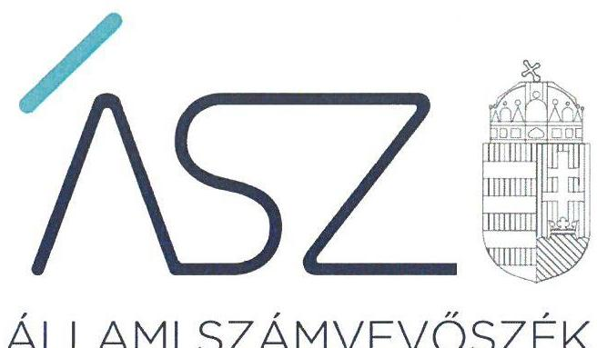
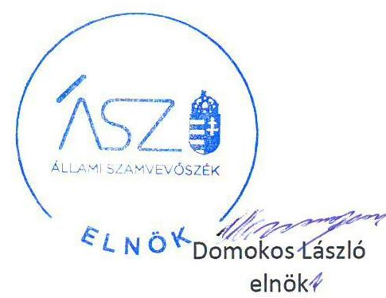
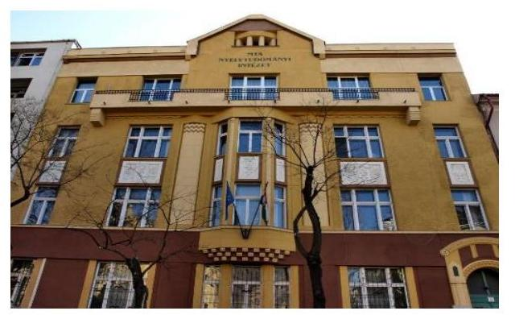

ÁLLAMI SZÁMVEVŐSZÉK

# JELENTÉS

## Az államháztartás központi alrendszere fejezeteinek ellenőrzése

A Magyar Tudományos Akadémia kutatóközpontjai és kutatóintézetei vagyongazdálkodásának ellenőrzése – MTA Nyelvtudományi Intézet

2020.

20036
www.asz.hu

---

# JELENTÉS

## Az államháztartás központi alrendszere fejezeteinek ellenőrzése

A Magyar Tudományos Akadémia kutatóközpontjai és kutatóintézetei vagyongazdálkodásának ellenőrzése – MTA Nyelvtudományi Intézet

2020. 02. hó 21. nap

20036
www.asz.hu

---

# AZ ELLENŐRZÉST FELÜGYELTE: 

TÓTH MARIANNA felügyeleti vezető

## AZ ELLENŐRZÉST VEZETTE ÉS A VÉGREHAJTÁSÁÉRT FELELŐS:

FORCZEK ANDREA ellenőrzésvezető

## A PROGRAM ÖSSZEÁLLÍTÁSÁÉRT FELELŐS:

SZALAY NAGY JÁNOS ETAMO projektvezető 1

IKTATÓSZÁM: EL-2436-001/2020.
TÉMASZÁM: 2517
ELLENŐRZÉS-AZONOSÍTÓ SZÁM: V086108

Jelentéseink az Országgyűlés számítógépes hálózatán és az interneten a www.asz.hu címen is olvashatóak.

---

# TARTALOMJEGYZÉK 

■ ÖSSZEGZÉS ..... 5
■ AZ ELLENŐRZÉS CÉLJA ..... 6
■ AZ ELLENŐRZÉS TERÜLETE ..... 7
■ AZ ELLENŐRZÉS HÁTTERE, INDOKOLTSÁGA ..... 8
■ A JELENTÉS LÉNYEGES KÉRDÉSKÖRE ..... 9
■ AZ ELLENŐRZÉS HATÓKÖRE ÉS MÓDSZEREI ..... 10
■ MEGÁLLAPÍTÁSOK ..... 12
■ KÖVETKEZTETÉSEK ..... 13
■ MELLÉKLETEK ..... 15
I. sz. melléklet: Értelmező szótár ..... 15
■ FÜGGELÉKEK ..... 17
I. sz. függelék a jelentéshez ..... 17
II. sz. függelék: Észrevételek ..... 18
■ RÖVIDÍTÉSEK JEGYZÉKE ..... 21

---

.

---

# ÖSSZEGZÉS 

A Magyar Tudományos Akadémia Nyelvtudományi Intézetének a vagyongazdálkodására vonatkozó alapvető szabályozása nem került kialakításra, ezáltal a vagyon megőrzésének és védelmének alapfeltételei nem voltak biztosítva, a vagyongazdálkodása nem volt átlátható, elszámoltatható. Ezzel a kutatóintézet nem biztosította a közvagyon megőrzését, ami kockázatot jelentett a kutatási közfeladatok célszerű ellátására.

## Az ellenőrzés társadalmi indokoltsága

Magyarország versenyképességének és a magyar gazdaság fejlődésének meghatározó tényezője a kutatás-fejlesztésre és az innovációra fordított hazai és uniós források eredményes, hatékony felhasználása. A magyar kutatás-fejlesztés területén kiemelt szerepet játszanak a központi költségvetésből biztosított támogatás felhasználásával működtetett, 2019. augusztus 31-ig a Magyar Tudományos Akadémia által irányított kutatóintézetek, kutatóközpontok. A Nyelvtudományi Intézet elsősorban a nyelvtudományok területén végzett kutatásokat.

A kutatás-fejlesztési közfeladat eredményes ellátásának feltétele, hogy az ehhez szükséges eszközök a kutatási tevékenységet ténylegesen végző intézeteknél, központoknál rendelkezésre álljanak, továbbá ezekkel a közfeladatellátás érdekében átlátható és elszámoltatható módon, a vagyon megőrzését biztosítva gazdálkodjanak.

Az ellenőrzés indokoltságát erősítette, hogy jogszabályi változás nyomán 2019. szeptember 1-től a kutatóintézetek és kutatóközpontok irányítása az Eötvös Loránd Kutatási Hálózat Titkárságához került át, a kutatóintézetek és kutatóközpontok ezt követően központi költségvetési szervként működnek tovább. A magyar kutatás-fejlesztés szempontjából kiemelten fontos, hogy az új szervezeti keretek között induló kutatóhálózat életképessége, a közfeladatot szolgáló vagyon megőrzése biztosított legyen.

Az Állami Számvevőszék az ellenőrzési megállapításokon keresztül hozzájárul a közvagyon védelméhez és rámutat a közfeladatot ellátó kutatóhálózat működőképességére is kiható vagyongazdálkodás kockázataira.

## Főbb megállapítások, következtetések, javaslatok

A 2016-2018. években a Magyar Tudományos Akadémia Nyelvtudományi Intézet vagyongazdálkodása nem volt szabályszerű, mivel nem rendelkezett Szervezeti és Működési Szabályzattal, ezáltal a vagyongazdálkodással kapcsolatos felelősségi körök kialakítása nem történt meg.

A jogszabályi előírások ellenére nem rendelkezett számviteli politikával, eszközök és a források leltárkészítési és leltározási szabályzattal, valamint eszközök és források értékelési szabályzattal. Ezáltal nem alakította ki a szabályszerű könyvvezetés és vagyongazdálkodás alapvető számviteli kereteit, nem biztosította annak szabályozási feltételeit, hogy az éves beszámolót a törvényi követelményeknek megfelelő bizonylatok és szabályszerű, megbízható könyvvezetés támasza alá.

---

# AZ ELLENŐRZÉS CÉLJA 

Az ellenőrzés célja annak megállapítása volt, hogy a Magyar Tudományos Akadémia Nyelvtudományi Intézet vagyongazdálkodása során érvényesült-e az átláthatóság és elszámoltathatóság. Az ellenőrzés a fejezethez tartozó intézmények kockázatértékelése alapján, az egyedi és lényeges jellemzők figyelembevételével történik.

---

# AZ ELLENŐRZÉS TERÜLETE 

## Magyar Tudományos Akadémia Nyelvtudományi Intézet

A MTA Nyelvtudományi Intézetet 1949. szeptember 13.-án a Magyar Népköztársaság Minisztertanácsa alapította. Az ellenőrzött időszakban önálló jogi személy, köztestületi költségvetési szerv volt és az MTAtv. ${ }^{1}$ 3. §-ában megjelölt közfeladatokat látott el.

A MTA Nyelvtudományi Intézet alapító okirata szerint alapfeladata volt a magyar, az uráli, az általános és alkalmazott nyelvészet, továbbá a fonetika területén kutatásokat végezni; a magyar nyelv nagyszótárát elkészíteni, archív anyagát gondozni; a magyar nyelv változatait, kisebbségi nyelveket, és az európai integráción belüli nyelvpolitikai kérdéseket vizsgálni. Kiegészítő feladatai közé tartoztak a nyelvi korpuszok és adatbázisok létrehozása, számítógépes alkalmazások nyelvészeti alapjainak megalkotása, közönségszolgálat, szakértői vélemények készítése.

---

# AZ ELLENŐRZÉS HÁTTERE, INDOKOLTSÁGA 

Az ÁSZ ellenőrzi az éves költségvetési törvény végrehajtását, az ellenőrzés során feltárt kockázatok és a terület folyamatos értékelésével beazonosított kockázatok kezelése érdekében, ellenőrzi többek között a költségvetési szervek gazdálkodását, működését, hogy az ellenőrzések megállapításaival támogassa az ellenőrzött szervezetek szabályszerű gazdálkodását, javaslataival elősegítse az Alaptörvényben² megfogalmazott alapvetések érvényesülését a szervezetek szintjén.

Az MTA kutatóközpontok és kutatóintézetek közpénz felhasználása, az intézmények által országosan ellátott közfeladatok, valamint a feladatellátáshoz rendelt vagyon nagysága indokolja, hogy az ÁSZ ellenőrzéseket folytasson a vagyongazdálkodás területén. Az ellenőrzés az MTA fejezethez tartozó intézmények kockázatértékelése alapján, az egyedi és lényeges jellemzők figyelembevételével történt és a vagyongazdálkodásra fókuszált. Az ellenőrzés következtében várhatóan reális kép alakítható ki a vagyongazdálkodás szabályszerűségéről.

Az ÁSZ az ellenőrzései során feltárja a szabályozással nem érintett gazdálkodási területeket, rámutathat a vagyongazdálkodási tevékenység esetleges szabálytalanságaira, értékeli a vagyon nyilvántartására vonatkozó eljárásokat. Megállapításaival elősegíti az ellenőrzöttek közpénzekkel való felelős gazdálkodását, illetve az újszerű megközelítésű ellenőrzéssel hozzájárul az értékteremtő rend kialakításához és megőrzéséhez.

Az ÁSZ ellenőrzés megállapításai, javaslatai alapján javulhat a kutatóhálózat működésének szabályszerűsége és a kutatásokra fordított közpénzek felhasználásának átláthatósága.

---

# A JELENTÉS LÉNYEGES KÉRDÉSKÖRE 

Az MTA kutatóintézet szabályozási környezetének kialakítása megteremtette-e a vagyonmegőrzés feltételeit?

---

# AZ ELLENŐRZÉS HATÓKÖRE ÉS MÓDSZEREI 

## Az ellenőrzés típusa

Megfelelőségi ellenőrzés.

## Az ellenőrzött időszak

2016., 2017., 2018. évek.

## Az ellenőrzés tárgya

Magyar Tudományos Akadémia Nyelvtudományi Intézet vagyongazdálkodásának ellenőrzése

## Az ellenőrzött szervezet

Magyar Tudományos Akadémia Nyelvtudományi Intézet

## Az ellenőrzés jogalapja

Az ellenőrzés jogszabályi alapját az ÁSZ tv. ${ }^{3}$ 1. § (3) bekezdés, 5. § (2)-(4) és (6) bekezdései, valamint az Áht. ${ }^{4}$ 61. § (2) bekezdésének előírásai képezik.

## Az ellenőrzés módszerei

Az ÁSZ az ellenőrzést az ellenőrzési program szempontjai, az ellenőrzött időszakban hatályos jogszabályok, az ellenőrzés szakmai szabályai, a jelen ellenőrzésre irányadó ÁSZ módszertanok figyelembevételével hajtotta végre.

Az ÁSZ az ellenőrzés ideje alatt az ellenőrzött szervezettel történő kapcsolattartást az ÁSZ SZMSZ⁵-ének vonatkozó előírásai alapján biztosította.

Az ellenőrzési kérdések megválaszolásához szükséges bizonyítékok megszerzése az ellenőrzött által rendelkezésre bocsátott dokumentumokra, adatokra alapozva megfigyelés, szemle (szemrevételezés), valamint elemző eljárás útján történt.

Az ellenőrzési bizonyítékként felhasználható adatforrások közé tartoznak az ellenőrzési program részletes szempontjainál felsorolt adatforrások, valamint minden egyéb - az ellenőrzés folyamán feltárt, az ellenőrzés szempontjából információt tartalmazó - dokumentum.

---

A felelős vagyongazdálkodás feltétele, hogy a vagyonhoz kapcsolódó feladat-, felelősség- és hatáskörök jól elhatároltak legyenek, a vagyonban bekövetkezett változások, az azokról szóló adatszolgáltatás és a beszámolóban történő bemutatásának követelményeit belső szabályozásban rögzítsék.

Az ellenőrzött szerv működését és vagyongazdálkodását alapvetően meghatározó dokumentum hiánya miatt, a megállapítás megtételére, az ellenőrzés lefolytatása nélkül került sor.

---

# MEGÁLLAPÍTÁSOK 

## Az MTA kutatóintézet szabályozási környezetének kialakítása megteremtette-e a vagyonmegőrzés feltételeit?

Összegző megállapítás

A Magyar Tudományos Akadémia Nyelvtudományi Intézet vagyongazdálkodásának 2016-2018. évi szabályozása nem volt szabályszerű, a vagyon megőrzésének alapfeltételei nem voltak biztosítva.

Az MTA Nyelvtudományi Intézet gazdálkodására vonatkozó szabályozás nem felelt meg az előírásoknak, mivel nem rendelkezett Szervezeti és Működési Szabályzattal az Áht. 9.§ b. pontja és 10.§ (5). bekezdése ellenére. Az Áhsz. ${ }^{6}$ 50. § (1) bekezdése és a Számv. tv. ${ }^{7}$ 14. § (3) bekezdése, valamint a Számv. tv. 14.§ (5) bekezdés a)-b) pontja ellenére, 2016-2018. években nem rendelkezett számviteli politikával és az annak keretében elkészítendő eszközök és források leltárkészítési és leltározási szabályzatával, valamint az eszközök és források értékelési szabályzatával.

A szabályozási rendszer hiánya miatt, a 2016-2018. években az MTA Nyelvtudományi Intézetnél a vagyon megőrzése nem volt biztosított.

A költségvetési szerv vezetője a 2016-2018. évekre elkészítette a Bkr. ${ }^{8}$ 11. § (1) bekezdése szerinti, a költségvetési szerv belső kontrollrendszer minőségét értékelő nyilatkozatát. A vezetői nyilatkozatban foglaltakat azonban az ÁSZ jelentés megállapításai nem igazolták.

---

# KÖVETKEZTETÉSEK 

Az ÁSZ tv. 32. § (1) bekezdésében foglaltak értelmében az ÁSZ jelentés tartalmazza a feltárt tényeket, az ezeken alapuló megállapításokat, következtetéseket, amelyeknek a 24. § (1) d) pontja szerint okszerűnek és megalapozottnak kell lenniük.

A Magyar Tudományos Akadémia Nyelvtudományi Intézete az ellenőrzött időszakban nem rendelkezett Szervezeti és működési szabályzattal, ezáltal nem kerültek kialakításra a vagyongazdálkodáshoz kapcsolódó felelősségi és hatáskörök, azaz nem teremtette meg a szabályszerű vagyongazdálkodáshoz szükséges alapvető szervezeti és szabályozási feltételeket.

Az Intézet számviteli politika hiányában nem alakította ki a szabályszerű könyvvezetés és vagyongazdálkodás alapvető számviteli kereteit. Így nem biztosította annak szabályozási feltételeit, hogy az éves beszámolót a törvényi követelményeknek megfelelő bizonylatok és szabályszerű, megbízható könyvvezetés támasza alá.

Az eszközök és források leltározási és leltárkészítési, valamint értékelési szabályzata hiányában az Intézmény nem határozta meg a számviteli törvényi előírások végrehajtásához és az éves beszámoló mérlegének alátámasztásához szükséges követelményeket.

Fentiekkel nem teremtette meg a valós, megbízható beszámoló és a vagyon védelmének feltételeit, amely indokolttá teszi a vagyon védelmében szükséges számvevőszéki intézkedéseket.

---

.

---

# MELLÉKLETEK 

- I. SZ. MELLÉKLET: ÉRTELMEZŐ SZÓTÁR
állami vagyon
állami vagyonnak minősül:
a) az állam tulajdonában lévő dolog, valamint a dolog módjára hasznosítható természeti erő,
b) az a) pont hatálya alá nem tartozó mindazon vagyon, amely vonatkozásában törvény az állam kizárólagos tulajdonjogát nevesíti,
c) az állam tulajdonában lévő tagsági jogviszonyt megtestesítő értékpapír, illetve az államot megillető egyéb társasági részesedés,
d) az államot megillető olyan immateriális, vagyoni értékkel rendelkező jogosultság, amelyet jogszabály vagyoni értékű jogként nevesít. (Forrás: Vtv. 1. § (2) bekezdése)
állami vagyon használója
az a természetes vagy jogi személy, jogi személyiséggel nem rendelkező szervezet, aki, vagy amely törvény vagy szerződés alapján, bármely jogcímen (bérlet, haszonbérlet, használat stb.) állami vagyont birtokol, használ, szedi annak hasznait, hasznosít, ide nem értve a haszonélvezőt, a vagyonkezelőt és a tulajdonosi jogok gyakorlóját (Forrás: Vtvr. 1. § (7) bekezdés a) pont, hatályos 2012. január 1-jétől)
állami vagyon kezelője /vagyonkezelő
Az állami vagyont az MNV Zrt. maga kezeli, vagy szerződés - így különösen bérlet, haszonbérlet, megbízás - alapján központi költségvetési szervnek, természetes vagy jogi személynek, vagy jogi személyiséggel nem rendelkező gazdálkodó szervezetnek hasznosításra átengedi." Az állami vagyonra vonatkozóan az MNV Zrt. kizárólag az Nvtv-ben meghatározott személyekkel köthet vagyonkezelési szerződést. (Forrás: Vtv. 27. § (1) bekezdése, hatályos 2012. január 1-jétől)
hasznosítás
A nemzeti vagyon birtoklásának, használatának, hasznok szedése jogának bármely - a tulajdonjog átruházását nem eredményező - jogcímen történő átengedése, ide nem értve a vagyonkezelésbe adást, valamint a haszonélvezeti jog alapítását. (Forrás: Nvtv. 3. § (1) bekezdés 4. pontja)
közfeladat
jogszabályban meghatározott állami vagy önkormányzati feladat, amit az arra kötelezett közérdekből, a jogszabályban meghatározott követelményeknek és feltételeknek megfelelve végez, ideértve a lakosság közszolgáltatásokkal való ellátását, továbbá az állam nemzetközi szerződésekben vállalt kötelezettségeiből adódó közérdekű feladatokat, valamint e feladatok ellátásakor szükséges infrastruktúra biztosítását is. (Forrás: Nvtv. 3. § (1) bekezdés 7. pontja).
köztestület
A köztestület önkormányzattal és nyilvántartott tagsággal rendelkező
 szervezet, amelynek létrehozását törvény rendeli el. A köztestület a tagságához, illetve a tagsága által végzett tevékenységhez kapcsolódó közfeladatot lát el. A köztestület jogi személy. Köztestület különösen a Magyar Tudományos Akadémia. (Forrás: 2006. évi LXV. törvény 8/A. § (1)-(2) bekezdés.)
MTA kutatóhálózat AZ MTA feladatainak ellátása céljából közfinanszírozású kutatóhálózatot létesít és működtet, amely felett irányítási jogot gyakorol. (forrás: MTAtv. 2. § (1) bekezdés, hatályos 2019. augusztus 31-ig)
Az MTA kutatóhálózata 10 kutatóközpontból és bennük 38 intézetből, 5 önálló jogállású kutatóintézetből, 96 akadémiai támogatású egyetemi, illetve

---

MTA Kutatóközpont

MTA Kutatóintézet

MTA vagyon
vagyongazdálkodás
közgyűjteményekben létesített kutatócsoportból, valamint 95 Lendület-kutatócsoportból (együttesen: kutatóhely) áll.
Az akadémiai kutatóközpont költségvetési szerv. A kutatóközpont autonóm módon vesz részt az Akadémia közfeladatainak megoldásában, önállóan is vállal közfeladatokat, továbbá egyéb tevékenységet is végezhet. Tudományos tevékenységéről és gazdálkodásáról évente beszámolót készít, amelyet az Akadémia az e törvényben és az Alapszabályban leírtak szerint értékel. (forrás: MTAtv. 18. § (1) bekezdés, hatályos 2019. augusztus 31-ig)
Az akadémiai kutatóintézet költségvetési szerv. Az akadémiai kutatóközpont keretein belül működő kutatóintézet a kutatóközpont szervezeti egysége. A kutatóintézet autonóm módon vesz részt az Akadémia közfeladatainak megoldásában, önállóan is vállal közfeladatokat, továbbá egyéb tevékenységet is végezhet. (forrás: MTAtv. 18. § (1) bekezdés, hatályos 2019. augusztus 31-ig)
Az MTA vagyonába tartozik az MTA-nak átadott törzsvagyon és az állami vagyonról szóló 2007. évi CVI. törvény 69. § (1) bekezdése alapján az MTA-nak átadott vagyon (a továbbiakban: az MTA vagyona). Az MTA vagyonába tartoznak az ingatlanok, az immateriális javak (ideértve a szellemi tulajdont is), a tárgyi eszközök, a pénz, a befektetések és a részesedések is. Az MTA nem gazdálkodik állami vagyonnal, mert a korábbi rábízott vagyon is a tulajdonába került. (forrás: MTAtv. 23. § (2) bekezdés)
A nemzeti vagyongazdálkodás feladata a nemzeti vagyon rendeltetésének megfelelő, az állam, az önkormányzat mindenkori teherbíró képességéhez igazodó, elsődlegesen a közfeladatok ellátásához és a mindenkori társadalmi szükségletek kielégítéséhez szükséges, egységes elveken alapuló, átlátható, hatékony és költségtakarékos működtetése, értékének megőrzése, állagának védelme, értéknövelő használata, hasznosítása, gyarapítása, továbbá az állam vagy a helyi önkormányzat feladatának ellátása szempontjából feleslegessé váló vagyontárgyak elidegenítése. (Forrás: Nvtv. 7. § (2) bekezdése)

---

# FÜGGELÉKEK 

- I. SZ. FÜGGELÉK A JELENTÉSHEZ

Az Állami Számvevőszék az ellenőrzések során feltárt tényekhez kapcsolódó további körülmények tisztázására eszközrendszerrel nem rendelkezik. Amennyiben az ellenőrzésen túlmutatóan indokoltnak látszik az ellenőrzés során feltárt körülmények további vizsgálata, az Állami Számvevőszék törvényi felhatalmazás alapján az ellenőrzés által feltárt körülményeket továbbítja a hatáskörrel rendelkező szervnek a szükséges intézkedések megtétele, eljárások lefolytatása érdekében.
A Magyar Tudományos Akadémia Nyelvtudományi Intézet a 2016-2018. évekre vonatkozóan az Áhsz. 50. § (1) bekezdése valamint a Számv. tv. 14. § (3)-(4) bekezdései és a 14.§ (5) bekezdés a)-b) pontjai ellenére nem rendelkezett számviteli politikával, valamint az annak keretében elkészítendő eszközök és források leltárkészítési és leltározási szabályzatával, illetve az eszközök és források értékelési szabályzatával.
Ezen hiányosságok következtében nem igazolt, hogy az Intézet a jogszabályi rendelkezések szerinti könyvvezetéssel, valamint az Áhsz. 5. § (1). bekezdés előírásának megfelelő, szabályszerűen elkészített beszámolóval rendelkezik a 2016-2018. években, így kétséges továbbá, hogy a beszámolók az ellenőrzött vagyonáról, annak összetételéről, pénzügyi helyzetéről és tevékenysége eredményéről megbízható és valós összképet mutatnak.
Az eset konkrét körülményeinek feltárására a Nemzeti Adó- és Vámhivatal rendelkezik hatáskörrel.

---

A jelentéstervezetet a Számvevőszék 15 napos észrevételezésre megküldte az ellenőrzött szervezet vezetőjének az ÁSZ tv. 29. § (1) bekezdése előírásának megfelelően.

A Nyelvtudományi Intézet igazgatója a jelentéstervezet megállapításaira írásban észrevételt tett.
Az ÁSZ tv. 29. § (3) bekezdésével összhangban az Állami Számvevőszék a Függelékben feltünteti az ellenőrzés megállapításaival kapcsolatban tett, figyelembe nem vett észrevételeket, és megindokolja, hogy azokat miért nem fogadta el.
„Az államháztartás központi alrendszere fejezeteinek ellenőrzése - A Magyar Tudományos Akadémia kutatóközpontjai és kutatóintézetei vagyongazdálkodásának ellenőrzése - MTA Nyelvtudományi Intézet" címmel készített számvevőszéki jelentéstervezet megállapításaival kapcsolatban a Nyelvtudományi Intézet (továbbiakban: Intézet) igazgatója által 2020. január 13-án kelt levélben tett észrevételek és azok kezelésének indokolása.

# 1. Az Intézet SZMSZ-ével kapcsolatban tett észrevétel (Jelentéstervezet 1. megállapítása 1. bekezdésének 1. mondata, Következtetések 2. bekezdése) 

Az Intézet igazgatója észrevételében jelezte, hogy nem ért egyet a jelentéstervezet azon megállapításával, hogy az Intézet nem rendelkezett Szervezeti és működési szabályzattal (továbbiakban: SZMSZ) a 2016-2018. időszak vonatkozásában. Ennek alátámasztására kifejtette, hogy az I. számú adatfeltöltés során ugyan tévesen az aláírás nélküli pdf formátumú SZMSZ került feltöltésre az adatszolgáltatási felületre, de rendelkeztek a dokumentum hiteles változatával és a hiba korrigálására észrevételéhez mellékelve megküldte a 2016-2018. évekre vonatkozó aláírt és hiteles SZMSZ-t.
Tájékoztattuk az Intézet igazgatóját, hogy az EL-1618-001/2018. iktatószámú adatbekérő levélben kértük az Intézet 2016-2018. időszakban hatályban lévő SZMSZ-ének átadását. Az adatbekérő levélben hangsúlyoztuk, hogy aláírt és hiteles dokumentumok átadását kérjük. A 2019. július 19-én kelt teljességi és hitelességi nyilatkozattal alátámasztott módon ennek ellenére az Intézet csak aláírás és bélyegző nélküli dokumentumot töltött fel az adatszolgáltatási felületre, amelyet észrevételében is elismert.
A 2019. július 19-én kelt teljességi és hitelességi nyilatkozatában az átadott dokumentumok, adatok hiánytalanságáért és hatályosságáért teljes felelősséget vállalt. Az Állami Számvevőszék az ellenőrzési

[^0]
[^0]:    * 29. § (1) Az Állami Számvevőszék az ellenőrzési megállapításait megküldi az ellenőrzött szervezet vezetőjének vagy az általa megbízott személynek, és annak, akinek személyes felelősségét állapította meg.
    (2) Az ellenőrzött szervezet vezetője és a felelősként megjelölt személy az ellenőrzés megállapításaira tizenöt napon belül írásban észrevételt tehet.
    (3) Az Állami Számvevőszék az észrevételre a beérkezésétől számított harminc napon belül írásban válaszol. A figyelembe nem vett észrevételeket köteles a jelentésben feltüntetni, és megindokolni, hogy azokat miért nem fogadta el.

---

megállapításait az ellenőrzési adatszolgáltatás során a részére törvényi határidőben rendelkezésre bocsátott hiteles dokumentumokra alapozva fogalmazza meg. Fentiekre tekintettel az észrevételt nem fogadtuk el, a jelentéstervezet módosítása nem volt indokolt.
2. A számviteli politika és a kapcsolódó szabályzatok vonatkozásában tett megállapításra érkezett észrevétel (Jelentéstervezet 1. megállapítás 1. bekezdés 2. mondata, Következtetések 3-4. bekezdése)

Az Intézet igazgatója észrevételében jelezte, hogy nem ért egyet a jelentéstervezet azon megállapításával, hogy az Intézet nem rendelkezett a 2016-2018. időszak vonatkozásában Számviteli politikával, eszközök és források leltárkészítési és leltározási szabályzatával (továbbiakban: Leltározási szabályzat), valamint az eszközök és források értékelési szabályzatával (továbbiakban: Értékelési szabályzat). Ennek alátámasztására kifejtette, hogy az I. számú adatfeltöltés során ugyan tévesen az aláírás nélküli word formátumú Számviteli politika, Leltározási szabályzat és Értékelési szabályzat került feltöltésre az adatszolgáltatási felületre, de rendelkeztek ezen szabályzatok hiteles változatával és a hiba korrigálására észrevételéhez mellékelve megküldte azok 2016-2018. évekre vonatkozó aláírt és hiteles változatát.

Tájékoztattuk az Intézet igazgatóját, hogy az EL-1618-001/2018. iktatószámú adatbekérő levélben kértük az Intézet 2016-2018. időszakban hatályban lévő Számviteli politikájának, Leltározási szabályzatának és Értékelési szabályzatának átadását. Az adatbekérő levélben hangsúlyoztuk, hogy aláírt és hiteles dokumentumok átadását kérjük. A 2019. július 19-én kelt teljességi és hitelességi nyilatkozattal alátámasztott módon ennek ellenére az Intézet csak aláírás és bélyegző nélküli dokumentumokat töltött fel az adatszolgáltatási felületre, amelyet észrevételében is elismert.
A 2019. július 19-én kelt teljességi és hitelességi nyilatkozatában az átadott dokumentumok, adatok hiánytalanságáért és hatályosságáért teljes felelősséget vállalt. Az Állami Számvevőszék az ellenőrzési megállapításait az ellenőrzési adatszolgáltatás során a részére törvényi határidőben rendelkezésre bocsátott hiteles dokumentumokra alapozva fogalmazza meg. Fentiekre tekintettel az észrevételt nem fogadtuk el, a jelentéstervezet módosítása nem volt indokolt.
3. A vagyon megőrzésének biztosításával kapcsolatban tett észrevétel (Jelentéstervezet 1. megállapítás 2. bekezdése, Következetések 5. bekezdése)

Az Intézet igazgatója az 1. és 2. pontban tett észrevételére visszahivatkozva kijelentette, mivel az Intézet az ellenőrzött időszakban rendelkezett a jogszabályok által előírt szabályzatokkal és az abban szereplő adatok hitelesek és teljeskörű információt tartalmaznak, ezért az Intézet biztosította a valós, megbízható beszámoló és a vagyon védelmének feltételeit. Továbbá kijelentette, hogy az Intézet igazgatójaként biztosította a szabályszerű vagyongazdálkodáshoz szükséges alapvető szervezeti és szabályozási feltételeket, kialakította a szabályszerű könyvvezetés és vagyongazdálkodás alapvető számviteli kereteit, valamint meghatározta a számviteli törvényi előírások végrehajtásához és az éves beszámoló mérlegének alátámasztásához szükséges követelményeket.
Tájékoztattuk az Intézet igazgatóját, hogy az 1. és 2. pontban foglalt észrevételei elutasításra tekintettel a jelentéstervezet további, az észrevétel 1. és 2. pontjában vitatott megállapításokon alapuló megállapításainak és következtetéseinek módosítása sem indokolt. Fentiekre tekintettel az észrevételt nem fogadtuk el, a jelentéstervezet módosítása nem volt indokolt.

---

.

---

# RÖVIDÍTÉSEK JEGYZÉKE 

${ }^{1}$ MTAtv.
${ }^{2}$ Alaptörvény
${ }^{3}$ ÁSZ tv.
${ }^{4}$ Áht.
${ }^{5}$ ÁSZ SZMSZ
${ }^{6}$ Áhsz.
${ }^{7}$ Számv.tv.
${ }^{8}$ Bkr.
1994. évi XL. törvény a Magyar Tudományos Akadémiáról Magyarország Alaptörvénye (2011. április 25.)
2011. évi LXVI. törvény az Állami Számvevőszékről (hatályos: 2011. július 1-jétől) 2011. évi CXCV. törvény az államháztartásról (hatályos: 2012. január 1-jétől) Az Állami Számvevőszék elnökének 2/2018. (XII.28.) ÁSZ utasítása az Állami Számvevőszék Szervezeti és Működési Szabályzatáról 4/2013. (I. 11.) Korm. rendelet az államháztartás számviteléről 2000. évi C. törvény a számvitelről

370/2011. (XII. 31.) Korm. rendelet - a költségvetési szervek belső kontrollrendszeréről és belső ellenőrzéséről

---

# ASZ 

ÁLLAMI SZÁMVEVŐSZÉK
1052 Budapest, Apáczai Cs. J. u. 10. I 1364 Budapest 4. Pf. 54
TEL: +36 14849100
email: szamvevoszek@asz.hu
web: www.asz.hu | www.aszhirportal.hu

