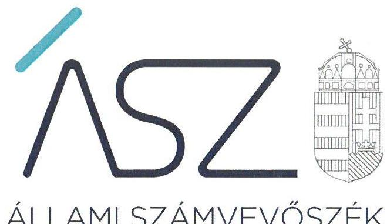
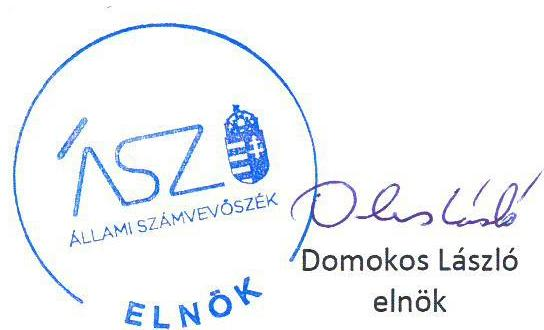

ÁLLAMI SZÁMVEVŐSZÉK

# JELENTÉS 

## Utóellenőrzések

Az állami tulajdonban (résztulajdonban) lévő gazdálkodó szervezetek vagyonmegőrzési és gazdálkodási tevékenységének utóellenőrzése - Széchenyi Programiroda Tanácsadó és Szolgáltató Nonprofit Korlátolt Felelősségű Társaság

2020
20037
www.asz.hu

---

# JELENTÉS

## Utóellenőrzések

Az állami tulajdonban (résztulajdonban) lévő gazdálkodó szervezetek vagyonmegőrzési és gazdálkodási tevékenységének utóellenőrzése – Széchenyi Programiroda Tanácsadó és Szolgáltató Nonprofit Korlátolt Felelősségű Társaság

2020. 02. hó 26. nap

20037
www.asz.hu

---

# AZ ELLENŐRZÉST FELÜGYELTE: 

KAKAS SÁNDOR felügyeleti vezető

## AZ ELLENŐRZÉST VEZETTE ÉS A VÉGREHAJTÁSÁÉRT FELELŐS:

SALAMIN VIKTOR ellenőrzésvezető

## A PROGRAM ÖSSZEÁLLÍTÁSÁÉRT FELELŐS:

TÓTPÁL SZABOLCS osztályvezető

## A TÉMÁHOZ KAPCSOLÓDÓ KORÁBBI SZÁMVEVŐSZÉKI JELENTÉSEK:

- címe: Jelentés - Az állami tulajdonban (résztulajdonban) lévő gazdálkodó szervezetek vagyonmegőrzési és gazdálkodási tevékenységének ellenőrzése - Széchenyi Programiroda NKft.
- sorszáma: $\quad 16123$

IKTATÓSZÁM: EL-2432-001/2020.
TÉMASZÁM: 2460
ELLENŐRZÉS-AZONOSÍTÓ SZÁM: V080466

---

# TARTALOMJEGYZÉK 

■ ÖSSZEGZÉS ..... 5
■ AZ ELLENŐRZÉS CÉLJA ..... 6
■ AZ ELLENŐRZÉS TERÜLETE ..... 7
■ AZ ELLENŐRZÉS HÁTTERE, INDOKOLTSÁGA ..... 8
■ A JELENTÉS LÉNYEGES KÉRDÉSKÖRE ..... 9
■ AZ ELLENŐRZÉS HATÓKÖRE ÉS MÓDSZEREI ..... 10
■ MEGÁLLAPÍTÁSOK ..... 12
■ MELLÉKLETEK ..... 13
I. sz. melléklet: A Széchenyi Programiroda Tanácsadó és Szolgáltató Nonprofit Kft. intézkedési terve végrehajtásának értékelése ..... 13
■ FÜGGELÉK: ÉSZREVÉTELEK ..... 15
■ RÖVIDÍTÉSEK JEGYZÉKE ..... 17

---

.

---

# ÖSSZEGZÉS 

A Széchenyi Programiroda Tanácsadó és Szolgáltató Nonprofit Kft. utóellenőrzése megállapította, hogy a Társaság ügyvezetője az intézkedési tervben vállalt feladatokat maradéktalanul és határidőben végrehajtotta, ennek eredményeképpen a szabályozottság javult, a vagyongazdálkodás és az integritás területén a kockázatok csökkentek.

## Az ellenőrzés társadalmi indokoltsága

Az Állami Számvevőszék stratégiájában célul tűzte ki a számvevőszéki munka hasznosulásának javítását. Ezzel összhangban ellenőrzi, hogy az ellenőrzött szervezetek megvalósították-e a korábbi ellenőrzései által feltárt hibák, hiányosságok és szabálytalanságok megszüntetése céljából elkészített intézkedési tervekben foglaltakat. A rendszeres utóellenőrzések hozzájárulnak a szükséges intézkedések tényleges végrehajtásához, ezáltal a közpénzügyek rendezettségének javulásához.

## Főbb megállapítások, következtetések

Az Állami Számvevőszék részére megküldött intézkedési tervben meghatározott hét feladatot a Széchenyi Programiroda Tanácsadó és Szolgáltató Nonprofit Kft. határidőben végrehajtotta.

A Széchenyi Programiroda Tanácsadó és Szolgáltató Nonprofit Kft. a szabályozottság javítása érdekében gondoskodott a Társaság számviteli politikájának, valamint számlarendjének aktualizálásáról, új leltározási, leltárkészítési és selejtezési szabályzat kiadásáról. A Széchenyi Programiroda Tanácsadó és Szolgáltató Nonprofit Kft. ügyvezetője integritási és vagyongazdálkodási kockázatok csökkentése érdekében felhívta a figyelmet a közzétételi kötelezettség jogszabályoknak megfelelő teljesítésére, valamint a leltározási és leltárkészítési szabályzatban foglaltak betartására és betartatására. A pénzügyi gazdálkodás területén a kockázatok csökkentek, a Széchenyi Programiroda Tanácsadó és Szolgáltató Nonprofit Kft. gondoskodott arról, hogy egyes munkavállalóktól származó bevételek a jogszabály előírásaival összhangban, a számlarendben foglaltaknak megfelelően kerüljenek elszámolásra.

---

# AZ ELLENŐRZÉS CÉLJA 

Az ellenőrzés célja annak értékelése volt, hogy a számvevőszéki jelentésben ${ }^{1}$ foglalt javaslatot megalapozó megállapításokkal összhangban készített intézkedési tervben meghatározott feladatokat az ellenőrzött szervezet végrehajtotta-e.

---

# AZ ELLENŐRZÉS TERÜLETE 

## Széchenyi Programiroda Tanácsadó és Szolgáltató Nonprofit Kft.

A Társaságot² 1996-ban a Magyar Állam alapította, az állam kizárólagos tulajdona. A Társaság az Alapító Okirata alapján közhasznú, a pénzügyminiszter közleménye alapján központi kormányzati szektorba sorolt szervezet. Fő tevékenysége társadalomtudományi és humán kutatás, fejlesztés. A Társaság koordinációs feladatokat lát el, alapcélja a területfejlesztésről és a területrendezésről szóló 1996. évi XXI. törvény³ 3. § (4) bekezdésében meghatározott területfejlesztéssel kapcsolatos állami feladatok teljesítését szolgáló közhasznú tevékenységek ellátása.

A Társaság törzstőkéje 52,0 M Ft. A taggyűlés hatáskörébe tartozó jogokat a Miniszterelnökség gyakorolja. Az ügyvezetést, a Társaság működését és gazdálkodását felügyelőbizottság ellenőrzi. A Társaság székhelye Budapest, négy budapesti telephelye és 45 vidéki fióktelepe van. A Társaság a 2018. évben 362 fő szellemi és 2 fő fizikai foglalkozású dolgozót alkalmazott.

Az ÁSZ ${ }^{4}$ 2016-ban ellenőrizte a Társaság pénzügyi és vagyongazdálkodását a 2011. január 1. és 2014. december 31. közötti időszakra vonatkozóan. Az ellenőrzés célja annak értékelése volt, hogy a tulajdonosi joggyakorló a vagyonnal való gazdálkodás feltételeit szabályszerűen alakította-e ki; a Társaság vagyongazdálkodási tevékenysége szabályozásának kialakítása és a vagyon nyilvántartása megfelelt-e az előírásoknak; a bevételek és ráfordítások elszámolásának szabályozása és végrehajtása, valamint az önköltségszámítás szabályszerű volt-e; a vagyonnal való gazdálkodás, valamint a változást eredményező döntések megfeleltek-e a jogszabályi és a belső előírásoknak; a gazdálkodó szervezet a szabályszerű vagyongazdálkodás érdekében teljesítette-e beszámolási kötelezettségét, kiépített-e és működtetett-e információs rendszert; valamint a kormányzati szektorba sorolt egyéb szervezetek gazdálkodásának a kormányzati szektor hiányára és az államadósságra befolyással bíró elemei a jogszabályi előírásoknak megfeleltek-e. Az erről készített 16123. számú számvevőszéki jelentését az ÁSZ 2016. augusztus 3-án hozta nyilvánosságra.

Az utóellenőrzés a számvevőszéki jelentésben megfogalmazott intézkedést igénylő megállapításokra és javaslatokra készített intézkedési terv ${ }^{5}$ ben foglalt feladatok végrehajtásának ellenőrzésére, értékelésére irányult.

---

# AZ ELLENŐRZÉS HÁTTERE, INDOKOLTSÁGA 

Az ÁSZ tv. 33. § (1) bekezdése értelmében a számvevőszéki jelentések intézkedést igénylő megállapításaihoz és javaslataihoz kapcsolódóan az ellenőrzött szervezet vezetője intézkedési tervet köteles összeállítani, és az Állami Számvevőszék részére megküldeni.

Az ÁSZ által befogadott intézkedési tervben foglaltak megvalósítását - az ÁSZ tv. 33. § (7) bekezdésében foglaltak alapján - az Állami Számvevőszék utóellenőrzés keretében ellenőrizheti. Az utóellenőrzések keretében - az intézkedések értékelése során - az Állami Számvevőszék figyelembe veszi az ellenőrzött szervezetek működési feltételeiben, valamint a jogszabályi előírásokban bekövetkezett változásokat.

Az utóellenőrzés során az ÁSZ értékeli, hogy az érintett számvevőszéki jelentésben foglalt megállapításokkal és javaslatokkal összhangban, az ellenőrzött szervezet által készített intézkedési tervben meghatározott feladatokat a feladatra kijelöltek végrehajtották-e.

Az intézkedések végrehajtásával az adott terület szabályszerű működése vonatkozásában a kockázatok csökkenhetnek, azonban hosszabb távon az intézkedési tervben foglaltak végrehajtásával önmagában nem szűnnek meg, csak akkor, ha beépülnek az ellenőrzött szervezet működésébe, azokat folyamatosan karbantartják, figyelembe véve, illetve kezelve a változásokat. Emellett az intézkedések végrehajtásáig újabb kockázatok merülhetnek fel a szabályszerű működés vonatkozásában, amelyek kezelése szintén kiemelten fontos az ellenőrzött szervezet számára.

Az ellenőrzött szervezet vezetője által készített intézkedési tervekben foglalt feladatok hiányos, illetve késedelmes végrehajtása, vagy annak elmaradása a szabályszerűség és a felelős vezetői magatartás vonatkozásában kockázatot hordoz, ami azt mutatja, hogy az ellenőrzések során feltárt hibák, hiányosságok és szabálytalanságok kezelése nem kapott kellő hangsúlyt. Az utóellenőrzés során is fennálló szabálytalanságok esetén a közpénz, közvagyon veszélyeztetettségi kockázat valószínűsített hatásának értékelése további intézkedéseket vonhat maga után.

Az ellenőrzött szervezet szintjén az utóellenőrzés feltárja, hogy a szervezet az intézkedések végrehajtásával hasznosította-e a korábbi ellenőrzési jelentésben a hiányosságok megszüntetése, illetve a kockázatok kezelése érdekében megfogalmazott javaslatokat, illetve az intézkedések végrehajtása elmaradásának következtében továbbra is fennálló szabálytalanság esetén értékeli a közpénzek, közvagyon veszélyeztetettségét.

Az ÁSZ szintjén az utóellenőrzés visszacsatolást ad az ellenőrzési jelentések hasznosulásáról, az intézkedések elmaradásának, vagy részleges megvalósulásának a közpénzek, közvagyon veszélyeztetettségére gyakorolt valószínűsített hatásának értékelése, további intézkedéseket vonhat maga után.

---

# A JELENTÉS LÉNYEGES KÉRDÉSKÖRE 

Az ellenőrzött szervezet az intézkedési tervben foglaltakat az előírt határidőben végrehajtotta-e?

---

# AZ ELLENŐRZÉS HATÓKÖRE ÉS MÓDSZEREI 

## Az ellenőrzés típusa

Megfelelőségi ellenőrzés

## Az ellenőrzött időszak

Az utóellenőrzés alapját képező számvevőszéki jelentés közzétételének napjától az ellenőrzésről szóló kiértesítő levél keltének napjáig, azaz 2016. augusztus 3-tól 2019. augusztus 30-ig tartó időszak.

## Az ellenőrzés tárgya

A számvevőszéki jelentésben foglalt megállapításokkal és javaslatokkal összhangban a Társaság által készített Intézkedési tervben foglaltak végrehajtásának ellenőrzése.

## Az ellenőrzött szervezet

Széchenyi Programiroda Tanácsadó és Szolgáltató Nonprofit Kft.

## Az ellenőrzés jogalapja

Az ÁSZ tv. 33. § (7) bekezdése.

## Az ellenőrzés módszerei

Az ellenőrzést az ellenőrzött időszakban hatályos jogszabályok, az ellenőrzés szakmai szabályai, a jelen ellenőrzésre irányadó ÁSZ módszertanok, az ellenőrzési programban foglalt értékelési szempontok szerint végeztük.

Az ellenőrzés ideje alatt az ellenőrzött szervezettel történő kapcsolattartást az ÁSZ SZMSZ ${ }^{\text {I}}$-ének vonatkozó előírásai biztosították.

Az utóellenőrzés megállapításait az ÁSZ rendelkezésére álló, valamint az ÁSZ adatbekérése szerint az ellenőrzött szervezet által rendelkezésre bocsátott dokumentumok alapozták meg.

Az ellenőrzési bizonyítékként felhasználható adatforrások közé tartoztak egyrészt az ellenőrzési program részletes szempontjainál felsorolt adatforrások, másrészt minden - az ellenőrzés folyamán feltárt, az ellenőrzés szempontjából információt tartalmazó - dokumentum.

---

Az intézkedési tervben előírt feladatokat azok végrehajthatósága, illetve végrehajtása szempontjából az alábbiak szerint értékeltük:
$\longrightarrow$ „határidőben végrehajtott" a feladat, ha a teljesítés dokumentáltan, az intézkedési tervben előírt határidőben és tartalommal megtörtént;
$\longrightarrow$ „határidőn túl végrehajtott" a feladat, ha annak teljesítése az intézkedési tervben meghatározott módon, de az előírt határidőn túl történt meg;
$\longrightarrow$ „részben végrehajtott" a feladat, ha végrehajtása teljes körűen az intézkedési tervben előírt módon nem történt meg;
$\longrightarrow$ „nem végrehajtott" a feladat, ha a végrehajtás nem történt meg, vagy amennyiben a teljesítést nem dokumentálták;
$\longrightarrow$ „okafogyottá vált" a feladat, ha végrehajtására - meghatározott esemény bekövetkezése, továbbá külső körülmény, a működést érintő feltétel változása miatt - már nincs szükség, illetve lehetőség, és egyértelműen megállapítható, hogy az intézkedést szükségessé tevő körülmény a jövőben nem fordulhat elő;
$\longrightarrow$ „nem időszerű" az a feladat, amelynek ellenőrzési időszakon belüli végrehajtására azért nem került (kerülhetett) sor, mert az intézkedés alapjául szolgáló esemény nem következett be, de annak jövőbeni előfordulása lehetséges, a végrehajtása nem volt esedékes, vagy a végrehajtás határideje még nem járt le.
Az ellenőrzés lefolytatásához az ellenőrzött szervezet a tanúsítványok elektronikus kitöltésével, valamint az ÁSZ által kért dokumentumok elektronikus megküldésével szolgáltatott adatokat, amelyek valódiságát és teljes körűségét az ellenőrzött szervezet vezetője által tett teljességi és hitelességi nyilatkozat igazolta. Az így rendelkezésre bocsátott adatok, információk kontrollja az ellenőrzés keretében megtörtént.

---

# MEGÁLLAPÍTÁSOK 

## Az ellenőrzött szervezet az intézkedési tervben foglaltakat az előírt határidőben végrehajtotta-e?

Összegző megállapítás

## Az ellenőrzött szervezet az intézkedési tervben meghatározott feladatokat határidőben végrehajtotta.

Az ÁSZ a 16123. számú Jelentésében a Társaság ügyvezetőjének hat javaslatot fogalmazott meg. A hiányosságok és szabálytalanságok megszüntetésére a Társaság által készített intézkedési tervben meghatározott hét feladatot, a végrehajtás határidejét, a felelősöket és a feladatok végrehajtásának értékelését az I. számú melléklet mutatja be.

A SZABÁLYOZOTTSÁG javítása érdekében a Társaság ügyvezetője gondoskodott a Társaság számviteli politikájának, valamint számlarendjének aktualizálásáról, továbbá gondoskodott új leltározási, leltárkészítési és selejtezési szabályzat kiadásáról (3,4,5). A Társaság szabályozottságában rejlő kockázatok csökkentése érdekében az ügyvezetője utasította a belső ellenőrt, hogy ellenőrizze a Társaság szabályzatai jogszabályoknak való megfelelőségét (2,6/2).

AZ INTEGRITÁS TERÜLETÉN tapasztalt kockázatok csökkentése érdekében a Társaság ügyvezetője felhívta a Társaság gazdasági igazgatójának, humánerőforrás és hálózatfejlesztési osztályvezetőjének, valamint a jogi osztály vezetőjének figyelmét a közzétételi és letétbe helyezési kötelezettség hatályos jogszabályoknak megfelelő teljesítésére (6/1,7).

A VAGYONGAZDÁLKODÁS javítása érdekében a Társaság ügyvezetője felhívta a gazdasági igazgató figyelmét a leltározási és leltárkészítési szabályzatban foglaltak betartására és betartatására (1).

## A PÉNZÜGYI GAZDÁLKODÁS SZABÁLYSZERŰSÉGÉNEK javítása érdekében a Társaság ügyvezetője gondoskodott arról, hogy a munkavállalók részére továbbszámlázott magáncélú telefonköltség, valamint a közlekedési bírság munkavállaló által megtérített összegét a Számv. tv. ${ }^{7}$ előírásaival összhangban, a Társaság számlarendjében foglaltaknak megfelelően számolják el (4).

---

# MELLÉKLETEK

- I. SZ. MELLÉKLET: A SZÉCHENYI PROGRAMIRODA TANÁCSADÓ ÉS SZOLGÁLTATÓ NONPROFIT

 KFT. INTÉZKEDÉSI TERVE VÉGREHAJTÁSÁNAK ÉRTÉKELÉSE

|  Sorszám | Az intézkedési tervben rögzített feladat | Az intézkedési tervben meghatározott határidő | Az intézkedési tervben meghatározott felelős | A feladat végrehajtása |
| --- | --- | --- | --- | --- |
|  1. | "A leltárkészítési és leltározási szabályzat kiadásáról szóló 19/2013. számú ügyvezetői utasításban foglaltak betartása, betartatása; e tekintetben ügyvezetői utasítás kiadása." | "Megtörtént" (Az intézkedési terv elfogadásakor a vállalt feladatot már végrehajtották.) | Ügyvezető | Az ügyvezető 2016. augusztus 26-án kiadta a 17/2016. számú ügyvezetői utasítást, melynek 1. pontjában felhívta a gazdasági igazgató figyelmét a korábbi, a leltárkészítésről és leltározásról szóló 19/2013. számú ügyvezetői utasításban foglaltak betartására és betartatására.  |
|  2. | "Önellenőrzés elrendelése és a szükséges jogi és szakmai lépések megtétele." | "Megtörtént" (Az intézkedési terv elfogadásakor a vállalt feladatot már végrehajtották.) | Ügyvezető és Gazdasági igazgató | Az ügyvezető 2016. augusztus 26-án kiadta a 17/2016. számú ügyvezetői utasítást, melynek 2. pontjában felhívta a gazdasági igazgató figyelmét a jogszabályi változások követésére és a gazdasági igazgatóság hatáskörébe tartozó szabályzatok módosításainak az előkészítésére, és az ügyvezető elé terjesztésére. A hivatkozott utasítás 5. pontjában az ügyvezető elrendelte a belső ellenőrzés számára, hogy ellenőrizze a Társaság szabályzatainak és a vonatkozó jogszabályi előírások megfelelőségét. Az ügyvezető 2017. március 31-én írásban tájékoztatta az FB-t az ÁSZ 16123. számú jelentése alapján készült IT végrehajtásáról. Az ügyvezető a beszámolójában tájékoztatta továbbá a FB-t, hogy az ÁSZ ellenőrzéskor a gazdasági igazgatói posztot betöltő személy munkaviszonya a Társaságnál 2014. június 30-án megszűnt.  |
|  3. | "Ügyvezetői utasítás kiadása a számviteli politika módosítása tekintetében." | "Megtörtént" (Az intézkedési terv elfogadásakor a vállalt feladatot már végrehajtották.) | Ügyvezető és Gazdasági igazgató | A Társaság ügyvezetője 2016. augusztus 26-án kiadta a 17/2016. számú utasítást, melynek 2. pontjában felhívta a gazdasági igazgató figyelmét a jogszabályi változások követésére és a gazdasági igazgatóság hatáskörébe tartozó szabályzatok módosításainak az előkészítésére, és az ügyvezető elé terjesztésére. Az ügyvezető 2016. március 30-án a 6/A/2016. számú utasítása keretében kiadta a Társaság új számviteli politikáját.  |

---

|  4. | "Jelen intézkedési terv keretében felhívom a gazdasági igazgatót, hogy a számviteli törvény 72. § (1) bekezdés értelmében az értékesítés nettó árbevétele helyett hivatkozott törvény 77. § (2) bekezdés d) pontja szerint az egyéb bevételek között számolja el a munkavállalók részére továbbszámlázott magáncélú telefonköltség, valamint a közlekedési bírság munkavállaló által megtérített összegét." | "Megtörtént" (Az intézkedési terv elfogadásakor a vállalt feladatot már végrehajtották.) | Gazdasági igazgató | Az ügyvezető 2016. augusztus 26-án kiadta a 17/2016. számú utasítást, melynek 2. pontjában utasította a gazdasági igazgatóságot, hogy a hatáskörükbe tartozó szabályzatok módosítását készítsék elő, és azokat terjesszék az ügyvezető elé. Az ügyvezető 2017. március 31-én a 19/2017. számú utasítása keretében kiadta a Társaság aktualizált számlarendjét. Az aktualizált számlarend a Számv. tv. 72. § (1) bekezdésével összhangban, a munkavállalók részére továbbszámlázott magáncélú költségek megtérüléséből származó bevételek elszámolását az Egyéb bevételek között rendelte el. Az aktualizált számlarend e bevételek elszámolására a számlatükörben a 9697-es számú főkönyvi számlát jelölte meg. A Társaság a szabályozás végrehajtásának igazolására megküldte a 2016-2018. évi bővített főkönyvi kivonatokat, amelyekből nyomon követhető a 9697-es főkönyvi számlák forgalma.  |
| --- | --- | --- | --- | --- |
|  5. | "Felhívom a gazdasági igazgatóság figyelmét a szabályzat betartására a 2016. évi selejtezési eljárás során, e tekintetben ügyvezetői utasítás kiadása." | "Megtörtént" (Az intézkedési terv elfogadásakor a vállalt feladatot már végrehajtották.) | Ügyvezető | Az ügyvezető 2016. augusztus 26-án kiadta a 17/2016. számú utasítást, melynek 1. pontjában felhívta a gazdasági igazgató figyelmét a korábbi, a leltárkészítésről és leltározásról szóló 19/2013. számú ügyvezetői utasításban foglaltak betartására és betartatására. Utasította továbbá a 2. pontban gazdasági igazgatót a jogszabályi változások követésére és a gazdasági igazgatóság hatáskörébe tartozó szabályzatok módosításának előkészítésére és ügyvezető elé terjesztésére. Az ügyvezető 2019. január 2-án, a 9/2019. számú utasítása keretében kiadta a Társaság leltározási, leltárkészítési és selejtezési szabályzatát.  |
|  6/1. | "A javaslatban megfogalmazottakra figyelemmel, felhívom a jelenleg hatályos szabályzat szerint illetékes adatfelelősöket, hogy a megjelölt hiányosságok közül a még fennálló hiányosságokat pótolják a hatályos jogszabályoknak megfelelően." | "Folyamatos, de legkésőbb a hiányok pótlására 2016. október 31." | Gazdasági igazgató, Humánerőforrás és Hálózatfejlesztési Osztályvezető | Az ügyvezető 2016. augusztus 26-án kiadta a 17/2016. számú utasítást, amelynek 3. pontjában felhívta a gazdasági igazgatót, a humánerőforrás és a hálózatfejlesztési osztályvezetőt, mint az intézkedési tervben megjelölt adatfelelősöket, hogy a közzétételi kötelezettséggel kapcsolatban még fennálló, az ÁSZ által megjelölt hiányosságokat a hatályos jogszabályoknak megfelelően pótolják.  |
|  6/2. | "Önellenőrzés elrendelése és a szükséges szakmai lépések megtétele." | "Azonnali" (Az intézkedési terv elfogadásakor a vállalt feladatot már végrehajtották.) | Ügyvezető és Gazdasági igazgató | Az ügyvezető 2016. augusztus 26-án kiadta a 17/2016. számú utasítást, amelynek 5. pontjában az ügyvezető elrendelte a belső ellenőrzés számára a Társaság szabályzatainak és a vonatkozó jogszabályi előírások megfelelőségének ellenőrzését.  |
|  7. | "Felhívom a jogi osztály vezetőjét a vonatkozó jogszabályi határidők betartására, e tekintetben ügyvezetői utasítás kiadása." | "Azonnali" (Az intézkedési terv elfogadásakor a vállalt feladatot már végrehajtották.) | Ügyvezető és jogi osztály vezetője | Az ügyvezető 2016. augusztus 26-án kiadta a 17/2016. számú utasítást, amelynek 4. pontjában felhívta a jogi osztály vezetőjét a jogszabályi határidők betartására.  |

---

# FÜGGELÉK: ÉSZREVÉTELEK 

A jelentéstervezetet a Számvevőszék 15 napos észrevételezésre megküldte az ellenőrzött szervezet vezetőjének az ÁSZ tv. 29. § (1) bekezdése előírásának megfelelően.

A Széchenyi Programiroda Tanácsadó és Szolgáltató Nonprofit Kft. ügyvezetője a jelentéstervezet megállapításaira nem tett észrevételt.

[^0]
[^0]:    * 29. § (1) Az Állami Számvevőszék az ellenőrzési megállapításait megküldi az ellenőrzött szervezet vezetőjének vagy az általa megbízott személynek, és annak, akinek személyes felelősségét állapította meg.
    (2) Az ellenőrzött szervezet vezetője és a felelősként megjelölt személy az ellenőrzés megállapításaira tizenöt napon belül írásban észrevételt tehet.
    (3) Az Állami Számvevőszék az észrevételre a beérkezésétől számított harminc napon belül írásban válaszol. A figyelembe nem vett észrevételeket köteles a jelentésben feltüntetni, és megindokolni, hogy azokat miért nem fogadta el.

---

.

---

# RÖVIDÍTÉSEK JEGYZÉKE 

${ }^{1}$ számvevőszéki jelentés
${ }^{2}$ Társaság
${ }^{3}$ 1996. évi XXI. törvény
${ }^{4}$ ÁSZ
${ }^{5}$ intézkedési terv
${ }^{6}$ ÁSZ SZMSZ
${ }^{7}$ Számv. tv.

Az Állami Számvevőszék 16123. számú, 2016. augusztus 3-án közzétett, „Az állami tulajdonban (résztulajdonban) lévő gazdálkodó szervezetek vagyonmegőrzési és gazdálkodási tevékenységének ellenőrzése - Széchenyi Programiroda Tanácsadó és Szolgáltató Nonprofit Kft." című ellenőrzési jelentése
Széchenyi Programiroda Tanácsadó és Szolgáltató Nonprofit Kft.
a területfejlesztésről és a területrendezésről szóló 1996. évi XXI. törvény (hatályos: 1996. augusztus 5-től)
Állami Számvevőszék
Széchenyi Programiroda Tanácsadó és Szolgáltató Nonprofit Kft. intézkedési terve (iktatószám: V-0977-392/2016.)
Az Állami Számvevőszék Szervezeti és Működési Szabályzata
a számvitelről szóló 2000. évi C. törvény (hatályos: 2001. január 1-jétől)

---

# ASZ 

ÁLLAMI SZÁMVEVŐSZÉK
1052 Budapest, Apáczai Cs. J. u. 10. I 1364 Budapest 4. Pf. 54 TEL: +36 14849100
email: szamvevoszek@asz.hu
web: www.asz.hu | www.aszhirportal.hu
