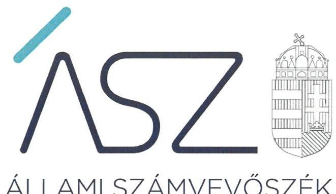
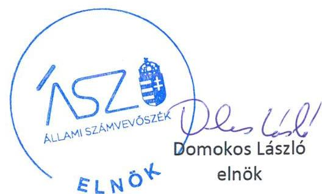
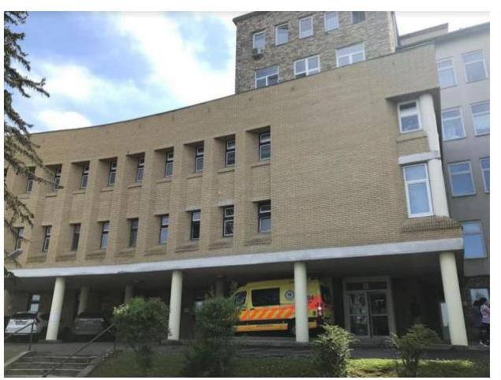
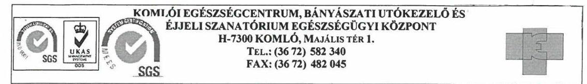
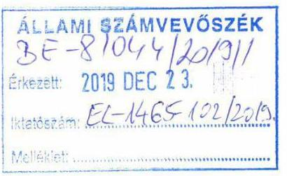
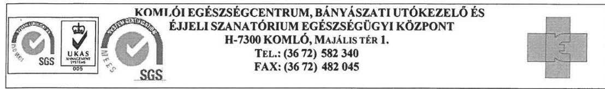
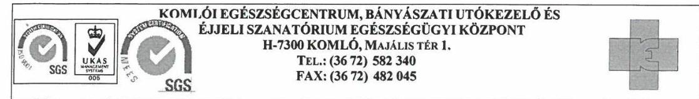
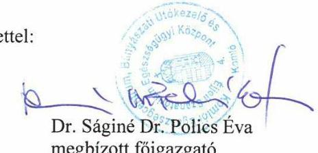
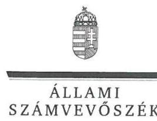
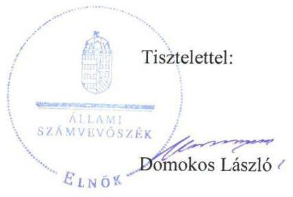

ÁLLAMI SZÁMVEVŐSZÉK

# JELENTÉS 

## Központi költségvetési szervek ellenőrzése

Komlói Egészségcentrum, Bányászati Utókezelő és Éjjeli Szanatórium Egészségügyi Központ

2020.

20038
www.asz.hu

---

ÁLLAMI SZÁMVEVŐSZÉK

# JELENTÉS

## Központi költségvetési szervek ellenőrzése

Komlói Egészségcentrum, Bányászati Utókezelő és Éjjeli Szanatórium Egészségügyi Központ

2020. 02. hó 20. nap

20038
www.asz.hu

---

AZ ELLENŐRZÉST FELÜGYELTE:
DR. NAGY IMRE felügyeleti vezető

AZ ELLENŐRZÉST VEZETTE ÉS A VÉGREHAJTÁSÁÉRT FELELŐS:
DR. GYŐRI GABRIELLA ellenőrzésvezető

A PROGRAM ÖSSZEÁLLÍTÁSÁÉRT FELELŐS:
TÓTPÁL SZABOLCS osztályvezető

IKTATÓSZÁM: EL-2433-001/2020.
TÉMASZÁM: 2450
ELLENŐRZÉS-AZONOSÍTÓ SZÁM: V079197

Jelentéseink az Országgyűlés számítógépes hálózatán és az Interneten a www.asz.hu címen is olvashatóak.

---

# TARTALOMJEGYZÉK 

■ ÖSSZEGZÉS ..... 5
■ AZ ELLENŐRZÉS CÉLJA ..... 7
■ AZ ELLENŐRZÉS TERÜLETE ..... 8
■ AZ ELLENŐRZÉS HÁTTERE, INDOKOLTSÁGA ..... 9
■ A JELENTÉS LÉNYEGES KÉRDÉSKÖREI ..... 11
■ AZ ELLENŐRZÉS HATÓKÖRE ÉS MÓDSZEREI ..... 12
■ MEGÁLLAPÍTÁSOK ..... 15
■ JAVASLATOK ..... 19
■ MELLÉKLETEK ..... 22
I. sz. melléklet: Értelmező szótár ..... 22
■ FÜGGELÉK: ÉSZREVÉTELEK ..... 25
■ RÖVIDÍTÉSEK JEGYZÉKE ..... 37

---

.

---

# ÖSSZEGZÉS 

A Komlói Egészségcentrum, Bányászati Utókezelő és Éjjeli Szanatórium Egészségügyi Központ belső kontrollrendszerének kialakítása és működtetése, pénzügyi és vagyongazdálkodása nem biztosította a felelős gazdálkodást, az átlátható és elszámoltatható közpénzfelhasználást és a vagyon megőrzését. A korrupció elleni védettség nem volt biztosított.

## Az ellenőrzés társadalmi indokoltsága

A központi alrendszer részét képező intézmények alapvető rendeltetése a közfeladatok ellátásának biztosítása. A közpénzek felhasználásában meghatározó, központi alrendszerbe tartozó intézmények pénzügyi és vagyongazdálkodási tevékenységük és/vagy feladatellátásuk súlya miatt jelentős hatást gyakorolhatnak a költségvetés egyensúlyának fenntartására. Hatással vannak továbbá az állami vagyonnal való gazdálkodás minőségére, a kormányzati (szak)politikák végrehajtására, illetve közfeladat ellátásuk vonatkozásában az állampolgárok életminőségére, jogaik és kötelezettségeik gyakorlására. Indokolt ezért, hogy az Állami Számvevőszék ezen intézmények pénzügyi és vagyongazdálkodását, az esetleges átalakulások szabályszerűségét rendszeresen ellenőrizze.

A Komlói Egészségcentrum, Bányászati Utókezelő és Éjjeli Szanatórium Egészségügyi Központ közfeladatot lát el és jelentős mértékű állami vagyont kezel. Az egészségügyi ellátások közfeladat teljesítése folyamatosan a társadalmi érdeklődés középpontjában áll. A központi költségvetésből az egyik legjelentősebb kiadást az egészségügyi ellátásokra fordított kiadások jelentik, amelyekből a kórházak kapják a legtöbb támogatást.

## Főbb megállapítások, következtetések, javaslatok

A Komlói Egészségcentrum, Bányászati Utókezelő és Éjjeli Szanatórium Egészségügyi Központ belső kontrollrendszere nem biztosította a közpénzekkel való átlátható, szabályszerű és felelős gazdálkodást. A 2015-2017. években nem mérték fel és azonosították be a tevékenységekben rejlő kockázatokat, nem határozták meg az egyes kockázatokkal kapcsolatban szükséges intézkedéseket. A Komlói Egészségcentrum, Bányászati Utókezelő és Éjjeli Szanatórium Egészségügyi Központ főigazgatója 2016. október 1-jétől nem jelölte ki az integrált kockázatkezelési rendszer koordinálásának a felelősét. A jogszabályi előírásoknak megfelelő tartalmú kötelezettségvállalások nyilvántartását 2015-2017-ben nem vezették. A belső ellenőrzés működtetése a 2015-2017. években nem volt szabályszerű. Az ellenőrzött időszakban elvégzett ellenőrzésekről nem vezettek nyilvántartást. A Komlói Egészségcentrum, Bányászati Utókezelő és Éjjeli Szanatórium Egészségügyi Központ főigazgatója az ellenőrzött időszakban nyilatkozatban értékelte a szervezet belső kontrollrendszerének minőségét, azonban az ellenőrzés megállapításai nem igazolták az abban foglaltakat.

A Komlói Egészségcentrum, Bányászati Utókezelő és Éjjeli Szanatórium Egészségügyi Központ pénzügyi gazdálkodása nem volt szabályszerű. Nem gondoskodtak a bevételek szabályszerű elszámolásáról. A kiadási előirányzatok felhasználása során a gazdálkodási jogkörök gyakorlása nem volt szabályszerű, mert kötelezettségvállalás, illetve teljesítésigazolás hiányában teljesítettek kifizetést.

A vagyongazdálkodás nem volt szabályszerű, mert a jogszabályi előírás ellenére a Komlói Egészségcentrum, Bányászati Utókezelő és Éjjeli Szanatórium Egészségügyi Központ nem állított össze a mérleg fordulónapján meglévő eszközeit és forrásait mennyiségben és értékben, tételesen, ellenőrizhető módon tartalmazó leltárt, emiatt a 2015-2017. évi számviteli beszámolók nem mutattak megbízható és valós képet a gazdálkodásáról.

A Komlói Egészségcentrum, Bányászati Utókezelő és Éjjeli Szanatórium Egészségügyi Központot érintő 2016. évi átalakítás lebonyolítása nem volt szabályszerű, mert a beolvadással megszűnt Bányászati Utókezelő és Éjjeli Szanatórium záró beszámolójának elkészítéséről nem gondoskodtak.

Az integritást támogató kontrollokat nem építették ki és nem működtették a Komlói Egészségcentrum, Bányászati Utókezelő és Éjjeli Szanatórium Egészségügyi Központnál.

---

Az Állami Számvevőszék Komlói Egészségcentrum, Bányászati Utókezelő és Éjjeli Szanatórium Egészségügyi Központ főigazgatójának 17 javaslatot fogalmazott meg.

---

# AZ ELLENŐRZÉS CÉLJA 

AZ ELLENŐRZÉS CÉLJA annak megállapítása volt, hogy az ellenőrzött intézményre vonatkozó irányító szervi feladatellátás a jogszabályi előírások betartásával történt-e; az intézménynél a belső kontrollrendszer kialakítása és működtetése szabályszerű volt-e, biztosította-e az átlátható, szabályszerű, gazdaságos, hatékony és eredményes gazdálkodás feltételeit; az intézmény pénzügyi és vagyongazdálkodása megfelelt-e a jogszabályi előírásoknak és belső szabályzatainak. Az ellenőrzés keretében az ÁSZ ${ }^{1}$ értékelte az intézmény korrupciós kockázatainak kezelését szolgáló integritás kontrollok kiépítettségét és az integritás szemlélet érvényesülését, továbbá, hogy megteremtették-e a teljesítményellenőrzés feltételeit.

Az ellenőrzés célja volt továbbá annak értékelése, hogy az államháztartás központi alrendszerébe tartozó intézmény megfelelt-e annak az Alaptörvényben² meghatározott alapvetésnek, hogy Magyarország a kiegyensúlyozott, átlátható és fenntartható költségvetési gazdálkodás elvét érvényesíti. Érvényesült-e a nemzeti vagyon kezelésének és védelmének célja, azaz a szervezet vagyona a közérdeket szolgálta, a közös szükségletek kielégítése és a természeti erőforrások megóvása, valamint a jövő nemzedékek szükségleteinek figyelembevétele mellett.

---

# **AZ ELLENŐRZÉS TERÜLETE**

## **Komlói Egészségcentrum, Bányászati Utókezelő és Éjjeli Szanatórium Egészségügyi Központ**

A Központot3 az Emberi Erőforrások minisztere alapította 2013. április 1-jén Komlói Egészségcentrum néven. 2016. március 31-én a Bányászati Utókezelő és Éjjeli Szanatórium beolvadásával a jogutód szervezet neve Komlói Egészségcentrum, Bányászati Utókezelő és Éjjeli Szanatórium Egészségügyi Központ lett. Az ellenőrzött időszakban központi költségvetési intézmény volt és az egészségügyről szóló 1997. évi CLIV. törvény alapján közfeladatokat látott el. Közfeladata a működési engedélyében meghatározott ellátási területre kiterjedően a járó- és fekvőbetegek diagnosztikus és terápiás szakorvosi ellátása, rehabilitációja és követéses gondozása volt. A Központ az Nvtv.4, és a Vtvr.5 előírásai alapján vagyonkezelési szerződés1,36-vel rendelkezett.

A Központ irányító szerve az ellenőrzött időszakban az EMMI7, középirányító szerve a GYEMSZI8, majd 2015. március 1-jétől az ÁEEK9 volt. A Központ önálló jogi személy volt, mely gazdasági szervezettel rendelkezett. Az Áht.10 szerinti átalakításra az ellenőrzött időszakban sor került. A Központ az ellenőrzött időszakban vállalkozási tevékenységet nem végzett.

A Központot főigazgató vezette, aki felett az irányító szervet vezető miniszter gyakorolta a kinevezési és munkáltatói jogokat. A főigazgató és a gazdasági igazgató személyében 2015. év és 2017. év között nem történt változás.

2017. évben a Központ által kimutatott teljesített összes bevétel és a vagyon meghaladta, a teljesített összes kiadás pedig megközelítette az 1,7 milliárd forintot. A Központ alkalmazásában álló személyek foglalkoztatása közalkalmazotti jogviszonyban, munkaviszonyban, illetve vállalkozási jogviszonyban történt. Az átlagos statisztikai állományi létszám a 2015. évi 174 főről 2017. évre 195 főre változott. A Központ foglalkoztatottjai felett a munkáltatói jogokat a főigazgató gyakorolta.

---

# AZ ELLENŐRZÉS HÁTTERE, INDOKOLTSÁGA 

Az államháztartás központi alrendszerének közpénz felhasználása, az intézmények által ellátott közfeladatok sokrétűsége, valamint a feladatellátásához rendelt vagyon nagyságrendje indokolja, hogy az ÁSZ ellenőrzéseket folytasson a pénzügyi és vagyongazdálkodás területén. Az ÁSZ az ellenőrzései során feltárja a gazdálkodást, a központi alrendszer intézményei átalakulását, átszervezését érintő szabályozások esetleges hiányosságait, a szabályozással nem érintett gazdálkodási területeket, rámutathat a vagyongazdálkodási tevékenység - ezen belül a tulajdonosi joggyakorlás és vagyonkezelés - esetleges szabálytalanságaira, értékeli az állami vagyon nyilvántartására és elszámolására vonatkozó eljárásokat.

Az államháztartás központi alrendszerébe tartozó szervezet vagyona a nemzeti vagyon része és az Alaptörvény is rögzíti, hogy a vagyonnal való gazdálkodás célja a közérdek szolgálata. Az ÁSZ ellenőrzi az éves költségvetési törvény végrehajtását, az ellenőrzés során feltárt kockázatok és a terület folyamatos kockázatelemzésével beazonosított kockázatok kezelése érdekében ráépülő ellenőrzésekkel ellenőrzi a költségvetési szervek gazdálkodását, működését, hogy az ellenőrzések megállapításaival támogassa az ellenőrzött szervezetek szabályszerű gazdálkodását, javaslataival elősegítse az Alaptörvényben megfogalmazott alapvetések érvényesülését a mindennapi életben a szervezetek szintjén. A központi költségvetés rendszerében zajló folyamatok holisztikus elemzései, a kockázatok folyamatos figyelemmel kísérésének módszerével, az így kiválasztott szervezetek célzott, hatékony ellenőrzéseivel az ÁSZ betölti a legfőbb gazdasági ellenőrző szerv küldetését.

Az ellenőrzés várhatóan hozzájárul a központi intézmények pénzügyi helyzetének pontosabb megítéléséhez, és a jó gyakorlat kialakításán és terjesztésén keresztül az ellenőrzések elősegíthetik a gazdálkodás szabályszerűségének javítását.

A belső kontrollrendszer kialakítása és működtetése nélkül nem valósítható meg a közpénzek, a közvagyon átlátható, szabályos, gazdaságos, hatékony és eredményes felhasználása. A belső kontrollrendszer azt a célt szolgálja, hogy a költségvetési szervek működésük és gazdálkodásuk során a tevékenységeket szabályszerűen hajtsák végre, teljesítsék elszámolási kötelezettségeiket és megvédjék az erőforrásokat a veszteségektől, a károktól és a nem rendeltetésszerű használattól. A belső kontrollrendszer magában foglalja mindazon elveket, eljárásokat és belső szabályzatokat, melyek biztosítják, hogy a költségvetési szerv valamennyi tevékenysége és célja összhangban legyen a szabályszerűséggel, szabályozottsággal, valamint a gazdaságosság, hatékonyság és eredményesség követelményeivel, az eszközökkel és forrásokkal való gazdálkodásban ne kerüljön sor pazarlásra, visszaélésre, rendeltetésellenes felhasználásra. Megfelelő, pontos és naprakész információk álljanak rendelkezésre a költségvetési szerv működésével kapcsolatosan, és a belső kontrollrendszer harmonizációjára, összehangolására vonatkozó jogszabályok végrehajtásra kerüljenek. Az integritás kontrollok kiépítése, erősítése a szervezet korrupciós kockázatainak

---

kezelését szolgálja. A teljesítménykövetelmények meghatározása és működtetése megalapozhatja a központi költségvetési szervnél a teljesítményellenőrzés lefolytatását.

Az egyes ellenőrzések megállapításaival és egy időszak ellenőrzési eredményeinek elemzésével az ÁSZ ráirányíthatja a jogalkotók figyelmét a központi alrendszerben vagy annak egy ágazatában esetlegesen felmerülő pénzügyi, szabályozási feszültségekre. Az elvégzett ellenőrzések során az ÁSZ „jó gyakorlatokat" is azonosíthat, melyeket tanácsadó funkciója keretében szélesebb körben is megismertethet az érintettekkel, ezáltal is hozzájárulva a költségvetési rendszer szabályozott, átlátható, kiegyensúlyozott és fenntartható működéséhez.

Az ellenőrzés a szervezet kockázatértékelése alapján, az egyedi és lényeges jellemzők figyelembevételével történt.

---

# A JELENTÉS LÉNYEGES KÉRDÉSKÖREI 

1. Az irányító szerv ellenőrzött költségvetési szervre vonatkozó feladatellátása szabályszerű volt-e?
2. A belső kontrollrendszer kialakítása és működtetése biztosította-e a közpénzekkel és a nemzeti vagyonnal történő szabályszerű gazdálkodást?
3. A költségvetési szerv pénzügyi gazdálkodása szabályszerű volt-e?
4. A költségvetési maradvány megállapítása szabályszerű volt-e?
5. A költségvetési szerv vagyongazdálkodása szabályszerű volt-e?
6. Szabályszerűen történt-e az ellenőrzött időszakban a költségvetési szervet érintő szervezeti, szerkezeti átalakítások lebonyolítása?
7. A költségvetési szervnél alakítottak-e ki a teljesítmény mérésére alkalmas követelményeket?

---

# AZ ELLENŐRZÉS HATÓKÖRE ÉS MÓDSZEREI 

## Az ellenőrzés típusa

Megfelelőségi ellenőrzés.

## Az ellenőrzött időszak

2015-2017. évek.

## Az ellenőrzés tárgya

A Központra vonatkozó 2015-2016. évi irányító szervi feladatok ellátása. A Központ 2015-2017. évi belső kontrollrendszerének kialakítása és működtetése, valamint az integritás kontrollok kiépítettsége 2016-2017. években és a teljesítmény ellenőrzés feltételei 2017. évben. A maradvány megállapításának szabályszerűsége a 2015-2017. években.

A Központ pénzügyi és vagyongazdálkodása a 2015-2016. években. A 2017. évre vonatkozóan a Központ vagyongazdálkodási feltételeinek kialakítása, annak szabályszerűsége, az elszámoltathatóság biztosítása a szabályozás szintjén. A Központnál hozott vagyonváltozást eredményező döntések, a vagyonban bekövetkezett változások végrehajtásának, nyilvántartásba vételének, elszámolásának szabályszerűsége. A Központ könyveiben, mérlegében az állami vagyon kimutatásának szabályszerűsége, ennek keretében az állami vagyonnal történő rendelkezés, a vagyonmozgások, a vagyon nyilvántartásba vétele, értékelése és a mérleg alátámasztás szabályszerűsége.

Az ellenőrzés kiterjedt minden olyan körülményre és adatra, amely az ÁSZ jogszabályban
 meghatározott feladatainak teljesítéséhez, valamint a program végrehajtása folyamán felmerült újabb összefüggések feltárásához szükséges volt.

## Az ellenőrzött szervezet

Komlói Egészségcentrum, Bányászati Utókezelő és Éjjeli Szánatórium Egészségügyi Központ; Emberi Erőforrások Minisztériuma (mint irányító szerv), Állami Egészségügyi Ellátó Központ (mint középirányító szerv).

---

# Az ellenőrzés jogalapja 

Az ellenőrzés jogszabályi alapját az ÁSZ tv. ${ }^{11}$ 1. § (3) bekezdés, 5. § (2)-(4) és (6) bekezdései, valamint az Áht. 61. § (2) bekezdésének előírásai képezték.

## Az ellenőrzés módszerei

Az ellenőrzésre a szakmai program szempontjai, az ellenőrzött időszakban hatályos jogszabályok, az ellenőrzés szakmai szabályai, a jelen ellenőrzésre irányadó ÁSZ módszertanok figyelembevételével került sor.

Az ellenőrzés ideje alatt az ellenőrzött szervezetekkel a kapcsolattartást az ÁSZ SZMSZ ${ }^{12}$-ének vonatkozó előírásai alapján biztosította az ÁSZ.

Az ellenőrzési kérdések megválaszolásához szükséges bizonyítékok megszerzése az ellenőrzött szervezetek által rendelkezésre bocsátott dokumentumokra, adatokra alapozva megfigyelés, szemle (szemrevételezés), kérdésfeltevés (információkérés), mintavételezés, valamint elemző eljárás útján történt.

Az ellenőrzési bizonyítékként felhasználható adatforrások közé tartoztak egyrészt a szakmai program részletes szempontjainál felsorolt adatforrások, másrészt minden egyéb - az ellenőrzés folyamán feltárt, az ellenőrzés szempontjából információt tartalmazó - dokumentum.

Az ellenőrzés lefolytatásához az ellenőrzött szervezetek a tanúsítványok kitöltésével, valamint az ÁSZ által kért dokumentumok megküldésével szolgáltattak adatokat, amelyek valódiságát és teljes körűségét az ellenőrzött szervezet vezetője által tett teljességi és hitelességi nyilatkozat igazolta. Az így rendelkezésre bocsátott adatok, információk kontrollja az ellenőrzés keretében történt.

A központi költségvetési szerv belső kontrollrendszere egyes pilléreinek kialakítására és működtetésére vonatkozó értékelés:
$\longrightarrow$ „szabályszerű", amennyiben az értékelt területen az elért „igen" válaszok százalékban kifejezett, egész számra kerekített aránya legalább $85 \%$,
$\longrightarrow$ „nem szabályszerű", ha nem érte el a 85\%-ot,
A központi költségvetési szerv belső kontrollrendszerének összesített értékelése az egyes részterületek esetében kapott megfelelőségi arányok számtani átlaga alapján történt és megegyezett a pillérenként (kontrollterületenként) alkalmazott százalékos értékelésekkel, a következő eltérésekkel: a kontrollrendszer egésze esetében a „szabályszerű" értékelésnek a százalékos értéken felül további feltétele volt, hogy egyik kontrollterület sem kaphatott „nem szabályszerű" értékelést.

Az ÁSZ statisztikai módszereken alapuló mintavételt alkalmazott. A kiadások ellenőrzésére a 2015-2017. év vonatkozásában került sor. A kiadások (külső személyi juttatások, felhalmozási kiadások, dologi kiadások) esetében az ellenőrzés azokra a legnagyobb értékű tételekre - a lényeges sokaságra - terjedt ki, melyek összértéke eléri a teljes sokaság összértékének

---

50\%-át. A 2015-2017. évi kiadások elszámolásának szabályszerűségét a lényeges sokaságból véletlen mintavételi eljárással kiválasztott tételek alapján ellenőrizte az ÁSZ.

A 2015-2016. évi felhalmozási kiadások lényeges sokasága és a 2017. évi pénzmozgáshoz nem kapcsolódó vagyonváltozások szabályszerűségének esetében tételes ellenőrzésre került sor.

A 2017. évi beruházások, felújítások végrehajtásának, a feladatellátást szolgáló állami vagyontárgyak használatának és év végi értékelésének szabályszerűsége, illetve az év végi kifizetetlen szállítói tartozások tekintetében a kötelezettségvállalás, valamint annak nyilvántartásba vételének szabályszerűsége megítélése a teljes sokaságból véletlen mintavétellel kiválasztott tételek alapján történt.

A mintavétellel ellenőrzött területek esetében minden egyes tétel vonatkozásában a felhasználás, elszámolás és értékelés szabályszerűségére vonatkozó kérdéseket tettünk fel. Szabályszerűnek értékeltünk egy ellenőrzött területet, amennyiben 95\%-os bizonyossággal az ellenőrzött sokaságban az átlagos hibaarány legfeljebb 10\%, nem szabályszerűnek, amennyiben 10\%-nál magasabb arányt képviselt.

Abban az esetben, ha az ellenőrzött sokaság tekintetében a 10\%-os hibaarányhoz való viszony megítélésének megbízhatósága nem érte el a 95\%-ot, annak elérése érdekében értékelésünket további szempontokkal egészítettük ki, és figyelembe vettük a feltárt hibák értékét.

---

# 1. Az irányító szerv ellenőrzött költségvetési szervre vonatkozó feladatellátása szabályszerű volt-e? 

Összegző megállapítás Az irányító szerv ${ }^{13}$ és a középirányító szerv ${ }^{14}$ Központra vonatkozó feladatellátása szabályszerű volt a 2015-2016. években.

Az irányító szerv a Központ alapító okirat ${ }_{1,2}{ }^{15}$-t az Ávr. ${ }^{16}$-ben foglaltakkal összhangban adta ki. Az irányítási jogosultságok keretében az irányító szerv az ellenőrzött időszakban meghatározta a költségvetés tervezése során érvényesítendő követelményeket, jóváhagyta a Központ elemi költségvetéseit, az Áhsz. ${ }^{17}$ alapján a beszámolóit és előirányzat-maradványát. A Központ SZMSZ-ét az Áht. és az Ávr. alapján a középirányító szerv jóváhagyta, valamint figyelemmel kísérte a bevételek és kiadások alakulását.

## 2. A belső kontrollrendszer kialakítása és működtetése biztosította-e a közpénzekkel és a nemzeti vagyonnal történő szabályszerű gazdálkodást?

Összegző megállapítás

A Központ belső kontrollrendszerének kialakítása és működtetése nem biztosította a közpénzekkel és a nemzeti vagyonnal történő szabályszerű gazdálkodást.

A KONTROLLKÖRNYEZET kialakítása szabályszerű volt. A Központ az ellenőrzött időszakban rendelkezett SZMSZ-szel és a Számv. tv. előírásai alapján összeállított számviteli politikával és az annak keretében elkészítendő szabályzatokkal.

A KOCKÁZATKEZELÉSI RENDSZER működtetése 2016. szeptember 30-ig, az integrált kockázatkezelési rendszer működtetése 2016. október 1-jétől az ellenőrzött időszak végéig nem volt szabályszerű. A Központ főigazgatója a Bkr. ${ }^{18}$ 7. § (1)-(2) bekezdésében előírtak ellenére nem működtette a kockázatkezelési, illetve 2016. október 1-jétől az integrált kockázatkezelési rendszert. A Bkr. 7. § (4) bekezdésének 2016. október 1-jétől hatályos előírása ellenére a Központ főigazgatója nem jelölte ki az integrált kockázatkezelési rendszer koordinálásának szervezeti felelősét.

A KONTROLLTEVÉKENYSÉG gyakorlása az ellenőrzött időszakban nem volt szabályszerű. Az Ávr. 60. § (3) bekezdésében foglaltak ellenére a gazdálkodási jogkörök gyakorlására jogosult személyekről és aláírás mintájukról az ellenőrzött időszakban vezetett nyilvántartás nem volt naprakész. A kiadási előirányzatok felhasználására során 2017-ben az Áht. 37. § (1) bekezdésében foglaltak ellenére nem került sor írásbeli kötelezettségvállalásra, illetve az Ávr. 57. §/1/ bekezdésében foglaltak ellenére

---

teljesítésigazolásra, továbbá az Ávr. 60. § (2) bekezdésében foglaltak ellenére a teljesítésigazolást a teljesítésigazoló saját maga javára látta el. A Központ a Kbt. ${ }^{19}$ 4. §-ában előírt közbeszerzési eljárás lefolytatásának kötelezettségét 2017-ben megsértette. A további hiányosságokat a 3. pont tartalmazza.

AZ INFORMÁCIÓS ÉS KOMMUNIKÁCIÓS folyamatok kialakítása és működtetése 2015. és 2017. évben nem volt szabályszerű, 2016-ban szabályszerű volt. 2015-ben az Ávr. 13. § (2) bekezdés h) pontjában foglaltak ellenére a Központ nem szabályozta a közérdekű adatok megismerésére irányuló kérelmek intézésének, továbbá a kötelezően közzéteendő adatok nyilvánosságra hozatalának rendjét. A Központ az éves költségvetési beszámolójára vonatkozó Áhsz. 32. § (1) bekezdésében foglalt, valamint a tartozásállományra vonatkozó - Ávr. 5. melléklet 4. pontjában előírt - adatszolgáltatási kötelezettséget 2017. évet érintően nem teljesítette.

A MONITORING RENDSZER működtetése a 2015-2017. években nem volt szabályszerű. A Központ a 2015-2017. években a Bkr. 17. § (1) bekezdésében foglaltak ellenére belső ellenőrzési kézikönyvvel nem rendelkezett. A Központ főigazgatója a 2015-2017. években a Bkr. 32. § (2) bekezdésében foglaltak ellenére az éves ellenőrzési tervet az irányító szerv belső ellenőrzési vezetője részére nem küldte meg. A 2015-2017. években a belső ellenőrzési vezető a Bkr. 50. § (1)-(2) bekezdésében előírt nyilvántartást - az elvégzett belső ellenőrzésekről - nem vezette.

A Központ főigazgatója az ellenőrzött időszakban nyilatkozatban értékelte a Központ belső kontrollrendszerének minőségét, azonban az ellenőrzés megállapításai nem igazolták az abban foglaltakat. A Központ főigazgatója a 2015-2017. években a nyilatkozatot a Bkr. 11. § (2) bekezdésében foglaltak ellenére nem küldte meg költségvetési beszámolójával egyidejűleg az irányító szerv részére.

A Központnál az integritás kontrollokat nem építették ki és nem működtették. A Központ a Vnytv. ${ }^{20}$ 4. § a) pontjában foglaltak ellenére az SZMSZ-ben nem tüntette fel a vagyonnyilatkozat-tételi kötelezettséggel járó munkaköröket. A Központ a 2015-2017. években a Bkr. 6. § (1) bekezdés c) pontjában foglaltak ellenére nem határozta meg az etikai elvárásokat a költségvetési szerv minden szintjén.

# 3. A költségvetési szerv pénzügyi gazdálkodása szabályszerű volt-e? 

## Összegző megállapítás

A Központ pénzügyi gazdálkodása nem volt szabályszerű.
A bevételek elszámolása a 2015-2016. években nem volt szabályszerű. A bevételek számviteli elszámolása során a Központ a szolgáltatások ellenértéke teljesítésének nyilvántartására szolgáló számlát - az Áhsz. 15. melléklet „I. Egységes rovatrend a költségvetési és finanszírozási bevételekhez, kiadásokhoz" B4 Működési bevételek B402 a) pontjában előírtak ellenére nem bontotta tovább, a bérbeadásból származó bevételt nem mutatta ki.

---

A kiadási előirányzatokhoz kapcsolódó gazdálkodási jogkörök gyakorlása nem volt szabályszerű a 2015-2016. években.

A kiadási előirányzatok felhasználása során 2015-2016-ban az Áht. 37. § (1) bekezdésében foglaltak ellenére nem került sor írásbeli kötelezettségvállalásra, továbbá az Ávr. 57. § (1) bekezdésében előírtak ellenére teljesítésigazolásra. 2015. évben a Számv. tv. ${ }^{21}$ 165. § (2) bekezdésében foglaltak ellenére a gazdasági esemény számviteli elszámolását bizonylattal nem támasztották alá.

A visszterhes szerződések a 2015-2016. években - az Ávr. 50. § (1a) bekezdésében előírtak ellenére - nem tartalmazták a szervezet képviselőjének nyilatkozatát arra vonatkozóan, hogy átlátható szervezetnek minősül. A Központ a Kbt. ${ }^{22}$ 119. §-ában és a Kbt. ${ }_{2}$ 4. §-ában előírt közbeszerzési eljárás lefolytatásának kötelezettségét 2015-2016. években megsértette.

Az előirányzat maradvány megállapítása 2015-2016-ban nem volt szabályszerű, mert - az Áhsz. 39. § (3) bekezdésének előírása ellenére - a kötelezettségvállalással terhelt maradvány alátámasztásához a Központ nem vezetett az Áhsz. 14. melléklet II. 4. pontjában foglaltakat tartalmazó nyilvántartást.

# 4. A költségvetési szerv vagyongazdálkodása szabályszerű volt-e? 

## Összegző megállapítás

## A költségvetési maradvány megállapítása nem volt szabályszerű 2017. évben.

A költségvetési maradvány megállapítása 2017. évben nem volt szabályszerű, mert - az Áhsz. 39. § (3) bekezdésében foglaltak ellenére - a kötelezettségvállalással terhelt maradvány alátámasztásához a Központ nem vezetett az Áhsz. 14. melléklet II. 4. pontjában foglaltakat tartalmazó nyilvántartást.

## 5. A költségvetési szerv vagyongazdálkodása szabályszerű volt-e?

## Összegző megállapítás

## A Központ vagyongazdálkodása nem volt szabályszerű.

Az állami vagyonnal való gazdálkodás 2015-2017. években nem volt szabályszerű, mert az eszközök számviteli nyilvántartását (eszközök bekerülési értékének megállapítását, állományba vételét, elszámolt értékcsökkenését, mérlegben kimutatott értékét) a Számv. tv. 165. § (2) bekezdésében foglaltak ellenére bizonylattal nem támasztották alá, továbbá az üzembe helyezést a Számv. tv. 52. § (2) bekezdésében foglaltak ellenére nem dokumentálták.

A Központ a 2015-2017. években az Áhsz. 22. § (1) és a Számv. tv. 69. § (1) bekezdésben foglaltak ellenére az éves költségvetési beszámoló elkészítéséhez, a mérleg tételeinek alátámasztásához nem állított össze olyan leltárt, amely tételesen, ellenőrizhető módon tartalmazta a mérlegben szereplő eszközöket és forrásokat.

A Központ által végzett beruházások és felújítások 2017. évben nem voltak szabályszerűek, mert az Áht. 37. § (1) bekezdésében foglaltak elle-

---

nére nem került sor kötelezettségvállalásra. Továbbá az Ávr. 50. § (1a) bekezdésében foglaltak ellenére, a megkötött visszterhes szerződések nem tartalmazták a szervezet képviselőjének nyilatkozatát arra vonatkozóan, hogy átlátható szervezetnek minősül.

# 6. Szabályszerűen történt-e az ellenőrzött időszakban a költségvetési szervet érintő szervezeti, szerkezeti átalakítások lebonyolítása? 

## Összegző megállapítás

A Központot érintő 2016. évi szervezeti átalakítások lebonyolítása nem volt szabályszerű.

Az irányító szerv 2015-ben döntött a BUÉSZ ${ }^{23}$ Központhoz történő integrációjáról, gondoskodott a BUÉSZ megszüntetéséről és Központ alapító okiratának módosításáról. Az irányító szerv kijelölte a középirányító szervet, hogy az Ávr.-ben előírt, integrációval kapcsolatos intézkedéseket tegye meg. A középirányító
 szerv az Ávr. 14. § (1) bekezdés b)-e) pontjaiban foglalt feladatok ellátásáról (így különösen: a leltározásért, az éves költségvetési beszámoló elkészítéséért felelős kijelöléséről, az ehhez kapcsolódó feladatok határidőinek meghatározásáról, a munkáltatói intézkedések meghatározásáról) nem gondoskodott.

A Központ, mint jogutód a beolvadással megszűnt BUÉSZ záró beszámolóját az Áhsz. 7. § (3) bekezdésében foglaltak ellenére nem készítette el.

## 7. A költségvetési szervnél alakítottak-e ki a teljesítmény mérésére alkalmas követelményeket?

## Összegző megállapítás

A Központ a teljesítmény mérésére alkalmas követelményeket kialakította.

A főigazgató kiadta az erőforrások gazdaságos, hatékony és eredményes felhasználását biztosító Teljesítménymérési szabályzat ${ }^{24}$-ot

---

# JAVASLATOK 

Az ÁSZ tv. 33. § (1) bekezdésében foglaltak értelmében az ellenőrzött szervezet vezetője köteles a jelentésben foglalt megállapításokhoz kapcsolódó intézkedési tervet összeállítani és azt a jelentés kézhezvételétől számított 30 napon belül az ÁSZ részére megküldeni. Amennyiben az ellenőrzött szervezet vezetője nem küldi meg határidőben az intézkedési tervet, vagy továbbra sem elfogadható intézkedési tervet küld, az Állami Számvevőszék elnöke az ÁSZ tv. 33. § (3) bekezdése a) és b) pontjaiban foglaltakat érvényesítheti.

## a Komlói Egészségcentrum, Bányászati Utókezelő és Éjjeli Szanatórium Egészségügyi Központ főigazgatójának

1. Intézkedjen az integrált kockázatkezelési rendszer működtetéséről a jogszabályi előírásnak megfelelően.
(2. sz. megállapítás 2. bekezdés 2. mondata alapján)
2. Jelölje ki az integrált kockázatkezelési rendszer koordinálásának szervezeti felelősét a jogszabályi előírásnak megfelelően.
(2. sz. megállapítás 2. bekezdés 3. mondata alapján)
3. Intézkedjen a gazdálkodási jogkörök gyakorlására jogosult személyek és aláírás-mintájuk nyilvántartásának naprakész vezetéséről a jogszabályi előírásnak megfelelően.
(2. sz. megállapítás 3. bekezdés 2. mondata alapján)
4. Intézkedjen, hogy a kiadási előirányzatok felhasználása során minden esetben kerüljön sor kötelezettségvállalásra a jogszabályi előírásnak megfelelően.
(2. sz. megállapítás 3. bekezdés 3. mondat 1. mondatrésze és 3. sz. megállapítás 3. bekezdés 1. mondat 1. mondatrésze és 5. sz. megállapítás 3. bekezdés 1. mondata alapján)
5. Intézkedjen, hogy a kiadási előirányzatok felhasználása során a jogszabályi előírásnak eleget téve, szabályszerűen kerüljön sor teljesítésigazolásra.
(2. sz. megállapítás 3. bekezdés 3. mondat 2. és 3. mondatrésze és 3. sz. megállapítás 3. bekezdés 1. mondat 2. mondatrésze alapján)

---

6. Intézkedjen a jövőben közbeszerzési eljárás lefolytatásáról a jogszabályi előírásnak megfelelően.
(2. sz. megállapítás 3. bekezdés 4. mondata és 3. sz. megállapítás 4. bekezdés 2. mondata alapján)
7. Gondoskodjon a jövőben a jogszabályban előírt adatszolgáltatási kötelezettség teljesítéséről.
(2. sz. megállapítás 4. bekezdés 3. mondata alapján)
8. Gondoskodjon, hogy a Központ a jogszabályi előírásnak megfelelően rendelkezzen a belső ellenőrzési vezető által kidolgozott, a Központ vezetője által jóváhagyott belső ellenőrzési kézikönyvvel.
(2. sz. megállapítás 5. bekezdés 2. mondata alapján)
9. Intézkedjen a jövőben a belső kontrollrendszer minőségét értékelő nyilatkozat költségvetési beszámolóval egyidejű megküldéséről az irányító szerv részére.
(2. sz. megállapítás 6. bekezdés 2. mondata alapján)
10. Intézkedjen a vagyonnyilatkozat-tételi kötelezettséggel járó munkakörök feltüntetéséről a szervezeti és működési szabályzatában a jogszabályi előírásnak megfelelően.
(2. sz. megállapítás 7. bekezdés 2. mondata alapján)
11. Határozza meg az etikai elvárásokat a költségvetési szerv minden szintjén a jogszabályi előírásnak megfelelően.
(2. sz. megállapítás 7. bekezdés 3. mondata alapján)
12. Intézkedjen a bérbeadásból származó bevételeinek kimutatásáról a jogszabályi előírásnak megfelelően.
(3. sz. megállapítás 1. bekezdés alapján)
13. Intézkedjen, hogy a jövőben minden gazdasági esemény számviteli elszámolását bizonylattal támasza alá a jogszabályi előírásnak megfelelően.
(3. sz. megállapítás 3. bekezdés 2. mondata és 5. sz. megállapítás 1. bekezdés 1. mondat 2. mondatrésze)

---

14. Intézkedjen, hogy a jövőben a Központ által megkötött visszterhes szerződések tartalmazzák a szerződő szervezet képviselőjének nyilatkozatát arra vonatkozóan, hogy átlátható szervezetnek minősül.
(3. sz. megállapítás 4. bekezdése 1. mondata és 5. sz. megállapítás 3. bekezdés 2. mondata alapján)
15. Intézkedjen az előírt részletező nyilvántartás vezetéséről a jogszabályban foglalt tartalommal.
(3. sz. megállapítás 5. bekezdés és 4. sz. megállapítás 1. bekezdése alapján)
16. Intézkedjen a jövőben az eszközök üzembe helyezésének dokumentálásáról a jogszabályi előírásnak megfelelően.
(5. sz. megállapítás 1. bekezdés 1. mondat 3. mondatrésze alapján)
17. Intézkedjen a jövőben leltár összeállításáról a jogszabályi előírásnak megfelelően.
(5. sz. megállapítás 2. bekezdése alapján)

---

# MELLÉKLETEK 

- I. SZ. MELLÉKLET: ÉRTELMEZŐ SZÓTÁR
állami vagyon
állami vagyon használója
állami vagyon használója
állami vagyon hasznosítása
belső ellenőrzés
belső kontrollrendszer
belső kontrollrendszer területei

Állami vagyonnak minősül:
a) az állam tulajdonában lévő dolog, valamint a dolog módjára hasznosítható természeti erő,
b) az a) pont hatálya alá nem tartozó mindazon vagyon, amely vonatkozásában törvény az állam kizárólagos tulajdonjogát nevesíti,
c) az állam tulajdonában lévő tagsági jogviszonyt megtestesítő értékpapír, illetve az államot megillető egyéb társasági részesedés,
d) az államot megillető olyan immateriális, vagyoni értékkel rendelkező jogosultság, amelyet jogszabály vagyoni értékű jogként nevesít. (Forrás: Vtv. 1. § (2) bekezdése)
Az a természetes vagy jogi személy, jogi személyiséggel nem rendelkező szervezet, aki, vagy amely törvény vagy szerződés alapján, bármely jogcímen (bérlet, haszonbérlet, használat stb.) állami vagyont birtokol, használ, szedi annak használt, hasznosít, ide nem értve a haszonélvezőt, a vagyonkezelőt és a tulajdonosi jogok gyakorlóját. (Forrás: Vtvr. 1. § (7) bekezdés a) pontja)
Az állami vagyont az MNV Zrt. maga kezeli, vagy szerződés - így különösen bérlet, haszonbérlet, megbízás - alapján központi költségvetési szervnek, természetes vagy jogi személynek, vagy jogi személyiséggel nem rendelkező gazdálkodó szervezetnek hasznosításra átengedi.
(Forrás: Vtv. 23. § (1) bekezdése, hatályos 2012. január 1-jétől)
Az állami vagyonnal a tulajdonosi joggyakorló maga gazdálkodik, vagy szerződés - így különösen bérlet, haszonbérlet, megbízás - alapján hasznosításra átengedi, illetőleg vagyonkezelésbe, haszonélvezetbe adja. (Forrás: Vtv. 23. § (1) bekezdése, hatályos 2013. június 28-ától)

Az állami vagyont az MNV Zrt. maga kezeli, vagy szerződés - így különösen bérlet, haszonbérlet, megbízás - alapján központi költségvetési szervnek, természetes vagy jogi személynek, vagy jogi személyiséggel nem rendelkező gazdálkodó szervezetnek hasznosításra átengedi." Az állami vagyonra vonatkozóan az MNV Zrt. kizárólag az Nvtv.-ben meghatározott személyekkel köthet vagyonkezelési szerződést. (Forrás: Vtv. 27. § (1) bekezdése, hatályos 2012. január 1-jétől)
Független, tárgyilagos bizonyosságot adó és tanácsadó tevékenység, amelynek célja, hogy az ellenőrzött szervezet működését fejlessze és eredményességét növelje, az ellenőrzött szervezet céljai elérése érdekében rendszerszemléletű megközelítéssel és módszeresen értékeli, illetve fejleszti az ellenőrzött szervezet irányítási és belső kontrollrendszerének hatékonyságát. (Forrás: Bkr. 2. § b) pontja)
A belső kontrollrendszer a kockázatok kezelése és tárgyilagos bizonyosság megszerzése érdekében kialakított folyamatrendszer, amely azt a célt szolgálja, hogy a működés és gazdálkodás során a tevékenységeket szabályszerűen, gazdaságosan, hatékonyan, eredményesen hajtsák végre, az elszámolási kötelezettségeket teljesítsék, megvédjék az erőforrásokat a veszteségektől, károktól és nem rendeltetésszerű használattól. (Forrás: Áht. 69. § (1) bekezdése)
A kontrollkörnyezet, a kockázatkezelési rendszer, a kontrolltevékenységek, az információs és kommunikációs rendszer, valamint a nyomon követési (monitoring) rendszer. (Forrás: Bkr. 3. §-a)

---

információs és kommunikációs rendszer
integritás
integrált kockázatkezelési rendszer
irányító szerv/felügyeleti szerv
kockázat
kockázatkezelési rendszer
kontrollkörnyezet
kontrolltevékenységek
közfeladat
maradvány
nyomon követési rendszer (monitoring)

A költségvetési szerv vezetője által kialakított és működtetett olyan rendszer, mely biztosítja, hogy a megfelelő információk a megfelelő időben eljutnak az illetékes szervezethez, szervezeti egységhez, illetve személyhez. (Forrás: Bkr. 9. § (1) bekezdés)
Az integritás - egyik gyakran használt jelentése szerint - az elvek, értékek, cselekvések, módszerek, intézkedések konzisztenciáját jelenti, vagyis olyan magatartásmódot, amely meghatározott értékeknek megfelel. Integritás-irányítási rendszer bevezetése a szervezetben a szervezethez rendelt közfeladatok integritás szempontú ellátását, az érték alapú működéssel (integritással) összefüggő szervezeti követelmények következetes érvényesítését jelenti. (Forrás: Nemzetgazdasági Minisztérium: Államháztartási Belső Kontroll Standardok és Gyakorlati Útmutató 1.6. Etikai értékek és integritás 46. oldal, 2017. szeptember)
Olyan folyamatalapú kockázatkezelési rendszer, amely a szervezet minden tevékenységére kiterjed, egységes módszertan és eljárások alkalmazásával, a szervezet célkitűzéseinek és értékeinek figyelembevételével biztosítja a szervezet kockázatainak teljes körű azonosítását, azok meghatározott kritériumok szerinti értékelését, valamint a kockázatok kezelésére vonatkozó intézkedési terv elkészítését és az abban foglaltak nyomon követését. (Forrás: Bkr. 2. § m) pontja, 2016. október 1-jétől)
A költségvetési szerv tekintetében az Áht.-ban meghatározott irányítási hatáskört gyakorló szerv. (Forrás: Áht. 1. § 9. pontja)
A kockázat annak a valószínűségét jelenti, hogy egy vagy több esemény vagy intézkedés nem kívánt módon befolyásolja a rendszer működését, céljainak megvalósulását. (Forrás: Javaslatok a korrupciós kockázatok kezelésére - Kockázatkezelési és ellenőrzési módszertan 35. oldal, ÁSZ)
Olyan irányítási eszközök és módszerek összessége, melynek elemei a szervezeti célok elérését veszélyeztető tényezők (kockázatok) azonosítása, elemzése, csoportosítása, nyomon követése, valamint szükség esetén a kockázati kitettség mérséklése. (Forrás: Bkr. 2. § m) pontja)
A költségvetési szerv vezetője által kialakított olyan elvek, eljárások, belső szabályzatok összessége, amelyben világos a szervezeti struktúra, a folyamatok átláthatók, egyértelműek a felelősségi, hatásköri viszonyok és feladatok, meghatározottak, ismertek és elfogadottak az etikai elvárások a szervezet minden szintjén, átlátható a humán-erőforrás-kezelés. (Forrás: Bkr. 6. § (1) bekezdés)
A költségvetési szerv vezetője által a szervezeten belül kialakított (kontroll) tevékenységek, melyek biztosítják a kockázatok kezelését, hozzájárulnak a szervezet céljainak eléréséhez és erősítik a szervezet integritását. (Forrás: Bkr. 8. § (1) bekezdés)
Jogszabályban meghatározott állami vagy önkormányzati feladat, amit az arra kötelezett közérdekből, a jogszabályban meghatározott követelményeknek és feltételeknek megfelelve végez, ideértve a lakosság közszolgáltatásokkal való ellátását, továbbá az állam nemzetközi szerződésekben vállalt kötelezettségeiből adódó közérdekű feladatokat, valamint e feladatok ellátásakor szükséges infrastruktúra biztosítását is. (Forrás: Nvtv. 3. § (1) bekezdés 7. pontja)
A költségvetési év során a bevételek és kiadások különbözete, amely az alaptevékenység bevételei és kiadásai tekintetében a költségvetési maradvány, a vállalkozási tevékenység bevételei és kiadásai tekintetében a vállalkozási maradvány. (Forrás: Áht. 1. § 17. pont)
A költségvetési szerv vezetője köteles kialakítani a szervezet tevékenységének a célok megvalósításának nyomon követését biztosító rendszert, amely az operatív tevékenységek keretében megvalósuló folyamatos és eseti nyomon követésből, valamint az operatív tevékenységektől függetlenül működő belső ellenőrzésből áll. (Forrás: Bkr. 10. §)

---

vagyongazdálkodás

A nemzeti vagyongazdálkodás feladata a nemzeti vagyon rendeltetésének megfelelő, az állam, az önkormányzat mindenkori teherbíró képességéhez igazodó, elsődlegesen a közfeladatok ellátásához és a mindenkori társadalmi szükségletek kielégítéséhez szükséges, egységes elveken alapuló, átlátható, hatékony és költségtakarékos működtetése, értékének megőrzése, állagának védelme, értéknövelő használata, hasznosítása, gyarapítása, továbbá az állam vagy a helyi önkormányzat feladatának ellátása szempontjából feleslegessé váló vagyontárgyak elidegenítése. (Forrás: Nvtv. 7. § (2) bekezdése)

---

# FÜGGELÉK: ÉSZREVÉTELEK 

A jelentéstervezetet a Számvevőszék 15 napos észrevételezésre megküldte az ellenőrzött szervezetek vezetőinek az ÁSZ tv. 29. § (1) bekezdése előírásának megfelelően.

Az Emberi Erőforrások Minisztériuma minisztere és az Állami Egészségügyi Ellátó Központ főigazgatója a jelentéstervezet megállapításaira nem tett észrevételt.
A Komlói Egészségcentrum, Bányászati Utókezelő és Éjjeli Szanatórium Egészségügyi Központ főigazgatója a jelentéstervezet megállapításaira írásban észrevételt tett.
Az ÁSZ tv. 29. § (3) bekezdésével összhangban az ÁSZ a Függelékben feltünteti az ellenőrzés megállapításaival kapcsolatban tett, figyelembe nem vett észrevételeket, és megindokolja, hogy azokat miért nem fogadta el.

[^0]
[^0]:    * 29. § (1) Az Állami Számvevőszék az ellenőrzési megállapításait megküldi az ellenőrzött szervezet vezetőjének vagy az általa megbízott személynek, és annak, akinek személyes felelősségét állapította meg.
    (2) Az ellenőrzött szervezet vezetője és a felelősként megjelölt személy az ellenőrzés megállapításaira tizenöt napon belül írásban észrevételt tehet.
    (3) Az Állami Számvevőszék az észrevételre a beérkezésétől számított harminc napon belül írásban válaszol. A figyelembe nem vett észrevételeket köteles a jelentésben feltüntetni, és megindokolni, hogy azokat miért nem fogadta el.

---

Állami Számvevőszék
1052 Budapest, Apáczai Csere János utca 10.
Domokos László
Elnök
Úr
részére

Iktatószám: EL-1465-095/2019.

Tisztelt Domokos László Elnök Úr!

Köszönettel megkaptuk a Központi költségvetési szervek ellenőrzése - Komlói Egészségcentrum, Bányászati Utókezelő és Éjjeli Szanatórium Egészségügyi Központ című számvevőszéki jelentéstervezetet. Az ÁSZ 29.§ (2) bekezdése szerint a jelentés tervezettel kapcsolatosan az alábbi észrevételeket tesszük.

# ÁSZ javaslatok: 

1. Intézkedjen az integrált kockázatkezelési rendszer működtetéséről a jogszabályi előírásoknak megfelelően.

Intézmény észrevétele: Az integrált kockázatkezelési szabályzatot intézményünk 2019. 12. 01-én léptette hatályba, melyet jelen levél mellékleteként csatolt CD lemezen is szerepeltetünk.
2. Jelölje ki az integrált kockázatkezelési rendszer koordinálásának szervezeti felelősét a jogszabályi előírásoknak megfelelően.

Intézmény észrevétele: Az integrált kockázatkezelési szabályzatot intézményünk 2019. 12. 01-én léptette hatályba, melyet jelen levél mellékleteként csatolt CD lemezen is szerepeltetünk.
3. Intézkedjen a gazdálkodási jogkörök gyakorlására jogosult személyek és aláírásmintájuk nyilvántartásának naprakész vezetéséről a jogszabályi előírásoknak megfelelően.

Intézmény észrevétele: Intézményünk jelenleg is és a vizsgált időszakban is vezetett a gazdálkodási jogkörök gyakorlására jogosult személyekről és aláírásmintájukról nyilvántartást, melyet az Elektronikus Adatszolgáltatási Rendszerre feltöltöttünk és jelen levelünkhöz csatolt CD lemezen is szerepeltetünk.
4. Intézkedjen a kiadási előirányzatok felhasználása során minden esetben kerüljön sor kötelezettségvállalásra a jogszabályi előírásoknak megfelelően.

Intézmény észrevétele: Alulírott Dr. Ságiné Dr. Polics Éva megbízott főigazgató nyilatkozom, hogy főigazgatói megbízatásom alatt a kiadási előirányzatok felhasználása során minden esetben sor került kötelezettségvállalásra a jogszabályi előírásoknak megfelelően. A vizsgált időszakra vonatkozóan sor került kötelezettségvállalásra, azonban a szkennelt dokumentumokon ezek láthatósága korlátozott.
5. Intézkedjen, hogy a kiadási előirányzatok felhasználása során a jogszabályi előírásnak eleget téve, szabályszerűen kerüljön sor teljesítésigazolásra.

Intézmény észrevétele: Alulírott Dr. Ságiné Dr. Polics Éva megbízott főigazgató nyilatkozom, hogy főigazgatói megbízatásom alatt a kiadási előirányzatok felhasználása során minden esetben sor került teljesítésigazolásra a jogszabályi előírásoknak megfelelően. A vizsgált időszakra vonatkozóan sor került teljesítésigazolásra, azonban a szkennelt dokumentumokon ezek láthatósága korlátozott.
6. Intézkedjen a jövőben közbeszerzési eljárás lefolytatásáról a jogszabályi előírásnak megfelelően.

Intézmény észrevétele: A tárgyban a Közbeszerzési Hatóság által indított vizsgálat dokumentációját jelen levelünkhöz csatolt CD melléklet tartalmazza. Intézkedési tervünk tartalmazza a közbeszerzési eljárás lefolytatásáról szóló intézkedéseket is.
7. Gondoskodjon a jövőben a jogszabályban előírt adatszolgáltatási kötelezettség teljesítéséről.

Intézmény észrevétele: Intézményünk a tartozásállományra vonatkozó adatszolgáltatási kötelezettséget maradéktalanul teljesítette a működés minden időszakában és jelenleg is folyamatosan teljesíti.
8. Gondoskodjon, hogy a Központ a jogszabályi előírásoknak megfelelően rendelkezzen a belső ellenőrzési vezető által kidolgozott, a Központ vezetője által jóváhagyott belső ellenőrzési kézikönyvvel.

Intézmény észrevétele: Intézményünk a vizsgált 2015-2017. időszakban rendelkezett Belső ellenőrzési Kézikönyvvel, melyet az ellenőrzés részére az Elektronikus Adatszolgáltatási Rendszerre feltöltöttünk és jelen levelünkhöz csatolt CD lemezen is szerepeltetünk. Tekintettel arra, hogy a belső ellenőrzési tevékenységet a vizsgálat tárgyát képező időszakban Komló Város Önkormányzata látta el, így a tevékenységet végző szervezet kézikönyve került alkalmazásban intézményünknél is, amely

---

szervezetünkre is vonatkozott. A jelenleg hatályos, aláírt Belső Ellenőrzési Kézikönyvet is a CD lemezen mellékeljük.
9. Intézkedjen a jövőben a belső kontrollrendszer minőségét értékelő nyilatkozat költségvetési beszámolóval egyidejű megküldéséről az irányító szerv részére.

Intézmény észrevétele: A belső kontrollrendszer minőségét értékelő nyilatkozat minden esetben (így a vizsgált időszakban: 2015-2016-2017. években is) a költségvetési beszámolóval egyidejűleg az Állami Egészségügyi Ellátó Központ Egészségügyi Intézmények Gazdálkodásért Felelős Főosztálya részére elektronikus formában a khkoltvet@aeek.hu email címre, valamint postai úton, nyomtatott, aláírt, lepecsételt formában a 1125 Budapest, Diós árok 3. postacímre megküldésre került.
10. Intézkedjen a vagyonnyilatkozat-tételi kötelezettséggel járó munkakörök feltüntetéséről a szervezeti és működési szabályzatában a jogszabályi előírásnak megfelelően.

Intézmény észrevétele: A 2018.11.15-től hatályos vagyonnyilatkozat tételi kötelezettség eljárásrend már tartalmazza a vagyonnyilatkozat-tételi kötelezettséggel járó munkaköröket is, valamint azokat a jelenleg hatályos, Állami Egészségügyi Ellátó Központ által jóváhagyott Szervezeti és Működési Szabályzat tartalmazza.
11. Határozza meg az etikai elvárásokat a költségvetési szerv minden szintjén a jogszabályi előírásnak megfelelően.

Intézmény észrevétele: Az intézményi etikai kódex 2019. évben kiegészítésre került.
12. Intézkedjen a bérbeadásból származó bevételeinek kimutatásáról a jogszabályi előírásoknak megfelelően.

Intézmény észrevétele: A bérbeadásból származó bevételek analitikus nyilvántartás alapján kerültek elkülönítésre a vizsgált 2015-2016-2017. időszakban. 2019. évtől az Egységes Rovatrend szerinti B402 rovat alá bontásra került.
13. Intézkedjen, hogy a jövőben minden gazdasági esemény számviteli elszámolását bizonylattal támasza alá a jogszabályi előírásoknak megfelelően.

Intézmény észrevétele: Alulírott Dr. Ságiné Dr. Polics Éva megbízott főigazgató nyilatkozom, hogy főigazgatói megbízatásom alatt minden gazdasági esemény számviteli elszámolása bizonylattal alátámasztott a jogszabályi előírásoknak megfelelően.
14. Intézkedjen, hogy a jövőben a Központ által megkötött visszterhes szerződések tartalmazzák a szerződő szervezet képviselőjének nyilatkozatát arra vonatkozóan, hogy átlátható szervezetnek minősül.

Intézmény észrevétele: A visszterhes szerződések esetében a szerződő szervezetekkel megkötött szerződések nem tartalmazták külön pontot arra vonatkozóan, hogy a

---

szervezet átlátható szervezetnek minősül, azonban ez külön nyilatkozat formájában rögzítésre került.
15. Intézkedjen az előírt részletes nyilvántartás vezetéséről a jogszabályban foglalt tartalommal.

Intézmény észrevétele: A kötelezettségvállalással terhelt maradván alátámasztásához szükséges analitikus nyilvántartás vezetése biztosított.
16. Intézkedjen a jövőben az eszközök üzembe helyezésének dokumentálásáról a jogszabályi előírásoknak megfelelően.

Intézmény észrevétele: Az eszközök számviteli nyilvántartása a számviteli törvény 165. § (2) bekezdésében foglaltak alapján biztosított.
17. Intézkedjen a jövőben leltár összeállításáról a jogszabályi előírásoknak megfelelően.

Intézmény észrevétele: A vizsgált időszakban az éves költségvetési beszámolót alátámasztó leltár összeállításra és megküldésre került, a mérlegtételek alátámasztására szolgáló analitikák egyeztetésre kerültek. A 2018. 11. 15-től hatályos eszközök és források leltározási és leltárkészítési szabályzata a belső ellenőrzés általi javaslatokat tartalmazza, így a leltározás 2018-2019. évben már ennek megfelelően zajlott le.

Kelt: Komló, 2019. december 17.

Tisztelettel:

---

ELNÖK

Ikt.szám: EL-1465-104/2020.

Dr. Ságiné Dr. Polics Éva úrhölgy
főigazgató
Komlói Egészségcentrum, Bányászati Utókezelő és Éjjeli Szanatórium Egészségügyi Központ

Komló

# Tisztelt Főigazgató Úrhölgy! 

A ,,Központi költségvetési szervek ellenőrzése - Komlói Egészségcentrum, Bányászati Utókezelő és Éjjeli Szanatórium Egészségügyi Központ" címmel készített számvevőszéki jelentéstervezetre tett észrevételeit megkaptam.
Az Állami Számvevőszék észrevételekre vonatkozó álláspontjáról a felügyeleti vezető által készített részletes tájékoztatást csatoltan megküldöm.
Tájékoztatom Főigazgató úrhölgyet, hogy a számvevőszéki jelentésben - az Állami Számvevőszékről szóló 2011. évi LXVI. törvény 29. § (3) bekezdése alapján - a figyelembe nem vett észrevételeket szerepeltetjük az elutasítás indokának feltüntetésével.

Budapest, 2020. 01. hó 17. nap

Melléklet: Tájékoztatás az észrevételek kezeléséről

---

# Tájékoztatás az észrevételek kezeléséről 

A „Központi költségvetési szervek ellenőrzése - Komlói Egészségcentrum, Bányászati Utókezelő és Éjjeli Szanatórium Egészségügyi Központ" című számvevőszéki jelentéstervezetre (továbbiakban: jelentéstervezet) 2019. december 17-én kelt levelében megküldött észrevételeit áttekintettem. Az észrevételek kezeléséről az alábbi tájékoztatást adom.

1. A jelentéstervezet 2. számú megállapítás 2. bekezdés 2. és 3. mondatára és a kapcsolódó 1. és 2. számú javaslatokra vonatkozó észrevétel (1. és 2. pont):

Főigazgató úrhölgy észrevételében jelezte, hogy az integrált kockázatkezelési szabályzatot az intézmény 2019. december 1-jén léptette hatályba, amelyet az észrevételhez mellékelten megküldött az Állami Számvevőszék (továbbiakban: ÁSZ) részére.
Az észrevételt nem fogadom el. Főigazgató úrhölgy észrevétele, amely szerint az ellenőrzött időszakot követően, 2019-ben helyezték hatályba az integrált kockázatkezelési szabályzatot, a jelentéstervezet megállapítását alátámasztja. Az észrevételhez mellékletként csatolt, az adatszolgáltatáson kívül megküldött, utólag rendelkezésre bocsátott dokumentumokat az ÁSZ nem veszi figyelembe.
A fentiek alapján az észrevételt nem fogadjuk el, a jelentéstervezet módosítása nem indokolt.

## 2. A jelentéstervezet 2. számú megállapítás 3. bekezdés 2. mondatára, valamint a kapcsolódó 3. számú javaslatra vonatkozó észrevétel (3. pont):

Főigazgató úrhölgy észrevételében leírta, hogy az ellenőrzött időszakban és jelenleg is vezetik a gazdálkodási jogkörök gyakorlására jogosult személyekről és aláírás-mintájukról a nyilvántartást, amelyet az ÁSZ részére az adatszolgáltatás során feltöltöttek, az észrevételhez is mellékelnek.

A Komlói Egészségcentrum, Bányászati Utókezelő és Éjjeli Szanatórium Egészségügyi Központ (továbbiakban: KEC) által az adatbekérés során az ÁSZ részére átadott (az észrevételhez megküldöttel azonos), a gazdálkodási jogkörök gyakorlására jogosult személyekről és aláírás-mintájukról vezetett nyilvántartás nem naprakész, mivel nem tartalmazta az államháztartási törvény végrehajtásáról szóló 368/2011. (XII. 31.) Korm. rendelet (továbbiakban: Ávr.) 60. § (3) bekezdése szerint az elektronikus aláíráshoz használt tanúsítványt és annak nyilvános adatait.
A fentiek alapján az észrevételt nem fogadjuk el, a jelentéstervezet módosítása nem indokolt.

---

3. A jelentéstervezet 2. számú megállapítás 3. bekezdés 3. mondatára, a 3. számú megállapítás 3. bekezdés 1. mondatára, az 5. számú megállapítás 3. bekezdés 1. mondatára, valamint a kapcsolódó 4. és 5. számú javaslatokra vonatkozó észrevételek (4. és 5. pont):
Főigazgató úrhölgy észrevételében nyilatkozott, hogy az KEC-nél főigazgatói megbízása alatt a kiadási előirányzatok felhasználása során minden esetben sor került kötelezettségvállalásra, teljesítésigazolásra a jogszabályi előírásoknak megfelelően. Észrevételében felvetette, hogy az ellenőrzött időszakra vonatkozóan megküldött szkennelt dokumentumokon a kötelezettségvállalás/teljesítésigazolás láthatósága korlátozott lehetett.
Tájékoztatom Főigazgató úrhölgyet, hogy az ellenőrzés részére megküldött dokumentumok olvashatósága biztosított volt, nem akadályozta az ellenőrzés lefolytatását. Az ellenőrzési dokumentumok ismételt áttekintése megerősítette, hogy az elektronikus aláíráshoz használt tanúsítványok hiányában az elektronikus bizonylatok esetében a kötelezettségvállalás és a teljesítés igazolás jogszerűségét a beküldött dokumentumok nem igazolták. Az észrevételében tett nyilatkozat, mely szerint kinevezése óta (a Magyar Államkincstár nyilvántartása szerint 2019. május 3-a) minden esetben megtörténik a kötelezettségvállalás és teljesítésigazolás, a jelentéstervezetben tett megállapításokat nem befolyásolja.
A fentiek alapján az észrevételt nem fogadjuk el, a jelentéstervezet módosítása nem indokolt.
4. A jelentéstervezet 2. számú megállapítás 3. bekezdés 4. mondatára, a 3. számú megállapítás 4. bekezdés 2. mondatára, valamint a kapcsolódó 6. számú javaslatra vonatkozó észrevétel (6. pont):
Főigazgató úrhölgy észrevételében leírta, hogy a Közbeszerzési Hatóság által indított vizsgálat dokumentumait mellékelte. A KEC intézkedési tervében a közbeszerzési eljárás lefolytatására vonatkozó intézkedéseket megteszik.
Főigazgató úrhölgy észrevétele a megállapítást nem vitatja, az észrevétel alapján a jelentéstervezet módosítása nem indokolt.
5. A jelentéstervezet 2. számú megállapítás 4. bekezdés 3. mondatára, valamint a kapcsolódó 7. számú javaslatra vonatkozó észrevétel (7. pont):
Főigazgató úrhölgy észrevételében leírta, hogy a KEC a tartozásállományra vonatkozó adatszolgáltatási kötelezettséget maradéktalanul teljesítette a működés minden időszakában és jelenleg is folyamatosan teljesíti.
A KEC az adatszolgáltatás során a 2019. március 21-én kelt teljességi és hitelességi nyilatkozattal alátámasztottan a tartozásállományról excel formátumú kimutatásokat adott át az ellenőrzés részére, amelyeket az észrevételhez is mellékeltek. A táblázatok a tartozásállományra vonatkozó adatszolgáltatás elkészítését igazolják. Az adatszolgáltatás Kincstár által működtetett elektronikus adatszolgáltató rendszerbe történő megküldésére vonatkozó dokumentumot a KEC nem bocsátott az ÁSZ rendelkezésére.

---

A fentiek alapján az észrevételt nem fogadjuk el, a jelentéstervezet módosítása nem indokolt.

# 6. A jelentéstervezet 2. számú megállapítás 5. bekezdés 2. mondatára, valamint a kapcsolódó 8. számú javaslatra vonatkozó észrevétel (8. pont): 

Főigazgató úrhölgy észrevétele szerint a KEC 2015-2017-ben rendelkezett
 Belső ellenőrzési Kézikönyvvel, amelyet az ÁSZ ellenőrzés részére az adatszolgáltatás során átadták, valamint az észrevételhez is mellékeltek. Az ellenőrzött időszakban a belső ellenőrzést Komló Város Önkormányzata látta el a KEC-nél, ezért annak a szervezetnek a kézikönyvét alkalmazták az intézménynél is. A jelenleg hatályos, aláírt belső ellenőrzési kézikönyvet az észrevételhez szintén mellékelték.

A KEC az adatszolgáltatás során a 2019. március 21-én kelt teljességi és hitelességi nyilatkozattal alátámasztottan (43.11. sor) Komló Város Önkormányzatának 2017. január 2-ai, aláírást, a KEC vezetőjének jóváhagyását nem tartalmazó Belső ellenőrzési kézikönyvét adta át az ellenőrzés részére. Az ellenőrzési időszak után, 2018. november 1-jei dátummal készített belső ellenőrzési kézikönyv a jelentéstervezet megállapítását nem befolyásolja.
A fentiek alapján az észrevételt nem fogadjuk el, a jelentéstervezet módosítása nem indokolt.

## 7. A jelentéstervezet 2. számú megállapítás 6. bekezdés 2. mondatára, valamint a kapcsolódó 9. számú javaslatra vonatkozó észrevétel (9. pont):

Főigazgató úrhölgy észrevétele szerint a belső kontrollrendszer minőségét értékelő nyilatkozatot minden évben - 2015-2017-ben is - a költségvetési beszámolóval egyidejűleg elektronikus formában és postai úton is megküldték az Állami Egészségügyi Ellátó Központ (ÁEEK) részére.
A KEC az adatszolgáltatás során a 2019. március 21-én kelt teljességi és hitelességi nyilatkozattal alátámasztottan átadta az ellenőrzött időszakra vonatkozóan a belső kontrollrendszer minőségének értékelését tartalmazó vezetői nyilatkozatokat. A költségvetési szervek belső kontrollrendszeréről és belső ellenőrzéséről szóló 370/2011. (XII. 31.) Korm. rendelet (továbbiakban: Bkr.) 11. § (2) bekezdésében előírt, a vezetői nyilatkozatoknak az éves költségvetési beszámolókkal együtt az irányító szerv felé történő megküldését dokumentummal nem igazolta.
A fentiek alapján az észrevételt nem fogadjuk el, a jelentéstervezet módosítása nem indokolt.

## 8. A jelentéstervezet 2. számú megállapítás 7. bekezdés 2. és 3. mondataira, valamint a kapcsolódó 10-12. számú javaslatokra vonatkozó észrevétel (10-11. pont):

Főigazgató úrhölgy észrevétele szerint 2018. november 15-étől hatályos vagyonnyilatkozat-tételi kötelezettség eljárásrendje, valamint az ÁEEK által jóváhagyott szervezeti és működési szabályzat már tartalmazza a vagyonnyilatkozat-tételi kötelezettséggel járó munkaköröket. Észrevételében jelezte, hogy a KEC etikai kódexét 2019. évben kiegészítették.
Főigazgató úrhölgy észrevétele, amely szerint a KEC az ellenőrzött időszakot követően, 2018-ban, illetve 2019-ben módosította a jelentéstervezet megállapításait érintően a szervezeti és működési szabályzatát, illetve az etikai kódexét, a megállapításokat alátámasztja.
A fentiek alapján az észrevételt nem fogadjuk el, a jelentéstervezet módosítása nem indokolt.

# 9. A jelentéstervezet 3. számú megállapítás 1. bekezdésére, valamint a kapcsolódó 12. számú javaslatra vonatkozó észrevétel (12. pont): 

Főigazgató úrhölgy észrevétele szerint a bérbeadásból származó bevételeket az ellenőrzött időszakban analitikus nyilvántartás alapján különítették el, 2019-től az Egységes Rovatrend szerinti B402 rovat alábontása megtörtént.
Az ellenőrzési dokumentumok ismételt áttekintése alapján megállapítottuk, hogy a KEC a bérbeadásból származó bevételek mintavételezéséhez szükséges 094023 Szolgáltatások ellenértéke teljesítése főkönyvi kartont nem bocsátotta az ellenőrzés rendelkezésre (adatbázis hiányában mintavételezésre nem került sor). A KEC-nek vagyonértékesítésből származó bevétele a főigazgató nyilatkozata, valamint a főkönyvi kivonat alapján nem volt, a 095 Felhalmozási bevételek (09513; 09523; 09533) főkönyvi számlán nem volt adat.
Főigazgató úrhölgy észrevételét, amely szerint a KEC az ellenőrzött időszakban a bérbeadásból származó bevételeket analitikus nyilvántartás alapján különítette el, az ellenőrzés részére átadott dokumentumokkal nem igazolta. A 2019-től a számviteli elszámolásokban a bérbeadásból származó bevételek Egységes Rovatrend szerinti B402 rovat alábontása az ellenőrzött időszakon túl megtett, az ellenőrzött 2015-2017. éveket nem érintő intézkedés.
A fentiek alapján az észrevételt nem fogadjuk el, a jelentéstervezet módosítása nem indokolt.

## 10. A jelentéstervezet 3. számú megállapítás 3. bekezdés 2. mondatára, az 5. számú megállapítás 1. bekezdés 1. mondat 2. mondatrészére, valamint a kapcsolódó 13. számú javaslatra vonatkozó észrevétel (13. pont):

Főigazgató úrhölgy észrevételében nyilatkozott, hogy az KEC-nél főigazgatói megbízása alatt minden gazdasági esemény számviteli elszámolása bizonylattal alátámasztott a jogszabályi előírásoknak megfelelően.
Főigazgató úrhölgy észrevételében tett nyilatkozat a megállapítást nem vitatja. A főigazgató kinevezése - a Magyar Államkincstár nyilvántartása szerint 2019. május 3-a - után a KEC-nél folytatott gyakorlat a jelentéstervezetben tett megállapításokat nem befolyásolja.
A fentiek alapján az észrevételt nem fogadjuk el, a jelentéstervezet módosítása nem indokolt.
11. A jelentéstervezet 3. számú megállapítás 4. bekezdés 1. mondatára, az 5. számú megállapítás 3. bekezdés 2. mondatára, valamint a kapcsolódó 14. számú javaslatra vonatkozó észrevétel (14. pont):
Főigazgató úrhölgy észrevétele szerint a visszterhes szerződések esetében a szerződő szervezetekkel megkötött szerződések nem tartalmaztak külön pontot arra vonatkozóan, hogy a szervezet

átlátható szervezetnek minősül, azonban ez külön nyilatkozat formájában rögzítésre került.
Az ÁSZ az ellenőrzési megállapításait az adatszolgáltatás során a részére törvényi határidőben rendelkezésre bocsátott dokumentumokra alapozva fogalmazza meg. Főigazgató úrhölgy által aláírt teljességi és hitelességi nyilatkozatok szerint az ÁSZ részére átadott dokumentumok, adatok megbízhatóak, a bekért adatokra, dokumentumokra vonatkozóan teljes körű információt tartalmaznak. A teljességi és hitelességi nyilatkozattal sem az ellenőrzésnek átadott dokumentumok, sem a visszterhes szerződések, megrendelések nem tartalmazták a szervezet képviselőjének az Ávr. 50. § (1a) bekezdése szerinti nyilatkozatát arra vonatkozóan, hogy átlátható szervezetnek minősül.
A fentiek alapján az észrevételt nem fogadjuk el, a jelentéstervezet módosítása nem indokolt.
12. A jelentéstervezet 3. számú megállapítás 5. bekezdésére, a 4. számú megállapítás 1. bekezdésére, továbbá az 5. számú megállapítás 1. bekezdés 1. mondat 3. mondatrészére, valamint a kapcsolódó 15. és 16. számú javaslatokra vonatkozó észrevételek (15-16. pont):

Főigazgató úrhölgy észrevétele szerint a kötelezettségvállalással terhelt maradvány alátámasztásához szükséges analitikus nyilvántartás vezetése biztosított. Az eszközök számviteli nyilvántartása a számviteli törvény 165. § (2) bekezdésében foglaltak alapján biztosított.
Az ÁSZ az ellenőrzési megállapításait az adatszolgáltatás során a részére törvényi határidőben rendelkezésre bocsátott dokumentumokra alapozva fogalmazza meg. Főigazgató úrhölgy által aláírt teljességi és hitelességi nyilatkozatok szerint az ÁSZ részére átadott dokumentumok, adatok megbízhatóak, a bekért adatokra, dokumentumokra vonatkozóan teljes körű információt tartalmaznak. A teljességi és hitelességi nyilatkozattal az ellenőrzésnek átadott dokumentumok alapján a KEC nem gondoskodott a költségvetési maradvány alátámasztásához - az államháztartás számviteléről szóló 4/2013. (I. 11.) Korm. rendelet (továbbiakban: Áhsz.) 14. számú melléklete szerinti - részletező nyilvántartás vezetéséről, mivel az nem tartalmazta a kötelezettségvállalás, más fizetési kötelezettség évek szerinti megoszlását, a költségvetési évben a pénzügyi teljesítési határidőket dátum szerint, g) pontja szerint a pénzügyi teljesítés dátumát, összegét.
Továbbá a KEC az egyes vagyonelemei számviteli nyilvántartásba felvételéhez kapcsolódóan a számvitelről szóló 2000. évi C. törvény (továbbiakban: Számv. tv.) 52. § (2) bekezdésében foglaltak ellenére az üzembe helyezést nem dokumentálta.
A fentiek alapján az észrevételt nem fogadjuk el, a jelentéstervezet módosítása nem indokolt.

# 13. A jelentéstervezet 5. számú megállapítás 2. bekezdésére, valamint a kapcsolódó 17. számú javaslatra vonatkozó észrevétel (17. pont): 

Főigazgató úrhölgy észrevétele szerint a vizsgált időszakban az éves költségvetési beszámolót alátámasztó leltárt összeállították és megküldték. A mérlegtételek alátámasztására szolgáló analitikákat egyeztették. A 2018. november 15-étől hatályos eszközök és források leltározási és leltárkészítési szabályzata a belső ellenőrzés általi javaslatokat tartalmazza, a 2018-2019. évi leltározás már ennek megfelelően zajlott le.
Az ÁSZ az ellenőrzési megállapításait az adatszolgáltatás során a részére törvényi határidőben rendelkezésre bocsátott dokumentumokra alapozva fogalmazza meg. Főigazgató úrhölgy által aláírt teljességi és hitelességi nyilatkozatok szerint az ÁSZ részére átadott dokumentumok, adatok megbízhatóak, a bekért adatokra, dokumentumokra vonatkozóan teljes körű információt tartalmaznak. A teljességi és hitelességi nyilatkozattal az ellenőrzésnek átadott dokumentumok alapján a KEC a 2016-2018. évekre nem állított össze a Számv. tv. 69. § (1) bekezdésben előírtak szerinti leltárt, amely a mérleg tételeit tételesen és ellenőrizhető módon mennyiségben és értékben alátámasztja. A KEC 2015-ben a tárgyi eszközöket, készleteket és pénzeszközöket, 2016-ban a tárgyi eszközöket és készleteket belső szabályzataiban foglaltak szerint mennyiségi felvétellel leltározta, azonban az ellenőrzés részére megküldött leltárdokumentumok a 2015. évi beszámoló tárgyi eszköz és készlet mérlegsorát, illetve a 2016. évi beszámoló készlet mérlegsorát nem támasztották alá. A tárgyi eszközöket 2017-ben a Számv. tv. 69. § (3) bekezdés előírásának megfelelően mennyiségi felvétellel történt leltározással ellenőrizték, azonban a dokumentumok ellenőrzése során megállapítást nyert, hogy több esetben a hatályos Eszközök és források leltározási és leltárkészítési szabályzatának 2.4. pontjában foglaltakat megsértve a kis értékű tárgyi eszközök leltározással történt ellenőrzését nem végezték el, valamint a követelések, aktív időbeli elhatárolások és a saját tőke, kötelezettségek, passzív időbeli elhatárolások mérlegsorokat leltárral nem támasztották alá.

Főigazgató úrhölgy észrevétele szerint a 2018-tól hatályos leltározási szabályzat szerint lefolytatott leltározás az ellenőrzött időszakra tett megállapításokat nem befolyásolja.
A fentiek alapján az észrevételt nem fogadjuk el, a jelentéstervezet módosítása nem indokolt.
Budapest, 2020. 01. hó 19. nap
$\square$
Dr. Nagy Imre
felügyeleti vezető

---

# RÖVIDÍTÉSEK JEGYZÉKE 

${ }^{1}$ ÁSZ
${ }^{2}$ Alaptörvény
${ }^{3}$ Központ
${ }^{4}$ Nvtv.
${ }^{5}$ Vtvr.
${ }^{6}$ vagyonkezelési szerződés ${ }_{1}$
vagyonkezelési szerződés ${ }_{2}$
${ }^{7}$ EMMI
${ }^{8}$ GYEMSZI
${ }^{9}$ ÁEEK
${ }^{10}$ Áht.
${ }^{11}$ ÁSZ tv.
${ }^{12}$ ÁSZ SZMSZ
${ }^{13}$ irányító szerv
${ }^{14}$ középirányító szerv
${ }^{15}$ alapító okirat ${ }_{1}$
alapító okirat ${ }_{2}$
${ }^{16}$ Ávr.
${ }^{17}$ Áhsz.
${ }^{18}$ Bkr.
${ }^{19} \mathrm{Kbt} .{ }_{2}$
${ }^{20}$ Vnytv.
${ }^{21}$ Számv. tv.
${ }^{22} \mathrm{Kbt} .{ }_{1}$
${ }^{23}$ BUÉSZ
${ }^{24}$ Teljesítménymérési szabályzat

Állami Számvevőszék
Magyarország Alaptörvénye
Komlói Egészségcentrum Bányászati Utókezelő és Éjjeli Szanatórium Egészségügyi Központ
a nemzeti vagyonról szóló 2011. évi CXCVI. törvény
(hatályos: 2012. január 1-jétől)
az állami vagyonnal való gazdálkodásról szóló 254/2007. (X. 4.) Korm. rendelet (hatályos: 2007. október 4-től)
GYEMSZI/010590/2014. szerződés számú vagyonkezelési szerződés a Komlói Egészségcentrum és a Gyógyszerészeti és Egészségügyi Minőség- és Szervezetfejlesztési Intézet között
ÁEEK/007142-035/2016. szerződés számú vagyonkezelési szerződés a Komlói Egészségcentrum, Bányászati Utókezelő és Éjjeli Szanatórium Egészségügyi Központ és az Állami Egészségügyi Ellátó Központ között
Emberi Erőforrások Minisztériuma
Gyógyszerészeti és Egészségügyi Minőség- és Szervezetfejlesztési Intézet
Állami Egészségügyi Ellátó Központ
az államháztartásról szóló 2011. évi CXCV. törvény
(hatályos: 2011. december 31-jétől)
az Állami Számvevőszékről szóló 2011. évi LXVI. törvény
(hatályos: 2011. július 1-jétől)
Állami Számvevőszék Szervezeti és Működési Szabályzata
Emberi Erőforrások Minisztériuma
Gyógyszerészeti és Egészségügyi Minőség- és Szervezetfejlesztési Intézet (GYEMSZI) 2015. március 1-jéig, Állami Egészségügyi Ellátó Központ (ÁEEK) 2015. március 1-jétől
a Komlói Egészségcentrum Bányászati Utókezelő és Éjjeli Szanatórium Egészségügyi Központ 17425-33/2013/JOGI számú alapító okirata
a Komlói Egészségcentrum Bányászati Utókezelő és Éjjeli Szanatórium Egészségügyi Központ 6341-4/2016/JOGIEÚ számú alapító okirata
az államháztartásról szóló törvény végrehajtásáról szóló 368/2011. (XII. 31.) Korm. rendelet (hatályos: 2012. január 1-jétől)
az államháztartás számviteléről szóló 4/2013. (I. 11.) Korm. rendelet (hatályos: 2014. január 1-jétől)
a költségvetési szervek belső kontrollrendszeréről és belső ellenőrzéséről szóló 370/2011. (XII. 31.) Korm. rendelet (hatályos: 2012. január 1-jétől)
2015. évi CXLIII. törvény a közbeszerzésekről (hatályos: 2015. november 1-jétől)
egyes vagyonnyilatkozat-tételi kötelezettségekről szóló 2007. évi CLII. törvény (hatályos: 2007. december 7-től)
a számvitelről szóló 2000. évi C. törvény (hatályos: 2001. január 1-jétől)
2011. évi CVIII. törvény a közbeszerzésekről
(hatálytalan: 2015. november 1-jétől)
Bányászati Utókezelő és Éjjeli Szanatórium
Komlói Egészségcentrum, Bányászati Utókezelő és Éjjeli Szanatórium Egészségügyi Központ Rendelkezésre
 álló források gazdaságos, hatékony és eredményes felhasználását biztosító körülményeket biztosító szabályzata (hatályos: 2016. szeptember 23-ától)

---

# ASZ 

ÁLLAMI SZÁMVEVŐSZÉK
1052 Budapest, Apáczai Cs. u. 10. I 1364 Budapest 4. Pf. 54 TEL: +36 1 4849100
email: szamvevoszek@asz.hu
web: www.asz.hu | www.aszhirportal.hu
