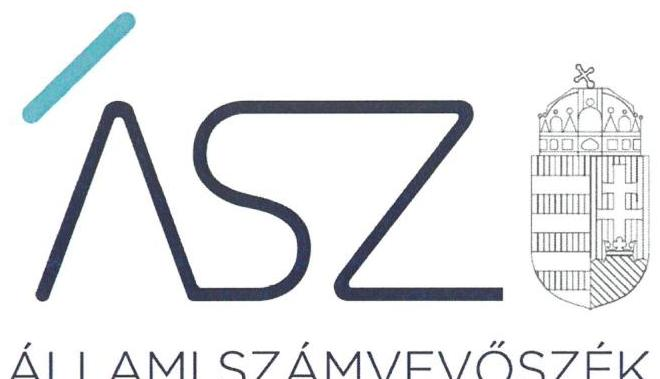
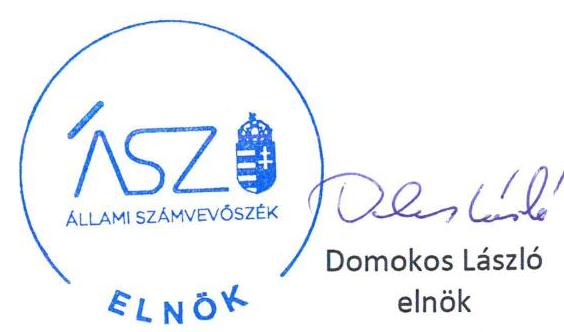
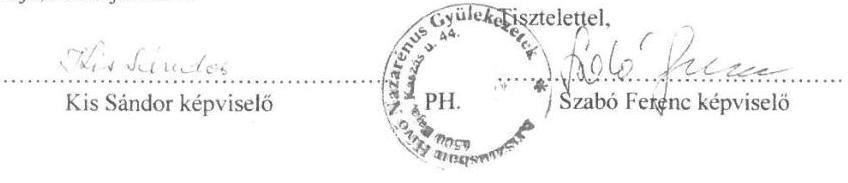
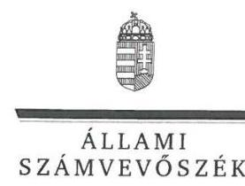
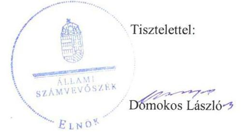

ÁLLAMI SZÁMVEVŐSZÉK

# JELENTÉS 

## Nem állami humánszolgáltatók ellenőrzése

A humánszolgáltatást nyújtó államháztartáson kívüli szociális intézmények, szolgáltatók fenntartói központi költségvetésből kapott támogatásai felhasználásának ellenőrzése Krisztusban Hívő Nazarénus Gyülekezetek
2020.

20039.
www.asz.hu

---

ÁLLAMI SZÁMVEVŐSZÉK

# JELENTÉS 

## Nem állami humánszolgáltatók ellenőrzése

A humánszolgáltatást nyújtó államháztartáson kívüli szociális intézmények, szolgáltatók fenntartói központi költségvetésből kapott támogatásai felhasználásának ellenőrzése Krisztusban Hívő Nazarénus Gyülekezetek
2020. 02. hó 18. nap
20039.

www.asz.hu

---

# AZ ELLENŐRZÉST FELÜGYELTE: 

VARGA EDIT felügyeleti vezető

## AZ ELLENŐRZÉST VEZETTE ÉS A VÉGREHAJTÁSÁÉRT FELELŐS:

DR. PELLEI TAMÁS ellenőrzésvezető

A PROGRAM ÖSSZEÁLLÍTÁSÁÉRT FELELŐS:
TÓTPÁL SZABOLCS osztályvezető

IKTATÓSZÁM: EL-2439-001/2020.
TÉMASZÁM: 2491
ELLENŐRZÉS-AZONOSÍTÓ SZÁM: V-083572
Jelentéseink az Országgyúlés számítógépes hálózatán és az interneten a www.asz.hu címen is olvashatóak.

---

# TARTALOMJEGYZÉK 

■ ÖSSZEGZÉS ..... 5
■ AZ ELLENŐRZÉS CÉLJA ..... 6
■ AZ ELLENŐRZÉS TERÜLETE ..... 7
■ AZ ELLENŐRZÉS HÁTTERE, INDOKOLTSÁGA ..... 8
■ A JELENTÉS LÉNYEGES KÉRDÉSKÖREI ..... 9
■ AZ ELLENŐRZÉS HATÓKÖRE ÉS MÓDSZEREI ..... 10
■ MEGÁLLAPÍTÁSOK ..... 12
■ JAVASLATOK ..... 13
■ MELLÉKLETEK ..... 15
I. sz. melléklet: Értelmező szótár ..... 15
■ FÜGGELÉK: ÉSZREVÉTELEK ..... 17
■ RÖVIDÍTÉSEK JEGYZÉKE ..... 21

---

.

---

# ÖSSZEGZÉS 

A Krisztusban Hívő Nazarénus Gyülekezetek szociális feladatokat ellátó intézménye működtetéséhez igénybe vett közpénzekkel való gazdálkodása nem volt átlátható, elszámoltatható.

## Az ellenőrzés társadalmi indokoltsága

Az Állami Számvevőszék a stratégiájában célul tűzte ki, hogy az államháztartáson kívülre nyújtott költségvetési támogatások ellenőrzésével hozzájárul ahhoz, hogy a közpénzeket az államháztartáson kívüli szervezetek is átlátható módon használják fel a közfeladatok szerződésben vállalt ellátása érdekében. Az Állami Számvevőszék stratégiájában foglaltak alapján is indokolt az ellenőrzés, amely a társadalom számára jelzi, hogy a közpénz államháztartáson kívüli felhasználása sem maradhat ellenőrizetlenül.

A fentieket figyelembe véve, valamint a holisztikus megközelítés jegyében az egyedi kockázatelemzés alapján kiválasztott Krisztusban Hívő Nazarénus Gyülekezetek fenntartónál értékeltük az államháztartáson kívüli szociális tevékenységhez kapcsolódó támogatások felhasználásának megfelelőségét.

## Főbb megállapítások, következtetések, javaslatok

A Krisztusban Hívő Nazarénus Gyülekezetek a 2015-2017. években nem rendelkezett a jogszabályi előírások ellenére számviteli politikával és az annak keretében elkészítendő szabályzatokkal, ezáltal nem alakította ki a szabályszerű működés és gazdálkodás kereteit, nem biztosította a költségvetési támogatás felhasználás átláthatóságának és elszámoltathatóságának feltételeit.

A Krisztusban Hívő Nazarénus Gyülekezetek a jogszabályban előírt éves beszámolókat 2015-2017. években nem készítette el, ezáltal nem biztosította a közpénzek törvényes felhasználásának ellenőrizhetőségét, a közpénzekkel való gazdálkodása nem volt elszámoltatható. Továbbá a költségvetési támogatások igénylésével kapcsolatos feladatait nem látta el szabályszerűen.

A Fenntartó az átvállalt közfeladat ellátása érdekében biztosított közpénzek igénybevétele, felhasználása alapfeltételeit nem biztosította, gazdálkodásával nem számolt el, ezáltal nem volt igazolt, hogy a szociális közfeladathoz biztosított költségvetési támogatásokat szabályszerűen fordította az Intézménye működtetésére.

Az ellenőrzés megállapításai alapján az Állami Számvevőszék a Krisztusban Hívő Nazarénus Gyülekezetek országos megbízottja részére három javaslatot fogalmazott meg, amelyekre az érintettnek 30 napon belül intézkedési tervet kell készítenie.

---

# AZ ELLENŐRZÉS CÉLJA 

AZ ELLENŐRZÉS CÉLJA annak értékelése volt, hogy a Krisztusban Hívő Nazarénus Gyülekezetek, mint szociális intézmény egyházi fenntartója a központi költségvetésből kapott támogatásainak felhasználása szabályszerű volt-e, a támogatások igénylése, évközi módosítása és év végi elszámolása megfelelt-e a jogszabályi előírásoknak.

---

# **AZ ELLENŐRZÉS TERÜLETE**

## **Krisztusban Hívő Nazarénus Gyülekezetek**

A bajai székhelyű Krisztusban Hívő Nazarénus Gyülekezetek, mint egyházi fenntartó az alapító okirata1 szerint az egyházi tevékenység gyakorlása mellett idősek, fogyatékosok bentlakásos és bentlakás nélküli ellátását végezte.

A Fenntartó2 a 2015-2017. években egy nem önállóan gazdálkodó Intézmény3 fenntartásával vett részt az önkormányzati és az állami közfeladatok ellátásában. Az alapító okiratban rögzítettek alapján az Intézmény működtetésével a Fenntartó a szegedi gyülekezetet4 bízta meg.

A Fenntartó részére az intézmény működtetésére az állami költségvetésből a 2015. évben 96.638 E Ft, a 2016. évben 91.228 E Ft, a 2017. évben 93.519 E Ft támogatás került megítélésre.

---

# AZ ELLENŐRZÉS HÁTTERE, INDOKOLTSÁGA 

A szociális feladatokat ellátó nem állami intézményfenntartók részére közfeladataik ellátására évente jelentős összegű pénzügyi támogatást biztosítottak a mindenkori költségvetési törvények a bennük megfogalmazott feltételek mellett.

A felhasználható állami támogatások a Kvtv. 1,2,3 ${ }^{5}$-ekben a 2015-2017. években a szociális ágazatra vonatkozóan 273 Mrd Ft előirányzatot határoztak meg. Módosították a szociális igazgatásról és szociális ellátásokról szóló 1993. évi III. törvényt, amely - többek között - 2012. január 1-jei hatállyal megfogalmazta a finanszírozási rendszerbe történő befogadással összefüggő szabályokat.

Az ÁSZ stratégiájában foglaltak alapján is indokolt az ellenőrzés, amely a társadalom számára jelzi, hogy a közpénz államháztartáson kívüli felhasználása sem maradhat ellenőrizetlenül. Az államháztartáson kívülre nyújtott költségvetési támogatások ellenőrzésével az ÁSZ hozzájárul ahhoz, hogy a közpénzeket a nem állami humán fenntartók átlátható módon használják fel a közfeladatok ellátására kötött szerződésekben vállalt kötelezettségek teljesítése érdekében. Az ellenőrzés javaslataival hozzájárulhat az említett rendszerek szabályszerű támogatás felhasználásához, javíthatja a társadalmi-gazdasági döntések megalapozottságát, amely a „jól irányított állam" feltétele.

---

# A JELENTÉS LÉNYEGES KÉRDÉSKÖREI 

A Fenntartó biztosította-e a költségvetési támogatások átlátható, elszámoltatható igénybevételének, felhasználásának feltételeit? Az intézményei működtetéséhez felhasznált közpénzekre vonatkozó gazdálkodásával elszámolt-e?

---

# AZ ELLENŐRZÉS HATÓKÖRE ÉS MÓDSZEREI 

## Az ellenőrzés típusa

Megfelelőségi ellenőrzés.

## Az ellenőrzött időszak

2015. január 1-je és 2017. december 31-e közötti időszak.

## Az ellenőrzés tárgya

Az ellenőrzés a szociális humánszolgáltatási közfeladatokat ellátó államháztartáson kívüli fenntartók, humánszolgáltatási közfeladatai ellátásához a költségvetési törvényekben biztosított központi költségvetési támogatások igénylése, évközi módosítása és év végi elszámolása fenntartói feladatainak ellátása, illetve e központi költségvetésből kapott támogatásaik humánszolgáltatási közfeladatokra való fenntartó általi felhasználása szabályszerűségének értékelésére terjed ki.

Az ellenőrzés kiterjed minden olyan körülményre és adatra, amely az ÁSZ ${ }^{6}$ jogszabályban meghatározott feladatainak teljesítéséhez, valamint a program végrehajtása folyamán felmerült újabb összefüggések feltárásához szükséges.

## Az ellenőrzött szervezet

Krisztusban Hívő Nazarénus Gyülekezetek (Baja)

## Az ellenőrzés jogalapja

Az ellenőrzés jogszabályi alapját az ÁSZ tv. 1. § (3) bekezdése, 5. § (3) bekezdés, valamint az 5. § (11) c) pontjában foglalt előírások adják.

## Az ellenőrzés módszerei

Az ellenőrzést az ellenőrzési program szempontjai, kérdései, az ellenőrzött időszakban hatályos jogszabályok, a nemzetközi standardokat irányadónak tekintve, az ellenőrzés szakmai szabályok és módszertanok figyelembe vételével végezte az ÁSZ.

Az ellenőrzés ideje alatt az ÁSZ a Fenntartóval történő kapcsolattartást az ÁSZ SZMSZ7-ének vonatkozó előírásai alapján biztosította.

---

Az ellenőrzési kérdések megválaszolásához szükséges bizonyítékok megszerzése az ellenőrzött által rendelkezésre bocsátott dokumentumokra, adatokra alapozva megfigyelés, szemle (szemrevételezés), kérdésfeltevés (információkérés), valamint elemző eljárással történt.

Az ellenőrzési bizonyítékként felhasználható adatforrások közé tartoztak egyrészt az ellenőrzési program részletes szempontjainál felsorolt adatforrások, másrészt minden - az ellenőrzés folyamán feltárt, az ellenőrzés szempontjából információt tartalmazó - dokumentum.

Az ellenőrzés lefolytatásához a Fenntartó a kitöltött tanúsítványok, valamint az ÁSZ által kért dokumentumok elektronikus úton való megküldésével szolgáltatott adatokat, információkat. Az így rendelkezésre bocsátott adatok, információk és a tanúsítványok adatai valódiságának kontrollja az ÁSZ ellenőrzése keretében történt.

Az ellenőrzést alapvetően a szociális humánszolgáltatások esetében a központi költségvetési támogatások igénylésével, módosításával, felhasználásával, elszámolásával kapcsolatos feladatokat ellátó Fenntartónál az ÁSZ végezte.

A szociális humánszolgáltatások központi költségvetési támogatásai igénylésével, módosításával, elszámolásával kapcsolatos, államháztartáson kívüli fenntartó jogszabályokban előírt feladatai betartását, továbbá a központi költségvetési támogatások szabályszerű kezelését, nyilvántartását ellenőriztük a Fenntartónál, az ott rendelkezésre álló határozatok, nyilvántartások, beszámolók és egyéb dokumentumok alapján.

Amennyiben a Fenntartó működését és gazdálkodását alapvetően meghatározó dokumentum hiánya miatt, valamely lényeges kérdéskörre vonatkozóan az ÁSZ megállapítást tett, további ellenőrzési tevékenységek az adott kérdéskörrel és az azzal szoros logikai kapcsolatban lévő kérdéskörökkel - ráépülő jelleggel - nem kerültek végrehajtásra.

---

# MEGÁLLAPÍTÁSOK 

## 1. A Fenntartó biztosította-e a költségvetési támogatások átlátható, elszámoltatható igénybevételének, felhasználásának feltételeit? Az intézményei működtetéséhez felhasznált közpénzekre vonatkozó gazdálkodásával elszámolt-e?

Összegző megállapítás

A költségvetési támogatások átlátható, elszámoltatható igénybevételének és felhasználásának feltételeit a Fenntartó nem biztosította, gazdálkodásával nem számolt el.

A Fenntartó működésének szabályozottsága, ennek keretében a gazdálkodásra vonatkozó belső szabályozás nem volt szabályszerű, mivel a 2015-2017. években nem rendelkezett a Számv. tv. ${ }^{8} 14 . \S$ (3) bekezdésében előírt számviteli politikával, a Számv. tv. 14. § (5) bekezdés a)-b) és d) pontjaiban előírt eszközök és források leltárkészítési és leltározási szabályzatával, az eszközök és források értékelési szabályzatával, valamint pénzkezelési szabályzattal. Így a fenntartó gazdálkodása - ezen belül a közfeladatot ellátó intézménye működtetéséhez felhasznált közpénzekre vonatkozó gazdálkodása - nem volt ellenőrizhető, elszámoltatható.

A Fenntartó a költségvetési támogatásokkal kapcsolatos igénylési feladatait nem szabályszerűen látta el, az Atr. ${ }^{9} 3 . \S$ (2) bekezdésében előírtakat megsértette, mert a támogatások igénylését nem a saját, hanem a szegedi gyülekezet adószámának és fizetési számlaszámának feltüntetésével végezte.

A Fenntartó 2015-2017. években a közfeladatot ellátó Intézménye működtetéséhez felhasznált közpénzekre vonatkozó gazdálkodásával a nyilvánosság előtt nem számolt el, mert a Számv. tv. 4. § (1) bekezdésében, illetve az Eszámv. ${ }^{10}$ S. § (1) bekezdésében előírt éves beszámolót nem készített, ezáltal nem biztosította a közpénzek törvényes felhasználásának ellenőrizhetőségét, az Alaptörvényben előírt átláthatóság elvének érvényesülését.

---

# JAVASLATOK 

Az ÁSZ tv. 33. § (1) bekezdésében foglaltak értelmében az ellenőrzött szervezet vezetője köteles a jelentésben foglalt megállapításokhoz kapcsolódó intézkedési tervet összeállítani és azt a jelentés kézhezvételétől számított 30 napon belül az ÁSZ részére megküldeni. Amennyiben az ellenőrzött szervezet vezetője nem küldi meg határidőben az intézkedési tervet, vagy továbbra sem elfogadható intézkedési tervet küld, az Állami Számvevőszék elnöke az ÁSZ tv. 33. § (3) bekezdése a) és b) pontjaiban foglaltakat érvényesítheti.

## Krisztusban Hívő Nazarénus Gyülekezetek országos megbízottjának

1. A szabályszerű gazdálkodási környezet kialakítása, a költségvetési támogatások átlátható, elszámoltatható igénybevétele, felhasználása feltételeinek megteremtése érdekében gondoskodjon:
a) a Fenntartó számviteli politikájának a jogszabályi előírásoknak megfelelő elkészítéséről;
(1. sz. megállapítás 1. bekezdése alapján)
b) a Fenntartó eszközök és források leltárkészítési és leltározási szabályzatának jogszabályi előírásoknak megfelelő elkészítéséről;
(1. sz. megállapítás 1. bekezdése alapján)
c) a Fenntartó eszközök és források értékelési szabályzatának jogszabályi előírásoknak megfelelő elkészítéséről;
(1. sz. megállapítás 1. bekezdése alapján)
d) a Fenntartó pénzkezelési szabályzatának jogszabályi előírásoknak megfelelő elkészítéséről.
(1. sz. megállapítás 1. bekezdése alapján)
2. Gondoskodjon a Fenntartó költségvetési támogatásokkal kapcsolatos igénylési feladatainak jogszabályi előírásoknak megfelelő elvégzéséről.
(1. sz. megállapítás 2. bekezdése alapján)
3. A költségvetési támogatások felhasználásának ellenőrizhetősége érdekében gondoskodjon a Fenntartó jogszabályi előírásoknak megfelelő beszámolási kötelezettségének teljesítéséről.
(1. sz. megállapítás 3. bekezdése alapján)

---

.

---

# MELLÉKLETEK 

- I. SZ. MELLÉKLET: ÉRTELMEZŐ SZÓTÁR

Humánszolgáltatás

Költségvetési támogatás

Nem állami, nem önkormányzati (államháztartáson kívüli) intézmény fenntartó

Külön törvényben meghatározott szociális, gyermekjóléti, gyermekvédelmi, közoktatási, felsőoktatási, kulturális közfeladatok (2014. évi Kvtv. 34. § (1), (4) bekezdés, 1. számú melléklet XX/20/2. alcím, 19. alcím, 2015. évi Kvtv. 43. § (1), (4) bekezdés, 1. számú melléklet XX/20/2/3. jogcím csoport, 19. alcím, 2016. évi Kvtv. 41. § (1), (4) bekezdés, 1. számú melléklet XX/20/2/3. jogcím csoport, 19. alcím).
A társadalombiztosítás pénzügyi alapjai kivételével az államháztartás központi alrendszeréből ellenérték nélkül, pénzben nyújtott támogatások (Áht. 1. § 14. pont).
A költségvetési törvényekben (2013. évi CCXXX. törvény 33-34. §, 2014. évi C. törvény 42-43. §, 2015. évi C. törvény 40-41. §) megállapított támogatás. Például a

 2015. évi C. törvény 40-41. § szerint többek között: Az Országgyűlés a szociális, gyermekjóléti, gyermekvédelmi közfeladatot ellátó intézményt, szolgáltatást fenntartó egyházi jogi személy, civil szervezet, közalapítvány, országos nemzetiségi önkormányzat, települési vagy területi nemzetiségi önkormányzat, gazdasági társaság, és a humánszolgáltatást alaptevékenységként végző, a személyi jövedelemadóról szóló törvény hatálya alá tartozó egyéni vállalkozó (a továbbiakban együtt: nem állami szociális fenntartó) részére támogatást állapít meg a következők szerint: a támogatás a nem állami szociális fenntartót a települési önkormányzatok 2. melléklet III. pont 3. alpont c)-k) pontjában és III. pont 5. alpont a) pontjában meghatározott támogatásaival azonos jogcímeken, összegben és feltételek mellett illeti meg.
A szociális, gyermekjóléti és gyermekvédelmi közfeladatokat/humánszolgáltatásokat ellátó intézményt fenntartó egyházi jogi személy, társadalmi szervezet, alapítvány, közalapítvány, civil szervezet, országos nemzetiségi önkormányzat, nonprofit gazdasági társaság, gazdasági társaság és a humánszolgáltatást alaptevékenységként végző, Szja tv. hatálya alá tartozó egyéni vállalkozó (2013. évi Kvtv. 35. § (1), (3) bekezdés, 2014. évi Kvtv. 33. §, 34. § (1), (4) bekezdés, 2015. évi Kvtv. 42. §, 43. § (1), (4) bekezdés, 2016. évi Kvtv. 40. §, 41. § (1), (4) bekezdés, 2017. évi Kvtv. 41. § (1), (4)).

---

.

---

# FÜGGELÉK: ÉSZREVÉTELEK 

A jelentéstervezetet a Számvevőszék 15 napos észrevételezésre megküldte az ellenőrzött szervezet vezetőjének az ÁSZ tv. 29. § (1) bekezdése előírásának megfelelően.

Az ÁSZ a jelentéstervezetet észrevételezésre megküldte a Krisztusban Hívő Nazarénus Gyülekezetek képviselői részére.
A Krisztusban Hívő Nazarénus Gyülekezetek képviselői éltek az ÁSZ törvény 29. § (2) bekezdésében foglalt észrevételezési jogukkal, a jelentéstervezet megállapításaira a törvényes határidőn belül észrevételt tettek.
A Krisztusban Hívő Nazarénus Gyülekezetek képviselői észrevételeit és az arra adott választ a függelék tartalmazza.

[^0]
[^0]:    * 29. § (1) Az Állami Számvevőszék az ellenőrzési megállapításait megküldi az ellenőrzött szervezet vezetőjének vagy az általa megbízott személynek, és annak, akinek személyes felelősségét állapította meg.
    (2) Az ellenőrzött szervezet vezetője és a felelősként megjelölt személy az ellenőrzés megállapításaira tizenöt napon belül írásban észrevételt tehet.
    (3) Az Állami Számvevőszék az észrevételre a beérkezésétől számított harminc napon belül írásban válaszol. A figyelembe nem vett észrevételeket köteles a jelentésben feltüntetni, és megindokolni, hogy azokat miért nem fogadta el.

---

# Krisztusban Hívő Nazarénus Gyülekezetek 

6500 Baja, Kasziss u. 44.
Adószáma: 18366910-1-03
Ikt. sz.: EL-1325-041/2019.

## Domokos László úr

Elnök

## Állami Számvevőszék

1052 Budapest, Apáczai Csere János utca 10.
Tárgy: Észrevétel

## Tisztelt Elnök Úr!

A 2019. december 14-én kelt, 2019. december 20-án kézhez vett Számvevőszéki jelentéstervezetre - egyetértve a közpénzfelhasználás átláthatóságának és elszámoltathatóságának ellenőrzésével, annak társadalmi indokoltságával, - észrevételt kívánunk tenni:

Eddigi értelmezésünk szerint - mint az a jelentéstervezetben is szerepel - az Alapító Okiratban rögzítettek alapján az egyház által fenntartott szociális intézmény működtetésével a Krisztusban Hívő Nazarénus Gyülekezetek a kezdetektől fogva Szegedi Gyülekezetet bízta meg. Ezen megbízással az egyház értelmezésében a kialakult szokásjog alapján a fenntartói feladat és jogkörök teljes mértékben a Szegedi Gyülekezet vonatkozásában érvényesültek és jelenleg is érvényesek, tehát a gyakorlat szerint és a köztudatban is valójában a Szegedi Gyülekezet a fenntartó.

Az ellenőrzés kapcsán hiányolt dokumentumok, illetve a javaslatokban megfogalmazott tételek (számviteli politika, eszközök és források leltárkészítési és leltározási szabályzata, eszközök és források értékelési szabályzata, pénzkezelési szabályzat, éves beszámolók) kivétel nélkül a Szegedi Gyülekezet, mint „Fenntartó" vonatkozásában elkészültek, az ellenőrzött időszakra vonatkozóan az Állami Számvevőszék részére az elektronikus felületen a többi dokumentummal együtt benyújtásra kerültek. Az állami támogatás igénylések a fenti fogalmak értelmezésének problémájából adódó adminisztrációs hiba folytán, a szokásjogot követve a Szegedi Gyülekezet, mint „Fenntartó" nevében történtek. A költségvetésből származó pénzeszközökkel a Szegedi Gyülekezet, mint „Fenntartó" minden évben elszámolt, az ezekkel kapcsolatos rendszeres hatósági ellenőrzések határozatai is megállapították, hogy a költségvetési támogatásokat a „Fenntartó" teljes mértékben a szociális intézmény működtetésére fordította.

Kérjük Önöket, hogy a végleges jelentés elkészítésénél fentieket figyelembe venni szíveskedjenek.

Baja, 2020. január 2.

---

# Kís Sándor úr 

képviselő

## Szabó Ferenc úr

képviselő

Krisztusban Hívő Nazarénus Gyülekezetek

## Baja

## Tisztelt Képviselő Urak!

Köszönettel megkaptam a 2020. január 2. napján kelt „Nem állami humánszolgáltatók ellenőrzése - A humánszolgáltatást nyújtó államháztartáson kívüli szociális intézmények, szolgáltatók fenntartói központi költségvetésből kapott támogatásai felhasználásának ellenőrzése - Krisztusban Hívő Nazarénus Gyülekezetek" címmel készített számvevőszéki jelentéstervezetre tett észrevételüket.
Az Állami Számvevőszék észrevételre vonatkozó álláspontjáról a felügyeleti vezető által készített részletes tájékoztatást csatoltan megküldöm.
Tájékoztatom Képviselő urakat, hogy a számvevőszéki jelentésben - az Állami Számvevőszékről szóló 2011. évi LXVI. törvény 29. § (3) bekezdése alapján - a figyelembe nem vett észrevételeket szerepeltetjük, annak indoklásával, hogy azokat az Állami Számvevőszék miért nem fogadta el.

Budapest, 2020. 01. hónap 24. nap

Melléklet: Tájékoztatás az észrevételek kezeléséről

---

# Tájékoztatás az észrevételek kezeléséről 

A „Nem állami humánszolgáltatók ellenőrzése - A humánszolgáltatást nyújtó államháztartáson kívüli szociális intézmények, szolgáltatók fenntartói központi költségvetésből kapott támogatásai felhasználásának ellenőrzése - Krisztusban Hívő Nazarénus Gyülekezetek"című jelentéstervezetre a 2020. január 2-án kelt levelében tett észrevételüket áttekintettük, annak kezeléséről az alábbi tájékoztatást adom.

Képviselő urak az észrevételükben jelezték, hogy a megállapítások 1. pontjában foglaltak szerinti hiányosságok nem állnak fent, mivel az ellenőrzés kapcsán hiányolt dokumentumokat, illetve a jelentéstervezet javaslataiban megfogalmazott tételeket - az egyház értelmezésében kialakult szokásjog alapján - a Szegedi Gyülekezet, mint fenntartó elkészítette, melyeket az ellenőrzés rendelkezésére bocsátottak.
Az EL-1325-005/2018. iktatószámú adatbekérő levelünk alapján az ellenőrzés rendelkezésére bocsátott dokumentumok ismételt felülvizsgálata során megállapítottam, hogy az észrevételben hivatkozott Alapító Okirat szerint fenntartóként a 6500 Baja, Kaszás u. 44. székhelyű egyház került nevesítésre. A szegedi gyülekezet részére csak az intézmény működtetése került átadásra.
Az ellenőrzés során az ÁSZ részére beküldött dokumentumok (szabályzatok, beszámolók, stb.) a szegedi gyülekezetre (Krisztusban Hívő Nazarénus Gyülekezet Szeged) vonatkoznak, amely szervezet nem tartozott az ellenőrzés hatálya alá. A Képviselő urak által hivatkozott „szokásjog" alapján végzett fenntartói gyakorlatot az ÁSZ nem értékelte.
Mindezek alapján az észrevételt nem fogadjuk el, a jelentéstervezet észrevétellel érintett részei helytállóak, a jelentéstervezet módosítása nem indokolt.

Budapest, 2020. 01. hónap 27. nap

Varga Edit
felügyeleti vezető

---

# RÖVIDÍTÉSEK JEGYZÉKE 

${ }^{1}$ Egyház alapító okirata
${ }^{2}$ Fenntartó
${ }^{3}$ Intézmény
${ }^{4}$ szegedi gyülekezet
${ }^{5}$ Kvtv. 1,2,3
${ }^{6}$ ÁSZ
${ }^{7}$ ÁSZ SZMSZ
${ }^{8}$ Számv. tv.
${ }^{9}$ Atr.
${ }^{10}$ Eszámv.

Krisztusban Hívő Nazarénus Gyülekezetek Egyház Alapító Okirata (változásokkal egységes szerkezetben foglalva, hatályos: 2012. augusztus 18-ától)
Krisztusban Hívő Nazarénus Gyülekezetek
Krisztusban Hívő Nazarénus Gyülekezetek Idősek Otthona
Krisztusban Hívő Nazarénus Gyülekezet Szeged
Kvtv. 1: Magyarország 2015. évi központi költségvetéséről szóló 2014. évi
C törvény (hatályos: 2015. január 1-jétől 2018. december 31-éig)
Kvtv.2: Magyarország 2016. évi központi költségvetéséről szóló 2015. évi
C. törvény (hatályos: 2015. július 4-étől)

Kvtv.3: Magyarország 2017. évi központi költségvetéséről szóló 2016. évi
XC. törvény (hatályos: 2016. november 1-jétől)
Állami Számvevőszék
Állami Számvevőszék Szervezeti és Működési Szabályzata
A számvitelről szóló 2000. évi C. törvény (hatályos 2001. január 1-jétől)
Az egyházi és nem állami fenntartású szociális, gyermekjóléti és gyermekvédelmi szolgáltatók, intézmények és hálózatok állami támogatásáról szóló 489/2013. (XII.18.) Korm. rendelet (hatályos: 2014. január 1-jétől)

Az egyházi jogi személyek beszámolókészítési és könyvvezetési
kötelezettségének sajátosságairól szóló 296/2013. (VII. 29.) Kormányrendelet (hatályos: 2013. július 29-től)

---

# ÁSZ 

ÁLLAMI SZÁMVEVŐSZÉK
1052 Budapest, Apáczai Cs. J. u. 10. I 1364 Budapest 4. Pf. 54
TEL: +36 14849100
email: szamvevoszek@asz.hu
web: www.asz.hu | www.aszhirportal.hu

