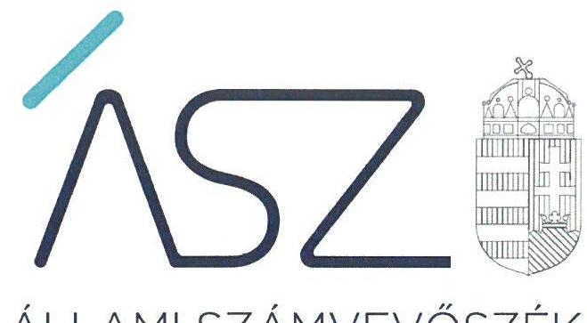
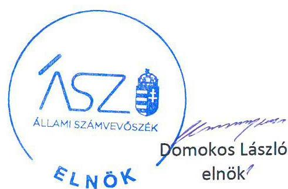
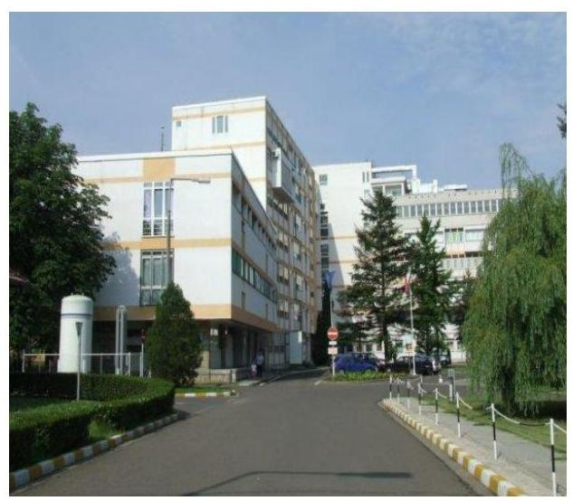

ÁLLAMI SZÁMVEVŐSZÉK

# JELENTÉS 

## Központi költségvetési szervek ellenőrzése

Orosházi Kórház
2020.

20040
www.asz.hu

---

ÁLLAMI SZÁMVEVŐSZÉK

# JELENTÉS

## Központi költségvetési szervek ellenőrzése

Orosházi Kórház

2020.
02. hó 20. nap

20040
www.asz.hu

---

|  | AZ ELLENŐRZÉST FELÜGYELTE:   DR. NAGY IMRE felügyeleti vezető   AZ ELLENŐRZÉST VEZETTE ÉS A VÉGREHAJTÁSÁÉRT FELELŐS:   DR. KOVÁCS DIÁNA ellenőrzésvezető   A PROGRAM ÖSSZEÁLLÍTÁSÁÉRT FELELŐS:   TÓTPÁL SZABOLCS osztályvezető   A TÉMÁHOZ KAPCSOLÓDÓ KORÁBBI SZÁMVEVŐSZÉKI JELENTÉSEK:   - címe:   Jelentés az önkormányzatok pénzügyi és vagyongazdálkodása szabályszerűségének ellenőrzéséről - Orosháza   - sorszáma: 15151   Jelentéseink az Országgyúlés számítógépes hálózatán és az interneten a www.asz.hu címen is olvashatóak. |  |
| :--: | :--: | :--: |
|  | - címe:   - sorszáma: | Utóellenőrzések - Az önkormányzatok pénzügyi és vagyongazdálkodása szabályszerűségének utóellenőrzése - Orosháza Város Önkormányzata 18023 |
|  | IKTATÓSZÁM: EL-2437-001/2020.   TÉMASZÁM: 2450   ELLENŐRZÉS-AZONOSÍTÓ SZÁM: V079131 |  |

---

# TARTALOMJEGYZÉK 

■ ÖSSZEGZÉS ..... 5
■ AZ ELLENŐRZÉS CÉLJA ..... 6
■ AZ ELLENŐRZÉS TERÜLETE ..... 7
■ AZ ELLENŐRZÉS HÁTTERE, INDOKOLTSÁGA ..... 8
■ A JELENTÉS LÉNYEGES KÉRDÉSKÖREI ..... 9
■ AZ ELLENŐRZÉS HATÓKÖRE ÉS MÓDSZEREI ..... 10
■ MEGÁLLAPÍTÁSOK ..... 13
■ JAVASLATOK ..... 17
■ MELLÉKLETEK ..... 19
I. sz. melléklet: Értelmező szótár ..... 19
■ FÜGGELÉKEK ..... 23
I. sz. függelék a jelentéshez ..... 23
II. sz. függelék: Észrevételek ..... 24
■ RÖVIDÍTÉSEK JEGYZÉKE ..... 33

---

.

---

# ÖSSZEGZÉS 

Az Orosházi Kórház belső kontrollrendszere nem biztosította a közpénzekkel való átlátható és elszámoltatható gazdálkodás feltételeit. A pénzügyi- és vagyongazdálkodása nem volt szabályszerű. A Kórház vezetője nem építette ki a korrupciós helyzetek megelőzésére szolgáló integritási kontrollokat.

## Az ellenőrzés társadalmi indokoltsága

Az Állami Számvevőszék ellenőrzi a költségvetési szervek gazdálkodását, működését, hogy megállapításaival támogassa az ellenőrzött szervezetek szabályszerű gazdálkodását, javaslataival elősegítse az Alaptörvényben ${ }^{1}$ megfogalmazott alapvetések érvényesülését a mindennapi életben a szervezetek szintjén. A központi költségvetés rendszerében zajló folyamatok holisztikus elemzései, a kockázatok folyamatos figyelemmel kísérésének módszerével, az így kiválasztott szervezetek célzott, hatékony ellenőrzéseivel az Állami Számvevőszék betölti a legfőbb gazdasági ellenőrző szerv küldetését. Az ellenőrzések megállapításaival és egy adott időszak ellenőrzési eredményeinek elemzésével az Állami Számvevőszék ráirányíthatja a jogalkotók figyelmét a központi alrendszerben vagy annak egy ágazatában esetlegesen felmerülő pénzügyi, szabályozási feszültségekre. Az elvégzett ellenőrzések során az Állami Számvevőszék „jó gyakorlatokat" is azonosíthat, melyeket tanácsadó funkciója keretében szélesebb körben is megismertethet az érintettekkel, ezáltal is hozzájárulva a költségvetési rendszer szabályozott, átlátható, kiegyensúlyozott és fenntartható működéséhez.

## Főbb megállapítások, következtetések, javaslatok

Az Orosházi Kórház belső kontrollrendszerének kialakítása és működtetése nem volt szabályszerű. A gazdálkodási jogkörgyakorlásra jogosult személyekről és aláírás-mintájukról nem vezetett naprakész nyilvántartást, ezzel nem biztosította annak feltételeit, hogy kötelezettséget csak az vállaljon és teljesítést csak az igazoljon, aki erre jogosult. A Kórház a szervezeti integritást sértő események kezelését nem szabályozta a jogszabályi előírás ellenére. A Kórház vezetője nem építette ki a korrupciós kockázatokat mérséklő integritás kontrollokat.

A Kórház pénzügyi gazdálkodása nem volt szabályszerű. A Kórház a kiadási előirányzat felhasználása és a bevételek elszámolása során nem biztosította az elszámoltathatóságot és az átláthatóságot, a gazdálkodási jogkörgyakorlás nem volt szabályszerű. A Kórház a Számv. tv. előírása ellenére a külső személyi juttatás kiadásait nem támasztotta alá számviteli bizonylattal. A Kórház az ellenőrzött időszakban a kifizetetlen szállítói állomány keletkezése során nem tartotta be a jogszabályi előírásokat.

A Kórház a költségvetési maradvány megállapítása során nem tartotta be a jogszabályi előírásokat. Az előirányzat maradvány analitikus nyilvántartása nem volt alkalmas a kötelezettségvállalással terhelt maradvány alátámasztására.

A Kórház vagyongazdálkodása nem volt szabályszerű. A Kórház az állami vagyon hasznosítása és értékesítése során nem tartotta be a jogszabályi előírásokat, különös tekintettel az átláthatósági követelményekre.

A gazdálkodási jogkörök nyilvántartása, a könyvelés, a kötelezettség nyilvántartás és a maradvány megállapítás területén feltárt szabálytalanságok miatt a Kórház beszámolója nem mutatott valós és megbízható képet a Kórház pénzügyi és vagyoni helyzetéről.

A bizonylat nélküli kifizetés, a gazdálkodási jogkörgyakorlás hiányosságai miatti szabálytalan kifizetések miatt a Kórház nem elszámoltatható, működése nem átlátható, és nem zárható ki, hogy az ellenőrzött szervezetnél vagyoni hátrány keletkezett.

Az irányító szervi feladatellátás az EMMI részéről, valamint a középirányítói feladatok ellátása az ÁEEK részéről szabályszerű volt.

---

# AZ ELLENŐRZÉS CÉLJA 

AZ ELLENŐRZÉS CÉLJA annak megállapítása volt, hogy az Orosházi Kórházra² vonatkozó irányító szervi feladatellátás a jogszabályi előírások betartásával történt-e, a Kórház belső kontrollrendszere biztosította-e az átlátható, szabályszerű, gazdaságos, hatékony és eredményes gazdálkodás feltételeit, szabályszerű volt-e a beszámolási és adatszolgáltatási kötelezettségek teljesítése, valamint az, hogy a Kórház pénzügyi és vagyongazdálkodása megfelelt-e a jogszabályi előírásoknak és belső szabályzatainak. Az ellenőrzés keretében értékeltük, hogy a Kórháznál kiépítették és erősítették-e a korrupciós kockázatok kezelését szolgáló integritási kontrollokat, továbbá megteremtették-e a teljesítményellenőrzés feltételeit.

Az ellenőrzés célja volt továbbá annak értékelése, hogy az államháztartás központi alrendszerébe tartozó Kórház gazdálkodása elszámoltatható-e és megfelelt-e annak az Alaptörvényben meghatározott alapvetésnek, hogy Magyarország a kiegyensúlyozott, átlátható és fenntartható költségvetési gazdálkodás elvét érvényesíti. Érvényesült-e a nemzeti vagyon kezelésének és védelmének célja, azaz a Kórház vagyona a közérdeket szolgálja, a közös szükségletek kielégítése és a természeti erőforrások megóvása, valamint a jövő nemzedékek szükségleteinek figyelembevétele mellett.

---

# AZ ELLENŐRZÉS TERÜLETE 

## Orosházi Kórház

A Kórház az ellenőrzött időszakban önálló jogi személy volt, saját gazdasági szervezettel rendelkező állami egészségügyi intézmény, a költségvetési gazdálkodás rendje szerint működött.

Az ellenőrzött időszakban a Kórház irányító szerve az EMMI ${ }^{3}$ volt, a középirányítói jogokat a GYEMSZI4, majd 2015. március 1-jétől jogutódja, az ÁEEK5 gyakorolta. Az ÁEEK feladata a miniszter ${ }^{6}$ hatáskörébe nem tartozó fenntartói, valamint a 27/2015. (II.25.) Korm. rendeletben ${ }^{7}$ meghatározott irányítói jogok gyakorlása volt.

A Kórház közfeladata az ellátási területére kiterjedően a járó- és fekvőbetegek diagnosztikus és terápiás szakorvosi ellátása, rehabilitációja és követéses gondozása volt. Az aktív fekvőbeteg ellátást a teljes időszakban 302 kórházi ágyon végezte. Az összes ágyszám az ellenőrzött időszakban 421 darab volt.

A Kórházat az ellenőrzött időszakban főigazgató ${ }^{8}$ vezette, munkáját a gazdasági területen gazdasági igazgató ${ }^{9}$ támogatta. Az ellenőrzött időszakban a főigazgató és a gazdasági igazgató személyében nem történt változás.

A Kórházban foglalkoztatottak átlagos statisztikai állományi létszáma 2015. évben 749, 2016. évben 748, a 2017. évben 734 fő volt.

A Kórház 2015-ben és 2017-ben több mint 5 milliárd Ft bevételt ért el, és az ellenőrzött időszak minden évében 5 milliárd Ft feletti mérleg szerinti vagyonnal gazdálkodott.

---

# AZ ELLENŐRZÉS HÁTTERE, INDOKOLTSÁGA 

Az államháztartás központi alrendszerébe tartozó szervezet vagyona a nemzeti vagyon része, és az Alaptörvény is rögzíti, hogy a vagyonnal való gazdálkodás célja a közérdek szolgálata. Az ÁSZ ${ }^{10}$ ellenőrzi az éves költségvetési törvény végrehajtását, az ellenőrzés során feltárt kockázatok és a terület folyamatos kockázatelemzésével beazonosított kockázatok kezelése érdekében ráépülő ellenőrzésekkel ellenőrzi a költségvetési szervek gazdálkodását, működését, hogy az ellenőrzések megállapításaival támogassa az ellenőrzött szervezetek szabályszerű gazdálkodását, javaslataival elősegítse az Alaptörvényben megfogalmazott alapvetések érvényesülését a mindennapi életben a szervezetek szintjén.

A belső kontrollrendszer kialakítása és működtetése nélkül nem valósítható meg a közpénzek, a közvagyon átlátható, szabályos, gazdaságos, hatékony és eredményes felhasználása. A belső kontrollrendszer azt a célt szolgálja, hogy a költségvetési szervek működésük és gazdálkodásuk során a tevékenységeket szabályszerűen hajtsák végre, teljesítsék elszámolási kötelezettségeiket és megvédjék az erőforrásokat a veszteségektől, a károktól és a nem rendeltetésszerű használattól. A belső kontrollrendszer magában foglalja mindazon elveket, eljárásokat és belső szabályzatokat, melyek biztosítják, hogy a költségvetési szerv valamennyi tevékenysége és célja összhangban legyen a szabályszerűséggel, szabályozottsággal, valamint a gazdaságosság, hatékonyság és eredményesség követelményeivel, az eszközökkel és forrásokkal való gazdálkodásban ne kerüljön sor pazarlásra, visszaélésre, rendeltetésellenes felhasználásra. Megfelelő, pontos és naprakész információk álljanak rendelkezésre a költségvetési szerv működésével kapcsolatosan, és a belső kontrollrendszer harmonizációjára, összehangolására vonatkozó jogszabályok végrehajtásra kerüljenek. Az integritás kontrollok kiépítése, erősítése a szervezet korrupciós kockázatainak kezelését szolgálja. A teljesítménykövetelmények meghatározása és működtetése megalapozhatja a központi költségvetési szervnél a teljesítményellenőrzés lefolytatását.

---

# A JELENTÉS LÉNYEGES KÉRDÉSKÖREI 

1. Az irányító szerv Kórházra vonatkozó feladatellátása szabályszerű volt-e?
2. A Kórház belső kontrollrendszerének kialakítása és működtetése szabályszerű volt-e, az biztosította-e a közpénzfelhasználás és az állami vagyonnal való gazdálkodás szabályosságát?
3. A Kórház pénzügyi gazdálkodása szabályszerű volt-e?
4. A költségvetési maradvány megállapítása szabályszerűen történt-e?
5. A Kórház vagyongazdálkodása szabályszerű volt-e?
6. A Kórháznál alakítottak-e ki a teljesítmény mérésére alkalmas követelményeket?

---

# AZ ELLENŐRZÉS HATÓKÖRE ÉS MÓDSZEREI 

## Az ellenőrzés típusa

Megfelelőségi ellenőrzés.

## Az ellenőrzött időszak

2015. január 1. és 2017. december 31. közötti időszak.

## Az ellenőrzés tárgya

A Kórházra vonatkozó irányító szervi feladatok ellátása a 2015-2016. években. A Kórház belső kontrollrendszerének kialakítása és működtetése 2015-2017-ben, valamint az integritás kontrollok kiépítettsége és a teljesítményellenőrzés feltételei a 2017. évben.

A Kórház pénzügyi és vagyongazdálkodása a 2015-2016. években.
A 2017. évre vonatkozóan a Kórház vagyongazdálkodási feltételeinek kialakítása, annak szabályszerűsége, az elszámoltathatóság biztosítása a szabályozás szintjén. A Kórháznál hozott vagyonváltozást eredményező döntések, a vagyonban bekövetkezett változások végrehajtásának, nyilvántartásba vételének, elszámolásának szabályszerűsége. Az állami vagyon kimutatásának szabályszerűsége, ennek keretében az állami vagyonnal történő rendelkezés, a vagyonmozgások, a vagyonnyilvántartásba vétele, értékelése és a mérleg alátámasztás szabályszerűsége. A költségvetési maradvány megállapításának szabályszerűsége 2017. év vonatkozásában.

## Az ellenőrzött szervezet

Orosházi Kórház, Emberi Erőforrások Minisztériuma mint irányító szerv, Állami Egészségügyi Ellátó Központ mint középirányító szerv.

## Az ellenőrzés jogalapja

Az ellenőrzés jogszabályi alapját az ÁSZ tv. ${ }^{11} 1$. § (3) bekezdése, 5. § (2)-(3) bekezdései, (4) bekezdés a) pontja és (6) bekezdése, valamint az Áht. ${ }^{12} 61$. § (2) bekezdésében foglalt előírások adták.

---

# Az ellenőrzés módszerei 

Az ÁSZ az ellenőrzést az ellenőrzési program szempontjai, az ellenőrzött időszakban hatályos jogszabályok, az ellenőrzés szakmai szabályai, a jelen ellenőrzésre irányadó ÁSZ módszertanok figyelembevételével hajtotta végre.

Az ellenőrzési kérdések megválaszolásához szükséges bizonyítékok megszerzése az ellenőrzött által rendelkezésre bocsátott dokumentumokra, adatokra alapozva megfigyelés, szemle (szemrevételezés), kérdésfeltevés (információkérés), mintavételezés, valamint elemző eljárás útján történt. Az ellenőrzési bizonyítékként felhasználható adatforrások közé tartoztak az ellenőrzési program részletes szempontjainál felsorolt adatforrások, valamint minden egyéb - az ellenőrzés folyamán feltárt, az ellenőrzés szempontjából információt tartalmazó - dokumentum.

Az ellenőrzés lefolytatásához az ellenőrzött szervezet tanúsítványok kitöltésével, valamint az ÁSZ által kért dokumentumok megküldésével szolgáltatott adatokat, amelyek valódiságát és teljes körűségét az ellenőrzött szervezet vezetője által tett teljességi és hitelességi nyilatkozat igazolta. A rendelkezésre bocsátott adatok, információk kontrollja az ellenőrzés keretében történt.

A Kórház belső kontrollrendszere egyes pilléreinek kialakítására és működtetésére vonatkozó értékelés:
$\longrightarrow$ „szabályszerű", amennyiben az értékelt területen az elért „igen" válaszok százalékban kifejezett, egész számra kerekített aránya legalább $85 \%$,
$\longrightarrow$ „nem szabályszerű", ha nem éri el a $85 \%$-ot.
A Kórház belső kontrollrendszerének összesített értékelése az egyes részterületek esetében

 kapott megfelelőségi arányok számtani átlaga alapján történt és megegyezik a pillérenként (kontrollterületenként) alkalmazott százalékos értékelésekkel, a következő eltérésekkel: a kontrollrendszer egésze esetében a „szabályszerű" értékelésnek a százalékos értéken felül további feltétele, hogy egyik kontrollterület sem kaphat „nem szabályszerű" értékelést.

A bevételek ellenőrzésére a 2015-2016. év vonatkozásában került sor. A bevételek (értékesítésből és bérbeadásból származó bevételek) esetében az ellenőrzés azokra a legnagyobb értékű tételekre - a lényeges sokaságra - terjedt ki, melyek összértéke elérte a teljes sokaság összértékének 50%-át.

A 2015-2016. évi bevételek elszámolásának szabályszerűségét a lényeges sokaságból véletlen mintavételi eljárással kiválasztott tételek alapján ellenőrizte az ÁSZ.

A mintavétellel ellenőrzött területek esetében minden egyes tétel vonatkozásában a felhasználás, elszámolás és értékelés szabályszerűségére vonatkozó kérdéseket tettünk fel. Szabályszerűnek értékelte az ÁSZ egy ellenőrzött területet, amennyiben 95%-os bizonyossággal az ellenőrzött sokaságban az átlagos hibaarány legfeljebb 10%, nem szabályszerűnek, amennyiben 10%-nál magasabb arányt képviselt. Abban az esetben, ha az ellenőrzött sokaság tekintetében a 10%-os hibaarányhoz való viszony megítélésének megbízhatósága nem érte el a 95%-ot, annak elérése érdekében

---

az értékelést további szempontokkal egészítettük ki, és figyelembe vettük a feltárt hibák értékét.

Az ellenőrzés ideje alatt az ellenőrzött szervezettel történő kapcsolattartás az ÁSZ SZMSZ-ének vonatkozó előírásai alapján volt biztosított.

---

# 1. Az irányító szerv Kórházra vonatkozó feladatellátása szabályszerű volt-e? 

Összegző megállapítás

Az EMMI mint irányító szerv, valamint az ÁEEK mint középirányító szerv feladatellátása a Kórház vonatkozásában szabályszerű volt.

Az EMMI szabályszerűen járt el a tervezési követelmények meghatározásakor, az elemi költségvetés és a beszámoló összeállításához készült tájékoztató kiadásakor, a Kórház költségvetésének, valamint az éves beszámolójának jóváhagyásakor.

Az ÁEEK 2016-ban szabályszerűen jóváhagyta a Kórház SZMSZ-ét, továbbá az ellenőrzött időszakban elvégezte a középirányítói feladatait.

## 2. A Kórház belső kontrollrendszerének kialakítása és működtetése szabályszerű volt-e, az biztosította-e a közpénzfelhasználás és az állami vagyonnal való gazdálkodás szabályosságát?

Összegző megállapítás

A Kórház belső kontrollrendszerének kialakítása és működtetése nem volt szabályszerű, az nem biztosította a közpénzfelhasználás és az állami vagyonnal való gazdálkodás szabályosságát.

A KONTROLLKÖRNYEZET keretében a Kórház az Áht. előírásai szerint rendelkezett Alapító okirattal ${ }^{13}$ és SZMSZ-szel.

A Kórház az ellenőrzött időszakban rendelkezett az Áht. és az Ávr. ${ }^{14}$ előírásai szerint a gazdasági szervezetre vonatkozó ügyrenddel ${ }^{15}$ és Gazdálkodási szabályzattal ${ }^{16}$ és a Számv. tv. ${ }^{17}$ előírása szerint pénzügyi-számviteli szabályozással ${ }^{18}$.

A Kórház a Bkr. ${ }^{19}$ 6. § (4) bekezdésében foglaltak ellenére 2016. október 1-jétől a szervezeti integritást sértő események kezelésének eljárásrendjével nem rendelkezett.

Az INTEGRÁLT KOCKÁZATKEZELÉSI RENDSZERT a Kórház a Bkr. 7. § (2) bekezdésében előírtak ellenére 2016. október 1. és 2017. április 30. között nem alakította ki.

A KONTROLLTEVÉKENYSÉGEK gyakorlása nem volt szabályszerű.

---

- A Kórház az ellenőrzött időszakban az Ávr. 60. § (3) bekezdésében foglaltak ellenére a gazdálkodási jogkörök gyakorlására jogosult személyekről és aláírás-mintájukról nem vezetett naprakész nyilvántartást.
- A Kórház a kiadási előirányzatai felhasználásáról a főkönyve alátámasztására a 2017. évben a Számv. tv. 161. § (3) bekezdésében és az Áhsz. 39. § (1) bekezdésében foglaltak ellenére nem vezetett a valóságnak megfelelő, folyamatos, zárt rendszerű, áttekinthető részletező nyilvántartást.

# AZ INFORMÁCIÓS ÉS KOMMUNIKÁCIÓS RENDSZER kialakítása nem volt szabályszerű, mert az Ltv. ${ }^{20}$ 10. § (1) bekezdés a) pontjában előírtak ellenére a Kórház nem rendelkezett az illetékes közlevéltárral egyetértésben kiadott iratkezelési szabályzattal. 

A MONITORING RENDSZERT a Főigazgató az ellenőrzött időszakban a Bkr. előírása szerint kialakította. Az operatív monitoring tevékenységektől független belső ellenőrzés kialakítása, működtetése az Áht. és a Bkr. előírásainak megfelelő volt.

A Főigazgató nyilatkozatban értékelte a költségvetési szerv belső kontrollrendszerének minőségét. A Főigazgató a nyilatkozatában azt rögzítette, hogy az ellenőrzött években a költségvetési szerv belső kontrollrendszerét kiépítette és működtette, amit a jelen ellenőrzés nem igazolt vissza.

Az integritásirányítási rendszer részét képező kötelezően nem előírt, de a kockázatokat mérséklő kontrollok kiépítése és működtetése nem történt meg.

## 3. A Kórház pénzügyi gazdálkodása szabályszerű volt-e?

## Összegző megállapítás

### 3.1. számú megállapítás

A Kórház pénzügyi gazdálkodása nem volt szabályszerű.
A bevételek beszedése és elszámolása, a kiadási előirányzatok felhasználása nem felelt meg a jogszabályi előírásoknak. A gazdálkodási jogkörgyakorlás nem volt szabályszerű.

A bevételek elszámolása az 5. pont 1. bekezdésében foglalt megállapítások miatt nem volt szabályszerű 2015-2016. években.

A Kórház 2015-2016. években nem szabályszerűen használta fel a kiadási előirányzatait, mert a kiadási előirányzatai felhasználásáról a főkönyve alátámasztására 2015-ben és 2016-ban a Számv. tv. 161. § (3) bekezdésében és az Áhsz. 39. § (1) bekezdésében foglaltak ellenére nem vezetett a valóságnak megfelelő, folyamatos, zárt rendszerű, áttekinthető részletező nyilvántartást.

A 2015-2016. években a kiadási előirányzatok felhasználása és a kiadásokhoz kapcsolódó gazdálkodási jogkör gyakorlása során továbbá az alábbi szabálytalanságokat tárta fel az ellenőrzés:
A kiadási előirányzat felhasználását a Kórház 2015. évben a Számv. tv. 165. § (1)-(2) bekezdésében foglaltak ellenére egy esetben nem támasztotta alá bizonylattal.

---

- A kiadási előirányzat felhasználása során megkötött szerződés 35 esetben nem tartalmazta az Ávr. 50. § (1a) bekezdésében foglaltak ellenére a szervezet képviselőjének nyilatkozatát arra vonatkozóan, hogy átlátható szervezetnek minősül.
- A kiadások előirányzatának felhasználása során a Kórház megsértette az Áht. 37. § (1) bekezdésében foglaltakat, mivel négy esetben nem került sor írásbeli kötelezettségvállalásra és megsértette az Ávr. 57. § (1) bekezdésében foglaltakat, mert két esetben nem került sor teljesítésigazolásra.
- A teljesítésigazolás során megsértették az Ávr. 57. § (1) bekezdésében foglaltakat, mert a kiadások teljesítésének összegszerűsége a kötelezettségvállalási dokumentumában foglaltak szerint meghatározott összeggel 13 esetben nem egyezett meg.
3.2. számú megállapítás

A Kórház a fizetési kötelezettségeit 2015-2016. években nem szabályszerűen teljesítette.

A lejárt esedékességű, elismert szállítói tartozás keletkezéséhez kapcsolódó gazdálkodási jogkörgyakorlás nem volt szabályszerű. Az Áht. 37. § (1) bekezdésében foglaltak ellenére nem került sor írásbeli kötelezettségvállalásra. A kötelezettségvállalás alapját jelentő megkötött visszterhes szerződés nem tartalmazta a számlázás alapjául szolgáló egységárat, ezzel megsértették az Ávr. 50. § (1) bekezdés b) pontját.

# 4. A költségvetési maradvány megállapítása szabályszerűen történt-e? 

## Összegző megállapítás

### 4.1. számú megállapítás

### 4.2. számú megállapítás

A Kórháznál a költségvetési maradvány megállapítása nem szabályszerűen történt a 2017. évben.

A Kórház 2017. évi költségvetési beszámolójában kimutatott maradványt az előirányzat maradvány analitikus nyilvántartása nem támasztotta alá.

A Kórház nem rendelkezett a 2017. évben az Áhsz. 39. § (3) bekezdésében foglaltak ellenére a 14. melléklet I. 2. a)-c) pontjaiban meghatározott minimum tartalomnak megfelelő részletező nyilvántartással az előirányzatok tekintetében. Az előirányzat maradvány analitikus nyilvántartása nem volt alkalmas a kötelezettségvállalással terhelt maradvány alátámasztására, amivel a Kórház megsértette az Áhsz. 39. § (3) bekezdésében előírtakat.

A maradvány összegét befolyásoló év végi kifizetetlen szállítói állomány keletkezése során a jogszabályi előírásokat nem tartották be.

Az év végi kifizetetlen szállítói tartozások tekintetében a kötelezettségvállalás, valamint a nyilvántartásba vétel nem volt szabályszerű 2017-ben:
— Az év végi kifizetetlen szállítói tartozásoknál az Áht. 37. § (1) bekezdésében foglaltak ellenére nem került sor írásbeli kötelezettségvállalásra.

---

- A kötelezettségvállalás nyilvántartásba vétele során nem tartották be az Áhsz. 14. melléklet II. 4. e)-h) pontjában foglalt, nyilvántartásra vonatkozó előírásokat.

# 5. A Kórház vagyongazdálkodása szabályszerű volt-e? 

## Összegző megállapítás

A Kórház vagyongazdálkodása nem volt szabályszerű.
2015-2016-ban a Kórház vagyongazdálkodása nem volt szabályszerű:

- A bérleti díjak megállapítása során a Kórház 2015. évben hatályos Önköltségszámítási szabályzata II. fejezet 1.8 és 7.4 pontjában, valamint 2016. évben hatályos Önköltségszámítási szabályzata II. fejezet 5. pontjában foglaltak ellenére 2015-2016-ban nem alkalmazta az utókalkuláció módszerét.
- A Kórház 2015-2016-ban a bérbeadás során nem rendelkezett az Nvtv. ${ }^{21} 11. \S$ (10) bekezdésében, illetve a 3. § (2) bekezdésében foglaltak ellenére a szerződő fél nyilatkozatával arról, hogy az átlátható szervezetnek minősül.

2017-ben a Kórház vagyongazdálkodása nem volt szabályszerű, mert a Kórház a beruházásokra, felújításokra teljesített kiadások felhasználásáról és a mérlegben kimutatott vagyontárgyakról a főkönyve alátámasztására a 2017. évben a Számv. tv. 161. § (3) bekezdésében és az Áhsz. 39. § (1) bekezdésében foglaltak ellenére nem vezetett a valóságnak megfelelő, folyamatos, zárt rendszerű, áttekinthető részletező nyilvántartást. A Kórház így 2017. évben nem biztosította a Számv. tv. 69. § (2) bekezdésében előírt, a főkönyvi könyvelés és az analitikus nyilvántartások adatai közötti egyeztetés elvégzését és ezáltal a Számv.tv. 69. § (1) bekezdésében előírt, a mérleg tételeit alátámasztó leltár összeállítását.

A 2017. évben a vagyongazdálkodás területén az ellenőrzés feltárta továbbá, hogy a beruházások, felújítások végrehajtásakor, a tárgyi eszközök beszerzésére irányuló szerződések megkötése során három esetben az Áht. 37. § (1) bekezdésében foglaltak ellenére nem került sor kötelezettségvállalásra.

## 6. A Kórháznál alakítottak-e ki a teljesítmény mérésére alkalmas követelményeket?

Összegző megállapítás

A Kórháznál alakítottak ki a teljesítmény mérésére szolgáló követelményeket.

A Kórház rendelkezett teljesítmény mérésére szolgáló követelményekkel, de az adatok megbízhatóságának hiánya miatt a valós teljesítmény mérésének feltételei nem álltak fenn.

---

# JAVASLATOK 

Az ÁSZ tv. 33. § (1) bekezdésében foglaltak értelmében az ellenőrzött szervezet vezetője köteles a jelentésben foglalt megállapításokhoz kapcsolódó intézkedési tervet összeállítani és azt a jelentés kézhezvételétől számított 30 napon belül az ÁSZ részére megküldeni. Amennyiben az ellenőrzött szervezet vezetője nem küldi meg határidőben az intézkedési tervet, vagy továbbra sem elfogadható intézkedési tervet küld, az Állami Számvevőszék elnöke az ÁSZ tv. 33. § (3) bekezdése a) és b) pontjaiban foglaltakat érvényesítheti.

## Orosházi Kórház főigazgatója részére

1. Intézkedjen a szervezeti integritást sértő események kezelésének eljárásrendje szabályozásáról.
(2. sz. megállapítás 3. bekezdése alapján)
2. Intézkedjen a jogszabályi előírásoknak megfelelő nyilvántartás vezetéséről a gazdálkodási jogkörök gyakorlására jogosult személyekről és aláírás-mintájukról.
(2. sz. megállapítás 5. bekezdés 1. francia bekezdése alapján)
3. Intézkedjen a valóságnak megfelelő, folyamatos, zárt rendszerű, áttekinthető nyilvántartás vezetéséről a jogszabályi előírásnak megfelelően.
(2. sz. megállapítás 5. bekezdés 2. francia bekezdése, 3.1. sz. megállapítás 2. bekezdése és 5. sz. megállapítás 2. bekezdés 1. mondata alapján)
4. Intézkedjen az iratkezelési szabályzat kiadásáról a jogszabályi előírásnak megfelelően.
(2. sz. megállapítás 6. bekezdése alapján)
5. Intézkedjen, hogy a kiadási előirányzat felhasználását bizonylattal támasztsa alá a jogszabályi előírásnak megfelelően.
(3.1. sz. megállapítás 3. bekezdése 1. francia bekezdése alapján)
6. Intézkedjen, hogy az Ávr.-ben előírtak szerint rendelkezzen a szervezet képviselőjének nyilatkozatával arról, hogy átlátható szervezetnek minősülnek.
(3.1. sz. megállapítás 3. bekezdés 2. francia bekezdése alapján)

---

7. Intézkedjen, hogy a gazdálkodási jogkörök gyakorlása során kötelezettségvállalásra, és teljesítésigazolásra jogszabályi előírásoknak megfelelően kerüljön sor.
(3.1. sz. megállapítás 3. bekezdés 3. és 4. francia bekezdése és 3.2. megállapítás 1. bekezdése és 4.2. megállapítás 1. bekezdés 1. francia bekezdése alapján)
8. Intézkedjen az előirányzatok részletező nyilvántartásának jogszabályi előírásnak megfelelő vezetéséről.
(4.1. sz. megállapítás 1. bekezdés 1. mondata alapján)
9. Intézkedjen arról, hogy a kötelezettségvállalás nyilvántartásba vétele során tartsák be a jogszabályi előírásokat.
(4.2. sz. megállapítás 1. bekezdés 2. francia bekezdése alapján)

---

# MELLÉKLETEK 

- I. SZ. MELLÉKLET: ÉRTELMEZŐ

 SZÓTÁR
állami vagyon
állami vagyonnak minősül:
a) az állam tulajdonában lévő dolog, valamint a dolog módjára hasznosítható természeti erő,
b) az a) pont hatálya alá nem tartozó mindazon vagyon, amely vonatkozásában törvény az állam kizárólagos tulajdonjogát nevesíti,
c) az állam tulajdonában lévő tagsági jogviszonyt megtestesítő értékpapír, illetve az államot megillető egyéb társasági részesedés,
d) az államot megillető olyan immateriális, vagyoni értékkel rendelkező jogosultság, amelyet jogszabály vagyoni értékű jogként nevesít. (Forrás: Vtv. 1. § (2) bekezdése)
állami vagyon értékesítése
állami vagyon használója
állami vagyon használója
állami vagyon hasznosítása

ÁSZ Integritás Projekt

Állami vagyonnak minősül:
a) az állam tulajdonában lévő dolog, valamint a dolog módjára hasznosítható természeti erő,
b) az a) pont hatálya alá nem tartozó mindazon vagyon, amely vonatkozásában törvény az állam kizárólagos tulajdonjogát nevesíti,
c) az állam tulajdonában lévő tagsági jogviszonyt megtestesítő értékpapír, illetve az államot megillető egyéb társasági részesedés,
d) az államot megillető olyan immateriális, vagyoni értékkel rendelkező jogosultság, amelyet jogszabály vagyoni értékű jogként nevesít. (Forrás: Vtv. 1. § (2) bekezdése)
Állami vagyon tulajdonjogának bármely jogcímen történő, visszterhes átruházása. (Forrás: Vtvr. 1. § (7) bekezdés d) pontja)
Az a természetes vagy jogi személy, jogi személyiséggel nem rendelkező szervezet, aki, vagy amely törvény vagy szerződés alapján, bármely jogcímen (bérlet, haszonbérlet, használat stb.) állami vagyont birtokol, használ, szedi annak hasznát, hasznosít, ide nem értve a haszonélvezőt, a vagyonkezelőt és a tulajdonosi jogok gyakorlóját. (Forrás: Vtvr. 1. § (7) bekezdés a) pontja)
Az állami vagyont az MNV Zrt. maga kezeli, vagy szerződés - így különösen bérlet, haszonbérlet, megbízás - alapján központi költségvetési szervnek, természetes vagy jogi személynek, vagy jogi személyiséggel nem rendelkező gazdálkodó szervezetnek hasznosításra átengedi.
(Forrás: Vtv. 23. § (1) bekezdése, hatályos 2012. január 1-jétől)
Az állami vagyonnal a tulajdonosi joggyakorló maga gazdálkodik, vagy szerződés - így különösen bérlet, haszonbérlet, megbízás - alapján hasznosításra átengedi, illetőleg vagyonkezelésbe, haszonélvezetbe adja. (Forrás: Vtv. 23. § (1) bekezdése, hatályos 2013. június 28-ától)
Az állami vagyon hasznosítására kötött szerződések elsődleges célja az állami vagyon hatékony működtetése, állagának védelme, értékének megőrzése, illetve gyarapítása, az állami és közfeladatok ellátásának elősegítése. (Forrás: Vtv. 23. § (2) bekezdése)
Az állami vagyont az MNV Zrt. maga kezeli, vagy szerződés - így különösen bérlet, haszonbérlet, megbízás - alapján központi költségvetési szervnek, természetes vagy jogi személynek, vagy jogi személyiséggel nem rendelkező gazdálkodó szervezetnek hasznosításra átengedi. Az állami vagyonra vonatkozóan az MNV Zrt. kizárólag az Nvtv-ben meghatározott személyekkel köthet vagyonkezelési szerződést. (Forrás: Vtv. 27. § (1) bekezdése, hatályos 2012. január 1-jétől)
Az Állami Számvevőszék 2009-ben indította el a „Korrupciós kockázatok feltérképezése - Integritás alapú közigazgatási kultúra terjesztése" című, európai uniós forrásból megvalósított kiemelt projektjét (Integritás Projekt). Az Integritás Projekt célja, hogy felmérje a közszféra intézményei korrupciós kockázatoknak való kitettségét, illetőleg az azok mérséklésére hivatott kontrollok szintjét. Az Állami Számvevőszék a projekt révén az integritás szemlélet minél szélesebb körrel történő megismertetését, gyakorlatba ültetését kívánja elérni. Az integritás követelményeinek megfelelő szervezeti működést előnyben részesítő közigazgatási kultúra elterjesztését és a korrupció elleni fellépést az ÁSZ önmagára nézve is stratégiai jelentőségű célként fogalmazta meg. A projekt a felmérésben résztvevő intézmények számára helyzetükről

---

|  | egyfajta „tükörképet" mutat be, ami alapot teremt a jövőbeni pozitív irányú elmozduláshoz. (Forrás: a http://integritas.asz.hu honlapon közzétett, a 2013. évi Integritás felmérés eredményeiről készült összefoglaló tanulmány) |
| :--: | :--: |
| belső ellenőrzés | Független, tárgyilagos bizonyosságot adó és tanácsadó tevékenység, amelynek célja, hogy az ellenőrzött szervezet működését fejlessze és eredményességét növelje, az ellenőrzött szervezet céljai elérése érdekében rendszerszemléletű megközelítéssel és módszeresen értékeli, illetve fejleszti az ellenőrzött szervezet irányítási és belső kontrollrendszerének hatékonyságát. (Forrás: Bkr. 2. § b) pontja) |
| belső kontrollrendszer | A belső kontrollrendszer a kockázatok kezelése és tárgyilagos bizonyosság megszerzése érdekében kialakított folyamatrendszer, amely azt a célt szolgálja, hogy a működés és gazdálkodás során a tevékenységeket szabályszerűen, gazdaságosan, hatékonyan, eredményesen hajtsák végre, az elszámolási kötelezettségeket teljesítsék, megvédjék az erőforrásokat a veszteségektől, károktól és nem rendeltetésszerű használattól. (Forrás: Áht. 69. § (1) bekezdése) |
| belső kontrollrendszer területei | A kontrollkörnyezet, a kockázatkezelési rendszer, a kontrolltevékenységek, az információs és kommunikációs rendszer, valamint a nyomon követési (monitoring) rendszer. (Forrás: Bkr. 3. §-a) |
| felújítás | Az elhasználódott tárgyi eszköz eredeti állaga (kapacitása, pontossága) helyreállítását szolgáló időszakonként visszatérő olyan tevékenység, melynek során az eszköz élettartama megnövekszik, minősége, használata jelentősen javul, így a pótlólagos ráfordításból a jövőben gazdasági előnyök származnak. (Forrás: Számv. tv. 3. § (4) bekezdés 8. pontja) |
| hasznosítás | A nemzeti vagyon birtoklásának, használatának, hasznok szedése jogának bármely a tulajdonjog átruházását nem eredményező jogcímen történő átengedése, ide nem értve a vagyonkezelésbe adást, valamint a haszonélvezeti jog alapítását. (Forrás: Nvtv. 3. § (1) bekezdés 4. pontja) |
| információs és kommunikációs rendszer | A költségvetési szerv vezetője által kialakított és működtetett olyan rendszer, mely biztosítja, hogy a megfelelő információk a megfelelő időben eljutnak az illetékes szervezethez, szervezeti egységhez, illetve személyhez. (Forrás: Bkr. 9. § (1) bekezdés) |
| integritás | Az integritás - egyik gyakran használt jelentése szerint - az elvek, értékek, cselekvések, módszerek, intézkedések konzisztenciáját jelenti, vagyis olyan magatartásmódot, amely meghatározott értékeknek megfelel. Integritás-irányítási rendszer bevezetése a szervezetben a szervezethez rendelt közfeladatok integritás szempontú ellátását, az érték alapú működéssel (integritással) összefüggő szervezeti követelmények következetes érvényesítését jelenti. (Forrás: Nemzetgazdasági Minisztérium: Államháztartási Belső Kontroll Standardok és Gyakorlati Útmutató 1.6. Etikai értékek és integritás 46. oldal, 2017. szeptember) |
| irányító szerv | A költségvetési szerv tekintetében az Áht-ban meghatározott irányítási hatáskört gyakorló szerv. (Forrás: Áht. 1. § 9. pontja) |
| kincstári költségvetés | A központi költségvetésről szóló törvény elfogadását követően a fejezetet irányító szerv az államháztartás központi alrendszerébe tartozó költségvetési szerv és a fejezeti kezelésű előirányzat kiemelt előirányzatait, valamint az elkülönített állami pénzalapok és a társadalombiztosítás pénzügyi alapjai jogszabályi előírás szerinti bevételeit és kiadásait kincstári költségvetés kiadásával állapítja meg. (Forrás: Áht. 28. § (2) bekezdés) |
| kockázat | A kockázat annak a valószínűségét jelenti, hogy egy vagy több esemény vagy intézkedés nem kívánt módon befolyásolja a rendszer működését, céljainak megvalósulását. (Forrás: Javaslatok a korrupciós kockázatok kezelésére - Kockázatkezelési és ellenőrzési módszertan 35. oldal, ÁSZ) |

---

kockázatkezelési rendszer
integrált kockázatkezelési rendszer
kontrollkörnyezet
kontrolltevékenységek
kommunikáció
középirányító szerv
közfeladat
monitoring
monitoring-rendszer
tulajdonosi joggyakorló
vagyongazdálkodás

Olyan irányítási eszközök és módszerek összessége, melynek elemei a szervezeti célok elérését veszélyeztető tényezők (kockázatok) azonosítása, elemzése, csoportosítása, nyomon követése, valamint szükség esetén a kockázati kitettség mérséklése. (Forrás: Bkr. 2. § m) pontja)
Olyan folyamatalapú kockázatkezelési rendszer, amely a szervezet minden tevékenységére kiterjed, egységes módszertan és eljárások alkalmazásával, a szervezet célkitűzéseinek és értékeinek figyelembevételével biztosítja a szervezet kockázatainak teljes körű azonosítását, azok meghatározott kritériumok szerinti értékelését, valamint a kockázatok kezelésére vonatkozó intézkedési terv elkészítését és az abban foglaltak nyomon követését. (Forrás: Bkr. 2. § m) pontja, 2016. október 1-jétől)
A költségvetési szerv vezetője által kialakított olyan elvek, eljárások, belső szabályzatok összessége, amelyben világos a szervezeti struktúra, a folyamatok átláthatók, egyértelműek a felelősségi, hatásköri viszonyok és feladatok, meghatározottak, ismertek és elfogadottak az etikai elvárások a szervezet minden szintjén, átlátható a humánerőforrás-kezelés. (Forrás: Bkr. 6. § (1) bekezdés)
A költségvetési szerv vezetője által a szervezeten belül kialakított (kontroll) tevékenységek, melyek biztosítják a kockázatok kezelését, hozzájárulnak a szervezet céljainak eléréséhez és erősítik a szervezet integritását. (Forrás: Bkr. 8. § (1) bekezdés)
Az a tevékenység, melynek során információ továbbítása valósul meg. A kommunikációs folyamat résztvevői között tájékoztatás történik, mely során tényeket, ezek magyarázatát közlik.
A költségvetési szerv tekintetében törvény vagy kormányrendelet alapján meghatározott, átruházott irányítási hatásköröket gyakorló szerv. (Forrás: Áht. 9. § (4) bekezdés)
Jogszabályban meghatározott állami vagy önkormányzati feladat, amit az arra kötelezett közérdekből, a jogszabályban meghatározott követelményeknek és feltételeknek megfelelve végez, ideértve a lakosság közszolgáltatásokkal való ellátását, továbbá az állam nemzetközi szerződésekben vállalt kötelezettségeiből adódó közérdekű feladatokat, valamint e feladatok ellátásakor szükséges infrastruktúra biztosítását is. (Forrás: Nvtv. 3. § (1) bekezdés 7. pontja)
A monitoring általánosságban a különböző szintű szervezeti célok megvalósításának folyamatát kíséri figyelemmel, melynek során a releváns eseményekről és tevékenységekről (együtt: folyamatokról) rendszeres jelleggel, strukturált, döntéstámogató információkhoz jutnak a szervezet vezetői. (Forrás: NGM Útmutató a költségvetési szervek monitoring rendszeréhez 2011. november)
A költségvetési szerv vezetője köteles kialakítani a szervezet tevékenységének a célok megvalósításának nyomon követését biztosító rendszert, amely az operatív tevékenységek keretében megvalósuló folyamatos és eseti nyomon követésből, valamint az operatív tevékenységektől függetlenül működő belső ellenőrzésből áll. (Forrás: Bkr. 10. §)
Aki a nemzeti vagyon felett az államot vagy a helyi önkormányzatot megillető tulajdonosi jogok és kötelezettségek összességének gyakorlására jogosult. (Forrás: Nvtv. 3. § (1) bekezdés 17. pontja)

A nemzeti vagyongazdálkodás feladata a nemzeti vagyon rendeltetésének megfelelő, az állam, az önkormányzat mindenkori teherbíró képességéhez igazodó, elsődlegesen a közfeladatok ellátásához és a mindenkori társadalmi szükségletek kielégítéséhez szükséges, egységes elveken alapuló, átlátható, hatékony és költségtakarékos működtetése, értékének megőrzése, állagának védelme, értéknövelő használata, hasznosítása, gyarapítása, továbbá az állam vagy a helyi önkormányzat feladatának ellátása szempontjából feleslegessé váló vagyontárgyak elidegenítése. (Forrás: Nvtv. 7. § (2) bekezdése)

---

.

---

# FÜGGELÉKEK 

- I. SZ. FÜGGELÉK A JELENTÉSHEZ

Az Állami Számvevőszék az ellenőrzések során feltárt tényekhez kapcsolódó további körülmények tisztázására eszközrendszerrel nem rendelkezik. Amennyiben az ellenőrzésen túlmutatóan indokoltnak látszik az ellenőrzés során feltárt körülmények további vizsgálata, az Állami Számvevőszék törvényi felhatalmazás alapján az ellenőrzés által feltárt körülményeket továbbítja a hatáskörrel rendelkező szervnek a szükséges intézkedések megtétele, eljárások lefolytatása érdekében.

1. 

A Kórház a külső személyi juttatás kiadásait 2015. évben 4413 834,- Ft értékben nem támasztotta alá számviteli bizonylattal, megsértve ezzel a Számv. tv. 165. § (1)-(2) bekezdésében foglaltakat.
Így nem igazolta, hogy a hivatkozott kiadás a Kórház feladatellátását szolgálta, illetve hogy valós, megtörtént teljesítéshez kapcsolódott a kifizetés, ezért felvetődik, hogy az ellenőrzött szervezetnél vagyoni hátrány keletkezett.
2.

A kiadási előirányzatok felhasználása során a Kórháznál - az Ávr. 57. § (1) bekezdésében foglaltak ellenére - nem került sor a teljesítés igazolására 2015-2017. években összesen 37710 730,- Ft értékben, az Áht. 37. § (1) bekezdésében foglaltak ellenére nem került sor kötelezettségvállalásra 87462 889,- Ft értékben.
A gazdálkodási jogkörgyakorlás szabályainak súlyos megsértése miatt nem igazolt, hogy a kifizetések a Kórház feladatellátását szolgálták, illetve, hogy azok valós teljesítésekhez kapcsolódtak és felvetődik, hogy a Kórházat vagyoni hátrány érte.
3.

A Kórház által 2015-2016. években gyógyszer, illetve élelmiszer beszerzésére megkötött szerződései összesen 8341 054,- Ft értékben az Ávr. 50. § (1) bekezdés b) pontja ellenére nem tartalmazták a számlázás alapjául szolgáló egységárat.
Az egységár hiányában nem igazolt, hogy a kifizetés megfelelt a szerződésben foglaltaknak, ezért felmerül,
 hogy a Kórházat vagyoni hátrány érte.

Az 1., 2. és 3. pontokban feltárt esetek konkrét körülményeinek felderítésére a nyomozó hatóság rendelkezik hatáskörrel.

---

A jelentéstervezetet a Számvevőszék 15 napos észrevételezésre megküldte az ellenőrzött szervezetek vezetőinek az ÁSZ tv. 29. § (1) bekezdése előírásának megfelelően.

Az Orosházi Kórház főigazgatója a jelentéstervezet megállapításaira írásban észrevételt tett. Az Állami Egészségügyi Ellátó Központtól és az Emberi Erőforrások Minisztériumától nemleges észrevétel érkezett.
Az ÁSZ tv. 29. § (3) bekezdésével összhangban az Állami Számvevőszék a Függelékben feltünteti az ellenőrzés megállapításaival kapcsolatban tett, figyelembe nem vett észrevételeket, és megindokolja, hogy azokat miért nem fogadta el.

[^0]
[^0]:    * 29. § (1) Az Állami Számvevőszék az ellenőrzési megállapításait megküldi az ellenőrzött szervezet vezetőjének vagy az általa megbízott személynek, és annak, akinek személyes felelősségét állapította meg.
    (2) Az ellenőrzött szervezet vezetője és a felelősként megjelölt személy az ellenőrzés megállapításaira tizenöt napon belül írásban észrevételt tehet.
    (3) Az Állami Számvevőszék az észrevételre a beérkezésétől számított harminc napon belül írásban válaszol. A figyelembe nem vett észrevételeket köteles a jelentésben feltüntetni, és megindokolni, hogy azokat miért nem fogadta el.

---

A „Központi Költségvetési szervek ellenőrzése - Orosházi Kórház" címmel készített számvevőszéki jelentéstervezet megállapításaival kapcsolatban az Orosházi Kórház (továbbiakban: Kórház) főigazgatója által 2020. január 2-án kelt levélben tett észrevételek és azok kezelésének indokolása.

# 1. A szervezeti integritást sértő események kezelésének eljárásrendjével kapcsolatban tett észrevétel (Jelentéstervezet 2. megállapításának 3. bekezdése, 1. javaslat) 

A Kórház főigazgatója észrevételében leírta, hogy az Állami Egészségügyi Ellátó Központ (továbbiakban: ÁEEK) Belső Ellenőrzési Főosztálya 2017. évben megállapította a szervezeti integritást sértő események kezelése eljárásrendjének hiányát, amelyre a kapcsolódó intézkedési tervben vállalták az eljárásrend 2018. május 5.-i határidővel történő elkészítését. A szervezeti integritást sértő események kezelése eljárásrendje határidőre elkészítésre került és azt csatoltan megküldték az észrevétel mellékleteként.

A Kórház főigazgatójának tájékoztatása arra vonatkozott, hogy az ellenőrzött időszakon kívül milyen intézkedéseket tettek a jelentéstervezetben foglalt hiányosság megszüntetésére, ugyanakkor ez a jelentéstervezet ellenőrzött időszakot érintő megállapítását nem befolyásolta, így a jelentéstervezet módosítása nem volt indokolt.
2. Az integrált kockázatkezelési rendszerrel kapcsolatban tett megállapításra érkezett észrevétel (Jelentéstervezet 2. megállapítás 4. bekezdés)
A Kórház főigazgatója észrevételében jelezte, hogy intézményük kialakította az integrált kockázatkezelési rendszerét, melyhez kapcsolódó szabályzat 2017. május 1. napjától hatályos. Ezen szabályzatot mellékelte észrevételéhez.
Észrevételére válaszolva tájékoztattuk a Kórház főigazgatóját, hogy az észrevétele megerősíti a jelentéstervezetben foglalt megállapítást, amely szerint a Kórház a Bkr. 7. § (2) bekezdésében előírtak ellenére 2016. október 1. és 2017. április 30. között nem alakította ki az integrált kockázatkezelési rendszert.

Fentiekre tekintettel a jelentéstervezet módosítása nem volt indokolt.
3. A gazdálkodási jogkörgyakorlókról vezetett nyilvántartással kapcsolatban tett észrevétel (Jelentéstervezet 2. megállapítása 5. bekezdésének 1. francia bekezdése, 2. javaslat)
A Kórház főigazgatója észrevételében jelezte, hogy az adatbekérések során a vizsgált időszakra vonatkozóan vezetett nyilvántartásait a Kórház megküldte. Tájékoztatásul jelezte, hogy a 2018. szeptember 1-től új Gazdálkodási szabályzatot adtak ki, amely 2019. április 1-től újfent módosult.
Észrevételére válaszolva tájékoztattuk a Kórház főigazgatóját, hogy az ellenőrzési adatszolgáltatás során átadott, gazdálkodási jogkörök gyakorlására jogosult személyekről és aláírás-mintájukról vezetett 2015-2017. időszakot érintő nyilvántartások nem voltak naprakészen vezetve, mivel a megküldött felhatalmazásokkal nem voltak összhangban.
Fentiekre tekintettel az észrevételt nem fogadtuk el, a jelentéstervezet módosítása nem volt indokolt.
4. A 2017. évi kiadási előirányzatokról vezetett részletező nyilvántartással kapcsolatban tett észrevétel (Jelentéstervezet 2. megállapítása 5. bekezdésének 2. francia bekezdése; 3. javaslat)
A Kórház főigazgatója észrevételében vitatta, hogy a Kórház 2017. évben főkönyve alátámasztására nem vezetett a jogszabályi előírásoknak megfelelő, folyamatos, zárt rendszerű, áttekinthető részletező nyilvántartást. Ennek alátámasztására kifejtette, hogy a Kórház a költségvetés szerint gazdálkodó KHTk részére készült CT-EcoSTAT gazdasági és gazdálkodási rendszert, illetve annak pénzügyi és Áfa nyilvántartó, főkönyvi, kötelezettségvállalási, tárgyi eszköz, készlet és anyag nyilvántartó, illetve leltár

---

moduljait használja. Hangsúlyozta, hogy a programrendszer jelenlegi verziója megfelel az államháztartás szervezeteinek sajátos beszámolási és könyvvezetési kötelezettségét szabályozó kormányrendeletekben foglaltaknak, valamint a számviteli törvényben szabályozott kettős könyvviteli szabályoknak, így álláspontja szerint a valóságnak megfelelő, folyamatos, zárt rendszerű, áttekinthető részletező nyilvántartások vezetése a Kórháznál biztosított.
Észrevételére válaszolva tájékoztattuk a Kórház főigazgatóját, hogy az Állami Számvevőszék az ellenőrzési megállapításait az ellenőrzési adatszolgáltatás során a részére törvényi határidőben rendelkezésre bocsátott hiteles dokumentumokra alapozva fogalmazza meg. Az ellenőrzés rendelkezésre bocsátott dokumentumok felülvizsgálata megerősítette: a 2017. évre beküldött analitikus nyilvántartások adatai a Kórház 2017. évi főkönyvi nyilvántartásában foglalt adatokat összegszerűen nem támasztották alá. Ez alapján a Kórház az Áhsz. 39. § (1) bekezdését megsértve 2017. évben nem rendelkezett a kiadási előirányzatok alakulására tekintettel a valóságnak megfelelő, folyamatos, zárt rendszerű, áttekinthető nyilvántartással.
Fentiekre tekintettel az észrevételt nem fogadtuk el, a jelentéstervezet módosítása nem volt indokolt.
5. Az iratkezelési szabályzat jóváhagyásával kapcsolatban tett észrevétel (Jelentéstervezet 2. megállapításának 6. bekezdése, 4. számú javaslata)
A Kórház főigazgatója észrevételében vitatta a jelentéstervezet azon megállapítását, hogy a Kórháznál az információs és kommunikációs rendszer kialakítása nem volt szabályszerű, mivel a Kórház nem rendelkezett az illetékes közlevéltárral egyetértésben kiadott iratkezelési szabályzattal. Észrevétele szerint a Kórház rendelkezett 2014. január 1. hatályú iratkezelési szabályzattal, amely 2016. szeptember 1. hatállyal módosításra került. Ezen dokumentumok az ellenőrzési adatszolgáltatás keretében átadásra kerültek. Észrevételében hivatkozott a GYEMSZI 039822-001/2013. iktatószámú módszertani útmutatójára, mely szerint az egészségügyi intézményekben keletkezett egészségügyi adatokra nem terjed ki a köziratokról, a közlevéltárakról és a magánlevéltári anyag védelméről szóló 1995. évi LXVI. törvény (továbbiakban: Ltv.) hatálya, ebből következően nem szükséges az iratkezelési szabályzat illetékes közlevéltári jóváhagyása sem.
Észrevételére válaszolva tájékoztattuk a Kórház főigazgatóját, hogy a Kórházra közfeladatot ellátó szervként vonatkoznak az Ltv. előírásai. Emellett az észrevétel szerint a GYEMSZI útmutatója kizárólag az egészségügyi intézményekben keletkezett egészségügyi adatokra vonatkozóan állapítja meg, hogy azokra nem terjed ki az Ltv. hatálya, viszont a Kórház a betegekre vonatkozó egészségügyi adatokon túlmenően saját működésére vonatkozó iratokat is kezel, amelyek iratkezelése és irattárban történő elhelyezése tekintetében az általános szabályok alkalmazandóak.
Fentiekre tekintettel az észrevételt nem fogadtuk el, a jelentéstervezet módosítása nem volt indokolt.
6. Az éves vezetői belső kontroll nyilatkozatokkal kapcsolatban tett észrevétel (Jelentéstervezet 2. megállapításának 8. bekezdése)
A Kórház főigazgatója észrevételében vitatta a jelentéstervezet azon megállapítását, miszerint a jelentéstervezet kifogásolta a belső kontrollrendszer minőségét értékelő nyilatkozataiban leírtak megalapozottságát az ellenőrzési megállapítások fényében. Jelezte, hogy a belső kontrollrendszer elemeit érintő megállapításokra (többek között a kontrollkörnyezetre, integrált kockázatkezelési rendszer kialakítására, kontrolltevékenység gyakorlására és az információs és kommunikációs rendszer kialakítására vonatkozóan) az előző pontokban már leírta észrevételeit. Korábbi észrevételeit kiegészítette annak részletes bemutatásával, hogyan működik az információáramlás a Kórházban, amely véleménye alapján igazolja, hogy a Kórház a belső kontrollrendszert megfelelően működteti és lehetőséget biztosít valamennyi szervezeti egység vezetőjének a közölt adatokra történő reagálásra, azok véleményezésére. Beszámolt továbbá a teljesítmények (indikátorok) nyomon követésére a Kórháznál kialakított rendszer

---

működéséről.
Észrevételére válaszolva tájékoztattuk a Kórház főigazgatóját, hogy a Kórház 2015-2017. évi belső kontrollrendszerének minőségét értékelő nyilatkozataiban foglaltak a jelentéstervezet megállapításaival nem voltak összhangban, az ellenőrzés során feltárt szabálytalanságok nem támasztották alá, hogy gondoskodott volna a belső kontrollrendszer szabályszerű, eredményes, gazdaságos és hatékony kialakításáról és működtetéséről.
Fentiekre tekintettel az észrevételt nem fogadtuk el, a jelentéstervezet módosítása nem volt indokolt.
7. Az integritásirányítási rendszerhez köthető kontrollokkal kapcsolatban tett észrevétel (Jelentéstervezet 2. megállapításának 9. bekezdése)
A Kórház főigazgatója észrevételében jelezte, hogy a jelentéstervezet konkrétan nem nevesíti, mely az integritásirányítási rendszer részét képező kötelezően nem előírt, de a kockázatokat mérséklő kontrollok kiépítése és működtetése hiányzik a Kórháznál. Ehhez kapcsolódva jelezte, hogy a Kórház rendelkezik szervezeti integritást sértő események kezelésének eljárásrendjével, de a Kórházhoz ezirányú bejelentés még nem érkezett, ezért ennek alkalmazásáról a gyakorlatban nem tudtak bemutatni dokumentációt. Szintén jelezte, hogy a Kórházra nem vonatkozik az államigazgatási szervek integritásirányítási rendszeréről és az érdekérvényesítők fogadásának rendjéről szóló 50/2013. (II. 25.) Korm. rendelet hatálya. Kérte a kockázatokat mérséklő kontrollok nevesítését, hogy annak szabályszerű kiépítésére és működtetésére az intézkedéseket megtehesse.
Észrevételére válaszolva tájékoztattuk a Kórház főigazgatóját, hogy a jelentéstervezet 2. megállapításának 3. bekezdéséhez kapcsolódóan tett észrevételében elismerte, hogy 2018. májusában került kialakításra a Kórház szervezeti integritást sértő események kezelésének eljárásrendje, így nem állhattak fenn az ellenőrzött időszakban a gyakorlati alkalmazásának feltételei. Emellett a Kórház integritásirányítási rendszerének ellenőrzéséhez megküldött 4. számú tanúsítvány és az abban foglaltakat alátámasztó dokumentumok alapján hiányosságként értékeltük, hogy a Kórház nem rendelkezett külön szabályozással a külső szakértők alkalmazásának feltételeiről, az új munkatársak kiválasztására sokszor az állás nyilvános megpályáztatása és a pályázók által benyújtott dokumentumok hitelességének vizsgálata nélkül került sor, továbbá a Kórház munkatársai körében nem került sor korrupcióellenes képzésre.
Fentiekre tekintettel az észrevételt nem fogadtuk el, a jelentéstervezet módosítása nem volt indokolt.
8. A bevételek elszámolásával kapcsolatban tett észrevétel (Jelentéstervezet 3.1 megállapításának 1. bekezdése, 5. megállapítás 1. bekezdés 1. francia bekezdés)
A Kórház főigazgatója észrevételében vitatta a jelentéstervezet azon megállapítását, hogy a bevételek elszámolására 2015-2016. években nem szabályszerűen került sor, mivel a bevételek elszámolása a hatályos szerződések és a Kórház hatályos térítési díj szabályzata alapján történtek. Észrevétele szerint a bérleti szerződések a bérleti díj emelés lehetőségét az inflációhoz igazítottan tartalmazták, a szerződés tartalma és a helyi viszonyok nem indokolják évente az utókalkuláció elvégzését.
Észrevételére válaszolva tájékoztattuk a Kórház főigazgatóját, hogy az Áhsz. 50. § (3) bekezdése alapján a Kórháznak az önköltségszámítás rendjére vonatkozó belső szabályzatot kellett készítenie. Az ellenőrzés részére megküldött, 2015. évben hatályos Önköltségszámítási szabályzatuk II. fejezet 1.8 és 7.4 pontja, valamint a 2016. évben hatályos Önköltségszámítási szabályzatuk II. fejezet 5. pontja az utókalkuláció alkalmazását előírta. Erre figyelemmel a jelentéstervezet megállapítását fenntartjuk, és a belső szabályozásokra történő hivatkozással pontosítjuk.
9. A 2015-2016. évi kiadási előirányzatok felhasználásának nyilvántartásával kapcsolatban tett észrevétel (Jelentéstervezet 3.1 megállapításának 2. bekezdése, 3. számú javaslata)
A Kórház főigazgatója észrevételében vitatta a jelentéstervezet 3.1 megállapításának 2. bekezdését.

---

Észrevétele szerint a valóságnak megfelelő, folyamatos, zárt rendszerű, áttekinthető részletező nyilvántartást vezettek a korábban már hivatkozott CT-EcoSTAT gazdasági rendszer keretein belül.
Észrevételére válaszolva tájékoztattuk a Kórház főigazgatóját, hogy a beküldött analitikus nyilvántartások a Kórház 2015-2016. évi költségvetési beszámolójában szereplő eredeti előirányzatok és módosított előirányzatok közötti különbözetet, azaz az előirányzat módosítások összegét összegszerűen nem támasztották alá.

Fentiekre való tekintettel a Kórház az Áhsz. 39. § (1) bekezdését megsértve 2015-2016. évben nem rendelkezett a kiadási előirányzatok alakulására tekintettel a valóságnak megfelelő, folyamatos, zárt rendszerű, áttekinthető nyilvántartással. Az Állami Számvevőszék az ellenőrzési megállapításait az ellenőrzési adatszolgáltatás során a részére törvényi határidőben rendelkezésre bocsátott hiteles dokumentumokra alapozva fogalmazza meg.
Fentiekre tekintettel az észrevételt nem fogadtuk el, a jelentéstervezet módosítása
 nem volt indokolt.

# 10. A kiadások bizonylati alátámasztásával kapcsolatban tett észrevétel (Jelentéstervezet 3.1 megállapítás 3. bekezdése 1. francia bekezdése, I. számú függelék 1. pontja, 5. számú javaslata) 

A Kórház főigazgatója észrevételében jelezte, hogy az I. számú függelék 1. pontjában hivatkozott eset egy már lezárult, ellenőrzött uniós pályázatukhoz kapcsolódik. Észrevétele szerint a külső személyi juttatások ellenőrzéséhez csak adatbázis került bekérésre, így nem világos számára miből került megállapításra, hogy bizonylat nélkül történnek kifizetések. Az üggyel kapcsolatosan az EMMI Pályázatok Ellenőrzési Főosztálya 2016. májusában ellenőrzést folytatott le, amelynek jegyzőkönyvét és a külső személyi juttatás kifizetésének dokumentumait csatolták az észrevételhez. Egyidejűleg kérte a jelentéstervezetből törölni a bizonylattal alá nem támasztott kifizetésekre vonatkozó részeket.
Észrevételére válaszolva tájékoztattuk a Kórház főigazgatóját, hogy az EL-0714-050/2018. iktatószámú adatbekérő levél 3. mellékletében a 2015. évi kiadás mintatételek között kértük a 4413 834,- Ft értékű külső személyi juttatás mintatételhez kapcsolódó dokumentumok átadását, amelyre az észrevételében is megerősített módon kapcsolódó dokumentumok átadására nem került sor.
Fentiekre tekintettel az észrevételt nem fogadtuk el, a jelentéstervezet módosítása nem volt indokolt.

## 11. Az átlátható szervezet státuszról kiállított nyilatkozatokkal kapcsolatban tett észrevétel (Jelentéstervezet 3.1 megállapítás 3. bekezdése 2. francia bekezdése, 6. számú javaslata)

A Kórház főigazgatója észrevételében kifejtette, hogy a beszerzések esetén a partnertől 2015. január 1-től kötelező átláthatósági nyilatkozat beszerzése. Több szerződéses partnerrel régebb óta állnak jogviszonyban, de megkezdték a nyilatkozatok bekérését és a beérkezést folyamatosan figyelemmel kísérik, de feladatukat nehezíti, hogy több esetben a partnerektől nem vagy csak későn kapnak választ. Továbbá felhívta a figyelmet, hogy az államháztartásról szóló törvény végrehajtásáról szóló 368/2011. (XII. 31.) Korm. rendelet (továbbiakban: Ávr.) 53. § (1) bekezdése alapján nem szükséges előzetes írásbeli kötelezettségvállalás az olyan kifizetésekhez, amelyek értéke a kétszázezer forintot nem éri el.
Észrevételére válaszolva tájékoztattuk a Kórház főigazgatóját, hogy az átláthatósági nyilatkozat beszerzését előíró Ávr. 50. § (1a) bekezdése az észrevételben foglaltaktól eltérően 2014. január 1-től hatályos, így ezen időpont után kötött szerződések esetében kell kötelezően alkalmazni. Az ellenőrzésre beküldött dologi kiadás mintatételek esetében a 2014. január 1-e után kötött szerződések esetében ellenőriztük az átláthatósági nyilatkozat meglétét és állapítottuk meg hiányosságként. Az ellenőrzésre kiválasztott összes dologi kiadás mintatétel szerződéses összege meghaladta a 200.000 Ft-os összeghatárt, így az írásbeli kötelezettségvállalás ezen esetekben kötelező volt.
Fentiekre tekintettel az észrevételt nem fogadtuk el, a jelentéstervezet módosítása nem volt indokolt.

---

# 12. A kötelezettségvállalások és teljesítésigazolások elmaradásával kapcsolatban tett észrevétel (Jelentéstervezet 3.1 megállapítás 3. bekezdése 3-4. francia bekezdése, I. számú függelék 2. pontja, 7. számú javaslata) 

A Kórház főigazgatója észrevételében jelezte, hogy a jelentéstervezet I. függelék 2. pontjában számszerűsített összegű teljesítésigazolások és kötelezettségvállalások elmaradásával kapcsolatban nem egyértelműen beazonosítható számukra, mely beküldött mintatételekből tevődnek össze a függelékben szereplő 37.710.730 Ft és 87.462.889 Ft összértékek. A teljesítésigazolás elmaradásával vélhetően érintett 2 mintatételt találtak, amelyeknél az adatszolgáltatási felületre csak a beszerzés állományba vételi dokumentumait töltötték fel, de ezen mintatételek összértéke nem egyezik meg a függelékben jelzett összeggel. Megjegyezte továbbá a hiányolt írásbeli kötelezettségvállalásokkal kapcsolatban, hogy szkennelési hiba miatt előfordult, hogy a kapcsolódó adásvételi szerződés utolsó oldalai hiányoztak, amely 2015. évi mintatételek közül 3 tételt érintettek. 2017. év viszonylatában 2 mintatételt érintően szintén találtak hiányosan beszkennelt vállalkozói szerződéseket.
Észrevételére válaszolva tájékoztattuk a Kórház főigazgatóját, hogy a kiadási előírányzatok teljesítése tekintetében feltárt szabálytalanságokat az Állami Számvevőszék a Kórház által rendelkezésre bocsátott mintatételek és az azt alátámasztó dokumentumok alapján állapította meg. Miként Kórház főigazgatója is elismerte észrevételében, nem minden 2015-2017. évi mintatételhez bocsátottak rendelkezésre szabályos kötelezettségvállalási dokumentumot és teljesítésigazolási dokumentumot. A 2018. október 2-án kelt teljességi és hitelességi nyilatkozatában a Kórház főigazgatója nyilatkozott, hogy az átadott dokumentumok, adatok hitelességéért, valódiságáért, hiánytalanságáért és hatályosságáért teljes felelősséget vállal. Az Állami Számvevőszék az ellenőrzési megállapításait az ellenőrzési adatszolgáltatás során a részére törvényi határidőben rendelkezésre bocsátott hiteles dokumentumokra alapozva fogalmazza meg.
Fentiekre tekintettel az észrevételt nem fogadtuk el, a jelentéstervezet módosítása nem volt indokolt.

## 13. Az egységárak szerződésben történő megadásával kapcsolatban tett észrevétel (Jelentéstervezet 3.2 megállapítás 1. bekezdés 3. mondata, I. függelék 3. pontja)

A Kórház főigazgatója észrevételében jelezte, hogy a jelentéstervezet I. függeléke 3. pontjában nevezett 8.341.054 Ft összértékű megállapításra akkor tudnának érdemben reagálni, ha megjelölésre kerülnének a hiányossággal érintett tételek. A 2015-2016. évi mintatételeket áttekintve 18 mintatételt találtak, amely a beszerzés tartalmát tekintve kapcsolódik ide. A 18 esetből 4-nél az észrevételükhöz kiegészítő dokumentumot küldenek meg, de ezek összértéke sem adja ki a I. függelék 3. pontjában nevesített értéket.
Észrevételére válaszolva tájékoztattuk a Kórház főigazgatóját, hogy az Állami Számvevőszék az ellenőrzési megállapításait az ellenőrzési adatszolgáltatás során a részére törvényi határidőben rendelkezésre bocsátott hiteles dokumentumokra alapozva fogalmazza meg. A 2018. október 10-én kelt teljességi és hitelességi nyilatkozatában a Kórház főigazgatója nyilatkozott az átadott dokumentumok, adatok hitelességéért, valódiságáért, hiánytalanságáért és hatályosságáért teljes felelősséget vállalt.
A kiadási előirányzatok ellenőrzéséhez a Kórház által rendelkezésre bocsátott mintatételek és az azt alátámasztó dokumentumok felülvizsgálata megerősítette, hogy a lejárt szállítói tartozásokhoz kapcsolódó mintatételeknél az Ávr. 50. § (1) bekezdés b) pontját megsértve a számlázás alapjául szolgáló egységárat nem tüntették fel, így nem igazolt, hogy a kifizetés megfelelt a szerződésben foglaltaknak.
Fentiekre tekintettel az észrevételt nem fogadtuk el, a jelentéstervezet módosítása nem volt indokolt.

---

# 14. A lejárt szállítói tartozások kezelésével kapcsolatban tett észrevétel (Jelentéstervezet 3.2 megállapítás 1. bekezdés 1. mondata, 7. számú javaslat) 

A Kórház főigazgatója észrevételében kifejtette, hogy a Kórház keretmegállapodás esetén a CTEcoSTAT rendszerben, vagy a GYURIKA gyógyszertári rendszerben a CT-EcoSTAT rendszerbe történő feladással megrendelőt készít, melyet elektronikusan vagy postai úton küld meg a szerződéses partnere számára. Az elektronikus küldés történhet automatikusan havi keretfelhasználásból (engedélyezett havi igényből) vagy a papír alapú megrendelő szkennelt változatának emailben történő kiküldésével.
Észrevételére válaszolva tájékoztattuk a Kórház főigazgatóját, hogy az észrevételében leírt körülmények a jelentéstervezet megállapítását nem cáfolják. A megállapítás az alapján került megfogalmazásra, hogy a lejárt esedékességű szállítói tartozások keletkezéséhez kapcsolódóan bekért mintatételek esetében az Ávr. 52. § (1) bekezdés a) pontját megsértve nem került sor szabályos kötelezettségvállalásra, illetve a kötelezettségvállalás dokumentumán nem szerepelt szabályos pénzügyi ellenjegyzés az Ávr. 55. § (1) bekezdést megsértve.

Fentiekre tekintettel az észrevételt nem fogadtuk el, a jelentéstervezet módosítása nem volt indokolt.
15. A 2017. évi előirányzat maradvány analitikus nyilvántartásával kapcsolatban tett észrevétel (Jelentéstervezet 4.1 megállapítás 1. bekezdés 2. mondata)
A Kórház főigazgatója észrevételében jelezte, hogy az EL-0714-054/2018. iktatószámú adatbekérő levélre megküldték a 2017. évi maradvány analitikát. Az adatszolgáltatás tartalmazta a saját belső és az ÁEEK által kért formátumban és tartalommal készült kimutatásokat.
Észrevételére válaszolva tájékoztattuk a Kórház főigazgatóját, hogy a Kórháznál az előirányzat maradvány analitikus nyilvántartása nem volt alkalmas a kötelezettségvállalással terhelt maradvány alátámasztására, mivel a 2017. évi beszámoló maradvány-kimutatás űrlapján, a benyújtott maradvány analitikán és az ellenőrzés során bekért, a kötelezettségvállalással terhelt maradvány összetételét bemutató 1. számú tanúsítványon szereplő adatok nem voltak egymással összhangban.

Fentiekre tekintettel az észrevételt nem fogadtuk el, a jelentéstervezet módosítása nem volt indokolt.
16. A kifizetetlen szállítói tartozások kötelezettségvállalásával kapcsolatban érkezett észrevétel (Jelentéstervezet 4.2 megállapítás 1. bekezdés 1. francia bekezdés)
A Kórház főigazgatója észrevételében jelezte, hogy a szállítói tartozások esetében a számlák megrendelésekhez, szerződésekhez kapcsolódóan kerülnek befogadásra. Észrevétele szerint az EL-0714054/2018. iktatószámú adatbekérőre feltöltött adatok között a „7.6 Végleges kötváll nyitó.xlsx" táblázatunk „RSZ_KOD" megnevezésű oszlopa tartalmazza a számlákhoz kapcsolódó kötelezettségvállalás hivatkozásokat.
Észrevételére válaszolva tájékoztattuk a Kórház főigazgatóját, hogy az észrevételében leírt körülmények a jelentéstervezet megállapítását nem cáfolják. A megállapítás az alapján került megfogalmazásra, hogy a 2017. évi lejárt esedékességű szállítói tartozások keletkezéséhez kapcsolódóan bekért 15 mintatételnél az Ávr. 52. § (1) bekezdés a) pontját megsértve nem került sor szabályos kötelezettségvállalásra, mivel arra fel nem hatalmazott személy írta alá a kapcsolódó kötelezettségvállalási dokumentumot, vagy azon aláírás egyáltalán nem szerepelt.
Fentiekre tekintettel az észrevételt nem fogadtuk el, a jelentéstervezet módosítása nem volt indokolt.

---

# 17. A kötelezettségvállalás nyilvántartásokkal kapcsolatban tett észrevétel (Jelentéstervezet 4.2 megállapítás 1. bekezdés 2. francia bekezdés, 9. számú javaslata) 

A Kórház főigazgatója észrevételében jelezte, hogy az általuk használt programrendszer aktuális verziója a Fejlesztő álláspontja szerint megfelel az Áhsz. előírásainak. Kifejtette, hogy a CT-EcoSTAT gazdasági rendszer Kötelezettségvállalás nyilvántartó programja két almodult foglal magába: a Kötelezettségvállalás és a Rendelés-Szerződés modult. A két modul tartalmazza azokat az elvárt adatokat, melyeket az Áhsz. 14. melléklet II. 4. e)-h) pontjai előírnak. Észrevételében részletesen bemutatta, hogy a programrendszerből lekérhető - a Fejlesztő által ajánlott - listákat.
Észrevételére válaszolva tájékoztattuk a Kórház főigazgatóját, hogy az ellenőrzés részére megküldött 2017. évi kötelezettségvállalási nyilvántartás az Áhsz. 14. melléklete II. 4. pontjában meghatározott kötelező tartalmi elemek közül nem tartalmazta a kötelezettségvállalás, más fizetési kötelezettség évek szerinti megoszlását, a kötelezettségvállalás, más fizetési kötelezettség módosulásait és az azt tanúsító dokumentumok azonosító adatait, a kötelezettségvállalások végleges vagy nem végleges jellegét, valamint az utalványozás Ávr. 59. § (2) bekezdése szerinti dokumentumának azonosításához szükséges adatokat.
Fentiekre tekintettel az észrevételt nem fogadtuk el, a jelentéstervezet módosítása nem volt indokolt.

## 18. A 2017. évi analitika-főkönyv egyeztetésével és a leltározással kapcsolatban tett észrevétel (Jelentéstervezet 5. megállapítás 2. bekezdése)

A Kórház főigazgatója észrevételében jelezte, hogy az EL-0714-036/2018. iktatószámú adatbekérő levélben kért adatszolgáltatás során megküldésre kerültek a 2017. évi beszámolót alátámasztó, vagyontárgyak év végi értékelésére vonatkozó egyeztetésekről készült dokumentumok. Álláspontja szerint a Kórház eleget tett a Számv. tv. 161. § (3) bekezdésben és az Áhsz. 39. § (1) bekezdésben foglaltaknak, biztosította a Számv. tv. 69. § (2) bekezdésében előírtakat, a főkönyvi könyvelés és az analitikus nyilvántartások adatai közötti egyeztetést elvégezte, valamint a Számv. tv. 69. § (1) bekezdésében előírt, a mérleg tételeit alátámasztó leltár összeállítása is megtörtént.
Észrevételére válaszolva tájékoztattuk a Kórház főigazgatóját, hogy az ellenőrzés rendelkezésre bocsátott dokumentáció felülvizsgálata alapján megállapítottuk, hogy az Orosházi Kórház által a beruházásokra, felújításokra teljesített kiadások, és a mérlegben kimutatott vagyontárgyak elszámolása szabályszerűségének értékeléséhez megküldött analitikus nyilvántartások adatai nem voltak összhangban a főkönyvi nyilvántartás adataival. Ezáltal a főkönyve alátámasztására nem vezetett a valóságnak megfelelő, folyamatos, zárt rendszerű, áttekinthető részletező nyilvántartást a Számv. tv. 161. § (3) bekezdésben és az Áhsz. 39. § (1) bekezdésben foglaltak ellenére. A Kórház így 2017. évben nem biztosította a Számv. tv. 69. § (2) bekezdésében előírt, a főkönyvi könyvelés és az analitikus nyilvántartások adatai közötti egyeztetés elvégzését és ebből következően a Számv.tv. 69. § (1) bekezdésében előírt, a mérleg tételeit alátámasztó leltár összeállítását.
Fentiekre tekintettel az észrevételt nem fogadtuk el, a
 jelentéstervezet módosítása nem volt indokolt.

## 19. A 2017. évi beruházások kötelezettségvállalásaival kapcsolatban tett észrevétel (Jelentéstervezet 5. megállapítás 3. bekezdése)

A Kórház főigazgatója észrevételében jelezte, hogy a beruházások, felújítások esetében a rendelkezésre álló papír alapú helyi adatbázisukban fellelhetőek a kötelezettségvállalások dokumentumai. Kifejtette, hogy a beruházások, felújítások támogatási keretekből valósultak meg, az elszámolás során szükséges volt a szerződések, megrendelések bemutatása. Az észrevételhez mellékelten két vállalkozói szerződést megküldtek, amelyek összesen három mintatételhez kapcsolódnak.
Észrevételére válaszolva tájékoztattuk a Kórház főigazgatóját, hogy a 2017. évi beruházási mintatételekhez kapcsolódóan bekért három mintatételnél az Ávr. 52. § (1) bekezdés a) pontját megsértve nem

---

került sor szabályos kötelezettségvállalásra, mivel a kapcsolódó adatbekérés ellenére nem küldtek be az írásbeli kötelezettségvállalást igazoló dokumentumot.
A 2018. október 2-án kelt teljességi és hitelességi nyilatkozatában a Kórház főigazgatója nyilatkozott, hogy az átadott dokumentumok, adatok hitelességéért, valódiságáért, hiánytalanságáért és hatályosságáért teljes felelősséget vállal. Az Állami Számvevőszék az ellenőrzési megállapításait az ellenőrzési adatszolgáltatás során a részére törvényi határidőben rendelkezésre bocsátott hiteles dokumentumokra alapozva fogalmazza meg.
Fentiekre tekintettel az észrevételt nem fogadtuk el, a jelentéstervezet módosítása nem volt indokolt.

# 20. A teljesítmény mérési követelmények meghatározásával kapcsolatban tett észrevétel (Jelentéstervezet 6. megállapítás 1. bekezdése) 

A Kórház főigazgatója észrevételében jelezte, hogy az ÁEEK felé teljesített kontrolling adatszolgáltatás 2018. III. negyedévétől változott. A Kórház célszoftvert váltott és a feldolgozás KVIK-KON eszközökkel történik, amihez kapcsolódóan több területen változott az alkalmazott kontrolling modell és a feldolgozás eljárásai.
Észrevételére válaszolva tájékoztattuk a Kórház főigazgatóját, hogy az ellenőrzött időszakon kívül a jelentéstervezetben foglalt hiányosság megszüntetésére tett intézkedések a jelentéstervezet ellenőrzött időszakot érintő megállapítását nem befolyásolják, így a jelentéstervezet módosítása nem volt indokolt.

---

# RÖVIDÍTÉSEK JEGYZÉKE 

${ }^{1}$ Alaptörvény
${ }^{2}$ Kórház
${ }^{3}$ EMMI
${ }^{4}$ GYEMSZI
${ }^{5}$ ÁEEK
${ }^{6}$ miniszter
${ }^{7}$ 27/2015. (II. 25.) Korm. rendelet
${ }^{8}$ főigazgató
${ }^{9}$ gazdasági igazgató
${ }^{10}$ ÁSZ
${ }^{11}$ ÁSZ tv.
${ }^{12}$ Áht.
${ }^{13}$ Alapító Okirat
${ }^{14}$ Ávr.
${ }^{15}$ Gazdasági szervezet ügyrendje
${ }^{16}$ Gazdálkodási szabályzat
${ }^{17}$ Számv. tv.
${ }^{18}$ pénzügyi-számviteli szabályozás
${ }^{19}$ Bkr.
${ }^{20}$ Ltv.
${ }^{21}$ Nvtv.

Magyarország Alaptörvénye (2011. április 25.)
Orosházi Kórház
Emberi Erőforrások Minisztériuma
Gyógyszerészeti és Egészségügyi Minőség- és Szervezetfejlesztési Intézet
Állami Egészségügyi Ellátó Központ
emberi erőforrások minisztere
az Állami Egészségügyi Ellátó Központról szóló 27/2015. (II. 25.) Korm. rendelet (hatályos: 2015. március 1-jétől)
Orosházi Kórház főigazgatója
Orosházi Kórház gazdasági igazgatója
Állami Számvevőszék
az Állami Számvevőszékről szóló 2011. évi LXVI. törvény (hatályos: 2011. július 1-jétől)
az államháztartásról szóló 2011. évi CXCV. törvény (hatályos: 2011. december 31-től)
Orosházi Kórház alapító okirata egységes szerkezetben, 51664/2012/JOGI (hatályba lépett: 2012.december 15-től, kiegészítése, 12832-10/2014/JOGI, hatályba lépett: 2014. január 1-jétől)
az államháztartás számviteléről szóló 4/2013. (I.11.). Korm.rendelet (hatályos: 2014. január 1-jétől)
Orosházi Kórház gazdasági szervezetének ügyrendje (hatályos: 2014. január 1-jétől)
Orosházi Kórház kötelezettségvállalás, utalványozás, ellenjegyzés, érvényestés, szakmai teljesítés igazolás rendjének szabályzata (hatályos: 2016. január 1-jétől) a számvitelről szóló 2000. évi C. törvény (hatályos: 2001. január 1-jétől)
Orosházi Kórház számviteli politika (hatályos: 2014. január 1-jétől), Orosházi Kórház Leltárkészítési és leltározási szabályzata (hatályos 2014. január 1-jétől), Orosházi Kórház eszközök és források értékelési szabályzata (hatályos: 2014. január 1-jétől és 2016. január 1-jétől), Orosházi Kórház pénzkezelési szabályzata (hatályos: 2014. január 1-jétől 2015. december 31-ig és 2016. január 1-jétől), Orosházi Kórház önköltségszámítás (hatályos: 2016. január 1-jétől)
a költségvetési szervek belső kontrollrendszeréről és belső ellenőrzéséről szóló 370/2011. (XII.31.) Korm. rendelet (hatályos: 2012. január 1-jétől)
a köziratokról, a közlevéltárakról és a magánlevéltári anyag védelméről szóló 1995. évi LXVI. törvény (hatályos: 1996. január 1-jétől)
2011. évi CVCVI. törvény a nemzeti vagyonról

---

# ASZ 

ÁLLAMI SZÁMVEVŐSZÉK
1052 Budapest, Apáczai Cs. J. u. 10. I 1364 Budapest 4. Pf. 54 TEL: +36 14849100
email: szamvevoszek@asz.hu
web: www.asz.hu | www.aszhirportal.hu
