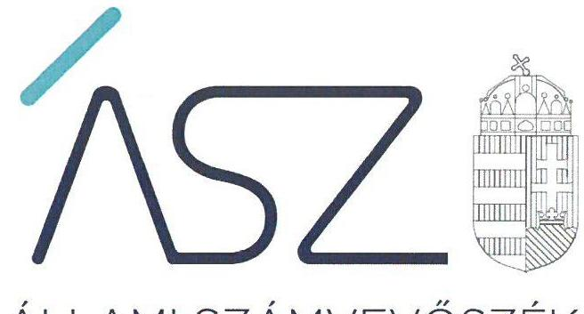
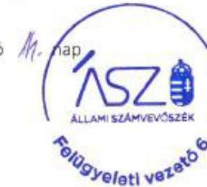

ÁLLAMI SZÁMVEVŐSZÉK

# JELENTÉS

## Önkormányzatok ellenőrzése — Integritás- és belső kontrollrendszer

Újhartyán Város Önkormányzata

2020.

20041
www.asz.hu

---

ÁLLAMI SZÁMVEVŐSZÉK

# JELENTÉS 

Önkormányzatok ellenőrzése - Integritás- és belső
kontrollrendszer

Újhartyán Város Önkormányzata
2020. 02. hó 25. nap

20041
www.asz.hu

---

# AZ ELLENŐRZÉST FELÜGYELTE: 

DR. BENEDEK MÁRIA felügyeleti vezető

## AZ ELLENŐRZÉST VEZETTE ÉS A VÉGREHAJTÁSÁÉRT FELELŐS:

GÁL MAGDOLNA ellenőrzésvezető

## A PROGRAM ÖSSZEÁLLÍTÁSÁÉRT FELELŐS:

TÓTPÁL SZABOLCS osztályvezető

IKTATÓSZÁM: EL-2442-001/2020.
TÉMASZÁM: 2485
ELLENŐRZÉS-AZONOSÍTÓ SZÁM: V082961
Jelentéseink az Országgyúlés számítógépes hálózatán és az interneten a www.asz.hu címen is olvashatóak.

---

# TARTALOMJEGYZÉK 

■ ÖSSZEGZÉS ..... 5
■ AZ ELLENŐRZÉS CÉLJA ..... 6
■ AZ ELLENŐRZÉS TERÜLETE ..... 7
■ AZ ELLENŐRZÉS HÁTTERE, INDOKOLTSÁGA ..... 8
■ A JELENTÉS LÉNYEGES KÉRDÉSKÖREI ..... 9
■ AZ ELLENŐRZÉS HATÓKÖRE ÉS MÓDSZEREI ..... 10
■ MEGÁLLAPÍTÁSOK ..... 12
■ JAVASLATOK ..... 15
■ MELLÉKLETEK ..... 17
I. sz. melléklet: Értelmező szótár ..... 17
■ FÜGGELÉKEK ..... 19
I. sz. függelék a jelentéshez ..... 19
II. sz. függelék: Észrevételek ..... 20
■ RÖVIDÍTÉSEK JEGYZÉKE ..... 33

---

.

---

# ÖSSZEGZÉS 

Újhartyán Város Önkormányzata belső kontrollrendszerének kialakítása és müködtetése nem volt szabályszerű, így az nem biztosította az elszámoltatható, szabályszerű közpénzfelhasználást és a nemzeti vagyonnal történő felelős gazdálkodást. A korrupciós kockázatok kezelésére alkalmas integritás kontrollokat nem építette ki.

## Az ellenőrzés társadalmi indokoltsága

Az Állami Számvevőszék alapvető feladata a közpénzekkel, az állami és önkormányzati vagyonnal való gazdálkodás ellenőrzése. Az Alaptörvény szerint az önkormányzatok kötelezettsége a kiegyensúlyozott, átlátható és fenntartható költségvetési gazdálkodás elvének érvényesítése, a nemzeti vagyonnal való rendeltetésszerű és felelős módon való gazdálkodás biztosítása. Az Állami Számvevőszék stratégiájában megfogalmazott célkitűzése az integritás alapú, átlátható és elszámoltatható közpénzfelhasználás elősegítése. Ennek megvalósítása érdekében az Állami Számvevőszék prioritásként kezeli a közpénzzel gazdálkodó szervezetek esetében a belső kontrollrendszer múködésének ellenőrzését.

Az Állami Számvevőszék Újhartyán Város Önkormányzatát, mint tulajdonosi joggyakorlót „Az önkormányzatok gazdasági társaságai - Az önkormányzatok többségi tulajdonában lévő gazdasági társaságok gazdálkodásának ellenőrzése - Újhartyán Település Üzemeltető és Ország Közepe Ipari Park Kft." című ellenőrzés (17191.) keretében 2017. évben ellenőrizte.

## Főbb megállapítások, következtetések, javaslatok

Újhartyán Város Önkormányzata belső kontrollrendszerének kialakítása és múködtetése nem volt szabályszerű. A kontrollkörnyezet kialakítása nem volt szabályszerű, Újhartyán Város Önkormányzata nem gondoskodott a szervezeti integritást sértő események kezelése eljárásrendjének kialakításáról, az iratkezelési szabályzat kiadásáról, így nem kerültek meghatározásra a köziratok kezelésével, nyilvántartásával és őrzésével kapcsolatos részletes szabályok. Újhartyán Város Önkormányzata az integrált kockázatkezelés eljárásrendjét nem alakította ki, így nem történt meg a szervezeti célok elérését veszélyeztető kockázatok azonosítása, értékelése, ennek hiányában nem volt biztosított a hibák megelőzése és feltárása.

A kontrolltevékenységek gyakorlása nem volt szabályszerű, Újhartyán Város Önkormányzata a kiadási előirányzatok alakulására kiható gazdasági eseményekről nem vezetett a valóságnak megfelelő, zárt rendszerú, áttekinthető nyilvántartást, mivel két főkönyvi számla esetében nem rendelkezett részletező nyilvántartással. Így nem igazolt, hogy a 2017. évi éves beszámoló Újhartyán Város Önkormányzata pénzügyi és vagyoni helyzetéről megbízható, valós összképet mutat, továbbá, hogy a kiadások Újhartyán Város Önkormányzata feladatellátásának körében keletkeztek és a kifizetések valós teljesítéshez kapcsolódtak. Az információs és kommunikációs folyamatok múködtetése nem volt szabályszerű. A monitoring rendszert Újhartyán Város Önkormányzatának jegyzője nem múködtette. A belső ellenőrzés stratégiai ellenőrzési terv, és az éves ellenőrzési tervet alátámasztó kockázatelemzés nélkül múködött, így a belső ellenőrzés nem töltötte be a funkcióját, nem tudott hozzájárulni a fennálló kockázatok feltárásához, ezáltal azok elfogadható szintre csökkentéséhez. A belső és a külső ellenőrzések nyilvántartásának hiányosságai miatt nem volt biztosított az ellenőrzések hasznosulása és az intézkedések nyomon követése.

A szervezet integritását támogató kontrollok kiépítése, a korrupciós kockázatok felmérése és azonosítása nem történt meg.

Újhartyán Város Önkormányzata a szervezeti teljesítmény mérésére alkalmas követelményeket nem alakította ki, így a teljesítmény mérésének lehetőségét nem biztosította.

Az Állami Számvevőszék az intézkedések megtétele céljából a polgármester részére egy, a jegyző részére 11 javaslatot fogalmazott meg.

---

# AZ ELLENŐRZÉS CÉLJA 

AZ ELLENŐRZÉS CÉLJA annak megállapítása volt, hogy az önkormányzat belső kontrollrendszere biz-tosította-e a közpénzekkel és a nemzeti vagyonnal történő elszámoltatható, átlátható, szabályszerű, gazdaságos, hatékony és eredményes gazdálkodás feltételeit. Az ellenőrzés keretében értékeltük továbbá, hogy az önkormányzatnál kiépítették és erősítették-e a korrupciós kockázatok kezelését szolgáló integritás kontrollokat és azt, hogy megteremtették-e a teljesítményellenőrzés feltételeit.

---

# AZ ELLENŐRZÉS TERÜLETE 

## Újhartyán Város Önkormányzata

A Pest megyében található Újhartyán város lakóinak száma 2018. január 1. napján 2734 fő volt.

A képviselő-testület ${ }^{1}$ - a polgármesterrel együtt - 7 tagból állt, munkáját négy bizottság segítette. Újhartyán Város Önkormányzata két költségvetési szerv felett gyakorolta az irányítói jogokat. A gazdálkodási feladatait ellátó Újhartyáni Polgármesteri Hivatal múködése kiterjedt a Német Nemzetiségi Önkormányzat Újhartyán gazdálkodási feladatainak ellátására is.

A polgármester ${ }^{2}$ a 2014. évi választások óta töltötte be tisztségét, a jegyző ${ }^{3}$ 1999. szeptember 16. napjától látta el feladatait.

A gazdasági szervezettel rendelkező Újhartyáni Polgármesteri Hivatal engedélyezett létszáma a hatályos szervezeti és múködési szabályzata alapján 17 fő volt.

Újhartyán Város Önkormányzata éves költségvetési beszámolója szerint a 2017. évben 2223,1 millió Ft bevételt ért el, valamint 1188,3 millió Ft kiadást teljesített. 2017. december 31-én a befektetett eszközvagyon értéke 3 797,7 millió Ft, a mérlegfőösszege 5 158,3 millió Ft, a követelésállománya 436,3 millió Ft, a kötelezettségeinek állománya 34,7 millió Ft volt.

---

# AZ ELLENŐRZÉS HÁTTERE, INDOKOLTSÁGA 

Az ÁSZ ${ }^{4}$ az ÁSZ törvényben kapott felhatalmazással élve ellenőrzi az önkormányzatok gazdálkodását, múködését, hogy az ellenőrzések megállapításaival támogassa az ellenőrzött önkormányzatok szabályszerű gazdálkodását, javaslataival elősegítse az Alaptörvényben ${ }^{5}$ megfogalmazott alapvetések érvényesülését a mindennapi életben az önkormányzatok szintjén. Az önkormányzati rendszerben zajló folyamatok holisztikus elemzései, a kockázatok folyamatos figyelemmel kísérésének módszerével, az így kiválasztott önkormányzatok célzott, hatékony ellenőrzéseivel az ÁSZ betölti a legfőbb gazdasági ellenőrző szerv küldetését. Az egyes ellenőrzések megállapításaival és egy időszak ellenőrzési eredményeinek elemzésével az ÁSZ ráirányíthatja a jogalkotók figyelmét az önkormányzati alrendszerben esetlegesen felmerülő pénzügyi, szabályozási feszültségekre. Az elvégzett nagyszámú ellenőrzés során az ÁSZ „jó gyakorlatokat" is azonosíthat, melyeket tanácsadó funkciója keretében szélesebb körben is megismertethet az érintettekkel, ezáltal is hozzájárulva az önkormányzati alrendszer szabályozott, átlátható, kiegyensúlyozott és fenntartható múködéséhez.

A belső kontrollrendszer kialakítása és múködtetése nélkül nem valósítható meg a közpénzek, a közvagyon átlátható, szabályos, gazdaságos, hatékony és eredményes felhasználása. A belső kontrollrendszer azt a célt szolgálja, hogy a költségvetési szervek múködésük és gazdálkodásuk során a tevékenységeket szabályszerűen hajtsák végre, teljesítsék elszámolási kötelezettségeiket és megvédjék az erőforrásokat a veszteségektől, a károktól és a nem rendeltetésszerű használattól. A belső kontrollrendszer magában foglalja mindazon elveket, eljárásokat és belső szabályzatokat, melyek biztosítják, hogy a költségvetési szerv valamennyi tevékenysége és célja összhangban legyen a szabályszerűséggel, szabályozottsággal, valamint a gazdaságosság, hatékonyság és eredményesség követelményeivel, az eszközökkel és forrásokkal való gazdálkodásban ne kerüljön sor pazarlásra, visszaélésre, rendeltetésellenes felhasználásra. Megfelelő, pontos és naprakész információk álljanak rendelkezésre a költségvetési szerv múködésével kapcsolatosan, és a belső kontrollrendszer harmonizációjára, öszszehangolására vonatkozó jogszabályok végrehajtásra kerüljenek. Az integritás kontrollok kiépítése, erősítése a szervezet korrupciós kockázatainak kezelését szolgálja. A teljesítménykövetelmények meghatározása és múködtetése megalapozhatja az önkormányzatoknál a teljesítményellenőrzés lefolytatását.

---

# A JELENTÉS LÉNYEGES KÉRDÉSKÖREI 

1. Az önkormányzat belső kontrollrendszerének kialakítása és müködtetése szabályszerű volt-e?
2. Az önkormányzatnál alakítottak-e ki a teljesítmény mérésére alkalmas követelményeket?

---

# AZ ELLENŐRZÉS HATÓKÖRE ÉS MÓDSZEREI 

## Az ellenőrzés típusa

Megfelelőségi ellenőrzés.

## Az ellenőrzött időszak

Az ellenőrzött időszak a 2017. év, illetve az éves költségvetési beszámoló Áht. ${ }^{6}$ által megállapított jóváhagyásáig (2018. május 31-éig) tartó időszak.

## Az ellenőrzés tárgya

Újhartyán Város Önkormányzata és a gazdálkodási feladatokat ellátó Újhartyáni Polgármesteri Hivatal belső kontrollrendszerének kialakítása és múködtetése, valamint az integritás kontrollok kiépítettsége, a teljesítményellenőrzés feltételei.

## Az ellenőrzött szervezet

Újhartyán Város Önkormányzata

## Az ellenőrzés jogalapja

Az ellenőrzés jogszabályi alapját az ÁSZ tv. ${ }^{7}$ 1. § (3) bekezdés, 5. § (2)és (6)bekezdései, valamint az Áht. 61.§ (2) bekezdésének előírásai képezik.

## Az ellenőrzés módszerei

Az ÁSZ az ellenőrzést az ellenőrzési program szempontjai, az ellenőrzött időszakban hatályos jogszabályok, az ellenőrzés szakmai szabályai, a jelen ellenőrzésre irányadó ÁSZ módszertanok figyelembevételével hajtotta végre.

Az ellenőrzés ideje alatt az ellenőrzött szervezettel történő kapcsolattartást az ÁSZ SZMSZ ${ }^{8}$-ének vonatkozó előírásai alapján biztosította az ÁSZ.

Az ellenőrzési kérdések megválaszolásához szükséges bizonyítékok megszerzése az ellenőrzött által rendelkezésre bocsátott dokumentumokra, adatokra alapozva megfigyelés, valamint elemző eljárás útján történt. Az ellenőrzési bizonyítékként felhasználható adatforrások közé tar-

---

toztak az ellenőrzési program részletes szempontjainál felsorolt adatforrások, valamint minden egyéb - az ellenőrzés folyamán feltárt, az ellenőrzés szempontjából információt tartalmazó -dokumentum.

Az ellenőrzés lefolytatásához az ellenőrzött szervezet tanúsítványok kitöltésével, valamint az ÁSZ által kért dokumentumok megküldésével szolgáltatott adatokat, amelyek valódiságát és teljes körűségét az ellenőrzött szervezet vezetője által tett teljességi és hitelességi nyilatkozat igazolta. A rendelkezésre bocsátott adatok, információk kontrollja az ellenőrzés keretében történt.

Az önkormányzat belső kontrollrendszere egyes pilléreinek kialakítására és működtetésére vonatkozó értékelés:
$\longrightarrow$ „szabályszerű", amennyiben az értékelt területen az elért „igen" válaszok százalékban kifejezett, egész számra kerekített aránya legalább $85 \%$,
$\longrightarrow$ „nem szabályszerű", ha nem éri el a $85 \%$-ot.
Az önkormányzat belső kontrollrendszerének összesített értékelése az egyes részterületek esetében kapott megfelelőségi arányok számtani átlaga alapján történt és megegyezik a pillérenként (kontrollterületenként) alkalmazott százalékos értékelésekkel, a következő eltérésekkel: a kontrollrendszer egésze esetében a „szabályszerű" értékelésnek a százalékos értéken felül további feltétele volt, hogy egyik kontroll terület sem kaphat „nem szabályszerű" értékelést.

---

# 1. Az önkormányzat belső kontrollrendszerének kialakítása és múködtetése szabályszerű volt-e? 

Összegző megállapítás

Az Önkormányzat belső kontrollrendszerének kialakítása és múködtetése nem volt szabályszerű.

A KONTROLLKÖRNYEZET kialakítása nem volt szabályszerű.
A jegyző a Bkr. ${ }^{9}$ 6. § (4) bekezdésében előírtak ellenére nem szabályozta a szervezeti integritást sértő események kezelésének eljárásrendjét, valamint az integrált kockázatkezelés eljárásrendjét, így nem történt meg a szervezeti célok elérését veszélyeztető kockázatok azonosítása, értékelése, ennek hiányában nem volt biztosított a hibák megelőzése és feltárása.

A jegyző a Bkr. 6. § (3) bekezdésében foglaltak ellenére a Polgármesteri Hivatal ${ }^{10}$ ellenőrzési nyomvonalát nem készítette el.

A jegyző az Ltv. ${ }^{11}$ 10. § (1) bekezdés a) és c) pontjait megsértve az Önkormányzat ${ }^{12}$ és a Polgármesteri Hivatal vonatkozásában nem gondoskodott az iratkezelési szabályzat kiadásáról. Iratkezelési szabályzat hiányában a köziratok kezelésével, nyilvántartásával és őrzésével kapcsolatos részletes szabályok előírása nem volt biztosított.

Az Önkormányzat és a Polgármesteri Hivatal szervezeti és múködési keretei az Áht. előírásai alapján az Önkormányzati SZMSZ ${ }^{13}$-ben és a Hivatali SZMSZ ${ }^{14}$-ben meghatározásra kerültek. A Képviselő-testület a Htv. ${ }^{15}$ szerint elfogadta a helyi önkormányzati vagyonnal történő gazdálkodás szabályait tartalmazó Vagyonrendeletét ${ }^{16}$.

Az Önkormányzat rendelkezett a Számv. tv. szerinti Számviteli politiká ${ }^{17}$-val, Leltározási szabályzat ${ }^{18}$-tal, Értékelési szabályzat ${ }^{19}$-tal, Pénzkezelési szabályzat ${ }^{20}$-tal, továbbá Önköltségszámítási szabályzat ${ }^{21}$-tal, Számlarend ${ }^{22}$-del és Bizonylati szabályzat ${ }^{23}$-tal. A pénzügyi-számviteli szabályzatok hatálya kiterjedt a Polgármesteri Hivatalra is.

## AZ INTEGRÁLT KOCKÁZATKEZELÉSI RENDSZERT a jegyző a Bkr. 3. § b) pontjában foglaltak ellenére nem alakította ki.

A KONTROLLTEVÉKENYSÉGEK gyakorlása nem volt szabályszerű.

Az Önkormányzat 2017. évben a kiadási előirányzatok alakulására kiható gazdasági eseményekről - a 053373 Egyéb szolgáltatások teljesítése és 053423 Reklám- és propagandakiadások teljesítése főkönyvi számlák alátámasztására - az Áhsz. ${ }^{24} 39 . \S$ (1) bekezdésében foglaltak ellenére nem vezetett a valóságnak megfelelő, zárt rendszerú, áttekinthető nyilvántartást. Így a 2017. évben az éves költségvetési beszámolóját - az Áhsz. 5. § (1) bekezdésében előírtakat megsértve - szabályszerű könyvvezetéssel, részletező nyilvántartással nem támasztotta alá.

---

A jegyző az Ávr. ${ }^{25}$ előírásait betartva a kötelezettségvállalásra, pénzügyi ellenjegyzésre, teljesítés igazolására, érvényesítésre, utalványozásra jogosult személyekről és aláírás-mintájukról nyilvántartást vezetett.

# AZ INFORMÁCIÓS ÉS KOMMUNIKÁCIÓS FOLYAMATOK működtetése nem volt szabályszerű, mivel a jegyző a Bkr. 9. § (1) bekezdésében előírtak ellenére nem működtetett olyan információs rendszereket, amelyek biztosították, hogy a megfelelő információk a megfelelő időben eljussanak az illetékes szervezethez, szervezeti egységhez, illetve személyhez. 

A MONITORING RENDSZERT a jegyző a Bkr. 3. § e) pontjában foglaltak ellenére nem múködtette.

Az Önkormányzatnál a belső ellenőrzést külső szolgáltató bevonásával látták el. A belső ellenőrzési vezető a Bkr. 29. § (1) bekezdésben foglaltak ellenére nem készített stratégiai ellenőrzési tervet, továbbá a belső ellenőrzési vezető az éves ellenőrzési tervet nem kockázatelemzés alapján készítette el. Stratégiai ellenőrzési terv és kockázatelemzés nélkül a belső ellenőrzés nem tudott hozzájárulni a fennálló kockázatok feltárásához, ezáltal azok elfogadható szintre csökkentéséhez.

A belső ellenőrzési vezető a képviselő-testület által a Bkr. 32. § (4) bekezdése előírása szerint jóváhagyott éves ellenőrzési tervet nem a Bkr. 31. § (4) bekezdésében, valamint nem a Belső ellenőrzési kézikönyv ${ }^{26}$ IV. fejezet 3.3. pont 5) alpont (4) bekezdésében előírt tartalommal készítette el, mivel az éves ellenőrzési terv a tervezett ellenőrzések tárgyának megjelölése kivételével egyéb információt nem tartalmazott.

A belső ellenőrzési vezető az elvégzett belső ellenőrzésekről nem vezette a Bkr. 47. § (1) bekezdés szerinti nyilvántartást, mivel az nem tartalmazta a belső ellenőrzési jelentésekben tett megállapításokat.

A jegyző a Bkr. 14. § (1) bekezdés előírása ellenére a külső ellenőrzések javaslatai alapján készült intézkedési tervek végrehajtásáról nem vezetett nyilvántartást, mivel az a Bkr. 47. § (2) bekezdése szerinti tartalmi elemeket nem tartalmazta.

A jegyző nyilatkozatban értékelte a Polgármesteri Hivatal belső kontrollrendszerének minőségét. A nyilatkozatban foglaltakat az ÁSZ ellenőrzési megállapítása nem igazolta.

Az Önkormányzat a korrupciós kockázatok kezelésére alkalmas integritás kontrollokat nem építette ki. Nem mérték fel és nem azonosították a korrupciós kockázatokat, az integritás alapú múködést nem biztosították.

---

# 2. Az önkormányzatnál alakítottak-e ki a teljesítmény mérésére alkalmas követelményeket? 

Összegző megállapítás Az Önkormányzatnál nem alakítottak ki a teljesítmény mérésére alkalmas követelményeket.

A SZERVEZET CÉLOK elérését szolgáló feladatok, folyamatok, tevékenységek mérését szolgáló indikátorokat, mérőszámokat, feladat- és teljesítménymutatókat az Önkormányzat nem képezett, így nem biztosította a teljesítménymérés lehetőségét.

---

# JAVASLATOK 

Az ÁSZ tv. 33. § (1) bekezdésében foglaltak értelmében az ellenőrzött szervezet vezetője köteles a jelentésben foglalt megállapításokhoz kapcsolódó intézkedési tervet összeállítani és azt a jelentés kézhezvételétől számított 30 napon belül az ÁSZ részére megküldeni. Amennyiben az ellenőrzött szervezet vezetője nem küldi meg határidőben az intézkedési tervet, vagy továbbra sem elfogadható intézkedési tervet küld, az Állami Számvevőszék elnöke az ÁSZ tv. 33. § (3) bekezdése a) és b) pontjaiban foglaltakat érvényesítheti.

## a polgármesternek

1. Intézkedjen az Állami Számvevőszék ellenőrzése során feltárt hiányosságok és/vagy szabálytalanságok tekintetében a munkajogi felelősség tisztázására irányuló eljárás megindításáról, és ennek eredménye ismeretében tegye meg a szükséges intézkedéseket.
(1. sz. megállapítás 2.-3. bekezdése, 4. bekezdés 1. mondata, 7., 9., 11-16. bekezdése alapján)

## a jegyzőnek

1. Szabályozza a Bkr. előírásainak megfelelően a szervezeti integritást sértő események kezelésének eljárásrendjét, valamint az integrált kockázatkezelés eljárásrendjét.
(1. sz. megállapítás 2. bekezdése alapján)
2. Intézkedjen a Bkr. előírása szerint a Polgármesteri Hivatal ellenőrzési nyomvonalának elkészítéséről.
(1. sz. megállapítás 3. bekezdése alapján)
3. Intézkedjen az egyedi iratkezelési szabályzat Ltv. előírása szerinti kiadásáról.
(1. sz. megállapítás 4. bekezdés 1 mondata alapján)
4. Intézkedjen a Bkr. előírásának megfelelően az integrált kockázatkezelési rendszer kialakításáról.
(1. sz. megállapítás 7. bekezdése alapján)

---

5. Intézkedjen a kiadási előirányzatok részletező nyilvántartása Áhsz.ben elöirt tartalommal történő vezetéséről.
(1. sz. megállapítás 9. bekezdése alapján)
6. Intézkedjen a Bkr. előirásának megfelelően olyan rendszerek kialakításáról és müködtetéséről, melyek biztositják, hogy a megfelelő információk a megfelelő időben eljussanak az illetékes szervezethez, szervezeti egységhez, illetve személyhez.
(1. sz. megállapítás 11. bekezdése alapján)
7. Intézkedjen a Bkr. előirásának megfelelően monitoring rendszer müködtetéséről.
(1. sz. megállapítás 12. bekezdése alapján)
8. Gondoskodjon arról, hogy a belső ellenőrzési vezető a Bkr. előírásának megfelelően:
a) stratégiai ellenőrzési tervet készítsen, valamint
b) az éves ellenőrzési tervet kockázatelemzés alapján készítse el.
(1. sz. megállapítás 13. bekezdése alapján)
9. Gondoskodjon arról, hogy a belső ellenőrzési vezető az éves belső ellenőrzési tervet a Bkr. előírásának megfelelő, valamint a Belső ellenőrzési kézikönyvben elöirt tartalommal készítse el.
(1. sz. megállapítás 14. bekezdése alapján)
10. Gondoskodjon arról, hogy a belső ellenőrzési vezető a Bkr. előírásának megfelelően éves bontásban nyilvántartást vezessen, amellyel a belső ellenőrzési jelentésekben tett megállapításokat, javaslatokat, a vonatkozó intézkedési terveket és azok végrehajtását nyomon követi.
(1. sz. megállapítás 15. bekezdése alapján)
11. Vezesse a nyilvántartást a Bkr. előírásának megfelelően a külső ellenőrzések javaslatai alapján készült intézkedési tervek végrehajtásáról.
(1. sz. megállapítás 16. bekezdése alapján)

---

# MELLÉKLETEK 

- I. SZ. MELLÉKLET: ÉRTELMEZŐ SZÓTÁR
belső ellenőrzés
belső kontrollrendszer
belső kontrollrendszer területei
információs és kommunikációs rendszer
integrált kockázatkezelési rendszer
integritás
irányító szerv/felügyeleti szerv
kockázat
kontrollkörnyezet
kontrolltevékenységek
kommunikáció

Független, tárgyilagos bizonyosságot adó és tanácsadó tevékenység, amelynek célja, hogy az ellenőrzött szervezet működését fejlessze és eredményességét növelje, az ellenőrzött szervezet céljai elérése érdekében rendszerszemléletű megközelítéssel és módszeresen értékeli, illetve fejleszti az ellenőrzött szervezet irányítási és belső kontrollrendszerének hatékonyságát. (Forrás: Bkr. 2. § b) pontja)
A belső kontrollrendszer a kockázatok kezelése és tárgyilagos bizonyosság megszerzése érdekében kialakított folyamatrendszer, amely azt a célt szolgálja, hogy a müködés és gazdálkodás során a tevékenységeket szabályszerűen, gazdaságosan, hatékonyan, eredményesen hajtsák végre, az elszámolási kötelezettségeket teljesítsék, megvédjék az erőforrásokat a veszteségektől, károktól és nem rendeltetésszerű használattól. (Forrás: Áht. 69. § (1) bekezdése)
A kontrollkörnyezet, az integrált kockázatkezelési rendszer, a kontrolltevékenységek, az információs és kommunikációs rendszer, valamint a nyomon követési (monitoring) rendszer. (Forrás: Bkr. 3. §-a)
A költségvetési szerv vezetője által kialakított és müködtetett olyan rendszer, mely biztosítja, hogy a megfelelő információk a megfelelő időben eljutnak az illetékes szervezethez, szervezeti egységhez, illetve személyhez. (Forrás: Bkr. 9. § (1) bekezdés)
Olyan folyamatalapú kockázatkezelési rendszer, amely a szervezet minden tevékenységére kiterjed, egységes módszertan és eljárások alkalmazásával, a szervezet célkitűzéseinek és értékeinek figyelembevételével biztosítja a szervezet kockázatainak teljes körű azonosítását, azok meghatározott kritériumok szerinti értékelését, valamint a kockázatok kezelésére vonatkozó intézkedési terv elkészítését és az abban foglaltak nyomon követését. (Forrás: Bkr. 2. § m) pontja, 2016. október 1-jétől)
Az integritás az elvek, értékek, cselekvések, módszerek, intézkedések konzisztenciáját jelenti, vagyis olyan magatartásmódot, amely meghatározott értékeknek megfelel. (Forrás: Nemzetgazdasági Minisztérium: Magyarországi államháztartási belső kontroll standardok Útmutató 1.6.1. pontja, 2012. december)
A költségvetési szerv tekintetében az Áht-ban meghatározott irányítási hatáskört gyakorló szerv. (Forrás: Áht. 1. § 9. pontja)
A kockázat annak a valószínűségét jelenti, hogy egy vagy több esemény vagy intézkedés nem kívánt módon befolyásolja a rendszer müködését, céljainak megvalósulását. (Forrás: Javaslatok a korrupciós kockázatok kezelésére - Kockázatkezelési és ellenőrzési módszertan 35. oldal, ÁSZ)
A költségvetési szerv vezetője által kialakított olyan elvek, eljárások, belső szabályzatok összessége, amelyben világos a szervezeti struktúra, a folyamatok átláthatók, egyértelműek a felelősségi, hatásköri viszonyok és feladatok, meghatározottak, ismertek és elfogadottak az etikai elvárások a szervezet minden szintjén, átlátható a humán-erőforrás-kezelés, biztosított a szervezeti célok és értékek irányában való elkötelezettség fejlesztése és elősegítése. (Forrás: Bkr. 6. § (1) bekezdés)
A költségvetési szerv vezetője által a szervezeten belül kialakított (kontroll) tevékenységek, melyek biztosítják a kockázatok kezelését, hozzájárulnak a szervezet céljainak eléréséhez és erősítik a szervezet integritását. (Forrás: Bkr. 8. § (1) bekezdés)
Az a tevékenység, melynek során információ továbbítása valósul meg. A kommunikációs folyamat résztvevői között tájékoztatás történik, mely során tényeket, ezek magyarázatát közlik.

---

monitoring

monitoring-rendszer
önkormányzati hivatal

A monitoring általánosságban a különböző szintű szervezeti célok megvalósításának folyamatát kíséri figyelemmel, melynek során a releváns eseményekről és tevékenységekről (együtt: folyamatokról) rendszeres jelleggel, strukturált, döntéstámogató információkhoz jutnak a szervezet vezetői. (Forrás: NGM Útmutató a költségvetési szervek monitoring rendszeréhez 2011. november)
A költségvetési szerv vezetője köteles kialakítani a szervezet tevékenységének a célok megvalósításának nyomon követését biztosító rendszert, amely az operatív tevékenységek keretében megvalósuló folyamatos és eseti nyomon követésből, valamint az operatív tevékenységektől függetlenül múködő belső ellenőrzésből állhat. (Forrás: Bkr. 10. §)
A polgármesteri hivatal, a főpolgármesteri hivatal, a megyei önkormányzati hivatal és a közös önkormányzati hivatal. (Forrás: Áht. 1. § 18. pont)

---

# FÜGGELÉKEK 

- I. SZ. FÜGGELÉK A JELENTÉSHEZ

Az Állami Számvevőszék az ellenőrzések során feltárt tényekhez kapcsolódó további körülmények tisztázására eszközrendszerrel nem rendelkezik. Amennyiben az ellenőrzésen túlmutatóan indokoltnak látszik az ellenőrzés során feltárt körülmények további vizsgálata, az Állami Számvevőszék törvényi felhatalmazás alapján az ellenőrzés által feltárt körülményeket továbbítja a hatáskörrel rendelkező szervnek a szükséges intézkedések megtétele, eljárások lefolytatása érdekében.
Az Önkormányzat 2017. évben 52,7 millió Ft összegű dologi kiadási előirányzat alakulására kiható gazdasági eseményekről - a 053373 Egyéb szolgáltatások teljesítése és 053423 Rek-lám- és propagandakiadások teljesítése fökönyvi számlák alátámasztására - nem vezetett a valóságnak megfelelő, zárt rendszerü, áttekinthető nyilvántartást, ebből következően a 2017. évi éves beszámolóját szabályszerű könyvvezetéssel, részletező nyilvántartással nem támasztotta alá.
Ezzel az Önkormányzat megsértette az Áhsz. 5. § (1) bekezdésében és a 39. § (1) bekezdésében foglalt előirásokat.
A részletező nyilvántartás hiányosságai miatt nem igazolt, hogy az Önkormányzat 2017. évi éves beszámolója az Önkormányzat pénzügyi és vagyoni helyzetéről, annak alakulásáról megbízható, valós összképet mutat. Továbbá kétséges a gazdasági események jellegére figyelemmel, hogy a kiadások az Önkormányzat feladatellátásának körében keletkeztek és a kifizetések valós teljesítéshez kapcsolódtak.
Mindezek miatt felvetődik, hogy az Önkormányzatnál vagyoni hátrány keletkezhetett.
Az eset konkrét körülményeinek felderítésére a nyomozóhatóság rendelkezik hatáskörrel.

---

A jelentéstervezetet a Számvevőszék 15 napos észrevételezésre megküldte az ellenőrzött szervezet vezetőinek az ÁSZ tv. 29. §* (1) bekezdése előírásának megfelelően.

Az Újhartyáni Polgármesteri Hivatal jegyzője élt az ÁSZ tv. 29. § (2) bekezdésében foglalt észrevételezési jogával, a jelentéstervezet megállapításaira a törvényes határidőn belül észrevételt tett.
A függelék tartalmazza az ellenőrzött észrevételeit, illetve az el nem fogadott észrevételek elutasításának indoklását.

[^0]
[^0]:    * 29. § (1) Az Állami Számvevőszék az ellenőrzési megállapításait megküldi az ellenőrzött szervezet vezetőjének vagy az általa megbízott személynek, és annak, akinek személyes felelősségét állapította meg.
    (2) Az ellenőrzött szervezet vezetője és a felelősként megjelölt személy az ellenőrzés megállapításaira tizenöt napon belül írásban észrevételt tehet.
    (3) Az Állami Számvevőszék az észrevételre a beérkezésétől számított harminc napon belül írásban válaszol. A figyelembe nem vett észrevételeket köteles a jelentésben feltüntetni, és megindokolni, hogy azokat miért nem fogadta el.

---

Újhartyáni Polgármesteri Hivatal JEGYZŐJE

# Göndörné Frajka Gabriella 

2367 Újhartyán, Fő u. 21.
Tel./Fax: (29)372-133, 372-258, 372-025

Ügyiratszám: 3-4/2020.

Tárgy: Észrevétel az „Önkormányzatok ellenőrzése- Integritás- és belső kontrollrendszer Újhartyán Város Önkormányzata" címủ számvevőszéki jelentéstervezetre
Hiv.szám: EL-1374-035/2019.

## Állami Számvevőszék Elnöke részére

## 1052 Budapest

Apáczai Csere János utca 10.

Tisztelt Domokos László Elnök úr!

Hivatkozással az EL-1374-035/2019. iktatószámú „Önkormányzatok ellenőrzése - Integritás- és belső kontrollrendszer" című számvevőszéki ellenőrzés keretében megküldött jelentéstervezetre, valamint az Állami Számvevők ellenőrzési megállapításait írásban ismertető EL-1374-039/2020. iktatószámú jegyzőkönyvben foglaltakra, a rendelkezésre álló határidőben az alábbi észrevételt kívánom tenni:

1. Megállapitás: A kontrollkörnyezet kialakítása nem volt szabályszerű, mivel a jegyző a költségvetési szervek belső kontrollrendszeréről és belső ellenőrzéséről szóló 370/2011. (XII.31.) Kormányrendelet (a továbbiakban: Bkr.) 6. § (4) bekezdésében elöirtak ellenére nem szabályozta a szervezeti integritást sértő események kezelésének eljárásrendjét, valamint az integrált kockázatkezelés eljárásrendjét, így nem történt meg a szervezeti célok elérését veszélyeztető kockázatok azonosítása, értékelése, ennek hiányában nem volt biztosított a hibák megelőzése és feltárása.

Észrevétel: A hiányosságként feltüntetett szervezeti integritást sértő események kezelésének eljárásrendjét, továbbá az integrált kockázatkezelés eljárásrendjét az Újhartyán Város Önkormányzata és intézményei vonatkozásában a „Szabályzat az államháztatás belső kontrollrendszeréről" c. helyi szabályzat tartalmazza a szervezeti sajátosságokra tekintettel.
A belső kontrollrendszer kialakítására az államháztatásért felelős miniszter által közzétett módszertani útmutatók alkalmazásával lett meghatározya. Ezen hiteles Államháztartási Belső Kontrollok Rendszeréről szóló szabályzat másolatát levelemhez mellékeltem.

A Jegyző a Bkr. 6. § (3) bekezdésben foglaltak ellenére a Polgármesteri Hivatal ellenőrzési nyomvonalát nem készítette el.

Észrevétel: A Polgármesteri Hivatal egész tevékenyégére kiterjedően tartalmazza az ellenőrzési nyomvonalat a fent hivatkozott „Szabályzat az államháztatás belső kontrollrendszeréről" c. dokumentum, amely az Állami Számvevőszék ellenőrzése során, a rendelkezésre álló információk szerint feltöltésre került az erre szolgáló elektronikus felületen.

---

A szabályzat az ellenőrzési folyamatok ellenőrzési nyomvonalát táblázatban szemléltetve tartalmazza (1. számú melléklet, 33 oldal) a Polgármesteri Hivatal müködésére vonatkozólag, különösen a Bkr. 6. § (3) bekezdésben foglaltak követelményeknek megfelelően, ezzel biztosítva a felelősségi, információs szintek, irányítási és ellenőrzési folyamatokat meghatározását, továbbá a nyomon követés és utólagos ellenőrzés megvalósulását. Ezen hiteles Államháztartási Belső Kontrollok Rendszeréról szóló szabályzat másolatát levelemhez mellékeltem.

A Jegyzö a közokiratokról, közlevéltárakról és a magánlevéltári anyag védelméröl szóló 1995. évi LXVI. törvény 10. § (1) bekezdés a) és c) pontjait sérive az Önkormányzat és Polgármesteri Hivatal vonatkozásában nem gondoskodott az iratkezelési szabályzat kiadásáról. Iratkezelési szabályzat hiányában a közokiratok kezelésével, nyilvántartásával és örzésével kapcsolatos részeletes szabályok elöirása nem volt biztositott.

Észrevétel: Az Újhartyáni Polgármesteri Hivatal rendelkezett az ellenőrzési időszakra vonatkozó, a közokiratokról, közlevéltárakról és a magánlevéltári anyag védelméről szóló 1995. évi LXVI. törvény 9. § (4) bekezdésével összhangban hatályos iratkezelési szabályzattal. A jelentéstervezet ezen részével egyetértek annak vonatkozásában, hogy önhibából nem került feltöltésre az egyetértési nyilatkozatot tartalmazó, ellenőrzési időszakban hatályos iratkezelési szabályzat. Az egyetértési nyilatkozat bekérésre került 2014. évben a Kormányhivatal illetékes szervétól, tekintettel arra, hogy az iratkezelési szabályzat jogszabályi rendelkezésekkel való összhang szempontjából továbbításra került annak elfogadását követően, azonban az egyetértési nyilatkozat nem lett megküldve felénk. Az ÁSZ jelentéstervezetre nyitva álló észrevétel tételi határidőn belül a Kormányhivataltól megkértem a hiányzó egyetértési nyilatkozatot, de az a mai napig még Hivatalom felé nem érkezett meg. Az ellenőrzési idöben hatályos Iratkezelési Szabályzatot levelemhez mellékelem.
2. Megállapitás: A Jegyzö a Bkr. 3.§ b) pontjában foglaltak ellenére az integrált kockázatkezelési rendszert nem alakitotta ki.

Észrevétel: A kockázatkezelés folyamatának egymásra épülő, ciklikus lépéseit a „Szabályzat az államháztattástan belső kontrollrendszeréről" c. szabályzat 4. számú melléklete tartalmazza (73. oldal) a kockázatok felméréstől kezdődően a válaszintézkedések megvalósításáig. Ezen hiteles Államháztartási Belső Kontrollok Rendszeréról szóló szabályzat másolatát levelemhez mellékeltem.
3. Megállapitás: A kontrolltevékenységek gyakorlása nem volt szabályszerü, mert az Önkormányzat 2017. évben a kiadási elöirányzatok alakulására kiható gazdasági eseményekröl - a 053373 Egyéb szolgáltatások teljesitése és 053423 Reklám- és propaganda kiadások teljesitésére fökényvi számlák alátámasztására - az államháztartás számviteléröl szóló 4/2013. (I.11.) Kormányrendelet (továbbiakban: Ähsz.) 39. § (1) bekezdésében foglaltak ellenére nem vezetett a valóságnak megfelelő, zárt rendszerü, áttekinthetö nyilvántartást. Így a 2017. évben az éves költségvetési beszámolóját - az Ähsz. 5. §. (1) bekezdésében elöirtakat megsértve- szabályszerü könyvezetéssel, részletezö nyilvántartással nem támasztotta alá.

Észrevétel: Az önkormányzat az ASP rendszerre történő átállást megelőzően a CGR könyveli rendszert használta, amely zárt rendszerben müködő, valóságnak megfelelő, integrált pénzügyiszámviteli rendszerben biztositotta, és a mai napig is Biztosírtja az önkormányzat teljes pénzügyi folyamatainak kezelését. Levelemhez mellékelem a tegnapi napon a CGR rendszerböl kinyomtatott - a 053373 Egyéb szolgáltatások teljesítése és 053423 Reklám- és propaganda kiadások teljesítéséről szóló fökönyvi analitikát.

---

4. Megállapítás: Az információs és kommunikációs folyamatok müködtetése nem volt szabályszerű, mivel a jegyző a Bkr. 9. § (1) bekezdésében elöirtak ellenére nem müködhetett olyan információs rendszereket, amelyek biztosították, hogy a megfelelő információk a megfelelő időben eljussanak az illetékes szervezethez, szervezti egységhez, illetve személyhez.

Észrevétel: "Szabályzat az államháztartási belső kontrollrendszeréről" c. szabályzat IV. számú fejezete (29. oldal) szól az Információs és kommunikációs rendszerről. Az információs és kommunikációs rendszer biztosítja a Hivatal vezetése által kitűzött célok, kapcsolódó feladatok, a feladatok teljesítését szolgáló előírások, követelmények és feltételek minden munkatárs általi megismerhetőségét, illetve tájékoztatást nyújt a vezetők számára a feladatok végrehajtásának, a kitűzött célok elérésének helyzetéről, a célok elérését veszélyeztető kockázatokról. Ezek az információk biztosítják a külső partnerekkel összefüggő információs kapcsolatok objektivitását is. Az információs és kommunikációs rendszer a kitűzött célok elérését segítve működik, a Hivatalon belül kialakított kommunikációs és információs rendszer biztosítsa vertikálisan és horizontálisan a szabályozott tevékenységhez szükséges időpontban, kellő mennyiségben és megfelelő minőségben a szerv/szervezeti egység irányíthatósága és ellenőrizhetősége szempontjából, tehát a szolgálati út betartását. Ezen hiteles Államháztartási Belső Kontrollrendszeréről szóló szabályzat IV. fejezete tartalmazza, mely szabályzat másolatát levelemhez mellékeltem, továbbá a Információátadási szabályzatot mellékelten csatolom.
5. Megállapítás: A monitoring rendszert a jegyző a Bkr. 3. § e) pontjában elöirtak ellenére nem müködtette.

Észrevétel: A Polgármesteri Hivatal monitoring rendszere az operatív tevékenységek keretében megvalósuló folyamatos és eseti nyomon követésből, valamint az operatív tevékenységtől függetlenül működő belső ellenőrzésből áll, melyet a belső kontrollrendszerről szóló szabályzatban foglaltak szerint működteti a jegyző a "Szabályzat az államháztartási belső kontrollrendszeréről" c. szabályzat alapján, amely a kockázatok kezelésére tett intézkedések megvalósulását nyomon követhetővé teszi. Ezen hiteles Államháztartási Belső Kontrollrendszeréről szóló szabályzat V. fejezete tartalmazza (30. oldal), mely szabályzat másolatát levelemhez mellékeltem.

Megállapítás: A Jegyző a Bkr. 14. § (1) bekezdés elöirása ellenére a külső ellenörzések javaslatai alapján készült intézkedési tervek végrehajtásáról nem vezetett nyilvántartást, mivel az a Bkr. 47. § (2) bekezdése szerinti elemeket nem tartalmazta.

Észrevétel: Valóban nem történt meg az intézkedési tervek végrehajtásáról szóló nyilvántartás vezetése a jogszabályi előírás alapján. A megállapítás ezen pontjával egyet értek és a hiányosság korrigálására és jövőbeni folyamatos vezetéséről intézkedtem.

Megállapítás: A belső ellenőrzési vezető a Bkr. 29. § (1) bekezdésben foglaltak ellenére nem készített stratégiai ellenőrzési tervet, továbbá a belső ellenőrzési vezető az éves ellenőrzési tervet nem kockázatelemzés alapján készítette el. Stratégiai ellenőrzési terv és kockázatelemzés nélkül a belső ellenőrzés nem tudott hozzájárulni a fennálló kockázatok feltárásához, ezáltal azok elfogadható szintre csökkentéséhez.

Észrevétel: A Bkr. 29. § (1) bekezdésben foglaltak szerint elkészült 2014-2019. évben a stratégiai ellenőrzési tervet. Ezen hiteles stratégiai ellenőrzési terv másolatát levelemhez mellékeltem.

---

Megállapítás: A belsö ellenörzési vezetö a képviselö-testület által a Bkr. 32. § (4) bekezdése elöirása szerint jóváhagyott éves ellenörzési tervez nem a Bkr. 31. § (4) bekezdésben, valamint nem a Belsö ellenörzési kézikönyv IV. Fejezet 3.3. pont 5) alpont (4) bekezdésben elöirt tartalommal készittete el, mivel az éves ellenörzési terv a tervezett ellenörzések tárgyának megielölése kivételével egyéb információt nem tartalmazott.

Észrevétel: A Bkr. 32. § (4) bekezdése előirása szerint a Képviselő-testület által jóváhagyott éves ellenőrzési terv a Bkr. 31. § (4) bekezdésben, valamint nem a Belső ellenőrzési kézikönyv IV. Fejezet 3.3. pont 5) alpont (4) bekezdésben elöirt tartalommal került meghatározásra. Az erről szóló dokumentumot jelen levelemhez csatoltan, hitelesítve továbbítom.

Megállapítás: A belső ellenőrzési vezető az elvégzett belső ellenőrzésekröl nem vezette a Bkr. 47. § (1) bekezdés szerinti nyilvántartást, mivel az nem tartalmazta a belső ellenőrzési jelentésekben tett megállapításokat.

Észrevétel: A Bkr. 47. § (1) bekezdés szerinti nyilvántartás rendelkezésünkre áll, azonban a nyilvántartás valóban hiányos, mivel nem tartalmazza a belső ellenőri megállapításokat, melyre a jövőben oda figyelünk és orvosolni fogjuk.

Kérem a T. Elnök urat, hogy az általam tett észrevételeket figyelembe véve mérlegeljék a jelentéstervezetben foglaltakat!

Hivatkozással a Polgármester Úr tájékoztatására ismételten szeretném felhívni a figyelmet arra, hogy pontosan a belső kontrolrendszer müködtetése tárta fel azt a sajnálatos szabálytalanság, ami miatt a feltöltött dokumentumok is nem teljes körüen kerültek Önökhöz.

Újhartyán, 2020. 01. 21.

Tisztelettel:

Göndöhe Frajka Gabriella
Jegyzö

---

# Újhartyáni Polgármesteri Hivatal JEGYZÓJE 

Göndörné Frajka Gabriella

2367 Újhartyán, Fö u. 21.
Tel./Fax: (29)372-133, 372-258, 372-025

## MELLÉKLETEK

„Önkormányzatok ellenőrzése- Integritás- és belső kontrollrendszer Újhartyán Város Önkormányzata" címú számvevöszéki jelentéstervezetre vonatokozó észrevételekhez

1. Szabályzat az államháztartási belső kontrollok rendszeréről
2. Újhartyáni Polgármesteri Hivatal Iratkezelési Szabályzat
3. Fökönyvi analitika $(053373,053423)$
4. Információátadási szabályzat Újhartyán Város Önkormányzat
5. Stratégiai Ellenörzési terv 2014-2019
6. Éves ellenőrzési terv 2017

---

Ikt. szám: EL-1374-044/2020.

Göndörné Frajka Gabriella úrhölgy
jegyző
Újhartyáni Polgármesteri Hivatal

Újhartyán

Tisztelt Jegyző Úrhölgy!

Az „Önkormányzatok ellenőrzése – Integritás- és belső kontrollrendszer – Újhartyán Város Önkormányzata“ címmel készített számvevőszéki jelentéstervezetre tett, 2020. január 21-én kelt, 3-4/2020. ügyiratszámú levelében megküldött észrevételeit köszönettel megkaptam.

Az Állami Számvevőszék észrevételekre vonatkozó álláspontjáról a felügyeleti vezető által készített részletes tájékoztatást csatoltan megküldöm.

Tájékoztatom Jegyző úrhölgyet, hogy a számvevőszéki jelentésben – az Állami Számvevőszékről szóló 2011. évi LXVI. törvény 29. § (3) bekezdése alapján – a figyelembe nem vett észrevételeket szerepeltetjük az elutasítás indokának feltüntetésével.

Budapest, 2020. 21. hónap 19 nap

Tisztelettel:

ÁLLAMI SZÁMVEVŐSZÉK
GÖNÖK

Melléklet: Tájékoztatás az észrevételek kezeléséről

1052 BUDAPEST, APÁCZAI CSERE JÁNOS UTCA 10, 1364 Budapest 4. Pf. 54. telefon: +36 1 484 9101, fax: +36 1 484 9201

---

# Tájékoztatás 

## az észrevételek kezeléséről

Az „Önkormányzatok ellenőrzése - Integritás- és belső kontrollrendszer - Újhartyán Város Önkormányzata" című számvevőszéki jelentéstervezetben foglalt megállapításokra a 2020. január 21-én kelt, 3-4/2020. ügyiratszámú levelében megküldött észrevételeit áttekintettem. Az észrevételek kezeléséről az alábbi tájékoztatást adom.

Köszönettel vettük tájékoztatását az ÁSZ ellenőrzés ellenőrzött időszakát követően megtett, valamint a belső kontrollrendszer javítása érdekében tervezett intézkedéseiről.

Tájékoztatom, hogy az ÁSZ ellenőrzési megállapításait az ellenőrzött időszakra az Állami Számvevőszékről szóló 2011. évi LXVI. törvény (továbbiakban: ÁSZ tv.) 28. § (2) bekezdése alapján az ellenőrzött szervezet által az ellenőrzéséhez kapcsolódóan, az ellenőrzés lefolytatásához a törvényi határidőben rendelkezésre bocsátott, a teljességi és hitelességi nyilatkozatban feltüntetett dokumentumokra alapozza. Az ellenőrzött szervezet teljességi és hitelességi nyilatkozata szerint az ÁSZ részére átadott dokumentumok, adatok megbízhatóak, és a bekért adatokra, dokumentumokra vonatkozóan teljes körű információt tartalmaznak.

Az észrevételhez mellékletként csatolt, az ÁSZ részére Újhartyán Város Önkormányzata által (továbbiakban: Önkormányzat) az adatszolgáltatásra biztosított törvényi határidőn kívül megküldött, utólag rendelkezésre bocsátott dokumentumokat az ÁSZ nem értékelte.

1. Az EL-1374-035/2019. iktatószámú számvevőszéki jelentéstervezet (továbbiakban: jelentéstervezet) 1. sz. megállapítás 2. bekezdésére vonatkozó észrevétel

A jegyző észrevétele szerint a szervezeti integritást sértő események kezelésének eljárásrendjét, továbbá az integrált kockázatkezelés eljárásrendjét az Önkormányzat és intézményei vonatkozásában a „Szabályzat az államháztartás belső kontrollrendszeréről" c. helyi szabályzat tartalmazza a szervezeti sajátosságokra tekintettel, mely az államháztartásért felelős miniszter által közzétett módszertani útmutatók alkalmazásával lett meghatározva. A szabályzat másolatát a jegyző az észrevételéhez mellékelte.
Az Önkormányzat által az adatszolgáltatásra biztosított határidőben rendelkezésére bocsátott dokumentumok felülvizsgálata során az ÁSZ megállapította, hogy az EL-1374-005/2018. iktatószámú adatbekérő levél 2. számú melléklet 2. bekezdésében foglaltak ellenére az Önkormányzat nem aláírt és nem hiteles, „allamhazt_belso_kontrollok_rendsz _szab.pdf" megnevezésű dokumentumot bocsátott az ÁSZ rendelkezésére. Hiteles dokumentummal nem igazolta, hogy a tárgyi ellenőrzési megállapításban leírtakat szabályozta.
A fent leírtak alapján a jegyző észrevételét az ÁSZ nem veszi figyelembe, a számvevőszéki jelentéstervezetben szereplő 1. sz. megállapítás 2. bekezdése és a jegyzőnek címzett 1. javaslat módosítása nem indokolt.

---

# 2. A jelentéstervezet 1. sz. megállapítás 3. bekezdésére vonatkozó észrevétel: 

A jegyző észrevételében leírta, hogy az Újhartyáni Polgármesteri Hivatal (továbbiakban: Hivatal) egész tevékenyégére kiterjedően tartalmazza az ellenőrzési nyomvonalat a „Szabályzat az államháztartás belső kontrollrendszeréről" c. dokumentum, amely az ellenőrzés során feltöltésre került az erre szolgáló elektronikus felületen. A szabályzat az ellenőrzési folyamatok ellenőrzési nyomvonalát táblázatban szemléltetve tartalmazza (1. számú melléklet, 33 oldal) a Polgármesteri Hivatal müködésére vonatkozólag, különösen a Bkr. 6. § (3) bekezdésben foglaltak követelményeknek megfelelően, melyet az észrevételéhez mellékelt.
Az Önkormányzat által az adatszolgáltatásra biztosított határidőben rendelkezésére bocsátott dokumentumok felülvizsgálata során az ÁSZ megállapította, hogy az EL-1374-005/2018. iktatószámú adatbekérő levél 2. számú melléklet 2. bekezdésében foglaltak ellenére az Önkormányzat nem aláírt és nem hiteles, „allamhazt_belso_kontrollok_rendsz_szab.pdf" megnevezésű dokumentumot bocsátott az ÁSZ rendelkezésére. Hiteles dokumentummal nem igazolta, hogy a Hivatal ellenőrzési nyomvonalát elkészítette.
Fent leírtak alapján a jegyző észrevételét az ÁSZ nem veszi figyelembe, a számvevőszéki jelentéstervezetben szereplő 1. sz. megállapítás 3. bekezdése és a jegyzőnek címzett 2. javaslat módosítása nem indokolt.

## 3. A jelentéstervezet 1. sz. megállapítás 4. bekezdés 1. mondatára vonatkozó észrevétel:

A jegyző észrevétele szerint a Hivatal rendelkezett az ellenőrzési időszakra vonatkozó, hatályos iratkezelési szabályzattal. A jegyző elismerte, hogy önhibából nem került feltöltésre az egyetértési nyilatkozatot tartalmazó, ellenőrzési időszakban hatályos iratkezelési szabályzat. A jegyző észrevételében leírta, hogy az iratkezelési szabályzat elfogadását követően az egyetértési nyilatkozatot bekérték a Kormányhivatal illetékes szervétől, azonban az egyetértési nyilatkozat az észrevétel elkészítéséig a Hivatal felé nem érkezett meg. Az ellenőrzési időben hatályos iratkezelési Szabályzatot a leveléhez mellékelte.
A jegyző észrevételének 2. mondata nem vitatta, hanem megerősítette a számvevőszéki jelentéstervezet iratkezelési szabályzat hiányára vonatkozó megállapítását, mivel az Önkormányzat önhibájából nem került feltöltésre az egyetértési nyilatkozatot tartalmazó, ellenőrzési időszakban hatályos iratkezelési szabályzat.
A fent leírtak alapján az ÁSZ a jegyző észrevételét nem veszi figyelembe, a számvevőszéki jelentéstervezetben szereplő 1. számú megállapítás 4. bekezdés 1. mondata, és a jegyzőnek címzett 3. javaslat módosítása nem indokolt.

## 4. A jelentéstervezet 1. sz. megállapítás 7. bekezdésére vonatkozó észrevétel:

A jegyző észrevétele szerint a kockázatkezelés folyamatának egymásra épülő, ciklikus lépéseit a „Szabályzat az államháztartás belső kontrol Rendszeréről" c. szabályzat 4. számú melléklete tartalmazza (73. oldal) a kockázatok felméréstől kezdődően a válaszintézkedések megvalósításáig. A szabályzat másolatát a jegyző az észrevételéhez mellékelte.
Az Önkormányzat által az adatszolgáltatásra biztosított határidőben rendelkezésére bocsátott dokumentumok felülvizsgálata során az ÁSZ megállapította, hogy az EL-1374-005/2018. iktatószámú adatbekérő levél 2. számú melléklet 2. bekezdésében foglaltak ellenére Újhartyán Város Önkormányzata nem aláírt és nem hiteles, „allamhazt_belso_kontrollok_rendsz _szab.pdf" megnevezésű dokumentumot bocsátott az ÁSZ rendelkezésére. Hiteles

---

dokumentummal nem igazolta, hogy az integrált kockázatkezelési rendszert kialakította.
Fent leírtak alapján a jegyző észrevételét az ÁSZ nem veszi figyelembe, a számvevőszéki jelentéstervezetben szereplő 1. sz. megállapítás 7. bekezdése és a jegyzőnek címzett 4. javaslat módosítása nem indokolt.

# 5. A jelentéstervezet 1. számú megállapítás 9. bekezdésére vonatkozó észrevétel: 

A jegyző észrevételében leírta, hogy az önkormányzat az ASP rendszerre történő átállást megelőzően a CGR könyveli rendszert használta, amely zárt rendszerben müködő, valóságnak megfelelő, integrált pénzügyi-számviteli rendszerben biztosította az Önkormányzat teljes pénzügyi folyamatainak kezelését. Leveléhez mellékelte a CGR rendszerből kinyomtatott - a 053373 Egyéb szolgáltatások teljesítése és 053423 Reklám- és propaganda kiadások teljesítéséről szóló főkönyvi analitikát.
Az Önkormányzat által az adatszolgáltatásra biztosított határidőben rendelkezésére bocsátott dokumentumok felülvizsgálata során az ÁSZ megállapította, hogy az EL-1374-005/2018 iktatószámú adatbekérő levél 2. sz. melléklet II. 2. 1. pontjában kért, müködési kiadásokat tartalmazó adatbázisok közül az Önkormányzat nem bocsátotta az ÁSZ rendelkezésére a 053373 (Egyéb szolgáltatások K337, összege 44622432 Ft) és 053423 (Reklám- és propagandakiadások K342 - összege 8076400 Ft ) főkönyvi számlák adatait. Az Önkormányzat ezáltal azt igazolta, hogy az Áhsz. 39. § (1) bekezdésben előírtak ellenére nem vezetett a valóságnak megfelelő, folyamatos, zárt rendszerü, áttekinthető nyilvántartást a kiadási előirányzatok alakulására kiható gazdasági eseményekről.
A fent leírtak alapján az ÁSZ a jegyző észrevételét nem veszi figyelembe, a számvevőszéki jelentéstervezetben szereplő 1. számú megállapítás 9. bekezdése, és a jegyzőnek címzett 5. javaslat módosítása nem indokolt.

## 6. A jelentéstervezet 1. számú megállapítás 11. bekezdésére vonatkozó észrevétel:

A jegyző észrevétele szerint „Szabályzat az államháztartási belső kontrollrendszeréről" c. szabályzat IV. számú fejezete szól az Információs és kommunikációs rendszerről. Az Információs és kommunikációs rendszer biztosítja a Hivatal vezetése által kitűzött célok, kapcsolódó feladatok, a feladatok teljesítését szolgáló előírások, követelmények és feltételek minden munkatárs általi megismerhetőségét, illetve tájékoztatást nyújt a vezetők számára a feladatok végrehajtásának, a kitűzött célok elérésének helyzetéről, a célok elérését veszélyeztető kockázatokról. Ezek az információk biztosítják a külső partnerekkel összefüggő információs kapcsolatok objektivitását is. Az információs és kommunikációs rendszer a kitűzött célok elérését segítve müködik, a Hivatalon belül kialakított kommunikációs és információs rendszer biztosítsa vertikálisan és horizontálisan a szabályozott tevékenységhez szükséges időpontban, kellő mennyiségben és megfelelő minőségben a szerv/szervezeti egység irányíthatósága és ellenőrizhetősége szempontjából. A fent nevezett szabályzat másolatát a jegyző az észrevételéhez mellékelte.
Az Önkormányzat által az adatszolgáltatásra biztosított határidőben rendelkezésére bocsátott dokumentumok felülvizsgálata során az ÁSZ megállapította, hogy az EL-1374-005/2018 iktatószámú adatbekérő levél 2. sz. melléklet I. 37. pontjában meghatározott, az információ áramlás rendszere müködtetését alátámasztó dokumentumokat (pl.: vezetői értekezlet emlékeztetője, jegyzőkönyve, feljegyzések, iktatókönyv) az Önkormányzat nem bocsátott az ellenőrzés részére, így a szervezeten belüli és a szervezeten kívüli információ áramlás

---

rendszerének működtetését az ellenőrzött dokumentummal nem igazolta, ezáltal a Bkr. 9. § (1) bekezdés ellenére nem biztosította, hogy a megfelelő információk, maradéktalanul, a megfelelő időben eljussanak az illetékes szervezethez, szervezeti egységhez, illetve személyhez.

A fent leírtak alapján az ÁSZ a jegyző észrevételét nem veszi figyelembe, a számvevőszéki jelentéstervezetben szereplő 1. számú megállapítás 11. bekezdése, és a jegyzőnek címzett 6. javaslat módosítása nem indokolt.
7. A jelentéstervezet 1. számú megállapítás 12. bekezdésére vonatkozó észrevétel:

A jegyző észrevételében leírta, hogy a Hivatal monitoring rendszere az operatív tevékenységek keretében megvalósuló folyamatos és eseti nyomon követésből, valamint az operatív tevékenységtől függetlenül működő belső ellenőrzésből áll, melyet a belső kontrollrendszerről szóló szabályzatban foglaltak szerint működteti a jegyző a "Szabályzat az államháztartási belső kontrollrendszeréről" c. szabályzat alapján, amely a kockázatok kezelésére tett intézkedések megvalósulását nyomon követhetővé teszi. Ezen hiteles Államháztartási Belső Kontrollrendszeréről szóló szabályzat V. fejezete tartalmazza (30. oldal). A szabályzat másolatát a jegyző az észrevételéhez mellékelte.

Az Önkormányzat által az adatszolgáltatásra biztosított határidőben rendelkezésére bocsátott dokumentumok felülvizsgálata során az ÁSZ megállapította, hogy az EL-1374-005/2018 iktatószámú adatbekérő levél 2. sz. melléklet I. 45. pontjában kért, a monitoring tevékenység eredményeként keletkezett dokumentumokat (pl.: monitoring adatok, jelentések, feljegyzések, beszámolók indikátorok teljesítéséről) az Önkormányzat nem bocsátott az ellenőrzés részére, így a monitoring rendszer működtetését dokumentummal nem igazolta.

A fent leírtak alapján az ÁSZ a jegyző észrevételét nem veszi figyelembe, a számvevőszéki jelentéstervezetben szereplő 1. számú megállapítás 12. bekezdése, és a jegyzőnek címzett 7. javaslat módosítása nem indokolt.
8. A jelentéstervezet 1. számú megállapítás 16. bekezdésére vonatkozó észrevétel:

A jegyző észrevételében leírtak szerint az Önkormányzatnál nem történt meg az intézkedési tervek végrehajtásáról szóló nyilvántartás vezetése a jogszabályi előírás alapján. A megállapítás ezen pontjával a jegyző egyetért és a hiányosság korrigálására és jövőbeni folyamatos vezetéséről intézkedett.

A jegyző észrevételében nem vitatta, hanem megerősítette a számvevőszéki jelentéstervezet Bkr. 14. § (1) bekezdés előírása szerinti külső ellenőrzések javaslatai alapján készült intézkedési tervek végrehajtásáról vezetendő nyilvántartás hiányát.

A fent leírtak alapján az ÁSZ a jegyző észrevételét nem veszi figyelembe, a számvevőszéki jelentéstervezetben szereplő 1. számú megállapítás 16. bekezdés és a jegyzőnek címzett 11. javaslat módosítása nem indokolt.
9. A jelentéstervezet 1. számú megállapítás 13. bekezdése vonatkozó észrevétel:

A jegyző észrevételében leírta, hogy a Bkr. 29. § (1) bekezdésben foglaltak szerint elkészült 2014-2019. évben a stratégiai ellenőrzési terv, melyet észrevételéhez mellékelt.

Az Önkormányzat által az adatszolgáltatásra biztosított határidőben rendelkezésére bocsátott dokumentumok felülvizsgálata során az ÁSZ megállapította, hogy az EL-1374-005/2018

---

iktatószámú adatbekérő levél 2. sz. melléklet I. 51. pontjában meghatározott, stratégiai ellenőrzési tervet az Önkormányzat nem bocsátott az ellenőrzés részére, ezáltal az ellenőrzés során az adatszolgáltatásra biztosított törvényi határidőben nem igazolta, hogy a Bkr. 29. § (1) bekezdésében meghatározott stratégiai ellenőrzési tervet készített, továbbá azt sem igazolta, hogy a belső ellenőrzési vezető az éves ellenőrzési tervet kockázatelemzés alapján készítette el.

A fent leírtak alapján az ÁSZ a jegyző észrevételét nem veszi figyelembe, a számvevőszéki jelentéstervezetben szereplő 1. számú megállapítás 13. bekezdése, és a jegyzőnek címzett 8/a. javaslat módosítása nem indokolt.

# 10. A jelentéstervezet 1. számú megállapítás 14. bekezdésére vonatkozó észrevétel: 

A jegyző észrevételében leírta, hogy a Bkr. 32. § (4) bekezdése előírása szerint a Képviselőtestület által jóváhagyott éves ellenőrzési terv a Bkr. 31. § (4) bekezdésben, valamint nem a Belső ellenőrzési kézikönyv IV. Fejezet 3.3. pont 5) alpont (4) bekezdésben előírt tartalommal került meghatározásra, mely dokumentumot az észrevételéhez hitelesítve mellékelt.
Az Önkormányzat által az adatszolgáltatásra biztosított határidőben rendelkezésére bocsátott dokumentumok felülvizsgálata során az ÁSZ megállapította, hogy az EL-1374-005/2018 iktatószámú adatbekérő levél 2. sz. melléklet I. 51. pontja alapján megküldött belső ellenőrzési tervet a belső ellenőrzési vezető nem a Bkr. 31. § (4) bekezdésében, valamint nem a Belső ellenőrzési kézikönyv IV. Fejezet 3.3 pont 5) alpont (4) bekezdésében előírt tartalommal készítette el, mivel az éves ellenőrzési terv a tervezett ellenőrzések tárgyának megjelölése kivételével egyéb információt nem tartalmazott.
A fent leírtak alapján az ÁSZ a jegyző észrevételét nem veszi figyelembe, a számvevőszéki jelentéstervezetben szereplő 1. számú megállapítás 14. bekezdése, és a jegyzőnek címzett 9. javaslat módosítása nem indokolt.

## 11. A jelentéstervezet 1. számú megállapítás 15. bekezdésére vonatkozó észrevétel:

A jegyző észrevételében leírta, hogy a Bkr. 47. § (1) bekezdés szerinti nyilvántartás rendelkezésünkre áll, azonban a nyilvántartás hiányos, nem tartalmazza a belső ellenőri megállapításokat, melyet pótolnak, a jövőben pedig a jogszabálynak megfelelően vezetnek.
A jegyző észrevételében nem vitatta, hanem megerősítette a számvevőszéki jelentéstervezet - Bkr. 47. § (1) bekezdés előírása szerinti - az elvégzett belső ellenőrzésekről vezetendő nyilvántartás hiányát.
A fent leírtak alapján az ÁSZ a jegyző észrevételét nem veszi figyelembe, a számvevőszéki jelentéstervezetben szereplő 1. számú megállapítás 15. bekezdése és a jegyzőnek címzett 10. javaslat módosítása nem indokolt

Budapest, 2020.

Dr. Benedek Mária felügyeleti vezető

---

.

---

# RÖVIDÍTÉSEK JEGYZÉKE 

${ }^{1}$ képviselő-testület
${ }^{2}$ polgármester
${ }^{3}$ jegyző
${ }^{4}$ ÁSZ
${ }^{5}$ Alaptörvény
${ }^{6}$ Áht.
${ }^{7}$ ÁSZ tv.
${ }^{8}$ ÁSZ SZMSZ
${ }^{9}$ Bkr.
${ }^{10}$ Polgármesteri Hivatal
${ }^{11}$ Ltv.
${ }^{12}$ Önkormányzat
${ }^{13}$ Önkormányzati SZMSZ
${ }^{14}$ Hivatali SZMSZ
${ }^{15}$ Htv.
${ }^{16}$ Vagyonrendelet
${ }^{17}$ Számviteli politika
${ }^{18}$ Leltározási szabályzat
${ }^{19}$ Értékelési szabályzat
${ }^{20}$ Pénzkezelési szabályzat
${ }^{21}$ Önköltségszámítási szabályzat
${ }^{22}$ Számlarend
${ }^{23}$ Bizonylati szabályzat
${ }^{24}$ Áhsz.
${ }^{25}$ Ávr.
${ }^{26}$ Belső ellenőrzési kézikönyv

Újhartyán Város Önkormányzata képviselő-testülete
Újhartyán Város Önkormányzatának polgármestere
Újhartyáni Polgármesteri Hivatal jegyzője
Állami Számvevőszék
Magyarország Alaptörvénye
2011. évi CXCV. törvény az államháztartásról
2011. évi LXVI. törvény az Állami Számvevőszékről

Az Állami Számvevőszék elnökének 2/2018. (XII.28.) ÁSZ utasítása az Állami Számvevőszék Szervezeti és Müködési Szabályzatáról
370/2011. (XII. 31.) Korm. rendelet a költségvetési szervek belső kontrollrendszeréről és belső ellenőrzéséről
Újhartyáni Polgármesteri Hivatal
1995.évi LXVI. törvény a köziratokról, a közlevéltárakról és a magánlevéltári anyag védelméről
Újhartyán Város Önkormányzata
Újhartyán Város Önkormányzat Képviselő-testületének 14/2014. (X.21.) önkormányzati rendelete a képviselő-testület Szervezeti és Müködési Szabályzatáról
Újhartyáni Polgármesteri Hivatal Szervezeti és Müködési Szabályzata 1991. évi XX. törvény a helyi önkormányzatok és szerveik, a köztársasági megbízottak, valamint egyes centrális alárendeltségű szervek feladat- és hatásköreiről
Újhartyán Város Önkormányzata Képviselő-testületének 11/2013. (VI. 26.) önkormányzati rendelete az Önkormányzat vagyonáról, a vagyon feletti tulajdonosi jogok gyakorlásának és a vagyon kezelésének szabályozásáról Újhartyán Város Önkormányzat Számviteli politika
Újhartyán Város Önkormányzat Leltározási és leltárkészítési szabályzat Újhartyán Város Önkormányzat Eszközök és források értékelési szabályzata Újhartyán Város Önkormányzat Pénzkezelési szabályzat Újhartyán Város Önkormányzat Önköltségszámítási szabályzat Újhartyán Város Önkormányzat Számlarend Újhartyán Város Önkormányzat Bizonylati szabályzat 4/2013. (I. 11.) Korm. rendelet az államháztartás számviteléről 368/2011. (XII. 31.) Korm. rendelet az államháztartásról szóló törvény végrehajtásáról
Újhartyán Város Önkormányzata és intézményei Belső Ellenőrzési Kézikönyv

---

# ASZ 

ALLAMI SZAMVEVOSZEK
1052 Budapest, Apáczai Cs. J. u. 10. I 1364 Budapest 4. Pf. 54 TEL: +36 14849100
email: szamvevoszek@asz.hu
web: www.asz.hu | www.aszhirportal.hu