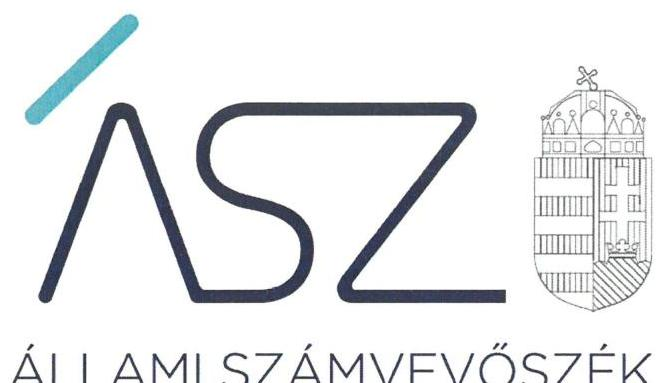
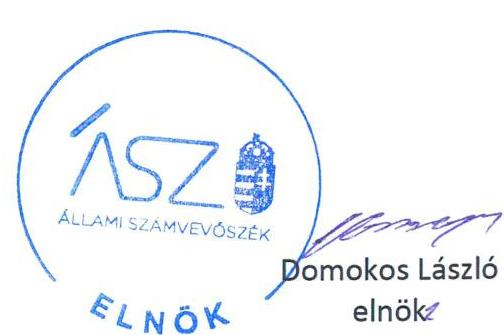
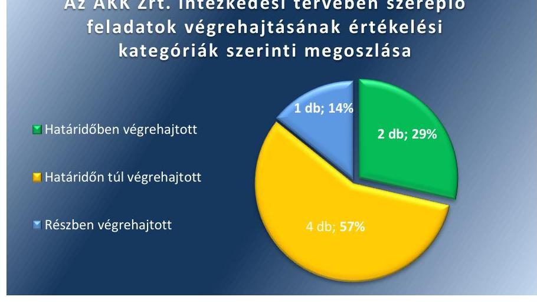
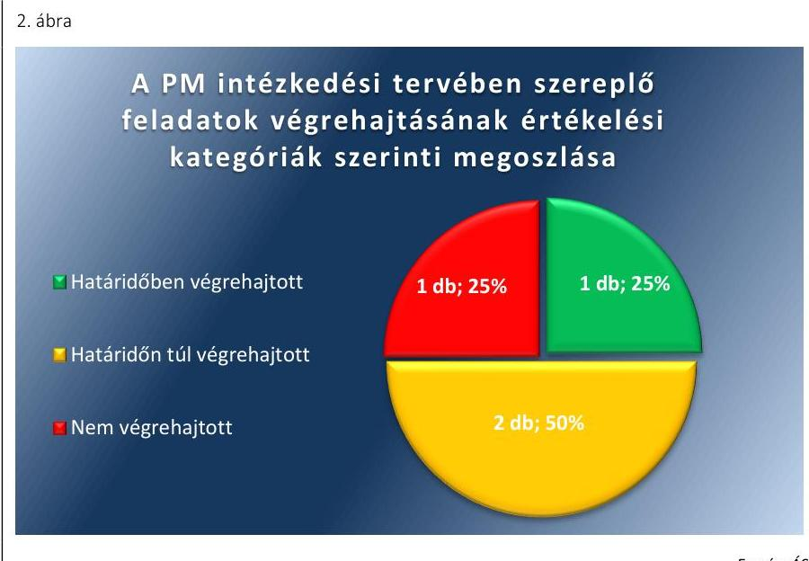
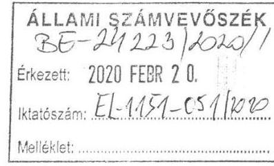
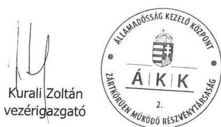
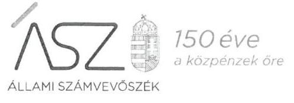
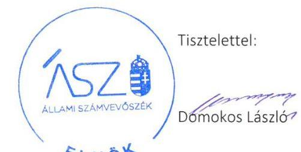

ÁLLAMI SZÁMVEVŐSZÉK

# JELENTÉS 

## Utóellenőrzések

Az államháztartás központi alrendszerének adósságát kezelő rendszer ellenőrzése
2020.

20042
www.asz.hu

---

ÁLLAMI SZÁMVEVŐSZÉK

# JELENTÉS 

## Utóellenőrzések

Az államháztartás központi alrendszerének adósságát kezelő rendszer ellenőrzése
2020. 05. hó 24. nap

20042
www.asz.hu

---

# AZ ELLENŐRZÉST FELÜGYELTE: 

MAROZSÁN LÁSZLÓNÉ felügyeleti vezető

## AZ ELLENŐRZÉST VEZETTE ÉS A VÉGREHAJTÁSÁÉRT FELELŐS:

DR. SIMON JÓZSEF ellenőrzésvezető

## A PROGRAM ÖSSZEÁLLÍTÁSÁÉRT FELELŐS:

TÓTPÁL SZABOLCS osztályvezető

## A TÉMÁHOZ KAPCSOLÓDÓ KORÁBBI SZÁMVEVŐSZÉKI JELENTÉSEK:

- címe: Az államháztartás központi alrendszerének adósságát
- sorszáma: kezelő rendszer ellenőrzése
- sorszáma: 16104

Jelentéseink az Országgyűlés számítógépes hálózatán és az interneten a www.asz.hu címen is olvashatóak.

IKTATÓSZÁM: EL-2445-001/2020.
TÉMASZÁM: 2460
ELLENŐRZÉS-AZONOSÍTÓ SZÁM: V0804152

---

# TARTALOMJEGYZÉK 

■ ÖSSZEGZÉS ..... 5
■ AZ ELLENŐRZÉS CÉLJA ..... 6
■ AZ ELLENŐRZÉS TERÜLETE ..... 7
■ AZ ELLENŐRZÉS HÁTTERE, INDOKOLTSÁGA ..... 8
■ A JELENTÉS LÉNYEGES KÉRDÉSKÖRE ..... 9
■ AZ ELLENŐRZÉS HATÓKÖRE ÉS MÓDSZEREI ..... 10
■ MEGÁLLAPÍTÁSOK ..... 12
■ MELLÉKLETEK ..... 15
I. sz. melléklet: Az Államadósság Kezelő Központ Zrt. intézkedési terve végrehajtásának értékelése ..... 15
II. sz. melléklet: A Pénzügyminisztérium intézkedési terve végrehajtásának értékelése ..... 17
■ FÜGGELÉK: ÉSZREVÉTELEK ..... 19
■ RÖVIDÍTÉSEK JEGYZÉKE ..... 27

---

.

---

# ÖSSZEGZÉS 

Az Állami Számvevőszék az utóellenőrzés során megállapította, hogy az Államadósság Kezelő Központ Zrt. és a Pénzügyminisztérium által végrehajtott intézkedések hozzájárultak az államadósság-kezelés stratégiai céljai megalapozottságának és az államadósság-kezelési tevékenység értékelhetőségének, továbbá a megbízhatóságának javulásához.

## Az ellenőrzés társadalmi indokoltsága

Az Állami Számvevőszék stratégiájában célul tűzte ki a számvevőszéki munka hasznosulásának javítását. Ezzel összhangban ellenőrzi, hogy az ellenőrzött szervezetek megvalósították-e a korábbi ellenőrzései által feltárt hibák, hiányosságok és szabálytalanságok megszüntetése céljából elkészített intézkedési tervekben foglaltakat. A rendszeres utóellenőrzések hozzájárulnak a szükséges intézkedések tényleges végrehajtásához, ezáltal a közpénzügyek rendezettségének javulásához.

Magyarország Alaptörvényének hatálybalépése óta az államadósság-kezeléssel kapcsolatos feladatok jelentősége növekedett. Az Alaptörvény rögzíti az államadósság bruttó hazai termékhez viszonyított maximális szintjét. Az „adósság-szabály" értelmében az államadósság bruttó hazai termékhez viszonyított mutatójának folyamatos javítását szükséges biztosítani. Ennek indoka, hogy az államadósság-mutató alakulása kihat a gazdasági folyamatokra, illetve ezek fenntarthatóságára. E kötelezettség teljesítésében az Állami Számvevőszék, mint alkotmányos intézmény és az Országgyűlés legfőbb ellenőrző szerve részt vállal e terület ellenőrzése által.

## Főbb megállapítások, következtetések

A Pénzügyminisztérium az Állami Számvevőszék intézkedést igénylő megállapításaira készített intézkedési tervben szereplő négy feladat közül egy feladatot határidőben, két feladatot határidőn túl hajtott végre, továbbá egy feladat végrehajtása nem történt meg. Az Államadósság Kezelő Központ Zrt. az intézkedési tervében szereplő feladatok közül két feladatot határidőben, négy feladatot határidőn túl hajtott végre, továbbá egy feladatot részben hajtott végre.

Az államadósság-kezelési tevékenység szabályozottságának javítása érdekében gondoskodott az Államadósság Kezelő Központ Zrt. vezérigazgatója a középtávú finanszírozási terv és a finanszírozási stratégia belső szabályozásának kialakításáról, valamint a Pénzügyminisztérium kialakította a tulajdonosi joggyakorlás keretében ellátandó feladatokat és hatásköröket tartalmazó eljárásrendet.

Az Államadósság Kezelő Központ Zrt. belső szabályzatainak felülvizsgálatáról és módosításáról gondoskodtak az ellenőrzött szervezetek. A végrehajtott intézkedések révén a belső kontrollrendszer szabályozottsága javult.

A pénzügyi megalapozottság területén kialakításra került az államadósság-kezelési tevékenység alapját jelentő új optimális portfóliómodell és módszertan, valamint az adósságkezelési tevékenység költséghatékonyságát mérő értékelési rendszer. Az új optimális portfóliómodell kialakítása által a pénzügyi megalapozottság javult.

---

# AZ ELLENŐRZÉS CÉLJA 

Az ellenőrzés célja annak értékelése volt, hogy a számvevőszéki jelentésben ${ }^{1}$ foglalt intézkedést igénylő megállapításokkal összhangban készített intézkedési tervekben meghatározott feladatokat az ellenőrzött szervezetek végrehajtották-e.

---

# AZ ELLENŐRZÉS TERÜLETE 

## Államadósság Kezelő Központ Zrt., Pénzügyminisztérium

A Stabilitási tv. ${ }^{2}$ határozza meg az államadósság-kezelés alapvető jogi kereteit. A jogszabály az államháztartásért felelős minisztert hatalmazza fel arra, hogy gondoskodjon a költségvetés hiányának finanszírozásáról, az állami költségvetés fizetőképességének folyamatos fenntartásáról, a központi költségvetés adósságainak és adósságterheinek nyilvántartásáról, az adósságok törlesztéséről, valamint az államháztartás átmeneti szabad pénzeszközeinek kezeléséről. Az államháztartásért felelős miniszter az e körbe tartozó feladatait az ÁKK Zrt. ${ }^{3}$ útján látja el.

Az ÁKK Zrt. állami tulajdonú gazdasági társaság, kizárólagos tulajdonosa a magyar állam, amelynek nevében a tulajdonosi jogokat az államháztartásért felelős miniszter gyakorolja.

Az ÁKK Zrt. adósságkezeléshez kapcsolódó feladata kiemelten a költségvetés finanszírozási szükségletének hosszú távon minimális költséggel, elfogadható kockázatok vállalása mellett történő finanszírozása. Az ÁKK Zrt. a finanszírozási igényt forint és deviza állampapír kibocsátásokon keresztül biztosítja, államkötvények, diszkont kincstárjegyek és a lakosság részére értékesített állampapírok által.

Az ÁKK Zrt. ügyvezető szerve az Igazgatóság ${ }^{4}$. Munkaszervezetét az ÁKK Zrt.-vel munkaviszonyban álló Vezérigazgató ${ }^{5}$ irányítja és ellenőrzi, a jogszabályok és az Alapító Okirat ${ }^{6}$ keretei között, illetve az államháztartásért felelős miniszter és az Igazgatóság határozatai alapján. Az ellenőrzött időszakban a vezérigazgató személye egy alkalommal, 2019. szeptember 1-jével változott.

---

# AZ ELLENŐRZÉS HÁTTERE, INDOKOLTSÁGA 

Az ÁSZ tv. ${ }^{7}$ 33. § (1) bekezdése értelmében a számvevőszéki jelentések intézkedést igénylő megállapításaihoz és javaslataihoz kapcsolódóan az ellenőrzött szervezet vezetője intézkedési tervet köteles összeállítani, és az Állami Számvevőszék részére megküldeni.

Az ÁSZ ${ }^{8}$ által befogadott intézkedési tervben foglaltak megvalósítását - az ÁSZ tv. 33. § (7) bekezdésében foglaltak alapján - az Állami Számvevőszék utóellenőrzés keretében ellenőrizheti. Az utóellenőrzések keretében - az intézkedések értékelése során - az Állami Számvevőszék figyelembe veszi az ellenőrzött szervezetek működési feltételeiben, valamint a jogszabályi előírásokban bekövetkezett változásokat.

Az utóellenőrzés során az ÁSZ értékeli, hogy az érintett számvevőszéki jelentésben foglalt megállapításokkal és javaslatokkal összhangban, az ellenőrzött szervezetek által készített intézkedési tervben meghatározott feladatokat a feladatra kijelöltek végrehajtották-e.

Az intézkedések végrehajtásával az adott terület szabályszerű működése vonatkozásában a kockázatok csökkenhetnek, azonban hosszabb távon az intézkedési tervben foglaltak végrehajtásával önmagában nem szűnnek meg, csak akkor, ha beépülnek az ellenőrzött szervezetek működésébe, azokat folyamatosan karbantartják, figyelembe véve, illetve kezelve a változásokat. Emellett az intézkedések végrehajtásáig újabb kockázatok merülhetnek fel a szabályszerű működés vonatkozásában, amelyek kezelése szintén kiemelten fontos az ellenőrzött szervezetek számára.

Az ellenőrzött szervezetek vezetői által készített intézkedési tervekben foglalt feladatok hiányos, illetve késedelmes végrehajtása, vagy annak elmaradása a szabályszerűség és a felelős vezetői magatartás vonatkozásában kockázatot hordoz, ami azt mutatja, hogy az ellenőrzések során feltárt hibák, hiányosságok és szabálytalanságok kezelése nem kapott kellő hangsúlyt. Az utóellenőrzés során is fennálló szabálytalanságok esetén a közpénz, közvagyon veszélyeztetettségi kockázat valószínűsített hatásának értékelése további intézkedéseket vonhat maga után.

Az ellenőrzött szervezetek szintjén az utóellenőrzés feltárja, hogy a szervezet az intézkedések végrehajtásával hasznosította-e a korábbi ellenőrzési jelentésben a hiányosságok megszüntetése, illetve a kockázatok kezelése érdekében megfogalmazott javaslatokat, illetve az intézkedések végrehajtása elmaradásának következtében továbbra is fennálló szabálytalanság esetén értékeli a közpénzek, közvagyon veszélyeztetettségét.

Az ÁSZ szintjén az utóellenőrzés visszacsatolást ad a számvevőszéki jelentések hasznosulásáról, az intézkedések elmaradásának, vagy részleges megvalósulásának a közpénzek, közvagyon veszélyeztetettségére gyakorolt valószínűsített hatásának értékelése, további intézkedéseket vonhat maga után.

---

# A JELENTÉS LÉNYEGES KÉRDÉSKÖRE 

Az ellenőrzött szervezetek az intézkedési tervekben foglaltakat az előírt határidőben végrehajtották-e?

---

# AZ ELLENŐRZÉS HATÓKÖRE ÉS MÓDSZEREI 

## Az ellenőrzés típusa

Megfelelőségi ellenőrzés.

## Az ellenőrzött időszak

Az utóellenőrzés alapját képező számvevőszéki jelentés közzétételének napjától az ellenőrzésről szóló kiértesítő levél keltének napjáig, azaz 2016. július 14-től 2019. október 22-ig tartó időszak.

## Az ellenőrzés tárgya

A számvevőszéki jelentésben foglalt megállapításokkal és javaslatokkal összhangban az ÁKK Zrt. és a Pénzügyminisztérium által készített intézkedési tervben foglaltak végrehajtásának ellenőrzése.

## Az ellenőrzött szervezet

Az Államadósság Kezelő Központ Zrt. és a Pénzügyminisztérium

## Az ellenőrzés jogalapja

Az ellenőrzés jogszabályi alapját az ÁSZ tv. 33. § (7) bekezdésének előírásai képezték.

## Az ellenőrzés módszerei

Az ellenőrzést az ÁSZ az ellenőrzött időszakban hatályos jogszabályok, az ellenőrzés szakmai szabályai, a jelen ellenőrzésre irányadó ÁSZ módszertanok, az ellenőrzési programban foglalt értékelési szempontok szerint végezte.

Az ellenőrzés ideje alatt az ÁSZ az ellenőrzött szervezetekkel történő kapcsolattartást az ÁSZ SZMSZ-ének vonatkozó előírásai alapján biztosította.

Az utóellenőrzés megállapításait az ÁSZ rendelkezésére álló, valamint az ÁSZ adatbekérése szerint az ellenőrzött szervezetek által rendelkezésre bocsátott dokumentumok alapozták meg.

---

Az ellenőrzési kérdések megválaszolásához szükséges bizonyítékok megszerzése az ellenőrzöttek által rendelkezésre bocsátott dokumentumokra, adatokra alapozva megfigyelés, szemle (szemrevételezés), kérdésfeltevés (információkérés), valamint elemző eljárás alkalmazásával történt. Az ellenőrzési bizonyítékként felhasználható adatforrások közé tartoztak egyrészt az ellenőrzési program részletes szempontjainál felsorolt adatforrások, másrészt minden - az ellenőrzés folyamán feltárt, az ellenőrzés szempontjából információt tartalmazó - dokumentum.

Az intézkedési tervekben előírt feladatokat azok végrehajthatósága, illetve végrehajtása szempontjából az alábbiak szerint értékelte az ÁSZ:
$\longrightarrow$ „határidőben végrehajtott" a feladat, ha a teljesítés dokumentáltan, az intézkedési tervben előírt határidőben és tartalommal megtörtént;
$\longrightarrow$ „határidőn túl végrehajtott" a feladat, ha annak teljesítése az intézkedési tervben meghatározott módon, de az előírt határidőn túl történt meg;
$\longrightarrow$ „részben végrehajtott" a feladat, ha végrehajtása teljes körűen az intézkedési tervben előírt módon nem történt meg;
$\longrightarrow$ „nem végrehajtott" a feladat, ha a végrehajtás nem történt meg, dokumentumokkal nem igazolt annak teljesítése;
$\longrightarrow$ „okafogyottá vált" a feladat, ha végrehajtására - meghatározott esemény bekövetkezése, továbbá külső körülmény, a működést érintő feltétel változása miatt - már nincs szükség, illetve lehetőség, és egyértelműen megállapítható, hogy az intézkedést szükségessé tevő körülmény a jövőben nem fordulhat elő;
$\longrightarrow$ „nem időszerű" az a feladat, amelynek ellenőrzési időszakon belüli végrehajtására azért nem került (kerülhetett) sor, mert az intézkedés alapjául szolgáló esemény nem következett be, de annak jövőbeni előfordulása lehetséges, a végrehajtása nem volt esedékes, vagy a végrehajtás határideje még nem járt le.
Az ellenőrzés lefolytatásához az ellenőrzött szervezetek a tanúsítványok elektronikus kitöltésével, valamint az ÁSZ által kért dokumentumok elektronikus megküldésével szolgáltattak adatokat, amelyek valódiságát és teljes körűségét az ellenőrzött szervezetek vezetője által tett teljességi és hitelességi nyilatkozatok igazolták. Az így rendelkezésre bocsátott adatok, információk kontrollja az ellenőrzés keretében történt meg.

---

# MEGÁLLAPÍTÁSOK 

## Az ellenőrzött szervezetek az intézkedési tervekben foglaltakat az előírt határidőben végrehajtották-e?

Összegző megállapítás

Az Államadósság Kezelő Központ Zrt. hét feladatból két feladatot határidőben, négy feladatot határidőn túl és egy feladatot részben hajtott végre. A Pénzügyminisztérium négyből egy feladatot határidőben, két feladatot határidőn túl hajtott végre és egy feladatot nem hajtott végre.

Az ÁSZ a 16104. számú jelentésében az ÁKK Zrt. Igazgatósága elnöke részére hét, a nemzetgazdasági miniszter részére három javaslatot fogalmazott meg. A hiányosságok, szabálytalanságok megszüntetése érdekében készített intézkedési tervben az Igazgatóság elnöke hét, a nemzetgazdasági miniszter négy feladatot határozott meg.

Az intézkedési tervekben szereplő feladatokat, a végrehajtás határidejét, a felelősöket és a feladatok végrehajtásának értékelését az I. sz. és a II. sz. melléklet mutatja be.

Az intézkedési tervben rögzített feladatok végrehajtásáról a PM${ }^{10}$ a Bkr. ${ }^{11}$ előírásai szerinti nyilvántartást vezetett. Az ÁKK Zrt.-nek az intézkedési tervében rögzített feladatok végrehajtására vonatkozó Bkr. szerinti nyilvántartás vezetési kötelezettsége nem volt.

Az ÁKK Zrt. intézkedési tervében szereplő feladatok végrehajtásának értékelési kategóriák szerinti megoszlását az 1. ábra szemlélteti.

1. ábra

Az ÁKK Zrt. intézkedési tervében szereplő feladatok végrehajtásának értékelési kategóriák szerinti megoszlása

A PM intézkedési tervében szereplő feladatok végrehajtásának
 értékelési kategóriák szerinti megoszlását a 2. ábra szemlélteti.

---

A SZABÁLYOZOTTSÁG javítása érdekében a PM gondoskodott a tulajdonosi joggyakorlás vonatkozásában az átruházott hatáskörben ellátandó feladatokat és hatásköröket tartalmazó eljárásrend előkészítéséről. (PM 3.). A Vezérigazgató gondoskodott a középtávú finanszírozási terv készítésének SZMSZ ¹²-ben való meghatározásáról és a középtávú finanszírozási terv kidolgozásában közreműködő szervezeti egységek feladatainak, felelősségi és hatáskörének rögzítéséről (ÁKK Zrt. 3.). Az ÁKK Zrt. belső szabályzatában rögzítették az államadósság-kezelési stratégia kidolgozásában, felülvizsgálatában és módosításában közreműködő szervezeti egységek feladatait, felelősségi és hatáskörét (ÁKK Zrt. 4.).

A BELSŐ KONTROLLRENDSZER javítása érdekében a Vezérigazgató gondoskodott a monitoring és beszámolási rendszerrel kapcsolatos belső szabályozók felülvizsgálatáról, ezek módosításáról és a változásokról az Igazgatóság felé történő beszámolásról (ÁKK Zrt. 5.).

AZ ÁLLAMADÓSSÁG-KEZELÉS MEGALAPOZOTTSÁGÁNAK javítása érdekében a Vezérigazgató gondoskodott az új optimális portfólió modell ütemterv szerinti kialakításáról és a fejlesztési folyamatról történő beszámolásról az Igazgatóság részére (ÁKK Zrt. 1.), valamint az adósság-kezelés költséghatékonyságát mérő értékelési rendszer kialakításáról és az Igazgatóság részére történő beterjesztéséről (ÁKK Zrt. 2.).

A Vezérigazgató gondoskodott az új optimális portfóliómodell optimális költségtartományra vonatkozó módszertannal való kiegészítéséről, azonban a költséghatékonyságot mérő modell eredményeiről nem számolt be félévente az Igazgatóság részére (ÁKK Zrt. 7.).

---

.

---

# MELLÉKLETEK

- I. SZ. MELLÉKLET: AZ ÁLLAMADÓSSÁG KEZELŐ KÖZPONT ZRT. INTÉZKEDÉSI TERVE VÉGREHAJTÁSÁNAK ÉRTÉKELÉSE

|  5 | Az intézkedési tervben rögzített feladat | Az intézkedési tervben meghatározott határidő | Az intézkedési tervben meghatározott felelős | A feladat végrehajtása  |
| --- | --- | --- | --- | --- |
|  1. | Az új optimális portfóliómodell és módszertan kialakításának eddigi tapasztalatai és a projekt jelentős idő- és erőforrásigénye alapján a modellalkotás alábbi fázisainak teljesítését a következő ütemterv biztosítsa:
1. Forint- és devizaadósság arányára vonatkozó módszertan meghatározása
2. Fix/változó kamatozás, rövid/hosszú futamidejű adósságjellemzőkre vonatkozó módszertan meghatározása. A modell fejlesztéséről és a határidők teljesüléséről évente számoljon be az ÁKK Igazgatóságának.
Az ÁKK Zrt. alakítsa ki az adósságkezelési tevékenység költséghatékonyságát mérő értékelési rendszert, és terjessze az Igazgatóság elé jóváhagyásra. | 1. pont:
2016. december 31.
2. pont:
2017. december 31. | Az ÁKK Zrt.
vezérigazgatója | A Vezérigazgató gondoskodott a forint- és devizaadósság arányára vonatkozó módszertan meghatározásáról, amelyet előterjesztett az Igazgatóság 2016. szeptember 15-i ülésére. A Vezérigazgató gondoskodott továbbá a fix/változó kamatozás és a rövid/hosszú futamidejű adósságjellemzőkre vonatkozó módszertan meghatározásáról, amelyet az Igazgatóság 2017. október 20-i ülésére terjesztett elő.
A Vezérigazgató a modell fejlesztéséről és a határidők teljesüléséről 2017. október 20-án beszámolt az Igazgatóságnak.  |
|  2. |  | 2016. október 31. | Az ÁKK Zrt.
vezérigazgatója | A Vezérigazgató gondoskodott az adósságkezelési tevékenység költséghatékonyságát mérő értékelési rendszer kialakításáról, amelyet előterjesztett jóváhagyásra az Igazgatóság 2016. szeptember 15-i ülésére.  |
|  3. | Határidőn túl végrehajtott feladatok |  |  |   |
|  4. | A középtávú finanszírozási terv elkészítése kerüljön feltüntetésre az ÁKK Zrt. SZMSZ-ének 4.1. pont (Az adósság kezelést megalapozó dokumentumok) 2. alpontjában. Az ÁKK Zrt. Tervezésről szóló szabályzata úgy módosuljon, hogy az egyértelműen foglalja magába a középtávú finanszírozási terv kidolgozását is; a változásokról az ÁKK vezetése számoljon be az ÁKK Igazgatóságának.
Az ÁKK Zrt. Tervezésről szóló szabályzatába kerüljön be a stratégiakészítés feladata és annak folyamata, legyenek meghatározva a közreműködő szervezeti egységek által elvégzendő konkrét feladatok, valamint a felelősségi és | 2016. október 31. | Az ÁKK Zrt.
vezérigazgatója | Az ÁKK Zrt. SZMSZ-e kiegészítésre került a középtávú finanszírozási terv készítésére vonatkozó előírással. A Tervezési szabályzat ¹³-ban meghatározásra kerültek a finanszírozási terv készítésére vonatkozó előírások, ezen belül a középtávú finanszírozási terv tartalma és az elkészítésével kapcsolatos feladatok. Az SZMSZ és a Tervezési szabályzat ¹ 2016. október 1-én lépett hatályba.
A Vezérigazgató a változásokról határidőn túl, 2016. december 20-án számolt be az Igazgatóságnak.  |
|   |  | 2016. október 31. | Az ÁKK Zrt.
vezérigazgatója | A Tervezési szabályzat ¹-ban meghatározásra került az államadósságkezelési stratégia elkészítésének folyamata, a közreműködő szervezeti egységek által elvégzendő feladatok, valamint a kapcsolódó felelősségi  |

---

|  E
S
Z
T | Az intézkedési tervben rögzített feladat | Az intézkedési tervben meghatározott határidő | Az intézkedési tervben meghatározott felelős | A feladat végrehajtása  |
| --- | --- | --- | --- | --- |
|   | hatáskörök; a változtatásokról az ÁKK vezetése számoljon be az ÁKK Igazgatóságának. |  |  | és hatáskörök. A Tervezési szabályzat; 2016. október 1-jén lépett hatályba.
A Vezérigazgató a változtatásokról határidőn túl, 2016. december 20-án számolt be az Igazgatóságnak.  |
|  5. | Az ÁKK Zrt. tekintse át releváns belső szabályzatait, illetve az Igazgatóság ügyrendjét és a szükséges módon dolgozza át azokat. A változtatásokról az ÁKK vezetése számoljon be az ÁKK Igazgatóságának. | 2016. december 31. | Az ÁKK Zrt. vezérigazgatója | A Vezérigazgató gondoskodott a vonatkozó belső szabályzatok áttekintéséről. A javasolt módosításokat előterjesztette az Igazgatóság 2016. december 20-i ülésére. A felülvizsgálat szerint az Igazgatóság ügyrendjét az Igazgatóság nem tartotta szükségesnek módosítani.
A szabályzatok módosításáról - a Kockázatkezelési szabályzat ¹⁴-ot kivéve, amely 2017. január 2-án lépett hatályba - határidőn túl gondoskodott a Vezérigazgató. A Tervezési szabályzat ¹⁵ 2017. március 27-től, az Állandó Bizottságok Működési és Eljárási Rendjéről szóló szabályzat ¹⁶ 2017. április 5-től lépett hatályba.
A Vezérigazgató a változtatásokról határidőn túl, a 2017. október 20-i Igazgatósági ülésen számolt be az Igazgatóságnak.  |
|  6. | Az ÁKK Zrt. tekintse át és vizsgálja felül a már működő kontrollkörnyezet és belső kontrollrendszert, valamint a vonatkozó szabályzatokat, hogy milyen módosításokkal lehetne a Bkr.-nek való megfelelést tovább javítani; a változtatásokról az ÁKK vezetése számoljon be az ÁKK Igazgatóságának. | 2016. december 31. | Az ÁKK Zrt. vezérigazgatója | A Vezérigazgató gondoskodott a kontrollkörnyezet és a belső kontrollrendszer, valamint a vonatkozó szabályzatok áttekintéséről. A felülvizsgálat alapján javasolt módosításokat a Vezérigazgató az Igazgatóság részére a 2016. december 20-i ülésre terjesztette elő.
A szabályzatok módosítása határidőn túl történt, mert az Ellenőrzési szabályzat ¹⁷ 2017. május 17-én, valamint a Munkaügyi szabályzat ¹⁸ és az Etikai kódex ¹⁹ 2017. augusztus 31-én lépett hatályba.
A Vezérigazgató a változtatásokról határidőn túl, a 2017. október 20-i ülésen számolt be az Igazgatóságnak.  |
|   |  | Részben végrehajtott feladat |  |   |
|  7. | Az új optimális portfólió-modell és módszertan kialakításának eddigi tapasztalatai és a projekt jelentős idő- és erőforrásigénye alapján a modellalkotás alábbi fázisainak teljesítését a következő ütemterv biztosítsa:
- Költségtartományra vonatkozó módszertan meghatározása
A költséghatékonyságot mérő modell kifejlesztését követően legalább félévente mutassa be a modell eredményeit az Igazgatóságnak. | 2017. december 31. | Az ÁKK Zrt. vezérigazgatója | Végrehajtott feladatrész: A Vezérigazgató gondoskodott a költségtartományra vonatkozó új optimális portfóliómodell és módszertan meghatározásáról, amelyet az Igazgatóság 2017. október 20-i ülésére terjesztett elő.
Nem végrehajtott feladatrész: A Vezérigazgató az új optimális portfóliómodell és módszertan eredményeit azonban - 2018. május 22-ét követően - féléves gyakorisággal nem mutatta be az Igazgatóságnak.  |

---

# II. SZ. MELLÉKLET: A PÉNZÜGYMINISZTÉRIUM INTÉZKEDÉSI TERVE VÉGREHAJTÁSÁNAK ÉRTÉKELÉSE

|  SZTÉSZ | Az intézkedési tervben rögzített feladat | Az intézkedési tervben meghatározott határidő | Az intézkedési tervben meghatározott felelős | A feladat végrehajtása  |
| --- | --- | --- | --- | --- |
|  1. | A Belső Ellenőrzési Kézikönyv kiegészítése a nemzetgazdasági miniszter tulajdonosi joggyakorlása alá tartozó gazdasági társaságok ellenőrzésének alapelveivel. | 2016. november 30. | Ellenőrzési Főosztály | Az Ellenőrzési Főosztály vezetője az NGM Belső Ellenőrzési Kézikönyvének kiegészítése érdekében 2016. október 25-i keltezéssel NGM/14069-7/2016. számú feljegyzést készített, amely tartalmazta a nemzetgazdasági miniszter tulajdonosi joggyakorlása alá tartozó gazdasági társaságok ellenőrzésének alapelveit. Az NGM közigazgatási államtitkára a feljegyzést jóváhagyta.  |
|  2. | Az ÁKK Zrt. releváns szervezeti szabályozóinak kiegészítése. | 2016. november 30. | Makrogazdasági Főosztály | Az ÁKK Zrt. SZMSZ-ének kiegészítése a középtávú finanszírozási terv elkészítésének folyamatával 2016. október 1-i hatállyal megtörtént. A Makrogazdasági Főosztály vezetője határidőn túl - 2017. március 27-i hatállyal - gondoskodott az ÁKK Zrt. Tervezési szabályzatának kiegészítéséről a finanszírozási terv megvalósulásáról és a stratégiai célok érdekében tett lépésekről a beszámolók elkészítésének szabályozása tekintetében.  |
|  3. | Az átruházott hatáskörben ellátandó feladatokat és hatásköröket tartalmazó eljárásrend előkészítése. | 2016. november 30. | Makrogazdasági Főosztály | A Makrogazdasági Főosztály vezetője határidőn túl - 2017. január 31-i dátummal - készítette elő az ÁKK Zrt. feletti tulajdonosi joggyakorlással kapcsolatos feladatokra és hatáskörökre vonatkozó eljárásrendet. A módosított eljárásrend tartalmazta az átruházott hatáskörben a pénzügyekért felelős államtitkár által ellátandó feladatokat, valamint meghatározta a Makrogazdasági Főosztály, mint közreműködő szervezeti egység feladatait és ezek felelősét.  |
|  4. | Az ÁKK Zrt. releváns szervezeti szabályozóiban az adósságkezelési tevékenység kontrollrendszere és szabályossága ellenőrzésének a Felügyelő Bizottság feladatai körébe utalása. | 2016. november 30. | Makrogazdasági Főosztály | Nem igazolták az adósságkezelési tevékenység kontrollrendszere és szabályossága ellenőrzésének a Felügyelő Bizottság feladatkörébe való utalását.  |

Fonrás: ÁSZ által készített táblázat

---

.

---

# FÜGGELÉK: ÉSZREVÉTELEK 

A jelentéstervezetet a Számvevőszék 15 napos észrevételezésre megküldte az ellenőrzött szervezetek vezetőinek az ÁSZ tv. 29. § (1) bekezdése előírásának megfelelően.

Az Államadósság Kezelő Központ Zártkörűen Működő Részvénytársaság vezérigazgatója a jelentéstervezet megállapításaira írásban észrevételt tett. A Pénzügyminisztérium minisztere az ÁSZ tv. 29. § (2) bekezdésében foglalt észrevételezési jogával nem élt.
Az ÁSZ tv. 29. § (3) bekezdésével összhangban az ÁSZ a Függelékben feltünteti az ellenőrzés megállapításaival kapcsolatban tett, figyelembe nem vett észrevételeket, és megindokolja, hogy azokat miért nem fogadta el.

[^0]
[^0]:    * 29. § (1) Az Állami Számvevőszék az ellenőrzési megállapításait megküldi az ellenőrzött szervezet vezetőjének vagy az általa megbízott személynek, és annak, akinek személyes felelősségét állapította meg.
    (2) Az ellenőrzött szervezet vezetője és a felelősként megjelölt személy az ellenőrzés megállapításaira tizenöt napon belül írásban észrevételt tehet.
    (3) Az Állami Számvevőszék az észrevételre a beérkezésétől számított harminc napon belül írásban válaszol. A figyelembe nem vett észrevételeket köteles a jelentésben feltüntetni, és megindokolni, hogy azokat miért nem fogadta el.

---

Tárgy: Észrevételek az „Utóellenőrzések - Az államháztartás
központi alrendszerének adósságát kezelő
rendszer ellenőrzése" című jelentéstervezethez

Tisztelt Elnök Úr!

Az Állami Számvevőszék által 2020. január 29-i dátummal küldött és február 5-én
kézhezvett Utóellenőrzés kapcsán a következőek az ÁKK Zrt észrevételei:

A jelentéstervezet a Főbb megállapítások
 között azt írja le, hogy az ÁKK Zrt. az intézkedési
tervben szereplő feladatok közül két feladatot határidőben, négy feladatot határidőn túl,
egy feladatot pedig részben hajtott végre. A határidőn túl teljesítettnek nyilvánított
feladatok közül a 3. és 4. feladat esetében az ÁSZ amiatt tekinti késettnek a teljesítést,
hogy habár a szükséges szabályzatváltoztatásokat az ÁKK határidőre, 2016. október 31.
előtt teljesítette, arról azonban csak a határidő utáni első ülésén, 2016. december 20-án
tájékoztatta hivatalosan az Igazgatóságot. Úgy véljük, hogy a feladat tényleges
teljesítése az elvárt szabályzat hatályba lépésével és az annak megfelelő
működéssel történik valójában, legalábbis a jelentéstervezetben említett kockázatok
(például felelős vezetői magatartással kapcsolatosak) azt követően már nem álltak fenn. Az
ÁKK az ÁSZ ellenőrzések kapcsán rendszeresen kapcsolatban volt a
Pénzügyminisztériummal, miközben az Igazgatóság üléseinek időpontja alapvetően az
Igazgatósági tagok rendelkezésre állásán (is) múlik, valamint a meghozandó stratégiai
fontosságú előterjesztések függvénye, így különösen az év utolsó negyedévében megtartott
ülések esetében, aminél az ÁKK Zrt. menedzsmentjének ráhatása korlátozottabb.
Mindezek alapján kérjük, hogy ennél a két pontnál kedvezőbb minősítést
adjanak a teljesülésre.

A részleges megvalósulás minősítést kapott 7. feladat esetében az ÁKK Zrt. úgy véli, hogy
bizonytalanság tapasztalható a feladat meghatározásánál. A feladat leírásban keveredik az
optimális portfólió modell és a költséghatékonyságot mérő modell, amik valójában két
különböző rendszer. Az intézkedési tervben a következők szerepelnek e pontra: "A [z
optimális portfólió] modell fejlesztéséről és a határidők teljesüléséről évente számoljon be
az ÁKK az Igazgatóságnak, majd a költséghatékonyságot mérő modell kifejlesztését
követően legalább félévente mutassa be a modell eredményeit az Igazgatóságnak".

1027 Budapest, Csalogány u. 9-11. | 1255 Budapest, Pf. 248 | telefon: (1) 488 9488 | fax: (1) 488 9405 | e-mail: akk@akk.hu
Céget nyilvántartó bíróság: Fővárosi Törvényszék Cégbírósága, Cégjegyzékszám: 01-10-044549

---

Az új optimális portfoliómodellel az ÁKK Zrt. 2017-ben a Jelentéstervezetben is írtak szerint határidőre elkészült, és az eredményeiről beszámolt az Igazgatóságnak. Első lépésben ez a modell nyújtott információkat az optimális költségtartománnyal kapcsolatban. Ezzel párhuzamosan, még 2016-ban az ÁKK Zrt. az intézkedési tervnek megfelelően kifejlesztette a költséghatékonyságot mérő modelljét is, így az intézkedésnek megfelelően immár ez a modell szolgáltatott adatokat a költséghatékonyságról (emellett az optimális portfóliómodell eredményei természetesen továbbra is tartalmaztak információkat az optimális finanszírozási szerkezetek költségeire vonatkozóan). A Jelentéstervezet azonban az optimális portfóliómodell eredményeinek további bemutatását hiányolja a megállapításban e pont kapcsán. Az optimális portfóliómodell eredményeiről az ÁKK Zrt. 2018-ban és 2019-ben is évente kétszer számolt be az Igazgatóságnak: 2018-ban májusban és decemberben, 2019-ben pedig októberben és decemberben, a költséghatékonyság-modell eredményéről pedig 2018. októberben. Az októberi időpontot az optimális portfólió modellnek - az Állami Számvevőszék által is elvárt - auditálását követő fejlesztések is indokolták. Mindezek alapján úgy véljük, hogy egy ilyen bonyolult modell fejlesztése során szükségszerűen bekövetkező időigényt elismerve, az ÁKK az elvárt gyakorisággal teljesítette a kiírt feladatot.

Kérem Elnök úrtól tájékoztatásom figyelembe vételét az utóellenőrzésről készülő jelentés véglegezésekor.

Budapest, 2020. február 20.

Tisztelettel:

---

ELNÖK

Ikt. szám: EL-1151-052/2020.

Kurali Zoltán úr
vezérigazgató
Államadósság Kezelő Központ Zártkörűen Működő Részvénytársaság

# Budapest 

Tisztelt Vezérigazgató Úr!

Az „Utóellenőrzések - Az államháztartás központi alrendszerének adósságát kezelő rendszer ellenőrzése" címmel készített számvevőszéki jelentéstervezetre tett, ÁKK-976-2/2020. számú levelében megküldött észrevételeit köszönettel megkaptam.

Az Állami Számvevőszék észrevételekre vonatkozó álláspontjáról a felügyeleti vezető által készített részletes tájékoztatást csatoltan megküldöm.

Tájékoztatom Vezérigazgató urat, hogy a számvevőszéki jelentésben - az Állami Számvevőszékről szóló 2011. évi LXVI. törvény 29. § (3) bekezdése alapján - a figyelembe nem vett észrevételeket szerepeltetjük az elutasítás indokának feltüntetésével.

Budapest, 2020. 2. hónap 9. nap

Melléklet: Tájékoztatás az észrevételek kezeléséről

---

# Tájékoztatás   az észrevételek kezeléséről 

Az „Utóellenőrzések - Az államháztartás központi alrendszerének adósságát kezelő rendszer ellenőrzése" című jelentéstervezetre (továbbiakban: jelentéstervezet) az Államadósság Kezelő Központ Zártkörűen Működő Részvénytársaság (továbbiakban: ÁKK Zrt.) vezérigazgatójának ÁKK-976-2/2020. számú levelében megküldött észrevételeit áttekintettem. Az észrevételek kezeléséről az alábbi tájékoztatást adom.

1. A jelentéstervezet 5. oldal „Főbb megállapítások, következetések" rész első bekezdés 2. mondatával, valamint az I. sz. melléklet 3-4. sorszámú feladat végrehajtására vonatkozó megállapítással kapcsolatos észrevétel

Vezérigazgató úr észrevételében leírta, hogy véleménye szerint a számvevőszéki jelentéstervezet I. sz. melléklet 3. és 4. sorszámú megállapítása (az ÁKK Zrt. Intézkedési Tervében 1. és 2. számú tervezett intézkedések) esetében a feladat tényleges teljesítése az elvárt szabályzat hatályba lépésével és az annak megfelelő működtetéssel megtörtént. Vezérigazgató úr jelezte, hogy az Igazgatóság üléseinek időpontja alapvetően az Igazgatósági tagok rendelkezésre állásán (is) múlik, valamint a meghozandó stratégiai fontosságú előterjesztések függvénye, különösen az év utolsó negyedévében megtartott ülések esetében, aminél az ÁKK Zrt. menedzsmentjének ráhatása korlátozottabb.
Az észrevételt nem fogadjuk el. Az ÁKK Zrt. a 2016. augusztus 26-án kelt Intézkedési Tervének 12. pontjaiban 2016. október 31-ig vállalta, hogy az ÁKK Zrt. SZMSZ-ét és a Tervezési szabályzatát az abban foglaltak szerint módosítja, és a változtatásokról beszámol az Igazgatóságnak.
Az utóellenőrzés során az adatszolgáltatásra biztosított törvényi határidőben az Állami Számvevőszék (továbbiakban: ÁSZ) által folytatott ellenőrzés rendelkezésére bocsátott „1_Szervezeti és Működési Szabályzat.pdf" dokumentum szerint a 16/2016. sz. Vezérigazgatói utasítás rendelkezett az ÁKK Zrt. módosított, egységes szerkezetbe foglalt SZMSZ-ének kiadásáról. A módosított SZMSZ 2016. október 1-jén lépett hatályba. Az ellenőrzés rendelkezésére bocsátott „1_Tervezési Szabályzat.pdf" dokumentum szerint a 15/2016. sz. Vezérigazgatói utasítás rendelkezett az ÁKK Zrt. Tervezési szabályzatának módosításáról és módosításokkal egységes szerkezetben történő kiadásáról. A szabályzat 2016. október 1-jén lépett hatályba.
Az ellenőrzés rendelkezésére bocsátott „Intézkedési terv 1. feladat_2.pdf" elnevezésű dokumentum szerint megállapítható volt, hogy az ÁKK Zrt. Igazgatósága felé a vezérigazgató az Intézkedési Tervben vállalt 2016. október 31-i határidőt túllépve, annak a 2016. december 20-i ülésén számolt be. Tekintettel arra, hogy az Intézkedési tervben nem került későbbi határidő

---

meghatározásra a szabályzatok módosításáról történő vezérigazgatói beszámolásra, mint az abban foglalt 2016. október 31., a jelentéstervezet vonatkozó megállapítása helytálló, a vállalt intézkedés teljes körűen a vállalt határidőn túl valósult meg.
Az előbbiekre tekintettel a jelentéstervezet érintett részeinek módosítása nem indokolt.

# 2. A jelentéstervezet I. sz. mellékletének 7. sorszámú feladat végrehajtására vonatkozó megállapítással kapcsolatos észrevétel 

Vezérigazgató úr észrevételében tájékoztatott arról, hogy az optimális portfóliómodell eredményeiről az ÁKK Zrt. 2018-ban és 2019-ben is évente kétszer számolt be az Igazgatóságnak, 2018-ban május és december hónapokban, 2019-ben pedig október és december hónapokban, továbbá a költséghatékonyság-modell eredményéről pedig 2018. októberében. Leírta továbbá, hogy a jelentéstervezet azonban az optimális portfoliómodell eredményeinek további bemutatását hiányolja a kapcsolódó megállapításában.
Az észrevételt nem fogadjuk el. Tájékoztatom Vezérigazgató urat, hogy az ÁSZ az érintett feladat végrehajtásának értékelése során tett megállapításában nem az optimális portfoliómodell eredményeinek „további bemutatását" hiányolja. Az utóellenőrzés vonatkozó az ÁSZ megállapítása az Intézkedési Terv 4. pont utolsó bekezdésében megfogalmazottak végrehajtását értékelte. Ebben jövőbeli intézkedésként meghatározásra került, hogy „...a költséghatékonyságot mérő modell kifejlesztését követően legalább félévente mutassa be a modell eredményeit az Igazgatóságnak."
Tájékoztatom Vezérigazgató urat, hogy az ÁSZ az ellenőrzési megállapításait az adatszolgáltatás során a részére törvényi határidőben rendelkezésre bocsátott dokumentumokra alapozva fogalmazza meg. A teljességi és hitelességi nyilatkozatuk szerint az ÁSZ részére átadott dokumentumok, adatok megbízhatóak, és a bekért adatokra, dokumentumokra vonatkozóan teljes körű információt tartalmaznak.
Az ÁSZ az EL-1151-002/2018. iktatószámú adatbekérő levél 2. számú melléklet 1.1. pontjában a 16104 számú ÁSZ jelentés közzétételének napjától (2016. július 14.) az utóellenőrzésről szóló kiértesítő levél keltének napjáig tartó időszakra, az EL-1151-037/2019. iktatószámú adatbekérő levél 2. számú melléklet 2. pontjában a 2018. november 23. és a 2019. október 22. között időszakra vonatkozóan kérte az intézkedési tervben meghatározott feladatok végrehajtását alátámasztó, valamint azok teljesülésének eredményét bemutató dokumentumok, adatbázisok megküldését.
A fenti adatbekérésekhez kapcsolódóan az érintett intézkedés végrehajtásának igazolásaként az ÁKK Zrt. által az ellenőrzés rendelkezésére bocsátott „3_4_2018.05- tájékoztatás - optimális adósságportfólió.pdf" elnevezésű dokumentum szerint az ÁKK Zrt. vezérigazgatója az Igazgatóság 2018. május 22-i ülésére nyújtotta be az optimális adósságportfolió modell fejlesztéséről szóló tájékoztatást.
Az ÁSZ az Intézkedési Tervben vállalt modell eredményeiről való félévenkénti beszámolás 2018. május 22-t követő végrehajtásának igazolására az adatbekérő levélben foglaltak alapján további dokumentumokat nem bocsátottak az ÁSZ rendelkezésére. Vezérigazgató úr a 2019. november 15-i keltezésű AKK-7695-4/2019. számú „Nyilatkozat.pdf" elnevezésű dokumentumban tett nyilatkozatában megerősítette, hogy a 2018. november 23. és 2019. október 22. közötti

---

időszakban további adatok, dokumentumok nem keletkeztek a szóban forgó utóellenőrzéshez kapcsolódóan. A leírtakra figyelemmel megállapítható, hogy az ÁKK Zrt. dokumentumokkal az utóellenőrzés során nem igazolta, hogy a költséghatékonyságot mérő modell kifejlesztését követően - 2018. május 22. után az ellenőrzött időszak végéig - a modell eredményeit legalább félévente az Igazgatóságnak bemutatta. Ezáltal a jelentéstervezet kapcsolódó megállapítása helytálló, módosítása nem indokolt.

Budapest, 2020.

---

.

---

# RÖVIDÍTÉSEK JEGYZÉKE 

[^0]
[^0]:    ${ }^{1}$ Számvevőszéki jelentés
    ${ }^{2}$ Stabilitási tv.
    ${ }^{3}$ ÁKK Zrt.
    ${ }^{4}$ Igazgatóság
    ${ }^{5}$ Vezérigazgató
    ${ }^{6}$ Alapító Okirat
    ${ }^{7}$ ÁSZ tv.
    ${ }^{8}$ ÁSZ
    ${ }^{9}$ ÁSZ SZMSZ
    ${ }^{10} \mathrm{PM}$
    ${ }^{11}$ Bkr.
    ${ }^{12}$ SZMSZ
    ${ }^{13}$ Tervezési szabályzat ${ }_{1}$
    ${ }^{14}$ Kockázatkezelési Szabályzat
    ${ }^{15}$ Tervezési szabályzat ${ }_{2}$
    ${ }^{16}$ Állandó Bizottságok Szabályzat
    ${ }^{17}$ Ellenőrzési Szabályzat
    ${ }^{18}$ Munkaügyi Szabályzat
    ${ }^{19}$ Etikai Kódex
    „Az államháztartás központi alrendszerének adósságát kezelő rendszer ellenőrzése" című 16104. számú jelentés
    2011. évi CXCIV. törvény Magyarország gazdasági stabilitásáról (hatályos 2011. december 31-től)
    Államadósság Kezelő Központ Zártkörűen Működő Részvénytársaság
    Az Államadósság Kezelő Központ Zártkörűen Működő Részvénytársaság Igazgatósága
    Az Államadósság Kezelő Központ Zártkörűen Működő Részvénytársaság vezérigazgatója
    Az Államadósság Kezelő Központ Zártkörűen Működő Részvénytársaság Alapító okirata
    2011. évi LXVI. törvény az Állami Számvevőszékről (hatályos 2011. július 1-jétől)
    Állami Számvevőszék
    Az Állami Számvevőszék Szervezeti és Működési Szabályzata
    Pénzügyminisztérium (2018. május 18-tól a Nemzetgazdasági Minisztérium jogutóda)
    370/2011. (XII. 31.) Korm. rendelet a költségvetési szervek belső kontrollrendszeréről és belső ellenőrzéséről (hatályos 2012. január 1-jétől)
    ÁKK 7760/2016., 16/2016. sz. Vezérigazgatói Utasítás az egységes szerkezetbe foglalt SZMSZ kiadásáról (hatályos 2016. október 1-jétől)
    ÁKK 7759/2016., 15/2016. sz. Vezérigazgatói Utasítás az ÁKK Zrt. Tervezésről szóló szabályzatának módosításáról és módosításokkal egységes szerkezetben történő kiadásáról (hatályos 2016. október 1-jétől)
    ÁKK-10/2016. 1/2017. sz. Vezérigazgatói

 Utasítás a Kockázatkezelési Szabályzat módosításáról és módosításokkal egységes szerkezetben kiadásáról (hatályos 2017. január 2-től)
    ÁKK-2625/2017, 8/2017. sz. Vezérigazgatói Utasítás az ÁKK Zrt. Tervezésről szóló szabályzatának módosításáról és módosításokkal egységes szerkezetben történő kiadásáról (hatályos 2017. március 27-től)
    ÁKK-2966/2017. 11/2017. sz. Vezérigazgatói Utasítás az Állandó Bizottságok Működési és Eljárási Rendjéről Szóló Szabályzat módosításáról (hatályos 2017. április 5-től)
    ÁKK-4185/2017. 15/2017. sz. Vezérigazgatói Utasítás az Ellenőrzési Szabályzat módosításáról, melyet a 16/2008. sz. Vezérigazgatói Utasítással kiadott és a 3/2013. sz. Vezérigazgatói Utasítással módosított Ellenőrzési Szabályzattal egységes szerkezetben kell értelmezni és alkalmazni (hatályos 2017. május 17-től)
    ÁKK-7282/2017. 18/2017. sz. Vezérigazgatói Utasítás a Munkaügyi Szabályzat módosításáról és a 8/2016. sz. Vezérigazgatói Utasítással kiadott Munkaügyi Szabályzatról (hatályos 2017. augusztus 31-től)
    ÁKK-7273/2017. 17/2017. sz. Vezérigazgatói Utasítás az ÁKK Zrt. Etikai Kódexének módosításáról, melyet a 16/2017. sz. Vezérigazgatói utasítással kiadott Etikai Kódexszel egységes szerkezetben kell értelmezni (hatályos 2017. augusztus 31-től)

---

# ASZ 

ÁLLAMI SZÁMVEVŐSZÉK
1052 Budapest, Apáczai Cs. J. u. 10. I 1364 Budapest 4. Pf. 54 TEL: +36 14849100
email: szamvevoszek@asz.hu
web: www.asz.hu | www.aszhirportal.hu
