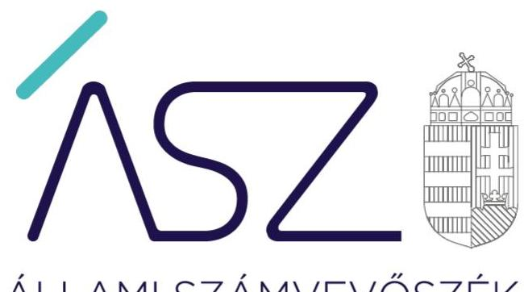
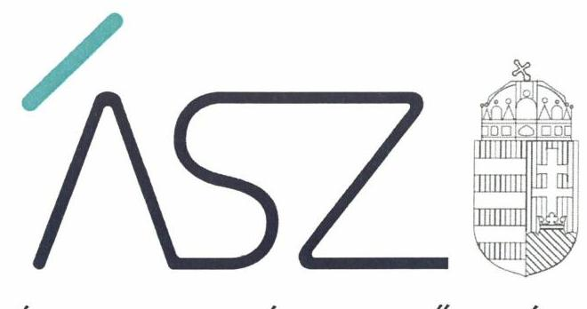
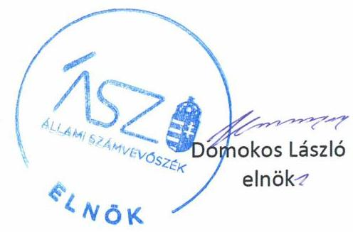
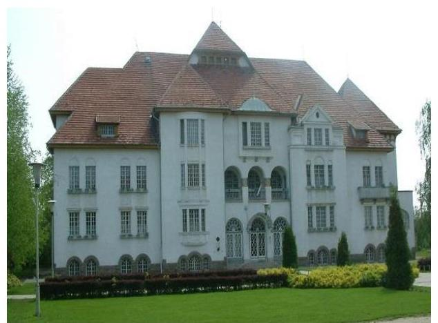
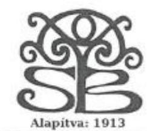
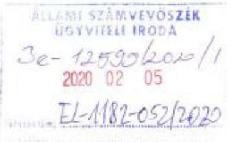
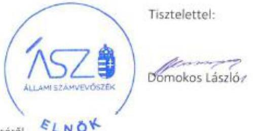

ÁLLAMI SZÁMVEVŐSZÉK

# JELENTÉS 

## Központi költségvetési szervek ellenőrzése

Serényi Béla Mezőgazdasági Szakgimnázium és Szakközépiskola
2020.

20043
www.asz.hu

---

ÁLLAMI SZÁMVEVŐSZÉK

# JELENTÉS 

## Központi költségvetési szervek ellenőrzése

Serényi Béla Mezőgazdasági Szakgimnázium és Szakközépiskola
2020. 04. hó 21. nap

20043
www.asz.hu

---

# AZ ELLENŐRZÉST FELÜGYELTE: 

KLINGA LÁSZLÓ felügyeleti vezető

## AZ ELLENŐRZÉST VEZETTE ÉS A VÉGREHAJTÁSÁÉRT FELELŐS:

NEMESVÁRI-HORTHY ESZTER ellenőrzésvezető

## A PROGRAM ÖSSZEÁLLÍTÁSÁÉRT FELELŐS:

TÓTPÁL SZABOLCS osztályvezető

IKTATÓSZÁM: EL2450-001/2020.
TÉMASZÁM: 2450
ELLENŐRZÉS-AZONOSÍTÓ SZÁM: V079168

Jelentéseink az Országgyülés számítógépes hálózatán és az interneten a www.asz.hu címen is olvashatóak.

---

# TARTALOMJEGYZÉK 

■ ÖSSZEGZÉS ..... 5
■ AZ ELLENŐRZÉS CÉLJA ..... 6
■ AZ ELLENŐRZÉS TERÜLETE ..... 7
■ AZ ELLENŐRZÉS HÁTTERE, INDOKOLTSÁGA ..... 8
■ A JELENTÉS LÉNYEGES KÉRDÉSKÖREI ..... 9
■ AZ ELLENŐRZÉS HATÓKÖRE ÉS MÓDSZEREI ..... 10
■ MEGÁLLAPÍTÁSOK ..... 12
■ JAVASLATOK ..... 15
■ MELLÉKLETEK ..... 17
I. sz. melléklet: Értelmező szótár ..... 17
■ FÜGGELÉK: ÉSZREVÉTELEK ..... 19
■ RÖVIDÍTÉSEK JEGYZÉKE ..... 23

---

.

---

# ÖSSZEGZÉS 

A Serényi Béla Mezőgazdasági Szakgimnázium és Szakközépiskola belső kontrollrendszere, pénzügyi és vagyongazdálkodása nem volt szabályszerű. Nem biztosította az átlátható és elszámoltatható közpénzfelhasználást. Az Intézmény nem volt védett a korrupciós kockázatokkal szemben.

## Az ellenőrzés társadalmi indokoltsága

Magyarország versenyképességének és a magyar gazdaság fejlődésének alapvető feltétele a magyar munkavállalók megfelelő szakmai képzettsége és felkészültsége, amelyben a szakképzési rendszernek döntő szerepe van. A mezőgazdaság vonatkozásában is kiemelten fontos ez, hiszen a magyar mezőgazdaság piaci versenyképességét és eredményességét nagymértékben befolyásolja az agrárszférában dolgozók képzettsége, felkészültsége. A szakképzés legjelentősebb színterei a szakképző iskolák. Az eredményes és célszerű szakképzés alapja és alapvető feltétele a szakképző intézmények közpénzekkel és a közvagyonnal való törvényes, átlátható és a korrupcióval szembeni védelmet biztosító működése és gazdálkodása. Ezért ezen szervezetekkel szemben is alapvető társadalmi igény, hogy a rájuk bízott közpénzekkel, közvagyonnal szabályosan gazdálkodjanak. Emellett a szakképzésben részt vevő pedagógusok, tanulók és a szülők jogos elvárása, hogy a szakképző iskolák működése átlátható és elszámoltatható legyen. Mindezen igényekkel összhangban, a közpénzügyek átláthatóságának előmozdítása, a közvagyon védelme érdekében került sor az agrárszakképző iskolák belső kontrollrendszerének és gazdálkodásának ellenőrzésére.

## Főbb megállapítások, következtetések, javaslatok

A Serényi Béla Mezőgazdasági Szakgimnázium és Szakközépiskola belső kontrollrendszere 2016. évben nem volt szabályszerű, mert szervezeti és működési szabályzatában nem határozta meg a vagyonnyilatkozat-tételre kötelezett személyek körét.

A 2017. évben a Serényi Béla Mezőgazdasági Szakgimnázium és Szakközépiskola kontrollkörnyezetének kialakítása nem volt szabályszerű, integrált kockázatkezelési rendszerét nem működtette. Az információs és kommunikációs rendszer nem működött, a monitoring rendszert nem alakították ki. A belső ellenőrzés nem volt szabályszerű. A fenti szabálytalanságok miatt a belső kontrollrendszer kialakítása és működtetése a 2017. évben sem volt szabályszerű.

A Serényi Béla Mezőgazdasági Szakgimnázium és Szakközépiskola pénzügyi gazdálkodása 2016. évben nem volt szabályszerű. A 2016-2017. évben a költségvetési beszámolói nem mutattak megbízható és valós összképet a vagyonáról, pénzügyi helyzetéről, mivel a költségvetési beszámoló mérlegtételei leltárral nem voltak alátámasztottak.

A korrupciós kockázatok kezelésére nem építették ki az integritást támogató és erősítő kontrollokat, kockázatelemzést nem végeztek.

Az Állami Számvevőszék a jelentésében foglalt megállapítások alapján a Serényi Béla Mezőgazdasági Szakgimnázium és Szakközépiskola igazgatója részére 14 javaslatot fogalmazott meg.

---

# AZ ELLENŐRZÉS CÉLJA 

AZ ELLENŐRZÉS CÉLJA annak megítélése volt, hogy a Serényi Béla Mezőgazdasági Szakgimnázium és Szakközépiskolára vonatkozó irányító szervi feladatellátás a jogszabályi előírások betartásával történt-e, a Serényi Béla Mezőgazdasági Szakgimnázium és Szakközépiskolánál a belső kontrollrendszer kialakítása és működtetése szabályszerű volt-e, biztosította-e az átlátható, szabályszerű, gazdaságos, hatékony és eredményes gazdálkodás feltételeit; a pénzügyi és vagyongazdálkodása megfelelt-e a jogszabályi előírásoknak és belső szabályzatainak. Az ellenőrzés célja volt annak megállapítása is, hogy a Serényi Béla Mezőgazdasági Szakgimnázium és Szakközépiskola megfelelt-e annak az Alaptörvényben meghatározott alapvetésnek, hogy Magyarország a kiegyensúlyozott, átlátható és fenntartható költségvetési gazdálkodás elvét érvényesíti; érvényesült-e a nemzeti vagyon kezelésének és védelmének célja, azaz a vagyona a közérdeket szolgálta-e a közös szükségletek kielégítése és a természeti erőforrások megóvása, valamint a jövő nemzedékek szükségleteinek figyelembevétele mellett. Az ellenőrzés keretében az Állami Számvevőszék értékelte a Serényi Béla Mezőgazdasági Szakgimnázium és Szakközépiskolánál a korrupciós kockázatok kezelését szolgáló integritás kontrollok kiépítettségét és az integritás szemlélet érvényesülését, továbbá a teljesítményellenőrzés feltételeinek kialakítását.

---

# **AZ ELLENŐRZÉS TERÜLETE**

## **Serényi Béla Mezőgazdasági Szakgimnázium és Szakközépiskola**

A putnoki székhelyű Intézmény1 jogi személy, irányító szerve és fenntartója 2013. augusztus 1-jétől a Minisztérium2.

Alaptevékenysége a szakközépiskolai nevelés-oktatás, felnőttoktatás, a többi tanulóval együtt nevelhető, oktatható sajátos nevelési igényű tanulók, a beilleszkedési, tanulási, magatartási nehézségekkel küzdő gyermekek, tanulók iskolai nevelése, oktatása, valamint a 2016. szeptember 1. előtt megkezdett tanulmányok tekintetében a szakiskolai nevelés-oktatás, amely 2016. szeptember 1-ét követően kiegészült a szakgimnáziumi nevelés-oktatással.

Az Intézmény az ellenőrzött időszakban mezőgazdaság, élelmiszeripar valamint rendészet, honvédelem és közszolgálat szakmacsoportokban nyújtott képzési lehetőséget. A tanulói létszám a 2017/2018. tanévben a beiskolázáskor 300 fő volt.

Az Áht.3 szerinti átalakítására az ellenőrzött időszakban nem került sor.

Az Intézmény gazdasági szervezettel nem rendelkezik, gazdasági feladatait az Agrárminisztérium döntése alapján a Vay Ádám Gimnázium, Mezőgazdasági Szakképző Iskola és Kollégium látta el.

A 2016-2017. években az Igazgató4 személyében nem történt változás.

Az Intézmény költségvetési bevétele a 2016. évben 56,3 millió Ft, 2017. évben 50,0 millió Ft volt. A finanszírozási bevétel 2016. évben 125,5 millió Ft, 2017. évben 175,6 millió Ft volt. A 2017. évben vagyonértékesítésből nem volt bevétele. A költségvetési kiadásai a 2016. évi 180,3 millió Ft-ról, 19,1%-os növekedéssel 2017. évben 214,6 millió Ft-ra emelkedtek.

---

# AZ ELLENŐRZÉS HÁTTERE, INDOKOLTSÁGA 

Az államháztartás központi alrendszerének közpénz felhasználása, az intézmények által ellátott közfeladatok sokrétűsége, valamint a feladatellátásához rendelt vagyon nagyságrendje indokolja, hogy az ÁSZ ${ }^{5}$ ellenőrzéseket folytasson a pénzügyi és vagyongazdálkodás területén. Az ÁSZ az ellenőrzései során feltárja a gazdálkodást, a központi alrendszer intézményei átalakulását, átszervezését érintő szabályozások esetleges hiányosságait, a szabályozással nem érintett gazdálkodási területeket, rámutathat a vagyongazdálkodási tevékenység - ezen belül a tulajdonosi joggyakorlás és vagyonkezelés - esetleges szabálytalanságaira, értékeli az állami vagyon nyilvántartására és elszámolására vonatkozó eljárásokat.

A belső kontrollrendszer kialakítása és működtetése nélkül nem valósítható meg a közpénzek, a közvagyon átlátható, szabályos, gazdaságos, hatékony és eredményes felhasználása. A belső kontrollrendszer azt a célt szolgálja, hogy a költségvetési szervek működésük és gazdálkodásuk során a tevékenységeket szabályszerűen hajtsák végre, teljesítsék elszámolási kötelezettségeiket és megvédjék az erőforrásokat a veszteségektől, a károktól és a nem rendeltetésszerű használattól. A belső kontrollrendszer magában foglalja mindazon elveket, eljárásokat és belső szabályzatokat, melyek biztosítják, hogy a költségvetési szerv valamennyi tevékenysége és célja összhangban legyen a szabályszerűséggel, szabályozottsággal, valamint a gazdaságosság, hatékonyság és eredményesség követelményeivel, az eszközökkel és forrásokkal való gazdálkodásban ne kerüljön sor pazarlásra, visszaélésre, rendeltetésellenes felhasználásra. Megfelelő, pontos és naprakész információk álljanak rendelkezésre a költségvetési szerv működésével kapcsolatosan, és a belső kontrollrendszer harmonizációjára, összehangolására vonatkozó jogszabályok végrehajtásra kerüljenek. Az integritás kontrollok kiépítése, erősítése a szervezet korrupciós kockázatainak kezelését szolgálja. A teljesítménykövetelmények meghatározása és működtetése megalapozhatja a központi költségvetési szervnél a teljesítményellenőrzés lefolytatását.

Az egyes ellenőrzések megállapításaival és egy időszak ellenőrzési eredményeinek elemzésével az ÁSZ ráirányíthatja a jogalkotók figyelmét a központi alrendszerben vagy annak egy ágazatában esetlegesen felmerülő pénzügyi, szabályozási feszültségekre. Az elvégzett ellenőrzések során az ÁSZ „jó gyakorlatokat" is azonosíthat, melyeket tanácsadó funkciója keretében szélesebb körben is megismertethet az érintettekkel, ezáltal is hozzájárulva a költségvetési rendszer szabályozott, átlátható, kiegyensúlyozott és fenntartható működéséhez.

---

# A JELENTÉS LÉNYEGES KÉRDÉSKÖREI 

1. Szabályszerű volt-e az ellenőrzött központi költségvetési szervre vonatkozó irányító szervi feladatellátás?
2. A belső kontrollrendszer kialakítása és működtetése szabályszerű volt-e?
3. A központi költségvetési szerv pénzügyi gazdálkodása szabályszerű volt-e?
4. A központi költségvetési szerv vagyongazdálkodása szabályszerű volt-e?

---

# AZ ELLENŐRZÉS HATÓKÖRE ÉS MÓDSZEREI 

## Az ellenőrzés típusa

Megfelelőségi ellenőrzés.

## Az ellenőrzött időszak

2016-2017. évek

## Az ellenőrzés tárgya

A Serényi Béla Mezőgazdasági Szakgimnázium és Szakközépiskolára vonatkozó irányító szervi feladatok ellátása a 2016. évben.

A Serényi Béla Mezőgazdasági Szakgimnázium és Szakközépiskola belső kontrollrendszerének a kialakítása és működtetése, valamint vagyongazdálkodása tekintetében 2016-2017. évek, a pénzügyi gazdálkodás tekintetében a 2016. évben, az integritáskontrollok kiépítettsége és a teljesítményellenőrzés feltételei a 2017. évben.

## Az ellenőrzött szervezet

Serényi Béla Mezőgazdasági Szakgimnázium és Szakközépiskola, a gazdasági szervezet feladatait ellátó Vay Ádám Gimnázium, Mezőgazdasági Szakképző Iskola és Kollégium, valamint az irányító szervi feladatellátás tekintetében a Földművelésügyi Minisztérium (2018. május 18-tól Agrárminisztérium).

## Az ellenőrzés jogalapja

Az ellenőrzés jogszabályi alapját az ÁSZ tv. ${ }^{6}$ 1. § (3) bekezdése, 5. § (2)-(3) bekezdései, a (4) bekezdés a) pontja és (6) bekezdése, valamint az Áht. 61. § (2) bekezdésének előírásai képezték.

## Az ellenőrzés módszerei

Az ellenőrzésre a szakmai program szempontjai, az ellenőrzött időszakban hatályos jogszabályok, az ellenőrzés szakmai szabályai, a jelen ellenőrzésre irányadó ÁSZ módszertanok figyelembevételével került sor.

Az ÁSZ az ellenőrzés ideje alatt az ellenőrzött szervezetekkel az ÁSZ SZMSZ ${ }^{7}$-ének vonatkozó előírásai alapján biztosította a kapcsolattartást. Az

---

ellenőrzési kérdések megválaszolásához szükséges bizonyítékok megszerzése az ellenőrzött szervezetek által rendelkezésre bocsátott dokumentumokra, adatokra alapozva megfigyelés, szemle (szemrevételezés), kérdésfeltevés (információkérés), mintavételezés, valamint elemző eljárás útján történt. Az ellenőrzési bizonyítékként felhasználható adatforrások közé tartoztak egyrészt a szakmai program részletes szempontjainál felsorolt adatforrások, másrészt minden egyéb - az ellenőrzés folyamán feltárt, az ellenőrzés szempontjából információt tartalmazó - dokumentum.

Az ellenőrzés lefolytatásához az ellenőrzött szervezetek az ÁSZ által kért tanúsítványok kitöltésével és dokumentumok megküldésével szolgáltattak adatot, amelyek valódiságát és teljes körűségét az ellenőrzött szervezet vezetője által tett teljességi és hitelességi nyilatkozat igazolta. Az így rendelkezésre bocsátott adatok, információk kontrollja az ellenőrzés keretében történt.

Az Intézmény belső kontrollrendszere egyes pilléreinek kialakítására és működtetésére vonatkozó értékelés „szabályszerű", amennyiben az értékelt területen az elért „igen" válaszok százalékban kifejezett, egész számra kerekített aránya legalább 85\%, „nem szabályszerű", ha nem éri el a 85\%ot. Az Intézmény belső kontrollrendszerének összesített értékelése az egyes részterületek esetében kapott megfelelőségi arányok számtani átlaga alapján történt és megegyezik a pillérenként (kontrollterületenként) alkalmazott százalékos értékelésekkel, a következő eltérésekkel: a kontrollrendszer egésze esetében a „szabályszerű" értékelésnek a százalékos értéken felül további feltétele, hogy egyik kontrollterület sem kaphat „nem szabályszerű" értékelést.

Az ÁSZ statisztikai módszereken alapuló mintavételt alkalmazott.
A kiadások és a bevételek ellenőrzésére a 2016-2017 év vonatkozásában került sor. A kiadások (külső személyi juttatások, felhalmozási kiadások, dologi kiadások) esetében az ellenőrzés azokra a legnagyobb értékű tételekre - a lényeges sokaságra - terjedt ki, melyek összértéke eléri a teljes sokaság összértékének 50\%-át. A 2016. évi bevételek esetében a lényeges sokaságot tételesen ellenőrizte az ÁSZ. A 2016-2017. évi kiadások elszámolásának szabályszerűsége a lényeges sokaságból véletlen mintavételi eljárással kiválasztott tételek alapján került ellenőrzésre.

A 2017. évi pénzmozgáshoz nem kapcsolódó vagyonváltozásoknak, a beruházások, felújítások végrehajtásának, valamint a feladatellátást szolgáló állami vagyontárgyak év végi értékelésének szabályszerűsége esetében tételes ellenőrzésre került sor. A 2017. évi feladatellátást szolgáló állami vagyontárgyak
 használatának szabályszerűségét a teljes sokaságból véletlen mintavétellel kiválasztott tételek alapján ellenőrizte az ÁSZ.

A mintavétellel ellenőrzött területek esetében minden egyes tétel vonatkozásában a használat és elszámolás szabályszerűségére vonatkozó kérdéseket tett fel az ÁSZ. Szabályszerűnek minősült egy ellenőrzött terület, amennyiben 95%-os bizonyossággal az ellenőrzött sokaságban az átlagos hibaarány legfeljebb 10%, nem szabályszerűnek, amennyiben 10%-nál magasabb arányt képviselt.

---

# 1. Szabályszerű volt-e az ellenőrzött központi költségvetési szervre vonatkozó irányító szervi feladatellátás? 

Összegző megállapítás Az Intézményre vonatkozó irányító szervi feladatellátás 2016. évben szabályszerű volt.

Az Irányító szerv ${ }^{8}$ az Ávr. ${ }^{9}$ előírásai szerint meghatározta az általános és kötelezően érvényesítendő tervezési követelményeket, előfeltételeket, módszertant, előírásokat.

Az Irányító szerv az Áht. és az Áhsz. ${ }^{10}$ előírásai alapján jóváhagyta az Intézmény elemi költségvetését és éves költségvetési beszámolóját. Az Áht. előírásai alapján az Igazgatót beszámoltatta az Intézmény gazdálkodásáról és a szakmai feladatellátásáról.

## 2. A belső kontrollrendszer kialakítása és működtetése szabályszerű volt-e?

## Összegző megállapítás

A belső kontrollrendszer kialakítása és működtetése nem volt szabályszerű 2016-2017. években.

A BELSŐ KONTROLLRENDSZER KIALAKÍTÁSA ÉS MŰKÖDTETÉSE 2016. ÉVBEN nem volt szabályszerű, mivel az Intézmény az SZMSZ ${ }^{11}$-ében - a Vnytv. ${ }^{12}$ 4. § a) pontjában foglalt előírás ellenére - nem határozta meg a vagyonnyilatkozat-tételre kötelezett személyek körét.

A BELSŐ KONTROLLRENDSZER KIALAKÍTÁSA ÉS MŰKÖDTETÉSE 2017. ÉVBEN nem volt szabályszerű.

A KONTROLLKÖRNYEZET kialakítása 2017. évben nem volt szabályszerű.

Az Intézmény SZMSZ-ében - a Vnytv. 4. § a) pontjában foglalt előírás ellenére - nem határozta meg a vagyonnyilatkozat-tételre kötelezett személyek körét.

Az Igazgató - a Bkr. ${ }^{13}$ 6. § (4) bekezdése előírása ellenére - nem szabályozta a szervezeti integritást sértő események kezelésének eljárásrendjét.

Az Intézmény a Számv. tv. előírásainak eleget téve rendelkezett számviteli politiká${ }_{1,2}{ }^{14}$-val és az annak keretében elkészített szabályzatokkal. Az Igazgató a számviteli politikában - az Áhsz. 50. § (7) bekezdése előírása ellenére - nem rögzítette az általános költségek, valamint az általános kiadások tevékenységekre történő felosztásának módját, a felosztáshoz alkalmazott mutatókat, vetítési alapokat.

---

# AZ INTEGRÁLT KOCKÁZATKEZELÉSI RENDSZERT az Igazgató - a Bkr. 7. § (1) és (2) bekezdése előírása ellenére - nem működtette 2017. évben. Az Igazgató - a Bkr. 7. § (4) bekezdése ellenére - az integrált kockázatkezelési rendszer koordinálására szervezeti felelőst nem jelölt ki. 

## A KONTROLLTEVÉKENYSÉGEK GYAKORLÁSA

2017. évben nem volt szabályszerű. Az Intézmény - az Ávr. 60. § (3) bekezdése előírása ellenére - a kötelezettségvállalásra, pénzügyi ellenjegyzésre, teljesítés igazolására, érvényesítésre, utalványozásra jogosult személyekről és aláírás-mintájukról nem vezetett naprakész nyilvántartást. A számviteli (könyvviteli) nyilvántartásokba - a Számv. tv. 165. § (2) bekezdése előírása ellenére - szabályszerűen kiállított bizonylat nélkül jegyeztek be adatokat.

## AZ INFORMÁCIÓS ÉS KOMMUNIKÁCIÓS RENDSZER nem volt szabályszerű 2017. évben. Az Igazgató kialakította, de a Bkr. 3. § (d) pontja ellenére nem működtette az információs és kommunikációs rendszert, mivel - a Bkr. 9. (1) bekezdése ellenére - nem biztosította, hogy a megfelelő információk a megfelelő időben eljussanak az illetékes szervezethez, szervezeti egységhez, illetve személyhez. A 2017. évben az Igazgató január-november hónapokra az időközi költségvetési jelentésre, az I-IV. negyedévre az időközi mérlegjelentésre vonatkozó adatszolgáltatási kötelezettségét az Ávr. 169. § (2) és 170. § (2) bekezdése előírásai ellenére a Kincstár ${ }^{15}$ által működtetett elektronikus adatszolgáltatási rendszerbe nem teljesítette. Az Igazgató a Kincstár felé a tartozásállományra vonatkozó adatszolgáltatási kötelezettségét - az Ávr. 167/M. § (1) bekezdése és az 5. melléklet 4. pontjában foglalt előírás ellenére - január-november hónapokra nem teljesítette.

A MONITORING RENDSZER kialakításáról a 2017. évben az Igazgató a Bkr. 3. § e) pontjában előírtak ellenére nem gondoskodott.

A BELSŐ ELLENŐRZÉS kialakítása nem volt szabályszerű. Az Igazgató a 2017. évben az Áht. 70. § (1) bekezdésében foglaltakat megsértve - a Bkr. 15. § (4) bekezdése ellenére - az Irányító szerv vezetőjének írásos jóváhagyása nélkül kötött szerződést a belső ellenőrzési feladatok ellátására a polgári jogviszony keretében foglalkoztatott belső ellenőrrel.

Az Igazgató a Bkr. 11 § (1) bekezdésében foglaltak ellenére nem a Bkr. 1. melléklet szerinti nyilatkozatban értékelte a belső kontrollrendszerének minőségét, mivel nyilatkozatában a szervezeti kultúra kialakítását - amely biztosítja az elkötelezettséget a szervezeti célok és értékek iránt, valamint alkalmas az integritás érvényesítésének biztosítására - nem értékelte. Az ÁSZ ellenőrzés megállapításai nem igazolták a nyilatkozatában foglaltakat.

Az Intézmény nem építette ki az integritást támogató és integritást erősítő kontrollokat, kockázatelemzést nem végzett.

Az Igazgató nem képzett a szervezeti célok eléréséhez szükséges feladatok és folyamatok mérésére szolgáló indikátorokat, mérőszámokat, feladat és teljesítménymutatókat, így nem biztosította a teljesítménymérés feltételeit.

---

# 3. A központi költségvetési szerv pénzügyi gazdálkodása szabályszerű volt-e? 

Összegző megállapítás Az Intézmény pénzügyi gazdálkodása 2016. évben nem volt szabályszerű.

Az Intézmény pénzügyi gazdálkodása nem volt szabályszerű 2016. évben, mert a kötelezettségvállalásokról és más fizetési kötelezettségekről - az Áhsz. 39. § (3) bekezdése előírása ellenére - a 14. melléklet II. pontjában foglalt tartalommal nem vezették a nyilvántartást.

## 4. A központi költségvetési szerv vagyongazdálkodása szabályszerű volt-e?

## Összegző megállapítás Az Intézmény vagyongazdálkodása nem volt szabályszerű 2016-2017. években.

Az Intézmény - az Áhsz. 5. § (1), 22. § (1)-(2) bekezdései, valamint a Számv. tv. 69. § (1) bekezdése előírása ellenére - a 2016. és 2017. évi éves költségvetési beszámolói mérleg tételeit nem támasztotta alá leltárral.

---

# JAVASLATOK 

Az ÁSZ tv. 33. § (1) bekezdésében foglaltak értelmében az ellenőrzött szervezet vezetője köteles a jelentésben foglalt megállapításokhoz kapcsolódó intézkedési tervet összeállítani és azt a jelentés kézhezvételétől számított 30 napon belül az ÁSZ részére megküldeni. Amennyiben az ellenőrzött szervezet vezetője nem küldi meg határidőben az intézkedési tervet, vagy továbbra sem elfogadható intézkedési tervet küld, az Állami Számvevőszék elnöke az ÁSZ tv. 33. § (3) bekezdése a) és b) pontjaiban foglaltakat érvényesítheti.

## a Serényi Béla Mezőgazdasági Szakgimnázium és Szakközépiskola igazgatójának

1. Intézkedjen a Vnytv. előírásainak megfelelően a vagyonnyilatkozat-tételre kötelezett személyek körének szervezeti és működési szabályzatban történő meghatározásáról.
(2. sz. megállapítás 4. bekezdése alapján)
2. Intézkedjen a Bkr. előírásainak megfelelően a szervezeti integritást sértő események kezelése eljárásrendjének szabályozásáról.
(2. sz. megállapítás 5. bekezdése alapján)
3. Intézkedjen az Áhsz. előírásainak megfelelően az általános költségek, és általános kiadások tevékenységekre történő felosztása módjának, a felosztáshoz alkalmazott mutatóknak és vetítési alapoknak a számviteli politikában történő rögzítéséről.
(2. sz. megállapítás 6. bekezdés 2. mondata alapján)
4. Intézkedjen a Bkr. előírásainak megfelelő integrált kockázatkezelési rendszer működtetéséről.
(2. sz. megállapítás 7. bekezdés 1. mondata alapján)
5. Intézkedjen a Bkr. előírásainak megfelelően szervezeti felelős kijelöléséről az integrált kockázatkezelési rendszer koordinálására.
(2. sz. megállapítás 7. bekezdés 2. mondata alapján)
6. Intézkedjen az Ávr. előírásainak megfelelő, naprakész nyilvántartás vezetéséről a kötelezettségvállalásra, pénzügyi ellenjegyzésre, teljesítés igazolására, érvényesítésre, utalványozásra jogosult személyekről és aláírás mintájukról.
(2. sz. megállapítás 8. bekezdés 2. mondata alapján)

---

7. Intézkedjen a Számv. tv. előírásainak megfelelően, hogy a számviteli (könyvviteli) nyilvántartásokba csak szabályszerűen kiállított bizonylat alapján jegyezzenek be adatokat.
(2. sz. megállapítás 8. bekezdés 3. mondata alapján)
8. Intézkedjen az információs és kommunikációs rendszer Bkr. előírásai szerinti működtetéséről.
(2. sz. megállapítás 9. bekezdése 2. mondata alapján)
9. Intézkedjen a Kincstár felé fennálló időközi költségvetési és mérlegjelentésre, tartozásállományra vonatkozó adatszolgáltatási kötelezettség Ávr. szerinti teljesítéséről.
(2. sz. megállapítás 9. bekezdés 3-4. mondata alapján)
10. Intézkedjen a Bkr. előírásainak megfelelő monitoring rendszer kialakításáról.
(2. sz. megállapítás 10. bekezdése alapján)
11. Intézkedjen a belső ellenőrzés kialakításáról és szabályszerű működtetéséről az Áht. és a Bkr. előírásai szerint.
(2. sz. megállapítás 11. bekezdése alapján)
12. Intézkedjen a belső kontrollrendszer minőségének Bkr. előírásai szerinti nyilatkozatban történő értékeléséről.
(2. sz. megállapítás 12. bekezdés 1. mondata alapján)
13. Intézkedjen, hogy a kötelezettségvállalásokról és más fizetési kötelezettségekről vezetett nyilvántartás megfeleljen az Áhsz. előírásainak.
(3. sz. megállapítás alapján)
14. Intézkedjen a jogszabályi előírásoknak megfelelően a költségvetési beszámoló mérleg tételeinek leltárral történő alátámasztásáról.
(4. sz. megállapítás alapján)

---

# MELLÉKLETEK 

- I. SZ. MELLÉKLET: ÉRTELMEZŐ SZÓTÁR
állami vagyon
állami vagyonnak minősül:
a) az állam tulajdonában lévő dolog, valamint a dolog módjára hasznosítható természeti erő,
b) az a) pont hatálya alá nem tartozó mindazon vagyon, amely vonatkozásában törvény az állam kizárólagos tulajdonjogát nevesíti,
c) az állam tulajdonában lévő tagsági jogviszonyt megtestesítő értékpapír, illetve az államot megillető egyéb társasági részesedés,
d) az államot megillető olyan immateriális, vagyoni értékkel rendelkező jogosultság, amelyet jogszabály vagyoni értékű jogként nevesít.
(Forrás: Vtv. ${ }^{16}$ 1. § (2) bekezdése)
állami vagyon kezelője /vagyonkezelő
átalakítás
belső ellenőrzés
belső kontrollrendszer
belső kontrollrendszer területei
fenntartó
hasznosítás
információs és kommunikációs rendszer

Állami vagyonnak minősül:
a) az állam tulajdonában lévő dolog, valamint a dolog módjára hasznosítható természeti erő,
b) az a) pont hatálya alá nem tartozó mindazon vagyon, amely vonatkozásában törvény az állam kizárólagos tulajdonjogát nevesíti,
c) az állam tulajdonában lévő tagsági jogviszonyt megtestesítő értékpapír, illetve az államot megillető egyéb társasági részesedés,
d) az államot megillető olyan immateriális, vagyoni értékkel rendelkező jogosultság, amelyet jogszabály vagyoni értékű jogként nevesít.
(Forrás: Vtv. ${ }^{16}$ 1. § (2) bekezdése)
Az állami vagyont az MNV Zrt. ${ }^{17}$ - maga kezeli, vagy szerződés - így különösen bérlet, haszonbérlet, megbízás - alapján központi költségvetési szervnek, természetes vagy jogi személynek, vagy jogi személyiséggel nem rendelkező gazdálkodó szervezetnek hasznosításra átengedi." Az állami vagyonra vonatkozóan az MNV Zrt. kizárólag az Nvtv-ben meghatározott személyekkel köthet vagyonkezelési szerződést. (Forrás: Vtv. 27. § (1) bekezdése, hatályos 2012. január 1-jétől)
A költségvetési szerv általános jogutódlással történő megszüntetése átalakítással történhet. Az átalakítás lehet egyesítés vagy különválás. Az egyesítés lehet beolvadás vagy összeolvadás. (Áht. 11. § (2) bekezdés)
Független, tárgyilagos bizonyosságot adó és tanácsadó tevékenység, amelynek célja, hogy az ellenőrzött szervezet működését fejlessze és eredményességét növelje, az ellenőrzött szervezet céljai elérése érdekében rendszerszemléletű megközelítéssel és módszeresen értékeli, illetve fejleszti az ellenőrzött szervezet irányítási és belső kontrollrendszerének hatékonyságát. (Forrás: Bkr. 2. § b) pontja)
A belső kontrollrendszer a kockázatok kezelése és tárgyilagos bizonyosság megszerzése érdekében kialakított folyamatrendszer, amely azt a célt szolgálja, hogy a működés és gazdálkodás során a tevékenységeket szabályszerűen, gazdaságosan, hatékonyan, eredményesen hajtsák végre, az elszámolási kötelezettségeket teljesítsék, megvédjék az erőforrásokat a veszteségektől, károktól és nem rendeltetésszerű használattól. (Forrás: Áht. 69. § (1) bekezdése)
A kontrollkörnyezet, a kockázatkezelési rendszer, a kontrolltevékenységek, az információs és kommunikációs rendszer, valamint a nyomon követési (monitoring) rendszer. (Forrás: Bkr. 3. §-a)
Az a természetes vagy jogi személy, aki vagy amely a köznevelési feladat ellátására való jogosultságot megszerezte vagy azzal rendelkezik, és a köznevelési intézmény működéséhez szükséges feltételekről gondoskodik. (Forrás: Köznev. tv. ${ }^{18}$ 4. § 9. pont)
A nemzeti vagyon birtoklásának, használatának, hasznok szedése jogának bármely a tulajdonjog átruházását nem eredményező - jogcímen történő átengedése, ide nem értve a vagyonkezelésbe adást, valamint a haszonélvezeti jog alapítását. (Forrás: Nvtv. ${ }^{19}$ 3. § (1) bekezdés 4.
 pontja)
A költségvetési szerv vezetője által kialakított és működtetett olyan rendszer, mely biztosítja, hogy a megfelelő információk a megfelelő időben eljutnak az illetékes szervezethez, szervezeti egységhez, illetve személyhez. (Forrás: Bkr. 9. § (1) bekezdés)

---

integritás
irányító szerv/felügyeleti szerv
kockázat
integrált kockázatkezelési rendszer
kontrollkörnyezet
kontrolltevékenységek
közfeladat
nyomon követési rendszer (monitoring)
vagyongazdálkodás

Az integritás - egyik gyakran használt jelentése szerint - az elvek, értékek, cselekvések, módszerek, intézkedések konzisztenciáját jelenti, vagyis olyan magatartásmódot, amely meghatározott értékeknek megfelel. Integritás-irányítási rendszer bevezetése a szervezetben a szervezethez rendelt közfeladatok integritás szempontú ellátását, az érték alapú működéssel (integritással) összefüggő szervezeti követelmények következetes érvényesítését jelenti. (Forrás: Nemzetgazdasági Minisztérium: Államháztartási Belső Kontroll Standardok és Gyakorlati Útmutató 1.6. Etikai értékek és integritás 46. oldal, 2017. szeptember)
A költségvetési szerv tekintetében az Áht.-ban meghatározott irányítási hatáskört gyakorló szerv. (Forrás: Áht. 1. § 9. pontja)
A kockázat annak a valószínűségét jelenti, hogy egy vagy több esemény vagy intézkedés nem kívánt módon befolyásolja a rendszer működését, céljainak megvalósulását. (Forrás: Javaslatok a korrupciós kockázatok kezelésére - Kockázatkezelési és ellenőrzési módszertan 35. oldal, ÁSZ)
Olyan folyamatalapú kockázatkezelési rendszer, amely a szervezet minden tevékenységére kiterjed, egységes módszertan és eljárások alkalmazásával, a szervezet célkitűzéseinek és értékeinek figyelembevételével biztosítja a szervezet kockázatainak teljes körű azonosítását, azok meghatározott kritériumok szerinti értékelését, valamint a kockázatok kezelésére vonatkozó intézkedési terv elkészítését és az abban foglaltak nyomon követését. (Forrás: Bkr. 2. § m) pontja, 2016. október 1-jétől)
A költségvetési szerv vezetője által kialakított olyan elvek, eljárások, belső szabályzatok összessége, amelyben világos a szervezeti struktúra, a folyamatok átláthatók, egyértelműek a felelősségi, hatásköri viszonyok és feladatok, meghatározottak, ismertek és elfogadottak az etikai elvárások a szervezet minden szintjén, átlátható a humánerőforrás-kezelés. (Forrás: Bkr. 6. § (1) bekezdés)
A költségvetési szerv vezetője által a szervezeten belül kialakított (kontroll) tevékenységek, melyek biztosítják a kockázatok kezelését, hozzájárulnak a szervezet céljainak eléréséhez és erősítik a szervezet integritását. (Forrás: Bkr. 8. § (1) bekezdés)
Jogszabályban meghatározott állami vagy önkormányzati feladat, amit az arra kötelezett közérdekből, a jogszabályban meghatározott követelményeknek és feltételeknek megfelelve végez, ideértve a lakosság közszolgáltatásokkal való ellátását, továbbá az állam nemzetközi szerződésekben vállalt kötelezettségeiből adódó közérdekű feladatokat, valamint e feladatok ellátásakor szükséges infrastruktúra biztosítását is. (Forrás: Nvtv. 3. § (1) bekezdés 7. pontja)
A költségvetési szerv vezetője köteles kialakítani a szervezet tevékenységének a célok megvalósításának nyomon követését biztosító rendszert, amely az operatív tevékenységek keretében megvalósuló folyamatos és eseti nyomon követésből, valamint az operatív tevékenységektől függetlenül működő belső ellenőrzésből áll. (Forrás: Bkr. 10. §)
A nemzeti vagyongazdálkodás feladata a nemzeti vagyon rendeltetésének megfelelő, az állam, az önkormányzat mindenkori teherbíró képességéhez igazodó, elsődlegesen a közfeladatok ellátásához és a mindenkori társadalmi szükségletek kielégítéséhez szükséges, egységes elveken alapuló, átlátható, hatékony és költségtakarékos működtetése, értékének megőrzése, állagának védelme, értéknövelő használata, hasznosítása, gyarapítása, továbbá az állam vagy a helyi önkormányzat feladatának ellátása szempontjából feleslegessé váló vagyontárgyak elidegenítése. (Forrás: Nvtv. 7. § (2) bekezdése)

---

# FÜGGELÉK: ÉSZREVÉTELEK 

A jelentéstervezetet a Számvevőszék 15 napos észrevételezésre megküldte az ellenőrzött szervezet vezetőjének az ÁSZ tv. 29. § (1) bekezdése előírásának megfelelően.

Az Intézmény vezetője élt az ÁSZ tv. 29. § (2) bekezdésében foglalt észrevételezési jogával, a jelentéstervezet megállapításaira a törvényes határidőn belül észrevételt tett. A függelék tartalmazza az ellenőrzött észrevételét, illetve az el nem fogadott észrevétel elutasításának indoklását.

[^0]
[^0]:    * 29. § (1) Az Állami Számvevőszék az ellenőrzési megállapításait megküldi az ellenőrzött szervezet vezetőjének vagy az általa megbízott személynek, és annak, akinek személyes felelősségét állapította meg.
    (2) Az ellenőrzött szervezet vezetője és a felelősként megjelölt személy az ellenőrzés megállapításaira tizenöt napon belül írásban észrevételt tehet.
    (3) Az Állami Számvevőszék az észrevételre a beérkezésétől számított harminc napon belül írásban válaszol. A figyelembe nem vett észrevételeket köteles a jelentésben feltüntetni, és megindokolni, hogy azokat miért nem fogadta el.

---

# Serényi Béla Mezőgazdasági Szakgimnázium és Szakközépiskola

3630 Putnok, Bajcsy-Zsilinszky út 31.
Öst. 436-48-430-035
Mobil: +36-70-489 1114
sbgmezk@serenyi.sulinet.hu
Főntartó: Agrárminisztérium

Ikt.sz.: serenyi/000041-2/2020

Állami Számvevőszék

Budapest
Pf.: 54.

1 3 6 4

Tárgy: Észrevétel

A Serényi Béla Mezőgazdasági Szakgimnázium és Szakközépiskola EL-1182-048/2020 iktató számú „Központi költségvetési szervek ellenőrzése” című számvevőszéki jelentéstervezetre az alábbi észrevételt teszem.

A jelentés tervezet függelékében felsorolt hiányosságok csak azért merültek fel az ellenőrzés során, mert az adatszolgáltatásra előírt határidőn belül (annak téves értelmezése miatt) nem kerültek felcsatolásra az elektronikus felületen a kért bizonylatok. Az Állami Számvevőszék részéről kért dokumentumok teljes körűen fellelhetők az intézményünkben, a könyvelés és a beszámoló az eredeti bizonylatok alapján történt.

Segítő együttműködésüket köszönöm.

Putnok, 2020. január 31.

Tisztelettel:

Magyar András
igazgató

---

ikt. szám: EL-1182-053/2020.

Magyar András úr
igazgató
Serényi Béla Mezőgazdasági Szakgimnázium és Szakközépiskola

Putnok

Tisztelt Igazgató Úr!

A „Központi költségvetési szervek ellenőrzése – Serényi Béla Mezőgazdasági Szakgimnázium és Szakközépiskola” címmel készített számvevőszéki jelentéstervezetre tett, serényi/000041-2/2020. iktatószámú levelében megküldött észrevételét köszönettel megkaptam.

Az Állami Számvevőszék észrevételekre vonatkozó álláspontjáról a felügyeleti vezető által készített részletes tájékoztatást csatoltan megküldöm.

Tájékoztatom Igazgató urat, hogy a számvevőszéki jelentésben – az Állami Számvevőszékről szóló 2011. évi LXVI. törvény 29. § (3) bekezdése alapján – a figyelembe nem vett észrevételeket szerepeltetjük az elutasítás indokának feltüntetésével.

Budapest, 2020. 61. hónap nap

Tisztelettel:

Domokos László

Melléklet: Tájékoztatás az észrevételek kezeléséről

---

Melléklet
az EL-1182-053/2020.
iktatószámú levélhez

# Tájékoztatás   az észrevételek kezeléséről 

A „Központi költségvetési szervek ellenőrzése - Serényi Béla Mezőgazdasági Szakgimnázium és Szakközépiskola" címú jelentéstervezetre (továbbiakban: jelentéstervezet) a Serényi Béla Mezőgazdasági Szakgimnázium és Szakközépiskola (továbbiakban: Intézmény) igazgatójának serenyi/000041-2/2020. iktatószámú levelében megküldött észrevételét áttekintettem. Az észrevétel kezeléséről az alábbi tájékoztatást adom.

## 1. A jelentéstervezet Függelékével kapcsolatos észrevétel:

Igazgató úr észrevételében leírta, hogy a jelentéstervezet I. Függelékében felsorolt hiányosságok az adatszolgáltatási határidőn belül fel nem csatolt bizonylatok miatt merültek fel. A bekért dokumentumok az Intézménynél teljes körűen fellelhetőek, a könyvelés és a beszámoló elkészítése az eredeti bizonylatok alapján történt.

Az észrevételt nem fogadjuk el. Az Állami Számvevőszék az ellenőrzési megállapításait az adatszolgáltatás során a részére törvényi határidőben rendelkezésre bocsátott dokumentumokra alapozva fogalmazza meg. Igazgató úr által aláírt teljességi és hitelességi nyilatkozatok szerint az Állami Számvevőszék részére átadott dokumentumok, adatok megbízhatóak, a bekért adatokra, dokumentumokra vonatkozóan teljes körű információt tartalmaznak. A jelentéstervezet módosítása az észrevétel alapján nem indokolt.

Budapest, 2020. 92 hó 16. nap

Klinga László
felügyeleti vezető

---

# RÖVIDÍTÉSEK JEGYZÉKE 

${ }^{1}$ Intézmény
${ }^{2}$ Minisztérium
${ }^{3}$ Áht.
${ }^{4}$ Igazgató
${ }^{5}$ ÁSZ
${ }^{6}$ ÁSZ tv.
${ }^{7}$ ÁSZ SZMSZ
${ }^{8}$ Irányító szerv
${ }^{9}$ Ávr.
${ }^{10}$ Áhsz.
${ }^{11}$ SZMSZ
${ }^{12}$ Vnytv.
${ }^{13}$ Bkr.
${ }^{14}$ Számviteli politika $_{1,2}$
${ }^{15}$ Kincstár
${ }^{16} \mathrm{Vtv}$.
${ }^{17}$ MNV Zrt.
${ }^{18}$ Köznev. tv.
${ }^{19} \mathrm{Nvtv}$.

Serényi Béla Mezőgazdasági Szakgimnázium és Szakközépiskola Földművelésügyi Minisztérium, 2018. május 18-tól Agrárminisztérium 2011. évi CXCV. törvény az államháztartásról (hatályos: 2012. január 1-jétől) Serényi Béla Mezőgazdasági Szakgimnázium és Szakközépiskola Igazgatója Állami Számvevőszék
2011. évi LXVI. törvény az Állami Számvevőszékről (hatályos: 2011. július 1-jétől) Állami Számvevőszék Szervezeti és Működési Szabályzata
Serényi Béla Mezőgazdasági Szakgimnázium és Szakközépiskola irányító szerve (Földművelésügyi Minisztérium, 2018. május 18-tól Agrárminisztérium) az államháztartásról szóló törvény végrehajtásáról szóló 368/2011. (XII. 31.) Korm. rendelet (hatályos: 2012. január 1-jétől) az államháztartás számviteléről szóló 4/2013. (I. 11.) Korm. rendelet (hatályos: 2014. január 1-jétől)
Serényi Béla Mezőgazdasági Szakgimnázium és Szakközépiskola Szervezeti és Működési Szabályzata (hatályos: 2015. augusztus 15-től)
2007. évi CLII. törvény egyes vagyonnyilatkozat-tételi kötelezettségről (hatályos: 2008. január 1-jétől)
a költségvetési szervek belső kontrollrendszeréről és belső ellenőrzésről szóló 370/2011. (XII. 31.) Korm. rendelet (hatályos: 2012. január 1-jétől) Serényi Béla Mezőgazdasági Szakgimnázium és Szakközépiskola számviteli politikája (hatályos: 2013. augusztus 1-jétől, 2017. szeptember 1-jétől) Magyar Államkincstár
2007. évi CVI. törvény az állami vagyonról (hatályos: 2007. szeptember 25-től) Magyar Nemzeti Vagyonkezelő Zrt.
2011. évi CXC. törvény a nemzeti köznevelésről
(hatályos: 2012. szeptember 1-jétől)
2011. évi CXCVI. törvény a nemzeti vagyonról (hatályos: 2012. január 1-jétől)

---

# ÁSZ 

ÁLLAMI SZÁMVEVŐSZÉK
1052 Budapest, Apáczai Cs. J. u. 10. I 1364 Budapest 4. Pf. 54 TEL: +36 14849100
email: szamvevoszek@asz.hu
web: www.asz.hu | www.aszhirportal.hu

