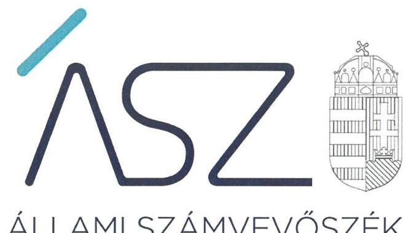
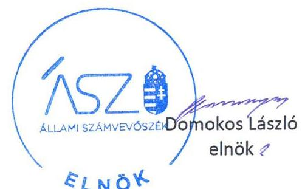
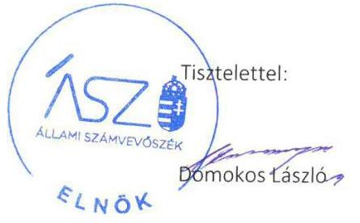

ÁLLAMI SZÁMVEVŐSZÉK

# JELENTÉS 

## Utóellenőrzések

Az állami tulajdonban lévő gazdálkodó szervezetek vagyonmegőrzési és gazdálkodási tevékenységének utóellenőrzése - Bay Zoltán Alkalmazott Kutatási Közhasznú Nonprofit Korlátolt Felelősségű Társaság

2020
20044
www.asz.hu

---

# JELENTÉS

## Utóellenőrzések

Az állami tulajdonban lévő gazdálkodó szervezetek vagyonmegőrzési és gazdálkodási tevékenységének utóellenőrzése – Bay Zoltán Alkalmazott Kutatási Közhasznú Nonprofit Korlátolt Felelősségű Társaság

2020. 03. hó 17. nap

20044
www.asz.hu

---

# AZ ELLENŐRZÉST FELÜGYELTE: 

MAROZSÁN LÁSZLÓNÉ felügyeleti vezető

## AZ ELLENŐRZÉST VEZETTE ÉS A VÉGREHAJTÁSÁÉRT FELELŐS:

DR. NAGY JUDIT ellenőrzésvezető

## A PROGRAM ÖSSZEÁLLÍTÁSÁÉRT FELELŐS:

TÓTPÁL SZABOLCS osztályvezető

## A TÉMÁHOZ KAPCSOLÓDÓ KORÁBBI SZÁMVEVŐSZÉKI JELENTÉSEK:

- címe: Az állami tulajdonban (résztulajdonban) lévő gazdálkodó szervezetek vagyonmegőrzési és gazdálkodási tevékenységének ellenőrzése - Bay Zoltán Közhasznú Nonprofit Kft.
- sorszáma: 16100

Jelentéseink az Országgyúlés számítógépes hálózatán és az interneten a www.asz.hu címen is olvashatóak.

IKTATÓSZÁM: EL-2454-001/2020.
TÉMASZÁM: 2460
ELLENŐRZÉS-AZONOSÍTÓ SZÁM: V080471

---

# TARTALOMJEGYZÉK 

■ ÖSSZEGZÉS ..... 5
■ AZ ELLENŐRZÉS CÉLJA ..... 6
■ AZ ELLENŐRZÉS TERÜLETE ..... 7
■ AZ ELLENŐRZÉS HÁTTERE, INDOKOLTSÁGA ..... 8
■ A JELENTÉS LÉNYEGES KÉRDÉSKÖRE ..... 9
■ AZ ELLENŐRZÉS HATÓKÖRE ÉS MÓDSZEREI ..... 10
■ MEGÁLLAPÍTÁSOK ..... 12
■ MELLÉKLETEK ..... 13
I. sz. melléklet: Bay Zoltán Alkalmazott Kutatási Közhasznú Nonprofit Kft. intézkedési terve végrehajtásának értékelése ..... 13
■ FÜGGELÉK: ÉSZREVÉTELEK ..... 15
■ RÖVIDÍTÉSEK JEGYZÉKE ..... 23

---

.

---

# ÖSSZEGZÉS 

Az Állami Számvevőszék a Bay Zoltán Alkalmazott Kutatási Közhasznú Nonprofit Korlátolt Felelősségű Társaság utóellenőrzése során megállapította, hogy az intézkedési tervben vállalt feladatok végrehajtása javította a szabályozottságot, azonban a közzétételi kötelezettségnek hiányos teljesitése miatt a gazdálkodásának átláthatósága kockázatot hordoz.

## Az ellenőrzés társadalmi indokoltsága

Az Állami Számvevőszék stratégiájában célul tűzte ki a számvevőszéki munka hasznosulásának javítását. Ezzel összhangban ellenőrzi, hogy az ellenőrzött szervezetek megvalósították-e a korábbi ellenőrzései által feltárt hibák, hiányosságok és szabálytalanságok megszüntetése céljából elkészített intézkedési tervekben foglaltakat. A rendszeres utóellenőrzések hozzájárulnak a szükséges intézkedések tényleges végrehajtáshoz, ezáltal a közpénzügyek rendezettségének javulásához.

## Főbb megállapítások, következtetések

A Bay Zoltán Alkalmazott Kutatási Közhasznú Nonprofit Korlátolt Felelősségű Társaság az Állami Számvevőszék intézkedést igénylő megállapításai alapján készített intézkedési tervében három intézkedést és azon belül összesen nyolc feladatot határozott meg, amelyből két feladatot határidőben, négyet határidőn túl, kettőt részben hajtott végre.

A Bay Zoltán Alkalmazott Kutatási Közhasznú Nonprofit Korlátolt Felelősségű Társaságnál a szabályozottság javítása érdekében hatályba helyezték a közérdekű adatok megismerésére irányuló igények teljesítésének rendjét rögzítő szabályzatokat. Ezért a szabályozottság területén a kockázat csökkent.

A Bay Zoltán Alkalmazott Kutatási Közhasznú Nonprofit Korlátolt Felelősségű Társaság az intézkedési tervben vállalt közzétételi kötelezettségének a foglalkoztatottak létszámára és személyi juttatásaira vonatkozó, negyedévente közzéteendő adatok, továbbá az EU támogatásával megvalósuló fejlesztésekre vonatkozó szerződések vonatkozásában nem tett eleget.

---

# AZ ELLENŐRZÉS CÉLJA 

Az ellenőrzés célja annak értékelése volt, hogy a számvevőszéki jelentésben ${ }^{1}$ foglalt, intézkedéseket igénylő megállapításokkal összhangban készített intézkedési tervben meghatározott feladatokat az ellenőrzött szervezet vég-rehajtotta-e.

---

# **AZ ELLENŐRZÉS TERÜLETE**

## **Bay Zoltán Alkalmazott Kutatási Közhasznú Nonprofit Kft.**

A Bay Zoltán Alkalmazott Kutatási Közhasznú Nonprofit Kft. a Magyar Állam 100%-os tulajdonában álló társaság, alapítását Korm. határozat2 rendelte el. Fő tevékenysége egyéb természettudományi műszaki kutatás, fejlesztés. Közhasznú tevékenységként végez tudományos tevékenységet, kutatást. A közhasznúsági fokozat, illetve jogállás megszerzésének időpontja: 2014. január 30.

A tulajdonosi jogokat 2016. szeptember 22-ig az NKFI Hivatal3, ezt követően 2018. augusztus 1-ig az MNV Zrt.4, 2018. augusztus 1-től az Innovációs és Technológiai Minisztérium gyakorolja. A Társaság5 a kormányzati szektorba sorolt egyéb szervezetnek minősül.

Az Ügyvezető6 személye az utóellenőrzéssel érintett időszakban nem változott.

Az ÁSZ7 a 2016. évben ellenőrizte a Társaság vagyonmegőrzési és gazdálkodási tevékenységét a 2011. január 1. és 2014. december 31. közötti időszakra vonatkozóan. Az ellenőrzés célja annak értékelése volt, hogy a Társaság által ellátott feladatok bevételei, ráfordításai elszámolásának és vagyongazdálkodási tevékenységének szabályozása megfelelte-e a jogszabályi előírásoknak, és azok végrehajtása szabályszerű volt-e; a vagyonváltozást eredményező döntések esetében a tulajdonosi jogok gyakorlója és a gazdálkodó szervezet szabályszerűen jártak-e el; a gazdálkodó szervezet épített-e ki és működtetett-e információs rendszert a szabályszerű vagyongazdálkodás érdekében. Az ellenőrzés célja volt továbbá annak értékelése is, hogy a kormányzati szektorba sorolt egyéb szervezetek gazdálkodásának a kormányzati szektor hiányára és az államadósságra befolyással bíró elemei a jogszabályi előírásoknak megfeleltek-e. Az erről szóló 16100 számú számvevőszéki jelentés8-t az ÁSZ 2016. július 13-án hozta nyilvánosságra.

Az utóellenőrzés a számvevőszéki jelentésben megfogalmazott intézkedést igénylő megállapításokra és javaslatokra készített intézkedési terv9-ben foglalt feladatok végrehajtásának ellenőrzésére, értékelésére irányult.

---

# AZ ELLENŐRZÉS HÁTTERE, INDOKOLTSÁGA 

Az ÁSZ tv. ${ }^{10}$ 33. § (1) bekezdése értelmében a számvevőszéki jelentések intézkedést igénylő megállapításaihoz és javaslataihoz kapcsolódóan az ellenőrzött szervezetek vezetője intézkedési tervet köteles összeállítani, és az Állami Számvevőszék részére megküldeni.

Az ÁSZ által befogadott intézkedési tervben foglaltak megvalósítását - az ÁSZ tv. 33. § (7) bekezdésében foglaltak alapján - az Állami Számvevőszék utóellenőrzés keretében ellenőrizheti. Az utóellenőrzések keretében - az intézkedések értékelése során - az Állami Számvevőszék figyelembe veszi az ellenőrzött szervezetek működési feltételeiben, valamint a jogszabályi előírásokban bekövetkezett változásokat.

Az utóellenőrzés során az ÁSZ értékeli, hogy az érintett számvevőszéki jelentésben foglalt megállapításokkal és javaslatokkal összhangban, az ellenőrzött szervezet által készített intézkedési tervben meghatározott feladatokat a feladatra kijelöltek végrehajtották-e.

Az intézkedések végrehajtásával az adott terület szabályszerű múködése vonatkozásában a kockázatok csökkenhetnek, azonban hosszabb távon az intézkedési tervben foglaltak végrehajtásával önmagában nem szűnnek meg, csak akkor, ha beépülnek az ellenőrzött szervezet működésébe, azokat folyamatosan karbantartják, figyelembe véve, illetve kezelve a változásokat. Emellett az intézkedések végrehajtásáig újabb kockázatok merülhetnek fel a szabályszerű működés vonatkozásában, amelyek kezelése szintén kiemelten fontos az ellenőrzött szervezet számára.

Az ellenőrzött szervezet vezetője által készített intézkedési tervekben foglalt feladatok hiányos, illetve késedelmes végrehajtása, vagy annak elmaradása a szabályszerűség és a felelős vezetői magatartás vonatkozásában kockázatot hordoz, ami azt mutatja, hogy az ellenőrzések során feltárt hibák, hiányosságok és szabálytalanságok kezelése nem kapott kellő hangsúlyt. Az utóellenőrzés során is fennálló szabálytalanságok esetén a közpénz, közvagyon veszélyeztetettségi kockázat valószínűsített hatásának értékelése további intézkedéseket vonhat maga után.

Az ellenőrzött szervezet szintjén az utóellenőrzés feltárja, hogy a szervezet az intézkedések végrehajtásával hasznosította-e a korábbi ellenőrzési jelentésben a hiányosságok megszüntetése, illetve a kockázatok kezelése érdekében megfogalmazott javaslatokat, illetve az intézkedések végrehajtása elmaradásának következtében továbbra is fennálló szabálytalanság esetén értékeli a közpénzek, közvagyon veszélyeztetettségét.

Az ÁSZ szintjén az utóellenőrzés visszacsatolást ad az ellenőrzési jelentések hasznosulásáról, az intézkedések elmaradásának, vagy részleges megvalósulásának a közpénzek, közvagyon veszélyeztetettségére gyakorolt valószínűsített hatásának értékelése, további intézkedéseket vonhat maga után.

---

# A JELENTÉS LÉNYEGES KÉRDÉSKÖRE 

Az ellenőrzött szervezet az intézkedési tervben foglaltakat az elöirt határidőben végrehajtotta-e?

---

# AZ ELLENŐRZÉS HATÓKÖRE ÉS MÓDSZEREI 

## Az ellenőrzés típusa

Megfelelőségi ellenőrzés.

## Az ellenőrzött időszak

Az utóellenőrzés alapját képező számvevőszéki jelentés közzétételének napjától az ellenőrzésről szóló kiértesítő levél keltének napjáig, azaz 2016. július 13-tól 2019. augusztus 10-ig tartó időszak.

## Az ellenőrzés tárgya

A számvevőszéki jelentésben foglalt megállapításokkal és javaslatokkal összhangban a Társaság által készített intézkedési tervben foglaltak végrehajtásának ellenőrzése.

## Az ellenőrzött szervezet

Bay Zoltán Alkalmazott Kutatási Közhasznú Nonprofit Kft.

## Az ellenőrzés jogalapja

Az ellenőrzés jogszabályi alapját az ÁSZ tv. 33. § (7) bekezdésének előírásai képezték.

## Az ellenőrzés módszerei

Az ÁSZ az ellenőrzést az ellenőrzött időszakban hatályos jogszabályok, az ellenőrzés szakmai szabályai, a jelen ellenőrzésre irányadó ÁSZ módszertanok, az ellenőrzési programban foglalt értékelési szempontok szerint végezte.

Az ÁSZ az ellenőrzés ideje alatt az ellenőrzött szervezettel történő kapcsolattartást az ÁSZ SZMSZ ${ }^{11}$-ének vonatkozó előírásai alapján biztosította.

Az utóellenőrzés megállapításait az ÁSZ rendelkezésére álló, valamint az ÁSZ adatbekérése szerint az ellenőrzött szervezet által rendelkezésre bocsátott dokumentumok alapozták meg.

Az ellenőrzési kérdések megválaszolásához szükséges bizonyítékok megszerzése az ellenőrzött által rendelkezésre bocsátott dokumentu-

---

mokra, adatokra alapozva megfigyelés. szemle (szemrevételezés), kérdésfeltevés (információkérés), valamint elemző eljárás alkalmazásával történt. Az ellenőrzési bizonyítékként felhasználható adatforrások közé tartoztak egyrészt az ellenőrzési program részletes szempontjainál felsorolt adatforrások, másrészt minden - az ellenőrzés folyamán feltárt, az ellenőrzés szempontjából információt tartalmazó - dokumentum.

Az intézkedési tervben előírt feladatokat azok végrehajthatósága, illetve végrehajtása szempontjából az alábbiak szerint értékelte az ÁSZ:
__ „határidőben végrehajtott" a feladat, ha a teljesítés dokumentáltan, az intézkedési tervben előírt határidőben és tartalommal megtörtént;
__ „határidőn túl végrehajtott" a feladat, ha annak teljesítése az intézkedési tervben meghatározott módon, de az előírt határidőn túl történt meg;
__ „részben végrehajtott" a feladat, ha végrehajtása teljes körűen az intézkedési tervben előírt módon nem történt meg;
__ „nem végrehajtott" a feladat, ha a végrehajtás nem történt meg, dokumentumokkal nem igazolt annak teljesítése;
__ „okafogyottá vált" a feladat, ha végrehajtására - meghatározott esemény bekövetkezése, továbbá külső körülmény, a működést érintő feltétel változása miatt - már nincs szükség, illetve lehetőség, és egyértelműen megállapítható, hogy az intézkedést szükségessé tevő körülmény a jövőben nem fordulhat elő;
__ „nem időszerü" az a feladat, amelynek ellenőrzési időszakon belüli végrehajtására azért nem került (kerülhetett) sor, mert az intézkedés alapjául szolgáló esemény nem következett be, de annak jövőbeni előfordulása lehetséges, a végrehajtása nem volt esedékes, vagy a végrehajtás határideje még nem járt le.
Az ellenőrzés lefolytatásához az ellenőrzött szervezet a tanúsítványok elektronikus kitöltésével, valamint az ÁSZ által kért dokumentumok elektronikus megküldésével szolgáltatott adatokat, amelyek valódiságát és teljes körűségét az ellenőrzött szervezet vezetője által tett teljességi és hitelességi nyilatkozat igazolta. Az így rendelkezésre bocsátott adatok, információk kontrollja az ellenőrzés keretében megtörtént.

---

# MEGÁLLAPÍTÁSOK 

## Az ellenőrzött szervezet az intézkedési tervben foglaltakat az előírt határidőben végrehajtotta-e?

Összegző megállapítás

A Társaság az intézkedési tervében meghatározott nyolc feladat közül kettőt határidőben, négyet határidőn túl, kettőt részben hajtott végre.

Az ÁSZ a 16100. számú jelentésében az Ügyvezető részére két javaslatot fogalmazott meg. A hiányosságok és szabálytalanságok megszüntetésére a Társaság ügyvezetője által készített intézkedési terv három pontjában meghatározott nyolc feladatot, azok végrehajtásának határidejét, a felelősöket és a feladatok végrehajtásának értékelését az 1. sz. melléklet mutatja be.

Az intézkedési tervben meghatározott feladatok végrehajtásának értékelési kategóriák szerinti megoszlását az 1. ábra szemlélteti.

1. ábra

Az intézkedési terv végrehajtásának értékelési kategóriák szerinti megoszlása

- Határidőben végrehajtott
- Határidőn túl végrehajtott
- Részben végrehajtott
$2 \mathrm{db} ; 25 \%$
$2 \mathrm{db} ; 25 \%$
- Részben végrehajtott
$4 \mathrm{db} ; 50 \%$

Forrás: ÁSZ adatok
A SZABÁLYOZOTTSÁG javítása érdekében az Ügyvezető gondoskodott a Közzétételi szabályzat ${ }^{12}$ és a Közérdekú adatkezelési szabályzat ${ }^{13}$ kiadásáról (1.-2. sorok az I. sz. mellékletben).

A TÁRSASÁG INTEGRITÁSA, a gazdálkodás nyilvánosságának biztosítása érdekében az Ügyvezető nem gondoskodott az EU támogatással megvalósuló fejlesztésekre vonatkozó szerződések, valamint a foglalkoztatottak létszámára és a személyi juttatásokra vonatkozó negyedéves adatok közzétételéről (3.e.-f. sorok az I. sz. mellékletben).

---

# MELLÉKLETEK

■ I. SZ. MELLÉKLET: BAY ZOLTÁN ALKALMAZOTT KUTATÁSI KÖZHASZNÚ NONPROFIT KFT. INTÉZKEDÉSI TERVE VÉGREHAJTÁSÁNAK ÉRTÉKELÉSE

|  5. | Az intézkedési tervben rögzített feladat | Az intézkedési tervben meghatározott határidő | Az intézkedési tervben meghatározott felelős | A feladat végrehajtása  |
| --- | --- | --- | --- | --- |
|  1. | Közzétételi szabályzat elkészítése és közzététele a társaság www.bayzoltan.hu hivatalos honlapján | Azonnal (2016. február 1vel kiadásra és közzétételre került a honlapon) | Ügyvezető | A Közzétételi szabályzat aláírásra került és 2016. február 1-én hatályba helyezték, közzététele a Társaság honlapja ${ }^{14}$-n megtörtént.  |
|  2. | Közérdekü adatkezelési szabályzat elkészítése és közzététele a társaság www.bayzoltan.hu hivatalos honlapján | Azonnal (2016. február 1vel kiadásra és közzétételre került a honlapon) | Ügyvezető | A Közérdekü Adatkezelési Szabályzat aláírásra került és 2016. február 1-én hatályba helyezték, közzététele a Társaság honlapján megtörtént.  |
|  3.a. | Hiányzó adatok közzététele:
- Szervezeti felépítés | Azonnal (Valamennyi hiányzó adat, információ a társaság honlapján közzétételre került 2016. március 1-vel) | Ügyvezető | A feladat határidőben történt végrehajtását nem igazolták, a Társaság honlapján a 2019. júliustól hatályba lépett szervezeti müködési szabályzat szerinti szervezeti felépítést közzé tették.  |
|  3.b. | Hiányzó adatok közzététele:
- SZMSZ | Azonnal (Valamennyi hiányzó adat, információ a társaság honlapján közzétételre került 2016. március 1-vel) | Ügyvezető | 2016. március 1-éig nem történt meg a hatályos SZMSZ közzététele, tekintettel arra, hogy a 2019. júliustól hatályba lépett szervezeti és müködési szabályzatát tette közzé a Társaság a honlapján.  |
|  3.c. | Hiányzó adatok közzététele:
- Adatvédelmi és adatbiztonsági szabályzat (informatikai szabályzat) | Azonnal (Valamennyi hiányzó adat, információ a társaság honlapján közzétételre került 2016. március 1-vel) | Ügyvezető | 2016. március 1-éig nem történt meg az adatvédelmi és adatbiztonsági szabályzat közzététele, tekintettel arra, hogy a 2018. május 25-én aláírt és hatályba lépett Adatkezelési szabályzat ${ }^{15}$-át tette közzé a Társaság a honlapján.  |
|  3.d. | Hiányzó adatok közzététele: | Azonnal (Valamennyi hiányzó adat, információ a társaság honlapján közzétételre került 2016. március 1-vel) | Ügyvezető | Az FB, a vezető tisztségviselők, a vezető állású munkavállalók, az együttes cégjegyzésre jogosultak és a bankszámla feletti együttes rendelkezésre jogosultak adatai közzététele a Társaság honlapján határ-  |

---

|  Az intézkedési tervben rögzített feladat | Az intézkedési tervben meghatározott határidő | Az intézkedési tervben meghatározott felelős | A feladat végrehajtása  |
| --- | --- | --- | --- |
|  - FB, vezető tisztségviselők, vezető állású munkavállalók, az együttes cégjegyzésre jogosultak és a bankszámla feletti együttes rendelkezésre jogosultak adatai | társaság honlapján közzétételre került 2016. március 1-vel) |  | időn túl megtörtént, legelőször a 2017. január 1-i adatok tekintetében. A 2015. és 2014. évi adatok közzétételére a Társaság archivált adatait tartalmazó honlapon 2018. december 7-én került sor.  |
|  Részben végrehajtott feladat |  |  |   |
|  3.e. Hiányzó adatok közzététele:
- EU támogatásával megvalósuló fejlesztések leírása, azokra vonatkozó szerződések | Azonnal (Valamennyi hiányzó adat, információ a társaság honlapján közzétételre került 2016. március 1-vel) | Ügyvezető | Végrehajtott feladatrész:
Az EU támogatásával megvalósuló egyes fejlesztések leírása a Társaság honlapján közzétételre került.
Nem végrehajtott feladatrész:
Az EU támogatásával megvalósuló egyes fejlesztésekre vonatkozó szerződések – az Info tv.16 1. melléklet III. 7. pontjában előírt – közzétételének teljesítése dokumentumokkal nem igazolt.  |
|  3.f. Hiányzó adatok közzététele:
- Foglalkoztatottak létszámára és személyi juttatásaira vonatkozó adatok | Azonnal (Valamennyi hiányzó adat, információ a társaság honlapján közzétételre került 2016. március 1-vel) | Ügyvezető | Végrehajtott feladatrész:
A Társaság honlapján közzétették az éves beszámolókat, amelyek éves szinten tartalmazzák a foglalkoztatottak létszámára és személyi juttatásaira vonatkozó összesített adatokat.
Nem végrehajtott feladatrész:
A foglalkoztatottak létszámára és személyi juttatásaira vonatkozó adatok negyedévente történő – az Info tv. 1. melléklet III. 2. pontjában előírt – közzétételének teljesítése dokumentumokkal nem igazolt.  |

---

# FÜGGELÉK: ÉSZREVÉTELEK 

A jelentéstervezetet a Számvevőszék 15 napos észrevételezésre megküldte az ellenőrzött szervezet vezetőjének az ÁSZ tv. 29. §* (1) bekezdése előírásának megfelelően.

A Bay Zoltán Alkalmazott Kutatási Közhasznú Nonprofit Kft. ügyvezetője a jelentéstervezet megállapításaira írásban észrevételt tett.
Az ÁSZ tv. 29. § (3) bekezdésével összhangban az ÁSZ a Függelékben feltünteti az ellenőrzés megállapításaival kapcsolatban tett, figyelembe nem vett észrevételeket, és megindokolja, hogy azokat miért nem fogadta el.

[^0]
[^0]:    * 29. § (1) Az Állami Számvevőszék az ellenőrzési megállapításait megküldi az ellenőrzött szervezet vezetőjének vagy az általa megbízott személynek, és annak, akinek személyes felelősségét állapította meg.
    (2) Az ellenőrzött szervezet vezetője és a felelősként megjelölt személy az ellenőrzés megállapításaira tizenöt napon belül írásban észrevételt tehet.
    (3) Az Állami Számvevőszék az észrevételre a beérkezésétől számított harminc napon belül írásban válaszol. A figyelembe nem vett észrevételeket köteles a jelentésben feltüntetni, és megindokolni, hogy azokat miért nem fogadta el.

---

# 518 

Bay Zoltán Alkalmazott Kutatási
Közhasznú Nonprofit Kft.

Bay Zoltán Nonprofit Ltd.
for Applied Research

## Domonkos László

Állami Számvevőszék elnöke részére

## Állami Számvevőszék

## 1052 Budapest

Apáczai Csere János utca 10.

Iktatószám: EL-1537-021/2019.
Témaszám: 2460
Ellenőrzés-azonosító szám: V080471

## Tisztelt Domonkos László Elnök úr!

A Bay Zoltán Alkalmazott Kutatási Közhasznú Nonprofit Kft ügyvezetőjeként a Társaság - mint állami tulajdonban lévő gazdálkodó szervezet - Utóellenörzések - Az állami tulajdonban lévő gazdálkodó szervezetek vagyonmegőrzési és gazdálkodási, tevékenységének utóellenőrzése - Bay Zoltán Alkalmazott Kutatási Közhasznú Nonprofit Korlátolt Felelősségü Társaság - címú számvevőszéki jelentéstervezetre az alábbi észrevételt teszem:

1. A határidőn túl végrehajtott feladatok (1. sz. melléklet 3.a - 3.d pontok) esetén a számvevőszék munkatársai a honlapunkon (www.bayzoltan.hu) az ellenőrzés időpontjában csak az éppen aktuális információkat / dokumentumokat láthatták, ugyanis az ebben a pontban felsorolt dokumentumok esetében mindig csak az aktuális verziót tettük közzé, a korábbi verzió lecserélésével. Becsatoljuk egy a honlapunk archív file-iból kinyomtatott oldalt, amiben látszik, hogy az adott dokumentum korábbi verziója is szerepelt a honlapunkon.
Az info tv-nek megfelelően gondoskodtunk a korábbi verziók visszahelyezésére a honlapon, melyek már elérhetőek ott is.
2. Az adatvédelmi és adatbiztonsági szabályzattal kapcsolatban megjegyezzük, hogy az un. GDPR törvényben előírt Adatkezelési Szabályzatot Társaságunk határidőben elkészítette és honlapján közzétette, ami azóta is itt elérhető. Az ezt megelőző időszakban az informatikai szabályzatunkat nem kellett közzétenni, erre vonatkozó megállapítása az Állami Számvevőszéknek sem volt korábban.
3. A részben végrehajtott feladatok esetében a 3.e pontban kifogásolt EU támogatásával megvalósuló fejlesztések leírása és az azokra vonatkozó szerződések nem kerültek feltöltésre, mivel ilyen támogatással nem rendelkezik és nem is rendelkezett Társaságunk. Vannak EU-s pályázataink, azonban ezek nem fejlesztési támogatások. Egyébként valamennyi pályázatunkról található egy rövid leírás / összefoglaló a honlapunkon a Projektek
[^0]Telefon/phone: $+36-1 / 463-0500$
Fax: $+36-1 / 463-0505$
E-mail: bayzoltan@bayzoltan.hu
Web: www.bayzoltan.hu

[^0]:    Cím/addres: H-1116 Budapest, Fehérvári út 130. Lesetezési cím: H-1509 Budapest Pf.: 53. Mailing address: H-1509 Budapest P. 0 Box 53.

---

/ Pályázatok menüpont alatt és a honlapunkon megtalálható táblázatos formában is valamennyi pályázatunk föbb adata.
4. A 3.f. pontban írt munkavállalókra vonatkozó információk közül a létszám adatok közzététele folyamatosan megtörtént, ezek a Szervezeti adatok között folyamatosan frissítésre kerültek.
A munkavállalók díjazására vonatkozó információk szintén felkerültek a honlapunkra.
5. A határidőn túl végrehajtott feladatok esetében a Társaság saját honlapján általában megtörtént a közzététel a jogszabályban elöírtaknak megfelelően, ezzel párhuzamosan a Közadatkeresöre is párhuzamosan felkerülnek az adataink.
A Közadatkeresö-ben szereplő 2018 december 7-i dátum érdekes, minden tétel mellé ezt hozza a rendszer, ami biztosan nem jó. Nem tudni pontosan honnan származik ez a dátum, mivel pl. a 2018. évi beszámolót biztosan 2019. májusában tettük csak közzé, hiszen ekkor készült el és fogadta el a tulajdonosunk is, vagy a 2018. évi megvalósult közbeszerzések listája is csak később készült el. Ugyanígy visszamenőleg sem jók ezek a dátumok, mert a Közadatkeresö létrehozásakor 2016. október 6-ával minden akkor aktuális adatunk felkerült erre az oldalra - ezek archívként látszódnak is -, azonban nem a megfelelő dátum szerepel mellettük.
Honlapunkat az elmúlt év végén továbbfejlesztettük, ami a számvevőszéki vizsgálattal nagyjából egy időben (2019. szeptember - december) zajlott. A legvégső ellenőrzések jelenleg még tartanak, várhatóan 2020. január végére fejeződnek be és ekkorra fog teljes mértékben elkészülni. Emiatt előfordulhatott, hogy a vizsgált időszakban bizonyos információk és / vagy dokumentumok átmeneti jelleggel - egy-két napig, max. egy hétig - nem voltak elérhetőek.
Társaságunk nagy figyelmet fordít a honlapja üzemeltetésére és az azon elhelyezett adatok körére, használhatóságára és aktualitására, ezért minden ezzel kapcsolatos észrevételt külön is köszönünk.

Budapest, 2020. január 23.

Üdvözlettel:
dr. Grasselli Norbert
ügyvezető igazgató
BAY ZOLTÁN Alkalmazott Kutatási
Közhagznú Nonprofit Kft.

---

# 150 éve   a közpénzek öre 

ÁLLAMI SZÁMVEVŐSZÉK

Ikt. szám: EL-1537-024/2020.
dr. Grasselli Norbert úr
ügyvezető
Bay Zoltán Alkalmazott Kutatási Közhasznú Nonprofit Kft.

## Budapest

Tisztelt Ügyvezető Úr!

Az „Utóellenőrzések - Az állami tulajdonban lévő gazdálkodó szervezetek vagyonmegőrzési és gazdálkodási tevékenységének utóellenőrzése - Bay Zoltán Alkalmazott Kutatási Közhasznú Nonprofit Korlátolt Felelősségú Társaság" címmel készített számvevőszéki jelentéstervezetre tett, BZN-412/2020. iktatószámú levelében megküldött észrevételeit köszönettel megkaptam.

Az Állami Számvevőszék észrevételekre vonatkozó álláspontjáról a felügyeleti vezető által készített részletes tájékoztatást csatoltan megküldöm.

Tájékoztatom Ügyvezető urat, hogy a számvevőszéki jelentésben - az Állami Számvevőszékről szóló 2011. évi LXVI. törvény 29. § (3) bekezdése alapján - a figyelembe nem vett észrevételeket szerepeltetjük az elutasítás indokának feltüntetésével.
Budapest, 2020. ơ hónap 24 nap

Melléklet: Tájékoztatás az észrevételek kezeléséről

---

# Tájékoztatás   az észrevételek kezeléséről 

Az „Utóellenőrzések - Az állami tulajdonban lévő gazdálkodó szervezetek vagyonmegőrzési és gazdálkodási tevékenységének utóellenőrzése - Bay Zoltán Alkalmazott Kutatási Közhasznú Nonprofit Korlátolt Felelősségű Társaság" című jelentéstervezetre (továbbiakban: jelentéstervezet) a Bay Zoltán Alkalmazott Kutatási Közhasznú Nonprofit Korlátolt Felelősségű Társaság (továbbiakban: Társaság) ügyvezetőjének BZN-412/2020. iktatószámú levelében megküldött észrevételeit áttekintettem. Az észrevételek kezeléséről az alábbi tájékoztatást adom.

1. A jelentéstervezet I. melléklet Határidőn túl végrehajtott feladatok 3.a.-3.d. pontjaival kapcsolatos észrevétel:
Ügyvezető úr észrevételében leírta, hogy a jelentéstervezet I. számú melléklet 3.a.-3.d. pontjai esetében az ellenőrzés időpontjában csak az éppen aktuális információk voltak megtalálhatók a Társaság honlapján. Az aktuális verziók közzététele a korábbi verzió lecserélésével történt. A honlap archív file-aiból kinyomtatott, az észrevételhez csatolt oldalon látható az adott dokumentum korábbi verziójának megléte. Ügyvezető úr jelezte továbbá, hogy gondoskodtak a korábbi verziók visszahelyezéséről, amelyek már a honlapon elérhetők.
Az Állami Számvevőszék (továbbiakban: ÁSZ) az észrevételt nem fogadja el. Az EL-1537-001/2019. iktatószámú, 2019. március 28 -ai keltű adatbekérő levélben az ÁSZ az intézkedési tervben meghatározott feladatok végrehajtását alátámasztó dokumentumok, adatbázisok megküldését kérte. Az adatszolgáltatás során a 2019. április 25-én aláírt teljességi és hitelességi nyilatkozat alapján Ügyvezető úr arról nyilatkozott, hogy a hiányzó adatok közzététele a Társaság honlapján 2016. március 1. határidővel megtörtént. A közzététel határidőben való teljesítésének igazolására egyéb dokumentumot - az adatbekérő levélben foglaltak ellenére - nem bocsátottak az ellenőrzés rendelkezésére. A fentiek alapján az ÁSZ Ügyvezető Úr nyilatkozatában foglaltakra tekintettel a Társaság honlapján az ellenőrzés időszakában elérhető dokumentumok alapján tette meg a megállapításait.
Az ellenőrzés időszakában a Társaság honlapján csak az intézkedési terv fenti pontjaiban érintett dokumentumok, adatok aktuális állapota volt elérhető, melyek minden esetben később készültek, vagy a feltöltésük később történt, mint az intézkedési tervben a közzétételre vonatkozóan vállalt 2016. március 1-ei határidő. Ügyvezető úr észrevétele megerősíti, hogy a jelentéstervezet I. sz. melléklet 3.a.-3.d. pontjaiban felsorolt dokumentumok honlapon történő közzétételekor a korábbi verzió már nem volt ott elérhető, ezáltal annak igazolása nem történt meg, hogy az érintett dokumentumok, adatok közzététele az intézkedési tervben foglalt határidővel megtörtént. Az ÁSZ ellenőrzése során az adatszolgáltatásra nyitva álló törvényben előírt határidőben teljesített adatszolgáltatás alapján teszi meg a megállapításait, az utólag rendelkezésre bocsátott, illetve jelen esetben a honlapra feltöltött dokumentumokat az ÁSZ nem értékeli. A fentiek alapján a jelentéstervezet jelen pontban érintett részének megállapítása helytálló, módosítása nem indokolt.

---

# 2. A jelentéstervezet I. melléklet Határidőn túl végrehajtott feladatok 3.c. pontjával kapcsolatos észrevétel: 

Ügyvezető úr észrevételében leírta, hogy a Társaság az ún. GDPR törvényben¹ elöírt Adatkezelési Szabályzatot határidőben elkészítette és honlapján közzétette, ami ott azóta is elérhető. A megelőző időszakban nem volt az informatikai szabályzat közzétételére vonatkozó jogszabályi előírás, arra vonatkozóan az ÁSZ korábban nem tett megállapítást.
Az ÁSZ az észrevételt nem fogadja el. Ügyvezető úr észrevétele szerinti, a GDPR-nak megfelelő, 2018. május 25 -ei adatkezelési szabályzatot közzétették a Társaság honlapján. Azonban az intézkedési tervükben az adatvédelmi és adatbiztonsági szabályzat (informatikai szabályzat) közzétételére a 2016. március 1-ei határidőt jelölték meg. Az ÁSZ a Társaság intézkedési tervében vállaltak végrehajtását ellenőrizte az utóellenőrzés során, aminek a Társaság a fentiek szerint csak határidőn túl tett eleget.
Tájékoztatom Ügyvezető urat, hogy az Info tv. 37. § (1) bekezdése és az I. melléklet II. rész 1. pontja 2014. december 31-én is a jelenlegi szövegével volt hatályban, azaz az ÁSZ 16100 számú jelentésében tett megállapítás szerint az eredeti ellenőrzés időszakában is előírás volt az adatvédelmi és adatbiztonsági szabályzat közzététele. Az észrevétel alapján a jelentéstervezet módosítása nem indokolt.

## 3. A jelentéstervezet I. melléklet Részben végrehajtott feladatok 3.e. pontjának nem végrehajtott feladatrészével kapcsolatos észrevétel:

Ügyvezető úr észrevételében leírta, hogy EU támogatással megvalósult fejlesztésekkel a Társaság nem rendelkezik, ezért azokra vonatkozó szerződéseket nem töltöttek fel a honlapjukra. Észrevétele szerint az EU-s pályázatokra kapott támogatások nem fejlesztési célúak. Valamennyi pályázatukról egy rövid leírás, összefoglaló, illetve azok főbb adatai táblázatos formában megtalálhatók a Társaság honlapján.
Az ÁSZ az észrevételt nem fogadja el. Ügyvezető úr észrevételében elismeri, hogy támogatási szerződéseket nem töltöttek fel a honlapra. Észrevétele szerint a Társaságot érintő EU-s pályázatok nem tekinthetők fejlesztési támogatásnak. A honlapon jelenleg megtalálható projektek között azonban találhatók kifejezetten fejlesztésnek minősülő pályázatok (pl.: Globális jelentőségű járműipari kutatás-fejlesztési központ létrehozása Magyarországon a Bay Zoltán Közhasznú Nonprofit Kft., a Neumann János Egyetem és az AVL Hungary Kft. együttműködésében; Dióda lézerközpont kialakítása a Pallasz Athéné Egyetem bázisán), amelyekhez az Info tv. I. melléklet III. Gazdálkodási adatok 7. pontjában előírtak ellenére szintén nem található feltöltve szerződés. Az előbbiekre tekintettel a jelentéstervezet jelen pontban érintett részének módosítása nem indokolt.

## 4. A jelentéstervezet I. melléklet Részben végrehajtott feladatok 3.f. pontjának nem végrehajtott feladatrészével kapcsolatos észrevétel:

Ügyvezető úr észrevétele szerint a Társaság honlapján a munkavállalókra vonatkozó információk közül a létszámadatok közzététele folyamatosan megtörtént a Szervezeti adatok frissítésével,

[^0]
[^0]:    ${ }^{1}$ Az Európai Parlament és a Tanács 2016. április 27-i (EU) 2016/679 rendelete a természetes személyeknek a személyes adatok kezelése tekintetében történő védelméről és az ilyen adatok szabad áramlásáról

---

továbbá a díjazásukra vonatkozó információk is felkerültek a honlapra.
Az ÁSZ az észrevételt nem fogadja el. Ügyvezető úr észrevételében hivatkozott, a honlapon a Szervezeti adatok között található táblázat tartalma nem felelt meg az Info tv. I. melléklet III. Gazdálkodási adatok 2. pontjában a közzéteendő adat tartalmára, frissítésére és megőrzésére előírtaknak:
„A közfeladatot ellátó szervnél foglalkoztatottak létszámára és személyi juttatásaira vonatkozó összesített adatok, illetve összesítve a vezetők és vezető tisztségviselők illetménye, munkabére, és rendszeres juttatásai, valamint költségtérítése, az egyéb alkalmazottaknak nyújtott juttatások fajtája és mértéke összesítve. - Frissítés: negyedévente - A külön jogszabályban meghatározott ideig, de legalább 1 évig archívumban tartásával."
A honlapon feltöltött táblázat időszak megjelölése nélküli adatokat tartalmazó dokumentum, amely utalást tartalmaz arra, hogy az összesített adatok a „kapcsolódó dokumentumoknál közzétéve", azonban ilyen tartalmú kapcsolódó dokumentum, valamint a honlapon a közzétett adatok archív állománya nem elérhető. Az ellenőrzés időszakában a honlapon a személyi juttatásokra vonatkozó információk nem voltak fellelhetők. Ügyvezető úr az észrevételben jelzett létszámadatok folyamatos közzétételét dokumentummal nem igazolta. A fentiekre tekintettel a jelentéstervezet jelen pontban érintett részének módosítása nem indokolt.

# 5. A jelentéstervezet I. melléklet Határidőn túl végrehajtott feladatok 3.d. pontjával kapcsolatos észrevétel: 

Ügyvezető úr észrevételében leírta, hogy a határidőn túl végrehajtott feladatok esetében a Társaság saját honlapján általában megtörtént a közzététel a jogszabályoknak megfelelően, valamint azzal párhuzamosan a Közadatkereső-re is felkerülnek az adatok. A Közadatkereső-n a közzétételek mellett megjelenő 2018. december 7-ei dátum Ügyvezető úr szerint biztosan nem helyes, mivel pl. a 2018. évi beszámolójukat 2019 májusában tették közzé. Tájékoztatása szerint a Közadatkereső 2016 októberi létrehozásakor minden akkor aktuális adatukat feltöltötték az oldalra, ahol archívként láthatóak is, azonban azok mellett sem a megfelelő dátum szerepel.
Az ÁSZ az észrevételt nem fogadja el. Az intézkedési tervben az adatok, dokumentumok közzétételét a saját honlapjukon írták elő feladatként. Az ellenőrzés időszakában a Társaság honlapján 2017. január 1-jei adatok kerültek közzétételre (így a 2016. március 1-jei határidő nem teljesült), illetve az archivált adatbázis alapján a 2014-2015. évi adatok közzététele is csak 2018. december 7 -év történt meg. A fentiek alapján a jelentéstervezet módosítása nem indokolt.
Ügyvezető úr tájékoztatása a Társaság honlapjának folyamatban lévő továbbfejlesztéséről, illetve a fejlesztés során fellépő nehézségekről a jelentéstervezet konkrét megállapításához kapcsolódó észrevételt nem tartalmaz, így az a jelentéstervezet megállapításait nem befolyásolja.

Budapest, 2020. 03 hó 25 . nap
Marozsán Lászlóné
felügyeleti vezető

---

.

---

# RÖVIDÍTÉSEK JEGYZÉKE 

${ }^{1}$ Számvevőszéki jelentés
${ }^{2}$ Korm. határozat
${ }^{3}$ NKFI Hivatal
${ }^{4}$ MNV Zrt.
${ }^{5}$ Társaság
${ }^{6}$ Ügyvezető
${ }^{7}$ ÁSZ
${ }^{8} 16100$ számú számvevőszéki jelentés
${ }^{9}$ intézkedési terv
${ }^{10}$ ÁSZ tv.
${ }^{11}$ ÁSZ SZMSZ
${ }^{12}$ Közzétételi szabályzat
${ }^{13}$ Közérdekú adatkezelési szabályzat
${ }^{14}$ Társaság honlapja
${ }^{15}$ Adatkezelési Szabályzat
${ }^{16}$ Info tv.
„Az állami tulajdonban (résztulajdonban) lévő gazdálkodó szervezetek vagyonmegőrzési és gazdálkodási tevékenységének ellenőrzése - Bay Zoltán Alkalmazott Kutatási Közhasznú Nonprofit Kft 2016." című 16100 számú jelentés
1118/2011. (IV. 28.) Korm. határozat a Bay Zoltán Alkalmazott Kutatási Közalapítvány közhasznú nonprofit gazdasági társasággá történő átalakításáról
Nemzeti Kutatási, Fejlesztési és Innovációs Hivatal
Magyar Nemzeti Vagyonkezelő Zrt.
Bay Zoltán Alkalmazott Kutatási Közhasznú Nonprofit Kft.
Bay Zoltán Alkalmazott Kutatási Közhasznú Nonprofit Kft. ügyvezetője
Állami Számvevőszék
Az állami tulajdonban (résztulajdonban) lévő gazdálkodó szervezetek vagyonmegőrzési és gazdálkodási tevékenységének ellenőrzése - Bay Zoltán Közhasznú Nonprofit Kft. (közzétéve: 2016. július 13.)
Bay Zoltán Alkalmazott Kutatási Közhasznú Nonprofit Kft. intézkedési terve, kelt: 2016. július 25-én (iktatószám: V-0931-277/2016.)
2011. évi LXVI. törvény az Állami Számvevőszékről (hatályos: 2011. július 1-jétől)
Az Állami Számvevőszék Szervezeti és Működési Szabályzata
Bay Zoltán Alkalmazott Kutatási Közhasznú Nonprofit Kft. Közzétételi szabályzata (hatályos: 2016. február 1-jétől)
Bay Zoltán Alkalmazott Kutatási Közhasznú Nonprofit Kft. Közérdekú adatkezelési szabályzata (hatályos: 2016. február 1-jétől)
www.bayzoltan.hu
Bay Zoltán Alkalmazott Kutatási Közhasznú Nonprofit Kft. Adatkezelési Szabályzat (hatályos: 2018. május 25-étől)
2011. évi CXII. törvény az információs önrendelkezési jogról és az információszabadságról (hatályos: 2012. január 1-jétől)

---

# ASZ 

ALLAMI SZAMVEVOSZEK
1052 Budapest, Apáczai Cs. J. u. 10. I 1364 Budapest 4. Pf. 54
TEL: +36 14849100
email: szamvevoszek@asz.hu
web: www.asz.hu | www.aszhirportal.hu