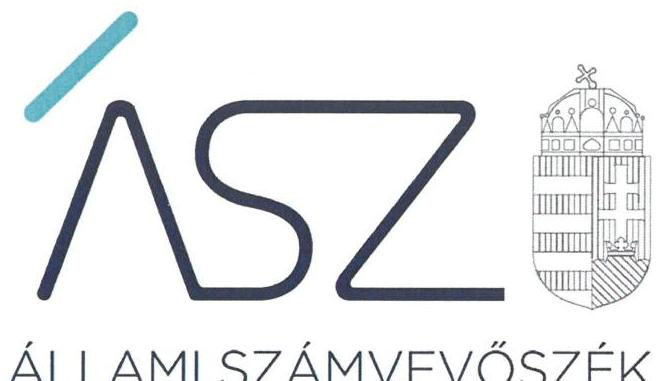
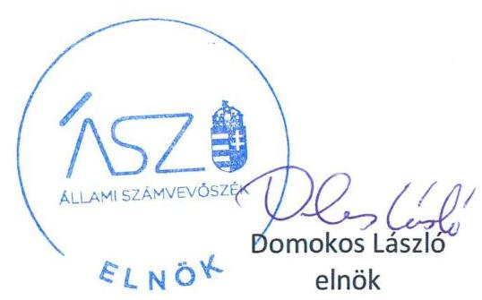

ÁLLAMI SZÁMVEVŐSZÉK

# JELENTÉS 

## Utóellenőrzések

Az állami tulajdonban lévő gazdálkodó szervezetek vagyonmegőrzési és gazdálkodási tevékenységének utóellenőrzése - NKÖV Nemzeti Kulturális Örökség Védelmi Nonprofit Korlátolt Felelősségű Társaság

2020
20045
www.asz.hu

---

# JELENTÉS 

## Utóellenőrzések

Az állami tulajdonban lévő gazdálkodó szervezetek vagyonmegőrzési és gazdálkodási tevékenységének utóellenőrzése - NKÖV Nemzeti Kulturális Örökség Védelmi Nonprofit

Korlátolt Felelősségű Társaság
2020. 03. hó 31. nap

20045
www.asz.hu

---

# AZ ELLENŐRZÉST FELÜGYELTE: 

MAROZSÁN LÁSZLÓNÉ felügyeleti vezető

## AZ ELLENŐRZÉST VEZETTE ÉS A VÉGREHAJTÁSÁÉRT FELELŐS:

KISS ISTVÁN GYÖRGY ellenőrzésvezető

## A PROGRAM ÖSSZEÁLLÍTÁSÁÉRT FELELŐS:

TÓTPÁL SZABOLCS osztályvezető

## A TÉMÁHOZ KAPCSOLÓDÓ KORÁBBI SZÁMVEVŐSZÉKI JELENTÉSEK:

- címe: Jelentés - Az állami tulajdonban (résztulajdonban) lévő gazdálkodó szervezetek vagyonmegőrzési és gazdálkodási tevékenységének ellenőrzése - NKÖV Nemzeti Kulturális Örökség Védelmi Nonprofit Korlátolt Felelősségű Társaság
- sorszáma: $\quad 16118$

IKTATÓSZÁM: EL-2455-001/2020.
TÉMASZÁM: 2460
ELLENŐRZÉS-AZONOSÍTÓ SZÁM: V080465

---

# TARTALOMJEGYZÉK 

■ ÖSSZEGZÉS ..... 5
■ AZ ELLENŐRZÉS CÉLJA ..... 6
■ AZ ELLENŐRZÉS TERÜLETE ..... 7
■ AZ ELLENŐRZÉS HÁTTERE, INDOKOLTSÁGA ..... 8
■ A JELENTÉS LÉNYEGES KÉRDÉSKÖRE ..... 10
■ AZ ELLENŐRZÉS HATÓKÖRE ÉS MÓDSZEREI ..... 11
■ MEGÁLLAPÍTÁSOK ..... 13
■ MELLÉKLETEK ..... 15
I. sz. melléklet: NKÖV Nemzeti Kulturális Örökség Védelmi Nonprofit Korlátolt Felelősségű Társaság intézkedési terve végrehajtásának értékelése ..... 15
■ FÜGGELÉK: ÉSZREVÉTELEK ..... 17
■ RÖVIDÍTÉSEK JEGYZÉKE ..... 21

---

.

---

# ÖSSZEGZÉS 

Az Állami Számvevőszék az utóellenőrzés során megállapította, hogy a NKÖV Nemzeti Kulturális Örökség Védelmi Nonprofit Kft.-nél az intézkedési tervében meghatározott feladatok hiányos végrehajtása miatt a közpénzekkel való gazdálkodása továbbra is kockázatot hordoz, vagyongazdálkodása során a kockázatok nőttek.

## Az ellenőrzés társadalmi indokoltsága

Az Állami Számvevőszék stratégiájában célul tűzte ki a számvevőszéki munka hasznosulásának javítását. Ezzel összhangban ellenőrzi, hogy az ellenőrzött szervezet megvalósította-e a korábbi ellenőrzések által feltárt hibák, hiányosságok és szabálytalanságok megszüntetése céljából elkészített intézkedési tervében foglaltakat. A rendszeres utóellenőrzések hozzájárulnak a szükséges intézkedések tényleges végrehajtásához, ezáltal a közpénzügyek rendezettségének javulásához.

## Főbb megállapítások, következtetések

Az Állami Számvevőszék részére megküldött intézkedési tervében meghatározott nyolc feladatból a NKÖV Nemzeti Kulturális Örökség Védelmi Nonprofit Kft. négyet nem, négyet pedig részben hajtott végre.

A számviteli nyilvántartási rendszer hiányos kialakítása miatt a pénzügyi gazdálkodás továbbra is kockázatot hordoz. A vagyongazdálkodás szabályszerűségének kockázati kitettsége tovább erősödött, mivel a társaság éves beszámolójának leltárral való alátámasztottsága az utóellenőrzéssel érintett években nem volt igazolt. A számviteli szabályzatok módosítása következtében a szabályozottsága javult.

---

# AZ ELLENŐRZÉS CÉLJA 

Az ellenőrzés célja annak értékelése volt, hogy a számvevőszéki jelentésben ${ }^{1}$ foglalt intézkedést igénylő megállapításokkal összhangban készített intézkedési tervben meghatározott feladatokat az ellenőrzött szervezet vég-rehajtotta-e.

---

# AZ ELLENŐRZÉS TERÜLETE

## NKÖV Nemzeti Kulturális Örökség Védelmi Nonprofit Kft.

A NKÖV Nemzeti Kulturális Örökség Védelmi Nonprofit Korlátolt Felelősségű Társaság 2009. június 30-án alakult. A Társaság jogelődjét, a NKÖV Nemzeti Kulturális Örökség Védelmi Közhasznú Társaságot a Nemzeti Kulturális Örökség Minisztériuma alapította 2001-ben.

A Társaság egyszemélyi tulajdonosa a Magyar Állam, a tulajdonosi jogokat 2013. január 27-től az Emberi Erőforrások Minisztériuma gyakorolja.

A Társaság az utóellenőrzéssel érintett időszak alatt a kormányzati szektorba sorolt egyéb szervezetek körébe tartozott. A Társaság alapvető feladata az Alapító okirat alapján az Emberi Erőforrások Minisztériuma felügyelete alá tartozó, kiemelt jelentőségű nemzeti, kulturális értéket őrző intézményei védelmének biztosítása.

Az ügyvezető személyében 2016. december 7-én történt változás az utóellenőrzéssel érintett időszakban.

Az ÁSZ 2011. január 1-jétől 2014. december 31-ig terjedő időszakra vonatkozóan ellenőrizte a Társaság vagyonmegőrzési és gazdálkodási tevékenységét. Az ellenőrzés célja annak értékelése volt többek között, hogy a Társaság által ellátott feladat bevételei, ráfordításai elszámolásának, és vagyongazdálkodási tevékenységének szabályozása megfelelte a jogszabályi előírásoknak és azok végrehajtása szabályszerű volt-e; a vagyonváltozást eredményező döntések esetében a tulajdonosi jogok gyakorlója és a gazdálkodó szervezet szabályszerűen jártak-e el; a gazdálkodó szervezet épített-e ki és működtetett-e információs rendszert a szabályszerű vagyongazdálkodás érdekében. Az ellenőrzésről készült 16118 számú számvevőszéki jelentést az ÁSZ 2016. július 13-án hozta nyilvánosságra, amelyben a Társaság ügyvezetőjének nyolc javaslatot fogalmazott meg.

Az utóellenőrzés a számvevőszéki jelentésben megfogalmazott, intézkedést igénylő megállapításokra készített, az ÁSZ részére megküldött intézkedési tervben foglalt feladatok végrehajtásának ellenőrzésére, értékelésére irányult.

---

# AZ ELLENŐRZÉS HÁTTERE, INDOKOLTSÁGA 

Az ÁSZ tv. ${ }^{7}$ 33. § (1) bekezdése értelmében a számvevőszéki jelentések intézkedést igénylő megállapításaihoz és javaslataihoz kapcsolódóan az ellenőrzött szervezetek vezetője intézkedési tervet köteles összeállítani, és az Állami Számvevőszék részére megküldeni.

Az ÁSZ tv. 33. § (6) bekezdése értelmében, amennyiben az ÁSZ elnöke az ellenőrzés során feltárt jogszabálysértő gyakorlat, illetve a vagyon rendeltetésellenes vagy pazarló felhasználásának megszüntetése érdekében figyelemfelhívó levéllel fordult az ellenőrzött szerv vezetőjéhez, az abban foglaltakat az ellenőrzött szerv vezetője köteles elbírálni, a megfelelő intézkedést megtenni és erről az ÁSZ elnökét értesíteni.

Az ÁSZ által befogadott intézkedési tervben foglaltak megvalósítását - az ÁSZ tv. 33. § (7) bekezdésében foglaltak alapján - az Állami Számvevőszék utóellenőrzés keretében ellenőrizheti. Az utóellenőrzések keretében - az intézkedések értékelése során - az Állami Számvevőszék figyelembe veszi az ellenőrzött szervezetek működési feltételeiben, valamint a jogszabályi előírásokban bekövetkezett változásokat.

Az utóellenőrzés során az ÁSZ értékeli, hogy az érintett számvevőszéki jelentésben foglalt megállapításokkal és javaslatokkal összhangban, az ellenőrzött szervezet által készített intézkedési tervben meghatározott feladatokat a feladatra kijelöltek végrehajtották-e.

Az intézkedések végrehajtásával az adott terület szabályszerű működése vonatkozásában a kockázatok csökkenhetnek, azonban hosszabb távon az intézkedési tervben foglaltak végrehajtásával önmagában nem szűnnek meg, csak akkor, ha beépülnek az ellenőrzött szervezet működésébe, azokat folyamatosan karbantartják, figyelembe véve, illetve kezelve a változásokat. Emellett az intézkedések végrehajtásáig újabb kockázatok merülhetnek fel a szabályszerű működés vonatkozásában, amelyek kezelése szintén kiemelten fontos az ellenőrzött szervezet számára.

Az ellenőrzött szervezet vezetője által készített intézkedési tervekben foglalt feladatok hiányos, illetve késedelmes végrehajtása, vagy annak elmaradása a szabályszerűség és a felelős vezetői magatartás vonatkozásában kockázatot hordoz, ami azt mutatja, hogy az ellenőrzések során feltárt hibák, hiányosságok és szabálytalanságok kezelése nem kapott kellő hangsúlyt. Az utóellenőrzés során is fennálló szabálytalanságok esetén a közpénz, közvagyon veszélyeztetettségi kockázat valószínűsített hatásának értékelése további intézkedéseket vonhat maga után.

Az ellenőrzött szervezet szintjén az utóellenőrzés feltárja, hogy a szervezet az intézkedések végrehajtásával hasznosította-e a korábbi ellenőrzési jelentésben a hiányosságok megszüntetése, illetve a kockázatok kezelése érdekében megfogalmazott javaslatokat, illetve az intézkedések végrehajtása elmaradásának következtében továbbra is fennálló szabálytalanság esetén értékeli a közpénzek, közvagyon veszélyeztetettségét.

Az ÁSZ szintjén az utóellenőrzés visszacsatolást ad az ellenőrzési jelentések hasznosulásáról, az intézkedések elmaradásáról, vagy részleges megvalósulásáról, ami közpénzek, közvagyon veszélyeztetettségére gyakorolt

---

valószínűsített hatásának értékelése után, további intézkedéseket vonhat maga után.

---

# A JELENTÉS LÉNYEGES KÉRDÉSKÖRE 

Az ellenőrzött szervezet az intézkedési tervben foglaltakat az előírt határidőben végrehajtotta-e?

---

# AZ ELLENŐRZÉS HATÓKÖRE ÉS MÓDSZEREI 

## Az ellenőrzés típusa

Megfelelőségi ellenőrzés.

## Az ellenőrzött időszak

Az utóellenőrzés alapját képező számvevőszéki jelentés közzétételének napjától az ellenőrzésről szóló kiértesítő levél keltének napjáig, azaz 2016. július 13-tól 2019. augusztus 30-ig tartó időszak.

## Az ellenőrzés tárgya

A számvevőszéki jelentésben foglalt megállapításokkal és javaslatokkal összhangban az ellenőrzött szervezet által készített intézkedési tervben foglaltak végrehajtásának ellenőrzése.

## Az ellenőrzött szervezet

NKÖV Nemzeti Kulturális Örökség Védelmi Nonprofit Korlátolt Felelősségű Társaság

## Az ellenőrzés jogalapja

Az ellenőrzés jogszabályi alapját az ÁSZ tv. 33. § (7) bekezdése, illetve a 33. § (1)-(2) és (6) bekezdései képezték.

## Az ellenőrzés módszerei

Az ellenőrzést az ellenőrzött időszakban hatályos jogszabályok, az ellenőrzés szakmai szabályai, a jelen ellenőrzésre irányadó ÁSZ módszertanok, az ellenőrzési programban foglalt értékelési szempontok szerint végezte az ÁSZ.

Az ÁSZ az ellenőrzés ideje alatt az ellenőrzött szervezettel történő kapcsolattartást az ÁSZ SZMSZ²-ének vonatkozó előírásai alapján biztosította.

Az utóellenőrzés megállapításai az ÁSZ rendelkezésére álló dokumentumok, valamint az ÁSZ adatbekérése szerint az ellenőrzött szervezet által rendelkezésre bocsátott dokumentumok alapján kerültek megfogalmazásra.

---

Az ellenőrzési kérdések megválaszolásához szükséges bizonyítékok megszerzése az ellenőrzött által rendelkezésre bocsátott dokumentumokra, adatokra alapozva megfigyelés, szemle (szemrevételezés), valamint elemző eljárás alkalmazásával történt. Az ellenőrzési bizonyítékként felhasználható adatforrások közé tartoztak egyrészt az ellenőrzési program részletes szempontjainál felsorolt adatforrások, másrészt minden - az ellenőrzés folyamán feltárt, az ellenőrzés szempontjából információt tartalmazó - dokumentum.

Az ellenőrzési bizonyítékként felhasználható adatforrások közé tartoztak az ellenőrzési program részletes szempontjainál felsorolt adatforrások.

Az intézkedési tervben előírt feladatokat azok végrehajthatósága, illetve végrehajtása szempontjából az alábbiak szerint értékelte az ÁSZ:
$\longrightarrow$ „határidőben végrehajtott" a feladat, ha a teljesítés dokumentáltan, az intézkedési tervben előírt határidőben és tartalommal megtörtént;
$\longrightarrow$ „határidőn túl végrehajtott" a feladat, ha annak teljesítése az intézkedési tervben meghatározott módon, de az előírt határidőn túl történt meg;
$\longrightarrow$ „részben végrehajtott" a feladat, ha végrehajtása nem teljes körűen az intézkedési tervben előírt módon történt meg;
$\longrightarrow$ „nem végrehajtott" a feladat, ha a végrehajtás nem történt meg, dokumentumokkal nem igazolt annak teljesítése;
$\longrightarrow$ „okafogyottá vált" a feladat, ha végrehajtására - meghatározott esemény bekövetkezése, továbbá külső körülmény, a működést érintő feltétel változása miatt - már nincs szükség, illetve lehetőség, és egyértelműen megállapítható, hogy az intézkedést szükségessé tevő körülmény a jövőben nem fordulhat elő;
$\longrightarrow$ „nem időszerű" az a feladat, amelynek ellenőrzési időszakon belüli végrehajtására azért nem került (kerülhetett) sor, mert az intézkedés alapjául szolgáló esemény nem következett be, de annak jövőbeni előfordulása lehetséges, a végrehajtása nem volt esedékes, vagy a végrehajtás határideje még nem járt le.
Az ellenőrzés lefolytatásához az ellenőrzött szervezet a tanúsítványok elektronikus kitöltésével, valamint az ÁSZ által kért dokumentumok elektronikus megküldésével szolgáltatott adatokat, amelyek valódiságát és teljes körűségét az ellenőrzött szervezet vezetője által tett teljességi és hitelességi nyilatkozat igazolja. Az így rendelkezésre bocsátott adatok, információk kontrollja az ellenőrzés keretében megtörtént.

---

# MEGÁLLAPÍTÁSOK 

## Az ellenőrzött szervezet az intézkedési tervben foglaltakat az előírt határidőben végrehajtotta-e?

Összegző megállapítás

A Társaság az intézkedési tervben szereplő nyolc feladatból négyet részben hajtott végre, négy feladat végrehajtásáról nem gondoskodott.

Az ÁSZ számvevőszéki jelentésében a Társaság számára nyolc javaslatot fogalmazott meg. A hiányosságok és szabálytalanságok megszüntetésére a Társaság által készített intézkedési tervben meghatározott feladatokat, határidőket, felelősöket és a feladatok végrehajtásának értékelését az I. sz. melléklet mutatja be.

A Társaság intézkedési tervében meghatározott feladatok végrehajtásának értékelési kategóriák szerinti megoszlását az 1. ábra szemlélteti.
1. ábra

Az intézkedési tervben a feladatok végrehajtásának értékelési kategóriák szerinti megoszlása
részben
végrehajtott
nem végrehajtott

A SZABÁLYOZOTTSÁG területén rejlő kockázatok csökkentek, mivel a Számviteli politika ${ }^{9}$ (3) és a Közbeszerzési Szabályzat ${ }^{10}$ (4) a Társaságnál a hatályos jogszabályoknak megfelelően módosításra került és Ügyvezető igazgatói utasítás ${ }^{11}$ (2) készült a vállalkozási tevékenység szabályozásáról. A Szervezeti és működési szabályzatot a Társaságnál nem tekintették át, nem aktualizálták és nem terjesztették fel az alapítóhoz jóváhagyásra (5).

## A PÉNZÜGYI GAZDÁLKODÁS SZABÁLYSZERŰSÉGÉ-

NEK területén változatlanul fennáll a kockázat, mivel a vállalkozási és közhasznú tevékenységek főkönyvi számláihoz kapcsolódó analitikus nyilvántartási rendszert a Társaságnál nem szabályozták. (1), (3).

---

A BELSŐ KONTROLL RENDSZER monitoring rendszere területén a feltárt kockázat továbbra is fennáll, mivel a Társaságnál nem alakították ki a vállalkozási tevékenység monitoring rendszerét (2).

A
 VAGYONGAZDÁLKODÁSSAL kapcsolatban feltárt kockázatok nőttek, mivel a Társaság nem igazolta a teljes körű leltározás végrehajtását (6.).

INTEGRITÁSI kockázatot jelent, hogy a Társaságnál nem készítettek szabályzatot a közérdekű adatok megismerésére irányuló igények rendjéről (8) és a számvevőszéki jelentésben korábban feltárt közbeszerzési szabálytalanságok vonatkozásában a felelősséget nem tisztázták (7).

---

# MELLÉKLETEK

I. SZ. MELLÉKLET: NKÖV NEMZETI KULTURÁLIS ÖRÖKSÉG VÉDELMI NONPROFIT KORLÁTOLT FELELŐSSÉGŰ TÁRSASÁG INTÉZKEDÉSI TERVE VÉGREHAJTÁSÁNAK ÉRTÉKELÉSE

|  Az intézkedési tervben rögzített feladat | Az intézkedési tervben meghatározott határidő | Az intézkedési tervben meghatározott felelős | A feladat végrehajtása  |
| --- | --- | --- | --- |
|  1. | 2. | 3. | 4.  |
|  1. A társaság pénzügyi vezetője a Számviteli politika és a jogszabályi előírásokban meghatározottak szerint valamint az Alapító kijelölt munkatársaival egyeztetve módosítja a számlarendet. [IT2.] | 2016.12.31. | Pénzügyi vezető | Végrehajtott feladatrész: A számlarend a számviteli politika szerint módosítva lett. Nem végrehajtott feladatrész: A számlarendben nem rendelkeztek a közhasznú és vállalkozási tevékenység főkönyvi számlái és az analitikus nyilvántartás kapcsolatáról, ezzel megsértették a Számv. tv. 161. § (2) bekezdés c) pontjában foglaltakat.  |
|  2. A társaság ügyvezetése különös gonddal kíséri figyelemmel, hogy gazdasági-vállalkozási tevékenységét nyereségesen, kizárólag a közhasznú tevékenység megvalósulását támogatva, azt nem veszélyeztetve végezze. Kiegészítés: Társaságunk intézkedését a nyomon követés (monitoring) rendszer kialakításával, a nyomon követés biztosításával és napi működtetésével kívánja megvalósítani. Ennek keretében olyan figyelőrendszer kialakítására kerül sor a számviteli rendszeren belül, amelyben az elfogadott éves terv és a teljesítés havi lebontásra kerül, elkülönítve a közhasznú tevékenység és a vállalkozási tevékenység bevétel-kiadását. A havi likviditási mutatók mellett az eredmény, a terv-tény havi szintű nyomon követésével a vállalkozási tevékenység veszteséges működésének kockázata felmérhető és elhárítására időben intézkedésre kerülhet sor. [IT4.] | folyamatos | Ügyvezető igazgató | Végrehajtott feladatrész: Az ügyvezető Ügyvezető igazgatói utasítás formájában intézkedett arról, hogy a Társaság vállalkozás-gazdálkodási tevékenységet kiegészítő jelleggel, a közhasznú célok megvalósítása érdekében, azokat nem veszélyeztetve folytasson. Nem végrehajtott feladatrész: A Társaság ügyvezetője nem igazolta a nyereséges vállalkozási tevékenységet biztosító nyomon követési (monitoring) rendszer kialakítását.  |

---

|  Az intézkedési tervben rögzített feladat | Az intézkedési tervben meghatározott határidő | Az intézkedési tervben meghatározott felelős | A feladat végrehajtása  |
| --- | --- | --- | --- |
|  1. | 2. | 3. | 4.  |
|  3. Az ügyvezető, pénzügyi vezető a társaság könyvvizsgálójának bevonásával valamint az Alapító útmutatásának megfelelően kialakítja a bevételek és a ráfordítások közhasznú és vállalkozási tevékenységek közötti megosztásával kapcsolatos nyilvántartási rendszert a jogszabályi előírások figyelembevételével. [IT5.] | 2016.12.31. | Ügyvezető igazgató | Végrehajtott feladatrész: A Társaság a számviteli politikája és számlarendje alapján kialakította a bevételek és a ráfordítások közhasznú és vállalkozási tevékenységek közötti megosztásával kapcsolatos főkönyvi nyilvántartási rendszerét. Nem végrehajtott feladatrész: a főkönyvi számlákhoz a kapcsolódó analitikus nyilvántartásról nem rendelkeztek a számlarendben, ezzel megsértették a Számv. tv. 161. § (2) bekezdés c) pontjában foglaltakat.  |
|  4. Az ügyvezetés áttekinti, ha szükséges aktualizálja a társaság közbeszerzésekre vonatkozó szabályzatát és az ügyvezető szavatolja a közbeszerzési szabályok betartását. [IT6.] | folyamatos | Ügyvezető igazgató | Végrehajtott feladatrész: A Társaság ügyvezetője aktualizálta a Társaság közbeszerzésekre vonatkozó szabályzatát, és 2017. január 2-án új Közbeszerzési szabályzatot léptetett hatályba. Nem végrehajtott feladatrész: Az utóellenőrzéssel érintett időszakban lefolytatott közbeszerzések esetében a Társaság ügyvezetője nem igazolta a közbeszerzési szabályok betartását.  |
|   |  | Nem végrehajtott feladatok |   |
|  5. A társaság ügyvezetője áttekinti, aktualizálja a társaság módosított Szervezeti és Működési Szabályzatát és azt az Alapítóhoz elfogadásra felterjeszti. [IT1.] | 2016.10.31. | Ügyvezető igazgató | A Társaság ügyvezetője nem igazolta, hogy a Társaság Szervezeti és Működési Szabályzatát áttekintette, aktualizálta, és azt a tulajdonosi joggyakorlóhoz elfogadásra felterjesztette.  |
|  6. A társaság leltározási szabályzata alapján végrehajtja illetve végrehajtatja a társaság teljes körű leltározását. [IT3.] | 2016.12.31. | Pénzügyi vezető, Titkárságvezető | A Társaság ügyvezetője nem igazolta, hogy a leltározási szabályzat alapján végrehajtották a Társaság teljes körű leltározását.  |
|  7. Az ügyvezető az ÁSZ ellenőrzés megállapításainak kézhezvételét követően úgy személyében, mint struktúrájában (az Alapítóval történt egyeztetés követően) átalakította a társaság gazdasági és pénzügyi vezetését és rendszerét. Kiegészítés: a közbeszerzési eljárások jogtalan mellőzésével feltárt szabálytalanságok tekintetében a felelősség tisztázásra került, és a felelős dolgozó munkaviszonya megszüntetésre került. [IT7.] | Megvalósult | Ügyvezető igazgató | Az ügyvezető nem igazolta a közbeszerzési eljárások jogtalan mellőzésével feltárt szabálytalanságok tekintetében a felelősség tisztázását, valamint a Társaság gazdasági és pénzügyi vezetésének és rendszerének átalakítását.  |
|  8. A társaság elkészíti a közérdekű adatok megismerésére irányuló igények teljesítésének rendjét rögzítő szabályzatot a jogszabályi előírásoknak megfelelően. [IT8.] | 2016.12.31. | Titkárságvezető | Az ügyvezető nem készítette el az Info tv. 30. § (6) bekezdésében rögzített előírások ellenére a közérdekű adatok megismerésére irányuló igények teljesítésének rendjét rögzítő szabályzatot.  |

[IT1.], [IT2.],...[IT8.] a Társaság által készített intézkedési terv pontjait jelölik

---

# FÜGGELÉK: ÉSZREVÉTELEK 

A jelentéstervezetet a Számvevőszék 15 napos észrevételezésre megküldte az ellenőrzött szervezet vezetőjének az ÁSZ tv. 29. § (1) bekezdése előírásának megfelelően.

Az NKÖV Nemzeti Kulturális Örökség Védelmi Nonprofit Kft. ügyvezetője a jelentéstervezet megállapításaira írásban észrevételt tett.
Az ÁSZ tv. 29. § (3) bekezdésével összhangban az ÁSZ a Függelékben feltünteti az ellenőrzés megállapításaival kapcsolatban tett, figyelembe nem vett észrevételeket, és megindokolja, hogy azokat miért nem fogadta el.

[^0]
[^0]:    * 29. § (1) Az Állami Számvevőszék az ellenőrzési megállapításait megküldi az ellenőrzött szervezet vezetőjének vagy az általa megbízott személynek, és annak, akinek személyes felelősségét állapította meg.
    (2) Az ellenőrzött szervezet vezetője és a felelősként megjelölt személy az ellenőrzés megállapításaira tizenöt napon belül írásban észrevételt tehet.
    (3) Az Állami Számvevőszék az észrevételre a beérkezésétől számított harminc napon belül írásban válaszol. A figyelembe nem vett észrevételeket köteles a jelentésben feltüntetni, és megindokolni, hogy azokat miért nem fogadta el.

---

Az „Utóellenőrzések - Az állami tulajdonban lévő gazdálkodó szervezetek vagyonmegőrzési és gazdálkodási tevékenységének utóellenőrzése - NKÖV Nemzeti Kulturális Örökség Védelmi Nonprofit Kft." címmel készített számvevőszéki jelentéstervezet megállapításaival kapcsolatban az ügyvezető által a NKÖV-30/2020. iktatószámú levélben megküldött el nem fogadott észrevételek és azok kezelésének indokolása.

# 1. Az I. melléklet 1. pont nem végrehajtott feladatrészével kapcsolatos észrevétel 

Az ügyvezető észrevételében jelezte, hogy a nem ért egyet a jelentéstervezet Számlarendre vonatkozó megállapításával, mivel észrevételében leírtak szerint minden főkönyvi számla megnevezése és magyarázata után szabályozva van az analitikus nyilvántartással a kapcsolat, így értelemszerűen az elkülönített főkönyvi számláknak megfelelően is.

Az észrevételt az Állami Számvevőszék (továbbiakban: ÁSZ) nem fogadta el. Az ellenőrzés rendelkezésére bocsátott 2017. június 1-jétől hatályos Számlarend tartalmaz rendelkezéseket a főkönyvi számlák és az analitikus nyilvántartások kapcsolatáról, azonban az a közhasznú és vállalkozási tevékenység főkönyvi számlái és az analitikus nyilvántartás kapcsolatára nem tér ki. Az előbbiekre tekintettel a Társaság számlarendje nem felel meg a Számv. tv. 161. § (2) bekezdés c) pontjában foglaltaknak. A jelentéstervezet jelen pontban érintett részének megállapítása helytálló, módosítása nem indokolt.

## 2. Az I. melléklet 2. pont nem végrehajtott feladatrészével kapcsolatos észrevétel

Az ügyvezető észrevételében jelezte, hogy nem ért egyet a jelentéstervezet azon megállapításával, miszerint nem került kialakításra a nyereséges vállalkozási tevékenység elérését támogató, nyomon követési monitoring rendszer. A Társaság alkalmazza az ügyvezető által kialakított rendszert, amelyben az elfogadott éves terv és a teljesítés havi lebontásra kerül, elkülönítve a közhasznú tevékenység és a vállalkozási tevékenység bevétel-kiadását. Az ügyvezető tájékoztatást adott továbbá arról, hogy a Magyar Államkincstár 2017. júniusa és 2018. júniusa között kétheti rendszerességgel ellenőrizte a Társaság gazdálkodási tevékenységét, valamint havi szinten tájékoztatást adtak a tervtény adatokról. Elismerte ugyanakkor, hogy a gyakorlatot nem foglalták szabályzatba és nem adták ki.

Az ÁSZ az észrevételt nem fogadta el. Az ellenőrzés megállapítása az észrevételben rögzítettekkel ellentétben nem arra vonatkozott, hogy nem alakították ki a nyereséges vállalkozási tevékenység elérését támogató, nyomon követési (monitoring) rendszert, hanem arra, hogy a Társaság ügyvezetője nem igazolta az utóellenőrzéshez kapcsolódó adatszolgáltatásuk során az intézkedési tervben részletesen bemutatott tervezett nyomon követési rendszer kialakításának megvalósítását, így a vállalt intézkedés végrehajtását.

Az ÁSZ az EL-1531-001/2019. iktatószámú adatbekérő levél 1.1.2. pontjában foglaltak szerint kérte az ellenőrzési megállapításaihoz kapcsolódó intézkedési tervben meghatározott feladatok végrehajtását alátámasztó, valamint azok teljesülésének eredményét bemutató dokumentum, adatbázis benyújtását. A Társaság intézkedési tervében leírták, hogy figyelőrendszert fognak kialakítani a számviteli rendszerükön belül, amelynek a tartalmi elemeire is kitért az intézkedési terv vonatkozó pontja. Az adatszolgáltatás során az ÁSZ részére megküldött 2017. január 9-i keltezésű Ügyvezető igazgatói utasítás az intézkedési tervben vállalt kapcsolódó feladatok végrehajtását önmagában nem igazolta. Az adatszolgáltatás során az intézkedési tervben vállalt, a nyereséges vállalkozási tevékenység elérését támogató, nyomon követési (monitoring) rendszer kialakításának végrehajtását igazoló egyéb dokumentumot az adatbekérésben foglaltak ellenére nem bocsátottak az ellenőrzés rendelkezésére. Az ügyvezető nyilatkozott a teljességi és hitelességi nyilatkozatában arról, hogy az ÁSZ részére átadott dokumentumok, adatok megbízhatóak, és a bekért adatokra, dokumentumokra vonatkozóan teljes körű információt tartalmaznak.

Az ÁSZ az ellenőrzési megállapításait az adatszolgáltatás során a részére törvényi határidőben rendelkezésre bocsátott dokumentumokra alapozva fogalmazta meg.

Az ügyvezető Magyar Államkincstár ellenőrzésére és a részére történő adatszolgáltatásra vonatkozó tájékoztatása az ÁSZ ellenőrzés által megtett megállapítást nem befolyásolja. Az előbbiekre tekintettel a jelentéstervezet jelen pontban érintett részének módosítása nem indokolt.

## 3. Az I. melléklet 3. pont nem végrehajtott feladatrészével kapcsolatos észrevétel

Az ügyvezető észrevételében jelezte, hogy nem ért egyet a jelentéstervezet Számlarendre vonatkozó megállapításával - ahogy azt az 1. pontban is indokolta -, mivel minden főkönyvi számla megnevezése és magyarázata után

---

szabályozva van észrevételében foglaltak szerint az analitikus nyilvántartással a kapcsolat, így értelemszerűen az elkülönített főkönyvi számláknak megfelelően is.
Az észrevételt az ÁSZ nem fogadta el. Az intézkedési terv 5. pontjában foglaltak szerint azt vállalták, hogy a Társaságnál kialakítják a bevételek és a ráfordítások közhasznú és vállalkozási tevékenységek közötti megosztásával kapcsolatos nyilvántartási rendszert a jogszabályi előírások figyelembevételével. A Számlarendben a bevételek (9. számlaosztály) és a ráfordítások (8. számlaosztály) számlaosztályok esetében - amelyre az intézkedési tervpont és a végrehajtott feladatrész is vonatkozik - a főkönyvi számla és az analitikus nyilvántartás kapcsolatáról nem rendelkeztek, ezért az intézkedési tervben vállalt feladat végrehajtása a számlarend ezen tartalmi hiányossága miatt nem végrehajtott feladatrészként került értékelésre. Az előbbiekre tekintettel a
 jelentéstervezet jelen pontban érintett részének módosítása nem indokolt.

# 4. Az I. melléklet 4. pont nem végrehajtott feladatrészével kapcsolatos észrevétel 

Az ügyvezető észrevételében jelezte, hogy nem ért egyet a jelentéstervezet azon megállapításával, miszerint nem szavatolta a közbeszerzési szabályok betartását. A Társaság a közbeszerzési szabályzat alapján eleget tesz valamennyi közbeszerzési kötelezettségének, éves közbeszerzési terveket készítenek, és az éves jelentéseket megteszik. Az indított közbeszerzési eljárásokhoz a Társaság Felelős Akkreditált Közbeszerzési Szaktanácsadót vett igénybe. Eljárásaikkal szemben sem ajánlattevő, sem hatóság, sem harmadik fél nem tett kifogást.
Az ÁSZ az észrevételt nem fogadta el. Az ellenőrzés megállapítása az észrevételben rögzítettekkel ellentétben nem arra vonatkozott, hogy az ügyvezető nem szavatolta a közbeszerzési szabályok betartását, hanem arra, hogy a Társaság ügyvezetője nem igazolta a közbeszerzési szabályok betartását. Az ÁSZ az EL-1531-001/2019. iktatószámú adatbekérő levél 1.1.2. pontjában foglaltak alapján az ÁSZ ellenőrzési megállapításaihoz kapcsolódó intézkedési tervben meghatározott feladatok végrehajtását alátámasztó, valamint azok teljesülésének eredményét bemutató dokumentum, adatbázis benyújtását kérte. Az ÁSZ az ellenőrzési megállapításait az adatszolgáltatás során a részére törvényi határidőben rendelkezésre bocsátott dokumentumokra alapozva fogalmazza meg. Az ügyvezető teljességi és hitelességi nyilatkozata szerint az ÁSZ részére átadott dokumentumok, adatok megbízhatóak, és a bekért adatokra, dokumentumokra vonatkozóan teljes körű információt tartalmaznak. A Társaság a teljességi és hitelességi nyilatkozattal alátámasztva az adatszolgáltatás során a közbeszerzés szabályainak betartásának igazolására a 2017. január 2-tól hatályos Közbeszerzési szabályzatát bocsátotta az ellenőrzés rendelkezésére. A Közbeszerzési szabályzat önmagában az utóellenőrzéssel érintett időszakban lefolytatott közbeszerzések esetében a közbeszerzési szabályok betartását nem igazolja.
Az ügyvezető közbeszerzési eljárásokhoz kapcsolódó szaktanácsadás igénybe vételére és az eljárásokkal kapcsolatos kifogásemelés hiányára vonatkozó tájékoztatása az ÁSZ ellenőrzés által megtett megállapítást nem befolyásolja.
A fentiekre tekintettel a jelentéstervezet jelen pontban érintett részének módosítása nem indokolt.

## 5. Az I. melléklet 5. pontjával kapcsolatos észrevétel

Az ügyvezető észrevételében jelezte, hogy az aktualizált SZMSZ-t 2017. október 30-án elfogadta az Alapító.
Az ÁSZ az ÁSZ tv. 33. § (7) bekezdésében foglaltak szerint az intézkedési tervben foglaltak megvalósítását ellenőrzi az utóellenőrzés keretében. Az intézkedési tervben vállalt feladat szerint a Társaság ügyvezetője 2016. december 31-ig áttekinti, aktualizálja a társaság módosított Szervezeti és Működési Szabályzatát és azt az Alapítóhoz elfogadásra felterjeszti.
Az észrevételt az ÁSZ nem fogadta el. Az ÁSZ az EL-1531-001/2019. iktatószámú adatbekérő levél 1.1.2. pontjában foglaltak alapján az ÁSZ ellenőrzési megállapításaihoz kapcsolódó intézkedési tervben meghatározott feladatok végrehajtását alátámasztó, valamint azok teljesülésének eredményét bemutató dokumentum, adatbázis benyújtását kérte. Az ÁSZ az ellenőrzési megállapításait az adatszolgáltatás során a részére törvényi határidőben rendelkezésre bocsátott dokumentumokra alapozva fogalmazza meg. Az ügyvezető nyilatkozott a teljességi és hitelességi nyilatkozatában, hogy az ÁSZ részére átadott dokumentumok, adatok megbízhatóak, és a bekért adatokra, dokumentumokra vonatkozóan teljes körű információt tartalmaznak. A teljességi és hitelességi nyilatkozat alapján a Társaság az adatszolgáltatás során nem bocsátott az ellenőrzés rendelkezésére a Szervezeti és Működési Szabályzat áttekintésének, aktualizálásának megtörténtére vonatkozó, és a tulajdonosi joggyakorlóhoz elfogadásra felterjesztést igazoló dokumentumot, sem magát a módosított SZMSZ-t, kizárólag a Szervezeti és Működési Szabályzat elfogadására

---

vonatkozó Alapítói Határozatot küldte meg az ellenőrzés részére. A megküldött Alapítói Határozatból az nem állapítható meg, hogy a tulajdonosi joggyakorló az aktualizált SZMSZ jóváhagyásáról döntött-e. Az Alapítói Határozat az intézkedési terv vonatkozó pontjában a Társaság részéről vállalt, elvégzendő feladatok végrehajtását - az SZMSZ felülvizsgálatának, aktualizálásának a végrehajtását, majd ebből következően az aktualizált SZMSZ alapító részére történő beterjesztését - nem igazolja. Az előbbiekre tekintettel, a jelentéstervezet jelen pontban érintett megállapítása helytálló, módosítása nem indokolt.

# 6. Az I. melléklet 6. pontjával kapcsolatos észrevétel 

Az ügyvezető levelében tájékoztatást nyújtott arról, hogy a korábbi ügyvezető az intézkedési tervben megfogalmazottakat az abban megjelölt határidőig figyelmen kívül hagyta, annak nem tett eleget. Az ügyvezető a 2016. december 7. és december 31. között nem tudott eleget tenni a teljes körű leltározásnak. A szabályzatokat a Társaság 2017-ben létrehozta, a leltározás és a selejtezés megtörtént, a megkezdett munka 2020-ban folytatódik tovább.

Az ügyvezető észrevételében nem vitatja az ellenőrzés megállapítását, miszerint nem igazolták, hogy a leltározási szabályzat alapján végrehajtották a teljes körű leltározást. A leltározás 2020. évre vonatkozó elvégzésével kapcsolatban adott tájékoztatása az ellenőrzött időszakra vonatkozóan megfogalmazott megállapításainkat nem befolyásolja. Az előbbiekre tekintettel az ügyvezető levelében megfogalmazottak alapján a jelentéstervezet jelen pontban érintett részének módosítása nem indokolt.

## 7. Az I. melléklet 7. pontjával kapcsolatos észrevétel

Az ügyvezető észrevételében leírta, hogy a kinevezése előtti időszak közbeszerzési eljárásainak mellőzése kapcsán a felelősségek megállapításra kerültek. Kiemelte, hogy a legfontosabb lépést az Alapító tette meg azzal, hogy a korábbi ügyvezető szerződését nem hosszabbította meg. Ügyvezetőként az SZMSZ-t átalakította, a Társaság ellen indított perek előrehaladtával az érintett személyek munkaviszonyát megszüntette. Álláspontja szerint a megtett intézkedések kielégítették az intézkedési tervben vállaltakat.

Az észrevételt az ÁSZ nem fogadta el. Az ÁSZ az ellenőrzési megállapításait az adatszolgáltatás során a részére törvényi határidőben rendelkezésre bocsátott dokumentumokra alapozva fogalmazza meg. Az ügyvezető teljességi és hitelességi nyilatkozata szerint az ÁSZ részére átadott dokumentumok, adatok megbízhatóak, és a bekért adatokra, dokumentumokra vonatkozóan teljes körű információt tartalmaznak. Az intézkedési terv kiegészítésében foglaltak szerint a közbeszerzési eljárások jogtalan mellőzésével feltárt szabálytalanságok tekintetében a felelősség tisztázásra került. A teljességi és hitelességi nyilatkozat alapján a Társaság az adatszolgáltatás során a közbeszerzési eljárások jogtalan mellőzésével kapcsolatban feltárt szabálytalanságok tekintetében a felelősség tisztázását igazoló dokumentumokat nem bocsátott az ellenőrzés rendelkezésére. Teljességi és hitelességi nyilatkozattal alátámasztottan kizárólag munkavállalói felmondás és a Társaság ügyvezetőjének 2016. december 6. napján lejáró megbízatását követő új ügyvezető megválasztására vonatkozó Alapítói Határozatot küldtek meg. A felelősség tisztázására vonatkozó dokumentumok hiányában dokumentumokkal alátámasztottan nem igazolt, hogy az intézkedési tervben vállaltak szerint a felelősség tisztázása megtörtént és a közbeszerzési eljárások jogtalan mellőzésével kapcsolatban feltárt szabálytalanság esetében az érintett személy munkaviszonya szűnt-e meg. Az előbbiekre tekintettel, a jelentéstervezet jelen pontban érintett részének módosítása nem indokolt.

## 8. Az I. melléklet 8. pontjával kapcsolatos észrevétel

Az ügyvezető észrevételében jelezte, hogy a korábbi ügyvezető az intézkedési tervben vállaltakat az abban megjelölt határidőig figyelmen kívül hagyta, annak nem tett eleget. Tájékoztatott továbbá arról, hogy elkészítette a Közérdekű adatok megismerésére irányuló igények teljesítésének szabályozását, amellyel kapcsolatban az Alapító határozatára várnak.

Az ügyvezető az ÁSZ megállapítását nem vitatja, elismerte, hogy a közérdekű adatok megismerésére irányuló igények teljesítésének rendjét rögzítő szabályzatot az intézkedési tervben vállalt határidőben nem készítették el. A közérdekű adatok megismerésére irányuló igények teljesítésének rendjét rögzítő szabályzat ellenőrzött időszakon túli elkészítéséről adott tájékoztatása az ellenőrzött időszakra vonatkozóan megfogalmazott megállapítást nem befolyásolja. Az előbbiekre tekintettel, a jelentéstervezet jelen pontban érintett megállapítása helytálló, módosítása nem indokolt.

---

# RÖVIDÍTÉSEK JEGYZÉKE 

${ }^{1}$ számvevőszéki jelentés
${ }^{2}$ Társaság
${ }^{3}$ Alapító okirat
${ }^{4}$ ügyvezető
${ }^{5}$ ÁSZ
${ }^{6}$ intézkedési terv
${ }^{7}$ ÁSZ tv.
${ }^{8}$ ÁSZ SZMSZ
${ }^{9}$ Számviteli politika
${ }^{10}$ Közbeszerzési szabályzat
${ }^{11}$ Ügyvezető igazgatói utasítás

Az Állami Számvevőszék 16118 számú, 2016. július 13-án közzétett, „Az állami tulajdonban (résztulajdonban) lévő gazdálkodó szervezetek vagyonmegőrzési és gazdálkodási tevékenységének ellenőrzése - NKÖV Nemzeti Kulturális Örökség Védelmi Nonprofit Korlátolt Felelősségű Társaság című ellenőrzési jelentése

NKÖV Nemzeti Kulturális Örökség Védelmi Nonprofit Korlátolt Felelősségű Társaság

NKÖV Nemzeti Kulturális Örökség Védelmi Nonprofit Korlátolt Felelősségű Társaság 2016. december 6-ától hatályos, módosításokkal egységes szerkezetbe foglalt alapító okirata

NKÖV Nemzeti Kulturális Örökség Védelmi Nonprofit Korlátolt Felelősségű Társaság ügyvezetője az utóellenőrzéssel érintett időszakban
Állami Számvevőszék
Társaság 2016. augusztus 9-én kelt Intézkedési terve és a 2016. október 18-án kelt Intézkedési terv kiegészítése együttesen
2011. évi LXVI. törvény az Állami Számvevőszékről

Az Állami Számvevőszék Szervezeti és Működési Szabályzata
NKÖV Nemzeti Kulturális Örökség Védelmi Nonprofit Kft. Számviteli Politika (hatályos 2017. június 1-jétől)
NKÖV Nemzeti Kulturális Örökség Védelmi Nonprofit Kft. Közbeszerzési Szabályzata (hatályos 2017. január 2-ától)
Ügyvezetői igazgatói utasítás a vállalkozási-gazdálkodási tevékenység átszervezéséről (hatályos 2017. január 9-étől.)

---

# ASZ 

ÁLLAMI SZÁMVEVŐSZÉK
1052 Budapest, Apáczai Cs. J. u. 10. I 1364 Budapest 4. Pf. 54 TEL: +36 14849100
email: szamvevoszek@asz.hu
web: www.asz.hu | www.aszhirportal.hu
