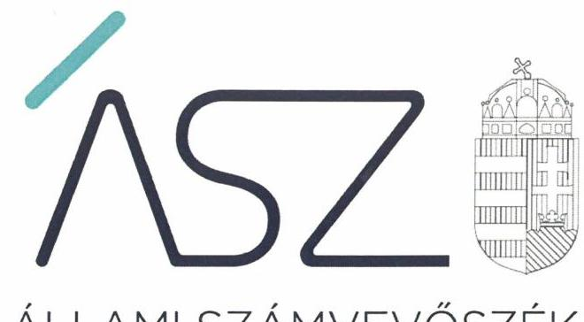
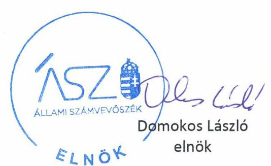
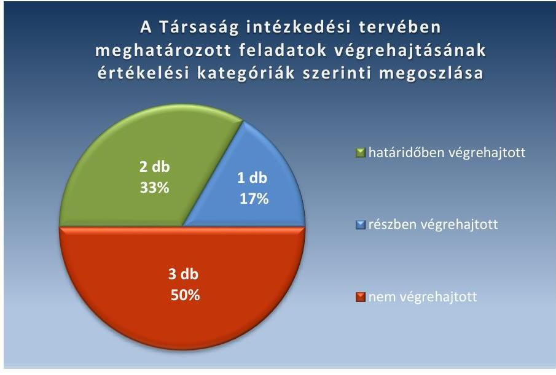

ÁLLAMI SZÁMVEVŐSZÉK

# JELENTÉS 

## Utóellenőrzések

Az állami tulajdonban lévő gazdálkodó szervezetek vagyonmegőrzési és gazdálkodási tevékenységének utóellenőrzése - Magyar Légimentő Nonprofit Kft.

2020
20046
www.asz.hu

---

ÁLLAMI SZÁMVEVŐSZÉK

# JELENTÉS 

## Utóellenőrzések

Az állami tulajdonban lévő gazdálkodó szervezetek vagyonmegőrzési és gazdálkodási tevékenységének utóellenőrzése - Magyar Légimentő Nonprofit Kft.
2020. 06 hó 09 nap

20046
www.asz.hu

---

# AZ ELLENŐRZÉST FELÜGYELTE: 

KAKAS SÁNDOR felügyeleti vezető
TÓTH MARIANNA felügyeleti vezető

AZ ELLENŐRZÉST VEZETTE ÉS A VÉGREHAJTÁSÁÉRT FELELŐS:
VERTKOVCZI MÁRIA ellenőrzésvezető

A PROGRAM ÖSSZEÁLLÍTÁSÁÉRT FELELŐS:
TÓTPÁL SZABOLCS osztályvezető

A TÉMÁHOZ KAPCSOLÓDÓ KORÁBBI SZÁMVEVŐSZÉKI JELENTÉSEK:

- címe: Az állami tulajdonban (résztulajdonban) lévő gazdálkodó szervezetek vagyonmegőrzési és gazdálkodási tevékenységének ellenőrzése Magyar Légimentő Nonprofit Kft.
- sorszáma: 19168

IKTATÓSZÁM: EL-2496-001/2020.
TÉMASZÁM: 2460
ELLENŐRZÉS-AZONOSÍTÓ SZÁM: V080467

---

# TARTALOMJEGYZÉK 

■ ÖSSZEGZÉS ..... 5
■ AZ ELLENŐRZÉS CÉLJA ..... 6
■ AZ ELLENŐRZÉS TERÜLETE ..... 7
■ AZ ELLENŐRZÉS HÁTTERE, INDOKOLTSÁGA ..... 8
■ A JELENTÉS LÉNYEGES KÉRDÉSKÖRE ..... 9
■ AZ ELLENŐRZÉS HATÓKÖRE ÉS MÓDSZEREI ..... 10
■ MEGÁLLAPÍTÁSOK ..... 12
■ MELLÉKLETEK ..... 15
I. sz. melléklet: A Magyar Légimentő Nonprofit Kft. intézkedési terve végrehajtásának értékelése ..... 15
■ FÜGGELÉK: ÉSZREVÉTELEK ..... 17
■ RÖVIDÍTÉSEK JEGYZÉKE ..... 21

---

.

---

# ÖSSZEGZÉS 

A Magyar Légimentő Nonprofit Kft. nem hajtotta végre az intézkedési tervében előirt összes feladatot, a vagyongazdálkodás területén a kockázatok nem csökkentek.

## Az ellenőrzés társadalmi indokoltsága

Az Állami Számvevőszék stratégiájában célul tűzte ki a számvevőszéki munka hasznosulásának javítását. Ezzel összhangban ellenőrzi, hogy az ellenőrzött szervezetek megvalósították-e a korábbi ellenőrzései által feltárt hibák, hiányosságok és szabálytalanságok megszüntetése céljából elkészített intézkedési tervekben foglaltakat. A rendszeres utóellenőrzések hozzájárulnak a szükséges intézkedések tényleges végrehajtáshoz, ezáltal a közpénzügyek rendezettségének javulásához.

## Főbb megállapítások, következtetések

A Magyar Légimentő Nonprofit Kft. az intézkedési tervben megfogalmazott hat feladatból kettőt határidőben, egyet részben és három feladatot nem hajtott végre.

A szabályozottság az intézkedési tervben meghatározott szabályzatok elkészítésével javult, ugyanakkor a szabályszerű elszámolások és a 2016. évi leltározás hiánya miatt a pénzügyi és vagyongazdálkodás területén a kockázatok nem csökkentek.

A Magyar Légimentő Nonprofit Kft. az átláthatóság javítása érdekében nyilvántartást vezetett az intézkedési tervben rögzített feladatok végrehajtásáról, illetve a honlapján közzétette az intézkedési tervben foglalt dokumentumok egy részét, azonban a hiányos közzététel miatt az átláthatóság területén azonosított kockázatok nem csökkentek.

---

# AZ ELLENŐRZÉS CÉLJA 

AZ ELLENŐRZÉS CÉLJA annak értékelése, hogy a számvevőszéki jelentésben foglalt intézkedést igénylő megállapításokkal összhangban készített intézkedési tervben meghatározott feladatokat az ellenőrzött szervezet végrehajtotta-e.

---

# AZ ELLENŐRZÉS TERÜLETE 

## Magyar Légimentő Nonprofit Korlátolt Felelősségű Társaság

A 2009. évben bejegyzett Magyar Légimentő Nonprofit Kft. egyszemélyes, közhasznú jogállású társaság, melynek Jogelődjét ${ }^{1}$ a 2005. évben a Magyar Állam képviseletében az OMSZ ${ }^{2}$ alapította. A Társaság ${ }^{3}$ kizárólagos feladata közhasznú tevékenységként az Eü. tv-ben ${ }^{4}$ szabályozott mentési, betegszállítási közfeladat ellátása, a légi mentés megszervezése Magyarországon.

A Magyar Légimentő NKft. társasági részesedése feletti tulajdonosi jogokat az OMSZ gyakorolja. A Társaság kormányzati szektorba sorolt egyéb szervezet, az ellenőrzött időszakban Magyarország területén hét légimentő-bázison végezte a tevékenységét.

Az ÁSZ ${ }^{5}$ 2016. évben ellenőrizte a Társaság vagyonmegőrzési és gazdálkodási tevékenységét a 2011-2014. évek tekintetében. Az ellenőrzés célja annak értékelése volt, hogy a tulajdonosi jogok gyakorlása szabályszerű volt-e, a Társaság által ellátott feladatok bevételei, ráfordításai elszámolásának és a vagyongazdálkodási tevékenységének a szabályozása megfelelte a jogszabályi és a tulajdonosi előírásoknak, valamint azok végrehajtása szabályszerű volt-e. Biztosítva volt-e a közfeladatok átláthatósága és elszámoltathatósága érdekében a közszolgáltatás díjának megalapozottsága szabályszerű önköltségszámítással. Az ellenőrzés kiterjedt továbbá arra is, hogy a vagyonváltozást eredményező döntések esetében a tulajdonosi jogok gyakorlója és a Társaság szabályszerűen járt-e el, továbbá, hogy a Társaság kiépített-e és múködtetett-e információs rendszert a szabályszerű vagyongazdálkodás érdekében. A Társaság, mint kormányzati szektorba sorolt egyéb szervezet gazdálkodásának a kormányzati szektor hiányára és az államadósságra befolyással bíró elemei a jogszabályi előírásoknak meg-feleltek-e. Az ellenőrzésről szóló 16168 sorszámú jelentését az ÁSZ 2016. október 19-én hozta nyilvánosságra.

---

# AZ ELLENŐRZÉS HÁTTERE, INDOKOLTSÁGA 

Az ÁSZ tv. 33. § (1) bekezdése értelmében a számvevőszéki jelentések intézkedést igénylő megállapításaihoz és javaslataihoz kapcsolódóan az ellenőrzött szervezet vezetője intézkedési tervet köteles összeállítani, és az Állami Számvevőszék részére megküldeni.

Az ÁSZ által befogadott intézkedési tervben foglaltak megvalósítását az ÁSZ törvény 33. § (7) bekezdésében foglaltak alapján - az Állami Számvevőszék utóellenőrzés keretében ellenőrizheti. Az utóellenőrzések keretében - az intézkedések értékelése során - az Állami Számvevőszék figyelembe veszi az ellenőrzött szervezetek működési feltételeiben, valamint a jogszabályi előírásokban bekövetkezett változásokat.

Az utóellenőrzés során az ÁSZ értékeli, hogy az érintett számvevőszéki jelentésben foglalt intézkedést igénylő megállapításokkal és javaslatokkal összhangban, az ellenőrzött szervezet által készített intézkedési tervben meghatározott feladatokat a feladatra kijelöltek végrehajtották-e.

Az intézkedések végrehajtásával az adott terület szabályszerű múködése vonatkozásában a kockázatok csökkenhetnek, azonban hosszabb távon az intézkedési tervben foglaltak végrehajtásával önmagában nem szűnnek meg, csak akkor, ha beépülnek az ellenőrzött szervezet múködésébe, azokat folyamatosan karban tartják, figyelembe véve, illetve kezelve a változásokat. Emellett az intézkedések végrehajtásáig újabb kockázatok merülhetnek fel a szabályszerű múködés vonatkozásában, amelyek kezelése szintén kiemelten fontos az ellenőrzött szervezet számára.

Az ellenőrzött szervezet vezetője által készített intézkedési tervekben foglalt feladatok hiányos, illetve késedelmes végrehajtása, vagy annak elmaradása a szabályszerűség és a felelős vezetői magatartás vonatkozásában kockázatot hordoz, ami azt mutatja, hogy az ellenőrzések során feltárt hibák, hiányosságok és szabálytalanságok kezelése nem kapott kellő hangsúlyt. Az utóellenőrzés során is fennálló szabálytalanságok esetén a közpénz, közvagyon veszélyeztetettségi kockázat valószínűsített hatásának értékelése további intézkedéseket vonhat maga után.

Az ellenőrzött szervezet szintjén az utóellenőrzés feltárja, hogy a szervezet az intézkedések végrehajtásával hasznosította-e a korábbi ellenőrzési jelentésben a hiányosságok megszüntetése, illetve a kockázatok kezelése érdekében megfogalmazott javaslatokat, illetve az intézkedések végrehajtása elmaradásának következtében továbbra is fennálló szabálytalanság esetén értékeli a közpénzek, közvagyon veszélyeztetettségét.

Az ÁSZ szintjén az utóellenőrzés visszacsatolást ad az ellenőrzési jelentések hasznosulásáról, az intézkedések elmaradásának, vagy részleges megvalósulásának a közpénzek, közvagyon veszélyeztetettségére gyakorolt valószínűsített hatásának értékelése, további intézkedéseket vonhat maga után.

---

# A JELENTÉS LÉNYEGES KÉRDÉSKÖRE 

A Társaság az intézkedési tervben foglaltakat az elöirt határidőben végrehajtotta-e?

---

# AZ ELLENŐRZÉS HATÓKÖRE ÉS MÓDSZEREI 

## Az ellenőrzés típusa

Megfelelőségi ellenőrzés.

## Az ellenőrzött időszak

Az utóellenőrzés alapját képező ÁSZ jelentés közzétételének napjától, az utóellenőrzésről szóló kiértesítő levél keltének napjáig, azaz 2016. október 19-étől 2019. augusztus 16-áig tartó időszak.

## Az ellenőrzés tárgya

A számvevőszéki jelentésben foglalt megállapításokkal összhangban - a Társaság által - készített intézkedési tervben foglaltak végrehajtásának ellenőrzése.

## Az ellenőrzött szervezet

- Magyar Légimentő Nonprofit Korlátolt Felelősségű Társaság

## Az ellenőrzés jogalapja

Az ellenőrzés jogszabályi alapját az ÁSZ tv. 33. § (7) bekezdésének előírása képezte.

## Az ellenőrzés módszerei

Az ÁSZ az ellenőrzést az ellenőrzött időszakban hatályos jogszabályok, az ellenőrzés szakmai szabályai, a jelen ellenőrzésre irányadó ÁSZ módszertanok, az ellenőrzési programban foglalt értékelési szempontok szerint végezte.

Az ÁSZ az ellenőrzés ideje alatt a Társasággal történő kapcsolattartást az ÁSZ SZMSZ6-ének vonatkozó előírásai alapján biztosította. Az utóellenőrzés megállapításait az ÁSZ rendelkezésére álló dokumentumok, valamint az ÁSZ adatbekérése szerint, a Társaság által rendelkezésre bocsátott dokumentumok alapozták meg.

Az ellenőrzési bizonyítékként felhasználható adatforrások közé tartoztak egyrészt az ellenőrzési program részletes szempontjainál felsorolt

---

adatforrások, másrészt minden - az ellenőrzés folyamán feltárt, az ellenőrzés szempontjából információt tartalmazó - dokumentum.

Az intézkedési tervben előírt feladatokat azok végrehajthatósága, illetve végrehajtása szempontjából az alábbiak szerint értékelte az ÁSZ:
$\longrightarrow$ „határidőben végrehajtott" a feladat, ha a teljesítés dokumentáltan, az intézkedési tervben előírt határidőben és tartalommal megtörtént;
$\longrightarrow$ „határidőn túl végrehajtott" a feladat, ha annak teljesítése az intézkedési tervben meghatározott módon, de az abban előírt határidőn túl történt meg;
$\longrightarrow$ „részben végrehajtott" a feladat, ha annak végrehajtása nem teljes körűen az intézkedési tervben előírt módon történt meg;
$\longrightarrow$ „nem végrehajtott" a feladat, ha a végrehajtás nem történt meg, dokumentumokkal nem igazolt annak teljesítése;
$\longrightarrow$ „okafogyottá vált" a feladat, ha végrehajtására - meghatározott esemény bekövetkezése, továbbá külső körülmény, a működést érintő feltétel változása miatt - már nincs szükség, illetve lehetőség, és egyértelműen megállapítható, hogy az intézkedést szükségessé tevő körülmény a jövőben nem fordulhat elő;
$\longrightarrow$ „nem időszerű" az a feladat, amelynek ellenőrzési időszakon belüli végrehajtására azért nem került (kerülhetett) sor, mert az intézkedés alapjául szolgáló esemény nem következett be, de annak jövőbeni előfordulása lehetséges, a végrehajtása nem volt esedékes, vagy a végrehajtás határideje még nem járt le.
Az ellenőrzés lefolytatásához a Társaság a tanúsítványok elektronikus kitöltésével, valamint az ÁSZ által kért dokumentumok elektronikus megküldésével szolgáltatott adatokat, amelyek valódiságát és teljes körűségét az ellenőrzött szervezet vezetője által tett teljességi és hitelességi nyilatkozat igazolta. Az így rendelkezésre bocsátott adatok, információk kontrollja az ellenőrzés keretében megtörtént.

---

# MEGÁLLAPÍTÁSOK 

## 1. A Társaság az intézkedési tervben foglaltakat az előírt határidőben végrehajtotta-e?

Összegző megállapítás

A Társaság az intézkedési tervben foglalt hat feladatból kettőt végrehajtott, egyet részben hajtott végre, három feladatot nem hajtott végre.

Az ÁSZ 16168. számú jelentése öt javaslatot tartalmazott a Társaság ügyvezetője részére az ellenőrzés során feltárt szabálytalanságok megszüntetése érdekében. Az ÁSZ javaslatainak végrehajtása céljából a Társaság 2016. november 15-én hat feladatot tartalmazó intézkedési tervet készített. Az intézkedési tervben meghatározott feladatokat, határidőket, a felelősöket és a feladatok végrehajtását az I. sz. melléklet tartalmazza.

Az intézkedési tervben a Társaság által megfogalmazott hat feladat végrehajtásának értékelési kategóriák szerinti megoszlását az 1. ábra szemlélteti.

1. ábra

A SZABÁLYOZOTTSÁG javítása érdekében a Társaság 2016. évben elkészítette az Önköltségszámítási szabályzatot ${ }^{7}$ és a közérdekú adatok megismerésére irányuló igények teljesítésére vonatkozó Szabályzatot ${ }^{8}$ (I. sz. melléklet 1-2. pontok).

A PÉNZÜGYI GAZDÁLKODÁS területén a kockázatok továbbra is fennálltak. A Társaság az intézkedési tervben foglalt anyagjellegú ráfordítások előírásszerű elszámolását nem hajtotta végre (I. sz. melléklet 5. pont). A Társaság az alapbér változásával összhangban a dolgozói munkaszerződések módosítását nem végezte el. (I. sz. melléklet 6. pont).

---

A VAGYONGAZDÁLKODÁS szabályszerűsége területén a kockázat maradt fenn, mivel a Társaság az intézkedési tervben vállalt, tárgyi eszközök 2016. év végi leltározását nem hajtotta végre (I. sz. melléklet 4. pont).

AZ ÁTLÁTHATÓSÁG javítása érdekében a Társaság, mint közfeladatot ellátó szerv közzétette a honlapján a társaságra vonatkozó alapvető jogszabályokat és szervezeti ábrát, továbbá az intézkedési tervben rögzített feladatok végrehajtásáról nyilvántartást vezetett. Azonban a szervezeti és múködési szabályzatát nem tette közzé a Társaság, ezért a múködés átláthatósága kockázatokat hordozott (I. sz. melléklet 3. pont).

---

.

---

# MELLÉKLETEK

■ I. SZ. MELLÉKLET: A MAGYAR LÉGIMENTŐ NONPROFIT KFT. INTÉZKEDÉSI TERVE VÉGREHAJTÁSÁNAK ÉRTÉKELÉSE

|  Sorszám | Az intézkedési tervben meghatározott feladat | Az intézkedési tervben meghatározott határidő | Az intézkedési tervben meghatározott feladatok elvégzésének felelőse 3. | A feladat végrehajtása 4.  |
| --- | --- | --- | --- | --- |
|   | 1. | 2. | 3. |   |
|   | Határidőben végrehajtott feladatok |  |  |   |
|  1. | El kell készíteni az önköltségszámítás rendjére vonatkozó belső szabályzatot, melynek tartalmazni kell az alkalmazott utókalkuláció módszerét is a Számv. tv. előírásainak megfelelően. | 2016. december 15. | gazdasági igazgató | A Társaság elkészítette és 2016. december 1-jével hatályba helyezte az Önköltségszámítási Szabályzatát. Az Önköltségszámítási Szabályzat a Számv. tv. ${ }^{9}$-ben foglalt előírásoknak megfelelően tartalmazta a vállalkozási tevékenységére vonatkozó, utókalkuláció módszerrel történő önköltségszámítási szabályokat.  |
|  2. | El kell készíteni a közérdekú adatok megismerésére irányuló igények teljesítése rendjének szabályozására vonatkozó belső szabályzatot az Info. tv. ${ }^{10}$ előírásainak megfelelően. | 2016. december 15. | gazdasági igazgató | A Társaság az Info tv.-ben foglaltaknak megfelelően elkészítette és 2016. december 1-jével hatályba helyezte a Szabályzatát, ami tartalmazta a közérdekú adatok megismerésére irányuló igények teljesítésének rendjét.  |
|   | Részben végrehajtott feladatok |  |  |   |
|  3. | Az Info tv. 1. mellékletének II/I. pontjában meghatározottak közül a társaság szervezeti felépítése, a vonatkozó alapvető jogszabályok és a szervezeti és müködési szabályzat közzététele megtörtént a társaság honlapján. | Az intézkedés megtörtént (2016. november 15-ig) | rendszergazda | Végrehajtott feladat: A Társaság a honlapján az intézkedési tervben foglalt határidőn túl (2018. augusztus 22-én), az Info. tv.-ben foglaltak alapján közzétette a rá vonatkozó alapvető jogszabályokat és a szervezeti ábrát.
Nem végrehajtott feladat: A Társaság az Info tv. 1. melléklet II/1. pontjában előírt szervezeti és müködési szabályzatot nem tette közzé.  |
|   | Nem végrehajtott feladatok |  |  |   |
|  4. | A tárgyi eszközök 2016. évi leltározását a belső szabályzat szerinti kell végrehajtani. A bérelt tárgyi eszközök mennyiségi leltározását is el kell végezni. | 2017. január 31. | gazdasági igazgató | A Társaság az intézkedési tervben előírtak ellenére a Leltározási szabályzat ${ }^{11}$ szerinti, tárgyi eszközök és bérelt tárgyi eszközök 2016. évi leltározását nem hajtotta végre.  |

---

|  Az intézkedési tervben meghatározott feladat | Az intézkedési tervben meghatározott határidő | Az intézkedési tervben meghatározott feladatok elvégzésének felelőse | A feladat végrehajtása  |
| --- | --- | --- | --- |
|  1. | 2. | 3. | 4.  |
|  5. | A társaság 2016. január 1-jétől új könyvelő céggel kötött szerződést, melynek eredményeként a 2016. évben az anyagjellegű ráfordítások elszámolása teljes körűen a Számviteli tv. 165. §-ának megfelelően kerülnek elszámolásra. | Az intézkedés megtörtént (2016. november 15-ig) | gazdasági igazgató  |
|  6. | A társaság már gondoskodott a munkaszerződések módosításáról az alapbérek emelésének megfelelően. | Az intézkedés megtörtént (2016. november 15-ig) | ügyvezető igazgató  |

---

# FÜGGELÉK: ÉSZREVÉTELEK 

A jelentéstervezetet a Számvevőszék 15 napos észrevételezésre megküldte az ellenőrzött szervezet vezetőjének az ÁSZ tv. 29. §* (1) bekezdése előírásának megfelelően.

A Magyar Légimentő Nonprofit Kft. ügyvezetője a jelentéstervezet megállapításaira írásban észrevételt tett.
Az ÁSZ tv. 29. § (3) bekezdésével összhangban az ÁSZ a Függelékben feltünteti az ellenőrzés megállapításaival kapcsolatban tett, figyelembe nem vett észrevételeket, és megindokolja, hogy azokat miért nem fogadta el.

[^0]
[^0]:    * 29. § (1) Az Állami Számvevőszék az ellenőrzési megállapításait megküldi az ellenőrzött szervezet vezetőjének vagy az általa megbízott személynek, és annak, akinek személyes felelősségét állapította meg.
    (2) Az ellenőrzött szervezet vezetője és a felelősként megjelölt személy az ellenőrzés megállapításaira tizenöt napon belül írásban észrevételt tehet.
    (3) Az Állami Számvevőszék az észrevételre a beérkezésétől számított harminc napon belül írásban válaszol. A figyelembe nem vett észrevételeket köteles a jelentésben feltüntetni, és megindokolni, hogy azokat miért nem fogadta el.

---

Az „Utóellenőrzések - Az állami tulajdonban lévő gazdálkodó szervezetek vagyonmegőrzési és gazdálkodási tevékenységének utóellenőrzése - Magyar Légimentő Nonprofit Kft." címmel készített számvevőszéki jelentéstervezet megállapításaival kapcsolatban az ügyvezető által a 9008-1/2020. iktatószámú levélben megküldött el nem fogadott észrevételek és azok kezelésének indokolása.

# 1. Az I. melléklet 3. pontjával kapcsolatos észrevétel: 

Az ügyvezető észrevételében jelezte, hogy a Társaság szervezeti és működési szabályzatát valóban nem a teljes terjedelemben tették közzé, mivel az nem teljes terjedelmében publikus, üzleti titoknak minősül.

Az ÁSZ az ÁSZ tv. 33. § (7) bekezdésében foglaltak szerint az intézkedési tervben foglaltak megvalósítását ellenőrzi az utóellenőrzés keretében. Az intézkedési tervben foglaltak szerint „Az Info tv. 1. mellékletének II/I. pontjában meghatározottak közül a társaság szervezeti felépítése, a vonatkozó alapvető jogszabályok és a szervezeti és működési szabályzat közzététele megtörtént a társaság honlapján.". Az intézkedési terv feladata nem azt rögzítette, hogy a szervezeti és működési szabályzat kizárólag publikus részét tették közzé 2016. november 15-ig. Az észrevételben rögzítettek is megerősítik, hogy a Társaság szervezeti és működési szabályzata nem a teljes terjedelemben került feltöltésre. Az adatszolgáltatásra nyitva álló határidőn belül továbbá nem bocsátottak az ellenőrzés rendelkezésére arra vonatkozó dokumentumot, amely igazolná, hogy a szervezeti és működési szabályzat üres oldalai üzleti titok miatt nem kerültek közzétételre. Az előbbiekre tekintettel az észrevételt nem fogadjuk el, a jelentéstervezet jelen pontban érintett részének módosítása nem indokolt.

## 2. Az I. melléklet 4. pontjával kapcsolatos észrevétel

Az ügyvezető észrevételében jelezte, hogy a Társaság a 2016. év végi leltározását elvégezte, az erről szóló dokumentumok az adatszolgáltatás során feltöltésre kerültek, a helyszíni leltárak és azok kiértékelései azonban nem, ellenben azokat bármikor be tudja mutatni a Társaság.

Az ÁSZ az ellenőrzési megállapításait az adatszolgáltatás során a részére törvényi határidőben rendelkezésre bocsátott dokumentumokra alapozva fogalmazza meg. A teljességi és hitelességi nyilatkozatuk szerint az ÁSZ részére átadott dokumentumok, adatok megbízhatóak, és a bekért adatokra, dokumentumokra vonatkozóan teljes körű információt tartalmaznak. A teljességi és hitelességi nyilatkozat alapján a Társaság a tárgyi eszközök és a bérelt tárgyi eszközök 2016. évi Leltározási szabályzat szerinti leltározását igazoló dokumentumot nem bocsátott az ellenőrzés rendelkezésére, amelyet az észrevételben foglaltak is megerősítenek. Az előbbiekre tekintettel az észrevételt nem fogadjuk el, a jelentéstervezet jelen pontban érintett részének módosítása nem indokolt.

## 3. Az I. melléklet 5. pontjával kapcsolatos észrevétel

Az ügyvezető észrevételében jelezte, hogy az adatszolgáltatás során ehhez a ponthoz a könyvelő cég nyilatkozatát töltötték fel, amely szerint az általuk alkalmazott könyvelési program zárt rendszerú múködésében, a bizonylati formának megfelelő naplóban kerülnek rögzítésre a gazdasági események, így azok visszakövethetőek. A Társaság minden gazdasági eseményéről, múveletéről, amelyek az eszközöket és a forrásokat befolyásolnák, a kiállított és befogadott bizonylatok tartalmi feldolgozásával összhangban történik. Mindezeket a Társaság be tudja mutatni.

A Társaság az anyagjellegú ráfordítások jogszabály szerinti elszámolás igazolásának dokumentumaként a könyvelést végző társaság nyilatkozatát csatolta, amely szerint az általuk alkalmazott könyvelési program zárt rendszerú múködésében, a bizonylati formának megfelelő naplóban kerülnek a gazdasági események rögzítésre. A könyvelő cég nyilatkozata nem bizonyítja, hogy az anyagjellegú ráfordítások elszámolása a Számv. tv. 165. §-ában előírtaknak megfelelően történt. Az ÁSZ az ellenőrzési megállapításait az adatszolgáltatás során a részére törvényi határidőben rendelkezésre bocsátott dokumentumokra alapozva fogalmazza meg. A teljességi és hitelességi nyilatkozatuk szerint az ÁSZ részére átadott dokumentumok, adatok megbízhatóak, és a bekért adatokra, dokumentumokra vonatkozóan teljes körű információt tartalmaznak. Az előbbiekre tekintettel az észrevételt nem fogadjuk el, a jelentéstervezet jelen pontban érintett részének módosítása nem indokolt.

## 4. Az I. melléklet 6. pontjával kapcsolatos észrevétel

Az ügyvezető észrevételében jelezte, hogy a Társaság a 2016. évtől kezdődően az adatszolgáltatás során feltöltött

---

Munkaszerződés módosítási formát alkalmazza az alapbérek emelése során. Konkrét szerződést a GDPR szabályozás miatt nem mutattak be, azok azonban a Társaságnál rendelkezésre állnak.

Az ÁSZ az ellenőrzési megállapításait az adatszolgáltatás során a részére törvényi határidőben rendelkezésre bocsátott dokumentumokra alapozva fogalmazza meg. A teljességi és hitelességi nyilatkozatuk szerint az ÁSZ részére átadott dokumentumok, adatok megbízhatóak, és a bekért adatokra, dokumentumokra vonatkozóan teljes körű információt tartalmaznak. A teljességi és hitelességi nyilatkozat alapján a Társaság az adatszolgáltatás során a munkaszerződések alapbérek szerinti módosítását igazoló dokumentumát nem bocsátotta az ellenőrzés rendelkezésére. A szerződésmódosítási nyomtatvány nem igazolja az intézkedési tervben foglalt feladat végrehajtását, azt hogy a társaság már gondoskodott a munkaszerződések módosításáról az alapbérek emelésének megfelelően. Az ÁSZ az ellenőrzés vonatkozásában az ÁSZ tv. 27. §-ában meghatározottak szerinti adatkezelési, illetve adatvédelmi szabályok alkalmazásával jár el, a kapott információkat csak az ellenőrzés során használja fel, a minősített adatokat, védett titkokat bizalmasan kezeli. Az adatvédelmi szabályokról az EL-1533-001/2019. iktatószámú levél 1. számú „Tájékoztató az adatvédelmi szabályokról és az ellenőrzött szervezet közreműködési kötelezettségéről" című mellékletében adtunk tájékoztatást Ügyvezető úr részére. Továbbá a hivatkozott adatbekérő levél 2. oldalának 2. bekezdése tartalmazza, hogy amennyiben az elektronikus úton történő adatszolgáltatás lehetőségével nem kíván, vagy nem tud élni, ezt szíveskedjen soron kívül jelezni a megadott e-mail címre vagy az ÁSZ postacímére. A Társaság részéről arra vonatkozó jelzés, hogy az adatszolgáltatási kötelezettségüknek elektronikus formában történő teljesítésének bármi akadálya lenne, nem érkezett. Az előbbiekre tekintettel az észrevételt nem fogadjuk el, a jelentéstervezet jelen pontban érintett részének módosítása nem indokolt.

---

.

---

# RÖVIDÍTÉSEK JEGYZÉKE 

${ }^{1}$ Jogelőd
${ }^{2}$ OMSZ
${ }^{3}$ Társaság
${ }^{4}$ Eü. tv.
${ }^{5}$ ÁSZ
${ }^{6}$ ÁSZ SZMSZ
${ }^{7}$ Önköltségszámítási Szabályzat
${ }^{8}$ Szabályzat
${ }^{9}$ Számv.tv.
${ }^{10}$ Info tv.
${ }^{11}$ Leltározási szabályzat

OMSZ Légimentő Közhasznú Társaság
Országos Mentőszolgálat
Magyar Légimentő Nonprofit Korlátolt Felelősségű Társaság
1997. évi CLIV. törvény, az egészségügyről (hatályos: 1998. július 1-jétől)
Állami Számvevőszék
Az Állami Számvevőszék szervezeti és működési szabályzata
Magyar Légimentő NKft. önköltségszámítási szabályzata (hatályos: 2016. december 1-jétől)
Magyar Légimentő NKft. közérdekű adatok megismerésére irányuló kérelmek intézésének, továbbá a kötelezően közzéteendő adatok nyilvánosságra hozatalának rendjéről szóló szabályzata (hatályos: 2016. december 1-jétől
2000. évi C. törvény a számvitelről (hatályos: 2001. január 1-jétől)
2011. CXII. törvény az információs önrendelkezési jogról és az információszabadságról (hatályos: 2011. július 27-étől)
Magyar Légimentő NKft. - Eszközök és források leltározási és selejtezési szabályzata (hatályos: 2016. december 1-jétől)

---

# ASZ 

ALLAMI SZAMVEVOSZEK
1052 Budapest, Apáczai Cs. J. u. 10. I 1364 Budapest 4. Pf. 54 TEL: +36 14849100
email: szamvevoszek@asz.hu
web: www.asz.hu | www.aszhirportal.hu