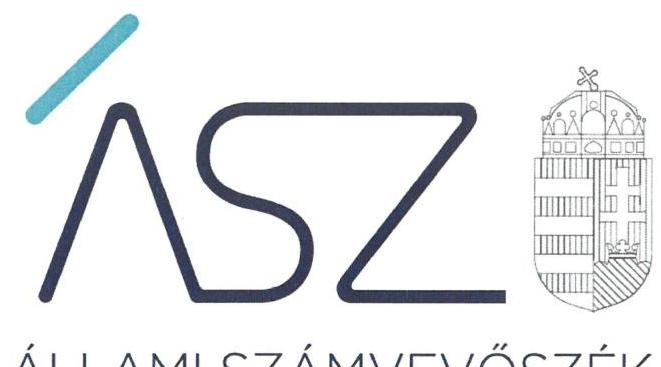
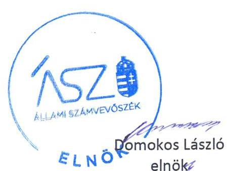
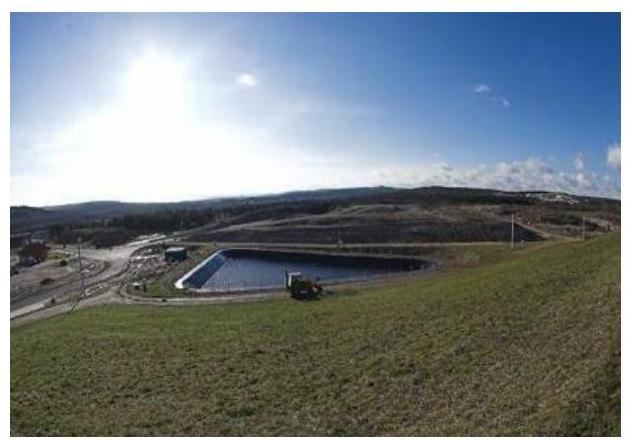
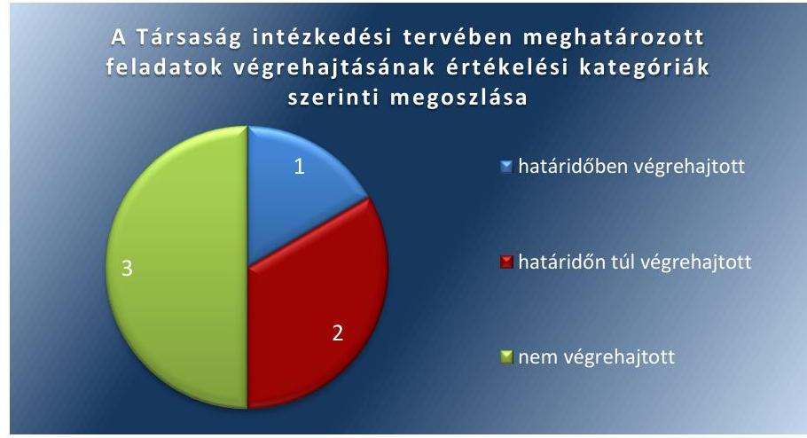

ÁLLAMI SZÁMVEVŐSZÉK

# JELENTÉS 

## Utóellenőrzések

Az állami tulajdonban lévő gazdálkodó szervezetek vagyonmegőrzési és gazdálkodási tevékenységének utóellenőrzése - Nitrokémia Környezetvédelmi Tanácsadó és Szolgáltató Zrt.

2020
20047
www.asz.hu

---

ÁLLAMI SZÁMVEVŐSZÉK

# JELENTÉS 

## Utóellenőrzések

Az állami tulajdonban lévő gazdálkodó szervezetek vagyonmegőrzési és gazdálkodási tevékenységének utóellenőrzése - Nitrokémia Környezetvédelmi Tanácsadó és Szolgáltató Zrt.

2020. 

C3. hó 3 ( nap

20047
www.asz.hu

---

# AZ ELLENŐRZÉST FELÜGYELTE: 

KAKAS SÁNDOR felügyeleti vezető
TÓTH MARIANNA felügyeleti vezető

AZ ELLENŐRZÉST VEZETTE ÉS A VÉGREHAJTÁSÁÉRT FELELŐS:
VERTKOVCZI MÁRIA ellenőrzésvezető

A PROGRAM ÖSSZEÁLLÍTÁSÁÉRT FELELŐS:
TÓTPÁL SZABOLCS osztályvezető

A TÉMÁHOZ KAPCSOLÓDÓ KORÁBBI SZÁMVEVŐSZÉKI JELENTÉSEK:

- címe: Az állami tulajdonban (résztulajdonban) lévő gazdálkodó szervezetek vagyonmegőrzési és gazdálkodási tevékenységének ellenőrzése - Nitrokémia Környezetvédelmi Tanácsadó és Szolgáltató Zrt.
- sorszáma: 16094

IKTATÓSZÁM: EL-2497-001/2020.
TÉMASZÁM: 2460
ELLENŐRZÉS-AZONOSÍTÓ SZÁM: V080470

---

# TARTALOMJEGYZÉK 

■ ÖSSZEGZÉS ..... 5
■ AZ ELLENŐRZÉS CÉLJA ..... 6
■ AZ ELLENŐRZÉS TERÜLETE ..... 7
■ AZ ELLENŐRZÉS HÁTTERE, INDOKOLTSÁGA ..... 8
■ A JELENTÉS LÉNYEGES KÉRDÉSKÖRE ..... 9
■ AZ ELLENŐRZÉS HATÓKÖRE ÉS MÓDSZEREI ..... 10
■ MEGÁLLAPÍTÁSOK ..... 12
■ MELLÉKLETEK ..... 15
I. sz. melléklet: Nitrokémia Környezetvédelmi Tanácsadó és Szolgáltató Zrt. intézkedési terve végrehajtásának értékelése ..... 15
■ FÜGGELÉK: ÉSZREVÉTELEK ..... 17
■ RÖVIDÍTÉSEK JEGYZÉKE ..... 21

---

.

---

# ÖSSZEGZÉS 

A Nitrokémia Környezetvédelmi Tanácsadó és Szolgáltató Zrt. nem hajtotta végre az intézkedési tervében elöirt összes feladatot, ezért a vagyongazdálkodás területén a kockázatok nem csökkentek.

## Az ellenőrzés társadalmi indokoltsága

Az Állami Számvevőszék stratégiájában célul tűzte ki a számvevőszéki munka hasznosulásának javítását. Ezzel összhangban ellenőrzi, hogy az ellenőrzött szervezetek megvalósították-e a korábbi ellenőrzései által feltárt hibák, hiányosságok és szabálytalanságok megszüntetése céljából elkészített intézkedési tervekben foglaltakat. A rendszeres utóellenőrzések hozzájárulnak a szükséges intézkedések tényleges végrehajtáshoz, ezáltal a közpénzügyek rendezettségének javulásához.

## Főbb megállapítások, következtetések

A Nitrokémia Környezetvédelmi Tanácsadó és Szolgáltató Zrt. az intézkedési tervben megfogalmazott hat feladatból egyet határidőben, kettőt határidőn túl hajtott végre, hármat nem hajtott végre.

A szabályozottság a végrehajtott intézkedések következtében javult, ugyanakkor a leltározási szabályzat nem felelt meg a jogszabályi előírásoknak és így nem biztosította a szabályszerű leltár elkészítését. A korábbi szabálytalanságok körülményeinek és felelőseinek feltárása céljából az intézkedési tervben előírt belső vizsgálat, továbbá a folyamatba épített jogszabálykövetés nem valósult meg, így azok nem javították a vagyongazdálkodás átláthatóságát, elszámoltathatóságát és szabályszerűségét.

---

# AZ ELLENŐRZÉS CÉLJA 

AZ ELLENŐRZÉS CÉLJA annak értékelése, hogy a számvevőszéki jelentésben foglalt intézkedést igénylő megállapításokkal összhangban készített intézkedési tervben meghatározott feladatokat az ellenőrzött szervezet végrehajtotta-e.

---

# **AZ ELLENŐRZÉS TERÜLETE**

## **Nitrokémia Környezetvédelmi Tanácsadó és Szolgáltató Zrt.**

Az állami tulajdonú Nitrokémia Zrt.1 az 1921-ben alapított Magyar Lőporgyárüzemi Rt. jogutódjaként az 1993-as évben alakult. A tulajdonosi jogokat az MNV Zrt.2 gyakorolja. A Társaság3 fő feladata a környezeti kárelhárítás, amelyet állami felelősségvállalással, jogszabályi kötelezettség4 alapján lát el.

A Társaság fő tevékenységei a környezetvédelmi kármentesítés, a szennyvízkezelés és a vagyonkezelés.

A Társaság az ellenőrzött időszakban kormányzati szektorba sorolt egyéb szervezetnek minősült.

Az ÁSZ5 2016. évben ellenőrizte a Társaság vagyonmegőrzési és gazdálkodási tevékenységét a 2011-2014. évekre vonatkozóan. Az ellenőrzés célja annak értékelése volt, hogy a tulajdonosi jogok gyakorlása szabályszerű volt-e, a Társaság által ellátott feladatok bevételei, ráfordításai elszámolásának és a vagyongazdálkodási tevékenységének a szabályozása megfelelte-e a jogszabályi és a tulajdonosi előírásoknak, valamint azok végrehajtása szabályszerű volt-e. Biztosítva volt-e a közfeladatok átláthatósága és elszámoltathatósága érdekében a közszolgáltatás díjának megalapozottsága szabályszerű önköltségszámítással. Az ellenőrzés kiterjedt továbbá arra is, hogy a vagyonváltozást eredményező döntések esetében a tulajdonosi jogok gyakorlója és a Társaság szabályszerűen járt-e el, továbbá, hogy a Társaság kiépített-e, illetve működtetett-e információs rendszert a szabályszerű vagyongazdálkodás érdekében. A Társaság, mint kormányzati szektorba sorolt egyéb szervezet gazdálkodásának a kormányzati szektor hiányára és az államadósságra befolyással bíró elemei a jogszabályi előírásoknak megfeleltek-e. Az ellenőrzésről szóló 16094. sorszámú jelentését az ÁSZ 2016. július 21-én hozta nyilvánosságra.

---

# AZ ELLENŐRZÉS HÁTTERE, INDOKOLTSÁGA 

Az ÁSZ tv. 33. § (1) bekezdése értelmében a számvevőszéki jelentések intézkedést igénylő megállapításaihoz és javaslataihoz kapcsolódóan az ellenőrzött szervezet vezetője intézkedési tervet köteles összeállítani, és az Állami Számvevőszék részére megküldeni.

Az ÁSZ által befogadott intézkedési tervben foglaltak megvalósítását az ÁSZ törvény 33. § (7) bekezdésében foglaltak alapján - az Állami Számvevőszék utóellenőrzés keretében ellenőrizheti. Az utóellenőrzések keretében - az intézkedések értékelése során - az Állami Számvevőszék figyelembe veszi az ellenőrzött szervezetek működési feltételeiben, valamint a jogszabályi előírásokban bekövetkezett változásokat.

Az utóellenőrzés során az ÁSZ értékeli, hogy az érintett számvevőszéki jelentésben foglalt intézkedést igénylő megállapításokkal és javaslatokkal összhangban, az ellenőrzött szervezet által készített intézkedési tervben meghatározott feladatokat a feladatra kijelöltek végrehajtották-e.

Az intézkedések végrehajtásával az adott terület szabályszerű múködése vonatkozásában a kockázatok csökkenhetnek, azonban hosszabb távon az intézkedési tervben foglaltak végrehajtásával önmagában nem szűnnek meg, csak akkor, ha beépülnek az ellenőrzött szervezet múködésébe, azokat folyamatosan karban tartják, figyelembe véve, illetve kezelve a változásokat. Emellett az intézkedések végrehajtásáig újabb kockázatok merülhetnek fel a szabályszerű múködés vonatkozásában, amelyek kezelése szintén kiemelten fontos az ellenőrzött szervezet számára.

Az ellenőrzött szervezet vezetője által készített intézkedési tervekben foglalt feladatok hiányos, illetve késedelmes végrehajtása, vagy annak elmaradása a szabályszerűség és a felelős vezetői magatartás vonatkozásában kockázatot hordoz, ami azt mutatja, hogy az ellenőrzések során feltárt hibák, hiányosságok és szabálytalanságok kezelése nem kapott kellő hangsúlyt. Az utóellenőrzés során is fennálló szabálytalanságok esetén a közpénz, közvagyon veszélyeztetettségi kockázat valószínűsített hatásának értékelése további intézkedéseket vonhat maga után.

Az ellenőrzött szervezet szintjén az utóellenőrzés feltárja, hogy a szervezet az intézkedések végrehajtásával hasznosította-e a korábbi ellenőrzési jelentésben a hiányosságok megszüntetése, illetve a kockázatok kezelése érdekében megfogalmazott javaslatokat, illetve az intézkedések végrehajtása elmaradásának következtében továbbra is fennálló szabálytalanság esetén értékeli a közpénzek, közvagyon veszélyeztetettségét.

Az ÁSZ szintjén az utóellenőrzés visszacsatolást ad az ellenőrzési jelentések hasznosulásáról, az intézkedések elmaradásának, vagy részleges megvalósulásának a közpénzek, közvagyon veszélyeztetettségére gyakorolt valószínűsített hatásának értékelése, további intézkedéseket vonhat maga után.

---

# A JELENTÉS LÉNYEGES KÉRDÉSKÖRE 

- A Társaság az intézkedési tervben foglaltakat az elöirt határidőben végrehajtotta-e?

---

# AZ ELLENŐRZÉS HATÓKÖRE ÉS MÓDSZEREI 

## Az ellenőrzés típusa

Megfelelőségi ellenőrzés.

## Az ellenőrzött időszak

Az utóellenőrzés alapját képező ÁSZ jelentés közzétételének napjától, az utóellenőrzésről szóló kiértesítő levél keltének napjáig, azaz 2016. július 21-étől 2019. augusztus 16-áig tartó időszak.

## Az ellenőrzés tárgya

A számvevőszéki jelentésben foglalt megállapításokkal összhangban - a Társaság által - készített intézkedési tervben foglaltak végrehajtásának ellenőrzése.

## Az ellenőrzött szervezet

- Nitrokémia Környezetvédelmi Tanácsadó és Szolgáltató Zártkörűen Müködő Részvénytársaság.

## Az ellenőrzés jogalapja

Az ellenőrzés jogszabályi alapját az ÁSZ tv. 33. § (7) bekezdésének előírása képezte.

## Az ellenőrzés módszerei

Az ÁSZ az ellenőrzést az ellenőrzött időszakban hatályos jogszabályok, az ellenőrzés szakmai szabályai, a jelen ellenőrzésre irányadó ÁSZ módszertanok, az ellenőrzési programban foglalt értékelési szempontok szerint végezte.

Az ÁSZ az ellenőrzés ideje alatt a Társasággal történő kapcsolattartást az ÁSZ SZMSZ6-ének vonatkozó előírásai alapján biztosította. Az utóellenőrzés megállapításait az ÁSZ rendelkezésére álló dokumentumok, valamint az ÁSZ adatbekérése szerint, a Társaság által rendelkezésre bocsátott dokumentumok alapozták meg.

Az ellenőrzési bizonyítékként felhasználható adatforrások közé tartoztak egyrészt az ellenőrzési program részletes szempontjainál felsorolt

---

adatforrások, másrészt minden - az ellenőrzés folyamán feltárt, az ellenőrzés szempontjából információt tartalmazó - dokumentum.

Az intézkedési tervben előírt feladatokat azok végrehajthatósága, illetve végrehajtása szempontjából az alábbiak szerint értékelte az ÁSZ:
— „határidőben végrehajtott" a feladat, ha a teljesítés dokumentáltan, az intézkedési tervben előírt határidőben és tartalommal megtörtént;
— „határidőn túl végrehajtott" a feladat, ha annak teljesítése az intézkedési tervben meghatározott módon, de az abban előírt határidőn túl történt meg;
— „részben végrehajtott" a feladat, ha annak végrehajtása nem teljes körűen az intézkedési tervben előírt módon történt meg;
— „nem végrehajtott" a feladat, ha a végrehajtás nem történt meg, dokumentumokkal nem igazolt annak teljesítése;
— „okafogyottá vált" a feladat, ha végrehajtására - meghatározott esemény bekövetkezése, továbbá külső körülmény, a működést érintő feltétel változása miatt - már nincs szükség, illetve lehetőség, és egyértelműen megállapítható, hogy az intézkedést szükségessé tevő körülmény a jövőben nem fordulhat elő;
— „nem időszerű" az a feladat, amelynek ellenőrzési időszakon belüli végrehajtására azért nem került (kerülhetett) sor, mert az intézkedés alapjául szolgáló esemény nem következett be, de annak jövőbeni előfordulása lehetséges, a végrehajtása nem volt esedékes, vagy a végrehajtás határideje még nem járt le.
Az ellenőrzés lefolytatásához a Társaság a tanúsítványok elektronikus kitöltésével, valamint az ÁSZ által kért dokumentumok elektronikus megküldésével szolgáltatott adatokat, amelyek valódiságát és teljes körűségét az ellenőrzött szervezet vezetője által tett teljességi és hitelességi nyilatkozat igazolta. Az így rendelkezésre bocsátott adatok, információk kontrollja az ellenőrzés keretében megtörtént.

---

# MEGÁLLAPÍTÁSOK 

## A Társaság az intézkedési tervben foglaltakat az előírt határidőben végrehajtotta-e?

Összegző megállapítás

A Társaság az intézkedési tervben foglalt hat feladatból egyet határidőben, kettőt határidőn túl végrehajtott és három feladatot nem hajtott végre.

Az ÁSZ 16094. számú jelentése két javaslatot tartalmazott a Társaság vezérigazgatója részére az ellenőrzés során feltárt szabálytalanságok megszüntetése érdekében. A Társaság 2016. augusztus 16-án hat feladatot tartalmazó intézkedési tervet készített az ÁSZ javaslatainak végrehajtására. Az intézkedési tervben meghatározott feladatokat, határidőket, a felelősöket és a feladatok végrehajtását az I. sz. melléklet tartalmazza.

Az intézkedési tervben a Társaság által megfogalmazott hat feladat végrehajtásának értékelési kategóriák szerinti megoszlását az 1. ábra szemlélteti.

1. ábra

A SZABÁLYOZOTTSÁG javítása érdekében a Társaság intézkedett a Beszerzési szabályzat ${ }^{7}$ módosításáról, melyben a beszerzési csoport feladataként meghatározta, hogy a szerződések megkötése előtt vizsgálják a beszerzést korlátozó jogszabályok és a tulajdonosi előírások szerinti engedélyezés szükségességét és a közbeszerzési előírások betartását (I. sz. melléklet 3. pont). A Társaság a 2016. évtől az éves ellenőrzési tervekben előírta a belső szabályzatok jogszabályi megfelelőségének felülvizsgálatát (I. számú melléklet 1-2. pontok).

A VAGYONGAZDÁLKODÁS területén azonban kockázat maradt fenn, a Leltározási szabályzat ${ }^{8}$ nem felelt meg a jogszabályban foglalt előírásoknak (I. számú melléklet 4. pont). A Társaság a közbeszerzési eljárás

---

mellőzésével, valamint az államháztartásért felelős miniszter hozzájárulása nélkül kötött szerződések esetén a szabálytalanságok körülményeiről és a szakmai felelősség megállapítása céljából a belső vizsgálatot nem végezte el (I. számú melléklet 5. pont). A Társaság az intézkedési tervben foglaltak ellenére jogi szolgáltatási szerződés kiegészítéssel, a jogszabályi változásokról készített írásbeli jelentésekkel nem rendelkezett (I. számú melléklet 6. pont).

---

.

---

# MELLÉKLETEK

■ I. SZ. MELLÉKLET: NITROKÉMIA KÖRNYEZETVÉDELMI TANÁCSADÓ ÉS SZOLGÁLTATÓ ZRT. INTÉZKEDÉSI TERVE VÉGREHAJTÁSÁNAK ÉRTÉKELÉSE

|  Sorszám | Az intézkedési tervben meghatározott feladat | Az intézkedési tervben meghatározott határidő 2. | Az intézkedési tervben meghatározott feladatok elvégzésének a felelőse 3. Határidőben végrehajtott feladat | A feladat végrehajtása 4.  |
| --- | --- | --- | --- | --- |
|  1. | A belső szabályzatok jogszabályi megfelelőségének a belső ellenőrzés általi rendszeres felülvizsgálata, 2017. évtől a vizsgálat elvégzésének az éves belső ellenőrzési tervekben történő előírása. | folyamatos | ellenőrzési és koordinációs osztályvezető | A 2017-2019. években a Társaság az éves belső ellenőrzési tervekben előírta a belső szabályzatok jogszabályi megfelelőségének felülvizsgálatát. A belső ellenőr a felülvizsgálatokat 2017-2018. évben végrehajtotta.  |
|   | Határidőn túl végrehajtott feladatok |  |  |   |
|  2. | A belső szabályzatok jogszabályi megfelelőségének a belső ellenőrzés általi rendszeres felülvizsgálata, és e vizsgálatnak a 2016. év hátralévő időszakának vizsgálatai közé terven felüli vizsgálatként való felvétele és lefolytatása. | 2016. november 30. | ellenőrzési és koordinációs osztályvezető | A belső ellenőr a belső szabályzatok jogszabályi megfelelőségi vizsgálatának felülvizsgálatáról a terven felüli ellenőrzést 2016. december 9-én végezte el.  |
|  3. | A Beszerzési szabályzat módosításával a beszerzési csoportnak elő kell írni, hogy minden szerződés megkötése előtt vizsgálja a jogszabály és tulajdonosi előírás szerinti engedélyezés szükségességét és a közbeszerzési előírások betartását, melynek eredményéről írásban nyilatkozni kell. | Az intézkedési terv ÁSZ általi elfogadásának időpontját követő 20 napon belül (2016. szeptember 21.) | vállalkozási igazgató | A Társaság vezérigazgatója által 2016. szeptember 26-án jóváhagyott, és 2016. november 1-jétől hatályos Közbeszerzési és beszerzési szabályzat előírta, hogy a beszerzési csoport feladata a szerződéskötések előtt a beszerzést korlátozó jogszabályok és a tulajdonosi előírások szerinti engedélyezés vizsgálata, a közbeszerzési előírások betartása, továbbá írásban nyilatkoznia kell e vizsgálat eredményéről.  |
|   | Nem végrehajtott feladatok |  |  |   |
|  4. | a Társaság Leltározási szabályzatának megfeleltetése a hatályos Számviteli törvényben meghatározottaknak. A feladat keretén belül- az intézkedési terv elkészítéséig megtett feladat: a Leltározási szabályzat 2015.05.14-én a Számviteli törvény előírásainak megfelelően módosításra került. | 2015. május 14. | ellenőrzési és koordinációs osztályvezető | A Társaság Leltározási szabályzata nem felelt meg a hatályos Számv. tv9-ben foglaltaknak. A 2015. május 14-étől hatályos Leltározási szabályzat 5. a. pontja alapján az immateriális javakat a Társaság csak értékben tartja nyilván és előírja, hogy a leltározását évente „célszerű" elvégezni. A Leltározási Szabályzat 5. b. pontjában foglaltak alapján a Társaság előírja, hogy a tulajdonában lévő szoftver termékeket (immateriális javakat) kétévenként kell leltározni, a Számv. tv. 69. § (3) bekezdésében foglaltak ellenére, amely szerint a csak értékben nyilvántartott eszközöknél a leltározást minden üzleti év mérlegforduló napjára vonatkozóan egyeztetéssel el kell végezni.  |

---

|  Az intézkedési tervben meghatározott feladat | Az intézkedési tervben meghatározott határidő | Az intézkedési tervben meghatározott feladatok elvégzésének a felelőse | A feladat végrehajtása  |
| --- | --- | --- | --- |
|  1. | Belső ellenőrzési vizsgálat a közbeszerzési eljárások mellőzésével kötött szerződésekkel, valamint az államháztartásért felelős miniszter hozzájárulása nélkül kötött lizingszerződéssel kapcsolatos szabálytalanság tekintetében. A belső vizsgálat kiterjed a körülmények, a személyi és szakmai felelősség tisztázására a szükség szerinti felelősségre vonás kezdeményezése céljából. | Belső vizsgálat kezdete: 2016. augusztus 1. belső vizsgálat befejezése: 2016. augusztus 31. | ellenőrzési és koordinációs osztályvezető, belső ellenőr  |
|  6. | A Társaság jogi szolgáltatási szerződésének kiegészítése a jogszabályfigyeléssel és a változásokról készített írásbeli jelentés rendszeres, hetente történő megküldésével. | Az intézkedési terv véglegesítése - ÁSZ által történő elfogadás időpontjától számított 15 nap (2016. szeptember 16.) | gazdasági igazgató  |

---

# FÜGGELÉK: ÉSZREVÉTELEK 

A jelentéstervezetet a Számvevőszék 15 napos észrevételezésre megküldte az ellenőrzött szervezet vezetőjének az ÁSZ tv. 29. §* (1) bekezdése előírásának megfelelően.

A Nitrokémia Környezetvédelmi Tanácsadó és Szolgáltató Zrt. vezérigazgatója a jelentéstervezet megállapításaira írásban észrevételt tett.
Az ÁSZ tv. 29. § (3) bekezdésével összhangban az ÁSZ a Függelékben feltünteti az ellenőrzés megállapításaival kapcsolatban tett, figyelembe nem vett észrevételeket, és megindokolja, hogy azokat miért nem fogadta el.

[^0]
[^0]:    * 29. § (1) Az Állami Számvevőszék az ellenőrzési megállapításait megküldi az ellenőrzött szervezet vezetőjének vagy az általa megbízott személynek, és annak, akinek személyes felelősségét állapította meg.
    (2) Az ellenőrzött szervezet vezetője és a felelősként megjelölt személy az ellenőrzés megállapításaira tizenöt napon belül írásban észrevételt tehet.
    (3) Az Állami Számvevőszék az észrevételre a beérkezésétől számított harminc napon belül írásban válaszol. A figyelembe nem vett észrevételeket köteles a jelentésben feltüntetni, és megindokolni, hogy azokat miért nem fogadta el.

---

Az „Utóellenőrzések - Az állami tulajdonban lévő gazdálkodó szervezetek vagyonmegőrzési és gazdálkodási tevékenységének utóellenőrzése - Nitrokémia Környezetvédelmi Tanácsadó és Szolgáltató Zrt." címmel készített számvevőszéki jelentéstervezet megállapításaival kapcsolatban a vezérigazgató által az NK/2020/00616. iktatószámú levélben megküldött el nem fogadott észrevételek és azok kezelésének indokolása.

# 1. Az I. melléklet 3. pontjával kapcsolatos észrevétel 

A vezérigazgató észrevételében jelezte, hogy a jelentéstervezet I. mellékletének 3. pontjában leírtakkal nem ért egyet, mivel a V-0980-275/2016. iktatószámú jelentése kapcsán készített intézkedési terv elfogadásáról szóló tájékoztatást Társaságuk 2019. szeptember 6-án vette kézhez, ezért annak ÁSZ általi elfogadási időpontjaként, illetve az ehhez kapcsolódó intézkedések határidejeként Társaságuk ezt az időpontot vette alapul. Az előzőek alapján a Beszerzési szabályzat módosításának határidejeként Társaságuk 2016. szeptember 26-át határozta meg, amelyet az RO4/2016. számú belső ellenőrzési jelentés is rögzít. Észrevétele szerint a Beszerzési szabályzat módosítása 2019. szeptember 26-án elkészült.

Az alapellenőrzéshez kapcsolódó intézkedési terv ÁSZ általi elfogadásának időpontja az intézkedési terv elfogadásról készített V-0980-282/2016. iktatószámú tájékoztató levél dátuma, azaz 2016. szeptember 1-je. Az intézkedési tervben a Beszerzési szabályzat módosításának határidejét (2.2 feladat) a Társaság az intézkedési terv ÁSZ általi elfogadását követő 20. napban határozta meg, így a jelentéstervezetben leírtakkal összhangban 2016. szeptember 21-ig kellett volna az intézkedést teljesíteni. Az utóellenőrzés során beküldött Közbeszerzési és beszerzési szabályzat 2016. szeptember 26-án került jóváhagyásra, így az intézkedés határidőn túl teljesült. Fentiekre tekintettel az észrevételt nem fogadtuk el, a jelentéstervezet módosítása nem indokolt.

## 2. Az I. melléklet 4. pontjával kapcsolatos észrevétel

A vezérigazgató észrevételében kifejtette, hogy a V-0980-266/2016. iktatószámú jelentéstervezethez 2016. június 1-én küldött észrevételükben jelezték, hogy 2015. évben az alapellenőrzés ellenőrzött időszakán túl észlelték a Társaság Leltározási szabályzata és a Számv. tv. közötti ellentmondást, így a Leltározási szabályzat 1. és 5. pontját 2015. május 14-én módosították. Észrevételében jelezte, hogy a fenti intézkedést az ÁSZ elfogadta a jelentés észrevételek kezelésről szóló részében, illetve az Önök által összeállított intézkedési terv elfogadásával. Kifejtette továbbá, hogy az utóellenőrzés I. számú melléklete 15. oldalán a „feladat végrehajtása" rovatban megfogalmazottak eltérnek az eredeti jelentésben rögzítettektől. A 2015. május 14-től hatályos Leltározási szabályzat szerint az immateriális javakat csak értékben tartják nyilván és évente leltározzák, a tárgyi eszközöket 2 évenként tényleges számbavétellel leltározzák. Álláspontja szerint a „feladat végrehajtása" rovatban rögzítettek tévesek, mivel a szabályzat 5.b. pontja a forgóeszközök leltározására vonatkozik, nem az immateriális javakéra, amint a jelentésben szerepel.

A V-0980-274/2016. iktatószámú jelentés 34. oldalán a beküldött észrevételek kezeléséről szóló rész azt rögzítette, hogy „A Leltározási szabályzattal kapcsolatos észrevétel a megállapítás helytállóságát nem vitatta. A szabályzat aktualizálása a 2015. évben megtörtént, amely az ellenőrzött időszakra (2011-2014. évek) vonatkozó megállapításunkat nem érinti, ezért annak módosítása nem szükséges." Az intézkedési terv ÁSZ általi elfogadásáról kiküldött V-0980-282/2016. iktatószámú tájékoztató levél rögzítette, hogy „az intézkedési tervben szereplő végrehajtott intézkedéseket nem értékeltük, azt az Állami Számvevőszék utóellenőrzés keretében ellenőrizheti." A fentiekből következően az ÁSZ a korábbi ellenőrzés során a Társaság 2015. május 14-től hatályos Leltározási szabályzatát nem ellenőrizte, illetve nem minősítette, hogy annak tartalma a Számv. tv. vonatkozó előírásaival összhangban van-e.

A Számv. tv. 25. § (1) és (7) bekezdései értelmében a szoftvertermékeket, mint szellemi termékeket az immateriális javak között kell kimutatni a mérlegben. Tekintettel arra, hogy az immateriális javakat a 2015. május 14-től hatályos Leltározási szabályzat 5. a. pontjában foglaltak szerint csak értékben tartják nyilván, a szoftvertermékekre vonatkozó 5. b. pontjában foglalt szabályozás (legalább két évente kell leltározni) nincs összhangban a Számv. tv. 69. § (3) bekezdésének előírásaival, mivel a csak értékben nyilvántartott eszközöknél a leltározást minden üzleti év mérlegforduló napjára vonatkozóan egyeztetéssel el kell végezni. Fentiekre tekintettel az észrevételt nem fogadtuk el, a jelentéstervezet módosítása nem indokolt.

## 3. Az I. melléklet 5. pontjával kapcsolatos észrevétel

A vezérigazgató észrevételében kifejtette, hogy a közbeszerzési eljárások mellőzésével kötött szerződésekkel, vala-

---

mint az államháztartásért felelős miniszter hozzájárulása nélkül kötött lízingszerződéssel kapcsolatos szabálytalanságok tekintetében előírt belső ellenőrzési vizsgálat lefolytatása került, a vizsgálatról készült jelentés 2016. szeptember 15-én elkészült. Jelezte, hogy ennek igazolásaként a belső ellenőrzési vizsgálat vezetői megtárgyalásakor felvett emlékeztető az RO4/2016. számú belső ellenőrzési jelentés mellékleteként az adatbekérés során megadott elektronikus adatszolgáltatási felületre 2019. április 8-án feltöltésre került.

Az észrevételben hivatkozott, RO4/2016. számú belső ellenőrzési jelentés mellékleteként a RO1/2016. számú belső ellenőrzési jelentés vezetői elfogadásáról került beküldésre emlékeztető, ugyanakkor a RO1/2016. számú belső ellenőrzési jelentés nem került átadásra. A RO1/2016. számú belső ellenőrzési jelentés hiányában nem igazolt, hogy az intézkedési terv 2. pontjában előirányzott intézkedés valóban teljesült, azaz belső ellenőrzés keretében elvégezték a közbeszerzési eljárások mellőzésével kötött szerződésekkel, valamint az államháztartásért felelős miniszter hozzájárulása nélkül kötött lízingszerződéssel kapcsolatos szabálytalanságok körülményeinek, személyi és szakmai felelősségének tisztázását.

A Társaság vezérigazgatójaként a 2019. április 8-án kelt teljességi és hitelességi nyilatkozatában az átadott dokumentumok, adatok hitelességéért, valódiságáért, hiánytalanságáért és hatályosságáért teljes felelősséget vállalt. Az ÁSZ az ellenőrzési megállapításait az ellenőrzési adatszolgáltatás során a részére törvényi határidőben rendelkezésre bocsátott hiteles dokumentumokra alapozva fogalmazza meg, az utólag megküldött dokumentumokat nem veszi figyelembe. Fentiekre tekintettel az észrevételt nem fogadtuk el, a jelentéstervezet módosítása nem indokolt.

# 4. Az I. melléklet 6. pontjával kapcsolatos észrevétel 

A vezérigazgató észrevételében jelezte, hogy a Társaság a jogi szolgáltatási szerződést felülvizsgálta és megállapította, hogy a szerződés tartalmaz jogszabályfigyelési feladatokat, így az kiegészítést nem igényel. Intézkedésként felhívták az ügyvédi irodát a feladatok rendszeres teljesítésére. Fentiek igazolásául hivatkozott az adatbekérés során megadott elektronikus adatszolgáltatási felületre 2019. április 8-án feltöltött RO4/2016. számú belső ellenőrzési jelentésre.

Az intézkedési terv 2.1 pontjában a jogi szolgáltatási szerződés kiegészítését irányozták elő a jogszabályfigyeléssel és a változásokról készített írásbeli jelentés rendszeres, hetente történő megküldésével. Az EL-1536-001/2019. iktatószámú adatbekérő levélben kértük a 16094 sorszámú ÁSZ jelentéshez kapcsolódó intézkedési tervben meghatározott feladatok végrehajtását alátámasztó dokumentumok átadását. A 2019. április 8-án kelt teljességi és hitelességi nyilatkozattal alátámasztott módon az intézkedési terv 2.1 pontjához kapcsolódóan csak az RO4/2016. számú belső ellenőrzési jelentés került átadásra, amely az intézkedési terv 2.1 és 2.2 pontjaiban foglalt feladatok elvégzésének ellenőrzésére irányuló belső ellenőrzés megállapításait rögzítette.

Az intézkedés végrehajtásának alátámasztására nem került megküldésre az intézkedési tervben előírt feltételeknek megfelelő jogi szolgáltatási szerződés és a jogszabályi változásokról készített heti jelentések, így alátámasztó dokumentumok hiányában az intézkedés végrehajtása nem igazolt.

A Társaság vezérigazgatójaként a 2019. április 8-án kelt teljességi és hitelességi nyilatkozatában az átadott dokumentumok, adatok hitelességéért, valódiságáért, hiánytalanságáért és hatályosságáért teljes felelősséget vállalt. Az ÁSZ az ellenőrzési megállapításait az ellenőrzési adatszolgáltatás során a részére törvényi határidőben rendelkezésre bocsátott hiteles dokumentumokra alapozva fogalmazza meg, az utólag megküldött dokumentumokat nem veszi figyelembe. Fentiekre tekintettel az észrevételt nem fogadtuk el, a jelentéstervezet módosítása nem indokolt.

---

.

---

# RÖVIDÍTÉSEK JEGYZÉKE 

${ }^{1}$ Nitrokémia Zrt.
${ }^{2}$ MNV Zrt.
${ }^{3}$ Társaság
${ }^{4}$ jogszabályi kötelezettség
${ }^{5}$ ÁSZ
${ }^{6}$ ÁSZ SZMSZ
${ }^{7}$ Beszerzési Szabályzat
${ }^{8}$ Leltározási szabályzat
${ }^{9}$ Számv. tv.

Nitrokémia Környezetvédelmi Tanácsadó és Szolgáltató Zártkörűen Működő Részvénytársaság
Magyar Nemzeti Vagyonkezelő Zártkörűen Működő Részvénytársaság
Nitrokémia Zrt.
a Magyar Nemzeti Vagyonkezelő Zártkörűen Működő Részvénytársaság feladatkörébe tartozó kármentesítési alprogramok keretében az állami felelősségi körébe tartozó kármentesítési feladatok lebonyolításáért felelő szervezetek kijelöléséről szóló 386/2013. (XI. 7.) Korm. rendelet alapján
Állami Számvevőszék
az Állami Számvevőszék szervezeti és működési szabályzata
A Nitrokémia Zrt. Közbeszerzési és beszerzési szabályzata (hatályos: 2016. november 1-jétől)
A Nitrokémia Zrt. Leltározási szabályzata (hatályos: 2015. május 14-étől)
2000. évi C. törvény a számvitelről (hatályos: 2001. január 1-jétől)

---

# ASZ 

ALLAMI SZAMVEVOSZEK
1052 Budapest, Apáczai Cs. J. u. 10. I 1364 Budapest 4. Pf. 54 TEL: +36 14849100
email: szamvevoszek@asz.hu
web: www.asz.hu | www.aszhirportal.hu