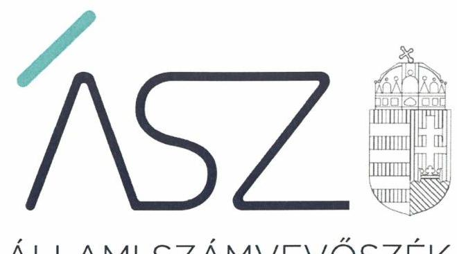
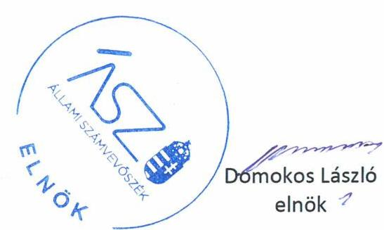
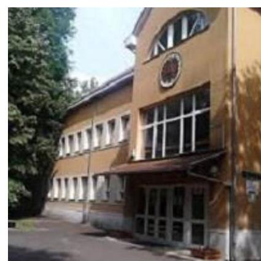

ÁLLAMI SZÁMVEVŐSZÉK

# JELENTÉS 

## Központi költségvetési szervek ellenőrzése

Kétegyházai Mezőgazdasági Szakgimnázium, Szakközépiskola és Kollégium
2020.

20048
www.asz.hu

---

ÁLLAMI SZÁMVEVŐSZÉK

# JELENTÉS 

## Központi költségvetési szervek ellenőrzése

Kétegyházai Mezőgazdasági Szakgimnázium, Szakközépiskola és Kollégium
2020. 04. 21.

20048
www.asz.hu

---

# AZ ELLENŐRZÉST FELÜGYELTE: 

MAROZSÁN LÁSZLÓNÉ felügyeleti vezető

## AZ ELLENŐRZÉST VEZETTE ÉS A VÉGREHAJTÁSÁÉRT FELELŐS:

BÁLINT KÁLMÁN KADOCSA ellenőrzésvezető
ÁRPÁSI TIBOR ellenőrzésvezető

A PROGRAM ÖSSZEÁLLÍTÁSÁÉRT FELELŐS:
TÓTPÁL SZABOLCS osztályvezető

IKTATÓSZÁM: EL-2507-001/2020.
TÉMASZÁM: 2450
ELLENŐRZÉS-AZONOSÍTÓ SZÁM: V079159

---

# TARTALOMJEGYZÉK 

■ ÖSSZEGZÉS ..... 5
■ AZ ELLENŐRZÉS CÉLJA ..... 6
■ AZ ELLENŐRZÉS TERÜLETE ..... 7
■ AZ ELLENŐRZÉS HÁTTERE, INDOKOLTSÁGA ..... 8
■ A JELENTÉS LÉNYEGES KÉRDÉSKÖREI ..... 10
■ AZ ELLENŐRZÉS HATÓKÖRE ÉS MÓDSZEREI ..... 11
■ MEGÁLLAPÍTÁSOK ..... 14
■ JAVASLATOK ..... 18
■ MELLÉKLETEK ..... 21
I. sz. melléklet: Értelmező szótár ..... 21
■ FÜGGELÉKEK ..... 23
I. sz. függelék a jelentéshez ..... 23
II. sz. függelék: Észrevételek ..... 24
■ RÖVIDÍTÉSEK JEGYZÉKE ..... 25

---

.

---

# ÖSSZEGZÉS 

A Kétegyházai Mezőgazdasági Szakgimnázium, Szakközépiskola és Kollégium működésének szabályozottsága, pénzügyi gazdálkodása nem biztosította a felelős gazdálkodást, a közpénzek szabályos felhasználását. Vagyongazdálkodása 2017. évben szabályszerű volt. A korrupcióval szemben nem volt védett.

## Az ellenőrzés társadalmi indokoltsága

Magyarország versenyképességének és a magyar gazdaság fejlődésének alapvető feltétele a magyar munkavállalók megfelelő szakmai képzettsége és felkészültsége, amelyben a szakképzési rendszernek döntő szerepe van. A mezőgazdaság vonatkozásában is kiemelten fontos ez, hiszen a magyar mezőgazdaság piaci versenyképességét és eredményességét nagymértékben befolyásolja az agrárszférában dolgozók képzettsége, felkészültsége. A szakképzés legjelentősebb színterei a szakképző iskolák. Az eredményes és célszerű szakképzés alapja és alapvető feltétele a szakképző intézmények közpénzekkel és a közvagyonnal való törvényes, átlátható és a korrupcióval szembeni védelmet biztosító működése és gazdálkodása. Ezért ezen szervezetekkel szemben is alapvető társadalmi igény, hogy a rájuk bízott közpénzekkel, közvagyonnal szabályosan gazdálkodjanak. Emellett a szakképzésben részt vevő pedagógusok, tanulók és a szülők jogos elvárása, hogy a szakképző iskolák működése átlátható és elszámoltatható legyen. Mindezen igényekkel összhangban, a közpénzügyek átláthatóságának előmozdítása, a közvagyon védelme érdekében került sor az agrárszakképző iskolák belső kontrollrendszerének és gazdálkodásának ellenőrzésére.

## Főbb megállapítások, következtetések, javaslatok

A Kétegyházai Mezőgazdasági Szakgimnázium, Szakközépiskola és Kollégium belső kontrollrendszere a hiányos szabályozás és a működtetésben feltárt szabálytalanságok miatt nem biztosította a szabályszerű működés és gazdálkodás feltételeit.

A Kétegyházai Mezőgazdasági Szakgimnázium, Szakközépiskola és Kollégium vagyongazdálkodása a 2016. évben nem volt szabályszerű, mivel a költségvetési beszámoló mérlegtételei leltárral nem voltak alátámasztottak. Vagyongazdálkodása a 2017. évben szabályszerű volt.

A Kétegyházai Mezőgazdasági Szakgimnázium, Szakközépiskola és Kollégium pénzügyi gazdálkodása nem volt szabályszerű, mert a kötelezettségvállalással terhelt maradványt nem támasztották alá szabályszerű nyilvántartással, továbbá 2016-ban a szerződések nem tartalmazták az átláthatóságot biztosító tartalmi elemeket.

A Kétegyházai Mezőgazdasági Szakgimnázium, Szakközépiskola és Kollégiumban nem tették meg a legalapvetőbb intézkedéseket sem a korrupció megelőzése érdekében, mivel nem szabályozták vagyonnyilatkozat-tételi kötelezettséggel járó munkaköröket. A teljesítmény mérés követelményeit nem alakították ki, ezáltal a teljesítmény ellenőrzés feltételei nem voltak biztosítottak.

A megállapítások alapján az Állami Számvevőszék a Kétegyházai Mezőgazdasági Szakgimnázium, Szakközépiskola és Kollégium igazgatója részére 12 javaslatot fogalmazott meg. A javaslatokat megalapozó megállapításokra az érintettnek 30 napon belül intézkedési tervet kell készítenie.

---

# AZ ELLENŐRZÉS CÉLJA 

AZ ELLENŐRZÉS CÉLJA annak megítélése volt, hogy az ellenőrzött intézményre vonatkozó irányító szervi feladatellátás a jogszabályi előírások betartásával történt-e; az intézménynél a belső kontrollrendszer kialakítása és működtetése szabályszerű volt-e, biztosította-e az átlátható, szabályszerű, gazdaságos, hatékony és eredményes gazdálkodás feltételeit; az intézmény pénzügyi és vagyongazdálkodása megfelelt-e a jogszabályi előírásoknak és belső szabályzatainak. Az ellenőrzés keretében az Állami Számvevőszék értékelte az intézmény korrupciós kockázatainak kezelését szolgáló integritás kontrollok kiépítettségét és az integritás szemlélet érvényesülését, a teljesítményellenőrzés feltételeinek kialakítását. Értékelte továbbá, hogy az ellenőrzött megfelel-e annak az Alaptörvényben meghatározott alapvetésnek, hogy Magyarország a kiegyensúlyozott, átlátható és fenntartható költségvetési gazdálkodás elvét érvényesíti. Érvényesült-e a nemzeti vagyon kezelésének és védelmének célja, azaz az Intézmény vagyona a közérdeket szolgálta-e a közös szükségletek kielégítése és a természeti erőforrások megóvása, valamint a jövő nemzedékek szükségleteinek figyelembevétele mellett.

---

# **AZ ELLENŐRZÉS TERÜLETE**

## **Kétegyházai Mezőgazdasági Szakgimnázium, Szakközépiskola és Kollégium**

Az 1928-ban alapított Békés megyei Kétegyházai Mezőgazdasági Szakgimnázium, Szakközépiskola és Kollégium fenntartói és irányítói jogait és hatásköreit a Minisztérium 2013. augusztus 1-től gyakorolja.

Az Intézmény2 tevékenysége szakgimnáziumi, szakközépiskolai nevelés-oktatás és kollégiumi ellátás, valamint felnőttoktatás. A tanulói létszám a 2016/2017. tanévben 173 fő volt.

Az Intézmény a 2016-2017. években mezőgazdaság, valamint élelmiszeripar szakmacsoportokban biztosított szakképzési lehetőséget.

Az ellenőrzött időszakban az Intézménynél szervezeti, szerkezeti átalakításra nem került sor, az igazgató3 személye egy alkalommal, 2016-ban változott.

Az Intézmény gazdasági feladatait a Szentannai Sámuel Középiskola és Kollégium gazdasági szervezete látta el.

Az Intézmény költségvetési beszámolójában kimutatott összes bevétele 2016. évben 332,9 M Ft, finanszírozási bevétele 217,4 M Ft volt, míg 2017. évben az összes bevétel 346,2 M Ft, a finanszírozási bevétel 206,9 M Ft volt.

---

# AZ ELLENŐRZÉS HÁTTERE, INDOKOLTSÁGA 

Az államháztartás központi alrendszerének közpénz felhasználása, az intézmények által ellátott közfeladatok sokrétűsége, valamint a feladatellátásához rendelt vagyon nagyságrendje indokolja, hogy az ÁSZ ${ }^{4}$ ellenőrzéseket folytasson a pénzügyi és vagyongazdálkodás területén. Az ÁSZ az ellenőrzései során feltárja a gazdálkodást, a központi alrendszer intézményei átalakulását, átszervezését érintő szabályozások esetleges hiányosságait, a szabályozással nem érintett gazdálkodási területeket, rámutathat a vagyongazdálkodási tevékenység - ezen belül a tulajdonosi joggyakorlás és vagyonkezelés - esetleges szabálytalanságaira, értékeli az állami vagyon nyilvántartására és elszámolására vonatkozó eljárásokat.

Az ellenőrzés várhatóan hozzájárul a központi intézmények pénzügyi helyzetének pontosabb megítéléséhez, és a jó gyakorlat kialakításán és terjesztésén keresztül az ellenőrzések elősegíthetik a gazdálkodás szabályszerűségének javítását.

Az ellenőrzések megállapításai támogathatják az ellenőrzött intézmények szabályszerű gazdálkodását, javaslataival elősegítheti az Alaptörvényben megfogalmazott alapvetések érvényesülését a mindennapi életben az intézmények szintjén. A központi költségvetés rendszerében zajló folyamatok holisztikus elemzései, a kockázatok folyamatos figyelemmel kísérésének módszerével, az így kiválasztott intézmények célzott, hatékony ellenőrzéseivel az ÁSZ betölti a legfőbb gazdasági ellenőrző szerv küldetését.

Az ellenőrzés az intézmény kockázatértékelése alapján, az egyedi és lényeges jellemzők figyelembevételével, az ellenőrzésre kiválasztott modullal történik. Az integritás- és belső kontroll modul a központi költségvetési szerv működésének irányítottságát, korrupció elleni védettségét értékeli.

A belső kontrollrendszer kialakítása és működtetése nélkül nem valósítható meg a közpénzek, a közvagyon átlátható, szabályos, gazdaságos, hatékony és eredményes felhasználása. A belső kontrollrendszer azt a célt szolgálja, hogy a költségvetési szervek működésük és gazdálkodásuk során a tevékenységeket szabályszerűen hajtsák végre, teljesítsék elszámolási kötelezettségeiket és megvédjék az erőforrásokat a veszteségektől, a károktól és a nem rendeltetésszerű használattól. A belső kontrollrendszer magában foglalja mindazon elveket, eljárásokat és belső szabályzatokat, melyek biztosítják, hogy a költségvetési szerv valamennyi tevékenysége és célja összhangban legyen a szabályszerűséggel, szabályozottsággal, valamint a gazdaságosság, hatékonyság és eredményesség követelményeivel, az eszközökkel és forrásokkal való gazdálkodásban ne kerüljön sor pazarlásra, visszaélésre, rendeltetésellenes felhasználásra. Megfelelő, pontos és naprakész információk álljanak rendelkezésre a költségvetési szerv működésével kapcsolatosan, és a belső kontrollrendszer harmonizációjára, összehangolására vonatkozó jogszabályok végrehajtásra kerüljenek. Az integritás kontrollok kiépítése, erősítése az intézmény korrupciós kockázatainak kezelését szolgálja. A teljesítménykövetelmények meghatározása és működtetése megalapozhatja a központi költségvetési szervnél a teljesítményellenőrzés lefolytatását.

---

Az egyes ellenőrzések megállapításaival és egy időszak ellenőrzési eredményeinek elemzésével az ÁSZ ráirányíthatja a jogalkotók figyelmét a központi alrendszerben vagy annak egy ágazatában esetlegesen felmerülő pénzügyi, szabályozási feszültségekre. Az elvégzett ellenőrzések során az ÁSZ „jó gyakorlatokat" is azonosíthat, melyeket tanácsadó funkciója keretében szélesebb körben is megismertethet az érintettekkel, ezáltal is hozzájárulva a költségvetési rendszer szabályozott, átlátható, kiegyensúlyozott és fenntartható működéséhez.

---

# A JELENTÉS LÉNYEGES KÉRDÉSKÖREI 

1.     - Az irányító szerv Intézményre vonatkozó feladatellátása szabályszerű volt-e?
2.     - A belső kontrollrendszer kialakítása és működtetése biztosította-e a közpénzekkel és a nemzeti vagyonnal történő szabályszerű gazdálkodást?
3.     - Az Intézmény pénzügyi gazdálkodása szabályszerű volt-e?
4.     - Az Intézmény vagyongazdálkodása szabályszerű volt-e?
5.     - Az Intézménynél alakítottak-e ki a teljesítmény mérésére alkalmas követelményeket?

---

# AZ ELLENŐRZÉS HATÓKÖRE ÉS MÓDSZEREI 

## Az ellenőrzés típusa

Megfelelőségi ellenőrzés.

## Az ellenőrzött időszak

Az Intézmény vagyongazdálkodása, integritás és belső kontrollrendszerének értékelése tekintetében a 2016-2017. évek.

Az irányító szervi feladatellátás és az Intézmény pénzügyi gazdálkodása tekintetében a 2016. év.

## Az ellenőrzés tárgya

Az Intézmény belső kontrollrendszerének kialakítása és működtetése, pénzügyi és vagyongazdálkodása, az integritáskontrollok kiépítettsége, az integritás szemlélet érvényesülése, a teljesítményellenőrzés feltételeinek fennállása, valamint az irányító szervi feladatellátás.

## Az ellenőrzött szervezet

- Kétegyházai Mezőgazdasági Szakgimnázium, Szakközépiskola és Kollégium
- Földművelésügyi Minisztérium mint irányító szerv (jelenleg: Agrárminisztérium)
- Szentannai Sámuel Középiskola és Kollégium mint gazdálkodási feladatokat ellátó szervezet 2017-re vonatkozóan

## Az ellenőrzés jogalapja

Az ellenőrzés jogszabályi alapját az ÁSZ tv. ${ }^{5}$ 1. § (3) bekezdés, 5. § (2)-(3) bekezdései, 5. § (4) bekezdés a) pontja, és a (6) bekezdése, valamint az Áht. ${ }^{6}$ 61. § (2) bekezdésének előírásai képezték.

## Az ellenőrzés módszerei

Az ellenőrzésre a szakmai program szempontjai, az ellenőrzött időszakban hatályos jogszabályok, az ellenőrzés szakmai szabályai, a jelen ellenőrzésre irányadó ÁSZ módszertanok figyelembevételével került sor.

---

Az ÁSZ az ellenőrzés ideje alatt az ellenőrzött szervezetekkel a kapcsolattartást az ÁSZ SZMSZ²-ének vonatkozó előírásai alapján biztosította.

Az ellenőrzési kérdések megválaszolásához szükséges bizonyítékok megszerzése az ellenőrzött szervezetek által rendelkezésre bocsátott dokumentumokra, adatokra alapozva megfigyelés, szemle (szemrevételezés), kérdésfeltevés (információkérés), mintavételezés, valamint elemző eljárás útján történt.

Az ellenőrzési bizonyítékként felhasználható adatforrások közé tartoztak egyrészt a szakmai program részletes szempontjainál felsorolt adatforrások, másrészt minden egyéb - az ellenőrzés folyamán feltárt, az ellenőrzés szempontjából információt tartalmazó - dokumentum.

Az ellenőrzés lefolytatásához az ellenőrzött szervezetek a tanúsítványok kitöltésével, valamint az ÁSZ által kért dokumentumok megküldésével szolgáltattak adatokat, amelyek valódiságát és teljes körűségét az ellenőrzött szervezet vezetője által tett teljességi és hitelességi nyilatkozat igazolta. Az így rendelkezésre bocsátott adatok, információk kontrollja az ellenőrzés keretében történt.

Az Intézmény belső kontrollrendszere egyes pilléreinek kialakítására és működtetésére vonatkozó értékelés a következő volt:
$\longrightarrow$ „szabályszerű", amennyiben az értékelt területen az elért „igen" válaszok százalékban kifejezett, egész számra kerekített aránya legalább $85 \%$ volt,
$\longrightarrow$ „nem szabályszerű", ha nem érte el a $85 \%$-ot.
Az Intézmény belső kontrollrendszerének összesített értékelése az egyes részterületek esetében kapott megfelelőségi arányok számtani átlaga alapján történt és megegyezett a pillérenként (kontrollterületenként) alkalmazott százalékos értékelésekkel, a következő eltérésekkel: a kontrollrendszer egésze esetében a „szabályszerű" értékelésnek a százalékos értéken felül további feltétele volt, hogy egyik kontrollterület sem kaphat „nem szabályszerű" értékelést.

Az ÁSZ statisztikai módszereken alapuló mintavételt alkalmazott.
A kiadások ellenőrzésére a 2016-2017 év vonatkozásában került sor. A kiadások (külső személyi juttatások, felhalmozási kiadások, dologi kiadások) esetében az ellenőrzés azokra a legnagyobb értékű tételekre - a lényeges sokaságra - terjedt ki, melyek összértéke elérte a teljes sokaság összértékének 50\%-át.

A 2016-2017. évi kiadások elszámolásának szabályszerűségét
 a lényeges sokaságból véletlen mintavételi eljárással kiválasztott tételek alapján ellenőrizte az ÁSZ.

A 2017. évi beruházások, felújítások végrehajtása, valamint a feladatellátást szolgáló állami vagyontárgyak év végi értékelése szabályszerűségének esetében tételes ellenőrzésre került sor.

Az ÁSZ a 2017. évi feladatellátást szolgáló állami vagyontárgyak használatának szabályszerűségét a teljes sokaságból véletlen mintavétellel kiválasztott tételek alapján ellenőrizte.

---

Az ÁSZ a mintavétellel ellenőrzött terület esetében minden egyes tétel vonatkozásában a használat szabályszerűségére vonatkozó kérdéseket tett fel. Szabályszerűnek értékelte az ellenőrzött területet, amennyiben 95%-os bizonyossággal az ellenőrzött sokaságban az átlagos hibaarány legfeljebb 10%, nem szabályszerűnek, amennyiben 10%-nál magasabb arányt képviselt.

---

# MEGÁLLAPÍTÁSOK 

## 1. Az irányító szerv Intézményre vonatkozó feladatellátása szabályszerű volt-e?

Összegző megállapítás

A Minisztériumnak az Intézményre vonatkozó feladatellátása szabályszerű volt 2016-ban.

A MINISZTÉRIUM az Ávr. ${ }^{8}$ előírásainak megfelelően jóváhagyta az Intézmény elemi költségvetését és előirányzat-maradványát, továbbá az Áhsz. ${ }^{9}$ előírásai szerint az Intézmény éves költségvetési beszámolóját.

A Minisztérium az Áht.-ben foglalt hatáskörét gyakorolva beszámoltatta az igazgatót az éves szakmai feladatellátásról, valamint az éves gazdálkodásról.

## 2. A belső kontrollrendszer kialakítása és működtetése biztosította-e a közpénzekkel és a nemzeti vagyonnal történő szabályszerű gazdálkodást?

Összegző megállapítás

Az Intézmény belső kontrollrendszerének kialakítása és működtetése nem volt szabályszerű a 2016-2017. években.

A KONTROLLKÖRNYEZET kialakítása 2016-2017-ben nem volt szabályszerű, mert
$\longrightarrow$ Az SZMSZ ${ }^{10}$ nem tartalmazta a vagyonnyilatkozat-tételi kötelezettséggel járó munkaköröket a Vnytv. ${ }^{11}$ 4. § a) pontja előírása ellenére.
$\longrightarrow$ Az Intézmény a Számviteli politikában ${ }^{12}$ az Áhsz. 50. § (7) bekezdésében foglaltak ellenére 2016-ban nem rögzítette az általános költségek szakfeladatokra és az általános kiadások tevékenységekre, illetve 2017. január 1-től az általános költségek, valamint az általános kiadások és bevételek tevékenységekre történő felosztásának módját, a felosztáshoz alkalmazott mutatókat, vetítési alapokat.
$\longrightarrow$ A Pénzkezelési szabályzatban ${ }^{13}$ 2017. szeptember 1-től a Számv. tv. ${ }^{14}$ 14. § (8) bekezdésében foglaltak ellenére nem rendelkeztek a napi készpénz záró állomány maximális mértékéről.
$\longrightarrow$ Az Intézmény a 8kr. ${ }^{15}$ 6. § (3) bekezdésében előírtak ellenére 2016-2017. években nem rendelkezett a működési folyamatait lefedő ellenőrzési nyomvonallal.
Az Intézmény Értékelési szabályzata ${ }^{16}$ és Önköltségszámítási szabályzata ${ }^{17}$ a Számv. tv. előírásaival összhangban készült.

KOCKÁZATKEZELÉSI RENDSZERT az igazgató 2016. szeptember 30-ig nem alakított ki. Az integrált kockázatkezelési

---

rendszert az igazgató 2017. szeptember 1-től kialakította, a Bkr. előírásaival összhangban kiadta a kockázatkezelés rendjét tartalmazó szabályzatot ${ }^{18}$. Az integrált kockázatkezelési rendszert az igazgató a Bkr. 7. § (1) pontban foglalt kötelessége ellenére nem működtette, mivel a Bkr. 7. § (2) pontja ellenére nem mérte fel és nem állapította meg az Intézmény tevékenységében rejlő és szervezeti célokkal összefüggő kockázatokat, továbbá az integrált kockázatkezelési rendszer koordinálására a Bkr. 7. § (4) pontjában előírt szervezeti felelőst nem jelölt ki.

A KONTROLLTEVÉKENYSÉGEK gyakorlása nem volt szabályszerű 2016-2017-ben, mert
$\longrightarrow$ dologi kiadások teljesítésére az Áht. 37. § (1) bekezdésében foglaltak ellenére kötelezettségvállalás nélkül került sor,
$\longrightarrow$ dologi kiadások és külső személyi juttatások kifizetésének elrendelésére az Áht. 38. § (1) bekezdésében foglaltak ellenére teljesítésigazolás nélkül került sor, illetve a teljesítést nem az arra jogosult, kijelöléssel rendelkező személy igazolta, továbbá 2017-ben az Ávr. 57. § (1) bekezdésében foglaltak ellenére kötelezettségvállalás hiányában ellenőrizhető okmányok nélkül történt a teljesítés igazolása.

INFORMÁCIÓS ÉS KOMMUNIKÁCIÓS rendszert 2016-2017. években az igazgató a Bkr. 9. § (1) bekezdésében foglaltak ellenére nem alakított ki, mivel a Bkr. 9. § (2) bekezdésének előírása ellenére nem határozott meg beszámolási szinteket, határidőket, módokat.

Az Intézmény 2017. évre vonatkozóan nem tett eleget a jogszabályokban előírt adatszolgáltatási kötelezettségének, mert nem töltötte fel a Kincstár ${ }^{19}$ által működtetett elektronikus adatszolgáltató rendszerbe.
$\longrightarrow$ az elemi költségvetést az Áht. 108. § (1) a) bekezdésében,
$\longrightarrow$ időközi költségvetési jelentést az Ávr. 169. § (2) bekezdésben,
$\longrightarrow$ az időközi mérlegjelentést az Ávr. 170. § (2) bekezdésben foglaltak ellenére.

NYOMONKÖVETÉSI RENDSZERT a Bkr. 10. § előírása ellenére az igazgató nem alakított ki 2016-2017-ben, nem gondoskodott a szervezet tevékenységének, a célok megvalósításának operatív tevékenységek keretében megvalósuló folyamatos és eseti nyomon követéséről.

BELSŐ ELLENŐRZÉS kialakításáról az igazgató 2016-2017-ben az Áht. 70. § (1) bekezdése ellenére nem gondoskodott.

AZ INTEGRITÁS KONTROLLOK kiépítettségi szintje nem támogatta a korrupciós kockázatok intézményi kezelését az ellenőrzött időszakban. Az Intézmény nem végzett kockázatelemzéseket, nem működtetett az integritást erősítő, nem kötelezően előírt kontrollokat.

A BELSŐ KONTROLLRENDSZER MINŐSÉGÉT 2016. évre vonatkozóan értékelő vezetői nyilatkozathoz az igazgató a Bkr. 11. § (4) bekezdésben foglaltak ellenére nem mellékelte az Intézmény vezetését év közben átadó igazgatójának az addig eltelt időszakot értékelő nyilatkozatát. A 2017. évet értékelő nyilatkozatát az igazgató a

---

Bkr. 11. § (2) bekezdésében foglaltak ellenére nem küldte meg a Minisztériumnak. Az ÁSZ ellenőrzési megállapításai a 2016-2017. években kiadott vezetői nyilatkozatokat nem támasztották alá.

# 3. Az Intézmény pénzügyi gazdálkodása szabályszerű volt-e? 

Összegző megállapítás Az Intézmény pénzügyi gazdálkodása 2016. évben nem volt szabályszerű.

A 2016. ÉVI MARADVÁNY megállapítása nem volt szabályszerű. Az Intézmény az Áhsz. 39. § (3) bekezdésében foglaltak ellenére a kötelezettségvállalással terhelt maradvány alátámasztásához nem vezetett az Áhsz. 14. melléklet II. 4. a), g) pontjaiban előírt tartalmú részletező nyilvántartást, mert a kötelezettségvállalások nyilvántartása nem tartalmazta a pénzügyi ellenjegyzésre vonatkozó adatokat, valamint a pénzügyi teljesítések dátumát, összegét.

A 2016. évi dologi kiadások esetében - az Ávr. 50. § (1a) bekezdésében foglaltak ellenére - a jogi személlyel, jogi személyiséggel nem rendelkező szervezettel kötött visszterhes szerződések nem tartalmazták a szervezet képviselőjének nyilatkozatát arra vonatkozóan, hogy átlátható szervezetnek minősül.

## 4. Az Intézmény vagyongazdálkodása szabályszerű volt-e?

## Összegző megállapítás

Az Intézmény vagyongazdálkodása 2016-ban nem volt szabályszerű. 2017-ben a vagyongazdálkodás szabályszerű volt.

Az Intézmény a 2017. évi költségvetési beszámoló mérlegtételeit alátámasztó leltárát az Áhsz. és a Számv. tv. előírásai szerint állította össze.

Az Intézmény 2017-ben a beruházásokhoz kapcsolódó gazdasági események elszámolását a Számv. tv. előírásai szerinti, szabályszerűen kiállított bizonylatokkal támasztotta alá.

Az Intézmény 2016. évben az Áhsz. 22. § (1) bekezdésében és a Számv. tv. 69. § (1) bekezdésében előírtak ellenére az éves költségvetési beszámoló mérlegtételeit leltárral nem támasztotta alá.

Az Intézmény a 2016-ban vásárolt tenyészállatok állományba vételét a Számv. tv. 165. § (2) bekezdésében foglaltakat megsértve szabályszerűen kiállított bizonylattal nem támasztotta alá.

Az igazgató a Vtvr. ${ }^{20}$ 7. § (2) bekezdése ellenére nem gondoskodott a vagyonkezelésében lévő állami tulajdonú ingatlanokra vonatkozóan a vagyonkezelői jog ingatlan-nyilvántartásba történő bejegyeztetéséről az ellenőrzött években.

---

# 5. Az Intézménynél alakítottak-e ki a teljesítmény mérésére alkalmas követelményeket? 

Összegző megállapítás A teljesítmény mérésére alkalmas követelményeket az Intézménynél nem alakították ki.

Az igazgató 2017-ben a szervezeti célok elérését szolgáló feladatok, folyamatok, tevékenységek mérését szolgáló indikátorokat, mérőszámokat, feladat- és teljesítménymutatókat nem képezett, az Intézménynél a teljesítmény mérésének lehetőségét nem biztosította.

---

# JAVASLATOK 

Az ÁSZ tv. 33. § (1) bekezdésében foglaltak értelmében az ellenőrzött szervezet vezetője köteles a jelentésben foglalt megállapításokhoz kapcsolódó intézkedési tervet összeállítani és azt a jelentés kézhezvételétől számított 30 napon belül az ÁSZ részére megküldeni. Amennyiben az ellenőrzött szervezet vezetője nem küldi meg határidőben az intézkedési tervet, vagy továbbra sem elfogadható intézkedési tervet küld, az Állami Számvevőszék elnöke az ÁSZ tv. 33. § (3) bekezdése a) és b) pontjaiban foglaltakat érvényesítheti.

## Kétegyházai Mezőgazdasági Szakgimnázium, Szakközépiskola és Kollégium igazgatója részére

1. Intézkedjen a Vnytv. előírásainak megfelelően a vagyonnyilatkozat-tételi kötelezettség SZMSZ-ben való feltüntetéséről.
(2. sz. megállapítás 1. bekezdése 1. francia bekezdése alapján)
2. Gondoskodjon arról, hogy a számviteli politika megfeleljen a jogszabályi előírásoknak.
(2. sz. megállapítás 1. bekezdése 2. francia bekezdése alapján)
3. Gondoskodjon arról, hogy a pénzkezelési szabályzat feleljen meg a jogszabályi előírásoknak.
(2. sz. megállapítás 1. bekezdése 3. francia bekezdése alapján)
4. Intézkedjen a Bkr. előírásának megfelelően az Intézmény működési folyamatait lefedő ellenőrzési nyomvonal elkészítéséről.
(2. sz. megállapítás 1. bekezdése 4. francia bekezdése alapján)
5. Intézkedjen a Bkr. előírásának megfelelően
a) az integrált kockázatkezelési rendszer működtetéséről
b) az integrált kockázatkezelési rendszer koordinálására szervezeti felelős kijelöléséről.
(2. sz. megállapítás 3. bekezdés 3. mondata alapján)
6. Intézkedjen, hogy a kötelezettségvállalásra és a teljesítésigazolásra a jogszabályi előírásoknak megfelelően kerüljön sor.
(2. sz. megállapítás 4. bekezdés 1-2. francia bekezdései alapján)

---

7. Intézkedjen az információs és kommunikációs rendszer Bkr. előírásának megfelelő kialakításáról és működtetéséről.
(2. sz. megállapítás 5. bekezdése alapján)
8. Gondoskodjon az Intézményre vonatkozó adatszolgáltatási kötelezettség jogszabályi előírások szerinti teljesítéséről.
(2. sz. megállapítás 6. bekezdése 1-3. francia bekezdései alapján)
9. Intézkedjen a Bkr. előírásainak megfelelően a szervezet tevékenységének, a célok megvalósításának az operatív tevékenységek keretében megvalósuló folyamatos és eseti nyomon követéséről.
(2. sz. megállapítás 7. bekezdése alapján)
10. Gondoskodjon a jogszabályi előírásnak megfelelően a belső ellenőrzés kialakításáról és működtetéséről.
(2. sz. megállapítás 8. bekezdése alapján)
11. Intézkedjen a Bkr. előírásainak megfelelően, a belső kontrollrendszer minőségének értékeléséről szóló Bkr. szerinti vezetői nyilatkozat irányítószerv részére történő megküldéséről.
(2. sz. megállapítás 10. bekezdés 2. mondata alapján)
12. Gondoskodjon az Intézmény vagyonkezelésében lévő állami tulajdonú ingatlanok esetében a vagyonkezelői jog ingatlan-nyilvántartásba történő bejegyeztetéséről.
(4. sz. megállapítás 5. bekezdése alapján)

---

.

---

# MELLÉKLETEK 

- I. SZ. MELLÉKLET: ÉRTELMEZŐ SZÓTÁR
állami vagyon
állami vagyonnak minősül:
a) az állam tulajdonában lévő dolog, valamint a dolog módjára hasznosítható természeti erő,
b) az a) pont hatálya alá nem tartozó mindazon vagyon, amely vonatkozásában törvény az állam kizárólagos tulajdonjogát nevesíti,
c) az állam tulajdonában lévő tagsági jogviszonyt megtestesítő értékpapír, illetve az államot megillető egyéb társasági részesedés,
d) az államot megillető olyan immateriális, vagyoni értékkel rendelkező jogosultság, amelyet jogszabály vagyoni értékű jogként nevesít. (Forrás: Vtv. ${ }^{21}$ 1. § (2) bekezdése)
állami vagyon kezelője /vagyonkezelő
átalakítás
belső ellenőrzés
belső kontrollrendszer
belső kontrollrendszer területei
ellenőrzési nyomvonal
információs és kommunikációs rendszer
integritás

Az állami vagyont az $\mathrm{MNV}^{22}$ Zrt. maga kezeli, vagy szerződés - így különösen bérlet, haszonbérlet, megbízás - alapján központi költségvetési szervnek, természetes vagy jogi személynek, vagy jogi személyiséggel nem rendelkező gazdálkodó szervezetnek hasznosításra átengedi." Az állami vagyonra vonatkozóan az MNV Zrt. kizárólag az Nvtv ${ }^{23}$-ben meghatározott személyekkel köthet vagyonkezelési szerződést. (Forrás: Vtv. 27. § (1) bekezdése, hatályos 2012. január 1-jétől)
A költségvetési szerv általános jogutódlással történő megszüntetése átalakítással történhet. Az átalakítás lehet egyesítés vagy különválás. Az egyesítés lehet beolvadás vagy összeolvadás. (2015. január 1-jétől Áht. 11. § (2) bekezdés)
Független, tárgyilagos bizonyosságot adó és tanácsadó tevékenység, amelynek célja, hogy az ellenőrzött szervezet működését fejlessze és eredményességét növelje, az ellenőrzött szervezet céljai elérése érdekében rendszerszemléletű megközelítéssel és módszeresen értékeli, illetve fejleszti az ellenőrzött szervezet irányítási és belső kontrollrendszerének hatékonyságát. (Forrás: Bkr. 2. § b) pontja)
A belső kontrollrendszer a kockázatok kezelése és tárgyilagos bizonyosság megszerzése érdekében kialakított folyamatrendszer, amely azt a célt szolgálja, hogy a működés és gazdálkodás során a tevékenységeket szabályszerűen, gazdaságosan, hatékonyan, eredményesen hajtsák végre, az elszámolási kötelezettségeket teljesítsék, megvédjék az erőforrásokat a veszteségektől, károktól és nem rendeltetésszerű használattól. (Forrás:
 Áht. 69. § (1) bekezdése)
A kontrollkörnyezet, a kockázatkezelési rendszer, a kontrolltevékenységek, az információs és kommunikációs rendszer, valamint a nyomon követési (monitoring) rendszer. (Forrás: Bkr. 3. §-a)
Az ellenőrzési nyomvonal a költségvetési szerv működési folyamatainak szöveges, táblázatokkal vagy folyamatábrákkal szemléltetett leírása, amely tartalmazza különösen a felelősségi és információs szinteket és kapcsolatokat, irányítási és ellenőrzési folyamatokat, lehetővé téve azok nyomon követését és utólagos ellenőrzését. (Forrás: Bkr. 6. § (3) bekezdés)
A költségvetési szerv vezetője által kialakított és működtetett olyan rendszer, mely biztosítja, hogy a megfelelő információk a megfelelő időben eljutnak az illetékes szervezethez, szervezeti egységhez, illetve személyhez. (Forrás: Bkr. 9. § (1) bekezdés)
Az integritás - egyik gyakran használt jelentése szerint - az elvek, értékek, cselekvések, módszerek, intézkedések konzisztenciáját jelenti, vagyis olyan magatartásmódot, amely meghatározott értékeknek megfelel. Integritás-irányítási rendszer bevezetése a szervezetben a szervezethez rendelt közfeladatok integritás szempontú ellátását, az

---

integrált kockázatkezelési rendszer
irányító szerv/felügyeleti szerv
kockázat
kockázatkezelési rendszer
kontrollkörnyezet
kontrolltevékenységek
maradvány
nyomon követési rendszer (monitoring)
vagyongazdálkodás
érték alapú működéssel (integritással) összefüggő szervezeti követelmények következetes érvényesítését jelenti. (Forrás: Nemzetgazdasági Minisztérium: Államháztartási Belső Kontroll Standardok és Gyakorlati Útmutató 1.6. Etikai értékek és integritás 46. oldal, 2017. szeptember)
Olyan folyamatalapú kockázatkezelési rendszer, amely a szervezet minden tevékenységére kiterjed, egységes módszertan és eljárások alkalmazásával, a szervezet célkitűzéseinek és értékeinek figyelembevételével biztosítja a szervezet kockázatainak teljes körű azonosítását, azok meghatározott kritériumok szerinti értékelését, valamint a kockázatok kezelésére vonatkozó intézkedési terv elkészítését és az abban foglaltak nyomon követését. (Forrás: Bkr. 2. § m) pontja, 2016. október 1-jétől)
A költségvetési szerv tekintetében az Áht.-ban meghatározott irányítási hatáskört gyakorló szerv. (Forrás: Áht. 1. § 9. pontja)
A kockázat annak a valószínűségét jelenti, hogy egy vagy több esemény vagy intézkedés nem kívánt módon befolyásolja a rendszer működését, céljainak megvalósulását. (Forrás: Javaslatok a korrupciós kockázatok kezelésére - Kockázatkezelési és ellenőrzési módszertan 35. oldal, ÁSZ)
Olyan irányítási eszközök és módszerek összessége, melynek elemei a szervezeti célok elérését veszélyeztető tényezők (kockázatok) azonosítása, elemzése, csoportosítása, nyomon követése, valamint szükség esetén a kockázati kitettség mérséklése. (Forrás: Bkr. 2. § m) pontja)
A költségvetési szerv vezetője által kialakított olyan elvek, eljárások, belső szabályzatok összessége, amelyben világos a szervezeti struktúra, a folyamatok átláthatók, egyértelműek a felelősségi, hatásköri viszonyok és feladatok, meghatározottak, ismertek és elfogadottak az etikai elvárások a szervezet minden szintjén, átlátható a humánerőforrás-kezelés. (Forrás: Bkr. 6. § (1) bekezdés)
A költségvetési szerv vezetője által a szervezeten belül kialakított (kontroll) tevékenységek, melyek biztosítják a kockázatok kezelését, hozzájárulnak a szervezet céljainak eléréséhez és erősítik a szervezet integritását. (Forrás: Bkr. 8. § (1) bekezdés)
A költségvetési év során a bevételek és kiadások különbözete, amely az alaptevékenység bevételei és kiadásai tekintetében a költségvetési maradvány, a vállalkozási tevékenység bevételei és kiadásai tekintetében a vállalkozási maradvány. (Forrás: Áht. 1. § 17. pont)
A költségvetési szerv vezetője köteles kialakítani a szervezet tevékenységének a célok megvalósításának nyomon követését biztosító rendszert, amely az operatív tevékenységek keretében megvalósuló folyamatos és eseti nyomon követésből, valamint az operatív tevékenységektől függetlenül működő belső ellenőrzésből áll. (Forrás: Bkr. 10. §)

A nemzeti vagyongazdálkodás feladata a nemzeti vagyon rendeltetésének megfelelő, az állam, az önkormányzat mindenkori teherbíró képességéhez igazodó, elsődlegesen a közfeladatok ellátásához és a mindenkori társadalmi szükségletek kielégítéséhez szükséges, egységes elveken alapuló, átlátható, hatékony és költségtakarékos működtetése, értékének megőrzése, állagának védelme, értéknövelő használata, hasznosítása, gyarapítása, továbbá az állam vagy a helyi önkormányzat feladatának ellátása szempontjából feleslegessé váló vagyontárgyak elidegenítése. (Forrás: Nvtv. 7. § (2) bekezdése)

---

# FÜGGELÉKEK 

- I. SZ. FÜGGELÉK A JELENTÉSHEZ

Az Állami Számvevőszék az ellenőrzések során feltárt tényekhez kapcsolódó további körülmények tisztázására eszközrendszerrel nem rendelkezik. Amennyiben az ellenőrzésen túlmutatóan indokoltnak látszik az ellenőrzés során feltárt körülmények további vizsgálata, az Állami Számvevőszék törvényi felhatalmazás alapján az ellenőrzés által feltárt körülményeket továbbítja a hatáskörrel rendelkező szervnek a szükséges intézkedések megtétele, eljárások lefolytatása érdekében.

1. Az Intézménynél az Áht. 37. § (1) bekezdésében foglalt előírás ellenére a dologi kiadások esetében 2016. évben 1.891.400 Ft, míg 2017. évben 5.879.468 Ft kifizetése történt meg kötelezettségvállalás nélkül.
2. Az Intézménynél az Áht. 38. § (1) bekezdése ellenére 2016. évben a dologi kiadások esetében 4.994.511 Ft, a külső személyi juttatások esetében 1.209.000 Ft, 2017. évben a dologi kiadások esetében 9.651.301 Ft, a külső személyi juttatások esetében 2.197.000 Ft összegben a teljesítésigazolást nem a kötelezettségvállaló vagy az általa írásban kijelölt személy végezte, valamint a külső személyi juttatások esetében 2016. évben 354.573 Ft, míg 2017. évben 40.000 Ft összegben teljesítésigazolás nélkül történt kifizetés. 2017-ben 2.458.231 Ft dologi kiadás esetében az Ávr. 57. § (1) bekezdése ellenére kötelezettségvállalás hiányában ellenőrizhető okmányok nélkül történt a teljesítésigazolás.

Az 1.-2. pontban rögzített, gazdálkodási jogkörben megfogalmazott szabálytalanságok miatt nem igazolt, hogy a kiadások valóban az Intézmény érdekében merültek fel, annak feladatellátását szolgálták, valamint hogy a kifizetésekhez valós teljesítések kapcsolódtak, ezért az Intézményt vagyoni hátrány érhette.
A fenti esetek konkrét körülményeinek felderítésére a nyomozóhatóság rendelkezik hatáskörrel.

---

A jelentéstervezetet a Számvevőszék 15 napos észrevételezésre megküldte az ellenőrzött szervezetek vezetőinek az ÁSZ tv. 29. § (1) bekezdése előírása szerint.

A Kétegyházai Mezőgazdasági Szakgimnázium, Szakközépiskola és Kollégium megbízott igazgatója, a gazdálkodási feladatokat ellátó Szentannai Sámuel Középiskola és Kollégium igazgatója, valamint az agrárminiszter a jelentéstervezet megállapításaira nem tettek észrevételt.

[^0]
[^0]:    * 29. § (1) Az Állami Számvevőszék az ellenőrzési megállapításait megküldi az ellenőrzött szervezet vezetőjének vagy az általa megbízott személynek, és annak, akinek személyes felelősségét állapította meg.
    (2) Az ellenőrzött szervezet vezetője és a felelősként megjelölt személy az ellenőrzés megállapításaira tizenöt napon belül írásban észrevételt tehet.
    (3) Az Állami Számvevőszék az észrevételre a beérkezésétől számított harminc napon belül írásban válaszol. A figyelembe nem vett észrevételeket köteles a jelentésben feltüntetni, és megindokolni, hogy azokat miért nem fogadta el.

---

# RÖVIDÍTÉSEK JEGYZÉKE 

${ }^{1}$ Minisztérium
${ }^{2}$ Intézmény
${ }^{3}$ igazgató
${ }^{4}$ ÁSZ
${ }^{5}$ ÁSZ tv.
${ }^{6}$ Áht.
${ }^{7}$ ÁSZ SZMSZ
${ }^{8}$ Ávr.
${ }^{9}$ Áhsz.
${ }^{10}$ SZMSZ
${ }^{11}$ Vnytv.
${ }^{12}$ Számviteli politika
${ }^{13}$ Pénzkezelési szabályzat
${ }^{14}$ Számv. tv.
${ }^{15}$ Bkr.
${ }^{16}$ Értékelési szabályzat

Agrárminisztérium, 2018. május 17-ig Földművelésügyi Minisztérium
Kétegyházai Mezőgazdasági Szakképző Iskola és Kollégium 2017. augusztus 30-ig, Kétegyházai Mezőgazdasági Szakgimnázium, Szakközépiskola és Kollégium 2017. augusztus 31-től
az Intézmény vezetője, megbízott igazgatója
vezető: megbízott igazgató 2016. április 4-ig
vezető:: megbízott igazgató 2016. április 5-től
Állami Számvevőszék
2011. évi LXVI. törvény az Állami Számvevőszékről (hatályos: 2011. július 1-től)
2011. évi CXCV. törvény az államháztartásról (hatályos: 2011. december 31-től)

Állami Számvevőszék Szervezeti és Működési Szabályzata
368/2011. (XII. 31.) Korm. rendelet az államháztartásról szóló törvény végrehajtásáról (hatályos: 2012. január 1-jétől)
4/2013. (I. 11.) Korm. rendelet az államháztartás számviteléről (hatályos: 2014. január 1-jétől)
a Kétegyházai Mezőgazdasági Szakképző Iskola és Kollégium Szervezeti és Működési Szabályzata
SZMSZ:: hatályos 2013. szeptember 16-tól 2016. augusztus 31-ig
SZMSZ:: hatályos 2016. szeptember 1-től
2007. évi CLII. tv. egyes vagyonnyilatkozat-tételi kötelezettségekről (hatályos: 2007. december 6-tól)
az Intézmény számviteli politikája
Számviteli politika: Kétegyházai Mezőgazdasági Szakképző Iskola és Kollégium Számviteli politika (hatályos: 2015. január 1-től 2017. november 30-ig)
Számviteli politika:: A Szentannai Sámuel Középiskola és Kollégium és vele együttműködési megállapodás alapján együttműködő intézmények működésére vonatkozó Számviteli politika (hatályos: 2017. december 1-től)
az Intézmény pénzkezelési szabályzata
Szabályzat:: Kétegyházai Mezőgazdasági Szakképző Iskola és Kollégium Pénzkezelési szabályzat (hatályos: 2013. augusztus 1-től 2017. augusztus 31-ig)
Szabályzat:: A Szentannai Sámuel Középiskola és Kollégium és vele együttműködési megállapodás alapján együttműködő intézmények működésére vonatkozó Pénzkezelési szabályzat (hatályos: 2017. szeptember 1-től)
2000. évi C. törvény a számvitelről (hatályos: 2001. január 1-től)

370/2011. (XII. 31.) Korm. rendelet a költségvetési szervek belső kontrollrendszeréről és belső ellenőrzéséről (hatályos 2012. január 1-től)
az Intézmény eszközök és források értékelési szabályzata
Szabályzat:: Kétegyházai Mezőgazdasági Szakképző Iskola és Kollégium Eszközök és források értékelési szabályzata (hatályos: 2015. január 1-től 2017. november 30-ig)

Szabályzat:: A Szentannai Sámuel Középiskola és Kollégium és vele együttműködési megállapodás alapján együttműködő intézmények működésére vonatkozó Eszközök és források értékelési szabályzata (hatályos: 2017. december 1-től)

---

${ }^{17}$ Önköltségszámítási szabályzat
${ }^{18}$ kockázatkezelés rendjét tartalmazó szabályzat
${ }^{19}$ Kincstár
${ }^{20}$ Vtvr.
${ }^{21}$ Vtv.
${ }^{22}$ MNV Zrt.
${ }^{23}$ Nvtv.
az Intézmény önköltségszámítás rendjére vonatkozó belső szabályzata
Szabályzat: Kétegyházai Mezőgazdasági Szakképző Iskola és Kollégium Önköltségszámítási szabályzat (hatályos: 2013. augusztus 1-től 2017. november 30-ig)
Szabályzat: A Szentannai Sámuel Középiskola és Kollégium és vele együttműködési megállapodás alapján együttműködő intézmények működésére vonatkozó Önköltségszámítási szabályzat (hatályos: 2017. december 1-től)
az Intézmény Szervezeti integritást sértő események kezelésének eljárásrendje (hatályos: 2017. szeptember 1-től)
Magyar Államkincstár
254/2007. (X. 4.) Kormányrendelet az állami vagyonnal való gazdálkodásról (hatályos: 2007. október 4-től)
2007. évi CVI. törvény az állami vagyonról (hatályos: 2007. szeptember 25-től)

Magyar Nemzeti Vagyonkezelő Zrt.
2011. évi CXCVI. törvény a nemzeti vagyonról (hatályos: 2012. január 1-től)

---

# ÁSZ 

ÁLLAMI SZÁMVEVŐSZÉK
1052 Budapest, Apáczai Cs. J. u. 10. I 1364 Budapest 4. Pf. 54 TEL: +36 14849100
email: szamvevoszek@asz.hu
web: www.asz.hu | www.aszhirportal.hu

