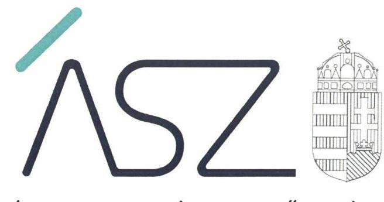
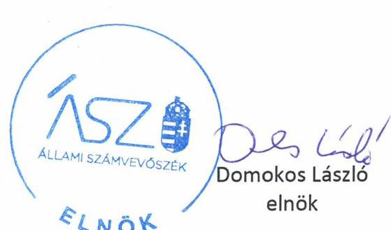
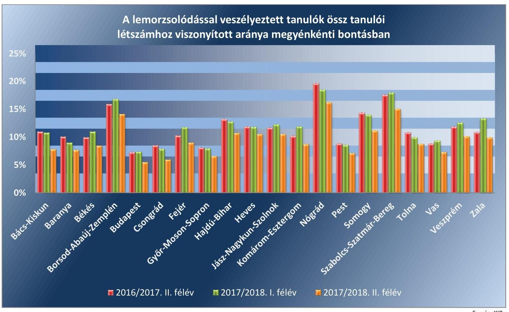
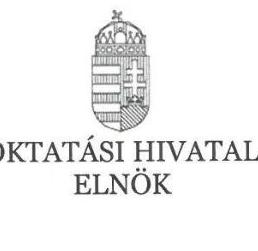
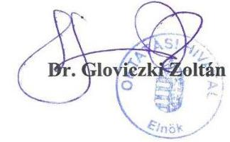
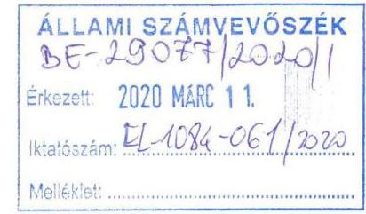
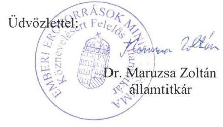

ÁLLAMI SZÁMVEVŐSZÉK

# JELENTÉS 

A köznevelés ellenőrzési rendszerének ellenőrzése

2020. 

20049
www.asz.hu

---

ÁLLAMI SZÁMVEVŐSZÉK

# JELENTÉS 

A köznevelés ellenőrzési rendszerének ellenőrzése

2020. 04. 02.

20049
www.asz.hu

---

# AZ ELLENŐRZÉST FELÜGYELTE: 

MAKKAI MÁRIA felügyeleti vezető

## AZ ELLENŐRZÉST VEZETTE ÉS A VÉGREHAJTÁSÁÉRT FELELŐS:

DORMÁN ISTVÁN ZOLTÁN ellenőrzésvezető

## A PROGRAM ÖSSZEÁLLÍTÁSÁÉRT FELELŐS:

TÓTPÁL SZABOLCS osztályvezető

IKTATÓSZÁM: EL-0681-003/2020
TÉMASZÁM: 2483
ELLENŐRZÉS-AZONOSÍTÓ SZÁM: V0827

---

# TARTALOMJEGYZÉK 

■ ÖSSZEGZÉS ..... 5
■ AZ ELLENŐRZÉS CÉLJA ..... 6
■ AZ ELLENŐRZÉS TERÜLETE ..... 7
■ AZ ELLENŐRZÉS HÁTTERE, INDOKOLTSÁGA ..... 9
■ A JELENTÉS LÉNYEGES KÉRDÉSKÖREI ..... 10
■ ELLENŐRZÉS HATÓKÖRE ÉS MÓDSZEREI ..... 11
■ MEGÁLLAPÍTÁSOK ..... 13
■ MELLÉKLETEK ..... 21
I. sz. melléklet: Értelmező szótár ..... 21
II. sz. melléklet: A „Köznevelés-fejlesztési stratégia" indikátorai ..... 24
■ FÜGGELÉKEK ..... 25
I. sz. függelék: A PISA-felmérés néhány lényeges jellemzője ..... 25
II. sz. függelék: Észrevételek ..... 29
■ RÖVIDÍTÉSEK JEGYZÉKE ..... 33

---

.

---

# ÖSSZEGZÉS 

A 2016-2017. években a köznevelésen belül a közoktatási területet érintő pedagógiai-szakmai ellenőrzések rendszerének kialakítása és működtetése, az ellenőrzések tervezése és végrehajtása a jogszabályi előírásoknak megfelelt. A közoktatási területet érintő pedagógiai-szakmai ellenőrzések elősegítették az ágazati szakmai célkitűzések megvalósítását.

## Az ellenőrzés társadalmi indokoltsága

Az oktatás hosszú távon meghatározza az ország társadalmi, gazdasági, kulturális színvonalát, hozzájárul a gazdaság versenyképességéhez. A közoktatási intézmények által betöltött társadalmi szerep, az oktató intézmények tevékenysége, az oktatási rendszer minősége a társadalom minden tagját közvetlenül érinti, hatással van a felnövekvő generációk életére, a munkaerőpiacon, a felsőoktatásban, az egész életen át tartó tanulásban való sikeres részvételre. A közoktatás területén megvalósuló, megfelelő módszertan alapján végzett pedagógiai-szakmai ellenőrzések biztosítják, hogy a kialakított rendszer alkalmas legyen a nemzeti köznevelési törvényben meghatározott, az oktatást érintő feladatok ellátására, és hozzájárulnak a minőségi oktatáshoz. Mindezekkel összhangban került sor a köznevelésen belül a közoktatási területet érintő ellenőrzések rendszerének kialakításának és működtetésének, szerepük betöltésének ellenőrzésére.

## Főbb megállapítások, következtetések

Az oktatásért felelős miniszter 2016-2017. években a nemzeti köznevelésről szóló törvény előírásainak megfelelően kialakította a közoktatási területet érintő pedagógiai-szakmai ellenőrzési feladatok keretrendszerét. Meghatározta a közoktatási területet érintő, pedagógiai-szakmai ellenőrzési rendszerével szemben támasztott elvárásokat, jóváhagyta az ellenőrzési eszközöket, módszereket. Rendeletben szabályozta a köznevelési intézményekben lefolytatható szakmai ellenőrzéseket, az Oktatási Hivatal által szervezett országos pedagógiai-szakmai ellenőrzés lebonyolításának szabályait, lefolytatásának szakmai feltételeit.

A közoktatási területet érintő szakmai ellenőrzések rendszere a jogszabályi előírásoknak megfelelően működött. A miniszter az Oktatási Hivatal közreműködésével gondoskodott a nevelési-oktatási intézményekben folyó pedagógiai munka szakmai ellenőrzéséről, értékeléséről. Az Oktatási Hivatal, mint a miniszter köznevelési feladatkörébe tartozó egyes feladatok ellátására kijelölt szerv a jogszabályi előírásoknak megfelelően megtervezte és végrehajtotta a miniszter által elrendelt országos és térségi szakmai ellenőrzéseket, pedagógiai-szakmai méréseket, átvilágításokat, elemzéseket, valamint elvégezte a köznevelési fejlesztési terv évenkénti értékelését.

Az oktatásért felelős miniszter által megtett intézkedések támogatták a köznevelési rendszer ágazati stratégiáiban meghatározott fejlesztési célok megvalósítását. A működtetett mérési, értékelési rendszer, a jogszabályban meghatározott központi minimumkövetelmények, a kialakított standardok alapján lefolytatott pedagógiai-szakmai ellenőrzések elősegítették a szakmai beavatkozásokat az alulteljesítő intézmények esetében.

Az ágazati stratégiai tervdokumentumokban a közoktatási területet érintő pedagógiai-szakmai ellenőrzés rendszerére vonatkozó célok időarányos teljesítése megtörtént.

A törvényben előírtak alapján, az oktatásért felelős miniszter biztosította a végzettség nélküli iskolaelhagyás arányának folyamatos monitoringját, amely lehetővé tette a gyors beavatkozást, előmozdította az iskolaelhagyás csökkenését. A miniszter a Hivatal által elvégzett ellenőrzések, mérések, elemzések eredményeit hasznosította a hatáskörébe tartozó jogszabály módosításoknál; a szakértők képzése, továbbképzése során; valamint kitűzte az intézmények és azok fenntartói számára elérendő célokat, bemutatta az intézményi jó gyakorlatokat.

A terület további más módszerekkel történő ellenőrzése indokolt.

---

# AZ ELLENŐRZÉS CÉLJA 

Az ellenőrzés célja annak értékelése volt, hogy a köznevelésen belül a közoktatási területet érintő ellenőrzések rendszerének kialakítása és működtetése, illetve az ellenőrzések tervezése és végrehajtása a jogszabályi előírásoknak megfelelő volt-e. Továbbá annak értékelése, hogy a közoktatási területen végzett pedagógiai-szakmai ellenőrzések eredményeztek-e változásokat a köznevelés területén.

---

# AZ ELLENŐRZÉS TERÜLETE 

## A köznevelésen belül a közoktatási területet érintő pedagógiai-szakmai ellenőrzések rendszere

Magyarország Alaptörvényében foglalt oktatáshoz való jog biztosítása az érettségi, illetve az első szakképesítés megszerzéséig a Magyar Állam közszolgálati feladata, amelynek ellátása érdekében az Országgyűlés megalkotta az Nkt. ${ }^{1}$-t.

Az Nkt. előírásaival összhangban jelen ÁSZ ellenőrzésben a „köznevelési terület" alatt a Nemzeti alaptanterv (Nat.) alapján - intézményfenntartótól függetlenül - biztosított általános iskolai nevelés-oktatást, gimnáziumi, szakgimnáziumi, szakközépiskolai és készségfejlesztő iskolai nevelés-oktatást értjük.

Az Nkt. értelmében a köznevelés rendszerének alapegységei a szakmai önállósággal rendelkező köznevelési intézmények, amelyek jogszerű működését és munkájának minőségét törvényi szabályozás és állami ellenőrzés biztosítja. Az Nkt. a köznevelési intézmények - fenntartótól független - ellenőrzésének három formáját nevesíti, amelyek közül a köznevelésre vonatkozó ágazati stratégiákban megfogalmazott fejlesztési célok megvalósításához, a közoktatás minőségének javulásához a pedagógiai-szakmai ellenőrzés járul hozzá.

A köznevelésre vonatkozó ágazati stratégiákat a Kormány 2014. évben fogadta el, amelyek közül a „Köznevelés-fejlesztési stratégia" célként fogalmazta meg többek között az alulteljesítő iskolák leválogatását és az intelligens beavatkozást szolgáló rendszer kiépítését, a köznevelésben a minimumkövetelmények bevezetését, a pedagógusértékelés és az intézményértékelés országos standardjainak továbbfejlesztését, a pedagógusok külső-belső értékelésének, a tanfelügyeleti rendszer fejlesztését.

A pedagógiai-szakmai ellenőrzések (tanfelügyelet) rendszere tekintetében a „Köznevelés-fejlesztési stratégia" azt a célt tűzte ki, hogy az a stratégiai tervdokumentumban meghatározott egyéb eszközökkel együtt hatékonyan ösztönözze a minőségi munkát, javítsa az oktatás eredményességét. A Magyar Kormány a Nemzeti Reform Programban azt vállalta, hogy 2020-ra a végzettség nélküli iskolaelhagyók aránya Magyarországon 10%-ra csökken. Az ellenőrzött időszakban a 152/2014. (VI. 6.) Korm. rendelet ${ }^{2}$ alapján az EMMI ${ }^{3}$ felelős az oktatással kapcsolatos feladatok végrehajtásáért. Az Nkt. előírja, hogy az oktatásért felelős miniszter ${ }^{4}$ működteti az országos pedagógiai-szakmai ellenőrzés (tanfelügyelet) rendszerét, amely intézményenként, ötévente ismétlődő, értékeléssel záruló vizsgálat.

A Kormány az Nkt.-ban kapott felhatalmazás alapján az Oktatási Hivatalt jelölte ki az oktatásért felelős miniszter köznevelési feladatkörébe tartozó egyes feladatainak ellátására. A miniszter az Oktatási Hivatal közreműködésével gondoskodik a nevelési-oktatási intézményekben folyó pedagógiai munka országos, térségi, megyei, fővárosi szintű szakmai ellenőrzéséről, értékeléséről; az ellenőrzés fenntartótól függetlenül kiterjed minden köznevelési intézményre. A Hivatal a 121/2013. (IV. 26.) Korm. rendelet ${ }^{5}$ alap-

---

ján elvégzi - az Nkt.-ban meghatározott -, a miniszter által elrendelt szakmai ellenőrzéseket, pedagógiai-szakmai méréseket, átvilágításokat, elemzéseket.

Az Nkt.-ban kapott felhatalmazás alapján az oktatásért felelős miniszter a 20/2012. (VIII. 31.) EMMI rendeletben ${ }^{6}$ a pedagógiai-szakmai ellenőrzés tekintetében a pedagógusok, intézményvezetők és intézmények pedagógiai-szakmai munkájának fejlesztését tűzte ki célul a köznevelés minőségének javítása érdekében. A 20/2012. (VIII. 31.) EMMI rendelet alapján az országos pedagógiai-szakmai ellenőrzés a nevelési-oktatási intézmények szakmai tevékenységét értékeli.
2017. január 1-jétől az Nkt. módosítása alapján új állami intézményfenntartót, mint középirányító szervet (Klebelsberg Központ) hoztak létre. Az ettől az időponttól létrejött 58 tankerületi központ vette át az intézmény-fenntartási és működtetési feladatokat. A tankerületi központ fenntartói és irányítói feladatait az oktatásért felelős miniszter látta el.

Az ÁSZ ellenőrzése a köznevelésen belül a közoktatási területet érintő pedagógiai-szakmai ellenőrzések rendszerének kialakítása és működtetése, az ellenőrzések tervezése és végrehajtása jogszabályi előírásoknak való megfelelőségének ellenőrzésére, továbbá annak értékelésére irányult, hogy a pedagógiai-szakmai ellenőrzések eredményeztek-e változásokat a köznevelés területén.

---

# AZ ELLENŐRZÉS HÁTTERE, INDOKOLTSÁGA 

A 2014-2020 időszakra vonatkozó „Köznevelés-fejlesztési stratégia" célul tűzte ki nagyobb állami szerepvállalással a köznevelés egységesen magas minőségének biztosítását, az oktatásfejlesztést. A „Köznevelés-fejlesztési stratégia" tartalmazta, hogy az OECD ${ }^{7}$ által 2012. évben végzett PISA ${ }^{8}$ nemzetközi tanulói teljesítménymérés alapján Magyarországon a tanulók eredményét szociális, kulturális és gazdasági hátterük erősebben befolyásolja, mint a legtöbb országban. Összefoglalta az OECD által szervezett PISA vizsgálatok eredményeit, azt, hogy a magyar diákok a 2012-es PISA tanulói teljesítménymérésben az OECD-átlag alatt teljesítők csoportjába kerültek. A "Köznevelés-fejlesztési stratégia" az oktatásfejlesztés céljaként minőségi és méltányos, az állam által garantált közszolgálatként megvalósuló köznevelési rendszer kialakítását tűzte ki, amely az európai és globális társadalmi és gazdasági térben sikeresen alkalmazkodni képes fiatalokat készít fel a munkaerőpiacon/felsőoktatásban/egész életen át tartó tanulásban való sikeres részvételre. A „Köznevelés-fejlesztési stratégia" tartalmazta, hogy kialakításra és működtetésre kerül a köznevelési ágazat irányítási, ellenőrzési, értékelési rendszere, továbbá a köznevelés minőségének javítása érdekében pedagógiai-szakmai ellenőrzési rendszer, mint állami visszajelző rendszer a köznevelés minőségéről. Tartalmazta továbbá, hogy a pedagógiai-szakmai ellenőrzés, mint országosan egységes, külső szakmai ellenőrzés és értékelés célja, hogy az egyes pedagógusokról, intézményvezetőkről és intézményekről objektív szakmailag megalapozott képet adjon az oktatásirányítóknak. A „Köznevelés-fejlesztési stratégia" megfogalmazta, hogy az oktatás minőségének, hatékonyságának és eredményességének javítását az Nkt. alapozza meg. Tartalmazta, hogy a köznevelésen belül a közoktatás területén megvalósuló, megfelelő módszertan alapján végzett pedagógiai-szakmai ellenőrzési tevékenységek biztosíthatják, hogy a kialakított rendszer alkalmas legyen az Nkt.-ban meghatározott, az oktatást érintő feladatok ellátására, és hozzájáruljon a minőségi oktatáshoz.

Az ellenőrzés eredményeképpen a törvényhozás számára tapasztalatok állnak rendelkezésre a közoktatási területet érintő pedagógiai-szakmai ellenőrzési rendszer felügyeletéhez, ágazati irányításához, valamint a pedagógiai-szakmai ellenőrzéseket végző Oktatási Hivatal szabályozásához. Az ellenőrzés a társadalom számára átfogó képet ad a közoktatási területet érintő pedagógiai-szakmai ellenőrzések megszervezéséért, végrehajtásáért felelős szervezetek feladatellátásáról, annak hiányosságairól, és a jó gyakorlatokról. Ellenőrzéseivel, javaslataival és megállapításaival az ÁSZ elősegíti az ellenőrzött terület szabályozásának, szabályszerűségének javítását.

---

# A JELENTÉS LÉNYEGES KÉRDÉSKÖREI 

1.     - Kialakították-e a közoktatási területet érintő pedagógiai-szakmai ellenőrzések rendszerét?
2.     - Működött-e az ellenőrzött időszakban a közoktatási területet érintő pedagógiai-szakmai ellenőrzések rendszere?
3.     - Betöltötték-e szerepüket a közoktatási területet érintő pedagógiai-szakmai ellenőrzések?

---

# ELLENŐRZÉS HATÓKÖRE ÉS MÓDSZEREI 

## Az ellenőrzés típusa

Megfelelőségi és teljesítmény-ellenőrzés.

## Az ellenőrzött időszak

Az ellenőrzött időszak a 2016-2017. évek.

## Az ellenőrzés tárgya

Az ellenőrzés tárgyát képezte az állam köznevelési szerepvállalása körében, a köznevelésen belül a közoktatási területet érintő ágazati irányítási és felügyeleti joggyakorló hatáskörébe utalt pedagógiai-szakmai ellenőrzések rendszerének megszervezése, kialakítása és az ezzel kapcsolatos működtetési feladatellátás. Továbbá az ellenőrzés tárgyát képezte annak feltárása, hogy a köznevelésen belül a közoktatás területét érintő pedagógiai-szakmai ellenőrzések elősegítették-e a közoktatási feladatok ellátására vonatkozó ágazati stratégiában megfogalmazott fejlesztési célok megvalósítását.

## Az ellenőrzött szervezet

Az oktatásért felelős Emberi Erőforrások Minisztériuma és az Oktatási Hivatal.

## Az ellenőrzés jogalapja

Az ellenőrzés jogalapját az ÁSZ tv. ${ }^{9}$ 1. § (3) bekezdése, valamint 5. § (2), (6) bekezdései képezték.

## Az ellenőrzés módszerei

Az ellenőrzést az ellenőrzési program szempontjai, az ellenőrzött időszakban hatályos jogszabályok, az ellenőrzés pedagógiai-szakmai szabályai, a jelen ellenőrzésre irányadó ÁSZ módszertanok figyelembevételével végeztük.

Az ellenőrzés ideje alatt az ellenőrzött szervezettel történő kapcsolattartást az ÁSZ SZMSZ ${ }^{10}$-ének vonatkozó előírásai alapján biztosítottuk.

---

Az ellenőrzési kérdések megválaszolásához szükséges bizonyítékok megszerzése az ellenőrzött által rendelkezésre bocsátott dokumentumokra, adatokra alapozva megfigyelés, szemle (szemrevételezés), kérdésfeltevés (információkérés), a mintavételezés, valamint elemző eljárás útján történt.

Az ellenőrzési bizonyítékként felhasználható adatforrások közé
 tartoztak egyrészt az ellenőrzési program részletes szempontjainál felsorolt adatforrások, másrészt minden egyéb - az ellenőrzés folyamán feltárt, az ellenőrzés szempontjából információt tartalmazó - dokumentum.

Az ellenőrzés lefolytatásához az ellenőrzött szervezetek a tanúsítványok kitöltésével, hitelesítésével és azok, valamint az ÁSZ által kért dokumentumok megküldésével szolgáltattak adatokat.

A pedagógiai-szakmai ellenőrzések szabályszerűségének ellenőrzésére mintavétel alapján került sor. A mintavételezésre a 2. lényeges kérdéskör megválaszolása érdekében az Oktatási Hivatal ellenőrzési adatbázisaiból az Oktatási Hivatal által teljesített adatszolgáltatásban feltüntetett pedagógiai-szakmai ellenőrzések vonatkozásában került sor rétegzett mintavételi eljárás módszerének alkalmazásával. A pedagógiai-szakmai ellenőrzések kapcsán minden egyes tétel vonatkozásában a szabályszerűségre vonatkozó kérdéseket tettünk fel. „Szabályszerűnek" értékeltük a pedagógiai-szakmai ellenőrzéseket, amennyiben 95%-os bizonyossággal az ellenőrzött sokaságban az átlagos hibaarány legfeljebb 10%, "nem szabályszerűnek", amennyiben 10%-nál magasabb arányt képviselt.

Teljesítmény-ellenőrzés módszerével a köznevelésen belül a közoktatási területet érintő ellenőrzések rendszeréből a pedagógiai-szakmai ellenőrzések működésének eredményességét, ezen belül az ágazati és a jogszabályban nevesített, közoktatás területét érintő minőségi célok teljesülését értékeltük, a 3. kérdéskör keretében. A 3. kérdéskör értékeléséhez jogszabályi előírások hiányában helyénvalósági kritériumok kerültek megfogalmazásra.

---

# 1. Kialakították-e a közoktatási területet érintő pedagógiai-szakmai ellenőrzések rendszerét? 

Összegző megállapítás

### 1.1. számú megállapítás

1. ábra

JOGSZABÁLYI KRITÉRIUM

Az Áht. előírásai szerint az EMMI miniszter adja ki az Oktatási Hivatal alapító okiratát és hagyja jóvá a szervezetét, feladatai ellátásának részletes belső rendjét és módját megállapító szervezeti és működési szabályzatát.
A 152/2014. (VI. 6.) Korm. rendelet szerint az EMMI miniszter előkészíti a köznevelésre vonatkozó jogszabályokat, kidolgozza a köznevelés tartalmi szabályozásának kereteit, meghatározza az oktatáspolitika ellátásának eszközrendszerét, elemzi és ellenőrzi annak működését.
Az Nkt. alapján a miniszter felügyeli a KIR és az INYR működését. Az Nkt. alapján a KIR, illetve az INYR keretében folyó adatkezelés tekintetében az adatkezelő a Hivatal. Forrás: ÁSZ saját szerkesztés

A közoktatási területet érintő pedagógiai-szakmai ellenőrzések rendszerét a jogszabályi előírásoknak megfelelően kialakították.

Az oktatásért felelős miniszter szabályszerűen kialakította a pedagógiai-szakmai ellenőrzések keretrendszerét.

AZ OKTATÁSÉRT FELELŐS MINISZTER rendeletben határozta meg a köznevelési intézményekben lefolytatható szakmai ellenőrzések, a Hivatal ${ }^{11}$ által szervezett országos pedagógiai-szakmai ellenőrzés lebonyolításának szabályait, lefolytatásának szakmai feltételeit.

A miniszter az Áht. előírásainak megfelelően jóváhagyta a Hivatal Alapító Okiratát ${ }^{12}$, valamint az EMMI és a Hivatal SzMSz-ét. Az EMMI SzMSzében a miniszter rendelkezett a pedagógiai szakmai ellenőrzésekkel, azok fejlesztésével és eredményeinek nyomon követésével, nyilvántartásával kapcsolatos feladatokról, 2017. január 1-től a tanfelügyelettel és az önértékelési rendszer fejlesztésével kapcsolatos feladatokról. Az Nkt. előírásai szerint, az EMMI SzMSz-ében, a Hivatal Alapító Okiratában és a Hivatal $\mathrm{SzMSz}{ }^{13}$-ében szabályozta a $\mathrm{KIR}^{14}$ és az $\mathrm{INYR}^{15}$ működtetésével és felügyeletével kapcsolatos feladatokat.

A miniszter a 20/2012. (VIII. 31.) EMMI rendelet 152. § (2) bekezdésének előírásainak megfelelően 2016. évben jóváhagyta a 2016. és a 2017. évi országos pedagógiai-szakmai ellenőrzés (tanfelügyelet) során használt ellenőrzési eszközöket (Tanfelügyeleti Kézikönyveket ${ }^{16}$ ), valamint az intézményi önértékelés területeit, szempontjait, módszereit és eszközrendszerét (Önértékelési Kézikönyveket).

Az Nkt. 75. § (2) bekezdése a miniszter részére a köznevelés-fejlesztési terv legalább ötévenkénti értékelését és szükség szerinti módosítását írta elő. A 2016. és a 2017. évben a köznevelési fejlesztési terv felülvizsgálatára nem került sor, a 229/2012. (VIII. 28.) Korm. rendelet ${ }^{17}$ vonatkozó előírásai 2018. március 31-ével hatályukat veszítették. A 2016. és a 2017. évben a Hivatal végzett a köznevelési fejlesztési terv tekintetében értékelést és a javasolt változtatásokról összesítő jelentéseket készített a miniszter részére.

---

### 1.2. számú megállapítás

2. ábra

JOGSZABÁLYI KRITÉRIUM

A miniszter az Nkt. alapján köteles a köznevelés stratégiájának kidolgozására. A stratégiai tervdokumentumok, megvalósítására, nyomon követésére vonatkozó követelményeket a kormányzati stratégiai irányításról szóló 38/2012. (III. 12.) Korm. rendelet határozza meg. A Korm. rendelet előírásai szerint a stratégiai tervdokumentum elfogadását követően gondoskodni kell a nyomon követéséről. A nyomon követés során a stratégiai tervdokumentumban meghatározott nyomon követési rendszerben és mutatók alapján kell végezni az adat- és információgyűjtést, valamint ezek elemzését. A nyomon követés a stratégiai tervdokumentum előkészítéséért felelős feladata. A nyomon követés során a stratégiai tervdokumentum elfogadására jogosultat a stratégiai tervdokumentumban meghatározott rendszerességgel, ennek hiányában évente kell a megvalósulásról beszámolóban tájékoztatni. A beszámolónak tartalmaznia kell a stratégiai tervdokumentumban szereplő célok és eredmények megvalósulásának mértékét; a stratégiai tervdokumentum megvalósulása érdekében tett intézkedéseket és a felhasznált erőforrásokat; terv-tény elemzést és az eltérés okait, valamint az eltérések kezelésére vonatkozó intézkedési tervet.

Forrás: ÁSZ saját szerkesztés

## Az oktatásért felelős miniszter meghatározta a pedagógiai-szakmai ellenőrzési rendszerrel szemben támasztott elvárásokat.

## AZ ÁGAZATI STRATÉGIAI TERVDOKUMENTUMOK

tartalmazták a közoktatási területet érintő pedagógiai-szakmai ellenőrzés rendszerére vonatkozó célokat.

Az oktatásért felelős miniszter a „Köznevelés-fejlesztési stratégiában" meghatározott célokhoz rendelt indikátorokat (2. sz. Melléklet).A „Végzettség nélküli iskolaelhagyás elleni középtávú stratégia" alapján a mutatókat a stratégia elfogadása után, a helyzetelemzésben megfogalmazott összes területre, az átfogó és specifikus célokra dolgozták ki.

Az EMMI készített a „Végzettség nélküli iskolaelhagyás elleni középtávú stratégiá"-ban foglalt beavatkozások megvalósítását támogató Cselekvési tervet, amelyet a Kormány a 1729/2016. (XII. 13.) Korm. határozattal elfogadott.

AZ OKTATÁSÉRT FELELŐS MINISZTER monitoring tevékenysége keretében az indikátorok, mutatók mérésével, ellenőrzésével nyomon követte a pedagógiai-szakmai ellenőrzés rendszerére vonatkozó célok megvalósulását, a követelmények teljesítését.

Az EMMI 2017 januárban készített beszámolót a „Köznevelés-fejlesztési stratégiá"-ról. A 38/2012. (III. 12.) Korm. rendelet ${ }^{18}$ 20. § (5) bekezdés a) és c) pontjaiban előírtak ellenére azonban a beszámoló nem tartalmazta a stratégiai tervdokumentumban szereplő célok és eredmények megvalósulásának mértékét, a terv-tény elemzést és az eltérés okait.

Az EMMI a „Végzettség nélküli iskolaelhagyás elleni középtávú stratégia" intézkedéseinek végrehajtásáról szóló beszámolót 2018 júniusában elkészítette, amely tartalmazta a korai iskolaelhagyók arányának évenkénti alakulását 2017-ig.

---

# 2. Működött-e az ellenőrzött időszakban a közoktatási területet érintő pedagógiai-szakmai ellenőrzések rendszere? 

Összegző megállapítás

### 2.1. számú megállapítás

3. ábra

JOGSZABÁLYI KRITÉRIUM

Az Nkt. alapján az oktatásért felelős minisztérium a Hivatal közreműködésével működteti az országos pedagógiai-szakmai ellenőrzés rendszerét, gondoskodik az ebben részt vevő szakértők képzéséről és továbbképzéséről, az ellenőrzés általános tapasztalatainak feldolgozásáról és nyilvánosságra hozataláról.

Forrás: ÁSZ saját szerkesztés

A közoktatási területet érintő pedagógiai szakmai ellenőrzések rendszere szabályszerűen működött.

Az oktatásért felelős miniszter a pedagógiai-szakmai ellenőrzésekkel kapcsolatos feladatait a jogszabályi előírásoknak megfelelően elvégezte.

AZ OKTATÁSÉRT FELELŐS MINISZTER az Nkt. előírásai szerint kialakította a köznevelési ágazat irányítási, ellenőrzési, értékelési rendszerét. A 20/2012. (VIII. 31.) EMMI rendeletben gondoskodott az országos pedagógiai mérések lebonyolítására, előkészítésére, értékelésére vonatkozó szabályok meghatározásáról, az országos kompetenciamérésekhez kapcsolódó minimum képességszintek meghatározásáról.

Az ellenőrzött időszakban a pedagógiai-szakmai ellenőrzések lefolytatásáról a miniszter a Hivatal útján gondoskodott. Az EMMI a 20/2012. (VIII. 31.) EMMI rendeletben foglaltak alapján évente, a tanév rendjéről szóló miniszteri rendeletekben elrendelt országos és térségi szakmai ellenőrzésekkel, pedagógiai-szakmai mérésekkel, biztosította a köznevelési intézmények munkájának minőségét, jogszerű működését. Az Nkt. előírásainak megfelelően a 2015-2016., 2016-2017 és a 2017-2018. tanévre vonatkozóan rendelt el országos és térségi szakmai ellenőrzéseket, pedagógiai-szakmai méréseket, átvilágításokat, elemzéseket.

Az oktatásért felelős miniszter az Nkt. előírásai alapján gondoskodott a 2016. és 2017. évi kompetenciamérés eredményeiről készített országos jelentések közzétételéről a minisztérium honlapján. Az országos mérés, értékelés intézményekre vonatkozó eredményeinek elérését a Hivatal honlapján keresztül biztosította az ellenőrzött időszakban.

---

### 2.2. számú megállapítás

## 4. ábra

JOGSZABÁLYI KRITÉRIUM

Az Nkt. előírásai szerint az oktatásért felelős miniszternek a Hivatal előterjesztése alapján megyei szintű bontásban feladat-ellátási, intézményhálózat-működtetési és köznevelés-fejlesztési tervet kell készítenie, amelynek része a megyei szakképzési terv.
Az országos pedagógiai-szakmai ellenőrzés részét képező intézményi önértékelés területeit, szempontjait, módszereit és eszközrendszerét a 20/2012. (VIII. 31.) EMMI rendelet szerint a Hivatal dolgozza ki és az oktatásért felelős miniszter hagyja jóvá. A Hivatal a 20/2012. (VIII. 31.) EMMI rendelet alapján köteles nyilvánosságra hozni az országos pedagógiai-szakmai ellenőrzés során használt kérdőíveket, értékelőlapokat, megfigyelési, önértékelési szempontokat, feldolgozási segédleteket és szempont-sorokat.
A pedagógiai-szakmai ellenőrzések eredményét a Hivatal a 121/2013. (IV. 26.) Korm. rendelet alapján köteles feldolgozni és nyilvántartani, valamint azokról beszámolni a miniszternek.

Forrás: ÁSZ saját szerkesztés

## Az Oktatási Hivatal a pedagógiai-szakmai ellenőrzésekkel kapcsolatos feladatait megfelelően elvégezte.

A HIVATAL az Nkt. és az Nktvhr. előírásai szerint, a megyei kormányhivatalok közreműködésével elkészítette a 2013-2018. évekre vonatkozó feladat-ellátási, intézményhálózat-működtetési és köznevelés-fejlesztési terveket, amelyeket a miniszter jóváhagyott. A Hivatal a 20/2012. (VIII. 31.) EMMI rendelet előírásainak megfelelő tartalommal, határidőben elkészítette a 2016. és 2017. évre szóló országos pedagógiai-szakmai ellenőrzési terveket, amelyeket az EMMI jóváhagyott.

A Hivatal a 20/2012. (VIII. 31.) EMMI rendelet előírásának megfelelően intézménytípusonként elkészítette a 2016. és a 2017. évi országos pedagógiai-szakmai ellenőrzés során használt Tanfelügyeleti és Önértékelési Kézikönyveket, és a miniszteri jóváhagyást követően gondoskodott azok nyilvánosságra hozataláról.

A Hivatal a 2016. és 2017. évi ellenőrzési terveiben szerepeltetett ellenőrzésekről az érintett intézményeket a 20/2012. (VIII. 31.) EMMI rendeletben előírt határidőben értesítette.

Az országos és térségi szakmai ellenőrzéseket a Hivatal a 2016. és 2017. évi ellenőrzési terveiben foglaltak szerint, az elfogadott standardok (Kézikönyvek) figyelembe vételével végrehajtotta. Az ellenőrzés tapasztalatait a 20/2012. (VIII. 31.) EMMI rendelet előírásainak megfelelő határidőn belül rögzítették a KIR-ben. Az informatikai rendszer tartalmazta a 2016. és 2017. évi tanfelügyeleti ellenőrzések során kitöltött jegyzőkönyveket, az összegző szakértői értékeléseket, amelyekhez való hozzáférést a rendszer biztosította a jogosultak (ellenőrzött intézmény, Hivatal) részére.

Az elvégzett ellenőrzések eredményei és a 20/2012. (VIII. 31.) EMMI rendeletben foglaltak alapján a Hivatal 2017-ben 89 kompetencia-alulteljesítő intézmény 30 fenntartóját szólította fel intézkedési terv(ek) elkészítésére és három hónapon belül történő benyújtására jóváhagyás céljából.

A tanév rendjéről szóló rendeletek ${ }^{19}$-ben elrendelt ellenőrzések tapasztalatait a Hivatal a 2016. és a 2017. évben feldolgozta és megküldte az oktatásért felelős miniszternek.

A Hivatal elnöke - az Nktvhr. ${ }^{20}$ alapján - a 24/2014. (VI. 17.) OH elnöki utasításban gondoskodott a KIR minőségirányítási kézikönyvének kiadásáról. A Hivatal 2017. évben, az Nktvhr.-ben meghatározott határidőben elkészítette a jelentést a KIR részeként működő, a lemorzsolódással veszélyeztetett tanulók támogatásához kapcsolódó korai jelző- és pedagógiai támogató rendszerben rögzített adatok országos, megyei és járási szintű megoszlásáról és az intézményi tevékenységekről, valamint a megtett intézkedésekről az Nktvhr. alapján a tájékoztatást megadta az oktatásért felelős miniszter részére.

A Hivatal a nemzetközi tanulói teljesítménymérési rendszerek szabályai szerint a 121/2013. (IV. 26.) Korm. rendelet 7. § (3) bekezdése alapján előkészítette és lebonyolította a köznevelési tárgyú nemzetközi, az OECD által szervezett PISA 2015, valamint az IEA ${ }^{21}$ által szervezett TIMSS ${ }^{22} 2015$ és PIRLS ${ }^{23} 2016$ nemzetközi felméréseket, méréseket és vizsgálatokat, amelyekről a lebonyolításukat követő évben honlapján közzétette az elkészített összefoglaló jelentéseket.

---

# 3. Betöltötték-e szerepüket a közoktatási területet érintő pedagógiai-szakmai ellenőrzések? 

Összegző megállapítás

A közoktatási területet érintő pedagógiai-szakmai ellenőrzések betöltötték szerepüket, elősegítették az ágazati szakmai célkitűzések megvalósítását.
3.1. számú megállapítás Az ágazati stratégiai tervdokumentumokban a pedagógiai-szakmai ellenőrzés rendszerére vonatkozóan kitűzött célok időarányos teljesítése

 megtörtént.

A 2017. ÉVRE az ágazati stratégiai tervdokumentumokban a pedagógiai-szakmai ellenőrzés rendszerére vonatkozóan kitűzött célok időarányos teljesítése megtörtént

A 2017. évre a meghatározott minimális elvárásokhoz, indikátorokhoz az egyes intézmények vonatkozásában kidolgozásra kerültek a monitoring eljárások, az elérendő fejlesztési célok, továbbá beazonosításra kerültek a legkockázatosabb intézmények, melyek esetében elindultak a kockázatokat csökkentő beavatkozások, az oktatásért felelős miniszter feladatellátása a helyénvalósági kritériumnak megfelelt.

A közoktatási területet érintő pedagógiai-szakmai ellenőrzések lefolytatására a jogszabály szerint megalkotott és elfogadott ellenőrzési tervek alapján, a pedagógiai-szakmai ellenőrzési és önértékelési standardok alkalmazásával, szakértők bevonásával került sor. Az országos mérésekhez, értékelésekhez jogszabályban kialakított minimum értékek biztosították az egységes értékelést, ez képezte az alapját a tanulók fejlődése nyomon követésének, a KIR rendszer alkalmazásával. Az informatikai támogató rendszer adatainak elemzése alapján került sor az alulteljesítő iskolák azonosítására, illetve teljesítményük nyomon követésére, a beavatkozások megkezdésére. A lemorzsolódással veszélyeztetett tanulók azonosításának, nyomon követésének alapját is ezek az adatok biztosították.

Az oktatásért felelős miniszter a 2016-2017. években az Nkt. alapján működtette a KIR rendszer részét képező, a végzettség nélküli iskolaelhagyás megelőzését, nyomon követését, újra termelődését célzó a lemorzsolódással veszélyeztetett tanulók pedagógiai támogatásához kapcsolódó korai jelző- és pedagógiai támogató rendszert. A rendszerben a 2016/2017. tanév II. félévétől félévenként követhető volt az adatok változása. A korai jelző- és pedagógiai támogató rendszer bevezetését követően - a 2016/2017. II. félévi bázis értékhez viszonyítva minden megyében csökkent a lemorzsolódással veszélyeztetett tanulók száma a 2017/2018. tanév második félévére, 12 megyében a Nemzeti Reform Programban vállalt 10% alatti értéket mutatott. A jelzőrendszer alapján követhető a lemorzsolódással veszélyeztetett tanulók számának alakulása (5. ábra).

---

Fonrás: KIR
3.2. számú megállapítás

Mindezek támogatták a köznevelési rendszer ágazati stratégiájában meghatározott fejlesztési célok megvalósítását.

## A lefolytatott pedagógiai-szakmai ellenőrzések támogatták a közoktatás területének feladatellátását.

Az oktatásért felelős miniszter feladatellátása a helyénvalósági kritériumnak megfelelt, gondoskodott az országos pedagógiai-szakmai ellenőrzések, mérések, átvilágítások, elemzések eredményeinek, tapasztalatainak hasznosításáról.

A Hivatal a Kézikönyvek módosítása során figyelembe vette az előző évi ellenőrzések tapasztalatait, a pedagógiai-szakmai ellenőrzés főbb megállapításainak, általános tapasztalatainak a pedagógiai-szakmai ellenőrzés alapját képező Kézikönyvekbe történő beépítésével a helyénvalósági kritériumnak megfelelt.

Az országos és térségi pedagógiai szakmai ellenőrzések tervezése, elrendelése során figyelembe vették a megelőző ellenőrzések nyomon követési kötelezettségét.

Az országos pedagógiai-szakmai ellenőrzések tapasztalatainak figyelembevételével az oktatásért felelős miniszter az ellenőrzött időszakban több alkalommal módosította a 20/2012. (VIII. 31.) EMMI rendeletet.

Az oktatásért felelős miniszter a 2016. és a 2017. évben a pedagógiai szakmai ellenőrzések általános tapasztalatainak megosztásával gondoskodott az országos pedagógiai-szakmai ellenőrzési rendszerben résztvevő szakértők képzéséről és továbbképzéséről.

---

A korai jelzőrendszer bevezetésével és működtetésével lehetővé vált a végzettség nélküli iskolaelhagyás arányának folyamatos nyomon követése, amely lehetővé tette a gyors beavatkozást, támogatta az iskolai fokozatokon belüli és közötti iskolaelhagyás csökkenését. 30 fenntartó 89 intézménye számára, amelyek esetében a 2016. évi Országos kompetenciamérés eredményei nem érték el a 20/2012. (VIII. 31.) EMMI rendeletben meghatározott minimum értéket, az oktatásért felelős miniszter elérendő célként a kompetenciamérés minimumának elérését tűzte ki.

Az Országos kompetenciamérés adatai alapján a Hivatal a 2015-2016, illetve a 2016-2017-es tanévre közzétette azon intézmények listáját évfolyamonkénti és mérési területenkénti bontásban, amelyek jó hátránykiegyenlítő hatással rendelkeztek az országos kompetencia mérés két területén (matematika, szövegértés), illetve ahol a 8. vagy 10. évfolyamon az átlagosnál nagyobb mértékben fejlesztették a tanulók képességeit. Ezzel felhívta a figyelmet az országos pedagógiai gyakorlatok kiemelkedő teljesítményeire, a jó gyakorlatokra. A miniszter által a pedagógiai-szakmai ellenőrzések eredményei, tapasztalatai hasznosulása érdekében az ellenőrzött időszakban megtett intézkedéseket az 1. táblázat foglalja össze.

1. táblázat

# A PEDAGÓGIAI-SZAKMAI ELLENŐRZÉSEK EREDMÉNYEINEK HASZNOSULÁSA 

| Cél | megtett intézkedés |
| :--: | :--: |
| A tanfelügyeleti ellenőrzések tapasztalatai alapján jogszabály módosítással | Az országos pedagógiai-szakmai ellenőrzések tapasztalatainak figyelembe vételével az oktatásért felelős miniszter az ellenőrzött időszakban több alkalommal módosította a 20/2012. (VIII. 31.) EMMI rendeletet. |
| A kompetencia mérés minimumának elérésével kapcsolatos célok meghatározásával | Az Országos kompetenciamérésen alulteljesítő intézmények esetében és elérendő célként a kompetenciamérés minimumának elérését tűzte ki. |
| Jó gyakorlatok bemutatásával | Az Országos kompetenciamérés adatai alapján a Hivatal közzétette azon iskolák listáját, amelyek tanulói jobb eredményt értek el, így az átlagosnál nagyobb volt az intézményekben folytatott pedagógiai munka fejlesztő hatása. A Hivatal továbbá internetes felületet biztosított a köznevelés különböző területein egyéni vagy intézményi szinten alkalmazott, olyan innovatív, hiánypótló eljárások, módszerek, pedagógiai vagy szervezetfejlesztési jó gyakorlatok megosztására, amelyek összhangban álltak az ágazati és intézményi szabályozó dokumentumokkal, adaptálhatóak voltak, alkalmazásukat dokumentálták, és amelyek eredménye az intézmények feladatainak ellátását pozitívan befolyásolta, illetve összegyűjtötte azokat. |

---

A Hivatal a 2015/2016. és 2016/2017. tanévben legtöbb hozzáadott pedagógiai értéket teremtő iskolák listáját az Országos kompetenciamérés adatai alapján tette közzé. Az Országos kompetenciamérés célja - a PISA tanulói teljesítményértékeléstől eltérően - az iskolák munkájának objektív értékelése, az összehasonlítás alapjának megteremtése. A listában szereplő iskolák között voltak olyan intézmények, amelyeknél a Hivatal 2016., illetve 2017. évben végzett pedagógiai-szakmai ellenőrzést, azonban közvetlen kapcsolat nem volt kimutatható az elvégzett pedagógiai-szakmai ellenőrzések és a minőség javulása között. Az Országos kompetenciamérés eredményeinek Hivatal által végzett értékelése alapján az iskolák teljesítményét és az ott folyó pedagógiai munka minőségét nem a rangsorban elfoglalt helyezés jellemezte leginkább, hanem az, hogy a pedagógusok milyen társadalmi összetételű és milyen előzetes tudással rendelkező tanulócsoporttal érték el az átlagpontszámban megjelenő eredményt.

---

# MELLÉKLETEK 

- I. SZ. MELLÉKLET: ÉRTELMEZŐ SZÓTÁR
eredményesség
fenntartó
irányító szerv
helyénvalósági ellenőrzés
integrált nyomon követő rendszer (INYR)

Köznevelési Információs Rendszer (KIR)

Az eredményesség annak követelménye, hogy a kitűzött célok - az elfogadott módosításokat, változó körülményeket figyelembe véve - megvalósuljanak, a tevékenység tervezett és tényleges hatása közötti különbség a lehető legkisebb mértékű legyen, vagy a tényleges hatás legyen kedvezőbb a tervezettnél (Bkr. 2. § g) pontja)
Az a természetes vagy jogi személy, aki, vagy amely a köznevelési feladat ellátására való jogosultságot megszerezte vagy azzal rendelkezik, és a köznevelési intézmény működéséhez szükséges feltételekről gondoskodik.
A költségvetési szerv tekintetében az Áht.-ban meghatározott irányítási hatáskört gyakorló szerv. A költségvetési szerv irányítása a következő hatáskörök gyakorlását jelenti: a költségvetési szerv alapítása, átalakítása és megszüntetése, ideértve az alapító okirat és annak módosítása, valamint a megszüntető okirat kiadására vonatkozó hatáskör gyakorlását. A szervezeti és működési szabályzatának jóváhagyása. A költségvetési szerv vezetésére kinevezés vagy megbízás adása, a vezető felmentése vagy a vezetői megbízás visszavonása, és - ha törvény vagy kormányrendelet másként nem rendelkezik - a vezetővel kapcsolatos egyéb munkáltatói jogok gyakorlása. A gazdasági vezetőjének kinevezése vagy megbízása, felmentése vagy megbízásának visszavonása. A tevékenységének törvényességi, szakszerűségi és hatékonysági ellenőrzése. A jogszabályban meghatározott esetekben a költségvetési szerv döntéseinek előzetes vagy utólagos jóváhagyása, egyedi utasítás kiadása feladat elvégzésére vagy mulasztás pótlására, jelentéstételre vagy beszámolóra való kötelezés, és a költségvetési szerv kezelésében lévő közérdekű adatok és közérdekből nyilvános adatok törvényben meghatározott személyes adatok kezelése. (Forrás: Áht. 1. § 9. pontja, 9. §)

A helyénvalósági ellenőrzés a megfelelőségi ellenőrzés azon altípusa, amelyet azokban az esetekben kell alkalmazni, amelyekre jogszabályi előírások nem alkalmazhatóak, illetve amennyiben egyes kérdések megítélésénél nyilvánvaló jogszabályi hiányosságok vannak. Helyénvalósági ellenőrzés során az ellenőrzést végző személynek a közszféra intézményeinek helyes gazdálkodására, a közpénzek eredményes és megfelelő felhasználására és a közszféra tisztviselőinek magatartására vonatkozó általános elvek mentén kell az ellenőrzést lefolytatnia. A helyénvalósági ellenőrzés kritériumait az ellenőrzés tárgyában általánosan elfogadott, illetve nemzetközi vagy hazai „jó gyakorlatok" is meghatározhatják. (Állami Számvevőszék, A megfelelőségi ellenőrzés alapelvei 2015. július)
Az integrált nyomon követő rendszer a pedagógiai szakszolgálati tevékenységek során alkalmazott rendszer, amely a gyermekek, tanulók teljes körű pedagógiai szakszolgálati ellátása, fejlődésük figyelemmel kísérése céljából a gyermekekhez, tanulókhoz kapcsolódóan, a számukra ellátást nyújtó intézmények, nevelési-oktatási intézmények és a pedagógiai szakszolgálati intézmények feladat-ellátási adatainak nyilvántartását, továbbá az ellátást igénybevevők ellátási eseményeinek nyomon követését szolgáló országos informatikai nyilvántartó rendszer. (Nkt. 44/A-B. §)
A KIR központi nyilvántartás keretében a nemzetgazdasági szintű tervezéshez szükséges fenntartói, intézményi, foglalkoztatási, gyermek- és tanulói adatokat tartalmazza. (Nkt. 44. § (1)-(2) bekezdése)
A KIR hatósági és szakmai tevékenységeket kiszolgáló, az Oktatási Hivatal által működtetett elektronikus alkalmazások, adatállományok, dokumentációk adatbázisa, valamint országos statisztikai és jogosultság alapú adatszolgáltatási rendszer. A KIR

---

kockázatelemzés
köznevelés
köznevelési alapfeladat
közfeladat
köznevelés minőségének javítása
közoktatás
közoktatási terület
részeként a Hivatal rendszerként működteti a köznevelési intézményt és fenntartóját ellenőrző közigazgatási hatóságok, szervek ellenőrzési munkatervét és ellenőrzéseik eredményeit. (Nktvhr. 1.§ (1-2) bekezdése)
Objektív módszer az ellenőrizendő területek kiválasztására, mely meghatározza a költségvetési szerv tevékenységében és belső kontrollrendszerében rejlő kockázatokat (Bkr. 2. § I) pontja)
A köznevelés közszolgálat, amely a felnövekvő nemzedék érdekében a magyar társadalom hosszú távú fejlődésének feltételeit teremti meg, és amelynek általános kereteit és garanciáit az állam biztosítja. A köznevelés egészét a tudás, az igazságosság, a rend, a szabadság, a méltányosság, a szolidaritás erkölcsi és szellemi értékei, az egyenlő bánásmód, valamint a fenntartható fejlődésre és az egészséges életmódra nevelés határozzák meg. A köznevelés egyetemlegesen szolgálja a közjót és a mások jogait tiszteletben tartó egyéni célokat. (Forrás: Nkt. 1. § (1) bekezdés)
Az Alaptörvényben foglalt ingyenes és kötelező alapfokú, ingyenes és mindenki számára hozzáférhető középfokú nevelés-oktatáshoz való jog biztosítása az érettségi megszerzéséig, illetve a szakképzésről szóló törvényben meghatározott feltételek szerinti második szakképesítés megszerzését biztosító első pedagógiai-szakmai vizsga befejezéséig a magyar állam közszolgálati feladata. (Forrás: Nkt. 2. § (1) bekezdés)
Az köznevelési intézmény által végezhető alapfeladatokat az Nkt. 4. § (1) bekezdése határozza meg, melyek többek között az alábbiak:
óvodai nevelés, általános iskolai nevelés-oktatás, kollégiumi ellátás, gimnáziumi nevelés-oktatás, szakgimnáziumi nevelés-oktatás, szakközépiskolai nevelés-oktatás, szakiskolai nevelés-oktatás, pedagógiai szakszolgálati feladat)
Jogszabályban meghatározott állami vagy önkormányzati feladat, amit az arra kötelezett közérdekből, a jogszabályban meghatározott követelményeknek és feltételeknek megfelelve végez, ideértve a lakosság közszolgáltatásokkal való ellátását, továbbá az állam nemzetközi szerződésekben vállalt kötelezettségeiből adódó közérdekű feladatokat, valamint e feladatok ellátásakor szükséges infrastruktúra biztosítását is. (Forrás: Nvtv. 3. § (1) bekezdés 7. pontja)
A köznevelés minőségének javítása: a pedagógiai tevékenység mérése, értékelése, pedagógiai-szakmai, törvényességi ellenőrzési és pedagógus minősítési rendszer működtetése, végzettségi és szakképzettségi követelmények (forrás: Köznevelésifejlesztési stratégia 2014-2020, 33. oldal)
A köznevelési intézmény alapító okiratában, pedagógiai-szakmai alapdokumentumában foglalt köznevelési feladat többek között az általános iskolai nevelés-oktatás; gimnáziumi, szakgimnáziumi, szakközépiskolai és szakiskolai nevelés-oktatás. (Forrás: Nkt. 4. § 1., 1.3., 1.7.-1.10. pontjai) Az iskolai nevelés-oktatás tartalmi egységét, az iskolák közötti átjárhatóságot a Nemzeti alaptanterv (a továbbiakban: Nat) biztosítja, amely meghatározza az elsajátítandó műveltségtartalmat, valamint kötelező rendelkezéseket állapít meg az oktatásszervezés körében, így különösen a tanulók heti és napi terhelésének korlátozására. A szakközépiskolai közismereti nevelés-oktatás tartalmi követelményeire vonatkozó részletes szabályokat külön jogszabály állapítja meg a Nat. ${ }^{24}$-ban foglaltak figyelembevételével. (Forrás: Nkt.
 5. § (4) bekezdés)
Az Nkt. előírásai szerint az Alaptörvényben foglalt ingyenes és kötelező alapfokú, ingyenes és mindenki számára hozzáférhető középfokú nevelés-oktatáshoz való jog érvényesülését adó, a magyar állam közszolgálati feladata keretében, a Nat. alapján - intézményfenntartótól függetlenül - biztosított általános iskolai nevelés-oktatás, gimnáziumi, szakgimnáziumi, szakközépiskolai és készségfejlesztő iskolai nevelés-oktatás. (ÁSZ fogalom meghatározása)

---

Országos Fejlesztési és Területfejlesztési Koncepció (OFTK)

Országos kompetenciamérés

pedagógiai-szakmai ellenőrzés

PISA (Programme for International Student Assessment)
teljesítmény-ellenőrzés

Az Országgyűlés 1/2014. (I.3.) határozatával fogadta el a Nemzeti Fejlesztés 2020 Országos Fejlesztési és Területfejlesztési Koncepcióját. Az OFTK a közoktatást érintő fejlesztéspolitikai feladatok között határozta meg többek között a közoktatási ágazatirányítás és fenntartói rendszer hatékonyságának és eredményességének növelését, a köznevelés szakmai - tartalmi - módszertani — intézményi fejlesztését, az oktatás és képzés minőségének és hatékonyságának javítását az akkreditációs, ellenőrzési, minőségirányítási, mérés-értékelési és szaktanácsadási rendszer, a tehetségsegítő hálózatok erősítése, valamint a kapcsolódó infrastrukturális fejlesztések révén, valamint a korai iskolaelhagyás csökkentését.
Magyarország országos szintű közoktatási mérése, amelyet a nemzeti köznevelésről szóló 2011. évi CXC. törvény 80. §-a rendeli el. A mérést minden tanévben kiterjed Magyarország összes általános és középiskolájában a 6., 8. és 10. évfolyamokra. A felmért évfolyamok minden tanulója részt vesz benne. A felmért műveltségi területek a szövegértés és a matematikai eszköztudás.
A köznevelési intézmény ellenőrzésének az Nkt. 86. §. (1) bekezdés a. pontja szerinti ellenőrzés. Az országos pedagógiai-szakmai ellenőrzést az Oktatási Hivatal szervezi. Az ellenőrzés célja a pedagógusok munkájának külső, egységes kritériumok szerinti ellenőrzése és értékelése a minőség javítása érdekében. Az ellenőrzés kiterjed fenntartótól függetlenül minden köznevelési intézményre.
A PISA-mérést az OECD szervezi, abban az OECD országok mellett partnerországok is részt vesznek. 2000-ben összesen 32, 2003-ban 41, 2006-ban 57 ország, 2009-ben 65, a 2012-es mérésben 68 oktatási rendszer, a 2015-ös mérésben 35 OECD-tag és 37 partnerország vett részt. A célja annak felmérése, hogy a közoktatás kereteit hamarosan elhagyó 15 éves tanulók milyen mértékben rendelkeznek azokkal az alapvető ismeretekkel, amelyek a mindennapi életben való boldoguláshoz, a továbbtanuláshoz vagy a munkába álláshoz szükségesek, megállják-e helyüket a mindennapi életben, képesek-e tudásukat hasznosítani, új ismereteket befogadni és azokat alkalmazni. A PISA-mérés három tudásterületen (szövegértés, matematika és természettudomány) méri a tanulók képességeit. Minden felmérés részletesebben foglalkozik egy-egy tudásterülettel, 2003-ban a 15 évesek matematikai műveltsége, 2006-ban a tanulók természettudományos műveltsége, 2009-ben a szövegértés, 2012-ben pedig a matematika kapott kiemelt figyelmet. 2015-ben a természettudomány volt a mérés fő területe. A teljesítmények mérése mellett a mérés nagy hangsúlyt helyez a különböző oktatási rendszerek összehasonlítására, illetve a jó teljesítményekkel leginkább együtt járó tényezők azonosítására. (Oktatási Hivatal, 2017. november 2.)
A teljesítmény-ellenőrzés a számvevőszéki ellenőrzés azon típusa, amely annak megállapítására irányul, hogy a közpénzekkel és a nemzeti vagyonnal való gazdálkodás megfelel-e az eredményesség, hatékonyság, gazdaságosság elveinek, illetve vannak-e lehetőségek a teljesítmény javítására. A teljesítmény-ellenőrzés azzal támogatja a szervezetek átlátható működését, hogy az ellenőrzési bizonyítékokra alapozva független és mérvadó nézőpontot, következtetést ad az ellenőrzés eredményeinek célzott felhasználói számára - betekintést nyújt a közpénzekkel és a nemzeti vagyonnal való gazdálkodással, feladatellátással kapcsolatos, ellenőrzött tevékenységek végrehajtásába és eredményeibe. Ily módon közvetlenül hasznos információkat nyújt, miközben az ismeretbővítés és a teljesítmény-javítás alapjaként is szolgál. A teljesítmény-ellenőrzés új értékelési szempontokkal támogatja a felelős feleket az elszámoltathatóság javításában. (Állami Számvevőszék, A teljesítmény-ellenőrzés alapelvei 2015. július)

---

# II. SZ. MELLÉKLET: A „KÖZNEVELÉS-FEJLESZTÉSI STRATÉGIA" INDIKÁTORAI 

2. táblázat

## A „KÖZNEVELÉS-FEJLESZTÉSI STRATÉGIA" INDIKÁTORAI

| Megnevezés | Jelentési gyakoriság | Forrás |
| :--: | :--: | :--: |
| Fejlesztett nevelés-oktatási intézményekben tanulók és hallgatók száma | évente | monitoring |
| Fejlesztett nevelés-oktatási intézményekben tanuló halmozottan hátrányos helyzetű diákok száma | évente | monitoring |
| A PISA felmérés olvasási-szövegértési skáláján legalább 3-as minősítést elérő 15 éves tanulók aránya | háromévente | PISA |
| Országos kompetenciamérés szövegértési skáláján legfeljebb 3-as szinten teljesítők aránya | évente | Oktatási Hivatal |
| A tanulók egyéni matematikai teszteredményei és szüleik iskolai végzettsége közötti kapcsolat erőssége | évente | Oktatási Hivatal |
| A tanulók szövegértési eredményei közötti különbségeken belül az iskolák közötti különbségeknek tulajdonítható hányad | évente | Oktatási Hivatal |
| Végzettség nélküli iskolaelhagyók aránya | évente | Központi Statisztikai Hivatal Forrás: „Köznevelés-fejlesztési stratégia" |

---

# FÜGGELÉKEK 

- I. SZ. FÜGGELÉK: A PISA-FELMÉRÉS NÉHÁNY LÉNYEGES JELLEMZŐJE

A hazai jogi keretek kijelölik a közoktatással összefüggő alapvető elsődleges célokat. Az Nkt.-ben foglalt célok és alapelvek szerint Magyarország célja olyan köznevelési rendszer megalkotása, amely elősegíti a gyermekek, fiatalok harmonikus lelki, testi és értelmi fejlődését, készségeik, képességeik, ismereteik, jártasságaik, érzelmi és akarati tulajdonságaik, műveltségük életkori sajátosságaiknak megfelelő, tudatos fejlesztése révén, és ezáltal erkölcsös, önálló életvitelre és céljaik elérésére, a magánérdeket a köz érdekeivel összeegyeztetni képes embereket, felelős állampolgárokat nevel. Kiemelt célja a nevelés-oktatás eszközeivel a társadalmi leszakadás megakadályozása és a tehetséggondozás. Ezzel összhangban hangsúlyozza a „Köznevelés-fejlesztési stratégia" a köznevelés meghatározó szerepét.
A hazai oktatási rendszer minőségének megítélése tekintetében egyre nagyobb hangsúlyt kapnak a nemzetközi felmérések.
A felmérések nyilvános eredményeinek - különösen a PISA felméréseknek - az oktatási rendszer minősége tekintetében közvélemény-formáló hírértékük van. A nyilvánosan elérhető és az ellenőrzés keretében az ÁSZ rendelkezésére álló információk alapján röviden, a lényeges területek, jellemzők és összefüggések kiemelésével bemutatjuk a PISA felmérést.
A PISA-méréseket az OECD szervezi, amelynek célja annak felmérése, hogy a közoktatás kereteit hamarosan elhagyó 15 éves tanulók milyen mértékben rendelkeznek azokkal az alapvető ismeretekkel, amelyek a mindennapi életben való boldoguláshoz, a továbbtanuláshoz vagy a munkába álláshoz szükségesek, megállják-e helyüket a mindennapi életben, képesek-e tudásukat hasznosítani, új ismereteket befogadni és azokat alkalmazni.
Módszertana szerint a PISA-mérés három tudásterületen (szövegértés, matematika és természettudomány) méri a tanulók képességeit. Minden felmérés részletesebben foglalkozik egy-egy tudásterülettel.
A PISA-mérések nemzetközi eredményeiről és az adatgyűjtés módszeréről az OECD a mérést követő évben ad ki nyilvános jelentést. A feladatok nem nyilvánosak, az OECD minden mérés után néhány feladatot nyilvánossá tesz, hogy az érdeklődők megismerkedhessenek a mérésben szereplő feladattípusokkal.
A szakirodalomban foglaltak szerint a PISA-mérés kiválasztási módszertana alapján országonként 4500 tanuló a mintanagyság, minimum 150 iskolának szerepelnie kell a mintában, iskolánként véletlenszerűen 30 tanulót választanak ki. A mintavételnél elsődleges (Magyarországon pl. az iskola típusa) és másodlagos, országonként változó rétegzési szempontokat vesznek figyelembe, de számít pl. az iskolaméret is. ${ }^{1}$

[^0]
[^0]:    ${ }^{1}$ Educatio 2015/2. Lannert Judit: A PISA adatok használata és értelmezése, 18-29. pp.

---

A megfogalmazott kritikák alapján a PISA-mérések eredményeinek összehasonlíthatóságát nehezítik, hogy a mérésekbe új elemeket hoznak be. 2015. évi mérésen új elemként megjelent az együttműködő problémamegoldás modul. A 2018. évi mérésben a matematikai tudás, a természettudományos ismeretek és a szövegértés felmérése mellett már az úgynevezett globális kompetenciát is vizsgálta a PISA teszt. ${ }^{2}$
A PISA 2018 felmérés eredményeit 2019. decemberében tették közzé. A PISA felmérésben érintett 15 éves középiskolásnak a globális kompetenciával kapcsolatban arról kellett számot adnia, hogy hogyan kezeli a médiából ráömlő információ- és híráradatot, meg tudja-e különböztetni a valódi híreket az álhirektől vagy, hogy tisztában van-e a globális felmelegedés vagy az idegengyűlölet veszélyeivel. Azt is vizsgálta a 2018. évi teszt, hogy a diákok megértetik-e magukat és képesek-e együtt dolgozni egy más országból, kultúrából vagy vallási környezetből érkező emberrel és hogy fontos-e számára az emberi méltóság és a sokféleség tisztelete. ${ }^{3}$

# Felmerülő dilemmák 

A szakirodalom szerint a PISA-mérés a munkaerőpiac alakulásának monitoring típusú eszköze, gazdasági szemlélettel tekinti az oktatási rendszer eredményességét, és azt a tanulók tudásán, attitüdjein keresztül méri, a globális gazdaság követelményeinek szempontjából. ${ }^{4}$
A szakirodalom alapján a PISA-módszert leginkább amiatt kritizálják, hogy különböző kultúrájú, adottságú országokat állít sorrendbe, leegyszerűsített képet ad a tanulói teljesítményről, figyelmen kívül hagyva a nemzeti sajátosságokat. A kritikusok elsősorban azt a kérdést vetik fel, hogy lehetséges-e többnyelvű és kultúrájú környezetben kontextustól függetlenül mérni a tanulók és az országok teljesítményét. ${ }^{5}$
Az oktatási rendszerek országonként eltérőek, hagyományuk és múltjuk van. A magyar oktatási rendszer tudás alapú, ennek megfelelően a mérési eredmények alapján a tárgyi tudást mérő, az IEA által szervezett PIRLS, TIMSS teszteken elért eredmények kimagaslóak, a tudás alkalmazásának képességét mérő PISA-méréseken elért eredményekhez képest.
A szakirodalom szerint a mintavétel, a tesztkérdések, a fordítás szükségessége, a mérés lebonyolítása országonként, a teljes sokaságra az eredmények értékelése, az értékelési módszer alkalmazása hordoz magában rengeteg változót, hibalehetőséget.
A sajtóban megjelent elemzések szerint a mérések lebonyolításánál a kiválasztási folyamat nem minden országban véletlenszerű, Kína, Argentína például lehetőséget kapott arra, hogy a legnagyobb városok diákjai közül történjen a mintavétel, amely eredmény-torzító hatású.

[^0]
[^0]:    ${ }^{2}$ Eduline: Idén a PISA-teszt már a diákok globális kompetenciáit is vizsgálja. https://eduline.hu/kozoktatas/Pisa felmeres RENL3J
    ${ }^{3}$ Eduline: Idén a PISA-teszt már a diákok globális kompetenciáit is vizsgálja. https://eduline.hu/kozoktatas/Pisa felmeres RENL3J
    ${ }^{4}$ Educatio 2015/2. Kádárné Fülöp Judit: Nemzetközi tudásszintmérés - hazai oktatáspolitika, 9-17. pp.
    ${ }^{5}$ Educatio 2015/2. Lannert Judit: A PISA adatok használata és értelmezése, 18-29. pp.

---

Malajziában a 2015. évi mérésben a kiválasztás „kézzel” történt, amely eredményeképpen nagyobb arányban kerültek a mintába elit iskolák tanulói. ${ }^{6}$
Továbbá a versenyben nem mindenki indul egyenlő esélyekkel, az OECD a teszteléshez magáncégekkel kötött partnerségi együttműködést kötött, amelyek jogosulatlan előnyhöz juthatnak, „coaching” programjaik segíthetnek egyes iskoláknak, tanároknak a jobb eredmény eléréséhez, „pontszerzésre alkalmas módszereket” adhatnak el. ${ }^{7}$
A PISA-mérés eredményeire alapozza az Európai Unió az összehasonlítást a tagállamok oktatáspolitikái között, és azok alapján ajánlásokat fogalmaz meg a tagállamok számára, az oktatás javítására, annak ellenére, hogy a mérést nem az EU, hanem az OECD végzi. ${ }^{8}$
Magyarországon a jogszabály szerint a Nemzeti Alaptanterv hatálya - fenntartóra tekintet nélkül - kiterjed az iskolákra, a tanulókra, a pedagógusokra, a szülőkre, valamint a tanuló törvényes képviseletét ellátó más személyekre. A Nemzeti Alaptanterv rendelkezései meghatározzák az érvényes értékeket, műveltségképet, tudás- és tanulásértelmezést. A Nemzeti Alaptanterv nem tesz utalást a PISA-mérésekre.
Magyarország 2001-ben vezette be az Országos kompetenciamérést, amely évről-évre méri a tanulók szövegértési képességét és matematikai eszköztudását. A felmérés gyakorlatilag teljes körű az általános- és középiskolák 6., 8., és 10. évfolyamos tanulói körében. Az Országos kompetenciamérés minden intézményben, azonos időpontban, azonos körülmények között zajlik, központilag kialakított tesztfüzetek segítségével, amelyeket a felmérést követően központilag javítanak. A felmérés nem az adott évfolyamon átadott ismeretanyagot kéri számon, hanem azt méri, hogy e három évfolyamon tanulók az iskolában eddigi tanulmányaik során elsajátított ismereteiket
 milyen mértékben tudják alkalmazni a mindennapi életből vett feladatok megoldása során. A méréshez használt teszteket háttérkérdőívek kísérik, amelyek a mért tanulói teljesítmények értékeléséhez gyűjtenek háttérinformációkat a tanulók otthoni körülményeire és az iskolák jellemzőire vonatkozóan. A kompetenciamérés összesített eredményeiről országos jelentés készül. A jelentésekben közölt adatok alapján az iskolák objektív képet kaphatnak munkájuk eredményéről, ami lehetővé teszi számukra, hogy összehasonlítsák teljesítményüket a hozzájuk hasonló intézmények teljesítményével.
Az Országos kompetenciamérés a PISA-méréssel kompatibilisen méri fel a tanulók teljesítményét, azonban nem egyenlő a PISA méréssel. A PISA mérés célja az oktatási

[^0]
[^0]:    ${ }^{6}$ Mi a baj a kompetenciatesztekkel? https://oktatas.atlatszo.hu/2018/05/22/mi-a-baj-a-kompetenciatesztekkel/
    ${ }^{7}$ Mi a baj a kompetenciatesztekkel? https://oktatas.atlatszo.hu/2018/05/22/mi-a-baj-a-kompetenciatesztekkel/
    ${ }^{8}$ Európai Bizottság Brüsszel, 2019.2.27. SWD(2019) 1016 final Bizottsági Szolgálati Munkadokumentum, 2019. évi országjelentés -Magyarország https://ec.europa.eu/info/sites/info/files/file import/2019-european-semester-country-report-hungary_hu.pdf

---

rendszerek összehasonlítása, míg az Országos kompetenciamérés célja az iskolák munkájának objektív értékelése, az összehasonlítás alapjának megteremtése. ${ }^{9}$
A szakirodalom alapján annak oka, hogy a közoktatást érintő nemzetközi és hazai teljesítménymérések közül a PISA felmérés a legismertebb és a legnagyobb érdeklődésre számot tartó felmérés és egyben a PISA-t érő kritikák alapja is, hogy az országokat egy dimenzió mentén sorba állítva leegyszerűsített képet ad egy ennél lényegesen összetettebb témáról, figyelmen kívül hagyva a nemzeti sajátosságokat, ezáltal a média és a politika számára egyszerű és hatásos üzenetet tud közvetíteni. ${ }^{10}$
A szakértők részéről sok kritika érte a PISA felmérést annak időtávja és a mért szempontok körét illetően is. A felmérést háromévente végzik el, ez az oktatáspolitika színterén rövid távú változásokat sürget, holott a mélyreható reformok jóval hosszabb időtávon fejtik ki hatásukat. A felmérés jellegéből adódóan az oktatás mérhető szempontjaira fókuszál, a kevésbé vagy egyáltalán nem mérhető tényezők kimaradnak, ilyenek a fizikai, az erkölcsi, a művészeti, az állampolgári nevelés eredményessége. Pedig ezek éppúgy jellemzik az oktatás minőségét. ${ }^{11}$
Jogszabályi előírás a PISA, illetve egyéb nemzetközi felmérésben való hazai részvételre nincs, az abban való részvétel önkéntes döntés, illetve a célszerűség kérdése.

# Összefoglalás 

Magyarország PISA felmérésben való részvételét jogszabály nem írja elő, nincs meg az összhang a hazai jogszabályi környezet által kijelölt célok és a PISA felmérés céljai között. A PISA felmérés módszertana teljes körűen nem ismerhető meg, mérésről-mérésre változó a vizsgált kompetenciák köre, így a felkészülés lehetősége nem biztosított. A hazai oktatási rendszer sajátosságaira a PISA módszertana nincs tekintettel, leegyszerűsített képet ad. A módszertan tekintetében a hazai érdekérvényesítés korlátozott.
A PISA-felmérést háromévente végzik el, amely rövid távú változásokat sürget, az oktatáspolitikai reformok eredményei jóval hosszabb időtávon jelentkeznek. A felmérés az oktatás mérhető szempontjaira fókuszál, a kevésbé vagy egyáltalán nem mérhető elemek kimaradnak.
Közpénzügyi szempontból lényeges körülmény, hogy a nemzetközi felmérésekben való részvételnek legalább olyan mértékben kell szolgálnia a hazai köznevelési célok megvalósítását, mint amennyi erőforrást lekötnek. Ez közvetlenül befolyásolja azt is, hogy egy felmérés eredményeire mennyiben alapozhatók egy ország oktatáspolitikai döntései. A köznevelési célok megvalósulásának elősegítését szolgálhatja annak értékelése, hogy melyek azok az oktatáspolitikai intézkedések, amelyek a nemzetközi felmérések eredményeit, tapasztalatait iránymutatásként kezelve, azokat a hazai mérésekbe beépítve képesek a tudás és kompetencia alapú irányok összehangolására.

[^0]
[^0]:    ${ }^{9}$ Educatio 2015/2. Lannert Judit: A PISA adatok használata és értelmezése, 18-29. pp.
    ${ }^{10}$ https://folyoiratok.ofi.hu/educatio/a-pisa-adatok-hasznalata-es-ertelmezese
    ${ }^{11}$ https://www.nyest.hu/hirek/karos-a-pisa-teszt

---

A jelentéstervezetet a Számvevőszék 15 napos észrevételezésre megküldte az ellenőrzött szervezetek vezetőinek az ÁSZ tv. 29. § (1) bekezdése előírásának megfelelően.

Az Oktatási Hivatal és az Emberi Erőforrások Minisztériuma nemleges észrevételt tett, amelyet a függelék alább tartalmaz.

* 29. § (1) Az Állami Számvevőszék az ellenőrzési megállapításait megküldi az ellenőrzött szervezet vezetőjének vagy az általa megbízott személynek, és annak, akinek személyes felelősségét állapította meg.
(2) Az ellenőrzött szervezet vezetője és a felelősként megjelölt személy az ellenőrzés megállapításaira tizenöt napon belül írásban észrevételt tehet.
(3) Az Állami Számvevőszék az észrevételre a beérkezésétől számított harminc napon belül írásban válaszol. A figyelembe nem vett észrevételeket köteles a jelentésben feltüntetni, és megindokolni, hogy azokat miért nem fogadta el.

---

# Iktatószám: KE/8-2/2020 

Tárgy: Válasz ÁSZ jelentéstervezetre
Úgyintéző: Brassói Sándor
Tel.: +36-1-374-2171
E-mail: Brassoi.Sandor@oh.gov.hu
Hivatkozási szám: EL-1084-059/2020.

## Domokos László

elnök

## Állami Számvevőszék

Budapest
Apáczai Csere János utca 10.
1052

## Tisztelt Elnök Úr!

Köszönjük az EL-1084-059/2020. iktatószámú, „A köznevelés ellenőrzési rendszerének ellenőrzése" című számvevőszéki jelentéstervezet megküldését.

A jelentéstervezetben foglaltakra nem kívánunk észrevételt tenni.

Budapest, 2020. február „..."

Tisztelettel:

---

# EMBERI ERŐFORRÁSOK MINISZTÉRIUMA 

Iktatószám: VIII/1004-1/2020/KOZNEVSTRAT
Hiv. szám: EL-1084-058/2020
Melléklet: -
Tárgy: számvevőszéki jelentéstervezet

## Domokos László elnök úr részére

Állami Számvevőszék
Budapest
Apáczai Csere János utca 10.
1052

Tisztelt Elnök Úr!
Hivatkozva az Emberi Erőforrások Miniszterének küldött EL-1084-058/2020. iktatószámú levelére, amelyben „A köznevelés ellenőrzési rendszerének ellenőrzése" című ellenőrzésről készített számvevőszéki jelentéstervezetet megküldte előzetes észrevételezésre, az alábbiakról tájékoztatom.

A jelentéstervezet megállapításaival egyetértünk, azok áttekinthető, alapos, szakszerű képet nyújtanak a konstruktív ellenőri munkájukról. További észrevételünk nincs.
Együttműködésüket köszönjük!
Budapest, 2020. február „".."

---

.

---

# RÖVIDÍTÉSEK JEGYZÉKE 

${ }^{1}$ Nkt.
${ }^{2}$ 152/2014. (VI. 6.) Korm. rendelet
${ }^{3}$ EMMI
${ }^{4}$ oktatásért felelős miniszter
${ }^{5}$ 121/2013. (IV. 26.) Korm. rendelet
${ }^{6}$ 20/2012. (VIII. 31.) EMMI rendelet
${ }^{7}$ OECD
${ }^{8}$ PISA
${ }^{9}$ ÁSZ tv.
${ }^{10}$ ÁSZ SZMSZ
${ }^{11}$ Hivatal
${ }^{12}$ Hivatal Alapító Okirata
${ }^{13}$ Hivatal SzMSz
${ }^{14}$ KIR
${ }^{15}$ INYR
${ }^{16}$ Tanfelügyeleti Kézikönyvek
${ }^{17}$ 229/2012. (VIII. 28.) Korm. rendelet
${ }^{18}$ 38/2012. (III. 12.) Korm. rendelet
${ }^{19}$ tanév rendjéről szóló miniszteri rendeletek
${ }^{20}$ Nktvhr.
${ }^{21}$ IEA
${ }^{22}$ TIMSS
${ }^{23}$ PIRLS
${ }^{24}$ Nat. a nemzeti köznevelésről szóló 2011. évi CXC. törvény (hatályos 2012. szeptember 1-jétől)
a Kormány tagjainak feladat- és hatásköréről szóló 152/2014. (VI. 6.) Korm. rendelet (hatályos 2014. június 6-ától)
Emberi Erőforrások Minisztériuma
emberi erőforrások minisztere
az Oktatási Hivatalról szóló 121/2013. (IV. 26.) Korm. rendelet (hatályos 2013. április 27-étől)
a nevelési-oktatási intézmények működéséről és a köznevelési intézmények névhasználatáról szóló 20/2012. (VIII. 31.) EMMI rendelet (hatályos 2012. szeptember 1-jétől)
„Organisation for Economic Co-operation and Development"/ Gazdasági Együttműködési és Fejlesztési Szervezet
„Programme for International Student Assessment"/ nemzetközi tanulói teljesítménymérés programja
Állami Számvevőszékről szóló 2011. évi LXVI. törvény (hatályos 2011. július 1-jétől)
2/2018. (XII.28.) ÁSZ utasítás az Állami Számvevőszék Szervezeti és Működési szabályzatáról
Oktatási Hivatal
Oktatási Hivatal Alapító Okirata, hatályos: 2015. december 31-től (Módosította a miniszter 2017. április 21-én és 2017. október 19-én) 60/2015. (XII. 29.) EMMI utasítás az Oktatási Hivatal Szervezeti és Működési Szabályzatáról, hatályos: 2016. január 1-től (Módosította: 34/2016. (VII. 21.), 31/2017. (VII. 13.) EMMI utasítás)
köznevelési információs rendszer
integrált nyomon követő rendszer
A miniszter által 2016. január 25-én jóváhagyott 2016. évi tanfelügyeleti ellenőrzések során alkalmazandó, módosított Tanfelügyeleti Kézikönyvek; a miniszter által 2016. december 9-én jóváhagyott, 2017. január 1-től alkalmazandó Tanfelügyeleti Kézikönyvek negyedik, javított kiadása 229/2012. (VIII. 28.) Korm. rendelet a nemzeti köznevelésről szóló törvény végrehajtásáról
a 38/2012. (III. 12.) Korm. rendelet a kormányzati stratégiai irányításról (hatályos 2012. március 31-étől)
28/2015. (V.28.) EMMI rendelet - a 2015/2016. tanév rendjéről, 12/2016. (VI.27.) EMMI rendelet - a 2016/2017. tanév rendjéről, 14/2017. (VI.14.) EMMI rendelet - a 2017/2018. tanév rendjéről
a 229/2012. (VIII. 28.) Korm. rendelet a nemzeti köznevelésről szóló törvény végrehajtásáról (hatályos 2012. szeptember 1-jétől)
„International Association for the Evaluation of Education Achievement", Tanulói Teljesítmények Vizsgálatának Nemzetközi Társasága
„Trends in International Mathematics and Science Study"
„Progress in International Reading Literacy Study", Nemzetközi Szövegértés Vizsgálat
Nemzeti Alaptanterv

---

# ASZ 

ÁLLAMI SZÁMVEVŐSZÉK
1052 Budapest, Apáczai Cs. J. u. 10. I 1364 Budapest 4. Pf. 54 TEL: +36 14849100
email: szamvevoszek@asz.hu
web: www.asz.hu | www.aszhirportal.hu

