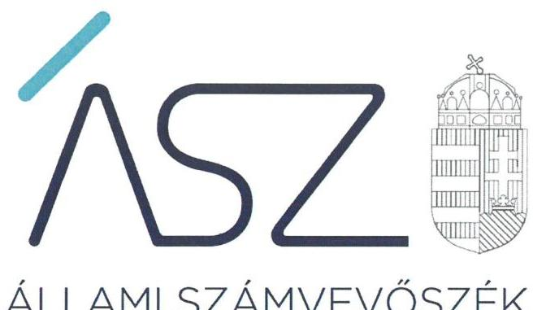
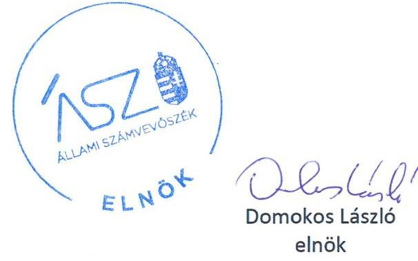

ÁLLAMI SZÁMVEVŐSZÉK

# JELENTÉS 

## Nem állami humánszolgáltatók ellenőrzése

A humánszolgáltatást nyújtó államháztartáson kívüli szociális intézmények, szolgáltatók fenntartói központi költségvetésből kapott támogatásai felhasználásának ellenőrzése -

NAPÁVA Szociálisgondozó Közhasznú Nonprofit Korlátolt Felelősségű Társaság „felszámolás alatt"

2020. 

20051
www.asz.hu

---

ÁLLAMI SZÁMVEVŐSZÉK

# JELENTÉS

## Nem állami humánszolgáltatók ellenőrzése

A humánszolgáltatást nyújtó államháztartáson kívüli szociális intézmények, szolgáltatók fenntartói központi költségvetésből kapott támogatásai felhasználásának ellenőrzése – NAPÁVA Szociálisgondozó Közhasznú Nonprofit Korlátolt Felelősségű Társaság „felszámolás alatt”

2020. 04. hó 07. nap

20051 www.asz.hu

---

# AZ ELLENŐRZÉST FELÜGYELTE: 

MAROZSÁN LÁSZLÓNÉ felügyeleti vezető

## AZ ELLENŐRZÉST VEZETTE ÉS A VÉGREHAJTÁSÁÉRT FELELŐS:

DR. GÁL NÓRA ellenőrzésvezető

A PROGRAM ÖSSZEÁLLÍTÁSÁÉRT FELELŐS:
TÓTPÁL SZABOLCS osztályvezető

IKTATÓSZÁM: EL-2538-001/2020.
TÉMASZÁM: 2491
ELLENŐRZÉS-AZONOSÍTÓ SZÁM: V083517
Jelentéseink az Országgyúlés számítógépes hálózatán és az interneten a www.asz.hu címen is olvashatóak.

---

# TARTALOMJEGYZÉK 

■ ÖSSZEGZÉS ..... 5
■ AZ ELLENŐRZÉS CÉLJA ..... 6
■ AZ ELLENŐRZÉS TERÜLETE ..... 7
■ AZ ELLENŐRZÉS HÁTTERE, INDOKOLTSÁGA ..... 8
■ A JELENTÉS LÉNYEGES KÉRDÉSKÖRE ..... 9
■ AZ ELLENŐRZÉS HATÓKÖRE ÉS MÓDSZEREI ..... 10
■ MEGÁLLAPÍTÁSOK ..... 12
■ JAVASLATOK ..... 14
■ MELLÉKLETEK ..... 15
I. sz. melléklet: Értelmező szótár ..... 15
■ FÜGGELÉK: ÉSZREVÉTELEK ..... 17
■ RÖVIDÍTÉSEK JEGYZÉKE ..... 19

---

.

---

# ÖSSZEGZÉS 

A NAPÁVA Szociálisgondozó Közhasznú Nonprofit Korlátolt Felelősségű Társaság „felszámolás alatt", mint szociális szolgáltatók fenntartója nem teremtette meg a kapott költségvetési támogatások szabályszerű felhasználásának a feltételeit. A közpénzekkel való elszámoltathatóságot nem biztosította.

## Az ellenőrzés társadalmi indokoltsága

Az Állami Számvevőszék stratégiájában célul tűzte ki, hogy az államháztartáson kívülre nyújtott költségvetési támogatások ellenőrzésével hozzájáruljon ahhoz, hogy a közpénzeket az államháztartáson kívüli szervezetek is átlátható módon használják fel a közfeladatok szerződésben vállalt ellátása érdekében. Fontos a közvélemény biztosítása arról, hogy a közpénz államháztartáson kívüli felhasználása ezen a területen sem marad ellenőrizetlenül. Az ellenőrzés eredményeképpen a nyilvánosság és a szolgáltatást igénybe vevők megfelelő tájékoztatást kaphatnak az államháztartáson kívüli közfeladatot ellátó fenntartók működéséről.

## Főbb megállapítások, következtetések, javaslatok

A NAPÁVA Szociálisgondozó Közhasznú Nonprofit Kft. „f.a." a költségvetési támogatások igénybevételének és felhasználásának feltételeit nem alakította ki. A központi költségvetési támogatások igénylési és elszámolási feladatainak ellátása során a 2015-2017. években nem szabályszerűen járt el, mivel a támogatás igénylések és elszámolások könyvviteli nyilvántartásban történő rögzítését nem támasztotta alá szabályszerűen kiállított bizonylatokkal.

A NAPÁVA Szociálisgondozó Közhasznú Nonprofit Kft. „f.a." a szociális szolgáltatók működtetéséhez felhasznált közpénzekre vonatkozó gazdálkodásával a 2015-2017. években a nyilvánosság előtt nem számolt el, mivel nem készített a jogszabályi előírásnak megfelelő közhasznúsági mellékletet.

Az Állami Számvevőszék a NAPÁVA Szociálisgondozó Közhasznú Nonprofit Kft. „f.a." vonatkozásában két javaslatot fogalmazott meg a felszámolóbiztos számára.

---

# AZ ELLENŐRZÉS CÉLJA

**AZ ELLENŐRZÉS CÉLJA** annak értékelése volt, hogy a NAPÁVA Szociálisgondozó Közhasznú Nonprofit Kft. „f.a.”, mint fenntartó központi költségvetésből kapott támogatásainak felhasználása szabályszerű volt-e, a támogatások igénylése, évközi módosítása és év végi elszámolása megfelelte-e a jogszabályi előírásoknak.

---

# AZ ELLENŐRZÉS TERÜLETE 

## NAPÁVA Szociálisgondozó Közhasznú Nonprofit Kft. „f.a."

A NAPÁVA Szociálisgondozó Közhasznú Nonprofit Korlátolt Felelősségű Társaságot 2010. szeptember 30-án alapította egy magánszemély. A Fenntartó ${ }^{1}$ közhasznú jogállással rendelkezett, főtevékenysége idősek, fogyatékosok szociális ellátása és házi segítségnyújtás volt.

A veszprémi székhelyű Fenntartó az ellenőrzött időszakban öt telephelyen végezte tevékenységét. A társaság jegyzett tőkéje az ellenőrzött időszakban 3 M Ft-ról 3,1 M Ft-ra növekedett. A Fenntartó vezető tisztségviselőjének személye az ellenőrzött időszakban nem változott. A Fenntartó felügyelő bizottsága 3 tagú volt.

A Fenntartó beszámolóinak adatai alapján a központi költségvetésből igénybe vett támogatás 2015. évben 111,7 M Ft, 2016. évben 137,4 M Ft, 2017. évben 106,8 M Ft volt.

A Fenntartó 2018. augusztus 23-án felszámolási eljárás megindítása iránti kérelmet nyújtott be a Veszprémi Törvényszékhez, ezt követően a házi segítségnyújtásra vonatkozó tevékenységét megszüntette, a szociális szolgáltatókat a szolgáltatói nyilvántartásból törölték.

---

# AZ ELLENŐRZÉS HÁTTERE, INDOKOLTSÁGA 

A szociális feladatokat ellátó nem állami intézményfenntartók részére közfeladataik ellátására évente jelentős összegű pénzügyi támogatást biztosítottak a mindenkori költségvetési törvények² a bennük megfogalmazott feltételek mellett. Módosították a szociális igazgatásról és szociális ellátásokról szóló 1993. évi III. törvényt, amely 2012. január 1-jei hatállyal megfogalmazta - többek között - a finanszírozási rendszerbe történő befogadással összefüggő szabályokat.

Az ÁSZ³ stratégiájában hangsúlyos szerepet szán annak, hogy szilárd szakmai alapokon álló, értékteremtő ellenőrzéseivel előmozdítsa a közpénzügyek átláthatóságát, rendezettségét, és javaslataival a közpénzek és a közvagyon szabályos, gazdaságos, hatékony és eredményes felhasználását segítse. Az államháztartáson kívülre nyújtott költségvetési támogatások ellenőrzésével az ÁSZ hozzájárul ahhoz, hogy a közpénzeket a nem állami humán fenntartók átlátható módon használják fel a közfeladatok ellátására kötött szerződésekben vállalt kötelezettségek teljesítése érdekében. Az ellenőrzés javaslataival hozzájárulhat az említett rendszerek szabályszerű támogatás felhasználásához, javíthatja a társadalmi-gazdasági döntések megalapozottságát, amely a „jól irányított állam" működéséhez járul hozzá.

---

# A JELENTÉS LÉNYEGES KÉRDÉSKÖRE 

A szociális humánszolgáltató közfeladatot ellátó fenntartó meg-teremtette-e a költségvetési támogatások átlátható, elszámoltatható igénybevételének, felhasználásának feltételeit, az átvállalt szociális humánszolgáltatási közfeladathoz biztosított költségvetési támogatásokat szabályszerűen fordította-e a humánszolgáltatók működtetésére, a közpénzekre vonatkozó gazdálkodásával a nyilvánosság előtt elszámolt-e?

---

# AZ ELLENŐRZÉS HATÓKÖRE ÉS MÓDSZEREI 

## Az ellenőrzés típusa

Megfelelőségi ellenőrzés.

## Az ellenőrzött időszak

A 2015. január 1-je és 2017. december 31-e közötti időszak

## Az ellenőrzés tárgya

Az ellenőrzés a szociális humánszolgáltatási közfeladatokat ellátó államháztartáson kívüli fenntartó humánszolgáltatási közfeladatai ellátásához a költségvetési törvényekben biztosított központi költségvetési támogatások igénylése, évközi módosítása és év végi elszámolása fenntartói feladatainak ellátása, illetve a központi költségvetésből kapott támogatásának humánszolgáltatási közfeladatokra való fenntartó általi felhasználása szabályszerűségének értékelésére terjedt ki.

## Az ellenőrzött szervezet

NAPÁVA Szociálisgondozó Közhasznú Nonprofit Korlátolt Felelősségű Társaság „felszámolás alatt"

## Az ellenőrzés jogalapja

Az ellenőrzés jogszabályi alapját az ÁSZ tv. 1. § (3) bekezdése, 5. § (3) bekezdésben foglalt előírások adják.

## Az ellenőrzés módszerei

Az ellenőrzést az ÁSZ az ellenőrzési program szempontjai, kérdései, az ellenőrzött időszakban hatályos jogszabályok, a nemzetközi standardokat irányadónak tekintve, az ellenőrzés szakmai szabályok és módszertanok figyelembe vételével végezte. A közpénzekkel való felelős gazdálkodás segítésére irányuló javaslatok kidolgozásakor a hatályos jogszabályok voltak az irányadóak.

Az ellenőrzés ideje alatt az ellenőrzött szervezettel történő kapcsolattartás az ÁSZ SZMSZ²-ének vonatkozó előírásai alapján történt.

---

Az ellenőrzési kérdések megválaszolásához szükséges bizonyítékok megszerzése az ellenőrzött által rendelkezésre bocsátott dokumentumokra, adatokra alapozva történt.

Az ellenőrzési bizonyítékként felhasználható adatforrások közé tartoztak egyrészt az ellenőrzési program részletes szempontjainál felsorolt adatforrások, másrészt minden - az ellenőrzés folyamán feltárt, - az ellenőrzés szempontjából információt tartalmazó dokumentum.

Az ellenőrzés lefolytatásához az ellenőrzött szervezet a kitöltött tanúsítványok, valamint az ÁSZ által kért dokumentumok elektronikus úton való megküldésével szolgáltatott adatokat, információkat. Az így rendelkezésre bocsátott adatok, információk és a tanúsítványok adatai valódiságának kontrollja az ellenőrzés keretében megtörtént.

A szociális humánszolgáltatások központi költségvetési támogatásai igénylésére, módosítására, elszámolására, államháztartáson kívüli fenntartó jogszabályokban előírt feladatai betartására, továbbá a központi költségvetési támogatások szabályszerű kezelésére, nyilvántartására irányult az ellenőrzés a fenntartónál, az ott rendelkezésre álló határozatok, nyilvántartások, beszámolók és egyéb dokumentumok alapján.

Az ellenőrzés nem terjedt ki a szociális humánszolgáltatások központi költségvetési támogatásai igénylése, módosítása, elszámolása valódiságának, megalapozottságának, helyességének értékelésére. Továbbá nem terjedt ki az ellenőrzés a költségvetési források szabályszerű felhasználásának értékelésére.

---

# MEGÁLLAPÍTÁSOK 

## A szociális humánszolgáltató közfeladatot ellátó fenntartó megteremtette-e a költségvetési támogatások átlátható, elszámoltatható igénybevételének, felhasználásának feltételeit, az átvállalt szociális humánszolgáltatási közfeladathoz biztosított költségvetési támogatásokat szabályszerűen fordította-e a humánszolgáltatók működtetésére, a közpénzekre vonatkozó gazdálkodásával a nyilvánosság előtt elszámolt-e?

Összegző megállapítás

A Fenntartó nem teremtette meg a költségvetési támogatások igénybevételének és felhasználásának feltételeit, a szociális szolgáltatók működtetéséhez felhasznált közpénzekre vonatkozó gazdálkodásával a nyilvánosság előtt nem számolt el.

### 1.1. számú megállapítás

A Fenntartó a szociális humánszolgáltatási közfeladat ellátásának belső szabályozási kereteit nem alakította ki, a szociális humánszolgáltatási feladatai ellátásához biztosított költségvetési támogatások felhasználásának elszámoltathatóságát nem biztosította.

A Fenntartó a 2016-2017. években nem rendelkezett Számviteli politikával, így nem tett eleget a Számv. tv. ${ }^{5}$ 14.§ (3)-(4) bekezdéseiben előírt kötelezettségének.

A Számviteli politikához kapcsolódó, a gazdálkodást meghatározó belső szabályzatok közül a Fenntartó 2016-2017. években a Számv. tv. 14. § (5) bekezdés a) és b) pontjaival ellentétesen nem készítette el az Eszközök és források értékelési szabályzatát és az Eszközök és források leltárkészítési és leltározási szabályzatát. A Pénzkezelési szabályzatban a fióktelepek megváltozott címei nem kerültek átvezetésre, ezzel a Fenntartó képviseletére jogosult személy nem tett eleget a Számv. tv. 14. § (12) bekezdésében foglalt szabályzat módosítási kötelezettségének. Számlarenddel a Fenntartó az ellenőrzött időszakban nem rendelkezett, ezzel megsértette a Számv. tv. 161. §-ában foglalt előírásokat.

A Fenntartó a Számviteli politika és a Számlarend hiányában az Atr. ${ }^{6}$ 16. § (1) bekezdésének előírásával ellentétesen nem gondoskodott a Fenntartó és a nem önállóan gazdálkodó egyes szolgáltatók gazdálkodásának elkülönített kezeléséről, így nem biztosította a kapott költségvetési támogatás szabályszerű felhasználásának feltételeit.

A Fenntartó a központi költségvetési támogatások igénylési és elszámolási feladatait a 2015-2017. években nem szabályszerűen végezte, mivel a támogatás igénylésével és elszámolásával kapcsolatos gazdasági események a könyvviteli nyilvántartásban történő rögzítését nem támasztotta alá szabályszerűen kiállított bizonylatokkal. Ezzel a Fenntartó megsértette a

---

1.2. számú megállapítás

Számv. tv. 165.§ (2) bekezdésében foglaltakat és nem biztosította a támogatások felhasználásának az elszámoltathatóságát.

A Fenntartó a szociális szolgáltatók működtetéséhez felhasznált közpénzekre vonatkozó gazdálkodásával a nyilvánosság előtt nem számolt el, a külső ellenőrzésekkel kapcsolatos intézkedési feladatait nem szabályszerűen látta el.

A Fenntartó 2015. évben mikrogazdálkodói egyszerűsített éves beszámoló készítésével, 2016-2017. években egyszerűsített éves beszámoló készítésével tett eleget a beszámolási kötelezettségének.

A Fenntartó az ellenőrzött időszakban a beszámolóit határidőben letétbe helyezte a Számv. tv. 153. § (1) bekezdés előírásainak megfelelően, azonban nem tett eleget a Civil tv. ${ }^{7}$ 46. §-ban foglalt előírásnak, mivel nem készített a 350/2011. (XII. 30.) Korm. rendelet ${ }^{8}$ 1. § (4) bekezdésére tekintettel a 12.§ (1) bekezdésében előírtaknak megfelelő közhasznúsági mellékletet.

A NRSZH ${ }^{9}$ az ellenőrzött fenntartásában lévő szociális szolgáltatóknál 2016-ban végzett helyszíni ellenőrzéseket. A Fenntartó a Hatóság ${ }^{10}$ által előírt, hiányosságok és jogszabálysértések megszüntetése iránti intézkedési kötelezettségének nem minden ellenőrzéshez kapcsolódóan tett eleget.

---

# JAVASLATOK 

Az ÁSZ tv. 33. § (1) bekezdésében foglaltak értelmében az ellenőrzött szervezet vezetője köteles a jelentésben foglalt megállapításokhoz kapcsolódó intézkedési tervet összeállítani és azt a jelentés kézhezvételétől számított 30 napon belül az ÁSZ részére megküldeni. Amennyiben az ellenőrzött szervezet vezetője nem küldi meg határidőben az intézkedési tervet, vagy továbbra sem elfogadható intézkedési tervet küld, az Állami Számvevőszék elnöke az ÁSZ tv. 33. § (3) bekezdés a) és b) pontjaiban foglaltakat érvényesítheti.

## NAPÁVA Szociálisgondozó Közhasznú Nonprofit Korlátolt felelősségű Társaság „felszámolás alatt" felszámolójának

1. Gondoskodjon a Számv. tv. előírásai szerint
a) a számviteli politika,
b) az eszközök és források értékelési szabályzata,
c) az eszközök és források leltárkészítési és leltározási szabályzata és a számlarend elkészítéséről
(1.1. sz. megállapítás 1. bekezdés és a 2. bekezdés 1. mondata alapján)
2. Gondoskodjon a jogszabályi előírásnak megfelelő közhasznúsági melléklet elkészítéséről és közzétételéről
(1.2.
 sz. megállapítás 2. bekezdése alapján)

---

# MELLÉKLETEK 

- I. SZ. MELLÉKLET: ÉRTELMEZŐ SZÓTÁR
befogadás
humánszolgáltatás
költségvetési támogatás
közfeladat
nem állami, nem önkormányzati (államháztartáson kívüli) intézmény fenntartó
telephely

A Szoctv. illetve a Gyvt. szerinti, a szociális szolgáltatások és a gyermekjóléti szolgáltató tevékenységek területi lefedettségét figyelembe vevő finanszírozási rendszerbe történő befogadás.
Külön törvényekben meghatározott szociális, gyermekjóléti, gyermekvédelmi, közoktatási, felsőoktatási, kulturális közfeladatok.
A társadalombiztosítás pénzügyi alapjai kivételével az államháztartás központi alrendszeréből ellenérték nélkül, pénzben nyújtott támogatások (Áht. ${ }^{11}$ 1. § 14. pont) A költségvetési törvényekben (2014. évi C. törvény 42-43. §, 2015. évi C. törvény 40-41. §, 2016. évi XC. törvény 40-41. §) megállapított támogatás.
„Közfeladat a jogszabályokban meghatározott állami vagy önkormányzati feladat. ... A közfeladatok ellátásában államháztartáson kívüli szervezet jogszabályban meghatározott rendben közreműködhet." A közfeladatok meghatározó jogszabályban meg kell határozni a közfeladat ellátásának módját és egyidejűleg rendezni kell annak az ellátásához
szükséges pénzügyi fedezet biztosításáról. (Az államháztartásról szóló 2011. évi CXCV. törvény 3/A. § (1)-(3) bekezdés)
A szociális, gyermekjóléti és gyermekvédelmi közfeladatokat/humánszolgáltatásokat ellátó intézményt/szolgáltatót fenntartó egyházi jogi személy, társadalmi szervezet, alapítvány, közalapítvány, civil szervezet, országos nemzetiségi önkormányzat, nonprofit gazdasági társaság, gazdasági társaság és a humánszolgáltatást alaptevékenységként végző, Szja tv. hatálya alá tartozó egyéni vállalkozó. (2015. évi Kvtv. 42. §, 43. § (1) bekezdés, 2016. évi Kvtv. ${ }^{12} 40 . \S, 41 . \S$ (1) bekezdés, 2017. évi Kvtv. ${ }^{13} 40 . \S, 41$. § (1) bekezdés)
a szolgáltató székhelyétől különböző, szolgáltató/intézmény használatában álló hely, a szociális humánszolgáltatáshoz használt, bejegyzett hely. (Sznyvhr. 1.§ I) pont) (hatályos: 2015. január 1-jétől)

---

.

---

# FÜGGELÉK: ÉSZREVÉTELEK 

A jelentéstervezetet a Számvevőszék 15 napos észrevételezésre megküldte az ellenőrzött szervezet vezetőjének az ÁSZ tv. 29. § (1) bekezdése előírásának megfelelően.

A NAPÁVA Szociálisgondozó Közhasznú Nonprofit Korlátolt Felelősségű Társaság „felszámolás alatt" felszámolója a jelentéstervezet megállapításaira nem tett észrevételt.

[^0]
[^0]:    * 29. § (1) Az Állami Számvevőszék az ellenőrzési megállapításait megküldi az ellenőrzött szervezet vezetőjének vagy az általa megbízott személynek, és annak, akinek személyes felelősségét állapította meg.
    (2) Az ellenőrzött szervezet vezetője és a felelősként megjelölt személy az ellenőrzés megállapításaira tizenöt napon belül írásban észrevételt tehet.
    (3) Az Állami Számvevőszék az észrevételre a beérkezésétől számított harminc napon belül írásban válaszol. A figyelembe nem vett észrevételeket köteles a jelentésben feltüntetni, és megindokolni, hogy azokat miért nem fogadta el.

---

.

---

# RÖVIDÍTÉSEK JEGYZÉKE 

${ }^{1}$ Fenntartó
${ }^{2}$ költségvetési törvények
${ }^{3}$ ÁSZ
${ }^{4}$ SZMSZ
${ }^{5}$ Számv. tv.
${ }^{6}$ Atr.
${ }^{7}$ Civil tv.
${ }^{8}$ 350/2011. (XII. 30.) Korm. rendelet
${ }^{9}$ NRSZH
${ }^{10}$ Hatóság
${ }^{11}$ Áht.
${ }^{12}$ 2016. évi Kvtv.
${ }^{13}$ 2017. évi Kvtv.

NAPÁVA Szociálisgondozó Közhasznú Nonprofit Korlátolt Felelősségű Társaság „felszámolás alatt"
Magyarország 2015. évi központi költségvetéséről szóló 2014. évi C. törvény (hatályos: 2015. január 1-jétől 2018. december 31-éig)
Magyarország 2016. évi központi költségvetéséről szóló 2015. évi C. törvény (hatályos: 2015. július 4-étől)
Magyarország 2017. évi központi költségvetéséről szóló 2016. évi XC. törvény (hatályos: 2016. november 1-jétől)
Állami Számvevőszék
Szervezeti és Működési Szabályzat
2000. évi C. törvény a számvitelről

489/2013. (XII.18.) Korm. rendelet az egyházi és nem állami fenntartású szociális, gyermekjóléti és gyermekvédelmi szolgáltatók, intézmények és hálózatok állami támogatásáról
2011. évi CLXXV. törvény az egyesülési jogról, a közhasznú jogállásról, valamint a civil szervezetek működéséről és támogatásáról
a civil szervezetek gazdálkodása, az adománygyűjtés és a közhasznúság egyes kérdéseiről
Nemzeti Rehabilitációs és Szociális Hivatal
Nemzeti Rehabilitációs és Szociális Hivatal
2011. évi CXCV. törvény az államháztartásról (hatályos: 2011. december 31-től)
2015. évi C. törvény Magyarország 2016. évi központi költségvetéséről
2016. évi XC. törvény Magyarország 2017. évi központi költségvetéséről

---

# ASZ 

ÁLLAMI SZÁMVEVŐSZÉK
1052 Budapest, Apáczai Cs. J. u. 10. I 1364 Budapest 4. Pf. 54 TEL: +36 14849100
email: szamvevoszek@asz.hu
web: www.asz.hu | www.aszhirportal.hu

